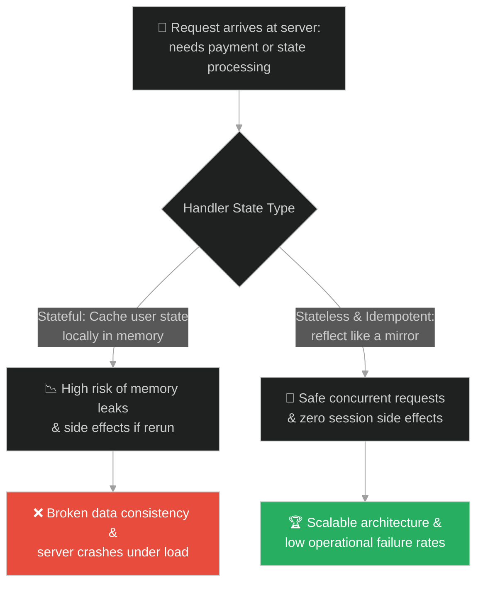
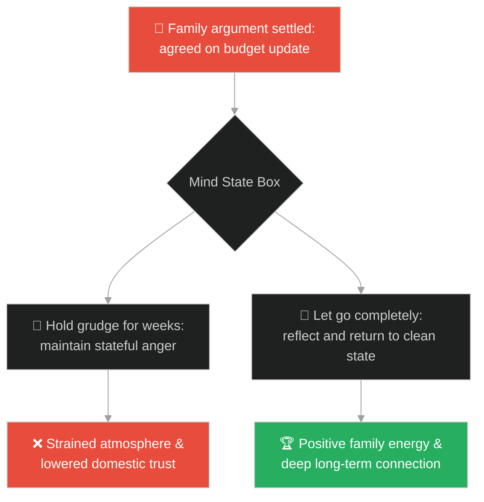
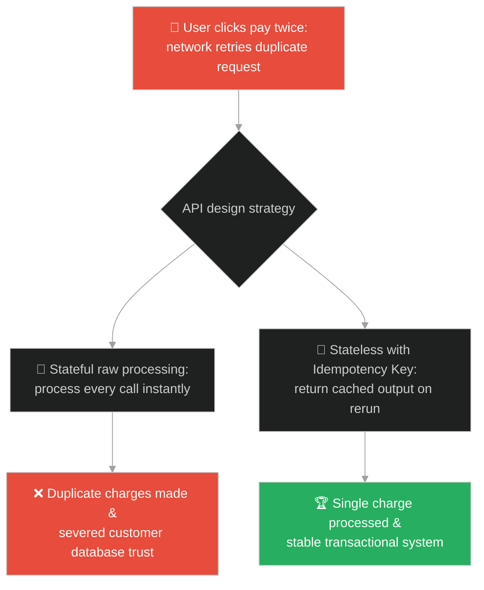
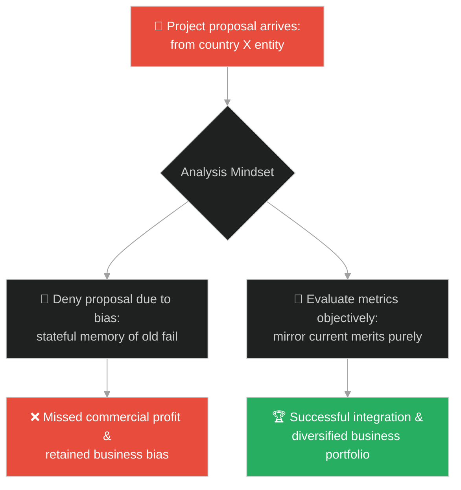
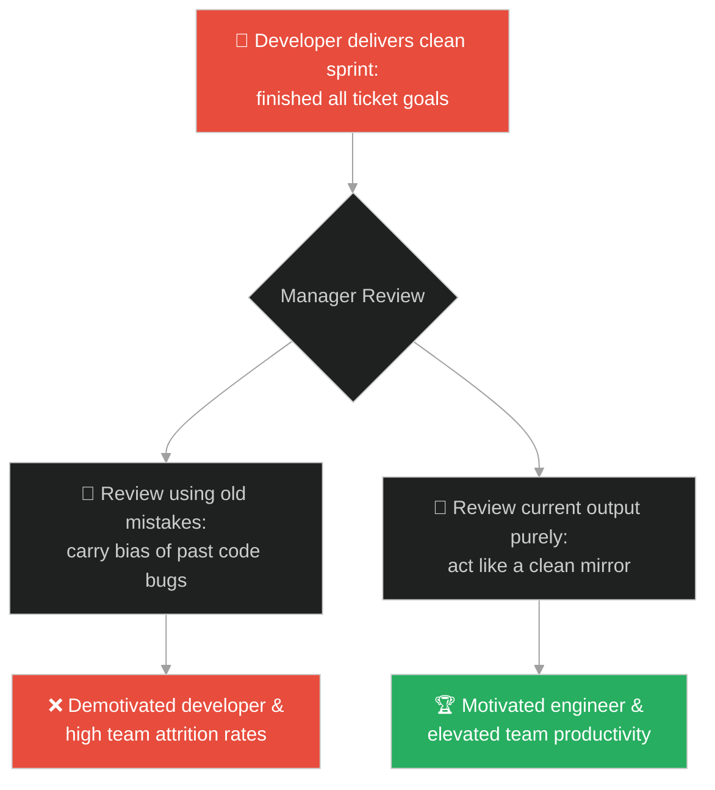
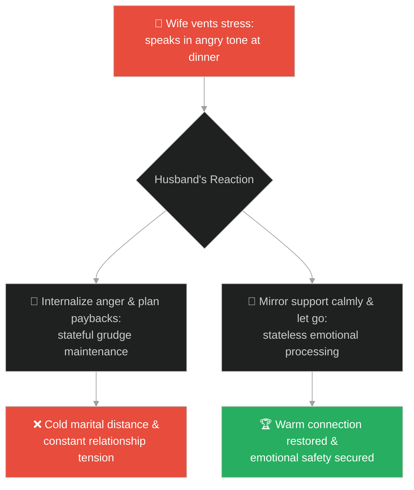
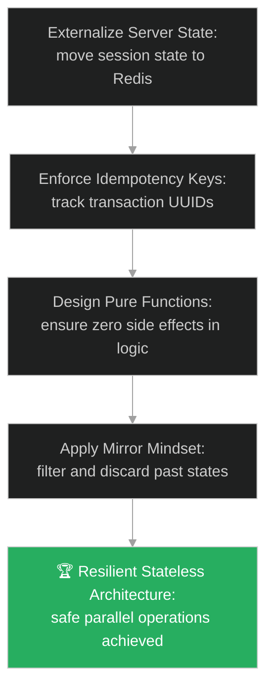

# Stateless Processing & Idempotency (ប្រព័ន្ធគ្មានស្ថានភាព និងការបំពេញបែបដដែលៗបានជោគជ័យ)៖ ចិត្តដូចជាកញ្ចក់ (Stateless Processing & Idempotency & The Mind Like a Mirror)

**Author:** ichamrong  
**Date:** 2026-05-28  
**Tags:** #buddhism #statelessness #idempotency #system-design #mindfulness #decoupling #memory-leak  
**Category:** Concepts / Parables  
**Read Time:** ~15 min  

---

## 📌 មាតិកា (Table of Contents)
- [អន្ទាក់ផ្លូវចិត្ត (The Trap)](#0)
- [១. រឿងព្រេងប្រវត្តិសាស្ត្រ៖ ចិត្តដូចជាកញ្ចក់ថ្លា (The Legend of the Mind Like a Mirror)](#1)
  - [ការឆ្លុះបញ្ចាំងដោយគ្មានការទាក់ទាញ (Reflecting Without Attachment)](#1-1)
- [២. បញ្ហា៖ ការលេចធ្លាយការចងចាំ និងភាពមិនស៊ីសង្វាក់គ្នានៃទិន្នន័យ (The Issue: Stateful Coupling and Memory Leaks)](#2)
- [៣. ឧទាហមណ៍ជាក់ស្តែងក្នុងពិភពពិត (Real World Examples)](#3)
  - [ឧទាហរណ៍ទី ១ — កម្រិតស្រាល (គ្រួសារ)៖ ការលះបង់កំហឹងក្រោយពេលឈ្លោះគ្នា (Letting Go of Family Disagreements Completely)](#3-1)
  - [ឧទាហរណ៍ទី ២ — កម្រិតមធ្យម (បច្ចេកទេស)៖ ការរចនា API គ្មានស្ថានភាព និងមានស្ថេរភាព (Implementing Stateless and Idempotent APIs)](#3-2)
  - [ឧទាហរណ៍ទី ៣ — កម្រិតមធ្យម (ធុរកិច្ច)៖ ការវាយតម្លៃគម្រោងថ្មីដោយសត្យានុម័ត (Evaluating New Business Proposals Objectively)](#3-3)
  - [ឧទាហរណ៍ទី ៤ — កម្រិតមធ្យម (សង្គម/គ្រប់គ្រង)៖ ការវាយតម្លៃការងារបុគ្គលិកដោយគ្មានការលម្អៀង (Evaluating Team Sprints Purely on Objective Data)](#3-4)
  - [ឧទាហរណ៍ទី ៥ — កម្រិតធ្ងន់ (ទំនាក់ទំនង)៖ ការឆ្លើយតបនឹងអារម្មណ៍ដៃគូដោយមិនចងចិត្តខឹង (Reflecting Partner's Mood Without Carrying a Grudge)](#3-5)
- [៤. ដំណោះស្រាយទូទៅ៖ ការរចនាប្រព័ន្ធបែប Stateless និង Idempotent (The General Solution: Building Decoupled Services and Zero-Side-Effect Logic)](#4)
- [សេចក្តីសន្និដ្ឋាន (Conclusion)](#5)
- [ឯកសារយោង (References)](#6)
- [Related Posts](#7)

---

<a id="0"></a>
## អន្ទាក់ផ្លូវចិត្ត (The Trap)

តើអ្នកធ្លាប់ជួបស្ថានភាពដែលប្រព័ន្ធបច្ចេកវិទ្យាដំណើរការខុសប្រក្រតី ឬលេចធ្លាយការចងចាំ (Memory Leak) ព្រោះសេវាកម្មរក្សាទុកព័ត៌មានស្ថានភាព (State) របស់អតិថិជនម្នាក់ រួចយកទៅលាយឡំជាមួយអតិថិជនម្នាក់ទៀត ឬវិស្វករដែលមិនព្រមបញ្ចេញកូដថ្មីព្រោះចងចិត្តខឹងនឹងកំហុសរបស់មិត្តរួមការងារកាលពីសប្តាហ៍មុនដែរឬទេ?

នៅក្នុងជីវិត និងស្ថាបត្យកម្មប្រព័ន្ធ៖
* **យើងងាយនឹងធ្លាក់ក្នុងអន្ទាក់** នៃការចងចាំ និងរក្សាទុកព័ត៌មានស្ថានភាព (Stateful Coupling) ដែលប្រៀបដូចជាការរក្សាស្នាមប្រឡាក់ ឬធូលីនៅលើផ្ទៃកញ្ចក់។ យើងអនុញ្ញាតឱ្យព័ត៌មានចាស់ៗមកជះឥទ្ធិពល ឬបង្កើតផលប៉ះពាល់ចំហៀង (Side Effects) ដល់ដំណើរការបច្ចុប្បន្ន។
* **យើងមើលរំលង** សារៈសំខាន់នៃដំណើរការគ្មានស្ថានភាព (Stateless Processing) ដែលឆ្លុះបញ្ចាំងការពិតភ្លាមៗដោយគ្មានការលម្អៀង ឬការរក្សាទុកកម្ទេចកំទីចាស់ៗ ដូចជាកញ្ចក់ថ្លាដែលស្អាតជានិច្ចនៅពេលវត្ថុចាកចេញទៅ។

ការរក្សាទុកព័ត៌មានចាស់ដែលបង្កើតជាផលប៉ះពាល់ដល់ដំណើរការថ្មី ហៅថា **អន្ទាក់ចងចាំស្ថានភាព (The Stateful Trap)**។

ដើម្បីយល់ដឹងពីរបៀបរចនាប្រព័ន្ធគ្មានស្ថានភាព នេះជាផែនទីបង្ហាញផ្លូវ៖
1. **រឿងព្រេងនិទាន (The Legend)** — រឿងរ៉ាវរបស់ព្រះពុទ្ធដែលសម្តែងប្រៀបធៀបចិត្តរបស់អរិយបុគ្គលទៅនឹងកញ្ចក់ ដែលឆ្លុះបញ្ចាំងរាល់វត្ថុទាំងអស់ដោយគ្មានការទាក់ទាញ ឬរក្សាទុកស្នាមប្រឡាក់។
2. **បញ្ហា (The Issue)** — ការវិភាគភាពស្មុគស្មាញនៃ Stateful Systems និងសារៈសំខាន់នៃ Idempotency ក្នុងប្រព័ន្ធចែកចាយ (Distributed Systems)។
3. **ឧទាហមណ៍ជាក់ស្តែងក្នុងពិភពពិត (Real World Examples)** — ពិនិត្យមើលបញ្ហានេះក្នុងកម្រិតគ្រួសារ បច្ចេកវិទ្យា ធុរកិច្ច ការគ្រប់គ្រង និងទំនាក់ទំនង។
4. **ដំណោះស្រាយទូទៅ (The General Solution)** — ការបង្កើត APIs គ្មានស្ថានភាព (Stateless APIs) និងយន្តការដំណើរការដដែលៗដោយសុវត្ថិភាព (Idempotent API Handlers)។



---

<a id="1"></a>
## ១. រឿងព្រេងប្រវត្តិសាស្ត្រ៖ ចិត្តដូចជាកញ្ចក់ថ្លា (The Legend of the Mind Like a Mirror)

ថ្ងៃមួយ ព្រះសម្មាសម្ពុទ្ធទ្រង់បានត្រាស់សួរភិក្ខុទាំងឡាយ អំពីលក្ខណៈនៃកញ្ចក់ថ្លា។ ព្រះអង្គមានសង្ឃដីកាពន្យល់ថា៖
> «ភិក្ខុទាំងឡាយ! កញ្ចក់ថ្លា តែងតែឆ្លុះបញ្ចាំងរាល់វត្ថុទាំងឡាយដែលមកឈរនៅពីមុខវា មិនថាវត្ថុនោះស្រស់ស្អាត ឬអាក្រក់ឡើយ។ វាមិនមានភាពលម្អៀង មិនជ្រើសរើស និងមិនរត់គេចឡើយ។»

---

<a id="1-1"></a>
### การឆ្លុះបញ្ចាំងដោយគ្មានការទាក់ទាញ (Reflecting Without Attachment)

ព្រះពុទ្ធទ្រង់បានបន្តសម្តែងធម៌ថា៖
> «នៅពេលដែលវត្ថុនោះដើរចេញទៅបាត់ កញ្ចក់នឹងត្រលប់មកសភាពទំនេរស្អាតដដែលវិញភ្លាមៗ។ វាមិនរក្សាទុកនូវរូបភាពចាស់ មិនចងចិត្តស្រលាញ់វត្ថុល្អ និងមិនចងចិត្តខឹងនឹងវត្ថុអាក្រក់ឡើយ។ វាមិនទុកឱ្យមានស្នាមប្រឡាក់ ឬការចងចាំណាមួយមកជាប់លើផ្ទៃរបស់វាឡើយ។»

ព្រះអង្គបានដាស់តឿនភិក្ខុទាំងឡាយឱ្យបណ្តុះចិត្តដូចជាកញ្ចក់នេះ៖
> «ចិត្តរបស់អរិយបុគ្គលក៏ដូច្នោះដែរ។ ត្រូវទទួលស្គាល់ និងឆ្លុះបញ្ចាំងការពិតជុំវិញខ្លួនដោយសតិ។ កាលណាអារម្មណ៍ ឬរឿងរ៉ាវទាំងឡាយកន្លងផុតទៅ ចូរដោះលែងវាឱ្យទៅតាមធម្មជាតិ ដោយមិនត្រូវចងទុកឱ្យក្លាយជាធូលីដី ឬបំណុលផ្លូវចិត្តដែលបំផ្លាញសន្តិភាពនៃចិត្តឡើយ។»

---

<a id="2"></a>
## ២. បញ្ហា៖ ការលេចធ្លាយការចងចាំ និងភាពមិនស៊ីសង្វាក់គ្នានៃទិន្នន័យ (The Issue: Stateful Coupling and Memory Leaks)

នៅក្នុងស្ថាបត្យកម្មមីក្រូសេវាកម្ម (Microservices) ការរចនាប្រព័ន្ធឱ្យរក្សាទុកទិន្នន័យស្ថានភាពរបស់អតិថិជននៅក្នុងអង្គចងចាំរបស់ម៉ាស៊ីនបម្រើ (Stateful Servers) គឺជាប្រភពនៃបញ្ហាដ៏ធំធេង។ ប្រសិនបើម៉ាស៊ីនបម្រើនោះគាំង ព័ត៌មាន session របស់អតិថិជនទាំងអស់នឹងត្រូវបាត់បង់។ លើសពីនេះ ប្រសិនបើអតិថិជនផ្ញើសំណើដដែលៗពីរដង (Duplicate Request) វាអាចបណ្តាលឱ្យប្រព័ន្ធដកប្រាក់របស់ពួកគេពីរដង។

នេះជាកូដដែលមានស្ថានភាព និងខ្វះស្ថេរភាព៖

```java
// ឧទាហរណ៍នៃប្រព័ន្ធទូទាត់ប្រាក់ដែលមានស្ថានភាព (Stateful & Fragile)
public class StatefulPaymentProcessor {
    private double lastProcessedAmount = 0; // Instance level state
    
    public void processPayment(double amount) {
        // អន្ទាក់៖ ការរក្សាទុក state នៅក្នុង instance variable ធ្វើឱ្យមិនអាច run concurrent បានឡើយ
        this.lastProcessedAmount = amount;
        executeDeduct(amount);
    }
    
    private void executeDeduct(double amount) {
        System.out.println("Deducted amount: " + amount);
    }
}

// ដំណោះស្រាយ៖ ការរចនាគ្មានស្ថានភាព និងធានា Idempotency (Stateless & Idempotent)
public class StatelessPaymentProcessor {
    private final Set<String> processedTransactions = new ConcurrentHashSet<>();
    
    public synchronized String processPaymentIdempotent(String transactionId, double amount) {
        if (processedTransactions.contains(transactionId)) {
            // សំឡេងឆ្លុះត្រឡប់មកវិញដូចកញ្ចក់៖ ផ្តល់លទ្ធផលចាស់ដោយគ្មាន side effect ថ្មី
            return "Transaction already processed: " + transactionId;
        }
        executeDeduct(amount);
        processedTransactions.add(transactionId);
        return "Payment processed successfully: " + amount;
    }
    
    private void executeDeduct(double amount) {
        System.out.println("Deducted amount: " + amount);
    }
}
```

* **ការលំបាកក្នុងការវាស់ស្ទង់សមត្ថភាព (Horizontal Scaling Failure)៖** យើងមិនអាចបន្ថែមម៉ាស៊ីនបម្រើថ្មីៗដោយងាយឡើយ ព្រោះសំណើរបស់អតិថិជនត្រូវតែបញ្ជូនទៅកាន់ម៉ាស៊ីនតែមួយគត់ដែលរក្សាទុក session របស់ពួកគេ (Session Sticky)។
* **ការលេចធ្លាយទិន្នន័យ និង memory leak៖** ព័ត៌មានចាស់ៗដែលលែងប្រើនៅតែជាប់ក្នុង memory ធ្វើឱ្យ server ដើរយឺតទៅៗ និងគាំងជារៀងរាល់សប្តាហ៍។

---

<a id="3"></a>
## ៣. ឧទាហមណ៍ជាក់ស្តែងក្នុងពិភពពិត

---

<a id="3-1"></a>
### ឧទាហរណ៍ទី ១ — កម្រិតស្រាល (គ្រួសារ)៖ ការលះបង់កំហឹងក្រោយពេលឈ្លោះគ្នា (Letting Go of Family Disagreements Completely)

សមាជិកគ្រួសារមានការប្រកែកគ្នាលើការចំណាយក្នុងផ្ទះ។ ក្រោយពេលដោះស្រាយ និងព្រមព្រៀងគ្នាហើយ ពួកគេបានលុបបំបាត់អារម្មណ៍អន់ចិត្តទាំងអស់ (ចិត្តដូចកញ្ចក់ដែលលុបរូបភាពចាស់) និងញញឹមរកគ្នាធម្មតា មិនរក្សាកំហឹងទុកដើម្បីរអ៊ូរទាំនៅថ្ងៃបន្ទាប់ឡើយ។



---

<a id="3-2"></a>
### ឧទាហរណ៍ទី ២ — កម្រិតមធ្យម (បច្ចេកទេស)៖ ការរចនា API គ្មានស្ថានភាព និងមានស្ថេរភាព (Implementing Stateless and Idempotent APIs)

ប្រព័ន្ធធនាគារបង្កើតសេវាកម្មផ្ទេរប្រាក់។ ដោយសារការប្រើប្រាស់ពិធីការគ្មានស្ថានភាព (Stateless JSON Web Tokens - JWT) និងការកំណត់ UUID សម្រាប់រាល់ប្រតិបត្តិការផ្ទេរប្រាក់ (Idempotency Key) ពួកគេធានាថាទោះជាអ្នកប្រើប្រាស់ចុចប៊ូតុងផ្ញើប្រាក់ ៥ ដងក៏ដោយ ក៏ប្រាក់ត្រូវបានកាត់តែម្តងគត់ដោយគ្មានបញ្ហា។



---

<a id="3-3"></a>
### ឧទាហរណ៍ទី ៣ — កម្រិតមធ្យម (ធុរកិច្ច)៖ ការវាយតម្លៃគម្រោងថ្មីដោយសត្យានុម័ត (Evaluating New Business Proposals Objectively)

នាយកក្រុមហ៊ុនម្នាក់ធ្លាប់មានបទពិសោធន៍បរាជ័យក្នុងការសហការជាមួយក្រុមហ៊ុនមកពីប្រទេស X។ នៅពេលមានសំណើគម្រោងថ្មីល្អបំផុតពីក្រុមហ៊ុនផ្សេងទៀតក្នុងប្រទេសដដែលនោះ គាត់បានវាយតម្លៃគម្រោងនោះដោយសត្យានុម័ត និងផ្អែកលើតួរលេខជាក់ស្តែង (កញ្ចក់ឆ្លុះរូបបច្ចុប្បន្ន) មិនយកការចងចាំចាស់មកបិទផ្លូវការលូតលាស់ឡើយ។



---

<a id="3-4"></a>
### ឧទាហរណ៍ទី ៤ — កម្រិតមធ្យម (សង្គម/គ្រប់គ្រង)៖ ការវាយតម្លៃការងារបុគ្គលិកដោយគ្មានការលម្អៀង (Evaluating Team Sprints Purely on Objective Data)

ប្រធានក្រុមការងារម្នាក់វាយតម្លៃលទ្ធផលការងារ Sprint របស់វិស្វករម្នាក់។ ទោះជាវិស្វករនោះធ្លាប់បង្កកំហុសធំកាលពីខែមុន ក៏ប្រធានក្រុមវាយតម្លៃលទ្ធផលបច្ចុប្បន្នដោយផ្អែកលើការសម្រេចបានជាក់ស្តែង គ្មានការលម្អៀង ឬការស្តីបន្ទោសរឿងចាស់ ដែលជួយជម្រុញស្មារតីការងារបុគ្គលិកយ៉ាងខ្លាំង។



---

<a id="3-5"></a>
### ឧទាហរណ៍ទី ៥ — កម្រិតធ្ងន់ (ទំនាក់ទំនង)៖ ការឆ្លើយតបនឹងអារម្មណ៍ដៃគូដោយមិនចងចិត្តខឹង (Reflecting Partner's Mood Without Carrying a Grudge)

នៅពេលប្រពន្ធមានអារម្មណ៍មិនល្អ និងរអ៊ូរទាំខ្លះ ប្តីបានស្តាប់ និងឆ្លុះបញ្ចាំងការយោគយល់ (ដូចកញ្ចក់ឆ្លុះរូបភាព)។ នៅពេលនាងស្ងប់ចិត្តវិញ គាត់ក៏ត្រលប់មកសភាពរីករាយធម្មតា មិនរក្សាកំហឹង ឬគុំទុកដើម្បីសងសឹកនៅពេលក្រោយឡើយ។



---

<a id="4"></a>
## ៤. ដំណោះស្រាយទូទៅ៖ ការរចនាប្រព័ន្ធបែប Stateless និង Idempotent (The General Solution: Building Decoupled Services and Zero-Side-Effect Logic)

ដើម្បីលុបបំបាត់ការលេចធ្លាយទិន្នន័យ និងបង្កើតប្រព័ន្ធដែលមានសមត្ថភាពវាស់ស្ទង់ខ្ពស់ ចូរអនុវត្តយន្តការដូចខាងក្រោម៖



* **ការបំបែកស្ថានភាពចេញពីម៉ាស៊ីនបម្រើ (Externalize State)៖** កុំរក្សាទុក session ឬព័ត៌មានអតិថិជននៅក្នុងអង្គចងចាំរបស់ server ផ្ទាល់។ ប្រើប្រាស់សេវាកម្មខាងក្រៅដែលមានល្បឿនលឿនដូចជា Redis ឬប្រើប្រាស់ Client-side tokens (JWT) ដើម្បីរក្សាទុកស្ថានភាព។
* **ការធានា Idempotency ក្នុងរាល់ប្រតិបត្តិការផ្លាស់ប្តូរទិន្នន័យ (Idempotence Enforcement)៖** រាល់សំណើដែលកែប្រែទិន្នន័យ (POST, PUT, DELETE) ត្រូវតែភ្ជាប់មកជាមួយនូវ Idempotency Key ជានិច្ច ដើម្បីការពារការដំណើរការស្ទួន។
* **គោលការណ៍កញ្ចក់ថ្លាក្នុងការងារ និងជីវិត (The Mirror Mind Rule)៖**
  1. **កុំរក្សាស្នាមប្រឡាក់**៖ ឈប់យកកំហុសចាស់ៗរបស់មិត្តរួមការងារ ឬបញ្ហាកាលពីសប្តាហ៍មុនមកលាយឡំជាមួយនឹងការពិនិត្យការងារបច្ចុប្បន្ន។
  2. **សេរីភាពគ្មានស្ថានភាព**៖ ដោះស្រាយរាល់កិច្ចការនីមួយៗឱ្យចប់ និងដោះលែងវាចោលភ្លាមៗ ដើម្បីរក្សាបាននូវភាពស្អាតស្អំ និងថាមពលការងារខ្ពស់ជានិច្ច។

---

## 🐇 ធ្លាក់ចូលក្នុងរន្ធទន្សាយ (Enter the Rabbit Hole)

ដើម្បីបញ្ចប់ដំណើររុករកនៃ Batch 15 និងស្វែងយល់ពីរបៀបដែលរាល់អ្វីៗទាំងអស់ត្រូវបានកំណត់ទុកដោយច្បាប់ធម្មជាតិ និងការរៀបចំទុកជាមុន ជួយឱ្យយើងមិនចាំបាច់មានការស្តាយក្រោយ ឬសោកសង្រេង សូមចាប់ផ្តើមដំណើររុករករបស់អ្នកដោយចុចលើតំណភ្ជាប់ខាងក្រោម៖

* 🚀 **[ចាប់ផ្តើមដំណើររុករក (Start the Journey) ➔ ការទទួលយកការពិត និងច្បាប់នៃសកលលោក (Acceptance of Reality & The Already Broken Glass)](./140-buddha-and-the-already-broken-glass.md)**

---

<a id="5"></a>
## សេចក្តីសន្និដ្ឋាន (Conclusion)

> **«កញ្ចក់ឆ្លុះរូបភាពដោយមិនលម្អៀង និងត្រលប់មកសភាពស្អាតទំនេរស្អាតវិញភ្លាមៗនៅពេលរូបនោះចាកចេញ។ ចិត្ត និងប្រព័ន្ធដែលគ្មានស្ថានភាព គឺជាអាថ៌កំបាំងនៃស្ថិរភាព និងសេរីភាពពិតប្រាកដ។»**

ភាពទំនេរស្អាត និងគ្មានស្ថានភាព មិនមែនជាការបាត់បង់សមត្ថភាពនោះឡើយ ផ្ទុយទៅវិញវាគឺជាការការពារខ្លួនពីការលេចធ្លាយការចងចាំ និងការជះឥទ្ធិពលអវិជ្ជមានពីអតីតកាល។ នៅពេលយើងរចនាកូដ និងអប់រំចិត្តឱ្យគ្មានស្ថានភាព យើងកំពុងកសាងប្រព័ន្ធមួយដែលមានស្ថេរភាពខ្ពស់ និងជីវិតដែលពោរពេញដោយសន្តិភាព និងសេរីភាពពិតប្រាកដ។

---

<a id="6"></a>
## ឯកសារយោង (References)

* **Maha-satipatthana Sutta (DN 22)** — Foundational Buddhist texts detailing mindfulness of mind, comparing the observing mind to a mirror that registers all inputs without greed or aversion.
* **Martin Fowler** — *Patterns of Enterprise Application Architecture* (2002). Deep dive into stateless sessions and database locking strategies.
* **Gregor Hohpe & Bobby Woolf** — *Enterprise Integration Patterns* (2003). Comprehensive discussion on idempotent receivers and messaging patterns.

---

<a id="7"></a>
## Related Posts

* [The Raft](./116-buddha-and-the-raft.md) — Discarding tools that have served their utility to maintain lightweight operations.
* [The Two Monks and the Woman](./126-buddha-and-the-two-monks.md) — Overcoming stateful emotional carry costs and rumination loops.
