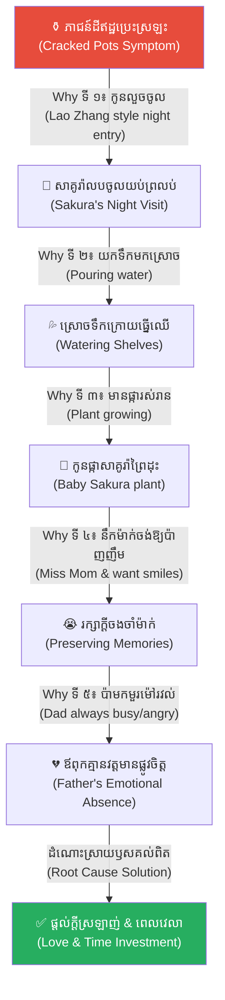
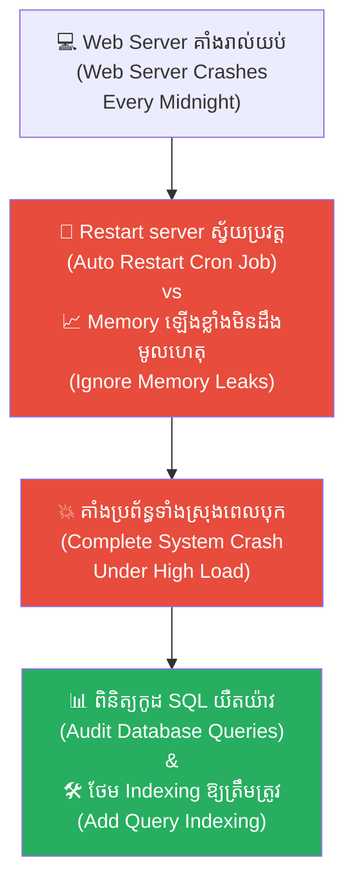
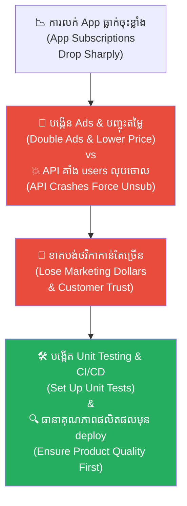
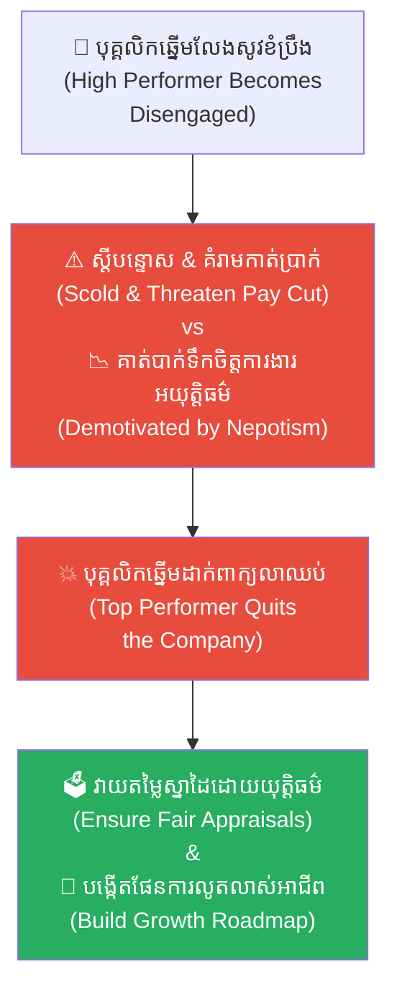
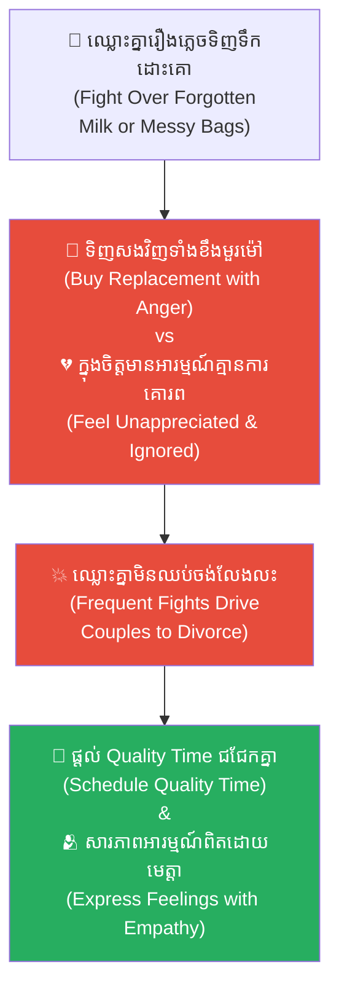
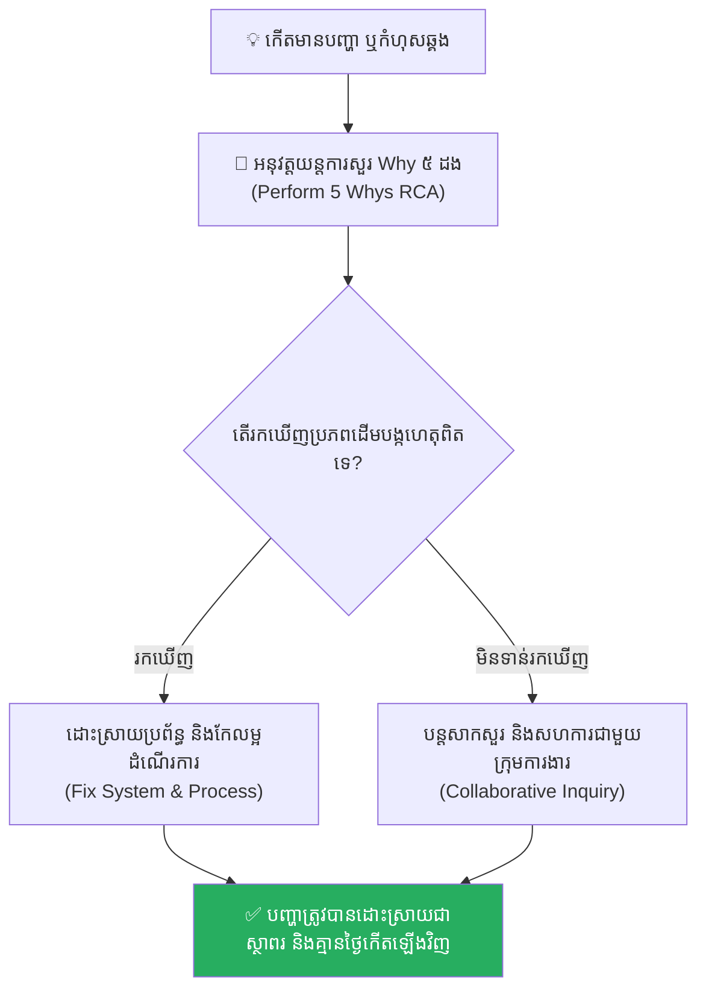

# The Cracked Pot and the Five Whys (ក្អមដីប្រេះ និងអាថ៌កំបាំងសំនួរស្វែងរកឫសគល់ទាំង ៥)៖ របៀបដោះស្រាយបញ្ហាឱ្យចំឫសគល់ពិតប្រាកដ

**Author:** ichamrong  
**Date:** 2026-05-17  
**Tags:** #5-whys #root-cause-analysis #problem-solving #empathy #parables #japanese-aesthetics #critical-thinking  
**Category:** Concepts  
**Read Time:** ~15 min  

---

## 📌 មាតិកា (Table of Contents)
- [អន្ទាក់ផ្លូវចិត្ត (The Trap)](#អន្ទាក់ផ្លូវចិត្ត-the-trap)
- [១. រឿងនិទាន៖ ក្អមដីប្រេះ និងទឹកភ្នែកកូនស្រី (The Parable of the Cracked Pot)](#1)
  - [ការដោះស្រាយបញ្ហាបែបលើផ្ទៃ (Superficial Solutions)](#1-1)
  - [របកគំហើញកណ្តាលរាត្រី និងដំណើរសំនួរស្វែងរកឫសគល់ទាំង ៥ (The Midnight Epiphany)](#1-2)
- [២. បញ្ហា៖ ការកែកំហុសខុសគោលដៅ និងការគ្រប់គ្រងរោគសញ្ញា (The Issue: Symptom vs. Root Cause)](#2)
- [៣. ឧទាហរណ៍ជាក់ស្តែងក្នុងពិភពពិត (Real World Examples)](#3)
  - [ឧទាហរណ៍ទី ១ — កម្រិតស្រាល (គ្រួសារ)៖ កូនស្រីលួចលេងហ្គេម និងធ្លាក់ការសិក្សា (The Distracted Student)](#3-1)
  - [ឧទាហរណ៍ទី ២ — កម្រិតមធ្យម (បច្ចេកទេស)៖ Server ប្រព័ន្ធគាំងដំណើរការ (The Repeated Server Crash)](#3-2)
  - [ឧទាហរណ៍ទី ៣ — កម្រិតមធ្យម (ធុរកិច្ច)៖ ការធ្លាក់ចុះនៃការលក់ផលិតផល Startup (The Dropping Sales Metric)](#3-3)
  - [ឧទាហរណ៍ទី ៤ — កម្រិតមធ្យម (សង្គម/គ្រប់គ្រង)៖ បុគ្គលិកឆ្នើមលែងសូវខិតខំប្រឹងប្រែង (The Disengaged High-Performer)](#3-4)
  - [ឧទាហរណ៍ទី ៥ — កម្រិតធ្ងន់ (ទំនាក់ទំនង)៖ ការឈ្លោះប្រកែកគ្នាអំពីសំបកទូរស័ព្ទ ឬកិច្ចការផ្ទះ (The Shallow Argument Trap)](#3-5)
- [៤. ដំណោះស្រាយទូទៅ៖ បច្ចេកទេស 5 Whys និងការដោះស្រាយឱ្យចំប្រភព (The General Solution: Root Cause Action Plan)](#4)
- [សេចក្តីសន្និដ្ឋាន (Conclusion)](#conclusion)
- [ឯកសារយោង (References)](#references)
- [Related Posts](#related-posts)

---

## អន្ទាក់ផ្លូវចិត្ត (The Trap)

តើអ្នកធ្លាប់ចំណាយពេល ថាមពល និងថវិការាប់ម៉ឺនដុល្លារ ដើម្បីដោះស្រាយបញ្ហាមួយដែលកំពុងតែឆាបឆេះចំពោះមុខ ប៉ុន្តែមិនយូរប៉ុន្មាន បញ្ហានោះបែរជាកើតឡើងដដែលៗជាវដ្តមិនចេះចប់មិនចេះហើយដែរឬទេ?

នេះគឺជា **Symptom Management Trap (អន្ទាក់នៃការដោះស្រាយបញ្ហាលើផ្ទៃ)**។ 

នៅក្នុងការងារ ឬទំនាក់ទំនង ជារឿយៗយើងតែងតែប្រញាប់ប្រញាល់ដាក់ចេញនូវដំណោះស្រាយភ្លាមៗ ទៅលើអ្វីដែលយើង «មើលឃើញផ្ទាល់ភ្នែកពីខាងក្រៅ» (រោគសញ្ញា)។ យើងបិទបាំង ព្យាបាល និងកែកំហុសចំពោះមុខ ដោយបដិសេធមិនព្រមចំណាយពេលស្វែងយល់ពី «ប្រភពដើមបង្កហេតុ» (ឫសគល់) ដែលលាក់ខ្លួនយ៉ាងជ្រៅនៅក្រោមផ្ទៃខាងក្រៅ។ ទង្វើប្រញាប់ប្រញាល់ដែលខ្វះការយល់ចិត្ត និងសតិវិភាគនេះ មិនត្រឹមតែខ្ជះខ្ជាយធនធានឡើយ តែថែមទាំងបង្កើតបញ្ហាថ្មីឱ្យកាន់តែធ្ងន់ធ្ងរជាងមុនទៅទៀត។

ដើម្បីយល់ដឹងឱ្យបានគ្រប់ជ្រុងជ្រោយ នេះជាផែនទីបង្ហាញផ្លូវសម្រាប់អត្ថបទនេះ៖
1. **រឿងនិទានជប៉ុនបុរាណ (The Kyoto Fable)** — រឿងរ៉ាវរបស់ Master Kenji ជាងកូនក្អមដីប្រេះ កូនស្រីតូច Sakura និងដើមផ្កាសម្ងាត់ក្រោយធ្នើឈើ។
2. **បញ្ហា (The Issue)** — ការវិភាគទ្រឹស្តី 5 Whys នៃការដោះស្រាយបញ្ហាឱ្យចំឫសគល់ពិតប្រាកដ (Root Cause Analysis)។
3. **ឧទាហរណ៍ជាក់ស្តែងក្នុងពិភពពិត (Real World Examples)** — ពិនិត្យមើលឥទ្ធិពលនេះក្នុងកម្រិតគ្រួសារ ការងារបច្ចេកទេស ធុរកិច្ច ការគ្រប់គ្រង និងទំនាក់ទំនងស្នេហា។
4. **ដំណោះស្រាយទូទៅ (The General Solution)** — ការអនុវត្តបច្ចេកទេស 5 Whys និងការស្វែងរកដំណោះស្រាយសមស្រប។

---

## ១. រឿងនិទាន៖ ក្អមដីប្រេះ និងទឹកភ្នែកកូនស្រី (The Parable of the Cracked Pot)

នៅក្នុងទីក្រុងបុរាណ **គីយ៉ូតូ (Kyoto)** នៃប្រទេសជប៉ុន មានមេជាងភាជន៍ និងចម្លាក់ដីឥដ្ឋដ៏ល្បីល្បាញម្នាក់នាម **គែនជី (Master Kenji)**។ គាត់រស់នៅជាមួយកូនស្រីតូចម្នាក់អាយុ ៨ ឆ្នាំ ឈ្មោះ **សាគូរ៉ា (Sakura)** បន្ទាប់ពីភរិយារបស់គាត់បានចែកឋានទៅកាលពីប៉ុន្មានឆ្នាំមុន។ គែនជី ស្រឡាញ់កូនស្រីខ្លាំងណាស់ ប៉ុន្តែដោយសារតែសម្ពាធជីវភាព និងការងារត្រូវធ្វើភាជន៍ដីឥដ្ឋលក់ឱ្យឈ្មួញព្រះបរមរាជវាំង ទើបគាត់ចំណាយពេលស្ទើរតែពេញមួយថ្ងៃ នៅក្នុងបន្ទប់ធ្វើការរបស់គាត់ ទាំងទឹកមុខតានតឹង និងហត់នឿយជានិច្ច។

រហូតដល់ខែមួយ ស្រាប់តែមានរឿងមិនល្អពីរបានកើតឡើងក្នុងពេលតែមួយនៅក្នុងផ្ទះរបស់គាត់៖

1. **បញ្ហាភាជន៍ដីឥដ្ឋ៖** រាល់ក្អម និងភាជន៍ដីឥដ្ឋពិសេសៗដែលគាត់ទុកនៅក្នុងបន្ទប់តាំងពិព័រណ៍ផ្ទាល់ខ្លួន ស្រាប់តែចាប់ផ្តើម **ប្រេះស្រឡះ និងបាក់បែកជាបន្តបន្ទាប់** ដោយគ្មានមូលហេតុច្បាស់លាស់។ វត្ថុខ្លះទើបតែធ្វើរួចបានពីរថ្ងៃ ក៏ស្រាប់តែប្រេះធ្លាយខូចខាតអស់។
2. **បញ្ហាកូនស្រី៖** សាគូរ៉ា ដែលធ្លាប់តែជាក្មេងស្រីរីករាយ ស្រាប់តែប្រែជា **ស្ងប់ស្ងាត់ មិនសូវនិយាយស្តី ទឹកមុខស្រពោន** ហើយលទ្ធផលសិក្សានៅសាលាក៏ធ្លាក់ចុះយ៉ាងគំហក រហូតដល់គ្រូផ្ញើសំបុត្រមកស្តីបន្ទោស។

---

### ការដោះស្រាយបញ្ហាបែបលើផ្ទៃ (Superficial Solutions)

គែនជី ស្ទើរតែឆ្កួតចិត្តនឹងបញ្ហាដែលកំពុងតែឡោមព័ទ្ធគាត់។ គាត់ក៏ចាប់ផ្តើមដាក់ចេញនូវវិធានការដោះស្រាយបញ្ហាភ្លាមៗ ទៅតាមអ្វីដែលគាត់សម្លឹងឃើញពីខាងក្រៅ៖

* **ដើម្បីដោះស្រាយបញ្ហាភាជន៍ដីប្រេះ៖** គាត់គិតថាបន្ទប់ប្រហែលជាស្ងួតពេក ឬដីឥដ្ឋគ្មានគុណភាព។ គាត់ក៏ចំណាយលុយទិញម៉ាស៊ីនបាញ់សំណើមថ្លៃៗមកដាក់ បាញ់ថ្នាំលាបការពារដីឥដ្ឋ និងបិទបង្អួចបន្ទប់ឱ្យជិតឈឹង។ ប៉ុន្តែ ចម្លែកណាស់ ពីរថ្ងៃក្រោយមក ភាជន៍ដីថ្មីៗនៅតែបន្តប្រេះដដែល។
* **ដើម្បីដោះស្រាយបញ្ហាសាគូរ៉ាធ្លាក់ខ្លួនរៀនខ្សោយ និងស្ងប់ស្ងាត់៖** គាត់គិតថាកូនស្រីប្រហែលជាខ្ជិល និងលេងទូរសព្ទច្រើន។ គាត់ក៏ស្តីបន្ទោសនាងយ៉ាងធ្ងន់ធ្ងរ ដកហូតក្មេងលេងទាំងអស់ ហាមនាងមិនឱ្យចេញទៅលេងខាងក្រៅ និងបង្ខំឱ្យនាងអង្គុយអានសៀវភៅ ៣ ម៉ោងក្នុងមួយថ្ងៃ។ ប៉ុន្តែ អ្វីៗរឹតតែអាក្រក់ទៅៗ សាគូរ៉ាលែងសម្លឹងមុខគាត់ចំ នាងតែងតែលួចយំម្នាក់ឯងក្នុងបន្ទប់ងងឹត ហើយលទ្ធផលរៀនសូត្រនៅតែធ្លាក់ចុះដដែល។

គែនជី កំពុងតែព្យាយាម **«ព្យាបាលរោគសញ្ញាខាងក្រៅ» (Treating Symptoms)** ប៉ុន្តែបញ្ហាពិតប្រាកដដែលស្ថិតនៅក្រោមបាតគ្រឹះ មិនត្រូវបានដោះស្រាយទាល់តែសោះ។ គាត់កាន់តែហត់នឿយ ភាជន៍កាន់តែប្រេះ ហើយកូនស្រីកាន់តែឆ្ងាយពីទ្រូង។

---

### របកគំហើញកណ្តាលរាត្រី និងដំណើរសំនួរស្វែងរកឫសគល់ទាំង ៥ (The Midnight Epiphany)

យប់មួយ គែនជី ភ្ញាក់ឡើងកណ្តាលអធ្រាត្រព្រោះស្រេកទឹក។ ពេលដើរកាត់បន្ទប់ធ្វើការរបស់គាត់ គាត់ស្រាប់តែលឺសំឡេងទឹកភ្នែកខ្សឹបខ្សួល និងសំឡេងបែកភាជន៍ដីឥដ្ឋតូចមួយ។ គាត់ប្រញាប់បើកទ្វារចូលទៅ ស្រាប់តែឃើញ សាគូរ៉ា កំពុងតែលុតជង្គង់យំនៅក្បែរគំនរបាក់បែកនៃភាជន៍ដីតូចមួយ ដៃរបស់នាងត្រូវដីឥដ្ឋមុតហូរឈាមតិចៗ។

ដោយភាពហត់នឿយ និងកំហឹង គែនជី ហៀបនឹងស្រែកស្តីបន្ទោសកូនស្រីទៅហើយ ប៉ុន្តែពេលឃើញទឹកភ្នែក និងរូបរាងដ៏តូចច្រឡឹង កំពុងតែញ័រទទ្រើតដោយភាពភ័យខ្លាច ស្រាប់តែបេះដូងរបស់គាត់ទន់ជ្រាយភ្លាមៗ។ គាត់ដើរទៅអង្គុយចុះក្បែរនាង លាតដៃអោបកូនស្រី រួចដកដង្ហើមធំ រួចក៏ចាប់ផ្តើម **សួរសំណួរដោយក្តីយល់ចិត្ត (Empathy)**៖

* **សំនួរ Why ទី １៖** *«សាគូរ៉ា! ហេតុអ្វីបានជាកូនលួចចូលមកក្នុងបន្ទប់ធ្វើការរបស់ប៉ាទាំងកណ្តាលយប់បែបនេះ?»*
  * **ចម្លើយ៖** *«ពីព្រោះ... ពីព្រោះកូនចង់យកកូនក្អមទឹកតូចនេះ មកចាក់នៅទីនេះ ប៉ា...»* (នាងចង្អុលទៅជ្រុងម្ខាងនៃតុធ្វើការរបស់គាត់)។
* **សំនួរ Why ទី ２៖** *«ហេតុអ្វីបានជាកូនត្រូវយកទឹកមកចាក់នៅក្បែរតុធ្វើការរបស់ប៉ាទាំងងងឹតបែបនេះ?»*
  * **ចម្លើយ៖** *«ពីព្រោះកូនចង់ស្រោចទឹកនៅចន្លោះប្រហោងក្តារឈើ ខាងក្រោយធ្នើសៀវភៅរបស់ប៉ា។»*
* **សំនួរ Why ទី ３៖** *«ហេតុអ្វីបានជាកូនត្រូវយកទឹកទៅស្រោចនៅក្រោយធ្នើសៀវភៅនោះ?»*
  * **ចម្លើយ៖** *«ពីព្រោះនៅទីនោះ មានទំពាំងផ្កាតូចមួយ កំពុងតែដុះចេញពីប្រហោងក្តារបាតផ្ទះ... ខ្ញុំខ្លាចវាស្ងួតស្លាប់ ទើបខ្ញុំលួចយកទឹកមកស្រោចវារាល់យប់។»*
* **សំនួរ Why ទី ៤៖** *«ហេតុអ្វីបានជាកូនត្រូវខំប្រឹងជួយសង្គ្រោះដើមផ្កាតូចមួយនោះខ្លាំងម្ល៉េះ?»*
  * **ចម្លើយ៖** *«ពីព្រោះ... ពីព្រោះដើមផ្កានោះ គឺជាប្រភេទផ្កាសាគូរ៉ាព្រៃ ដែលម៉ាក់ធ្លាប់ដាំឱ្យកូនមើលកាលពីមុន។ រាល់ពេលកូនឃើញវា កូននឹកម៉ាក់ណាស់ ប៉ា... កូនចង់ឱ្យផ្កានោះរស់នៅជិតប៉ា ដើម្បីឱ្យប៉ាបានញញឹមឡើងវិញ។»*
* **សំនួរ Why ទី ៥៖** *«ចុះហេតុអ្វីបានជាកូនមិនប្រាប់ប៉ាឱ្យជួយស្រោចទឹកវាចំៗ ឬសុំចិញ្ចឹមវាពីដំបូង? ហេតុអ្វីត្រូវលួចធ្វើទាំងយប់សម្ងាត់បែបនេះ?»*
  * **ចម្លើយ (ទឹកភ្នែកហូរស្រក់សស្រាក់)៖** *«ពីព្រោះ... ពីព្រោះរាល់ដងដែលកូនព្យាយាមចូលមកក្បែរប៉ា ប៉ាតែងតែនិយាយថា 'ប៉ាកំពុងរវល់ កុំមកកំរើករបស់របរប៉ា' ឬមានទឹកមុខមួរម៉ៅខ្លាំងណាស់។ កូនខ្លាចប៉ាខឹង កូនខ្លាចប៉ាគិតថាកូនជាក្មេងរំខាន ទើបកូនមិនហ៊ាននិយាយ... កូនគ្រាន់តែចង់ឱ្យប៉ាមានក្តីសុខ និងលែងហត់នឿយប៉ុណ្ណោះ...»*

គែនជី លឺសម្តីរបស់កូនស្រីហើយ ស្រាប់តែមានអារម្មណ៍ដូចជាមានរន្ទះបាញ់ចំកណ្តាលទ្រូង។ គាត់ទាញកូនស្រីមកអោបជាប់នឹងទ្រូងយ៉ាងណែន ហើយយំខ្សឹកខ្សួលជាមួយនាងកណ្តាលបន្ទប់ងងឹតនោះ។

**ឫសគល់ពិតប្រាកដនៃភាជន៍ដីប្រេះ៖**
មិនមែនមកពីគុណភាពដី ឬខ្វះម៉ាស៊ីនសំណើមនោះទេ ប៉ុន្តែគឺមកពីកូនស្រីរបស់គាត់ **លបយកទឹកចូលមកស្រោចផ្ការាល់យប់ ធ្វើឱ្យទឹកកំពប់ជោកបាតក្តារឈើ និងបង្កើតជាកម្តៅសំណើមមិនស្មើគ្នាចំហុយឡើងលើដីឥដ្ឋ** ទើបធ្វើឱ្យភាជន៍ដីឥដ្ឋស្ងួតមិនស្មើគ្នា ហើយប្រេះបែកខ្ទេចខ្ទី។

**ឫសគល់ពិតប្រាកដនៃបញ្ហាកូនស្រី៖**
មិនមែនមកពីនាងខ្ជិល ឬលេងទូរសព្ទច្រើននោះទេ ប៉ុន្តែគឺមកពី **«ភាពឯកោ ភាពភ័យខ្លាច និងកង្វះវត្តមានផ្លូវចិត្តរបស់ឪពុក»** ដែលធ្វើឱ្យនាងបាត់បង់ការយកចិត្តទុកដាក់លើការសិក្សា និងព្យាយាមធ្វើគ្រប់យ៉ាងដើម្បីទទួលបានក្តីស្រឡាញ់ពីគាត់វិញ។

---

## ២. បញ្ហា៖ ការកែកំហុសខុសគោលដៅ និងការគ្រប់គ្រងរោគសញ្ញា (The Issue: Symptom vs. Root Cause)

នៅក្នុងការងារដោះស្រាយបញ្ហា (Problem Solving) មិនថាក្នុងវិស័យផលិតកម្មយានយន្ត (ដូចជាប្រភពដើមរបស់ Toyota Sakichi Toyoda ដែលបានបង្កើតទ្រឹស្តី 5 Whys នេះឡើង) វិស្វកម្មសូហ្វវែរ ឬសូម្បីតែទំនាក់ទំនងរវាងមនុស្ស គឺយើងតែងតែងាយនឹងធ្លាក់ក្នុងអន្ទាក់ **«ដោះស្រាយបញ្ហាលើផ្ទៃ» (Surface Problem Solving)** ខ្លាំងណាស់៖

* **រោគសញ្ញាខាងក្រៅ (Symptom):** គឺជាអ្វីដែលយើងសម្លឹងឃើញនឹងភ្នែកភ្លាមៗ (ភាជន៍ប្រេះ, កូនរៀនខ្សោយ, ប្រព័ន្ធគាំង, កូដដំណើរការយឺត)។
* **ឫសគល់ពិតប្រាកដ (Root Cause):** គឺជាប្រភពដើមបង្កាត់បញ្ហា ដែលលាក់ខ្លួនយ៉ាងជ្រៅនៅក្រោមផ្ទៃខាងក្រៅ។

---

## ៣. ឧទាហរណ៍ជាក់ស្តែងក្នុងពិភពពិត

ដើម្បីយល់ដឹងឱ្យកាន់តែស៊ីជម្រៅ ផ្លូវការសិក្សានឹងនាំអ្នកទៅពិនិត្យមើល **ឧទាហរណ៍ចំនួន ៥ កម្រិតខុសៗគ្នា** ក្នុងជីវិតរស់នៅប្រចាំថ្ងៃ៖

---

### ឧទាហរណ៍ទី ១ — កម្រិតស្រាល (គ្រួសារ)៖ កូនស្រីលួចលេងហ្គេម និងធ្លាក់ការសិក្សា (The Distracted Student)

**ស្ថានភាព៖** កូនស្រីម្នាក់ធ្លាប់ជារៀនពូកែ ស្រាប់តែធ្លាក់ចូលទៅក្នុងទម្លាប់លេងហ្គេមលើទូរស័ព្ទរហូតដល់យប់ជ្រៅ និងរៀនខ្សោយខ្លាំង។

* **ជម្រើសលើផ្ទៃ៖** ឪពុកម្តាយដកហូតទូរស័ព្ទ បិទបណ្តាញអ៊ីនធឺណិត និងស្តីបន្ទោសនាងយ៉ាងខ្លាំង (Treating the symptom)។ កូនស្រីលួចលេងទូរស័ព្ទមិត្តភក្តិនៅសាលា និងលែងនិយាយជាមួយឪពុកម្តាយ។
* **ជម្រើសតាម 5 Whys៖** តាមរយៈការសួរនាំ ពួកគេដឹងថា៖ កូនលេងហ្គេមព្រោះចង់បន្លប់ភាពឯកោ ព្រោះឪពុកម្តាយរវល់ពេក និងគ្មានមិត្តភក្តិជជែកលេង។ ឫសគល់ពិតប្រាកដគឺ **«កង្វះវត្តមានកក់ក្តៅរបស់គ្រួសារ»**។

**ការពិតដ៏ជូរចត់៖**
ការកាត់ផ្តាច់ឧបករណ៍ដោយគ្មានការផ្តល់ក្តីស្រឡាញ់ គ្រាន់តែជម្រុញឱ្យកូនរត់ចេញកាន់តែឆ្ងាយប៉ុណ្ណោះ។

---

### ឧទាហរណ៍ទី ២ — កម្រិតមធ្យម (បច្ចេកទេស)៖ Server ប្រព័ន្ធគាំងដំណើរការ (The Repeated Server Crash)

**ស្ថានភាព៖** Web Server របស់ក្រុមហ៊ុនធ្លាក់ដំណើរការ (Crash) រៀងរាល់យប់ម៉ោង ១២ យប់។

* **ជម្រើសលើផ្ទៃ៖** Infrastructure Team រៀបចំ Cron Job ដើម្បី restart server ដោយស្វ័យប្រវត្តិនៅម៉ោង ១២:០៥ យប់រាល់ថ្ងៃ (Symptom patching)។
* **ជម្រើសតាម 5 Whys៖** តាមរយៈការស៊ើបអង្កេត៖ Server គាំងព្រោះ MemOut Error -> memory ឡើងខ្លាំង -> មាន cron job លាក់បាំងរត់ analytical script -> database queries គ្មាន Indexing។ ឫសគល់គឺ **«កង្វះ Code optimization និង query indexing»**។

**ការពិតដ៏ជូរចត់៖**
ការបិទបាំងរោគសញ្ញាចំពោះមុខ ជារឿយៗនាំទៅរកការគាំងប្រព័ន្ធទាំងស្រុងនៅពេលក្រោយ ក្រោម Concurrency Load ធំ។

---

### ឧទាហរណ៍ទី ៣ — កម្រិតមធ្យម (ធុរកិច្ច)៖ ការធ្លាក់ចុះនៃការលក់ផលិតផល Startup (The Dropping Sales Metric)

**ស្ថានភាព៖** ចំនួននៃការលក់ App សមាជិកភាព (Subscription) របស់ក្រុមហ៊ុន Startup មួយ ធ្លាក់ចុះយ៉ាងគំហកក្នុងខែនេះ។

* **ជម្រើសលើផ្ទៃ៖** បញ្ជាឱ្យក្រុមការងារទីផ្សារ (Marketing) បង្កើនការចំណាយលើ Ads ២ ដង និងកាត់បន្ថយតម្លៃសេវាកម្ម ២០% (Symptom solution)។ ក្រុមហ៊ុននៅតែខាតបង់ប្រាក់។
* **ជម្រើសតាម 5 Whys៖** ស្វែងរកឫសគល់៖ យូសឺលុបចោល subscription ព្រោះ App គាំង -> គាំងព្រោះ API errors -> API errors ព្រោះកូដគ្មានការធ្វើ unit testing មុន deploy។ ឫសគល់គឺ **«កង្វះ CI/CD Pipeline pipeline and QA testing process»**។

**ការពិតដ៏ជូរចត់៖**
ការបញ្ចុះតម្លៃដើម្បីដោះស្រាយបញ្ហាគុណភាពផលិតផល គ្រាន់តែជួយឱ្យក្រុមហ៊ុនក្ស័យធនលឿនជាងមុនប៉ុណ្ណោះ។

---

### ឧទាហរណ៍ទី ៤ — កម្រិតមធ្យម (សង្គម/គ្រប់គ្រង)៖ បុគ្គលិកឆ្នើមលែងសូវខិតខំប្រឹងប្រែង (The Disengaged High-Performer)

**ស្ថានភាព៖** បុគ្គលិកដ៏សកម្មម្នាក់ ស្រាប់តែប្រែជាធ្វើការងារយឺតយ៉ាវ និងមិនសូវបញ្ចេញសមត្ថភាពដូចមុន។

* **ជម្រើសលើផ្ទៃ៖** Manager កោះហៅមកស្តីបន្ទោស និងព្រមានដកប្រាក់លើកទឹកចិត្ត (Symptom treatment)។ បុគ្គលិកនោះដាក់ពាក្យលាឈប់ភ្លាមៗ។
* **ជម្រើសតាម 5 Whys៖** តាមសួរនាំ៖ បុគ្គលិកគ្មានកម្លាំងចិត្តធ្វើការ ព្រោះយល់ថាគ្មានការរីកចម្រើន -> គ្មានការរីកចម្រើនព្រោះគម្រោងធំៗត្រូវបានប្រគល់ឱ្យតែក្រុមការងារអែបអប។ ឫសគល់គឺ **«ការវាយតម្លៃអយុត្តិធម៌របស់ Manager»**។

**ការពិតដ៏ជូរចត់៖**
ការស្តីបន្ទោសលើសកម្មភាពខាងក្រៅ បំផ្លាញនូវសេចក្តីស្មោះត្រង់របស់ធនធានមនុស្សដ៏ល្អបំផុត។

---

### ឧទាហរណ៍ទី ៥ — កម្រិតធ្ងន់ (ទំនាក់ទំនង)៖ ការឈ្លោះប្រកែកគ្នាអំពីសំបកទូរស័ព្ទ ឬកិច្ចការផ្ទះ (The Shallow Argument Trap)

**ស្ថានភាព៖** ប្តីប្រពន្ធឈ្លោះប្រកែកគ្នាខ្លាំងរហូតដល់ចង់លែងលះគ្នា គ្រាន់តែដោយសារប្តីភ្លេចទិញទឹកដោះគោ ឬប្រពន្ធទុកកាបូបរញ៉េរញ៉ៃ។

* **ជម្រើសលើផ្ទៃ៖** ប្តីទិញទឹកដោះគោមកសងវិញទាំងមួរម៉ៅ ឬប្រពន្ធរៀបចំកាបូប (Symptom patches)។ ពួកគេនៅតែឈ្លោះគ្នានៅថ្ងៃបន្ទាប់។
* **ជម្រើសតាម 5 Whys៖** តាមរយៈការបើកបេះដូងជជែក៖ ពួកគេខឹងព្រោះមានអារម្មណ៍ថាគ្មានការគោរព -> គ្មានការគោរពព្រោះម្នាក់ៗរវល់ធ្វើការងាររៀងខ្លួនរហូតគ្មានពេលជជែកគ្នាសារភាពអារម្មណ៍។ ឫសគល់គឺ **«កង្វះការបង្កើតចន្លោះ Quality Time សម្រាប់ទំនាក់ទំនង»**។

**ការពិតដ៏ជូរចត់៖**
ការដោះស្រាយលើប្រធានបទឈ្លោះខាងក្រៅ មិនអាចព្យាបាលស្នាមបាក់បែកនៃដួងព្រលឹងបានឡើយ។

---

## ៤. ដំណោះស្រាយទូទៅ៖ បច្ចេកទេស 5 Whys និងការដោះស្រាយឱ្យចំប្រភព (The General Solution: Root Cause Action Plan)

ដើម្បីអនុវត្តក្បួនវិភាគ 5 Whys ឱ្យទទួលបានប្រសិទ្ធភាពខ្ពស់បំផុត ចូរអនុវត្តជំហានខាងក្រោម៖

### ១. សួរសំនួរ «ហេតុអ្វី?» (Why?) ចំនួន ៥ ដងជាបន្តបន្ទាប់
នៅពេលមានបញ្ហាកើតឡើង កុំទាន់ប្រញាប់ដាក់ដំណោះស្រាយ។ ចូរដើរតួជា Master Kenji ដោយសួរសំនួរ Why ឱ្យបាន ៥ ដង ដោយអត់ធ្មត់ ដើម្បីទម្លុះស្រទាប់ខាងក្រៅទៅរកបាតគ្រឹះ។

### ២. ផ្តោតលើ «ប្រព័ន្ធ និងដំណើរការ» មិនមែនផ្តោតលើ «បុគ្គល»
កុំសួរថា «នរណាជាអ្នកធ្វើឱ្យខុស?» (Who?) តែត្រូវសួរថា «ហេតុអ្វីបានជាដំណើរការនេះអនុញ្ញាតឱ្យកំហុសនេះកើតឡើង?» (Why?)។ ដំណោះស្រាយប្រព័ន្ធមានស្ថិរភាពជាងការដាក់ទណ្ឌកម្មលើមនុស្ស។

### ៣. អនុវត្តយន្តការ Feedback Loop ត្រួតពិនិត្យឡើងវិញ
បន្ទាប់ពីរកឃើញឫសគល់ និងដាក់ដំណោះស្រាយរួច ត្រូវតាមដានត្រួតពិនិត្យរយៈពេល ១ ខែ ដើម្បីដឹងថាតើរោគសញ្ញាខាងក្រៅលេចឡើងម្តងទៀតដែរឬទេ។ ប្រសិនបើនៅតែលេចឡើង មានន័យថាយើងមិនទាន់រកឃើញឫសគល់ពិតប្រាកដឡើយ។

---

## សេចក្តីសន្និដ្ឋាន (Conclusion)

> **«ក្អមដីប្រេះរបស់ Master Kenji លែងប្រេះបែកទៀតហើយ ព្រោះគាត់បានយល់ដឹងពីដើមផ្កាសម្ងាត់ដែលកូនស្រីស្រោចទឹក។ ចូរកុំដោះស្រាយបញ្ហាដោយការបិទបង្អួច និងបាញ់សំណើម ក្នុងពេលដែលបញ្ហាពិតស្ថិតនៅលើការស្រោចទឹកសម្ងាត់ក្នុងផ្ទះរបស់អ្នកឡើយ។»**

ចូរប្រើប្រាស់ក្តីមេត្តា និងសតិ ដើម្បីសួររកឫសគល់ពិតប្រាកដនៃបញ្ហាជុំវិញខ្លួន។

ចូរដោះស្រាយឱ្យចំឫសគល់។

---

## ឯកសារយោង (References)

* **Toyoda, S.** — *The 5 Whys Methodology in Toyota Production System*. ប្រភពដើមនៃការបង្កើត 5 Whys។
* **Senge, P. M.** — *The Fifth Discipline: The Art & Practice of The Learning Organization* (1990). ការវិភាគប្រព័ន្ធគ្រប់គ្រង និងការស្វែងរកឫសគល់បញ្ហា។
* **Gottman, J.** — *The Seven Principles for Making Marriage Work* (1999). យន្តការយល់ដឹងពីឫសគល់នៃជម្លោះក្នុងទំនាក់ទំនង។

---

## Related Posts

* **[The Lost Axe and the Filter of Mind (ពូថៅដែលបាត់ និងអ័ព្ទនៃការសង្ស័យ)៖ គ្រោះថ្នាក់នៃលំអៀង Confirmation Bias និងការដុតបំផ្លាញទំនុកចិត្ត](./13-the-lost-axe-and-the-filter-of-mind.md)** — Suspicion filters and fake causes.
* **[The Baker and the Butcher (កំហុសនៃភាពល្អ និងការរំពឹងទុក)៖ គ្រោះថ្នាក់នៃការលះបង់គ្មានដែនកំណត់ និងការកសាងមនុស្សលោភលន់គ្មានព្រំដែន](./11-the-baker-and-the-butcher.md)** — Giving without understanding relational realities.
* **[The Broken Bridge and the Art of Inversion (ស្ពានដែលបាក់ និងវិធានគិតបញ្ច្រាស)៖ របៀបដោះស្រាយបញ្ហាស្មុគស្មាញដោយការចាប់ផ្តើមពីទីបញ្ចប់](./15-the-broken-bridge-and-the-art-of-inversion.md)** — Inversion thinking patterns.
