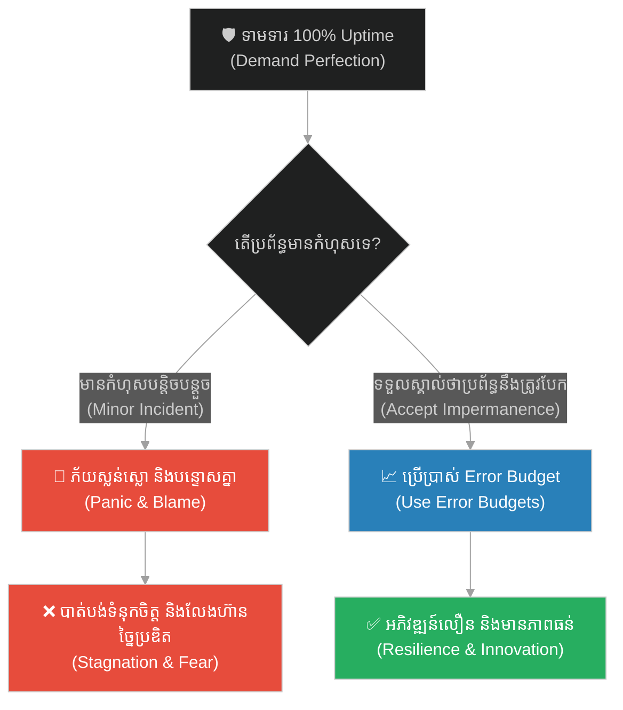
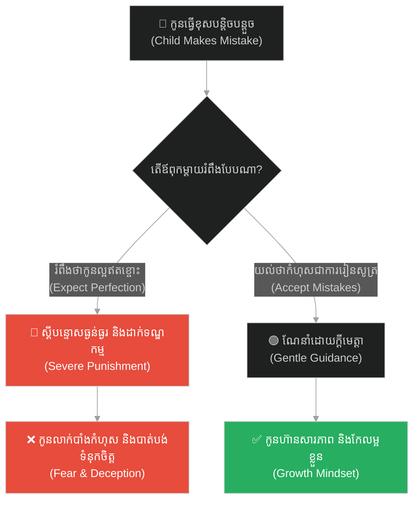
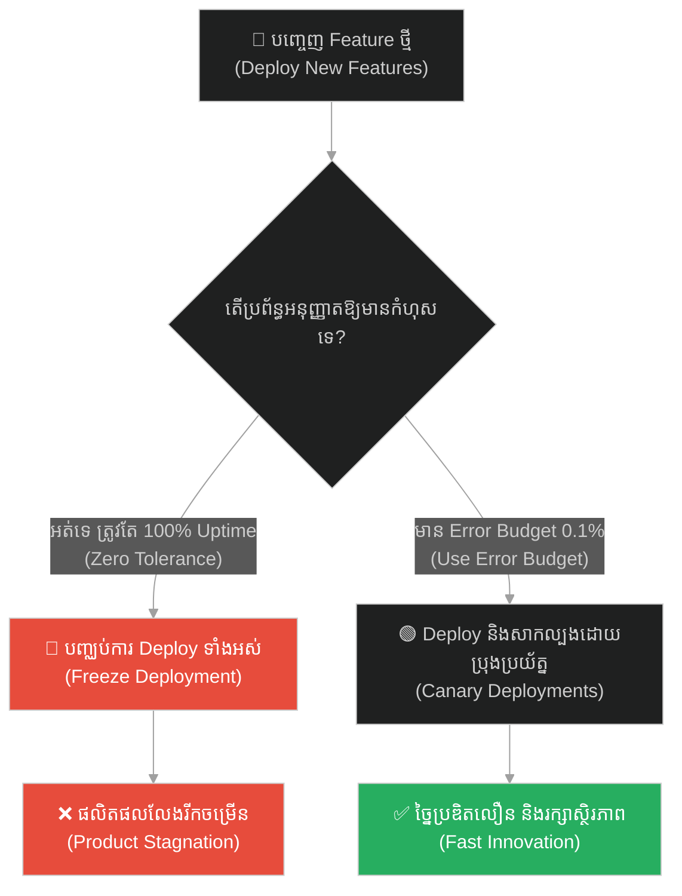
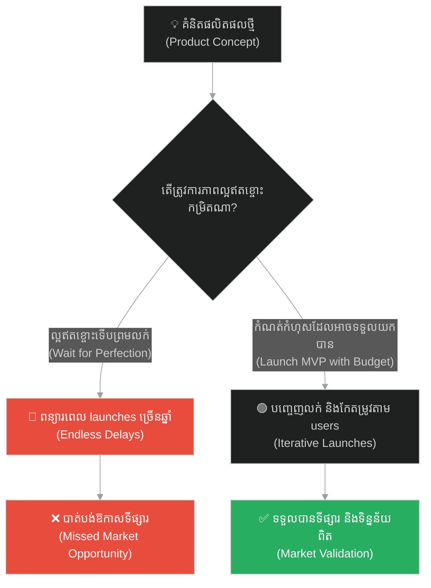
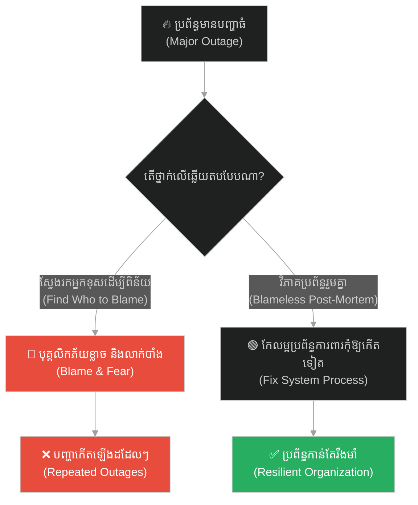
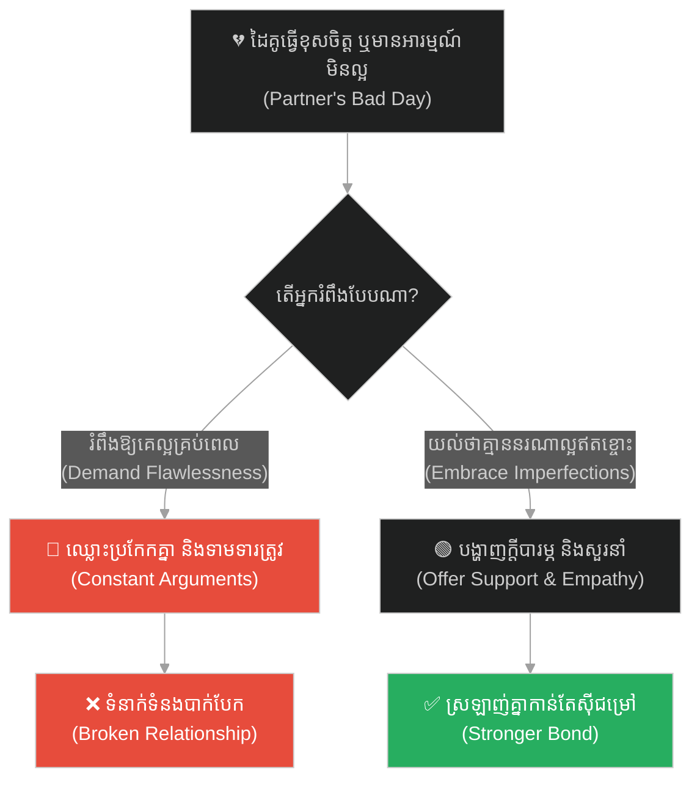
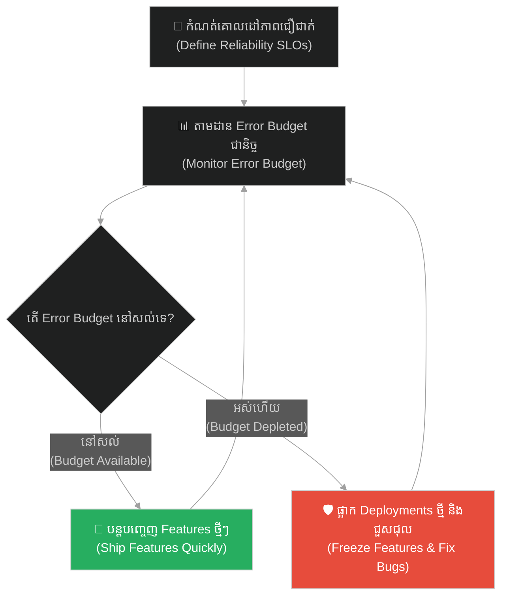

# Error Budgets & SRE Mindset (ថវិកាកំហុស និងផ្នត់គំនិត SRE)៖ កែវដែលបែករួចជាស្រេច (Error Budgets & SRE Mindset & The Already Broken Glass)

**Author:** ichamrong  
**Date:** 2026-05-28  
**Tags:** #error-budgets #sre #site-reliability-engineering #devops #chaos-engineering #acceptance #impermanence  
**Category:** Concepts  
**Read Time:** ~15 min  

---

## 📌 មាតិកា (Table of Contents)
- [អន្ទាក់ផ្លូវចិត្ត (The Trap)](#0)
- [១. រឿងនិទាន៖ កែវដែលបែករួចជាស្រេច (The Legend of the Already Broken Glass)](#1)
  - [សេចក្តីស្ងប់ក្នុងព្យុះភ្លៀង និងទស្សនៈមិនទៀង (Peace in Impermanence)](#1-1)
- [២. បញ្ហា៖ ថវិកាកំហុស និងផ្នត់គំនិត SRE (The Issue: Error Budgets & SRE Mindset)](#2)
- [៣. ឧទាហរណ៍ជាក់ស្តែងក្នុងពិភពពិត (Real World Examples)](#3)
  - [ឧទាហរណ៍ទី ១ — កម្រិតស្រាល (គ្រួសារ)៖ ការរំពឹងទុករបស់ឪពុកម្តាយលើការមិនចេះខុសរបស់កូន (The Perfect Child Expectation)](#3-1)
  - [ឧទាហរណ៍ទី ២ — កម្រិតមធ្យម (បច្ចេកទេស)៖ ការទាមទារ SLA 100% Uptime (The Myth of 100% Uptime)](#3-2)
  - [ឧទាហរណ៍ទី ៣ — កម្រិតមធ្យម (ធុរកិច្ច)៖ ការមិនហ៊ានសាកល្បងព្រោះខ្លាចបរាជ័យ (The Risk-Averse Product Launch)](#3-3)
  - [ឧទាហរណ៍ទី ៤ — កម្រិតមធ្យម (សង្គម/គ្រប់គ្រង)៖ វប្បធម៌ទម្លាក់កំហុស (The Blame Culture in Management)](#3-4)
  - [ឧទាហរណ៍ទី ៥ — កម្រិតធ្ងន់ (ទំនាក់ទំនង)៖ ការរំពឹងថាគូជីវិតគ្មានចំណុចខ្វះខាត (The Flawless Partner Illusion)](#3-5)
- [៤. ដំណោះស្រាយទូទៅ៖ ការកំណត់ Error Budgets និងការរស់នៅជាមួយភាពមិនល្អឥតខ្ចោះ (The General Solution: Embracing Failure Budgets)](#4)
- [សេចក្តីសន្និដ្ឋាន (Conclusion)](#5)
- [ឯកសារយោង (References)](#6)
- [Related Posts](#7)

---

<a id="0"></a>
## អន្ទាក់ផ្លូវចិត្ត (The Trap)

តើអ្នកធ្លាប់រស់នៅក្នុងការភ័យខ្លាចជានិច្ចចំពោះភាពបរាជ័យ ឬការខូចខាតដែលមិនទាន់កើតឡើងដែរឬទេ? នៅក្នុងការគ្រប់គ្រងប្រព័ន្ធបច្ចេកវិទ្យា ឬក្នុងជីវិតប្រចាំថ្ងៃ ការព្យាយាមបង្កើតអ្វីមួយឱ្យល្អឥតខ្ចោះ ១០០% (Zero Failures) ជារឿយៗនាំមកនូវការថប់បារម្ភ ការជាប់គាំង និងការបែកបាក់នៅទីបំផុត។

* **ម្ខាង (Side A)** — យើងខំប្រឹងទាមទារភាពល្អឥតខ្ចោះ ១០០% (Perfect Uptime / Flawless Outcomes) ដោយមិនព្រមទទួលយកកំហុសសូម្បីតែបន្តិច។
* **ម្ខាងទៀត (Side B)** — យើងយល់ថាអ្វីៗទាំងអស់នឹងខូចខាត ហើយប្រព័ន្ធនឹងគាំងនៅថ្ងៃណាមួយ ដូច្នេះយើងឈប់អភិវឌ្ឍ ឬឈប់ព្យាយាម។

ផែនទីបង្ហាញផ្លូវសម្រាប់អត្ថបទនេះ៖
1. **រឿងនិទានព្រះតេជគុណ Ajahn Chah** — អាថ៌កំបាំងនៃកែវទឹកដែលបែករួចជាស្រេច។
2. **បញ្ហាបច្ចេកវិទ្យា** — របៀបដែលការស្វែងរក 100% Uptime បំផ្លាញផលិតភាព និងរបៀបដែល Error Budgets ជួយសង្គ្រោះប្រព័ន្ធ។
3. **ឧទាហរណ៍ ៥ កម្រិត** — ការអនុវត្តផ្នត់គំនិតនេះក្នុងជីវិត ធុរកិច្ច និងវិស្វកម្ម។
4. **ដំណោះស្រាយជាក់ស្តែង** — របៀបរៀបចំប្រព័ន្ធការពារ និងវដ្តគ្រប់គ្រងកំហុស។



---

<a id="1"></a>
## ១. រឿងនិទាន៖ កែវដែលបែករួចជាស្រេច (The Legend of the Already Broken Glass)

មានព្រះសង្ឃមួយអង្គនាម **Ajahn Chah (ព្រះតេជគុណ ឆា)** ជាគ្រូបង្រៀនធម៌ដ៏ល្បីល្បាញក្នុងព្រៃ។ ថ្ងៃមួយ មានកូនសិស្សម្នាក់បានសួរលោកថា៖ *«លោកគ្រូ! គ្រប់យ៉ាងសុទ្ធតែមិនទៀងទាត់ (អនិច្ចា) ហើយយើងមិនគួរជាប់ជំពាក់នឹងរបស់អ្វីឡើយ។ ប៉ុន្តែចុះបើលោកគ្រូមានរបស់ដែលលោកគ្រូស្រឡាញ់ តើលោកគ្រូអាចរក្សាសេចក្តីសុខបានដោយរបៀបណាពេលវាបាត់បង់?»*

ព្រះតេជគុណ ឆា បានលើកកែវទឹកដីឥដ្ឋដ៏ស្អាតមួយមកបង្ហាញ ហើយមានថេរដីកាថា៖ *«អ្នកឃើញកែវនេះទេ? ខ្ញុំចូលចិត្តកែវនេះណាស់ ព្រោះវាអាចផ្ទុកទឹកឱ្យខ្ញុំឆាន់បានរាល់ថ្ងៃ។ ប៉ុន្តែសម្រាប់ខ្ញុំ **កែវនេះវាបានបែករួចជាស្រេចទៅហើយ (The glass is already broken)**។»*

<a id="1-1"></a>
### សេចក្តីស្ងប់ក្នុងព្យុះភ្លៀង និងទស្សនៈមិនទៀង (Peace in Impermanence)

លោកបានពន្យល់បន្តថា៖ *«ខ្ញុំដឹងច្បាស់ថា ថ្ងៃណាមួយ វានឹងត្រូវធ្លាក់បែក ឬត្រូវខ្យល់បក់រមៀលធ្លាក់ពីលើតុជាមិនខាន ព្រោះវាជាធម្មជាតិនៃវត្ថុដែលងាយបែកស្រួយ។ ដោយសារតែខ្ញុំចាត់ទុកថា វាជារបស់ដែលនឹងត្រូវបែករួចជាស្រេច ដូច្នេះរាល់វិនាទីដែលខ្ញុំកំពុងកាន់វា និងប្រើប្រាស់វា ខ្ញុំឱ្យតម្លៃវា និងរីករាយជាមួយវាយ៉ាងពេញទំហឹង។ លុះដល់ថ្ងៃដែលវាធ្លាក់បែកមែន ខ្ញុំនឹងនិយាយថា 'អូខេ វាដល់ពេលរបស់វាហើយ' ដោយមិនមានសេចក្តីសោកស្តាយឡើយ។»*

---

<a id="2"></a>
## ២. បញ្ហា៖ ថវិកាកំហុស និងផ្នត់គំនិត SRE (The Issue: Error Budgets & SRE Mindset)

នៅក្នុងវិស្វកម្មប្រព័ន្ធ (Software & Systems Engineering) ការរំពឹងទុកថាកូដ ឬ Server នឹងដំណើរការ ១០០% ដោយគ្មានការគាំង គឺជាការយល់ច្រឡំដ៏ធំ។ នេះហៅថា **The Myth of 100% Uptime**។ នៅពេលប្រព័ន្ធជួបប្រទះការគាំង ក្រុមការងារដែលគ្មានការត្រៀមចិត្តនឹងធ្លាក់ចូលទៅក្នុងភាពភ័យស្លន់ស្លោ និងបង្កើតវប្បធម៌ទម្លាក់កំហុសដាក់គ្នា។

ផ្នត់គំនិត **SRE (Site Reliability Engineering)** បង្រៀនឱ្យយើងកំណត់ **Error Budget (ថវិកាកំហុស)**។ ប្រសិនបើប្រព័ន្ធរបស់អ្នកត្រូវការ Uptime 99.9% (SLO) នោះអ្នកមាន Error Budget ចំនួន 0.1% សម្រាប់ឱ្យវាគាំង ឬប្រើសម្រាប់សាកល្បងមុខងារថ្មីៗ។ យើងទទួលស្គាល់ថាប្រព័ន្ធនឹងត្រូវគាំង (កែវបែករួចជាស្រេច) ដើម្បីរចនាកូដឱ្យមានភាពធន់ (Resilience)។

ខាងក្រោមនេះជាការប្រៀបធៀបរវាងការសរសេរកូដដែលរំពឹងលើភាពល្អឥតខ្ចោះ (Fragile) និងកូដដែលត្រៀមខ្លួនសម្រាប់ភាពបរាជ័យ (Resilient)៖

```python
# ==============================================================================
# ❌ Anti-Pattern: Fragile Design (Expects 100% dependency availability)
# ==============================================================================
class FragileBillingService:
    def __init__(self, payment_gateway):
        self.gateway = payment_gateway

    def process_invoice(self, invoice_id, amount):
        # If the payment gateway is down (even briefly), this call blocks
        # and crashes the entire thread, potentially causing cascading failures.
        response = self.gateway.charge(invoice_id, amount)
        return response.is_success()


# ==============================================================================
#  Resilient Design (Embraces the "already broken" mindset using Error Budget logic)
# ==============================================================================
import logging
from time import sleep

class ResilientBillingService:
    def __init__(self, payment_gateway, error_budget_tracker, fallback_queue):
        self.gateway = payment_gateway
        self.budget_tracker = error_budget_tracker
        self.fallback = fallback_queue

    def process_invoice(self, invoice_id, amount):
        # Check if the error budget for external calls is depleted (Circuit Breaker logic)
        if not self.budget_tracker.has_budget():
            logging.warning("Error budget depleted. Routing to offline fallback immediately.")
            self.fallback.enqueue(invoice_id, amount)
            return False  # Graceful degradation

        try:
            # We assume the gateway call WILL fail, so we enforce a timeout
            response = self.gateway.charge(invoice_id, amount, timeout=2.0)
            return response.is_success()
        except Exception as ex:
            # Consume from our error budget instead of crashing the system
            self.budget_tracker.consume_budget()
            logging.error(f"Gateway failed: {ex}. Saving transaction to retry queue.")
            self.fallback.enqueue(invoice_id, amount)
            return False
```

---

<a id="3"></a>
## ៣. ឧទាហរណ៍ជាក់ស្តែងក្នុងពិភពពិត

<a id="3-1"></a>
### ឧទាហរណ៍ទី ១ — កម្រិតស្រាល (គ្រួសារ)៖ ការរំពឹងទុករបស់ឪពុកម្តាយលើការមិនចេះខុសរបស់កូន (The Perfect Child Expectation)

* **ស្ថានភាព៖** ឪពុកម្តាយចង់ឱ្យកូនប្រលងបានលេខ ១ គ្រប់ខែ និងមិនដែលធ្វើខុសទាល់តែសោះ។
* **បញ្ហា (កែវមិនទាន់បែក)៖** ពេលកូនធ្លាក់និទ្ទេស ឬធ្វើខុសបន្តិចបន្តួច ឪពុកម្តាយខឹងសម្បារយ៉ាងខ្លាំង និងវាយប្រដៅ ធ្វើឱ្យកូនបាក់ទឹកចិត្ត។
* **ដំណោះស្រាយ (កែវបែករួចជាស្រេច)៖** ទទួលស្គាល់ថាក្មេងត្រូវតែធ្វើខុសដើម្បីរៀនសូត្រ។ បង្កើត Error Budget សម្រាប់កំហុសរបស់កូន។



---

<a id="3-2"></a>
### ឧទាហរណ៍ទី ២ — កម្រិតមធ្យម (បច្ចេកទេស)៖ ការទាមទារ SLA 100% Uptime (The Myth of 100% Uptime)

* **ស្ថានភាព៖** អតិថិជនទាមទារឱ្យប្រព័ន្ធ Cloud App ដំណើរការ ១០០% ជានិច្ច គ្មានការយឺតយ៉ាវ។
* **បញ្ហា៖** ក្រុមការងារមិនហ៊ានបញ្ចេញ Feature ថ្មីៗព្រោះខ្លាចប៉ះពាល់ដល់ប្រព័ន្ធ ធ្វើឱ្យការអភិវឌ្ឍយឺតយ៉ាវ។
* **ដំណោះស្រាយ៖** កំណត់ SLO 99.9% Uptime និងប្រើប្រាស់ Error Budget 0.1% សម្រាប់ការល្បង Feature ថ្មី។



---

<a id="3-3"></a>
### ឧទាហរណ៍ទី ៣ — កម្រិតមធ្យម (ធុរកិច្ច)៖ ការមិនហ៊ានសាកល្បងព្រោះខ្លាចបរាជ័យ (The Risk-Averse Product Launch)

* **ស្ថានភាព៖** ក្រុមហ៊ុនមួយចង់បញ្ចេញផលិតផលថ្មីទៅកាន់ទីផ្សារ ប៉ុន្តែរង់ចាំរហូតដល់គ្មានចន្លោះប្រហោងសូម្បីតែបន្តិច។
* **បញ្ហា៖** គូប្រជែងដណ្តើមយកទីផ្សារបាត់ ព្រោះរៀបចំយូរពេក។
* **ដំណោះស្រាយ៖** បញ្ចេញ MVP (Minimum Viable Product) ដោយកំណត់ទុកមុននូវថវិការល្បង និងការខាតបង់ដែលអាចទទួលយកបាន។



---

<a id="3-4"></a>
### ឧទាហរណ៍ទី ៤ — កម្រិតមធ្យម (សង្គម/គ្រប់គ្រង)៖ វប្បធម៌ទម្លាក់កំហុស (The Blame Culture in Management)

* **ស្ថានភាព៖** នៅពេលមានបញ្ហាកើតឡើងក្នុងក្រុមការងារ ថ្នាក់លើតែងតែស៊ើបរកអ្នកធ្វើខុសដើម្បីដកតំណែង។
* **បញ្ហា៖** បុគ្គលិកលាក់បាំងកំហុស ធ្វើឱ្យប្រព័ន្ធកាន់តែខូចខាតធ្ងន់ធ្ងរដោយគ្មានការកែលម្អ។
* **ដំណោះស្រាយ៖** អនុវត្តការធ្វើ Blameless Post-Mortem (ការវិភាគកំហុសដោយគ្មានការស្តីបន្ទោស) ដើម្បីរួមគ្នាកែលម្អប្រព័ន្ធ។



---

<a id="3-5"></a>
### ឧទាហរណ៍ទី ៥ — កម្រិតធ្ងន់ (ទំនាក់ទំនង)៖ ការរំពឹងថាគូជីវិតគ្មានចំណុចខ្វះខាត (The Flawless Partner Illusion)

* **ស្ថានភាព៖** មនុស្សម្នាក់រំពឹងថាដៃគូជីវិតរបស់ខ្លួនត្រូវតែយល់ចិត្ត ផ្អែមល្ហែម និងល្អឥតខ្ចោះគ្រប់ពេល។
* **បញ្ហា៖** ពេលដៃគូមានថ្ងៃហត់នឿយ ឬខឹងសម្បារបន្តិចបន្តួច ទំនាក់ទំនងក៏ចាប់ផ្តើមរង្គោះរង្គើ។
* **ដំណោះស្រាយ៖** ទទួលស្គាល់ថាមនុស្សគ្រប់រូបសុទ្ធតែមានកំហុសឆ្គង (កែវបែករួចជាស្រេច) និងផ្តល់ការយោគយល់គ្នាទៅវិញទៅមក។



---

<a id="4"></a>
## ៤. ដំណោះស្រាយទូទៅ៖ ការកំណត់ Error Budgets និងការរស់នៅជាមួយភាពមិនល្អឥតខ្ចោះ (The General Solution: Embracing Failure Budgets)

ដើម្បីរស់នៅ និងធ្វើការប្រកបដោយសន្តិភាព និងស្ថិរភាព ចូរអនុវត្តជំហានខាងក្រោម៖

1. **វាស់ស្ទង់ និងកំណត់ព្រំដែន (Define SLOs):** កំណត់ឱ្យច្បាស់នូវកម្រិតដែលអាចទទួលយកបាន។ បើការងារត្រូវការល្បឿន កុំទាមទារភាពស្អាតស្អំពេក។ បើប្រព័ន្ធត្រូវការស្ថិរភាព កំណត់ឱ្យបានច្បាស់លាស់។
2. **ត្រៀមចិត្តសម្រាប់ភាពបរាជ័យ (Premeditatio Malorum):** គិតទុកមុនថាអ្វីៗនឹងបែកបាក់ ដូច្នេះអ្នកនឹងរៀបចំគម្រោង Backup និង Fallback រួចជាស្រេច។
3. **អនុវត្តការកែលម្អឥតឈប់ឈរ (Continuous Refactoring):** កុំរង់ចាំដល់ប្រព័ន្ធគាំងទើបធ្វើ។ ចូរឆ្លៀតពេលដែល Error Budget នៅសល់ច្រើនដើម្បីសម្អាតកូដ និងកែលម្អប្រព័ន្ធ។



---

## 🐇 ធ្លាក់ចូលក្នុងរន្ធទន្សាយ (Enter the Rabbit Hole)
ដើម្បីស្វែងយល់កាន់តែស៊ីជម្រៅអំពីរបៀបបន្តដំណើរឆ្លងកាត់ការលំបាក និងការបញ្ជូនការងារជាដំណាក់កាល សូមចុចលើតំណភ្ជាប់ខាងក្រោម៖

* 🚀 **[ចាប់ផ្តើមដំណើររុករក (Start the Journey) ➔ Project Milestones & Incremental Delivery (គម្រោងការងារ និងការបញ្ជូនការងារជាដំណាក់កាល)៖ ទីក្រុងមាយា](./141-buddha-and-the-phantom-city.md)**

---

<a id="5"></a>
## សេចក្តីសន្និដ្ឋាន (Conclusion)

> **«កែវទឹកនេះវាបានបែករួចជាស្រេចទៅហើយ។ យល់ដឹងពីធម្មជាតិនៃការបែកបាក់ គឺដើមកំណើតនៃសេរីភាព និងភាពធន់ពិតប្រាកដ។»**

នៅពេលអ្នកទទួលស្គាល់ថាភាពខុសឆ្គង និងការគាំងប្រព័ន្ធគឺជាចំណែកមួយនៃជីវិត និងបច្ចេកវិទ្យា អ្នកនឹងលែងភ័យខ្លាច ហើយចាប់ផ្តើមរៀបចំប្រព័ន្ធការពារយ៉ាងឆ្លាតវៃ។

---

<a id="6"></a>
## ឯកសារយោង (References)

* **Chah, A.** — *Food for the Heart: The Collected Teachings of Ajahn Chah* (2002). The core analogy of the broken glass.
* **Beyer, B., Jones, C., Rensin, J., Kawahara, N., & Murphy, N. R.** — *Site Reliability Engineering: How Google Runs Production Systems* (2016). Google SRE principles and Error Budget framework.
* **Aurelius, M.** — *Meditations*. Roman Stoic philosophy on embracing impermanence.

---

<a id="7"></a>
## Related Posts

* **[The Cracked Pot and the Five Whys (ក្អមដីប្រេះ និងអាថ៌កំបាំងសំនួរស្វែងរកឫសគល់ទាំង ៥)៖ របៀបដោះស្រាយបញ្ហាឱ្យចំឫសគល់ពិតប្រាកដ](./14-the-cracked-pot-and-the-five-whys.md)** — Root cause analysis and continuous system updates.
* **[The Broken Bridge and the Art of Inversion (ស្ពានដែលបាក់ និងវិធានគិតបញ្ច្រាស)៖ របៀបដោះស្រាយបញ្ហាស្មុគស្មាញដោយការចាប់ផ្តើមពីទីបញ្ចប់](./15-the-broken-bridge-and-the-art-of-inversion.md)** — Inverting scenarios to secure systems.
