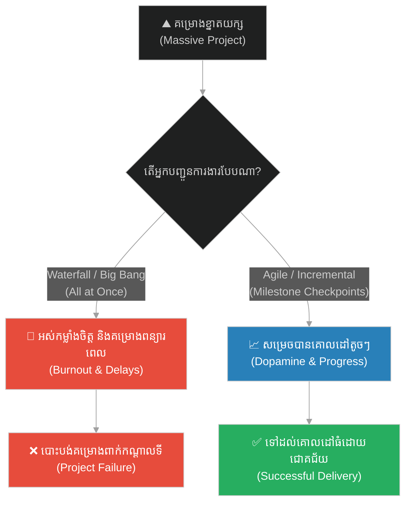
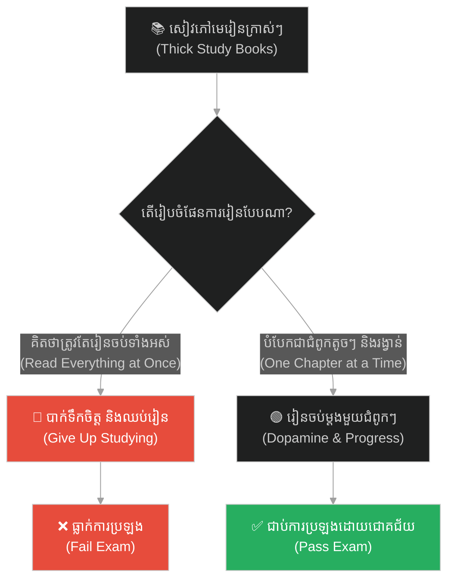
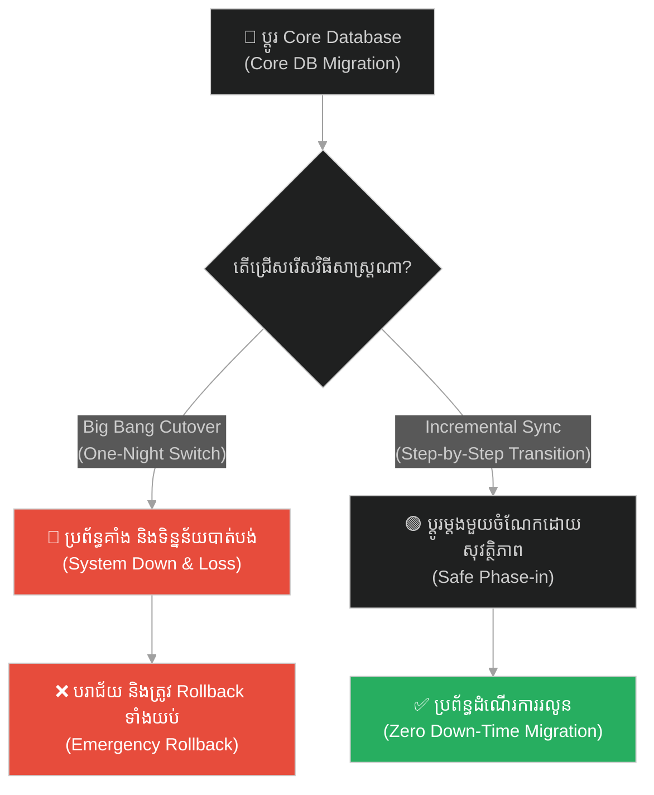
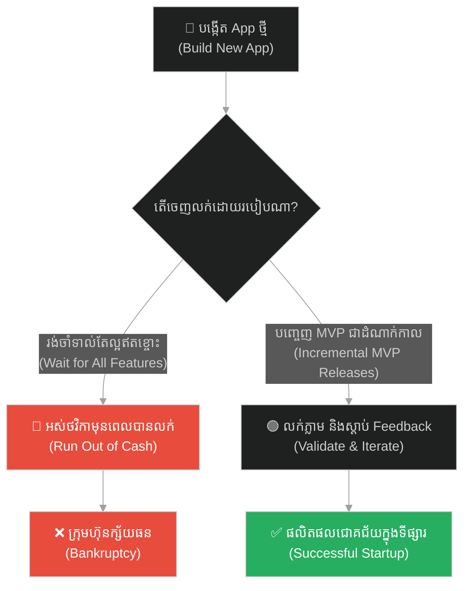
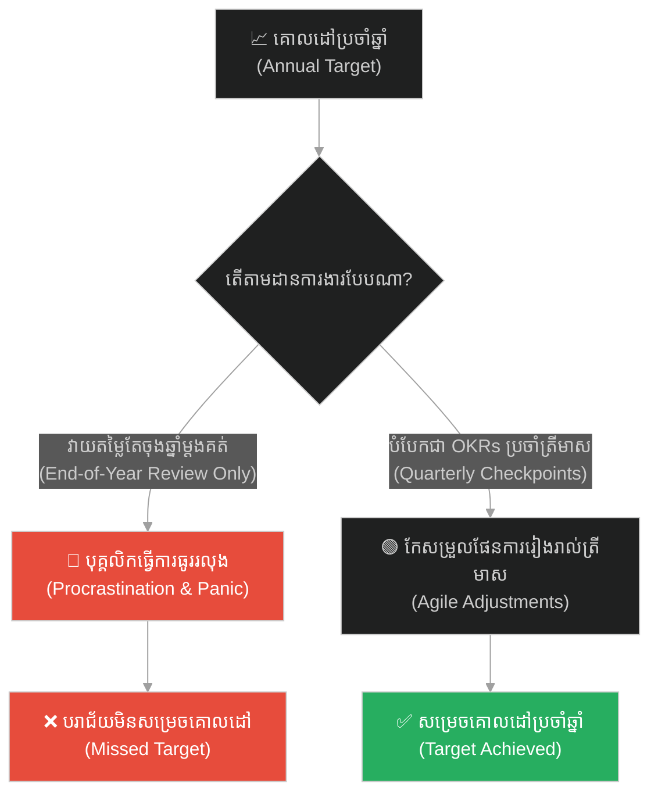
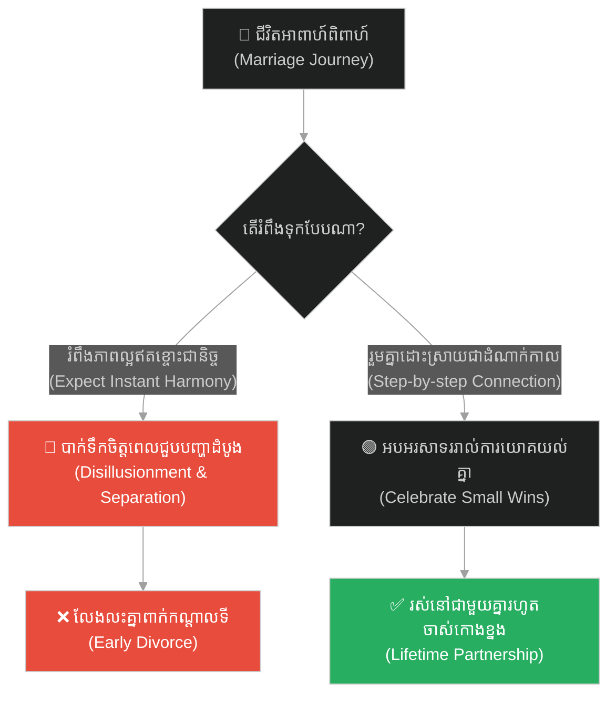
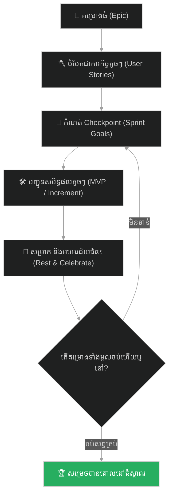

# Project Milestones & Incremental Delivery (គម្រោងការងារ និងការបញ្ជូនការងារជាដំណាក់កាល)៖ ទីក្រុងមាយា (Project Milestones & Incremental Delivery & The Phantom City)

**Author:** ichamrong  
**Date:** 2026-05-28  
**Tags:** #project-management #incremental-delivery #milestones #agile #scrum #mvp #gamification  
**Category:** Concepts  
**Read Time:** ~15 min  

---

## 📌 មាតិកា (Table of Contents)
- [អន្ទាក់ផ្លូវចិត្ត (The Trap)](#0)
- [១. រឿងនិទាន៖ ទីក្រុងមាយា (The Legend of the Phantom City)](#1)
  - [ការសម្រាក និងការរំលាយទីក្រុងមាយា (Resting and Dissolving the Illusion)](#1-1)
- [២. បញ្ហា៖ ការបញ្ជូនគម្រោងបែបធំម្តងទាំងអស់ និងការអស់កម្លាំងពាក់កណ្តាលទី (The Issue: Big Bang vs. Incremental Delivery)](#2)
- [៣. ឧទាហរណ៍ជាក់ស្តែងក្នុងពិភពពិត (Real World Examples)](#3)
  - [ឧទាហរណ៍ទី ១ — កម្រិតស្រាល (គ្រួសារ)៖ ការរៀបចំខ្លួនប្រឡងបាក់ឌុប (The Mountain of Study Material)](#3-1)
  - [ឧទាហរណ៍ទី ២ — កម្រិតមធ្យម (បច្ចេកទេស)៖ ការផ្លាស់ប្តូរប្រព័ន្ធទិន្នន័យខ្នាតយក្ស (The Big Bang Database Migration)](#3-2)
  - [ឧទាហរណ៍ទី ៣ — កម្រិតមធ្យម (ធុរកិច្ច)៖ ការបង្កើតផលិតផលមិនព្រមចេញលក់ (The Never-Ending Product Development)](#3-3)
  - [ឧទាហរណ៍ទី ៤ — កម្រិតមធ្យម (សង្គម/គ្រប់គ្រង)៖ ការដាក់គោលដៅប្រចាំឆ្នាំគ្មានដំណាក់កាល (The Vague Annual Goal)](#3-4)
  - [ឧទាហរណ៍ទី ៥ — កម្រិតធ្ងន់ (ទំនាក់ទំនង)៖ ដំណើរស្វែងរកសុភមង្គលអាពាហ៍ពិពាហ៍ (The Lifetime Perfection Illusion)](#3-5)
- [៤. ដំណោះស្រាយទូទៅ៖ វិធីសាស្ត្រ Agile, MVP និងយន្តការកំណត់ Checkpoint (The General Solution: Agile Iterations & Milestone Checkpoints)](#4)
- [សេចក្តីសន្និដ្ឋាន (Conclusion)](#5)
- [ឯកសារយោង (References)](#6)
- [Related Posts](#7)

---

<a id="0"></a>
## អន្ទាក់ផ្លូវចិត្ត (The Trap)

តើអ្នកធ្លាប់ចាប់ផ្តើមគម្រោងការងារដ៏ធំមួយ រួចស្រាប់តែមានអារម្មណ៍ធុញទ្រាន់ បាក់ទឹកចិត្ត និងចង់បោះបង់ចោលពាក់កណ្តាលទី ដោយសារតែមើលមិនឃើញទីបញ្ចប់នៃផ្លូវដែរឬទេ? នេះហៅថា **Big Bang Release Trap (អន្ទាក់នៃការរំពឹងទុកគោលដៅធំម្តងទាំងអស់)**។ 

* **ម្ខាង (Side A)** — យើងសម្លឹងមើលតែគោលដៅធំចុងក្រោយបង្អស់ (The Ultimate Destination) ដែលនៅឆ្ងាយរាប់ឆ្នាំ ធ្វើឱ្យខួរក្បាលអស់កម្លាំងចិត្ត និងបោះបង់ចោល។
* **ម្ខាងទៀត (Side B)** — យើងបំបែកវាជាគោលដៅតូចៗ (Milestones) ហើយផ្តល់រង្វាន់ដល់ខ្លួនឯងនៅរាល់ពេលឈានដល់ចំណុចនីមួយៗ ទោះបីជាវាមិនទាន់ជាចំណុចចុងក្រោយក៏ដោយ។

ផែនទីបង្ហាញផ្លូវសម្រាប់អត្ថបទនេះ៖
1. **រឿងនិទានទីក្រុងមាយា (The Phantom City)** — របៀបដែលមគ្គុទ្ទេសក៍ស្វែងរកកំណប់ប្រើប្រាស់កលល្បិចដើម្បីរក្សាកម្លាំងចិត្តក្រុម។
2. **បញ្ហាបច្ចេកទេស** — ការវិភាគភាពបរាជ័យនៃការបញ្ជូនគម្រោងបែប Waterfall និងដំណោះស្រាយតាមរយៈ Incremental Delivery។
3. **ឧទាហរណ៍ ៥ កម្រិត** — ការអនុវត្តគំនិត Milestones ក្នុងគ្រប់វិស័យនៃជីវិត។
4. **ដំណោះស្រាយជាក់ស្តែង** — គំនូសបំព្រួញនៃការបញ្ជូនការងារជាដំណាក់កាល និងការប្រើប្រាស់ Checkpoint។



---

<a id="1"></a>
## ១. រឿងនិទាន៖ ទីក្រុងមាយា (The Legend of the Phantom City)

រឿងនេះត្រូវបានកត់ត្រានៅក្នុងគម្ពីរ **Lotus Sutra**។ មានក្រុមអ្នកដំណើរមួយក្រុមធំ កំពុងធ្វើដំណើរឆ្លងកាត់វាលខ្សាច់ដ៏ក្តៅហួតហែង និងគ្រោះថ្នាក់ ដើម្បីទៅរកទីក្រុងកំណប់ទ្រព្យដ៏អស្ចារ្យមួយ។ ដោយសារតែចម្ងាយផ្លូវឆ្ងាយហួសពីការស្មាន និងជួបប្រទះព្យុះខ្សាច់ជាបន្តបន្ទាប់ អ្នកដំណើរទាំងអស់ចាប់ផ្តើមបាក់ទឹកចិត្ត អស់កម្លាំងកាយកម្លាំងចិត្ត ហើយយំសោកសុំត្រឡប់ថយក្រោយវិញ។

អ្នកដឹកនាំក្រុម (តំណាងឱ្យព្រះពុទ្ធ) ដែលជាមនុស្សមានប្រាជ្ញា និងចេះមើលចិត្តមនុស្ស ដឹងថាបើគាត់ប្រាប់ការពិតថាផ្លូវនៅឆ្ងាយណាស់ ពួកគេប្រាកដជាបោះបង់ជីវិតចោលកណ្តាលវាលខ្សាច់ជាមិនខាន។ ដូច្នេះ គាត់ក៏បានប្រើអំណាចវេទមន្ត បង្កើតជា **«ទីក្រុងមាយា» (Phantom City)** មួយដ៏ស្រស់ស្អាត មានទឹកត្រជាក់ និងអាហារហូរហៀរ នៅចំពីមុខពួកគេ។

<a id="1-1"></a>
### ការសម្រាក និងការរំលាយទីក្រុងមាយា (Resting and Dissolving the Illusion)

អ្នកដឹកនាំបានចង្អុលទៅមុខហើយស្រែកថា៖ *«កុំអាលបោះបង់! មើលចុះ ទីក្រុងនៅខាងមុខនោះហើយ។ យើងអាចចូលទៅសម្រាក បរិភោគអាហារ និងគេងឱ្យមានកម្លាំងសិន។»*

អ្នកដំណើរឃើញទីក្រុងនោះ ក៏កើតមានសេចក្តីសង្ឃឹមឡើងវិញ ខំប្រឹងដើរទៅដល់ ហើយបានសម្រាកនៅទីនោះរហូតដល់មានកម្លាំងកាយពេញលេញ និងបាត់បង់ការភ័យខ្លាច។ ពេលនោះ អ្នកដឹកនាំក៏បានរំលាយទីក្រុងមាយានោះចោល រួចប្រាប់ការពិតថា៖ *«ទីក្រុងនេះគ្រាន់តែជារូបភាពបោកប្រាស់ដែលខ្ញុំបង្កើតឡើង ដើម្បីឱ្យអ្នករាល់គ្នាបានសម្រាកប៉ុណ្ណោះ។ ទីក្រុងកំណប់ទ្រព្យពិតប្រាកដនៅមិនឆ្ងាយទៀតទេ។ ឥឡូវអ្នកមានកម្លាំងហើយ តោះយើងបន្តដំណើរទៅមុខទៀត!»*

ដោយសារតែបានសម្រាកកាយ និងបាត់អស់ការភ័យខ្លាច ពួកគេក៏បន្តដំណើរទៅមុខទៀត រហូតដល់រកឃើញកំណប់ទ្រព្យពិតប្រាកដដោយជោគជ័យ។

---

<a id="2"></a>
## ២. បញ្ហា៖ ការបញ្ជូនគម្រោងបែបធំម្តងទាំងអស់ និងការអស់កម្លាំងពាក់កណ្តាលទី (The Issue: Big Bang vs. Incremental Delivery)

នៅក្នុងការគ្រប់គ្រងគម្រោងទន់ (Software Development) ការសរសេរកូដ និងការផ្លាស់ប្តូរប្រព័ន្ធខ្នាតយក្សដោយរំពឹងថានឹង Deploy ជោគជ័យក្នុងពេលតែមួយ (Big Bang Deployment) គឺជាហានិភ័យដ៏ខ្ពស់បំផុត។ បុគ្គលិកជួបប្រទះការហត់នឿយ ហើយនៅពេលមានបញ្ហាកើតឡើង វារមៀលថយក្រោយ (Rollback) ទាំងស្រុង ដែលធ្វើឱ្យបាត់បង់ការងាររាប់ខែ។

វិធីសាស្ត្រ **Incremental Delivery (ការបញ្ជូនការងារជាដំណាក់កាល)** បង្រៀនឱ្យយើងបំបែកគម្រោងធំទៅជា Iterations ឬ Sprints តូចៗ។ រាល់ Sprint យើងបញ្ជូនការងារដែលអាចដំណើរការបាន (Working Increment) ដូចទៅនឹងការបង្កើត «ទីក្រុងមាយា» ដើម្បីឱ្យក្រុមការងារ និងអតិថិជនបានឃើញសមិទ្ធផលពិតប្រាកដ និងមានកម្លាំងចិត្តបន្តទៅមុខ។

ខាងក្រោមនេះជាការប្រៀបធៀបរវាងការផ្លាស់ប្តូរប្រព័ន្ធធំម្តងទាំងអស់ (Fragile Waterfall) និងការផ្លាស់ប្តូរជាដំណាក់កាលដែលមាន Checkpoint (Resilient Agile)៖

```python
# ==============================================================================
# ❌ Anti-Pattern: Big Bang Data Migration (Waterfall style, no intermediate milestones)
# ==============================================================================
class BigBangMigration:
    def __init__(self, database):
        self.db = database

    def run_migration(self, records):
        # Tries to process all 1,000,000 records in a single huge transaction.
        # It runs out of memory, locks database tables, and if the 999,999th record
        # fails, everything rolls back. All progress is lost.
        try:
            with self.db.transaction():
                for record in records:
                    self.db.insert_target(record)
                    self.db.update_source_status(record['id'], 'MIGRATED')
            return True
        except Exception as e:
            # Everything rolled back, zero value delivered.
            return False


# ==============================================================================
#  Resilient Design: Incremental Migration with Checkpoints (Phantom Cities)
# ==============================================================================
import logging

class IncrementalMigration:
    def __init__(self, database, batch_size=1000):
        self.db = database
        self.batch_size = batch_size

    def run_migration(self, records):
        # Read the last saved milestone checkpoint (our temporary city to rest)
        last_processed_id = self.db.get_milestone_checkpoint()
        pending_records = [r for r in records if r['id'] > last_processed_id]
        
        # Process in small incremental batches
        for i in range(0, len(pending_records), self.batch_size):
            batch = pending_records[i : i + self.batch_size]
            try:
                with self.db.transaction():
                    for record in batch:
                        self.db.insert_target(record)
                        self.db.update_source_status(record['id'], 'MIGRATED')
                    
                    # Record the milestone checkpoint after each successful batch
                    last_id = batch[-1]['id']
                    self.db.save_milestone_checkpoint(last_id)
                    logging.info(f"Milestone reached: Migrated up to ID {last_id}. Saving checkpoint.")
            except Exception as e:
                logging.error(f"Migration failed in batch starting with ID {batch[0]['id']}: {e}")
                # We stop processing, but previous batches are already safe and committed.
                # We can resume later without repeating completed work.
                return False
        return True
```

---

<a id="3"></a>
## ៣. ឧទាហរណ៍ជាក់ស្តែងក្នុងពិភពពិត

<a id="3-1"></a>
### ឧទាហរណ៍ទី ១ — កម្រិតស្រាល (គ្រួសារ)៖ ការរៀបចំខ្លួនប្រឡងបាក់ឌុប (The Mountain of Study Material)

* **ស្ថានភាព៖** សិស្សម្នាក់ត្រូវរៀនសៀវភៅក្រាស់ៗរាប់សិបក្បាលក្នុងពេលតែមួយ ដើម្បីត្រៀមប្រឡងបញ្ចប់ការសិក្សា។
* **បញ្ហា៖** ធុញទ្រាន់នឹងការរៀន មិនដឹងចាប់ផ្តើមពីណា ធ្វើឱ្យខួរក្បាលស្ពឹក និងសម្រេចចិត្តឈប់រៀនដើរលេង។
* **ដំណោះស្រាយ៖** បំបែកមេរៀនជាជំពូកតូចៗ។ សន្យានឹងខ្លួនឯងថា បើរៀនចប់មួយជំពូក នឹងអនុញ្ញាតឱ្យខ្លួនឯងលេងហ្គេម ១០ នាទី (ទីក្រុងមាយាសម្រាប់សម្រាក)។



---

<a id="3-2"></a>
### ឧទាហរណ៍ទី ២ — កម្រិតមធ្យម (បច្ចេកទេស)៖ ការផ្លាស់ប្តូរប្រព័ន្ធទិន្នន័យខ្នাত্রយក្ស (The Big Bang Database Migration)

* **ស្ថានភាព៖** ក្រុមហ៊ុនចង់ប្តូរ Core Database ពី On-Premises ទៅ Cloud។
* **បញ្ហា៖** ធ្វើការផ្លាស់ប្តូរម្តងទាំងអស់ (Big Bang Cutover) ធ្វើឱ្យមាន Service Outage រាប់ម៉ោង និងបាត់បង់ទិន្នន័យខ្លះ។
* **ដំណោះស្រាយ៖** ធ្វើការផ្លាស់ប្តូរជាដំណាក់កាល (Incremental Replication & Feature Flags) ដើម្បីផ្ទេរទិន្នន័យម្តងមួយផ្នែក។



---

<a id="3-3"></a>
### ឧទាហរណ៍ទី ៣ — កម្រិតមធ្យម (ធុរកិច្ច)៖ ការបង្កើតផលិតផលមិនព្រមចេញលក់ (The Never-Ending Product Development)

* **ស្ថានភាព៖** ក្រុមហ៊ុន Startup មួយចង់បង្កើត App ទំនើបមួយដែលមានមុខងាររាប់រយ។
* **បញ្ហា៖** ចំណាយពេលអភិវឌ្ឍ ២ ឆ្នាំដោយមិនព្រមចេញ MVP ធ្វើឱ្យអស់លុយវិនិយោគ និងហួសសម័យ។
* **ដំណោះស្រាយ៖** ចេញលក់តែមុខងារស្នូល (MVP) ក្នុងរយៈពេល ៣ ខែ ដើម្បីប្រមូលមតិកែលម្អ (User Feedback)។



---

<a id="3-4"></a>
### ឧទាហរណ៍ទី ៤ — កម្រិតមធ្យម (សង្គម/គ្រប់គ្រង)៖ ការដាក់គោលដៅប្រចាំឆ្នាំគ្មានដំណាក់កាល (The Vague Annual Goal)

* **ស្ថានភាព៖** ក្រុមហ៊ុនដាក់គោលដៅប្រចាំឆ្នាំគឺ «បង្កើនការលក់ឱ្យបាន ២ ដង» ដោយគ្មានការបំបែកជាគោលដៅប្រចាំខែ ឬត្រីមាស។
* **បញ្ហា៖** បុគ្គលិកលែងខ្វល់ខ្វាយក្នុងខែដំបូងៗ ហើយមកប្រញាប់ប្រញាល់នៅចុងឆ្នាំ ធ្វើឱ្យការងារគ្មានគុណភាព។
* **ដំណោះស្រាយ៖** បំបែកគោលដៅធំជា OKRs ប្រចាំត្រីមាស និងការវាយតម្លៃជាប្រចាំ (Quarterly Milestones)។



---

<a id="3-5"></a>
### ឧទាហរណ៍ទី ៥ — កម្រិតធ្ងន់ (ទំនាក់ទំនង)៖ ដំណើរស្វែងរកសុភមង្គលអាពាហ៍ពិពាហ៍ (The Lifetime Perfection Illusion)

* **ស្ថានភាព៖** គូស្នេហ៍ថ្មីថ្មោងរំពឹងថានឹងរស់នៅជាមួយគ្នាយ៉ាងមានសុភមង្គល ១០០% ជារៀងរហូតដោយគ្មានការឈ្លោះប្រកែកគ្នា។
* **បញ្ហា៖** ពេលជួបបញ្ហាហិរញ្ញវត្ថុ ឬការយល់ច្រឡំបន្តិចបន្តួច ក៏បាក់ទឹកចិត្ត និងចង់លែងលះភ្លាមៗ។
* **ដំណោះស្រាយ៖** យល់ថាជីវិតប្តីប្រពន្ធជាដំណើរដ៏វែងឆ្ងាយ។ ត្រូវរួមគ្នាដោះស្រាយបញ្ហាម្តងមួយៗ និងអបអរសាទររាល់ឆ្នាំដែលឆ្លងកាត់រួមគ្នា (Annual Milestones)។



---

<a id="4"></a>
## ៤. ដំណោះស្រាយទូទៅ៖ វិធីសាស្ត្រ Agile, MVP និងយន្តការកំណត់ Checkpoint (The General Solution: Agile Iterations & Milestone Checkpoints)

ដើម្បីបញ្ជូនការងារធំៗឱ្យបានជោគជ័យដោយមិនបាត់បង់កម្លាំងចិត្ត ចូរអនុវត្តតាមវដ្តខាងក្រោម៖

1. **បំបែកការងារ (Decompose):** បំបែក Epic ធំៗឱ្យទៅជា Stories តូចៗដែលអាចបញ្ចប់បានក្នុងរយៈពេល ២ ទៅ ៣ ថ្ងៃ។
2. **បង្កើត Checkpoint សិប្បនិម្មិត (Create Phantom Cities):** កំណត់គោលដៅខ្លីៗដែលងាយសម្រេចបាន ដើម្បីជំរុញឱ្យខួរក្បាលបញ្ចេញសារធាតុ Dopamine (ភាពរីករាយនឹងជ័យជំនះតូចៗ)។
3. **បញ្ចេញសមិទ្ធផលពិតប្រាកដ (Continuous Deployment):** ធានាថាការងារដែលធ្វើរួចត្រូវបានដាក់ឱ្យប្រើប្រាស់ ឬសាកល្បងភ្លាម ដើម្បីទទួលបានមតិកែលម្អពិតប្រាកដ។



---

## 🐇 ធ្លាក់ចូលក្នុងរន្ធទន្សាយ (Enter the Rabbit Hole)
ដើម្បីស្វែងយល់កាន់តែស៊ីជម្រៅអំពីការចេះរកឃើញសមត្ថភាពលាក់កំបាំង និងការស្វែងរករបស់ដែលកំពុងត្រូវការនៅក្នុងខ្លួន ឬក្នុងប្រព័ន្ធ ចូរចុចតំណភ្ជាប់ខាងក្រោម៖

* 🚀 **[ចាប់ផ្តើមដំណើររុករក (Start the Journey) ➔ Hidden Talents & API/CLI Discovery (សមត្ថភាពលាក់កំបាំង និងការរុករកប្រព័ន្ធ)៖ រតនភណ្ឌលាក់កំបាំង](./142-buddha-and-the-hidden-jewel.md)**

---

<a id="5"></a>
## សេចក្តីសន្និដ្ឋាន (Conclusion)

> **«ទីក្រុងមាយាមិនមែនជាការកុហកបោកប្រាស់ដោយអសីលធម៌ឡើយ តែជាមធ្យោបាយដ៏ឈ្លាសវៃ ដើម្បីជួយសម្រាលទុក្ខលំបាក និងផ្តល់កម្លាំងចិត្តដល់មនុស្សឱ្យដើរទៅដល់គោលដៅពិតប្រាកដ។»**

កុំព្យាយាមសម្លឹងមើលតែភ្នំដ៏ខ្ពស់នៅខាងមុខ។ ចូរបោះជំហានតូចៗ បង្កើតទីក្រុងមាយាផ្ទាល់ខ្លួនរបស់អ្នកដើម្បីសម្រាកកាយ រួចបន្តដំណើរទៅមុខទៀតដោយក្តីរីករាយ។

---

<a id="6"></a>
## ឯកសារយោង (References)

* **Lotus Sutra** — *Chapter VII: The Parable of the Phantom City (Ke城喻品)*. The original Buddhist metaphor.
* **Beck, K., et al.** — *Manifesto for Agile Software Development* (2001). Core Agile principles.
* **Duhigg, C.** — *The Power of Habit: Why We Do What We Do in Life and Business* (2012). The neurobiology of small wins and reward loops.

---

<a id="7"></a>
## Related Posts

* **[The Broken Bridge and the Art of Inversion (ស្ពានដែលបាក់ និងវិធានគិតបញ្ច្រាស)៖ របៀបដោះស្រាយបញ្ហាស្មុគស្មាញដោយការចាប់ផ្តើមពីទីបញ្ចប់](./15-the-broken-bridge-and-the-art-of-inversion.md)** — Working backward from milestones.
* **[The Baker and the Butcher (កំហុសនៃភាពល្អ និងការរំពឹងទុក)៖ គ្រោះថ្នាក់នៃការលះបង់គ្មានដែនកំណត់ និងការកសាងមនុស្សលោភលន់គ្មានព្រំដែន](./11-the-baker-and-the-butcher.md)** — Managing expectations throughout the project lifecycle.
