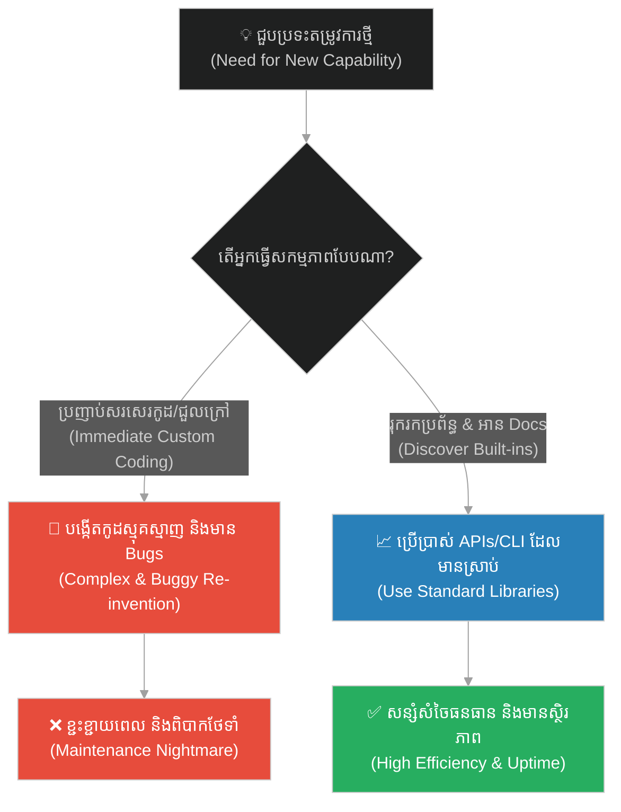
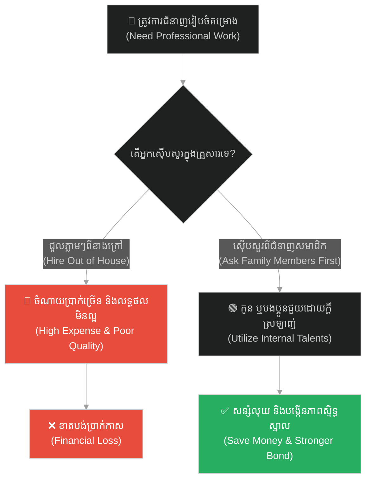
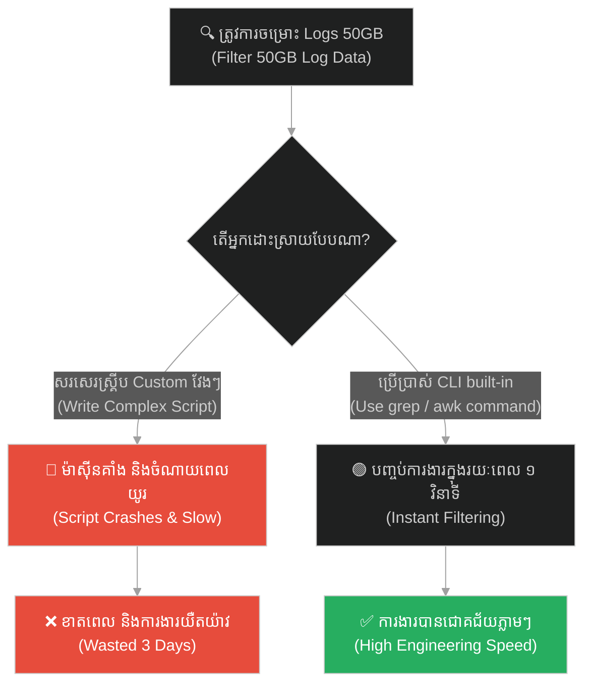
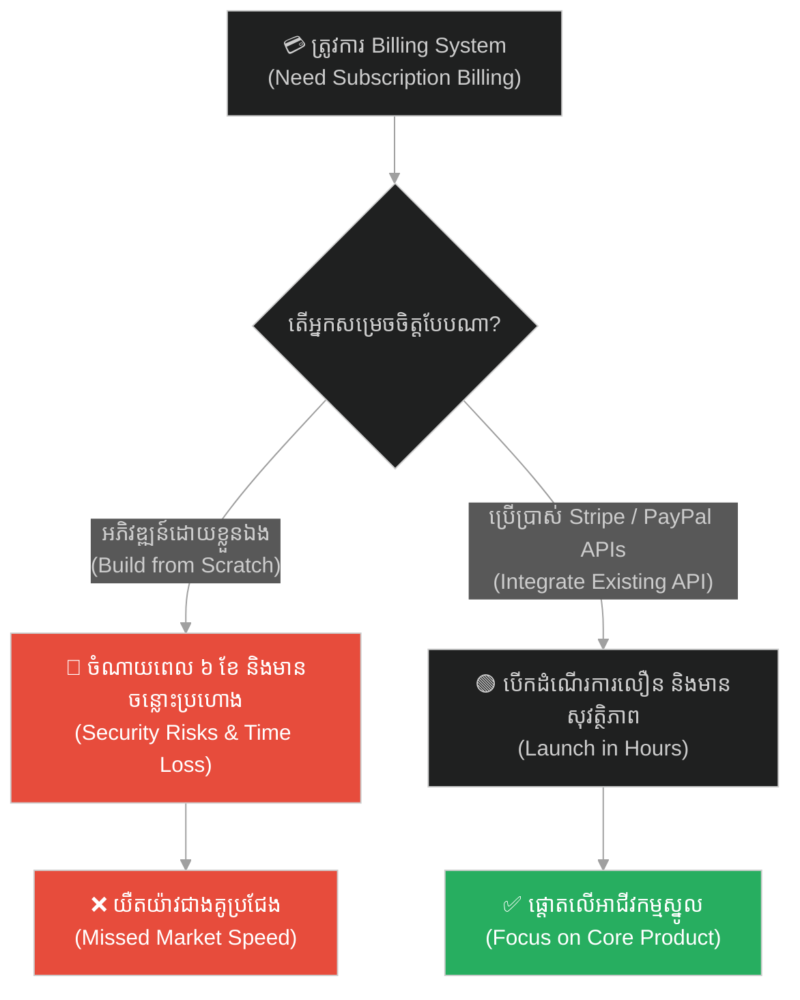
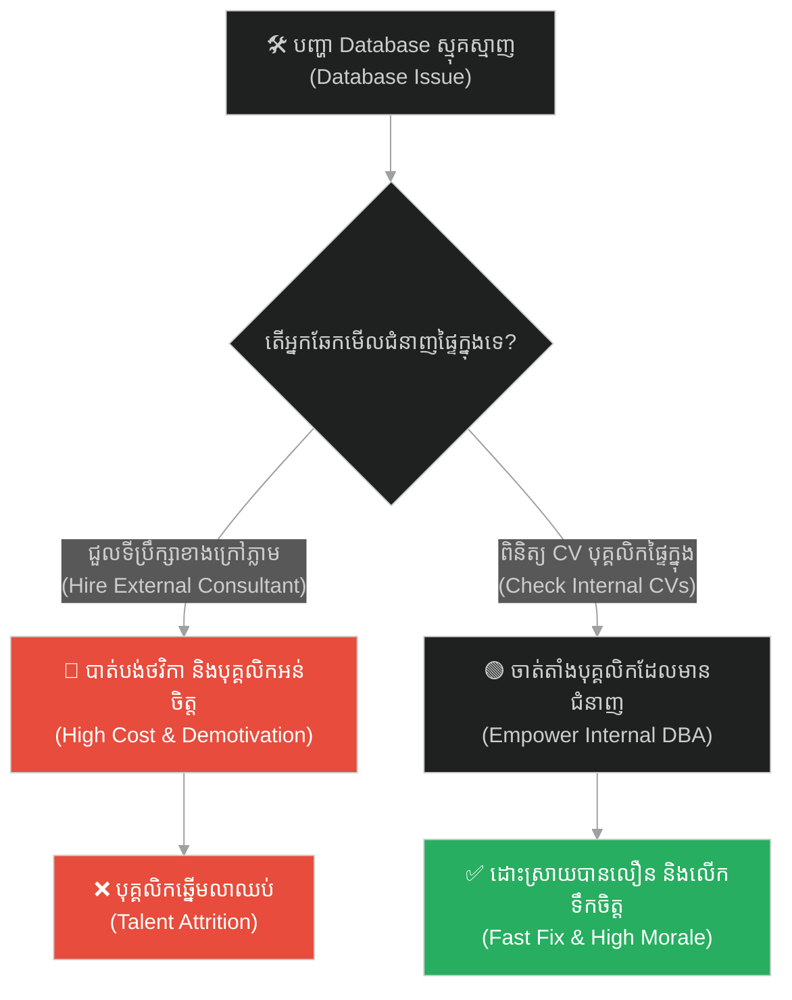
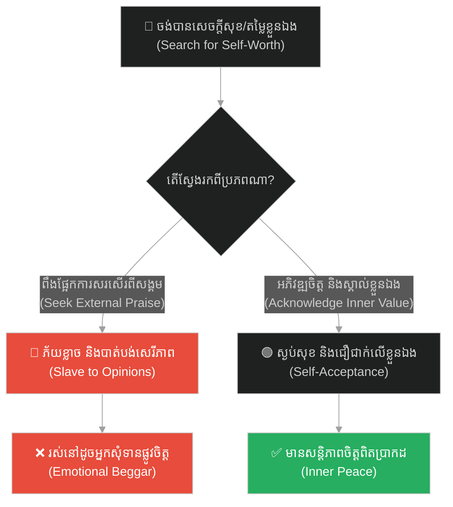
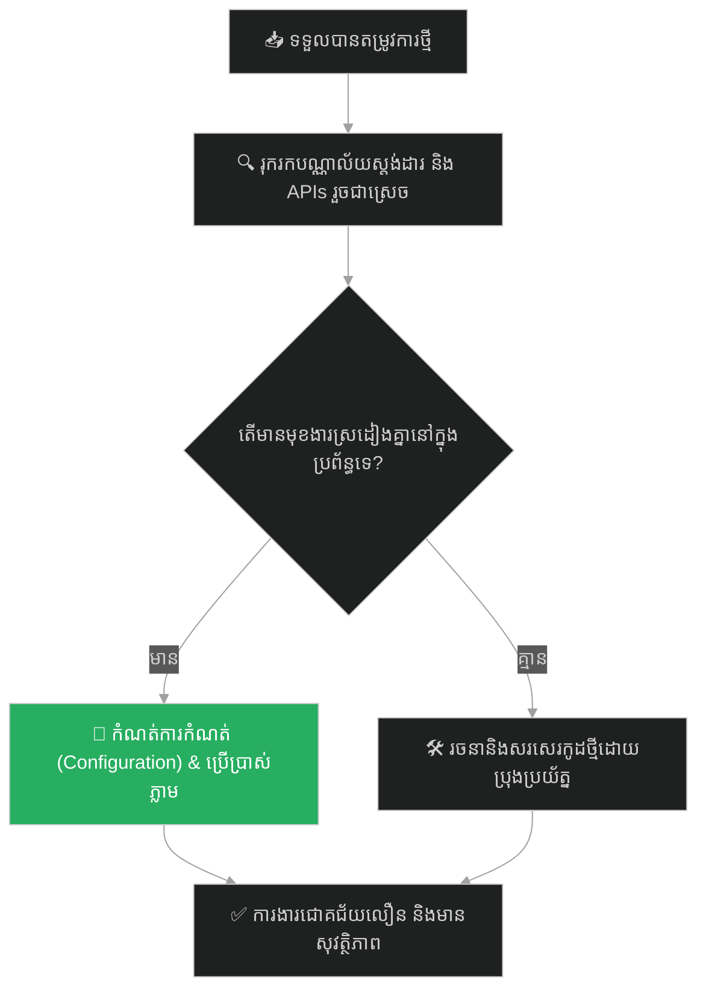

# Hidden Talents & API/CLI Discovery (សមត្ថភាពលាក់កំបាំង និងការរុករកប្រព័ន្ធ)៖ រតនភណ្ឌលាក់កំបាំង (Hidden Talents & API/CLI Discovery & The Hidden Jewel)

**Author:** ichamrong  
**Date:** 2026-05-28  
**Tags:** #potential #api-discovery #cli-tools #reinventing-the-wheel #efficiency #buddhism #self-actualization  
**Category:** Concepts  
**Read Time:** ~15 min  

---

## 📌 មាតិកា (Table of Contents)
- [អន្ទាក់ផ្លូវចិត្ត (The Trap)](#0)
- [១. រឿងនិទាន៖ រតនភណ្ឌលាក់កំបាំងក្នុងស្រទាប់អាវ (The Legend of the Hidden Jewel)](#1)
  - [ការជួបជុំគ្នាវិញ និងការដោះអាវរកពេជ្រ (The Reunion & The Awakening)](#1-1)
- [២. បញ្ហា៖ ការបង្កើតកង់ឡើងវិញ និងការមិនស្វែងយល់ពីប្រព័ន្ធដែលមានស្រាប់ (The Issue: Reinventing the Wheel & Ignorance of Built-ins)](#2)
- [៣. ឧទាហរណ៍ជាក់ស្តែងក្នុងពិភពពិត (Real World Examples)](#3)
  - [ឧទាហរណ៍ទី ១ — កម្រិតស្រាល (គ្រួសារ)៖ ការជួលអ្នកដោះស្រាយបញ្ហាខាងក្រៅ (The Hidden Family Experts)](#3-1)
  - [ឧទាហរណ៍ទី ២ — កម្រិតមធ្យម (បច្ចេកទេស)៖ ការសរសេរកូដជំនួសឱ្យការប្រើប្រាស់ CLI/API (The Custom Log Parser)](#3-2)
  - [ឧទាហរណ៍ទី ៣ — កម្រិតមធ្យម (ធុរកិច្ច)៖ ការបង្កើតប្រព័ន្ធទូទាត់លុយដោយខ្លួនឯង (The Redundant Billing System)](#3-3)
  - [ឧទាហរណ៍ទី ៤ — កម្រិតមធ្យម (សង្គម/គ្រប់គ្រង)៖ ការជួលទីប្រឹក្សាថ្លៃៗក្រៅក្រុមហ៊ុន (The Overlooked Internal Talent)](#3-4)
  - [ឧទាហរណ៍ទី ៥ — កម្រិតធ្ងន់ (ទំនាក់ទំនង)៖ ការស្វែងរកតម្លៃខ្លួនឯងពីការសរសើររបស់សង្គម (The External Validation Beggar)](#3-5)
- [៤. ដំណោះស្រាយទូទៅ៖ ផែនការសិក្សាស្រាវជ្រាវ និងការកសាងសមត្ថភាពរកឃើញប្រព័ន្ធ (The General Solution: API/CLI Audits & Internal Capabilities Matrix)](#4)
- [សេចក្តីសន្និដ្ឋាន (Conclusion)](#5)
- [ឯកសារយោង (References)](#6)
- [Related Posts](#7)

---

<a id="0"></a>
## អន្ទាក់ផ្លូវចិត្ត (The Trap)

តើអ្នកធ្លាប់ចំណាយពេលរាប់សប្តាហ៍ ដើម្បីបង្កើតមុខងារ ឬឧបករណ៍មួយឡើងមក ដោយហត់នឿយយ៉ាងខ្លាំង ប៉ុន្តែក្រោយមកបែរជាដឹងថា Framework ឬប្រព័ន្ធប្រតិបត្តិការដែលអ្នកកំពុងប្រើ មានមុខងារនោះស្រាប់ដោយមិនចាំបាច់សរសេរកូដសូម្បីមួយជួរដែរឬទេ? នេះហៅថា **Reinventing the Wheel Trap (អន្ទាក់នៃការបង្កើតកង់ឡើងវិញ)**។

* **ម្ខាង (Side A)** — យើងរត់ខ្វះខ្វាយស្វែងរកដំណោះស្រាយពីខាងក្រៅ ឬសរសេរកូដថ្មីៗឡើងមក ទាំងមិនដឹងថាឧបករណ៍ជុំវិញខ្លួនមានសមត្ថភាពអាចធ្វើបានរួចជាស្រេច។
* **ម្ខាងទៀត (Side B)** — យើងស៊ើបអង្កេត ស្វែងយល់ និងអានឯកសារណែនាំ (Documentation) ដើម្បីស្វែងរក «ត្បូងពេជ្រ» ដែលមានស្រាប់នៅក្នុងប្រព័ន្ធ ដើម្បីសន្សំធនធាន។

ផែនទីបង្ហាញផ្លូវសម្រាប់អត្ថបទនេះ៖
1. **រឿងនិទានរតនភណ្ឌក្នុងអាវ** — ដំណើររបស់បុរសក្រីក្រដែលដើរសុំទានទាំងមានពេជ្រលាក់ក្នុងខ្លួន។
2. **បញ្ហាបច្ចេកវិទ្យា** — ការវិភាគការបង្កើតកូដផ្ទាល់ខ្លួនជំនួសឱ្យការប្រើប្រាស់ built-in APIs/CLI utilities។
3. **ឧទាហរណ៍ ៥ កម្រិត** — របៀបដែលការមិនស្គាល់សក្តានុពលខាងក្នុង បំផ្លាញធនធានក្នុងគ្រប់ស្ថានភាព។
4. **ដំណោះស្រាយជាក់ស្តែង** — វិធីសាស្ត្រធ្វើសវនកម្មប្រព័ន្ធ និងការរៀបចំ Capability Matrix។



---

<a id="1"></a>
## ១. រឿងនិទាន៖ រតនភណ្ឌលាក់កំបាំងក្នុងស្រទាប់អាវ (The Legend of the Hidden Jewel)

រឿងនេះត្រូវបានកត់ត្រានៅក្នុងគម្ពីរ **Lotus Sutra**។ មានបុរសម្នាក់ក្រីក្រខ្លាំងណាស់ គាត់បានធ្វើដំណើរទៅលេងផ្ទះរបស់មិត្តភក្តិម្នាក់ដែលមានទ្រព្យសម្បត្តិស្តុកស្តម្ភ។ មិត្តភក្តិរបស់គាត់បានរៀបចំម្ហូបអាហារ និងស្រាដ៏ឆ្ងាញ់ៗដើម្បីទទួលស្វាគមន៍គាត់។ ពួកគេបានពិភាក្សាគ្នា និងទទួលទានស្រាយ៉ាងសប្បាយរីករាយ រហូតដល់បុរសក្រីក្រនោះស្រវឹងជោកជាំ និងដេកលក់ទៅ។

នៅកណ្តាលរាត្រីនោះ មិត្តភក្តិរបស់គាត់ទទួលបានដំណឹងបន្ទាន់មួយថាត្រូវតែចេញដំណើរទៅឆ្ងាយជាប្រញាប់។ ដោយក្តីបារម្ភ និងចង់ជួយសង្គ្រោះជីវិតមិត្តក្រីក្រពីភាពក្រីក្រ មិត្តនោះក៏បានយកត្បូងពេជ្រដ៏មានតម្លៃមហាសាលមួយគ្រាប់ មកដេរលាក់ទុកយ៉ាងជិតឈឹងនៅខាងក្នុងស្រទាប់អាវរបស់បុរសនោះ រួចក៏ចាកចេញទៅ។

<a id="1-1"></a>
### ការជួបជុំគ្នាវិញ និងការដោះអាវរកពេជ្រ (The Reunion & The Awakening)

នៅពេលបុរសនោះភ្ញាក់ឡើង គាត់មិនបានដឹងខ្លួនទាល់តែសោះថាមានត្បូងពេជ្រនៅក្នុងអាវរបស់គាត់។ គាត់នៅតែបន្តដើរលកលិចរស់នៅក្នុងភាពក្រីក្រលំបាកតោកយ៉ាក ដេកតាមដងផ្លូវ សុំទានគេពីមួយថ្ងៃទៅមួយថ្ងៃ និងធ្វើការងារធ្ងន់ៗដើម្បីគ្រាន់តែបានបាយមួយពេលៗ ដោយយល់ថាខ្លួនឯងគឺជាមនុស្សអភ័ព្វបំផុតក្នុងលោក។

ជាច្រើនឆ្នាំក្រោយមក មិត្តភក្តិអ្នកមានរបស់គាត់បានវិលត្រឡប់មកវិញ ហើយបានជួបគាត់កំពុងសុំទានតាមដងផ្លូវទាំងសម្លៀកបំពាក់រហែករហុយ។ មិត្តនោះភ្ញាក់ផ្អើលយ៉ាងខ្លាំង ក៏ដើរទៅចាប់ស្មារបស់គាត់ហើយសួរថា៖ *«ហេតុអ្វីបានជាឯងនៅតែរស់នៅក្នុងសភាពបែបនេះ? តើឯងមិនបានរកឃើញត្បូងពេជ្រដែលខ្ញុំដេរលាក់ទុកក្នុងអាវរបស់ឯងទេឬ?»*

បុរសក្រីក្រភ្ញាក់ផ្អើល ក៏ប្រញាប់រុះរើស្រទាប់អាវចាស់របស់ខ្លួន។ នៅពេលគាត់ឃើញត្បូងពេជ្រភ្លឺរលោងធ្លាក់មក គាត់ក៏ស្រក់ទឹកភ្នែកដោយការសោកស្តាយ ដែលខ្លួនឯងមានទ្រព្យមហាសាលជាប់ខ្លួនរាប់ឆ្នាំ ប៉ុន្តែបែរជារស់នៅជាអ្នកសុំទានព្រោះតែភាពមិនដឹងរបស់ខ្លួន។

---

<a id="2"></a>
## ២. បញ្ហា៖ ការបង្កើតកង់ឡើងវិញ និងការមិនស្វែងយល់ពីប្រព័ន្ធដែលមានស្រាប់ (The Issue: Reinventing the Wheel & Ignorance of Built-ins)

នៅក្នុងវិស័យវិស្វកម្មសូហ្វវែរ (Software Engineering) ជារឿយៗអ្នកសរសេរកូដតែងតែបង្កើតឧបករណ៍ផ្ទាល់ខ្លួនដែលជួបប្រទះនឹងកំហុសជាច្រើន (Bugs) ដោយសារតែខ្វះការយល់ដឹងអំពីស្តង់ដារបណ្ណាល័យ (Standard Libraries) ឬ Built-in API capabilities របស់ប្រព័ន្ធប្រតិបត្តិការ ឬ Framework ដែលខ្លួនកំពុងប្រើ។

ការមិនអានឯកសារណែនាំ ឬការខ្វះការរុករក (Discovery) ធ្វើឱ្យក្រុមការងាររស់នៅដូច «អ្នកសុំទាន» ដោយខិតខំសរសេរកូដស្មុគស្មាញរាប់រយបន្ទាត់ ក្នុងពេលដែលប្រព័ន្ធមានមុខងារនោះរួចជាស្រេច ថែមទាំងមានល្បឿនលឿន និងស្ថិរភាពជាងឆ្ងាយ។

ខាងក្រោមនេះជាការប្រៀបធៀបរវាងការសរសេរកូដ socket ដោយដៃ និងការប្រើប្រាស់ Connection Pool API របស់បណ្ណាល័យស្តង់ដារ៖

```python
# ==============================================================================
# ❌ Anti-Pattern: Custom Socket and Connection Management (Reinventing the HTTP wheel)
# ==============================================================================
import socket

class PoorMansHttpClient:
    def __init__(self, host, port):
        self.host = host
        self.port = port

    def send_get_request(self, path):
        # Manually constructing HTTP/1.1 requests, managing sockets, retries,
        # and parsing header responses. Highly error-prone and hard to maintain.
        s = socket.socket(socket.AF_INET, socket.SOCK_STREAM)
        s.connect((self.host, self.port))
        
        request = f"GET {path} HTTP/1.1\r\nHost: {self.host}\r\nConnection: keep-alive\r\n\r\n"
        s.sendall(request.encode())
        
        # Simple buffer reading that fails on large payloads or timeout conditions
        response = s.recv(4096)
        s.close()
        return response.decode()


# ==============================================================================
#  Resilient Design: Discovering Built-in Connection Pools (The Hidden Jewel)
# ==============================================================================
import requests
from requests.adapters import HTTPAdapter
from urllib3.util import Retry

class ResilientHttpClient:
    def __init__(self, base_url):
        self.base_url = base_url
        # Instead of manual socket management, we discover and configure
        # the built-in Connection Pool and Retry mechanisms in urllib3/requests.
        self.session = requests.Session()
        
        retries = Retry(
            total=3,
            backoff_factor=0.5,
            status_forcelist=[500, 502, 503, 504],
            raise_on_status=False
        )
        
        # Mount the adapter to automatically handle connection pooling and retries
        self.session.mount("https://", HTTPAdapter(max_retries=retries))

    def get_data(self, path):
        try:
            response = self.session.get(f"{self.base_url}{path}", timeout=5.0)
            response.raise_for_status()
            return response.json()
        except requests.exceptions.RequestException as e:
            # Safely handle errors using standard exception classes
            return {"error": str(e)}
```

---

<a id="3"></a>
## ៣. ឧទាហរណ៍ជាក់ស្តែងក្នុងពិភពពិត

<a id="3-1"></a>
### ឧទាហរណ៍ទី ១ — កម្រិតស្រាល (គ្រួសារ)៖ ការជួលអ្នកដោះស្រាយបញ្ហាខាងក្រៅ (The Hidden Family Experts)

* **ស្ថានភាព៖** គ្រួសារមួយត្រូវការធ្វើការរចនាគេហទំព័រ ឬរៀបចំគណនេយ្យសម្រាប់អាជីវកម្មខ្នាតតូចរបស់ខ្លួន ហើយបានចំណាយលុយរាប់ពាន់ដុល្លារជួលក្រុមហ៊ុនខាងក្រៅ។
* **បញ្ហា៖** គ្មានប្រសិទ្ធភាព និងចំណាយប្រាក់ច្រើន ទាំងដែលពួកគេមិនដឹងថាកូនប្រុស ឬបងស្រីរបស់ខ្លួនជាអ្នកជំនាញវិស្វកម្ម ឬគណនេយ្យករអាជីពស្រាប់។
* **ដំណោះស្រាយ៖** ធ្វើការជជែកគ្នាក្នុងគ្រួសារ និងកំណត់សមត្ថភាពលាក់កំបាំងរបស់សមាជិកមុនពេលស្វែងរកជំនួយពីក្រៅ។



---

<a id="3-2"></a>
### ឧទាហរណ៍ទី ២ — កម្រិតមធ្យម (បច្ចេកទេស)៖ ការសរសេរកូដជំនួសឱ្យការប្រើប្រាស់ CLI/API (The Custom Log Parser)

* **ស្ថានភាព៖** Developer ចំណាយពេល ៣ ថ្ងៃសរសេរស្គ្រីប Python វែងអន្លាយដើម្បីស្វែងរកពាក្យគន្លឹះក្នុង Log files ទំហំ 50GB។
* **បញ្ហា៖** ស្គ្រីបដំណើរការយឺត និងគាំងម៉ាស៊ីន (Out of Memory) ព្រោះមិនចេះប្រើប្រាស់ CLI tools។
* **ដំណោះស្រាយ៖** ប្រើប្រាស់ឧបករណ៍ Built-in របស់ Linux ដូចជា `grep`, `awk` ឬ `sed` ដែលអាចដោះស្រាយក្នុងពេលប៉ុន្មានវិនាទី។



---

<a id="3-3"></a>
### ឧទាហរណ៍ទី ៣ — កម្រិតមធ្យម (ធុរកិច្ច)៖ ការបង្កើតប្រព័ន្ធទូទាត់លុយដោយខ្លួនឯង (The Redundant Billing System)

* **ស្ថានភាព៖** ក្រុមហ៊ុន Startup ចង់លក់ផលិតផលអនឡាញ ក៏ចាត់តាំងឱ្យក្រុមការងារបង្កើតប្រព័ន្ធគ្រប់គ្រងសមាជិកភាព និង Billing system ដោយខ្លួនឯង។
* **បញ្ហា៖** ចំណាយពេលអភិវឌ្ឍ ៦ ខែ ថែមទាំងប្រឈមនឹងបញ្ហាសន្តិសុខទិន្នន័យ (PCI DSS compliance)។
* **ដំណោះស្រាយ៖** ប្រើប្រាស់ API រួចជាស្រេចរបស់ Stripe ឬ PayPal ដែលមានសុវត្ថិភាពខ្ពស់ និងរៀបចំរួចរាល់ក្នុងរយៈពេលកន្លះថ្ងៃ។



---

<a id="3-4"></a>
### ឧទាហរណ៍ទី ៤ — កម្រិតមធ្យម (សង្គម/គ្រប់គ្រង)៖ ការជួលទីប្រឹក្សាថ្លៃៗក្រៅក្រុមហ៊ុន (The Overlooked Internal Talent)

* **ស្ថានភាព៖** ក្រុមហ៊ុនមួយជួបប្រទះបញ្ហាស្ថិរភាពប្រព័ន្ធ Database ក៏ជួលទីប្រឹក្សាខាងក្រៅមកដោះស្រាយដោយផ្តល់ប្រាក់កម្រៃខ្ពស់។
* **បញ្ហា៖** ទីប្រឹក្សាប្រើពេលយូរដើម្បីយល់ពីប្រព័ន្ធ ទាំងដែលបុគ្គលិកជាន់ខ្ពស់ម្នាក់ក្នុងក្រុមហ៊ុន មានជំនាញ DBA ស្រាប់តែត្រូវបានគេចាត់ឱ្យទៅសរសេរតែកូដ Frontend សាមញ្ញៗ។
* **ដំណោះស្រាយ៖** ធ្វើ Capability Mapping ដើម្បីកំណត់ជំនាញពិតប្រាកដរបស់បុគ្គលិកដែលមានស្រាប់។



---

<a id="3-5"></a>
### ឧទាហរណ៍ទី ៥ — កម្រិតធ្ងន់ (ទំនាក់ទំនង)៖ ការស្វែងរកតម្លៃខ្លួនឯងពីការសរសើររបស់សង្គម (The External Validation Beggar)

* **ស្ថានភាព៖** មនុស្សម្នាក់តែងតែមានអារម្មណ៍ថាខ្លួនឯងមិនល្អគ្រប់គ្រាន់ ក៏ខំប្រឹងទិញរបស់ប្រេនៗ និងបង្ហោះរូបដើម្បីទទួលបានការចុច Like និងសរសើរពីអ្នកដទៃ។
* **បញ្ហា៖** ក្លាយជាទាសករនៃមតិសាធារណៈ រស់នៅក្នុងការភ័យខ្លាចការរិះគន់ជានិច្ច (Imposter Syndrome)។
* **ដំណោះស្រាយ៖** ទទួលស្គាល់ថាខ្លួនឯងមានគុណតម្លៃជាមនុស្ស និងសេចក្តីសុខពីខាងក្នុងរួចជាស្រេច (ត្បូងពេជ្រក្នុងខ្លួន) ដោយមិនចាំបាច់មានការបញ្ជាក់ពីខាងក្រៅ។



---

<a id="4"></a>
## ៤. ដំណោះស្រាយទូទៅ៖ ផែនការសិក្សាស្រាវជ្រាវ និងការកសាងសមត្ថភាពរកឃើញប្រព័ន្ធ (The General Solution: API/CLI Audits & Internal Capabilities Matrix)

ដើម្បីកុំឱ្យធ្លាក់ចូលទៅក្នុងអន្ទាក់នៃការបង្កើតកង់ឡើងវិញ និងការខ្ជះខ្ជាយធនធាន ចូរអនុវត្តជំហានខាងក្រោម៖

1. **ស្វែងយល់មុននឹងសរសេរ (Read Before Writing):** រាល់ពេលដែលត្រូវបង្កើតមុខងារថ្មី ចូរចំណាយពេលយ៉ាងតិច ២ ម៉ោង ដើម្បីស្រាវជ្រាវរកមើលបណ្ណាល័យស្តង់ដារ ឬ APIs ដែលមានស្រាប់។
2. **កសាងផែនទីសមត្ថភាព (Capability Mapping):** ធ្វើបញ្ជីសមត្ថភាព និងជំនាញរបស់ប្រព័ន្ធ ឬបុគ្គលិកដែលមានស្រាប់ ដើម្បីអាចយកមកប្រើប្រាស់ចំគោលដៅ។
3. **កាត់បន្ថយភាពស្មុគស្មាញ (Simplify Dependencies):** ជ្រើសរើសប្រើប្រាស់របស់ដែលសាមញ្ញ និងមានស្រាប់ជាជាងការបង្កើតកូដផ្ទាល់ខ្លួនដ៏ធំ និងពិបាកថែទាំ។



---

## 🐇 ធ្លាក់ចូលក្នុងរន្ធទន្សាយ (Enter the Rabbit Hole)
ដើម្បីស្វែងយល់កាន់តែស៊ីជម្រៅអំពីរបៀបកែលម្អប្រព័ន្ធជាបន្តបន្ទាប់ និងដំណើរការដោះស្រាយបញ្ហាកូដក្នុងប្រព័ន្ធ CI/CD សូមចុចតំណភ្ជាប់ខាងក្រោម៖

* 🚀 **[ចាប់ផ្តើមដំណើររុករក (Start the Journey) ➔ Iterative Refactoring & CI Code Quality (ការកែលម្អកូដជាបន្តបន្ទាប់ និងគុណភាពកូដ CI)៖ ជាងមាស](./143-buddha-and-the-goldsmith.md)**

---

<a id="5"></a>
## សេចក្តីសន្និដ្ឋាន (Conclusion)

> **«ត្បូងពេជ្រដ៏មានតម្លៃមហាសាលបានដេរភ្ជាប់នៅក្នុងស្រទាប់អាវរបស់អ្នករួចជាស្រេចហើយ។ ចូរកុំរស់នៅក្នុងភាពក្រីក្រ និងដើរសុំទានពីខាងក្រៅទៀតឡើយ។»**

នៅពេលអ្នកចាប់ផ្តើមស្វែងយល់ពីប្រព័ន្ធ និងសមត្ថភាពដែលមានស្រាប់ ទាំងនៅក្នុងបច្ចេកវិទ្យា និងនៅក្នុងចិត្តគំនិតខ្លួនឯង អ្នកនឹងរកឃើញផ្លូវកាត់ដ៏មានប្រសិទ្ធភាពបំផុត។

---

<a id="6"></a>
## ឯកសារយោង (References)

* **Lotus Sutra** — *Chapter VIII: Five Hundred Disciples Receive the Prediction (五百弟子受記品)*. The original source for this parable.
* **Raymond, E. S.** — *The Art of Unix Programming* (2003). Standard philosophy on using built-in command line tools and avoiding custom code.
* **Maslow, A. H.** — *Toward a Psychology of Being* (1968). Self-actualization and realizing internal potential.

---

<a id="7"></a>
## Related Posts

* **[Project Milestones & Incremental Delivery (គម្រោងការងារ និងការបញ្ជូនការងារជាដំណាក់កាល)៖ ទីក្រុងមាយា](./141-buddha-and-the-phantom-city.md)** — Setting milestones to step-by-step discover and deliver values.
* **[The Cracked Pot and the Five Whys (ក្អមដីប្រេះ និងអាថ៌កំបាំងសំនួរស្វែងរកឫសគល់ទាំង ៥)៖ របៀបដោះស្រាយបញ្ហាឱ្យចំឫសគល់ពិតប្រាកដ](./14-the-cracked-pot-and-the-five-whys.md)** — Root cause analysis and continuous system updates.
