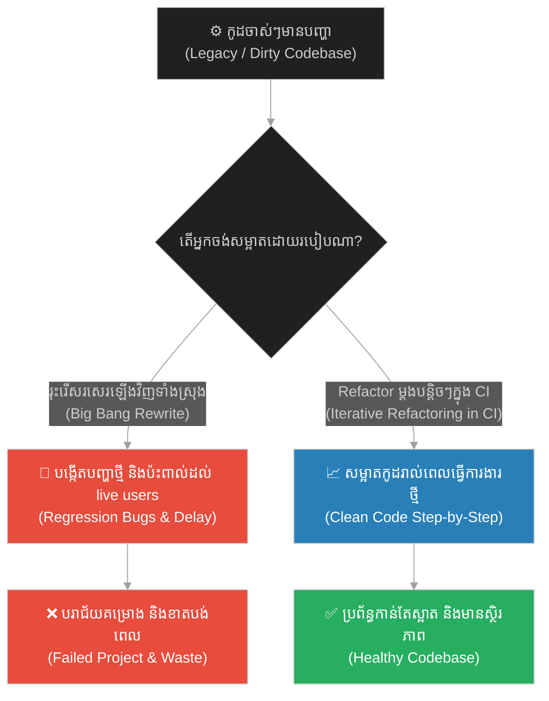
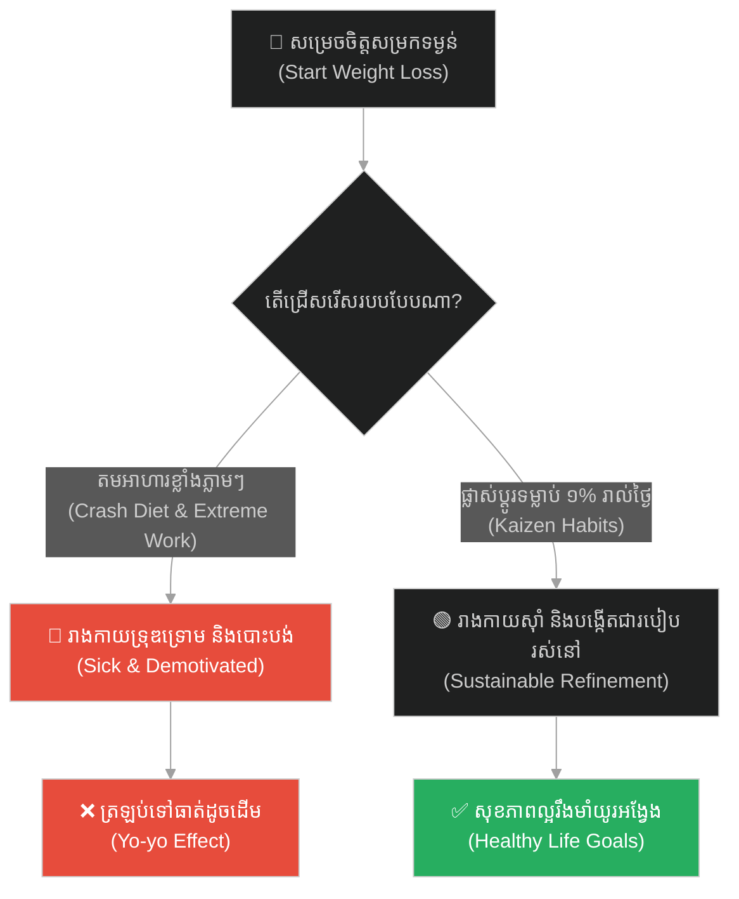
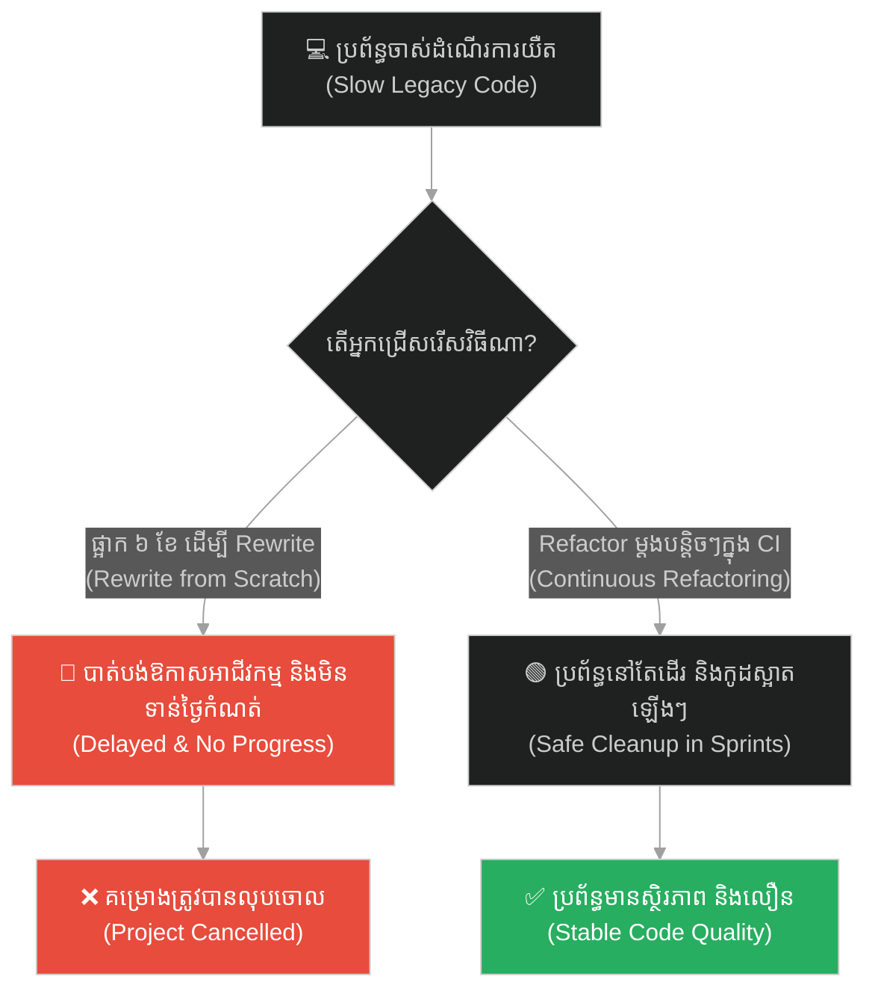
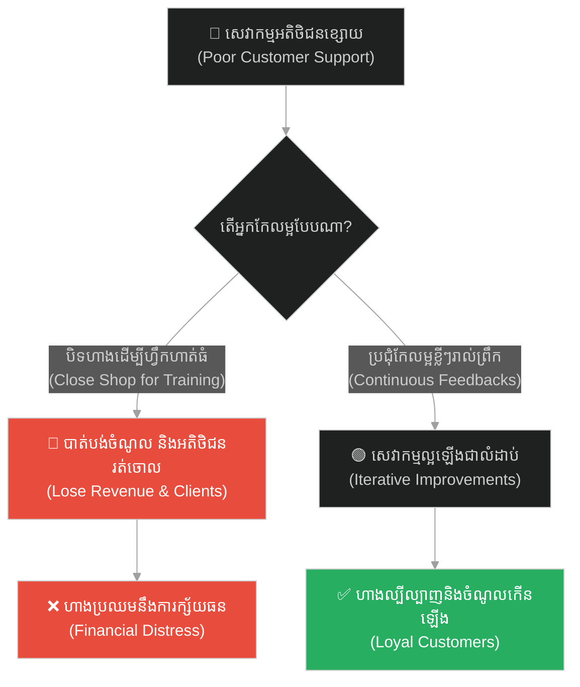
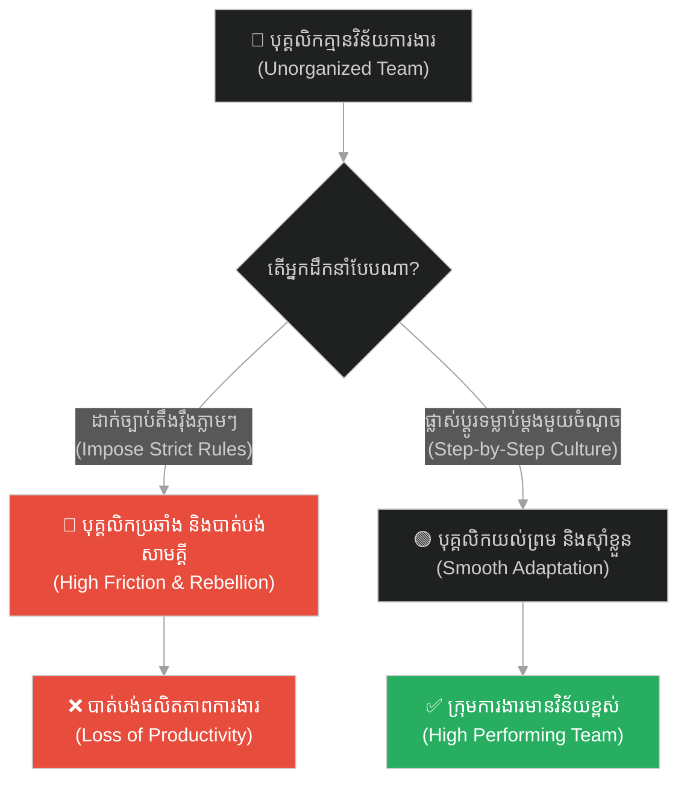
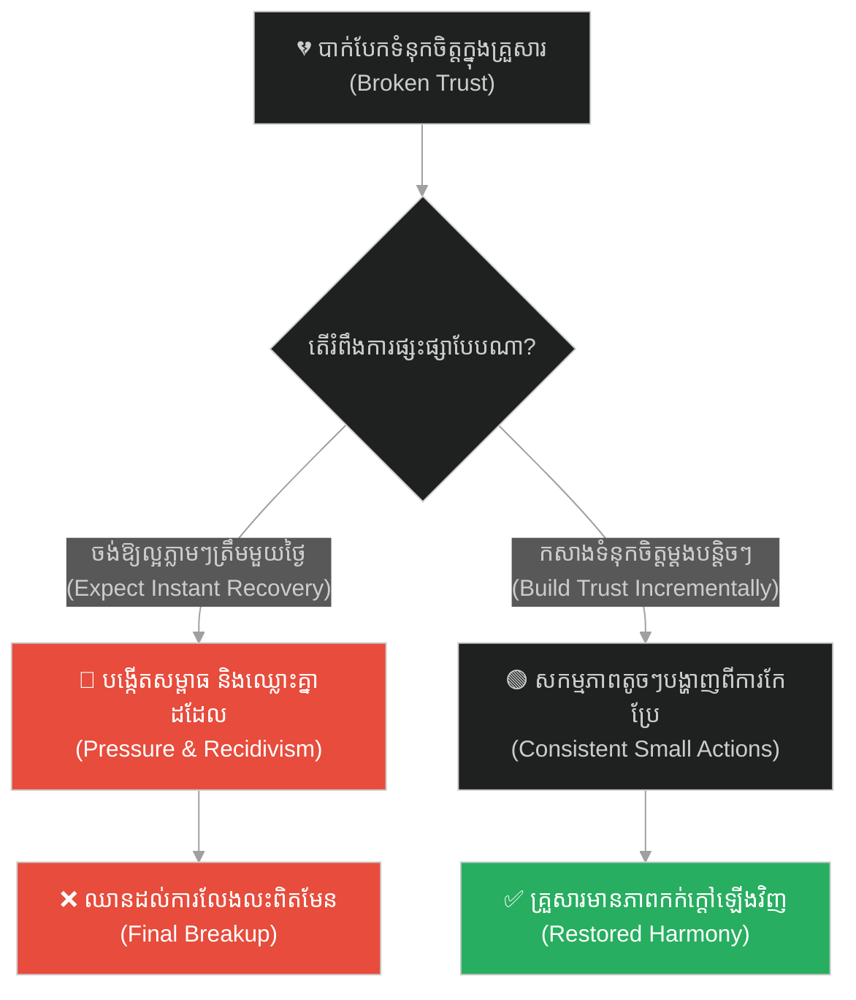
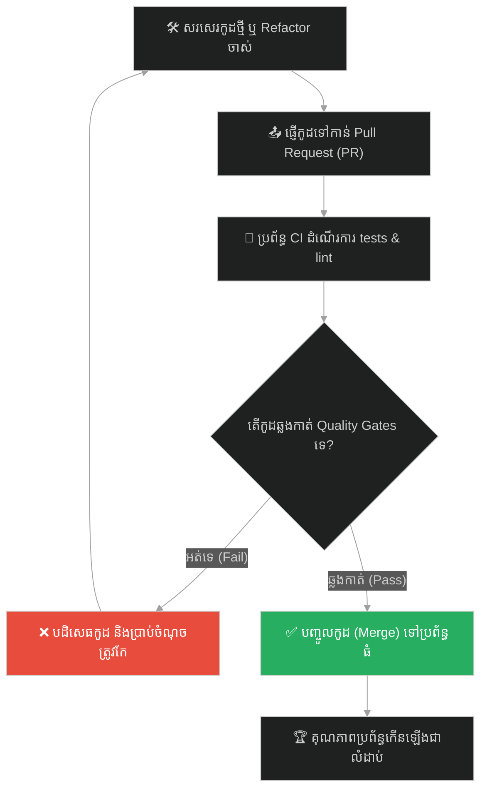

# Iterative Refactoring & CI Code Quality (ការកែលម្អកូដជាបន្តបន្ទាប់ និងគុណភាពកូដ CI)៖ ជាងមាស (Iterative Refactoring & CI Code Quality & The Goldsmith)

**Author:** ichamrong  
**Date:** 2026-05-28  
**Tags:** #refactoring #clean-code #ci-cd #continuous-integration #kaizen #gradual-improvement #software-quality  
**Category:** Concepts  
**Read Time:** ~15 min  

---

## 📌 មាតិកា (Table of Contents)
- [អន្ទាក់ផ្លូវចិត្ត (The Trap)](#0)
- [១. រឿងនិទាន៖ អ្នកជាងមាស និងការបន្សុទ្ធមាសឆៅ (The Legend of the Goldsmith)](#1)
  - [ការសម្អាតដីខ្សាច់ និងការដុតកម្ដៅក្នុងឡ (The Furnace & The Purification)](#1-1)
- [២. បញ្ហា៖ ការសរសេរកូដគ្មានសណ្តាប់ធ្នាប់ និងការរុះរើកូដខ្នាតយក្ស (The Issue: Technical Debt & Big Bang Rewrites)](#2)
- [៣. ឧទាហរណ៍ជាក់ស្តែងក្នុងពិភពពិត (Real World Examples)](#3)
  - [ឧទាហរណ៍ទី ១ — កម្រិតស្រាល (គ្រួសារ)៖ របៀបរស់នៅប្រកបដោយសុខភាពល្អ (The Crash Diet Failure)](#3-1)
  - [ឧទាហរណ៍ទី ២ — កម្រិតមធ្យម (បច្ចេកទេស)៖ ការកែលម្អកូដចាស់ៗនៅក្នុងប្រព័ន្ធ (The Legacy Code Overhaul)](#3-2)
  - [ឧទាហរណ៍ទី ៣ — កម្រិតមធ្យម (ធុរកិច្ច)៖ ការកែលម្អសេវាកម្មអតិថិជន (The Customer Service Iteration)](#3-3)
  - [ឧទាហរណ៍ទី ៤ — កម្រិតមធ្យម (សង្គម/គ្រប់គ្រង)៖ ការផ្លាស់ប្តូរវប្បធម៌ការងារក្នុងក្រុម (The Overbearing Policy Book)](#3-4)
  - [ឧទាហរណ៍ទី ៥ — កម្រិតធ្ងន់ (ទំនាក់ទំនង)៖ ការផ្សះផ្សាទំនុកចិត្តឡើងវិញ (The Instant Reconciliation Myth)](#3-5)
- [៤. ដំណោះស្រាយទូទៅ៖ វដ្តការងារ CI/CD, វិធានក្មេងប្រុសកាយរឹទ្ធ និងការ Refactor ជាប្រចាំ (The General Solution: Boy Scout Rule & Automated CI Quality Gates)](#4)
- [សេចក្តីសន្និដ្ឋាន (Conclusion)](#5)
- [ឯកសារយោង (References)](#6)
- [Related Posts](#7)

---

<a id="0"></a>
## អន្ទាក់ផ្លូវចិត្ត (The Trap)

តើអ្នកធ្លាប់ព្យាយាមកែប្រែប្រព័ន្ធស្មុគស្មាញ ឬទម្លាប់អាក្រក់របស់ខ្លួនទាំងអស់ក្នុងពេលតែមួយថ្ងៃ រួចស្រាប់តែបរាជ័យ និងបាក់ទឹកចិត្តចង់បោះបង់ចោលទាំងស្រុងដែរឬទេ? នេះហៅថា **The Big Bang Reform Trap (អន្ទាក់នៃការកែទម្រង់ទ្រង់ទ្រាយធំភ្លាមៗ)**។

* **ម្ខាង (Side A)** — យើងព្យាយាមរុះរើកូដ ឬប្រព័ន្ធទាំងស្រុង (Full Rewrite) ក្នុងពេលតែមួយ ដែលបង្កើតឱ្យមានហានិភ័យ និងការរំខានយ៉ាងខ្លាំងដល់ដំណើរការចរន្ត។
* **ម្ខាងទៀត (Side B)** — យើងអត់ធ្មត់ កែលម្អប្រព័ន្ធម្តងបន្តិចៗរាល់ថ្ងៃ (Continuous Refactoring) ដូចជាងមាសដែលបន្សុទ្ធមាសឆៅឱ្យក្លាយជាមាសសុទ្ធ។

ផែនទីបង្ហាញផ្លូវសម្រាប់អត្ថបទនេះ៖
1. **រឿងនិទានព្រះពុទ្ធនិងជាងមាស** — វិធីសាស្ត្រសម្អាតភាពមិនបរិសុទ្ធចេញពីមាសឆៅតាមលំដាប់លំដោយ។
2. **បញ្ហាបច្ចេកវិទ្យា** — ហានិភ័យនៃការ Rewrite ទាំងស្រុង និងថាមពលនៃការ Refactoring បូករួមនឹង CI (Continuous Integration)។
3. **ឧទាហរណ៍ ៥ កម្រិត** — ការវិភាគការផ្លាស់ប្តូរបែប Kaizen ក្នុងគ្រប់ស្ថានភាព។
4. **ដំណោះស្រាយជាក់ស្តែង** — វិធានការដោះស្រាយ Boy Scout Rule និងរបៀបរៀបចំ CI Quality Gates។



---

<a id="1"></a>
## ១. រឿងនិទាន៖ អ្នកជាងមាស និងការបន្សុទ្ធមាសឆៅ (The Legend of the Goldsmith)

ថ្ងៃមួយ ព្រះសម្មាសម្ពុទ្ធទ្រង់គង់នៅក្នុងវត្តជេតពន បានបង្រៀនភិក្ខុទាំងឡាយអំពីរបៀបបន្សុទ្ធចិត្ត ដើម្បីកម្ចាត់កិលេស និងអំពើអាក្រក់។ ព្រះអង្គបានលើកយកឧទាហរណ៍អំពី **«អ្នកជាងមាស» (The Goldsmith)** ដ៏មានជំនាញម្នាក់។

ព្រះអង្គមានសង្ឃដីកាថា៖ *«ម្នាលភិក្ខុទាំងឡាយ! នៅពេលជាងមាសជីកបានមាសឆៅពីក្នុងដី តើគាត់អាចយកវាមកធ្វើជាគ្រឿងអលង្ការភ្លាមៗបានដែរឬទេ? ទេ គឺមិនអាចឡើយ ព្រោះមាសនោះនៅឡាយឡំដោយដី ថ្ម ខ្សាច់ និងភាពកខ្វក់ជាច្រើន។»*

<a id="1-1"></a>
### ការសម្អាតដីខ្សាច់ និងការដុតកម្ដៅក្នុងឡ (The Furnace & The Purification)

*«ដំបូង ជាងមាសត្រូវយកមាសនោះទៅលាងទឹក ដើម្បីជម្រះដី និងខ្សាច់ធំៗចេញឱ្យអស់។ បន្ទាប់មក គាត់ដាក់មាសចូលក្នុងឡដុតកម្ដៅ ដើម្បីរំលាយកម្ទេចកំទីតូចៗផ្សេងទៀតឱ្យរលាយបាត់ទៅ។ គាត់មិនដុតវាខ្លាំងហួសហេតុក្នុងពេលតែម្តងទេ ព្រោះវាអាចធ្វើឱ្យមាសនោះរលាយបាត់បង់រូបរាង។ គាត់ដុតផង ស្រោចទឹកត្រជាក់ផង ធ្វើបែបនេះម្តងហើយម្តងទៀតរហូតទាល់តែមាសប្រែជាទន់ ភ្លឺរលោង បរិសុទ្ធ និងងាយស្រួលច្នៃជាគ្រឿងអលង្ការដ៏មានតម្លៃសម្រាប់ស្តេច។»*

ព្រះពុទ្ធបានសន្និដ្ឋានថា៖ *«ការសម្អាតចិត្ត ឬការកែលម្អខ្លួនឯងក៏ដូចគ្នាដែរ។ អ្នកមិនអាចលុបបំបាត់ចរិតមិនល្អ ឬកំហុសឆ្គងរបស់អ្នកទាំងអស់ក្នុងពេលតែមួយថ្ងៃនោះទេ។ អ្នកត្រូវជម្រះកំហុសធំៗ និងគ្រោតគ្រាតមុនគេ បន្ទាប់មកទើបព្យាយាមកែប្រែកំហុសតូចៗ និងល្អិតល្អន់ជាបន្តបន្ទាប់ដោយភាពអត់ធ្មត់។»*

---

<a id="2"></a>
## ២. បញ្ហា៖ ការសរសេរកូដគ្មានសណ្តាប់ធ្នាប់ និងការរុះរើកូដខ្នាតយក្ស (The Issue: Technical Debt & Big Bang Rewrites)

នៅក្នុងវិស័យវិស្វកម្មសូហ្វវែរ កូដដែលសរសេររួចហើយតែងតែកើតមាន **Technical Debt (បំណុលបច្ចេកទេស)** ដូចជាមាសឆៅដែលជាប់ដីខ្សាច់។ នៅពេលប្រព័ន្ធកាន់តែធំ និងយឺតយ៉ាវ ក្រុមការងារតែងតែចង់ធ្វើការ **Big Bang Rewrite (ការសរសេរឡើងវិញទាំងស្រុងពីបាតដៃទទេ)**។ គម្រោង Rewrite ភាគច្រើនជួបប្រទះការបរាជ័យ ព្រោះវាចំណាយពេលយូរពេក គ្មានការធានាស្ថិរភាព និងមិនអាចផ្ទៀងផ្ទាត់មុខងារចាស់ៗទាំងអស់បាន។

ដំណោះស្រាយដ៏ត្រឹមត្រូវគឺ **Iterative Refactoring (ការកែលម្អកូដជាដំណាក់កាល)**។ រាល់ពេលដែលយើងបន្ថែម Feature ថ្មី យើងសម្អាតកូដចាស់ជុំវិញនោះបន្តិចម្តងៗ ដោយមានជំនួយពី **CI (Continuous Integration) Pipeline** ដើម្បីដំណើរការ Automated Tests ធានាថាមិនមានកំហុសឆ្គងណាមួយកើតឡើងឡើងវិញឡើយ (No Regression Bugs)។

ខាងក្រោមនេះជាការប្រៀបធៀបរវាងកូដដែលច្របូកច្របល់ និងកូដដែលត្រូវបានកែលម្អឱ្យមានការបែងចែកភារកិច្ចច្បាស់លាស់ (Testable & Decoupled)៖

```python
# ==============================================================================
# ❌ Anti-Pattern: Dirty, Multi-Responsibility Monolithic Function (Gold Ore with Dirt)
# ==============================================================================
import json
import smtplib

def process_order_and_notify(raw_payload):
    # This monolithic function does JSON parsing, DB saving simulation,
    # formatting, and direct SMTP communication. It is untestable and fragile.
    data = json.loads(raw_payload)
    user_id = data.get("user_id")
    items = data.get("items", [])
    
    total = 0
    for item in items:
        total += item['price'] * item['quantity']
        
    # Hardcoded direct processing (Database write simulation)
    # If database logic changes, we must edit this entire function.
    db_conn = smtplib.SMTP("localhost") # Pretending DB/SMTP mix
    db_conn.sendmail("store@example.com", "db@example.com", f"SAVE ORDER {user_id} {total}")
    
    # Direct SMTP sending without configuration or abstraction
    message = f"Subject: Order Confirmed\n\nYour total is {total} USD."
    server = smtplib.SMTP("smtp.example.com", 587)
    server.sendmail("store@example.com", "customer@example.com", message)
    server.quit()


# ==============================================================================
#  Resilient Design: Iteratively Refactored, Clean, & Testable Code (Pure Gold)
# ==============================================================================
from abc import ABC, abstractmethod

class OrderRepository(ABC):
    @abstractmethod
    def save(self, user_id: str, total: float) -> None:
        pass

class EmailNotifier(ABC):
    @abstractmethod
    def send_confirmation(self, recipient: str, total: float) -> None:
        pass

class OrderProcessor:
    # Decoupled class using Dependency Injection.
    # We can easily test this code in isolation and run it in CI pipelines.
    def __init__(self, repo: OrderRepository, notifier: EmailNotifier):
        self.repo = repo
        self.notifier = notifier

    def calculate_total(self, items: list) -> float:
        return sum(item['price'] * item['quantity'] for item in items)

    def process(self, payload: dict, recipient_email: str) -> float:
        user_id = payload.get("user_id")
        items = payload.get("items", [])
        
        total = self.calculate_total(items)
        
        # Save to DB and notify through clean interfaces
        self.repo.save(user_id, total)
        self.notifier.send_confirmation(recipient_email, total)
        
        return total
```

---

<a id="3"></a>
## ៣. ឧទាហរណ៍ជាក់ស្តែងក្នុងពិភពពិត

<a id="3-1"></a>
### ឧទាហរណ៍ទី ១ — កម្រិតស្រាល (គ្រួសារ)៖ របៀបរស់នៅប្រកបដោយសុខភាពល្អ (The Crash Diet Failure)

* **ស្ថានភាព៖** សមាជិកគ្រួសារម្នាក់ចង់សម្រកទម្ងន់ ក៏សម្រេចចិត្តធ្វើការតមអាហារយ៉ាងធ្ងន់ធ្ងរ និងហាត់ប្រាណ ៣ ម៉ោងក្នុងមួយថ្ងៃភ្លាមៗ។
* **បញ្ហា៖** ហត់នឿយខ្លាំង និងធ្លាក់ខ្លួនឈឺ រួចក៏បោះបង់ចោលការហាត់ប្រាណ និងញ៉ាំច្រើនជាងមុនទៅទៀត។
* **ដំណោះស្រាយ៖** ធ្វើតាមវិធីបន្សុទ្ធមាស។ ដំបូងកាត់បន្ថយតែភេសជ្ជៈផ្អែម (១ សប្តាហ៍) បន្ទាប់មកដើរ ១៥ នាទីរាល់ថ្ងៃ រួចបន្ថែមការញ៉ាំបន្លែម្តងបន្តិចៗ។



---

<a id="3-2"></a>
### ឧទាហរណ៍ទី ២ — កម្រិតមធ្យម (បច្ចេកទេស)៖ ការកែលម្អកូដចាស់ៗនៅក្នុងប្រព័ន្ធ (The Legacy Code Overhaul)

* **ស្ថានភាព៖** ក្រុមហ៊ុនមាន App ចាស់មួយដំណើរការយឺត និងពិបាកសរសេរ Feature ថ្មី។
* **បញ្ហា៖** ក្រុមការងារសុំផ្អាកការងារទាំងអស់រយៈពេល ៦ ខែ ដើម្បីសរសេរឡើងវិញ (Full Rewrite) ប៉ុន្តែដល់ថ្ងៃកំណត់នៅតែធ្វើមិនទាន់។
* **ដំណោះស្រាយ៖** ប្រើវិធានការកែលម្អជាដំណាក់កាល។ រាល់ពេលកូដថ្មីត្រូវរត់កាត់ CI Pipeline ដើម្បីពិនិត្យ Linter និង Unit tests ធានាថាគុណភាពកូដកើនឡើងរាល់ការ Commit។



---

<a id="3-3"></a>
### ឧទាហរណ៍ទី ៣ — កម្រិតមធ្យម (ធុរកិច្ច)៖ ការកែលម្អសេវាកម្មអតិថិជន (The Customer Service Iteration)

* **ស្ថានភាព៖** ហាងលក់ទំនិញមួយទទួលបានការរិះគន់ថា បុគ្គលិកឆ្លើយតបយឺត និងគ្មានសុជីវធម៌។
* **បញ្ហា៖** ម្ចាស់ហាងបិទហាងរយៈពេល ១ ខែដើម្បីបណ្តុះបណ្តាលបុគ្គលិកថ្មីទាំងអស់ ធ្វើឱ្យបាត់បង់អតិថិជន និងចំណូល។
* **ដំណោះស្រាយ៖** បើកហាងធម្មតា តែរៀបចំប្រជុំខ្លី ១៥ នាទីរៀងរាល់ព្រឹក (Daily Standup) ដើម្បីដោះស្រាយបញ្ហាបុគ្គលិកម្តងមួយចំណុច។



---

<a id="3-4"></a>
### ឧទាហរណ៍ទី ៤ — កម្រិតមធ្យម (សង្គម/គ្រប់គ្រង)៖ ការផ្លាស់ប្តូរវប្បធម៌ការងារក្នុងក្រុម (The Overbearing Policy Book)

* **ស្ថានភាព៖** អ្នកគ្រប់គ្រងថ្មីចង់ផ្លាស់ប្តូរទម្លាប់មកយឺត និងការធ្វើការគ្មានរបៀបរៀបរយរបស់បុគ្គលិក។
* **បញ្ហា៖** គាត់ដាក់ចេញនូវសៀវភៅច្បាប់វិន័យ ៥០ ទំព័រភ្លាមៗ ដែលធ្វើឱ្យបុគ្គលិកមានអារម្មណ៍ថប់ដង្ហើម និងនាំគ្នាប្រឆាំង។
* **ដំណោះស្រាយ៖** ផ្តោតលើបញ្ហាធំជាងគេមុន គឺការមកធ្វើការឱ្យទាន់ម៉ោងប្រជុំ បន្ទាប់មកទើបកែលម្អការរៀបចំឯកសារជាបន្តបន្ទាប់។



---

<a id="3-5"></a>
### ឧទាហរណ៍ទី ៥ — កម្រិតធ្ងន់ (ទំនាក់ទំនង)៖ ការផ្សះផ្សាទំនុកចិត្តឡើងវិញ (The Instant Reconciliation Myth)

* **ស្ថានភាព៖** ប្តីប្រពន្ធបានឈ្លោះប្រកែកគ្នាខ្លាំងរហូតដល់បាត់បង់ទំនុកចិត្ត និងចង់លែងលះ។
* **បញ្ហា៖** ម្នាក់ៗរំពឹងថាការសុំទោសតែមួយម៉ាត់ ត្រូវតែធ្វើឱ្យទំនាក់ទំនងផ្អែមល្ហែមដូចដើមភ្លាមៗ ពេលធ្វើមិនបានក៏ខឹងគ្នាឡើងវិញ។
* **ដំណោះស្រាយ៖** យល់ថាទំនុកចិត្តត្រូវបន្សុទ្ធដូចមាស។ ត្រូវចាប់ផ្តើមពីសកម្មភាពតូចៗ៖ ជួយកិច្ចការផ្ទះ ជូនទៅញ៉ាំអី និងរក្សាពាក្យសន្យាតូចៗរាល់ថ្ងៃ។



---

<a id="4"></a>
## ៤. ដំណោះស្រាយទូទៅ៖ វដ្តការងារ CI/CD, វិធានក្មេងប្រុសកាយរឹទ្ធ និងការ Refactor ជាប្រចាំ (The General Solution: Boy Scout Rule & Automated CI Quality Gates)

ដើម្បីរក្សាគុណភាពការងារ និងកែលម្អប្រព័ន្ធប្រកបដោយសុវត្ថិភាព ចូរអនុវត្តជំហានខាងក្រោម៖

1. **វិធានក្មេងប្រុសកាយរឹទ្ធ (Boy Scout Rule):** ចូរទុកកន្លែងដែលអ្នកទៅដល់ ឱ្យបានស្អាតជាងមុនពេលអ្នកមកដល់។ រាល់ពេលប៉ះកូដណា ចូរ Refactor កូដជុំវិញនោះបន្តិច។
2. **បង្កើត Quality Gates ក្នុង CI:** រៀបចំឱ្យមាន Automation tests, Linter, និង Coverage thresholds ក្នុង GitHub Actions/GitLab CI ដើម្បីធានាថាមិនមានកូដអន់គុណភាពត្រូវបានបញ្ចូលទៅក្នុង Main branch។
3. **កែលម្អផែនការការងារ (Sprint Retrospectives):** ឆ្លៀតពេលប្រជុំនៅចុងសប្តាហ៍ដើម្បីពិភាក្សាថា តើដំណើរការណាខ្លះដែលគួរកែលម្អសម្រាប់សប្តាហ៍ក្រោយ (Kaizen approach)។



---

## 🐇 ធ្លាក់ចូលក្នុងរន្ធទន្សាយ (Enter the Rabbit Hole)
ដើម្បីស្វែងយល់កាន់តែស៊ីជម្រៅអំពីរបៀបគ្រប់គ្រងហានិភ័យ និងការរៀបចំប្រព័ន្ធការពារកំហុសដោយផ្អែកលើការគណនាស្ថិតិ សូមចុចតំណភ្ជាប់ខាងក្រោម៖

* 🚀 **[ចាប់ផ្តើមដំណើររុករក (Start the Journey) ➔ Statistical Probability & Fault Tolerance (ប្រូបាប៊ីលីតេស្ថិតិ និងភាពធន់នឹងកំហុស)៖ អណ្តើកខ្វាក់](./144-buddha-and-the-blind-turtle.md)**

---

<a id="5"></a>
## សេចក្តីសន្និដ្ឋាន (Conclusion)

> **«មាសមិនអាចប្រែជាបរិសុទ្ធដោយគ្មានភ្លើងដុតឡើយ។ គុណភាពកូដ និងគុណភាពជីវិតរបស់អ្នក ក៏មិនអាចល្អប្រសើរឡើងវិញដោយគ្មានការអត់ធ្មត់ និងការកែលម្អជាប្រចាំដែរ។»**

ចូរកុំរំពឹងភាពល្អឥតខ្ចោះក្នុងរយៈពេលតែមួយយប់។ ចូរជឿជាក់លើដំណើរការបន្សុទ្ធបន្តិចម្តងៗ ហើយធ្វើឱ្យខ្លួនអ្នក និងប្រព័ន្ធរបស់អ្នកកាន់តែល្អប្រសើរឡើង ១% រៀងរាល់ថ្ងៃ។

---

<a id="6"></a>
## ឯកសារយោង (References)

* **Anguttara Nikaya** — *Pansadhovaka Sutta (AN 3.100)*. The Goldsmith Sutta on gradual mental development.
* **Martin, R. C.** — *Clean Code: A Handbook of Agile Software Craftsmanship* (2008). The "Boy Scout Rule" and code hygiene.
* **Liker, J. K.** — *The Toyota Way: 14 Management Principles from the World's Greatest Manufacturer* (2004). Principles of Kaizen and continuous flow.

---

<a id="7"></a>
## Related Posts

* **[Hidden Talents & API/CLI Discovery (សមត្ថភាពលាក់កំបាំង និងការរុករកប្រព័ន្ធ)៖ រតនភណ្ឌលាក់កំបាំង](./142-buddha-and-the-hidden-jewel.md)** — Discovering existing tools before building new ones.
* **[The Cracked Pot and the Five Whys (ក្អមដីប្រេះ និងអាថ៌កំបាំងសំនួរស្វែងរកឫសគល់ទាំង ៥)៖ របៀបដោះស្រាយបញ្ហាឱ្យចំឫសគល់ពិតប្រាកដ](./14-the-cracked-pot-and-the-five-whys.md)** — RCA and long-term code quality.
