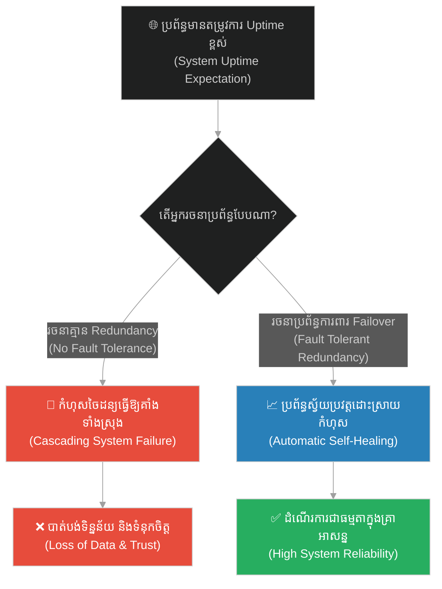
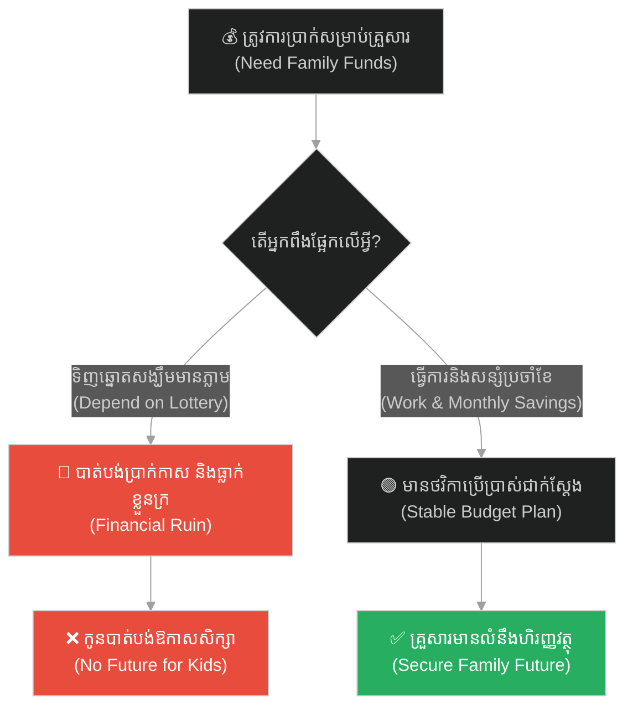
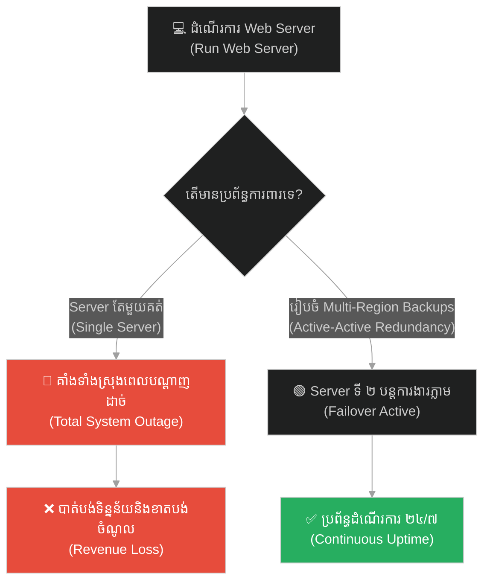
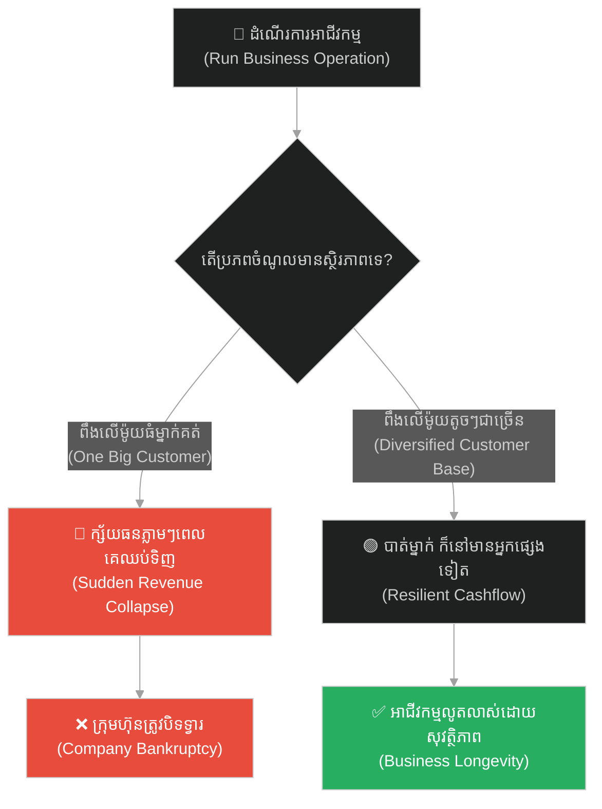
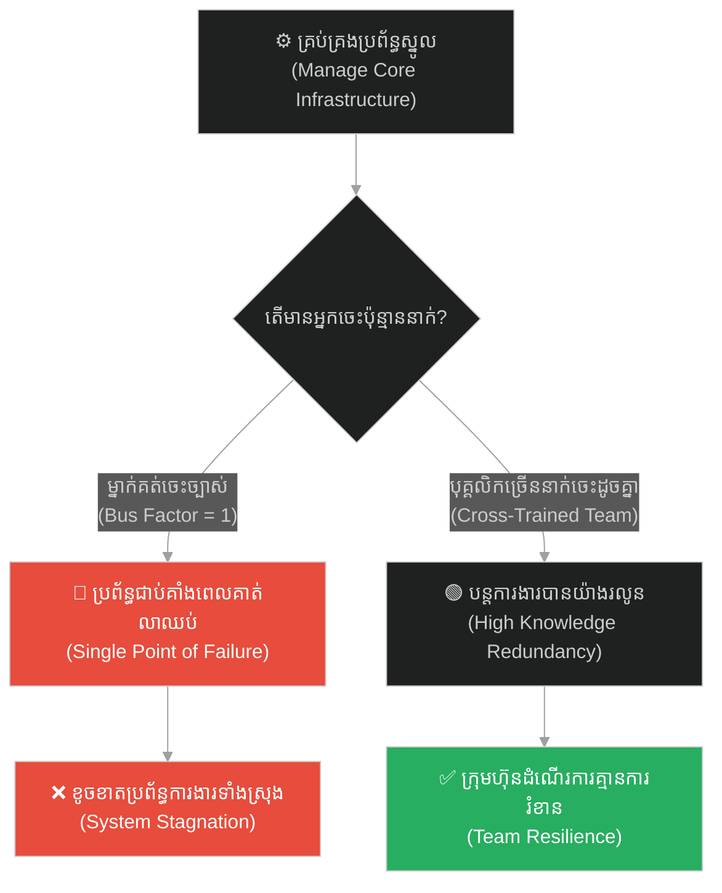
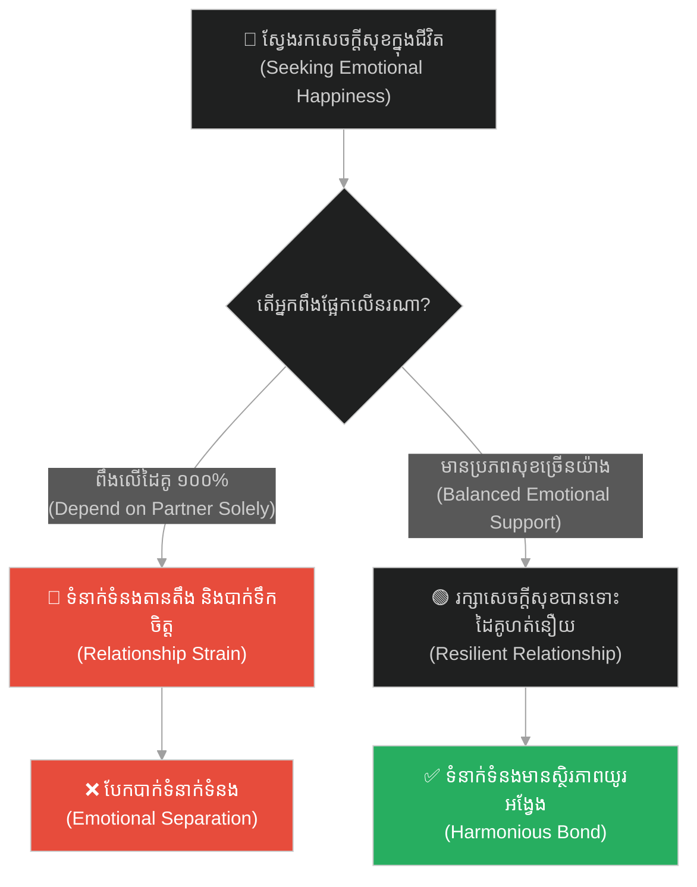
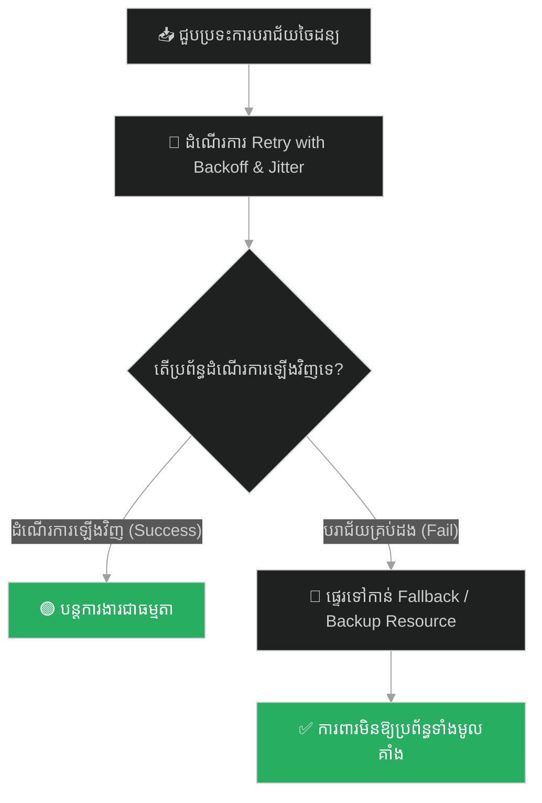

# Statistical Probability & Fault Tolerance (ប្រូបាប៊ីលីតេស្ថិតិ និងភាពធន់នឹងកំហុស)៖ អណ្តើកខ្វាក់ (Statistical Probability & Fault Tolerance & The Blind Turtle)

**Author:** ichamrong  
**Date:** 2026-05-28  
**Tags:** #fault-tolerance #probability #resilience #reliability #buddhism #exponential-backoff #jitter  
**Category:** Concepts  
**Read Time:** ~15 min  

---

## 📌 មាតិកា (Table of Contents)
- [អន្ទាក់ផ្លូវចិត្ត (The Trap)](#0)
- [១. រឿងនិទាន៖ អណ្តើកខ្វាក់ និងបំណែកឈើអណ្តែតទឹក (The Legend of the Blind Turtle)](#1)
  - [ប្រូបាប៊ីលីតេនៃប្រហោងឈើ និងកំណើតមនុស្ស (The Rarity of Human Rebirth)](#1-1)
- [២. បញ្ហា៖ ការសន្មតភាពល្អឥតខ្ចោះនៃប្រព័ន្ធ និងការគាំងដោយសារកំហុសចៃដន្យ (The Issue: Cumulative Failure Probability & Lack of Fault Tolerance)](#2)
- [៣. ឧទាហរណ៍ជាក់ស្តែងក្នុងពិភពពិត (Real World Examples)](#3)
  - [ឧទាហរណ៍ទី ១ — កម្រិតស្រាល (គ្រួសារ)៖ ការរំពឹងលុយពីឆ្នោតឡូតូ (The Lottery Hope)](#3-1)
  - [ឧទាហរណ៍ទី ២ — កម្រិតមធ្យម (បច្ចេកទេស)៖ ការពឹងផ្អែកលើ Server តែមួយគ្មាន Backup (The Single Point of Failure)](#3-2)
  - [ឧទាហរណ៍ទី ៣ — កម្រិតមធ្យម (ធុរកិច្ច)៖ ការពឹងផ្អែកលើអតិថិជនធំម្នាក់គត់ (The Single Client Dependency)](#3-3)
  - [ឧទាហរណ៍ទី ៤ — កម្រិតមធ្យម (សង្គម/គ្រប់គ្រង)៖ បុគ្គលិកគន្លឹះតែម្នាក់គត់របស់ក្រុមហ៊ុន (The Bus Factor Trap)](#3-4)
  - [ឧទាហរណ៍ទី ៥ — កម្រិតធ្ងន់ (ទំនាក់ទំនង)៖ ការរំពឹងក្តីសុខទាំងស្រុងពីដៃគូតែម្នាក់ (The Sole Source of Happiness)](#3-5)
- [៤. ដំណោះស្រាយទូទៅ៖ ការរចនាឱ្យមានភាពធន់នឹងកំហុស, យន្តការ Retry, Failover និង Redundancy (The General Solution: Designing for Redundancy & Graceful Recovery)](#4)
- [សេចក្តីសន្និដ្ឋាន (Conclusion)](#5)
- [ឯកសារយោង (References)](#6)
- [Related Posts](#7)

---

<a id="0"></a>
## អន្ទាក់ផ្លូវចិត្ត (The Trap)

តើអ្នកធ្លាប់ជឿថា «រឿងចៃដន្យអាក្រក់ៗនឹងមិនកើតឡើងចំពោះអ្នកឡើយ» រហូតដល់ថ្ងៃដែលប្រព័ន្ធទាំងមូលត្រូវគាំងខ្ទេចខ្ទី ដោយសារតែបញ្ហាតូចមួយដែលមិននឹកស្មានដល់ដែរឬទេ? នេះហៅថា **The Ignored Probability Trap (អន្ទាក់នៃការមិនអើពើនឹងប្រូបាប៊ីលីតេនៃកំហុស)**។

* **ម្ខាង (Side A)** — យើងសន្មតថាអ្វីៗទាំងអស់នឹងដំណើរការល្អ ១០០% (Zero Transient Errors) ដោយគ្មានការរៀបចំប្រព័ន្ធការពារកំហុស (No Redundancy)។
* **ម្ខាងទៀត (Side B)** — យើងគណនាប្រូបាប៊ីលីតេនៃកំហុសចៃដន្យ ហើយសន្មតថាវាត្រូវតែមាន ដូច្នេះយើងបង្កើតប្រព័ន្ធការពារ និង Failover រួចជាស្រេច (Fault Tolerance)។

ផែនទីបង្ហាញផ្លូវសម្រាប់អត្ថបទនេះ៖
1. **រឿងនិទានអណ្តើកខ្វាក់** — ឧបមាប្រៀបធៀបដ៏អស្ចារ្យរបស់ព្រះពុទ្ធអំពីលក្ខខណ្ឌដ៏កម្រនៃការងើបក្បាលចំប្រហោងឈើ។
2. **បញ្ហាបច្ចេកវិទ្យា** — របៀបដែលប្រូបាប៊ីលីតេនៃកំហុសក្នុងប្រព័ន្ធធំៗ (Distributed Systems) កើនឡើងជាលំដាប់ និងការប្រើប្រាស់ Retry With Jitter។
3. **ឧទាហរណ៍ ៥ កម្រិត** — ការអនុវត្តទ្រឹស្តី Fault Tolerance ក្នុងជីវិត អាជីវកម្ម និងវិស្វកម្ម។
4. **ដំណោះស្រាយជាក់ស្តែង** — ផែនទីដំណើរការស្វែងរកដំណោះស្រាយ និងការបង្កើត Redundancy។



---

<a id="1"></a>
## ១. រឿងនិទាន៖ អណ្តើកខ្វាក់ និងបំណែកឈើអណ្តែតទឹក (The Legend of the Blind Turtle)

ថ្ងៃមួយ ព្រះសម្មាសម្ពុទ្ធបានចោទសួរទៅកាន់ភិក្ខុទាំងឡាយអំពីលក្ខខណ្ឌនៃប្រូបាប៊ីលីតេ ដើម្បីពន្យល់ពីតម្លៃនៃជីវិតមនុស្ស។ ព្រះអង្គមានសង្ឃដីកាថា៖ *«ម្នាលភិក្ខុទាំងឡាយ! ចូរស្រមៃមើលថា ផែនដីទាំងមូលត្រូវបានគ្របដណ្តប់ទៅដោយមហាសមុទ្រខ្នាតយក្សគ្មានទីបញ្ចប់។ នៅលើផ្ទៃទឹកនោះ មានបំណែកឈើមួយដែលមានប្រហោងតូចមួយនៅចំកណ្តាល កំពុងតែរសាត់អណ្តែតទៅតាមកម្លាំងខ្យល់បក់ពីទិសទាំងបួន។»*

*«នៅបាតមហាសមុទ្រដ៏ជ្រៅនោះ មានអណ្តើកសមុទ្រខ្វាក់ភ្នែកទាំងសងខាងមួយក្បាលរស់នៅ។ ជារៀងរាល់ ១០០ ឆ្នាំម្តង អណ្តើកខ្វាក់នោះនឹងងើបក្បាលឡើងមកលើផ្ទៃទឹកតែម្តងគត់ ដើម្បីដកដង្ហើម។ ម្នាលភិក្ខុទាំងឡាយ! តើអ្នកគិតថា អណ្តើកខ្វាក់នោះមានឱកាសប៉ុន្មាន ដើម្បីងើបក្បាលមកចោះចំប្រហោងនៃបំណែកឈើដែលកំពុងរសាត់អណ្តែតនោះ?»*

<a id="1-1"></a>
### ប្រូបាប៊ីលីតេនៃប្រហោងឈើ និងកំណើតមនុស្ស (The Rarity of Human Rebirth)

ភិក្ខុទាំងឡាយបានបង្គំទូលឆ្លើយតបវិញថា៖ *«បពិត្រព្រះអង្គ ឱកាសនោះគឺសឹងតែស្មើសូន្យទៅហើយ ព្រោះមហាសមុទ្រធំធេងណាស់ ឯបំណែកឈើក៏រសាត់ទៅតាមខ្យល់ឥតឈប់ឈរ ហើយអណ្តើកនោះងើបឡើងតែម្តងក្នុងមួយរយឆ្នាំថែមទៀត។»*

ព្រះពុទ្ធមានសង្ឃដីកាថា៖ *«ម្នាលភិក្ខុទាំងឡាយ! ការដែលអណ្តើកខ្វាក់នោះ ងើបក្បាលចំប្រហោងឈើ គឺនៅតែងាយស្រួលជាង **ការបានកើតមកជាមនុស្ស (The precious human rebirth)** ទៅទៀត។ ឥឡូវនេះ អ្នកបានកើតជាមនុស្ស មានសតិបញ្ញា និងមានឱកាសបានរៀនសូត្រធម៌វិន័យ។ ចូរកុំបណ្តោយឱ្យពេលវេលានៃជីវិតដ៏កម្រនេះកន្លងផុតទៅដោយឥតប្រយោជន៍ឡើយ។»*

---

<a id="2"></a>
## ២. បញ្ហា៖ ការសន្មតភាពល្អឥតខ្ចោះនៃប្រព័ន្ធ និងការគាំងដោយសារកំហុសចៃដន្យ (The Issue: Cumulative Failure Probability & Lack of Fault Tolerance)

នៅក្នុងប្រព័ន្ធចែកចាយ (Distributed Systems) ដែលមាន Microservices រាប់សិបដំណើរការជាមួយគ្នា ប្រសិនបើយើងសន្មតថា Dependency នីមួយៗដំណើរការល្អ ១០០% ជានិច្ច នោះយើងកំពុងបង្កើតប្រព័ន្ធដែលងាយនឹងគាំងបំផុត។ ប្រសិនបើប្រព័ន្ធមួយមានសេវាកម្មចំនួន ១០ ច្រវាក់គ្នា ហើយសេវាកម្មនីមួយៗមាន Uptime 99% ( reliability) នោះប្រូបាប៊ីលីតេនៃភាពជោគជ័យសរុបគឺ `0.99^10 = 90%` ប៉ុណ្ណោះ។ មានន័យថា ១០% នៃសំណើអតិថិជន (Requests) នឹងត្រូវបរាជ័យ។

Transient Errors (ដូចជា packet loss, server overload មួយវិនាទី) គឺជារឿងចៀសមិនរួច។ ប្រសិនបើកូដគ្មានយន្តការ **Retry with Exponential Backoff and Jitter** និង **Fallback (Fault Tolerance)** ទេ នោះប្រព័ន្ធនឹងគាំងទាំងស្រុងនៅពេលជួបប្រទះបញ្ហាបន្តិចបន្តួច។

ខាងក្រោមនេះជាកូដដែលគ្មានប្រព័ន្ធការពារ និងកូដដែលមានយន្តការការពារកំហុសដោយស្វ័យប្រវត្តិ៖

```python
# ==============================================================================
# ❌ Anti-Pattern: Fragile Chain (Assuming 100% reliability of nested dependencies)
# ==============================================================================
class FragileDistributedChain:
    def __init__(self, service_a, service_b, service_c):
        self.service_a = service_a
        self.service_b = service_b
        self.service_c = service_c

    def execute_transaction(self, data):
        # If any single service encounters a network packet drop (very common),
        # this entire chain fails and throws an unhandled exception.
        res_a = self.service_a.call(data)
        res_b = self.service_b.call(res_a)
        res_c = self.service_c.call(res_b)
        return res_c


# ==============================================================================
#  Resilient Design: Fault-Tolerant Chain (Retry with Jitter & Fallbacks)
# ==============================================================================
import time
import random
import logging

class FaultTolerantServiceWrapper:
    def __init__(self, target_service, max_retries=3, base_delay=0.5):
        self.service = target_service
        self.max_retries = max_retries
        self.base_delay = base_delay

    def call_with_retry(self, data):
        # We expect transient failures (statistical probability).
        # We apply Exponential Backoff with Jitter to prevent thundering herd.
        for attempt in range(self.max_retries):
            try:
                return self.service.call(data)
            except Exception as e:
                if attempt == self.max_retries - 1:
                    logging.error(f"Service call failed after {self.max_retries} attempts: {e}")
                    raise e
                
                # Math: base_delay * 2^attempt + random jitter (under 500ms)
                sleep_time = (self.base_delay * (2 ** attempt)) + random.uniform(0, 0.5)
                logging.warning(f"Transient failure occurred. Retrying in {sleep_time:.2f} seconds...")
                time.sleep(sleep_time)

class ResilientDistributedChain:
    def __init__(self, service_a, service_b, service_c, fallback_provider):
        self.service_a = FaultTolerantServiceWrapper(service_a)
        self.service_b = FaultTolerantServiceWrapper(service_b)
        self.service_c = FaultTolerantServiceWrapper(service_c)
        self.fallback = fallback_provider

    def execute_transaction(self, data):
        try:
            res_a = self.service_a.call_with_retry(data)
            res_b = self.service_b.call_with_retry(res_a)
            res_c = self.service_c.call_with_retry(res_b)
            return res_c
        except Exception:
            logging.warning("Primary processing chain failed. Routing immediately to cached fallback.")
            return self.fallback.get_last_known_good_state(data)
```

---

<a id="3"></a>
## ៣. ឧទាហរណ៍ជាក់ស្តែងក្នុងពិភពពិត

<a id="3-1"></a>
### ឧទាហរណ៍ទី ១ — កម្រិតស្រាល (គ្រួសារ)៖ ការរំពឹងលុយពីឆ្នោតឡូតូ (The Lottery Hope)

* **ស្ថានភាព៖** ឪពុកម្នាក់មិនព្រមធ្វើការងារ ឬសន្សំលុយសម្រាប់កូនរៀនឡើយ ព្រោះសង្ឃឹមថានឹងទិញឆ្នោតឈ្នះរង្វាន់ធំ។
* **បញ្ហា៖** ឱកាសឈ្នះឆ្នោតគឺ ១ ក្នុងចំណោមរាប់លាន (អណ្តើកខ្វាក់ចោះចំឈើ) ធ្វើឱ្យគ្រួសារធ្លាក់ខ្លួនក្រីក្រតោកយ៉ាក និងគ្មានប្រាក់ឱ្យកូនរៀន។
* **ដំណោះស្រាយ៖** យល់ដឹងពីប្រូបាប៊ីលីតេពិតប្រាកដ។ ត្រូវផ្តោតលើការងារជាក់ស្តែង និងសន្សំប្រាក់រាល់ខែ (សកម្មភាពដែលមានស្ថិរភាពខ្ពស់)។



---

<a id="3-2"></a>
### ឧទាហរណ៍ទី ២ — កម្រិតមធ្យម (បច្ចេកទេស)៖ ការពឹងផ្អែកលើ Server តែមួយគ្មាន Backup (The Single Point of Failure)

* **ស្ថានភាព៖** ក្រុមហ៊ុនដាក់ដំណើរការ Web App របស់ខ្លួននៅលើ Cloud Server តែមួយគត់ដោយសន្មតថា Cloud មិនចេះខូច។
* **បញ្ហា៖** នៅពេល Data Center របស់ Cloud ជួបគ្រោះធម្មជាតិ ឬដាច់ភ្លើង App របស់ក្រុមហ៊ុនត្រូវគាំង និងបាត់បង់ទិន្នន័យអតិថិជន។
* **ដំណោះស្រាយ៖** រៀបចំឱ្យមាន Multi-Region replication និង redundant backup servers (Fault tolerance)។



---

<a id="3-3"></a>
### ឧទាហរណ៍ទី ៣ — កម្រិតមធ្យម (ធុរកិច្ច)៖ ការពឹងផ្អែកលើអតិថិជនធំម្នាក់គត់ (The Single Client Dependency)

* **ស្ថានភាព៖** ក្រុមហ៊ុនមួយទទួលបានចំណូល ៩០% ពីអតិថិជនធំម្នាក់គត់ ដោយមិនខ្វល់ខ្វាយស្វែងរកអតិថិជនផ្សេងទៀតឡើយ។
* **បញ្ហា៖** ថ្ងៃមួយ អតិថិជននោះផ្លាស់ប្តូរថ្នាក់ដឹកនាំ និងសម្រេចចិត្តលុបចោលកិច្ចសន្យា ធ្វើឱ្យក្រុមហ៊ុនដួលរលំភ្លាមៗ។
* **ដំណោះស្រាយ៖** បង្កើត Fault tolerance ក្នុងអាជីវកម្មដោយការស្វែងរកអតិថិជនខ្នាតតូច និងមធ្យមជាច្រើន ដើម្បីចែករំលែកហានិភ័យ។



---

<a id="3-4"></a>
### ឧទាហរណ៍ទី ៤ — កម្រិតមធ្យម (សង្គម/គ្រប់គ្រង)៖ បុគ្គលិកគន្លឹះតែម្នាក់គត់របស់ក្រុមហ៊ុន (The Bus Factor Trap)

* **ស្ថានភាព៖** ក្រុមហ៊ុនមួយមានប្រព័ន្ធស្នូលមួយ ដែលសរសេរ និងគ្រប់គ្រងដោយបុគ្គលិកជាន់ខ្ពស់ម្នាក់គត់ ដោយគ្មាននរណាម្នាក់ដឹងពីរបៀបដំណើរការវាឡើយ។
* **បញ្ហា៖** បុគ្គលិកនោះជួបប្រទះគ្រោះថ្នាក់ ឬសុំលាឈប់ភ្លាមៗ ធ្វើឱ្យក្រុមហ៊ុនមិនអាចកែប្រែ ឬជួសជុលប្រព័ន្ធបាន។
* **ដំណោះស្រាយ៖** រៀបចំយន្តការ Cross-Training និងសរសេរឯកសារណែនាំ (Documentation) ឱ្យបានច្បាស់លាស់។



---

<a id="3-5"></a>
### ឧទាហរណ៍ទី ៥ — កម្រិតធ្ងន់ (ទំនាក់ទំនង)៖ ការរំពឹងក្តីសុខទាំងស្រុងពីដៃគូតែម្នាក់ (The Sole Source of Happiness)

* **ស្ថានភាព៖** មនុស្សម្នាក់រំពឹងថា ដៃគូជីវិតត្រូវតែជាអ្នកផ្តល់សេចក្តីសុខ ថាមពល និងការគោរព ១០០% ដល់ខ្លួន។
* **បញ្ហា៖** នៅពេលដៃគូមានជំងឺ ឬអារម្មណ៍មិនល្អ (កំហុសចៃដន្យនៃជីវិត) ខ្លួនឯងក៏ធ្លាក់ចូលទៅក្នុងភាពអស់សង្ឃឹម និងខឹងសម្បារ។
* **ដំណោះស្រាយ៖** កសាងភាពធន់ផ្លូវចិត្តដោយខ្លួនឯង បូករួមនឹងការមានមិត្តភក្តិ គ្រួសារ និងចំណូលចិត្តផ្ទាល់ខ្លួន ដើម្បីសម្រាលបន្ទុកដៃគូ។



---

<a id="4"></a>
## ៤. ដំណោះស្រាយទូទៅ៖ ការរចនាឱ្យមានភាពធន់នឹងកំហុស, យន្តការ Retry, Failover និង Redundancy (The General Solution: Designing for Redundancy & Graceful Recovery)

ដើម្បីរចនាប្រព័ន្ធ ឬជីវិតឱ្យមានភាពធន់នឹងកំហុសខ្ពស់ ចូរអនុវត្តជំហានខាងក្រោម៖

1. **កម្ចាត់ចំណុចខ្សោយតែមួយគត់ (Eliminate Single Point of Failure):** ធានាថាអ្វីដែលសំខាន់ ត្រូវតែមានរបស់ជំនួស ឬរបស់ Backup ជានិច្ច។
2. **អនុវត្តយន្តការ Retry & Fallback (Set Up Retries):** នៅពេលជួបប្រទះភាពបរាជ័យ កុំទាន់ប្រញាប់បោះបង់។ ត្រូវព្យាយាមម្តងទៀតដោយប្រើ Exponential Backoff (ទុកពេលឱ្យប្រព័ន្ធដកដង្ហើម)។
3. **ទទួលយកភាពមិនប្រាកដប្រជា (Accept Uncertainty):** យល់ថាព្រឹត្តិការណ៍អាក្រក់ចៃដន្យប្រាកដជាកើតឡើង ដូច្នេះត្រូវមានផែនការដោះស្រាយគ្រោះអាសន្នទុកជាមុន (Disaster Recovery Plan)។



---

## 🐇 ធ្លាក់ចូលក្នុងរន្ធទន្សាយ (Enter the Rabbit Hole)
ដើម្បីស្វែងយល់កាន់តែស៊ីជម្រៅអំពីការគ្រប់គ្រងស្មារតី ការយល់ឃើញ និងរបៀបនៃការបំបែកស្ថានភាពរវាងការងារខាងក្នុង និងការងារខាងក្រៅ សូមចុចតំណភ្ជាប់ខាងក្រោម៖

* 🚀 **[ចាប់ផ្តើមដំណើររុករក (Start the Journey) ➔ Perception & Client-Side vs Server-Side State (ការយល់ឃើញ និងស្ថានភាពទិន្នន័យ)៖ ខ្យល់ និងទង់ជ័យ](./145-buddha-and-the-wind-and-flag.md)**

---

<a id="5"></a>
## សេចក្តីសន្និដ្ឋាន (Conclusion)

> **«ឱកាសនៃការកើតមកជាមនុស្ស គឺកម្រដូចអណ្តើកខ្វាក់ងើបក្បាលចំប្រហោងឈើ។ ចូរកុំខ្ជះខ្ជាយជីវិត និងពេលវេលាដ៏មានតម្លៃនេះ ដោយកង្វះការរៀបចំប្រព័ន្ធការពារខ្លួនឡើយ។»**

ចូររៀបចំខ្លួនឱ្យរួចរាល់សម្រាប់រាល់ព្យុះភ្លៀងនៃជីវិត និងបច្ចេកវិទ្យា។ ការមានប្រព័ន្ធការពារកំហុស (Fault Tolerance) គឺជាស្ពានឆ្ពោះទៅរកភាពស្ងប់សុខ និងជោគជ័យពិតប្រាកដ។

---

<a id="6"></a>
## ឯកសារយោង (References)

* **Samyutta Nikaya** — *Chiggala Sutta (SN 56.48)*. The Blind Turtle Sutta on the rarity of human life.
* **Hanahan, D.** — *Fault Tolerant System Design* (2018). Fundamental logic of designing high availability architectures.
* **Taleb, N. N.** — *Antifragile: Things That Gain from Disorder* (2012). The philosophy of building systems that grow stronger under stress.

---

<a id="7"></a>
## Related Posts

* **[Iterative Refactoring & CI Code Quality (ការកែលម្អកូដជាបន្តបន្ទាប់ និងគុណភាពកូដ CI)៖ ជាងមាស](./143-buddha-and-the-goldsmith.md)** — Improving codebase health step-by-step.
* **[The Broken Bridge and the Art of Inversion (ស្ពានដែលបាក់ និងវិធានគិតបញ្ច្រាស)៖ របៀបដោះស្រាយបញ្ហាស្មុគស្មាញដោយការចាប់ផ្តើមពីទីបញ្ចប់](./15-the-broken-bridge-and-the-art-of-inversion.md)** — Preventive failure planning.
