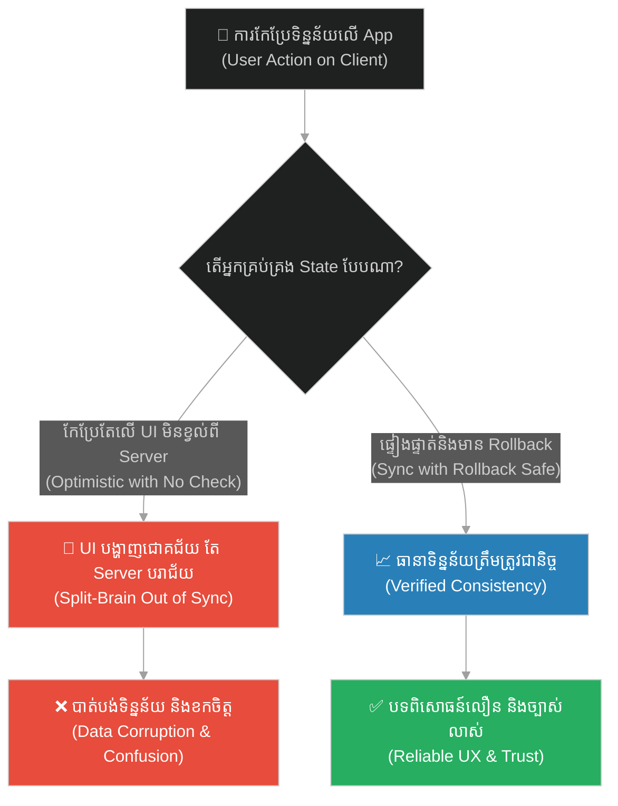
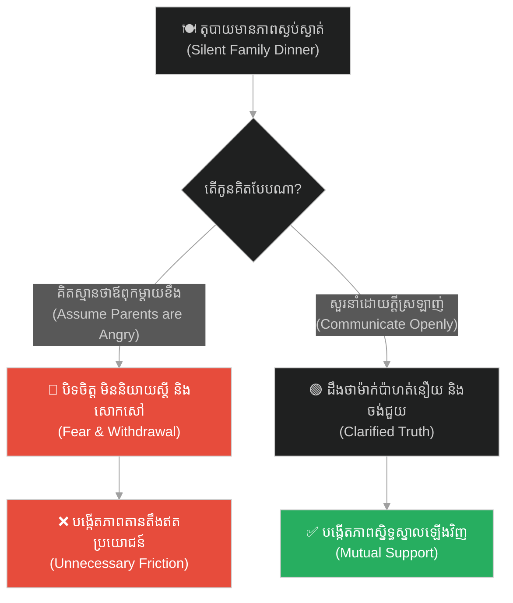
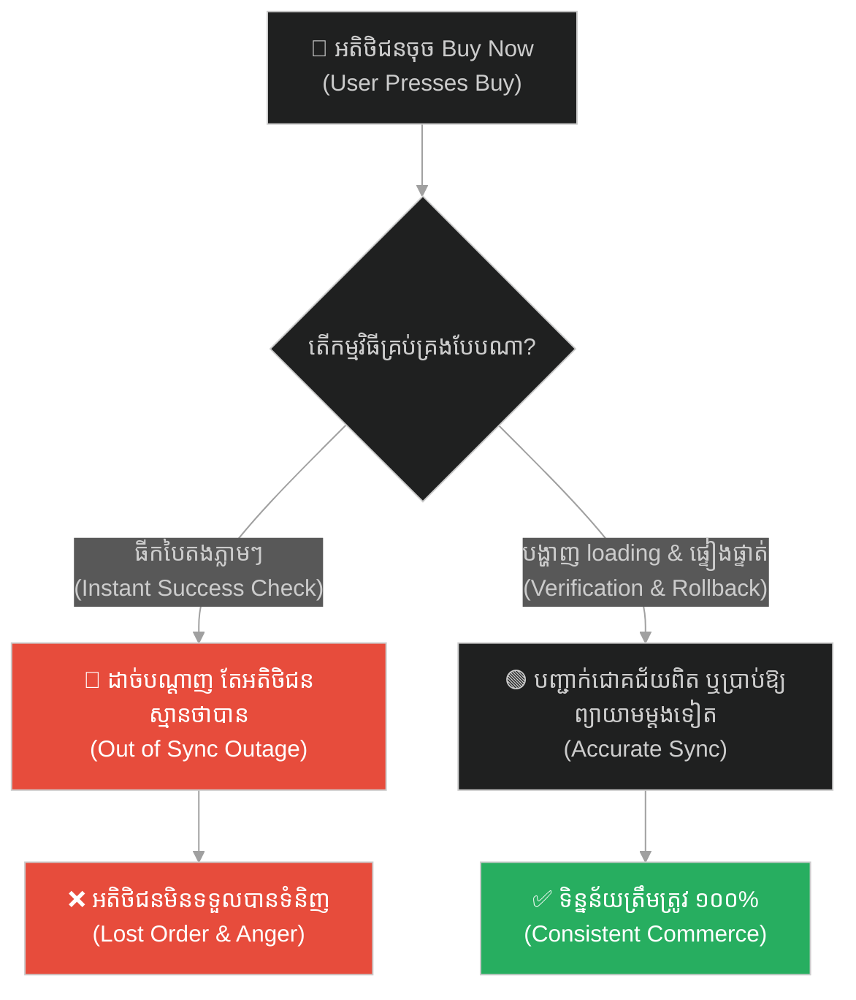
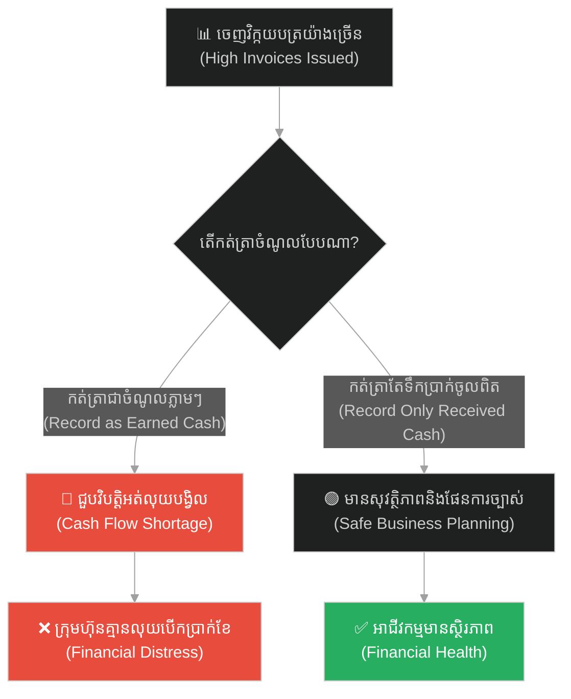
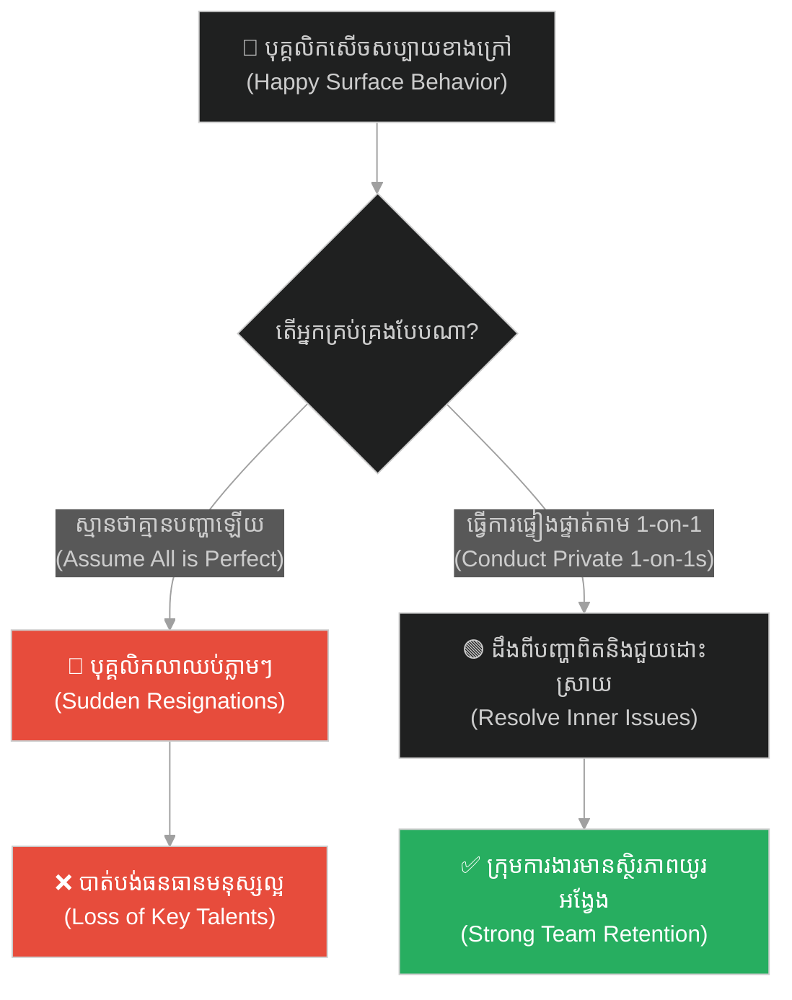
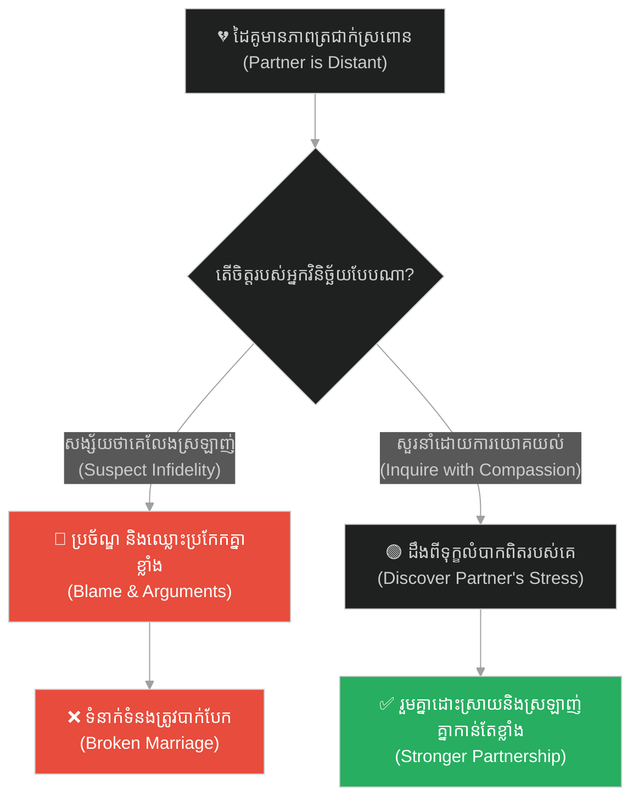
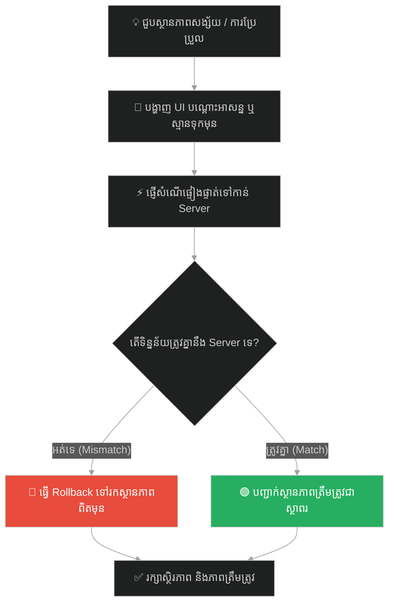

# Perception & Client-Side vs Server-Side State (ការយល់ឃើញ និងស្ថានភាពទិន្នន័យ)៖ ខ្យល់ និងទង់ជ័យ (Perception & Client-Side vs Server-Side State & The Wind and the Flag)

**Author:** ichamrong  
**Date:** 2026-05-28  
**Tags:** #state-management #client-server #perception #zen #hui-neng #frontend-architecture #optimistic-updates  
**Category:** Concepts  
**Read Time:** ~15 min  

---

## 📌 មាតិកា (Table of Contents)
- [អន្ទាក់ផ្លូវចិត្ត (The Trap)](#0)
- [១. រឿងនិទានហ្សេន៖ ខ្យល់ ទង់ជ័យ និងចិត្ត (The Zen Legend of the Wind and Flag)](#1)
  - [គឺចិត្តរបស់ព្រះសង្ឃជាអ្នករំកិល (It is the Mind that Moves)](#1-1)
- [២. បញ្ហា៖ ការបែកបាក់គ្នារវាងទិន្នន័យផ្ទៃក្នុង និងការយល់ឃើញខាងក្រៅ (The Issue: Desynchronized Client-Side Illusion & Server-Side Truth)](#2)
- [៣. ឧទាហរណ៍ជាក់ស្តែងក្នុងពិភពពិត (Real World Examples)](#3)
  - [ឧទាហរណ៍ទី ១ — កម្រិតស្រាល (គ្រួសារ)៖ តុបាយដ៏ស្ងប់ស្ងាត់ (The Silent Dinner Misinterpretation)](#3-1)
  - [ឧទាហរណ៍ទី ២ — កម្រិតមធ្យម (បច្ចេកទេស)៖ ការទូទាត់ប្រាក់ដែលគ្មានស្ថិរភាព (The Optimistic Update without Rollback)](#3-2)
  - [ឧទាហរណ៍ទី ៣ — កម្រិតមធ្យម (ធុរកិច្ច)៖ របាយការណ៍ព្យាករណ៍ការលក់លំអៀង (The Flawed Sales Forecast)](#3-3)
  - [ឧទាហរណ៍ទី ៤ — កម្រិតមធ្យម (សង្គម/គ្រប់គ្រង)៖ ការស្មានការពេញចិត្តរបស់បុគ្គលិក (The Assumption of Employee Happiness)](#3-4)
  - [ឧទាហរណ៍ទី ៥ — កម្រិតធ្ងន់ (ទំនាក់ទំនង)៖ ភាពត្រជាក់ស្រពោនរបស់ដៃគូ (The Partner's Distant Behavior)](#3-5)
- [៤. ដំណោះស្រាយទូទៅ៖ ស្នូលទិន្នន័យតែមួយ, យន្តការ Rollback និងការផ្សះផ្សារដ្ឋទិន្នន័យ (The General Solution: Single Source of Truth & Safe Optimistic States)](#4)
- [សេចក្តីសន្និដ្ឋាន (Conclusion)](#5)
- [ឯកសារយោង (References)](#6)
- [Related Posts](#7)

---

<a id="0"></a>
## អន្ទាក់ផ្លូវចិត្ត (The Trap)

តើអ្នកធ្លាប់ជឿជាក់លើអ្វីមួយដែលអ្នកបានឃើញនឹងភ្នែកភ្លាមៗ តែក្រោយមកទើបដឹងថាការពិតជាក់ស្តែងមិនដូចអ្វីដែលអ្នកគិតនោះទេ? នៅក្នុងការសរសេរកម្មវិធី (Frontend Development) ឬក្នុងទំនាក់ទំនងមនុស្សជាតិ ការបង្កើតទិន្នន័យបន្លំខ្លួនឯង (Optimistic Assumptions) តែងតែនាំទៅរកការយល់ច្រឡំយ៉ាងធ្ងន់ធ្ងរ។

* **ម្ខាង (Side A)** — យើងជឿជាក់ទាំងស្រុងលើការយល់ឃើញខាងក្រៅ (UI State / local view) ដោយមិនបានផ្ទៀងផ្ទាត់ជាមួយទិន្នន័យពិតប្រាកដរបស់ប្រព័ន្ធ (Server State)។
* **ម្ខាងទៀត (Side B)** — យើងយល់ថាអ្វីដែលយើងឃើញគ្រាន់តែជាការបកស្រាយរបស់ចិត្ត (UI projection) ដូច្នេះយើងត្រូវមានប្រព័ន្ធផ្ទៀងផ្ទាត់រដ្ឋទិន្នន័យឱ្យបានច្បាស់លាស់។

ផែនទីបង្ហាញផ្លូវសម្រាប់អត្ថបទនេះ៖
1. **រឿងនិទានហ្សេន Hui-neng** — របកគំហើញនៃខ្យល់ ទង់ជាតិ និងចិត្ត។
2. **បញ្ហាបច្ចេកវិទ្យា** — របៀបដែល Client state និង Server state ងាយនឹងដាច់ចេញពីគ្នា និងដំណោះស្រាយ Rollback mechanism។
3. **ឧទាហរណ៍ ៥ កម្រិត** — ការវិភាគការយល់ឃើញ និងការពិតជាក់ស្តែងក្នុងជីវិត។
4. **ដំណោះស្រាយជាក់ស្តែង** — គំរូការងារនៃយន្តការ Stale-While-Revalidate និងការរក្សាស្ថិរភាព។



---

<a id="1"></a>
## ១. រឿងនិទានហ្សេន៖ ខ្យល់ ទង់ជ័យ និងចិត្ត (The Zen Legend of the Wind and Flag)

មានរឿងប្រៀបប្រដៅបែបហ្សេន (Zen) ដ៏ល្បីល្បាញមួយ កត់ត្រាពីដំណើរការដេញដោលគ្នានៃព្រះសង្ឃពីរអង្គ។ ថ្ងៃមួយ ព្រះសង្ឃទាំងពីរកំពុងឈរជជែកគ្នាជាខ្លាំងនៅមុខក្លោងទ្វារវត្តមួយ ដោយសារការសម្លឹងមើលទៅទង់ជ័យវត្តដែលកំពុងបក់រវិចៗលើដងទង់។

ព្រះសង្ឃអង្គទីមួយអះអាងថា៖ *«អ្នកមើលចុះ! គឺ **ទង់ជ័យ (The Flag)** ទេតើដែលជាអ្នកកំពុងធ្វើចលនារំកិលចុះឡើងយ៉ាងសកម្ម។ បើគ្មានទង់ជ័យទេ នោះក៏គ្មានចលនាអ្វីឱ្យយើងមើលឃើញដែរ។»*

ព្រះសង្ឃអង្គទីពីរប្រកែកថា៖ *«មិនពិតទេ! ទង់ជ័យគ្រាន់តែជាវត្ថុគ្មានវិញ្ញាណប៉ុណ្ណោះ។ គឺ **ខ្យល់ (The Wind)** ទេតើដែលជាប្រភពថាមពលកំពុងធ្វើចលនាបក់បោក។ ហេតុនេះ ខ្យល់ជាអ្នករំកិលពិតប្រាកដ។»*

ព្រះសង្ឃទាំងពីរអង្គបានជជែកដេញដោលគ្នាយ៉ាងក្តៅគគុកដោយគ្មាននរណាម្នាក់ព្រមចុះចាញ់ឡើយ។

<a id="1-1"></a>
### គឺចិត្តរបស់ព្រះសង្ឃជាអ្នករំកិល (It is the Mind that Moves)

នៅខណៈនោះ ព្រះតេជគុណ **ហួយ-នេង (Hui-neng)** ដែលជាចៅអធិការវត្តទី ៦ នៃនិកាយហ្សេន បានដើរកាត់។ លោកបានស្តាប់ការជជែកនោះ រួចក៏មានថេរដីកាដោយស្ងប់ស្ងាត់ទៅកាន់ព្រះសង្ឃទាំងពីរថា៖

*«អ្នកទាំងពីរខុសហើយ! មិនមែនខ្យល់ជាអ្នករំកិល ហើយក៏មិនមែនទង់ជ័យជាអ្នករំកិលដែរ។ តាមពិតទៅ គឺ **ចិត្តរបស់អ្នកទាំងពីរ (Your Mind)** ទេតើ ដែលកំពុងតែរំកិលនោះ។»*

ព្រះសង្ឃទាំងពីរអង្គបានស្តាប់ហើយ ក៏ស្ងាត់មាត់ឈឹង និងភ្ញាក់ខ្លួនភ្លាមៗ។ ពិភពលោកខាងក្រៅគ្រាន់តែជាបាតុភូតធម្មជាតិ តែអ្វីដែលកំពុងរង្គោះរង្គើ និងជជែកវែកញែកពិតប្រាកដ គឺចិត្តរបស់ពួកគេដែលកំពុងតែបង្កើតការយល់ឃើញ និងទាញការសន្និដ្ឋានខុសគ្នា។

---

<a id="2"></a>
## ២. បញ្ហា៖ ការបែកបាក់គ្នារវាងទិន្នន័យផ្ទៃក្នុង និងការយល់ឃើញខាងក្រៅ (The Issue: Desynchronized Client-Side Illusion & Server-Side Truth)

នៅក្នុងវិស្វកម្មកម្មវិធីបណ្តាញ (Web Application Architecture) ជម្លោះរវាងខ្យល់ ទង់ជាតិ និងចិត្ត គឺដូចគ្នាទៅនឹងបញ្ហាគ្រប់គ្រងរដ្ឋទិន្នន័យរវាង **Server-Side State (ការពិតពិតប្រាកដក្នុង Database)** និង **Client-Side State (ការយល់ឃើញរបស់កម្មវិធីលើទូរស័ព្ទ ឬ Browser)**។

* **Server State (ខ្យល់ និងទង់ជាតិ):** គឺជាការពិតតែមួយគត់ (Single Source of Truth) ដែលគ្រប់គ្រងទិន្នន័យពិត។
* **Client State (ចិត្ត):** គ្រាន់តែជាការយល់ឃើញបណ្តោះអាសន្ន (Projection) របស់ UI ប៉ុណ្ណោះ។

ប្រសិនបើកម្មវិធី Frontend ធ្វើការកែប្រែទិន្នន័យ (ដូចជាការចុច Complete Task ឬ Buy Product) ដោយគ្រាន់តែកែប្រែលើ UI ភ្លាមៗ (Optimistic Updates) ដោយគ្មានយន្តការផ្ទៀងផ្ទាត់ និងការទាញត្រឡប់វិញ (Rollback Mechanism) ពេល Server បដិសេធ នោះអ្នកប្រើប្រាស់នឹងជួបប្រទះបញ្ហា **Split-Brain (ទិន្នន័យលើអេក្រង់មិនត្រូវគ្នានឹង Database)**។ នេះប្រៀបបាននឹងចិត្តដែលគិតថាទង់ជាតិកំពុងបក់ តែការពិតទង់ជាតិត្រូវបានខ្យល់កាត់ផ្តាច់បាត់ទៅហើយ។

ខាងក្រោមនេះជាកូដដែលគ្រប់គ្រង State គ្មានសុវត្ថិភាព និងកូដដែលមានយន្តការការពារស្មើភាព៖

```typescript
// ==============================================================================
// ❌ Anti-Pattern: Fragile Client-Side State (Decoupled local perception)
// ==============================================================================
interface Task {
  id: string;
  title: string;
  completed: boolean;
}

class FragileTaskManager {
  private localTasks: Task[] = [];

  // Client-side makes changes locally without verifying with the server.
  // If the server fails to process the request, the client's state is out-of-sync
  // with the actual database, creating a false perception (illusion) of success.
  toggleTask(task: Task) {
    task.completed = !task.completed; // Optimistic update with no fallback/validation
    this.localTasks = this.localTasks.map(t => t.id === task.id ? task : t);
    
    // Fire-and-forget server request (no retry, rollback, or synchronization)
    fetch(`/api/tasks/${task.id}/toggle`, { method: "POST" })
      .catch(err => console.error("Server update failed! Client state is now out of sync.", err));
  }
}


// ==============================================================================
//  Resilient Design: Synchronized State Pattern (Server-Side Truth Projection)
// ==============================================================================
class ResilientTaskManager {
  private serverTasks: Task[] = [];
  private isUpdating = false;

  // Implements a strict Stale-While-Revalidate and Rollback mechanism.
  // Assures the client state ("Mind") is a reliable projection of the server state ("Flag").
  async toggleTaskResilient(task: Task, updateUI: (tasks: Task[]) => void) {
    const previousState = [...this.serverTasks];
    
    // Step 1: Optimistic update (for fast UI response)
    const optimisticTasks = this.serverTasks.map(t => 
      t.id === task.id ? { ...t, completed: !t.completed } : t
    );
    updateUI(optimisticTasks);

    try {
      // Step 2: Update server and wait for confirmation
      const response = await fetch(`/api/tasks/${task.id}/toggle`, {
        method: "POST",
        headers: { "Content-Type": "application/json" },
        body: JSON.stringify({ completed: !task.completed })
      });

      if (!response.ok) {
        throw new Error("Server rejected the state transition.");
      }

      // Step 3: Parse validated state from server (Single Source of Truth)
      const updatedTaskFromServer: Task = await response.json();
      this.serverTasks = this.serverTasks.map(t => 
        t.id === task.id ? updatedTaskFromServer : t
      );
      updateUI(this.serverTasks);
    } catch (error) {
      console.error("Synchronization failed. Rolling back to last verified state.", error);
      // Step 4: Rollback client state to match server truth (preventing illusion)
      this.serverTasks = previousState;
      updateUI(this.serverTasks);
    }
  }
}
```

---

<a id="3"></a>
## ៣. ឧទាហរណ៍ជាក់ស្តែងក្នុងពិភពពិត

<a id="3-1"></a>
### ឧទាហរណ៍ទី ១ — កម្រិតស្រាល (គ្រួសារ)៖ តុបាយដ៏ស្ងប់ស្ងាត់ (The Silent Dinner Misinterpretation)

* **ស្ថានភាព៖** ឪពុកម្តាយ និងកូនៗញ៉ាំបាយជាមួយគ្នាយ៉ាងស្ងៀមស្ងាត់។ កូនម្នាក់គិតថា៖ *«ម៉ាក់ប៉ាកំពុងខឹងនឹងខ្ញុំហើយ ព្រោះខ្ញុំប្រឡងបានពិន្ទុអន់។»* (Client State / Perception)
* **បញ្ហា៖** កូនភ័យខ្លាច មិនហ៊ាននិយាយស្តី និងសោកសៅ ទាំងដែលការពិតម៉ាក់ប៉ាគ្រាន់តែហត់នឿយនឹងការងារពេញមួយថ្ងៃប៉ុណ្ណោះ (Server State / Truth)។
* **ដំណោះស្រាយ៖** ជជែកសួរនាំឱ្យច្បាស់លាស់ ដើម្បីផ្ទៀងផ្ទាត់ការយល់ឃើញរបស់ខ្លួនជាជាងការស្មានទុកជាមុន។



---

<a id="3-2"></a>
### ឧទាហរណ៍ទី ២ — កម្រិតមធ្យម (បច្ចេកទេស)៖ ការទូទាត់ប្រាក់ដែលគ្មានស្ថិរភាព (The Optimistic Update without Rollback)

* **ស្ថានភាព៖** អតិថិជនចុចទិញទំនិញលើ App។ App បង្ហាញរូបភាពគូសធីកពណ៌បៃតងភ្លាមៗថា «ទិញជោគជ័យ»។
* **បញ្ហា៖** ទូរស័ព្ទដាច់អ៊ីនធឺណិតពាក់កណ្តាលទី។ Server មិនទទួលបានការបញ្ជាទិញឡើយ ប៉ុន្តែអតិថិជនស្មានថាបានទិញរួច ក៏ចាកចេញទៅ ធ្វើឱ្យបាត់បង់ការបញ្ជាទិញ។
* **ដំណោះស្រាយ៖** កំណត់ឱ្យ App បង្ហាញស្ថានភាព Loading និងបញ្ជាក់ទាល់តែទទួលបានការឆ្លើយតបពី Server ឬប្រើប្រាស់យន្តការ Rollback ប្រសិនបើដាច់បណ្តាញ។



---

<a id="3-3"></a>
### ឧទាហរណ៍ទី ៣ — កម្រិតមធ្យម (ធុរកិច្ច)៖ របាយការណ៍ព្យាករណ៍ការលក់លំអៀង (The Flawed Sales Forecast)

* **ស្ថានភាព៖** ក្រុមហ៊ុនមួយទទួលបានការបញ្ជាទិញបណ្តោះអាសន្ន (Invoices Issued) យ៉ាងច្រើន ក៏កត់ត្រាក្នុងប្រព័ន្ធថាជា «ចំណូលពិតប្រាកដ» របស់ខែនេះ។
* **បញ្ហា៖** អតិថិជនជាច្រើនមិនព្រមបង់លុយ និងសុំបោះបង់កិច្ចសន្យា ធ្វើឱ្យក្រុមហ៊ុនជួបប្រទះការដាច់លំហូរទឹកប្រាក់ពិតប្រាកដ (Cash Flow crisis)។
* **ដំណោះស្រាយ៖** ផ្តោតលើ Server State ពិត គឺទឹកប្រាក់ដែលបានចូលគណនីធនាគាររួចរាល់ (Cash in Hand) ជាជាងការព្យាករណ៍លើក្រដាស។



---

<a id="3-4"></a>
### ឧទាហរណ៍ទី ៤ — កម្រិតមធ្យម (សង្គម/គ្រប់គ្រង)៖ ការស្មានការពេញចិត្តរបស់បុគ្គលិក (The Assumption of Employee Happiness)

* **ស្ថានភាព៖** ថ្នាក់ដឹកនាំមើលឃើញបុគ្គលិកសើចសប្បាយ និងញ៉ាំអាហារជុំគ្នា ក៏គិតថាក្រុមការងារមានក្តីសុខ និងមិនចង់លាឈប់ឡើយ។
* **បញ្ហា៖** បុគ្គលិកឆ្នើម ៣ នាក់ដាក់ពាក្យលាឈប់ក្នុងសប្តាហ៍ដដែល ព្រោះពួកគេជួបប្រទះសម្ពាធការងារខ្លាំង តែមិនហ៊ានបញ្ចេញមុខលើផ្ទៃក្រៅ។
* **ដំណោះស្រាយ៖** វាយតម្លៃដោយទិន្នន័យពិត តាមរយៈការធ្វើ 1-on-1 feedback និងការស្ទង់មតិសម្ងាត់ជាប្រចាំ។



---

<a id="3-5"></a>
### ឧទាហរណ៍ទី ៥ — កម្រិតធ្ងន់ (ទំនាក់ទំនង)៖ ភាពត្រជាក់ស្រពោនរបស់ដៃគូ (The Partner's Distant Behavior)

* **ស្ថានភាព៖** ដៃគូជីវិតមិនសូវនិយាយស្តី និងមើលទៅមានការព្រងើយកន្តើយជាខ្លាំង។
* **បញ្ហា៖** ខ្លួនឯងមានការសង្ស័យ និងគិតថាដៃគូមានអ្នកថ្មី (Perception / Mind) ក៏ចាប់ផ្តើមឈ្លោះប្រកែក និងបន្ទោសបង្កាច់បង្ខូច។
* **ដំណោះស្រាយ៖** បើកចិត្តឱ្យទូលាយ សាកសួរការពិតដោយក្តីមេត្តា ដើម្បីដឹងថាដៃគូកំពុងតែមានសម្ពាធហិរញ្ញវត្ថុ ឬសុខភាពផ្ទាល់ខ្លួន (Ground Truth)។



---

<a id="4"></a>
## ៤. ដំណោះស្រាយទូទៅ៖ ស្នូលទិន្នន័យតែមួយ, យន្តការ Rollback និងការផ្សះផ្សារដ្ឋទិន្នន័យ (The General Solution: Single Source of Truth & Safe Optimistic States)

ដើម្បីកុំឱ្យការយល់ឃើញ និងការពិតជាក់ស្តែងដាច់ចេញពីគ្នា ចូរអនុវត្តតាមវិធានខាងក្រោម៖

1. **កុំជឿជាក់លើទិន្នន័យដែលគ្មានការបញ្ជាក់ (Trust but Verify):** រាល់ពេលដែលកម្មវិធី ឬចិត្តរបស់អ្នកធ្វើការសន្មត ចូររៀបចំប្រព័ន្ធសាកសួរ និងផ្ទៀងផ្ទាត់ភ្លាមៗ។
2. **យន្តការវិលត្រឡប់ (Implement Rollback):** ប្រសិនបើអ្នកជ្រើសរើសធ្វើសកម្មភាពភ្លាមៗដើម្បីល្បឿន (Optimistic Update) ចូរប្រាកដថាអ្នកមានយន្តការអាចដកខ្លួនថយក្រោយវិញបាន ប្រសិនបើលទ្ធផលពិតប្រាកដជួបភាពបរាជ័យ។
3. **ផ្តោតលើការពិតស្នូល (Focus on Server State):** កាត់បន្ថយការផ្ទុកទិន្នន័យស្មុគស្មាញលើ Client ប្រើប្រាស់តែ API ដែលមានស្តង់ដារ និងច្បាស់លាស់។



---

## 🐇 ធ្លាក់ចូលក្នុងរន្ធទន្សាយ (Enter the Rabbit Hole)
ដើម្បីស្វែងយល់កាន់តែស៊ីជម្រៅអំពីការពិនិត្យមើលសញ្ញាវិភាគទិន្នន័យ និងរបៀបស្វែងរកតម្រុយតាមរយៈ logs នៅក្នុងប្រព័ន្ធ ចូរចុចតំណភ្ជាប់ខាងក្រោម៖

* 🚀 **[ចាប់ផ្តើមដំណើររុករក (Start the Journey) ➔ Observability & Log Analysis (លទ្ធភាពសង្កេត និងការវិភាគកំណត់ត្រា)៖ ស្នាមជើងដំរី](./146-buddha-and-the-elephant-footprint.md)**

---

<a id="5"></a>
## សេចក្តីសន្និដ្ឋាន (Conclusion)

> **«មិនមែនខ្យល់បក់ ហើយក៏មិនមែនទង់ជាតិកម្រើកឡើយ គឺចិត្តរបស់អ្នកទេដែលកំពុងតែកម្រើក។ ចូររក្សាចិត្តឱ្យស្ងប់ ដើម្បីមើលឃើញការពិតជាក់ស្តែងជុំវិញខ្លួន។»**

នៅពេលយើងអាចគ្រប់គ្រងការយល់ឃើញរបស់យើង និងរៀបចំយន្តការផ្ទៀងផ្ទាត់ការពិតជានិច្ច នោះយើងនឹងអាចកាត់បន្ថយកំហុសឆ្គងទាំងនៅក្នុងប្រព័ន្ធបច្ចេកវិទ្យា និងក្នុងទំនាក់ទំនងជីវិតប្រចាំថ្ងៃ។

---

<a id="6"></a>
## ឯកសារយោង (References)

* **Hui-neng** — *The Platform Sutra of the Sixth Patriarch (六祖壇經)*. The original record of the wind and flag koan.
* **Abramov, D.** — *Writing Resilient Components and State Sync Patterns* (2019). Frontend state management guidelines.
* **Rotter, J. B.** — *Generalized expectancies for internal versus external locus of control of reinforcement* (1966). Psychological principles of control.

---

<a id="7"></a>
## Related Posts

* **[Statistical Probability & Fault Tolerance (ប្រូបាប៊ីលីតេស្ថិតិ និងភាពធន់នឹងកំហុស)៖ អណ្តើកខ្វាក់](./144-buddha-and-the-blind-turtle.md)** — Rarity of occurrences and defensive states.
* **[The Broken Bridge and the Art of Inversion (ស្ពានដែលបាក់ និងវិធានគិតបញ្ច្រាស)៖ របៀបដោះស្រាយបញ្ហាស្មុគស្មាញដោយការចាប់ផ្តើមពីទីបញ្ចប់](./15-the-broken-bridge-and-the-art-of-inversion.md)** — Working with inverted expectations in system structures.
