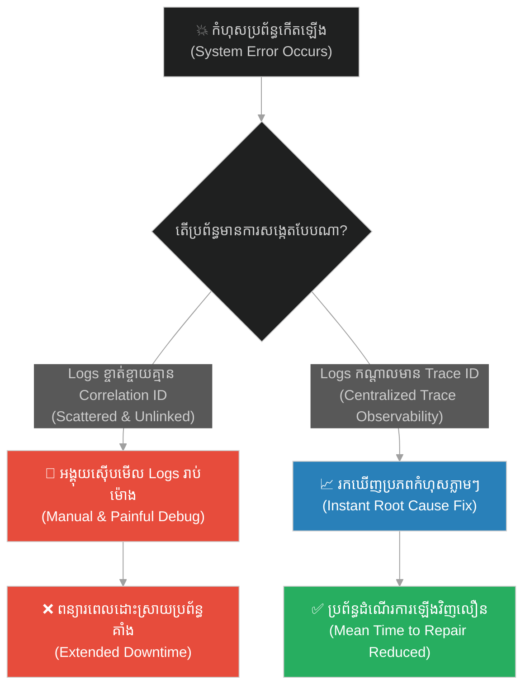
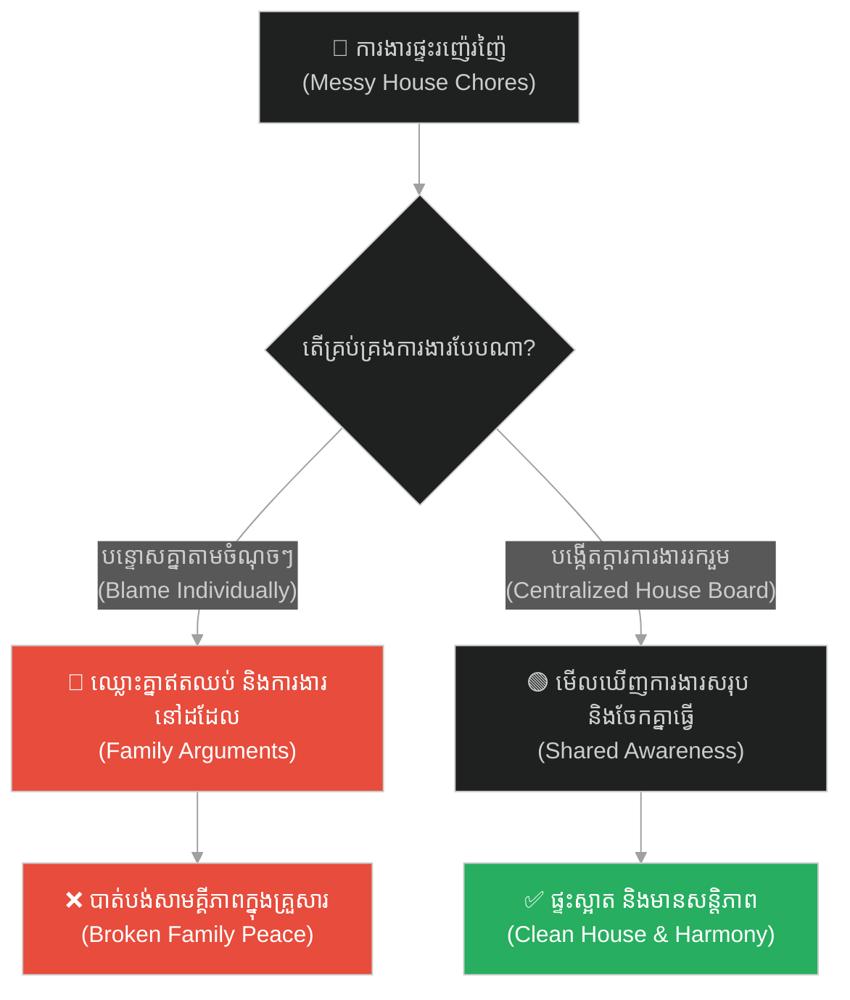
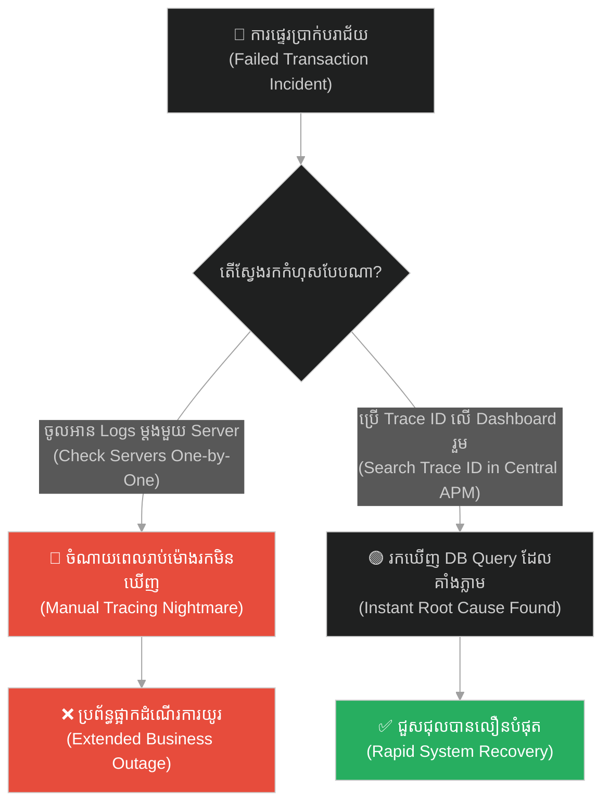
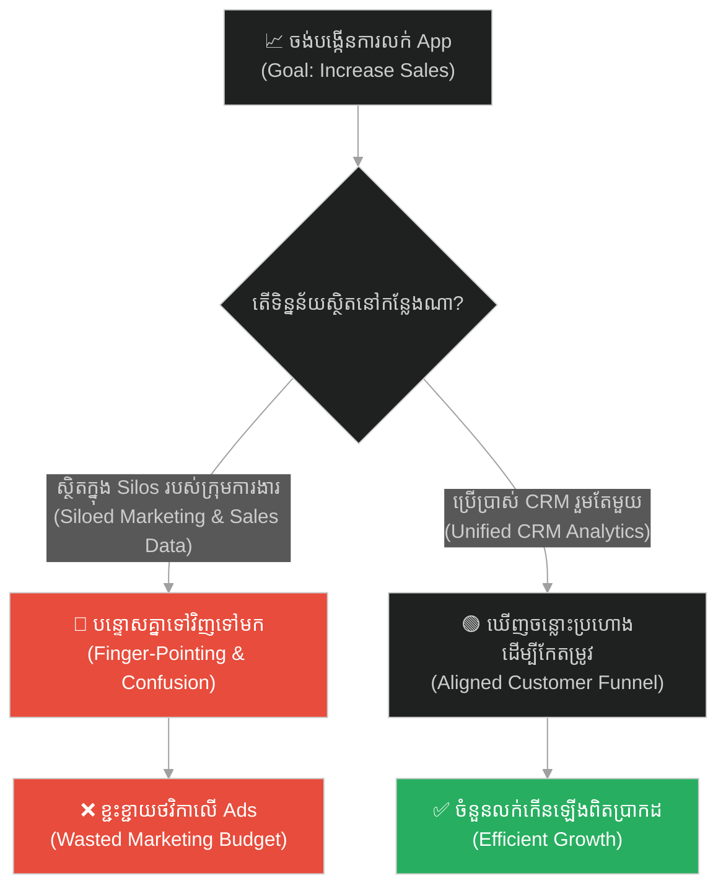
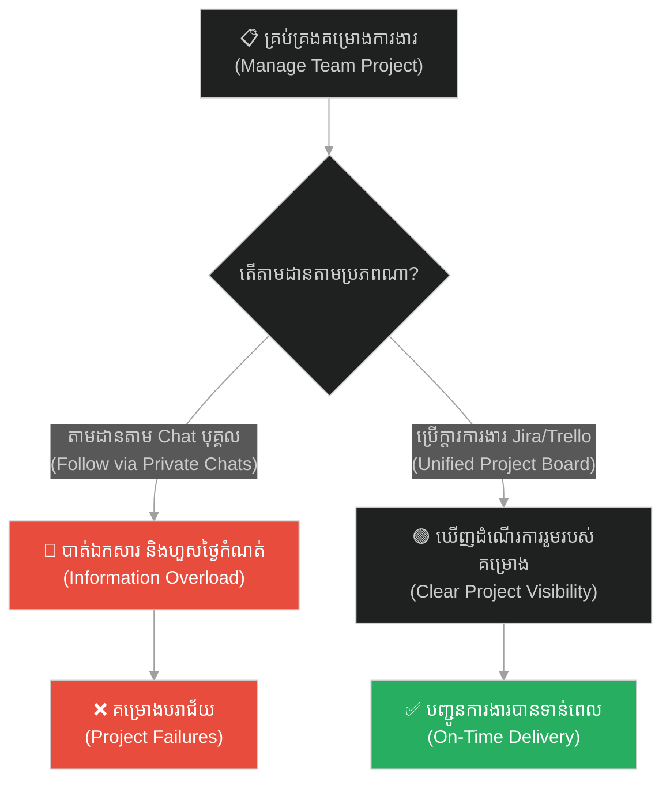
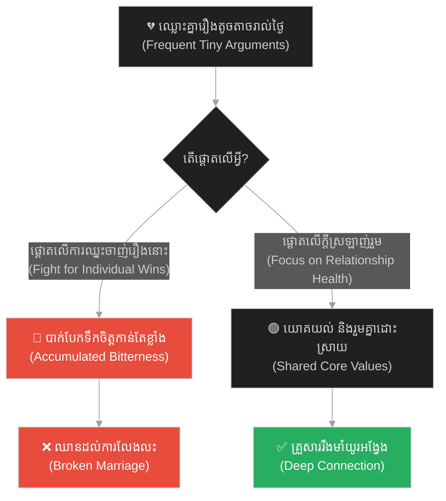
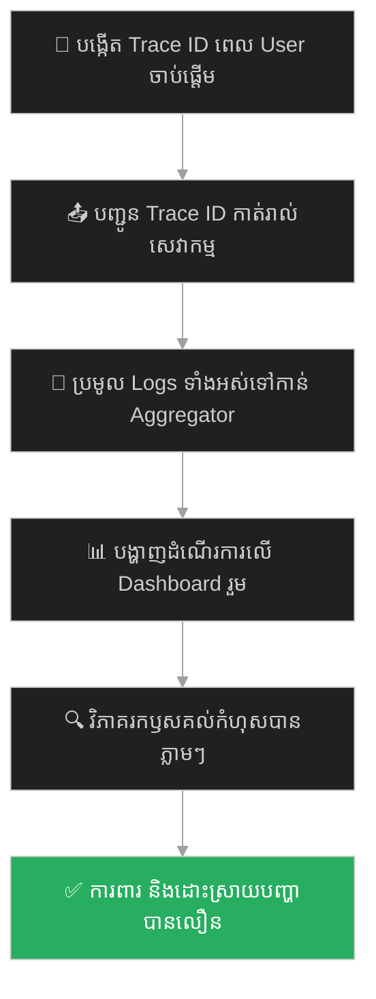

# Observability & Log Analysis (លទ្ធភាពសង្កេត និងការវិភាគកំណត់ត្រា)៖ ស្នាមជើងដំរី (Observability & Log Analysis & The Elephant Footprint)

**Author:** ichamrong  
**Date:** 2026-05-28  
**Tags:** #observability #log-analysis #opentelemetry #correlation-id #monitoring #buddhism #centralized-logging  
**Category:** Concepts  
**Read Time:** ~15 min  

---

## 📌 មាតិកា (Table of Contents)
- [អន្ទាក់ផ្លូវចិត្ត (The Trap)](#0)
- [១. រឿងនិទាន៖ ធម៌ស្នាមជើងដំរី (The Legend of the Elephant's Footprint)](#1)
  - [សតិជាកំពូលនៃធម៌ទាំងឡាយ (Mindfulness as the Ultimate Container)](#1-1)
- [២. បញ្ហា៖ កំណត់ត្រាទិន្នន័យដែលខ្ចាត់ខ្ចាយ និងកង្វះលទ្ធភាពសង្កេតប្រព័ន្ធ (The Issue: Scattered Uncorrelated Logs & Lack of Observability)](#2)
- [៣. ឧទាហរណ៍ជាក់ស្តែងក្នុងពិភពពិត (Real World Examples)](#3)
  - [ឧទាហរណ៍ទី ១ — កម្រិតស្រាល (គ្រួសារ)៖ ការឈ្លោះគ្នារឿងកិច្ចការផ្ទះ (The Siloed Family Chores)](#3-1)
  - [ឧទាហរណ៍ទី ២ — កម្រិតមធ្យម (បច្ចេកទេស)៖ ការស្វែងរកកំហុសក្នុង Server ច្រើន (The Silent Multi-Server Outage)](#3-2)
  - [ឧទាហរណ៍ទី ៣ — កម្រិតមធ្យម (ធុរកិច្ច)៖ ការវាស់ស្ទង់សង្វាក់លក់មិនត្រូវគ្នា (The Fragmented Sales Funnel)](#3-3)
  - [ឧទាហរណ៍ទី ៤ — កម្រិតមធ្យម (សង្គម/គ្រប់គ្រង)៖ ការតាមដានការងាររបស់ក្រុមការងារ (The Chaotic Project Management)](#3-4)
  - [ឧទាហរណ៍ទី ៥ — កម្រិតធ្ងន់ (ទំនាក់ទំនង)៖ ជម្លោះប្រចាំថ្ងៃ និងសុខភាពស្នេហាសរុប (The Siloed Argument Trap)](#3-5)
- [៤. ដំណោះស្រាយទូទៅ៖ ការកំណត់ Correlation ID, ស្ថាបត្យកម្ម OpenTelemetry និងការសង្កេតប្រព័ន្ធកណ្តាល (The General Solution: OpenTelemetry Standards & Centralized Log Analytics)](#4)
- [សេចក្តីសន្និដ្ឋាន (Conclusion)](#5)
- [ឯកសារយោង (References)](#6)
- [Related Posts](#7)

---

<a id="0"></a>
## អន្ទាក់ផ្លូវចិត្ត (The Trap)

តើអ្នកធ្លាប់ចំណាយពេលរាប់ម៉ោង ឬរាប់ថ្ងៃ ដើម្បីដោះស្រាយបញ្ហាមួយដែលកំពុងឆេះកំដៅ ប៉ុន្តែរកមិនឃើញមូលហេតុពិតប្រាកដ ដោយសារតែព័ត៌មាន និងកំណត់ត្រាខ្ចាត់ខ្ចាយនៅកន្លែងផ្សេងៗគ្នាដែរឬទេ? នេះហៅថា **The Siloed Debugging Trap (អន្ទាក់នៃការស្វែងរកកំហុសក្នុងសំបុកដាច់ដោយឡែក)**។

* **ម្ខាង (Side A)** — យើងសម្លឹងមើលតែសូចនាករ ឬកំណត់ត្រាតូចៗដាច់ដោយឡែកពីគ្នា (Isolated Logs / Metrics) ធ្វើឱ្យមើលមិនឃើញទិដ្ឋភាពរួមនៃបញ្ហា។
* **ម្ខាងទៀត (Side B)** — យើងបង្កើតឧបករណ៍តាមដានរួមតែមួយ (Centralized Observability / Correlation ID) ដែលអាចឱ្យយើងសម្លឹងឃើញរាល់សកម្មភាពទាំងអស់របស់ប្រព័ន្ធ ដូចជាស្នាមជើងដំរីដែលគ្របដណ្តប់លើស្នាមជើងសត្វដទៃ។

ផែនទីបង្ហាញផ្លូវសម្រាប់អត្ថបទនេះ៖
1. **រឿងនិទានស្នាមជើងដំរី** — សង្ឃដីកាដ៏ជ្រាលជ្រៅរបស់ព្រះពុទ្ធអំពីធម៌ដែលក្តោបក្តាប់ធម៌ទាំងពួង។
2. **បញ្ហាបច្ចេកវិទ្យា** — របៀបដែលការខ្វះ Correlation ID ធ្វើឱ្យការដោះស្រាយបញ្ហាក្នុង Microservices ក្លាយជាសុបិន្តអាក្រក់ និងដំណោះស្រាយ OpenTelemetry។
3. **ឧទាហរណ៍ ៥ កម្រិត** — ការអនុវត្តការសង្កេតរួម (Observability) ក្នុងគ្រប់ស្ថានភាពជីវិត។
4. **ដំណោះស្រាយជាក់ស្តែង** — វិធីសាស្ត្របង្កើត Log Aggregator និងការតាមដានរដ្ឋប្រព័ន្ធ។



---

<a id="1"></a>
## ១. រឿងនិទាន៖ ធម៌ស្នាមជើងដំរី (The Legend of the Elephant's Footprint)

ព្រះសម្មាសម្ពុទ្ធទ្រង់បានសម្តែងធម៌ទេសនាជាច្រើនរាប់មិនអស់ដល់សាវ័ករបស់ព្រះអង្គ ដូចជាការអត់ធ្មត់ ក្តីមេត្តា ភាពវៃឆ្លាត ការឱ្យទាន និងសីលធម៌ជាដើម។ ថ្ងៃមួយ មានភិក្ខុមួយអង្គបានចូលទៅក្រាបបង្គំទូលសួរព្រះអង្គថា៖ *«បពិត្រព្រះអង្គដ៏ចំរើន ព្រះអង្គបានបង្រៀនធម៌ជាច្រើនដល់ពួកយើង។ តើមានធម៌ណាមួយ ដែលជាកំពូលធម៌ដែលអាចក្តោបក្តាប់ និងផ្ទុកនូវធម៌ទាំងអស់នោះបានដែរឬទេ?»*

ព្រះពុទ្ធបានញញឹម ហើយឆ្លើយតបដោយប្រើការប្រៀបធៀបដ៏សាមញ្ញមួយ គឺ **«ស្នាមជើងដំរី»**។

<a id="1-1"></a>
### សតិជាកំពូលនៃធម៌ទាំងឡាយ (Mindfulness as the Ultimate Container)

ព្រះអង្គមានសង្ឃដីកាថា៖ *«ម្នាលភិក្ខុទាំងឡាយ! នៅក្នុងព្រៃធំនេះ មានសត្វជាច្រើនរស់នៅ ខ្លះតូច ខ្លះធំ។ ប៉ុន្តែទោះបីជាស្នាមជើងរបស់សត្វទាំងអស់នោះមានទម្រង់ និងទំហំច្រើនយ៉ាងណាក៏ដោយ ក៏ស្នាមជើងទាំងអស់នោះ អាចដាក់ចូលទៅក្នុង **ស្នាមជើងរបស់សត្វដំរី (The Elephant's Footprint)** តែមួយបានយ៉ាងងាយស្រួល ពីព្រោះស្នាមជើងដំរីមានទំហំធំជាងគេបង្អស់។»*

*«ដូចគ្នានេះដែរ ធម៌ដ៏ល្អៗទាំងអស់ដែលតថាគតបានបង្រៀន សុទ្ធតែអាចដាក់បូកបញ្ចូលគ្នាទៅក្នុងធម៌តែមួយគត់ នោះគឺ **សតិ ឬការដឹងខ្លួន (Mindfulness / Appamada)**។ បើគ្មានសតិទេ គុណធម៌ដទៃទៀតក៏មិនអាចកើតឡើង ឬរក្សាទុកបានឡើយ។»*

---

<a id="2"></a>
## ២. បញ្ហា៖ កំណត់ត្រាទិន្នន័យដែលខ្ចាត់ខ្ចាយ និងកង្វះលទ្ធភាពសង្កេតប្រព័ន្ធ (The Issue: Scattered Uncorrelated Logs & Lack of Observability)

នៅក្នុងប្រព័ន្ធ Microservices ឬ Cloud Architecture ដ៏ស្មុគស្មាញ សំណើមួយរបស់អតិថិជន (Client Request) ត្រូវឆ្លងកាត់ Gateway, API Service, Auth Service, Billing Service, និង Database។ ប្រសិនបើប្រព័ន្ធនីមួយៗកត់ត្រា Logs ទុកនៅក្នុងម៉ាស៊ីនរៀងៗខ្លួនដោយគ្មាន **Correlation ID (Trace ID)** រួមគ្នាមួយទេ នោះនៅពេលមានកំហុសកើតឡើង វិស្វករនឹងមិនអាចដឹងឡើយថា តើកំហុសនៅ API Service ណាដែលបង្កឡើងដោយសំណើមួយណា។

**Observability (លទ្ធភាពសង្កេត)** គឺជា «ស្នាមជើងដំរី» នៃវិស្វកម្មសូហ្វវែរ។ តាមរយៈការឆ្លងកាត់ Correlation ID ទៅកាន់រាល់ HTTP requests ទាំងអស់ យើងអាចប្រមូលផ្តុំរាល់កំណត់ត្រាទាំងអស់ (Logs, Metrics, Traces) មកកាន់កន្លែងកណ្តាលតែមួយ (ដូចជា Datadog, Grafana, OpenTelemetry) ដើម្បីងាយស្រួលពិនិត្យទិដ្ឋភាពរួម និងស៊ើបអង្កេតកំហុសបានភ្លាមៗ។

ខាងក្រោមនេះជាកូដដែលកត់ត្រា Logs ដាច់ដោយឡែកពីគ្នា (Fragile) និងកូដដែលមាន correlation tracing (Resilient)៖

```python
# ==============================================================================
# ❌ Anti-Pattern: Isolated, Uncorrelated Logs (Scattered footprints)
# ==============================================================================
import logging

class FragileServiceA:
    def process_order(self, order_data):
        # Service logs progress locally without any transaction/correlation ID.
        # When analyzing thousands of concurrent logs, it is impossible
        # to connect A's log with subsequent logs in Service B.
        logging.info("Service A: Received order data.")
        return {"status": "A_OK", "data": order_data}

class FragileServiceB:
    def bill_customer(self, account_id):
        logging.info(f"Service B: Processing billing for account {account_id}")
        # If an error happens here, engineers cannot trace which A order triggered it
        # because there is no link in the log metadata.
        raise Exception("Billing gateway timeout!")


# ==============================================================================
#  Resilient Design: Centralized Logs with Correlation ID (The Elephant's Footprint)
# ==============================================================================
import uuid

class ObservabilityLogger:
    @staticmethod
    def get_correlation_id(headers):
        # Check for traceparent or custom correlation header, generate if missing
        return headers.get("X-Correlation-ID") or str(uuid.uuid4())

class ResilientServiceA:
    def process_order(self, order_data, headers):
        correlation_id = ObservabilityLogger.get_correlation_id(headers)
        
        # We prefix all logs with the Correlation ID (The Elephant's Footprint)
        logging.info(f"[{correlation_id}] Service A: Received order. Starting processing.")
        
        result = {"status": "A_OK", "data": order_data}
        next_headers = {"X-Correlation-ID": correlation_id}
        return result, next_headers

class ResilientServiceB:
    def bill_customer(self, account_id, headers):
        correlation_id = ObservabilityLogger.get_correlation_id(headers)
        logging.info(f"[{correlation_id}] Service B: Processing billing for account {account_id}")
        
        try:
            # Simulating call to payment gateway
            raise Exception("Billing gateway timeout!")
        except Exception as e:
            # The logged error contains the context (Correlation ID matches Service A's footprint)
            logging.error(f"[{correlation_id}] Service B: Billing failed for account {account_id}. Error: {e}")
            raise e
```

---

<a id="3"></a>
## ៣. ឧទាហរណ៍ជាក់ស្តែងក្នុងពិភពពិត

<a id="3-1"></a>
### ឧទាហរណ៍ទី ១ — កម្រិតស្រាល (គ្រួសារ)៖ ការឈ្លោះគ្នារឿងកិច្ចការផ្ទះ (The Siloed Family Chores)

* **ស្ថានភាព៖** សមាជិកគ្រួសារម្នាក់ៗខឹងសម្បារគ្នា រឿងចានមិនទាន់លាង ផ្ទះមិនទាន់បោស និងសម្រាមមិនទាន់យកទៅចោល។
* **បញ្ហា៖** ឈ្លោះគ្នាមិនចេះចប់ ព្រោះម្នាក់ៗមើលឃើញតែចំណែកការងារខ្លួនឯង (Siloed view)។
* **ដំណោះស្រាយ៖** បង្កើត «ស្នាមជើងដំរី» គឺក្ដារព័ត៌មានរួមក្នុងផ្ទះ (Family Chore Dashboard) ដើម្បីឱ្យគ្រប់គ្នាដឹងពីសកម្មភាពសរុប និងចរន្តការងាររួមគ្នា។



---

<a id="3-2"></a>
### ឧទាហរណ៍ទី ២ — កម្រិតមធ្យម (បច្ចេកទេស)៖ ការស្វែងរកកំហុសក្នុង Server ច្រើន (The Silent Multi-Server Outage)

* **ស្ថានភាព៖** អតិថិជនម្នាក់ៗត្អូញត្អែរថា ផ្ទេរប្រាក់មិនចូលគណនី។
* **បញ្ហា៖** ក្រុមការងារត្រូវចូលទៅកាន់ Server នីមួយៗដាច់ដោយឡែក ដើម្បីអានឯកសារ Text Logs ធ្វើឱ្យចំណាយពេលរាប់ម៉ោងទម្រាំរកឃើញ។
* **ដំណោះស្រាយ៖** ប្រើប្រាស់ OpenTelemetry ដើម្បីប្រមូលផ្តុំទិន្នន័យ (Traces) ទៅកាន់ Grafana សម្លឹងឃើញឫសគល់ក្នុងរយៈពេល ១០ វិនាទី។



---

<a id="3-3"></a>
### ឧទាហរណ៍ទី ៣ — កម្រិតមធ្យម (ធុរកិច្ច)៖ ការវាស់ស្ទង់សង្វាក់លក់មិនត្រូវគ្នា (The Fragmented Sales Funnel)

* **ស្ថានភាព៖** ក្រុមទីផ្សារ (Marketing) ថា Ads ជោគជ័យខ្លាំង តែក្រុមលក់ (Sales) ថាមិនអាចលក់ដាច់បានឡើយ។
* **បញ្ហា៖** គ្មាននរណាម្នាក់ដឹងថាអតិថិជនបាត់បង់នៅត្រង់ដំណាក់កាលណា ព្រោះប្រព័ន្ធទិន្នន័យដាច់ដោយឡែកពីគ្នា។
* **ដំណោះស្រាយ៖** រៀបចំប្រព័ន្ធ CRM រួម (ដូចជា Salesforce, HubSpot) ដើម្បីតាមដាន User Journey តាំងពីដំបូងរហូតដល់ទិញរួចរាល់។



---

<a id="3-4"></a>
### ឧទាហរណ៍ទី ៤ — កម្រិតមធ្យម (សង្គម/គ្រប់គ្រង)៖ ការតាមដានការងាររបស់ក្រុមការងារ (The Chaotic Project Management)

* **ស្ថានភាព៖** បុគ្គលិកម្នាក់ៗរាយការណ៍ការងារតាម Chat (Telegram, Slack) រៀងៗខ្លួន ធ្វើឱ្យ Manager មិនដឹងពីស្ថានភាពសរុប។
* **បញ្ហា៖** Manager វង្វេងនឹងសារ និងបាត់បង់ការងារសំខាន់ៗដែលហួសថ្ងៃកំណត់។
* **ដំណោះស្រាយ៖** ប្រើប្រាស់ «ស្នាមជើងដំរី» គឺ Jira, Trello ឬ Asana ដើម្បីតាមដានការងាររួមគ្នា។



---

<a id="3-5"></a>
### ឧទាហរណ៍ទី ៥ — កម្រិតធ្ងន់ (ទំនាក់ទំនង)៖ ជម្លោះប្រចាំថ្ងៃ និងសុខភាពស្នេហាសរុប (The Siloed Argument Trap)

* **ស្ថានភាព៖** គូស្នេហ៍ឈ្លោះគ្នារាល់ថ្ងៃ រឿងបោសផ្ទះយឺតយ៉ាវ ភ្លេចទិញម្ហូប ឬនិយាយអត់ពិរោះ។
* **បញ្ហា៖** សម្លឹងមើលតែកំហុសតូចតាចរៀងខ្លួន (Isolated issues) រហូតដល់បាត់បង់សេចក្តីស្រឡាញ់។
* **ដំណោះស្រាយ៖** ងាកមកមើល «ស្នាមជើងដំរី» គឺសុខភាពសរុបនៃទំនាក់ទំនង និងភាពដឹងខ្លួន (Mindfulness) ដើម្បីយល់ដឹងថា តើយើងទាំងពីរនៅតែចង់រួមរស់ជាមួយគ្នាដែរឬទេ។



---

<a id="4"></a>
## ៤. ដំណោះស្រាយទូទៅ៖ ការកំណត់ Correlation ID, ស្ថាបត្យកម្ម OpenTelemetry និងការសង្កេតប្រព័ន្ធកណ្តាល (The General Solution: OpenTelemetry Standards & Centralized Log Analytics)

ដើម្បីកសាងលទ្ធភាពសង្កេតដ៏ល្អឥតខ្ចោះ ទាំងក្នុងបច្ចេកវិទ្យា និងក្នុងចិត្ត ចូរអនុវត្តជំហានខាងក្រោម៖

1. **កត់ត្រាដោយមានបរិបទ (Contextual Logging):** រាល់ពេលកត់ត្រាព័ត៌មាន ចូរភ្ជាប់មកជាមួយនូវ Trace ID ឬ User ID ជានិច្ច ដើម្បីងាយស្រួលស៊ើបអង្កេត។
2. **ប្រមូលផ្តុំទិន្នន័យ (Centralize Telemetry):** បញ្ឈប់ការទុកទិន្នន័យក្នុង Silos។ ត្រូវប្រមូលផ្តុំទៅកាន់ Dashboard រួមតែមួយ។
3. **អនុវត្តការដឹងខ្លួន (Cultivate Mindfulness):** បង្កើតយន្តការត្រួតពិនិត្យ និងស្ទង់មតិប្រព័ន្ធជានិច្ច ដើម្បីដឹងពីបញ្ហាមុនពេលវាឆាបឆេះដល់ផ្ទៃខាងក្រៅ។



---

## 🐇 ធ្លាក់ចូលក្នុងរន្ធទន្សាយ (Enter the Rabbit Hole)
ដើម្បីស្វែងយល់កាន់តែស៊ីជម្រៅអំពីការគ្រប់គ្រងកូដចាស់ៗ និងការសម្អាតប្រព័ន្ធដែលគ្មានការថែទាំជាច្រើនឆ្នាំ ចូរចុចតំណភ្ជាប់ខាងក្រោម៖

* 🚀 **[ចាប់ផ្តើមដំណើររុករក (Start the Journey) ➔ Refactoring Legacy Code (ការកែលម្អកូដចាស់ៗ)៖ ដើមឈើពិស](./147-buddha-and-the-poisonous-tree.md)**

---

<a id="5"></a>
## សេចក្តីសន្និដ្ឋាន (Conclusion)

> **«រាល់ស្នាមជើងរបស់សត្វទាំងអស់ក្នុងព្រៃ សុទ្ធតែអាចដាក់បូកបញ្ចូលក្នុងស្នាមជើងដំរីបាន។ ការដឹងខ្លួន (សតិ) គឺជាគ្រឹះនៃរាល់គុណធម៌ទាំងឡាយ។»**

នៅពេលអ្នកមានលទ្ធភាពសង្កេតរួម និងការដឹងខ្លួន (Centralized Tracing / Mindfulness) អ្នកនឹងមិនវង្វេងក្នុងព័ត៌មានតូចតាចឡើយ ហើយអាចដោះស្រាយរាល់វិបត្តិនានាប្រកបដោយភាពវៃឆ្លាតបំផុត។

---

<a id="6"></a>
## ឯកសារយោង (References)

* **Majjhima Nikaya** — *Maha-hatthipadopama Sutta (MN 28)*. The Great Discourse on the Simile of the Elephant's Footprint.
* **OpenTelemetry Specification** — *Context Propagation and Distributed Tracing W3C standards*.
* **Kahneman, D.** — *Thinking, Fast and Slow* (2011). Cognitive awareness and systemic observation patterns.

---

<a id="7"></a>
## Related Posts

* **[Perception & Client-Side vs Server-Side State (ការយល់ឃើញ និងស្ថានភាពទិន្នន័យ)៖ ខ្យល់ និងទង់ជ័យ](./145-buddha-and-the-wind-and-flag.md)** — Illusion vs absolute states of reality.
* **[The Cracked Pot and the Five Whys (ក្អមដីប្រេះ និងអាថ៌កំបាំងសំនួរស្វែងរកឫសគល់ទាំង ៥)៖ របៀបដោះស្រាយបញ្ហាឱ្យចំឫសគល់ពិតប្រាកដ](./14-the-cracked-pot-and-the-five-whys.md)** — Standard root-cause analysis tracing.
