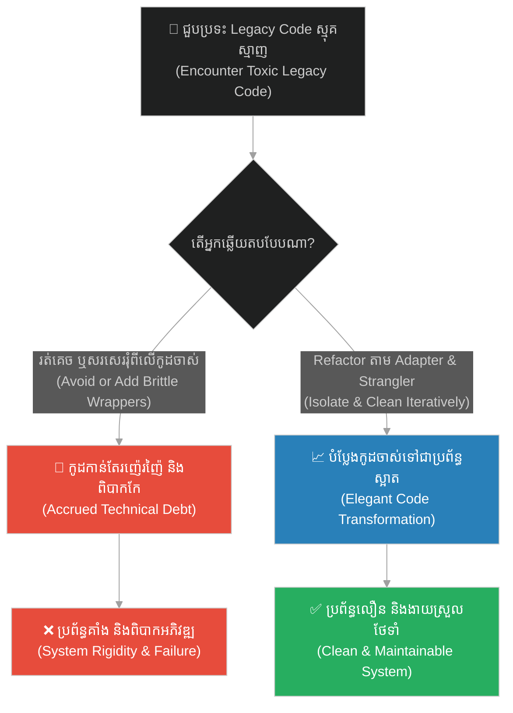
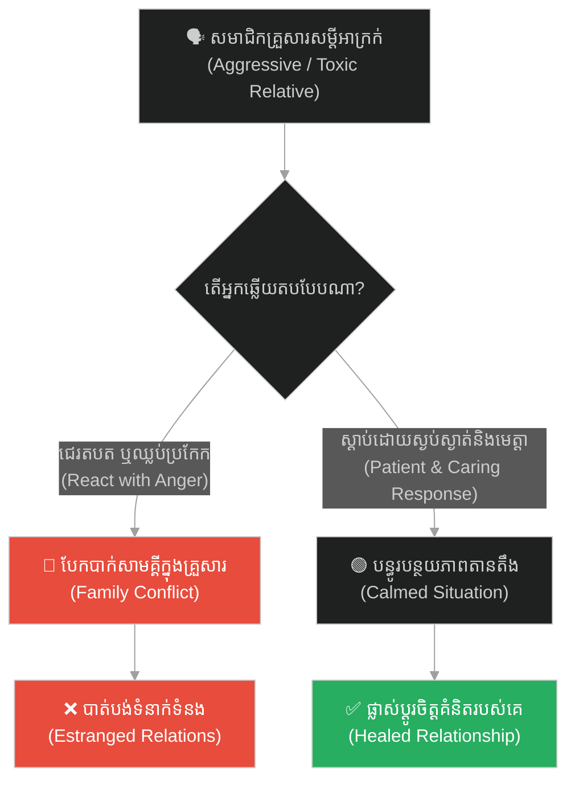
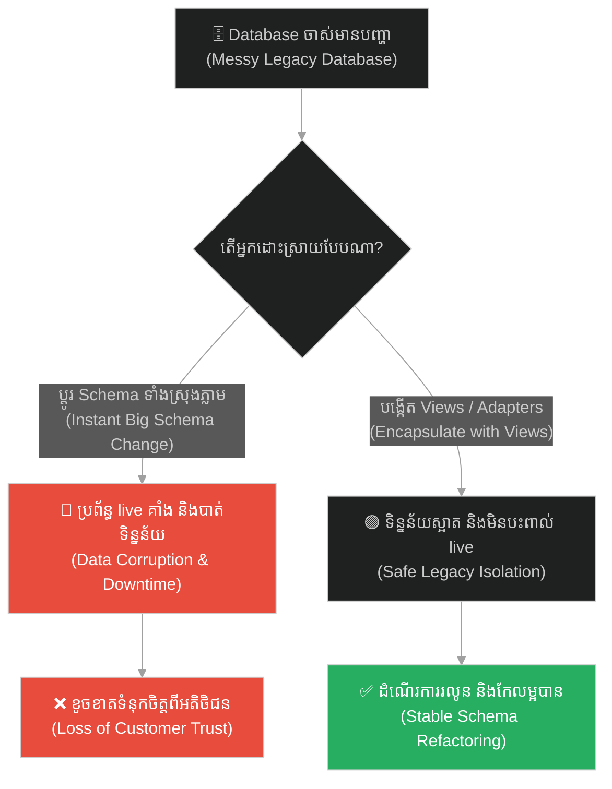
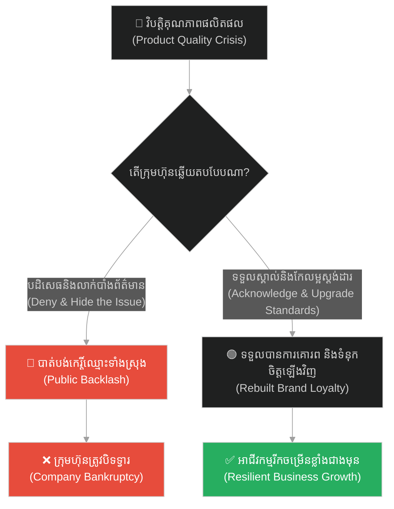
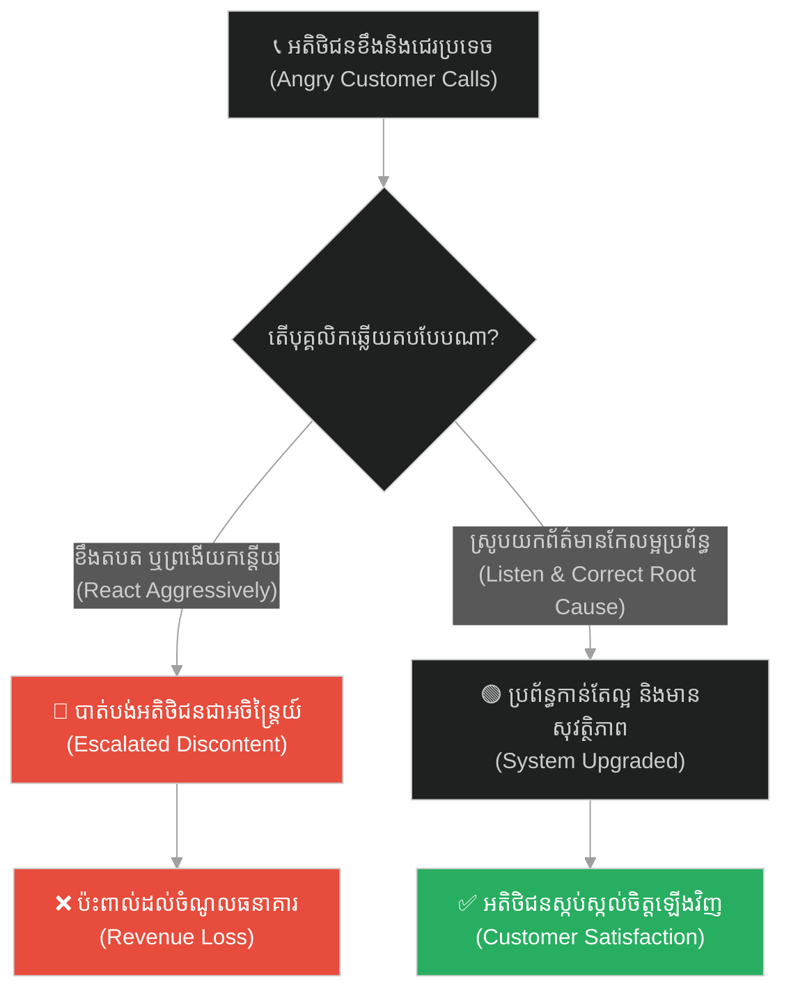
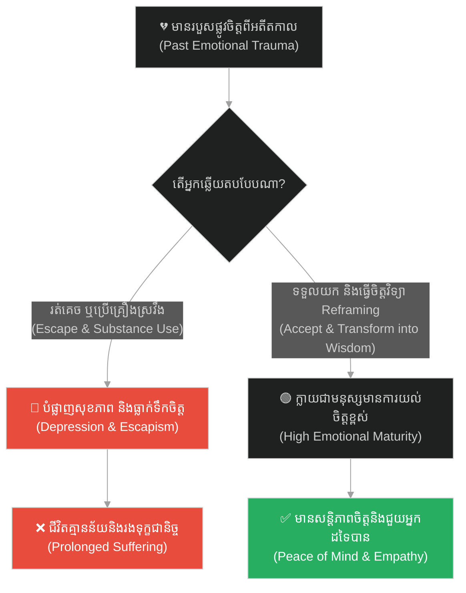
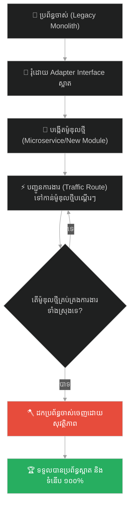

# Refactoring Legacy Code (ការកែលម្អកូដចាស់ៗ)៖ ដើមឈើពិស (Refactoring Legacy Code & The Poisonous Tree)

**Author:** ichamrong  
**Date:** 2026-05-28  
**Tags:** #refactoring #legacy-code #strangler-pattern #adapter-pattern #peacock-mindset #resilience #clean-architecture  
**Category:** Concepts  
**Read Time:** ~15 min  

---

## 📌 មាតិកា (Table of Contents)
- [អន្ទាក់ផ្លូវចិត្ត (The Trap)](#0)
- [១. រឿងនិទាន៖ ដើមឈើពុល និងរបៀបស៊ីរបស់សត្វក្ងោក (The Legend of the Poisonous Tree & The Peacock)](#1)
  - [ប្រព័ន្ធរំលាយអាហារដ៏អស្ចារ្យ និងរោមដ៏ស្រស់ស្អាត (Digesting Poison for Beauty)](#1-1)
- [២. បញ្ហា៖ កូដកេរដំណែលស្មុគស្មាញ និងហានិភ័យនៃការ Rewrite ឡើងវិញ (The Issue: Toxic Legacy Codebases & The Rewrite Risk)](#2)
- [៣. ឧទាហរណ៍ជាក់ស្តែងក្នុងពិភពពិត (Real World Examples)](#3)
  - [ឧទាហរណ៍ទី ១ — កម្រិតស្រាល (គ្រួសារ)៖ សមាជិកគ្រួសារដែលមានចរិតពិបាក (The Brash Relative)](#3-1)
  - [ឧទាហរណ៍ទី ២ — កម្រិតមធ្យម (បច្ចេកទេស)៖ បញ្ហា Database Schema ចាស់ៗ (The Outdated Database Schema)](#3-2)
  - [ឧទាហរណ៍ទី ៣ — កម្រិតមធ្យម (ធុរកិច្ច)៖ វិបត្តិផលិតផល ឬការខូចខាតកេរ្តិ៍ឈ្មោះ (The Product Recall Crisis)](#3-3)
  - [ឧទាហរណ៍ទី ៤ — កម្រិតមធ្យម (សង្គម/គ្រប់គ្រង)៖ ការត្អូញត្អែរយ៉ាងខ្លាំងពីអតិថិជន (The Angry Customer Backlash)](#3-4)
  - [ឧទាហរណ៍ទី ៥ — កម្រិតធ្ងន់ (ទំនាក់ទំនង)៖ របួសផ្លូវចិត្តពីអតីតកាល (The Emotional Trauma Reframe)](#3-5)
- [៤. ដំណោះស្រាយទូទៅ៖ វិធានការដោះស្រាយតាម Strangler Pattern និងការរៀបចំ Interface Adapter (The General Solution: Strangler Fig Pattern & Adapter Isolation)](#4)
- [សេចក្តីសន្និដ្ឋាន (Conclusion)](#5)
- [ឯកសារយោង (References)](#6)
- [Related Posts](#7)

---

<a id="0"></a>
## អន្ទាក់ផ្លូវចិត្ត (The Trap)

តើអ្នកធ្លាប់ជួបប្រទះនូវប្រព័ន្ធការងារចាស់ៗ ឬស្ថានភាពជីវិតដែលពោរពេញដោយភាពរញ៉េរញ៉ៃ (Technical Debt) រួចក៏សម្រេចចិត្តរត់គេច ឬចង់វាយកម្ទេចវាចោលទាំងស្រុងដែរឬទេ? នេះហៅថា **The Big Bang Demolition Trap (អន្ទាក់នៃការកម្ទេចចោលទាំងស្រុង)**។

* **🛡️ ម្ខាង (Side A)** — យើងរត់គេចពីប្រព័ន្ធស្មុគស្មាញ ឬចង់បំផ្លាញវាចោលភ្លាមៗ ដែលអាចបង្កឱ្យមានការបែកបាក់ និងហានិភ័យខ្ពស់ដល់ដំណើរការបច្ចុប្បន្ន។
* **🦚 ម្ខាងទៀត (Side B)** — យើងប្រឈមមុខ ស្វែងយល់ ស្រូបយកភាពស្មុគស្មាញនោះ (Digest the Poison) ហើយបំប្លែងវាឱ្យទៅជាប្រព័ន្ធដ៏ស្អាត និងមានស្ថិរភាព (Refactor Iteratively)។

ផែនទីបង្ហាញផ្លូវសម្រាប់អត្ថបទនេះ៖
1. **រឿងនិទានសត្វក្ងោកស៊ីផ្លែឈើពុល** — មេរៀនព្រះពោធិសត្វក្នុងការបំប្លែងជាតិពុលទៅជាសម្រស់។
2. **បញ្ហាបច្ចេកវិទ្យា** — របៀបគ្រប់គ្រង Legacy Codebase តាមរយៈ Adapter Pattern និងការចៀសវាងហានិភ័យនៃការសរសេរឡើងវិញទាំងស្រុង។
3. **ឧទាហរណ៍ ៥ កម្រិត** — ការអនុវត្តការបំប្លែងវិបត្តិទៅជាឱកាសក្នុងសង្គម អាជីវកម្ម និងផ្លូវចិត្ត។
4. **ដំណោះស្រាយជាក់ស្តែង** — ផែនទីការងារស្ដីពី Strangler Fig Pattern និងការគ្រប់គ្រងហានិភ័យ។



---

<a id="1"></a>
## ១. រឿងនិទាន៖ ដើមឈើពុល និងរបៀបស៊ីរបស់សត្វក្ងោក (The Legend of the Poisonous Tree & The Peacock)

នៅក្នុងគម្ពីរមហាយាន និងការបណ្តុះបណ្តាលផ្លូវចិត្តបែបឡូចុង (Lojong) មានការប្រៀបធៀបដ៏ល្បីល្បាញមួយអំពីរបៀបដែលសត្វផ្សេងៗគ្នាឆ្លើយតបទៅនឹង **«ដើមឈើដែលមានពិស» (The Poisonous Tree)** ដែលដុះនៅចំកណ្តាលព្រៃ។ ដើមឈើនេះដុះស្លឹក និងផ្លែផ្កាពោរពេញដោយជាតិពុលដ៏សាហាវ ដែលអាចសម្លាប់សត្វទាំងឡាយណាដែលប៉ះពាល់វា។

* **មនុស្សទូទៅ និងសត្វទន់ខ្សោយ:** នៅពេលឃើញដើមឈើពុលនោះ ពួកគេមានការភ័យខ្លាចជាខ្លាំង ហើយនាំគ្នារត់គេចឱ្យឆ្ងាយ។ នេះតំណាងឱ្យការរត់គេចពីទុក្ខលំបាក និងបញ្ហា។
* **អ្នកមានប្រាជ្ញា (Pratyekabuddha):** ពេលឃើញដើមឈើពុលនោះ ពួកគេយកពូថៅមកកាប់រំលំវាចោល និងដុតបំផ្លាញ ដើម្បីកុំឱ្យវាបង្កគ្រោះថ្នាក់ដល់អ្នកដទៃ។ នេះតំណាងឱ្យការកម្ចាត់ចោលនូវទុក្ខលំបាក និងការកម្ចាត់កិលេស។

<a id="1-1"></a>
### ប្រព័ន្ធរំលាយអាហារដ៏អស្ចារ្យ និងរោមដ៏ស្រស់ស្អាត (Digesting Poison for Beauty)

ប៉ុន្តែ ចំពោះ **«សត្វក្ងោក» (The Peacock - ដែលតំណាងឱ្យព្រះពោធិសត្វ)** ពេលវាឃើញដើមឈើពុល វាមិនរត់គេច ហើយក៏មិនព្យាយាមកាប់បំផ្លាញវាចោលដែរ។ ផ្ទុយទៅវិញ សត្វក្ងោកហោះទៅទំលើមែកឈើពុលនោះ ហើយចាប់ផ្តើមចឹកស៊ីស្លឹក និងផ្លែឈើពុលទាំងនោះជាអាហារយ៉ាងរីករាយ។

ហេតុអ្វីបានជាវាធ្វើបែបនេះ? ពីព្រោះតាមធម្មជាតិ សត្វក្ងោកមានប្រព័ន្ធរំលាយអាហារពិសេសប្លែកពីគេ ដែលអាចបំប្លែង «សារធាតុពុល» ទាំងនោះ ទៅជាថាមពល និងជា **«ពណ៌សម្បុរដ៏ស្រស់ស្អាត ភ្លឺចែងចាំងនៅលើកន្ទុយ និងរោមរបស់វា»**។ ជាតិពុលមិនត្រឹមតែមិនអាចធ្វើបាបវាបានទេ តែថែមទាំងធ្វើឱ្យវាកាន់តែមានសម្រស់ និងភាពរឹងមាំជាងមុនទៅទៀត។

---

<a id="2"></a>
## ២. បញ្ហា៖ កូដកេរដំណែលស្មុគស្មាញ និងហានិភ័យនៃការ Rewrite ឡើងវិញ (The Issue: Toxic Legacy Codebases & The Rewrite Risk)

នៅក្នុងវិស័យវិស្វកម្មសូហ្វវែរ កូដកេរដំណែល (Legacy Code) ដែលគ្មានការថែទាំ គ្មាន Unit tests និងសរសេរឡើងដោយគ្មានស្តង់ដារ គឺដូចជាដើមឈើពុល។ 

* **ការរត់គេច (The Runner):** Developer ខ្លាចមិនហ៊ានប៉ះកូដចាស់ ក៏សរសេរកូដថ្មីព័ទ្ធជុំវិញ ដែលធ្វើឱ្យប្រព័ន្ធកាន់តែស្មុគស្មាញ និងកើនឡើង Technical Debt។
* **ការកាប់កម្ទេច (The Axe-wielder):** ការសម្រេចចិត្តសរសេរឡើងវិញទាំងស្រុង (Big Bang Rewrite) ជារឿយៗជួបការបរាជ័យ ព្រោះកូដចាស់មានលក្ខខណ្ឌអាជីវកម្មលាក់កំបាំងជាច្រើនដែលគ្មាននរណាម្នាក់ដឹង ធ្វើឱ្យប្រព័ន្ធថ្មីកើតមាន Bugs ជាច្រើនពេលដាក់ឱ្យប្រើប្រាស់។

ដំណោះស្រាយបែប **«សត្វក្ងោក»** គឺការអនុវត្ត **Adapter Pattern** និង **Strangler Fig Pattern**។ យើងហ៊ានប្រឈមមុខនឹងកូដចាស់ រុំវាដោយ Interface ស្អាត រួចសរសេរ Unit tests ដើម្បីការពារមុខងារចាស់ បន្ទាប់មកទើប Refactor កូដចាស់ខាងក្នុងម្តងមួយចំណុចៗដោយសុវត្ថិភាព។

ខាងក្រោមនេះជាការប្រៀបធៀបរវាងការសរសេរកូដរុំខ្វះស្ថិរភាព និងការប្រើប្រាស់ Adapter Pattern ដើម្បី Refactor កូដចាស់៖

```python
# ==============================================================================
# ❌ Anti-Pattern: Fragile Workarounds on Legacy Code (Avoiding the Poisonous Tree)
# ==============================================================================
class LegacyBillingSystem:
    # Toxic legacy code: returns raw list with mixed data types and side effects.
    # It throws cryptic exceptions and contains spaghetti structures.
    def compute(self, data):
        # ... complex legacy spaghetti logic ...
        return [100.0, "tax:10.0", "EXPIRED", 25.5]

class ClientAppWithFragileWrapper:
    def __init__(self):
        self.billing = LegacyBillingSystem()

    def process(self, data):
        # Brittle parsing logic directly coupled to the legacy implementation.
        # If the legacy output structure changes, this client code breaks.
        result = self.billing.compute(data)
        total = 0.0
        for item in result:
            if isinstance(item, float):
                total += item
            elif isinstance(item, str) and item.startswith("tax:"):
                total += float(item.split(":")[1])
        return total


# ==============================================================================
#  Resilient Design: The Peacock Refactoring Pattern (Strangler / Adapter Pattern)
# ==============================================================================
from abc import ABC, abstractmethod

class BillingGateway(ABC):
    @abstractmethod
    def calculate_total(self, data: dict) -> float:
        pass

class RefactoredBillingAdapter(BillingGateway):
    # We digest the legacy system ("the poison") by encapsulating it.
    # We define a clean interface and safely parse the legacy output.
    def __init__(self, legacy_system: LegacyBillingSystem):
        self.legacy = legacy_system

    def calculate_total(self, data: dict) -> float:
        try:
            raw_output = self.legacy.compute(data)
            return self._parse_legacy_output(raw_output)
        except Exception as e:
            # Safely handle cryptic exceptions from the legacy module
            return 0.0

    def _parse_legacy_output(self, raw_output: list) -> float:
        # Isolated, testable parser. We can write extensive unit tests for this.
        # Once verified, we can refactor/rewrite the legacy system internally
        # without affecting the client applications.
        total = 0.0
        for item in raw_output:
            if isinstance(item, float):
                total += item
            elif isinstance(item, str) and item.startswith("tax:"):
                total += float(item.split(":")[1])
        return total
```

---

<a id="3"></a>
## ៣. ឧទាហរណ៍ជាក់ស្តែងក្នុងពិភពពិត

<a id="3-1"></a>
### ឧទាហរណ៍ទី ១ — កម្រិតស្រាល (គ្រួសារ)៖ សមាជិកគ្រួសារដែលមានចរិតពិបាក (The Brash Relative)

* **ស្ថានភាព៖** គ្រួសារមួយមានសមាជិកម្នាក់ដែលមានសម្តីអាក្រក់ ចូលចិត្តនិយាយរិះគន់ និងបង្កជម្លោះនៅក្នុងរាល់ការជួបជុំ។
* **បញ្ហា៖** មនុស្សដទៃទៀតនាំគ្នារត់គេច ឬឈ្លោះប្រកែកតបត ដែលធ្វើឱ្យការជួបជុំគ្រួសារក្លាយជាសុបិន្តអាក្រក់។
* **ដំណោះស្រាយ៖** ប្រើផ្នត់គំនិតសត្វក្ងោក។ ស្តាប់ដោយភាពអត់ធ្មត់ មិនយកពាក្យសម្តីមកដាក់ក្នុងខ្លួន (Digest the Poison) ហើយឆ្លើយតបដោយភាពទន់ភ្លន់ និងក្តីស្រឡាញ់ ដែលអាចធ្វើឱ្យសមាជិកនោះភ្ញាក់រលឹក និងកែប្រែខ្លួនឯង។



---

<a id="3-2"></a>
### ឧទាហរណ៍ទី ២ — កម្រិតមធ្យម (បច្ចេកទេស)៖ បញ្ហា Database Schema ចាស់ៗ (The Outdated Database Schema)

* **ស្ថានភាព៖** Database ចាស់របស់ក្រុមហ៊ុនគ្មានការកំណត់ Index និងមានឈ្មោះជួរឈរ (Columns) ច្របូកច្របល់។
* **បញ្ហា៖** Developer ចង់បង្កើត Database ថ្មីទាំងស្រុង តែត្រូវចំណាយថវិកាច្រើន និងប៉ះពាល់ដល់ Live Users។
* **ដំណោះស្រាយ៖** បង្កើត Database Views ឬ Read Replicas (Adapter) ដើម្បីចម្រោះទិន្នន័យចាស់ឱ្យស្អាត មុននឹងបញ្ជូនទៅកាន់ Frontend ដោយមិនបាច់ប្តូរ Schema ភ្លាមៗឡើយ។



---

<a id="3-3"></a>
### ឧទាហរណ៍ទី ៣ — កម្រិតមធ្យម (ធុរកិច្ច)៖ វិបត្តិផលិតផល ឬការខូចខាតកេរ្តិ៍ឈ្មោះ (The Product Recall Crisis)

* **ស្ថានភាព៖** ក្រុមហ៊ុនផលិតអាហារមួយ ជួបប្រទះការលេចធ្លាយសារធាតុមិនល្អនៅក្នុងផលិតផលរបស់ខ្លួន ដែលត្រូវបានគេបង្ហោះរិះគន់ពេញបណ្តាញសង្គម។
* **បញ្ហា៖** ក្រុមហ៊ុនរត់គេច ឬបដិសេធ (រត់ចេញពីដើមឈើពុល) ធ្វើឱ្យក្រុមហ៊ុនត្រូវក្ស័យធន។
* **ដំណោះស្រាយ៖** ទទួលស្គាល់កំហុស ប្រមូលផលិតផលមកវិញ (Digest the Poison) និងធ្វើការកែលម្អរោងចក្រឱ្យមានស្តង់ដារខ្ពស់ជាងមុន ដែលធ្វើឱ្យអតិថិជនត្រឡប់មកគាំទ្រកាន់តែខ្លាំងជាងមុន។



---

<a id="3-4"></a>
### ឧទាហរណ៍ទី ៤ — កម្រិតមធ្យម (សង្គម/គ្រប់គ្រង)៖ ការត្អូញត្អែរយ៉ាងខ្លាំងពីអតិថិជន (The Angry Customer Backlash)

* **ស្ថានភាព៖** ប្រព័ន្ធធនាគារជួបប្រទះការយឺតយ៉ាវ ធ្វើឱ្យអតិថិជនខឹងសម្បារ និងទូរស័ព្ទមកជេរប្រទេចបុគ្គលិកគាំទ្រ (Customer Support)។
* **បញ្ហា៖** បុគ្គលិកខឹងតបវិញ ឬលែងចង់ឆ្លើយតប ដែលធ្វើឱ្យបញ្ហាកាន់តែរីករាលដាល។
* **ដំណោះស្រាយ៖** ស្រូបយកការរិះគន់ (Digest the feedback) ដើម្បីយល់ដឹងពីបញ្ហាពិតប្រាកដក្នុងប្រព័ន្ធ រួចចាត់ចែងវិស្វករឱ្យជួសជុលចំណុចខ្សោយនោះភ្លាមៗ។



---

<a id="3-5"></a>
### ឧទាហរណ៍ទី ៥ — កម្រិតធ្ងន់ (ទំនាក់ទំនង)៖ របួសផ្លូវចិត្តពីអតីតកាល (The Emotional Trauma Reframe)

* **ស្ថានភាព៖** មនុស្សម្នាក់មានការឈឺចាប់ និងរបួសផ្លូវចិត្តយ៉ាងធ្ងន់ធ្ងរពីអតីតកាល (Childhood Trauma ឬទំនាក់ទំនងចាស់)។
* **បញ្ហា៖** គាត់ព្យាយាមរត់គេច ឬប្រើប្រាស់គ្រឿងស្រវឹងដើម្បីបំភ្លេច (រត់ពីដើមឈើពុល) ដែលធ្វើឱ្យគាត់កាន់តែទ្រុឌទ្រោម។
* **ដំណោះស្រាយ៖** ប្រើប្រាស់យន្តការ Reframing ដូចសត្វក្ងោក។ ប្រឈមមុខនឹងការពិត ទទួលយកការឈឺចាប់ ហើយបំប្លែងវាឱ្យទៅជាការយល់ចិត្ត (Empathy) និងមេរៀនជីវិតដើម្បីជួយដោះស្រាយបញ្ហាអ្នកដទៃ។



---

<a id="4"></a>
## ៤. ដំណោះស្រាយទូទៅ៖ វិធានការដោះស្រាយតាម Strangler Pattern និងការរៀបចំ Interface Adapter (The General Solution: Strangler Fig Pattern & Adapter Isolation)

ដើម្បីកែលម្អកូដចាស់ និងបំប្លែងបញ្ហាប្រកបដោយសុវត្ថិភាព ចូរអនុវត្តជំហានខាងក្រោម៖

1. **បង្កើត Adapter ដាក់ឱ្យនៅដាច់ដោយឡែក (Isolate Legacy):** កុំអនុញ្ញាតឱ្យកូដថ្មីប៉ះពាល់ផ្ទាល់ជាមួយកូដចាស់ដែលរញ៉េរញ៉ៃ។ ត្រូវរុំវាដោយ Interface/Adapter ជានិច្ច។
2. **សរសេរ Unit Tests គ្រប់ដណ្តប់ (Write Characterization Tests):** សរសេរតេស្តដើម្បីស្វែងយល់ និងការពារលទ្ធផលបច្ចុប្បន្នរបស់កូដចាស់ ធានាថាមិនបាត់មុខងារចាស់ពេល Refactor។
3. **ផ្លាស់ប្តូរជាដំណាក់កាល (Iterative Strangling):** បង្កើតម៉ូឌុលថ្មីៗជំនួសឱ្យម៉ូឌុលចាស់ម្តងមួយៗ រហូតដល់ប្រព័ន្ធចាស់ត្រូវបានជំនួសទាំងស្រុងដោយសុវត្ថិភាព (Strangler Fig Pattern)។



---

## 🐇 ធ្លាក់ចូលក្នុងរន្ធទន្សាយ (Enter the Rabbit Hole)
ដើម្បីស្វែងយល់កាន់តែស៊ីជម្រៅអំពីការត្រៀមខ្លួនសម្រាប់គ្រោះមហន្តរាយ ការស្តារឡើងវិញនូវដំណើរការការងារ និងការស្វែងយល់ពីកំហុសក្រោយការគាំងប្រព័ន្ធ ចូរចុចតំណភ្ជាប់ខាងក្រោម៖

* 🚀 **[ចាប់ផ្តើមដំណើររុករក (Start the Journey) ➔ Disaster Recovery & Post-Incident Learning (ការស្តារឡើងវិញ និងការរៀនសូត្រក្រោយបញ្ហា)៖ ស្រ្តីយំទាមទារកូន](./148-buddha-and-the-weeping-woman.md)**

---

<a id="5"></a>
## សេចក្តីសន្និដ្ឋាន (Conclusion)

> **«កុំព្យាយាមរត់គេច ឬកាប់បំផ្លាញដើមឈើពុលនៃជីវិតឡើយ។ ចូររៀនធ្វើខ្លួនជាសត្វក្ងោក ស្រូបយកនិងរំលាយរាល់ជាតិពុល (បញ្ហា និងការឈឺចាប់) ដើម្បីបំប្លែងវាឱ្យទៅជាសម្រស់ និងភាពជោគជ័យរបស់អ្នក។»**

ការ Refactor កូដចាស់ៗ និងការកែប្រែបញ្ហាជីវិត ទាមទារនូវភាពក្លាហាន និងភាពអត់ធ្មត់ខ្ពស់។ នៅពេលអ្នកចេះគ្រប់គ្រង និងបំប្លែងវាជាជំហានៗ នោះអ្នកនឹងទទួលបានប្រព័ន្ធការងារដ៏រឹងមាំ និងជីវិតដ៏មានសម្រស់។

---

<a id="6"></a>
## ឯកសារយោង (References)

* **Dharmarakshita** — *The Wheel of Sharp Weapons (Theg-pa chen-po’i blo-sbyong mtshon-cha ’khor-lo)*. Metaphor of the peacock in the poison grove.
* **Fowler, M.** — *Refactoring: Improving the Design of Existing Code* (2nd Edition, 2018). Core concepts on code smells and step-by-step refactoring.
* **Martin, R. C.** — *Clean Architecture: A Craftsman's Guide to Software Structure and Design* (2017). Adapters, Boundaries, and Legacy Wrapping.

---

<a id="7"></a>
## Related Posts

* **[Observability & Log Analysis (លទ្ធភាពសង្កេត និងការវិភាគកំណត់ត្រា)៖ ស្នាមជើងដំរី](./146-buddha-and-the-elephant-footprint.md)** — Tracing issues in systems.
* **[Iterative Refactoring & CI Code Quality (ការកែលម្អកូដជាបន្តបន្ទាប់ និងគុណភាពកូដ CI)៖ ជាងមាស](./143-buddha-and-the-goldsmith.md)** — The purification process of refining code quality.
