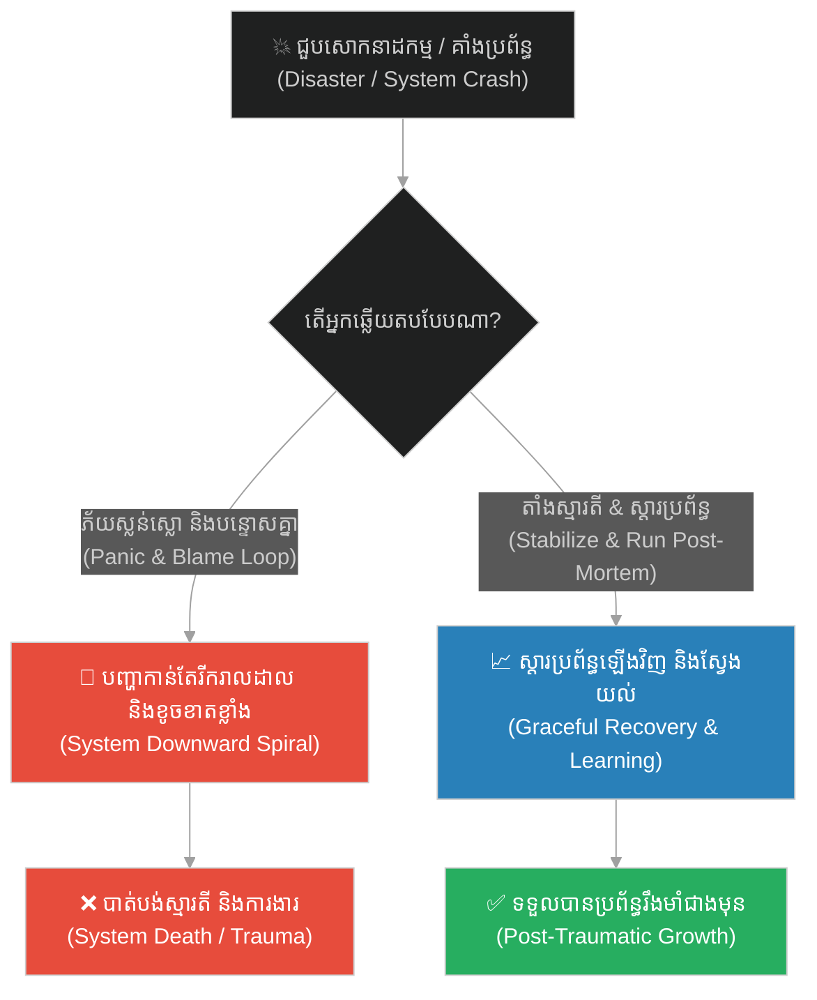
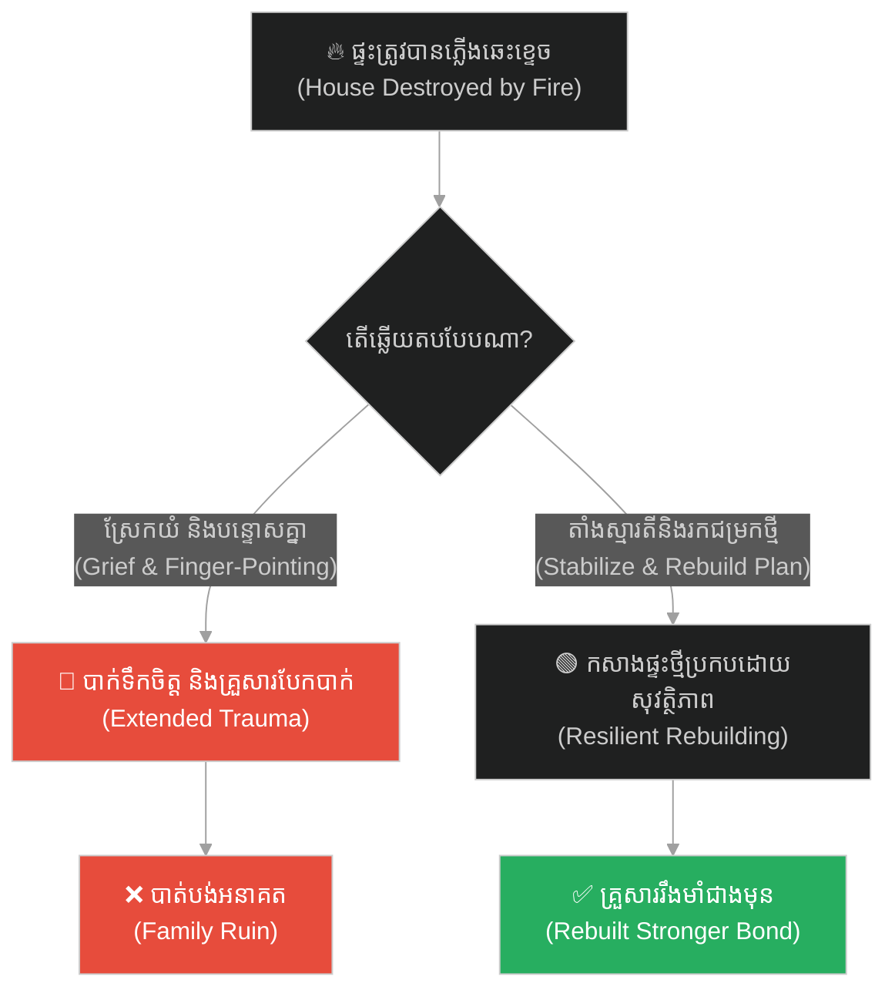
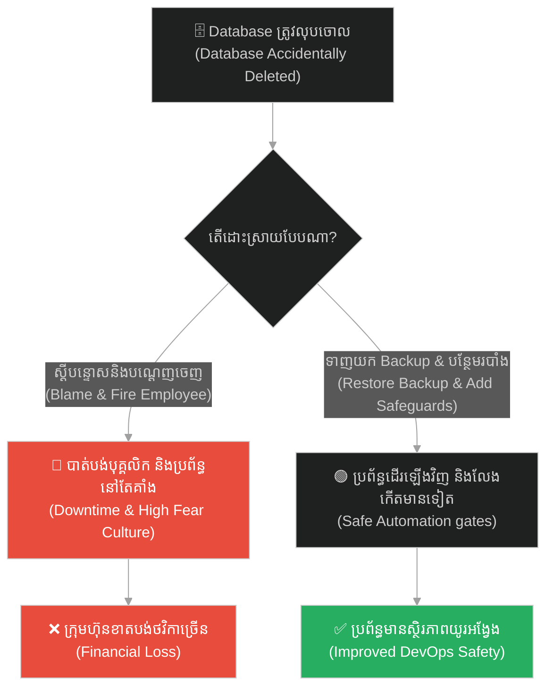
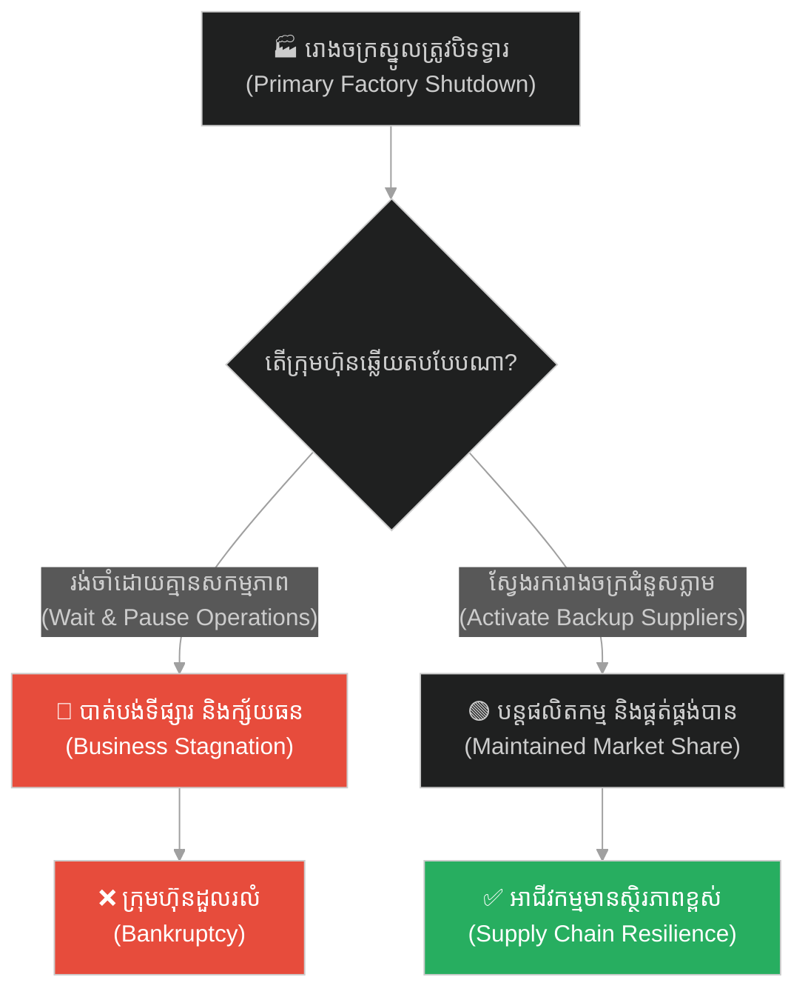
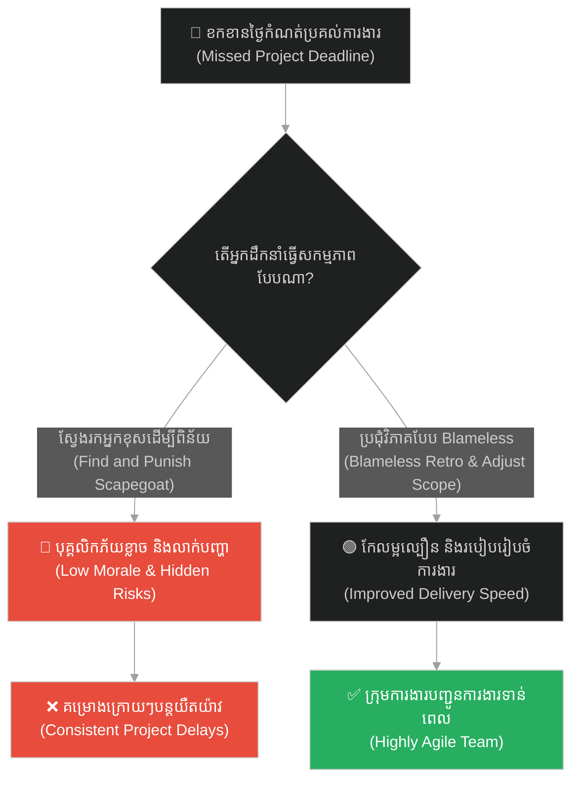
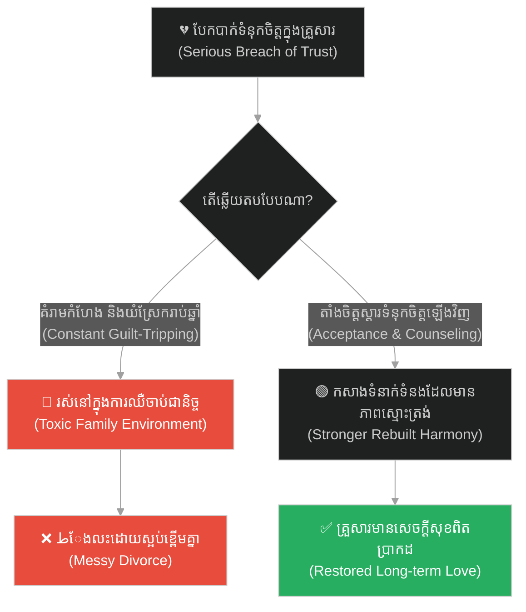
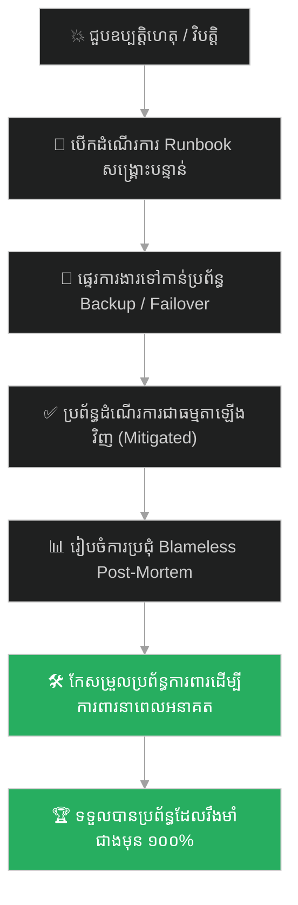

# Disaster Recovery & Post-Incident Learning (ការស្តារឡើងវិញ និងការរៀនសូត្រក្រោយបញ្ហា)៖ បដាចារា (Disaster Recovery & Post-Incident Learning & Patacara's Tragedy)

**Author:** ichamrong  
**Date:** 2026-05-28  
**Tags:** #disaster-recovery #post-mortem #blameless-postmortem #resilience #buddhism #patacara #incident-response  
**Category:** Concepts  
**Read Time:** ~15 min  

---

## 📌 មាតិកា (Table of Contents)
- [អន្ទាក់ផ្លូវចិត្ត (The Trap)](#0)
- [១. រឿងនិទាន៖ សោកនាដកម្មរបស់នាងបដាចារា (The Tragedy of Patacara)](#1)
  - [ការជួបព្រះពុទ្ធ និងការតាំងស្មារតីឡើងវិញ (Recovering Presence of Mind)](#1-1)
- [២. បញ្ហា៖ វិបត្តិគាំងប្រព័ន្ធខ្នាតយក្ស និងកង្វះផែនការស្តារឡើងវិញ (The Issue: Cascading System Outages & Lack of Disaster Recovery)](#2)
- [៣. ឧទាហរណ៍ជាក់ស្តែងក្នុងពិភពពិត (Real World Examples)](#3)
  - [ឧទាហរណ៍ទី ១ — កម្រិតស្រាល (គ្រួសារ)៖ គ្រោះមហន្តរាយភ្លើងឆេះផ្ទះ (The House Fire Recovery)](#3-1)
  - [ឧទាហរណ៍ទី ២ — កម្រិតមធ្យម (បច្ចេកទេស)៖ ការលុប Database ចោលដោយអចេតនា (The Accidental Database Deletion)](#3-2)
  - [ឧទាហរណ៍ទី ៣ — កម្រិតមធ្យម (ធុរកិច្ច)៖ ការដួលរលំសង្វាក់ផ្គត់ផ្គង់ (The Supply Chain Collapse)](#3-3)
  - [ឧទាហរណ៍ទី ៤ — កម្រិតមធ្យម (សង្គម/គ្រប់គ្រង)៖ គម្រោងការងារខកខានថ្ងៃកំណត់ (The Catastrophic Sprint Failure)](#3-4)
  - [ឧទាហរណ៍ទី ៥ — កម្រិតធ្ងន់ (ទំនាក់ទំនង)៖ ការបាត់បង់ទំនុកចិត្តយ៉ាងធ្ងន់ធ្ងរ (The Trust Crisis)](#3-5)
- [៤. ដំណោះស្រាយទូទៅ៖ ការរៀបចំ Blameless Post-Mortem, ផែនការ Failover និងយន្តការស្តារឡើងវិញ (The General Solution: Post-Incident Runbooks & Failover Verification)](#4)
- [សេចក្តីសន្និដ្ឋាន (Conclusion)](#5)
- [ឯកសារយោង (References)](#6)
- [Related Posts](#7)

---

<a id="0"></a>
## អន្ទាក់ផ្លូវចិត្ត (The Trap)

តើអ្នកធ្លាប់ជួបប្រទះនឹងគ្រោះមហន្តរាយភ្លាមៗ ដែលធ្វើឱ្យអ្នកភ័យស្លន់ស្លោ និងធ្វើឱ្យប្រព័ន្ធទាំងមូលត្រូវខូចខាតទាំងស្រុង ដោយសារតែកង្វះផែនការទប់ទល់ទុកជាមុនដែរឬទេ? នេះហៅថា **The Panic & Blame Trap (អន្ទាក់នៃការភ័យស្លន់ស្លោ និងការស្វែងរកអ្នកខុស)**។

* **⚡ ម្ខាង (Side A)** — យើងភ័យស្លន់ស្លោ ព្យាយាមលាក់បាំងកំហុស ឬបន្ទោសគ្នាទៅវិញទៅមក ដែលធ្វើឱ្យស្ថានភាពកាន់តែធ្ងន់ធ្ងរ និងបាត់បង់ឱកាសរៀនសូត្រពីបញ្ហា។
* **🛡️ ម្ខាងទៀត (Side B)** — យើងតាំងស្មារតី បញ្ឈប់ការរាលដាលនៃបញ្ហា (Mitigation) រួចធ្វើការសិក្សាស្វែងយល់ដោយគ្មានការបន្ទោស (Blameless Post-Mortem) ដើម្បីការពារកុំឱ្យវាកើតឡើងជាថ្មី។

ផែនទីបង្ហាញផ្លូវសម្រាប់អត្ថបទនេះ៖
1. **រឿងនិទាននាងបដាចារា** — សោកនាដកម្មបន្តបន្ទាប់ដែលស្ទើរតែបំផ្លាញជីវិតនាង និងការសង្គ្រោះដោយព្រះពុទ្ធ។
2. **បញ្ហាបច្ចេកវិទ្យា** — របៀបដោះស្រាយវិបត្តិប្រព័ន្ធគាំងខ្នាតធំ (Cascading Outages) ការបង្កើត Failover និងការសរសេរ Post-Mortem report។
3. **ឧទាហរណ៍ ៥ កម្រិត** — របៀបបំប្លែងភាពរន្ធត់ផ្លូវចិត្ត និងបច្ចេកទេសទៅជាការលូតលាស់ (Post-Traumatic Growth)។
4. **ដំណោះស្រាយជាក់ស្តែង** — ផែនការសកម្មភាពនៃការរៀបចំ Disaster Recovery Runbook និង Incident Management។



---

<a id="1"></a>
## ១. រឿងនិទាន៖ សោកនាដកម្មរបស់នាងបដាចារា (The Tragedy of Patacara)

នៅក្នុងប្រវត្តិព្រះពុទ្ធសាសនា គ្មានរឿងរ៉ាវណាដែលបង្ហាញពីការបាត់បង់ និងការឈឺចាប់ខ្លាំងជាងដំណើរជីវិតរបស់នាង **«បដាចារា»** ឡើយ។ នាងគឺជាបុត្រីរបស់សេដ្ឋីម្នាក់ តែបានសម្រេចចិត្តរត់តាមបុរសបម្រើក្នុងផ្ទះទៅរស់នៅជនបទឆ្ងាយ។ ថ្ងៃមួយ ពេលនាងត្រូវធ្វើដំណើរត្រឡប់មកផ្ទះឪពុកម្តាយដើម្បីសម្រាលកូន នាងបានជួបប្រទះនូវសោកនាដកម្មផ្ទួនៗគ្នាដែលនឹកស្មានមិនដល់៖

1. **ការបាត់បង់ប្តី:** នៅកណ្តាលព្រៃ ស្វាមីរបស់នាងត្រូវបានពស់ពិសចឹកស្លាប់ភ្លាមៗ ពេលកំពុងកាប់អុសធ្វើខ្ទមការពារភ្លៀង។
2. **ការបាត់បង់កូនទាំងពីរ:** ពេលឆ្លងទន្លេដ៏ធំមួយ កូនច្បងត្រូវបានទឹកហូរកួចយកទៅបាត់ ឯកូនខ្ចីដែលទើបនឹងកើតត្រូវបានសត្វឥន្ទ្រីឆាបយកទៅចំពោះមុខនាង ដោយនាងមិនអាចជួយអ្វីបានឡើយ។
3. **ការបាត់បង់ឪពុកម្តាយ និងបង:** ពេលនាងធ្វើដំណើរមកដល់ទីក្រុង ស្រាប់តែដឹងថាខ្យល់ព្យុះកាលពីយប់មិញបានបោកបក់រំលំផ្ទះសង្កត់សម្លាប់ឪពុកម្តាយ និងបងប្រុសរបស់នាងទាំងអស់ រួចសាកសពរបស់ពួកគេកំពុងត្រូវបានគេបូជារួមគ្នា។

ការបាត់បង់អ្វីៗគ្រប់យ៉ាងក្នុងពេលតែមួយថ្ងៃ ធ្វើឱ្យនាងបាត់បង់ស្មារតីទាំងស្រុង។ នាងបានឆ្កួតវង្វេង រហែកសម្លៀកបំពាក់អស់ ហើយដើរស្រែកយំអាក្រាតកាយពេញទីក្រុង សម្លឹងមើលទៅដូចជាប្រព័ន្ធដែលត្រូវបែកបាក់ខួរក្បាល (Split-brain & System crash)។

<a id="1-1"></a>
### ការជួបព្រះពុទ្ធ និងការតាំងស្មារតីឡើងវិញ (Recovering Presence of Mind)

នាងបានរត់ចូលមកដល់វត្តជេតពន ដែលព្រះសម្មាសម្ពុទ្ធកំពុងសម្តែងធម៌។ មនុស្សទាំងឡាយបាននាំគ្នាដេញ និងគប់ដុំថ្មដាក់នាង ព្រោះស្មានថានាងជាមនុស្សឆ្កួត។ ប៉ុន្តែព្រះពុទ្ធទ្រង់បានឃាត់ពួកគេ ហើយមានសង្ឃដីកាទៅកាន់នាងដោយសម្លេងដ៏ស្ងប់ និងទន់ភ្លន់បំផុតថា៖

> **«នាងប្អូន! ចូរតាំងស្មារតីឡើងវិញចុះ (Sister, recover your presence of mind)!»**

ពាក្យសម្តេចព្រះពុទ្ធប្រៀបដូចជាការ Reset ប្រព័ន្ធឡើងវិញ។ នាងក៏ភ្ញាក់ខ្លួនព្រើត យល់ដឹងពីសភាពខ្លួនឯង រួចក៏ឱនក្រាបថ្វាយបង្គំព្រះអង្គ។ ព្រះពុទ្ធបានពន្យល់នាងអំពីច្បាប់ធម្មជាតិ និងការមិនទៀងទាត់នៃសង្សារវដ្ត។ ក្រោយមក នាងបានសុំបួសជាភិក្ខុនី ហើយដោយសារការយល់ដឹងពីការឈឺចាប់ និងច្បាប់វិន័យយ៉ាងខ្ជាប់ខ្ជួន នាងបានសម្រេចជាព្រះអរហន្ត ដែលជាកំពូលភិក្ខុនីផ្នែកខាងរក្សាវិន័យ។

---

<a id="2"></a>
## ២. បញ្ហា៖ វិបត្តិគាំងប្រព័ន្ធខ្នាតយក្ស និងកង្វះផែនការស្តារឡើងវិញ (The Issue: Cascading System Outages & Lack of Disaster Recovery)

នៅក្នុងវិស័យវិស្វកម្មសូហ្វវែរ ការបាត់បង់ទិន្នន័យ ការគាំងបណ្តាញទូទាំងតំបន់ (Region Outage) និងការដាច់ចរន្តអគ្គិសនីរបស់ Data Center អាចកើតឡើងទន្ទឹមគ្នា ដូចជាសោកនាដកម្មបន្តបន្ទាប់របស់បដាចារា។ នេះហៅថា **Cascading Failure (កំហុសធ្លាក់ជាច្រវាក់)**។

នៅពេលជួបវិបត្តិនេះ ប្រសិនបើក្រុមការងារគ្មានយន្តការស្តារឡើងវិញ (Disaster Recovery Plan) និងប្រព័ន្ធ Failover ទេ កម្មវិធីនឹងគាំងទាំងស្រុង និងបាត់បង់ទិន្នន័យអតិថិជន។

ដំណោះស្រាយបែប «បដាចារា» ទាមទារ៖
1. **ស្ដារស្មារតី (Mitigate Immediately):** បង្វែរ Route ទៅកាន់ Read-Only Replica DB ឬស្ដារប្រព័ន្ធឱ្យដើរឡើងវិញបណ្តោះអាសន្ន។
2. **Post-Mortem Analysis:** បន្ទាប់ពីប្រព័ន្ធដើរឡើងវិញ ត្រូវធ្វើការវិភាគរកមូលហេតុពិតដោយគ្មានការស្តីបន្ទោស (Blameless Post-Mortem) ដើម្បីរៀនសូត្រពីកំហុស និងបង្កើតប្រព័ន្ធការពារឱ្យកាន់តែរឹងមាំ (Post-Traumatic Growth)។

ខាងក្រោមនេះជាកូដដែលគាំងបាក់បែកគ្មានយន្តការទប់ទល់ និងកូដដែលមានយន្តការ Failover និងកត់ត្រា Post-Mortem៖

```python
# ==============================================================================
# ❌ Anti-Pattern: Cascading Collapse without Recovery (Ignored Disaster)
# ==============================================================================
class FragileCluster:
    def __init__(self):
        self.primary_db_healthy = False
        self.backup_db_healthy = False

    def handle_request(self):
        # When primary database fails, the system crashes instantly,
        # throws unhandled exceptions, and bootloops without any fallback.
        if not self.primary_db_healthy:
            raise Exception("DATABASE CORRUPT! CRITICAL FAILURE!")
        
        return "Transaction OK"


# ==============================================================================
#  Resilient Design: Disaster Recovery & Post-Mortem Logging (Patacara's Wisdom)
# ==============================================================================
import json
import logging

class ResilientCluster:
    def __init__(self):
        self.primary_db_healthy = False
        self.replica_db_healthy = True
        self.local_cache = {"last_known_state": "Cached Offline Data"}

    def handle_request_with_dr(self) -> dict:
        incident_report = {
            "incident_detected": False,
            "actions_taken": [],
            "status": "SUCCESS"
        }

        try:
            if not self.primary_db_healthy:
                incident_report["incident_detected"] = True
                incident_report["actions_taken"].append("Primary DB failure detected.")
                
                # Step 1: Recover presence of mind - Failover to Read-Only Replica
                if self.replica_db_healthy:
                    incident_report["actions_taken"].append("Successfully routed to Read-Only Replica.")
                    return {"data": "Replica Active Data", "report": incident_report}
                else:
                    # Step 2: Graceful degradation (Ultimate Fallback)
                    incident_report["actions_taken"].append("Replica failed. Falling back to local cache.")
                    return {"data": self.local_cache["last_known_state"], "report": incident_report}
        except Exception as e:
            incident_report["status"] = "CRITICAL_OUTAGE"
            incident_report["error_details"] = str(e)
            return {"data": "System Unavailable", "report": incident_report}
        finally:
            # Step 3: Publish post-incident logs for blameless review (Post-Mortem)
            if incident_report["incident_detected"]:
                self.publish_post_mortem(incident_report)

    def publish_post_mortem(self, report: dict):
        # Standard logging format for continuous improvement
        print("\n=== [BLAMELESS POST-MORTEM REPORT] ===")
        print(json.dumps(report, indent=4))
        print("======================================\n")
```

---

<a id="3"></a>
## ៣. ឧទាហរណ៍ជាក់ស្តែងក្នុងពិភពពិត

<a id="3-1"></a>
### ឧទាហរណ៍ទី ១ — កម្រិតស្រាល (គ្រួសារ)៖ គ្រោះមហន្តរាយភ្លើងឆេះផ្ទះ (The House Fire Recovery)

* **ស្ថានភាព:** ផ្ទះរបស់គ្រួសារមួយត្រូវបានភ្លើងឆេះកម្ទេចទ្រព្យសម្បត្តិទាំងអស់គ្មានសល់។
* **បញ្ហា:** សមាជិកគ្រួសារនាំគ្នាស្រែកយំ សោកសៅ និងស្តីបន្ទោសគ្នាថាអ្នកណាភ្លេចបិទហ្គាស ធ្វើឱ្យគ្រប់គ្នាធ្លាក់ក្នុងជំងឺបាក់ទឹកចិត្ត។
* **ដំណោះស្រាយ:** តាំងស្មារតីស្វែងរកជម្រកបណ្តោះអាសន្ន។ ធ្វើការប្រជុំគ្រួសារដើម្បីដោះស្រាយការទាមទារធានារ៉ាប់រង និងរៀនសូត្រពីការរៀបចំឧបករណ៍ពន្លត់អគ្គិភ័យសម្រាប់ផ្ទះថ្មី។



---

<a id="3-2"></a>
### ឧទាហរណ៍ទី ២ — កម្រិតមធ្យម (បច្ចេកទេស)៖ ការលុប Database ចោលដោយអចេតនា (The Accidental Database Deletion)

* **ស្ថានភាព:** Junior Developer ចុចលុប Database របស់ផលិតផល Live ចោលដោយសារការភ័ន្តច្រឡំ។
* **បញ្ហា:** CTO ខឹងសម្បារយ៉ាងខ្លាំង និងដេញបុគ្គលិកនោះចេញភ្លាមៗ តែប្រព័ន្ធនៅតែគាំង និងគ្មាននរណាម្នាក់ដឹងពីរបៀបស្តារឡើងវិញ។
* **ដំណោះស្រាយ:** បង្វែរការយកចិត្តទុកដាក់ទៅលើការទាញយក Backup ឡើងវិញ (Disaster Recovery) រួចរៀបចំការប្រជុំ Blameless Post-Mortem ដើម្បីបន្ថែមរបាំងការពារលើសិទ្ធិលុបទិន្នន័យ (Access Control Validation)។



---

<a id="3-3"></a>
### ឧទាហរណ៍ទី ៣ — កម្រិតមធ្យម (ធុរកិច្ច)៖ ការដួលរលំសង្វាក់ផ្គត់ផ្គង់ (The Supply Chain Collapse)

* **ស្ថានភាព:** រោងចក្រស្នូលរបស់ក្រុមហ៊ុនត្រូវបិទទ្វារភ្លាមៗដោយសារជំងឺរាតត្បាត ធ្វើឱ្យគ្មានទំនិញលក់។
* **បញ្ហា:** ក្រុមហ៊ុនផ្អាកដំណើរការទាំងស្រុង និងរង់ចាំរហូតដល់រោងចក្របើកវិញ ដែលធ្វើឱ្យបាត់បង់ទីផ្សារទៅគូប្រជែង។
* **ដំណោះស្រាយ:** អនុវត្តផែនការដោះស្រាយគ្រោះអាសន្ន ដោយចាប់ដៃគូជាមួយរោងចក្រក្នុងស្រុកជាច្រើនខ្នាតតូច (Diversified Backup Production) ដើម្បីបន្តផ្គត់ផ្គង់។



---

<a id="3-4"></a>
### ឧទាហរណ៍ទី ៤ — កម្រិតមធ្យម (សង្គម/គ្រប់គ្រង)៖ គម្រោងការងារខកខានថ្ងៃកំណត់ (The Catastrophic Sprint Failure)

* **ស្ថានភាព:** ក្រុមការងារមិនអាចប្រគល់ Feature ថ្មីឱ្យទាន់ថ្ងៃកំណត់របស់អតិថិជនឡើយ។
* **បញ្ហា:** អ្នកគ្រប់គ្រងប្រជុំស្តីបន្ទោសបុគ្គលិកម្នាក់ៗ និងដាក់វិន័យយ៉ាងតឹងរ៉ឹង ធ្វើឱ្យបរិយាកាសការងារកាន់តែអាប់អួរ។
* **ដំណោះស្រាយ:** រៀបចំប្រជុំ Retrospective ដោយគ្មានការបន្ទោស ដើម្បីស្វែងយល់ពីចំណុចស្ទះ (Blockers) រួចកែសម្រួលទំហំការងារ (Scope) សម្រាប់ Sprint ក្រោយ។



---

<a id="3-5"></a>
### ឧទាហរណ៍ទី ៥ — កម្រិតធ្ងន់ (ទំនាក់ទំនង)៖ ការបាត់បង់ទំនុកចិត្តយ៉ាងធ្ងន់ធ្ងរ (The Trust Crisis)

* **ស្ថានភាព:** ប្តីប្រពន្ធបានក្បត់ទំនុកចិត្តគ្នាទៅវិញទៅមក (Infidelity) ធ្វើឱ្យគ្រួសារឈានដល់ការបែកបាក់។
* **បញ្ហា:** ម្នាក់ៗយំស្រែក បង្អាប់ និងបន្តរំលឹកកំហុសចាស់ ដែលធ្វើឱ្យស្នេហាក្លាយជាឋាននរកផ្លូវចិត្ត។
* **ដំណោះស្រាយ:** តាំងស្មារតី ទទួលយកការពិត (Radical Acceptance) រួចបើកការពិភាក្សាដោយស្មោះត្រង់ ឬជួបគ្រូពេទ្យចិត្តសាស្ត្រ ដើម្បីកសាងព្រំដែនការពារ និងទម្លាប់ស្មោះត្រង់ឡើងវិញ (Post-Traumatic Growth)។



---

<a id="4"></a>
## ៤. ដំណោះស្រាយទូទៅ៖ ការរៀបចំ Blameless Post-Mortem, ផែនការ Failover និងយន្តការស្តារឡើងវិញ (The General Solution: Post-Incident Runbooks & Failover Verification)

ដើម្បីត្រៀមខ្លួនដោះស្រាយ និងរៀនសូត្រពីគ្រោះមហន្តរាយ ចូរអនុវត្តជំហានខាងក្រោម៖

1. **សរសេរ Runbook សម្រាប់គ្រោះអាសន្ន (Create Emergency Runbooks):** កំណត់ជំហានច្បាស់លាស់ថាត្រូវធ្វើអ្វីខ្លះពេលប្រព័ន្ធគាំង ដើម្បីកុំឱ្យភ័យស្លន់ស្លោ។
2. **ប្រជុំវិភាគគ្មានការបន្ទោស (Blameless Post-Mortem):** រាល់ពេលមានបញ្ហាកើតឡើង ត្រូវសួររកឫសគល់បញ្ហា (Why) ជាជាងសួររកអ្នកធ្វើខុស (Who)។
3. **អនុវត្តការលូតលាស់ពីបញ្ហា (Post-Traumatic Growth):** ប្រើប្រាស់រាល់វិបត្តិ និងការឈឺចាប់ជាកាតាលីករ ដើម្បីកែប្រែប្រព័ន្ធ និងចិត្តគំនិតឱ្យកាន់តែរឹងមាំជាងមុន។



---

## 🐇 ធ្លាក់ចូលក្នុងរន្ធទន្សាយ (Enter the Rabbit Hole)
ដើម្បីស្វែងយល់កាន់តែស៊ីជម្រៅអំពីការរចនាប្រព័ន្ធការពារខ្លួនដោយស្វ័យប្រវត្តិ ការទប់ទល់នឹងសម្ពាធការងារខ្លាំង និងការទម្លាក់ចោលនូវបន្ទុកដែលលើសកម្រិត ចូរចុចតំណភ្ជាប់ខាងក្រោម៖

* 🚀 **[ចាប់ផ្តើមដំណើររុករក (Start the Journey) ➔ Graceful Degradation & Load Shedding (ការទម្លាក់បន្ទុក និងការបន្ថយល្បឿនដោយសុវត្ថិភាព)៖ ដំរីចុះប្រេង](./149-buddha-and-the-angry-elephant.md)**

---

<a id="5"></a>
## សេចក្តីសន្និដ្ឋាន (Conclusion)

> **«ទឹកភ្នែកដែលសម្រក់ដោយសារការបាត់បង់ក្នុងសង្សារវដ្តនេះ គឺច្រើនជាងទឹកក្នុងមហាសមុទ្រទៅទៀត។ ចូរតាំងស្មារតីឡើងវិញ ហើយប្រើប្រាស់ការឈឺចាប់នោះជាជី ដើម្បីលូតលាស់ជាថ្មី។»**

រាល់សោកនាដកម្ម និងការគាំងប្រព័ន្ធ មិនមែនជាទីបញ្ចប់នៃពិភពលោកឡើយ។ នៅពេលយើងអាចតាំងស្មារតីឡើងវិញ និងស្វែងរកដំណោះស្រាយដោយគ្មានការស្តីបន្ទោស យើងនឹងអាចបំប្លែងភាពខ្ទេចខ្ទីឱ្យទៅជាភាពរឹងមាំជាអចិន្ត្រៃយ៍។

---

<a id="6"></a>
## ឯកសារយោង (References)

* **Therigatha** — *Verses of the Elder Nuns (Therigatha 5.10 / Patacara)*. The Buddhist canonical text documenting Patacara's grief and realization.
* **Allspaw, J.** — *Blameless Post-Mortems and a Just Culture* (Etsy Engineering Blog, 2012). Industry-standard philosophy on software incident management.
* **Tedeschi, R. G., & Calhoun, L. G.** — *The Posttraumatic Growth Inventory: Measuring the positive legacy of trauma* (1996). Standard psychological framework for resilience.

---

<a id="7"></a>
## Related Posts

* **[Refactoring Legacy Code (ការកែលម្អកូដចាស់ៗ)៖ ដើមឈើពិស](./147-buddha-and-the-poisonous-tree.md)** — Managing technical debt and legacy systems.
* **[Statistical Probability & Fault Tolerance (ប្រូបាប៊ីលីតេស្ថិតិ និងភាពធន់នឹងកំហុស)៖ អណ្តើកខ្វាក់](./144-buddha-and-the-blind-turtle.md)** — Reliability engineering and defensive designs.
