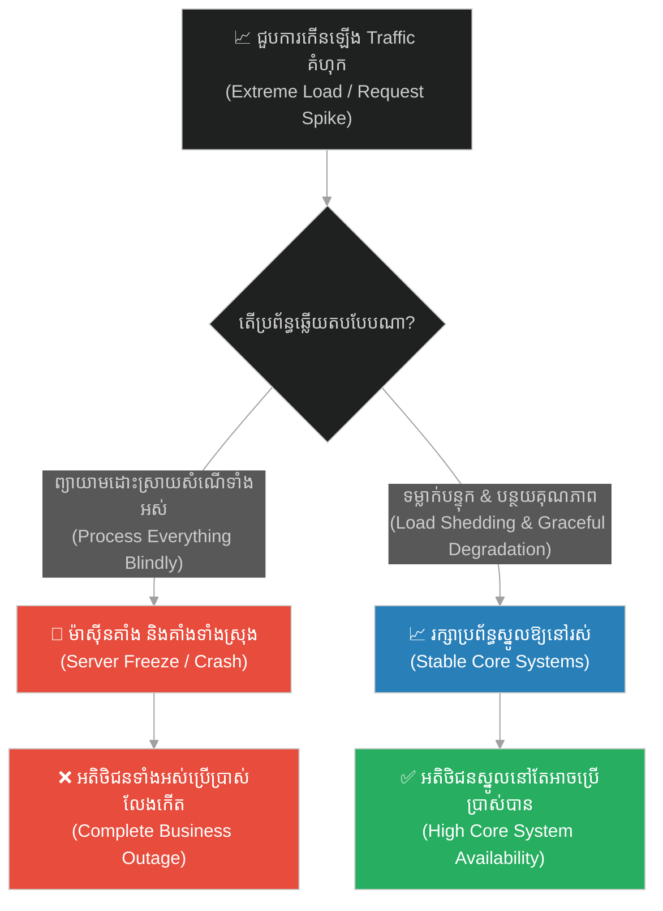
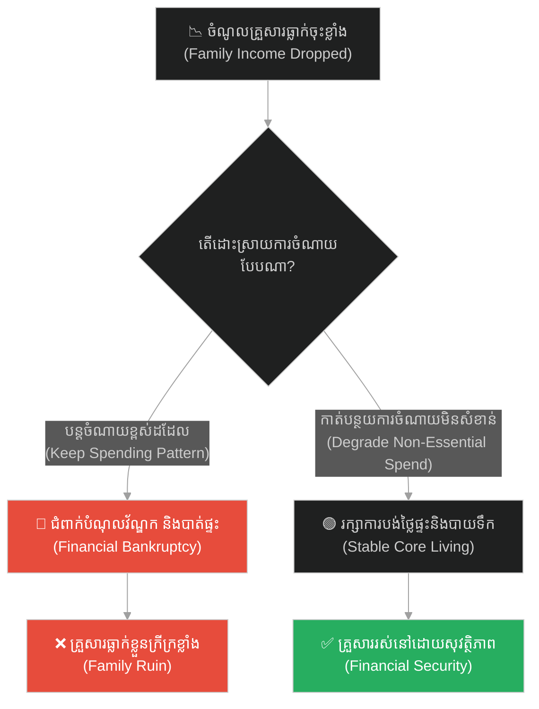
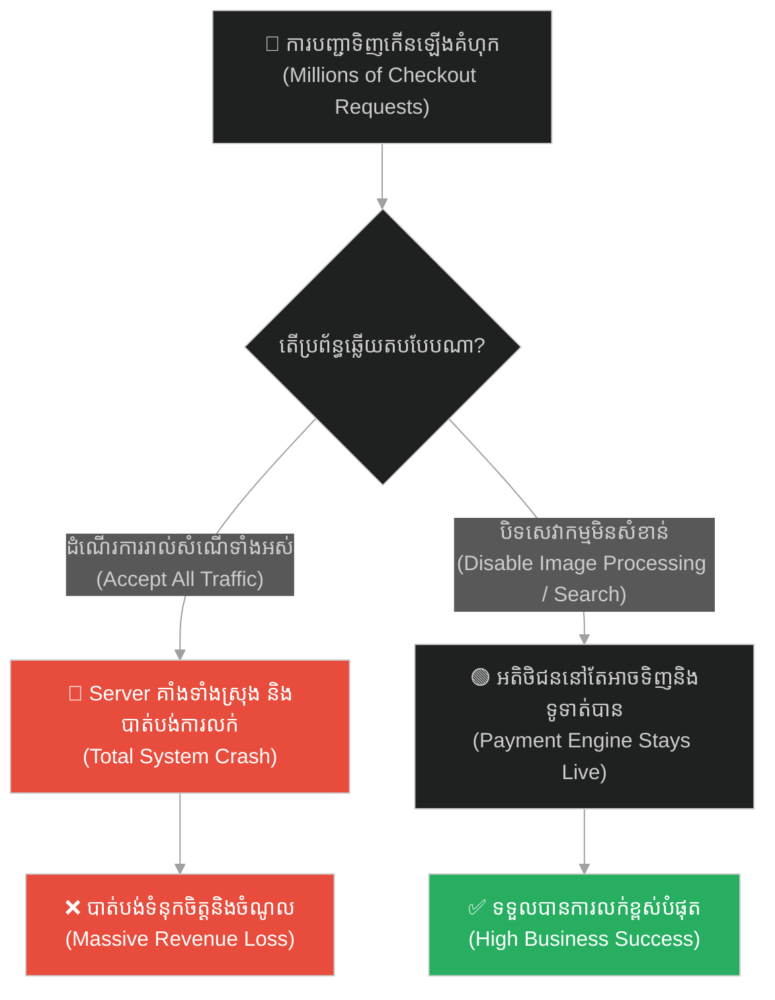
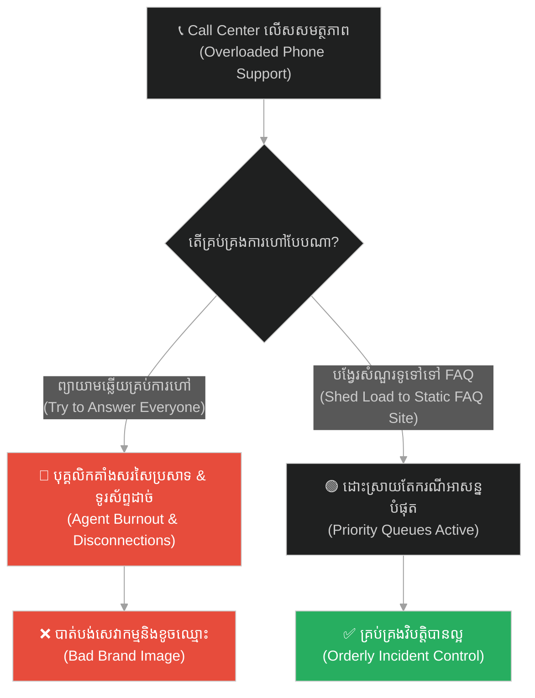
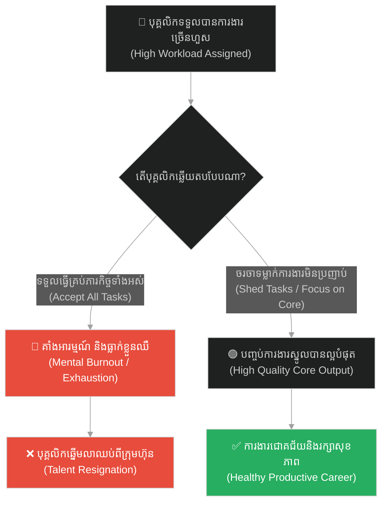
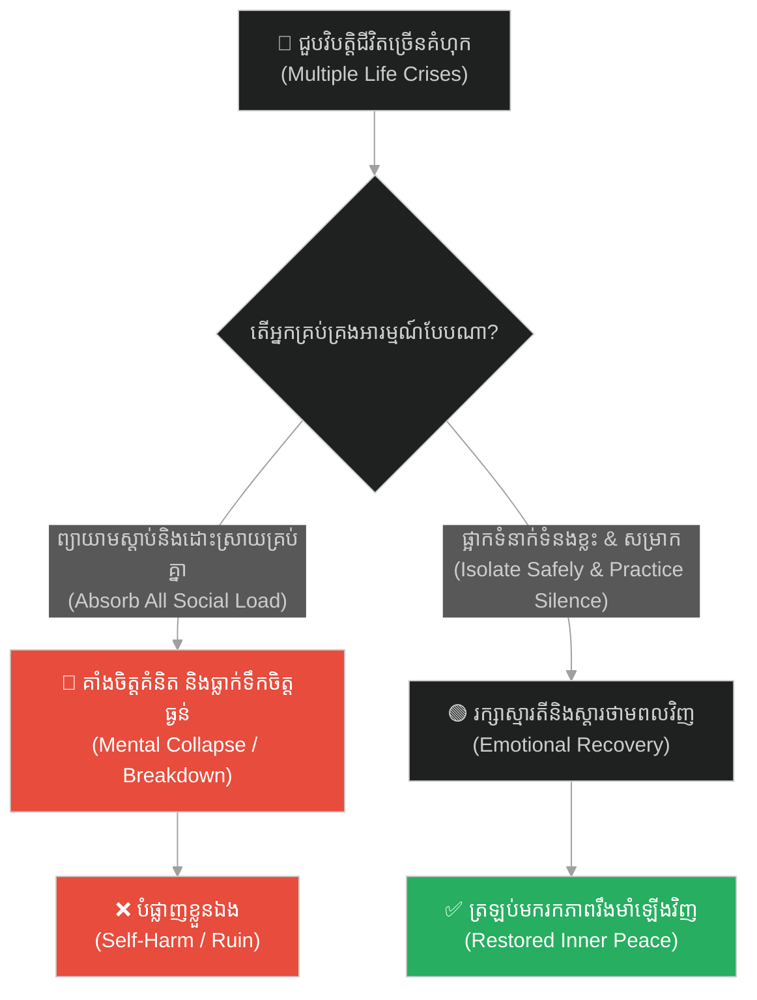
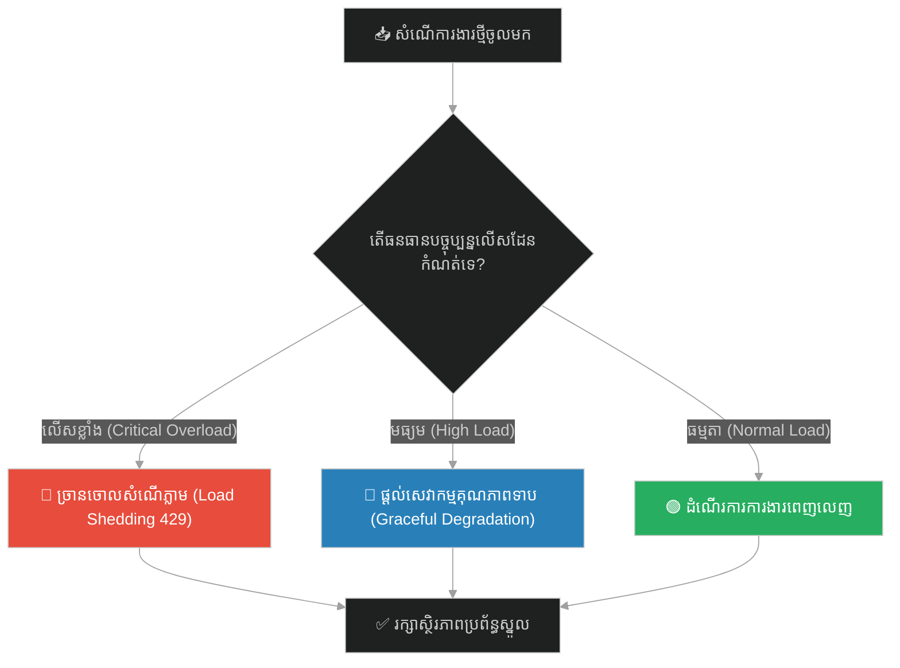

# Graceful Degradation & Load Shedding (ការទម្លាក់បន្ទុក និងការបន្ថយល្បឿនដោយសុវត្ថិភាព)៖ ដំរីចុះប្រេង (Graceful Degradation & Load Shedding & The Angry Elephant)

**Author:** ichamrong  
**Date:** 2026-05-28  
**Tags:** #load-shedding #graceful-degradation #rate-limiting #resilience #buddhism #nalagiri #traffic-spike  
**Category:** Concepts  
**Read Time:** ~15 min  

---

## 📌 មាតិកា (Table of Contents)
- [អន្ទាក់ផ្លូវចិត្ត (The Trap)](#0)
- [១. រឿងនិទាន៖ ដំរីចុះប្រេង នាលាគិរី (The Legend of the Rampaging Elephant Nalagiri)](#1)
  - [ថាមពលនៃមេត្តាធម៌ទប់ទល់នឹងកំហឹង (Loving-kindness Overcoming Fury)](#1-1)
- [២. បញ្ហា៖ ការកើនឡើងនៃ Traffic គំហុក និងការគាំងដោយសារផ្ទុកលើសទម្ងន់ (The Issue: Extreme Traffic Spikes & System Overload Crashes)](#2)
- [៣. ឧទាហរណ៍ជាក់ស្តែងក្នុងពិភពពិត (Real World Examples)](#3)
  - [ឧទាហរណ៍ទី ១ — កម្រិតស្រាល (គ្រួសារ)៖ វិបត្តិហិរញ្ញវត្ថុគ្រួសារ (The Family Budget Downgrade)](#3-1)
  - [ឧទាហរណ៍ទី ២ — កម្រិតមធ្យម (បច្ចេកទេស)៖ ការលក់ទំនិញថ្ងៃ Black Friday (The E-commerce Surge)](#3-2)
  - [ឧទាហរណ៍ទី ៣ — កម្រិតមធ្យម (ធុរកិច្ច)៖ ការប្រកាសប្រមូលទំនិញឡើងវិញ (The Recall Inflow)](#3-3)
  - [ឧទាហរណ៍ទី ៤ — កម្រិតមធ្យម (សង្គម/គ្រប់គ្រង)៖ ការប្រគល់ភារកិច្ចលើសកម្រិត (The Workplace Burnout Overload)](#3-4)
  - [ឧទាហរណ៍ទី ៥ — កម្រិតធ្ងន់ (ទំនាក់ទំនង)៖ ភាពតានតឹងផ្លូវចិត្តធ្ងន់ធ្ងរ (The Emotional Overwhelm)](#3-5)
- [៤. ដំណោះស្រាយទូទៅ៖ ការកំណត់ Rate Limiter, យន្តការ Load Shedding និងការរចនាទម្លាក់បន្ទុក (The General Solution: Rate Limiting Middlewares & Cheap Cached Fallbacks)](#4)
- [សេចក្តីសន្និដ្ឋាន (Conclusion)](#5)
- [ឯកសារយោង (References)](#6)
- [Related Posts](#7)

---

<a id="0"></a>
## អន្ទាក់ផ្លូវចិត្ត (The Trap)

តើអ្នកធ្លាប់ជួបស្ថានភាពដែលការងារ ឬសំណើចូលមកច្រើនគំហុកក្នុងពេលតែមួយ (Traffic Spike) រហូតធ្វើឱ្យអ្នក ឬប្រព័ន្ធទាំងមូលត្រូវគាំងបែក និងខូចខាតទាំងស្រុង ដោយសារតែព្យាយាមទទួលយកការងារទាំងអស់នោះដែរឬទេ? នេះហៅថា **The Blind Acceptance Trap (អន្ទាក់នៃការទទួលយកការងារដោយងងឹតងងុល)**។

* **💥 ម្ខាង (Side A)** — យើងព្យាយាមទទួលរាល់សំណើទាំងអស់ដោយគ្មានការត្រង ដែលធ្វើឱ្យធនធានខ្សោះជីវជាតិ និងគាំងប្រព័ន្ធទាំងស្រុង (Server Crash / Burnout)។
* **🛡️ ម្ខាងទៀត (Side B)** — យើងរក្សាភាពស្ងប់ស្ងាត់ ទម្លាក់ការងារមិនសំខាន់ចោល (Load Shedding) និងកាត់បន្ថយគុណភាពសេវាកម្មមួយចំនួន (Graceful Degradation) ដើម្បីការពារស្នូលប្រព័ន្ធ។

ផែនទីបង្ហាញផ្លូវសម្រាប់អត្ថបទនេះ៖
1. **រឿងនិទានដំរីនាលាគិរីចុះប្រេង** — ការប្រឈមមុខរបស់ព្រះពុទ្ធជាមួយដំរីកំណាចដែលត្រូវគេបញ្ចុះបញ្ចូលឱ្យស្រវឹង។
2. **បញ្ហាបច្ចេកវិទ្យា** — របៀបដែល Load Shedding (HTTP 429) និង Graceful Degradation ការពារ Servers ពីការគាំងនៅពេលមាន DDoS ឬ Traffic Spike។
3. **ឧទាហរណ៍ ៥ កម្រិត** — ការអនុវត្តការទម្លាក់បន្ទុកការងារដើម្បីរក្សាស្ថិរភាពជីវិត និងធុរកិច្ច។
4. **ដំណោះស្រាយជាក់ស្តែង** — គំរូការងារនៃការរៀបចំ Rate Limiting Middleware និងការប្រើប្រាស់ Static Cache។



---

<a id="1"></a>
## ១. រឿងនិទាន៖ ដំរីចុះប្រេង នាលាគិរី (The Legend of the Rampaging Elephant Nalagiri)

នៅក្នុងសម័យពុទ្ធកាល ព្រះទេវទត្តដែលជាបងប្អូនជីដូនមួយរបស់ព្រះសម្មាសម្ពុទ្ធ តែងតែមានចិត្តច្រណែនឈ្នានីស និងប៉ុនប៉ងធ្វើឃាតព្រះអង្គជាច្រើនលើកច្រើនសារ។ ថ្ងៃមួយ ទេវទត្តបានរៀបចំផែនការយ៉ាងសាហាវ ដោយបញ្ចុះបញ្ចូលហ្មដំរីឱ្យយកស្រាខ្លាំងទៅឱ្យដំរីសឹកដ៏កាចសាហាវបំផុតមួយឈ្មោះថា **«នាលាគិរី» (Nalagiri)** ផឹកឱ្យស្រវឹងជោកជាំ និងចុះប្រេង រួចលែងវាឱ្យរត់សំដៅទៅរកព្រះពុទ្ធ ក្នុងពេលដែលព្រះអង្គកំពុងនិមន្តបិណ្ឌបាតជាមួយព្រះអានន្ទនៅក្នុងទីក្រុងរាជគ្រឹះ។

ដំរីនាលាគិរីដែលកំពុងចុះប្រេង និងស្រវឹងស្រា បានរត់សំរុកយ៉ាងលឿន បន្លឺសំឡេងយ៉ាងកងរំពងកណ្តាលដងផ្លូវ ជាន់បំផ្លាញផ្ទះសម្បែង និងធ្វើឱ្យអ្នកក្រុងភ័យស្លន់ស្លោរត់គេចខ្លួនបាតជើងសព្រាត។ ព្រះអានន្ទឃើញគ្រោះថ្នាក់ដូច្នេះ ក៏ស្ទុះទៅឈរាំងពីមុខព្រះពុទ្ធដើម្បីការពារជីវិតព្រះសាស្តា តែព្រះពុទ្ធបានប្រាប់ឱ្យលោកថយចេញ។

<a id="1-1"></a>
### ថាមពលនៃមេត្តាធម៌ទប់ទល់នឹងកំហឹង (Loving-kindness Overcoming Fury)

នៅពេលដែលដំរីកំណាចនោះរត់សំដៅមកជិតដល់ ព្រះពុទ្ធទ្រង់មិនបានរត់គេច ឬប្រើអំណាចតបតដោយកំហឹងឡើយ។ ព្រះអង្គទ្រង់គង់ឈរស្ងៀមយ៉ាងស្ងប់ស្ងាត់ (Non-reactive presence) ហើយបញ្ចេញនូវ **«មេត្តាធម៌» (Loving-kindness / Metta)** យ៉ាងជ្រាលជ្រៅសំដៅទៅកាន់ដំរីកំណាចនោះ។

ថាមពលនៃក្តីមេត្តានិងភាពស្ងប់ស្ងាត់របស់ព្រះអង្គ មានឥទ្ធិពលត្រជាក់ខ្លាំង ជាងកំហឹងនិងភាពស្រវឹងរបស់ដំរីទៅទៀត។ គ្រាន់តែរត់មកដល់មុខព្រះពុទ្ធភ្លាម ដំរីនាលាគិរីក៏ស្រាប់តែបញ្ឈប់ល្បឿនបោលរបស់វា ទម្លាក់ប្រមោយចុះ រួចលុតជង្គង់ក្រាបនៅចំពោះមុខព្រះពុទ្ធយ៉ាងស្លូតបូតបំផុត។ ព្រះពុទ្ធបានលូកព្រះហស្តទៅអង្អែលក្បាលវាដោយក្តីអាណិតអាសូរ។

---

<a id="2"></a>
## ២. បញ្ហា៖ ការកើនឡើងនៃ Traffic គំហុក និងការគាំងដោយសារផ្ទុកលើសទម្ងន់ (The Issue: Extreme Traffic Spikes & System Overload Crashes)

នៅក្នុងវិស័យវិស្វកម្មសូហ្វវែរ ការកើនឡើងនៃ Request យ៉ាងគំហុក (ដូចជាការវាយប្រហារ DDoS ឬកំឡុងពេលលក់ទំនិញបញ្ចុះតម្លៃខ្នាតយក្ស) គឺដូចជាដំរីចុះប្រេងនាលាគិរីដែលរត់សំដៅមករក Server របស់យើង។ 

ប្រសិនបើយើងព្យាយាមដោះស្រាយរាល់ Request ទាំងអស់នោះ៖
* CPU និង Memory នឹងឡើងដល់ ១០០% ភ្លាមៗ។
* Database Connections នឹងត្រូវដាច់។
* Server ទាំងមូលនឹងត្រូវគាំង (Crash) ធ្វើឱ្យអតិថិជនទាំងអស់ប្រើប្រាស់លែងកើត។

ដំណោះស្រាយគឺការរចនាប្រព័ន្ធតាមរបៀប **Load Shedding** និង **Graceful Degradation**៖
1. **Load Shedding (ការទម្លាក់បន្ទុក):** ប្រសិនបើ Requests លើសពីកម្រិតសមត្ថភាពសុវត្ថិភាពរបស់ Server ត្រូវច្រានចោល (Drop) ភ្លាមៗដោយត្រឡប់មកវិញនូវ HTTP Code 429 (Too Many Requests) ដែលចំណាយធនធានតិចតួចបំផុត ដើម្បីការពារប្រព័ន្ធស្នូលកុំឱ្យគាំង។
2. **Graceful Degradation (ការបន្ថយគុណភាព):** បិទមុខងារដែលមិនសូវសំខាន់ (ដូចជាប្រព័ន្ធផ្តល់អនុសាសន៍ទំនិញ - Recommendation Engine ឬការបង្ហាញរូបភាពច្បាស់ៗ) ហើយត្រឡប់មកវិញនូវទិន្នន័យពី Cache ជំនួសវិញ ដើម្បីឱ្យអតិថិជននៅតែអាចចុចទិញទំនិញបាន (Primary transaction flow)។

ខាងក្រោមនេះជាកូដដែលគាំងដោយសារផ្ទុកលើសចំណុះ និងកូដដែលមានយន្តការការពារ Load Shedding ជាមួយ Graceful Degradation៖

```python
# ==============================================================================
# ❌ Anti-Pattern: Fragile Request Acceptance (Trampled by high load)
# ==============================================================================
import time

class FragileServer:
    def handle_request(self, request):
        # Blindly accepts all traffic and executes heavy database calls.
        # During a traffic spike (the angry elephant), CPU/Memory hits 100%,
        # thread pool gets exhausted, and the server freezes.
        return self._run_heavy_recommendation_algorithm(request)

    def _run_heavy_recommendation_algorithm(self, request):
        # Simulated high-cost database query
        time.sleep(1.0)
        return {"recommendations": ["personalized_item1", "personalized_item2"], "status": "OK"}


# ==============================================================================
#  Resilient Design: Load Shedding & Graceful Degradation (Taming the Elephant)
# ==============================================================================
class ResilientServer:
    def __init__(self, capacity_limit=100):
        self.current_active_requests = 0
        self.capacity_limit = capacity_limit
        # Cheap cached fallback that requires zero DB calls or heavy computation
        self.cached_fallback = {"recommendations": ["standard_item"], "status": "DEGRADED"}

    def handle_request_with_load_shedding(self, request) -> tuple:
        # Step 1: Load Shedding - Reject requests instantly if capacity is exceeded
        if self.current_active_requests >= self.capacity_limit:
            # Drop traffic with cheap response code 429
            return {"error": "Too Many Requests (Load Shedding Active)"}, 429

        self.current_active_requests += 1
        try:
            # Step 2: Graceful Degradation - Turn off expensive recommendations
            # if server load is approaching its limit (e.g. 80% capacity)
            if self.current_active_requests > (self.capacity_limit * 0.8):
                # Return cheap cached response without querying database
                return self.cached_fallback, 200
            
            # Normal high-cost personalized processing
            response = self._run_heavy_recommendation_algorithm(request)
            return response, 200
        finally:
            self.current_active_requests -= 1

    def _run_heavy_recommendation_algorithm(self, request):
        time.sleep(0.1) # Simulating database query execution
        return {"recommendations": ["personalized_1", "personalized_2"], "status": "OK"}
```

---

<a id="3"></a>
## ៣. ឧទាហរណ៍ជាក់ស្តែងក្នុងពិភពពិត

<a id="3-1"></a>
### ឧទាហរណ៍ទី ១ — កម្រិតស្រាល (គ្រួសារ)៖ វិបត្តិហិរញ្ញវត្ថុគ្រួសារ (The Family Budget Downgrade)

* **ស្ថានភាព៖** ឪពុកបាត់បង់ការងារ ធ្វើឱ្យចំណូលគ្រួសារធ្លាក់ចុះជាខ្លាំង។
* **បញ្ហា៖** គ្រួសារបន្តទម្លាប់ចំណាយច្រើន និងដើរលេងដូចដើម (Accepting all load) ធ្វើឱ្យជំពាក់បំណុលគេវ័ណ្ឌក។
* **ដំណោះស្រាយ៖** ធ្វើការកាត់បន្ថយគុណភាពចំណាយ (Graceful degradation)៖ ផ្អាកការដើរលេងក្រៅ ផ្អាកគណនី Netflix និងកាត់បន្ថយការញ៉ាំអាហារហាងថ្លៃៗ ដើម្បីរក្សាលុយបង់ថ្លៃផ្ទះ និងថ្លៃសិក្សាកូន (Core transactions)។



---

<a id="3-2"></a>
### ឧទាហរណ៍ទី ២ — កម្រិតមធ្យម (បច្ចេកទេស)៖ ការលក់ទំនិញថ្ងៃ Black Friday (The E-commerce Surge)

* **ស្ថានភាព៖** គេហទំព័រលក់ទំនិញអនឡាញជួបការបញ្ជាទិញរាប់លាន requests ក្នុងពេលតែមួយនាទី។
* **បញ្ហា៖** Server របស់ក្រុមហ៊ុនគាំង ធ្វើឱ្យអតិថិជនទាំងអស់មិនអាចមើលទំនិញ ឬទូទាត់ប្រាក់បានឡើយ។
* **ដំណោះស្រាយ៖** បិទការបង្ហាញវីដេអូទំនិញច្បាស់ៗ បិទមុខងាររាប់ចំនួន Views របស់ទំនិញ (Graceful degradation) ដើម្បីរក្សាប្រព័ន្ធទូទាត់ប្រាក់ (Payment engine) ឱ្យនៅដំណើរការ។



---

<a id="3-3"></a>
### ឧទាហរណ៍ទី ៣ — កម្រិតមធ្យម (ធុរកិច្ច)៖ ការប្រកាសប្រមូលទំនិញឡើងវិញ (The Recall Inflow)

* **ស្ថានភាព៖** ក្រុមហ៊ុនមួយប្រកាសប្រមូលទូរស័ព្ទមានបញ្ហាឡើងវិញ ធ្វើឱ្យអតិថិជនរាប់ម៉ឺននាក់ទូរស័ព្ទមកផ្នែកសេវាកម្ម (Call Center) ក្នុងពេលតែមួយថ្ងៃ។
* **បញ្ហា៖** ប្រព័ន្ធទូរស័ព្ទរបស់ក្រុមហ៊ុនគាំង ធ្វើឱ្យអតិថិជនកាន់តែខឹងសម្បារ។
* **ដំណោះស្រាយ៖** ផ្អាកការទទួលទូរស័ព្ទសម្រាប់សំណួរសាមញ្ញៗ (Load shedding) ហើយបង្វែរពួកគេទៅកាន់ទំព័រ FAQ អនឡាញ រួចរក្សាខ្សែទូរស័ព្ទសម្រាប់តែអតិថិជនដែលត្រូវការជំនួយសង្គ្រោះបន្ទាន់។



---

<a id="3-4"></a>
### ឧទាហរណ៍ទី ៤ — កម្រិតមធ្យម (សង្គម/គ្រប់គ្រង)៖ ការប្រគល់ភារកិច្ចលើសកម្រិត (The Workplace Burnout Overload)

* **ស្ថានភាព៖** បុគ្គលិកឆ្នើមម្នាក់ ត្រូវបានថ្នាក់ដឹកនាំដាក់ការងារឱ្យធ្វើជាច្រើនរាប់មិនអស់ក្នុងពេលតែមួយសប្តាហ៍។
* **បញ្ហា៖** គាត់ព្យាយាមធ្វើការងារទាំងអស់នោះដោយគ្មានថ្ងៃឈប់សម្រាក ធ្វើឱ្យគាត់ធ្លាក់ខ្លួនឈឺ និងសម្រេចចិត្តលាឈប់ភ្លាមៗ (Burnout crash)។
* **ដំណោះស្រាយ៖** ជួបពិភាក្សាជាមួយ Manager ដើម្បីបដិសេធការងារដែលមិនប្រញាប់ (Load shedding) និងធ្វើតែការងារស្នូលដែលជះឥទ្ធិពលខ្លាំងដល់ក្រុមហ៊ុន។



---

<a id="3-5"></a>
### ឧទាហរណ៍ទី ៥ — កម្រិតធ្ងន់ (ទំនាក់ទំនង)៖ ភាពតានតឹងផ្លូវចិត្តធ្ងន់ធ្ងរ (The Emotional Overwhelm)

* **ស្ថានភាព៖** មនុស្សម្នាក់ជួបវិបត្តិការងារ វិបត្តិហិរញ្ញវត្ថុ និងវិបត្តិគ្រួសារក្នុងពេលតែមួយ។
* **បញ្ហា៖** គាត់ព្យាយាមដោះស្រាយរាល់ជម្លោះ និងនិយាយជាមួយមនុស្សជុំវិញខ្លួន ធ្វើឱ្យគាត់ធ្លាក់ខ្លួនទៅជាជំងឺធ្លាក់ទឹកចិត្ត និងចង់សម្លាប់ខ្លួន។
* **ដំណោះស្រាយ៖** ផ្អាករាល់ទំនាក់ទំនងសង្គមដែលមិនចាំបាច់ (Load shedding) កាត់បន្ថយការងាររដ្ឋបាលមួយចំនួន ដើម្បីចំណាយពេលស្ងប់ស្ងាត់ជាមួយគ្រូពេទ្យ ឬសមាធិ (Graceful degradation) ដើម្បីស្តារផ្លូវចិត្តឡើងវិញ។



---

<a id="4"></a>
## ៤. ដំណោះស្រាយទូទៅ៖ ការកំណត់ Rate Limiter, យន្តការ Load Shedding និងការរចនាទម្លាក់បន្ទុក (The General Solution: Rate Limiting Middlewares & Cheap Cached Fallbacks)

ដើម្បីការពារខ្លួន និងប្រព័ន្ធពីការគាំងដោយសារការលើសទម្ងន់ការងារ ចូរអនុវត្តជំហានខាងក្រោម៖

1. **អនុវត្ត Rate Limiting (Set Up Rate Limits):** កំណត់ចំនួនការងារ ឬ Request អតិបរមាដែលអ្នកអាចទទួលយកបានក្នុងមួយនាទី។ បដិសេធរាល់អ្វីដែលហួសកម្រិតភ្លាមៗ។
2. **រៀបចំយន្តការទម្លាក់បន្ទុក (Implement Load Shedding):** នៅពេលរកឃើញថាសីតុណ្ហភាព ឬការប្រើប្រាស់ធនធាន (CPU/Mental) ឡើងហួស 80% ត្រូវផ្អាក ឬទម្លាក់រាល់កិច្ចការបន្ទាប់បន្សំចោល។
3. **អនុវត្ត Graceful Degradation (Plan for Fallbacks):** រៀបចំឱ្យមានផែនការបម្រុង (Cached data / Static replies) ដើម្បីធានាថាទោះបីជាប្រព័ន្ធដំណើរការខ្សោយ ក៏វាមិនគាំងទាំងស្រុងឡើយ។



---

## 🐇 ធ្លាក់ចូលក្នុងរន្ធទន្សាយ (Enter the Rabbit Hole)
ដើម្បីបន្តស្វែងយល់បន្ថែមអំពីប្រព័ន្ធ និងការកែលម្អគុណភាពការងារឱ្យបានស៊ីជម្រៅ ចូរចុចតំណភ្ជាប់ខាងក្រោម៖

* 🚀 **[ចាប់ផ្តើមដំណើររុករក (Start the Journey) ➔ The Serial Killer & Immutable Architecture (ស្ថាបត្យកម្មដែលមិនអាចកែប្រែបាន)៖ អង្គុលីមាល](./150-buddha-and-the-serial-killer.md)**

---

<a id="5"></a>
## សេចក្តីសន្និដ្ឋាន (Conclusion)

> **«កំហឹង និងការផ្ទុកការងារហួសប្រមាណ ប្រៀបដូចជាដំរីចុះប្រេងដ៏កំណាច។ កុំយកភ្លើងទៅការពន្លត់ភ្លើង ឬព្យាយាមប្រឡូកជាមួយវាដោយគ្មានរបាំងការពារ។ ចូររក្សាភាពស្ងប់ស្ងាត់ ទម្លាក់បន្ទុកមិនសំខាន់ចោល ដើម្បីសង្គ្រោះខ្លួន និងប្រព័ន្ធរបស់អ្នក។»**

ការដឹងពីដែនកំណត់របស់ខ្លួន និងការរៀបចំយន្តការការពារ (Load Shedding) មិនមែនជាការចុះចាញ់ឡើយ តែវាគឺជាយុទ្ធសាស្ត្រដ៏វៃឆ្លាតបំផុត ដើម្បីធានាថាអ្នកនៅតែអាចគ្រប់គ្រងស្ថានការណ៍ និងរក្សាសន្តិភាពផ្លូវចិត្តជានិច្ច។

---

<a id="6"></a>
## ឯកសារយោង (References)

* **Vinaya Pitaka** — *Cullavagga (Taming of Nalagiri)*. Canonical Buddhist text documenting Devadatta's plot and the taming of the elephant.
* **Nygard, M. T.** — *Release It!: Design and Deploy Production-Ready Software* (2nd Edition, 2018). Chapter on "Stability Patterns" focusing on Circuit Breakers and Load Shedding.
* **Porges, S. W.** — *The Polyvagal Theory: Neurophysiological Foundations of Emotions, Attachment, Communication, and Self-regulation* (2011). Coregulation principles.

---

<a id="7"></a>
## Related Posts

* **[Disaster Recovery & Post-Incident Learning (ការស្តារឡើងវិញ និងការរៀនសូត្រក្រោយបញ្ហា)៖ បដាចារា](./148-buddha-and-the-weeping-woman.md)** — Failover architectures and incident response.
* **[The Cracked Pot and the Five Whys (ក្អមដីប្រេះ និងអាថ៌កំបាំងសំនួរស្វែងរកឫសគល់ទាំង ៥)៖ របៀបដោះស្រាយបញ្ហាឱ្យចំឫសគល់ពិតប្រាកដ](./14-the-cracked-pot-and-the-five-whys.md)** — Root cause analysis and mitigation.
