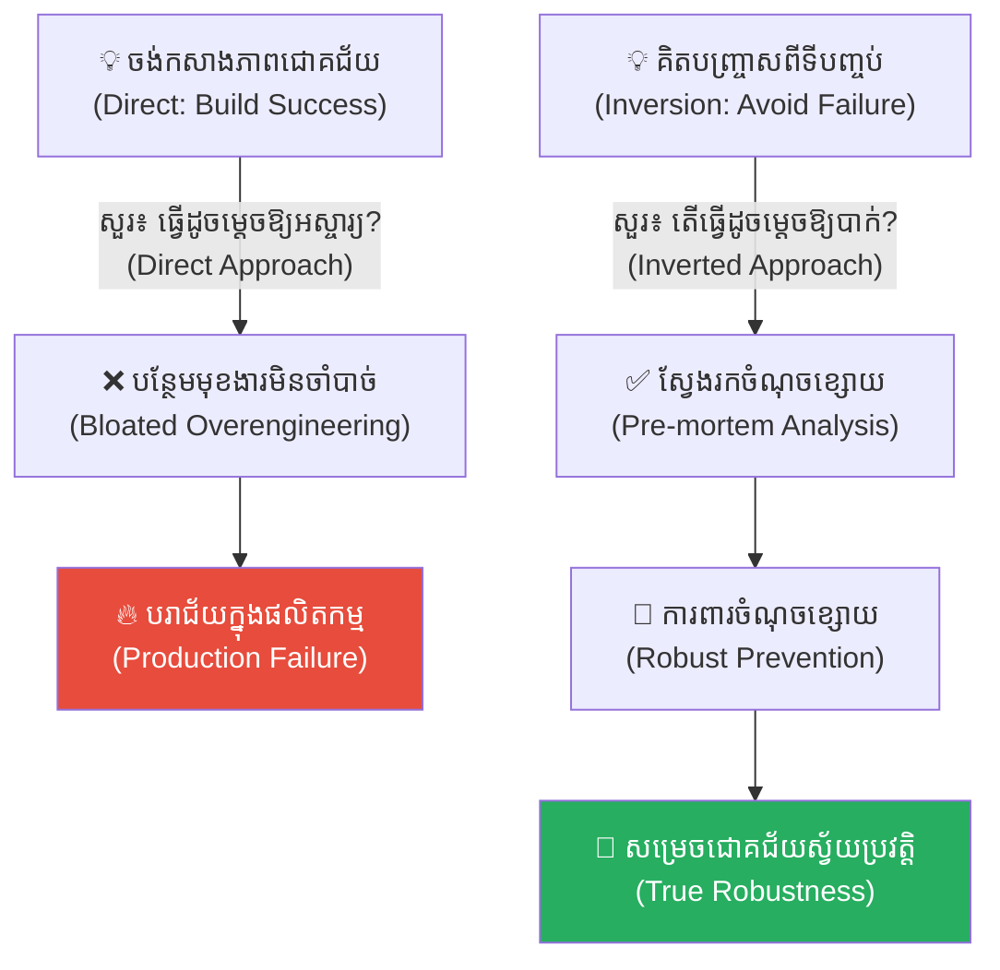
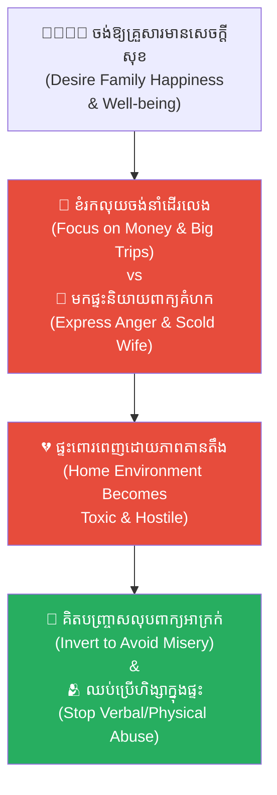
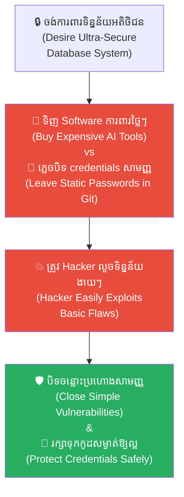
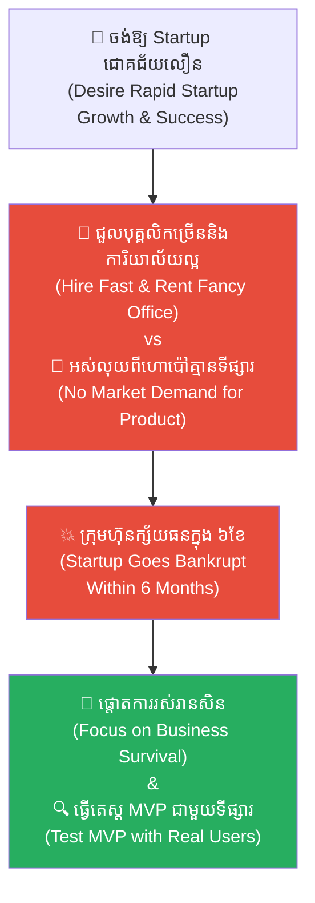
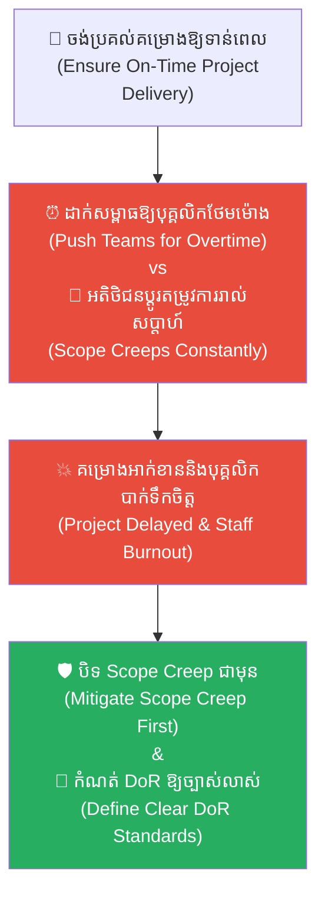
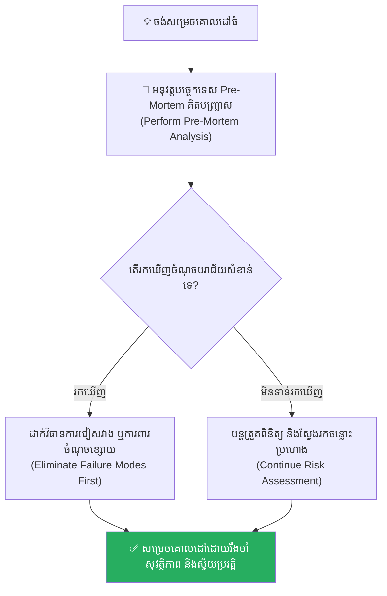

# The Broken Bridge and the Art of Inversion (ស្ពានបាក់ និងសិល្បៈនៃការគិតបញ្ច្រាស)៖ របៀបដោះស្រាយបញ្ហាស្មុគស្មាញដោយការចាប់ផ្តើមពីទីបញ្ចប់

**Author:** ichamrong  
**Date:** 2026-05-17  
**Tags:** #inversion-principle #mental-models #critical-thinking #problem-solving #life-lessons #chinese-history  
**Category:** Concepts  
**Read Time:** ~15 min  

---

## 📌 មាតិកា (Table of Contents)
- [អន្ទាក់ផ្លូវចិត្ត (The Trap)](#អន្ទាក់ផ្លូវចិត្ត-the-trap)
- [១. រឿងព្រេងស្ពានឈើ និងមេរៀនទឹកជំនន់ (The Fable of the Wooden Bridge)](#1)
  - [គំនូរស្ពានថ្មដ៏ស្កឹមស្កៃរបស់ ចាវ ឡី (Zhao Lei's Grand Stone Bridge)](#1-1)
  - [សំណួរចម្លែករបស់ មេជាង ឡូ ប៉ាន (Lu Ban's Strange Question)](#1-2)
  - [បញ្ជីឈ្មោះនៃមហន្តរាយ និងការសង្គ្រោះភូមិ (The List of Destruction & Salvation)](#1-3)
- [២. បញ្ហា៖ ការវិភាគទ្រឹស្តី៖ តើអ្វីទៅជា Inversion Principle? (The Issue: man muss immer umkehren)](#2)
- [៣. ឧទាហរណ៍ជាក់ស្តែងក្នុងពិភពពិត (Real World Examples)](#3)
  - [ឧទាហរណ៍ទី ១ — កម្រិតស្រាល (គ្រួសារ)៖ ការស្វែងរកសុភមង្គល និងស្ថិរភាពគ្រួសារ (The Happy Home Inversion)](#3-1)
  - [ឧទាហរណ៍ទី ២ — កម្រិតមធ្យម (បច្ចេកទេស)៖ ការកសាងសុវត្ថិភាពទិន្នន័យ (Preventing Database Leaks)](#3-2)
  - [ឧទាហរណ៍ទី ៣ — កម្រិតមធ្យម (ធុរកិច្ច)៖ ការការពារក្រុមហ៊ុន Startup ពីការក្ស័យធន (Startup Survivability)](#3-3)
  - [ឧទាហរណ៍ទី ៤ — កម្រិតមធ្យម (សង្គម/គ្រប់គ្រង)៖ ការគ្រប់គ្រងវឌ្ឍនភាពគម្រោង (Project Management Delay Prevention)](#3-4)
  - [ឧទាហរណ៍ទី ៥ — កម្រិតធ្ងន់ (ទំនាក់ទំនង)៖ ការបង្ការអាពាហ៍ពិពាហ៍បាក់បែក (The Anti-Divorce Strategy)](#3-5)
- [៤. ដំណោះស្រាយទូទៅ៖ បច្ចេកទេស Pre-Mortem និងការគិតបញ្ច្រាស (The General Solution: Inversion Action Plan)](#4)
- [សេចក្តីសន្និដ្ឋាន (Conclusion)](#conclusion)
- [ឯកសារយោង (References)](#references)
- [Related Posts](#related-posts)

---

## អន្ទាក់ផ្លូវចិត្ត (The Trap)

តើអ្នកធ្លាប់គិតពីវិធីធ្វើឱ្យគម្រោង ឬអាជីវកម្មរបស់អ្នកទទួលបានភាពជោគជ័យដ៏មហាសាល ប៉ុន្តែនៅពេលអនុវត្តជាក់ស្តែង គម្រោងនោះបែរជាជួបប្រទះហានិភ័យស្ងប់ស្ងាត់ជាច្រើន ដែលធ្វើឱ្យគ្រប់យ៉ាងត្រូវខូចខាតទាំងស្រុងដែរឬទេ?

នេះគឺជា **The Direct Thinking Trap (អន្ទាក់នៃការគិតទៅមុខតែម្ខាង)**។ 

នៅក្នុងការដោះស្រាយបញ្ហាស្មុគស្មាញ ជារឿយៗយើងតែងតែងងឹតភ្នែកដោយសារ «ក្តីស្រមៃនៃភាពជោគជ័យ»។ យើងបន្ថែមមុខងារល្អៗ បន្ថែមភាពស្កឹមស្កៃ (ដូចជាការសង់សសរស្ពានឱ្យក្រាស់ៗ) ដោយមើលរំលងហានិភ័យពិតប្រាកដដែលនៅចំពោះមុខ។ សិល្បៈនៃការការពារខ្លួនដ៏ល្អបំផុត មិនមែនជាការរត់តាមរកភាពល្អឥតខ្ចោះនោះទេ តែវាគឺជា **Inversion Principle (វិធានគិតបញ្ច្រាស)** ពោលគឺការស្វែងយល់ និងលុបបំបាត់រាល់ «ចំណុចបរាជ័យ» ទាំងអស់ជាមុនសិន នោះភាពជោគជ័យនឹងរត់មករកយើងដោយស្វ័យប្រវត្តិ។

ដើម្បីយល់ដឹងឱ្យបានគ្រប់ជ្រុងជ្រោយ នេះជាផែនទីបង្ហាញផ្លូវសម្រាប់អត្ថបទនេះ៖
1. **រឿងព្រេងប្រវត្តិសាស្ត្រ (The Historic Legend)** — រឿងរ៉ាវរបស់មេជាង Lu Ban ស្ថាបត្យករវ័យក្មេង Zhao Lei និងការសង់ស្ពានថ្មដែកកោងការពារទឹកជំនន់នៅ Lu State។
2. **បញ្ហា (The Issue)** — ការវិភាគទ្រឹស្តី «man muss immer umkehren» (ចូរគិតបញ្ច្រាសជានិច្ច) របស់គណិតវិទូ Jacobi និង Charlie Munger។
3. **ឧទាហរណ៍ជាក់ស្តែងក្នុងពិភពពិត (Real World Examples)** — ពិនិត្យមើលឥទ្ធិពលនេះក្នុងកម្រិតគ្រួសារ ការងារបច្ចេកទេស ធុរកិច្ច ការគ្រប់គ្រង និងទំនាក់ទំនងស្នេហា។
4. **ដំណោះស្រាយទូទៅ (The General Solution)** — ការអនុវត្តបច្ចេកទេស Pre-Mortem ដើម្បីលុបបំបាត់ហានិភ័យមុនពេលចាប់ផ្តើម។

---

## ១. រឿងព្រេងស្ពានឈើ និងមេរៀនទឹកជំនន់ (The Fable of the Wooden Bridge)

កាលពីសម័យបុរាណ នៅក្នុង **នគរ លូ (Lu State)** មានភូមិមួយឈ្មោះថា **«ភូមិក្បាលទឹក»** ដែលស្ថិតនៅសងខាងដងទន្លេដ៏ធំ និងកាចសាហាវមួយ។ ជារៀងរាល់ឆ្នាំ នៅរដូវវស្សា ទឹកជំនន់តែងតែបោកបក់មកយ៉ាងខ្លាំងក្លា បំផ្លាញស្ពានឈើដែលជាខ្សែជីវិតតែមួយគត់តភ្ជាប់អ្នកភូមិទាំងសងខាង។

ការបាក់ស្ពានម្តងៗ មិនត្រឹមតែធ្វើឱ្យទំនាក់ទំនងត្រូវបានកាត់ផ្តាច់ និងការធ្វើពាណិជ្ជកម្មត្រូវកកស្ទះប៉ុណ្ណោះទេ ប៉ុន្តែវាក៏បានឆក់យកជីវិតមនុស្សជាច្រើនផងដែរ។ ក្នុងចំណោមជនរងគ្រោះទាំងនោះ ក៏មានកូនប្រុសច្បងរបស់ **មេជាង ឡូ ប៉ាន (Master Lu Ban)** ដែលជាជាងឈើចាស់ដ៏ល្បីល្បាញម្នាក់ផងដែរ។ ចាប់តាំងពីថ្ងៃដែលកូនប្រុសរបស់គាត់ត្រូវទឹកជំនន់បោកយកទៅបាត់ ឡូ ប៉ាន លែងសូវនិយាយស្តី ហើយចំណាយពេលរាល់ថ្ងៃអង្គុយសម្លឹងមើលទន្លេដោយក្តីសោកសៅ និងស្វែងយល់ពីធម្មជាតិទឹក។

---

### គំនូរស្ពានថ្មដ៏ស្កឹមស្កៃរបស់ ចាវ ឡី (Zhao Lei's Grand Stone Bridge)

រហូតដល់ឆ្នាំមួយ មានស្ថាបត្យករវ័យក្មេងម្នាក់ឈ្មោះ **ចាវ ឡី (Zhao Lei)** បានត្រឡប់មកពីទីក្រុងធំវិញ។ គេជាមនុស្សមានមហិច្ឆតាខ្ពស់ ពោរពេញដោយថាមពល និងចង់បង្ហាញសមត្ថភាពឱ្យអ្នកភូមិបានឃើញ។ ចាវ ឡី បានប្រមូលអ្នកភូមិទាំងអស់មកប្រជុំគ្នា រួចលាតគំនូរប្លង់ស្ពានថ្មដ៏ធំស្កឹមស្កៃ ស្រស់ស្អាត និងមានសសរថ្មដ៏ក្រាស់ៗ។

ចាវ ឡី និយាយដោយមោទនភាពថា៖
> *«លើកនេះ យើងនឹងកសាងស្ពានថ្មដ៏ល្អឥតខ្ចោះបំផុត! ខ្ញុំបានគិតពីវិធីធ្វើឱ្យវាស្រស់ស្អាត វិធីធ្វើឱ្យសសរថ្មធំជាងមុន និងរបៀបរចនាបង្កាន់ដៃស្ពានឱ្យរឹងមាំ ដើម្បីធានាថាវាជាស្ពានដែលអស្ចារ្យបំផុត!»*

អ្នកភូមិទាំងអស់នាំគ្នាទះដៃអបអរសាទរ និងត្រៀមប្រគល់មាសប្រាក់ទាំងអស់ដែលពួកគេសន្សំបាន ដើម្បីទិញថ្មយកមកសាងសង់ស្ពានតាមប្លង់របស់ ចាវ ឡី។

---

### សំណួរចម្លែករបស់ មេជាង ឡូ ប៉ាន (Lu Ban's Strange Question)

ស្រាប់តែនៅក្នុងជ្រុងម្ខាងនៃសាលប្រជុំ មេជាង **ឡូ ប៉ាន** ដែលធ្លាប់តែស្ងៀមស្ងាត់ បានក្រោកឈរឡើង រួចសួរទៅកាន់ ចាវ ឡី នូវសំណួរដ៏ចម្លែកមួយ៖

> **«ចាវ ឡី! ជំនួសឱ្យការសួរថា 'ធ្វើដូចម្តេចដើម្បីឱ្យស្ពាននេះរឹងមាំ និងល្អឥតខ្ចោះ' តើយើងអាចសួរផ្ទុយមកវិញបានទេ៖ 'តើមានវិធីអ្វីខ្លះ ដែលអាចធ្វើឱ្យស្ពានថ្មដ៏ធំមួយនេះ បាក់រលំបានយ៉ាងងាយស្រួលបំផុត?'»**

ចាវ ឡី ងាកមកសើច រួចឆ្លើយទាំងក្រអើតក្រទម៖
> *«លោកតា ឡូ ប៉ាន! លោកតាពិតជាចាស់វង្វេងមែន។ យើងចង់សង់ស្ពានឱ្យរឹងមាំ តើទៅគិតពីវិធីបំផ្លាញវាធ្វើអ្វី? ការគិតរឿងអវិជ្ជមានបែបនេះ មិនអាចធ្វើឱ្យយើងសង់ស្ពានបានល្អឡើយ!»*

ប៉ុន្តែ ឡូ ប៉ាន មិនខឹងឡើយ គាត់និយាយដោយទឹកមុខស្ងប់ស្ងាត់៖
> *«បើឯងចង់ដើរទៅមុខដោយសុវត្ថិភាព ឯងត្រូវតែស្គាល់រាល់ជើងក្អែក និងរណ្តៅដីដែលនៅពីមុខជាមុនសិន។ បើឯងគិតតែពីវិធីធ្វើឱ្យវាល្អ ឯងនឹងត្រូវងងឹតភ្នែកដោយសារក្តីស្រមៃនៃភាពជោគជ័យ រហូតមើលរំលងឃាតករស្ងៀមស្ងាត់ដែលបំផ្លាញស្ពានពិតប្រាកដ។»*

ដោយក្តីគោរពដល់ជាងចាស់ មេភូមិក៏សម្រេចចិត្តអនុញ្ញាតឱ្យ ឡូ ប៉ាន ដឹកនាំការពិភាក្សាតាមបែប **«គិតបញ្ច្រាស»** នេះមួយដង។

---

### បញ្ជីឈ្មោះនៃមហន្តរាយ និងការសង្គ្រោះភូមិ (The List of Destruction & Salvation)

ឡូ ប៉ាន បានដើរទៅកាន់ក្តារខៀន រួចសរសេរប្រយោគដ៏ធំមួយ៖ **«វិធីធានាថាស្ពានថ្មថ្មីនេះនឹងត្រូវបាក់រលំ ១០០%»**។ គាត់បានសួរអ្នកភូមិឱ្យចូលរួមគិត៖

1. **វិធីទី១ (ការស្ទះសំរាម):** *«យើងត្រូវធ្វើឱ្យគល់ឈើធំៗ និងកម្ទេចព្រៃដែលហូរតាមទឹក មកទើរជាប់នៅចន្លោះសសរស្ពាន បង្កើតជាទំនប់ទឹកបណ្តោះអាសន្ន។ កម្លាំងទឹកបុកកាន់តែខ្លាំង ស្ពាននឹងត្រូវបាក់!»*
2. **វិធីទី២ (ដីល្បាប់រអិល):** *«យើងត្រូវសង់ជើងសសរស្ពាននៅលើដីឥដ្ឋក្បែរមាត់ទន្លេ ព្រោះពេលដីត្រូវទឹកជោគខ្លាំង វានឹងក្លាយជាល្បាប់ភក់ ធ្វើឱ្យសសរស្ពានរអិលខូចទ្រង់ទ្រាយភ្លាម!»*
3. **វិធីទី៣ (ទម្ងន់ហួសប្រមាណ):** *«យើងត្រូវដេញហ្វូងសត្វពាហនៈ និងរទេះដឹកឥវ៉ាន់ទាំងអស់របស់ភូមិ ឱ្យឆ្លងកាត់ស្ពានក្នុងពេលតែមួយ នៅពេលដែលមានការជម្លៀសខ្លួនពីទឹកជំនន់!»*
4. **វិធីទី៤ (ទឹកច្រោះដីជើងសសរ):** *«យើងត្រូវធ្វើឱ្យទឹកទន្លេបោករូងខាងក្រោមជើងសសរស្ពាន (Scouring Effect) រហូតដល់សសរគ្មានលំនឹង និងស្រុតចុះក្រោម!»*

នៅពេលដែលបញ្ជីឈ្មោះនៃការបំផ្លិចបំផ្លាញត្រូវបានសរសេររួច ពួកគេសម្លឹងមើលប្លង់ស្ពានរបស់ ចាវ ឡី រួចដឹងថា៖ **សសរថ្មដ៏ក្រាស់ៗ** ដែលចាវ ឡី រចនាមកដើម្បីឱ្យមើលទៅរឹងមាំ ជាក់ស្តែងវានឹងក្លាយជារបាំងរារាំងកម្ទេចឈើអណ្តែតទឹក បង្កើតជាកម្លាំងបុកទឹកដ៏មហិមាដែលបំផ្លាញស្ពាន (**វិធីទី១** )។ គ្រឹះស្ពានក៏ស្ថិតនៅលើដីឥដ្ឋមាត់ទន្លេដែរ (**វិធីទី២** )។

ឡូ ប៉ាន និងចាវ ឡី សហការគ្នា **កែប្រែប្លង់ស្ពាន ដើម្បីចៀសវាងរាល់ចំណុចបំផ្លាញទាំងអស់** នៅក្នុងបញ្ជី៖
* **ដោះស្រាយវិធីទី១៖** ពួកគេលុបបំបាត់សសរស្ពាននៅចំកណ្តាលទន្លេទាំងស្រុង ដោយប្តូរមកសង់ជា **«ស្ពានដែកកោង/ស្ពានយោង (Arch Bridge)»** ដែលមានកម្ពស់ខ្ពស់ផុតពីកម្រិតទឹកជំនន់អតិបរមា ដើម្បីកុំឱ្យមានអ្វីមកទើរស្ទះទឹក។
* **ដោះស្រាយវិធីទី២៖** គ្រឹះបង្គោលយោងទាំងសងខាង ត្រូវសង់ថយក្រោយចម្ងាយ ៥០ ម៉ែត្រពីមាត់ច្រាំង ដោយជីកទម្លុះដីល្បាប់ ទៅបោះគ្រឹះនៅលើដីថ្មរឹងមាំ (Bedrock)។
* **ដោះស្រាយវិធីទី៣៖** ពួកគេបង្កើតរបាំងទ្វារកំណត់ទម្ងន់នៅសងខាងស្ពាន ដើម្បីអនុញ្ញាតឱ្យរទេះ ឬសត្វពាហនៈឆ្លងកាត់ម្តងមួយៗក្នុងចំនួនកំណត់។

នៅរដូវវស្សាឆ្នាំនោះ ទឹកជំនន់ដ៏កាចសាហាវបំផុតបានមកដល់។ ទ្រព្យសម្បត្តិ និងផ្ទះសម្បែងជាច្រើនត្រូវបានទឹកហូរនាំទៅ ប៉ុន្តែ **ស្ពានថ្មី** នៅតែឈររឹងមាំយ៉ាងអង់អាចនៅពីលើផ្ទៃទឹកដ៏កាចសាហាវ។

---

## ២. បញ្ហា៖ ការវិភាគទ្រឹស្តី៖ តើអ្វីទៅជា Inversion Principle? (The Issue: man muss immer umkehren)

បច្ចេកទេសដែល មេជាង ឡូ ប៉ាន យកមកដោះស្រាយបញ្ហាខាងលើ គឺទ្រឹស្តីគិតបញ្ច្រាស ឬ **Inversion Principle (សិល្បៈនៃការគិតបញ្ច្រាស)**។

អ្នកវិទ្យាសាស្ត្រគណិតវិទ្យាជនជាតិអាល្លឺម៉ង់ដ៏ល្បីល្បាញលោក **Carl Gustav Jacob Jacobi** ធ្លាប់បាននិយាយឃ្លាដ៏ល្បីល្បាញមួយថា៖ **«man muss immer umkehren» (ចូរគិតបញ្ច្រាសជានិច្ច)**។ លោក Jacobi យល់ថា ជំនួសឱ្យការខំប្រឹងរកវិធីស្រាយសមីការដោយផ្ទាល់ គឺការគិតបញ្ច្រាសពីលទ្ធផលមកវិញ តែងតែនាំឱ្យមានភាពងាយស្រួល និងរកឃើញលទ្ធផលលឿនជាងមុន។

គំនិតនេះត្រូវបានអនុវត្តយ៉ាងស៊ីជម្រៅដោយកំពូលវិនិយោគិន **Charlie Munger** (ដៃគូរបស់ Warren Buffett)។ គាត់តែងតែពោលថា៖ *«ខ្ញុំចង់ដឹងតែរឿងមួយគត់ គឺកន្លែងដែលខ្ញុំនឹងត្រូវស្លាប់ ដើម្បីខ្ញុំកុំទៅទីនោះឱ្យសោះ។»*

---

## ៣. ឧទាហរណ៍ជាក់ស្តែងក្នុងពិភពពិត

ដើម្បីយល់ដឹងឱ្យកាន់តែស៊ីជម្រៅ ផ្លូវការសិក្សានឹងនាំអ្នកទៅពិនិត្យមើល **ឧទាហរណ៍ចំនួន ៥ កម្រិតខុសៗគ្នា** ក្នុងជីវិតរស់នៅប្រចាំថ្ងៃ៖

---

### ឧទាហរណ៍ទី ១ — កម្រិតស្រាល (គ្រួសារ)៖ ការស្វែងរកសុភមង្គល និងស្ថិរភាពគ្រួសារ (The Happy Home Inversion)

**ស្ថានភាព៖** ឪពុកម្នាក់ចង់ឱ្យគ្រួសាររបស់ខ្លួនមានសេចក្តីសុខ និងរីករាយបំផុត។

* **ជម្រើសផ្ទាល់៖** គាត់ប្រឹងរកលុយបន្ថែម និងរៀបចំដំណើរកម្សាន្តធំៗ (Direct goal)។ ប៉ុន្តែគាត់តែងតែត្រឡប់មកផ្ទះវិញដោយកំហឹង និងស្តីបន្ទោសប្រពន្ធកូនរាល់ដង។
* **ជម្រើសគិតបញ្ច្រាស៖** សួរថា៖ *«តើទង្វើអ្វីខ្លះដែលបំផ្លាញក្តីសុខគ្រួសាររបស់ខ្ញុំលឿនបំផុត?»*។ ឆ្លើយ៖ *ការនិយាយពាក្យមើលងាយដៃគូ ការប្រើប្រាស់ហិង្សា និងការលេងល្បែង។* គាត់គ្រាន់តែលុបបំបាត់ការនិយាយមើលងាយ និងកាត់បន្ថយកំហឹងចោល គ្រួសារក៏មានក្តីសុខស្វ័យប្រវត្តិ។

**ការពិតដ៏ជូរចត់៖**
ការចៀសវាងការខូចខាត (Avoid misery) មានតម្លៃជាងការដេញតាមក្តីសុខសិប្បនិម្មិត។

---

### ឧទាហរណ៍ទី ២ — កម្រិតមធ្យម (បច្ចេកទេស)៖ ការកសាងសុវត្ថិភាពទិន្នន័យ (Preventing Database Leaks)

**ស្ថានភាព៖** Lead Developer ចង់កសាងប្រព័ន្ធការពារទិន្នន័យអតិថិជន (Database Security) ឱ្យល្អឥតខ្ចោះ។

* **ជម្រើសផ្ទាល់៖** ទិញ Software ការពារថ្លៃៗ និងបំពាក់ AI Security Monitoring ស្មុគស្មាញ (Bloated stack)។
* **ជម្រើសគិតបញ្ច្រាស៖** សួរថា៖ *«តើ Hacker អាចលួចទិន្នន័យរបស់យើងបានលឿន និងងាយបំផុតតាមវិធីណា?»*។ ឆ្លើយ៖ *តាមរយៈការសរសេរ password ក្នុង github static repository, ការខ្វះ API rate limiting, ឬការប្រើប្រាស់ credentials ធម្មតា (admin/admin)*។ ពួកគេផ្តោតលើការលុបបំបាត់ហានិភ័យសាមញ្ញទាំងនេះជាមុន។

**ការពិតដ៏ជូរចត់៖**
កូដដែលសុវត្ថិភាពបំផុត គឺកូដដែលបានបិទចន្លោះប្រហោងសាមញ្ញៗទាំងអស់ មិនមែនកូដដែលប្រើប្រាស់ប្រព័ន្ធស្មុគស្មាញឡើយ។

---

### ឧទាហរណ៍ទី ៣ — កម្រិតមធ្យម (ធុរកិច្ច)៖ ការការពារក្រុមហ៊ុន Startup ពីការក្ស័យធន (Startup Survivability)

**ស្ថានភាព៖** Founder ចង់ឱ្យក្រុមហ៊ុន Startup របស់ខ្លួនរីកចម្រើន និងទទួលបានជោគជ័យលឿនបំផុត។

* **ជម្រើសផ្ទាល់៖** បង្កើនការជួលបុគ្គលិករាប់សិបនាក់ និងជួលការិយាល័យដ៏ប្រណីតដើម្បីបង្ហាញភាពអស្ចារ្យ (Direct growth trap)។
* **ជម្រើសគិតបញ្ច្រាស៖** សួរថា៖ *«តើមានកត្តាអ្វីខ្លះដែលធ្វើឱ្យ Startup របស់យើងក្ស័យធនក្នុងរយៈពេល ៦ ខែដំបូង?»*។ ឆ្លើយ៖ *ការអស់លុយហោប៉ៅ (Running out of cash), ការបង្កើតផលិតផលដែលគ្មានទីផ្សារត្រូវការ (No market need), ឬជម្លោះរវាង Co-founders*។ គាត់ផ្តោតលើការសន្សំសំចៃថវិកា និងធ្វើ MVP តេស្តទីផ្សារភ្លាមៗ។

**ការពិតដ៏ជូរចត់៖**
ការរស់រានមានជីវិត (Survival) គឺជាលក្ខខណ្ឌដំបូងបង្អស់ដើម្បីឈានទៅរកភាពជោគជ័យ។

---

### ឧទាហរណ៍ទី ៤ — កម្រិតមធ្យម (សង្គម/គ្រប់គ្រង)៖ ការគ្រប់គ្រងវឌ្ឍនភាពគម្រោង (Project Management Delay Prevention)

**ស្ថានភាព៖** Project Manager ចង់ឱ្យគម្រោងប្រគល់ការងារបានទាន់ពេលវេលា (On-Time Delivery)។

* **ជម្រើសផ្ទាល់៖** បង្កើតកាលវិភាគការងារលម្អិត និងដាក់សម្ពាធឱ្យបុគ្គលិកធ្វើការថែមម៉ោង (Overtime strategy)។
* **ជម្រើសគិតបញ្ច្រាស៖** សួរថា៖ *«តើមានអ្វីខ្លះដែលអាចធ្វើឱ្យគម្រោងនេះត្រូវអាក់ខាន និងពន្យារពេល ១០០%?»*។ ឆ្លើយ៖ *ការផ្លាស់ប្តូរតម្រូវការពីអតិថិជនរាល់សប្តាហ៍ (Scope Creep), ការខ្វះការដឹង DoR, ឬការបាក់ទឹកចិត្តរបស់បុគ្គលិក*។ គាត់រៀបចំកិច្ចសន្យាច្បាស់លាស់ដើម្បីบិទ Scope Creep ជាមុន។

**ការពិតដ៏ជូរចត់៖**
ការគ្រប់គ្រងហានិភ័យមុនពេលវាកើតឡើង មានតម្លៃជាងការដេញតាមជួសជុលបញ្ហាដែលកំពុងឆាបឆេះ។

---

### ឧទាហរណ៍ទី ៥ — កម្រិតធ្ងន់ (ទំនាក់ទំនង)៖ ការបង្ការអាពាហ៍ពិពាហ៍បាក់បែក (The Anti-Divorce Strategy)

**ស្ថានភាព៖** គូស្នេហ៍ចង់រក្សាអាពាហ៍ពិពាហ៍ឱ្យបានរឹងមាំ និងមានសេចក្តីសុខមួយជីវិត។

* **ជម្រើសផ្ទាល់៖** ព្យាយាមស្វែងរកក្តីស្រឡាញ់ដ៏ល្អឥតខ្ចោះ Surprises ធំៗ និងការរំពឹងទុកឥតខ្ចោះពីដៃគូ។
* **ជម្រើសគិតបញ្ច្រាស៖** សួរថា៖ *«តើទម្លាប់ពុលអ្វីខ្លះដែលធ្វើឱ្យគូស្នេហ៍លែងលះគ្នា និងស្អប់គ្នាខ្លាំងបំផុត?»*។ ឆ្លើយ៖ *ការមើលងាយសេចក្តីថ្លៃថ្នូរ, ភាពស្ងៀមស្ងាត់លាក់កំហឹង (Silent treatment), និងកង្វះការជឿទុកចិត្ត*។ ពួកគេផ្តោតលើការលុបបំបាត់ទម្លាប់ទាំងនេះចោល។

**ការពិតដ៏ជូរចត់៖**
អាពាហ៍ពិពាហ៍ដែលរឹងមាំ មិនមែនកើតឡើងពីការមិនដែលឈ្លោះគ្នានោះទេ តែវាសង់ឡើងពីការចៀសវាងទង្វើបំផ្លាញតម្លៃសីលធម៌គ្នាទៅវិញទៅមក។

---

## ៤. ដំណោះស្រាយទូទៅ៖ បច្ទេកទេស Pre-Mortem និងការគិតបញ្ច្រាស (The General Solution: Inversion Action Plan)

ដើម្បីអនុវត្តវិធាន Inversion Principle ក្នុងការងារ និងជីវិតរបស់អ្នក ចូរអនុវត្តជំហានខាងក្រោម៖

### ១. អនុវត្តវិធាន «គិតបញ្ច្រាសជានិច្ច» (Invert, Always Invert)
នៅពេលចង់សម្រេចគោលដៅអ្វីមួយ ត្រូវបង្វែរសំណួរ៖ *«តើធ្វើយ៉ាងណាឱ្យបរាជ័យខ្លាំងបំផុត?»*។ សរសេររាល់ចម្លើយទាំងអស់នៅលើក្រដាស។

### ២. បង្កើតកិច្ចប្រជុំ Pre-Mortem
មុនពេលចាប់ផ្តើមគម្រោងការងារធំ ត្រូវកោះហៅក្រុមការងារទាំងអស់មកប្រជុំគ្នា រួចសន្មតថា៖ *«ឥឡូវនេះគឺ ១ ឆ្នាំនៅថ្ងៃអនាគត ហើយគម្រោងរបស់យើងបានបរាជ័យទាំងស្រុង។ ចូរគ្រប់គ្នាសរសេរពីមូលហេតុដែលធ្វើឱ្យវាបរាជ័យ។»*។ វិធីនេះជួយឱ្យយើងមើលឃើញហានិភ័យលាក់បាំងទាំងអស់។

### ៣. លុបបំបាត់ «ចំណុចខ្សោយ» (Eliminate Failure Modes)
យកបញ្ជីឈ្មោះនៃមហន្តរាយដែលរកឃើញ មកដាក់ចេញនូវវិធានការការពារ និងជៀសវាងវាជាដាច់ខាត។

---

## សេចក្តីសន្និដ្ឋាន (Conclusion)

> **«ស្ពានថ្មដែកកោងរបស់មេជាង Lu Ban ឈររឹងមាំកណ្តាលទឹកជំនន់ មិនមែនមកពីគាត់ព្យាយាមសង់សសរស្ពានឱ្យស្កឹមស្កៃនោះឡើយ។ ប៉ុន្តែវាសង់ឡើងពីការចេះរក្សាគម្លាត និងលុបបំបាត់រាល់ឧបសគ្គដែលធ្វើឱ្យវាបាក់រលំ។»**

ចាវ ឡី ចង់បង្ហាញភាពអស្ចារ្យ តែស្ទើរតែដុតបំផ្លាញភូមិទាំងមូល។ ឡូ ប៉ាន គិតបញ្ច្រាស អាចសង្គ្រោះជីវិតមនុស្សគ្រប់គ្នា។

ចូរគិតបញ្ច្រាសជានិច្ច ដើម្បីការពារអនាគតរបស់អ្នក។

---

## ឯកសារយោង (References)

* **Jacobi, C. G. J.** — *Fundamenta Nova Theoriae Functionum Ellipticarum* (1829). គណិតវិទ្យាបញ្ច្រាសសមីការ។
* **Munger, C.** — *Poor Charlie's Almanack* (2005). ទស្សនវិជ្ជានៃការគិតបញ្ច្រាសក្នុងការវិនិយោគ និងជីវិត។
* **Klein, G.** — *Performing a Project Premortem* (2007). Harvard Business Review. បច្ចេកទេសវិភាគហានិភ័យមុនគម្រោង។

---

## Related Posts

* **[The Cracked Pot and the Five Whys (ក្អមដីប្រេះ និងអាថ៌កំបាំងសំនួរស្វែងរកឫសគល់ទាំង ៥)៖ របៀបដោះស្រាយបញ្ហាឱ្យចំឫសគល់ពិតប្រាកដ](./14-the-cracked-pot-and-the-five-whys.md)** — Finding root causes.
* **[The Weaver and the Emperor's Robe (អ្នកត្បាញក្រណាត់ និងអាវធំព្រះរាជា)៖ គ្រោះថ្នាក់នៃការកាត់បន្ថយចំណាយលើផ្នែកសំខាន់ និងមហន្តរាយនៃការមើលរំលងតួនាទីតូចតាច](./16-the-weaver-and-the-emperors-robe.md)** — Quality issues and system safety under budget pressure.
* **[The wooden tent and the palace of stone (តង់ឈើ និងប្រាសាទថ្ម)៖ គ្រោះថ្នាក់នៃការសាងសង់ប្រព័ន្ធប្រញាប់ប្រញាល់ និងមេរៀននៃការកសាងគ្រឹះរឹងមាំ](./19-the-wooden-tent-and-the-palace-of-stone.md)** — Core structural layouts.
