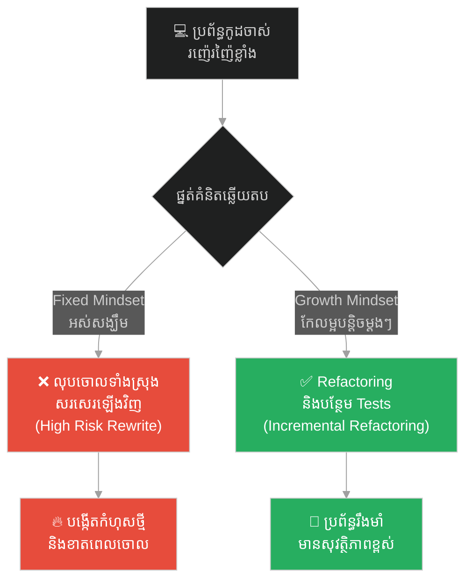
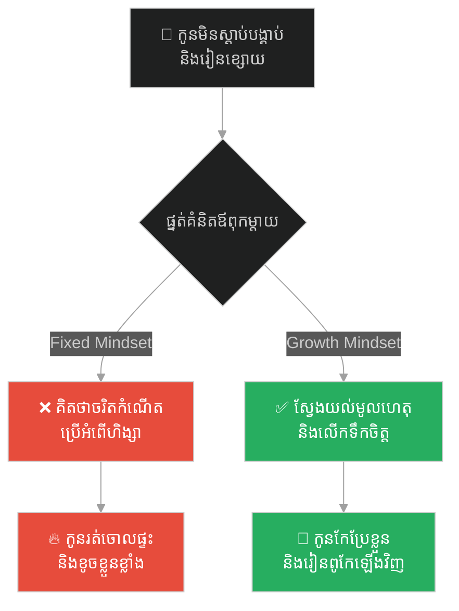
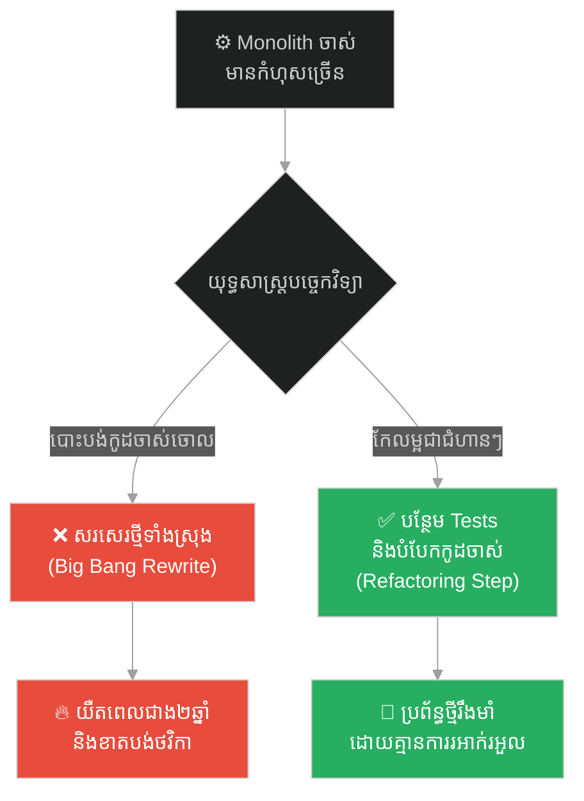
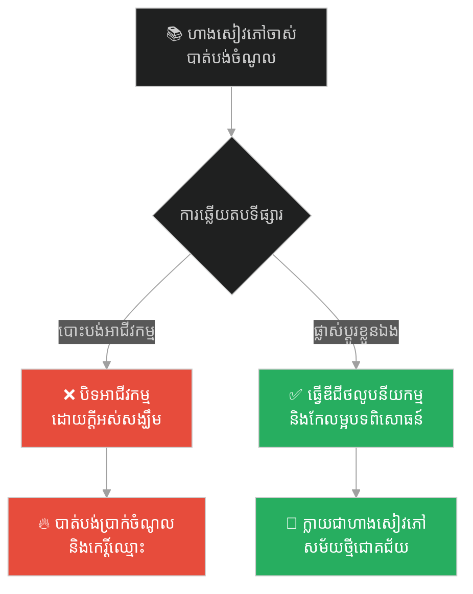
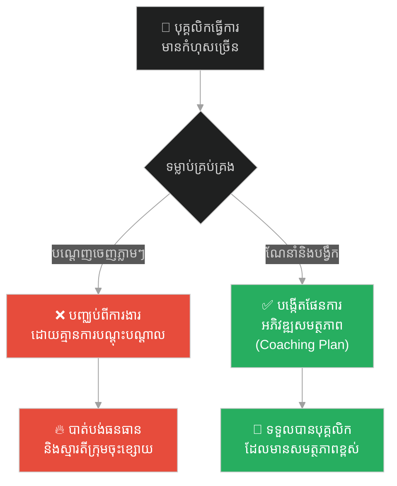
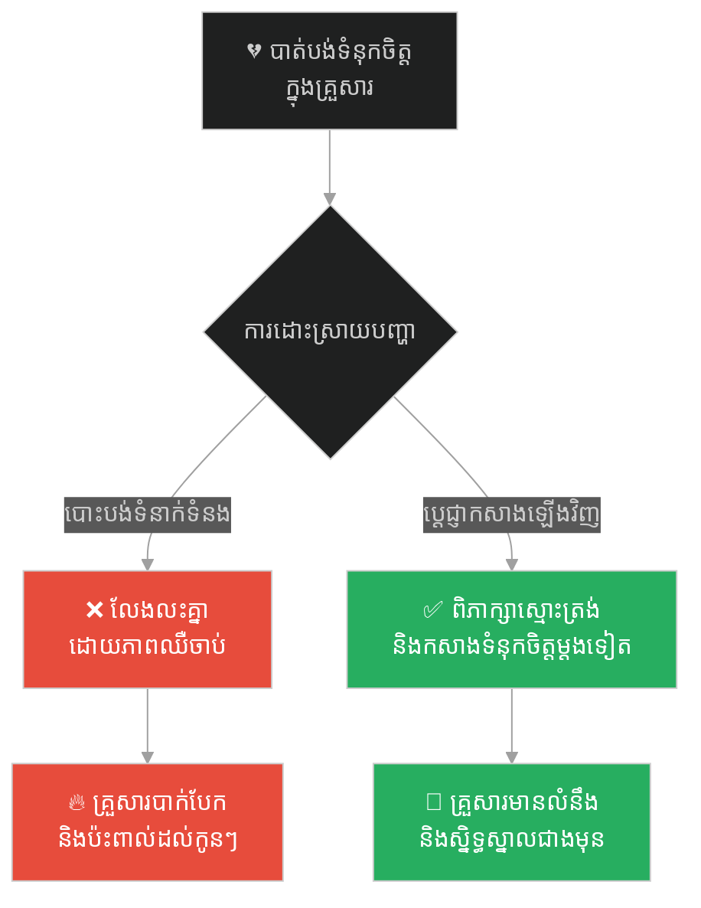
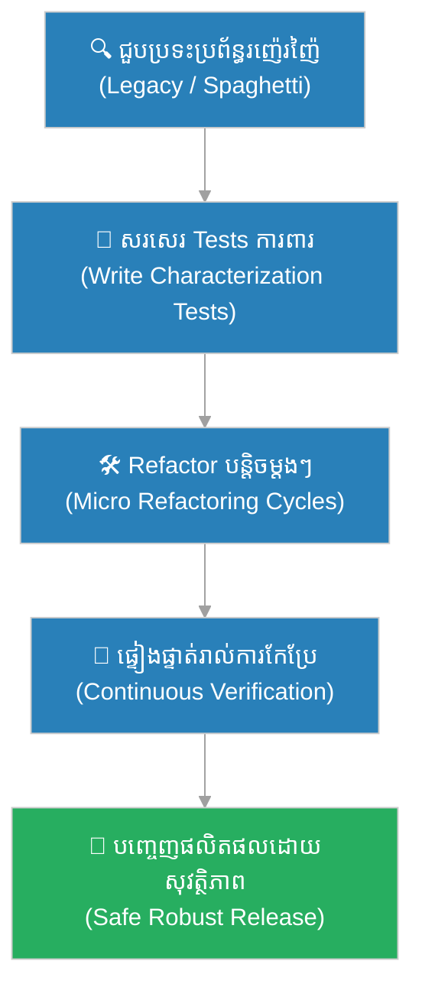

# Growth Mindset & Legacy Code Overhaul (ការផ្លាស់ប្តូរផ្នត់គំនិត និងការកែលម្អកូដកេរដំណែល)៖ ព្រះពុទ្ធ និងចោរអង្គុលីមាល (Growth Mindset & Legacy Code Overhaul & Buddha and the Serial Killer)

**Author:** ichamrong  
**Date:** 2026-05-28  
**Tags:** #growth-mindset #neuroplasticity #legacy-code #refactoring #buddhism #software-architecture  
**Category:** Concepts  
**Read Time:** ~15 min  

---

## 📌 មាតិកា (Table of Contents)
- [អន្ទាក់ផ្លូវចិត្ត (The Trap)](#0)
- [១. រឿងព្រេងព្រះពុទ្ធ និងចោរអង្គុលីមាល (The Legend of Angulimala)](#1)
  - [ការភ្ញាក់រលឹកនៅកណ្តាលព្រៃជ្រៅ (The Turn of the Blade)](#1-1)
- [២. បញ្ហា៖ កូដកេរដំណែល និងគំនិតគាំងស្ទះ (The Issue: Legacy Code & Fixed Mindset)](#2)
- [៣. ឧទាហរណ៍ជាក់ស្តែងក្នុងពិភពពិត (Real World Examples)](#3)
  - [ឧទាហរណ៍ទី ១ — កម្រិតស្រាល (គ្រួសារ)៖ ការកែប្រែទម្លាប់កូនរឹងរូស (The Rebellious Child Growth Plan)](#3-1)
  - [ឧទាហរណ៍ទី ២ — កម្រិតមធ្យម (បច្ចេកទេស)៖ ការកែលម្អប្រព័ន្ធ Spaghetti កេរដំណែល (Refactoring a Legacy Monolith)](#3-2)
  - [ឧទាហរណ៍ទី ៣ — កម្រិតមធ្យម (ធុរកិច្ច)៖ ការផ្លាស់ប្តូរដំណើរការអាជីវកម្មចាស់គំរឹល (Pivot of the Traditional Shop)](#3-3)
  - [ឧទាហរណ៍ទី ៤ — កម្រិតមធ្យម (សង្គម/គ្រប់គ្រង)៖ ការជួយបុគ្គលិកដែលមានបញ្ហាឱ្យរីកចម្រើន (Coaching Underperforming Staff)](#3-4)
  - [ឧទាហរណ៍ទី ៥ — កម្រិតធ្ងន់ (ទំនាក់ទំនង)៖ ការស្តារទំនុកចិត្តឡើងវិញក្រោយការក្បត់ (Rebuilding Traumatized Trust)](#3-5)
- [៤. ដំណោះស្រាយទូទៅ៖ យុទ្ធសាស្ត្រកែលម្អកូដ និងផ្នត់គំនិតរីកចម្រើន (The General Solution: Overhaul Strategy & Growth Mindset)](#4)
- [សេចក្តីសន្និដ្ឋាន (Conclusion)](#5)
- [ឯកសារយោង (References)](#6)
- [Related Posts](#7)

---

<a id="0"></a>
## អន្ទាក់ផ្លូវចិត្ត (The Trap)

តើអ្នកធ្លាប់សម្លឹងមើលប្រព័ន្ធកូដចាស់ដ៏ស្មុគស្មាញ (Legacy Code) ដែលពោរពេញទៅដោយកំហុស (Bugs) រួចគិតក្នុងចិត្តថា៖ «ប្រព័ន្ធនេះអាក្រក់ហួសពីការកែខៃហើយ មានតែលុបចោលហើយសរសេរឡើងវិញពីសូន្យប៉ុណ្ណោះ ទើបអាចដោះស្រាយបាន!» ដែរឬទេ?

នេះជា **The Legacy Despair Trap (អន្ទាក់នៃការអស់សង្ឃឹមលើកូដចាស់)** ដែលកើតចេញពី **Fixed Mindset (ផ្នត់គំនិតជាប់គាំង)**។

* **[Side A (Fixed Mindset)]** — ជឿថាប្រព័ន្ធចាស់ ឬមនុស្សដែលធ្លាប់បង្កកំហុស គឺគ្មានថ្ងៃអាចកែប្រែបានឡើយ។ អតីតកាលគឺជាវាសនាដែលមិនអាចកែប្រែបាន។
* **[Side B (Growth Mindset)]** — ជឿថាគ្រប់កូដដែលរញ៉េរញ៉ៃ ឬគ្រប់បុគ្គលដែលធ្លាប់ធ្វើខុស សុទ្ធតែអាចកែលម្អ និងធ្វើឱ្យប្រសើរឡើងវិញបាន តាមរយៈការកែលម្អជាជំហានៗ (Incremental Refactoring)។

ផែនទីបង្ហាញផ្លូវសម្រាប់អត្ថបទនេះ៖
1. **រឿងព្រេងប្រវត្តិសាស្ត្រ (The Historic Legend)** — រឿងរ៉ាវរបស់ចោរអង្គុលីមាលដែលសម្លាប់មនុស្សរាប់រយនាក់ តែអាចត្រឡប់ខ្លួនមកជាព្រះអរហន្តដ៏មានមេត្តា។
2. **បញ្ហាវិភាគ (The Issue)** — ការប្រៀបធៀបរវាងការបោះបង់ប្រព័ន្ធចាស់ និងការប្រើប្រាស់វិធីសាស្ត្រ Fixed vs Growth Mindset ក្នុងការកែលម្អកូដកេរដំណែល។
3. **ឧទាហរណ៍ជាក់ស្តែង (Real World Examples)** — ការអនុវត្តលើ ៥ កម្រិតផ្សេងគ្នានៃជីវិត និងបច្ចេកវិទ្យា។
4. **ដំណោះស្រាយទូទៅ (The General Solution)** — វិធីសាស្ត្រ Boy Scout Rule និងផែនការចាកចេញពីអន្ទាក់។



---

<a id="1"></a>
## ១. រឿងព្រេងព្រះពុទ្ធ និងចោរអង្គុលីមាល (The Legend of Angulimala)

នៅក្នុងនគរកោសល មានចោរព្រៃម្នាក់ឈ្មោះ **អង្គុលីមាល** (មានន័យថា «កម្រងម្រាមដៃ») ដែលជាឃាតករសាហាវបំផុតក្នុងសម័យនោះ។ គាត់បានសម្លាប់មនុស្សម្នាក់ម្តងៗ រួចកាត់យកម្រាមដៃមកក្រងជាខ្សែកពាក់។ គាត់ត្រូវការតែម្រាមដៃម្នាក់ទៀតប៉ុណ្ណោះដើម្បីគ្រប់ ១០០០ នាក់ ដើម្បីទទួលបានចំណេះដឹងមន្តអាគមពីគ្រូរបស់គាត់ដែលបានបញ្ឆោតគាត់ឱ្យធ្វើបាបសត្វលោក។

អ្នកស្រុកគ្រប់គ្នាភ័យខ្លាចខ្លាំងណាស់ គ្មាននរណាម្នាក់ហ៊ានដើរកាត់ព្រៃដែលអង្គុលីមាលលាក់ខ្លួននោះឡើយ។ ប៉ុន្តែព្រះពុទ្ធបានដឹងថា អង្គុលីមាលមាននិស្ស័យអាចកែប្រែបាន ទើបព្រះអង្គយាងចូលព្រៃនោះតែម្នាក់ឯង ដើម្បីជួយស្រោចស្រង់គាត់។

---

<a id="1-1"></a>
### ការភ្ញាក់រលឹកនៅកណ្តាលព្រៃជ្រៅ (The Turn of the Blade)

នៅពេលអង្គុលីមាលឃើញព្រះពុទ្ធដើរយឺតៗ គេមានចិត្តត្រេកអរជាខ្លាំង ព្រោះគិតថាជនរងគ្រោះចុងក្រោយរបស់គេបានមកដល់ហើយ។ គេក៏កាន់ដាវរត់ដេញតាមយ៉ាងលឿន ប៉ុន្តែទោះបីជាគេរត់លឿនប៉ុណ្ណាក៏ដោយ ក៏នៅតែមិនទាន់ព្រះពុទ្ធដែលកំពុងតែយាងដើរយឺតៗមិនព្រឺរោមឡើយ។

ដោយហត់ខ្លាំង អង្គុលីមាលបានស្រែកថា៖
> «ឈប់សិន សមណៈ! ឈប់!»

ព្រះពុទ្ធបានបន្តយាងទៅមុខ រួចមានសង្ឃដីកាត្រឡប់មកវិញដោយស្ងប់ស្ងាត់ថា៖
> «តថាគតបានឈប់យូរហើយ អង្គុលីមាល។ មានតែអ្នកទេដែលមិនទាន់ឈប់!»

អង្គុលីមាលងឿងឆ្ងល់យ៉ាងខ្លាំង ហើយសួរថា៖
> «ព្រះអង្គកំពុងយាងសោះ ម្តេចក៏ថាឈប់? ឯខ្ញុំកំពុងឈរស្ងៀម ម្តេចព្រះអង្គថាខ្ញុំមិនទាន់ឈប់ទៅវិញ?»

ព្រះពុទ្ធទ្រង់ពន្យល់ថា៖
> «តថាគតបានឈប់ធ្វើអំពើហិង្សា និងបៀតបៀនសត្វលោកតាំងពីយូរណាស់មកហើយ។ រីឯអ្នកវិញ នៅតែបន្តរត់នៅលើផ្លូវនៃការសម្លាប់ និងការបង្កើតកម្មពៀរឥតឈប់ឈរ។»

សម្តីដ៏មានអំណាចនិងមេត្តានេះបានចាក់ទម្លុះបេះដូងរបស់អង្គុលីមាល។ គាត់ដឹងខ្លួនភ្លាមថាខ្លួនបានដើរផ្លូវខុសយ៉ាងខ្លាំង។ គាត់បានទម្លាក់ដាវចុះ លុតជង្គង់ សុំសាងផ្នួស ហើយក្រោយមកបានខិតខំប្រតិបត្តិធម៌រហូតបានសម្រេចជាព្រះអរហន្តដ៏ស្ងប់ស្ងាត់ និងមានក្តីមេត្តាបំផុត។

---

<a id="2"></a>
## ២. បញ្ហា៖ កូដកេរដំណែល និងគំនិតគាំងស្ទះ (The Issue: Legacy Code & Fixed Mindset)

នៅក្នុងវិស្វកម្មកម្មវិធី កូដកេរដំណែល (Legacy Code) គឺដូចជា «អង្គុលីមាល» ដែលធ្លាប់តែបង្កការបំផ្លិចបំផ្លាញ និងរញ៉េរញ៉ៃ។ អ្នកសរសេរកូដដែលមាន **Fixed Mindset** តែងតែវិនិច្ឆ័យថា៖ «កូដនេះមិនអាចសង្គ្រោះបានទេ បើចង់ផ្លាស់ប្តូរ ត្រូវតែសរសេរឡើងវិញទាំងអស់ (Rewrite)»។

ផ្ទុយទៅវិញ **Growth Mindset** យល់ឃើញថា គ្រប់កូដទាំងអស់ សុទ្ធតែអាចកែលម្អបាន (Refactoring) ប្រសិនបើយើងប្រើប្រាស់វិធីសាស្ត្រត្រឹមត្រូវ។ ការសរសេរឡើងវិញពីដំបូង (Big Bang Rewrite) ជារឿយៗតែងតែនាំមកនូវមហន្តរាយ ព្រោះយើងត្រូវចំណាយពេលច្រើន និងបាត់បង់តក្កវិជ្ជាសំខាន់ៗដែលកូដចាស់ធ្លាប់ដោះស្រាយរួចមកហើយ។

សូមពិនិត្យមើលឧទាហរណ៍កូដ TypeScript ខាងក្រោម៖

### កូដដែលមានបញ្ហា (Spaghetti Legacy Code - Fixed Mindset View)
```typescript
// ❌ កូដចាស់រញ៉េរញ៉ៃ គ្មានតេស្ត ងាយបង្កកំហុសនៅពេលកែប្រែ
function processOrderLegacy(order: any) {
    if (order.status === 'pending') {
        if (order.items.length > 0) {
            let total = 0;
            for (let i = 0; i < order.items.length; i++) {
                total += order.items[i].price * order.items[i].quantity;
            }
            if (order.discountCode === 'SUMMER50') {
                total = total * 0.5;
            }
            // Side effect: កែប្រែ database ផ្ទាល់គ្មាន abstraction
            db.execute(`UPDATE orders SET total = ${total}, status = 'processed' WHERE id = ${order.id}`);
            // Side effect: ផ្ញើ email ផ្ទាល់
            emailService.send(order.customerEmail, "Order Processed", "Your total is " + total);
        } else {
            throw new Error("No items");
        }
    }
}
```

### កូដដែលបានកែលម្អ (Clean & Testable Code - Growth Mindset View)
```typescript
// ✅ Refactored code: បំបែក Logic ចេញពី Side Effects និងងាយស្រួលសរសេរ Unit Tests
interface OrderItem {
    price: number;
    quantity: number;
}

interface Order {
    id: number;
    status: string;
    items: OrderItem[];
    discountCode?: string;
    customerEmail: string;
}

export class OrderProcessor {
    constructor(
        private database: DatabaseInterface,
        private emailService: EmailServiceInterface
    ) {}

    public calculateTotal(items: OrderItem[], discountCode?: string): number {
        if (items.length === 0) throw new Error("Order items cannot be empty");
        const subtotal = items.reduce((sum, item) => sum + (item.price * item.quantity), 0);
        return discountCode === 'SUMMER50' ? subtotal * 0.5 : subtotal;
    }

    public async processOrder(order: Order): Promise<void> {
        if (order.status !== 'pending') return;

        const total = this.calculateTotal(order.items, order.discountCode);
        
        await this.database.updateOrderTotalAndStatus(order.id, total, 'processed');
        await this.emailService.sendEmail(order.customerEmail, "Order Processed", `Your total is ${total}`);
    }
}
```

---

<a id="3"></a>
## ៣. ឧទាហរណ៍ជាក់ស្តែងក្នុងពិភពពិត

---

<a id="3-1"></a>
### ឧទាហរណ៍ទី ១ — កម្រិតស្រាល (គ្រួសារ)៖ ការកែប្រែទម្លាប់កូនរឹងរូស (The Rebellious Child Growth Plan)

**ស្ថានភាព៖** កូនប្រុសម្នាក់ក្បាលរឹង មិនព្រមរៀនសូត្រ និងចូលចិត្តឈ្លោះប្រកែកជាមួយឪពុកម្តាយ។

* **ផ្នត់គំនិតជាប់គាំង (Fixed Mindset):** ឪពុកម្តាយគិតថា «កូននេះខូចតាំងពីកំណើត គ្មានថ្ងៃកែខ្លួនកើតទេ» រួចបោះបង់ការអប់រំ និងប្រើអំពើហិង្សា។
* **ផ្នត់គំនិតរីកចម្រើន (Growth Mindset):** ឪពុកម្តាយយល់ថា អត្តចរិតរបស់កូនអាចផ្លាស់ប្តូរបាន។ ពួកគេចាប់ផ្តើមផ្លាស់ប្តូរវិធីនិយាយស្តី ផ្តល់ការលើកទឹកចិត្ត និងស្វែងរកចំណុចខ្លាំងរបស់កូនដើម្បីពង្រឹង។



---

<a id="3-2"></a>
### ឧទាហរណ៍ទី ២ — កម្រិតមធ្យម (បច្ចេកទេស)៖ ការកែលម្អប្រព័ន្ធ Spaghetti កេរដំណែល (Refactoring a Legacy Monolith)

**ស្ថានភាព៖** ប្រព័ន្ធស្នូលរបស់ក្រុមហ៊ុនជា Monolith ដែលមានកូដរញ៉េរញ៉ៃខ្លាំង គ្មានឯកសារណែនាំ និងគ្មាន Unit Tests។

* **ផ្នត់គំនិតជាប់គាំង (Fixed Mindset):** ក្រុមការងារសម្រេចចិត្តថា «កូដនេះកែមិនកើតទេ ត្រូវតែសរសេរប្រព័ន្ធថ្មីទាំងស្រុង»។ ជាលទ្ធផល គម្រោងថ្មីត្រូវពន្យារពេល ២ ឆ្នាំ និងមិនអាចជំនួសប្រព័ន្ធចាស់បាន។
* **ផ្នត់គំនិតរីកចម្រើន (Growth Mindset):** ក្រុមការងារអនុវត្តយុទ្ធសាស្ត្រ Strangler Fig Pattern ដោយកែលម្អ និងបំបែកសេវាកម្មចាស់ម្តងមួយៗ (Refactor in place with tests) រហូតដល់ប្រព័ន្ធចាស់ក្លាយជាស្អាតល្អ។



---

<a id="3-3"></a>
### ឧទាហរណ៍ទី ៣ — កម្រិតមធ្យម (ធុរកិច្ច)៖ ការផ្លាស់ប្តូរដំណើរការអាជីវកម្មចាស់គំរឹល (Pivot of the Traditional Shop)

**ស្ថានភាព៖** ហាងលក់សៀវភៅបែបប្រពៃណីមួយ កំពុងបាត់បង់អតិថិជនយ៉ាងច្រើន ដោយសារការរីកចម្រើននៃសៀវភៅអេឡិចត្រូនិច (E-books)។

* **ផ្នត់គំនិតជាប់គាំង (Fixed Mindset):** ម្ចាស់ហាងគិតថា «យើងជាហាងសៀវភៅក្រដាស គ្មានថ្ងៃអាចប្រកួតប្រជែងជាមួយបច្ចេកវិទ្យាទេ» រួចសម្រេចចិត្តបិទហាងចោល។
* **ផ្នត់គំនិតរីកចម្រើន (Growth Mindset):** ម្ចាស់ហាងរៀនសូត្រពីការផ្លាស់ប្តូរ បង្កើតវេទិកាលក់អនឡាញ និងរៀបចំហាងជាលំហរកាហ្វេអានសៀវភៅ (Community Space) ដើម្បីទាក់ទាញអតិថិជនឡើងវិញ។



---

<a id="3-4"></a>
### ឧទាហរណ៍ទី ៤ — កម្រិតមធ្យម (សង្គម/គ្រប់គ្រង)៖ ការជួយបុគ្គលិកដែលមានបញ្ហាឱ្យរីកចម្រើន (Coaching Underperforming Staff)

**ស្ថានភាព៖** បុគ្គលិកម្នាក់ធ្វើការយឺតយ៉ាវ និងតែងតែធ្វើខុសរបាយការណ៍ហិរញ្ញវត្ថុ។

* **ផ្នត់គំនិតជាប់គាំង (Fixed Mindset):** អ្នកគ្រប់គ្រងគិតថា «បុគ្គលិកនេះល្ងង់មិនអាចបង្រៀនបានទេ» ក៏សម្រេចចិត្តបញ្ឈប់ពីការងារភ្លាមៗ បង្កើតភាពតានតឹងក្នុងក្រុម។
* **ផ្នត់គំនិតរីកចម្រើន (Growth Mindset):** អ្នកគ្រប់គ្រងរៀបចំវគ្គបណ្តុះបណ្តាល ផ្តល់មតិស្ថាបនា (Constructive Feedback) និងតាមដានការអភិវឌ្ឍន៍របស់គេរហូតក្លាយជាបុគ្គលិកឆ្នើម។



---

<a id="3-5"></a>
### ឧទាហរណ៍ទី ៥ — កម្រិតធ្ងន់ (ទំនាក់ទំនង)៖ ការស្តារទំនុកចិត្តឡើងវិញក្រោយការក្បត់ (Rebuilding Traumatized Trust)

**ស្ថានភាព៖** ប្តីប្រពន្ធមួយគូជួបវិបត្តិទំនុកចិត្ត ដោយសារម្នាក់ក្នុងចំណោមពីរនាក់បានលាក់បាំងរឿងបំណុលធំ។

* **ផ្នត់គំនិតជាប់គាំង (Fixed Mindset):** គិតថា «ទំនុកចិត្តដែលបាត់បង់ មិនអាចយកមកវិញបានឡើយ» ក៏សម្រេចចិត្តលែងលះគ្នាដោយកំហឹង។
* **ផ្នត់គំនិតរីកចម្រើន (Growth Mindset):** ទាំងពីរនាក់ព្រមទទួលស្គាល់កំហុស ចូលរួមប្រឹក្សាផ្លូវចិត្ត និងបង្កើតវិធានការច្បាស់លាស់ដើម្បីកសាងទំនុកចិត្តឡើងវិញជាជំហានៗ។



---

<a id="4"></a>
## ៤. ដំណោះស្រាយទូទៅ៖ យុទ្ធសាស្ត្រកែលម្អកូដ និងផ្នត់គំនិតរីកចម្រើន (The General Solution: Overhaul Strategy & Growth Mindset)

ដើម្បីបំប្លែងប្រព័ន្ធកូដចាស់ ឬជីវិតដែលរញ៉េរញ៉ៃឱ្យទៅជាប្រព័ន្ធដ៏ល្អប្រសើរ ចូរអនុវត្តតាមជំហានយុទ្ធសាស្ត្រខាងក្រោម៖

1. **អនុវត្តវិធាន Boy Scout Rule៖**
   «ចូរទុកឱ្យកន្លែងដែលអ្នកទៅដល់ ស្អាតជាងមុនពេលអ្នកមកដល់ជានិច្ច»។ នៅពេលអ្នកបើកកូដចាស់ដើម្បីបន្ថែមមុខងារថ្មី ចូរកែលម្អកូដតូចមួយនៅក្បែរនោះជាមុនសិន។
2. **សរសេរ Unit Tests ព័ទ្ធជុំវិញ (Characterization Tests)៖**
   មុននឹងកែប្រែកូដចាស់ ត្រូវសរសេរតេស្តដើម្បីបញ្ជាក់ថា កូដនោះកំពុងដំណើរការបែបណា ដើម្បីការពារកុំឱ្យការ Refactor ធ្វើឱ្យខូច Logic ដើម។
3. **ផ្លាស់ប្តូរផ្នត់គំនិតពី Fixed ទៅ Growth៖**
   ចាត់ទុកកំហុស ឬការរញ៉េរញ៉ៃជា «ឱកាសដើម្បីរៀនសូត្រ និងកែលម្អ» មិនមែនជាការដាក់ទោស ឬជាភាពបរាជ័យជាអចិន្ត្រៃយ៍ឡើយ។



---

## 🐇 ធ្លាក់ចូលក្នុងរន្ធទន្សាយ (Enter the Rabbit Hole)
ដើម្បីស្វែងយល់កាន់តែស៊ីជម្រៅអំពីរបៀបបូកសន្សំសកម្មភាពតូចៗប្រចាំថ្ងៃឱ្យទៅជាសមិទ្ធផលមហាសាល សូមបន្តដំណើរទៅកាន់៖

* 🚀 **[ចាប់ផ្តើមដំណើររុករក (Start the Journey) ➔ Compound Effect & Atomic Commits (អំណាចនៃការបូកសន្សំ និងការប្តេជ្ញាចិត្តកូដជាអាតូម)៖ ព្រះពុទ្ធ និងខ្សាច់មួយក្តាប់ដៃ](./151-buddha-and-the-handful-of-sand.md)**

---

<a id="5"></a>
## សេចក្តីសន្និដ្ឋាន (Conclusion)

> **«តថាគតបានឈប់ធ្វើអំពើបៀតបៀនសត្វលោកយូរមកហើយ។ មានតែអ្នកទេដែលមិនទាន់ឈប់!»**

ព្រះពុទ្ធមិនបានវិនិច្ឆ័យអង្គុលីមាលទៅតាមសកម្មភាពអតីតកាលរបស់គាត់ឡើយ ប៉ុន្តែព្រះអង្គបានមើលឃើញនូវលទ្ធភាពនៃការកែប្រែខ្លួន (Potential for Growth) របស់គាត់។ យ៉ាងណាមិញ ក្នុងនាមជាវិស្វករកម្មវិធី យើងមិនគួរអស់សង្ឃឹមលើប្រព័ន្ធកូដចាស់ ឬសមត្ថភាពរបស់ក្រុមការងារឡើយ។ តាមរយៈការកែលម្អជាជំហានៗ និងការរក្សាផ្នត់គំនិតរីកចម្រើន យើងអាចបំប្លែងរាល់ភាពរញ៉េរញ៉ៃទាំងឡាយឱ្យទៅជាស្នាដៃដ៏អស្ចារ្យបានជានិច្ច។

---

<a id="6"></a>
## ឯកសារយោង (References)

* **Dweck, C. S.** — *Mindset: The New Psychology of Success* (2006). ការណែនាំអំពី Fixed vs Growth Mindset។
* **Feathers, M. C.** — *Working Effectively with Legacy Code* (2004). យុទ្ធសាស្ត្រកែលម្អកូដចាស់ដោយសុវត្ថិភាព។
* **Angulimala Sutta (MN 86)** — គម្ពីរពុទ្ធសាសនា ស្តីពីការប្រែខ្លួនរបស់ចោរអង្គុលីមាល។

---

<a id="7"></a>
## Related Posts

* **[The Cracked Pot and the Five Whys (ក្អមដីប្រេះ និងអាថ៌កំបាំងសំនួរស្វែងរកឫសគល់ទាំង ៥)៖ របៀបដោះស្រាយបញ្ហាឱ្យចំឫសគល់ពិតប្រាកដ](./14-the-cracked-pot-and-the-five-whys.md)**
* **[The wooden tent and the palace of stone (តង់ឈើ និងប្រាសាទថ្ម)៖ គ្រោះថ្នាក់នៃការសាងសង់ប្រព័ន្ធប្រញាប់ប្រញាល់ និងមេរៀននៃការកសាងគ្រឹះរឹងមាំ](./19-the-wooden-tent-and-the-palace-of-stone.md)**
