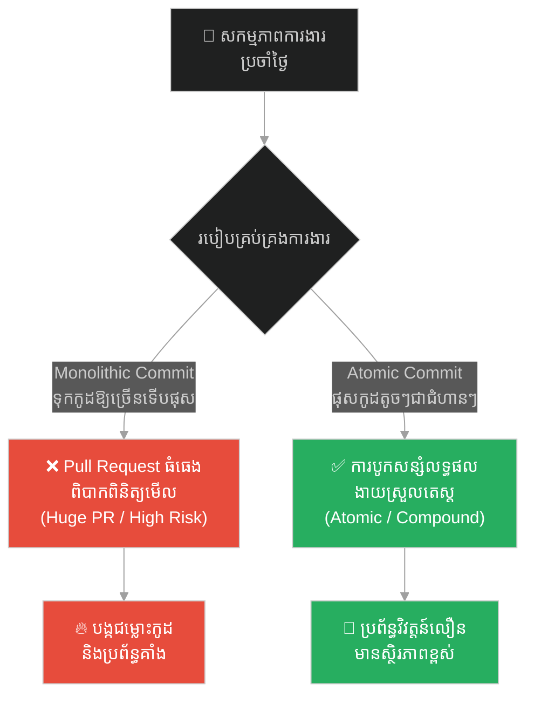
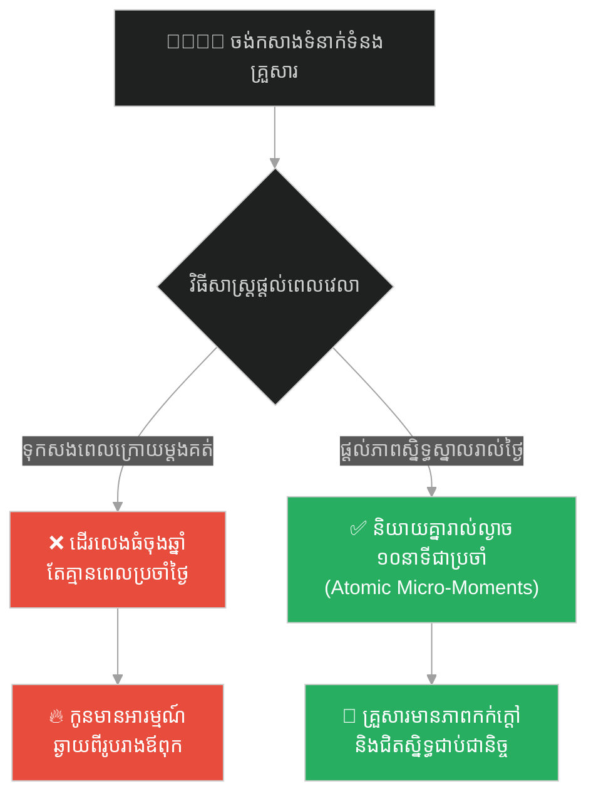
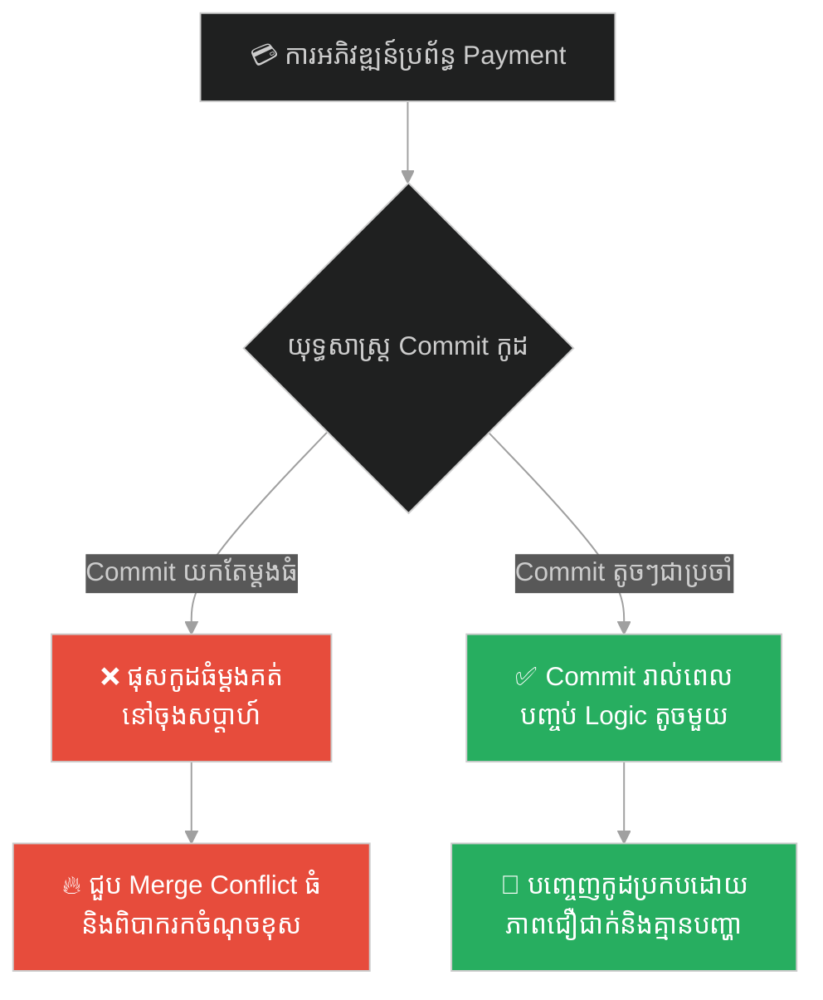
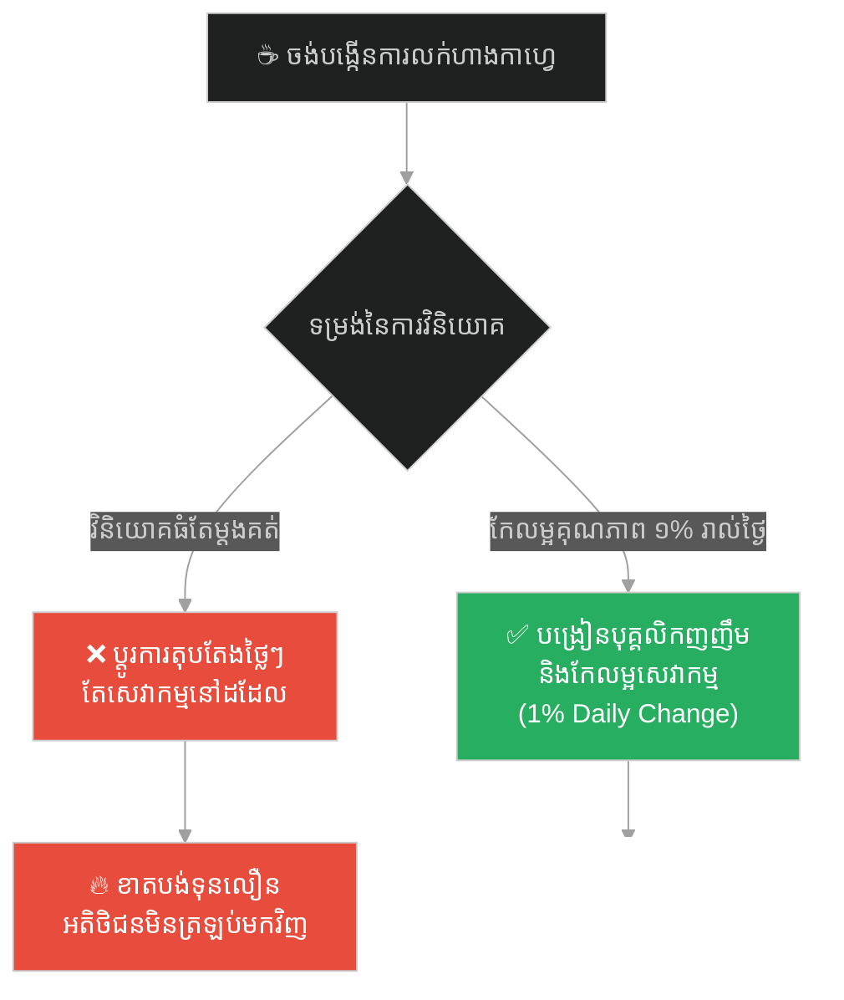
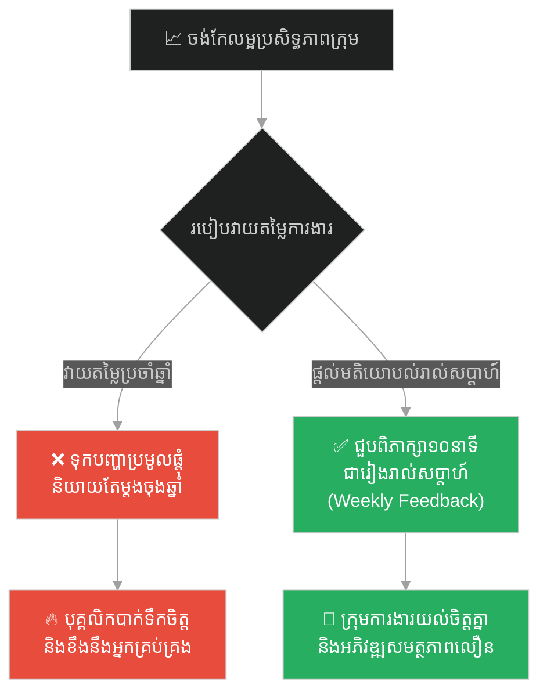
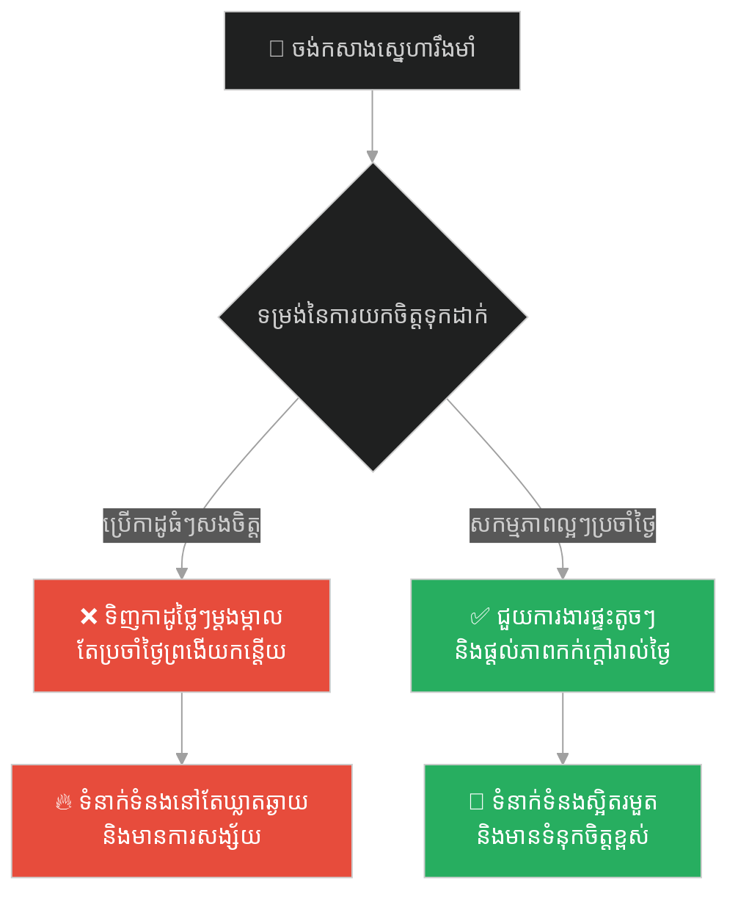
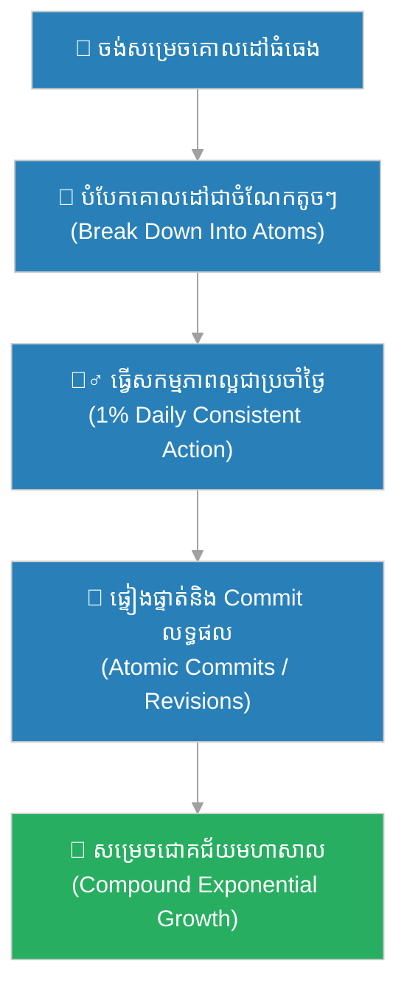

# Compound Effect & Atomic Commits (អំណាចនៃការបូកសន្សំ និងការប្តេជ្ញាចិត្តកូដជាអាតូម)៖ ព្រះពុទ្ធ និងខ្សាច់មួយក្តាប់ដៃ (Compound Effect & Atomic Commits & Buddha and the Handful of Sand)

**Author:** ichamrong  
**Date:** 2026-05-28  
**Tags:** #compound-effect #atomic-commits #git #software-engineering #buddhism #clean-code  
**Category:** Concepts  
**Read Time:** ~15 min  

---

## 📌 មាតិកា (Table of Contents)
- [អន្ទាក់ផ្លូវចិត្ត (The Trap)](#0)
- [១. រឿងព្រេងប្រវត្តិសាស្ត្រ៖ ក្មេងប្រុស និងខ្សាច់មួយក្តាប់ដៃ (The Legend of the Boy and the Sand)](#1)
  - [អនាគតមហាក្សត្រចេញពីទង្វើតូចតាច (From Sand to Empire)](#1-1)
- [២. បញ្ហា៖ ការ Commit កូដដ៏ធំសម្បើម និងឥទ្ធិពលនៃការមិនសន្សំសំចៃ (The Issue: Monolithic Commits & Stagnation)](#2)
- [៣. ឧទាហរណ៍ជាក់ស្តែងក្នុងពិភពពិត (Real World Examples)](#3)
  - [ឧទាហរណ៍ទី ១ — កម្រិតស្រាល (គ្រួសារ)៖ ការកសាងក្តីស្រឡាញ់តាមរយៈសកម្មភាពប្រចាំថ្ងៃ (Daily Family Micro-Moments)](#3-1)
  - [ឧទាហរណ៍ទី ២ — កម្រិតមធ្យម (បច្ចេកទេស)៖ ការប្តេជ្ញាចិត្តកូដជាអាតូម (Atomic Commits in Git)](#3-2)
  - [ឧទាហរណ៍ទី ៣ — កម្រិតមធ្យម (ធុរកិច្ច)៖ ការកែលម្អគុណភាពសេវាកម្ម ១% ជារៀងរាល់ថ្ងៃ (The 1% Daily Business Improvement)](#3-3)
  - [ឧទាហរណ៍ទី ៤ — កម្រិតមធ្យម (សង្គម/គ្រប់គ្រង)៖ ការវាយតម្លៃ និងផ្តល់មតិយោបល់ប្រចាំសប្តាហ៍ (Weekly Continuous Feedback Loops)](#3-4)
  - [ឧទាហរណ៍ទី ៥ — កម្រិតធ្ងន់ (ទំនាក់ទំនង)៖ ការកសាងទំនុកចិត្តឡើងវិញតាមសកម្មភាពតូចៗ (Micro-Trust Building Blocks)](#3-5)
- [៤. ដំណោះស្រាយទូទៅ៖ វិធាននៃការ Commit កូដជាអាតូម និងការប្រើប្រាស់ឥទ្ធិពលបូកសន្សំ (The General Solution: Atomic Commit Rules & Compound Growth)](#4)
- [សេចក្តីសន្និដ្ឋាន (Conclusion)](#5)
- [ឯកសារយោង (References)](#6)
- [Related Posts](#7)

---

<a id="0"></a>
## អន្ទាក់ផ្លូវចិត្ត (The Trap)

តើអ្នកធ្លាប់គិតថា «ការងារតូចតាច ឬការកែលម្អកូដបន្តិចបន្តួចគ្មានតម្លៃអ្វីសោះ ដូច្នេះត្រូវរង់ចាំទាល់តែធ្វើមុខងារធំៗរួចរាល់ ទើបធ្វើការ Commit ឬបញ្ចេញកូដម្តងទាំងស្រុង» ដែរឬទេ?

នេះគឺជា **The Monolithic Commit Trap (អន្ទាក់នៃការ Commit កូដដ៏ធំសម្បើម)**។

* **[Side A]** — គិតថាមានតែការខំប្រឹងប្រែងដ៏ធំសម្បើមមួយដង ឬ Pull Request ដែលមានកូដរាប់ពាន់បន្ទាត់ប៉ុណ្ណោះ ទើបជាការងារដែលមានតម្លៃ។
* **[Side B]** — យល់ថាការ Commit កូដតូចៗដែលមានន័យច្បាស់លាស់ (Atomic Commits) និងសកម្មភាពវិជ្ជមានតូចៗប្រចាំថ្ងៃ បង្កើតបានជាលទ្ធផលធំធេង និងងាយស្រួលគ្រប់គ្រងបំផុត។

ផែនទីបង្ហាញផ្លូវសម្រាប់អត្ថបទនេះ៖
1. **រឿងព្រេងប្រវត្តិសាស្ត្រ (The Historic Legend)** — រឿងរ៉ាវរបស់ក្មេងប្រុសដែលដាក់បាត្រព្រះពុទ្ធដោយខ្សាច់មួយក្តាប់ដៃ រហូតបានក្លាយជាព្រះបាទអសោកមហារាជ។
2. **បញ្ហាវិភាគ (The Issue)** — ការវិភាគទ្រឹស្តី The Compound Effect និងមហន្តរាយនៃការមិនប្រើប្រាស់ Atomic Commits ក្នុង Git។
3. **ឧទាហរណ៍ជាក់ស្តែង (Real World Examples)** — ការអនុវត្តលើ ៥ កម្រិតដើម្បីផ្លាស់ប្តូរជីវិត និងប្រព័ន្ធការងារ។
4. **ដំណោះស្រាយទូទៅ (The General Solution)** — ការបង្កើតទម្លាប់ Commit តូចៗ និងការសន្សំសកម្មភាពវិជ្ជមានប្រចាំថ្ងៃ។



---

<a id="1"></a>
## ១. រឿងព្រេងប្រវត្តិសាស្ត្រ៖ ក្មេងប្រុស និងខ្សាច់មួយក្តាប់ដៃ (The Legend of the Boy and the Sand)

ថ្ងៃមួយ ព្រះពុទ្ធទ្រង់កំពុងយាងបិណ្ឌបាតជាមួយព្រះអានន្ទនៅក្នុងក្រុងរាជគ្រឹះ។ នៅតាមផ្លូវ មានក្មេងប្រុសតូចពីរនាក់កំពុងលេងដីខ្សាច់យ៉ាងសប្បាយរីករាយ។ ពួកគេយកខ្សាច់មកសង់ជាវាំង ធ្វើជាឃ្លាំងផ្ទុកស្រូវ និងលេងធ្វើម្ហូបផ្សេងៗ។

នៅពេលក្មេងប្រុសម្នាក់ឈ្មោះ ជ័យ បានក្រឡេកឃើញព្រះពុទ្ធយាងមកដល់ គេមានចិត្តជ្រះថ្លាយ៉ាងខ្លាំង ចង់ប្រគេនអាហារដល់ព្រះអង្គ។ ប៉ុន្តែដោយសារគេគ្មានអាហារអ្វីសោះនៅក្នុងដៃ គេក៏សម្រេចចិត្តប្រមូលយក **«ខ្សាច់មួយក្តាប់»** ចេញពីឃ្លាំងស្រូវដីខ្សាច់របស់គេ ដោយស្រមៃថាវាជាបាយដ៏មានតម្លៃបំផុត រួចយកទៅដាក់ក្នុងបាត្ររបស់ព្រះពុទ្ធដោយក្តីគោរពបំផុត។

---

<a id="1-1"></a>
### អនាគតមហាក្សត្រចេញពីទង្វើតូចតាច (From Sand to Empire)

ព្រះអានន្ទឃើញក្មេងយកដីខ្សាច់ដាក់បាត្រព្រះពុទ្ធ ក៏បម្រុងនឹងឃាត់ក្មេងនោះ ប៉ុន្តែព្រះពុទ្ធបានលូកបាត្រទទួលយកខ្សាច់នោះដោយស្នាមញញឹមដ៏ស្រទន់។ ព្រះអង្គបានប្រាប់ព្រះអានន្ទកុំឱ្យបោះចោលខ្សាច់នោះឡើយ តែឱ្យយកទៅលាយជាមួយដីឥដ្ឋដើម្បីលាបពាសលើជញ្ជាំងកុដិ។

ព្រះពុទ្ធមានសង្ឃដីកាពន្យល់ថា៖
> «អានន្ទ! ក្មេងប្រុសនេះបានផ្តល់នូវអ្វីដែលគេមាន ដោយចិត្តជ្រះថ្លានិងគោរពបំផុត។ តាមរយៈកម្មផលនៃការផ្តល់ខ្សាច់មួយក្តាប់នេះ នៅក្នុងជាតិអនាគត គេនឹងចាប់កំណើតជាស្តេចដ៏មានអំណាចមួយអង្គ ដែលនឹងជួយផ្សព្វផ្សាយទ្រឹស្តីសន្តិភាព និងកសាងស្តូបរាប់ម៉ឺនកន្លែងដើម្បីបម្រើសត្វលោក។»

(តាមទំនាយ ក្មេងប្រុសនោះក្រោយមកបានចាប់ជាតិជា **ព្រះបាទអសោកមហារាជ (Emperor Ashoka)** ដែលជាស្តេចដ៏ឆ្នើមបំផុតក្នុងការបង្រួបបង្រួមប្រទេសឥណ្ឌា និងផ្សព្វផ្សាយពុទ្ធសាសនាទៅកាន់ពិភពលោក)។

---

<a id="2"></a>
## ២. បញ្ហា៖ ការ Commit កូដដ៏ធំសម្បើម និងឥទ្ធិពលនៃការមិនសន្សំសំចៃ (The Issue: Monolithic Commits & Stagnation)

នៅក្នុងការអភិវឌ្ឍកម្មវិធី វិស្វករជាច្រើនតែងតែជួបបញ្ហា «Git Conflict» ដ៏ស្មុគស្មាញ និងដំណើរការ Review កូដដែលយឺតយ៉ាវ ព្រោះពួកគេមិនព្រម Commit កូដតូចៗ។ ពួកគេសរសេរកូដរាប់សិបមុខងារ ផ្លាស់ប្តូរឯកសាររាប់រយ រួចធ្វើការ Commit ម្តងគត់ជាមួយសារថា `fix: everything`។

ការធ្វើបែបនេះ មិនត្រឹមតែធ្វើឱ្យពិបាករកចំណុចខុសឆ្គង (Debug) នៅពេលមានបញ្ហាប៉ុណ្ណោះទេ ថែមទាំងធ្វើឱ្យបាត់បង់អត្ថប្រយោជន៍នៃ **The Compound Effect** ដែលជាការវិវត្តន៍ប្រព័ន្ធបន្តិចម្តងៗដោយមានសុវត្ថិភាព។

សូមប្រៀបធៀបរបៀបធ្វើការងារ Git Commit ទាំងពីរ៖

### ការ Commit បែបរញ៉េរញ៉ៃ (Monolithic / Giant Commit)
```bash
# ❌ បញ្ចូលមុខងារច្រើន កែប្រែច្រើនកន្លែង ក្នុង Commit តែមួយ
git add .
git commit -m "added login, fixed database bug, styled button, updated dependencies"
```
* **ផលវិបាក៖** ប្រសិនបើមុខងារ Login មានបញ្ហា យើងមិនអាច Revert តែផ្នែក Login បានទេ គឺត្រូវ Revert ទាំងអស់ ដែលធ្វើឱ្យបាត់បង់ការងារល្អៗដទៃទៀត។

### ការ Commit បែបអាតូម (Atomic Commits - Growth Approach)
```bash
# ✅ ជំហានទី ១៖ កែប្រែតែផ្នែក Database
git add src/db/connection.ts
git commit -m "db: optimize connection pool limit"

# ✅ ជំហានទី ២៖ បន្ថែមមុខងារ Login logic
git add src/auth/login.ts
git commit -m "feat(auth): implement user authentication logic"

# ✅ ជំហានទី ៣៖ រចនាប៊ូតុងឡើងវិញ
git add src/components/Button.tsx
git commit -m "style: update primary button background color"
```
* **អត្ថប្រយោជន៍៖** ងាយស្រួលយល់ប្រវត្តិការងារ (Git history), ងាយស្រួលសហការជាមួយសមាជិកក្រុម, និងអាច Revert ឬ Patch ផ្នែកណាមួយបានយ៉ាងងាយ។

---

<a id="3"></a>
## ៣. ឧទាហរណ៍ជាក់ស្តែងក្នុងពិភពពិត

---

<a id="3-1"></a>
### ឧទាហរណ៍ទី ១ — កម្រិតស្រាល (គ្រួសារ)៖ ការកសាងក្តីស្រឡាញ់តាមរយៈសកម្មភាពប្រចាំថ្ងៃ (Daily Family Micro-Moments)

**ស្ថានភាព៖** ឪពុកម្នាក់ចង់ឱ្យគ្រួសាររបស់ខ្លួនមានភាពកក់ក្តៅ និងមានទំនាក់ទំនងល្អជាមួយកូនៗ។

* **ជម្រើសខុស (Monolithic Action):** ធ្វើការងារចោលគ្រួសារពេញមួយឆ្នាំ រួចនាំគ្រួសារទៅដើរលេងក្រៅប្រទេសដ៏ធំមួយនៅចុងឆ្នាំ ដើម្បីសងជំងឺចិត្ត។
* **ជម្រើសត្រូវ (Atomic/Compound Action):** ប្រើពេលត្រឹមតែ ១០ នាទីជារៀងរាល់ល្ងាច ដើម្បីនិយាយសួរសុខទុក្ខ និងអានសៀវភៅឱ្យកូនស្តាប់មុនគេង។



---

<a id="3-2"></a>
### ឧទាហរណ៍ទី ២ — កម្រិតមធ្យម (បច្ចេកទេស)៖ ការប្តេជ្ញាចិត្តកូដជាអាតូម (Atomic Commits in Git)

**ស្ថានភាព៖** ក្រុមការងារកំពុងធ្វើការលើ Feature ថ្មីដែលមានការកែប្រែកូដទាក់ទងនឹង Payment Gateway។

* **ជម្រើសខុស (Monolithic Commit):** សរសេរកូដពេញមួយសប្តាហ៍ដោយមិន Commit រហូតដល់ថ្ងៃសុក្រ ទើបដោះកូដទាំងអស់ឡើង Server។
* **ជម្រើសត្រូវ (Atomic Commit):** រាល់ពេលដែលសរសេរ Unit Test រួចរាល់ ឬកែប្រែ API Schema មួយជំហាន គឺធ្វើការ Commit និងរត់ CI/CD Tests ភ្លាមៗ។



---

<a id="3-3"></a>
### ឧទាហរណ៍ទី ៣ — កម្រិតមធ្យម (ធុរកិច្ច)៖ ការកែលម្អគុណភាពសេវាកម្ម ១% ជារៀងរាល់ថ្ងៃ (The 1% Daily Business Improvement)

**ស្ថានភាព៖** ហាងកាហ្វេមួយចង់បង្កើនការពេញចិត្តរបស់អតិថិជន និងការលក់របស់ខ្លួន។

* **ជម្រើសខុស (Monolithic Campaign):** ចំណាយលុយរាប់ម៉ឺនដុល្លារក្នុងការផ្លាស់ប្តូរការតុបតែងហាងទាំងមូលភ្លាមៗ ដោយមិនយកចិត្តទុកដាក់លើសេវាកម្មបុគ្គលិក។
* **ជម្រើសត្រូវ (Atomic/Compound Improvement):** បង្វឹកបុគ្គលិកឱ្យញញឹមនិងសួរឈ្មោះអតិថិជន កែលម្អរសជាតិកាហ្វេបន្តិចម្តងៗ ១% រាល់ថ្ងៃ។



---

<a id="3-4"></a>
### ឧទាហរណ៍ទី ៤ — កម្រិតមធ្យម (សង្គម/គ្រប់គ្រង)៖ ការវាយតម្លៃ និងផ្តល់មតិយោបល់ប្រចាំសប្តាហ៍ (Weekly Continuous Feedback Loops)

**ស្ថានភាព៖** ប្រធាននាយកដ្ឋានចង់ឱ្យក្រុមការងាររបស់ខ្លួនបង្កើនប្រសិទ្ធភាពការងារ និងកាត់បន្ថយកំហុសឆ្គង។

* **ជម្រើសខុស (Monolithic Review):** រង់ចាំរហូតដល់ការវាយតម្លៃចុងឆ្នាំ (Annual Performance Review) ទើបហៅបុគ្គលិកមកស្តីបន្ទោសពីកំហុសដែលកើតឡើងតាំងពីខែមករា។
* **ជម្រើសត្រូវ (Atomic Feedback):** ផ្តល់មតិយោបល់ស្ថាបនាតូចៗជារៀងរាល់សប្តាហ៍ (Weekly 1-on-1 calls) ដើម្បីឱ្យពួកគេអាចកែតម្រូវទម្លាប់ការងារភ្លាមៗ។



---

<a id="3-5"></a>
### ឧទាហរណ៍ទី ៥ — កម្រិតធ្ងន់ (ទំនាក់ទំនង)៖ ការកសាងទំនុកចិត្តឡើងវិញតាមសកម្មភាពតូចៗ (Micro-Trust Building Blocks)

**ស្ថានភាព៖** ទំនាក់ទំនងស្នេហាជួបភាពរកាំរកូស ដោយសារតែភាគីទាំងសងខាងគ្មានពេលវេលាឱ្យគ្នា។

* **ជម្រើសខុស (Monolithic Surprise):** ទិញកាដូថ្លៃៗ ឬរៀបចំពិធីខួបកំណើតដ៏ធំសម្បើមដើម្បីសងជំងឺចិត្ត តែទម្លាប់ប្រចាំថ្ងៃនៅតែព្រងើយកន្តើយដាក់គ្នា។
* **ជម្រើសត្រូវ (Atomic Trust Building):** ផ្ញើសារសួរសុខទុក្ខនៅពេលថ្ងៃត្រង់ ជួយលាងចានបាយរាល់ល្ងាច និងរក្សាពាក្យសន្យាតូចៗជារៀងរាល់ថ្ងៃ។



---

<a id="4"></a>
## ៤. ដំណោះស្រាយទូទៅ៖ វិធាននៃការ Commit កូដជាអាតូម និងការប្រើប្រាស់ឥទ្ធិពលបូកសន្សំ (The General Solution: Atomic Commit Rules & Compound Growth)

ដើម្បីទទួលបានអត្ថប្រយោជន៍ពី **The Compound Effect** និង **Atomic Commits** ក្នុងការងារ និងជីវិត ចូរអនុវត្តតាមវិធានការខាងក្រោម៖

1. **អនុវត្តវិធាន «ការងារតែមួយ គោលបំណងតែមួយ» (Single Responsibility Principle for Commits)៖**
   រាល់ Commit នីមួយៗត្រូវដោះស្រាយបញ្ហាតែមួយគត់។ បើអ្នកចង់ជួសជុល Bug ផង និងចង់ប្តូរម៉ូតប៊ូតុងផង ចូរបំបែកវាជា ២ Commit ផ្សេងគ្នាដាច់ស្រឡះ។
2. **សរសេរសារ Commit ឱ្យច្បាស់លាស់ (Conventional Commits)៖**
   ប្រើប្រាស់ទម្រង់ស្តង់ដារដូចជា `feat: description`, `fix: description`, ឬ `refactor: description` ដើម្បីឱ្យប្រវត្តិការងារងាយស្រួលអាន និងស្វែងរក។
3. **អនុវត្តទម្លាប់រីកចម្រើន ១% រាល់ថ្ងៃ (The 1% Formula)៖**
   កុំបង្ខំខ្លួនឯងឱ្យផ្លាស់ប្តូរជីវិតទាំងស្រុងក្នុងរយៈពេលមួយយប់។ ចូរផ្តោតលើការកែលម្អសមត្ថភាពខ្លួនឯង ឬប្រព័ន្ធការងារត្រឹមតែ ១% ជារៀងរាល់ថ្ងៃ នោះលទ្ធផលបូកសន្សំនឹងកើនឡើង ៣៧ ដងក្នុងរយៈពេលមួយឆ្នាំ ($1.01^{365} \approx 37.7$)។



---

## 🐇 ធ្លាក់ចូលក្នុងរន្ធទន្សាយ (Enter the Rabbit Hole)
ដើម្បីស្វែងយល់បន្ថែមអំពីរបៀបរៀបចំប្រព័ន្ធឱ្យមានភាពរឹងមាំ និងគ្មានការប្រែប្រួលស្ថានភាព (Stateless & Immutable) សូមបន្តដំណើរទៅកាន់៖

* 🚀 **[ចាប់ផ្តើមដំណើររុករក (Start the Journey) ➔ Immutable Infrastructure & Stateless Deployment (ហេដ្ឋារចនាសម្ព័ន្ធមិនប្រែប្រួល និងការដាក់ពង្រាយគ្មានស្ថានភាព)៖ ព្រះពុទ្ធ និងការគូរគំនូរលើមេឃ](./152-buddha-and-painting-the-sky.md)**

---

<a id="5"></a>
## សេចក្តីសន្និដ្ឋាន (Conclusion)

> **«ក្មេងនេះបានផ្តល់នូវអ្វីដែលគេមាន ដោយចិត្តជ្រះថ្លានិងគោរពបំផុត។ ទង្វើតូចតាចនេះ នឹងបង្កើតបានជាមហាក្សត្រដ៏អស្ចារ្យ។»**

ខ្សាច់មួយក្តាប់ដៃរបស់ក្មេងប្រុសម្នាក់ មើលទៅហាក់បីដូចជាគ្មានតម្លៃសេដ្ឋកិច្ចអ្វីសោះ ប៉ុន្តែវាបង្កប់ដោយចេតនាដ៏បរិសុទ្ធ ដែលសន្សំកម្មផលរហូតបង្កើតបានជាអធិរាជដ៏អស្ចារ្យក្នុងប្រវត្តិសាស្ត្រ។ ក្នុងការសរសេរកូដ និងការអភិវឌ្ឍខ្លួនក៏ដូចគ្នា កុំមើលងាយទង្វើល្អ ឬការកែលម្អកូដដ៏តូចតាចរបស់អ្នក។ រាល់ការ Commit កូដជាអាតូម និងរាល់ការរៀនសូត្របន្តិចបន្តួចជារៀងរាល់ថ្ងៃ គឺជាគ្រាប់ខ្សាច់ដែលកំពុងសាងសង់អាណាចក្រនៃភាពជោគជ័យរបស់អ្នកនាពេលអនាគត។

---

<a id="6"></a>
## ឯកសារយោង (References)

* **Hardy, D.** — *The Compound Effect* (2010). អំណាចនៃការបូកសន្សំក្នុងជីវិត និងអាជីវកម្ម។
* **Clear, J.** — *Atomic Habits* (2018). របៀបបង្កើតទម្លាប់ល្អតូចៗដែលបង្កើតលទ្ធផលធំធេង។
* **Git Book** — *Pro Git* (2014). ការណែនាំស្តីពីការសរសេរ Atomic Commits និងការគ្រប់គ្រង Git Version Control។

---

<a id="7"></a>
## Related Posts

* **[The Cracked Pot and the Five Whys (ក្អមដីប្រេះ និងអាថ៌កំបាំងសំនួរស្វែងរកឫសគល់ទាំង ៥)៖ របៀបដោះស្រាយបញ្ហាឱ្យចំឫសគល់ពិតប្រាកដ](./14-the-cracked-pot-and-the-five-whys.md)**
* **[Growth Mindset & Legacy Code Overhaul (ការផ្លាស់ប្តូរផ្នត់គំនិត និងការកែលម្អកូដកេរដំណែល)៖ ព្រះពុទ្ធ និងចោរអង្គុលីមាល](./150-buddha-and-the-serial-killer.md)**
