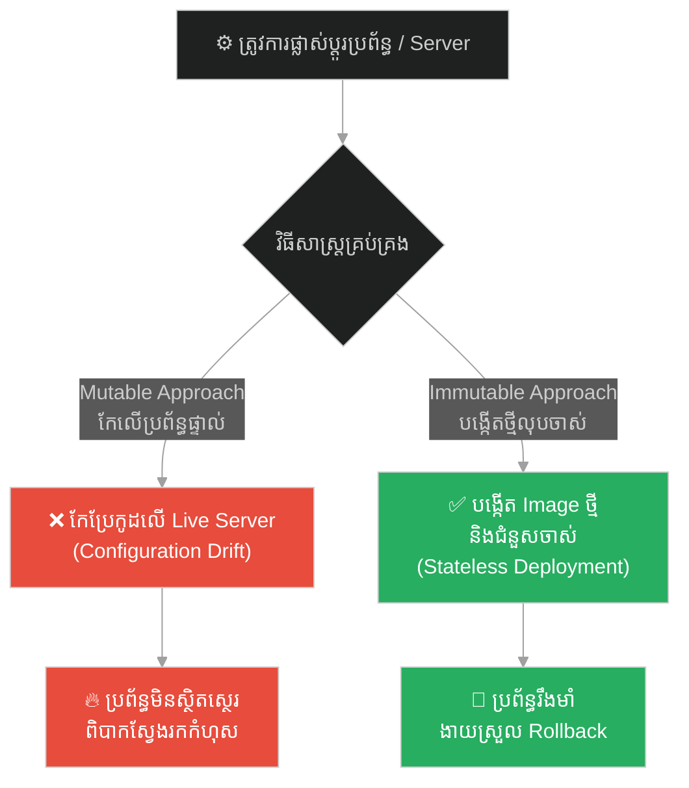
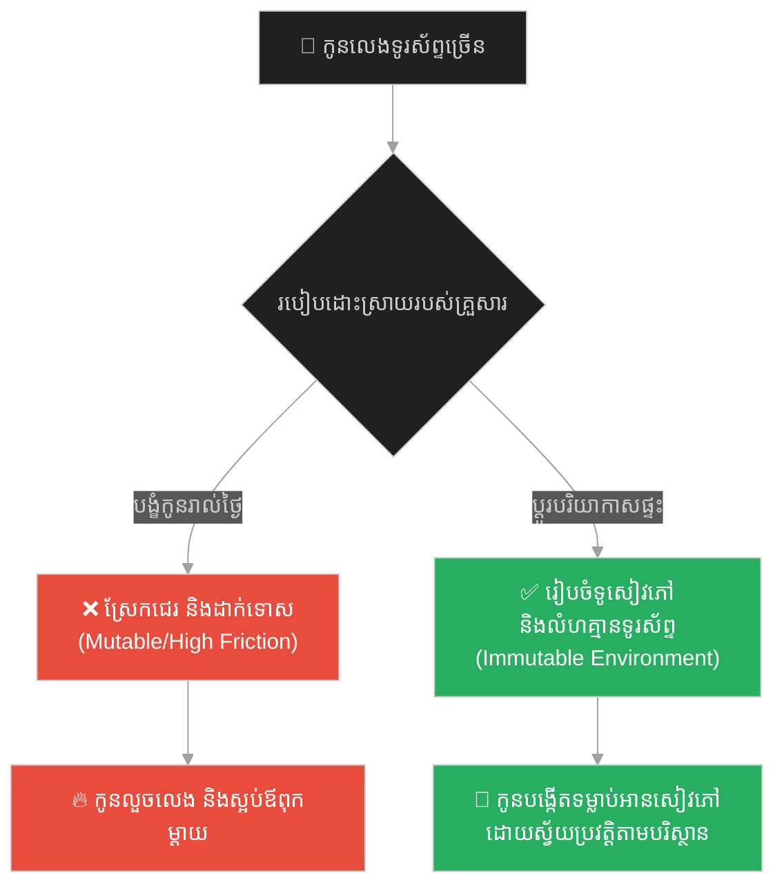
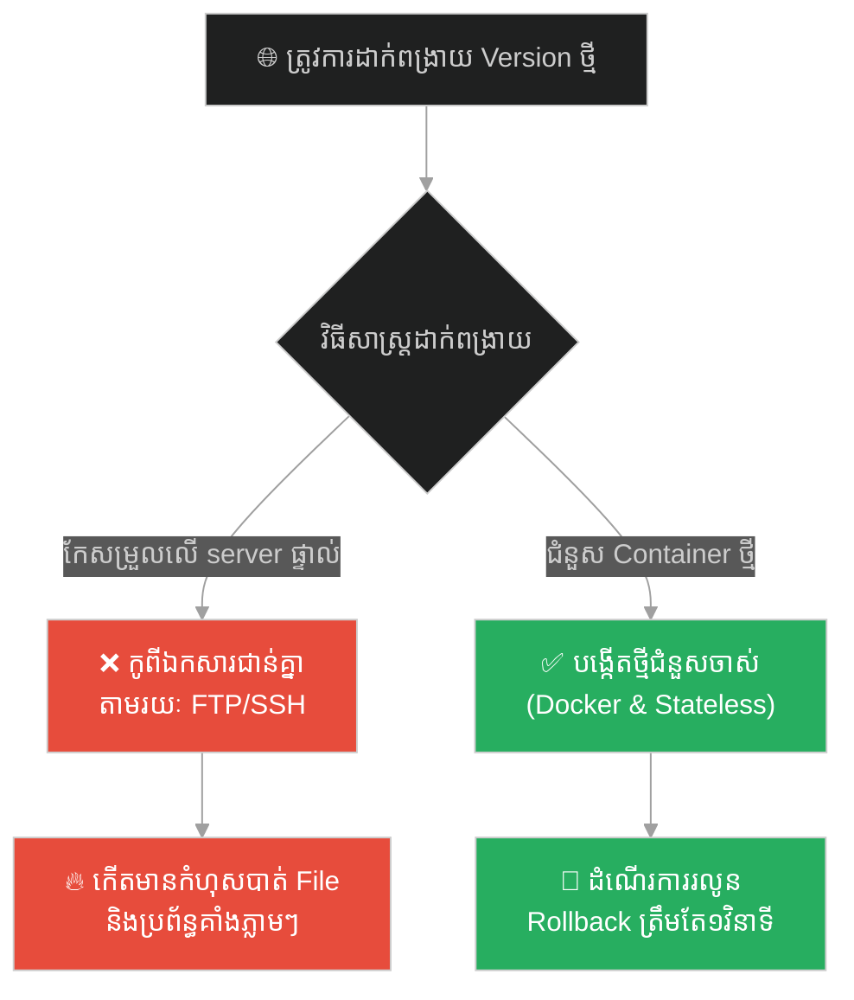
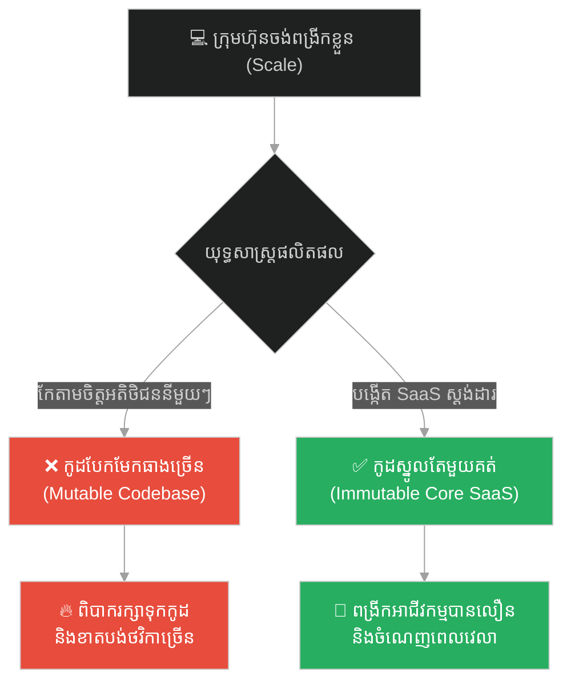
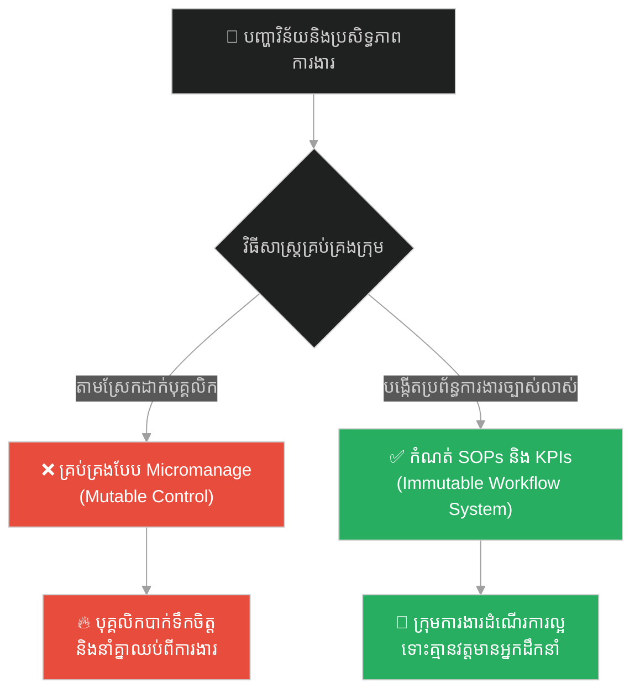
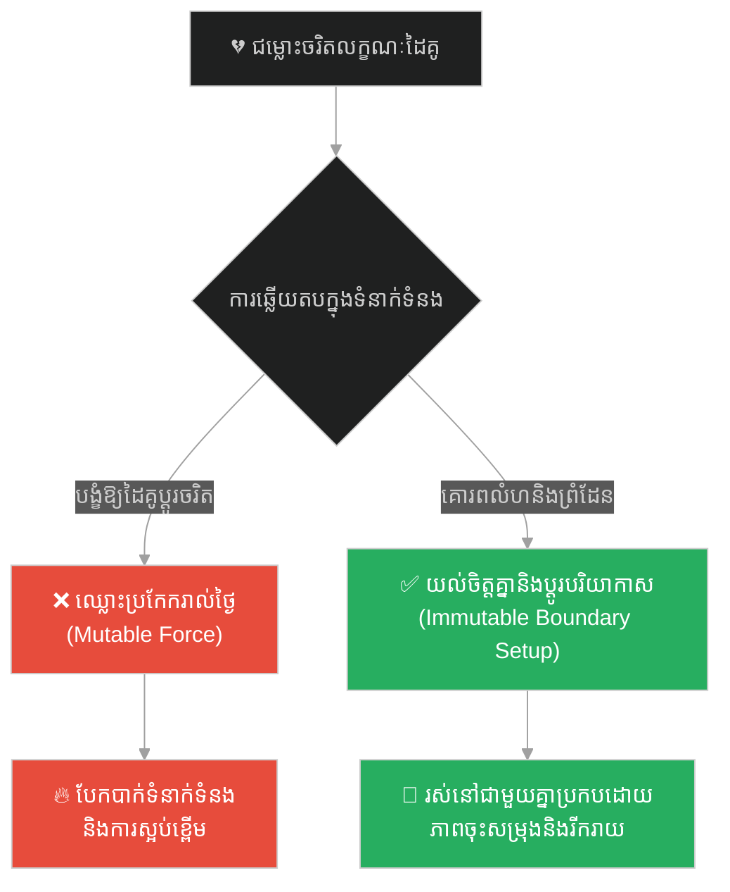
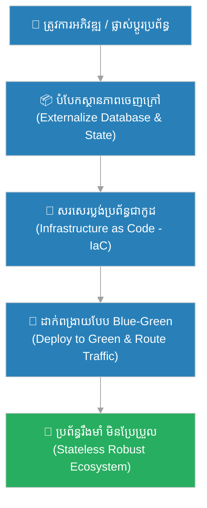

# Immutable Infrastructure & Stateless Deployment (ហេដ្ឋារចនាសម្ព័ន្ធមិនប្រែប្រួល និងការដាក់ពង្រាយគ្មានស្ថានភាព)៖ ព្រះពុទ្ធ និងការគូរគំនូរលើមេឃ (Immutable Infrastructure & Stateless Deployment & Buddha and Painting the Sky)

**Author:** ichamrong  
**Date:** 2026-05-28  
**Tags:** #immutable-infrastructure #stateless #devops #docker #software-architecture #buddhism  
**Category:** Concepts  
**Read Time:** ~15 min  

---

## 📌 មាតិកា (Table of Contents)
- [អន្ទាក់ផ្លូវចិត្ត (The Trap)](#0)
- [១. រឿងព្រេងប្រវត្តិសាស្ត្រ៖ បុរសលាបពណ៌មេឃ (The Legend of the Man Painting the Sky)](#1)
  - [សេចក្តីព្យាយាមដ៏ឥតប្រយោជន៍ (The Boundless Void)](#1-1)
- [២. បញ្ហា៖ ម៉ាស៊ីនបម្រើដែលប្រែប្រួល និងការរសាត់បាត់បង់ការកំណត់ (The Issue: Mutable Servers & Configuration Drift)](#2)
- [៣. ឧទាហរណ៍ជាក់ស្តែងក្នុងពិភពពិត (Real World Examples)](#3)
  - [ឧទាហរណ៍ទី ១ — កម្រិតស្រាល (គ្រួសារ)៖ ការបង្កើតបរិយាកាសគ្រួសារជាជាងបង្ខំឱ្យផ្លាស់ប្តូរចរិត (Ecosystem Design over Direct Control)](#3-1)
  - [ឧទាហរណ៍ទី ២ — កម្រិតមធ្យម (បច្ចេកទេស)៖ ការដាក់ពង្រាយកម្មវិធីដោយប្រើ Docker (Stateless Containers Deployment)](#3-2)
  - [ឧទាហរណ៍ទី ៣ — កម្រិតមធ្យម (ធុរកិច្ច)៖ ការបង្កើតផលិតផលស្តង់ដារជំនួសការតាមកែសម្រួលសម្រាប់អតិថិជនម្នាក់ៗ (SaaS Standardization vs Custom Work)](#3-3)
  - [ឧទាហរណ៍ទី ៤ — កម្រិតមធ្យម (សង្គម/គ្រប់គ្រង)៖ ការបង្កើតច្បាប់ការងារ និងប្រព័ន្ធការងារច្បាស់លាស់ (Systems over People Control)](#3-4)
  - [ឧទាហរណ៍ទី ៥ — កម្រិតធ្ងន់ (ទំនាក់ទំនង)៖ ការទទួលស្គាល់ដៃគូជីវិត និងការរៀបចំលំហផ្ទាល់ខ្លួន (Accepting Core State & Setting Boundaries)](#3-5)
- [៤. ដំណោះស្រាយទូទៅ៖ ហេដ្ឋារចនាសម្ព័ន្ធជាកូដ និងការដាក់ពង្រាយបែប Blue-Green (The General Solution: Infrastructure as Code & Blue-Green Deployment)](#4)
- [សេចក្តីសន្និដ្ឋាន (Conclusion)](#5)
- [ឯកសារយោង (References)](#6)
- [Related Posts](#7)

---

<a id="0"></a>
## អន្ទាក់ផ្លូវចិត្ត (The Trap)

តើអ្នកធ្លាប់ជួបបញ្ហា «Server ដំណើរការខុសប្រក្រតី តែគ្មាននរណាម្នាក់ដឹងថាមកពីអ្វី ហើយដើម្បីដោះស្រាយ គឺត្រូវចូលទៅកែសម្រួលការកំណត់ផ្ទាល់ (Manual patches) នៅលើម៉ាស៊ីនកំពុងដំណើរការ (Live Server)» ដែរឬទេ?

នេះគឺជា **The Mutable Pet Trap (អន្ទាក់នៃការចិញ្ចឹមម៉ាស៊ីនបម្រើ និងការកែប្រែស្ថានភាពផ្ទាល់)**។

* **[Side A (Mutable / Pets)]** — ព្យាយាមកែសម្រួល ដំឡើង និងធ្វើបច្ចុប្បន្នភាពផ្ទាល់នៅលើ Server កំពុងរត់។ វានាំឱ្យកើតមាន «Configuration Drift» (ការរញ៉េរញ៉ៃនៃការកំណត់) ដែលមិនអាចស្មានទុកជាមុនបាន។
* **[Side B (Immutable / Cattle)]** — ចាត់ទុក Server ជាវត្ថុគ្មានស្ថានភាព (Stateless)។ ប្រសិនបើចង់ផ្លាស់ប្តូរ ឬដោះស្រាយបញ្ហា គឺត្រូវបំផ្លាញចោល រួចបង្កើតថ្មីមួយស្រឡះពី Image ដើម (Stateless & Rebuilt from scratch)។

ផែនទីបង្ហាញផ្លូវសម្រាប់អត្ថបទនេះ៖
1. **រឿងព្រេងប្រវត្តិសាស្ត្រ (The Historic Legend)** — រឿងរ៉ាវរបស់បុរសដែលព្យាយាមយកជក់ និងថ្នាំពណ៌ទៅលាបលើមេឃដែលធំល្វឹងល្វើយ។
2. **បញ្ហាវិភាគ (The Issue)** — មហន្តរាយនៃការគ្រប់គ្រងប្រព័ន្ធបែប Mutable Servers និងអត្ថប្រយោជន៍នៃ Immutable Infrastructure។
3. **ឧទាហរណ៍ជាក់ស្តែង (Real World Examples)** — ពិនិត្យមើលទ្រឹស្តីនេះលើ ៥ កម្រិតផ្សេងគ្នានៃជីវិត និងបច្ចេកវិទ្យា។
4. **ដំណោះស្រាយទូទៅ (The General Solution)** — ការប្រើប្រាស់ Docker, Terraform និង Blue-Green Deployment។



---

<a id="1"></a>
## ១. រឿងព្រេងប្រវត្តិសាស្ត្រ៖ បុរសលាបពណ៌មេឃ (The Legend of the Man Painting the Sky)

នៅក្នុងគម្ពីរ Kakacupama Sutta ព្រះពុទ្ធបានពន្យល់ដល់ភិក្ខុទាំងឡាយអំពីរបៀបដែលមនុស្សព្យាយាមកែប្រែអ្វីៗដែលមិនស្ថិតក្រោមការគ្រប់គ្រងរបស់ខ្លួន ដោយលើកជាឧទាហរណ៍មួយ៖

មានបុរសម្នាក់ កាន់ជក់ និងធុងថ្នាំលាបពណ៌យ៉ាងធំ ដើរទៅកណ្តាលទីវាលស្រឡះ។ គាត់ស្រែកខ្លាំងៗថា៖
> «ខ្ញុំនឹងលាបពណ៌ផ្ទៃមេឃដ៏ធំល្វឹងល្វើយនេះ ឱ្យក្លាយទៅជាពណ៌ក្រហម និងគូរគំនូរដ៏ស្រស់ស្អាតផ្សេងៗនៅលើវាឱ្យបាន!»

បន្ទាប់មក បុរសនោះបានបោះជក់ និងបាចថ្នាំលាបឡើងទៅលើអាកាសឥតឈប់ឈរ។ គាត់រត់ចុះឡើង ព្យាយាមគូសវាសទៅលើលំហអាកាស។ គាត់ធ្វើបែបនេះតាំងពីព្រលឹមទល់ព្រលប់ ដោយមិនព្រមឈប់សម្រាកឡើយ។

---

<a id="1-1"></a>
### សេចក្តីព្យាយាមដ៏ឥតប្រយោជន៍ (The Boundless Void)

ព្រះពុទ្ធបានសួរភិក្ខុទាំងឡាយថា៖
> «ភិក្ខុទាំងឡាយ! តើបុរសនោះអាចលាបពណ៌មេឃ ឬគូររូបគំនូរជាប់នៅលើមេឃបានសម្រេចដែរឬទេ?»

ភិក្ខុទាំងឡាយក្រាបទូលថា៖
> «បពិត្រព្រះអង្គ វាមិនអាចទៅរួចឡើយ។ ផ្ទៃមេឃគ្មានរូបរាង គ្មានព្រំដែន ហើយក៏មិនអាចឱ្យថ្នាំលាបណាមួយទៅជាប់លើវាបានដែរ។ បុរសនោះមានតែទទួលបានភាពហត់នឿយ អស់កម្លាំង និងប្រឡាក់ខ្លួនឯងប៉ុណ្ណោះ។»

ព្រះពុទ្ធទ្រង់ពន្យល់បន្តថា៖
> «ត្រឹមត្រូវហើយ។ ចិត្តរបស់អ្នកដទៃ និងព្រឹត្តិការណ៍ខាងក្រៅ ក៏ដូចជាផ្ទៃមេឃអញ្ចឹងដែរ។ ប្រសិនបើអ្នកព្យាយាម 'លាបពណ៌' ឬផ្លាស់ប្តូរអ្វីៗដែលមិនមែនជារបស់អ្នក ឬរឿងដែលមិនអាចកែប្រែបាន អ្នកនឹងត្រូវជួបតែភាពស្ត្រេស ហត់នឿយ និងខកចិត្តឥតប្រយោជន៍ ដូចជាបុរសដែលព្យាយាមលាបពណ៌មេឃនោះដែរ។»

---

<a id="2"></a>
## ២. បញ្ហា៖ ម៉ាស៊ីនបម្រើដែលប្រែប្រួល និងការរសាត់បាត់បង់ការកំណត់ (The Issue: Mutable Servers & Configuration Drift)

នៅក្នុងប្រព័ន្ធ IT បែបបុរាណ (Traditional SysAdmin) Server នីមួយៗត្រូវបានចាត់ទុកជា «សត្វចិញ្ចឹម (Pets)»។ នៅពេលមានបញ្ហា ឬត្រូវការ Update កូដ SysAdmin តែងតែប្រើប្រាស់ SSH ដើម្បីចូលទៅកាន់ server រួចចុចដំឡើង packages ផ្សេងៗដោយផ្ទាល់។

ការធ្វើបែបនេះ បង្កើតឱ្យមានបញ្ហា **Configuration Drift** ពោលគឺ Server ពីរដែលដំឡើងមកដូចគ្នា យូរៗទៅមានការកំណត់ និងឯកសារខុសគ្នា (Stateful divergence) ធ្វើឱ្យប្រព័ន្ធមិនស្ថិតស្ថេរ និងងាយរលំនៅពេលមានបន្ទុកធ្ងន់។

សូមប្រៀបធៀបរបៀបគ្រប់គ្រងទាំងពីរ៖

### របៀបចាស់ (Mutable Server via SSH - Painting the Sky)
```bash
# ❌ ការចូលទៅកែសម្រួល និងដំឡើងផ្ទាល់នៅលើ Live Server
ssh admin@production-server-1
sudo apt-get update && sudo apt-get install -y nodejs
scp server.js admin@production-server-1:/var/www/html/
pm2 restart all
```
* **បញ្ហា៖** ប្រសិនបើដំឡើងខុស ឬប៉ះពាល់ដល់ Package ផ្សេងទៀត Server នឹងគាំងភ្លាមៗ ហើយពិបាកនឹងដឹងថាមានអ្វីប្រែប្រួលខ្លះនៅក្នុងម៉ាស៊ីននោះ។

### របៀបថ្មី (Immutable Infrastructure via Docker - Creating a New Sky)
```dockerfile
# ✅ កំណត់បរិស្ថានទាំងអស់នៅក្នុង Dockerfile (Immutable Template)
FROM node:18-alpine
WORKDIR /app
COPY package*.json ./
RUN npm ci --only=production
COPY . .
EXPOSE 3000
CMD ["node", "server.js"]
```
```bash
# ✅ បង្កើត Image ថ្មី និងជំនួស Container ចាស់
docker build -t myapp:v2 .
docker stop myapp-running && docker run -d --name myapp-running -p 3000:3000 myapp:v2
```
* **អត្ថប្រយោជន៍៖** Container ថ្មីត្រូវបានបង្កើតឡើងពីសូន្យដោយគ្មានស្ថានភាពចាស់ (Stateless)។ ប្រសិនបើមានបញ្ហា យើងគ្រាន់តែទម្លាក់ចោល ហើយរត់ Container ពី Image មុន (v1) វិញភ្លាមៗ (Instant Rollback)។

---

<a id="3"></a>
## ៣. ឧទាហរណ៍ជាក់ស្តែងក្នុងពិភពពិត

---

<a id="3-1"></a>
### ឧទាហរណ៍ទី ១ — កម្រិតស្រាល (គ្រួសារ)៖ ការបង្កើតបរិយាកាសគ្រួសារជាជាងបង្ខំឱ្យផ្លាស់ប្តូរចរិត (Ecosystem Design over Direct Control)

**ស្ថានភាព៖** ឪពុកម្តាយចង់ឱ្យកូនមានទម្លាប់ចូលចិត្តអានសៀវភៅ និងកាត់បន្ថយការលេងហ្គេមលើទូរស័ព្ទ។

* **ជម្រើសខុស (Mutable/Control):** ស្រែកស្តីបន្ទោស ព្យាយាមគ្រប់គ្រង និងដកទូរស័ព្ទកូនដោយបង្ខំ (ព្យាយាមលាបពណ៌មេឃ) បង្កើតជាជម្លោះប្រចាំថ្ងៃ។
* **ជម្រើសត្រូវ (Immutable/Stateless Environment):** រៀបចំផ្ទះឱ្យមានទូសៀវភៅស្អាតៗ បង្កើតម៉ោងអានសៀវភៅរួមគ្នា និងគ្មានទូរទស្សន៍ក្នុងបន្ទប់គេង (រៀបចំបរិស្ថានស្នាក់នៅមិនប្រែប្រួល)។



---

<a id="3-2"></a>
### ឧទាហរណ៍ទី ២ — កម្រិតមធ្យម (បច្ចេកទេស)៖ ការដាក់ពង្រាយកម្មវិធីដោយប្រើ Docker (Stateless Containers Deployment)

**ស្ថានភាព៖** ក្រុមហ៊ុនចង់ដំឡើង Version ថ្មីនៃគេហទំព័រលក់ទំនិញ ដែលមានអ្នកប្រើប្រាស់រាប់ម៉ឺននាក់។

* **ជម្រើសខុស (Mutable Deployment):** កូពី File កូដថ្មីទៅជាន់លើកូដចាស់នៅលើ Production Web Server ផ្ទាល់។
* **ជម្រើសត្រូវ (Immutable Deployment):** បង្កើត Docker Image ថ្មី រួចប្រើប្រាស់ Kubernetes ដើម្បីដក Container ចាស់ចេញ ហើយជំនួសដោយ Container ថ្មីដែលស្អាតល្អ។



---

<a id="3-3"></a>
### ឧទាហរណ៍ទី ៣ — កម្រិតមធ្យម (ធុរកិច្ច)៖ ការបង្កើតផលិតផលស្តង់ដារជំនួសការតាមកែសម្រួលសម្រាប់អតិថិជនម្នាក់ៗ (SaaS Standardization vs Custom Work)

**ស្ថានភាព៖** ក្រុមហ៊ុន Software មួយកំពុងជួបការលំបាក ព្រោះតែត្រូវកែប្រែកម្មវិធីរបស់ខ្លួនទៅតាមតម្រូវការរបស់អតិថិជនម្នាក់ៗ (Custom requirements)។

* **ជម្រើសខុស (Mutable Customization):** យល់ព្រមកែសម្រួលកូដស្នូលទៅតាមចិត្តអតិថិជនម្នាក់ៗ (Mutable codebase) ធ្វើឱ្យកូដកាន់តែស្មុគស្មាញ និងពិបាកថែទាំ។
* **ជម្រើសត្រូវ (Immutable SaaS Product):** បង្កើតកម្មវិធីដែលមានលក្ខណៈស្តង់ដាររួមមួយ (Stateless Core) ហើយអនុញ្ញាតឱ្យអតិថិជនកែសម្រួលត្រឹមតែការកំណត់ (Configuration via UI settings) ប៉ុណ្ណោះ។



---

<a id="3-4"></a>
### ឧទាហរណ៍ទី ៤ — កម្រិតមធ្យម (សង្គម/គ្រប់គ្រង)៖ ការបង្កើតច្បាប់ការងារ និងប្រព័ន្ធការងារច្បាស់លាស់ (Systems over People Control)

**ស្ថានភាព៖** ក្រុមហ៊ុនមួយជួបបញ្ហាបុគ្គលិកមិនមកធ្វើការទាន់ពេលវេលា និងធ្វើការងារមិនស្មើដៃគ្នា។

* **ជម្រើសខុស (Mutable Micro-Management):** នាយកក្រុមហ៊ុនដើរតាមឃ្លាំមើល និងស្រែកស្តីបន្ទោសបុគ្គលិកម្នាក់ៗរៀងរាល់ម៉ោង (ព្យាយាមលាបពណ៌មេឃ)។
* **ជម្រើសត្រូវ (Immutable System):** បង្កើតប្រព័ន្ធស្កែនមេដៃច្បាស់លាស់ និងកំណត់ផលសម្រេចការងារ (KPIs / Deliverables) បើធ្វើមិនបានគឺត្រូវអនុវត្តតាមវិន័យក្រុមហ៊ុន (ប្រព័ន្ធចាត់ចែងឥតលំអៀង)។



---

<a id="3-5"></a>
### ឧទាហរណ៍ទី ៥ — កម្រិតធ្ងន់ (ទំនាក់ទំនង)៖ ការទទួលស្គាល់ដៃគូជីវិត និងការរៀបចំលំហផ្ទាល់ខ្លួន (Accepting Core State & Setting Boundaries)

**ស្ថានភាព៖** ប្តីប្រពន្ធមួយគូឧស្សាហ៍ឈ្លោះគ្នា ព្រោះតែម្នាក់ចង់ផ្លាស់ប្តូរទម្លាប់ពីកំណើតរបស់ម្នាក់ទៀត (ដូចជាទម្លាប់ចូលចិត្តភាពស្ងប់ស្ងាត់ ឬចូលចិត្តការដើរលេងក្រៅ)។

* **ជម្រើសខុស (Mutable Adjustment):** ព្យាយាមបង្ខំឱ្យដៃគូផ្លាស់ប្តូរចរិតលក្ខណៈស្នូលរបស់គេ (ព្យាយាមលាបពណ៌មេឃ) បង្កើតឱ្យមានការខឹងសម្បារ និងធុញទ្រាន់។
* **ជម្រើសត្រូវ (Immutable Boundaries):** ទទួលស្គាល់ចរិតលក្ខណៈមិនប្រែប្រួលរបស់ដៃគូ (Immutable nature) ហើយកំណត់ព្រំដែន ឬលំហរស់នៅផ្ទាល់ខ្លួន (Boundary setup) ដែលមានផាសុកភាពសម្រាប់ទាំងសងខាង។



---

<a id="4"></a>
## ៤. ដំណោះស្រាយទូទៅ៖ ហេដ្ឋារចនាសម្ព័ន្ធជាកូដ និងការដាក់ពង្រាយបែប Blue-Green (The General Solution: Infrastructure as Code & Blue-Green Deployment)

ដើម្បីចាកចេញពីអន្ទាក់នៃការគ្រប់គ្រងប្រព័ន្ធបែប Mutable Servers និងការខ្ជះខ្ជាយថាមពលជីវិត ចូរអនុវត្តតាមជំហានយុទ្ធសាស្ត្រខាងក្រោម៖

1. **អនុវត្តការដាក់ពង្រាយគ្មានស្ថានភាព (Stateless Architecture)៖**
   រក្សាទុកទិន្នន័យ (Session, Images, User Data) នៅក្រៅ Web Servers (ដូចជារក្សាទុកក្នុង Database ឬ AWS S3) ដើម្បីឱ្យ Web Servers អាចបំផ្លាញ និងបង្កើតថ្មីបានគ្រប់ពេលដោយគ្មានហានិភ័យបាត់បង់ទិន្នន័យ។
2. **ប្រើប្រាស់ហេដ្ឋារចនាសម្ព័ន្ធជាកូដ (Infrastructure as Code - IaC)៖**
   កំណត់ការបង្កើត Server ទាំងអស់តាមរយៈកូដ (ឧទាហរណ៍៖ Terraform ឬ CloudFormation) ដើម្បីធានាថា Server ថ្មីទាំងអស់នឹងត្រូវបានបង្កើតឡើងយ៉ាងត្រឹមត្រូវ ១០០% ស្របតាមស្តង់ដារតែមួយ។
3. **អនុវត្ត Blue-Green Deployment៖**
   រក្សាទុកបរិស្ថានពីរផ្សេងគ្នាគឺ Blue (Production បច្ចុប្បន្ន) និង Green (Version ថ្មី)។ នៅពេលដាក់ពង្រាយ គឺយើងដំឡើងនៅលើ Green រួចប្តូរ Router/Load Balancer ឱ្យរត់ទៅ Green វិញ។ ប្រសិនបើមានបញ្ហា យើងអាចប្តូរត្រឡប់មក Blue វិញភ្លាមៗ។



---

## 🐇 ធ្លាក់ចូលក្នុងរន្ធទន្សាយ (Enter the Rabbit Hole)
ដើម្បីស្វែងយល់ពីរបៀបធ្វើការងារយ៉ាងជក់ចិត្ត និងសម្រេចបានលទ្ធផលខ្ពស់បំផុត តាមរយៈការរក្សាលំហូរការងារដែលមិនរំខាន សូមបន្តដំណើរទៅកាន់៖

* 🚀 **[ចាប់ផ្តើមដំណើររុករក (Start the Journey) ➔ Flow State & Deep Work (លំហូរការងារចិត្តសាស្ត្រ និងការផ្តោតអារម្មណ៍ស៊ីជម្រៅ)៖ ព្រះពុទ្ធ និងអ្នកសម្លាប់សត្វ](./153-buddha-and-the-butcher.md)**

---

<a id="5"></a>
## សេចក្តីសន្និដ្ឋាន (Conclusion)

> **«ផ្ទៃមេឃគ្មានរូបរាង គ្មានទីបញ្ចប់ ហើយក៏មិនអាចឱ្យថ្នាំលាបណាមួយទៅជាប់លើវាបានដែរ។ បុរសដែលព្យាយាមលាបពណ៌មេឃ មានតែហត់នឿយឥតប្រយោជន៍។»**

ការព្យាយាមចូលទៅកែប្រែ Live Server ឬការបង្ខំឱ្យមនុស្សដទៃផ្លាស់ប្តូរចរិតលក្ខណៈស្នូលរបស់ពួកគេ គឺដូចជាការខំប្រឹងយកជក់ទៅលាបពណ៌ផ្ទៃមេឃដ៏ធំល្វឹងល្វើយដូច្នោះដែរ។ ក្នុងនាមជាវិស្វករប្រព័ន្ធ ឬជាមនុស្សម្នាក់ដែលចង់បានសន្តិភាពចិត្ត ចូរឈប់ប្រើប្រាស់វិធីសាស្ត្របង្ខំកែសម្រួលលើ Live Server ទៀតទៅ។ ចូររៀបចំប្រព័ន្ធឱ្យទៅជា Stateless និងបង្កើតបរិយាកាស ឬ Image ថ្មីដែលរឹងមាំ ដើម្បីធានាថាគ្រប់ការផ្លាស់ប្តូរទាំងអស់នឹងប្រព្រឹត្តទៅដោយសន្តិភាព និងមានស្ថិរភាពជានិច្ច។

---

<a id="6"></a>
## ឯកសារយោង (References)

* **Morris, K.** — *Infrastructure as Code: Managing Servers in the Cloud* (2016). ការពន្យល់អំពីសត្វចិញ្ចឹម (Pets) និងសត្វពាហនៈ (Cattle) ក្នុងវិស័យ DevOps។
* **Kakacupama Sutta (MN 21)** — គម្ពីរពុទ្ធសាសនា ស្តីពីការលាបពណ៌ផ្ទៃមេឃ និងការអត់ធ្មត់នឹងពាក្យសម្តីអ្នកដទៃ។
* **Fowler, M.** — *PhoenixServer* (2012). គំនិតនៃការបង្កើតម៉ាស៊ីនបម្រើឡើងវិញពីសូន្យជាជាងការថែទាំកែលម្អវា។

---

<a id="7"></a>
## Related Posts

* **[Compound Effect & Atomic Commits (អំណាចនៃការបូកសន្សំ និងការប្តេជ្ញាចិត្តកូដជាអាតូម)៖ ព្រះពុទ្ធ និងខ្សាច់មួយក្តាប់ដៃ](./151-buddha-and-the-handful-of-sand.md)**
* **[The wooden tent and the palace of stone (តង់ឈើ និងប្រាសាទថ្ម)៖ គ្រោះថ្នាក់នៃការសាងសង់ប្រព័ន្ធប្រញាប់ប្រញាល់ និងមេរៀននៃការកសាងគ្រឹះរឹងមាំ](./19-the-wooden-tent-and-the-palace-of-stone.md)**
