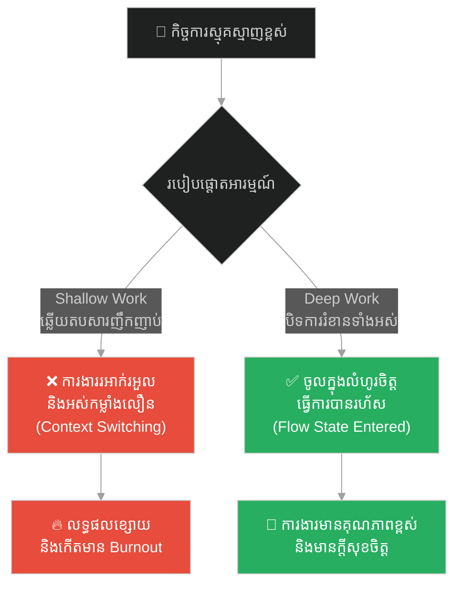
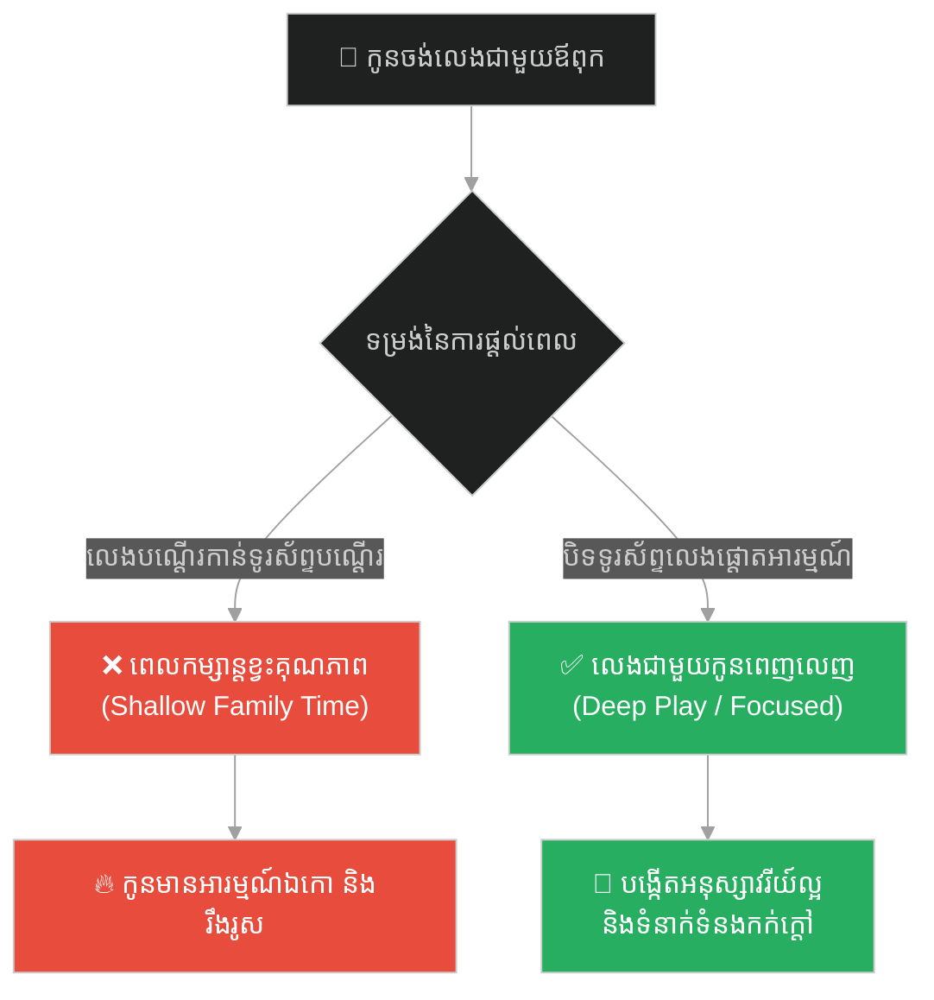
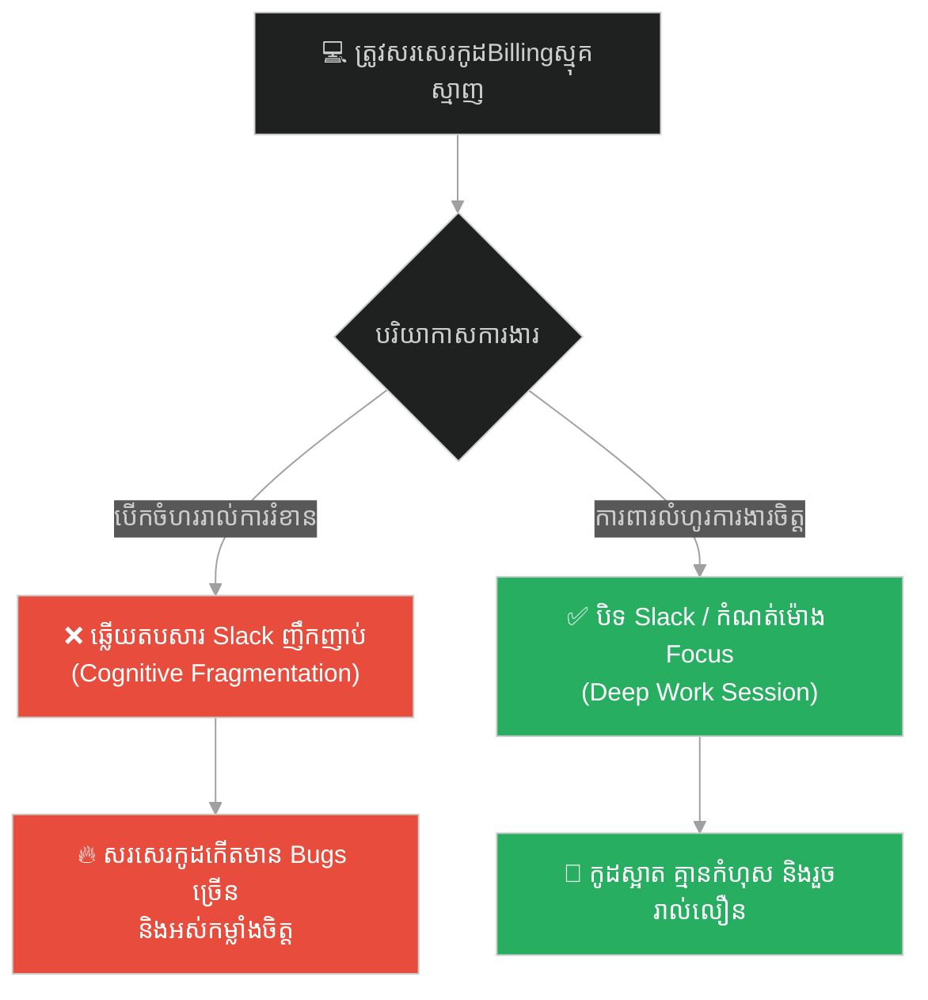
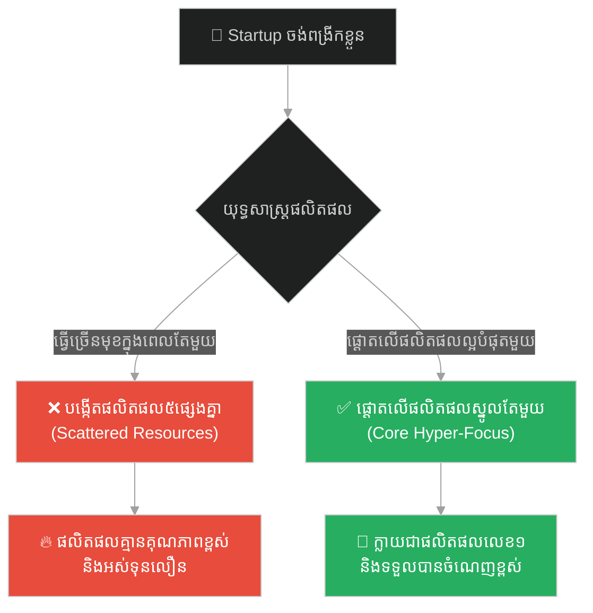
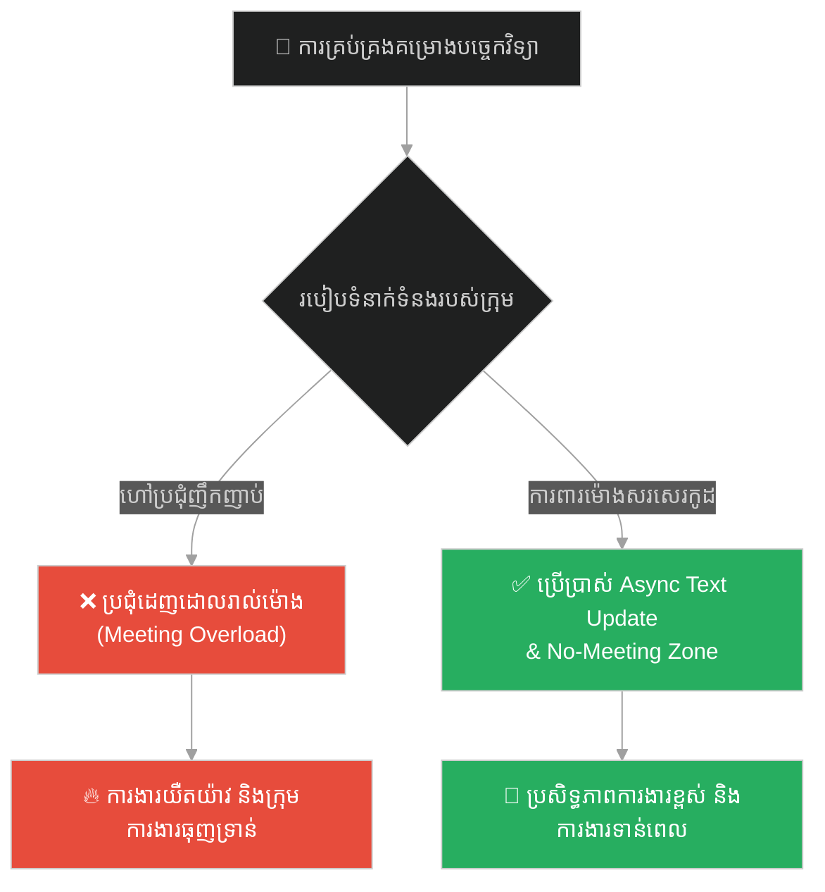
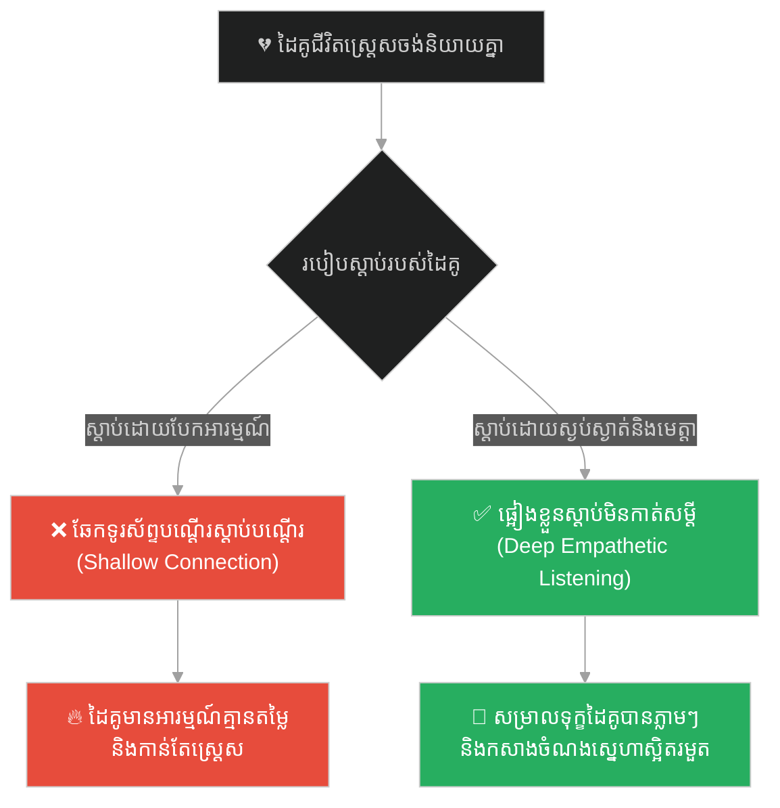
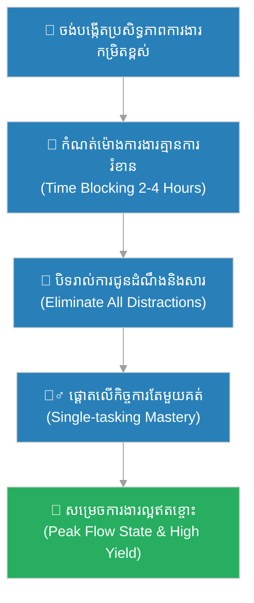

# Flow State & Deep Work (លំហូរការងារចិត្តសាស្ត្រ និងការផ្តោតអារម្មណ៍ស៊ីជម្រៅ)៖ ព្រះពុទ្ធ និងអ្នកសម្លាប់សត្វ (Flow State & Deep Work & Buddha and the Butcher)

**Author:** ichamrong  
**Date:** 2026-05-28  
**Tags:** #flow-state #deep-work #focus #productivity #zen #software-engineering  
**Category:** Concepts  
**Read Time:** ~15 min  

---

## 📌 មាតិកា (Table of Contents)
- [អន្ទាក់ផ្លូវចិត្ត (The Trap)](#0)
- [១. រឿងព្រេងប្រពៃណីតាវ និងសាសនាហ្សេន៖ ចុងភៅទីង (The Legend of Cook Ting)](#1)
  - [សិល្បៈនៃការវះកាត់ដោយគ្មានកម្លាំងបុក (The Secret of the Untouched Blade)](#1-1)
- [២. បញ្ហា៖ ការងាររាក់កំភែល និងការបែកខ្ញែកអារម្មណ៍ក្នុងវិស្វកម្ម (The Issue: Shallow Work & Context Switching)](#2)
- [៣. ឧទាហរណ៍ជាក់ស្តែងក្នុងពិភពពិត (Real World Examples)](#3)
  - [ឧទាហរណ៍ទី ១ — កម្រិតស្រាល (គ្រួសារ)៖ ពេលវេលាគ្រួសារប្រកបដោយគុណភាពខ្ពស់ (Deep Play and Device Free Hours)](#3-1)
  - [ឧទាហរណ៍ទី ២ — កម្រិតមធ្យម (បច្ចេកទេស)៖ ការផ្តោតអារម្មណ៍លើការដោះស្រាយបញ្ហាកូដស្មុគស្មាញ (Uninterrupted Code Blocks)](#3-2)
  - [ឧទាហរណ៍ទី ៣ — កម្រិតមធ្យម (ធុរកិច្ច)៖ ការផ្តោតលើផលិតផលស្នូលតែមួយ (Single-Product Hyper-Focus)](#3-3)
  - [ឧទាហរណ៍ទី ៤ — កម្រិតមធ្យម (សង្គម/គ្រប់គ្រង)៖ ការការពារម៉ោងការងាររបស់ក្រុមការងារ (Maker vs Manager Schedule)](#3-4)
  - [ឧទាហរណ៍ទី ៥ — កម្រិតធ្ងន់ (ទំនាក់ទំនង)៖ ការស្តាប់ដោយជ្រៅ និងមិនរំខាន (Deep Empathetic Listening)](#3-5)
- [៤. ដំណោះស្រាយទូទៅ៖ វិធានការដកខ្លួនចេញពីការរំខាន និងការកំណត់ពេលរារាំង (The General Solution: Time Blocking & Eliminating Cognitive Friction)](#4)
- [សេចក្តីសន្និដ្ឋាន (Conclusion)](#5)
- [ឯកសារយោង (References)](#6)
- [Related Posts](#7)

---

<a id="0"></a>
## អន្ទាក់ផ្លូវចិត្ត (The Trap)

តើអ្នកធ្លាប់អង្គុយធ្វើការ ៨ ម៉ោងពេញក្នុងមួយថ្ងៃ ប៉ុន្តែនៅចុងបញ្ចប់នៃថ្ងៃនោះ អ្នកមានអារម្មណ៍ថាខ្លួនឯងមិនបានសម្រេចកិច្ចការធំណាមួយទាល់តែសោះ ដោយសារត្រូវឆ្លើយតបសារទូរស័ព្ទ អ៊ីមែល និងការប្រជុំកាត់ទទឹងកាត់បណ្តោយដែរឬទេ?

នេះគឺជា **The Context Switching Trap (អន្ទាក់នៃការបែកខ្ញែកអារម្មណ៍ និងការផ្លាស់ប្តូរការផ្តោតអារម្មណ៍រហ័ស)**។

* **[Side A (Shallow Work)]** — ធ្វើការងារដែលរំខានដោយការជូនដំណឹង (Notifications) និងប្រជុំញឹកញាប់។ វាបង្កើតឱ្យមានការអស់កម្លាំងផ្លូវចិត្ត តែទទួលបានលទ្ធផលតិចតួច។
* **[Side B (Deep Work)]** — ចូលទៅក្នុង «សភាពលំហូរចិត្ត (Flow State)» ដែលគ្មានការរំខាន។ ក្នុងសភាពនេះ ពេលវេលាហាក់ដូចជារលាយបាត់ ហើយកិច្ចការស្មុគស្មាញត្រូវបានដោះស្រាយយ៉ាងងាយស្រួលបំផុត។

ផែនទីបង្ហាញផ្លូវសម្រាប់អត្ថបទនេះ៖
1. **រឿងព្រេងប្រវត្តិសាស្ត្រ (The Historic Legend)** — រឿងរ៉ាវរបស់ចុងភៅទីង (Cook Ting) ដែលកាប់សាច់គោដោយកាំបិតមុតស្រួចអស់រយៈពេល ១៩ ឆ្នាំដោយមិនបាច់ដុសខាត់។
2. **បញ្ហាវិភាគ (The Issue)** — ផលវិបាកនៃការផ្លាស់ប្តូរការផ្តោតអារម្មណ៍រហ័ស (Context Switching Cost) និងការយល់ដឹងពី Flow State ក្នុងបច្ចេកវិទ្យា។
3. **ឧទាហរណ៍ជាក់ស្តែង (Real World Examples)** — ពិនិត្យមើលទ្រឹស្តីនេះលើ ៥ កម្រិតដើម្បីផ្លាស់ប្តូរទម្លាប់ជីវិត និងការងារ។
4. **ដំណោះស្រាយទូទៅ (The General Solution)** — ការអនុវត្ត Time-Blocking និងការការពារលំហការងារ។



---

<a id="1"></a>
## ១. រឿងព្រេងប្រពៃណីតាវ និងសាសនាហ្សេន៖ ចុងភៅទីង (The Legend of Cook Ting)

នៅក្នុងរឿងព្រេងបុរាណចិន មានចុងភៅ និងអ្នកកាប់សាច់ម្នាក់ឈ្មោះ **ទីង (Cook Ting)** ដែលធ្វើការងារវះកាត់សាច់គោថ្វាយស្តេច **វិនហុយ (King Wen Hui)**។ រាល់ពេលដែលចុងភៅទីងកាន់កាំបិតទៅវះកាត់សាច់គោ គឺចលនារបស់គាត់ហាក់ដូចជាការសម្តែងរបាំ និងតន្ត្រីដ៏អស្ចារ្យ។

សំឡេងកាំបិតរអិលកាត់សាច់ ចលនាដៃ ជើង និងជង្គង់ គឺមានភាពស៊ីសង្វាក់គ្នាយ៉ាងឥតខ្ចោះ។ គាត់មិនប្រើកម្លាំងបុកទង្គិចឡើយ។ ស្តេចវិនហុយបានទតឃើញ ក៏លាន់មាត់សរសើរដោយក្តីងឿងឆ្ងល់ថា៖
> «អស្ចារ្យណាស់! ជំនាញរបស់អ្នកពិតជាឈានដល់កម្រិតកំពូលមែន។ តើអ្នកធ្វើវាបានដោយរបៀបណា?»

---

<a id="1-1"></a>
### សិល្បៈនៃការវះកាត់ដោយគ្មានកម្លាំងបុក (The Secret of the Untouched Blade)

ចុងភៅទីងបានដាក់កាំបិតចុះ រួចក្រាបទូលទៅកាន់ព្រះរាជាវិញថា៖
> «បពិត្រព្រះរាជា អ្វីដែលទូលបង្គំខ្វល់ មិនមែនជាបច្ចេកទេស (Skill) ធម្មតាឡើយ តែវាជា **តាវ (Tao / The Flow / ធម្មជាតិ)**។ កាលទូលបង្គំចាប់ផ្តើមកាប់សាច់កាលពី ១៩ ឆ្នាំមុន ទូលបង្គំមើលឃើញគោមួយក្បាលទាំងមូល។ ៣ ឆ្នាំក្រោយមក ទូលបង្គំលែងឃើញគោទាំងមូលទៀតហើយ គឺមើលឃើញតែរចនាសម្ព័ន្ធគ្រឿងក្នុង និងចន្លោះឆ្អឹង។»

គាត់បានបន្តទៀតថា៖
> «ឥឡូវនេះ ទូលបង្គំលែងប្រើភ្នែកមើលទៀតហើយ គឺប្រើ **ចិត្ត និងសតិ**។ ទូលបង្គំគ្រាន់តែបណ្តោយឱ្យកាំបិតរអិលចូលទៅតាមចន្លោះទំនេររវាងសន្លាក់ឆ្អឹង និងសាច់ដោយធម្មជាតិ ដោយមិនបុកចំឆ្អឹងរឹងឡើយ។ អ្នកកាប់សាច់ទូទៅ ត្រូវប្តូរកាំបិតរាល់ខែ ព្រោះគេចូលចិត្តកាប់បុកចំឆ្អឹង។ ឯកាំបិតទូលបង្គំប្រើអស់រយៈពេល ១៩ ឆ្នាំហើយ វះកាត់គោរាប់ពាន់ក្បាល តែវានៅតែមុតស្រួចដូចទើបតែដុសខាត់ថ្មីៗអញ្ចឹង។»

ស្តេចវិនហុយបានស្តាប់ឮរួច ក៏មានបន្ទូលទាំងញញឹមថា៖
> «អស្ចារ្យមែន! ស្តាប់សម្តីចុងភៅទីងនាថ្ងៃនេះ ធ្វើឱ្យយើងយល់ពីវិធីថែរក្សាជីវិត និងវិធីធ្វើការងារដោយគ្មានការប៉ះទង្គិចពិតប្រាកដ។»

---

<a id="2"></a>
## ២. បញ្ហា៖ ការងាររាក់កំភែល និងការបែកខ្ញែកអារម្មណ៍ក្នុងវិស្វកម្ម (The Issue: Shallow Work & Context Switching)

នៅក្នុងវិស័យវិស្វកម្មកម្មវិធី កូដដែលស្មុគស្មាញប្រៀបដូចជា «រចនាសម្ព័ន្ធឆ្អឹងគោ»។ ប្រសិនបើ Developer ម្នាក់សរសេរកូដបណ្តើរ ឆ្លើយតបសារ Slack បណ្តើរ ពួកគេនឹងសរសេរកូដដែលមានរចនាសម្ព័ន្ធមិនស្អាត ប្រើប្រាស់ logic ស្មុគស្មាញ (Spaghetti code) ព្រោះខួរក្បាលរបស់គេកំពុងបែកខ្ញែក និងអស់កម្លាំង។

ផ្ទុយទៅវិញ នៅពេលស្ថិតនៅក្នុង **Flow State** វិស្វករអាចមើលឃើញចន្លោះទំនេរនៃ Logic យ៉ាងច្បាស់លាស់ និងសរសេរកូដប្រកបដោយសាមញ្ញភាព (Elegant & Clean) ដោយប្រើប្រាស់ថាមពលខួរក្បាលតិចបំផុត។

សូមប្រៀបធៀបគំរូកូដ Javascript ទាំងពីរ៖

### កូដដែលសរសេរដោយគ្មានការផ្តោតអារម្មណ៍ (Distracted / Hacked Approach)
```javascript
// ❌ កូដសរសេរដោយមានការរំខានអារម្មណ៍៖ ប្រើ Callback nesting ច្រើន និងពិបាកយល់
function getUserDataDistracted(userId, callback) {
    db.query('SELECT * FROM users WHERE id = ' + userId, (err, user) => {
        if (err) return callback(err);
        db.query('SELECT * FROM permissions WHERE role = ?', [user.role], (err, perms) => {
            if (err) return callback(err);
            db.query('SELECT * FROM logs WHERE user_id = ?', [userId], (err, logs) => {
                if (err) return callback(err);
                callback(null, { user, perms, logs });
            });
        });
    });
}
```

### កូដដែលសរសេរក្នុង Flow State (Focused Declarative Approach)
```javascript
// ✅ កូដមុតស្រួច ស្អាត រអិលតាមចន្លោះទំនេរ៖ ប្រើប្រាស់ Async/Await ជាមួយ Promise.all
async function getUserDataFlow(userId) {
    const user = await db.findUserById(userId);
    if (!user) throw new Error("User not found");

    // ដំណើរការស្វែងរក Permission និង Logs ស្របគ្នាក្នុងពេលតែមួយ
    const [permissions, logs] = await Promise.all([
        db.findPermissionsByRole(user.role),
        db.findLogsByUserId(userId)
    ]);

    return { user, permissions, logs };
}
```

---

<a id="3"></a>
## ៣. ឧទាហរណ៍ជាក់ស្តែងក្នុងពិភពពិត

---

<a id="3-1"></a>
### ឧទាហរណ៍ទី ១ — កម្រិតស្រាល (គ្រួសារ)៖ ពេលវេលាគ្រួសារប្រកបដោយគុណភាពខ្ពស់ (Deep Play and Device Free Hours)

**ស្ថានភាព៖** ឪពុកម្នាក់ចង់លេងជាមួយកូនៗនៅចុងសប្តាហ៍ ដើម្បីបង្កើនទំនាក់ទំនង។

* **ជម្រើសខុស (Shallow Time):** អង្គុយលេងជាមួយកូន តែដៃម្ខាងកាន់ទូរស័ព្ទឆែកមើលបណ្តាញសង្គមរៀងរាល់ ២ នាទី (បែកអារម្មណ៍កូនៗមានអារម្មណ៍ថាឪពុកមិនយកចិត្តទុកដាក់)។
* **ជម្រើសត្រូវ (Deep Play):** បិទទូរស័ព្ទ ឬទុកក្នុងបន្ទប់ផ្សេង រួចចំណាយពេល ១ ម៉ោងពេញ លេងហ្គេមលើក្តារ (Board game) ឬសាងសង់ប្រដាប់ក្មេងលេងជាមួយកូនដោយយកចិត្តទុកដាក់ ១០០%។



---

<a id="3-2"></a>
### ឧទាហរណ៍ទី ២ — កម្រិតមធ្យម (បច្ចេកទេស)៖ ការផ្តោតអារម្មណ៍លើការដោះស្រាយបញ្ហាកូដស្មុគស្មាញ (Uninterrupted Code Blocks)

**ស្ថានភាព៖** Senior Developer ត្រូវរៀបចំឡើងវិញនូវប្រព័ន្ធគណនាលុយ (Billing Engine Remodeling) ដែលពិបាកខ្លាំង។

* **ជម្រើសខុស (Interrupted Environment):** ព្យាយាមសរសេរកូដនៅក្នុងលំហការងារបើកចំហ (Open office) ដែលមានសម្លាប់ شورបុគ្គលិកដទៃមកសួរនាំ និងឆ្លើយតបសារសួរដេញដោលរាល់ ១០ នាទី។
* **ជម្រើសត្រូវ (Deep Work Block):** បិទកម្មវិធីសារទាំងអស់ កំណត់ស្ថានភាព Slack ទៅជា «Focusing» និងពាក់កាសបិទសម្លេង (Noise-canceling headphones) ដើម្បីសរសេរកូដផ្តោតអារម្មណ៍ ២ ម៉ោងជាប់គ្នា។



---

<a id="3-3"></a>
### ឧទាហរណ៍ទី ៣ — កម្រិតមធ្យម (ធុរកិច្ច)៖ ការផ្តោតលើផលិតផលស្នូលតែមួយ (Single-Product Hyper-Focus)

**ស្ថានភាព៖** ក្រុមហ៊ុន Startup មួយចង់បង្កើនប្រាក់ចំណេញ និងពង្រីកទីផ្សាររបស់ខ្លួនឱ្យលឿន។

* **ជម្រើសខុស (Shallow Diversification):** បង្កើតផលិតផល ៥ ផ្សេងគ្នាក្នុងពេលតែមួយ ដើម្បីសាកល្បងទីផ្សារ (ខ្វះការផ្តោតអារម្មណ៍ ធ្វើឱ្យគ្មានផលិតផលណាមួយល្អឥតខ្ចោះ)។
* **ជម្រើសត្រូវ (Hyper-Focus):** បង្កកគម្រោង ៤ ចោល ហើយទុកតែផលិតផលដែលល្អបំផុតមួយគត់ រួចចំណាយធនធានទាំងអស់ដើម្បីអភិវឌ្ឍវាឱ្យក្លាយជាផលិតផលលេខ ១ ក្នុងទីផ្សារ។



---

<a id="3-4"></a>
### ឧទាហរណ៍ទី ៤ — កម្រិតមធ្យម (សង្គម/គ្រប់គ្រង)៖ ការការពារម៉ោងការងាររបស់ក្រុមការងារ (Maker vs Manager Schedule)

**ស្ថានភាព៖** អ្នកគ្រប់គ្រងគម្រោង (Project Manager) ចង់ដឹងពីវឌ្ឍនភាពការងាររបស់ក្រុមការងារបច្ចេកទេស។

* **ជម្រើសខុស (Manager Schedule Trap):** ហៅប្រជុំដេញដោល (Status update meetings) ៣ ទៅ ៤ ដងក្នុងមួយថ្ងៃ ដែលធ្វើឱ្យកាត់ផ្តាច់ម៉ោងសរសេរកូដរបស់ Developers។
* **ជម្រើសត្រូវ (Async Update & Block):** ប្រើប្រាស់ការរាយការណ៍ជាលាយលក្ខណ៍អក្សរម្តងក្នុងមួយថ្ងៃ (Async text standup) ហើយរក្សាទុករយៈពេល ៤ ម៉ោងជាប់គ្នាពេលរសៀលជា «No-Meeting Zone»។



---

<a id="3-5"></a>
### ឧទាហរណ៍ទី ៥ — កម្រិតធ្ងន់ (ទំនាក់ទំនង)៖ ការស្តាប់ដោយជ្រៅ និងមិនរំខាន (Deep Empathetic Listening)

**ស្ថានភាព៖** ដៃគូជីវិតកំពុងមានបញ្ហាស្ត្រេសនឹងការងារយ៉ាងខ្លាំង ហើយចង់ពិភាក្សាដោះស្រាយ។

* **ជម្រើសខុស (Distracted Listening):** ស្តាប់បណ្តើរសម្លឹងមើលអេក្រង់ទូរទស្សន៍ ឬឆែកទូរស័ព្ទបណ្តើរ រួចផ្តល់ចម្លើយយោបល់លឿនៗដោយមិនយល់សេចក្តីពិតប្រាកដ។
* **ជម្រើសត្រូវ (Deep Listening):** បិទឧបករណ៍អេក្រង់ទាំងអស់ ផ្អៀងខ្លួនទៅរកដៃគូ សម្លឹងមើលភ្នែក និងស្តាប់រហូតដល់ពួកគេនិយាយចប់ដោយមិនកាត់សម្តី ដើម្បីយល់អារម្មណ៍ពិត។



---

<a id="4"></a>
## ៤. ដំណោះស្រាយទូទៅ៖ វិធានការដកខ្លួនចេញពីការរំខាន និងការកំណត់ពេលរារាំង (The General Solution: Time Blocking & Eliminating Cognitive Friction)

ដើម្បីកសាងទម្លាប់ការងារបែប **Deep Work** និងស្វែងរក **Flow State** នៅក្នុងជីវិតប្រចាំថ្ងៃ ចូរអនុវត្តជំហានខាងក្រោម៖

1. **អនុវត្តការកំណត់ពេលរារាំង (Time Blocking)៖**
   បែងចែកពេលវេលា ២ ទៅ ៤ ម៉ោងជារៀងរាល់ព្រឹកជាម៉ោង «Deep Work»។ ក្នុងអំឡុងពេលនេះ មិនអនុញ្ញាតឱ្យមានការប្រជុំ ឬការងាររាក់កំភែលណាមួយរំខានឡើយ។
2. **កាត់បន្ថយ Cognitive Friction (ភាពរំខានខួរក្បាល)៖**
   បិទការជូនដំណឹង (Notifications) លើទូរស័ព្ទ និងកុំព្យូទ័រទាំងអស់។ ប្រើប្រាស់កម្មវិធីកម្ចាត់ការរំខាន (ឧទាហរណ៍៖ Cold Turkey ឬ Freedom) ដើម្បីបិទគេហទំព័រកម្សាន្តនៅពេលកំពុងធ្វើការ។
3. **អនុវត្តទម្លាប់គិតបែបចុងភៅទីង (The Master's Focus)៖**
   ចាត់ទុកការងារនៅចំពោះមុខជាទម្រង់នៃការប្រតិបត្តិធម៌ ឬសមាធិ។ ផ្តោតអារម្មណ៍ ១០០% លើការងារតូចមួយនោះរហូតដល់រួចរាល់ មុននឹងប្តូរទៅកាន់ការងារបន្ទាប់ (Single-tasking over Multi-tasking)។



---

## 🐇 ធ្លាក់ចូលក្នុងរន្ធទន្សាយ (Enter the Rabbit Hole)
ដើម្បីស្វែងយល់ពីរបៀបរៀបចំប្រព័ន្ធត្រួតពិនិត្យឱ្យមានលក្ខណៈសកម្ម និងបង្ការបញ្ហាមុនពេលវាកើតឡើង (Proactive Monitoring) សូមបន្តដំណើរទៅកាន់៖

* 🚀 **[ចាប់ផ្តើមដំណើររុករក (Start the Journey) ➔ Proactive Monitoring & Predictive Alerting (ការត្រួតពិនិត្យសកម្ម និងការជូនដំណឹងជាមុន)៖ ព្រះពុទ្ធ និងសេះទាំងបួន](./154-buddha-and-the-four-horses.md)**

---

<a id="5"></a>
## សេចក្តីសន្និដ្ឋាន (Conclusion)

> **«កាំបិតរបស់ទូលបង្គំប្រើអស់រយៈពេល ១៩ ឆ្នាំហើយ វះកាត់គោរាប់ពាន់ក្បាល តែវានៅតែមុតស្រួចដូចទើបនឹងទិញថ្មី ព្រោះវាដើរតាមចន្លោះទំនេរនៃឆ្អឹង។»**

សិល្បៈនៃការធ្វើការងាររបស់ចុងភៅទីង គឺមិនមែនប្រើកម្លាំងបុកទង្គិចឡើយ តែជាការរកឃើញចន្លោះទំនេរ និងចុះសម្រុងទៅតាមធម្មជាតិរបស់វា។ ក្នុងនាមជាអ្នកសរសេរកូដ ឬអ្នកដឹកនាំអាជីវកម្ម ការប្រឹងប្រែងទាំងបែកខ្ញែកអារម្មណ៍ គឺដូចជាការយកកាំបិតទៅកាប់បុកឆ្អឹងរឹង ដែលធ្វើឱ្យកាំបិតឆាប់រិល និងខ្លួនឯងឆាប់ហត់នឿយ (Burnout)។ ចូររៀនដកខ្លួនចេញពីភាពរំខាន បង្កើតលំហការងារផ្តោតអារម្មណ៍ ដើម្បីឱ្យចិត្តរបស់អ្នកអាចរអិលកាត់រាល់បញ្ហាស្មុគស្មាញនានាដោយភាពងាយស្រួល និងមានសេចក្តីសុខជានិច្ច។

---

<a id="6"></a>
## ឯកសារយោង (References)

* **Csikszentmihalyi, M.** — *Flow: The Psychology of Optimal Experience* (1990). ការសិក្សាអំពីលំហូរចិត្ត។
* **Newport, C.** — *Deep Work: Rules for Focused Success in a Distracted World* (2016). វិធានការដោះស្រាយបញ្ហាបែកអារម្មណ៍ក្នុងយុគសម័យឌីជីថល។
* **Zhuangzi (Chuang Tzu)** — *Inner Chapters* (គម្ពីរតាវបុរាណ ស្តីពីសិល្បៈរបស់ចុងភៅទីងវះកាត់សាច់គោ)។

---

<a id="7"></a>
## Related Posts

* **[Immutable Infrastructure & Stateless Deployment (ហេដ្ឋារចនាសម្ព័ន្ធមិនប្រែប្រួល និងការដាក់ពង្រាយគ្មានស្ថានភាព)៖ ព្រះពុទ្ធ និងការគូរគំនូរលើមេឃ](./152-buddha-and-painting-the-sky.md)**
* **[The Weaver and the Emperor's Robe (អ្នកត្បាញក្រណាត់ និងអាវធំព្រះរាជា)៖ គ្រោះថ្នាក់នៃការកាត់បន្ថយចំណាយលើផ្នែកសំខាន់ និងមហន្តរាយនៃការមើលរំលងតួនាទីតូចតាច](./16-the-weaver-and-the-emperors-robe.md)**
