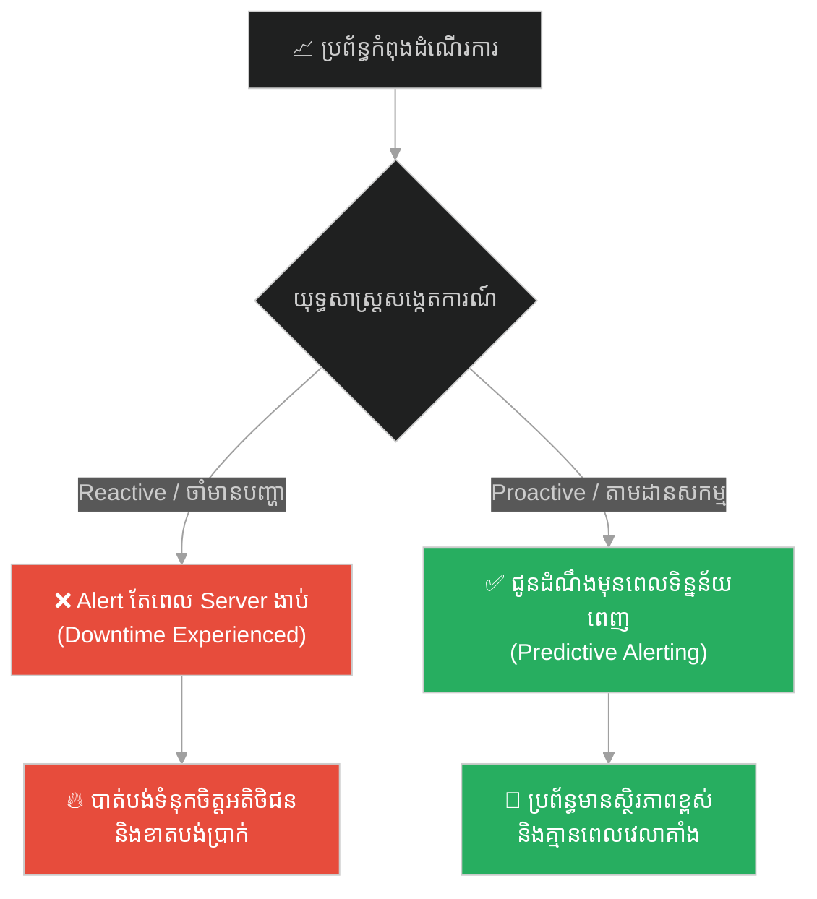
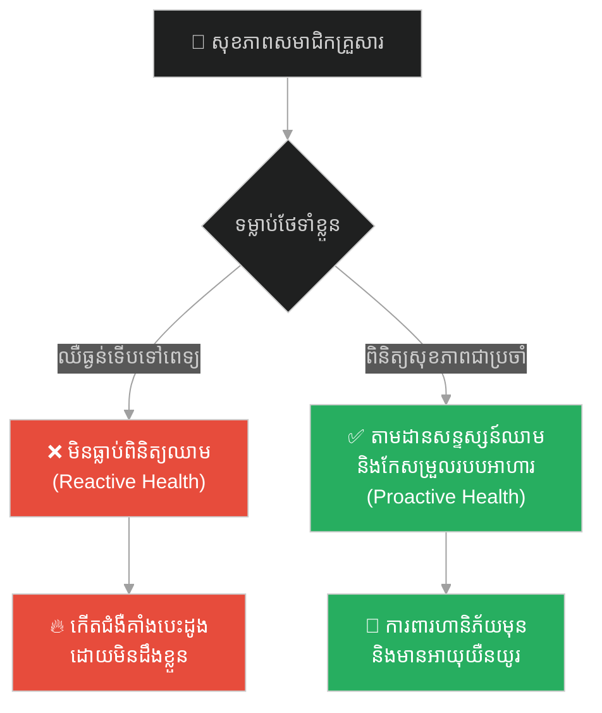
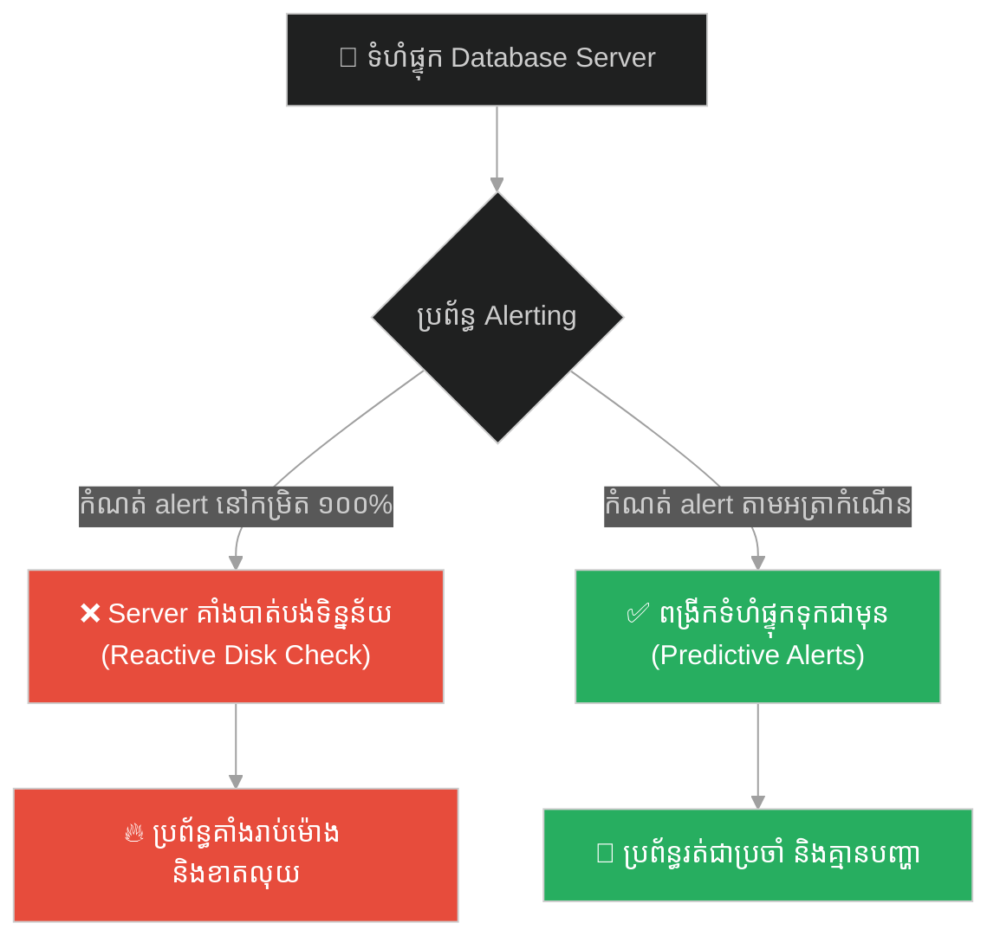
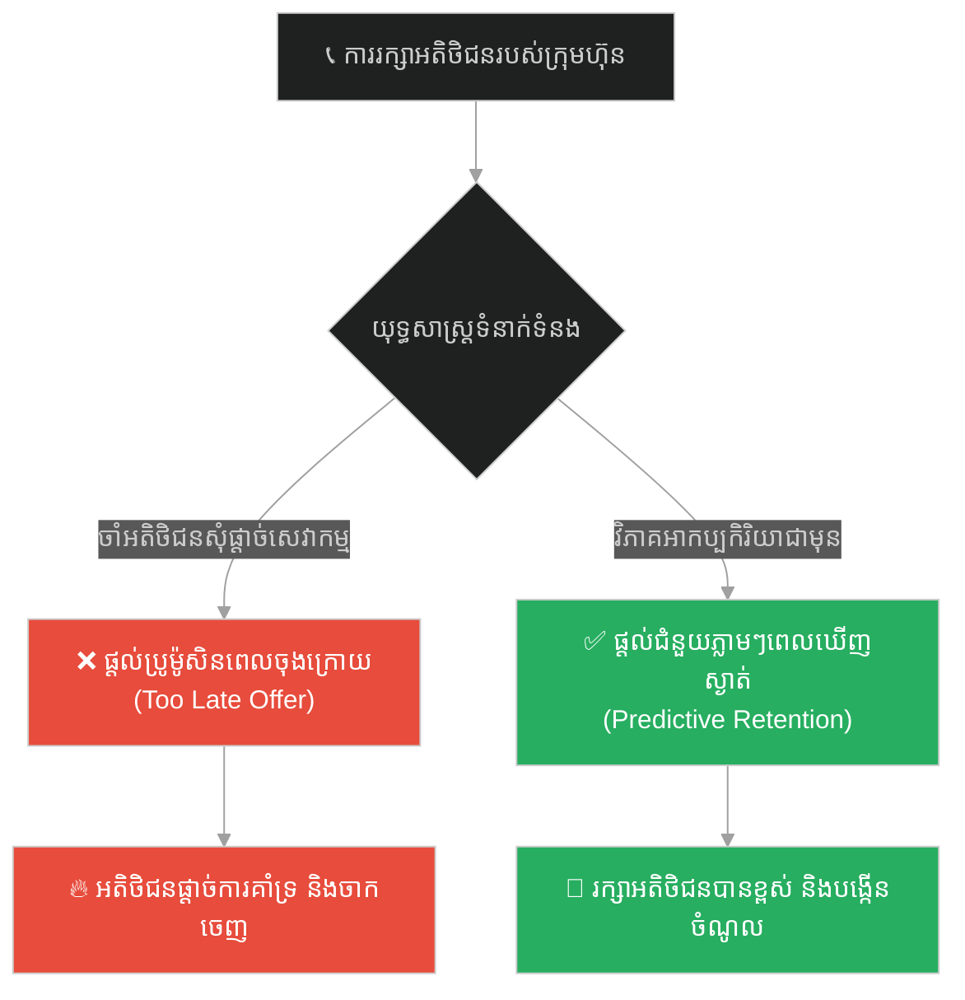
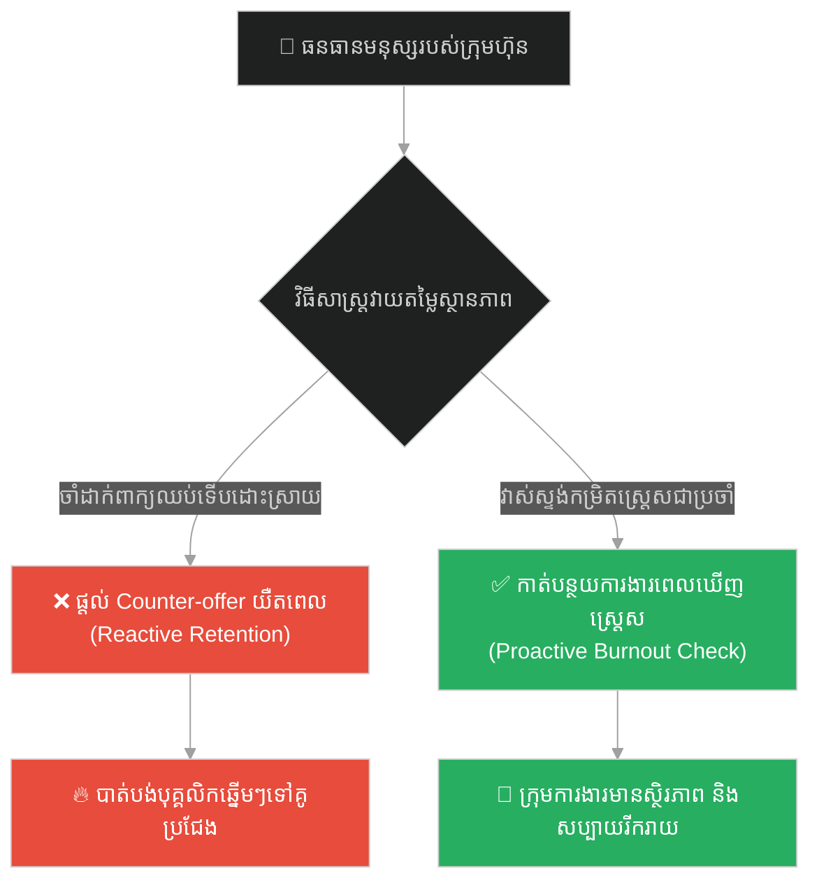
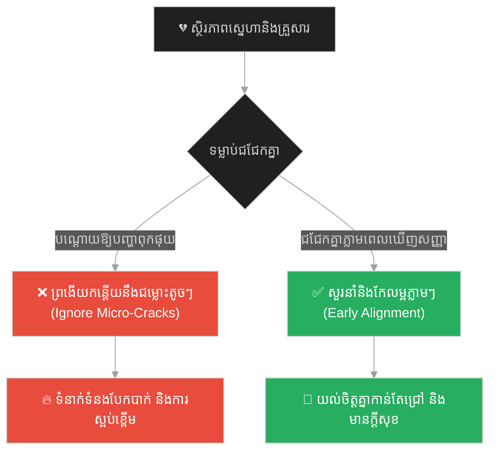
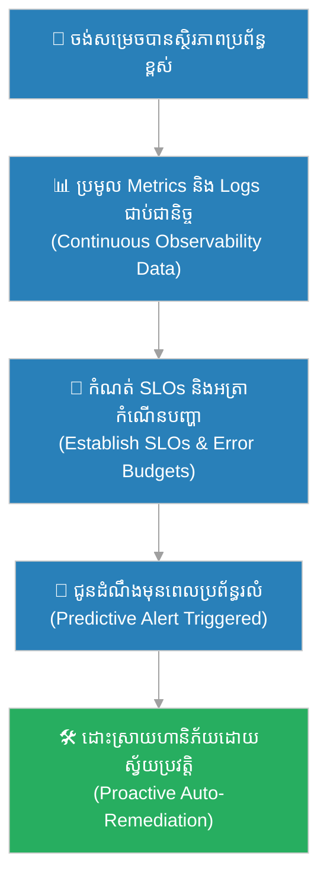

# Proactive Monitoring & Predictive Alerting (ការត្រួតពិនិត្យសកម្ម និងការជូនដំណឹងជាមុន)៖ ព្រះពុទ្ធ និងសេះទាំងបួន (Proactive Monitoring & Predictive Alerting & Buddha and the Four Horses)

**Author:** ichamrong  
**Date:** 2026-05-28  
**Tags:** #proactive-monitoring #alerting #devops #observability #predictive-analytics #buddhism  
**Category:** Concepts  
**Read Time:** ~15 min  

---

## 📌 មាតិកា (Table of Contents)
- [អន្ទាក់ផ្លូវចិត្ត (The Trap)](#0)
- [១. រឿងព្រេងប្រវត្តិសាស្ត្រ៖ ប្រភេទសេះទាំង ៤ (The Legend of the Four Horses)](#1)
  - [រំពាត់កាត់ស្បែក និងឆ្អឹង (The Pain of the Late Response)](#1-1)
- [២. បញ្ហា៖ ការដោះស្រាយបញ្ហាពេលកើតឡើងរួច និងភាពហត់នឿយក្នុងការបាញ់ពន្លត់ភ្លើង (The Issue: Reactive Firefighting & Alert Fatigue)](#2)
- [៣. ឧទាហរណ៍ជាក់ស្តែងក្នុងពិភពពិត (Real World Examples)](#3)
  - [ឧទាហរណ៍ទី ១ — កម្រិតស្រាល (គ្រួសារ)៖ ការថែទាំសុខភាពជាមុនមុនពេលកើតជំងឺធ្ងន់ធ្ងរ (Proactive Health Checkups)](#3-1)
  - [ឧទាហរណ៍ទី ២ — កម្រិតមធ្យម (បច្ចេកទេស)៖ ការជូនដំណឹងជាមុនអំពីទំហំផ្ទុកទិន្នន័យ (Predictive Disk Space Alerting)](#3-2)
  - [ឧទាហរណ៍ទី ៣ — កម្រិតមធ្យម (ធុរកិច្ច)៖ ការតាមដានអត្រាចាកចេញរបស់អតិថិជនជាមុន (Customer Churn Prevention)](#3-3)
  - [ឧទាហរណ៍ទី ៤ — កម្រិតមធ្យម (សង្គម/គ្រប់គ្រង)៖ ការវាស់ស្ទង់ការបាក់ទឹកចិត្តរបស់បុគ្គលិកជាប្រចាំ (Burnout Pulse Surveys)](#3-4)
  - [ឧទាហរណ៍ទី ៥ — កម្រិតធ្ងន់ (ទំនាក់ទំនង)៖ ការដោះស្រាយបញ្ហារកាំរកូសតូចៗមុនពេលបាក់បែក (Addressing Micro-Cracks Early)](#3-5)
- [៤. ដំណោះស្រាយទូទៅ៖ ស្ថាបត្យកម្មការសង្កេតការណ៍ និងការកំណត់លក្ខខណ្ឌ SLO/SLA (The General Solution: Observability Architecture & SLO/SLA Definitions)](#4)
- [សេចក្តីសន្និដ្ឋាន (Conclusion)](#5)
- [ឯកសារយោង (References)](#6)
- [Related Posts](#7)

---

<a id="0"></a>
## អន្ទាក់ផ្លូវចិត្ត (The Trap)

តើអ្នកធ្លាប់ដើរតួជា «អ្នកពន្លត់ភ្លើង (Firefighter)» នៅក្នុងគម្រោងរបស់អ្នកដែរឬទេ? ពោលគឺរង់ចាំទាល់តែ Server គាំង (Crash) ឬទិន្នន័យពេញ ១០០% ធ្វើឱ្យអតិថិជនប្រើប្រាស់មិនកើត ទើបនាំគ្នាស្រែកឆោឡោ និងដោះស្រាយទាំងភ័យស្លន់ស្លោ។

នេះគឺជា **The Reactive Firefighting Trap (អន្ទាក់នៃការដោះស្រាយបញ្ហាតែពេលវាកើតឡើងរួច)**។

* **[Side A (Reactive / Horse 4)]** — រង់ចាំទាល់តែមហន្តរាយកើតឡើងពិតប្រាកដ ឬប្រព័ន្ធដួលរលំ ទើបចាប់ផ្តើមធ្វើសកម្មភាពឆ្លើយតប។
* **[Side B (Proactive / Horse 1)]** — ត្រួតពិនិត្យ និងស្វែងរកសញ្ញាព្រមានដំបូងបង្អស់ (Early Warning Signs) រួចដោះស្រាយមុនពេលដែលបញ្ហានោះអាចបង្កការប៉ះពាល់ដល់អតិថិជន។

ផែនទីបង្ហាញផ្លូវសម្រាប់អត្ថបទនេះ៖
1. **រឿងព្រេងប្រវត្តិសាស្ត្រ (The Historic Legend)** — ប្រភេទសេះទាំង ៤ របស់ព្រះពុទ្ធ និងការឆ្លើយតបរបស់ពួកវាទៅនឹងរំពាត់របស់ម្ចាស់។
2. **បញ្ហាវិភាគ (The Issue)** — ការប្រៀបធៀបរវាងការដោះស្រាយបញ្ហាបែប Reactive និងការដំឡើងប្រព័ន្ធ Proactive Monitoring ក្នុង DevOps។
3. **ឧទាហរណ៍ជាក់ស្តែង (Real World Examples)** — ពិនិត្យមើលការអនុវត្តលើ ៥ កម្រិតដើម្បីការពារហានិភ័យមុនពេលវាយលុក។
4. **ដំណោះស្រាយទូទៅ (The General Solution)** — ការប្រើប្រាស់ Prometheus, Grafana និងការបង្កើតប្រព័ន្ធស្វែងរក Anomaly Detection។



---

<a id="1"></a>
## ១. រឿងព្រេងប្រវត្តិសាស្ត្រ៖ ប្រភេទសេះទាំង ៤ (The Legend of the Four Horses)

នៅក្នុងគម្ពីរ Bhadra Sutta ព្រះពុទ្ធបានបង្រៀនភិក្ខុទាំងឡាយអំពីរបៀបដែលសត្វលោកភ្ញាក់ខ្លួន និងរៀនសូត្រពីច្បាប់ធម្មជាតិ ដោយប្រៀបប្រដូចទៅនឹងសេះ ៤ ប្រភេទដែលត្រូវបានបង្ហាត់ដោយខ្សែរំពាត់៖

១. **សេះប្រភេទទី ១ (សេះដ៏ល្អឯក)៖**
គ្រាន់តែវា **ក្រឡេកឃើញស្រមោលរំពាត់** ហើរលើអាកាសភ្លាម វាក៏ដឹងពីចេតនារបស់ម្ចាស់ រួចចាប់ផ្តើមរត់យ៉ាងលឿន និងត្រឹមត្រូវបំផុតដោយមិនបាច់ឱ្យរំពាត់វាយត្រូវខ្លួនឡើយ។

២. **សេះប្រភេទទី ២ (សេះល្អបង្គួរ)៖**
ការឃើញស្រមោលមិនទាន់ធ្វើឱ្យវាភ្ញាក់ខ្លួនទេ លុះត្រាតែខ្សែរំពាត់ហោះមក **ប៉ះរោម ឬស្បែកខ្នងខាងក្រៅរបស់វាបន្តិច** ទើបវាដឹងខ្លួន ហើយរត់ទៅមុខភ្លាមៗ។

---

<a id="1-1"></a>
### រំពាត់កាត់ស្បែក និងឆ្អឹង (The Pain of the Late Response)

៣. **សេះប្រភេទទី ៣ (សេះមធ្យម)៖**
ទោះបីជាឃើញស្រមោល និងរំពាត់ប៉ះរោម ក៏វានៅតែមិនព្រមរត់ឡើយ លុះត្រាតែខ្សែរំពាត់ **វាយសង្កត់ចុះខ្លាំងរហូតដល់បែកស្បែកចេញឈាមដល់សាច់** ទើបវាព្រមរត់ទៅមុខដោយសារការឈឺចាប់។

៤. **សេះប្រភេទទី ៤ (សេះដ៏អាក្រក់បំផុត)៖**
ទោះបីជាឃើញស្រមោល វាយត្រូវស្បែក ឬបែកសាច់ក៏ដោយ ក៏វានៅតែរឹងទទឹងមិនរត់ដដែល លុះត្រាតែត្រូវគេ **វាយបុកចុះខ្លាំងរហូតដល់បាក់ឆ្អឹង ឬប៉ះពាល់ដល់ខួរឆ្អឹង** ទើបវារត់ ឬដួលសន្លប់នៅលើផ្លូវ។

ព្រះពុទ្ធមានសង្ឃដីកាពន្យល់ថា៖
> «មនុស្សយើងក៏ដូចគ្នាដែរ។ ខ្លះគ្រាន់តែឮគេថាមានអ្នកជិតខាងស្លាប់ ក៏ភ្ញាក់ខ្លួនប្រឹងធ្វើល្អ (សេះទី ១)។ ខ្លះទាល់តែឃើញពិធីបុណ្យសពផ្ទាល់ភ្នែកទើបដឹងខ្លួន (សេះទី ២)។ ខ្លះទាល់តែសមាជិកគ្រួសារផ្ទាល់ខ្លួនស្លាប់ទើបភ្ញាក់រលឹក (សេះទី ៣)។ ចំណែកខ្លះទៀត ទោះបីជាខ្លួនឯងឈឺដេកដួលរៀបស្លាប់ ក៏នៅតែមិនព្រមភ្ញាក់រលឹកធ្វើល្អដដែល (សេះទី ៤)។»

---

<a id="2"></a>
## ២. បញ្ហា៖ ការដោះស្រាយបញ្ហាពេលកើតឡើងរួច និងភាពហត់នឿយក្នុងការបាញ់ពន្លត់ភ្លើង (The Issue: Reactive Firefighting & Alert Fatigue)

នៅក្នុងបច្ចេកវិទ្យា ក្រុមការងារជាច្រើនគឺដូចជា «សេះប្រភេទទី ៤»។ ពួកគេមិនបង្កើតប្រព័ន្ធតាមដាន (Monitoring Systems) ដើម្បីជូនដំណឹងមុនឡើយ។ ពួកគេកំណត់ Alert ត្រឹមតែ `CPU_USAGE > 99%` ឬ `Disk_Space == 100%`។ នេះមានន័យថា នៅពេល Alert នោះបន្លឺឡើង គឺប្រព័ន្ធបានគាំងរួចទៅហើយ (Reactive Alerting)។

ផ្ទុយទៅវិញ វិស្វករប្រព័ន្ធដែលមានផ្នត់គំនិត Proactive (ដូចសេះទី ១) ប្រើប្រាស់ **Predictive Alerting (ការជូនដំណឹងជាមុនដោយគណនាទិន្នន័យ)** ដើម្បីរកមើលសន្ទុះកើនឡើងនៃបញ្ហា និងដោះស្រាយជាមុន។

សូមពិនិត្យមើលកូដ Python ខាងក្រោមដែលប្រៀបធៀបវិធីទាំងពីរ៖

### កូដប្រកាសអាសន្នយឺតពេល (Reactive Alerting - Horse 4)
```python
# ❌ កូដប្រកាសអាសន្នលុះត្រាតែ Disk ពេញ ១០០% (យឺតពេលហើយ)
def check_disk_reactive(disk_usage_percentage):
    if disk_usage_percentage >= 100.0:
        trigger_critical_alert("🔥 Disk is completely FULL! System is crashing!")
```

### កូដប្រកាសអាសន្នជាមុន (Proactive Predictive Alerting - Horse 1)
```python
# ✅ គណនាទិន្នន័យរកមើលនិន្នាការ ដើម្បីប្រកាសអាសន្នមុន ២៤ ម៉ោង
def check_disk_proactive(history_usages):
    """
    history_usages: បញ្ជីនៃទំហំប្រើប្រាស់គិតជា % ក្នុងរយៈពេល ១ ម៉ោងម្តង
    ឧទាហរណ៍៖ [70.1, 70.5, 71.0, 71.5]
    """
    if len(history_usages) < 2:
        return
    
    # គណនាអត្រាកំណើនជាមធ្យម (growth rate per hour)
    diffs = [history_usages[i] - history_usages[i-1] for i in range(1, len(history_usages))]
    average_growth_rate = sum(diffs) / len(diffs)
    
    current_usage = history_usages[-1]
    remaining_space = 100.0 - current_usage
    
    if average_growth_rate > 0:
        # គណនាម៉ោងដែលនៅសល់មុនពេល Disk ពេញ
        hours_remaining = remaining_space / average_growth_rate
        
        # ប្រសិនបើ Disk នឹងពេញក្នុងរយៈពេលតិចជាង ២៤ ម៉ោង ត្រូវផ្តល់ដំណឹងបន្ទាន់
        if hours_remaining < 24.0:
            trigger_warning_alert(
                f"⚠️ Predictive Alert: Disk will be full in {hours_remaining:.1f} hours! "
                f"Current: {current_usage}%, Growth: +{average_growth_rate:.2f}%/hour"
            )
```

---

<a id="3"></a>
## ៣. ឧទាហរណ៍ជាក់ស្តែងក្នុងពិភពពិត

---

<a id="3-1"></a>
### ឧទាហរណ៍ទី ១ — កម្រិតស្រាល (គ្រួសារ)៖ ការថែទាំសុខភាពជាមុនមុនពេលកើតជំងឺធ្ងន់ធ្ងរ (Proactive Health Checkups)

**ស្ថានភាព៖** ឪពុកម្នាក់ចង់ធានាថាសមាជិកគ្រួសារទាំងអស់មានសុខភាពល្អ និងរឹងមាំ។

* **ជម្រើសខុស (Reactive/Horse 4):** មិនដែលទៅពិនិត្យសុខភាពឡើយ រង់ចាំរហូតដល់មានអាការៈឈឺទ្រូងខ្លាំង ឬដួលសន្លប់ ទើបទៅសង្គ្រោះបន្ទាន់នៅមន្ទីរពេទ្យ។
* **ជម្រើសត្រូវ (Proactive/Horse 1):** ទៅពិនិត្យឈាម និងវាស់សម្ពាធឈាមជារៀងរាល់ឆ្នាំ (ស្រមោលរំពាត់)។ នៅពេលឃើញជាតិស្ករឡើងបន្តិច ក៏ចាប់ផ្តើមផ្លាស់ប្តូររបបអាហារភ្លាម។



---

<a id="3-2"></a>
### ឧទាហរណ៍ទី ២ — កម្រិតមធ្យម (បច្ចេកទេស)៖ ការជូនដំណឹងជាមុនអំពីទំហំផ្ទុកទិន្នន័យ (Predictive Disk Space Alerting)

**ស្ថានភាព៖** Database Server របស់ក្រុមហ៊ុនកំពុងផ្ទុកទិន្នន័យប្រតិបត្តិការហិរញ្ញវត្ថុដែលកើនឡើងរាល់វិនាទី។

* **ជម្រើសខុស (Reactive/Horse 4):** កំណត់ Alert តែពេល Disk full ធ្វើឱ្យ Database ឈប់ដំណើរការភ្លាមៗ និងបង្កការខូចខាតទិន្នន័យ។
* **ជម្រើសត្រូវ (Proactive/Horse 1):** កំណត់ Alert ដោយផ្អែកលើអត្រាកំណើនទិន្នន័យ (Disk growth velocity)។ បើទិន្នន័យនឹងពេញក្នុងរយៈពេល ២ ថ្ងៃ ត្រូវពង្រីកទំហំ (Auto-scale) ភ្លាម។



---

<a id="3-3"></a>
### ឧទាហរណ៍ទី ៣ — កម្រិតមធ្យម (ធុរកិច្ច)៖ ការតាមដានអត្រាចាកចេញរបស់អតិថិជនជាមុន (Customer Churn Prevention)

**ស្ថានភាព៖** ក្រុមហ៊ុនលក់សេវាកម្មទូរស័ព្ទ កំពុងបាត់បង់អ្នកប្រើប្រាស់ទៅកាន់គូប្រជែង។

* **ជម្រើសខុស (Reactive/Horse 4):** មិនធ្វើអ្វីឡើយ រហូតដល់អតិថិជនមកសុំផ្តាច់សេវាកម្ម ទើបព្យាយាមផ្តល់ការបញ្ចុះតម្លៃដើម្បីទាក់ទាញ (យឺតពេលហើយ)។
* **ជម្រើសត្រូវ (Proactive/Horse 1):** តាមដានអាកប្បកិរិយារបស់អ្នកប្រើប្រាស់ (ដូចជាការចុះថយនៃការចូលប្រើប្រាស់ ឬការត្អូញត្អែរលើ app) រួចទាក់ទងជួយដោះស្រាយបញ្ហាជាមុន។



---

<a id="3-4"></a>
### ឧទាហរណ៍ទី ៤ — កម្រិតមធ្យម (សង្គម/គ្រប់គ្រង)៖ ការវាស់ស្ទង់ការបាក់ទឹកចិត្តរបស់បុគ្គលិកជាប្រចាំ (Burnout Pulse Surveys)

**ស្ថានភាព៖** ក្រុមហ៊ុន Software មានអត្រាបុគ្គលិកសុំលាឈប់ពីការងារ (Attrition rate) កើនឡើងខ្ពស់។

* **ជម្រើសខុស (Reactive/Horse 4):** ដឹងខ្លួនតែពេលបុគ្គលិកសំខាន់ៗមកដាក់ពាក្យឈប់ពីការងារ រួចព្យាយាមដំឡើងប្រាក់ខែដើម្បីឃាត់ខ្លួន (Counter-offer)។
* **ជម្រើសត្រូវ (Proactive/Horse 1):** ធ្វើការស្ទង់មតិមិនបញ្ចេញឈ្មោះជារៀងរាល់ខែ ដើម្បីដឹងពីកម្រិតស្ត្រេស និងបរិមាណការងាររបស់បុគ្គលិក រួចកាត់បន្ថយបន្ទុកការងារភ្លាមៗ។



---

<a id="3-5"></a>
### ឧទាហរណ៍ទី ៥ — កម្រិតធ្ងន់ (ទំនាក់ទំនង)៖ ការដោះស្រាយបញ្ហារកាំរកូសតូចៗមុនពេលបាក់បែក (Addressing Micro-Cracks Early)

**ស្ថានភាព៖** ទំនាក់ទំនងប្តីប្រពន្ធចាប់ផ្តើមមានភាពរកាំរកូស និងមិនសូវនិយាយរកគ្នា។

* **ជម្រើសខុស (Reactive/Horse 4):** ព្រងើយកន្តើយនឹងជម្លោះតូចៗ រហូតដល់ទំនាក់ទំនងឈានដល់ដំណាក់កាលលែងលះ ឬស្អប់គ្នាខ្លាំង ទើបទៅរកសេវាប្រឹក្សាផ្លូវចិត្ត។
* **ជម្រើសត្រូវ (Proactive/Horse 1):** នៅពេលឃើញដៃគូមានទឹកមុខមិនសប្បាយចិត្ត ឬស្ងាត់ស្ងៀមខុសធម្មតា (ស្រមោលរំពាត់) គឺចាប់ផ្តើមបើកចិត្តជជែកពិភាក្សានិងដោះស្រាយជម្លោះនោះភ្លាមៗ។



---

<a id="4"></a>
## ៤. ដំណោះស្រាយទូទៅ៖ ស្ថាបត្យកម្មការសង្កេតការណ៍ និងការកំណត់លក្ខខណ្ឌ SLO/SLA (The General Solution: Observability Architecture & SLO/SLA Definitions)

ដើម្បីផ្លាស់ប្តូរប្រព័ន្ធការងារ និងជីវិតរបស់អ្នកឱ្យមានលក្ខណៈសកម្ម (Proactive) ចូរអនុវត្តជំហានខាងក្រោម៖

1. **បង្កើតសសរស្តម្ភទាំង ៣ នៃ Observability (Metrics, Logs, Traces)៖**
   ដំឡើងឧបករណ៍ដូចជា Prometheus (សម្រាប់ប្រមូល metrics), ElasticSearch (សម្រាប់រក្សាទុក logs) និង Jaeger (សម្រាប់តាមដាន traces) ដើម្បីស្វែងយល់ពីលំហូរការងាររបស់ប្រព័ន្ធយ៉ាងលម្អិត។
2. **កំណត់លក្ខខណ្ឌ SLO/SLA និងល្បឿនថយចុះ (Error Budget)៖**
   កំណត់កម្រិតដំណើរការដែលអាចទទួលយកបានជាមុន (ឧទាហរណ៍៖ Latency ត្រូវតែតិចជាង ២០០ms សម្រាប់ ៩៩% នៃអ្នកប្រើប្រាស់)។ នៅពេលដែល Error Budget ចាប់ផ្តើមថយចុះលឿន ក្រុមការងារត្រូវតែផ្អាកការអភិវឌ្ឍ Feature ថ្មី រួចផ្តោតលើការកែលម្អស្ថិរភាពប្រព័ន្ធជាបន្ទាន់។
3. **អនុវត្តការជូនដំណឹងផ្អែកលើគំរូ Anomaly Detection៖**
   កុំប្រើប្រាស់តួរលេខថេរ (Static thresholds) សម្រាប់ Alerting។ ចូរប្រើប្រាស់ algorithms ដើម្បីស្វែងរកចំណុចមិនប្រក្រតី (เช่น seasonal drops in traffic or spikes in execution duration) ដើម្បីជូនដំណឹងមុនពេលវាបង្កជាមហន្តរាយ។



---

## 🐇 ធ្លាក់ចូលក្នុងរន្ធទន្សាយ (Enter the Rabbit Hole)
ដើម្បីស្វែងយល់ពីរបៀបបង្កើតបរិយាកាសការងារដែលពោរពេញដោយសុវត្ថិភាពផ្លូវចិត្ត និងជួយឱ្យក្រុមការងារហ៊ានបញ្ចេញសមត្ថភាពពេញលេញ សូមបន្តដំណើរទៅកាន់៖

* 🚀 **[ចាប់ផ្តើមដំណើររុករក (Start the Journey) ➔ Psychological Safety & Positive Team Culture (សុវត្ថិភាពផ្លូវចិត្ត និងវប្បធម៌ក្រុមការងារវិជ្ជមាន)៖ ព្រះពុទ្ធ និងព្រះសង្ឃសើច](./155-buddha-and-the-laughing-monks.md)**

---

<a id="5"></a>
## សេចក្តីសន្និដ្ឋាន (Conclusion)

> **«សេះដ៏ល្អឯក គ្រាន់តែក្រឡេកឃើញស្រមោលខ្សែរំពាត់ វាក៏ចាប់ផ្តើមរត់ដោយខ្លួនឯងភ្លាម ព្រោះវាដឹងថាម្ចាស់ចង់ឱ្យវាទៅណា។»**

ការរស់នៅ និងការធ្វើការងារដោយរង់ចាំទាល់តែខ្សែរំពាត់នៃជីវិតវាយបំបាក់ឆ្អឹងទើបព្រមកែប្រែខ្លួន គឺជាការរស់នៅដ៏ប្រថុយប្រថាន និងរងទុក្ខវេទនាបំផុត។ នៅក្នុងការគ្រប់គ្រងប្រព័ន្ធព័ត៌មានវិទ្យា ក៏ដូចជាក្នុងជីវិតផ្ទាល់ខ្លួន ចូរធ្វើខ្លួនជា «សេះប្រភេទទី ១» ដែលពូកែសង្កេត និងមានភាពរហ័សរហួន។ តាមរយៈការដំឡើងប្រព័ន្ធតាមដានសកម្ម (Proactive Monitoring) និងការជូនដំណឹងជាមុន (Predictive Alerting) យើងអាចចៀសវាងរាល់មហន្តរាយទាំងឡាយ និងរក្សាដំណើរការជីវិតឱ្យរលូនល្អជានិច្ច។

---

<a id="6"></a>
## ឯកសារយោង (References)

* **Bhadra Sutta (AN 4.113)** — គម្ពីរពុទ្ធសាសនាស្តីពីសេះដ៏ល្អ ៤ ប្រភេទ និងមនុស្ស ៤ ប្រភេទ។
* **Beyer, B. et al.** — *Site Reliability Engineering: How Google Runs Production Systems* (2016). ទ្រឹស្តីស្តីពីការដំឡើងប្រព័ន្ធ Monitoring និង SLOs។
* **Limoncelli, T. A. et al.** — *The Practice of Cloud System Administration* (2014). យុទ្ធសាស្ត្រគ្រប់គ្រងប្រព័ន្ធព័ត៌មានវិទ្យាបែប Proactive។

---

<a id="7"></a>
## Related Posts

* **[Flow State & Deep Work (លំហូរការងារចិត្តសាស្ត្រ និងការផ្តោតអារម្មណ៍ស៊ីជម្រៅ)៖ ព្រះពុទ្ធ និងអ្នកសម្លាប់សត្វ](./153-buddha-and-the-butcher.md)**
* **[The Weaver and the Emperor's Robe (អ្នកត្បាញក្រណាត់ និងអាវធំព្រះរាជា)៖ គ្រោះថ្នាក់នៃការកាត់បន្ថយចំណាយលើផ្នែកសំខាន់ និងមហន្តរាយនៃការមើលរំលងតួនាទីតូចតាច](./16-the-weaver-and-the-emperors-robe.md)**
