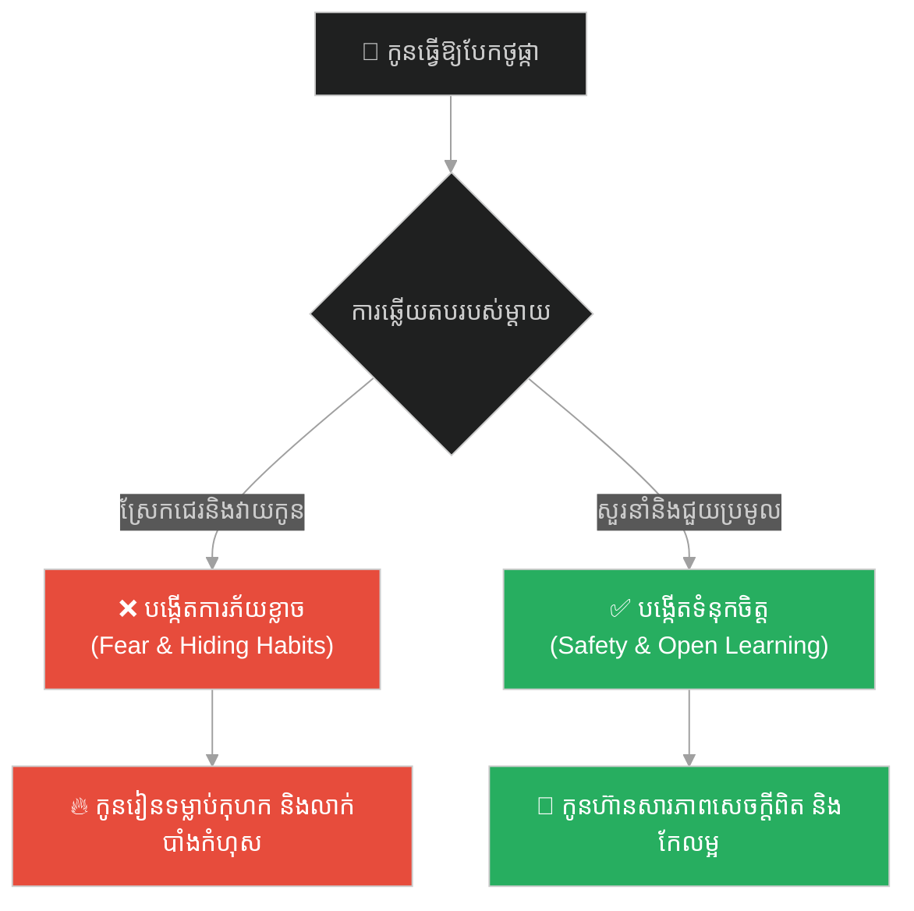
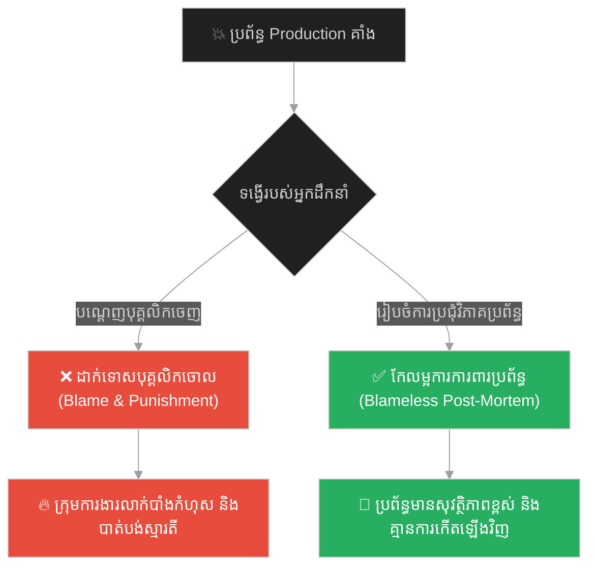
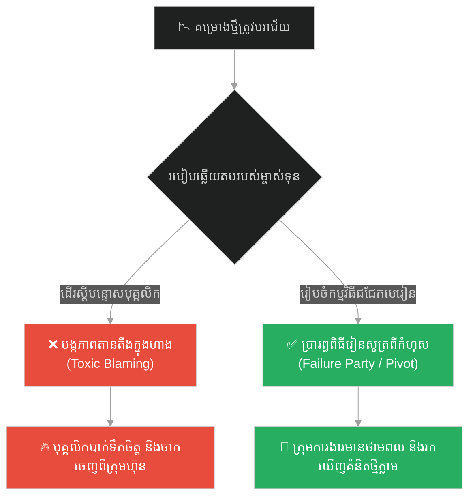
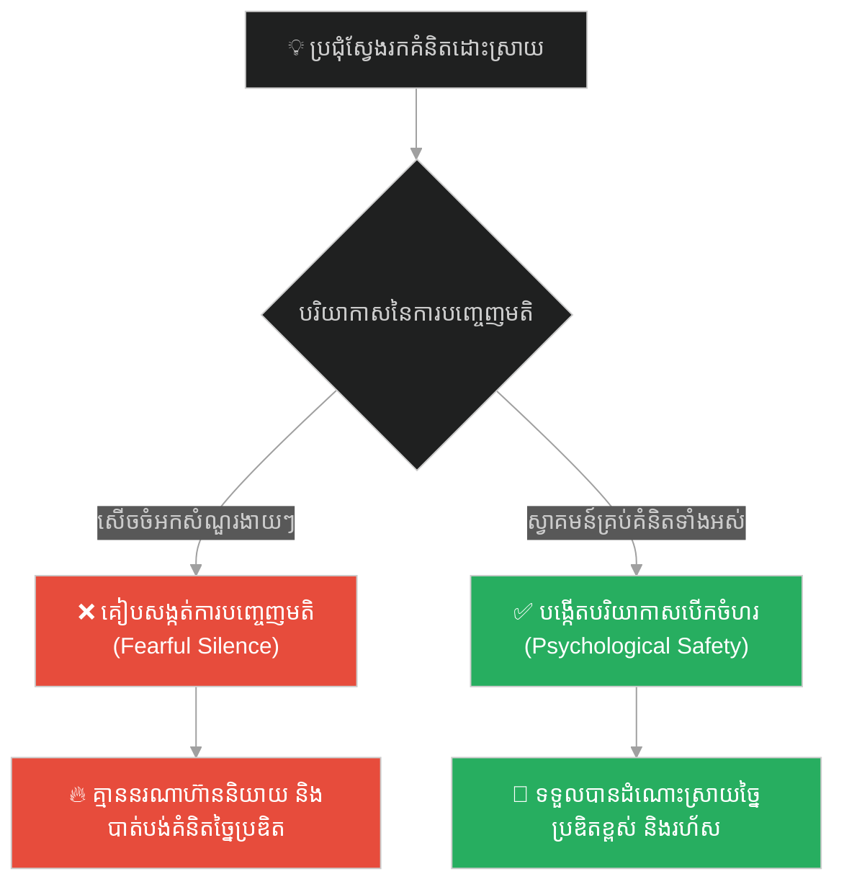
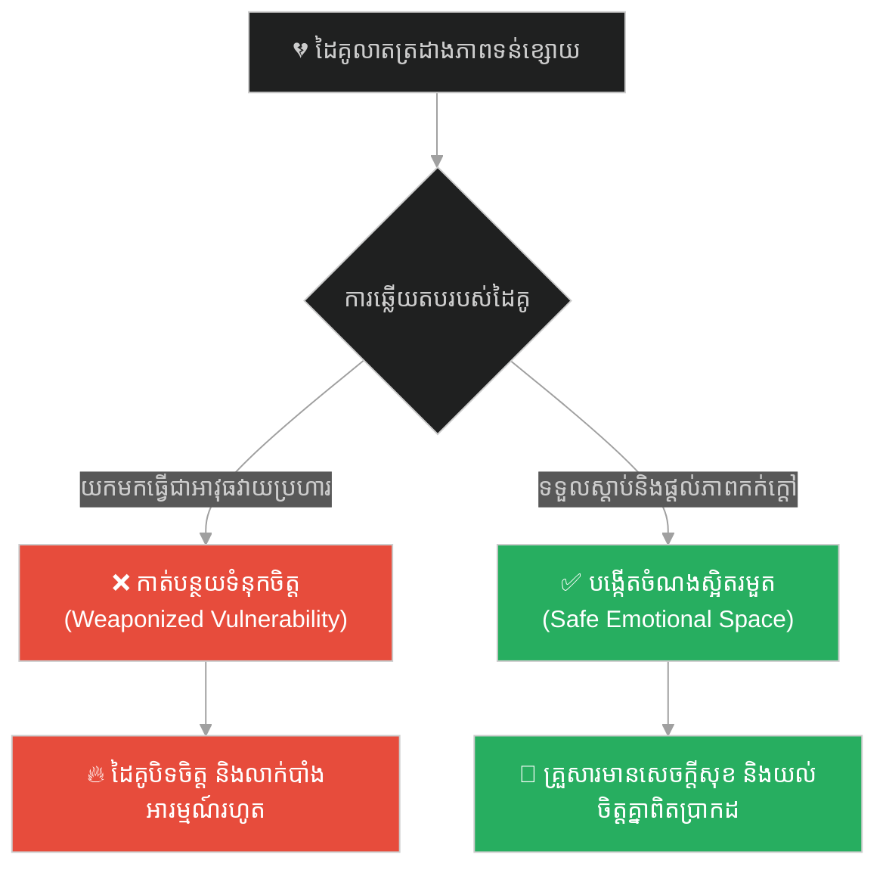
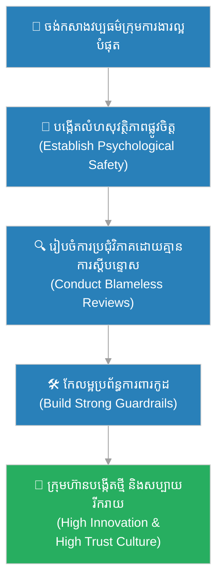

# Psychological Safety & Positive Team Culture (សុវត្ថិភាពផ្លូវចិត្ត និងវប្បធម៌ក្រុមការងារវិជ្ជមាន)៖ ព្រះពុទ្ធ និងព្រះសង្ឃសើច (Psychological Safety & Positive Team Culture & Buddha and the Laughing Monks)

**Author:** ichamrong  
**Date:** 2026-05-28  
**Tags:** #psychological-safety #team-culture #blameless #leadership #zen #software-engineering  
**Category:** Concepts  
**Read Time:** ~15 min  

---

## 📌 មាតិកា (Table of Contents)
- [អន្ទាក់ផ្លូវចិត្ត (The Trap)](#0)
- [១. រឿងព្រេងប្រវត្តិសាស្ត្រចិន៖ ព្រះសង្ឃសើចទាំងបី (The Legend of the Three Laughing Monks)](#1)
  - [ពិធីបុណ្យសពដែលពោរពេញដោយកាំជ្រួច (The Firecracker Cremation)](#1-1)
- [២. បញ្ហា៖ វប្បធម៌ស្តីបន្ទោស និងការលាក់បាំងកំហុសក្នុងក្រុមការងារ (The Issue: Blame Culture & Hidden Failures)](#2)
- [៣. ឧទាហរណ៍ជាក់ស្តែងក្នុងពិភពពិត (Real World Examples)](#3)
  - [ឧទាហរណ៍ទី ១ — កម្រិតស្រាល (គ្រួសារ)៖ ការឆ្លើយតបចំពោះកំហុសឆ្គងរបស់កូនៗ (Responding to Children's Mistakes)](#3-1)
  - [ឧទាហរណ៍ទី ២ — កម្រិតមធ្យម (បច្ចេកទេស)៖ ការទម្លាក់ប្រព័ន្ធ Production ដោយអចេតនា (Dropping Production DB Blamelessly)](#3-2)
  - [ឧទាហរណ៍ទី ៣ — កម្រិតមធ្យម (ធុរកិច្ច)៖ ការប្រារព្ធពិធីអបអរភាពបរាជ័យដើម្បីរៀនសូត្រ (Celebrating Pivots and Failure Parties)](#3-3)
  - [ឧទាហរណ៍ទី ៤ — កម្រិតមធ្យម (សង្គម/គ្រប់គ្រង)៖ ការបង្កើតបរិយាកាសបញ្ចេញមតិដោយគ្មានការភ័យខ្លាច (Ideation with No Stupid Questions)](#3-4)
  - [ឧទាហរណ៍ទី ៥ — កម្រិតធ្ងន់ (ទំនាក់ទំនង)៖ ការលាតត្រដាងភាពទន់ខ្សោយទៅកាន់ដៃគូ (Vulnerability and Non-Judgmental Space)](#3-5)
- [៤. ដំណោះស្រាយទូទៅ៖ ការកសាងសុវត្ថិភាពផ្លូវចិត្តតាមគំរូ Westrum (The General Solution: Cultivating Psychological Safety & Westrum Culture Model)](#4)
- [សេចក្តីសន្និដ្ឋាន (Conclusion)](#5)
- [ឯកសារយោង (References)](#6)
- [Related Posts](#7)

---

<a id="0"></a>
## អន្ទាក់ផ្លូវចិត្ត (The Trap)

តើអ្នកធ្លាប់ធ្វើការនៅក្នុងក្រុមមួយ ដែលរាល់ពេលមានកំហុសឆ្គងកើតឡើង គឺសមាជិកគ្រប់គ្នានាំគ្នាលាក់បាំង ភ័យខ្លាច និងទម្លាក់កំហុសដាក់គ្នាទៅវិញទៅមក (Finger-pointing) ដែរឬទេ?

នេះគឺជា **The Fear and Blame Trap (អន្ទាក់នៃវប្បធម៌ស្តីបន្ទោស និងការភ័យខ្លាច)**។

* **[Side A (Blame Culture)]** — ផ្តោតលើការរកជនល្មើសដើម្បីដាក់ទោស ឬស្តីបន្ទោស។ វានាំឱ្យសមាជិកក្រុមលាក់បាំង Bugs កុហកពីវឌ្ឍនភាព និងមិនហ៊ានបង្កើតថ្មីឡើយ។
* **[Side B (Psychological Safety)]** — បង្កើតបរិយាកាសសុវត្ថិភាព ដែលសមាជិកគ្រប់គ្នាមានសេរីភាពក្នុងការនិយាយ ការសាកសួរ និងការសារភាពកំហុស ដោយគ្មានការភ័យខ្លាចការសងសឹក ឬការមើលងាយ។

ផែនទីបង្ហាញផ្លូវសម្រាប់អត្ថបទនេះ៖
1. **រឿងព្រេងប្រវត្តិសាស្ត្រ (The Historic Legend)** — រឿងរ៉ាវរបស់ព្រះសង្ឃសើចទាំងបី (The Three Laughing Monks) ដែលផ្លាស់ប្តូរទុក្ខសោកជាសំណើច និងក្តីរីករាយ។
2. **បញ្ហាវិភាគ (The Issue)** — ការវិភាគទ្រឹស្តី Psychological Safety (គម្រោង Project Aristotle របស់ Google) និងការលាក់បាំងកំហុសបច្ចេកទេស។
3. **ឧទាហរណ៍ជាក់ស្តែង (Real World Examples)** — ពិនិត្យមើលអាកប្បកិរិយានេះលើ ៥ កម្រិតនៃជីវិត និងការគ្រប់គ្រង។
4. **ដំណោះស្រាយទូទៅ (The General Solution)** — ការអនុវត្ត Blameless Post-Mortems និងវប្បធម៌ Westrum Generative Culture។

```mermaid
%%{init: {
  'theme': 'dark',
  'themeVariables': {
    'background': '#1e1e1e',
    'primaryTextColor': '#ffffff',
    'lineColor': '#a0a0a0'
  },
  'themeCSS': 'svg { background-color: #1e1e1e !important; padding: 1rem !important; border-radius: 8px !important; } .edgeLabel rect { fill: #1e1e1e !important; } text, tspan { fill: #ffffff !important; }'
}}%%
graph TD
    A["💥 កំហុសធ្ងន់ធ្ងរកើតឡើង"] --> B{"វប្បធម៌ក្រុមការងារ"}
    B -- បែបស្តីបន្ទោស / ភ័យខ្លាច --> C["❌ ស្វែងរកអ្នកខុស<br/>និងដាក់ទោសជាសាធារណៈ<br/>(Blame & Silencing)"]
    B -- បែបសុវត្ថិភាពផ្លូវចិត្ត --> D["✅ វិភាគប្រព័ន្ធរួមគ្នា<br/>ដោយស្នាមញញឹម<br/>(Blameless Analysis)"]
    C --> E["🔥 បុគ្គលិកលាក់បាំងកំហុស<br/>និងប្រព័ន្ធកាន់តែរលួយ"]
    D --> F["🚀 ក្រុមហ៊ានអភិវឌ្ឍ<br/>និងប្រព័ន្ធរឹងមាំខ្លាំង"]
    style C fill:#e74c3c,color:#fff
    style D fill:#27ae60,color:#fff
    style E fill:#e74c3c,color:#fff
    style F fill:#27ae60,color:#fff
```



---

<a id="1"></a>
## ១. រឿងព្រេងប្រវត្តិសាស្ត្រចិន៖ ព្រះសង្ឃសើចទាំងបី (The Legend of the Three Laughing Monks)

កាលពីសម័យបុរាណ នៅក្នុងប្រទេសចិន មានព្រះសង្ឃហ្សេន ៣ អង្គដែលគ្មាននរណាដឹងពីឈ្មោះពិត ឬប្រវត្តិរបស់ពួកគាត់ឡើយ។ ពួកគាត់មិនដែលសម្តែងធម៌ មិនដែលសរសេរគម្ពីរ និងមិនដែលផ្តល់ការអប់រំជាពាក្យសម្តីសូម្បីមួយម៉ាត់។ អ្វីដែលពួកគាត់ធ្វើ គឺគ្រាន់តែដើររួមគ្នាពីភូមិមួយទៅភូមិមួយ ឈរនៅកណ្តាលផ្សារ រួចចាប់ផ្តើម **សើចរួមគ្នាខ្លាំងៗ**។

សំណើចរបស់ពួកគាត់មានលក្ខណៈបរិសុទ្ធ ស្មោះត្រង់ និងពោរពេញដោយក្តីរីករាយយ៉ាងខ្លាំង រហូតធ្វើឱ្យអ្នកភូមិដែលកំពុងតានតឹង ឈ្លោះប្រកែកគ្នា ឬកើតទុក្ខ ក៏ចាប់ផ្តើមញញឹម និងសើចតាមពួកគាត់ដែរ។ ក្នុងរយៈពេលត្រឹមតែប៉ុន្មាននាទី ផ្សារទាំងមូលក៏ប្រែជាពោរពេញដោយសំណើច និងមិត្តភាព។

---

<a id="1-1"></a>
### ពិធីបុណ្យសពដែលពោរពេញដោយកាំជ្រួច (The Firecracker Cremation)

ច្រើនឆ្នាំកន្លងផុតទៅ ពេលពួកគាត់ធ្វើដំណើរទៅដល់ភូមិមួយ ស្រាប់តែព្រះសង្ឃមួយអង្គបានទទួលមរណភាព។ អ្នកភូមិគិតថា៖
> «លើកនេះ ព្រះសង្ឃពីរអង្គទៀតច្បាស់ជាយំសោកសង្រេង និងយំសោកបាត់បង់មិត្តភក្តិជាមិនខាន។»

ប៉ុន្តែនៅពេលពួកគេទៅដល់ បែរជាឃើញព្រះសង្ឃពីរអង្គដែលនៅរស់ កំពុងឈររាំ និងសើចយ៉ាងសប្បាយរីករាយជាងពេលណាៗទាំងអស់នៅក្បែរសាកសពមិត្តរបស់ខ្លួន។ អ្នកភូមិខឹងខ្លាំងណាស់ ក៏សួរថា៖
> «ហេតុអ្វីបានជាលោកទាំងពីរគ្មានចិត្តមេត្តា និងសើចចំអកដាក់មរណភាពរបស់មិត្តខ្លួនឯងបែបនេះ?»

ព្រះសង្ឃទាំងពីរឆ្លើយថា៖
> «ពួកយើងសើច ព្រោះគាត់បានយកឈ្នះពួកយើង! គាត់បានលាចាកលោកនេះទៅមុនដោយក្តីរីករាយ។ សាកសពរបស់គាត់ គឺគ្រាន់តែជាអាវចាស់ប៉ុណ្ណោះ។»

សូម្បីតែមុនពេលដុតសព ព្រះសង្ឃដែលស្លាប់នោះបានផ្តាំមិនឱ្យផ្លាស់ប្តូរសម្លៀកបំពាក់គាត់ឡើយ។ នៅពេលដែលភ្លើងត្រូវបានដុតឆេះឡើង ស្រាប់តែមានសំឡេងផ្ទុះផាវ និងកាំជ្រួចចម្រុះពណ៌ហោះចេញពីក្នុងសម្លៀកបំពាក់របស់គាត់ ដែលគាត់បានលាក់ទុកមុនពេលស្លាប់។

ទិដ្ឋភាពនោះធ្វើឱ្យពិធីបុណ្យសពដ៏សោកសៅ ប្រែទៅជាពិធីពិព័រណ៍កាំជ្រួចដ៏អស្ចារ្យ និងពោរពេញដោយស្នាមញញឹម។ អ្នកភូមិទាំងអស់ក៏ចាប់ផ្តើមសើចជាមួយព្រះសង្ឃទាំងពីរ។ នេះបង្ហាញថា សូម្បីតែសេចក្តីស្លាប់ដ៏គួរឱ្យខ្លាច ក៏អាចត្រូវបានផ្លាស់ប្តូរទៅជាសេចក្តីរីករាយបានដែរ ប្រសិនបើយើងមានបរិយាកាសសុវត្ថិភាពផ្លូវចិត្ត និងមិនយករឿងគ្រប់យ៉ាងមកធ្វើជាបន្ទុកធ្ងន់ធ្ងរពេក។

---

<a id="2"></a>
## ២. បញ្ហា៖ វប្បធម៌ស្តីបន្ទោស និងការលាក់បាំងកំហុសក្នុងក្រុមការងារ (The Issue: Blame Culture & Hidden Failures)

នៅក្នុងការសរសេរកូដ ប្រសិនបើប្រព័ន្ធគ្រប់គ្រងការងារប្រើប្រាស់វិធីសាស្ត្រស្តីបន្ទោស (Blame Culture) វិស្វករនឹងព្យាយាមសរសេរកូដរញ៉េរញ៉ៃដើម្បីការពារខ្លួន ឬលាក់បាំងបញ្ហាក្រោមគ្រែ (Catch-and-Silence) ដើម្បីកុំឱ្យប្រធានស្តីបន្ទោស។

សូមប្រៀបធៀបរបៀបគ្រប់គ្រង Error ក្នុងទម្រង់ទាំងពីរ៖

### ការលាក់បាំងកំហុសដោយការភ័យខ្លាច (Fear-based Silent Error Handling)
```typescript
// ❌ កំហុសត្រូវបានចាប់ និងលាក់ចោល ព្រោះខ្លាចអ្នកគ្រប់គ្រងស្តីបន្ទោស
async function processPaymentLegacy(payment: any) {
    try {
        await bankApi.charge(payment.amount);
    } catch (error) {
        // លាក់បាំងកំហុស និងបន្លំថាដំណើរការបានជោគជ័យ
        console.log("Nothing to see here, system is fine..."); 
        // ធ្វើឱ្យទិន្នន័យក្នុង Database ខុសឆ្គង តែគ្មាននរណាដឹង
    }
}
```

### ការរាយការណ៍កំហុសដោយភាពជឿជាក់ និងមានប្រព័ន្ធការពារ (Blameless & Safe Error Handling)
```typescript
// ✅ កំហុសត្រូវបានកត់ត្រាយ៉ាងលម្អិត និងស្វែងរកដំណោះស្រាយជាប្រព័ន្ធ
interface Payment {
    id: string;
    amount: number;
}

export class SafePaymentProcessor {
    constructor(private logger: LoggerInterface, private metrics: MetricsInterface) {}

    public async processPayment(payment: Payment): Promise<void> {
        try {
            await bankApi.charge(payment.amount);
            this.metrics.incrementCounter("payment.success");
        } catch (error: any) {
            // កត់ត្រា Logs យ៉ាងច្បាស់លាស់ ដោយគ្មានការភ័យខ្លាច
            this.logger.error(`Payment failed for ID: ${payment.id}. Details: ${error.message}`);
            this.metrics.incrementCounter("payment.failed");
            
            // ដាក់ទិន្នន័យចូលក្នុង Dead Letter Queue ដើម្បីដោះស្រាយជាប្រព័ន្ធជាក្រោយ
            await queueService.moveToDeadLetterQueue(payment, error);
            
            // មិនចាំបាច់ស្វែងរកអ្នកខុស តែផ្តោតលើការសង្គ្រោះទិន្នន័យដោយសុវត្ថិភាព
        }
    }
}
```

---

<a id="3"></a>
## ៣. ឧទាហរណ៍ជាក់ស្តែងក្នុងពិភពពិត

---

<a id="3-1"></a>
### ឧទាហរណ៍ទី ១ — កម្រិតស្រាល (គ្រួសារ)៖ ការឆ្លើយតបចំពោះកំហុសឆ្គងរបស់កូនៗ (Responding to Children's Mistakes)

**ស្ថានភាព៖** កូនប្រុសតូចម្នាក់បានលេងរត់ដួល បណ្តាលឱ្យធ្លាក់បែកថូផ្កាដ៏មានតម្លៃមួយនៅក្នុងផ្ទះ។

* **ជម្រើសខុស (Blame/Fear):** ម្តាយស្រែកជេរប្រមាថ និងវាយធ្វើបាបកូនភ្លាមៗ (កូនរៀនសូត្របានថា៖ «រាល់ពេលធ្វើខុស ត្រូវតែកុហក ឬលាក់បាំង ដើម្បីកុំឱ្យត្រូវរំពាត់»)។
* **ជម្រើសត្រូវ (Psychological Safety):** ម្តាយឱនមកសួរដោយស្នាមញញឹម៖ «តើកូនមានត្រូវរបួសត្រង់ណាទេ?» រួចសហការជាមួយកូនប្រមូលបំណែកថូផ្កា និងបង្រៀនកូនពីវិធីលេងដោយសុវត្ថិភាព។



---

<a id="3-2"></a>
### ឧទាហរណ៍ទី ២ — កម្រិតមធ្យម (បច្ចេកទេស)៖ ការទម្លាក់ប្រព័ន្ធ Production ដោយអចេតនា (Dropping Production DB Blamelessly)

**ស្ថានភាព៖** Junior Developer ម្នាក់បានច្រឡំរត់ Command លុបទិន្នន័យនៅលើម៉ាស៊ីន Production ធ្វើឱ្យប្រព័ន្ធក្រុមហ៊ុនគាំង ៣ ម៉ោង។

* **ជម្រើសខុស (Blame Culture):** CTO បណ្តេញបុគ្គលិកនោះចេញជាសាធារណៈ ដើម្បីបង្ហាញគំរូ (ធ្វើឱ្យ Developers ដទៃលែងហ៊ានធ្វើការលើ Production និងលែងហ៊ានសារភាពកំហុស)។
* **ជម្រើសត្រូវ (Blameless Post-Mortem):** CTO ដឹកនាំការប្រជុំវិភាគប្រព័ន្ធ និងសួរថា៖ «ហេតុអ្វីបានជាប្រព័ន្ធអនុញ្ញាតឱ្យ Junior ចូលរត់ command គ្រោះថ្នាក់លើ Production បានយ៉ាងងាយបែបនេះ?» រួចផ្លាស់ប្តូរ Permissions និងបន្ថែមសន្តិសុខប្រព័ន្ធ (Guardrails)។



---

<a id="3-3"></a>
### ឧទាហរណ៍ទី ៣ — កម្រិតមធ្យម (ធុរកិច្ច)៖ ការប្រារព្ធពិធីអបអរភាពបរាជ័យដើម្បីរៀនសូត្រ (Celebrating Pivots and Failure Parties)

**ស្ថានភាព៖** ក្រុមហ៊ុន Startup បានចំណាយថវិការួមគ្នាអភិវឌ្ឍ Feature ថ្មីអស់រយៈពេល ៦ ខែ ប៉ុន្តែគ្មានអតិថិជនប្រើប្រាស់ទាល់តែសោះ។

* **ជម្រើសខុស (Blame Strategy):** Founder បន្ទោសផ្នែករចនាម៉ូត និងផ្នែកលក់ថាគ្មានសមត្ថភាព ធ្វើឱ្យបរិយាកាសក្រុមហ៊ុនមានភាពតានតឹងខ្លាំង។
* **ជម្រើសត្រូវ (Failure Party):** ក្រុមហ៊ុនរៀបចំកម្មវិធីជួបជុំសប្បាយរីករាយមួយ (Failure party) ដើម្បីចែករំលែកមេរៀនដែលទទួលបានពីការខាតបង់នោះ រួចប្តូរទិសដៅ (Pivot) ទៅធ្វើការងារថ្មីដោយភាពស្រស់ស្រាយ។



---

<a id="3-4"></a>
### ឧទាហរណ៍ទី ៤ — កម្រិតមធ្យម (សង្គម/គ្រប់គ្រង)៖ ការបង្កើតបរិយាកាសបញ្ចេញមតិដោយគ្មានការភ័យខ្លាច (Ideation with No Stupid Questions)

**ស្ថានភាព៖** ក្រុមការងារកំពុងស្វែងរកដំណោះស្រាយសម្រាប់បញ្ហាស្ទះលំហូរការងារទិន្នន័យ (Data Pipeline Congestion)។

* **ជម្រើសខុស (Intimidation Culture):** អ្នកគ្រប់គ្រងសើចចំអក ឬស្តីបន្ទោសរាល់ពេលមានសមាជិកលើកឡើងនូវគំនិតសាមញ្ញៗ ឬសំណួរងាយៗ។
* **ជម្រើសត្រូវ (Safe Brainstorming):** លើកទឹកចិត្តឱ្យមានការលើកឡើងនូវគំនិតគ្រប់ប្រភេទ និងអនុវត្តគោលការណ៍ «គ្មានសំណួរណាដែលល្ងង់ខ្លៅឡើយ» (No stupid questions) ដើម្បីទាញយកទស្សនៈចម្រុះ។



---

<a id="3-5"></a>
### ឧទាហរណ៍ទី ៥ — កម្រិតធ្ងន់ (ទំនាក់ទំនង)៖ ការលាតត្រដាងភាពទន់ខ្សោយទៅកាន់ដៃគូ (Vulnerability and Non-Judgmental Space)

**ស្ថានភាព៖** ប្តីប្រពន្ធមួយគូចង់ពង្រឹងភាពស្និទ្ធស្នាល និងយល់ចិត្តគ្នាឱ្យកាន់តែស៊ីជម្រៅ។

* **ជម្រើសខុស (Judgmental Response):** នៅពេលម្នាក់សារភាពពីភាពភ័យខ្លាច ឬកំហុសអតីតកាល ម្នាក់ទៀតយកចំណុចនោះមកសើចចំអក ឬចាក់ដោតនៅពេលឈ្លោះគ្នាលើកក្រោយ។
* **ជម្រើសត្រូវ (Non-Judgmental Listening):** ទទួលស្គាល់ និងឱបក្រសោបភាពទន់ខ្សោយរបស់ដៃគូ ដោយរក្សាវាជាការសម្ងាត់ និងជួយគ្នាឱ្យឆ្លងកាត់ការលំបាកនោះដោយក្តីស្រឡាញ់។



---

<a id="4"></a>
## ៤. ដំណោះស្រាយទូទៅ៖ ការកសាងសុវត្ថិភាពផ្លូវចិត្តតាមគំរូ Westrum (The General Solution: Cultivating Psychological Safety & Westrum Culture Model)

ដើម្បីផ្លាស់ប្តូរវប្បធម៌ក្រុមការងាររបស់អ្នកឱ្យទៅជាប្រភេទ **Generative Culture** ស្របតាមស្តង់ដាររបស់ Westrum ចូរអនុវត្តជំហានខាងក្រោម៖

1. **លុបបំបាត់ការដាក់ទោសចំពោះកំហុសឆ្គង (Eliminate Punitive Systems)៖**
   ចាត់ទុកកំហុសជាព័ត៌មានដ៏មានតម្លៃសម្រាប់កែលម្អប្រព័ន្ធ (Errors as operational feedback) មិនមែនជាការបង្ហាញពីអសមត្ថភាពរបស់បុគ្គលឡើយ។
2. **អនុវត្តការប្រជុំវិភាគកំហុសដោយគ្មានការស្តីបន្ទោស (Blameless Post-Mortems)៖**
   នៅពេលកើតមានបញ្ហា ត្រូវផ្តោតសំណួរលើ៖ *«តើព័ត៌មានអ្វីខ្លះដែលបុគ្គលិកខ្វះខាតនៅពេលសម្រេចចិត្ត? តើប្រព័ន្ធការពាររបស់យើងមានចន្លោះប្រហោងត្រង់ណា?»* ជំនួសឱ្យសំណួរថា *«តើនរណាជាអ្នកធ្វើឱ្យខូច?»*។
3. **លើកទឹកចិត្តឱ្យមានការលាតត្រដាងភាពទន់ខ្សោយពីសំណាក់អ្នកដឹកនាំ (Lead with Vulnerability)៖**
   អ្នកដឹកនាំត្រូវតែហ៊ានទទួលស្គាល់កំហុសផ្ទាល់ខ្លួន និងសើចនឹងកំហុសរបស់ខ្លួនជាមុន ដើម្បីបង្ហាញគំរូដល់សមាជិកក្រុមថា «ការធ្វើខុស គឺជារឿងធម្មតា និងជាផ្លូវទៅរកការរៀនសូត្រ»។



---

## 🐇 ធ្លាក់ចូលក្នុងរន្ធទន្សាយ (Enter the Rabbit Hole)
ដើម្បីស្វែងយល់ពីរបៀបដែលបញ្ហាតូចតាចបំផុត ឬការព្រងើយកន្តើយនឹងព័ត៌មានព្រមានតូចៗ អាចបំផ្លាញគម្រោងដ៏ធំធេងទាំងមូលរបស់អ្នក សូមបន្តដំណើរទៅកាន់៖

* 🚀 **[ចាប់ផ្តើមដំណើររុករក (Start the Journey) ➔ Micro-optimizations & Lint Warnings (ការកែលម្អកម្រិតមីក្រូ និងការព្រមានពី Linters)៖ ព្រះពុទ្ធ និងគ្រួសក្នុងស្បែកជើង](./156-buddha-and-the-pebble-in-the-shoe.md)**

---

<a id="5"></a>
## សេចក្តីសន្និដ្ឋាន (Conclusion)

> **«ពួកយើងសើច ព្រោះគាត់បានយកឈ្នះពួកយើង! គាត់បានលាចាកលោកទៅមុនដោយក្តីរីករាយ។»**

ព្រះសង្ឃសើចទាំងបី មិនដែលបង្រៀនធម៌ដោយពាក្យសម្តីឡើយ តែពួកគាត់បានផ្លាស់ប្តូរពិភពលោកតាមរយៈការបង្កើត «បរិយាកាសកក់ក្តៅ និងសំណើច»។ នៅក្នុងវិស្វកម្មប្រព័ន្ធ ឬការគ្រប់គ្រងស្ថាប័ន ការព្យាយាមបង្កើតវិន័យតឹងតែង និងការគំរាមកំហែង មានតែធ្វើឱ្យប្រព័ន្ធកាន់តែទន់ខ្សោយ និងបាត់បង់ការច្នៃប្រឌិត។ ផ្ទុយទៅវិញ តាមរយៈការបង្កើតសុវត្ថិភាពផ្លូវចិត្ត (Psychological Safety) និងការចេះសើចរៀនសូត្រពីកំហុសរួមគ្នា យើងអាចកសាងវប្បធម៌ក្រុមការងារដ៏វិជ្ជមាន រឹងមាំ និងសម្រេចបាននូវស្នាដៃធំធេងដោយភាពរីករាយបំផុត។

---

<a id="6"></a>
## ឯកសារយោង (References)

* **Edmondson, A. C.** — *The Fearless Organization: Creating Psychological Safety in the Workplace for Learning, Innovation, and Growth* (2018). សៀវភៅណែនាំស្តីពីសុវត្ថិភាពផ្លូវចិត្តក្នុងស្ថាប័ន។
* **Google's Project Aristotle** — *What Google Learned From Its Quest to Build the Perfect Team* (2015). ការស្រាវជ្រាវរបស់ Google អំពីកត្តាជោគជ័យរបស់ក្រុមការងារ។
* **Westrum, R.** — *A Typology of Organisational Cultures* (2004). គំរូវប្បធម៌ការងារទាំង ៣ ប្រភេទ។

---

<a id="7"></a>
## Related Posts

* **[Proactive Monitoring & Predictive Alerting (ការត្រួតពិនិត្យសកម្ម និងការជូនដំណឹងជាមុន)៖ ព្រះពុទ្ធ និងសេះទាំងបួន](./154-buddha-and-the-four-horses.md)**
* **[The Weaver and the Emperor's Robe (អ្នកត្បាញក្រណាត់ និងអាវធំព្រះរាជា)៖ គ្រោះថ្នាក់នៃការកាត់បន្ថយចំណាយលើផ្នែកសំខាន់ និងមហន្តរាយនៃការមើលរំលងតួនាទីតូចតាច](./16-the-weaver-and-the-emperors-robe.md)**
