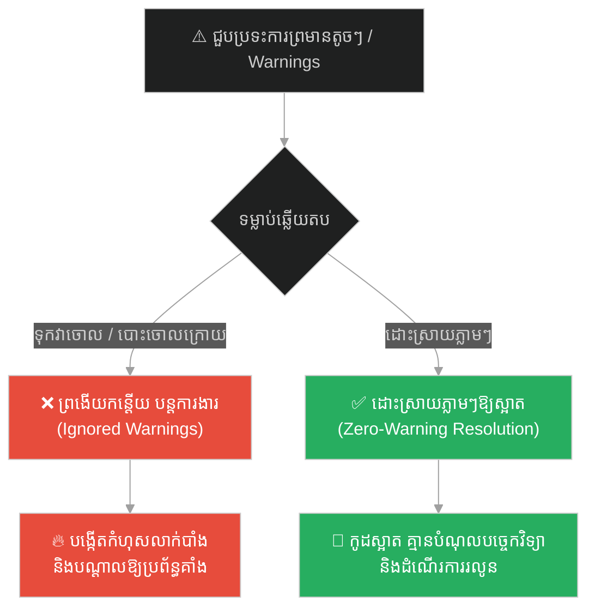
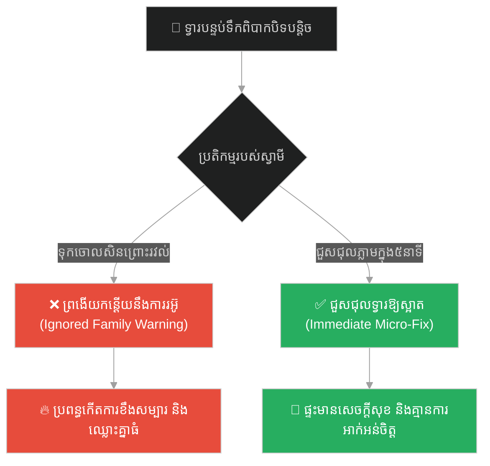
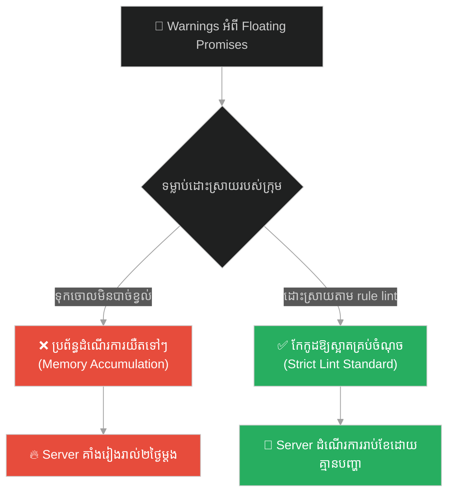
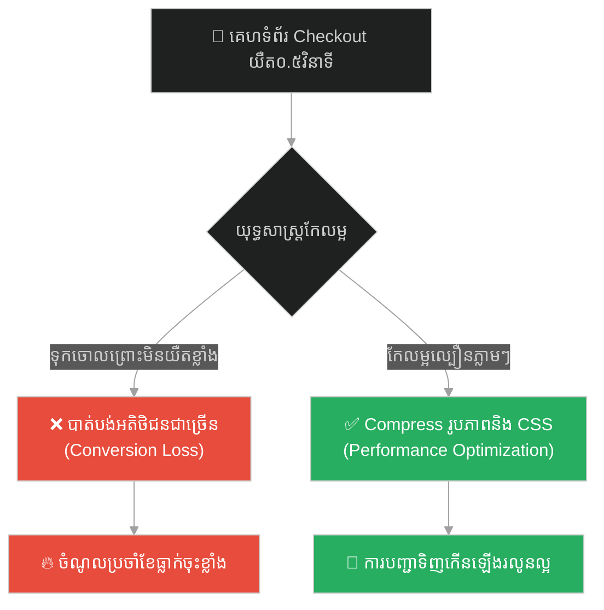
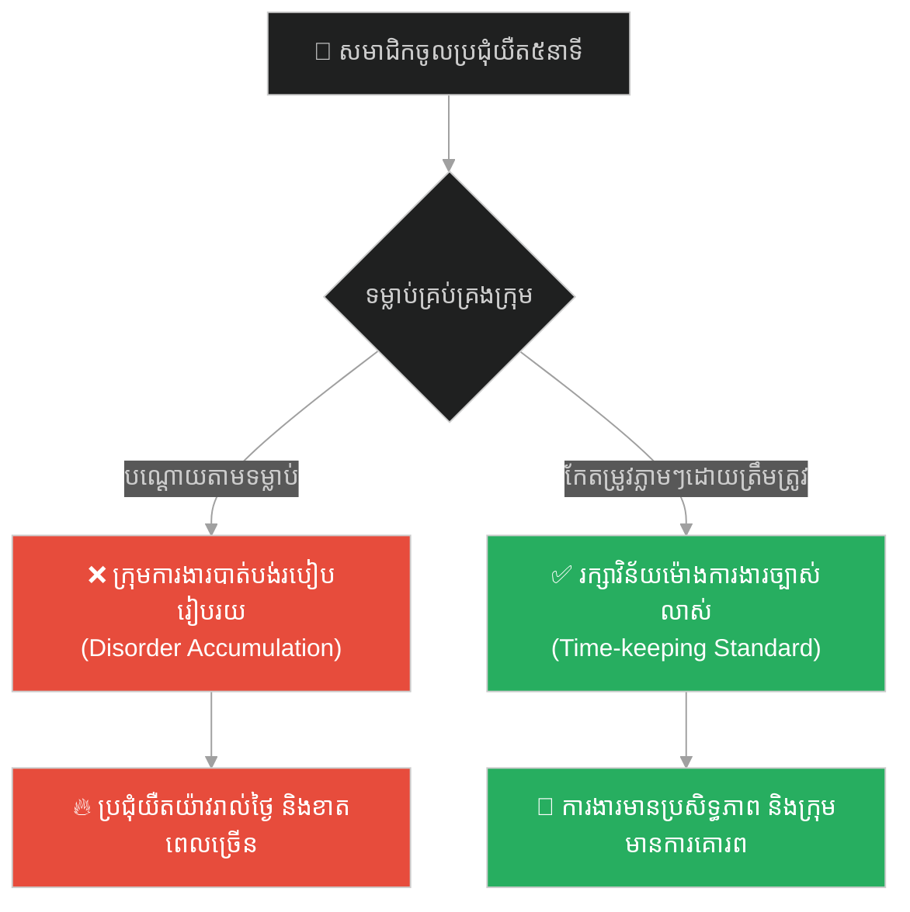
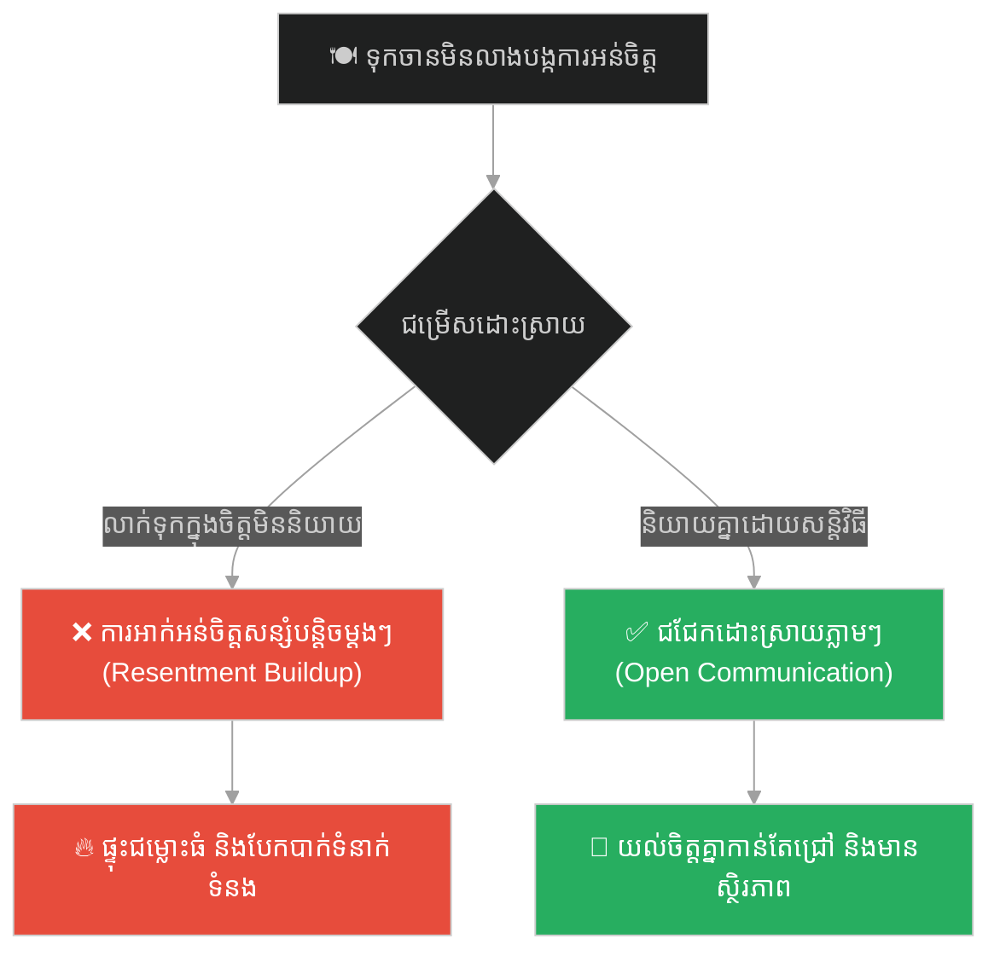
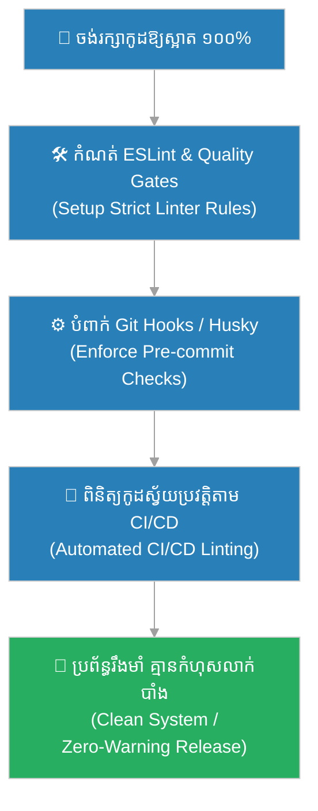

# Micro-optimizations & Lint Warnings (ការកែលម្អកម្រិតមីក្រូ និងការព្រមានពី Linters)៖ ព្រះពុទ្ធ និងគ្រួសក្នុងស្បែកជើង (Micro-optimizations & Lint Warnings & Buddha and the Pebble in the Shoe)

**Author:** ichamrong  
**Date:** 2026-05-28  
**Tags:** #micro-optimizations #lint-warnings #eslint #clean-code #quality-gates #software-engineering  
**Category:** Concepts  
**Read Time:** ~15 min  

---

## 📌 មាតិកា (Table of Contents)
- [អន្ទាក់ផ្លូវចិត្ត (The Trap)](#0)
- [១. រឿងព្រេងប្រវត្តិសាស្ត្រ៖ គ្រួសក្នុងស្បែកជើងអ្នកដំណើរ (The Legend of the Pebble in the Shoe)](#1)
  - [របួសធំចេញពីគ្រួសតូច (The Unhealed Micro-wound)](#1-1)
- [២. បញ្ហា៖ ការមើលរំលងសញ្ញាព្រមាន និងការបន្សល់ទុកកំហុសតូចៗ (The Issue: "It's Just a Warning" & Technical Debt accumulation)](#2)
- [៣. ឧទាហរណ៍ជាក់ស្តែងក្នុងពិភពពិត (Real World Examples)](#3)
  - [ឧទាហរណ៍ទី ១ — កម្រិតស្រាល (គ្រួសារ)៖ ការព្រងើយកន្តើយនឹងសំណូមពរតូចៗរបស់ដៃគូ (Ignoring Family Micro-Needs)](#3-1)
  - [ឧទាហរណ៍ទី ២ — កម្រិតមធ្យម (បច្ចេកទេស)៖ ការព្រមានអំពីអសមកាលកម្ម និង Memory Leak (Unresolved Promises and Resource Leak)](#3-2)
  - [ឧទាហរណ៍ទី ៣ — កម្រិតមធ្យម (ធុរកិច្ច)៖ ភាពយឺតយ៉ាវនៃដំណើរការបញ្ជាទិញរបស់អតិថិជន (Micro-seconds Latency Drop)](#3-3)
  - [ឧទាហរណ៍ទី ៤ — កម្រិតមធ្យម (សង្គម/គ្រប់គ្រង)៖ ការដោះស្រាយទម្លាប់យឺតយ៉ាវប្រជុំ ៥ នាទី (The 5-Minute Meeting Delay Habit)](#3-4)
  - [ឧទាហរណ៍ទី ៥ — កម្រិតធ្ងន់ (ទំនាក់ទំនង)៖ ការលាក់ទុកការអាក់អន់ចិត្តតូចៗរហូតដល់ផ្ទុះ (Accumulated Resentment)](#3-5)
- [៤. ដំណោះស្រាយទូទៅ៖ វិធានការដោះស្រាយការព្រមាន ១០០% និងស្វ័យប្រវត្តូបនីយកម្មតាមរយៈ pre-commit (The General Solution: Zero-Warning Policy & Automated Hooks)](#4)
- [សេចក្តីសន្និដ្ឋាន (Conclusion)](#5)
- [ឯកសារយោង (References)](#6)
- [Related Posts](#7)

---

<a id="0"></a>
## អន្ទាក់ផ្លូវចិត្ត (The Trap)

តើអ្នកធ្លាប់សម្លឹងមើលការព្រមាននៅក្នុងកូដ (Lint Warnings) រួចគិតថា៖ «វាមិនមែនជា Errors ទេ គ្រាន់តែជា Warnings សាមញ្ញៗ គ្មានបញ្ហាអ្វីដល់ដំណើរការប្រព័ន្ធឡើយ ទុកវាចោលសិនចុះ!» ដែរឬទេ?

នេះគឺជា **The "It's Just a Warning" Trap (អន្ទាក់នៃការមើលរំលងសញ្ញាព្រមានតូចៗ)**។

* **[Side A (Negligence / Pet Pebbles)]** — បណ្តោយឱ្យការព្រមានតូចៗ (Lint errors, compiler warnings) កើនឡើងក្នុងប្រព័ន្ធ ដោយគិតថាវាមិនប៉ះពាល់ដល់មុខងារស្នូល។ យូរៗទៅ វាក្លាយជាបំណុលបច្ចេកវិទ្យា (Technical Debt) ដែលពិបាកកែសម្រួល។
* **[Side B (Zero-Warning Policy / Clean Shoes)]** — ដោះស្រាយរាល់ការព្រមានតូចតាចទាំងអស់ភ្លាមៗនៅពេលវាកើតឡើង ដើម្បីធានាថាប្រព័ន្ធមានស្ថិរភាពខ្ពស់ និងគ្មានចន្លោះប្រហោងលាក់បាំង។

ផែនទីបង្ហាញផ្លូវសម្រាប់អត្ថបទនេះ៖
1. **រឿងព្រេងប្រវត្តិសាស្ត្រ (The Historic Legend)** — រឿងរ៉ាវរបស់ព្រះសង្ឃអ្នកដំណើរ ដែលដួលរលំកណ្តាលផ្លូវ មិនមែនដោយសារព្យុះភ្នំ តែដោយសារគ្រួសតូចមួយក្នុងស្បែកជើង។
2. **បញ្ហាវិភាគ (The Issue)** — ការប្រៀបធៀបគ្រួសក្នុងស្បែកជើង ទៅនឹង Lint Warnings និងការកែលម្អកូដកម្រិតមីក្រូ (Micro-optimizations)។
3. **ឧទាហរណ៍ជាក់ស្តែង (Real World Examples)** — ពិនិត្យមើលឥទ្ធិពលនៃការព្រងើយកន្តើយលើ ៥ កម្រិតនៃជីវិត និងការងារ។
4. **ដំណោះស្រាយទូទៅ (The General Solution)** — ការអនុវត្ត Zero-Warning Policy និងការប្រើប្រាស់ Husky / Git Hooks។



---

<a id="1"></a>
## ១. រឿងព្រេងប្រវត្តិសាស្ត្រ៖ គ្រួសក្នុងស្បែកជើងអ្នកដំណើរ (The Legend of the Pebble in the Shoe)

មានព្រះសង្ឃមួយអង្គបានប្តេជ្ញាចិត្តធ្វើដំណើរថ្មើរជើងចម្ងាយរាប់រយគីឡូម៉ែត្រ ឆ្លងកាត់ជួរភ្នំដ៏ខ្ពស់និងកាចសាហាវ ដើម្បីទៅបួសរៀននៅវត្តឆ្ងាយមួយ។ មុនពេលចេញដំណើរ លោកបានរៀបចំខ្លួនយ៉ាងហ្មត់ចត់បំផុត ដោយត្រៀមខ្លួនសម្រាប់ការពារពីចោរប្លន់ សត្វសាហាវ និងការជម្នះនឹងព្យុះភ្លៀងដ៏ត្រជាក់។

ពេញមួយសប្តាហ៍ដំបូង លោកបានជួបប្រទះនឹងការលំបាកជាច្រើន។ លោកត្រូវឡើងច្របូកច្របល់លើផ្ទាំងថ្ម ជួបព្យុះភ្លៀង និងការពារខ្លួនពីសត្វព្រៃបានយ៉ាងជោគជ័យ។ លោកមិនដែលបាក់ទឹកចិត្ត ឬគិតចង់បោះបង់គោលដៅឡើយ។

---

<a id="1-1"></a>
### របួសធំចេញពីគ្រួសតូច (The Unhealed Micro-wound)

ប៉ុន្តែនៅព្រឹកថ្ងៃទីប្រាំបី ស្រាប់តែមាន **គ្រួសដ៏តូចមួយ** បានធ្លាក់ចូលទៅក្នុងស្បែកជើងចំបើងរបស់លោក។ នៅពេលដើរបានពីរបីជំហាន លោកមានអារម្មណ៍ថាកកិតជើងបន្តិច ប៉ុន្តែលោកបានគិតក្នុងចិត្តថា៖
> «គ្រួសនេះតូចណាស់ មិនបាច់ខាតពេលឈប់ដោះស្បែកជើងយកវាចេញទេ ដើរទៅមុខបន្តិច ប្រហែលជាវារអិលចេញទៅក្រៅ ឬលែងឈឺហើយ។»

លោកបានបន្តដើរទៅមុខពេញមួយថ្ងៃ។ គ្រួសតូចនោះបានកកិតនឹងបាតជើងរបស់លោកដដែលៗរាប់ម៉ឺនដង។ នៅពេលល្ងាច ជើងរបស់លោកចាប់ផ្តើមឡើងដំបៅក្រហម។ ប៉ុន្តែលោកនៅតែព្រងើយកន្តើយ មិនព្រមដោះស្រាយ ព្រោះយល់ថាខ្លួនអាចទ្រាំទ្របាន។

ពីរថ្ងៃក្រោយមក របួសដំបៅតូចនោះបានក្លាយជាដំបៅរលួយធំ និងមានមេរោគឆ្លងចូល ដែលធ្វើឱ្យលោកមានការឈឺចាប់ជាខ្លាំង រហូតដល់មិនអាចបោះជំហានទៅមុខបានសូម្បីតែមួយជំហាន។ អ្នកដំណើរដ៏ខ្លាំងពូកែ ដែលធ្លាប់យកឈ្នះព្យុះភ្លៀង និងសត្វសាហាវ ទីបំផុតត្រូវដួលសន្លប់កណ្តាលផ្លូវ ដោយសារតែការមិនព្រមដោះស្បែកជើងយកគ្រួសតូចមួយចេញ។

---

<a id="2"></a>
## ២. បញ្ហា៖ ការមើលរំលងសញ្ញាព្រមាន និងការបន្សល់ទុកកំហុសតូចៗ (The Issue: "It's Just a Warning" & Technical Debt accumulation)

នៅក្នុងវិស្វកម្មកម្មវិធី Lint Warnings គឺជា «គ្រួសក្នុងស្បែកជើង»។ វាមិនធ្វើឱ្យកម្មវិធីឈប់រត់ (Crash) ភ្លាមៗដូច Syntax Errors ឡើយ។ ប៉ុន្តែវាកកិតស្ថិរភាពប្រព័ន្ធបន្តិចម្តងៗ។

ការបន្សល់ទុកនូវ Floating Promises (សន្យាដែលគ្មានការរង់ចាំ), វត្ថុដែលអាចផ្លាស់ប្តូរបាន (Mutable variables), ឬការប្រើប្រាស់ `any` នៅក្នុង TypeScript គឺដូចជាការបណ្តោយឱ្យគ្រួសកកិតបាតជើង។ នៅពេលគម្រោងកាន់តែធំ បញ្ហាតូចៗទាំងនោះនឹងបូកបញ្ចូលគ្នា បង្កើតជា Memory Leak (ការធ្លាយទិន្នន័យចងចាំ) ឬបណ្តាលឱ្យប្រព័ន្ធគាំងភ្លាមៗនៅពេលមានបន្ទុកខ្ពស់។

សូមប្រៀបធៀបកូដ TypeScript ទាំងពីរ៖

### កូដដែលមាន Warnings និងមិនទាន់បានកែលម្អ (Ignored Warnings - Pebble in Shoe)
```typescript
// ❌ កូដមាន Warnings ៖ មិនចាប់ Error, ប្រើ any, និងមិនមានការបិទ Stream ធនធាន
import { Client } from 'pg';

// Warning: Avoid using 'any' type
function getUserData(userId: any) {
    const client = new Client();
    client.connect(); // Warning: Promise returned from connect() is ignored

    // Warning: SQL Injection vulnerability and resource leak (client never closed)
    const result = client.query(`SELECT * FROM users WHERE id = ${userId}`); 
    return result;
}
```

### កូដដែលគ្មាន Warnings និងបានកែលម្អមីក្រូ (Clean, Warning-free & Optimized)
```typescript
// ✅ កូដស្អាត គ្មាន Warnings និងបានគ្រប់គ្រងធនធានត្រឹមត្រូវ ១០០%
import { Pool } from 'pg';

const pool = new Pool({ max: 20 }); // ប្រើប្រាស់ Pool ជំនួសការ Connect ផ្ទាល់ដើម្បីល្បឿន

async function getUserDataSafe(userId: number): Promise<any[]> {
    const client = await pool.connect();
    try {
        // ប្រើ Parameterized Query ដើម្បីការពារ SQL Injection
        const queryText = 'SELECT * FROM users WHERE id = $1';
        const result = await client.query(queryText, [userId]);
        return result.rows;
    } catch (error) {
        console.error('Database query error:', error);
        throw error;
    } finally {
        // ធានាថា Client ត្រូវបានបញ្ជូនត្រឡប់ទៅ Pool វិញជានិច្ច ដើម្បីកុំឱ្យធ្លាយធនធាន
        client.release();
    }
}
```

---

<a id="3"></a>
## ៣. ឧទាហរណ៍ជាក់ស្តែងក្នុងពិភពពិត

---

<a id="3-1"></a>
### ឧទាហរណ៍ទី ១ — កម្រិតស្រាល (គ្រួសារ)៖ ការព្រងើយកន្តើយនឹងសំណូមពរតូចៗរបស់ដៃគូ (Ignoring Family Micro-Needs)

**ស្ថានភាព៖** ប្រពន្ធបានរំលឹកប្តីជាច្រើនដងឱ្យជួសជុលទ្វារបន្ទប់ទឹកដែលពិបាកបិទបន្តិចបន្តួច។

* **ជម្រើសខុស (Mutable/Pebble):** ប្តីគិតថា «ទ្វារគ្រាន់តែពិបាកបិទបន្តិចបន្តួច មិនទាន់ខូចទាំងស្រុងទេ ចាំទំនេរខ្លាំងសឹមជួសជុល» (ទុកចោលជា Warnings)។
* **ជម្រើសត្រូវ (Warning Resolution):** ប្តីចំណាយពេលត្រឹមតែ ៥ នាទីយកប្រេងទៅលាបគន្លឹះទ្វារ និងរឹតខ្ចៅឱ្យណែនភ្លាម ដើម្បីកុំឱ្យប្រពន្ធពិបាកចិត្តរាល់ពេលប្រើប្រាស់។



---

<a id="3-2"></a>
### ឧទាហរណ៍ទី ២ — កម្រិតមធ្យម (បច្ចេកទេស)៖ ការព្រមានអំពីអសមកាលកម្ម និង Memory Leak (Unresolved Promises and Resource Leak)

**ស្ថានភាព៖** នៅក្នុងកូដ Backend របស់កម្មវិធីជជែកកំសាន្ត (Chat Application) មានការព្រមាន Lint ថា `eslint(no-floating-promises)`។

* **ជម្រើសខុស (Ignore Warning):** ក្រុមការងារសម្រេចចិត្តមិនខ្វល់ ដោយយល់ថាមិនមែនជា Syntax Error។ យូរៗទៅ ម៉ាស៊ីនបម្រើរត់យឺតទៅៗ និងគាំងរៀងរាល់ ២ ថ្ងៃម្តង ដោយសារ Memory Leak។
* **ជម្រើសត្រូវ (Husky & Pre-commit Fix):** បន្ថែម `await` ឬ `catch` ទៅលើរាល់សន្យា (Promises) ទាំងអស់ និងកំណត់ឱ្យបិទ Connection ជានិច្ច ដើម្បីលុបបំបាត់ការព្រមានទាំងអស់ឱ្យស្អាត។



---

<a id="3-3"></a>
### ឧទាហរណ៍ទី ៣ — កម្រិតមធ្យម (ធុរកិច្ច)៖ ភាពយឺតយ៉ាវនៃដំណើរការបញ្ជាទិញរបស់អតិថិជន (Micro-seconds Latency Drop)

**ស្ថានភាព៖** ទំព័រ checkout របស់ហាងអនឡាញ កំពុងយឺតយ៉ាវជាងមុន ០.៥ វិនាទី ដោយសាររូបភាពមិនបាន Compress និងកូដ CSS មិនបាន Minified។

* **ជម្រើសខុស (Neglect Optimization):** ម្ចាស់អាជីវកម្មគិតថា «យឺតតែ ០.៥ វិនាទី មិនមែនជាបញ្ហាធំទេ» រហូតដល់អត្រា Checkout drop-off កើនឡើង ១២%។
* **ជម្រើសត្រូវ (Micro-optimization):** បំពាក់ប្រព័ន្ធ Compress រូបភាពស្វ័យប្រវត្តិ និង Minify ឯកសារ static ទាំងអស់ ដើម្បីឱ្យគេហទំព័រដំណើរការលឿនជាងមុនភ្លាមៗ។



---

<a id="3-4"></a>
### ឧទាហរណ៍ទី ៤ — កម្រិតមធ្យម (សង្គម/គ្រប់គ្រង)៖ ការដោះស្រាយទម្លាប់យឺតយ៉ាវប្រជុំ ៥ នាទី (The 5-Minute Meeting Delay Habit)

**ស្ថានភាព៖** សមាជិកក្រុមការងារមួយចំនួន ចាប់ផ្តើមទម្លាប់ចូលប្រជុំយឺត ៥ នាទីជារៀងរាល់ថ្ងៃ។

* **ជម្រើសខុស (Passivity):** អ្នកគ្រប់គ្រងយល់ថា «យឺតតែ ៥ នាទី មិនបាច់និយាយនាំឱ្យទាស់ទែងគ្នាទេ» ( Warnings មិនដោះស្រាយ)។ ជាលទ្ធផល យូរៗទៅសមាជិកគ្រប់គ្នាចូលយឺត ១៥ ទៅ ២០ នាទី បំផ្លាញប្រសិទ្ធភាពការងាររួម។
* **ជម្រើសត្រូវ (Active Corrective):** អ្នកគ្រប់គ្រងរៀបចំប្រជុំឱ្យចំម៉ោង និងទាក់ទងណែនាំបុគ្គលិកចូលយឺតភ្លាមៗ ដើម្បីរក្សាវិន័យរបស់ក្រុមឱ្យនៅរឹងមាំជានិច្ច។



---

<a id="3-5"></a>
### ឧទាហរណ៍ទី ៥ — កម្រិតធ្ងន់ (ទំនាក់ទំនង)៖ ការលាក់ទុកការអាក់អន់ចិត្តតូចៗរហូតដល់ផ្ទុះ (Accumulated Resentment)

**ស្ថានភាព៖** ដៃគូម្ខាងតែងតែទុកចានបាយដែលញ៉ាំរួចចោលក្នុងអាងលាងចានដោយមិនលាង រីឯម្ខាងទៀតខឹងក្នុងចិត្តតែមិននិយាយ។

* **ជម្រើសខុស (Silent Resentment):** គិតថា «រឿងតូចតាច មិនចង់ឈ្លោះគ្នាទេ» រហូតដល់ការអាក់អន់ចិត្តសន្សំកាន់តែច្រើន ថ្ងៃមួយក៏ផ្ទុះជម្លោះធំ និងទាមទារលែងលះគ្នា។
* **ជម្រើសត្រូវ (Open Micro-dialogue):** ជជែកគ្នាយ៉ាងទន់ភ្លន់៖ «សម្លាញ់! តើយើងអាចលាងចានភ្លាមក្រោយញ៉ាំរួចបានទេ ដើម្បីកុំឱ្យផ្ទះបាយយើងមានក្លិនមិនល្អ?» រួចដោះស្រាយជាមួយគ្នាភ្លាម។



---

<a id="4"></a>
## ៤. ដំណោះស្រាយទូទៅ៖ វិធានការដោះស្រាយការព្រមាន ១០០% និងស្វ័យប្រវត្តូបនីយកម្មតាមរយៈ pre-commit (The General Solution: Zero-Warning Policy & Automated Hooks)

ដើម្បីធានាថាប្រព័ន្ធការងារ និងជីវិតរបស់អ្នកគ្មាន «គ្រួសារ ឬគ្រួសក្នុងស្បែកជើង» ចូរអនុវត្តតាមជំហានយុទ្ធសាស្ត្រខាងក្រោម៖

1. **ដំឡើងប្រព័ន្ធរឹតបន្តឹងស្វ័យប្រវត្តិ (Lint and Format Enforcement)៖**
   ប្រើប្រាស់ ESLint រួមជាមួយ Prettier សម្រាប់គម្រោងអភិវឌ្ឍន៍កម្មវិធី។ កំណត់ច្បាប់ឱ្យបានម៉ឺងម៉ាត់បំផុត និងកុំប្រើប្រាស់ option `--no-verify` ដើម្បីរំលងការត្រួតពិនិត្យ។
2. **បំពាក់ Husky និង Pre-commit Hooks៖**
   កំណត់ឱ្យប្រព័ន្ធរត់ `npm run lint` និង `npm run test` ដោយស្វ័យប្រវត្តិនៅរាល់ពេលដែល Developer ព្យាយាម Commit កូដ (`git commit`)។ ប្រសិនបើមានសញ្ញាព្រមាន (Warnings) ណាមួយកើតឡើង គឺមិនអនុញ្ញាតឱ្យ Commit នោះបានសម្រេចឡើយ។
3. **អនុវត្តច្បាប់ «ដោះស្រាយភ្លាមៗ» (Zero-Warning Policy)៖**
   កុំបណ្តោយឱ្យចំនួន Warnings កើនឡើងលើសពីសូន្យ។ ចូរចាត់ទុក Warnings ស្មើនឹង Errors ដែលត្រូវតែដោះស្រាយជាដាច់ខាត មុនពេលបញ្ជូនកូដទៅកាន់ដំណាក់កាលបន្ទាប់។



---

## 🐇 ធ្លាក់ចូលក្នុងរន្ធទន្សាយ (Enter the Rabbit Hole)
ដើម្បីស្វែងយល់ពីរបៀបគ្រប់គ្រងបន្ទុកការងារហួសប្រមាណ និងវិធីការពារកុំឱ្យប្រព័ន្ធគាំងដោយសារលំហូរទិន្នន័យច្រើនពេក (Backpressure) សូមបន្តដំណើរទៅកាន់៖

* 🚀 **[ចាប់ផ្តើមដំណើររុករក (Start the Journey) ➔ Delay Queues & Backpressure Rate-limiting (ជួររង់ចាំពន្យារពេល និងការកំណត់ល្បឿនការពារបន្ទុក)៖ ព្រះពុទ្ធ និងទឹកពុះ](./157-buddha-and-the-boiling-water.md)**

---

<a id="5"></a>
## សេចក្តីសន្និដ្ឋាន (Conclusion)

> **«វាមិនមែនជាភ្នំដ៏ខ្ពស់នៅខាងមុខទេដែលធ្វើឱ្យអ្នកហត់នឿយ ប៉ុន្តែវាគឺជាគ្រួសតូចមួយនៅក្នុងស្បែកជើងរបស់អ្នក។»**

អ្នកដំណើរដ៏ខ្លាំងពូកែ អាចយកឈ្នះសត្វសាហាវ និងព្យុះភ្លៀងដ៏កាចសាហាវបាន ប៉ុន្តែត្រូវដួលរលំកណ្តាលផ្លូវដោយសារតែគ្រួសតូចមួយដែលលោកព្រងើយកន្តើយមិនព្រមដោះស្បែកជើងយកវាចេញ។ យ៉ាងណាមិញ នៅក្នុងគម្រោងបច្ចេកវិទ្យា និងនៅក្នុងទំនាក់ទំនងជីវិតប្រចាំថ្ងៃ កំហុសដ៏ធំធេងដែលបំផ្លាញអ្វីៗគ្រប់យ៉ាង ជារឿយៗកើតចេញពីការមើលរំលងការព្រមានតូចៗ (Lint Warnings / Micro-stressors) ដែលយើងមិនព្រមដោះស្រាយភ្លាមៗ។ ចូរចំណាយពេល «ដោះស្បែកជើង» យកគ្រួសតូចៗចេញឱ្យស្អាត ដើម្បីឱ្យដំណើរជីវិត និងប្រព័ន្ធការងាររបស់អ្នកអាចបោះជំហានទៅមុខដោយភាពរលូន និងរឹងមាំជានិច្ច។

---

<a id="6"></a>
## ឯកសារយោង (References)

* **Martin, R. C.** — *Clean Code: A Handbook of Agile Software Craftsmanship* (2008). គោលការណ៍កែលម្អកូដឱ្យស្អាត និងការដោះស្រាយរាល់ការព្រមាន។
* **Covey, S. R.** — *The 7 Habits of Highly Effective People* (1989). មេរៀនស្តីពីការដោះស្រាយបញ្ហាតូចៗមុនពេលវាក្លាយជាវិបត្តិ។
* **ESLint Documentation** — *Rules and Best Practices for JavaScript and TypeScript Static Analysis*.

---

<a id="7"></a>
## Related Posts

* **[Psychological Safety & Positive Team Culture (សុវត្ថិភាពផ្លូវចិត្ត និងវប្បធម៌ក្រុមការងារវិជ្ជមាន)៖ ព្រះពុទ្ធ និងព្រះសង្ឃសើច](./155-buddha-and-the-laughing-monks.md)**
* **[The wooden tent and the palace of stone (តង់ឈើ និងប្រាសាទថ្ម)៖ គ្រោះថ្នាក់នៃការសាងសង់ប្រព័ន្ធប្រញាប់ប្រញាល់ និងមេរៀននៃការកសាងគ្រឹះរឹងមាំ](./19-the-wooden-tent-and-the-palace-of-stone.md)**
