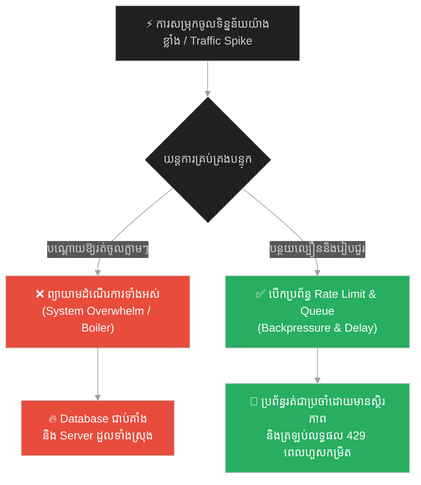
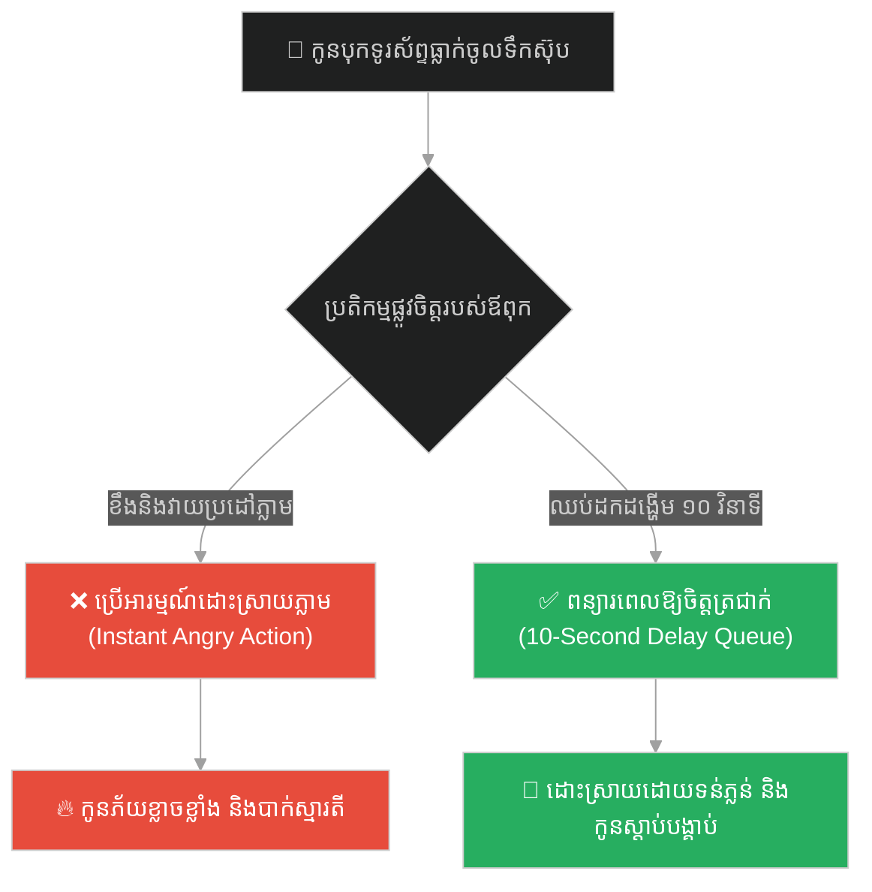
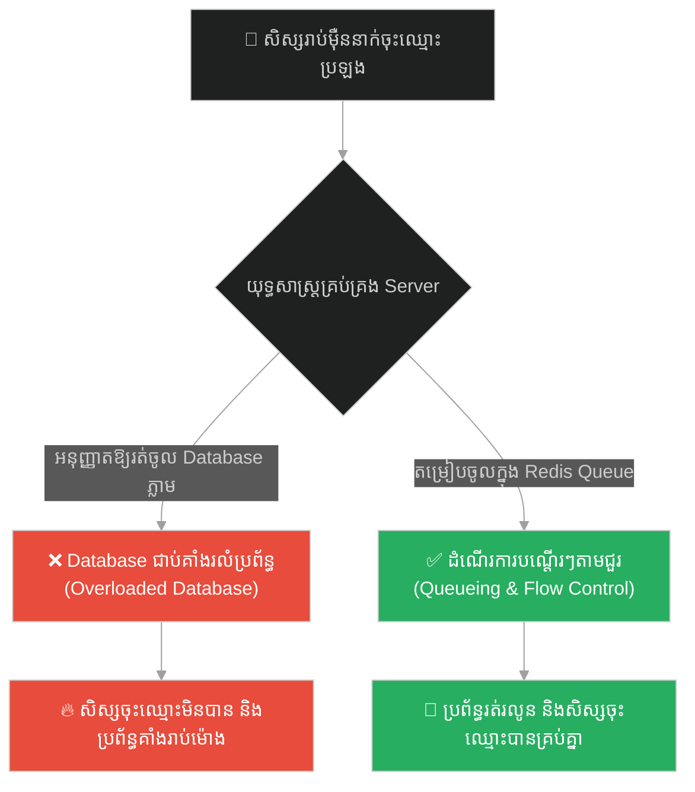
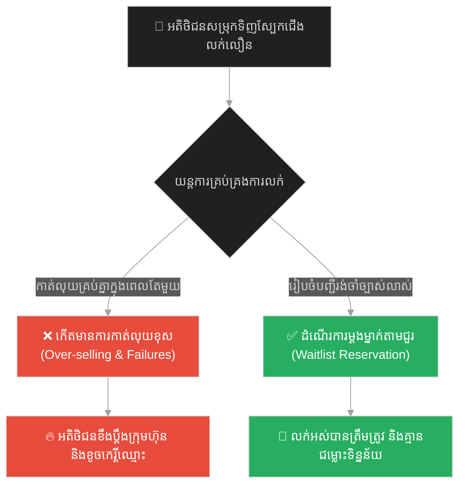
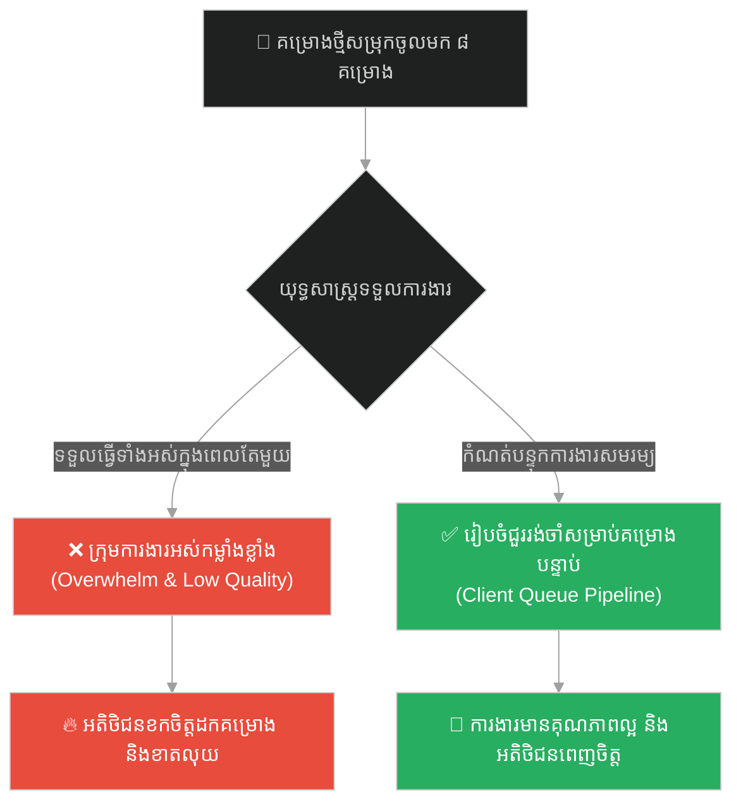
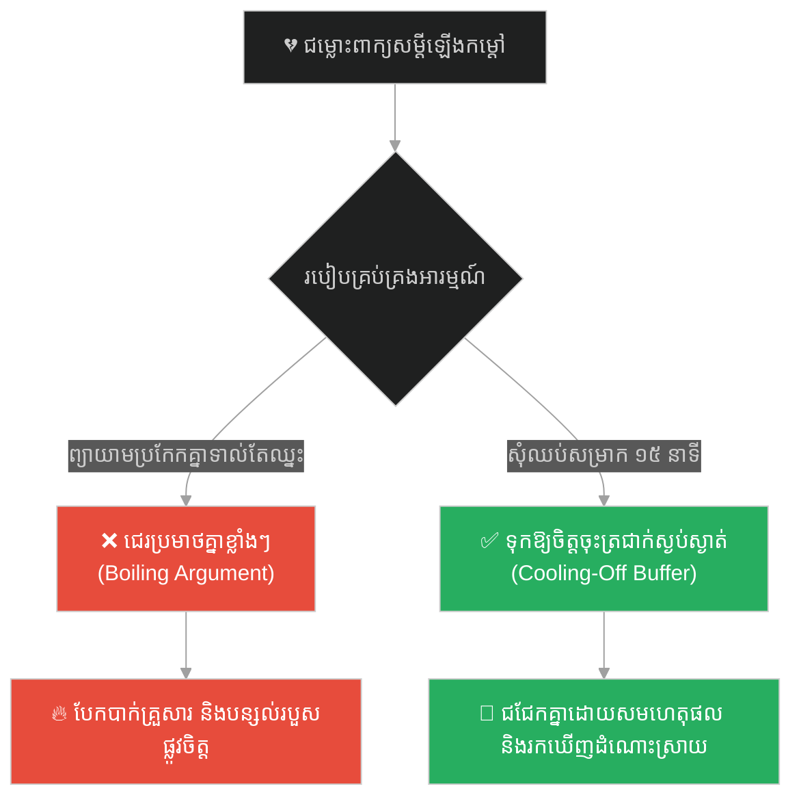
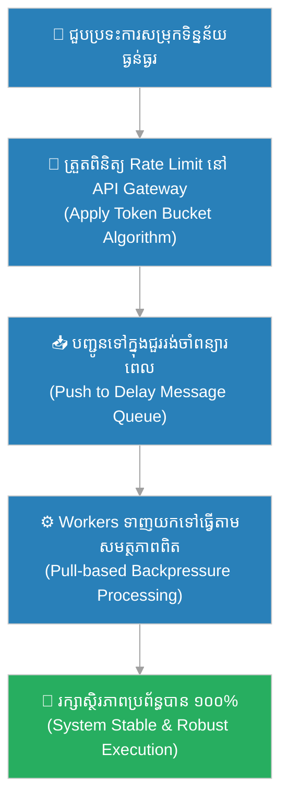

# Delay Queues & Backpressure Rate-limiting (ជួររង់ចាំពន្យារពេល និងការកំណត់ល្បឿនការពារបន្ទុក)៖ ព្រះពុទ្ធ និងទឹកពុះ (Delay Queues & Backpressure Rate-limiting & Buddha and the Boiling Water)

**Author:** ichamrong  
**Date:** 2026-05-28  
**Tags:** #delay-queues #backpressure #rate-limiting #resilience #redis #buddhism  
**Category:** Concepts  
**Read Time:** ~15 min  

---

## 📌 មាតិកា (Table of Contents)
- [អន្ទាក់ផ្លូវចិត្ត (The Trap)](#0)
- [១. រឿងព្រេងប្រវត្តិសាស្ត្រ៖ ទឹកប្រាំប្រភេទ និងការឆ្លុះកញ្ចក់ (The Legend of the Five States of Water)](#1)
  - [សេចក្តីស្ងប់ថ្លានៃចិត្ត (Clarity Through Stillness)](#1-1)
- [២. បញ្ហា៖ ការបុកសម្រុកនៃចរាចរណ៍ទិន្នន័យ និងការគាំងប្រព័ន្ធដោយសារការប្រើប្រាស់បន្ទុកហួសប្រមាណ (The Issue: Traffic Spikes & Out-of-Memory Crashes)](#2)
- [៣. ឧទាហរណ៍ជាក់ស្តែងក្នុងពិភពពិត (Real World Examples)](#3)
  - [ឧទាហរណ៍ទី ១ — កម្រិតស្រាល (គ្រួសារ)៖ ការពន្យារពេលឆ្លើយតបពេលកូនធ្វើខុស (10-Second Delay Queue for Parenting)](#3-1)
  - [ឧទាហរណ៍ទី ២ — កម្រិតមធ្យម (បច្ចេកទេស)៖ ការទប់ទល់នឹងលំហូរទិន្នន័យច្រើនលើសលប់ (Rate-limiting and Task Queues with Redis)](#3-2)
  - [ឧទាហរណ៍ទី ៣ — កម្រិតមធ្យម (ធុរកិច្ច)៖ ការគ្រប់គ្រងការបញ្ជាទិញទំនិញក្នុងកម្មវិធីលក់លឿន (Flash Sale Waitlists)](#3-3)
  - [ឧទាហរណ៍ទី ៤ — កម្រិតមធ្យម (សង្គម/គ្រប់គ្រង)៖ ការដោះស្រាយបញ្ហាគម្រោងសម្រុកចូលមកក្នុងពេលតែមួយ (Managing Workload Influx)](#3-4)
  - [ឧទាហរណ៍ទី ៥ — កម្រិតធ្ងន់ (ទំនាក់ទំនង)៖ ការសុំពេលសម្រាក ១៥ នាទីពេលឈ្លោះប្រកែកគ្នា (Relationship Cooling-Off Buffer)](#3-5)
- [៤. ដំណោះស្រាយទូទៅ៖ ស្ថាបត្យកម្មគ្រប់គ្រងលំហូរទិន្នន័យ និងកាត់បន្ថយបន្ទុក (The General Solution: Flow Control Architecture & Backpressure Patterns)](#4)
- [សេចក្តីសន្និដ្ឋាន (Conclusion)](#5)
- [ឯកសារយោង (References)](#6)
- [Related Posts](#7)

---

<a id="0"></a>
## អន្ទាក់ផ្លូវចិត្ត (The Trap)

តើអ្នកធ្លាប់ជួបប្រទះបញ្ហា «នៅពេលមានការប្រើប្រាស់សម្រុកចូលមកយ៉ាងច្រើន (Traffic Spike) ស្រាប់តែ Server របស់ក្រុមហ៊ុនឡើង CPU 100%, ធ្លាយ Memory, រួចគាំង Database ទាំងស្រុង» ដែរឬទេ?

នេះគឺជា **The Cascading Overload Trap (អន្ទាក់នៃការគាំងប្រព័ន្ធជាបន្តបន្ទាប់ដោយសារខ្វះប្រព័ន្ធទប់ទល់បន្ទុក)**។

* **[Side A (Overwhelm / Boiling State)]** — ព្យាយាមប្រកួតប្រជែង និងដំណើរការរាល់សំណើ (Requests) ទាំងអស់ដែលសម្រុកចូលមកក្នុងពេលតែមួយ។ វានាំឱ្យប្រព័ន្ធរលំទាំងស្រុង និងបាត់បង់ទិន្នន័យ។
* **[Side B (Regulation / Cool State)]** — ប្រើប្រាស់ជួររង់ចាំ (Queues) និងប្រព័ន្ធកំណត់ល្បឿន (Rate-limiting) ដើម្បីបន្ថយល្បឿនលំហូរទិន្នន័យ និងតម្រង់ជួរឱ្យរត់ទៅតាមសមត្ថភាពពិតរបស់ Server (Backpressure)។

ផែនទីបង្ហាញផ្លូវសម្រាប់អត្ថបទនេះ៖
1. **រឿងព្រេងប្រវត្តិសាស្ត្រ (The Historic Legend)** — រឿងរ៉ាវរបស់ទឹក ៥ ប្រភេទ និងការពន្យល់របស់ព្រះពុទ្ធអំពីការឆ្លុះស្រមោលមុខក្នុងទឹកកំពុងពុះ។
2. **បញ្ហាវិភាគ (The Issue)** — ការប្រៀបធៀបទឹកពុះទៅនឹងការសម្រុកចូលទិន្នន័យ និងតម្រូវការដំឡើង Backpressure ក្នុងវិស្វកម្មប្រព័ន្ធ។
3. **ឧទាហរណ៍ជាក់ស្តែង (Real World Examples)** — ពិនិត្យមើលទ្រឹស្តីនេះលើ ៥ កម្រិតដើម្បីការពារខ្លួន និងប្រព័ន្ធពីការរលំ។
4. **ដំណោះស្រាយទូទៅ (The General Solution)** — ការអនុវត្ត Token Bucket Algorithm និងការប្រើប្រាស់ Message Queues (BullMQ / RabbitMQ)។



---

<a id="1"></a>
## ១. រឿងព្រេងប្រវត្តិសាស្ត្រ៖ ទឹកប្រាំប្រភេទ និងការឆ្លុះកញ្ចក់ (The Legend of the Five States of Water)

នៅក្នុងគម្ពីរ Sangārava Sutta មានព្រាហ្មណ៍ម្នាក់ឈ្មោះ សង្គារវៈ បានចូលទៅគាល់ព្រះពុទ្ធ ហើយទូលសួរថា៖
> «បពិត្រព្រះគោតមដ៏ចម្រើន! ហេតុអ្វីបានជាពេលខ្លះ ទូលបង្គំអាចចងចាំធម៌អាថ៌ និងដោះស្រាយបញ្ហាបានយ៉ាងច្បាស់លាស់ល្អ តែពេលខ្លះទៀត ទោះបីជាខំប្រឹងផ្តោតអារម្មណ៍យ៉ាងណាក៏ចងចាំមិនបាន និងគិតអ្វីមិនចេញសោះ? តើអ្វីទៅជាឧបសគ្គបាំងប្រាជ្ញារបស់មនុស្ស?»

ព្រះពុទ្ធមិនទាន់ឆ្លើយភ្លាមឡើយ តែទ្រង់បាននាំព្រាហ្មណ៍នោះទៅក្បែរពាងទឹកមួយ រួចមានសង្ឃដីកាថា៖
> «ម្នាលព្រាហ្មណ៍! ចូរអ្នកអោនមើលមុខរបស់អ្នកនៅក្នុងទឹកពាងនេះមើល។ តើអ្នកអាចមើលឃើញស្រមោលមុខរបស់អ្នកច្បាស់ដែរឬទេ?»

ព្រាហ្មណ៍នោះអោនមើល រួចឆ្លើយថា៖
> «បពិត្រព្រះអង្គ ទឹកនេះកំពុងត្រូវបានគេដុតឱ្យពុះកញ្ជ្រោល មានចំហាយក្តៅហុយឡើង និងមានពពុះចុះឡើងឥតឈប់ឈរ។ ទូលបង្គំមិនអាចមើលឃើញស្រមោលមុខរបស់ខ្លួនទាល់តែសោះ។»

---

<a id="1-1"></a>
### សេចក្តីស្ងប់ថ្លានៃចិត្ត (Clarity Through Stillness)

ព្រះពុទ្ធទ្រង់ពន្យល់ថា ចិត្តរបស់មនុស្សក៏ដូចជាទឹកនៅក្នុងពាងនោះដែរ។ ប្រសិនបើចិត្តកំពុងរងឥទ្ធិពលពីនីវរណធម៌ ៥ យ៉ាង នោះប្រាជ្ញានឹងត្រូវបិទបាំង៖

1. **ទឹកកំពុងពុះកញ្ជ្រោល (Boiling Water)៖** ប្រៀបដូចជាចិត្តដែលពោរពេញដោយ **កំហឹង គំនុំ និងការស្អប់ខ្ពើម**។
2. **ទឹកល្អក់កករដោយភក់ (Muddy Water)៖** ប្រៀបដូចជាចិត្តដែលពោរពេញដោយ **ការលោភលន់ និងតណ្ហា**។
3. **ទឹកដែលដុះស្លែព័ទ្ធជុំវិញ (Water Covered in Moss)៖** ប្រៀបដូចជាចិត្តដែលពោរពេញដោយ **ភាពខ្ជិលច្រអូស និងការងងុយដេក**។
4. **ទឹកដែលត្រូវខ្យល់បោកបក់ឱ្យមានរលក (Rippling Water)៖** ប្រៀបដូចជាចិត្តដែលពោរពេញដោយ **ការថប់បារម្ភ រវើរវាយ និងមិនស្ងប់**។
5. **ទឹកដែលស្ថិតនៅក្នុងទីងងឹត (Water in Darkness)៖** ប្រៀបដូចជាចិត្តដែលពោរពេញដោយ **ការសង្ស័យ និងភាពភ័យខ្លាច**។

ព្រះពុទ្ធមានសង្ឃដីកាបញ្ជាក់ថា៖
> «ម្នាលព្រាហ្មណ៍! លុះត្រាតែទឹកនោះចុះត្រជាក់ឈប់ពុះ ថ្លាឆ្វង់ និងស្ងប់ស្ងាត់ឥតមានរលក ទើបអ្នកអាចមើលឃើញស្រមោលមុខរបស់អ្នកបានយ៉ាងច្បាស់លាស់។ ចិត្តរបស់មនុស្សក៏ដូចគ្នាដែរ ការដោះស្រាយបញ្ហាដ៏ត្រឹមត្រូវបំផុត មិនអាចកើតឡើងពីចិត្តដែលកំពុងពុះកញ្ជ្រោល ឬខឹងសម្បារឡើយ គឺត្រូវតែរង់ចាំឱ្យចិត្តនោះចុះត្រជាក់ និងស្ងប់ស្ងាត់ជាមុនសិន។»

---

<a id="2"></a>
## ២. បញ្ហា៖ ការបុកសម្រុកនៃចរាចរណ៍ទិន្នន័យ និងការគាំងប្រព័ន្ធដោយសារការប្រើប្រាស់បន្ទុកហួសប្រមាណ (The Issue: Traffic Spikes & Out-of-Memory Crashes)

នៅក្នុងប្រព័ន្ធបច្ចេកវិទ្យា ទឹកដែលកំពុងពុះប្រៀបដូចជា Server ដែលកំពុងរងការវាយលុកពីសំណើសុំទិន្នន័យរាប់ម៉ឺនក្នុងមួយវិនាទី (High Concurrent Requests)។ ប្រសិនបើប្រព័ន្ធព្យាយាមដំណើរការរាល់សំណើទាំងអស់ដោយគ្មានការគ្រប់គ្រង វានឹងប្រើប្រាស់ធនធានអស់ភ្លាមៗ រួចគាំងប្រព័ន្ធទាំងស្រុង (Out of Memory/CPU Exhaustion)។

ដើម្បីការពារបញ្ហានេះ វិស្វករត្រូវប្រើប្រាស់ **Backpressure Rate-limiting** និង **Delay Queues** ដើម្បីរៀបចំសំណើទាំងនោះឱ្យរង់ចាំក្នុងជួរ និងបញ្ជូនទៅដំណើរការក្នុងកម្រិតសមរម្យមួយ ដែលប្រព័ន្ធអាចទទួលយកបាន (ដូចជាការទុកឱ្យទឹកពុះចុះត្រជាក់សិន)។

សូមពិនិត្យមើលកូដ Node.js (Express) ខាងក្រោម៖

### កូដដែលងាយនឹងគាំងដោយសារគ្មានប្រព័ន្ធការពារបន្ទុក (Unprotected / Boiling Code)
```typescript
// ❌ ព្យាយាមដំណើរការ Task ធ្ងន់ៗភ្លាមៗរាល់ពេលមាន Request ចូលមក (ងាយនឹងគាំង OOM)
import express from 'express';
const app = express();

app.post('/process-video', async (req, res) => {
    // ដំណើរការបំលែងវីដេអូភ្លាមៗ (Heavy CPU task)
    // ប្រសិនបើមានមនុស្ស ១០០០ នាក់ចុចក្នុងពេលតែមួយ Server នឹងងាប់ភ្លាម
    const result = await videoConvertor.process(req.body.videoUrl); 
    res.json({ success: true, result });
});
```

### កូដដែលប្រើប្រាស់ Rate Limiting និង Delay Queue (Protected / Cool Code)
```typescript
// ✅ ប្រើប្រាស់ Rate Limiter និង Queue ដើម្បីគ្រប់គ្រងលំហូរទិន្នន័យដោយសុវត្ថិភាព
import express from 'express';
import rateLimit from 'express-rate-limit';
import Queue from 'bull';

const app = express();
const videoQueue = new Queue('video-processing', 'redis://127.0.0.1:6379');

// ១. បំពាក់ Rate Limiter: អនុញ្ញាតឱ្យសមាជិកម្នាក់រត់បានត្រឹមតែ ៥ ដងក្នុងមួយនាទី
const limiter = rateLimit({
    windowMs: 60 * 1000,
    max: 5,
    message: { error: "Too many requests. Please cool down and try again later." } // HTTP 429
});

app.post('/process-video', limiter, async (req, res) => {
    const { videoUrl } = req.body;
    
    // ២. មិនដំណើរការភ្លាមៗទេ គឺរុញចូលទៅក្នុង Queue ជាមួយ Delay (Delay Queue / Backpressure)
    const job = await videoQueue.add(
        { videoUrl },
        { delay: 2000, attempts: 3, backoff: 5000 } // ពន្យារពេល ២ វិនាទី និងព្យាយាមឡើងវិញបើបរាជ័យ
    );
    
    // ប្រាប់អតិថិជនថា Request ត្រូវបានទទួលយកទៅរង់ចាំក្នុងជួរហើយ (HTTP 202 Accepted)
    res.status(202).json({ success: true, jobId: job.id, message: "Task queued safely." });
});
```

---

<a id="3"></a>
## ៣. ឧទាហរណ៍ជាក់ស្តែងក្នុងពិភពពិត

---

<a id="3-1"></a>
### ឧទាហរណ៍ទី ១ — កម្រិតស្រាល (គ្រួសារ)៖ ការពន្យារពេលឆ្លើយតបពេលកូនធ្វើខុស (10-Second Delay Queue for Parenting)

**ស្ថានភាព៖** កូនស្រីតូចម្នាក់បានលេងរត់ដួល បុកទូរស័ព្ទដៃរបស់ឪពុកធ្លាក់ចូលក្នុងទឹកស៊ុបក្តៅកំពុងញ៉ាំ។

* **ជម្រើសខុស (Boiling Water Response):** ឪពុកខឹងភ្លាម ស្រែកគំហក និងវាយកូនដោយសារកំហឹងពុះកញ្ជ្រោល (ប្រើប្រាស់អារម្មណ៍ខឹងដោះស្រាយភ្លាមៗ បង្កើតរបួសផ្លូវចិត្តកូន)។
* **ជម្រើសត្រូវ (Delay Queue Response):** ឪពុកដកដង្ហើមវែងៗ រង់ចាំ ១០ វិនាទី (ពន្យារពេល / Delay buffer) ដើម្បីឱ្យកំហឹងចុះត្រជាក់ រួចសួរនាំកូនដោយស្ងប់ស្ងាត់៖ «កូនមិនអីទេមែនទេ?» ហើយបង្រៀនកូនពីរបៀបកាន់ប្រដាប់ប្រដា។



---

<a id="3-2"></a>
### ឧទាហរណ៍ទី ២ — កម្រិតមធ្យម (បច្ចេកទេស)៖ ការទប់ទល់នឹងលំហូរទិន្នន័យច្រើនលើសលប់ (Rate-limiting and Task Queues with Redis)

**ស្ថានភាព៖** គេហទំព័រចុះឈ្មោះប្រឡងរបស់រដ្ឋ ជួបបញ្ហាសិស្សរាប់សែននាក់សម្រុកចូលចុះឈ្មោះក្នុងពេលតែមួយនាទីដំបូង។

* **ជម្រើសខុស (Boiling Server):** បើកឱ្យចុះឈ្មោះចូល Database ផ្ទាល់ភ្លាមៗ ធ្វើឱ្យ Database ជាប់គាំង (Lock) និងប្រព័ន្ធគាំងទាំងស្រុង។
* **ជម្រើសត្រូវ (Rate-limited Queue):** ប្រើប្រាស់ Redis Queue ដើម្បីតម្រង់ជួរចុះឈ្មោះ ហើយឱ្យប្រព័ន្ធដំណើរការម្តង ៥០ នាក់តាមលំដាប់ (FIFO) ដើម្បីកុំឱ្យធ្លាក់បន្ទុកលើ Database។



---

<a id="3-3"></a>
### ឧទាហរណ៍ទី ៣ — កម្រិតមធ្យម (ធុរកិច្ច)៖ ការគ្រប់គ្រងការបញ្ជាទិញទំនិញក្នុងកម្មវិធីលក់លឿន (Flash Sale Waitlists)

**ស្ថានភាព៖** ហាងលក់ស្បែកជើងប្រេនល្បី ដាក់លក់ស្បែកជើង Version ពិសេសត្រឹមតែ ៥០ គូ ប៉ុន្តែមានមនុស្សចុចទិញរហូតដល់ ៥០,០០០ នាក់។

* **ជម្រើសខុស (No Backpressure):** អនុញ្ញាតឱ្យរាល់ការទូទាត់ប្រាក់ទាំងអស់ចុចកាត់លុយភ្លាមៗ ធ្វើឱ្យកើតមានបញ្ហាលក់លើសចំនួន (Over-selling) និងកាត់លុយអតិថិជនតែគ្មានទំនិញឱ្យ។
* **ជម្រើសត្រូវ (Waitlist Queue):** អនុញ្ញាតឱ្យតែ ៥០ នាក់ដំបូងចូលទូទាត់ប្រាក់ ចំណែកឯអ្នកដទៃទៀតដាក់ឱ្យស្ថិតនៅក្នុងបញ្ជីរង់ចាំ (Waitlist Queue)។ បើមានអ្នកបោះបង់ ទើបផ្ទេរវេនឱ្យអ្នកបន្ទាប់។



---

<a id="3-4"></a>
### ឧទាហរណ៍ទី ៤ — កម្រិតមធ្យម (សង្គម/គ្រប់គ្រង)៖ ការដោះស្រាយបញ្ហាគម្រោងសម្រុកចូលមកក្នុងពេលតែមួយ (Managing Workload Influx)

**ស្ថានភាព៖** ភ្នាក់ងាររចនាវែបសាយ (Agency) ទទួលបានគម្រោងថ្មីៗសម្រុកចូលមកចំនួន ៨ ក្នុងសប្តាហ៍តែមួយ។

* **ជម្រើសខុស (Over-commitment):** យល់ព្រមទទួលធ្វើរាល់គម្រោងទាំងអស់ក្នុងពេលតែមួយ ធ្វើឱ្យក្រុមការងារធ្វើការហួសកម្លាំង ស្ត្រេសខ្លាំង និងបញ្ជូនការងារយឺតយ៉ាវខូចគុណភាព។
* **ជម្រើសត្រូវ (Client Backpressure):** យល់ព្រមទទួលធ្វើម្តងត្រឹមតែ ៣ គម្រោងប៉ុណ្ណោះ ហើយគម្រោង ៥ ទៀត ត្រូវដាក់ឱ្យរង់ចាំក្នុងជួរ (Waitlist Queue) សម្រាប់ខែបន្ទាប់ ដោយធានាគុណភាពការងារខ្ពស់។



---

<a id="3-5"></a>
### ឧទាហរណ៍ទី ៥ — កម្រិតធ្ងន់ (ទំនាក់ទំនង)៖ ការសុំពេលសម្រាក ១៥ នាទីពេលឈ្លោះប្រកែកគ្នា (Relationship Cooling-Off Buffer)

**ស្ថានភាព៖** ប្តីប្រពន្ធកំពុងជជែកគ្នាអំពីការបែងចែកថវិកាគ្រួសារ រួចចាប់ផ្តើមឡើងកម្តៅ និងចង់និយាយពាក្យគំរោះគំរើយដាក់គ្នា។

* **ជម្រើសខុស (Boiling Argument):** ព្យាយាមប្រកែកយកឈ្នះចាញ់ភ្លាមៗទាំងអារម្មណ៍កំពុងពុះកញ្ជ្រោល (នាំឱ្យនិយាយពាក្យបាក់ទឹកចិត្ត និងបំផ្លាញចំណងស្នេហា)។
* **ជម្រើសត្រូវ (Cooling-Off Buffer):** ភាគីម្ខាងនិយាយថា៖ «សម្លាញ់! ឥឡូវយើងទាំងពីរកំពុងខឹងរៀងខ្លួនហើយ។ សុំសម្រាក ១៥ នាទី (Cooling buffer) សិនចុះ ចាំត្រជាក់ចិត្តសឹមមកជជែកគ្នាឡើងវិញ។»



---

<a id="4"></a>
## ៤. ដំណោះស្រាយទូទៅ៖ ស្ថាបត្យកម្មគ្រប់គ្រងលំហូរទិន្នន័យ និងកាត់បន្ថយបន្ទុក (The General Solution: Flow Control Architecture & Backpressure Patterns)

ដើម្បីបង្កើតប្រព័ន្ធការពារបន្ទុកការងារ (Resilient Flow Control) នៅក្នុងប្រព័ន្ធព័ត៌មានវិទ្យា ចូរអនុវត្តជំហានខាងក្រោម៖

1. **អនុវត្តការគ្រប់គ្រងលំហូរទិន្នន័យ (Backpressure Pattern)៖**
   នៅក្នុងប្រព័ន្ធ Reactive Streams (ដូចជា RxJS ឬ Java Project Reactor) កុំបណ្តោយឱ្យអ្នកផលិតទិន្នន័យ (Publisher) បញ្ជូនទិន្នន័យលឿនជាងសមត្ថភាពរបស់អ្នកទទួល (Subscriber)។ ត្រូវអនុវត្តយន្តការ «Pull-based» ពោលគឺអ្នកទទួលជាអ្នកស្នើសុំទិន្នន័យតាមចំនួនដែលខ្លួនអាចធ្វើកើតប៉ុណ្ណោះ។
2. **ដំឡើងប្រព័ន្ធ Rate Limiter នៅ API Gateway៖**
   ប្រើប្រាស់ឧបករណ៍ដូចជា Kong, Nginx ឬ Cloudflare ដើម្បីកំណត់ចំនួន Request របស់សមាជិកម្នាក់ៗ។ ប្រសិនបើប្រើហួសកម្រិត ត្រូវត្រឡប់កូដ `HTTP 429 Too Many Requests` រួមជាមួយ Header `Retry-After` ដើម្បីប្រាប់ឱ្យពួកគេរង់ចាំសិន។
3. **ប្រើប្រាស់ Message Queues ជាមួយយុទ្ធសាស្ត្រ retry (Exponential Backoff)៖**
   សម្រាប់កិច្ចការធ្ងន់ៗ (Background tasks) ចូររុញវាចូលទៅក្នុងជួររង់ចាំ (Queue) ដូចជា RabbitMQ ឬ BullMQ។ ប្រសិនបើមានបញ្ហាដំណើរការខុសប្រក្រតី កុំព្យាយាម Retry ភ្លាមៗ។ ចូរប្រើប្រាស់ Exponential Backoff ជាមួយ Jitter (ពន្យារពេលទ្វេដងបូកនឹងលេខចៃដន្យ) ដើម្បីកុំឱ្យ Server រងការគាំងជាថ្មីម្តងទៀត។



---

## 🐇 ធ្លាក់ចូលក្នុងរន្ធទន្សាយ (Enter the Rabbit Hole)
ដើម្បីស្វែងយល់ពីរបៀបរៀបចំការប្រជុំត្រួតពិនិត្យបញ្ហាឡើងវិញដោយគ្មានការទម្លាក់កំហុស និងការវិភាគរកហេតុផលជាប្រព័ន្ធ (Blameless Incident Reviews) សូមបន្តដំណើរទៅកាន់៖

* 🚀 **[ចាប់ផ្តើមដំណើររុករក (Start the Journey) ➔ Blameless Incident Reviews & Systemic Attribution (ការវិភាគវិបត្តិដោយគ្មានការទម្លាក់កំហុស និងការវិភាគជាប្រព័ន្ធ)៖ ព្រះពុទ្ធ និងទូកទទេ](./158-buddha-and-the-empty-boat.md)**

---

<a id="5"></a>
## សេចក្តីសន្និដ្ឋាន (Conclusion)

> **«កុំព្យាយាមឆ្លុះកញ្ចក់មើលមុខខ្លួនឯង ក្នុងខណៈពេលដែលទឹកនៅក្នុងពាងកំពុងតែពុះកញ្ជ្រោលឡើយ។»**

ការដោះស្រាយបញ្ហាប្រព័ន្ធ និងជីវិតដោយខ្វះការគ្រប់គ្រងបន្ទុកការងារ គឺដូចជាការខំប្រឹងឆ្លុះមើលរូបភាពនៅក្នុងទឹកពុះ ដែលមានតែផ្តល់ភាពមិនច្បាស់លាស់ និងការខូចខាតប៉ុណ្ណោះ។ ក្នុងនាមជាវិស្វករប្រព័ន្ធ ឬជាបុគ្គលម្នាក់ដែលដឹកនាំជីវិត ចូររៀនប្រើប្រាស់យន្តការ Rate-limiting និង Delay Queues ដើម្បីបន្ថយល្បឿនបញ្ហា និងទុកឱ្យអារម្មណ៍ ឬប្រព័ន្ធរបស់អ្នកចុះត្រជាក់ជាមុនសិន។ នៅពេលដែល «ទឹកនៅក្នុងចិត្ត» ស្ងប់ស្ងាត់ល្អ និងចុះត្រជាក់ហើយ នោះរាល់ការសម្រេចចិត្ត និងការដោះស្រាយបញ្ហាទាំងឡាយនឹងប្រព្រឹត្តទៅដោយគ្មានកំហុសឆ្គង និងទទួលបានលទ្ធផលល្អឥតខ្ចោះជានិច្ច។

---

<a id="6"></a>
## ឯកសារយោង (References)

* **Sangārava Sutta (SN 46.55)** — គម្ពីរពុទ្ធសាសនាស្តីពីទឹក ៥ ប្រភេទ និងឧបសគ្គរាំងស្ទះប្រាជ្ញារបស់មនុស្ស។
* **Nygard, M. T.** — *Release It!: Design and Deploy Production-Ready Software* (2018). យុទ្ធសាស្ត្រគ្រប់គ្រងស្ថិរភាពប្រព័ន្ធព័ត៌មានវិទ្យា និងការអនុវត្ត Rate Limit / Circuit Breaker។
* **Reactive Streams Specification** — *JVM Standard for Asynchronous Stream Processing with Non-blocking Backpressure*.

---

<a id="7"></a>
## Related Posts

* **[Micro-optimizations & Lint Warnings (ការកែលម្អកម្រិតមីក្រូ និងការព្រមានពី Linters)៖ ព្រះពុទ្ធ និងគ្រួសក្នុងស្បែកជើង](./156-buddha-and-the-pebble-in-the-shoe.md)**
* **[The wooden tent and the palace of stone (តង់ឈើ និងប្រាសាទថ្ម)៖ គ្រោះថ្នាក់នៃការសាងសង់ប្រព័ន្ធប្រញាប់ប្រញាល់ និងមេរៀននៃការកសាងគ្រឹះរឹងមាំ](./19-the-wooden-tent-and-the-palace-of-stone.md)**
