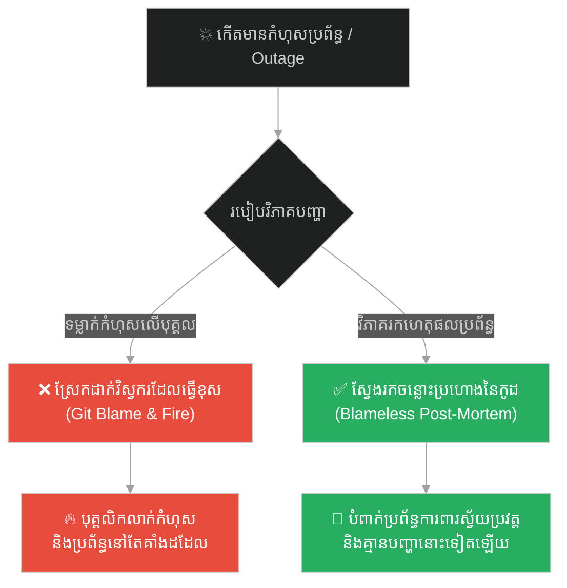
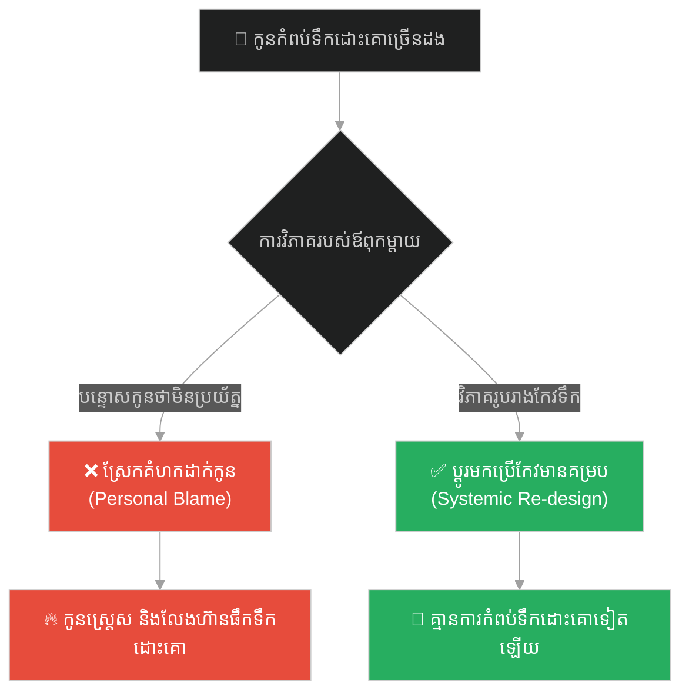
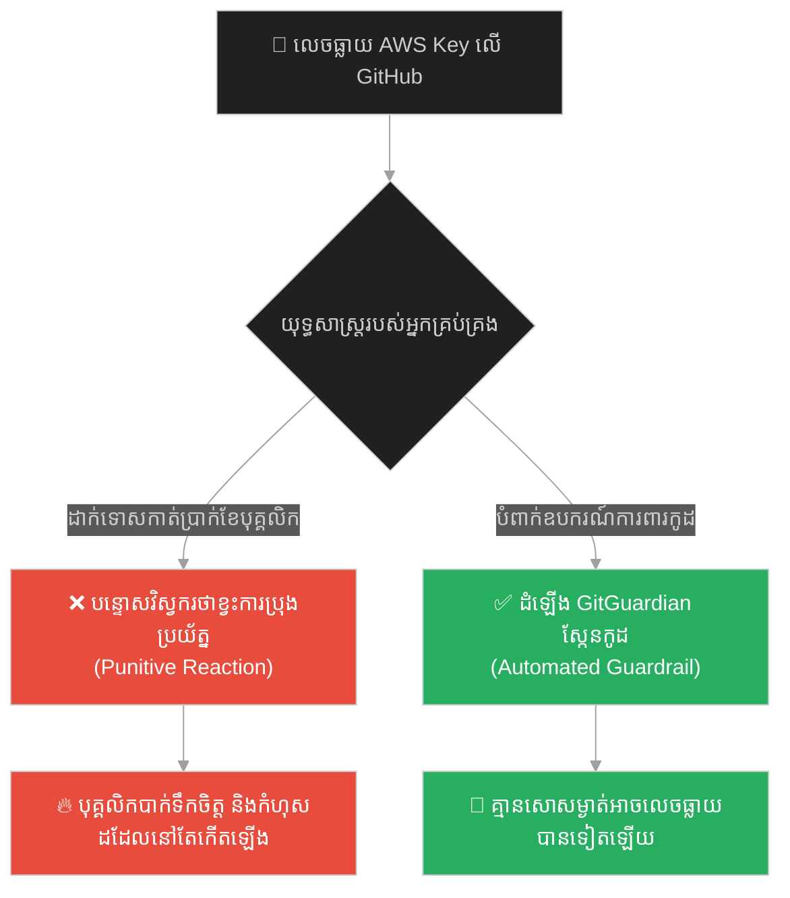
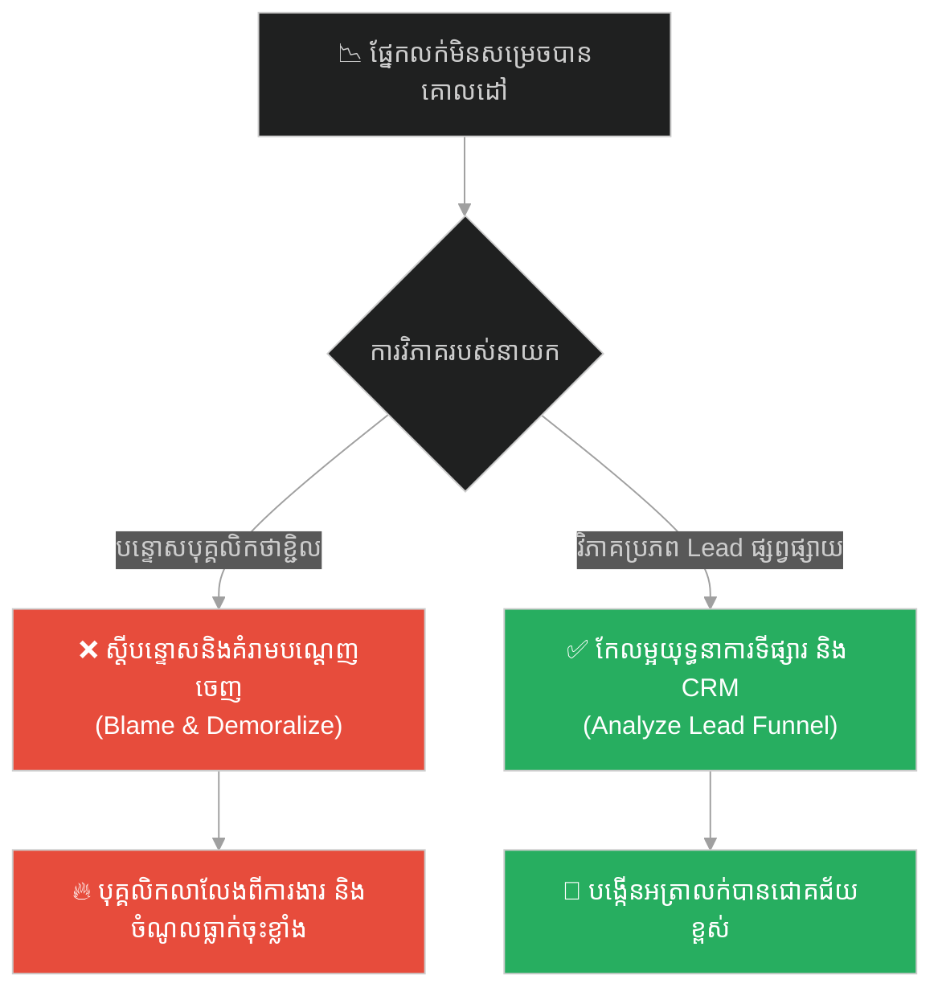
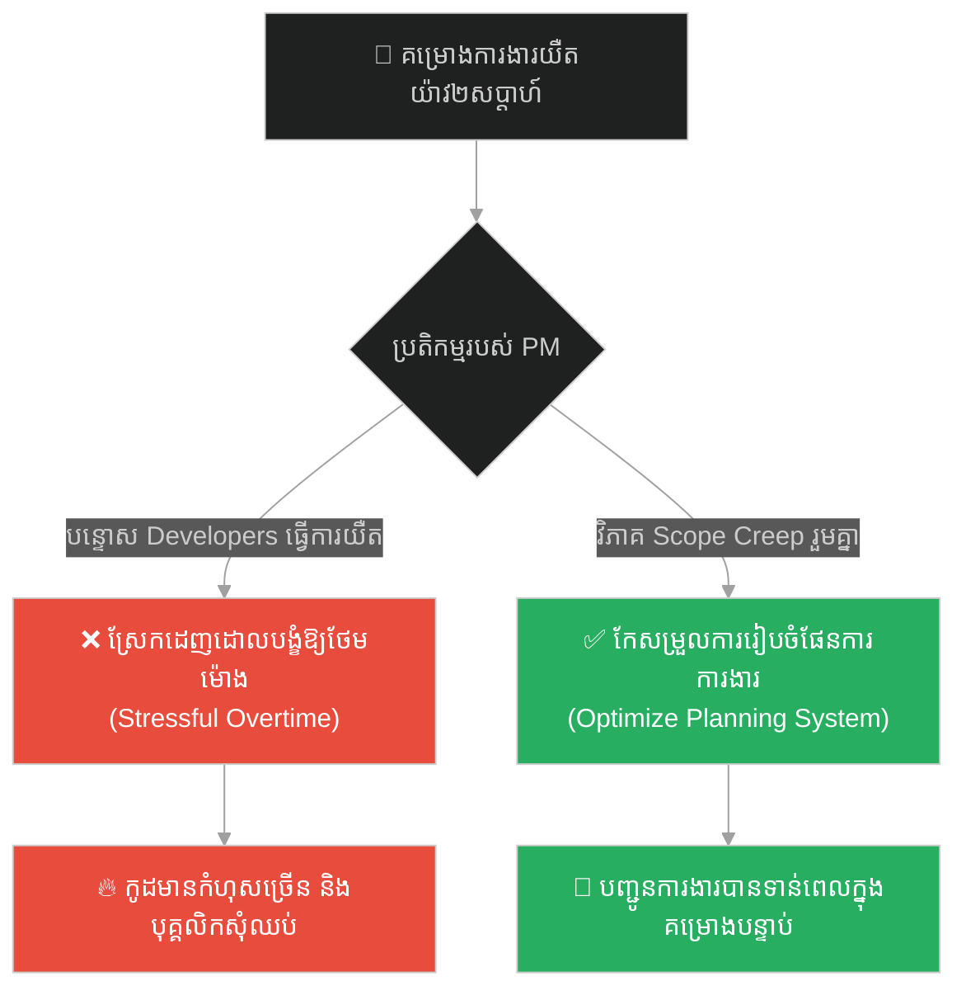
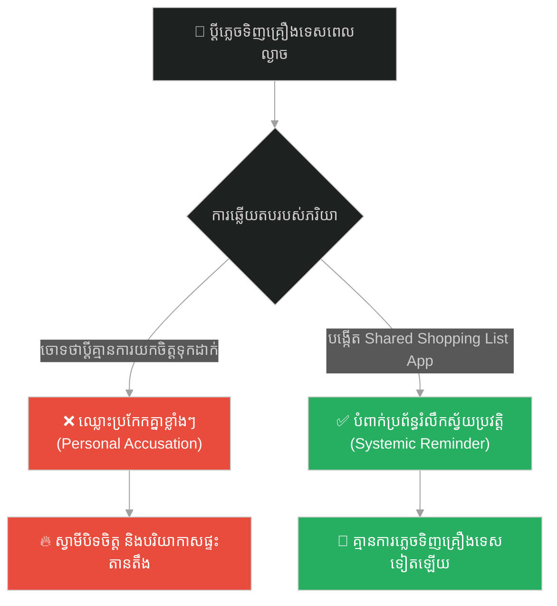
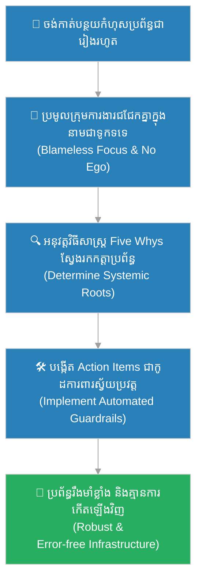

# Blameless Incident Reviews & Systemic Attribution (ការវិភាគវិបត្តិដោយគ្មានការទម្លាក់កំហុស និងការវិពន្ធនាការជាប្រព័ន្ធ)៖ ព្រះពុទ្ធ និងទូកទទេ (Blameless Incident Reviews & Systemic Attribution & Buddha and the Empty Boat)

**Author:** ichamrong  
**Date:** 2026-05-28  
**Tags:** #blameless #incident-review #postmortem #systemic-attribution #devops #zhuangzi #software-engineering  
**Category:** Concepts  
**Read Time:** ~15 min  

---

## 📌 មាតិកា (Table of Contents)
- [អន្ទាក់ផ្លូវចិត្ត (The Trap)](#0)
- [១. រឿងព្រេងបុរាណជួងជឺ៖ បុរសនិងទូកទទេ (The Legend of the Empty Boat)](#1)
  - [អ័ព្ទរលាយបាត់ទៅ (The Dissolving of the Ego)](#1-1)
- [២. បញ្ហា៖ ការចង្អុលមុខទម្លាក់កំហុស និងការមើលរំលងចន្លោះប្រហោងនៃប្រព័ន្ធ (The Issue: The Blame Game & Overlooking Systemic Roots)](#2)
- [៣. ឧទាហរណ៍ជាក់ស្តែងក្នុងពិភពពិត (Real World Examples)](#3)
  - [ឧទាហរណ៍ទី ១ — កម្រិតស្រាល (គ្រួសារ)៖ ការឆ្លើយតបចំពោះការកំពប់ទឹកដោះគោរបស់កូន (Evaluating Clumsiness vs Systemic Cup Design)](#3-1)
  - [ឧទាហរណ៍ទី ២ — កម្រិតមធ្យម (បច្ចេកទេស)៖ ការលេចធ្លាយសោសម្ងាត់ទៅលើ GitHub (Accidental API Key Leakage)](#3-2)
  - [ឧទាហរណ៍ទី ៣ — កម្រិតមធ្យម (ធុរកិច្ច)៖ ផ្នែកលក់មិនសម្រេចបានគោលដៅប្រចាំខែ (Sales Missed Targets)](#3-3)
  - [ឧទាហរណ៍ទី ៤ — កម្រិតមធ្យម (សង្គម/គ្រប់គ្រង)៖ ការយឺតយ៉ាវគម្រោងដោយសារការចាត់ចែងបន្ទុកការងារ (Missed Deadline Analysis)](#3-4)
  - [ឧទាហរណ៍ទី ៥ — កម្រិតធ្ងន់ (ទំនាក់ទំនង)៖ ការភ្លេចទិញឥវ៉ាន់របស់ដៃគូជីវិត (Forgetting Groceries on a Busy Day)](#3-5)
- [៤. ដំណោះស្រាយទូទៅ៖ ការវិភាគរកហេតុផលពិតប្រាកដ និងការសរសេររបាយការណ៍វិបត្តិប្រព័ន្ធ (The General Solution: Blameless Post-Mortems & Five Whys Root Cause Analysis)](#4)
- [សេចក្តីសន្និដ្ឋាន (Conclusion)](#5)
- [ឯកសារយោង (References)](#6)
- [Related Posts](#7)

---

<a id="0"></a>
## អន្ទាក់ផ្លូវចិត្ត (The Trap)

តើអ្នកធ្លាប់ធ្វើការនៅក្នុងក្រុមហ៊ុន ដែលរាល់ពេលមានប្រព័ន្ធគាំង (Outage) គឺអ្នករាល់គ្នានាំគ្នាស្រែកសួររក «តើនរណាជាអ្នក Commit កូដខូចនេះឡើងទៅ Production?» ដើម្បីយកពួកគេមកស្តីបន្ទោស និងដាក់ទោសដែរឬទេ?

នេះគឺជា **The Finger-Pointing Trap (អន្ទាក់នៃការទម្លាក់កំហុសលើបុគ្គល និងការមើលរំលងកត្តាប្រព័ន្ធ)**។

* **[Side A (Personal Blame)]** — ចាត់ទុកកំហុសរបស់មនុស្សជាមូលហេតុចុងក្រោយ។ ស្រែកជេរទូក (ទម្លាក់កំហុសលើវិស្វករ) ដោយគិតថាការដេញបុគ្គលិកចេញ ឬការព្រមានជាលាយលក្ខណ៍អក្សរ នឹងជួយដោះស្រាយបញ្ហាបាន។
* **[Side B (Systemic Attribution)]** — យល់ឃើញថា មនុស្សគ្រាន់តែជាផ្នែកមួយដែលរត់នៅលើប្រព័ន្ធ។ ប្រសិនបើមានកំហុសកើតឡើង គឺមកពីប្រព័ន្ធខ្វះការការពារ (Guardrails) ដូចជាទូកទទេដែលរសាត់អណ្តែតតាមចរន្តទឹកដូច្នោះដែរ។

ផែនទីបង្ហាញផ្លូវសម្រាប់អត្ថបទនេះ៖
1. **រឿងព្រេងប្រវត្តិសាស្ត្រ (The Historic Legend)** — ទស្សនវិជ្ជា «ទូកទទេ (The Empty Boat)» របស់ជួងជឺ និងការរលាយបាត់កំហឹងរបស់បុរសអ្នកអុំទូក។
2. **បញ្ហាវិភាគ (The Issue)** — យុទ្ធសាស្ត្រកសាងវប្បធម៌ Blameless Post-Mortems ក្នុងវិស្វកម្មទំនុកចិត្តប្រព័ន្ធ (SRE)។
3. **ឧទាហរណ៍ជាក់ស្តែង (Real World Examples)** — ពិនិត្យមើលទ្រឹស្តីនេះលើ ៥ កម្រិតដើម្បីផ្លាស់ប្តូរទម្លាប់ពីការទម្លាក់កំហុស មកជាការកែលម្អប្រព័ន្ធ។
4. **ដំណោះស្រាយទូទៅ (The General Solution)** — ការប្រើប្រាស់វិធីសាស្ត្រ «Five Whys (សួររកហេតុផល ៥ ដង)» និងការបង្កើតប្រព័ន្ធការពារស្វ័យប្រវត្ត។



---

<a id="1"></a>
## ១. រឿងព្រេងបុរាណជួងជឺ៖ បុរសនិងទូកទទេ (The Legend of the Empty Boat)

នៅក្នុងទស្សនវិជ្ជារបស់លោក ជួងជឺ (Zhuangzi) មានរឿងប្រៀបប្រដៅដ៏ល្បីល្បាញមួយ៖

មានបុរសម្នាក់កំពុងអុំទូកតូចមួយរបស់គាត់ឆ្លងកាត់ដងទន្លេធំ ក្នុងខណៈពេលដែលផ្ទៃមេឃកំពុងគ្របដណ្តប់ដោយអ័ព្ទក្រាស់ខ្លាំង។ គាត់កំពុងខំប្រឹងផ្ដោតអារម្មណ៍អុំទូកជាខ្លាំងដើម្បីកុំឱ្យបុកនឹងថ្ម។ ស្រាប់តែភ្លាមៗនោះ មានទូកមួយទៀតបានរសាត់អណ្តែតមកបុកទូករបស់គាត់យ៉ាងខ្លាំង បណ្តាលឱ្យចំហៀងទូករបស់គាត់រងការខូចខាត។

បុរសនោះខឹងសម្បារយ៉ាងខ្លាំង។ គាត់ចាប់ផ្តើមស្រែកជេរប្រមាថទៅកាន់ទូកនោះយ៉ាងខ្លាំងៗថា៖
> «នែ៎! អាមនុស្សគ្មានការប្រុងប្រយ័ត្ន! ឯងបើកទូករបៀបម៉េចហ្នឹង មិនចេះមើលផ្លូវទេឬអី? ប្រយ័ត្នតែយើងវាយឯងឱ្យងាប់ឥឡូវហ្នឹង!»

គាត់ស្រែកគំហក និងរៀបចំដំបងដើម្បីវាយតបតទៅកាន់អ្នកបើកទូកម្ខាងទៀតដោយកំហឹងកំពុះកញ្ជ្រោល។

---

<a id="1-1"></a>
### អ័ព្ទរលាយបាត់ទៅ (The Dissolving of the Ego)

ទោះជាយ៉ាងណា នៅពេលដែលខ្យល់បក់មក អ័ព្ទក្រាស់ក៏ចាប់ផ្តើមរលាយបាត់ទៅបន្តិចម្តងៗ។ បុរសនោះបានក្រឡេកមើលទៅលើទូកដែលមកបុកគាត់នោះម្តងទៀតយ៉ាងច្បាស់។

ស្រាប់តែគាត់ឃើញថា **គ្មានមនុស្សណាម្នាក់នៅលើទូកនោះសោះឡើយ**។ វាគ្រាន់តែជាទូកទទេមួយ ដែលរបូតខ្សែចេញពីកំពង់ផែ រួចត្រូវចរន្តទឹកទន្លេបោកបក់អណ្តែតមកបុកទូករបស់គាត់តែប៉ុណ្ណោះ។

នៅពេលឃើញការពិតបែបនេះ កំហឹងទាំងអស់របស់គាត់ក៏បានរលាយបាត់ទៅជាសូន្យភ្លាមៗ។ គាត់លែងមានអារម្មណ៍ចង់ជេរប្រមាថ ឬចង់វាយតបតទៀតហើយ។ គាត់គ្រាន់តែសើចដាក់ខ្លួនឯង រួចយកដំបងច្រានទូកទទេនោះចេញដោយសន្តិភាពចិត្ត ហើយបន្តអុំទូករបស់គាត់ទៅមុខទៀតយ៉ាងស្ងប់ស្ងាត់។

ជួងជឺបានពន្យល់ថា៖
> «ប្រសិនបើមនុស្សម្នាក់អាចធ្វើខ្លួនឱ្យដូចជាទូកទទេ គ្មានអត្មា (Ego) ធ្វើដំណើរឆ្លងកាត់លោកនេះ នោះគ្មាននរណាម្នាក់អាចធ្វើឱ្យគេខឹង ឬបង្កទុក្ខទោសដល់គេបានឡើយ។»

---

<a id="2"></a>
## ២. បញ្ហា៖ ការចង្អុលមុខទម្លាក់កំហុស និងការមើលរំលងចន្លោះប្រហោងនៃប្រព័ន្ធ (The Issue: The Blame Game & Overlooking Systemic Roots)

នៅក្នុងពិភពវិស្វកម្ម វិស្វករដែលធ្វើកូដឱ្យមានបញ្ហា (Bug) គឺដូចជា «ទូកទទេ» ដូច្នោះដែរ។ ពួកគេមិនបានតាំងចិត្តបំផ្លាញប្រព័ន្ធក្រុមហ៊ុនឡើយ គឺពួកគេគ្រាន់តែរសាត់ទៅតាមចរន្តការងារ និងកង្វះព័ត៌មាន ឬខ្វះប្រព័ន្ធការពារ (Systemic Guardrails)។

ប្រសិនបើ CTO ស្រែកស្តីបន្ទោសបុគ្គលិកនោះ (ស្រែកជេរទូកទទេ) វាមិនបានដោះស្រាយបញ្ហាស្នូលឡើយ។ បញ្ហានឹងកើតឡើងម្តងទៀតនៅពេលមានបុគ្គលិកថ្មីមកធ្វើការងារនោះ។ ដំណោះស្រាយពិតប្រាកដ គឺត្រូវកែលម្អប្រព័ន្ធការពារកូដ (Automated Safeguards) ដើម្បីកុំឱ្យកំហុសរបស់មនុស្សអាចឆ្លងទៅដល់ Production បាន។

សូមប្រៀបធៀបគំរូកូដ API Authentication ទាំងពីរ៖

### ប្រព័ន្ធរចនាខ្សោយ ដែលពឹងផ្អែកលើការចងចាំរបស់ Developer (Error-prone / Person-dependent)
```typescript
// ❌ គ្មានប្រព័ន្ធការពារស្វ័យប្រវត្ត៖ Developer ម្នាក់ៗត្រូវតែចងចាំដើម្បីដំឡើង Security Guard ដោយផ្ទាល់
import express from 'express';
const app = express();

// Developer X សរសេរ Endpoint នេះ តែភ្លេចដំឡើង checkAdminRole (API Leak!)
app.post('/api/v1/delete-user', async (req, res) => {
    await db.deleteUser(req.body.userId);
    res.json({ success: true });
});

// Git Blame: "Developer X committed this code without authorization check! Let's fire X!"
// ⚠️ នេះជាការស្រែកជេរទូកទទេ ព្រោះប្រព័ន្ធមិនបានជួយការពារពួកគេឡើយ
```

### ប្រព័ន្ធរចនារឹងមាំ ដែលបង្ខំសន្តិសុខដោយស្វ័យប្រវត្ត (Secure by Design / Systemic Protection)
```typescript
// ✅ ប្រើប្រាស់ Global Middleware និង Decorators ដើម្បីបង្ខំសុវត្ថិភាពជាប្រព័ន្ធ
import express from 'express';
const app = express();

// Middleware បង្ខំឱ្យរាល់ endpoints ទាំងអស់ត្រូវតែមាន authentication ជាមុន
app.use('/api/*', enforceAuthenticationMiddleware);

class UserController {
    // ប្រើ Decorator ដើម្បីបង្ខំតួនាទី Admin នៅកម្រិត compiler
    @RequireRole('ADMIN')
    public async deleteUser(req: Request, res: Response) {
        await db.deleteUser(req.body.userId);
        res.json({ success: true });
    }
}
// 🚀 ទោះបីជា Developer ថ្មីភ្លេចដំឡើង Security ក៏ប្រព័ន្ធ Middleware នឹងទាត់ចោលដោយស្វ័យប្រវត្តិ
```

---

<a id="3"></a>
## ៣. ឧទាហរណ៍ជាក់ស្តែងក្នុងពិភពពិត

---

<a id="3-1"></a>
### ឧទាហរណ៍ទី ១ — កម្រិតស្រាល (គ្រួសារ)៖ ការឆ្លើយតបចំពោះការកំពប់ទឹកដោះគោរបស់កូន (Evaluating Clumsiness vs Systemic Cup Design)

**ស្ថានភាព៖** កូនប្រុសអាយុ ៤ ឆ្នាំបានកំពប់ទឹកដោះគោលើតុអាហារជាលើកទីបីក្នុងសប្តាហ៍នេះ។

* **ជម្រើសខុស (Personal Blame):** ស្រែកស្តីបន្ទោសកូនខ្លាំងៗ៖ «ហេតុអ្វីបានជាកូនធ្លេសប្រហែស និងរញ៉េរញ៉ៃម្ល៉េះ?» (ទម្លាក់កំហុសលើចរិតរបស់កូន)។
* **ជម្រើសត្រូវ (Systemic Attribution):** សង្កេតមើលកែវទឹកដោះគោ ហើយឃើញថាកែវនោះធំពេកសម្រាប់ដៃកូន រួចទៅទិញកែវទឹកដែលមានគម្រប និងទំហំតូចល្មមសម្រាប់ដៃកូន (កែលម្អប្រព័ន្ធការពារ)។



---

<a id="3-2"></a>
### ឧទាហរណ៍ទី ២ — កម្រិតមធ្យម (បច្ចេកទេស)៖ ការលេចធ្លាយសោសម្ងាត់ទៅលើ GitHub (Accidental API Key Leakage)

**ស្ថានភាព៖** Developer ម្នាក់បានច្រឡំ Commit ឯកសារ `.env` ដែលមានផ្ទុក AWS Credentials ទៅកាន់ Public Repo នៅលើ GitHub។

* **ជម្រើសខុស (Personal Blame):** ហៅបុគ្គលិកនោះមកស្តីបន្ទោស និងដាក់ពិន័យកាត់ប្រាក់ខែ (ធ្វើឱ្យវិស្វករដទៃលែងហ៊ាន Push កូដ និងលាក់បាំងកំហុស)។
* **ជម្រើសត្រូវ (Systemic Attribution):** ដំឡើងឧបករណ៍ GitGuard Linter ឬ GitGuardian នៅក្នុងប្រព័ន្ធ CI/CD ដើម្បីទប់ស្កាត់ការ Push កូដដែលមានផ្ទុក API Keys ដោយស្វ័យប្រវត្តិ។



---

<a id="3-3"></a>
### ឧទាហរណ៍ទី ៣ — កម្រិតមធ្យម (ធុរកិច្ច)៖ ផ្នែកលក់មិនសម្រេចបានគោលដៅប្រចាំខែ (Sales Missed Targets)

**ស្ថានភាព៖** ក្រុមលក់របស់ក្រុមហ៊ុន មិនអាចសម្រេចបាននូវចំនួនលក់ប្រចាំខែ (KPIs) ឡើយ។

* **ជម្រើសខុស (Personal Blame):** នាយកក្រុមហ៊ុនស្តីបន្ទោសថា «ក្រុមការងារខ្ជិលច្រអូស និងមិនសកម្មទាក់ទងអតិថិជន»។
* **ជម្រើសត្រូវ (Systemic Attribution):** វិភាគមើលលើគុណភាពនៃ Leads ដែលប្រមូលបានពីយុទ្ធនាការទីផ្សារ និងពិនិត្យល្បឿនដំណើរការកម្មវិធី CRM រួចផ្តល់វគ្គបណ្តុះបណ្តាល និងកែលម្អប្រព័ន្ធនាំផ្លូវទិន្នន័យ (Marketing Pipeline)។



---

<a id="3-4"></a>
### ឧទាហរណ៍ទី ៤ — កម្រិតមធ្យម (សង្គម/គ្រប់គ្រង)៖ ការយឺតយ៉ាវគម្រោងដោយសារការចាត់ចែងបន្ទុកការងារ (Missed Deadline Analysis)

**ស្ថានភាព៖** គម្រោងអភិវឌ្ឍន៍ App ត្រូវបានយឺតយ៉ាវជាងការគ្រោងទុកអស់រយៈពេល ២ សប្តាហ៍។

* **ជម្រើសខុស (Personal Blame):** PM ចោទប្រកាន់ថា «មកពី Developers ធ្វើការយឺត និងមិនខិតខំប្រឹងប្រែង»។
* **ជម្រើសត្រូវ (Systemic Attribution):** វិភាគមើលលើវិសាលភាពគម្រោង (Scope creep) និងមើលចំនួនសំបុត្រការងារដែលបានបន្ថែមពាក់កណ្តាលផ្លូវ រួចកែសម្រួលដំណើរការ Agile/Scrum ឱ្យច្បាស់លាស់ជាងមុន។



---

<a id="3-5"></a>
### ឧទាហរណ៍ទី ៥ — កម្រិតធ្ងន់ (ទំនាក់ទំនង)៖ ការភ្លេចទិញឥវ៉ាន់របស់ដៃគូជីវិត (Forgetting Groceries on a Busy Day)

**ស្ថានភាព៖** ស្វាមីបានភ្លេចទិញគ្រឿងទេសសម្រាប់ធ្វើម្ហូបញ៉ាំពេលល្ងាច បន្ទាប់ពីត្រឡប់មកពីធ្វើការវិញ។

* **ជម្រើសខុស (Personal Blame):** ភរិយាខឹងនិងចោទប្រកាន់ថា៖ «បងមិនដែលខ្វល់ពីអូន ឬគ្រួសារនេះទេ!» (ចាត់ទុកការភ្លេចជាកង្វះក្តីស្រឡាញ់)។
* **ជម្រើសត្រូវ (Systemic Attribution):** យល់ថាប្តីហត់នឿយនឹងការងាររាប់ម៉ោង (ទូកទទេ) រួចស្នើឱ្យបង្កើត Shared To-Do App មួយ ដែលអាចផ្ញើសាររំលឹកដោយស្វ័យប្រវត្តនៅពេលធ្វើដំណើរជិតដល់ផ្សារ។



---

<a id="4"></a>
## ៤. ដំណោះស្រាយទូទៅ៖ ការវិភាគរកហេតុផលពិតប្រាកដ និងការសរសេររបាយការណ៍វិបត្តិប្រព័ន្ធ (The General Solution: Blameless Post-Mortems & Five Whys Root Cause Analysis)

ដើម្បីអនុវត្តការដោះស្រាយបញ្ហាបែប **Blameless Incident Review** នៅក្នុងស្ថាប័នរបស់អ្នក ចូរអនុវត្តជំហានខាងក្រោម៖

1. **ផ្តោតលើសំនួរ «តើមានអ្វីកើតឡើង?» មិនមែន «នរណាជាអ្នកធ្វើ?» ឡើយ៖**
   រៀបចំរបាយការណ៍ក្រោយវិបត្តិ (Post-Mortem Report) ដោយមិនបញ្ចូលឈ្មោះរបស់វិស្វករដែលធ្វើខុសឡើយ។ ពិនិត្យមើលតែពេលវេលា (Timeline), សកម្មភាពប្រតិបត្តិការ, និងការឆ្លើយតបរបស់ប្រព័ន្ធ។
2. **អនុវត្តវិធីសាស្ត្រ Five Whys (សួររកហេតុផល ៥ ដង)៖**
   * *ហេតុអ្វីទី ១៖* ហេតុអ្វីបានជាប្រព័ន្ធ API មិនដំណើរការ? (ព្រោះ Database ពេញ)
   * *ហេតុអ្វីទី ២៖* ហេតុអ្វីបានជា Database ពេញ? (ព្រោះឯកសារ Logs មិនត្រូវបានលុប)
   * *ហេតុអ្វីទី ៣៖* ហេតុអ្វីបានជា Logs មិនត្រូវបានលុប? (ព្រោះកូដ Cronjob លុប log លែងដំណើរការ)
   * *ហេតុអ្វីទី ៤៖* ហេតុអ្វីបានជា Cronjob លែងដំណើរការ? (ព្រោះមានការផ្លាស់ប្តូរ Server ថ្មី តែគ្មានការកំណត់ Cronjob ឡើងវិញ)
   * *ហេតុអ្វីទី ៥៖* ហេតុអ្វីបានជាគ្មានការកំណត់ Cronjob ឡើងវិញ? (ព្រោះដំណើរការបង្កើត Server ថ្មីត្រូវបានធ្វើឡើងដោយដៃ និងគ្មានសៀវភៅកំណត់ស្តង់ដារ - *ហេតុផលប្រព័ន្ធពិតប្រាកដ*)
3. **កែលម្អប្រព័ន្ធការពារស្វ័យប្រវត្ត (Systemic Action Items)៖**
   រាល់លទ្ធផលដែលទទួលបានពីការប្រជុំ ត្រូវតែជាការបង្កើតការការពារស្វ័យប្រវត្តិ (ឧទាហរណ៍៖ សរសេរស្គ្រីប Terraform ស្វ័យប្រវត្ត) មិនមែនជាការដាក់ទោស ឬការប្រាប់បុគ្គលិកឱ្យ «ប្រុងប្រយ័ត្នជាងមុន» នោះឡើយ។



---

## 🐇 ធ្លាក់ចូលក្នុងរន្ធទន្សាយ (Enter the Rabbit Hole)
ដើម្បីស្វែងយល់ពីរបៀបរៀបចំរចនាសម្ព័ន្ធកម្មវិធីឱ្យមានភាពឯករាជ្យ និងចៀសវាងការជាប់ជំពាក់នឹងបច្ចេកវិទ្យារបស់ក្រុមហ៊ុនផ្គត់ផ្គង់ណាមួយ (Vendor Lock-In) សូមបន្តដំណើរទៅកាន់៖

* 🚀 **[ចាប់ផ្តើមដំណើររុករក (Start the Journey) ➔ Vendor Lock-In & Open Standards (ការជាប់ជំពាក់នឹងអ្នកផ្គត់ផ្គង់ និងស្តង់ដារបើកចំហ)៖ ព្រះពុទ្ធ និងទ្រុងមាស](./159-buddha-and-the-golden-cage.md)**

---

<a id="5"></a>
## សេចក្តីសន្និដ្ឋាន (Conclusion)

> **«នៅពេលដែលអ័ព្ទរលាយបាត់ទៅ បុរសនោះឃើញថាគ្មានមនុស្សណាម្នាក់នៅលើទូកនោះឡើយ។ វាគ្រាន់តែជាទូកទទេមួយ។ កំហឹងទាំងអស់របស់គាត់ក៏បានរលាយបាត់ភ្លាមៗ។»**

រាល់កំហុសឆ្គងទាំងឡាយដែលកើតឡើងពីវិស្វករ ឬដៃគូជីវិត ជារឿយៗមិនមែនកើតឡើងដោយសារចេតនាអាក្រក់របស់ពួកគេឡើយ។ ពួកគេគ្រាន់តែជា «ទូកទទេ» ដែលរសាត់អណ្តែតទៅតាមចរន្តទឹកនៃប្រព័ន្ធការងារ និងភាពហត់នឿយប៉ុណ្ណោះ។ ការស្រែកជេរទូកទទេ មានតែនាំឱ្យខាតបង់ពេលវេលា និងបង្ករបួសផ្លូវចិត្តឥតប្រយោជន៍។ ចូរដកអត្មា (Ego) របស់អ្នកចេញ រៀនវិភាគរកមូលហេតុប្រព័ន្ធពិតប្រាកដ តាមរយៈការប្រជុំវិភាគដោយគ្មានការស្តីបន្ទោស (Blameless Reviews) ដើម្បីរួមគ្នាបង្កើតប្រព័ន្ធការងារមួយដ៏រឹងមាំ និងមានស្ថិរភាពយូរអង្វែងជានិច្ច។

---

<a id="6"></a>
## ឯកសារយោង (References)

* **Zhuangzi** — *The Inner Chapters: The Empty Boat* (គម្ពីរតាវបុរាណ ស្តីពីការរលាយអត្មា)។
* **Allspaw, J.** — *Blameless Post-Mortems and a Just Culture* (2012). អត្ថបទស្រាវជ្រាវរបស់ Etsy ស្តីពីវប្បធម៌ Blameless។
* **Dekker, S.** — *The Field Guide to Understanding Human Error* (2014). ការយល់ដឹងពីកំហុសរបស់មនុស្សក្នុងប្រព័ន្ធស្មុគស្មាញ។

---

<a id="7"></a>
## Related Posts

* **[Delay Queues & Backpressure Rate-limiting (ជួររង់ចាំពន្យារពេល និងការកំណត់ល្បឿនការពារបន្ទុក)៖ ព្រះពុទ្ធ និងទឹកពុះ](./157-buddha-and-the-boiling-water.md)**
* **[The wooden tent and the palace of stone (តង់ឈើ និងប្រាសាទថ្ម)៖ គ្រោះថ្នាក់នៃការសាងសង់ប្រព័ន្ធប្រញាប់ប្រញាល់ និងមេរៀននៃការកសាងគ្រឹះរឹងមាំ](./19-the-wooden-tent-and-the-palace-of-stone.md)**
