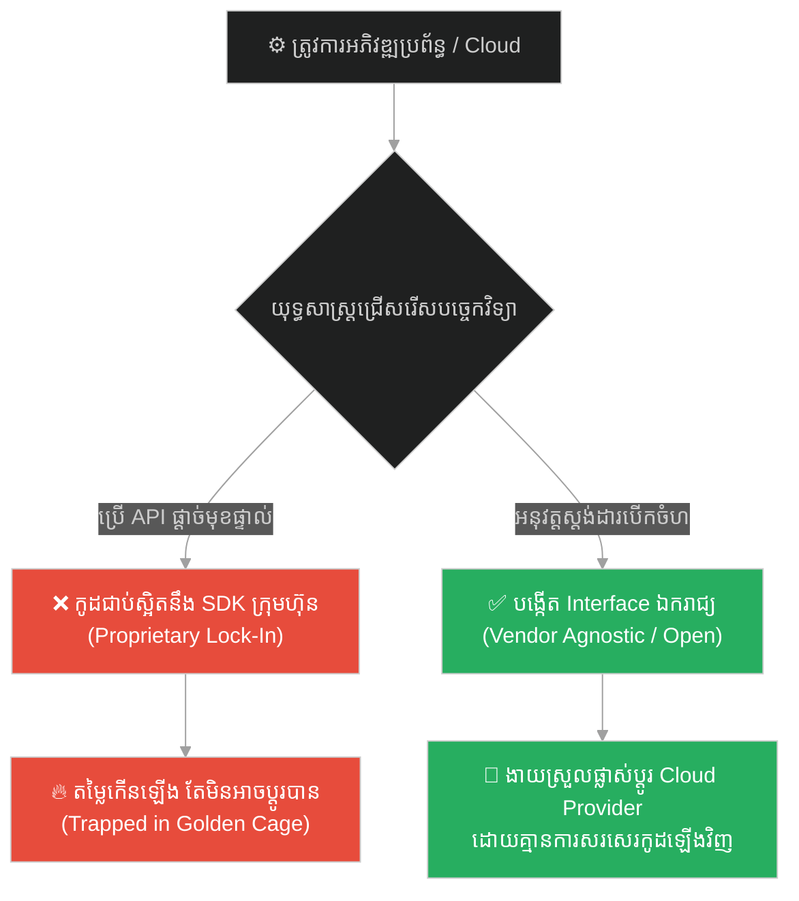
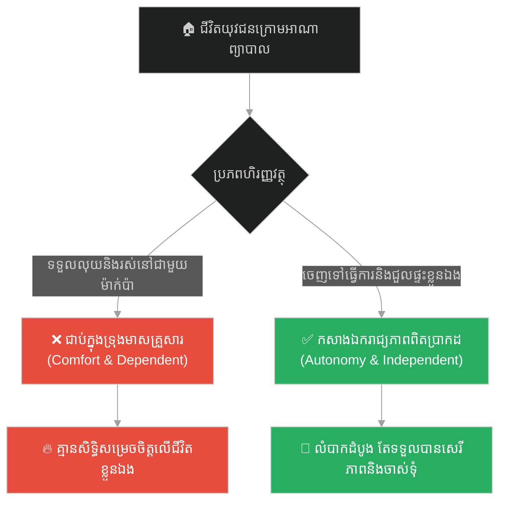
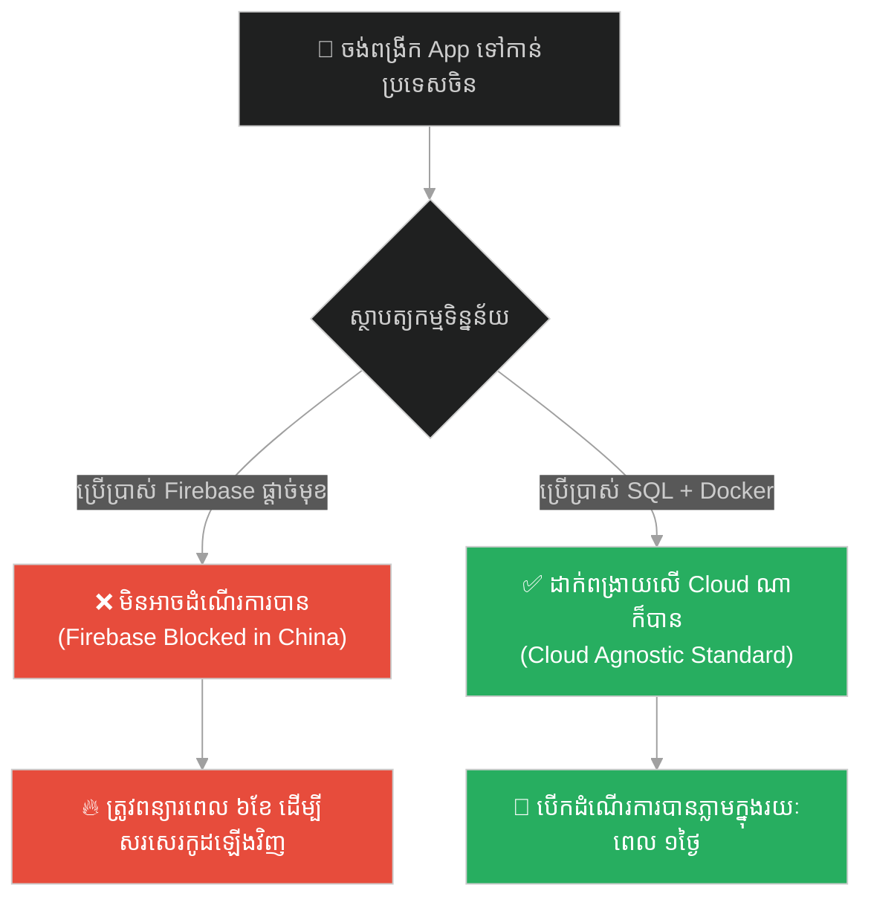
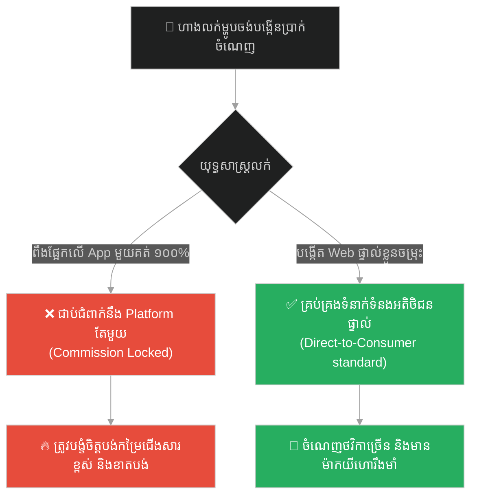
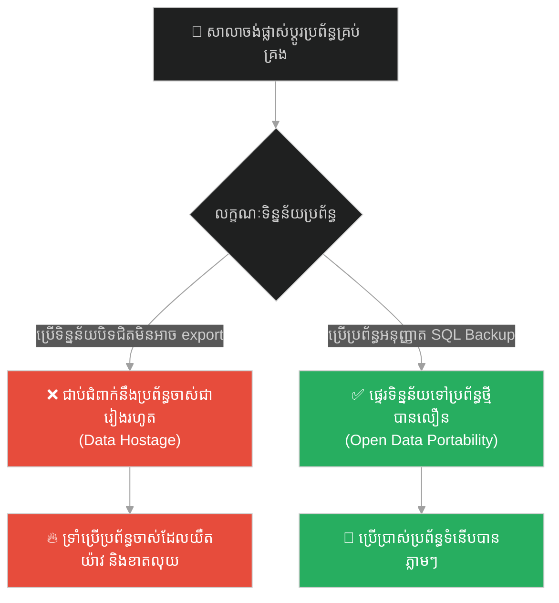
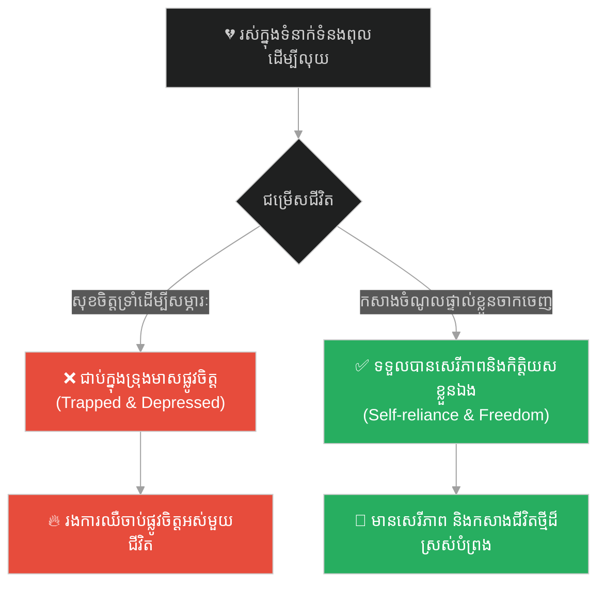
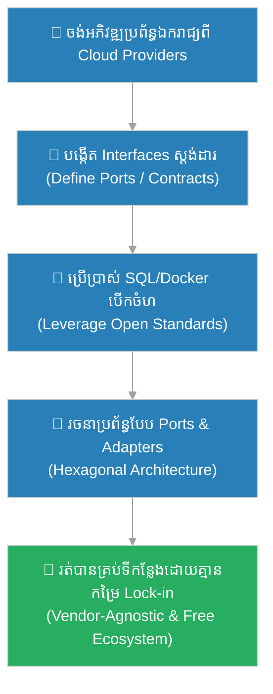

# Vendor Lock-In & Open Standards (ការជាប់ជំពាក់នឹងអ្នកផ្គត់ផ្គង់ និងស្តង់ដារបើកចំហ)៖ ព្រះពុទ្ធ និងទ្រុងមាស (Vendor Lock-In & Open Standards & Buddha and the Golden Cage)

**Author:** ichamrong  
**Date:** 2026-05-28  
**Tags:** #vendor-lock-in #open-standards #architecture #decoupling #dependency-inversion #buddhism  
**Category:** Concepts  
**Read Time:** ~15 min  

---

## 📌 មាតិកា (Table of Contents)
- [អន្ទាក់ផ្លូវចិត្ត (The Trap)](#0)
- [១. រឿងព្រេងប្រវត្តិសាស្ត្រ៖ បក្សីក្នុងទ្រុងមាស (The Legend of the Bird in the Golden Cage)](#1)
  - [ការត្រឡប់ទៅរកទ្រុងវិញ (Fleeing Back to Captivity)](#1-1)
- [២. បញ្ហា៖ ការពឹងផ្អែកលើបច្ចេកវិទ្យាផ្តាច់មុខ និងការលំបាកក្នុងការផ្លាស់ប្តូរ (The Issue: Proprietary Ecosystems & Migration Nightmare)](#2)
- [៣. ឧទាហរណ៍ជាក់ស្តែងក្នុងពិភពពិត (Real World Examples)](#3)
  - [ឧទាហរណ៍ទី ១ — កម្រិតស្រាល (គ្រួសារ)៖ ការពឹងផ្អែកលើហិរញ្ញវត្ថុរបស់ឪពុកម្តាយ (Financial Dependency on Parents)](#3-1)
  - [ឧទាហរណ៍ទី ២ — កម្រិតមធ្យម (បច្ចេកទេស)៖ ការប្រើប្រាស់ Database ផ្តាច់មុខរបស់ Cloud (Proprietary Cloud DB vs SQL Standard)](#3-2)
  - [ឧទាហរណ៍ទី ៣ — កម្រិតមធ្យម (ធុរកិច្ច)៖ ការលក់ផលិតផលផ្តាច់មុខលើ App របស់ក្រុមហ៊ុនដទៃ (Third-Party Platform Dependency)](#3-3)
  - [ឧទាហរណ៍ទី ៤ — កម្រិតមធ្យម (សង្គម/គ្រប់គ្រង)៖ ការប្រើប្រាស់កម្មវិធីគ្រប់គ្រងទិន្នន័យដែលមិនអាចទាញចេញបាន (Data Hostage Software)](#3-4)
  - [ឧទាហរណ៍ទី ៥ — កម្រិតធ្ងន់ (ទំនាក់ទំនង)៖ ការទ្រាំរស់ក្នុងទំនាក់ទំនងមិនល្អដើម្បីភាពសុខស្រួលសម្ភារៈ (Financial Comfort vs Personal Freedom)](#3-5)
- [៤. ដំណោះស្រាយទូទៅ៖ ស្ថាបត្យកម្មឆកោន និងការបញ្ច្រាសភាពអាស្រ័យ (The General Solution: Hexagonal Architecture & Dependency Inversion)](#4)
- [សេចក្តីសន្និដ្ឋាន (Conclusion)](#5)
- [ឯកសារយោង (References)](#6)
- [Related Posts](#7)

---

<a id="0"></a>
## អន្ទាក់ផ្លូវចិត្ត (The Trap)

តើអ្នកធ្លាប់ប្រើប្រាស់សេវាកម្ម Cloud មួយ (ដូចជា Firebase ឬ AWS DynamoDB) ព្រោះវាលឿន និងងាយស្រួលអភិវឌ្ឍនៅពេលដំបូង ប៉ុន្តែនៅពេលដែលតម្លៃកើនឡើង ឬប្រព័ន្ធត្រូវការប្តូរទៅកាន់ Server ផ្ទាល់ខ្លួន បែរជាត្រូវសរសេរកូដឡើងវិញទាំងអស់ (Rewrite 100%) ដែរឬទេ?

នេះគឺជា **The Vendor Lock-In Trap (អន្ទាក់នៃការជាប់ជំពាក់នឹងអ្នកផ្គត់ផ្គង់ និងការបាត់បង់ឯករាជ្យភាព)**។

* **[Side A (Proprietary Lock-in)]** — ប្រើប្រាស់ APIs និងបច្ចេកវិទ្យាផ្តាច់មុខផ្ទាល់របស់ក្រុមហ៊ុនផ្គត់ផ្គង់ (Golden Cage)។ វាងាយស្រួល និងរហ័សនៅដំណាក់កាលដំបូង ប៉ុន្តែបាត់បង់សេរីភាពក្នុងការផ្លាស់ប្តូរ និងត្រូវរងឥទ្ធិពលតម្លៃតាមចិត្តអ្នកលក់។
* **[Side B (Open Standards / Agnostic)]** — អភិវឌ្ឍប្រព័ន្ធដោយផ្អែកលើស្តង់ដារបើកចំហ (SQL, Docker, Kubernetes) និងរចនាកូដឱ្យដាច់ចេញពីបច្ចេកវិទ្យាក្រោម (Decoupled Architecture) ដើម្បីអាចផ្លាស់ប្តូរទីតាំងផ្ទុកទិន្នន័យបានគ្រប់ពេល។

ផែនទីបង្ហាញផ្លូវសម្រាប់អត្ថបទនេះ៖
1. **រឿងព្រេងប្រវត្តិសាស្ត្រ (The Historic Legend)** — រឿងរ៉ាវរបស់សត្វបក្សីដែលរស់នៅក្នុងទ្រុងមាស ហើយសុខចិត្តហោះត្រឡប់ចូលទ្រុងវិញព្រោះមិនចេះរស់នៅដោយឯករាជ្យ។
2. **បញ្ហាវិភាគ (The Issue)** — ការវិភាគបច្ចេកទេសអំពីការភ្ជាប់កូដស្នូលទៅនឹង SDK ផ្តាច់មុខ (Tight Coupling) និងវិធីដោះស្រាយ។
3. **ឧទាហរណ៍ជាក់ស្តែង (Real World Examples)** — ពិនិត្យមើលទ្រឹស្តីនេះលើ ៥ កម្រិតដើម្បីកសាងឯករាជ្យភាពផ្លូវចិត្ត និងបច្ចេកវិទ្យា។
4. **ដំណោះស្រាយទូទៅ (The General Solution)** — ការប្រើប្រាស់ Dependency Inversion (DIP) និង Repository Pattern។



---

<a id="1"></a>
## ១. រឿងព្រេងប្រវត្តិសាស្ត្រ៖ បក្សីក្នុងទ្រុងមាស (The Legend of the Bird in the Golden Cage)

នៅក្នុងរឿងព្រេងនិទានបុរាណ មានសត្វបក្សីដ៏ស្រស់ស្អាតមួយក្បាលដែលចេះច្រៀងចម្រៀងពីរោះៗយ៉ាងក្រៃលែង។ ព្រះរាជាស្រឡាញ់វាខ្លាំងណាស់ ក៏បានបញ្ជាឱ្យជាងមាសដ៏ចំណានធ្វើ **«ទ្រុងមាស»** ដ៏ប្រណីតមួយដើម្បីដាក់រូបវា។ ជារៀងរាល់ថ្ងៃ បក្សីនោះត្រូវបានគេផ្តល់ចំណីដ៏ឆ្ងាញ់បំផុត ទឹកស្អាត និងការថែទាំយ៉ាងយកចិត្តទុកដាក់បំផុត។

ទោះជាយ៉ាងនេះក្តី រាល់ពេលដែលវាសម្លឹងមើលទៅខាងក្រៅតាមចន្លោះចម្រឹងមាស វាឃើញបក្សីព្រៃដទៃទៀតកំពុងហោះហើរយ៉ាងសេរីនៅលើមេឃខៀវស្រឡះ និងទំលើមែកឈើតាមចិត្តប្រាថ្នា។ វាចង់បានសេរីភាពនោះជាខ្លាំង។

ថ្ងៃមួយ មានអ្នកប្រាជ្ញម្នាក់បានមកទស្សនារាជវាំង ហើយបានមកជិតទ្រុងរបស់វា។ បក្សីបានខ្សឹបប្រាប់អ្នកប្រាជ្ញថា៖
> «លោកម្ចាស់អើយ! ខ្ញុំរស់នៅក្នុងទ្រុងមាសនេះ ហាក់ដូចជាជាប់គុកដូច្នោះដែរ។ តើលោកអាចជួយប្រាប់វិធីឱ្យខ្ញុំទទួលបានសេរីភាពឡើងវិញបានទេ?»

អ្នកប្រាជ្ញបានខ្សឹបប្រាប់វិធីសាស្ត្រមួយដល់វា៖
> «នៅពេលដែលអ្នកបម្រើយកចំណីមកឱ្យ ចូរឯងធ្វើពុតជាស្លាប់ ដេកផ្ងារជើងស្ងៀមមិនដកដង្ហើមឡើយ។»

---

<a id="1-1"></a>
### ការត្រឡប់ទៅរកទ្រុងវិញ (Fleeing Back to Captivity)

នៅព្រឹកបន្ទាប់ នៅពេលដែលអ្នកបម្រើបើកទ្វារទ្រុងដើម្បីដាក់ចំណី ស្រាប់តែឃើញបក្សីដេកស្ងៀម គ្មានចលនា។ អ្នកបម្រើភ័យស្លន់ស្លោខ្លាំងណាស់ ព្រោះខ្លាចព្រះរាជាដាក់ទោស ក៏យកដៃចាប់បក្សីនោះចេញពីទ្រុង យកមកដាក់លើតុខាងក្រៅដើម្បីពិនិត្យមើល។

គ្រាន់តែដៃរបស់អ្នកបម្រើលែងចេញភ្លាម បក្សីក៏បើកភ្នែក ត្រដាងស្លាប ហោះវឹងចេញទៅក្រៅបង្អួចរាជវាំងយ៉ាងលឿន សំដៅទៅកាន់ព្រៃភ្នំដ៏ធំល្វឹងល្វើយ។ វាបានហោះទៅទំលើមែកឈើខ្ពស់មួយ រួចស្រែកច្រៀងដោយក្តីរីករាយជាខ្លាំង៖
> «ខ្ញុំមានសេរីភាពហើយ! ខ្ញុំមិនបាច់រស់នៅក្នុងទ្រុងមាសទៀតទេ!»

ប៉ុន្តែមិនយូរប៉ុន្មាន ភាពរីករាយក៏រលាយបាត់ទៅ។ ពេលមេឃងងឹត ព្យុះភ្លៀងបានបោកបក់មកយ៉ាងខ្លាំង ធ្វើឱ្យវាត្រូវទឹកភ្លៀងរងាញ័រញាក់ពេញមួយយប់ (ព្រោះគ្មានដំបូលទ្រុងការពារ)។ នៅព្រឹកឡើង វាមិនដឹងថាត្រូវស្វែងរកចំណីនៅទីណា និងរកដោយរបៀបណាឡើយ ព្រោះតាំងពីកើតមក គឺធ្លាប់តែមានគេបញ្ចុកចំណីស្រាប់ៗនៅក្នុងទ្រុង។

ទីបំផុត ដោយមិនអាចទ្រាំទ្រនឹងភាពលំបាក និងការទទួលខុសត្រូវនៃការរស់នៅដោយសេរីក្នុងព្រៃបាន បក្សីដ៏ទន់ខ្សោយនោះបានសម្រេចចិត្តហោះត្រឡប់មកកាន់រាជវាំងវិញ។ វាបានលូនចូលទៅក្នុងទ្រុងមាសនោះវិញដោយខ្លួនឯង រួចទាញទ្វារទ្រុងបិទជិតពីខាងក្នុង ដើម្បីរង់ចាំចំណីឥតគិតថ្លៃ និងភាពសុខស្រួលដដែល។

---

<a id="2"></a>
## ២. បញ្ហា៖ ការពឹងផ្អែកលើបច្ចេកវិទ្យាផ្តាច់មុខ និងការលំបាកក្នុងការផ្លាស់ប្តូរ (The Issue: Proprietary Ecosystems & Migration Nightmare)

នៅក្នុងបច្ចេកវិទ្យា «ទ្រុងមាស» គឺជារាល់សេវាកម្ម Cloud APIs ផ្តាច់មុខ (Proprietary SDKs)។ Developers ជាច្រើនបានសរសេរកូដដោយភ្ជាប់ទំនាក់ទំនងកូដស្នូល (Domain Business Logic) ទៅនឹង API ទាំងនោះផ្ទាល់ (Tight Coupling)។

ឧទាហរណ៍៖ ការសរសេរ Firebase database queries នៅក្នុងរាល់ Controller files។ នៅពេលដែលក្រុមហ៊ុនចង់ប្តូរទៅកាន់ PostgreSQL ដើម្បីកាត់បន្ថយចំណាយ ឬដើម្បីរក្សាសុវត្ថិភាពទិន្នន័យផ្ទាល់ខ្លួន ពួកគេមិនអាចធ្វើបានឡើយ ព្រោះត្រូវរុះរើ និងសរសេរកូដឡើងវិញរាប់សែនបន្ទាត់។ ពួកគេសុខចិត្តទ្រាំបង់ប្រាក់ថ្លៃសេវាកម្មយ៉ាងច្រើន (ជាប់ក្នុងទ្រុងមាស) ព្រោះខ្លាចភាពលំបាកនៃការរុះរើកូដ។

សូមប្រៀបធៀបគំរូកូដទាំងពីរ៖

### កូដដែលជាប់ស្អិតនឹង SDK ផ្តាច់មុខ (Tight Coupling - Golden Cage Trap)
```typescript
// ❌ កូដភ្ជាប់ទៅនឹង Firebase SDK ផ្ទាល់នៅក្នុងរាល់ឯកសារ Logic (លំបាកផ្លាស់ប្តូរ)
import { getFirestore, doc, setDoc } from 'firebase/app';

// នៅក្នុង Controller: logic ជាប់ស្អិតនឹង Firebase SDK ទាំងស្រុង
export async function createUserController(req: any, res: any) {
    const db = getFirestore();
    const user = { name: req.body.name, email: req.body.email };
    
    // បើថ្ងៃក្រោយចង់ដូរទៅ Postgres ត្រូវតែមកកែកូដត្រង់នេះ និងគ្រប់ទីកន្លែងដទៃទៀត
    await setDoc(doc(db, "users", req.body.id), user);
    
    res.status(201).json({ success: true });
}
```

### កូដដែលប្រើប្រាស់ Interface និង Dependency Inversion (Decoupled - Open Standard)
```typescript
// ✅ បង្កើតប្លង់ Interface (Open Contract) ឯករាជ្យពីបច្ចេកវិទ្យាក្រោម
interface UserRepository {
    save(user: User): Promise<void>;
}

// នៅក្នុង Controller: ហៅប្រើប្រាស់តែ Interface ប៉ុណ្ណោះ (មិនខ្វល់ថាជា DB អ្វីឡើយ)
export class UserController {
    constructor(private userRepo: UserRepository) {}

    public async createUser(req: Request, res: Response): Promise<void> {
        const user = new User(req.body.name, req.body.email);
        
        // ដំណើរការរក្សាទុកតាមរយៈ Interface
        await this.userRepo.save(user);
        
        res.status(201).json({ success: true });
    }
}

// ការបង្កើត Class ជាក់ស្តែងសម្រាប់ Postgres (ងាយស្រួលប្តូរដោយគ្មានការកែកូដក្នុង Controller)
export class PostgresUserRepository implements UserRepository {
    public async save(user: User): Promise<void> {
        await pgPool.query('INSERT INTO users(name, email) VALUES($1, $2)', [user.name, user.email]);
    }
}
```

---

<a id="3"></a>
## ៣. ឧទាហរណ៍ជាក់ស្តែងក្នុងពិភពពិត

---

<a id="3-1"></a>
### ឧទាហរណ៍ទី ១ — កម្រិតស្រាល (គ្រួសារ)៖ ការពឹងផ្អែកលើហិរញ្ញវត្ថុរបស់ឪពុកម្តាយ (Financial Dependency on Parents)

**ស្ថានភាព៖** យុវជនម្នាក់អាយុ ២៥ ឆ្នាំ ចង់មានសេរីភាពក្នុងការសម្រេចចិត្តលើជីវិតផ្ទាល់ខ្លួន ប៉ុន្តែរស់នៅក្រោមការគ្រប់គ្រងរបស់ឪពុកម្តាយជានិច្ច។

* **ជម្រើសខុស (Golden Cage):** បន្តរស់នៅក្នុងផ្ទះវីឡាដ៏ធំរបស់ឪពុកម្តាយ និងទទួលប្រាក់ឧបត្ថម្ភប្រចាំខែ (សុខស្រួល តែត្រូវស្តាប់បង្គាប់ និងគ្មានសិទ្ធិសម្រេចចិត្តអ្វីឡើយ)។
* **ជម្រើសត្រូវ (Open Standards / Independence):** សម្រេចចិត្តចេញទៅជួលបន្ទប់តូចល្មមរស់នៅខ្លួនឯង ធ្វើការងាររកប្រាក់ចំណូលដោយផ្ទាល់ ដើម្បីទទួលបានសេរីភាពពេញលេញក្នុងការដឹកនាំជីវិត។



---

<a id="3-2"></a>
### ឧទាហរណ៍ទី ២ — កម្រិតមធ្យម (បច្ចេកទេស)៖ ការប្រើប្រាស់ Database ផ្តាច់មុខរបស់ Cloud (Proprietary Cloud DB vs SQL Standard)

**ស្ថានភាព៖** ក្រុមហ៊ុនអភិវឌ្ឍន៍ App ចង់ពង្រីកសេវាកម្មទៅកាន់ប្រទេសចិន ដែលទីនោះគ្មានសេវាកម្ម Google Cloud (Firebase) ឡើយ។

* **ជម្រើសខុស (Firebase Only):** ដោយសារកូដរបស់ App ជាប់ស្អិតនឹង Firebase ទាំងស្រុង ក្រុមហ៊ុនត្រូវតែចំណាយពេល ៦ ខែដើម្បីសរសេរកូដឡើងវិញទាំងស្រុង ដើម្បីដំណើរការនៅចិន។
* **ជម្រើសត្រូវ (PostgreSQL/Docker):** ប្រើប្រាស់ PostgreSQL ដែលជាស្តង់ដារបើកចំហ និងវេចខ្ចប់ដោយ Docker ដែលអាចយកទៅដំឡើងនៅលើ Cloud ណាក៏បាន (Alibaba Cloud, AWS, GCP) ដោយគ្មានការកែកូដ។



---

<a id="3-3"></a>
### ឧទាហរណ៍ទី ៣ — កម្រិតមធ្យម (ធុរកិច្ច)៖ ការលក់ផលិតផលផ្តាច់មុខលើ App របស់ក្រុមហ៊ុនដទៃ (Third-Party Platform Dependency)

**ស្ថានភាព៖** ហាងលក់ម្ហូបមួយ កំពុងលក់ដាច់ខ្លាំងតាមរយៈ App ដឹកជញ្ជូនផ្តាច់មុខមួយ (ដូចជា Grab Food)។

* **ជម្រើសខុស (Platform Dependency):** ពឹងផ្អែកលើ App នោះ ១០០% ដោយមិនបង្កើតបណ្តាញផ្ទាល់ខ្លួន។ នៅពេល App នោះដំឡើងថ្លៃសេវា (Commission 35%) ហាងក៏ចាប់ផ្តើមខាតបង់ តែមិនអាចឈប់លក់បានព្រោះគ្មានអតិថិជនស្គាល់ផ្ទាល់។
* **ជម្រើសត្រូវ (Multi-channel / Own Web):** បង្កើតគេហទំព័រផ្ទាល់ខ្លួន និងប្រព័ន្ធដឹកជញ្ជូនផ្ទាល់ខ្លួន រួមជាមួយការលក់លើ App ច្រើនចម្រុះ ដើម្បីកុំឱ្យធ្លាក់ក្រោមឥទ្ធិពលរបស់ភាគីតែមួយ។



---

<a id="3-4"></a>
### ឧទាហរណ៍ទី ៤ — កម្រិតមធ្យម (សង្គម/គ្រប់គ្រង)៖ ការប្រើប្រាស់កម្មវិធីគ្រប់គ្រងទិន្នន័យដែលមិនអាចទាញចេញបាន (Data Hostage Software)

**ស្ថានភាព៖** សាលារៀនមួយចង់ផ្លាស់ប្តូរប្រព័ន្ធគ្រប់គ្រងសិស្ស (School Management System) ទៅកាន់ប្រព័ន្ធថ្មីដែលល្អជាង។

* **ជម្រើសខុស (Proprietary Data Format):** ប្រើប្រាស់ប្រព័ន្ធចាស់ដែលផ្ទុកទិន្នន័យក្នុង Format ផ្តាច់មុខ ដែលមិនអនុញ្ញាតឱ្យទាញចេញ (Export) ជាឯកសារ Excel/CSV ធម្មតាបានឡើយ (ទិន្នន័យត្រូវខ្ទាស់ជាប់នឹងប្រព័ន្ធ)។
* **ជម្រើសត្រូវ (Open SQL Backup):** ជ្រើសរើសប្រព័ន្ធណាដែលប្រើប្រាស់ Database បែបបើកចំហ (ដូចជា MySQL) ដែលអនុញ្ញាតឱ្យទាញយកឯកសារ Backup (SQL/CSV) បានគ្រប់ពេលយ៉ាងងាយស្រួល។



---

<a id="3-5"></a>
### ឧទាហរណ៍ទី ៥ — កម្រិតធ្ងន់ (ទំនាក់ទំនង)៖ ការទ្រាំរស់ក្នុងទំនាក់ទំនងមិនល្អដើម្បីភាពសុខស្រួលសម្ភារៈ (Financial Comfort vs Personal Freedom)

**ស្ថានភាព៖** ស្ត្រីម្នាក់រស់នៅក្នុងគ្រួសារដែលមានទ្រព្យសម្បត្តិស្តុកស្តម្ភ តែស្វាមីតែងតែធ្វើបាបផ្លូវចិត្ត និងមិនគោរពតម្លៃរបស់នាងឡើយ។

* **ជម្រើសខុស (Comfort zone lock-in):** ទ្រាំរស់នៅក្នុងផ្ទះវីឡា និងចាយវាយលុយរបស់ប្តី (ទ្រុងមាស) ព្រោះខ្លាចភាពលំបាកក្នុងការចេញទៅរកការងារធ្វើ និងរស់នៅម្នាក់ឯង។
* **ជម្រើសត្រូវ (Emotional Freedom / Self-reliance):** ចាប់ផ្តើមរៀនសូត្រជំនាញថ្មី រកការងារធ្វើដើម្បីអាចចិញ្ចឹមខ្លួនឯងបាន រួចសម្រេចចិត្តចាកចេញពីទំនាក់ទំនងពុលនោះ ដើម្បីសេរីភាពផ្លូវចិត្តពិតប្រាកដ។



---

<a id="4"></a>
## ៤. ដំណោះស្រាយទូទៅ៖ ស្ថាបត្យកម្មឆកោន និងការបញ្ច្រាសភាពអាស្រ័យ (The General Solution: Hexagonal Architecture & Dependency Inversion)

ដើម្បីចៀសវាងបញ្ហា **Vendor Lock-In** និងធានាឱ្យប្រព័ន្ធការងាររបស់អ្នកមានឯករាជ្យភាពខ្ពស់ ចូរអនុវត្តជំហានខាងក្រោម៖

1. **អនុវត្តគោលការណ៍ Dependency Inversion Principle (DIP)៖**
   កុំឱ្យកូដស្នូល (High-level Domain Logic) អាស្រ័យលើបច្ចេកវិទ្យាក្រោម (Low-level Cloud SDKs) ឡើយ។ ត្រូវបង្កើត Interface ឬ Port ជា «កិច្ចសន្យារួម (Contracts)»។ បច្ចេកវិទ្យាក្រោមត្រូវតែអនុវត្តតាម Interface នោះវិញ (Adaptors)។
2. **ប្រើប្រាស់ស្តង់ដារបើកចំហ (Open Standards)៖**
   ជ្រើសរើសបច្ចេកវិទ្យាណាដែលមានលក្ខណៈ Agnostic ដូចជា SQL សម្រាប់ Database, Docker សម្រាប់ដំណើរការ Container, Kubernetes សម្រាប់ចាត់ចែងប្រព័ន្ធ និង gRPC/REST សម្រាប់ទំនាក់ទំនង។ វានឹងធានាថាអ្នកអាចរើប្រព័ន្ធចេញពី Cloud មួយទៅ Cloud មួយទៀតបានយ៉ាងងាយស្រួល។
3. **អនុវត្តស្ថាបត្យកម្មឆកោន (Hexagonal Architecture / Ports and Adapters)៖**
   បំបែកប្រព័ន្ធជា ៣ ផ្នែក៖ Core Domain (Logic ស្នូល), Ports (Interface សម្រាប់ទាក់ទងខាងក្រៅ), និង Adapters (ការអនុវត្តជាក់ស្តែងជាមួយ AWS, Postgres, WebUI)។ វិធីនេះធ្វើឱ្យការផ្លាស់ប្តូរ Adapter ខាងក្រៅ មិនប៉ះពាល់ដល់ Core Domain ឡើយ ១០០%។



---

## 🐇 ធ្លាក់ចូលក្នុងរន្ធទន្សាយ (Enter the Rabbit Hole)
เพื่อស្វែងយល់ពីរបៀបរៀបចំប្រព័ន្ធឱ្យមានភាពបត់បែន និងការបែងចែកការទទួលខុសត្រូវរវាងប្រព័ន្ធគូស្នូល (Decoupled Components) តាមរយៈការវិភាគមេរៀននៃការកសាងរទេះសេះ សូមបន្តដំណើរទៅកាន់៖

* 🚀 **[ចាប់ផ្តើមដំណើររុករក (Start the Journey) ➔ Decoupled Components & Systemic Integrity (ការបំបែកសមាសភាគ និងបូរណភាពប្រព័ន្ធ)៖ ព្រះពុទ្ធ និងរទេះចម្បាំង](./160-buddha-and-the-chariot.md)**

---

<a id="5"></a>
## សេចក្តីសន្និដ្ឋាន (Conclusion)

> **«បក្សីដ៏ទន់ខ្សោយ ដោយមិនអាចទ្រាំទ្រនឹងភាពលំបាកនៃការរស់នៅដោយសេរីក្នុងព្រៃបាន វាបានសម្រេចចិត្តហោះត្រឡប់មកចូលក្នុងទ្រុងមាសនោះវិញដោយខ្លួនឯង។»**

ទ្រុងមាស ជានិមិត្តរូបនៃ «ភាពសុខស្រួលឥតគិតថ្លៃ» ដែលដោះដូរមកវិញនូវ «ការបាត់បង់សេរីភាព និងឯករាជ្យភាព»។ នៅក្នុងការរចនាប្រព័ន្ធបច្ចេកវិទ្យា ក៏ដូចជានៅក្នុងការរស់នៅប្រចាំថ្ងៃ ការជ្រើសរើសយកបច្ចេកវិទ្យា ឬទំនាក់ទំនងដែលផ្ដល់ភាពសុខស្រួលលឿនរហ័សនៅពេលដំបូង តែងតែនាំមកនូវការ Lock-In ជាប់គុកនៅពេលក្រោយ។ ប្រសិនបើចង់ទទួលបានសេរីភាពពិតប្រាកដ ចូរហ៊ានលះបង់ភាពសុខស្រួលបណ្តោះអាសន្ន រៀនរចនាប្រព័ន្ធដោយផ្អែកលើស្តង់ដារបើកចំហ (Open Standards) និងកសាងសមត្ថភាពឯករាជ្យ ដើម្បីឱ្យជីវិត និងបច្ចេកវិទ្យារបស់អ្នកអាចហោះហើរលើមេឃដ៏ធំទូលាយបានដោយសេរីភាពពេញលេញជានិច្ច។

---

<a id="6"></a>
## ឯកសារយោង (References)

* **Martin, R. C. (Uncle Bob)** — *Clean Architecture: A Craftsman's Guide to Software Structure and Design* (2017). គោលការណ៍ SOLID និងការរចនាកូដកុំឱ្យជាប់ស្អិតនឹង Vendors។
* **Cockburn, A.** — *Hexagonal Architecture (Ports and Adapters)* (2005). ស្ថាបត្យកម្មឆកោន។
* **Fromm, E.** — *Escape from Freedom* (1941). ការសិក្សាចិត្តវិទ្យាអំពីការរត់គេចពីសេរីភាព និងការជ្រើសរើសយកភាពងាយស្រួល។

---

<a id="7"></a>
## Related Posts

* **[Blameless Incident Reviews & Systemic Attribution (ការវិភាគវិបត្តិដោយគ្មានការទម្លាក់កំហុស និងការវិពន្ធនាការជាប្រព័ន្ធ)៖ ព្រះពុទ្ធ និងទូកទទេ](./158-buddha-and-the-empty-boat.md)**
* **[The Weaver and the Emperor's Robe (អ្នកត្បាញក្រណាត់ និងអាវធំព្រះរាជា)៖ គ្រោះថ្នាក់នៃការកាត់បន្ថយចំណាយលើផ្នែកសំខាន់ និងមហន្តរាយនៃការមើលរំលងតួនាទីតូចតាច](./16-the-weaver-and-the-emperors-robe.md)**
