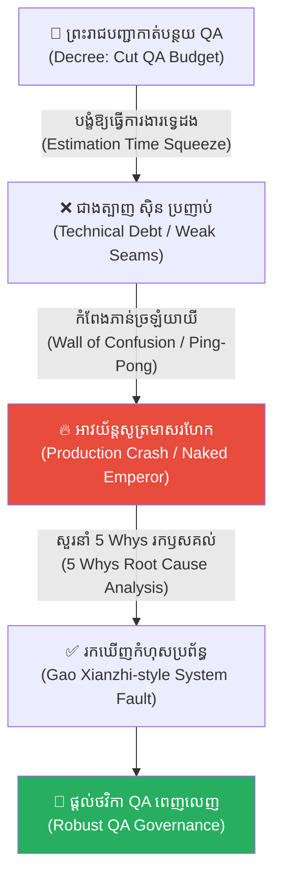
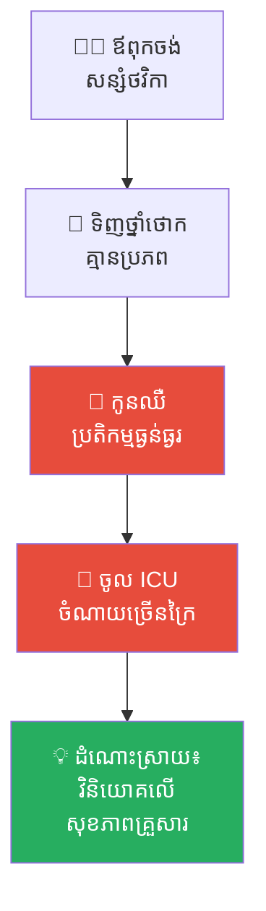
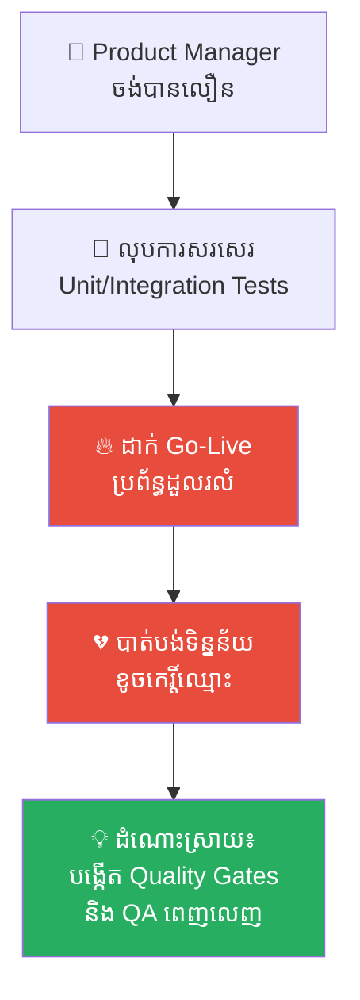
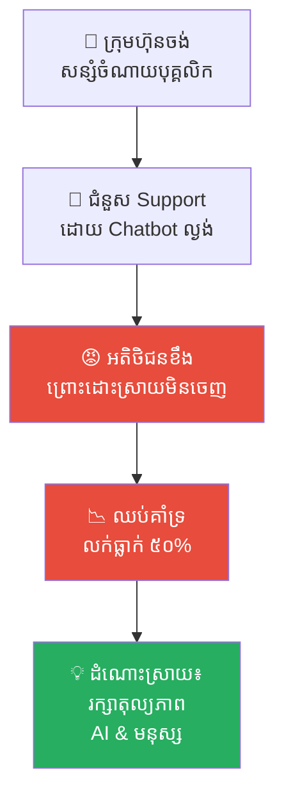
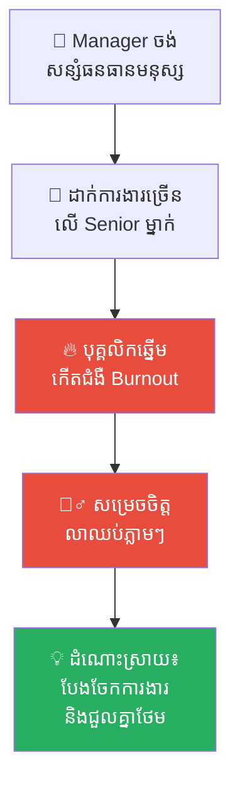
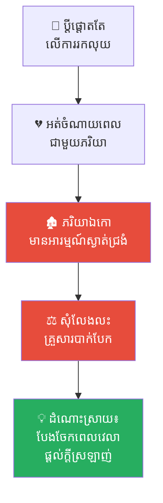
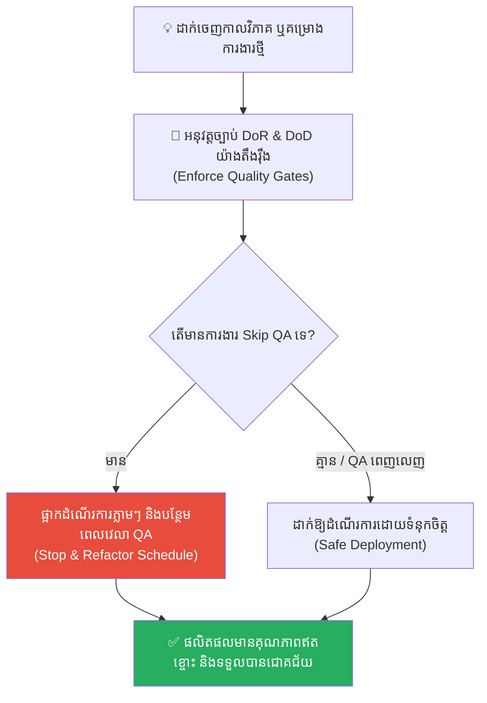

# The Weaver and the Emperor's Robe (អ្នកត្បាញសូត្រ និងអាវយ័ន្តអធិរាជ)៖ គ្រោះថ្នាក់នៃការកាត់បន្ថយចំណាយលើផ្នែកសំខាន់ និងមហន្តរាយនៃការមើលរំលងតួនាទីតូចតាច

**Author:** ichamrong  
**Date:** 2026-05-17  
**Tags:** #no-qa-budget #estimation-trap #wall-of-confusion #scapegoating #5-whys #engineering-management #chinese-history #critical-thinking  
**Category:** Concepts  
**Read Time:** ~15 min  

---

## 📌 មាតិកា (Table of Contents)
- [អន្ទាក់ផ្លូវចិត្ត (The Trap)](#អន្ទាក់ផ្លូវចិត្ត-the-trap)
- [១. រឿងព្រេង៖ ព្រះរាជបញ្ជារបស់អធិរាជ និងការកាត់បន្ថយថ្លៃសេវា (The Emperor's Decree & The Cost-Cutting)](#1)
  - [អន្ទាក់ពេលវេលាទ្វេដងរបស់ ជាងត្បាញ ស៊ិន (Shen's Double-Job Trap)](#1-1)
  - [កំពែងភាន់ច្រឡំ និងសោកនាដកម្មនៅថ្ងៃបុណ្យច្រត់ព្រះនង្គ័ល (The Wall of Confusion & Production Crash)](#1-2)
- [២. បញ្ហា៖ ការស្វែងរកឫសគល់ពិតប្រាកដដោយ ៥ Whys (The Issue: The Emperor's 5 Whys Analysis)](#2)
- [៣. ឧទាហរណ៍ជាក់ស្តែងក្នុងពិភពពិត (Real World Examples)](#3)
  - [ឧទាហរណ៍ទី ១ — កម្រិតស្រាល (គ្រួសារ)៖ ការកាត់បន្ថយចំណាយលើការថែទាំសុខភាពគ្រួសារ (The Cut-Rate Medical Check)](#3-1)
  - [ឧទាហរណ៍ទី ២ — កម្រិតមធ្យម (បច្ចេកទេស)៖ ការលុបបំបាត់ QA/Testing នៅក្នុងគម្រោងសូហ្វវែរ (Skipping Unit/Integration Tests)](#3-2)
  - [ឧទាហរណ៍ទី ៣ — កម្រិតមធ្យម (ធុរកិច្ច)៖ ការកាត់បន្ថយសេវាកម្មគាំទ្រអតិថិជន (Cutting Customer Support)](#3-3)
  - [ឧទាហរណ៍ទី ៤ — កម្រិតមធ្យម (សង្គម/គ្រប់គ្រង)៖ ការដាក់ទម្ងន់ការងារលើបុគ្គលិកឆ្នើម (The Burden of Excellence)](#3-4)
  - [ឧទាហរណ៍ទី ៥ — កម្រិតធ្ងន់ (ទំនាក់ទំនង)៖ ការកាត់បន្ថយពេលវេលាជាមួយដៃគូជីវិត (The Starved Relationship)](#3-5)
- [៤. ដំណោះស្រាយទូទៅ៖ ការវិភាគគ្រប់គ្រងគម្រោង និងការការពារ QA (The General Solution: Quality Governance)](#4)
- [សេចក្តីសន្និដ្ឋាន (Conclusion)](#conclusion)
- [ឯកសារយោង (References)](#references)
- [Related Posts](#related-posts)

---

## អន្ទាក់ផ្លូវចិត្ត (The Trap)

តើអ្នកធ្លាប់ជួបស្ថានភាពដែលថ្នាក់ដឹកនាំ ឬអតិថិជនសម្រេចចិត្តកាត់បន្ថយ «ថវិកាត្រួតពិនិត្យគុណភាព» (Quality Assurance/Testing) ដើម្បីសន្សំសំចៃលុយកាក់ ប៉ុន្តែលទ្ធផលចុងក្រោយ បែរជាប្រព័ន្ធត្រូវបាក់រលំទាំងស្រុង និងខាតបង់ថវិកាច្រើនជាងមុនរាប់សិបដងដែរឬទេ?

នេះគឺជា **The Cost-Cutting QA Trap (អន្ទាក់នៃការសន្សំសំចៃខុសគោលដៅ)**។ 

នៅក្នុងការគ្រប់គ្រងគម្រោង ឬអាជីវកម្ម ជារឿយៗយើងតែងតែមើលឃើញក្រុមត្រួតពិនិត្យគុណភាព (QA) ដូចជា «ចំណាយឥតប្រយោជន៍» ព្រោះពួកគេមិនមែនជាអ្នកផលិត ឬសរសេរកូដផ្ទាល់។ យើងលុបបំបាត់ពួកគេចោល និងបង្ខំឱ្យអ្នកផលិត ដើរតួជាអ្នកត្រួតពិនិត្យខ្លួនឯង ក្នុងកាលវិភាគការងារដែលចង្អៀតខ្លាំង។ ទង្វើដ៏ល្ងង់ខ្លៅនេះ បង្ខំឱ្យអ្នកផលិតលះបង់ «គុណភាពគ្រឹះខាងក្នុង» ដើម្បីសម្រេចឱ្យទាន់ពេលខាងក្រៅ (Technical Debt) ដែលចុងក្រោយនឹងផ្ទុះឡើងជាមហន្តរាយដ៏ខ្មាសអៀនបំផុតកណ្តាលទីផ្សារ។

ដើម្បីយល់ដឹងឱ្យបានគ្រប់ជ្រុងជ្រោយ នេះជាផែនទីបង្ហាញផ្លូវសម្រាប់អត្ថបទនេះ៖
1. **រឿងព្រេងប្រវត្តិសាស្ត្រចិន (The Han Dynasty Fable)** — រឿងរ៉ាវរបស់អធិរាជ Han Wudi មន្ត្រីចាវ ជាងត្បាញសូត្រ Shen និងសោកនាដកម្មអាវយ័ន្តមាសរហែកកណ្តាលវាលពិធីបុណ្យច្រត់ព្រះនង្គ័ល។
2. **បញ្ហា (The Issue)** — ការវិភាគទ្រឹស្តី 5 Whys និងផលប៉ះពាល់នៃការលុបបំបាត់ QA (No QA Budget) និងកំពែងភាន់ច្រឡំ (Wall of Confusion)។
3. **ឧទាហរណ៍ជាក់ស្តែងក្នុងពិភពពិត (Real World Examples)** — ពិនិត្យមើលឥទ្ធិពលនេះក្នុងកម្រិតគ្រួសារ ការងារបច្ចេកទេស ធុរកិច្ច ការគ្រប់គ្រង និងទំនាក់ទំនងស្នេហា។
4. **ដំណោះស្រាយទូទៅ (The General Solution)** — ការបង្កើតប្រព័ន្ធគ្រប់គ្រងគុណភាព (Quality Governance) និងការគោរពសិទ្ធិរបស់ QA។

---

## ១. រឿងព្រេង៖ ព្រះរាជបញ្ជារបស់អធិរាជ និងការកាត់បន្ថយថ្លៃសេវា (The Emperor's Decree & The Cost-Cutting)

នៅក្នុងសម័យរាជវង្សហាន (Han Dynasty) នៃប្រទេសចិនបុរាណ នាព្រះរាជវាំងឡុងអាន ក្រុងឆាងអាន ព្រះអធិរាជដ៏មានមហិទ្ធិឫទ្ធិនាម **ហាន វូទី (Emperor Wu of Han)** មានព្រះរាជបំណងចង់បាន **«អាវយ័ន្តសូត្រមាស»** ដ៏ប្រណីតមួយ ដែលត្បាញចេញពីសរសៃសូត្រដ៏ល្អឥតខ្ចោះបំផុត ដើម្បីគ្រងក្នុងពិធីបុណ្យច្រត់ព្រះនង្គ័លជាតិខាងមុខ បង្ហាញពីបារមីរបស់ព្រះអង្គនៅចំពោះមុខប្រជារាស្ត្ររាប់ម៉ឺននាក់។

ទោះជាយ៉ាងណា ព្រះអធិរាជរូបនេះក៏ល្បីខាងការសន្សំសំចៃថវិការាជវាំងយ៉ាងខ្លាំង។ នៅពេលរៀបចំផែនការសាងសង់អាវ ព្រះអង្គបានសម្លឹងមើលទៅបញ្ជីចំណាយ រួចស្រែកបន្ទោសទៅកាន់ **មន្ត្រីចាវ (Minister Zhao)** ដែលជាអ្នកគ្រប់គ្រងគម្រោងរាជវាំង៖
> *«ហេតុអ្វីបានជាត្រូវចំណាយប្រាក់យ៉ាងច្រើនទៅលើ 'ក្រុមអ្នកត្រួតពិនិត្យសរសៃសូត្រ' (Quality Assurance)? ពួកគេមិនមែនជាអ្នកត្បាញផង! គ្រាន់តែឈរមើល និងចង្អុលបង្ហាញកំហុសសោះ ហេតុអ្វីត្រូវចំណាយមាសប្រាក់ទៅលើពួកគេ? កាត់បន្ថយផ្នែកនេះចោលភ្លាម! ចូរឱ្យជាងត្បាញ ធ្វើជាអ្នកត្រួតពិនិត្យសូត្រដោយខ្លួនឯងទៅ!»*

មន្ត្រីចាវ ជាមនុស្សទន់ជ្រាយ គ្មានភាពក្លាហានក្នុងការទាស់ទែង ឬពន្យល់ពីផលប៉ះពាល់ដល់ព្រះអធិរាជឡើយ។ គាត់បានទទួលយកបញ្ជាទាំងញ័ររន្ធត់ រួចសម្រេចចិត្ត **លុបបំបាត់ក្រុមអ្នកត្រួតពិនិត្យគុណភាពសូត្រចេញពីគម្រោងទាំងស្រុង (No QA Budget)**។

---

### អន្ទាក់ពេលវេលាទ្វេដងរបស់ ជាងត្បាញ ស៊ិន (Shen's Double-Job Trap)

មន្ត្រីចាវ បានធ្វើដំណើរទៅកាន់រោងត្បាញសូត្ររាជវាំង រួចប្រគល់ភារកិច្ចនេះទៅឱ្យ **ជាងត្បាញ ស៊ិន (Master Shen)** ដែលជាមេជាងត្បាញសូត្រដ៏ជំនាញបំផុតប្រចាំអាណាចក្រ៖
> *«មេជាង ស៊ិន! ព្រះអធិរាជចង់បានអាវយ័ន្តសូត្រមាសដ៏ល្អឥតខ្ចោះក្នុងរយៈពេល ១០ ថ្ងៃ។ ប៉ុន្តែ យើងគ្មានថវិកាសម្រាប់ជួលអ្នកត្រួតពិនិត្យគុណភាពសូត្រឡើយ។ ដូច្នេះ ឯងត្រូវតែត្បាញផង និងត្រួតពិនិត្យគុណភាពសរសៃសូត្រនីមួយៗដោយខ្លួនឯងផង។ ចូរចងចាំថា អាវនេះត្រូវតែគ្មានកំហុសសូម្បីតែមួយមីលីម៉ែត្រ!»*

មេជាង ស៊ិន ស្រឡាំងកាំង រួចពន្យល់ដោយហេតុផលបច្ចេកទេស៖
> *«លោកម្ចាស់ចាវ! ការត្បាញអាវធម្មតាប្រើពេល ១០ ថ្ងៃទៅហើយ។ បើខ្ញុំត្រូវដើរតួជាអ្នកពិនិត្យសរសៃសូត្រ និងសាកល្បងភាពធន់របស់វាទៀត ខ្ញុំត្រូវការពន្យារពេលយ៉ាងហោចណាស់ ៥ ថ្ងៃបន្ថែមទៀត។ ខ្ញុំមិនអាចធ្វើការងារពីរនាក់ ក្នុងកាលវិភាគមនុស្សម្នាក់បានឡើយ!»*

ប៉ុន្តែមន្ត្រីចាវ បានគំហកកាត់៖
> *«មិនអាចពន្យារពេលបានទេ! នេះជាបញ្ជាដាច់ខាតពីព្រះអធិរាជ! បើឯងត្បាញយឺត ឯងនឹងត្រូវកាត់ក្បាល! បើអាវមានកំហុស ឯងក៏ត្រូវកាត់ក្បាលដែរ!»*

មេជាង ស៊ិន គ្មានជម្រើសឡើយ គេត្រូវបានរុញចូលទៅក្នុង **«អន្ទាក់នៃការប៉ាន់ស្មានពេលវេលា (The Estimation Trap)»** និងការបង្ខំឱ្យធ្វើការងារពីរក្នុងពេលតែមួយ។ ដើម្បីកុំឱ្យហួសកាលកំណត់ដ៏តឹងរ៉ឹង មេជាង ស៊ិន ចាប់ផ្តើមធ្វើការទាំងថ្ងៃទាំងយប់ទាំងអារម្មណ៍តានតឹងខ្លាំង។ គំនិតច្នៃប្រឌិត និងភាពហ្មត់ចត់ក្នុងការត្បាញ ត្រូវបានជំនួសដោយ **ការប្រញាប់ប្រញាល់ដើម្បីឱ្យទាន់ពេល**។ គេគ្មានពេលសម្រាប់សម្អាតកម្ទេចធូលី ឬត្រួតពិនិត្យភាពធន់របស់សរសៃសូត្រខាងក្នុងឡើយ គេគ្រាន់តែត្បាញលុបៗពីលើដើម្បីឱ្យមើលទៅស្អាតតែប៉ុណ្ណោះ (Technical Debt)។

---

### កំពែងភាន់ច្រឡំ និងសោកនាដកម្មនៅថ្ងៃបុណ្យច្រត់ព្រះនង្គ័ល (The Wall of Confusion & Production Crash)

ដើម្បីធានាសុវត្ថិភាពខ្លួនឯង មន្ត្រីចាវ បានលួចចាត់តាំង **ទាហានការពារព្រះរាជវាំងមួយក្រុម** (ដែលគ្មានជំនាញខាងក្រណាត់សូត្រទាល់តែសោះ) ឱ្យមកធ្វើជាអ្នកត្រួតពិនិត្យក្រណាត់នៅពេលយប់។ រៀងរាល់យប់ ទាហានទាំងនោះបានដើរមកកាន់រោងត្បាញ សម្លឹងមើលក្រណាត់ រួចស្រែកដាក់ មេជាង ស៊ិន៖ *«ក្រណាត់ត្រង់នេះមើលទៅដូចជាទន់ពេក! យកទៅធ្វើឡើងវិញភ្លាម!»* ពួកគេបានរុញក្រណាត់នោះត្រឡប់មកឱ្យ មេជាង ស៊ិន វិញទាំងគ្មានការពន្យល់បច្ចេកទេសច្បាស់លាស់ (**The Wall of Confusion** )។

ការបោះការងារទៅវិញទៅមកនេះ (**The Ping-Pong Effect** ) បានបង្កើតការភាន់ច្រឡំ និងការខាតបង់ពេលវេលាយ៉ាងមហិមា។ រាល់ពេលដែល មេជាង ស៊ិន ប្រញាប់ជួសជុលចំណុចមួយដែលទាហានចង្អុល ភាពប្រញាប់ប្រញាល់នោះបានបង្កើតឱ្យមាន **ស្នាមប្រេះស្រុតលាក់ខ្លួនចំនួនបីទៀត** នៅផ្នែកផ្សេងទៀតនៃអាវយ័ន្ត ដោយសារតែសរសៃសូត្រមិនត្រូវបានរៀបចំគ្រឹះឱ្យបានត្រឹមត្រូវ។

នៅទីបញ្ចប់ ថ្ងៃពិធីបុណ្យច្រត់ព្រះនង្គ័លជាតិបានមកដល់។ អាវយ័ន្តសូត្រមាសត្រូវបានបញ្ចប់ទាន់ពេលវេលា។ នៅពេលមើលពីខាងក្រៅ អាវនោះមានពន្លឺចែងចាំង រលោងស្រិល និងស្រស់ស្អាតខ្លាំងណាស់ រហូតធ្វើឱ្យមន្ត្រីចាវ ទទួលបានការសរសើរយ៉ាងខ្លាំងពីព្រះអធិរាជ។

ព្រះអធិរាជ ហាន វូទី បានគ្រងអាវយ័ន្តនោះ រួចបោះជំហានឡើងលើរាជរថដ៏ខ្ពស់នៅចំពោះមុខប្រជារាស្ត្ររាប់ម៉ឺននាក់។ ប៉ុន្តែ នៅពេលដែលព្រះអធិរាជចាប់ផ្តើមលើកព្រះហស្តទាំងពីរឡើងដើម្បីសម្តែងការគួរសមទៅកាន់ប្រជារាស្ត្រ ស្រាប់តែកម្លាំងចលនារបស់ព្រះអង្គបានធ្វើឱ្យអាវយ័ន្តសូត្រមាសនោះ **ដាច់រហែកស៊ាមសងខាង និងរបូតចេញពីគ្នាខ្ទេចខ្ទីគ្មានសល់ភ្លាមៗ** បន្សល់ទុកត្រឹមភាពអាក្រាតកាយ និងការខ្មាសអៀនជាទីបំផុតរបស់ព្រះអធិរាជនៅកណ្តាលវាល (Bugs in Production)។

---

## ២. បញ្ហា៖ ការស្វែងរកឫសគល់ពិតប្រាកដដោយ ៥ Whys (The Issue: The Emperor's 5 Whys Analysis)

ព្រះអធិរាជផ្ទុះកំហឹងយ៉ាងខ្លាំង។ មន្ត្រីចាវ ភ័យខ្លាំងរហូតលុតជង្គង់ចុះ រួចចង្អុលដៃទៅកាន់ មេជាង ស៊ិន ភ្លាម៖ *«នេះជាកំហុសរបស់ជាងត្បាញ ស៊ិន! គេជាមនុស្សគ្មានសមត្ថភាព! សូមព្រះអង្គប្រហារជីវិតវាភ្លាមទៅ!»* (Scapegoating & Blaming Culture)។

ប៉ុន្តែ ព្រះអធិរាជ ហាន វូទី ថ្វីត្បិតតែសន្សំសំចៃ តែព្រះអង្គជាមនុស្សមានសតិបញ្ញាខ្ពស់ និងមិនព្រមទទួលការលាបពណ៌ដោយងាយឡើយ។ ព្រះអង្គបានកោះហៅ មេជាង ស៊ិន មកសួរនាំ រួចចាប់ផ្តើមអនុវត្តវិធីសាស្ត្រ **«សួររកឫសគល់ពិតប្រាកដ ៥ ដង (5 Whys Analysis)»**៖

1. **Why ទី១៖** *«ហេតុអ្វីបានជាអាវយ័ន្តដ៏ស្រស់ស្អាតនេះ ស្រាប់តែដាច់រហែកយ៉ាងងាយស្រួលបែបនេះ?»*
   * **ចម្លើយ៖** *«ព្រោះតែគ្រឹះសរសៃសូត្រខាងក្នុងទន់ខ្សោយ និងមិនត្រូវបានត្បាញភ្ជាប់គ្នាឱ្យបានរឹងមាំឡើយ។»*
2. **Why ទី២៖** *«ហេតុអ្វីបានជាសរសៃសូត្រខាងក្នុងទន់ខ្សោយ បើ មេជាង ស៊ិន ជាជាងត្បាញដ៏ពូកែបំផុត?»*
   * **ចម្លើយ៖** *«ព្រោះ មេជាង ស៊ិន ត្រូវប្រញាប់ត្បាញឱ្យទាន់ម៉ោង គ្មានពេលវេលាសម្រាប់ជ្រើសរើស និងសាកល្បងភាពធន់របស់សរសៃសូត្រមាសនីមួយៗឡើយ។»*
3. **Why ទី៣៖** *«ហេតុអ្វីបានជាគ្មានពេលវេលា បើខ្ញុំបានផ្តល់ពេលរហូតដល់ ១០ ថ្ងៃពេញ?»*
   * **ចម្លើយ៖** *«ព្រោះតែរយៈពេល ១០ ថ្ងៃនោះ គឺគ្រប់គ្រាន់សម្រាប់តែការងារត្បាញប៉ុណ្ណោះ។ ប៉ុន្តែ មេជាង ស៊ិន ត្រូវបានបង្ខំឱ្យធ្វើការងារពីរនាក់ គឺទាំងត្បាញ និងទាំងដើរតួជាអ្នកត្រួតពិនិត្យសូត្រដោយខ្លួនឯង ក្នុងកាលវិភាគតែមួយ។»*
4. **Why ទី៤៖** *«ហេតុអ្វីបានជា មេជាង ស៊ិន ត្រូវធ្វើការងារពីរនាក់ បើខ្ញុំចង់បានលទ្ធផលល្អឥតខ្ចោះ?»*
   * **ចម្លើយ៖** *«ព្រោះតែនៅក្នុងគម្រោងនេះ គ្មានវត្តមានរបស់ 'ក្រុមត្រួតពិនិត្យគុណភាពសូត្រ' ឡើយ។»*
5. **Why ទី៥៖** *«ហេតុអ្វីបានជាគ្មានក្រុមត្រួតពិនិត្យគុណភាពសូត្រ?»*
   * **ចម្លើយ៖** *«ព្រោះតែព្រះអង្គផ្ទាល់បានបង្គាប់ឱ្យទូលបង្គំកាត់ចោលថវិកាផ្នែក QA ដើម្បីសន្សំសំចៃមាសប្រាក់... ហើយទូលបង្គំខ្វះភាពក្លាហានក្នុងការទាស់ទែង និងពន្យល់ពីផលប៉ះពាល់ដល់ព្រះអង្គ...»*

ព្រះអធិរាជ ហាន វូទី ដកដង្ហើមធំ។ ព្រះអង្គដឹងច្បាស់ថា ឃាតករពិតប្រាកដដែលបំផ្លាញពិធីបុណ្យជាតិ មិនមែនជាជាងត្បាញ ស៊ិន ឡើយ ប៉ុន្តែគឺ **«ការសម្រេចចិត្តដ៏ល្ងង់ខ្លៅរបស់ព្រះអង្គផ្ទាល់»** ដែលព្យាយាមកាត់បន្ថយដំណាក់កាលត្រួតពិនិត្យគុណភាព និង **«ភាពកំសាករបស់មន្ត្រីចាវ»** ដែលមិនហ៊ានផ្តល់ដំបូន្មានត្រឹមត្រូវក្នុងនាមជាអ្នកគ្រប់គ្រងគម្រោង។

---

## ៣. ឧទាហរណ៍ជាក់ស្តែងក្នុងពិភពពិត

ដើម្បីយល់ដឹងឱ្យកាន់តែស៊ីជម្រៅ ផ្លូវការសិក្សានឹងនាំអ្នកទៅពិនិត្យមើល **ឧទាហរណ៍ចំនួន ៥ កម្រិតខុសៗគ្នា** ក្នុងជីវិតរស់នៅប្រចាំថ្ងៃ៖

---

### ឧទាហរណ៍ទី ១ — កម្រិតស្រាល (គ្រួសារ)៖ ការកាត់បន្ថយចំណាយលើការថែទាំសុខភាពគ្រួសារ (The Cut-Rate Medical Check)

**ស្ថានភាព៖** ឪពុកម្នាក់ចង់សន្សំសំចៃថវិការបស់គ្រួសារ ក៏បានជ្រើសរើសទិញថ្នាំពេទ្យដែលមានតម្លៃថោក និងគ្មានម៉ាកសញ្ញាត្រឹមត្រូវនៅលើអ៊ីនធឺណិតមកទុកឱ្យកូនចៅលេបពេលឈឺ ជំនួសឱ្យការនាំទៅពិនិត្យសុខភាពនៅមន្ទីរពេទ្យ។

* **ភាគី A (ឪពុក)៖** គិតថាកំពុងសន្សំលុយបានរាប់រយដុល្លារឱ្យគ្រួសារ (Cost-cutting)។
* **ភាគី B (កូនប្រុស)៖** កូនប្រុសកើតមានប្រតិកម្មថ្នាំធ្ងន់ធ្ងរ រហូតដល់ត្រូវចូលសម្រាកព្យាបាលនៅបន្ទប់សង្គ្រោះបន្ទាន់ (ICU) ដែលត្រូវចំណាយលុយរាប់ពាន់ដុល្លារ។

**ការពិតដ៏ជូរចត់៖**
ការសន្សំសំចៃលើសុវត្ថិភាព និងគុណភាពជីវិត ជារឿយៗនាំមកនូវការខូចខាតធំធេងដែលមិនអាចប៉ាន់ស្មានបាន។

---

### ឧទាហរណ៍ទី ២ — កម្រិតមធ្យម (បច្ចេកទេស)៖ ការលុបបំបាត់ QA/Testing នៅក្នុងគម្រោងសូហ្វវែរ (Skipping Unit/Integration Tests)

**ស្ថានភាព៖** Product Manager បង្ខំឱ្យ Developer លុបបំបាត់ការសរសេរកូដតេស្ត (Unit/Integration Tests) ចោលទាំងអស់ ដើម្បីអាចប្រគល់ Feature ថ្មីឱ្យបានលឿនតាមកាលកំណត់របស់អតិថិជន។

* **ភាគី A (Manager)៖** គិតថា «ការសរសេរ Tests ខាតពេលសរសេរកូដ Developers គួរតែតេស្តផ្ទាល់លើ UI ទៅបានហើយ!»។
* **ភាគី B (ប្រព័ន្ធ)៖** ពេលដាក់ឱ្យដំណើរការ (Go-Live) ប្រព័ន្ធជួបប្រទះការដួលរលំទាំងស្រុង ធ្វើឱ្យក្រុមហ៊ុនត្រូវបាត់បង់ទិន្នន័យអតិថិជន និងខូចខាតកេរ្តិ៍ឈ្មោះធ្ងន់ធ្ងរ។

**ការពិតដ៏ជូរចត់៖**
កូដដែលគ្មានការតេស្តត្រឹមត្រូវ គឺជាបំណុលបច្ចេកទេសដែលរង់ចាំបំផ្លាញគម្រោងរបស់អ្នកនៅពេលក្រោយ។

---

### ឧទាហរណ៍ទី ៣ — កម្រិតមធ្យម (ធុរកិច្ច)៖ ការកាត់បន្ថយសេវាកម្មគាំទ្រអតិថិជន (Cutting Customer Support)

**ស្ថានភាព៖** ក្រុមហ៊ុនលក់ទំនិញអនឡាញមួយ បានដេញបុគ្គលិកផ្នែកគាំទ្រអតិថិជន (Customer Support Team) ចេញទាំងអស់ ហើយប្តូរមកប្រើប្រាស់កូន Chatbot AI ធម្មតាដែលមិនសូវឆ្លាត ដើម្បីសន្សំចំណាយបុគ្គលិក។

* **ភាគី A (ក្រុមហ៊ុន)៖** គិតថាសន្សំលុយបានច្រើន និងប្រើប្រាស់បច្ចេកវិទ្យាទំនើប។
* **ភាគី B (អតិថិជន)៖** មិនអាចដោះស្រាយបញ្ហាទំនិញខូចបាន ពួកគេខឹងសម្បា និង Unsubscribe សេវាកម្មទាំងអស់ ធ្វើឱ្យការលក់ធ្លាក់ចុះ ៥០% ក្នុងខែបន្ទាប់។

**ការពិតដ៏ជូរចត់៖**
ការមើលរំលងតួនាទីគាំទ្រដែលនៅពីក្រោយភាពជោគជ័យ បំផ្លាញនូវទំនាក់ទំនង និងទំនុកចិត្តរបស់អតិថិជនពិតប្រាកដ។

---

### ឧទាហរណ៍ទី ៤ — កម្រិតមធ្យម (សង្គម/គ្រប់គ្រង)៖ ការដាក់ទម្ងន់ការងារលើបុគ្គលិកឆ្នើម (The Burden of Excellence)

**ស្ថានភាព៖** Manager កាត់បន្ថយការជួលសមាជិកថ្មី និងបង្ខំឱ្យ Senior Developer ម្នាក់ដើរតួជាទាំង Tech Lead, DevOps, និង QA ក្នុងពេលតែមួយ ព្រោះដឹងថាគាត់ជាមនុស្សពូកែ និងអត់ធ្មត់។

* **ភាគី A (Manager)៖** គិតថាកំពុងសន្សំសំចៃធនធានមនុស្សឱ្យក្រុមហ៊ុន។
* **ភាគី B (Developer)៖** កើតមានជំងឺបាក់កម្លាំង (Burnout) យ៉ាងធ្ងន់ធ្ងរ និងសម្រចិត្តចិត្តលាឈប់ពីការងារភ្លាមៗ បន្សល់ទុកគម្រោងការងារគ្មានអ្នកគ្រប់គ្រង។

**ការពិតដ៏ជូរចត់៖**
ការកេងប្រវ័ញ្ចលើមនុស្សពូកែដោយគ្មានការគាំទ្រ គឺជាការសម្លាប់ស្ថិរភាពរបស់ក្រុមការងារ។

---

### ឧទាហរណ៍ទី ៥ — កម្រិតធ្ងន់ (ទំនាក់ទំនង)៖ ការកាត់បន្ថយពេលវេលាជាមួយដៃគូជីវិត (The Starved Relationship)

**ស្ថានភាព៖** ប្តីម្នាក់ផ្តោតការយកចិត្តទុកដាក់តែលើការរកលុយ និងការងារទាំងយប់ទាំងថ្ងៃ ដោយបដិសេធមិនព្រមចំណាយពេលជជែកលេង ឬញ៉ាំអាហារជាមួយប្រពន្ធ ព្រោះគិតថា «ការរកលុយឱ្យបានច្រើន គឺជាកាតព្វកិច្ចចម្បងបង្អស់»។

* **ភាគី A (ប្តី)៖** គិតថាកំពុងតែលះបង់ដើម្បីអនាគតគ្រួសារ (Cost-cutting on emotional connection)។
* **ភាគី B (ប្រពន្ធ)៖** 有អារម្មណ៍ថាខ្លួនដូចជាអ្នកបម្រើក្នុងផ្ទះវីឡាដ៏ស្ងាត់ជ្រងំ។ នាងសម្រេចចិត្តចាកចេញ និងសុំលែងលះ។

**ការពិតដ៏ជូរចត់៖**
ទំនាក់ទំនងដែលខ្វះខាតការថែទាំផ្លូវចិត្ត ងាយនឹងបាក់រលំភ្លាមៗនៅពេលមានសម្ពាធជីវិតចូលមកដល់។

---

## ៤. ដំណោះស្រាយទូទៅ៖ ការវិភាគគ្រប់គ្រងគម្រោង និងការការពារ QA (The General Solution: Quality Governance)

ដើម្បីចៀសវាងសោកនាដកម្មរបស់អធិរាជ Han Wudi ក្នុងការងារ និងជីវិតរបស់អ្នក ចូរអនុវត្តជំហានគន្លឹះទាំងនេះ៖

### ១. អនុវត្តច្បាប់ «គុណភាពមិនមែនជាការដោះដូរ» (Quality is Non-Negotiable)
ចងចាំថា ដំណាក់កាលត្រួតពិនិត្យគុណភាព (QA/Testing) មិនមែនជាការចំណាយឡើយ តែវាគឺជា **«ការការពារហានិភ័យ» (Risk Mitigation)**។ ត្រូវផ្តល់កញ្ចប់ថវិកា និងពេលវេលាឱ្យបានពេញលេញសម្រាប់ផ្នែកនេះជានិច្ច។

### ២. បង្កើតច្បាប់ DoR និង DoD (Predictability Contracts)
នៅក្នុងដំណើរការការងារ (ដូចជា Scrum) ត្រូវអនុវត្តច្បាប់ **Definition of Ready (DoR)** និង **Definition of Done (DoD)** ឱ្យបានតឹងរ៉ឹង៖
* *ការងារមួយមិនអាចដាក់ឱ្យដំណើរការបានឡើយ ប្រសិនបើមិនទាន់បានឆ្លងកាត់ការត្រួតពិនិត្យ និងចុះហត្ថលេខាពីក្រុម QA ឯករាជ្យច្បាស់លាស់។*

### ៣. បង្កើនភាពក្លាហានរបស់អ្នកដឹកនាំគម្រោង (Courageous Leadership)
ក្នុងនាមជា PM ឬអ្នកដឹកនាំ ត្រូវមានភាពក្លាហានក្នុងការជជែកផ្ដល់សតិ និងពន្យល់ពីផលប៉ះពាល់បច្ចេកទេសដល់អតិថិជន ឬថ្នាក់លើជានិច្ច។ កុំធ្វើខ្លួនជា Yes-Man ដូចមន្ត្រីចាវ ដែលនាំមកនូវមហន្តរាយដល់ស្ថាប័នរួម។

---

## សេចក្តីសន្និដ្ឋាន (Conclusion)

> **«ឃាតករពិតប្រាកដដែលបំផ្លាញអាវយ័ន្តសូត្រមាស មិនមែនជាជាងត្បាញ ស៊ិន ឡើយ ប៉ុន្តែគឺការសម្រេចចិត្តដ៏ល្ងង់ខ្លៅដែលព្យាយាមកាត់បន្ថយ QA ដើម្បីសន្សំមាសប្រាក់។ ចូរកុំទុកឱ្យភាពលោភលន់ចង់បានភាពលឿនចំពោះមុខ មកដុតបំផ្លាញ និងធ្វើឱ្យអ្នកត្រូវអាក្រាតកាយកណ្តាលផ្សារឡើយ។»**

អធិរាជ Han Wudi បានរៀនមេរៀនដ៏ជូរចត់ ព្រោះតែការមើលរំលងតួនាទីតូចតាចរបស់ QA។ ចូរកសាងខែលការពារគុណភាពសម្រាប់បន្ទាយការងាររបស់អ្នកជាប្រចាំ។

ចូរផ្តល់តម្លៃដល់អ្នកដែលយាមប៉មគុណភាពរបស់អ្នក។

---

## ឯកសារយោង (References)

* **Sima Qian** — *Records of the Grand Historian (Shiji)*. កំណត់ត្រាប្រវត្តិសាស្ត្រហាន អំពីការគ្រប់គ្រងរាជវាំង និងសង្គ្រាម។
* **Deming, W. E.** — *Out of the Crisis* (1982). ទ្រឹស្តីនៃការគ្រប់គ្រងគុណភាពសកល (Total Quality Management - TQM)។
* **Schwaber, K., & Beedle, M.** — *Agile Software Development with Scrum* (2002). ច្បាប់ DoR និង DoD ក្នុងគម្រោង Agile។

---

## Related Posts

* **[The Cracked Pot and the Five Whys (ក្អមដីប្រេះ និងអាថ៌កំបាំងសំនួរស្វែងរកឫសគល់ទាំង ៥)៖ របៀបដោះស្រាយបញ្ហាឱ្យចំឫសគល់ពិតប្រាកដ](./14-the-cracked-pot-and-the-five-whys.md)** — Core RCA techniques.
* **[The Broken Bridge and the Art of Inversion (ស្ពានដែលបាក់ និងវិធានគិតបញ្ច្រាស)៖ របៀបដោះស្រាយបញ្ហាស្មុគស្មាញដោយការចាប់ផ្តើមពីទីបញ្ចប់](./15-the-broken-bridge-and-the-art-of-inversion.md)** — Risk analysis.
* **[The wooden tent and the palace of stone (តង់ឈើ និងប្រាសាទថ្ម)៖ គ្រោះថ្នាក់នៃការសាងសង់ប្រព័ន្ធប្រញាប់ប្រញាល់ និងមេរៀននៃការកសាងគ្រឹះរឹងមាំ](./19-the-wooden-tent-and-the-palace-of-stone.md)** — Architectural stability metrics.
