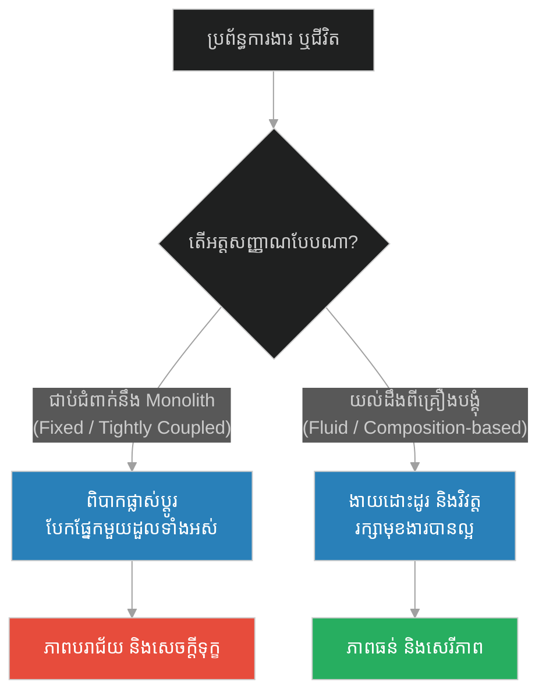
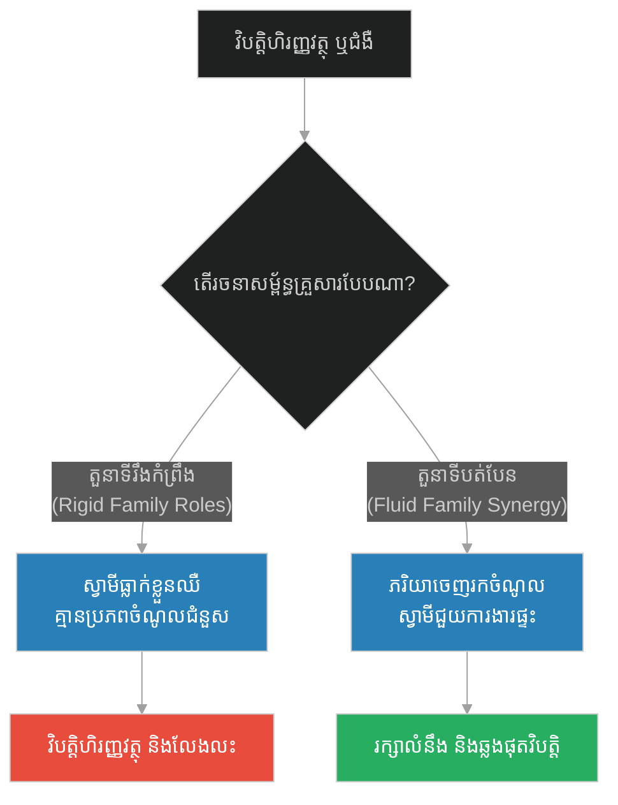
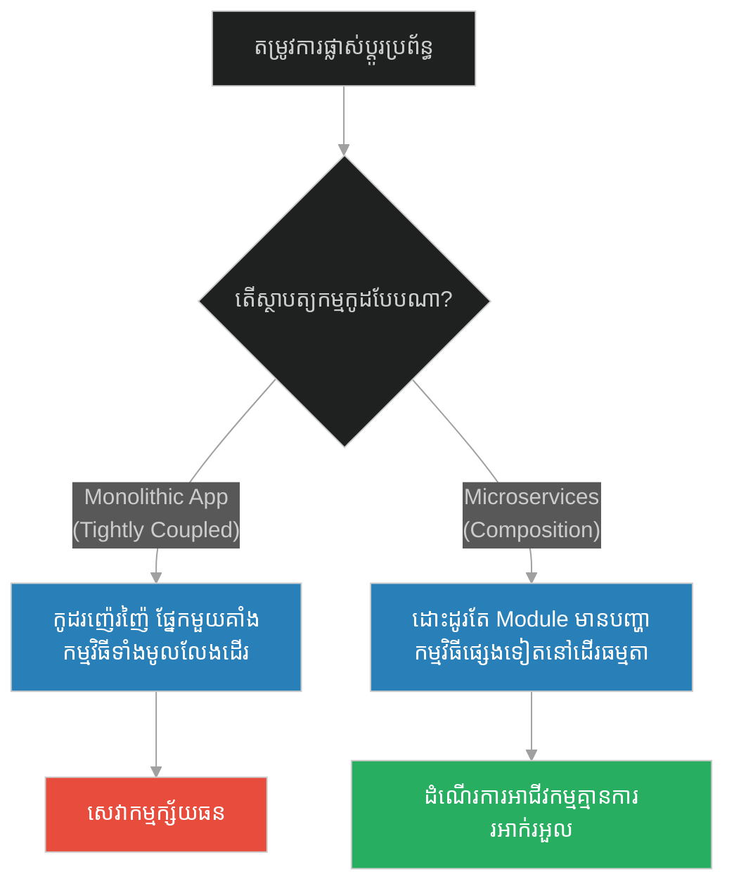
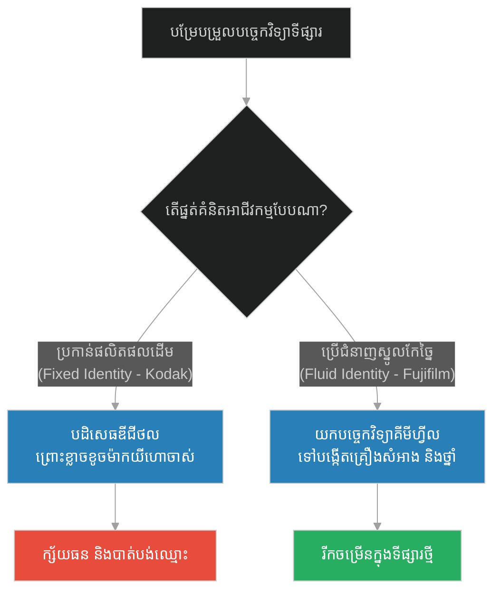
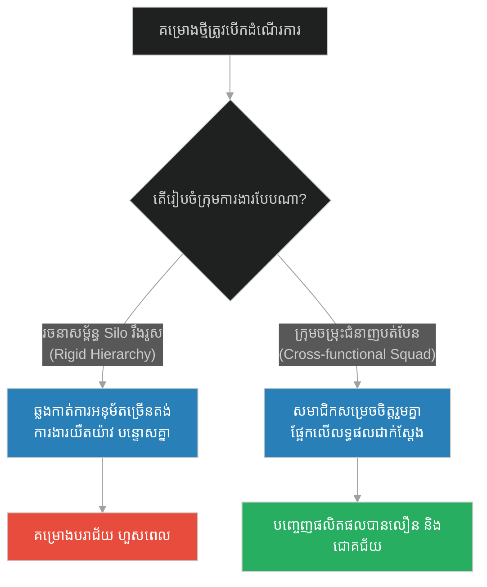
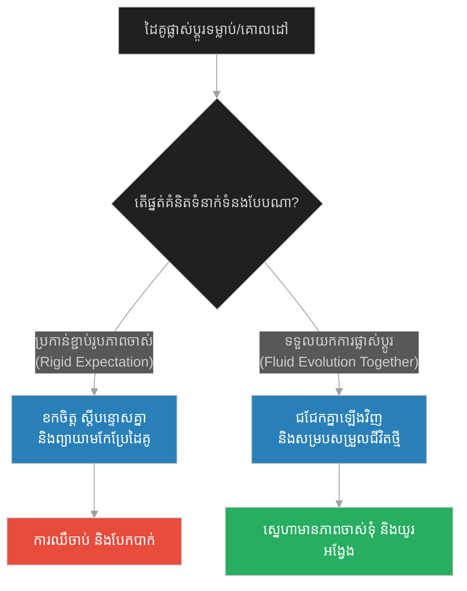
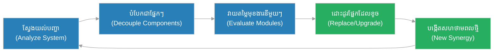

# Synergy & Fluid Identity (គ្រឿងបន្លាស់រទេះ)៖ សហថាមពល និងអត្តសញ្ញាណ (Synergy & Fluid Identity & Nagasena and the Chariot)

**Author:** ichamrong  
**Date:** 2026-05-28  
**Tags:** #buddhism #anatta #no-self #synergy #identity #mental-models #system-design  
**Category:** Concepts  
**Read Time:** ~15 min  

---

<a id="0"></a>
## 📌 មាតិកា (Table of Contents)
- [អន្ទាក់ផ្លូវចិត្ត (The Trap)](#0)
- [១. រឿងព្រេងនិទាន៖ ព្រះនាគសេន និងរទេះ (The Legend of Nagasena and the Chariot)](#1)
  - [តើអ្វីទៅជារទេះ? (What is the Chariot?)](#1-1)
- [២. បញ្ហា៖ សហថាមពល និងអត្តសញ្ញាណ (The Issue: Synergy & Fluid Identity)](#2)
- [៣. ឧទាហរណ៍ជាក់ស្តែងក្នុងពិភពពិត (Real World Examples)](#3)
  - [ឧទាហរណ៍ទី ១ — កម្រិតស្រាល (គ្រួសារ)៖ ការបែងចែកតួនាទីក្នុងគ្រួសារ (The Family Role Allocation)](#3-1)
  - [ឧទាហរណ៍ទី ២ — កម្រិតមធ្យម (បច្ចេកទេស)៖ ស្ថាបត្យកម្ម Microservices និង Modular Code (The Tech Microservices & Modules)](#3-2)
  - [ឧទាហរណ៍ទី ៣ — កម្រិតមធ្យម (ធុរកិច្ច)៖ ការកសាងម៉ាកយីហោ និងការរៀបចំរចនាសម្ព័ន្ធក្រុមហ៊ុន (The Business Brand & Reorganization)](#3-3)
  - [ឧទាហរណ៍ទី ៤ — កម្រិតមធ្យម (សង្គម/គ្រប់គ្រង)៖ ក្រុមការងារដែលផ្លាស់ប្តូរ និងរចនាសម្ព័ន្ធស្វយ័ត (The Management Autonomous Teams)](#3-4)
  - [ឧទាហរណ៍ទី ៥ — កម្រិតធ្ងន់ (ទំនាក់ទំនង)៖ ទំនាក់ទំនងគ្មានការរំពឹងទុក និងការយល់ពីអត្តសញ្ញាណគ្នា (The Relationship Attachment)](#3-5)
- [៤. ដំណោះស្រាយទូទៅ៖ ការយល់ដឹងពីសហថាមពល និងការអភិវឌ្ឍអត្តសញ្ញាណបត់បែន (The General Solution: Developing Synergy & Fluid Identity)](#4)
- [សេចក្តីសន្និដ្ឋាន (Conclusion)](#5)
- [ឯកសារយោង (References)](#6)
- [Related Posts](#7)

---

<a id="0"></a>
## អន្ទាក់ផ្លូវចិត្ត (The Trap)

តើយើងធ្លាប់សង្កេតឃើញទេថា ហេតុអ្វីបានជាមនុស្ស និងស្ថាប័នជាច្រើនងាយនឹងដួលរលំនៅពេលប្រឈមមុខនឹងការផ្លាស់ប្តូរ? នោះគឺដោយសារតែពួកគេបានជាប់អន្ទាក់នៃ **"អត្តសញ្ញាណរឹងកំព្រឹង" (Fixed Identity Trap)** ដែលជឿជាក់ថាខ្លួនឯងគឺជាវត្ថុតែមួយដុំដែលមិនអាចបំបែក ឬកែប្រែបាន។ នៅពេលផ្នែកណាមួយនៃជីវិត ឬប្រព័ន្ធការងារចាស់បាត់បង់មុខងារ ពួកគេក៏ដួលរលំទាំងស្រុង។

*   **Side A (The Fragile Monolith):** ការប្រកាន់ខ្ជាប់នឹងទម្រង់តែមួយ មិនព្រមបត់បែន ឬផ្លាស់ប្តូរគ្រឿងបង្គុំខាងក្នុង ដោយគិតថាអត្តសញ្ញាណរបស់ខ្លួនត្រូវតែនៅដដែលជានិច្ច។
*   **Side B (The Fluid Assemblage):** ការយល់ឃើញថាខ្លួនយើង ឬប្រព័ន្ធការងារ គឺជាការផ្តុំគ្នានៃគ្រឿងបន្លាស់ជាច្រើនដែលសហការគ្នា (Synergy)។ គ្រឿងបង្គុំនីមួយៗអាចដោះដូរ កែលម្អ ឬផ្លាស់ថ្មី ដើម្បីឆ្លើយតបនឹងការប្រែប្រួលនៃបរិបទខាងក្រៅ។

នៅក្នុងអត្ថបទនេះ យើងនឹងសិក្សាអំពីគោលគំនិតនៃការបង្រួបបង្រួមនិងភាពរលាយនៃអត្តសញ្ញាណ តាមរយៈការសន្ទនាដ៏ល្បីល្បាញក្នុងប្រវត្តិសាស្ត្រ រួចបកស្រាយវាទៅជាគំរូប្រព័ន្ធ និងស្ថាបត្យកម្មទន់ភ្លន់ដែលមិនអាចបំបែកបាន។

---

<a id="1"></a>
## ១. រឿងព្រេងនិទាន៖ ព្រះនាគសេន និងរទេះ (The Legend of Nagasena and the Chariot)

នៅក្នុងគម្ពីរ **មិលិន្ទប្បញ្ហា (Milinda Panha)** មានការសន្ទនាដ៏ល្បីល្បាញបំផុតមួយរវាងព្រះបាទមិលិន្ទ (ស្តេចក្រិក Menander I) និងព្រះភិក្ខុសង្ឃមួយអង្គព្រះនាម **នាគសេន (Nagasena)** ទាក់ទងនឹងទស្សនៈព្រះពុទ្ធសាសនាអំពី "អនត្តា" (គ្មានអត្តាពិតប្រាកដ ឬ No-Self)។

ស្តេចមិលិន្ទបានសួរដោយចង់សាកល្បងប្រាជ្ញាថា៖ *"តើព្រះតេជគុណឈ្មោះអ្វី?"* 
ព្រះនាគសេនបានតបទៅវិញយ៉ាងស្រទន់ថា៖ *"បពិត្រព្រះរាជា មនុស្សទាំងឡាយហៅអាត្មាភាពថា 'នាគសេន'។ ប៉ុន្តែ 'នាគសេន' នេះ គ្រាន់តែជាឈ្មោះ ជាសន្មត ជាបញ្ញត្តិសម្រាប់ហៅគ្នាប៉ុណ្ណោះ តាមពិតទៅគ្មានបុគ្គល ឬអត្តាណាមួយពិតប្រាកដរស់នៅក្នុងឈ្មោះនេះឡើយ។"*

ស្តេចមិលិន្ទសើចចំអកយ៉ាងខ្លាំង ហើយមានរាជឱង្ការទៅកាន់ពួកសេនា និងអ្នកប្រាជ្ញទាំងឡាយថា៖ *"ស្តាប់ចុះអ្នករាល់គ្នា! ព្រះសង្ឃអង្គនេះកំពុងតែនិយាយមិនពិតឡើយ។ បើគ្មានបុគ្គលឈ្មោះ នាគសេន ទេ ចុះនរណាកំពុងនិយាយជាមួយយើង? នរណាជាអ្នកស្លៀកស្បង់ចីវរ? នរណាជាអ្នកឆាន់ចង្ហាន់? បើមានការសម្លាប់តើមានបាបដែរឬទេ? នេះច្បាស់ជាការនិយាយភូតភរហើយ!"*

<a id="1-1"></a>
### តើអ្វីទៅជារទេះ? (What is the Chariot?)

ព្រះនាគសេនមិនមានអាការៈខឹងសម្បារឡើយ ព្រះអង្គបានសួរត្រឡប់ទៅស្តេចវិញថា៖ *"បពិត្រព្រះរាជា តើព្រះអង្គយាងមកទីនេះដោយរបៀបណា? តើយាងដើរដោយថ្មើរជើង ឬក៏យាងមកតាមមធ្យោបាយផ្សេង?"*
ស្តេចតបថា៖ *"យើងជិះរទេះសេះមក។"*

ព្រះនាគសេនចង្អុលទៅរទេះសេះនោះ រួចសួរដេញដោលថា៖ 
- *"បពិត្រព្រះរាជា តើកង់ទាំងពីរនោះ គឺជារទេះមែនទេ?"* ស្តេចតប៖ *"ទេ មិនមែនឡើយ"*
- *"តើអ័ក្សរទេះ គឺជារទេះមែនទេ?"* ស្តេចតប៖ *"ទេ មិនមែនឡើយ"*
- *"តើឈើបាំង តើខ្សែព័ទ្ធ តើនឹម ឬតើគ្រឿងដែកផ្សំគ្នាដទៃទៀត គឺជារទេះមែនទេ?"* ស្តេចតប៖ *"ទេ មិនមែនឡើយ"*
- *"ចុះបើគ្មានគ្រឿងបង្គុំទាំងនេះ តើព្រះអង្គអាចចង្អុលបង្ហាញ 'រទេះ' តែឯងបានដែរឬទេ?"*

ស្តេចមិលិន្ទភ្ញាក់ខ្លួន រួចតបដោយស្មោះត្រង់ថា៖ *"ពិតជាមិនអាចរកបានឡើយ! ពាក្យថា 'រទេះ' គ្រាន់តែជាឈ្មោះសន្មតដែលគេហៅសម្គាល់ **ការផ្តុំគ្នានៃគ្រឿងបន្លាស់ទាំងអស់នេះ (An assemblage of parts)** ប៉ុណ្ណោះ។ គ្មានរបស់ណាមួយជារទេះដាច់ដោយឡែកដោយខ្លួនឯងនោះទេ។"*

ព្រះនាគសេនបានសន្និដ្ឋានថា៖ *"ដូចគ្នាណាស់ព្រះអង្គ! ពាក្យថា 'នាគសេន' ក៏គ្រាន់តែជាឈ្មោះហៅសម្គាល់នៃការផ្តុំគ្នានៃគ្រឿងបង្គុំទាំង ៥ គឺ រូប រំភើប/អារម្មណ៍ (វេទនា) ការចងចាំ (សញ្ញា) គំនិត/ចេតនា (សង្ខារ) និងវិញ្ញាណប៉ុណ្ណោះ។ នៅពេលគ្រឿងបង្គុំទាំងនេះមកសហការគ្នា វាក៏បង្កើតបានជាមុខងារមួយដែលគេហៅថា នាគសេន។ ប៉ុន្តែគ្មាន 'អត្តា' ដ៏រឹងមាំ ឬស្ថិតស្ថេរណាមួយនៅក្នុងនោះឡើយ។"*

---

<a id="2"></a>
## ២. បញ្ហា៖ សហថាមពល និងអត្តសញ្ញាណ (The Issue: Synergy & Fluid Identity)

នៅក្នុងវិទ្យាសាស្ត្រប្រព័ន្ធ និងស្ថាបត្យកម្មសហគ្រាស ការយល់ច្រឡំថាប្រព័ន្ធមួយគឺជា "វត្ថុតែមួយដុំ" (Monolithic Entity) បង្កើតឱ្យមានភាពផុយស្រួយ។ ប្រសិនបើប្រព័ន្ធមួយត្រូវបានកសាងឡើងដោយការផ្សារភ្ជាប់គ្នាយ៉ាងណែនណាន់តាន់តាប់ (Tight Coupling) រាល់ពេលដែលផ្នែកតូចមួយមានបញ្ហា វានឹងរុញច្រានប្រព័ន្ធទាំងមូលឱ្យដួលរលំ។

ផ្ទុយទៅវិញ គោលការណ៍នៃ **Synergy (សហថាមពល)** ចែងថា៖ *តម្លៃរួមនៃប្រព័ន្ធធំជាងផលបូកនៃផ្នែកនីមួយៗរួមបញ្ចូលគ្នា* ($1+1 > 2$)។ គុណតម្លៃនៃរទេះ មិនមែននៅលើឈើ ឬដែកនោះទេ គឺនៅលើសមត្ថភាពដឹកជញ្ជូនដែលកើតចេញពីការសហការគ្នានៃគ្រឿងបង្គុំនីមួយៗ។ 



### ការប្រៀបធៀបតាមរយៈកូដ (Code Comparison)

ខាងក្រោមនេះជាការប្រៀបធៀបរវាងការសរសេរកូដបែប Monolithic/Inheritance (តឹងតែង) និងការសរសេរកូដបែប Composition (ធូរស្រាល/បត់បែនដូចរទេះរបស់ព្រះនាគសេន)៖

#### វិធីសាស្ត្រអាក្រក់៖ ស្ថាបត្យកម្មរឹងកំព្រឹង (Tightly-Coupled / Rigid Monolith)
នៅទីនេះ ប្រសិនបើអ្នកចង់ប្តូរម៉ាស៊ីន ឬកង់ អ្នកត្រូវតែសរសេរថ្នាក់ (Class) ទាំងមូលឡើងវិញ ព្រោះគ្រប់ផ្នែកទាំងអស់ត្រូវបានភ្ជាប់គ្នាយ៉ាងណែន។

```python
# Bad Design: High Coupling & Rigid Identity
class RigidChariot:
    def __init__(self):
        # គ្រឿងបន្លាស់ទាំងអស់ត្រូវបានបង្កើតឡើងក្នុង Class តែមួយ មិនអាចដោះដូរបាន
        self.wooden_wheel_left = "Wooden Wheel L"
        self.wooden_wheel_right = "Wooden Wheel R"
        self.wooden_axle = "Wooden Axle"
        self.horse = "Old Horse"

    def travel(self):
        print(f"Traveling using {self.wooden_wheel_left}, {self.wooden_wheel_right}, "
              f"connected by {self.wooden_axle}, pulled by {self.horse}.")

# ប្រសិនបើចង់ប្តូរទៅជាកង់ដែក ឬសេះយន្ត យើងត្រូវកែប្រែ Class ទាំងមូល ដែលអាចនាំឱ្យមាន Bug ដល់ប្រព័ន្ធចាស់
```

#### វិធីសាស្ត្រល្អ៖ ស្ថាបត្យកម្មផ្អែកលើគ្រឿងបង្គុំ (Composition-based / Swappable Components)
ប្រព័ន្ធនេះផ្តោតលើចំណុចប្រទាក់ (Interfaces) ដែលអនុញ្ញាតឱ្យគ្រឿងបង្គុំដោះដូរបានគ្រប់ពេល ដោយមិនប៉ះពាល់ដល់អត្តសញ្ញាណរួមនៃ "រទេះ" ឡើយ។

```python
# Good Design: Composition and Fluid Identity (Nagasena's Model)
from typing import List, Protocol

# កំណត់កិច្ចសន្យា (Protocol) សម្រាប់គ្រឿងបង្គុំនីមួយៗ
class Wheel(Protocol):
    def roll(self) -> str:
        pass

class Propulsion(Protocol):
    def pull(self) -> str:
        pass

# ការអនុវត្តជាក់ស្តែងនៃគ្រឿងបង្គុំផ្សេងៗគ្នា
class WoodenWheel:
    def roll(self) -> str:
        return "wooden wheels rolling slowly"

class SteelWheel:
    def roll(self) -> str:
        return "steel wheels rolling smoothly"

class HorsePropulsion:
    def pull(self) -> str:
        return "pulled by two powerful horses"

class ElectricEngine:
    def pull(self) -> str:
        return "powered by an electric motor"

# រទេះគ្រាន់តែជាអ្នកសម្របសម្រួល (Assemblage) គ្មានចំណងតឹងរ៉ឹងជាមួយគ្រឿងបន្លាស់ណាមួយឡើយ
class FluidChariot:
    def __init__(self, wheels: List[Wheel], propulsion: Propulsion):
        self.wheels = wheels
        self.propulsion = propulsion

    def update_wheels(self, new_wheels: List[Wheel]):
        self.wheels = new_wheels  # ផ្លាស់ប្តូរគ្រឿងបង្គុំបានយ៉ាងងាយស្រួល

    def travel(self):
        wheel_status = self.wheels[0].roll() if self.wheels else "no wheels"
        print(f"Chariot traveling: {wheel_status} and {self.propulsion.pull()}.")

# ការប្រើប្រាស់ជាក់ស្តែង
wooden_chariot = FluidChariot([WoodenWheel(), WoodenWheel()], HorsePropulsion())
wooden_chariot.travel()

# វិវត្តទៅជារទេះទំនើប ដោយគ្រាន់តែដោះដូរគ្រឿងបង្គុំ
wooden_chariot.update_wheels([SteelWheel(), SteelWheel()])
wooden_chariot.travel()
```

---

<a id="3"></a>
## ៣. ឧទាហរណ៍ជាក់ស្តែងក្នុងពិភពពិត (Real World Examples)

<a id="3-1"></a>
### ឧទាហរណ៍ទី ១ — កម្រិតស្រាល (គ្រួសារ)៖ ការបែងចែកតួនាទីក្នុងគ្រួសារ (The Family Role Allocation)

នៅក្នុងគ្រួសារដែលប្រកាន់ខ្ជាប់នូវអត្តសញ្ញាណរឹងកំព្រឹង (Rigid Roles) ដូចជា ស្វាមីត្រូវតែជាអ្នករកចំណូលតែម្នាក់ឯង ហើយភរិយាត្រូវតែជារុក្ខរក្សាផ្ទះតែម្នាក់ឯង។ នៅពេលមានវិបត្តិហិរញ្ញវត្ថុ ឬសុខភាពកើតឡើង គ្រួសារនោះអាចនឹងបាក់បែកភ្លាមៗ។ ផ្ទុយទៅវិញ គ្រួសារដែលមានភាពបត់បែន យល់ថាពួកគេជាដៃគូសហការ (Synergy) ដែលអាចប្តូរតួនាទីគ្នាទៅវិញទៅមកបានតាមកាលៈទេសៈ។



---

<a id="3-2"></a>
### ឧទាហរណ៍ទី ២ — កម្រិតមធ្យម (បច្ចេកទេស)៖ ស្ថាបត្យកម្ម Microservices និង Modular Code (The Tech Microservices & Modules)

នៅក្នុងការអភិវឌ្ឍកម្មវិធី ប្រព័ន្ធបែប Monolith ធំមួយត្រូវបានបង្កើតឡើងដោយការសរសេរកូដរាប់លានជួរចូលគ្នាក្នុង File តែមួយ។ នៅពេលត្រូវការជួសជុល Function ផ្ញើសារ (Messaging Service) វាអាចនឹងធ្វើឱ្យប្រព័ន្ធទូទាត់ប្រាក់ (Payment System) គាំងទៅជាមួយដែរ។ ការប្តូរមកប្រើប្រាស់ Microservices ធ្វើឱ្យរាល់ Module នីមួយៗអាចដំណើរការបានដោយឯករាជ្យ និងងាយស្រួលជំនួស។



---

<a id="3-3"></a>
### ឧទាហរណ៍ទី ៣ — កម្រិតមធ្យម (ធុរកិច្ច)៖ ការកសាងម៉ាកយីហោ និងការរៀបចំរចនាសម្ព័ន្ធក្រុមហ៊ុន (The Business Brand & Reorganization)

ក្រុមហ៊ុនធំៗជាច្រើនបានស្លាប់បាត់បង់ជីវិតដោយសារជាប់ជំពាក់នឹង "ផលិតផលតែមួយ" (Fixed Product Identity)។ ឧទាហរណ៍ ក្រុមហ៊ុន Kodak គិតថាខ្លួនឯងគឺជា "ក្រុមហ៊ុនលក់ហ្វីលថតរូប"។ នៅពេលបច្ចេកវិទ្យាឌីជីថលមកដល់ ពួកគេមិនព្រមផ្លាស់ប្តូរគ្រឿងបង្គុំអាជីវកម្មឡើយ។ ផ្ទុយទៅវិញ ក្រុមហ៊ុន Fujifilm បានយល់ច្បាស់ពី "សហថាមពល" នៃចំណេះដឹងគីមីរបស់ពួកគេ រួចក៏បានយកចំណេះដឹងនោះទៅបង្កើតផលិតផលគ្រឿងសំអាង និងឱសថវិញ រហូតអាចរស់រាន និងរីកចម្រើនយ៉ាងខ្លាំង។



---

<a id="3-4"></a>
### ឧទាហរណ៍ទី ៤ — កម្រិតមធ្យម (សង្គម/គ្រប់គ្រង)៖ ក្រុមការងារដែលផ្លាស់ប្តូរ និងរចនាសម្ព័ន្ធស្វយ័ត (The Management Autonomous Teams)

នៅក្នុងការគ្រប់គ្រងបែបបុរាណ (Silo Structure) បុគ្គលិកម្នាក់ៗត្រូវបានកំណត់ឱ្យធ្វើការតែក្នុងផ្នែករបស់ខ្លួន (ដូចជា ផ្នែកលក់ធ្វើតែលក់ ផ្នែកកូដធ្វើតែកូដ)។ ប្រសិនបើផ្នែកលក់លក់មិនដាច់ ពួកគេនឹងបន្ទោសផ្នែកកូដថាធ្វើផលិតផលមិនល្អ។ នៅក្នុងការគ្រប់គ្រងបែប Agile គេបង្កើត **Cross-functional Squads** (ក្រុមការងារចម្រុះជំនាញ) ដែលប្រមូលផ្តុំមនុស្សមកពីផ្នែកផ្សេងៗគ្នាមកធ្វើការរួមគ្នាដើម្បីសម្រេចគោលដៅតែមួយ។ ក្រុមការងារនេះមិនមានអត្តសញ្ញាណអចិន្ត្រៃយ៍ឡើយ ពួកគេអាចរំលាយ និងបង្កើតជាក្រុមថ្មីបានភ្លាមៗនៅពេលចប់គម្រោង។



---

<a id="3-5"></a>
### ឧទាហរណ៍ទី ៥ — កម្រិតធ្ងន់ (ទំនាក់ទំនង)៖ ទំនាក់ទំនងគ្មានការរំពឹងទុក និងការយល់ពីអត្តសញ្ញាណគ្នា (The Relationship Attachment)

នៅក្នុងទំនាក់ទំនងស្នេហា មនុស្សជាច្រើនតែងតែរំពឹងថាដៃគូរបស់ខ្លួនត្រូវតែរក្សា "បុគ្គលិកលក្ខណៈដំបូង" ឱ្យនៅដដែលជារៀងរហូត។ នៅពេលពេលវេលាកន្លងផុតទៅ ដៃគូផ្លាស់ប្តូរចំណង់ចំណូលចិត្ត ផ្នត់គំនិត ឬគោលដៅជីវិត ពួកគេក៏ចាប់ផ្តើមមានជម្លោះដោយសារតែ "អ្នកលែងដូចមុនទៀតហើយ"។ ផ្ទុយទៅវិញ ទំនាក់ទំនងដែលមានសុខភាពល្អ ទទួលស្គាល់ថា មនុស្សម្នាក់ៗគឺជាសត្វលោកដែលកំពុងវិវត្តជានិច្ច (Fluid Entity) ហើយទំនាក់ទំនងពិតប្រាកដគឺការរួមដំណើរ និងសម្របសម្រួលគ្រឿងបង្គុំជីវិតទៅតាមវ័យ។



---

<a id="4"></a>
## ៤. ដំណោះស្រាយទូទៅ៖ ការយល់ដឹងពីសហថាមពល និងការអភិវឌ្ឍអត្តសញ្ញាណបត់បែន (The General Solution: Developing Synergy & Fluid Identity)

ដើម្បីបង្កើតប្រព័ន្ធការងារ អាជីវកម្ម ឬការរស់នៅប្រកបដោយភាពធន់ យើងត្រូវបោះបង់ចោលផ្នត់គំនិតបែប Monolith ហើយងាកមកប្រើប្រាស់ការរៀបចំផ្អែកលើ **Composition (ការផ្គុំឡើងវិញ)**៖

1.  **Loose Coupling (កាត់បន្ថយការពឹងផ្អែកតឹងរ៉ឹង):** ធានាថាផ្នែកនីមួយៗនៃជីវិត ឬការងាររបស់អ្នកមិនត្រូវបានភ្ជាប់គ្នាស្អិតរហូតបំបែកមិនរួចនោះទេ។ ប្រសិនបើអ្នកបាត់បង់ការងារ (គ្រឿងបង្គុំមួយ) អត្តសញ្ញាណរួម និងតម្លៃជីវិតរបស់អ្នកនៅតែអាចបន្តដំណើរទៅមុខបាន។
2.  **Modular Feedback Loop (ការវាយតម្លៃផ្នែកតូចៗ):** បង្កើតយន្តការត្រួតពិនិត្យ និងកែលម្អគ្រឿងបង្គុំនីមួយៗឱ្យបានទៀងទាត់។ បើកង់ឡានចាស់ សូមប្តូរតែកង់ កុំបោះចោលឡានទាំងមូល។
3.  **Continuous Integration / Continuous Evolution (CI/CE):** ទទួលយកការបញ្ចូលចំណេះដឹង និងសមាជិកថ្មីៗចូលក្នុងប្រព័ន្ធការងារ ដើម្បីបង្កើនសហថាមពលជាប្រចាំ។



* 🚀 **[ចាប់ផ្តើមដំណើររុករក (Start the Journey) ➔ Collaboration & Cross-functional Teams (មនុស្សខ្វាក់ និងមនុស្សខ្វិន)](./161-buddha-and-the-blind-and-lame.md)**

---

<a id="5"></a>
## សេចក្តីសន្និដ្ឋាន (Conclusion)

> **«រូបរាងកាយ មិនមែនជាខ្លួនយើងឡើយ វាក៏មិនមែនជារបស់យើងដែរ។ វាគ្រាន់តែជាការជួបជុំគ្នានៃធាតុធម្មជាតិដែលកំពុងបំពេញតួនាទីជាបណ្តោះអាសន្នប៉ុណ្ណោះ។»**

នៅពេលយើងលះបង់ចោលនូវការប្រកាន់ខ្ជាប់នឹង Ego ឬអត្តសញ្ញាណរឹងកំព្រឹង យើងនឹងរកឃើញសេរីភាពដ៏ពិតប្រាកដ។ ជីវិតមិនមែនជារបស់រឹងមួយដុំទេ វាគឺជារទេះមួយដែលកំពុងធ្វើដំណើរទៅមុខ។ កុំខ្លាចក្នុងការផ្លាស់ប្តូរកង់ដែលចាស់ កុំខ្លាចក្នុងការរៀនសូត្រចំណេះដឹងថ្មី ហើយចូរចងចាំថា ភាពស្រស់ស្អាតនៃអត្ថិភាពគឺស្ថិតនៅលើការផ្តុំគ្នានៃគ្រឿងបង្គុំផ្សេងៗគ្នា ដែលកំពុងរាំរែកសហការគ្នាយ៉ាងចុះសម្រុង។

---

<a id="6"></a>
## ឯកសារយោង (References)

*   **Milinda Panha (The Questions of King Milinda)** — A translation of the classical dialogue between King Menander I and Sage Nagasena on the nature of *Anatta* (non-self).
*   **Design Patterns: Elements of Reusable Object-Oriented Software** — Erich Gamma et al. (1994). Discusses the principle of "Favor object composition over class inheritance" which directly mirrors the Chariot metaphor.
*   **System Dynamics: Managing Chaos and Complexity** — Jamshid Gharajedaghi (2011). Explores how synergies emerge from loose coupling in complex adaptive systems.

---

<a id="7"></a>
## Related Posts

* [The Blind Man and the Lame Man (ជនពិការភ្នែក និងជនពិការជើង)](./161-buddha-and-the-blind-and-lame.md) — ស្វែងយល់អំពីកិច្ចសហការ និងការពឹងពាក់គ្នាទៅវិញទៅមក។
* [The Ferryman (អ្នកចម្លងទូក)](./165-buddha-and-the-ferryman.md) — ការមិនជាប់ជំពាក់នឹងឧបករណ៍ ឬវិធីសាស្ត្រដែលអស់ប្រយោជន៍។
