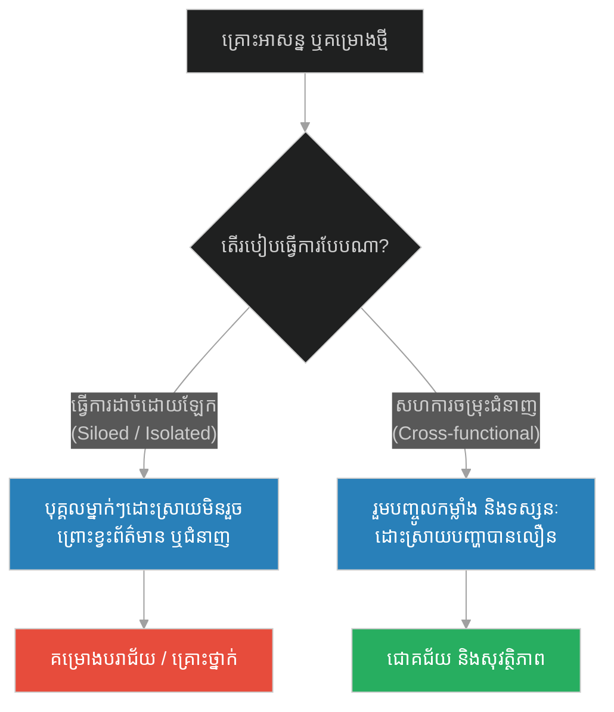
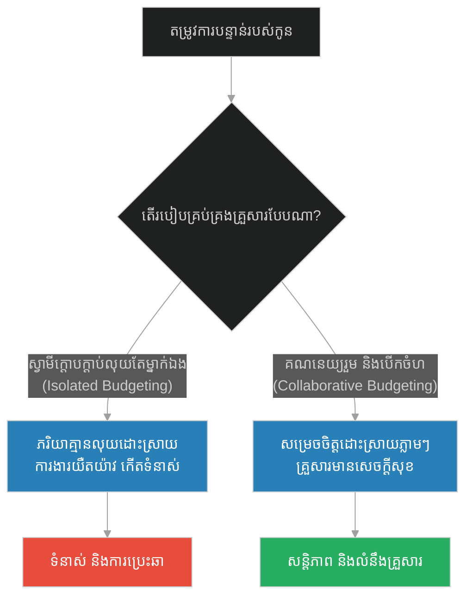
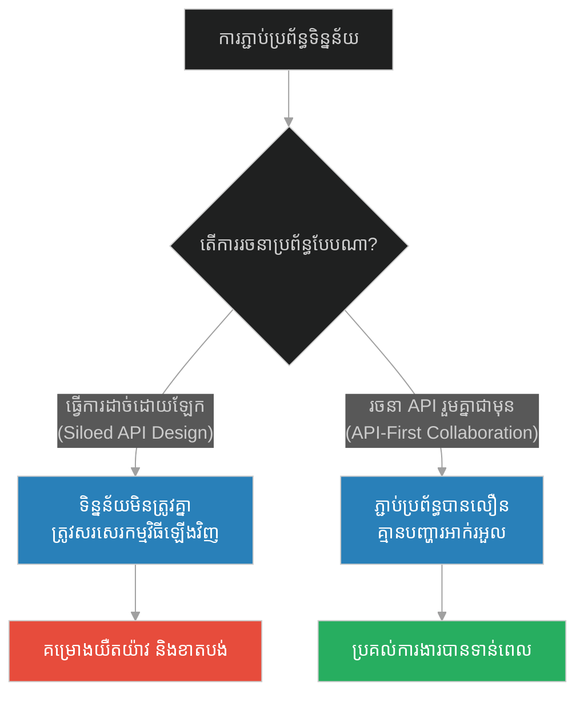
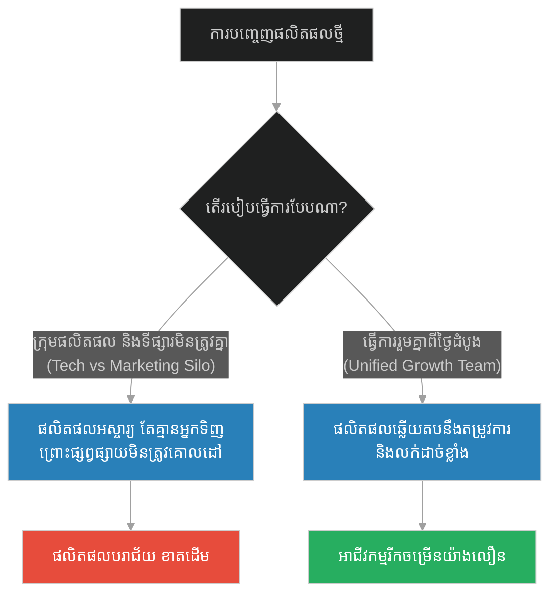
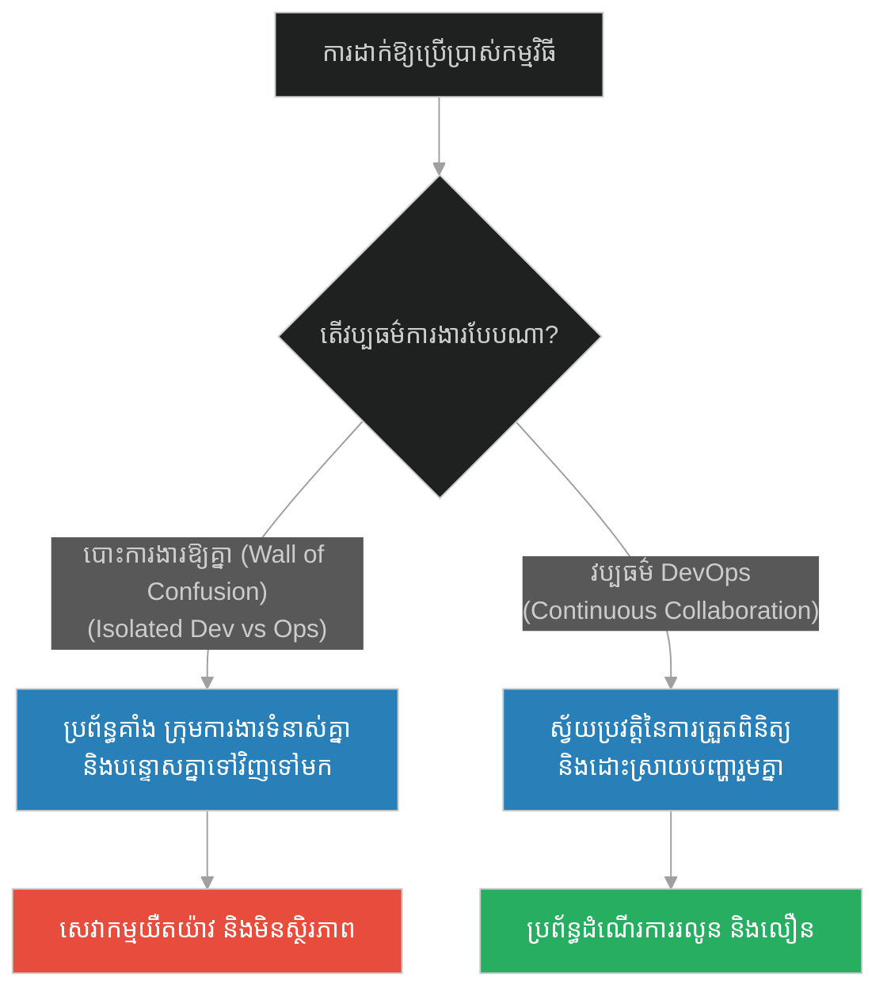
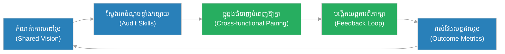

# Collaboration & Cross-functional Teams (មនុស្សខ្វាក់ និងមនុស្សខ្វិន)៖ កិច្ចសហការ និងក្រុមការងារចម្រុះជំនាញ (Collaboration & Cross-functional Teams & The Blind and the Lame)

**Author:** ichamrong  
**Date:** 2026-05-28  
**Tags:** #buddhism #collaboration #teamwork #interdependence #synergy #management #devops  
**Category:** Concepts  
**Read Time:** ~15 min  

---

<a id="0"></a>
## 📌 មាតិកា (Table of Contents)
- [អន្ទាក់ផ្លូវចិត្ត (The Trap)](#0)
- [១. រឿងព្រេងនិទាន៖ ភ្លើងឆេះព្រៃ (The Legend of the Forest Fire)](#1)
  - [ការសហការគ្នាដើម្បីរស់ (The Collaborative Escape)](#1-1)
- [២. បញ្ហា៖ កិច្ចសហការ និងក្រុមការងារចម្រុះជំនាញ (The Issue: Segregated Silos vs. Interdependence)](#2)
- [៣. ឧទាហរណ៍ជាក់ស្តែងក្នុងពិភពពិត (Real World Examples)](#3)
  - [ឧទាហរណ៍ទី ១ — កម្រិតស្រាល (គ្រួសារ)៖ ការគ្រប់គ្រងហិរញ្ញវត្ថុ និងសុភមង្គលផ្ទះ (The Family Synergy)](#3-1)
  - [ឧទាហរណ៍ទី ២ — កម្រិតមធ្យម (បច្ចេកទេស)៖ frontend និង Backend Silos (The Frontend & Backend Integration)](#3-2)
  - [ឧទាហរណ៍ទី ៣ — កម្រិតមធ្យម (ធុរកិច្ច)៖ ផលិតផល និងទីផ្សារ (The Product & Marketing Alignment)](#3-3)
  - [ឧទាហរណ៍ទី ៤ — កម្រិតមធ្យម (សង្គម/គ្រប់គ្រង)៖ វប្បធម៌ DevOps (The DevOps Transformation)](#3-4)
  - [ឧទាហរណ៍ទី ៥ — កម្រិតធ្ងន់ (ទំនាក់ទំនង)៖ ដៃគូទូទាត់ និងដៃគូចងចិត្ត (The Rational & Empathic Partners)](#3-5)
- [៤. ដំណោះស្រាយទូទៅ៖ ការកសាងស្ពានកិច្ចសហការ និងការលុបបំបាត់ Silo (The General Solution: Building Collaborative Bridges)](#4)
- [សេចក្តីសន្និដ្ឋាន (Conclusion)](#5)
- [ឯកសារយោង (References)](#6)
- [Related Posts](#7)

---

<a id="0"></a>
## អន្ទាក់ផ្លូវចិត្ត (The Trap)

ហេតុអ្វីបានជាគម្រោងធំៗ ឬស្ថាប័នជាច្រើនតែងតែយឺតយ៉ាវ និងជួបបរាជ័យ ទោះបីជាពួកគេមានបុគ្គលិកឆ្នើមៗជាច្រើនក៏ដោយ? នោះគឺដោយសារតែពួកគេបានធ្លាក់ចូលទៅក្នុង **"អន្ទាក់នៃជំនាញដាច់ដោយឡែក" (Silo Mentality Trap)**។ នៅក្នុងអន្ទាក់នេះ មនុស្សម្នាក់ៗព្យាយាមធ្វើការងារតែក្នុងដែនសមត្ថភាពរបស់ខ្លួន ដោយមិនខ្វល់ខ្វាយ និងមិនស្វែងយល់ពីតម្រូវការរបស់ផ្នែកផ្សេងទៀតឡើយ។ លទ្ធផលគឺដូចជាមនុស្សខ្លាំងម្នាក់ដែលខ្វាក់ភ្នែក និងមនុស្សឆ្លាតម្នាក់ដែលខ្វិនជើង មិនអាចរត់គេចរួចពីគ្រោះថ្នាក់។

*   **Side A (The Siloed Isolation):** ការផ្តោតតែលើចំណុចខ្លាំងរបស់ខ្លួនឯង និងបដិសេធមិនព្រមសហការជាមួយអ្នកដទៃ ដោយយល់ថាខ្លួនឯងអាចធ្វើបានល្អតែម្នាក់ឯង។
*   **Side B (The Interdependent Synergy):** ការទទួលស្គាល់ចំណុចខ្សោយរបស់ខ្លួន រួចបើកចិត្តរួមបញ្ចូលជំនាញរបស់ខ្លួនជាមួយចំណុចខ្លាំងរបស់អ្នកដទៃ ដើម្បីបង្កើតជាថាមពលរួមដ៏ខ្លាំងក្លា។

នៅក្នុងអត្ថបទនេះ យើងនឹងសិក្សាពីរបៀបបំបែករបាំង Silo ទាំងឡាយក្នុងជីវិត និងការងារ តាមរយៈរឿងប្រៀបប្រដៅបែបបុរាណ និងការវិភាគបែបប្រព័ន្ធការងារចម្រុះជំនាញ។

---

<a id="1"></a>
## ១. រឿងព្រេងនិទាន៖ ភ្លើងឆេះព្រៃ (The Legend of the Forest Fire)

កាលពីព្រេងនាយ មានបុរសពីរនាក់រស់នៅក្នុងភូមិតូចមួយក្បែរជើងភ្នំ។ បុរសម្នាក់ជា **ជនពិការភ្នែក (The Blind Man)** គាត់មានរូបរាងកាយមាំមួន កម្លាំងខ្លាំង និងជើងរឹងមាំដែលអាចរត់បានយ៉ាងលឿន ប៉ុន្តែភ្នែករបស់គាត់មើលមិនឃើញអ្វីទាំងអស់។ ចំណែកបុរសម្នាក់ទៀតជា **ជនពិការជើង (The Lame Man)** គាត់មានភ្នែកភ្លឺច្បាស់ ឆ្លាតវៃ និងអាចមើលឃើញទិសដៅបានឆ្ងាយ ប៉ុន្តែជើងរបស់គាត់ខ្វិន មិនអាចដើរ ឬរត់បានឡើយ។

ដោយសារតែចរិត និងទម្លាប់ខុសគ្នា ពួកគេទាំងពីរមិនដែលនិយាយរកគ្នា ឬសហការគ្នាក្នុងជីវិតប្រចាំថ្ងៃឡើយ។ ពួកគេរស់នៅដាច់ដោយឡែកពីគ្នា និងតែងតែមើលស្រាលសមត្ថភាពគ្នាទៅវិញទៅមក។

ថ្ងៃមួយ មានគ្រោះរាំងស្ងួតយ៉ាងខ្លាំង ហើយក៏កើតមាន **ភ្លើងឆេះព្រៃ (The Forest Fire)** យ៉ាងសន្ធោសន្ធៅរាលដាលមកជិតផ្ទះរបស់ពួកគេ។ អណ្តាតភ្លើងដ៏ធំនិងផ្សែងខ្មៅងងឹតបានឡោមព័ទ្ធភូមិទាំងមូល។

<a id="1-1"></a>
### ការសហការគ្នាដើម្បីរស់ (The Collaborative Escape)

ស្ថានភាពកាន់តែធ្ងន់ធ្ងរ៖
- **ជនពិការជើង** មើលឃើញយ៉ាងច្បាស់នូវទិសដៅដែលគ្មានភ្លើង និងដឹងពីផ្លូវរត់គេចខ្លួនទៅកាន់ទន្លេ ប៉ុន្តែគាត់មិនអាចធ្វើដំណើរទៅទីនោះបានឡើយ គឺបានត្រឹមតែអង្គុយរង់ចាំសេចក្តីស្លាប់។
- **ជនពិការភ្នែក** មានកម្លាំងអាចរត់រួច ប៉ុន្តែដោយសារតែមើលមិនឃើញផ្លូវ និងមិនដឹងថាភ្លើងកំពុងឆេះមកពីទិសណា គាត់បានត្រឹមតែរត់ចុះឡើងៗដោយភាពភ័យខ្លាច ហើយអាចនឹងរត់ចូលទៅក្នុងគំនរភ្លើងនៅពេលណាមួយ។

ក្នុងវិនាទីចុងក្រោយ ជនពិការជើងបានស្រែកហៅជនពិការភ្នែកយ៉ាងខ្លាំងថា៖ *"ឈប់សិនមិត្ត! កុំរត់ទៅទិសនោះអី ទីនោះមានភ្លើងឆេះខ្លាំងណាស់។ ពួកយើងនឹងស្លាប់ទាំងពីរនាក់ ប្រសិនបើយើងមិនសហការគ្នានោះទេ! សូមស្តាប់ខ្ញុំ..."*

ជនពិការភ្នែកបានយល់ព្រម គាត់បានរត់មករកជនពិការជើង រួចអោនខ្នងឱ្យជនពិការជើងឡើងជិះ។ 
- **ជនពិការជើង** បានក្លាយជា **"ភ្នែក"** របស់ក្រុម ដោយអង្គុយលើស្មាជនពិការភ្នែក ហើយចាំប្រាប់ទិសដៅយ៉ាងច្បាស់លាស់៖ *"ទៅឆ្វេង... ទៅស្តាំ... រត់ត្រង់ទៅមុខ..."*
- **ជនពិការភ្នែក** បានក្លាយជា **"ជើង"** របស់ក្រុម ដោយរត់យ៉ាងលឿនទៅតាមការណែនាំរបស់មិត្តនៅលើស្មា។

ដោយសារតែកិច្ចសហការដ៏ល្អឥតខ្ចោះនេះ ពួកគេទាំងពីរបានរត់គេចផុតពីភ្លើងឆេះព្រៃទៅដល់ច្រាំងទន្លេប្រកបដោយសុវត្ថិភាព។ ចាប់ពីថ្ងៃនោះមក ពួកគេលែងរស់នៅដាច់ដោយឡែកពីគ្នាទៀតហើយ គឺពួកគេតែងតែសហការគ្នាបំពេញចំណុចខ្សោយឱ្យគ្នាទៅវិញទៅមកជារៀងរហូត។

---

<a id="2"></a>
## ២. បញ្ហា៖ កិច្ចសហការ និងក្រុមការងារចម្រុះជំនាញ (The Issue: Segregated Silos vs. Interdependence)

នៅក្នុងវិស្វកម្មសូហ្វវែរ និងការគ្រប់គ្រងសម័យទំនើប **Silo (របាំងការងារ)** គឺជាសត្រូវដ៏ធំបំផុតនៃការបង្កើតថ្មី (Innovation)។ នៅពេលដែលផ្នែកអភិវឌ្ឍន៍ (Frontend Dev) និងផ្នែកទិន្នន័យ (Backend Dev) មិននិយាយគ្នា ពួកគេនឹងកសាងប្រព័ន្ធដែលមិនត្រូវគ្នាឡើយ។

ប្រសិនបើគ្មានការសហការគ្នាទេ ទោះបីជាផ្នែកនីមួយៗមានប្រសិទ្ធភាពខ្ពស់យ៉ាងណាក៏ដោយ ក៏លទ្ធផលរួមរបស់ស្ថាប័ននឹងនៅតែស្មើនឹងសូន្យ។ 



### ការប្រៀបធៀបតាមរយៈកូដ (Code Comparison)

ខាងក្រោមនេះជាឧទាហរណ៍នៃការសរសេរកូដប្រព័ន្ធដែលដាច់ដោយឡែកពីគ្នា (Siloed) ធៀបនឹងការសរសេរកូដសហការគ្នា (Interdependent Collaboration)៖

#### វិធីសាស្ត្រអាក្រក់៖ ប្រព័ន្ធដាច់ដោយឡែក (Isolated Silos)
នៅទីនេះ ភ្នាក់ងារនីមួយៗដំណើរការតែឯង ដោយមិនដឹងពីស្ថានភាពរបស់ភ្នាក់ងារផ្សេងទៀតឡើយ ដែលនាំឱ្យកើតមានភាពបរាជ័យ (Exception)។

```python
# Bad Design: Siloed Agents failing in isolation
class SiloedBlindRunner:
    def run(self):
        # គាត់រត់បានលឿន ប៉ុន្តែមិនដឹងទិសដៅ
        direction = "Unknown"
        print(f"Running fast towards {direction}...")
        return "Fell into the fire"  # បរាជ័យព្រោះមើលមិនឃើញ

class SiloedLameSeer:
    def observe(self) -> str:
        # គាត់ដឹងទិសដៅ ប៉ុន្តែមិនអាចរត់បាន
        return "Safe Path: North-East"

    def escape(self):
        print("I know the way, but I cannot move!")
        return "Burned in the cabin"  # បរាជ័យព្រោះដើរមិនរួច

# ការដំណើរការដាច់ដោយឡែក
blind = SiloedBlindRunner()
lame = SiloedLameSeer()
print(f"Blind Runner: {blind.run()}")
print(f"Lame Seer: {lame.escape()}")
```

#### វិធីសាស្ត្រល្អ៖ ប្រព័ន្ធសហការគ្នា (Collaborative Teamwork)
ភ្នាក់ងារទាំងពីររួមបញ្ចូលសមត្ថភាពរបស់ខ្លួន ដើម្បីបង្កើតជាប្រព័ន្ធធន់ និងឆ្លាតវៃ។

```python
# Good Design: Interdependent Collaboration (The Blind & The Lame Integration)
class BlindRunner:
    def __init__(self):
        self.strength = "Legs"

    def carry_and_run(self, direction: str):
        return f"Carrying partner and running fast to the {direction}."

class LameSeer:
    def __init__(self):
        self.strength = "Eyes"

    def guide(self) -> str:
        return "River (East)"

class CollaborativeEscape:
    def __init__(self, runner: BlindRunner, seer: LameSeer):
        self.runner = runner
        self.seer = seer

    def execute_escape(self) -> str:
        # ជនពិការជើងមើលឃើញផ្លូវ រួចប្រាប់ទៅជនពិការភ្នែកដើម្បីរត់
        safe_direction = self.seer.guide()
        run_action = self.runner.carry_and_run(safe_direction)
        return f"Escape Successful: {run_action} Reached safety!"

# ការដំណើរការរួមគ្នា
runner_agent = BlindRunner()
seer_agent = LameSeer()
escape_system = CollaborativeEscape(runner_agent, seer_agent)
print(escape_system.execute_escape())
```

---

<a id="3"></a>
## ៣. ឧទាហរណ៍ជាក់ស្តែងក្នុងពិភពពិត

<a id="3-1"></a>
### ឧទាហរណ៍ទី ១ — កម្រិតស្រាល (គ្រួសារ)៖ ការគ្រប់គ្រងហិរញ្ញវត្ថុ និងសុភមង្គលផ្ទះ (The Family Synergy)

នៅក្នុងគ្រួសារខ្លះ ស្វាមីជាអ្នករកលុយតែម្នាក់ឯង ហើយមិនដែលប្រាប់ពីស្ថានភាពហិរញ្ញវត្ថុដល់ភរិយាឡើយ (Silo)។ ចំណែកភរិយាជាអ្នកមើលថែកូន និងដឹងពីតម្រូវការផ្លូវចិត្តរបស់កូនៗ ប៉ុន្តែមិនអាចសម្រេចចិត្តលើបញ្ហាថវិកាបាន។ ប្រសិនបើកូនមានតម្រូវការបន្ទាន់ ពួកគេត្រូវរង់ចាំការយល់ព្រមពីស្វាមី ដែលអាចធ្វើឱ្យយឺតយ៉ាវ និងបង្កើតជាទំនាស់។ ការសហការគ្នាចែករំលែកព័ត៌មានហិរញ្ញវត្ថុ និងរួមគ្នាសម្រេចចិត្ត គឺជាគន្លឹះនៃភាពរឹងមាំក្នុងគ្រួសារ។



---

<a id="3-2"></a>
### ឧទាហរណ៍ទី ២ — កម្រិតមធ្យម (បច្ចេកទេស)៖ Frontend និង Backend Silos (The Frontend & Backend Integration)

នៅក្នុងគម្រោងបង្កើត App មួយ ក្រុម Frontend និង Backend ធ្វើការដោយឡែកពីគ្នា ដោយមិនព្រមព្រៀងគ្នាលើទម្រង់ទិន្នន័យ (API Contract) ជាមុនឡើយ។ នៅពេលជិតដល់ថ្ងៃប្រគល់ការងារ ទើបពួកគេព្យាយាមភ្ជាប់ប្រព័ន្ធបញ្ចូលគ្នា (Integration Phase) ហើយក៏ឃើញថាទិន្នន័យមិនត្រូវគ្នាទាល់តែសោះ ដែលតម្រូវឱ្យសរសេរកូដឡើងវិញទាំងអស់។ ដំណោះស្រាយគឺ ការបង្កើត API First Design និងការប្រជុំរួមគ្នារាល់ថ្ងៃ។



---

<a id="3-3"></a>
### ឧទាហរណ៍ទី ៣ — កម្រិតមធ្យម (ធុរកិច្ច)៖ ផលិតផល និងទីផ្សារ (The Product & Marketing Alignment)

ក្រុមហ៊ុនបច្ចេកវិទ្យាមួយ បានបង្កើតកម្មវិធីដ៏អស្ចារ្យដែលមានមុខងារបច្ចេកទេសខ្ពស់បំផុត (Tech Strong) ប៉ុន្តែក្រុមទីផ្សារ (Marketing) មិនយល់ពីរបៀបប្រើប្រាស់វាឡើយ។ ម្យ៉ាងវិញទៀត ក្រុមទីផ្សារផ្សព្វផ្សាយពីអ្វីដែលអតិថិជនចង់បាន ប៉ុន្តែក្រុមបច្ចេកទេសមិនដឹងពីតម្រូវការទាំងនោះឡើយ។ លទ្ធផលគឺ កម្មវិធីលក់មិនដាច់សោះ។ នៅពេលពួកគេផ្លាស់ប្តូរមកបង្កើត **Cross-functional Product Team** ក្រុមទីផ្សារ និងក្រុមបច្ចេកទេសធ្វើការរួមគ្នាពីដំបូងមក ធ្វើឱ្យផលិតផលទទួលបានការគាំទ្រភ្លាមៗ។



---

<a id="3-4"></a>
### ឧទាហរណ៍ទី ៤ — កម្រិតមធ្យម (សង្គម/គ្រប់គ្រង)៖ វប្បធម៌ DevOps (The DevOps Transformation)

នៅក្នុងការគ្រប់គ្រងព័ត៌មានវិទ្យាបែបបុរាណ ក្រុម Dev (អ្នកសរសេរកូដ) មានគោលដៅបញ្ចេញមុខងារថ្មីឱ្យបានលឿនបំផុត ចំណែកក្រុម Ops (អ្នកមើលការខុសត្រូវម៉ាស៊ីនមេ) មានគោលដៅរក្សាស្ថិរភាពប្រព័ន្ធ និងខ្លាចការផ្លាស់ប្តូរ។ Dev តែងតែបោះកូដឱ្យ Ops ដំឡើងដោយគ្មានការណែនាំច្បាស់លាស់ ហើយនៅពេលប្រព័ន្ធគាំង ពួកគេបន្ទោសគ្នាទៅវិញទៅមក (Wall of Confusion)។ វប្បធម៌ **DevOps** មកបំបែករបាំងនេះ ដោយរួមបញ្ចូលក្រុមទាំងពីរឱ្យទទួលខុសត្រូវរួមគ្នាចាប់ពីការសរសេរកូដរហូតដល់ការដាក់ឱ្យប្រើប្រាស់។



---

<a id="3-5"></a>
### ឧទាហរណ៍ទី ៥ — កម្រិតធ្ងន់ (ទំនាក់ទំនង)៖ ដៃគូទូទាត់ និងដៃគូចងចិត្ត (The Rational & Empathic Partners)

នៅក្នុងជីវិតគូ ជារឿយៗមនុស្សម្នាក់ជាមនុស្សមានហេតុផលខ្ពស់ គិតគូរតែរឿងតួលេខ និងគម្រោងជីវិត (The Logical Planner) ឯម្នាក់ទៀតជាមនុស្សពោរពេញដោយមនោសញ្ចេតនា និងងាយយល់ចិត្តអ្នកដទៃ (The Empathic Connector)។ ប្រសិនបើពួកគេមិនយល់ចិត្តគ្នា ពួកគេនឹងមើលឃើញថាដៃគូរបស់ខ្លួនជាមនុស្ស "គ្មានបេះដូង" ឬ "គ្មានការគិត"។ ប៉ុន្តែប្រសិនបើពួកគេចេះសហការគ្នា ពួកគេនឹងក្លាយជាគូស្នេហ៍ដ៏រឹងមាំ ដែលម្នាក់ជួយការពារ និងរៀបចំផែនការ ហើយម្នាក់ទៀតជួយផ្តល់កម្លាំងចិត្ត និងក្តីស្រឡាញ់។

```mermaid
%%{init: {
  'theme': 'dark',
  'themeVariables': {
    'background': '#1e1e1e',
    'primaryTextColor': '#ffffff',
    'lineColor': '#a0a0a0'
  },
  'themeCSS': 'svg { background-color: #1e1e1e !important; padding: 1rem !important; border-radius: 8px !important; } .edgeLabel rect { fill: #1e1e1e !important; } text, tspan { fill: #ffffff !important; }'
}}%%
graph TD
    A["បញ្ហាប្រឈមក្នុងជីវិតគូ"] --> B{"តើការប្រាស្រ័យទាក់ទងបែបណា?"}
    B -- "បដិសេធមិនស្វែងយល់គ្នា<br/>(Rigid Disconnect)" --> C["ម្នាក់ប្រើតែហេតុផល ម្នាក់ប្រើតែអារម្មណ៍<br/>មិនអាចចុះសម្រុងគ្នាបាន"]
    B -- "រួមបញ្ចូលហេតុផល និងអារម្មណ៍<br/>(Synergistic Relationship)" --> D["ម្នាក់ជួយរៀបចំផែនការជាក់ស្តែង<br/>ម្នាក់ជួយលើកទឹកចិត្ត និងយល់ចិត្ត"]
    
    C --> E["ការឃ្លាតឆ្ងាយ និងបាក់បែក"]
    D --> F["ទំនាក់ទំនងមានសុភមង្គល និងរឹងមាំ"]
    
    style E fill:#e74c3c,color:#fff
    style F fill:#27ae60,color:#fff
    style C fill:#2980b9,color:#fff
    style D fill:#2980b9,color:#fff
```



---

<a id="4"></a>
## ៤. ដំណោះស្រាយទូទៅ៖ ការកសាងស្ពានកិច្ចសហការ និងការលុបបំបាត់ Silo (The General Solution: Building Collaborative Bridges)

ដើម្បីកម្ចាត់ចោលនូវរបាំង Silo និងបង្កើតបានជាកិច្ចសហការប្រកបដោយនិរន្តរភាព យើងត្រូវអនុវត្តតាមគោលការណ៍ខាងក្រោម៖

1.  **Define a Shared Vision (គោលដៅរួមតែមួយ):** ធានាថាគ្រប់ផ្នែកទាំងអស់យល់ដឹង និងផ្តោតលើគោលដៅរួមតែមួយ (ដូចជា ការគេចផុតពីភ្លើងឆេះព្រៃ មិនមែនគ្រាន់តែរត់បានលឿន ឬគ្រាន់តែដឹងផ្លូវនោះទេ)។
2.  **Establish Cross-functional Teams (បង្កើតក្រុមចម្រុះជំនាញ):** រំលាយក្រុមការងារដែលបែងចែកតាមជំនាញឯកទេស ហើយបង្កើតជាក្រុមដែលផ្តោតលើ "លទ្ធផលចុងក្រោយ" (Outcome-based Teams)។
3.  **Active Communication Protocols (ពិធីសារប្រាស្រ័យទាក់ទង):** បង្កើតយន្តការប្រាស្រ័យទាក់ទងជាប្រចាំ និងបើកចំហរ ដើម្បីកុំឱ្យព័ត៌មានត្រូវបានរក្សាទុកតែម្នាក់ឯង។



* 🚀 **[ចាប់ផ្តើមដំណើររុករក (Start the Journey) ➔ Abundance Mindset & Knowledge Sharing (ចោរដែលមិនអាចលួចព្រះច័ន្ទបាន)](./162-buddha-and-the-moon.md)**

---

<a id="5"></a>
## សេចក្តីសន្និដ្ឋាន (Conclusion)

> **«កម្លាំងរបស់មនុស្សម្នាក់ៗប្រៀបដូចជាសរសៃអំបោះតូចមួយ ប៉ុន្តែកិច្ចសហការគ្នាប្រៀបដូចជាខ្សែពួរដ៏ធំដែលអាចចងភ្ជាប់ និងទាញយកជ័យជម្នះបានគ្រប់ឧបសគ្គ។»**

នៅក្នុងពិភពលោកដែលកាន់តែស្មុគស្មាញ និងប្រែប្រួលលឿន គ្មានបុគ្គល ឬនាយកដ្ឋានណាមួយអាចរស់រានមានជីវិត ឬទទួលបានជោគជ័យតែឯកោបានឡើយ។ ការទទួលស្គាល់ថាខ្លួនឯងត្រូវការអ្នកដទៃ មិនមែនជាសញ្ញានៃភាពទន់ខ្សោយនោះទេ ប៉ុន្តែវាជាការចាប់ផ្តើមនៃប្រាជ្ញាដ៏ពិតប្រាកដ។ ចូរឈប់ធ្វើជាជនពិការភ្នែកដែលរត់ដោយគ្មានទិសដៅ ឬជនពិការជើងដែលបានត្រឹមតែមើលឃើញតែដើរមិនរួច ហើយចាប់ផ្តើមសហការគ្នាដើម្បីសាងស្នាដៃដ៏អស្ចារ្យ។

---

<a id="6"></a>
## ឯកសារយោង (References)

*   **The Blind Men and the Elephant / The Forest Fire Metaphor** — Traditional parables shared across Buddhist, Jain, and Sufi literatures, depicting the limits of individual perception and the power of integration.
*   **The 5 Dysfunctions of a Team** — Patrick Lencioni (2002). Analyzes how lack of trust and lack of collaboration lead to organizational failure.
*   **DevOps Handbook: How to Create World-Class Speed, Reliability, and Security in Technology Organizations** — Gene Kim et al. (2016). Explains the practical mechanics of cross-functional team structures in engineering.

---

<a id="7"></a>
## Related Posts

* [Synergy & Fluid Identity (គ្រឿងបន្លាស់រទេះ)](./160-buddha-and-the-chariot.md) — ស្វែងយល់អំពីសហថាមពល និងការរំលាយចោលនូវអត្តសញ្ញាណរឹងកំព្រឹង។
* [Abundance Mindset & Knowledge Sharing (ចោរដែលមិនអាចលួចព្រះច័ន្ទបាន)](./162-buddha-and-the-moon.md) — ផ្នត់គំនិតនៃការចែករំលែកដោយមិនខ្លាចបាត់បង់។
