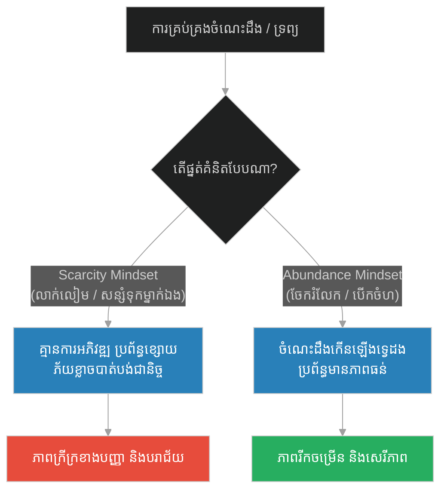
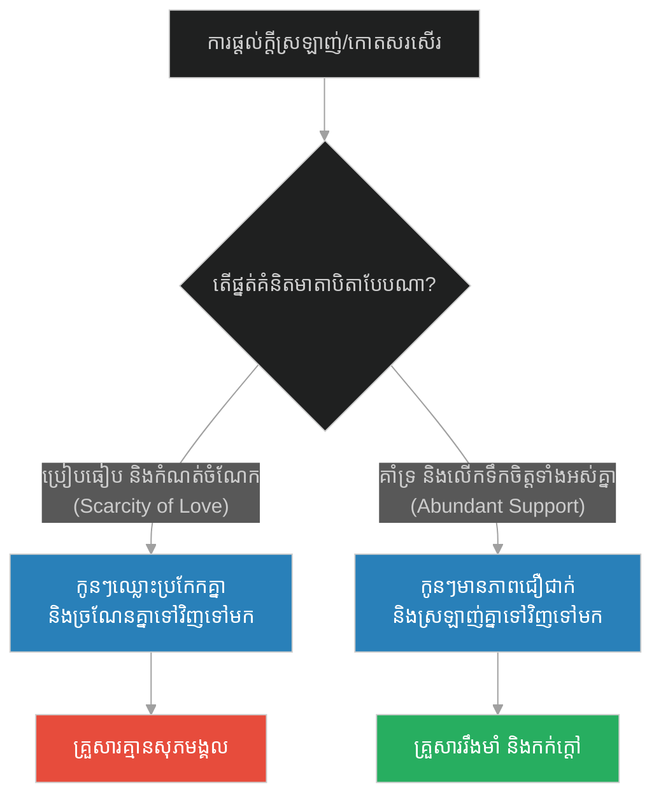
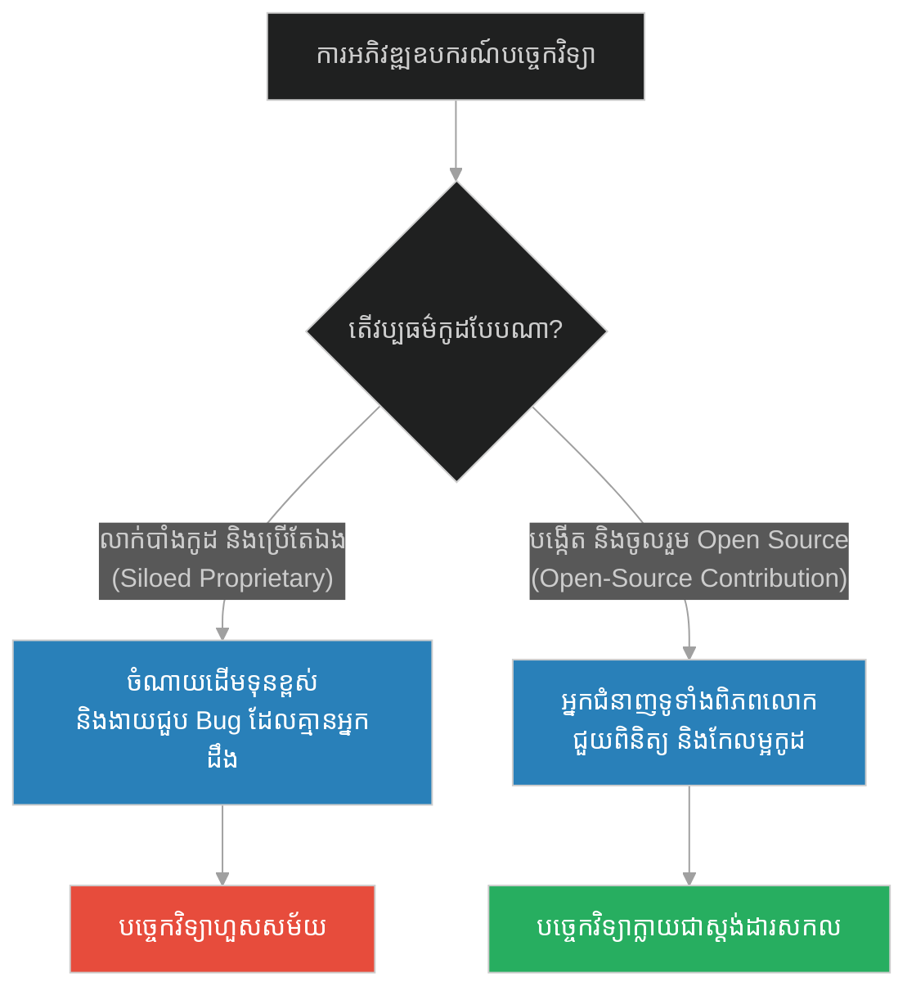
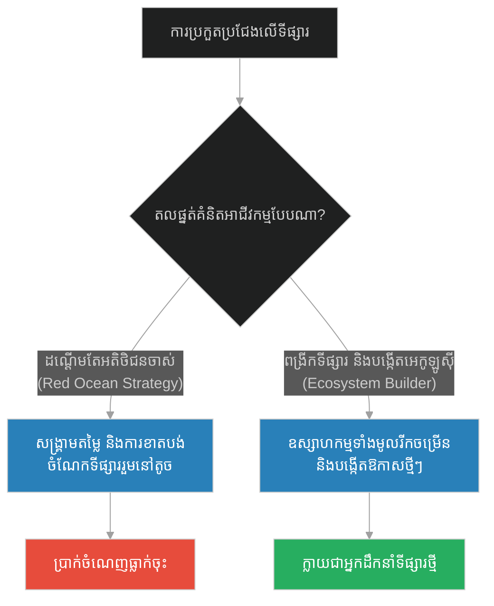
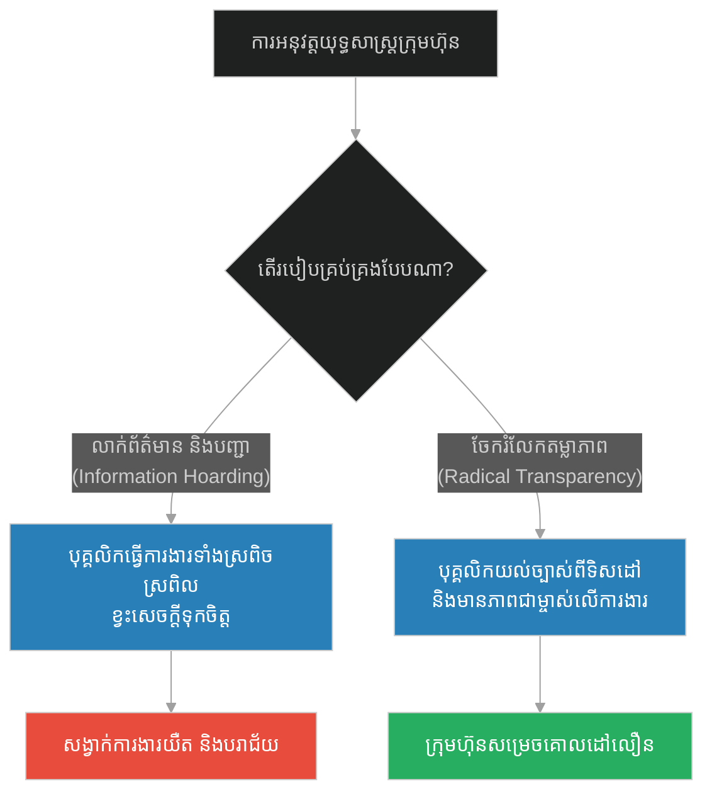
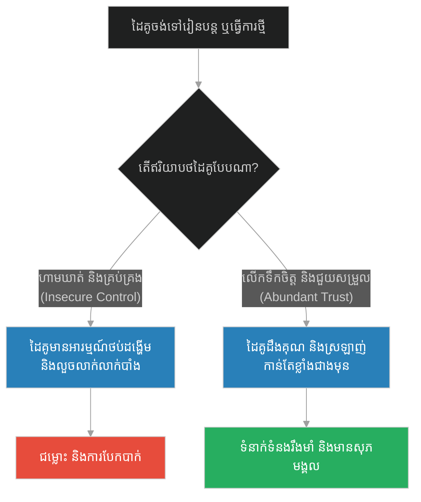
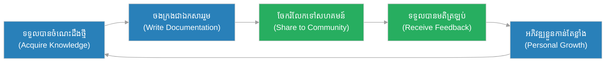

# Abundance Mindset & Knowledge Sharing (ចោរដែលមិនអាចលួចព្រះច័ន្ទបាន)៖ ផ្នត់គំនិតបរិបូណ៌ និងការចែករំលែកចំណេះដឹង (Abundance Mindset & Knowledge Sharing & Ryokan and the Moon)

**Author:** ichamrong  
**Date:** 2026-05-28  
**Tags:** #buddhism #zen #abundance-mindset #minimalism #knowledge-sharing #open-source #empowerment  
**Category:** Concepts  
**Read Time:** ~15 min  

---

<a id="0"></a>
## 📌 មាតិកា (Table of Contents)
- [អន្ទាក់ផ្លូវចិត្ត (The Trap)](#0)
- [១. រឿងព្រេងនិទាន៖ ចោរចូលខ្ទមលោកគ្រូរីកាន (The Legend of Ryokan and the Thief)](#1)
  - [កាដូ និងពន្លឺព្រះច័ន្ទ (The Gift of the Moon)](#1-1)
- [២. បញ្ហា៖ ផ្នត់គំនិតខ្សត់ខ្សោយ ធៀបនឹង ផ្នត់គំនិតបរិបូណ៌ (The Issue: Scarcity vs. Abundance)](#2)
- [៣. ឧទាហរណ៍ជាក់ស្តែងក្នុងពិភពពិត (Real World Examples)](#3)
  - [ឧទាហរណ៍ទី ១ — កម្រិតស្រាល (គ្រួសារ)៖ សេចក្តីស្រឡាញ់ និងការយកចិត្តទុកដាក់ក្នុងគ្រួសារ (The Abundance of Love)](#3-1)
  - [ឧទាហរណ៍ទី ២ — កម្រិតមធ្យម (បច្ចេកទេស)៖ កូដបិទជិត និងបណ្ណាល័យ Open-Source (The Proprietary vs. Open Source Code)](#3-2)
  - [ឧទាហរណ៍ទី ៣ — កម្រិតមធ្យម (ធុរកិច្ច)៖ ការប្រកួតប្រជែងដណ្តើមចំណែកផ្សារ និងការសាងសហគមន៍ (The Red Ocean vs. Ecosystem Building)](#3-3)
  - [ឧទាហរណ៍ទី ៤ — កម្រិតមធ្យម (សង្គម/គ្រប់គ្រង)៖ ការលាក់ព័ត៌មានដើម្បីអំណាច និងតម្លាភាពព័ត៌មាន (The Information Hoarding vs. Transparency)](#3-4)
  - [ឧទាហរណ៍ទី ៥ — កម្រិតធ្ងន់ (ទំនាក់ទំនង)៖ ការប្រចែប្រចណ្ឌ និងការគាំទ្រភាពរីកចម្រើនគ្នា (The Insecurity vs. Mutual Growth)](#3-5)
- [៤. ដំណោះស្រាយទូទៅ៖ ការផ្លាស់ប្តូរផ្នត់គំនិត និងការបង្កើតប្រព័ន្ធចែករំលែក (The General Solution: Cultivating Abundance & Sharing)](#4)
- [សេចក្តីសន្និដ្ឋាន (Conclusion)](#5)
- [ឯកសារយោង (References)](#6)
- [Related Posts](#7)

---

<a id="0"></a>
## អន្ទាក់ផ្លូវចិត្ត (The Trap)

តើអ្នកធ្លាប់មានអារម្មណ៍ថា ខ្លាចអ្នកដទៃពូកែជាងខ្លួន ខ្លាចបាត់បង់មុខតំណែង ឬខ្លាចការចែករំលែកចំណេះដឹងទៅកាន់មិត្តរួមការងារដែរឬទេ? នេះគឺជា **"អន្ទាក់នៃផ្នត់គំនិតខ្សត់ខ្សោយ" (Scarcity Mindset Trap)**។ មនុស្សនៅក្នុងអន្ទាក់នេះជឿថា ធនធាន សិរីសួស្តី និងចំណេះដឹងនៅលើលោកមានកំណត់ ដូចជានំខេកមួយដុំអញ្ចឹង ប្រសិនបើអ្នកដទៃបានចំណែកច្រើន នោះចំណែករបស់ខ្លួននឹងត្រូវថយចុះ។ ពួកគេក៏ចាប់ផ្តើមលាក់លៀម មិនចែករំលែក និងព្យាយាមលួចប្លន់ទ្រព្យសម្បត្តិក្រៅខ្លួន ដោយភ្លេចថាទ្រព្យសម្បត្តិពិតប្រាកដគឺមិនអាចលួចបានឡើយ។

*   **Side A (The Scarcity Hoarder):** ការយល់ឃើញថាអ្វីៗមានដែនកំណត់ នាំឱ្យកើតមានការគំរាមកំហែង ស្អប់ខ្ពើមការចែករំលែក និងរស់នៅក្នុងការភ័យខ្លាចការបាត់បង់ជានិច្ច។
*   **Side B (The Abundance Sharer):** ការយល់ឃើញថាធនធានខាងក្នុង និងចំណេះដឹងអាចកើនឡើងនៅពេលចែករំលែក ដូចជាពន្លឺព្រះច័ន្ទ ឬអណ្តាតភ្លើងទៀន ដែលមិនចេះថយចុះទោះបីជាចែករំលែកទៅកាន់ទៀនរាប់ពាន់ដើមក៏ដោយ។

នៅក្នុងអត្ថបទនេះ យើងនឹងស្វែងយល់ពីរបៀបរំដោះខ្លួនចេញពីភាពក្រីក្រនៃផ្នត់គំនិត ដើម្បីឈានទៅរកទ្រព្យសម្បត្តិខាងក្នុង និងការចែករំលែកចំណេះដឹងដែលគ្មានថ្ងៃរលត់។

---

<a id="1"></a>
## ១. រឿងព្រេងនិទាន៖ ចោរចូលខ្ទមលោកគ្រូរីកាន (The Legend of Ryokan and the Thief)

កាលពីរយឆ្នាំមុន មានព្រះសង្ឃហ្សេន (Zen) ដ៏ល្បីល្បាញមួយអង្គព្រះនាម **រីកាន (Ryokan)**។ ព្រះអង្គរស់នៅយ៉ាងសាមញ្ញបំផុតនៅក្នុងខ្ទមតូចមួយនៅជើងភ្នំស្ងប់ស្ងាត់។ លោកគ្រូរីកានគ្មានទ្រព្យសម្បត្តិមានតម្លៃអ្វីក្រៅពីស្បង់ចីវរចាស់ៗ ចានមួយសម្រាប់សុំទាន និងក្រដាសសរសេរកំណាព្យពីរបីសន្លឹកប៉ុណ្ណោះ។ ទ្រង់រស់នៅដោយពេញចិត្តនឹងធម្មជាតិ សន្តិភាពចិត្ត និងភាពសាមញ្ញជាទីបំផុត។

យប់មួយ មានចោរម្នាក់បានលួចចូលទៅក្នុងខ្ទមរបស់លោកគ្រូរីកាន ខណៈពេលដែលលោកកំពុងតែនិមន្តទៅខាងក្រៅ។ ចោរនោះខំប្រឹងរុករកកកាយគ្រប់ជ្រុងនៃខ្ទម ដើម្បីស្វែងរកប្រាក់កាស ឬរបស់មានតម្លៃ ប៉ុន្តែរកមិនឃើញអ្វីសោះឡើយ សូម្បីតែមួយសេន។ ចោរនោះខឹង និងខកចិត្តជាខ្លាំង ព្រោះខំធ្វើដំណើរមកឆ្ងាយទាំងយប់អាធ្រាត្រ។

ខណៈនោះ លោកគ្រូរីកានក៏បានត្រឡប់មកវិញ ហើយឃើញចោរកំពុងតែឈរខកចិត្តនៅកណ្តាលខ្ទម។

<a id="1-1"></a>
### កាដូ និងពន្លឺព្រះច័ន្ទ (The Gift of the Moon)

លោកគ្រូរីកានមិនភ័យខ្លាច ឬខឹងសម្បារឡើយ ព្រះអង្គបែរជាញញឹមយ៉ាងស្រទន់ រួចមានសង្ឃដីកាទៅកាន់ចោរនោះថា៖ *"ឱមិត្តអើយ! អ្នកប្រហែលជាធ្វើដំណើរមកឆ្ងាយណាស់ហើយទាំងយប់ត្រជាក់ដើម្បីមកលេងខ្ទមរបស់ខ្ញុំ ប៉ុន្តែខ្ញុំសូមទោសយ៉ាងខ្លាំង ដែលខ្ញុំគ្មានរបស់មានតម្លៃ ឬអាហារឆ្ងាញ់ៗសម្រាប់ទទួលអ្នកសោះឡើយ។ អ្នកមិនគួរត្រឡប់ទៅវិញដោយដៃទទេ និងខកចិត្តបែបនេះទេ... សូមយកសម្លៀកបំពាក់ និងភួយចាស់ដែលខ្ញុំកំពុងដណ្តប់នេះទៅចុះ យ៉ាងហោចណាស់វាអាចជួយឱ្យអ្នកកក់ក្តៅក្នុងពេលធ្វើដំណើរត្រឡប់ទៅវិញ។"*

និយាយរួច លោកគ្រូរីកានក៏បានដោះសម្លៀកបំពាក់ខាងក្រៅ និងភួយរបស់ព្រះអង្គហុចទៅឱ្យចោរនោះ។ ចោរមានការភាន់ច្រឡំ និងតក់ស្លុតយ៉ាងខ្លាំងចំពោះទង្វើរបស់លោកគ្រូ ប៉ុន្តែដោយសារក្តីលោភលន់ គេក៏ចាប់យកសម្លៀកបំពាក់នោះ រួចរត់គេចខ្លួនទៅក្នុងភាពងងឹតបាត់ទៅ។

លោកគ្រូរីកានអង្គុយអាក្រាតកាយនៅក្នុងខ្ទមដ៏ត្រជាក់ ព្រះអង្គសម្លឹងមើលទៅក្រៅបង្អួច ឃើញ **ព្រះច័ន្ទពេញបូណ៌មី** កំពុងតែរះត្រចះត្រចង់ ជះពន្លឺពណ៌ប្រាក់ដ៏ស្រស់ស្អាតក្រាលពេញព្រៃភ្នំ។ ព្រះអង្គដកដង្ហើមធំដោយក្តីអាណិត រួចក៏តែងកំណាព្យមួយឃ្លាថា៖

> **«កម្សត់ណាស់មិត្តចោរម្នាក់នោះ គេយកបានត្រឹមតែអាវចាស់របស់ខ្ញុំ... ខ្ញុំពិតជាចង់ប្រគល់ព្រះច័ន្ទដ៏ស្រស់ស្អាត និងឥតគិតថ្លៃនេះទៅឱ្យគេណាស់ ប៉ុន្តែគេមិនអាចលួចយកវាទៅបានឡើយ។»**

---

<a id="2"></a>
## ២. បញ្ហា៖ ផ្នត់គំនិតខ្សត់ខ្សោយ ធៀបនឹង ផ្នត់គំនិតបរិបូណ៌ (The Issue: Scarcity vs. Abundance)

នៅក្នុងប្រព័ន្ធការងារ ផ្នត់គំនិតរបស់ "ចោរ" គឺតំណាងឱ្យ **Scarcity Mindset** ដែលផ្តោតតែលើរបស់ដែលអាចបាត់បង់ និងមានដែនកំណត់ (កម្លាំងកាយ លុយកាក់ សម្ភារៈ)។ ចំណែកឯផ្នត់គំនិតរបស់ "លោកគ្រូរីកាន" គឺតំណាងឱ្យ **Abundance Mindset** ដែលផ្តោតលើរបស់ដែលគ្មានដែនកំណត់ និងមិនអាចលួចបាន (សន្តិភាពចិត្ត ចំណេះដឹង វប្បធម៌ចែករំលែក)។

នៅក្នុងវិស័យបច្ចេកវិទ្យា ការព្យាយាមលាក់កូដ ឬការពារចំណេះដឹងមិនឱ្យមិត្តរួមការងារដឹង (Information Hoarding) គឺបង្កើតឱ្យមានភាពផុយស្រួយ។ ប្រសិនបើបុគ្គលិកម្នាក់នោះឈឺ ឬឈប់ធ្វើការ ប្រព័ន្ធទាំងមូលនឹងគាំងភ្លាមៗ។ 



### ការប្រៀបធៀបតាមរយៈកូដ (Code Comparison)

ខាងក្រោមនេះជាការប្រៀបធៀបរវាងការសរសេរកូដដែលបិទជិត និងចម្លងគ្នាច្រើនកន្លែង (Scarcity) ធៀបនឹងការសរសេរកូដដែលប្រើប្រាស់ប្រព័ន្ធបណ្ណាល័យរួមដែលអាចចែករំលែកបាន (Abundance/Reusable Shared Formatter)៖

#### វិធីសាស្ត្រអាក្រក់៖ កូដចម្លង និងលាក់ទុក (Duplicated & Siloed Utility)
សេវាកម្មនីមួយៗបង្កើត Helper ផ្ទាល់ខ្លួន ដោយសារមិនទុកចិត្ត និងមិនព្រមប្រើបណ្ណាល័យរួម។ ប្រសិនបើមានកំហុស (Bug) ត្រូវទៅជួសជុលគ្រប់កន្លែងទាំងអស់។

```python
# Bad Design: Duplicate utility classes due to lack of sharing culture
class ModuleA:
    def process_data(self, payload: dict):
        # មុខងារជំនួយដែលត្រូវសរសេរម្តងទៀត ព្រោះគ្មានការចែករំលែក
        clean_text = payload.get("data", "").strip().lower()
        print(f"ModuleA processing: {clean_text}")
        return clean_text

class ModuleB:
    def process_data(self, payload: dict):
        # មុខងារដដែលត្រូវបានចម្លងមកប្រើនៅទីនេះ
        clean_text = payload.get("data", "").strip().lower()
        print(f"ModuleB processing: {clean_text}")
        return clean_text
```

#### វិធីសាស្ត្រល្អ៖ ការបង្កើតបណ្ណាល័យរួម (Shared Reusable Module)
បង្កើតបណ្ណាល័យសហគមន៍ដែលគ្រប់ Module ទាំងអស់អាចប្រើប្រាស់ និងចូលរួមកែលម្អរួមគ្នាបាន។

```python
# Good Design: Shared Open-Source Formatter Library
class SharedDataUtility:
    @staticmethod
    def sanitize(payload: dict, key: str = "data") -> str:
        # ប្រភពតែមួយនៃការពិត (Single Source of Truth)
        return payload.get(key, "").strip().lower()

# Module ផ្សេងៗគ្រាន់តែហៅមកប្រើ និងអាចចូលរួមកែលម្អវាបាន
class ModuleA:
    def process_data(self, payload: dict):
        clean_text = SharedDataUtility.sanitize(payload)
        print(f"ModuleA processing: {clean_text}")

class ModuleB:
    def process_data(self, payload: dict):
        clean_text = SharedDataUtility.sanitize(payload)
        print(f"ModuleB processing: {clean_text}")
```

---

<a id="3"></a>
## ៣. ឧទាហរណ៍ជាក់ស្តែងក្នុងពិភពពិត

<a id="3-1"></a>
### ឧទាហរណ៍ទី ១ — កម្រិតស្រាល (គ្រួសារ)៖ សេចក្តីស្រឡាញ់ និងការយកចិត្តទុកដាក់ក្នុងគ្រួសារ (The Abundance of Love)

នៅក្នុងគ្រួសារខ្លះ មាតាបិតាមានផ្នត់គំនិតខ្សត់ខ្សោយលើក្តីស្រឡាញ់ ដោយយល់ថាការផ្តល់ក្តីស្រឡាញ់ ឬការកោតសរសើរទៅកាន់កូនច្បង នឹងធ្វើឱ្យកូនប្អូនបាត់បង់ចំណែកក្តីស្រឡាញ់ (Scarcity of Affection)។ ពួកគេក៏ចាប់ផ្តើមប្រៀបធៀប និងលាក់អារម្មណ៍។ ផ្ទុយទៅវិញ ផ្នត់គំនិតបរិបូណ៌យល់ថា សេចក្តីស្រឡាញ់ក្នុងគ្រួសារអាចពង្រីកបានគ្មានដែនកំណត់ ហើយការកោតសរសើរសមាជិកម្នាក់ ជួយបង្កើនថាមពលវិជ្ជមានដល់សមាជិកដទៃទៀត។



---

<a id="3-2"></a>
### ឧទាហរណ៍ទី ២ — កម្រិតមធ្យម (បច្ចេកទេស)៖ កូដបិទជិត និងបណ្ណាល័យ Open-Source (The Proprietary vs. Open Source Code)

នៅក្នុងពិភពបច្ចេកវិទ្យា ក្រុមហ៊ុនខ្លះព្យាយាមលាក់បច្ចេកវិទ្យារបស់ខ្លួន និងមិនព្រមប្រើប្រាស់ ឬរួមចំណែកក្នុងគម្រោង Open Source ឡើយ។ ពួកគេត្រូវចំណាយលុយរាប់លានដុល្លារដើម្បីបង្កើតអ្វីដែលគេមានស្រាប់។ ផ្ទុយទៅវិញ ក្រុមហ៊ុនដូចជា Red Hat, Google និង Facebook បានបើកចំហគម្រោងធំៗដូចជា Linux, Kubernetes និង React ឱ្យពិភពលោកប្រើប្រាស់រួមគ្នា ដែលជួយឱ្យពួកគេទទួលបានការចូលរួមកែលម្អពីអ្នកអភិវឌ្ឍន៍រាប់លាននាក់ទូទាំងពិភពលោកដោយឥតគិតថ្លៃ។



---

<a id="3-3"></a>
### ឧទាហរណ៍ទី ៣ — កម្រិតមធ្យម (ធុរកិច្ច)៖ ការប្រកួតប្រជែងដណ្តើមចំណែកផ្សារ និងការសាងសហគមន៍ (The Red Ocean vs. Ecosystem Building)

នៅក្នុងអាជីវកម្ម ផ្នត់គំនិតខ្សត់ខ្សោយ (Scarcity) នាំឱ្យក្រុមហ៊ុនផ្តោតតែលើការកំទេចគូប្រជែង និងដណ្តើមអតិថិជនដែលមានស្រាប់ (Red Ocean)។ ផ្ទុយទៅវិញ ក្រុមហ៊ុនដែលមានផ្នត់គំនិតបរិបូណ៌ (Abundance) ផ្តោតលើការកសាងប្រព័ន្ធអេកូឡូស៊ី (Ecosystem) និងការពង្រីកទីផ្សារថ្មី។ ឧទាហរណ៍ ក្រុមហ៊ុន Tesla បានបើកចំហរអាជ្ញាប័ណ្ណប៉ាតង់ (Patents) នៃឡានអគ្គិសនីរបស់ខ្លួនទៅឱ្យគូប្រជែងប្រើប្រាស់ដោយសេរី ព្រោះគោលដៅរបស់ពួកគេគឺចង់ពង្រីកទីផ្សារឡានអគ្គិសនីទាំងមូលឱ្យធំជាងឡានប្រើសាំង។



---

<a id="3-4"></a>
### ឧទាហរណ៍ទី ៤ — កម្រិតមធ្យម (សង្គម/គ្រប់គ្រង)៖ ការលាក់ព័ត៌មានដើម្បីអំណាច និងតម្លាភាពព័ត៌មាន (The Information Hoarding vs. Transparency)

អ្នកដឹកនាំខ្លះចូលចិត្តលាក់បាំងព័ត៌មានអាជីវកម្ម និងផែនការយុទ្ធសាស្ត្រ ដោយចែករំលែកតែសមាជិកជិតស្និទ្ធរបស់ខ្លួនប៉ុណ្ណោះ ព្រោះពួកគេគិតថាព័ត៌មានជាអំណាច (Information is Power)។ លទ្ធផលគឺ បុគ្គលិកថ្នាក់ក្រោមធ្វើការងារដោយគ្មានគោលដៅច្បាស់លាស់ និងមានអារម្មណ៍មិនទុកចិត្តគ្នា។ ផ្ទុយទៅវិញ ស្ថាប័នដែលមានតម្លាភាព (Transparent Leadership) តែងតែចងក្រងឯកសារ និងចែករំលែករាល់ព័ត៌មានសំខាន់ៗទៅកាន់បុគ្គលិកគ្រប់រូប ដែលជួយឱ្យពួកគេអាចសម្រេចចិត្តបានត្រឹមត្រូវ និងទាន់ពេលវេលា។



---

<a id="3-5"></a>
### ឧទាហរណ៍ទី ៥ — កម្រិតធ្ងន់ (ទំនាក់ទំនង)៖ ការប្រចែប្រចណ្ឌ និងការគាំទ្រភាពរីកចម្រើនគ្នា (The Insecurity vs. Mutual Growth)

នៅក្នុងទំនាក់ទំនងស្នេហា ផ្នត់គំនិតខ្សត់ខ្សោយ (Scarcity) បង្កើតឱ្យមានការប្រចែប្រចណ្ឌជ្រុលហួសហេតុ និងការគ្រប់គ្រងដៃគូ ព្រោះខ្លាចដៃគូជួបអ្នកថ្មី ឬជោគជ័យជាងខ្លួន (Fear of Loss)។ ផ្ទុយទៅវិញ ផ្នត់គំនិតបរិបូណ៌ (Abundance) ផ្តោតលើការផ្តល់សេរីភាព ការគាំទ្រឱ្យដៃគូរៀនសូត្រ និងរីកចម្រើនលើការងាររបស់ខ្លួន ដោយដឹងថាសេចក្តីស្រឡាញ់ពិតប្រាកដកើតចេញពីការគោរព និងការទុកចិត្តគ្នា មិនមែនការឃុំឃាំងឡើយ។



---

<a id="4"></a>
## ៤. ដំណោះស្រាយទូទៅ៖ ការផ្លាស់ប្តូរផ្នត់គំនិត និងការបង្កើតប្រព័ន្ធចែករំលែក (The General Solution: Cultivating Abundance & Sharing)

ដើម្បីបង្កើតវប្បធម៌នៃការចែករំលែកចំណេះដឹង និងបណ្តុះផ្នត់គំនិតបរិបូណ៌ យើងត្រូវអនុវត្តជំហានគន្លឹះទាំងនេះ៖

1.  **Shift from Possession to Propagation (ផ្លាស់ប្តូរពីការកាន់កាប់ទៅជាការផ្សព្វផ្សាយ):** ចងចាំថា ចំណេះដឹង និងសេចក្តីសុខ មិនមែនជារបស់រឹងសម្រាប់ទុកលក់នោះទេ វាគឺជាអណ្តាតភ្លើងដែលកាន់តែចែករំលែកកាន់តែភ្លឺស្វាង។
2.  **Document and Automate (ចងក្រងឯកសារ និងធ្វើស្វ័យប្រវត្តិកម្ម):** បង្កើតប្រព័ន្ធផ្ទុកព័ត៌មានរួម (Wiki, Notion, GitHub) ដើម្បីឱ្យចំណេះដឹងទាំងអស់ត្រូវបានបើកចំហរជាសាធារណៈសម្រាប់សមាជិកគ្រប់រូប។
3.  **Reward Knowledge Sharing (លើកទឹកចិត្តអ្នកចែករំលែក):** បង្កើតវប្បធម៌ស្វែងរក និងកោតសរសើរដល់បុគ្គលិក ឬសមាជិកដែលចូលចិត្តជួយបង្រៀន និងណែនាំអ្នកដទៃ (Mentorship)។



* 🚀 **[ចាប់ផ្តើមដំណើររុករក (Start the Journey) ➔ Habituation & Alert Fatigue (ឆ្កែរបស់អ្នកដំដែក)](./163-buddha-and-the-blacksmiths-dog.md)**

---

<a id="5"></a>
## សេចក្តីសន្និដ្ឋាន (Conclusion)

> **«ទ្រព្យសម្បត្តិដ៏ពិតប្រាកដ មិនមែនស្ថិតនៅលើចំនួនរបស់របរដែលយើងមាននោះទេ ប៉ុន្តែវាស្ថិតនៅលើសមត្ថភាពរបស់យើងក្នុងការឱ្យតម្លៃ និងសេរីភាពនៃការចែករំលែករបស់ទាំងនោះទៅកាន់អ្នកដទៃ។»**

ពន្លឺព្រះច័ន្ទរះពេញផ្ទៃមេឃ មិនមែនជារបស់ឯកជនរបស់នរណាម្នាក់ឡើយ។ វារះស្មើៗគ្នាសម្រាប់ទាំងសេដ្ឋី និងទាំងចោរលួច។ នៅពេលណាដែលយើងអាចលះបង់ចោលនូវការប្រកាន់ខ្ជាប់នឹងកម្មសិទ្ធិ ហើយបើកចិត្តទទួលយក និងចែករំលែកភាពល្អបវរនៃជីវិត នោះយើងនឹងទទួលបាននូវ "ព្រះច័ន្ទនៅក្នុងចិត្ត" ដែលគ្មានចោរណាម្នាក់អាចលួចយកទៅបានឡើយ។

---

<a id="6"></a>
## ឯកសារយោង (References)

*   **Zen Flesh, Zen Bones** — Compiled by Paul Reps (1957). Contains the story "The Thief Who Became a Disciple" / "Ryokan and the Moon", showcasing the essence of non-attachment.
*   **The Seven Habits of Highly Effective People** — Stephen Covey (1989). Defines the concept of "Abundance Mentality" vs. "Scarcity Mentality".
*   **The Cathedral and the Bazaar: Musings on Linux and Open Source by an Accidental Revolutionary** — Eric S. Raymond (1999). Analyzes why open, collaborative software development models are superior to closed ones.

---

<a id="7"></a>
## Related Posts

* [The Blind Man and the Lame Man (ជនពិការភ្នែក និងជនពិការជើង)](./161-buddha-and-the-blind-and-lame.md) — ស្វែងយល់ពីរបៀបដែលការសហការគ្នាជួយសម្រេចគោលដៅរួម។
* [The Blacksmith's Dog (ឆ្កែរបស់អ្នកដំដែក)](./163-buddha-and-the-blacksmiths-dog.md) — ស្វែងយល់អំពីបញ្ហានៃការស៊ាំ និងការព្រងើយកន្តើយនឹងបញ្ហាជុំវិញខ្លួន។
