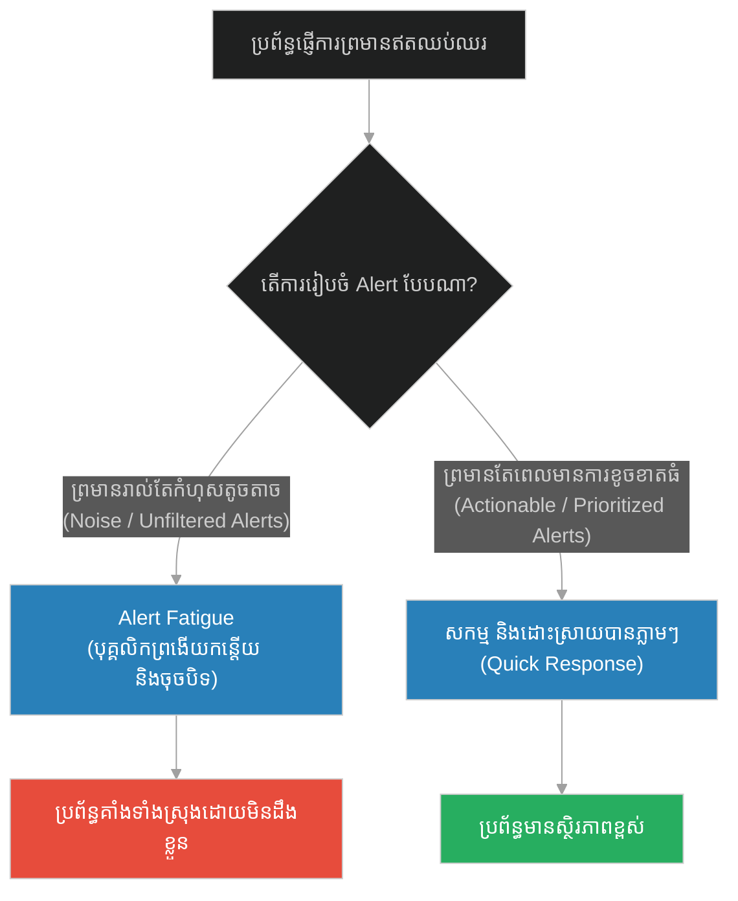
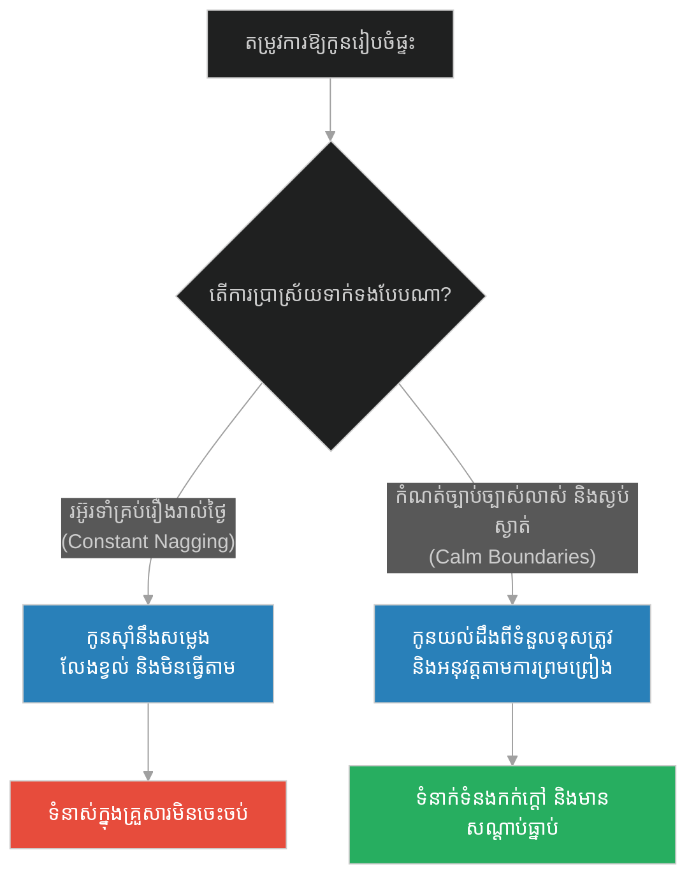
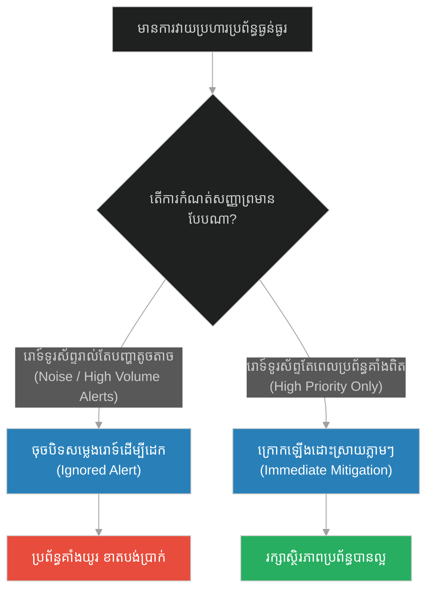
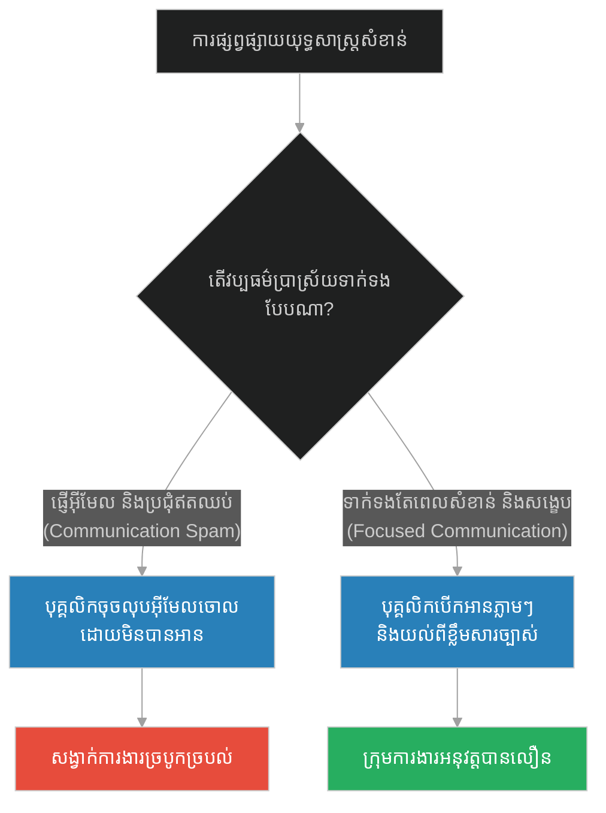
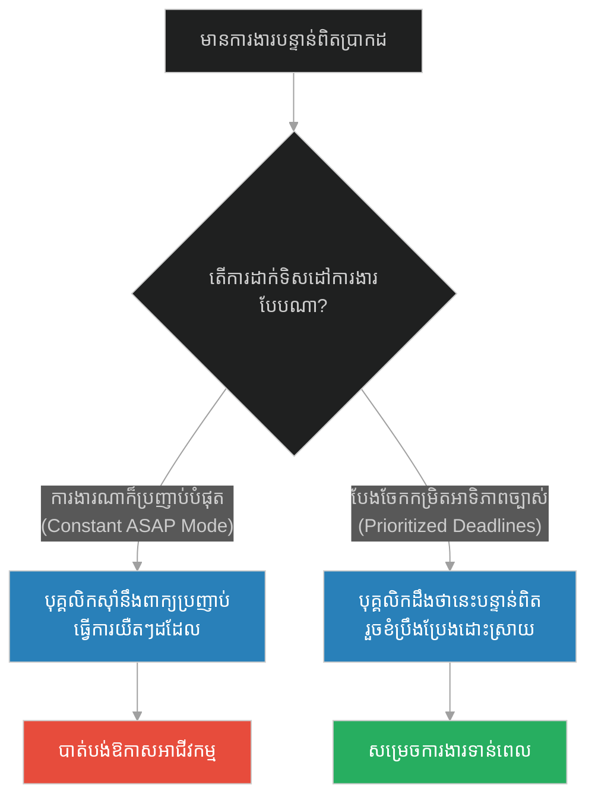
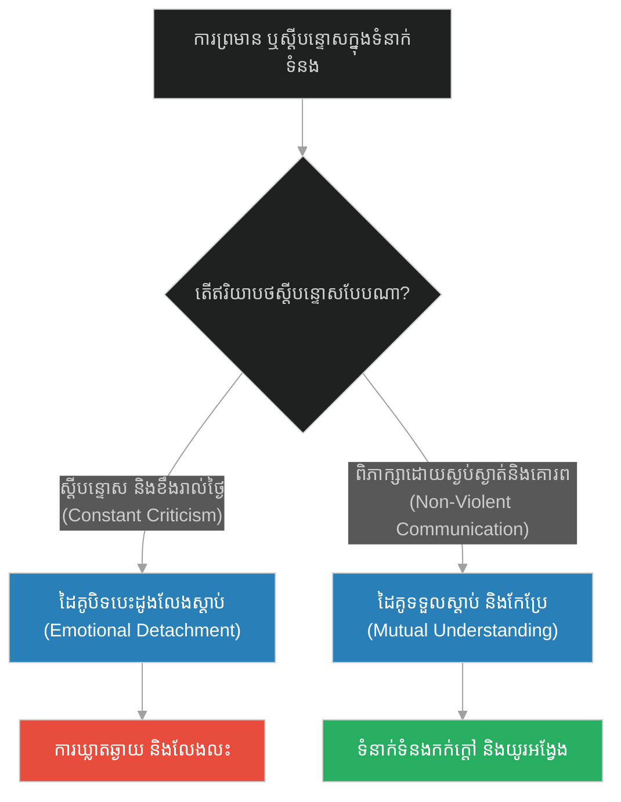
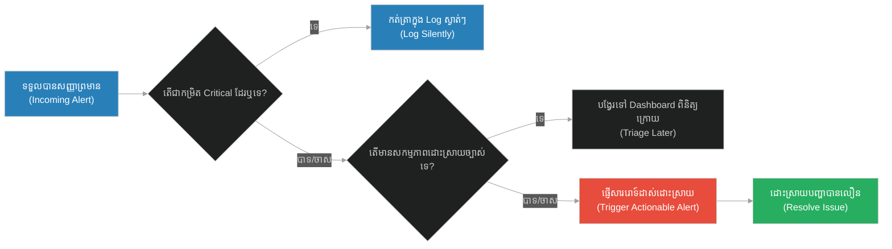

# Habituation & Alert Fatigue (ឆ្កែរបស់អ្នកដំដែក)៖ ការស៊ាំនឹងបញ្ហា និងការធុញទ្រាន់នឹងការព្រមាន (Habituation & Alert Fatigue & The Blacksmith's Dog)

**Author:** ichamrong  
**Date:** 2026-05-28  
**Tags:** #buddhism #habituation #desensitization #alert-fatigue #attention #mindfulness #system-monitoring  
**Category:** Concepts  
**Read Time:** ~15 min  

---

<a id="0"></a>
## 📌 មាតិកា (Table of Contents)
- [អន្ទាក់ផ្លូវចិត្ត (The Trap)](#0)
- [១. រឿងព្រេងនិទាន៖ ឆ្កែរបស់អ្នកដំដែក (The Legend of the Blacksmith's Dog)](#1)
  - [សម្លេងចានអាហារ និងសតិដាស់តឿន (The Food Bowl and Awakening)](#1-1)
- [២. បញ្ហា៖ ការស៊ាំនឹងសញ្ញាព្រមាន និងការធុញទ្រាន់នឹងការព្រមាន (The Issue: Habituation & Alert Fatigue)](#2)
- [៣. ឧទាហរណ៍ជាក់ស្តែងក្នុងពិភពពិត (Real World Examples)](#3)
  - [ឧទាហរណ៍ទី ១ — កម្រិតស្រាល (គ្រួសារ)៖ ការរអ៊ូរទាំរបស់ឪពុកម្តាយ និងការព្រងើយកន្តើយរបស់កូន (The Parental Nagging)](#3-1)
  - [ឧទាហរណ៍ទី ២ — កម្រិតមធ្យម (បច្ចេកទេស)៖ ប្រព័ន្ធត្រួតពិនិត្យ PagerDuty និងការព្រងើយកន្តើយនឹង Alert (The Tech Alert Fatigue)](#3-2)
  - [ឧទាហរណ៍ទី ៣ — កម្រិតមធ្យម (ធុរកិច្ច)៖ ការប្រជុំច្រើនហួសហេតុ និងការផ្ញើអ៊ីមែលឥតប្រយោជន៍ (The Business Spam & Meeting Fatigue)](#3-3)
  - [ឧទាហរណ៍ទី ៤ — កម្រិតមធ្យម (សង្គម/គ្រប់គ្រង)៖ ស្ថានភាពអាសន្នជានិច្ច និងការបាក់ទឹកចិត្តរបស់បុគ្គលិក (The Management Cry Wolf)](#3-4)
  - [ឧទាហរណ៍ទី ៥ — កម្រិតធ្ងន់ (ទំនាក់ទំនង)៖ ការរិះគន់ជាប្រចាំ និងការផ្ដាច់ខ្លួនខាងអារម្មណ៍ (The Constant Criticism Detachment)](#3-5)
- [៤. ដំណោះស្រាយទូទៅ៖ ការកំណត់អាទិភាព និងការបណ្តុះសតិស្មារតី (The General Solution: Priority Management & Mindfulness)](#4)
- [សេចក្តីសន្និដ្ឋាន (Conclusion)](#5)
- [ឯកសារយោង (References)](#6)
- [Related Posts](#7)

---

<a id="0"></a>
## អន្ទាក់ផ្លូវចិត្ត (The Trap)

ហេតុអ្វីបានជានៅពេលមានបញ្ហាធំៗ ឬគ្រោះថ្នាក់កើតឡើង មនុស្សយើងបែរជាមិនព្រឺព្រួច និងមិនចាត់វិធានការដោះស្រាយ? នោះគឺដោយសារតែពួកគេបានធ្លាក់ចូលទៅក្នុង **"អន្ទាក់នៃការស៊ាំនឹងបញ្ហា" (Habituation & Alert Fatigue Trap)**។ នៅពេលយើងរស់នៅក្នុងបរិយាកាសដែលមានសម្លេងរំខាន គ្រោះថ្នាក់ ឬការព្រមានឥតឈប់ឈរ ខួរក្បាលរបស់យើងនឹងចាប់ផ្តើមបិទចោលការទទួលដឹងសញ្ញាទាំងនោះ ដើម្បីការពារខ្លួន (Desensitization)។ លទ្ធផលគឺ យើងនឹង "ដេកលក់" នៅក្នុងសេចក្តីទុក្ខ ឬកំហុសឆ្គងដដែលៗ ប៉ុន្តែបែរជាងាយនឹងភ្ញាក់ផ្អើល និងរត់តាមការល្បួងចិត្តតូចតាចដែលផ្តល់ក្តីសុខភ្លាមៗ។

*   **Side A (The Desensitized Sleeper):** ការព្រងើយកន្តើយនឹងបញ្ហាធំៗដែលកើតឡើងជាប្រចាំ ដោយចាត់ទុកវាជារឿងធម្មតា និងលែងចង់កែលម្អ។
*   **Side B (The Alert Responder):** ការរក្សាសតិស្មារតីឱ្យនៅភ្លឺស្វាង មិនបណ្តោយឱ្យប្រព័ន្ធព្រមានមានភាពរញ៉េរញ៉ៃ និងចេះឆ្លើយតបតែចំពោះសញ្ញាណាដែលមានសារៈសំខាន់ពិតប្រាកដ។

នៅក្នុងអត្ថបទនេះ យើងនឹងសិក្សាពីយន្តការចិត្តសាស្ត្រនៃការស៊ាំនឹងបញ្ហា និងការរចនាប្រព័ន្ធព័ត៌មានដែលគ្មានការរំខាន ដើម្បីរក្សាសតិដាស់តឿនឱ្យបានល្អ។

---

<a id="1"></a>
## ១. រឿងព្រេងនិទាន៖ ឆ្កែរបស់អ្នកដំដែក (The Legend of the Blacksmith's Dog)

នៅក្នុងធម្មទេសនារបស់ព្រះពុទ្ធ មានរឿងប្រៀបប្រដៅដ៏គួរឱ្យចាប់អារម្មណ៍មួយស្តីពីសត្វឆ្កែរបស់ជាងដំដែក។

មានជាងដំដែកម្នាក់ បានបើករោងជាងដ៏ធំមួយនៅកណ្តាលភូមិ។ គាត់មានសត្វឆ្កែមួយក្បាលដែលស្មោះត្រង់ និងតែងតែដេកក្បែរជើងរបស់គាត់នៅក្នុងរោងជាងនោះជារៀងរាល់ថ្ងៃ។ ការងាររបស់ជាងដំដែកតម្រូវឱ្យគាត់ប្រើប្រាស់ញញួរដែកធំៗ វាយទៅលើដែកដុតក្រហមយ៉ាងខ្លាំងនៅលើទ្រនាប់ដែក។ សម្លេងវាយដែកលាន់ឮកងរំពងពេញរោងជាង "ប៉ាំង! ប៉ាំង! ឆាំង!" ស្ទើរតែកក្រើកដី និងធ្វើឱ្យមនុស្សជិតខាងថ្លង់ត្រចៀក។

ទោះបីជាសម្លេងនោះខ្លាំង និងគួរឱ្យថ្លង់កម្រិតណាក៏ដោយ ក៏សត្វឆ្កែនោះនៅតែអាចដេកលក់យ៉ាងស្កប់ស្កល់នៅក្បែរនោះ ដោយមិនមានអាការៈភ្ញាក់ផ្អើល ឬព្រិចភ្នែកសូម្បីតែបន្តិច។ វាដេកលក់យ៉ាងព្រងើយដូចគ្មានរឿងអ្វីកើតឡើង។ អ្នកភូមិដែលដើរកាត់ទៅមក តែងតែមានការកោតសរសើរយ៉ាងខ្លាំង ដោយគិតថាឆ្កែនេះពិតជាមានសតិស្មារតីល្អ និងមានការអត់ធ្មត់ខ្ពស់ មិនខ្វល់នឹងសម្លេងរំខានខាងក្រៅ។

<a id="1-1"></a>
### សម្លេងចានអាហារ និងសតិដាស់តឿន (The Food Bowl and Awakening)

ប៉ុន្តែនៅថ្ងៃមួយ នៅពេលដែលជាងដំដែកសម្រេចចិត្តឈប់សម្រាកពីការងារ គាត់បានដាក់ញញួរចុះ រួចដើរទៅយកចានអាហារដែករបស់ឆ្កែមកដាក់លើឥដ្ឋ។ ពេលដែលចានដែកប៉ះនឹងឥដ្ឋស៊ីម៉ង់ត៍ វាក៏បង្កើតជាសម្លេង "ត្លាំង" តិចតួចបំផុត ដែលស្ទើរតែគ្មាននរណាម្នាក់ចាប់អារម្មណ៍លឺ។

ស្រាប់តែភ្លាមៗនោះ សត្វឆ្កែដែលកំពុងតែដេកលក់យ៉ាងស្កប់ស្កល់ក្បែរសម្លេងញញួរមុននេះ ក៏បានភ្ញាក់ព្រើត ងើបក្បាលឡើង រួចក្រោកឈរក្រញាងកន្ទុយ និងរត់យ៉ាងលឿនមករកចានអាហាររបស់វាដោយក្តីរំភើប។

ព្រះពុទ្ធបានយកឧទាហរណ៍នេះមកបង្រៀនដល់ភិក្ខុទាំងឡាយថា៖ 
> **«ចិត្តរបស់សត្វលោកក៏ដូចជាឆ្កែរបស់អ្នកដំដែកនេះដែរ។ ពួកគេអាចស៊ាំនឹងសម្លេងនៃ 'សេចក្តីទុក្ខ' ដ៏កងរំពង និងការកើតចាស់ឈឺស្លាប់នៅក្នុងវដ្តសង្សារ ដោយចាត់ទុកវាជារឿងធម្មតា និងដេកលក់យ៉ាងស្កប់ស្កល់។ ប៉ុន្តែពួកគេបែរជាងាយនឹងភ្ញាក់ខ្លួន និងរត់តាមយ៉ាងលឿន ពេលលឺសម្លេងនៃ 'ចំណង់' និងការសប្បាយតូចតាចដែលល្បួងចិត្តពួកគេ។»**

---

<a id="2"></a>
## ២. បញ្ហា៖ ការស៊ាំនឹងសញ្ញាព្រមាន និងការធុញទ្រាន់នឹងការព្រមាន (The Issue: Habituation & Alert Fatigue)

នៅក្នុងចិត្តវិទ្យា បាតុភូតនេះហៅថា **Habituation (ការថយចុះប្រតិកម្មដោយសារការស៊ាំ)**។ នៅពេលខួរក្បាលទទួលបានព័ត៌មានដដែលៗដែលគ្មានគ្រោះថ្នាក់ភ្លាមៗ វានឹងចាត់ទុកព័ត៌មាននោះជា "សម្លេងរំខានខាងក្រោយ" (Background Noise) ហើយបិទវាចោល។

នៅក្នុងការគ្រប់គ្រងប្រព័ន្ធបច្ចេកវិទ្យា នេះគឺជាបញ្ហាដ៏ធំដែលគេហៅថា **Alert Fatigue (ការធុញទ្រាន់នឹងការព្រមាន)**។ ប្រសិនបើប្រព័ន្ធត្រួតពិនិត្យ (Monitoring System) ផ្ញើការព្រមានរាប់ពាន់ដងក្នុងមួយថ្ងៃសម្រាប់បញ្ហាតូចតាច (ដូចជា ម៉ាស៊ីនមេឡើងកំដៅបន្តិចបន្តួច ឬការចុះឈ្មោះបរាជ័យតូចតាច) អ្នកអភិវឌ្ឍន៍ (Developers) នឹងលែងខ្វល់ខ្វាយពីការព្រមានទាំងនោះទៀតហើយ។ ពួកគេនឹងចុច Snooze ឬ Mute ឆានែលនោះចោល។ នៅពេលមានបញ្ហាធ្ងន់ធ្ងរពិតប្រាកដកើតឡើង (ដូចជា ទិន្នន័យត្រូវបានលួច ឬប្រព័ន្ធទាំងមូលគាំង) ពួកគេក៏មិនដឹងខ្លួនដែរ។



### ការប្រៀបធៀបតាមរយៈកូដ (Code Comparison)

ខាងក្រោមនេះជាការប្រៀបធៀបរវាងការសរសេរប្រព័ន្ធព្រមានដែលបង្កើតសម្លេងរំខាន (Alert Fatigue) ធៀបនឹងប្រព័ន្ធព្រមានដែលមានតម្រងច្បាស់លាស់ (Prioritized/Actionable Alerts)៖

#### វិធីសាស្ត្រអាក្រក់៖ ការព្រមានរញ៉េរញ៉ៃគ្មានសណ្តាប់ធ្នាប់ (Unfiltered Alert Flooding)
ប្រព័ន្ធនេះផ្ញើសារព្រមានទៅកាន់ Slack ឬ Email របស់ក្រុមការងាររាល់ពេលដែលមាន Error កម្រិតស្រាល ដែលធ្វើឱ្យពួកគេធុញទ្រាន់ និងលែងមើលវា។

```python
# Bad Design: High Noise Alerts leading to Alert Fatigue
class UnfilteredAlertSystem:
    def __init__(self, notifier):
        self.notifier = notifier

    def on_event(self, severity: str, message: str):
        # ផ្ញើ Alert គ្រប់ពេល ទោះបីជាកំហុសតូចតាច (Info/Warning)
        # បង្កើតសាររំខានរាប់ពាន់ដងក្នុងមួយថ្ងៃ
        self.notifier.send(f"[{severity.upper()}] {message}")

# ក្រុមការងារនឹងទទួលបានសាររំខានរហូតដល់ត្រូវបិទ Notification ចោល
```

#### វិធីសាស្ត្រល្អ៖ ការព្រមានដែលមានការត្រង និងកំណត់កម្រិត (Prioritized Actionable Alerts)
ប្រព័ន្ធនេះនឹងផ្ញើសារព្រមានតែនៅពេលដែលកំហុសកម្រិតធ្ងន់ (Critical) កើតឡើងលើសពីកម្រិតកំណត់ (Threshold) ក្នុងរយៈពេលកំណត់ណាមួយប៉ុណ្ណោះ។

```python
# Good Design: Smart Filtering & Rate-Limited Alerts
import time

class ActionableAlertSystem:
    def __init__(self, notifier, error_threshold: int = 5, window_seconds: int = 60):
        self.notifier = notifier
        self.error_threshold = error_threshold
        self.window_seconds = window_seconds
        self.error_timestamps = []

    def on_event(self, severity: str, message: str):
        # កំហុសធម្មតាគ្រាន់តែកត់ត្រាក្នុង Log មិនបាច់ផ្ញើសាររំខានឡើយ
        if severity != "critical":
            self.log_silently(severity, message)
            return

        # ត្រួតពិនិត្យចំនួនកំហុសធ្ងន់ៗក្នុងរយៈពេលកំណត់
        current_time = time.time()
        self.error_timestamps = [t for t in self.error_timestamps if current_time - t < self.window_seconds]
        self.error_timestamps.append(current_time)

        if len(self.error_timestamps) >= self.error_threshold:
            # ផ្ញើសារព្រមានតែនៅពេលមានភាពអាសន្នពិតប្រាកដ
            self.notifier.send(f"🔥 CRITICAL ALERT: {len(self.error_timestamps)} errors in {self.window_seconds}s!")
            self.error_timestamps.clear()  # កំណត់ឡើងវិញ

    def log_silently(self, severity: str, message: str):
        # រក្សាទុកក្នុង Log File សម្រាប់ពិនិត្យពេលក្រោយ
        pass
```

---

<a id="3"></a>
## ៣. ឧទាហរណ៍ជាក់ស្តែងក្នុងពិភពពិត

<a id="3-1"></a>
### ឧទាហរណ៍ទី ១ — កម្រិតស្រាល (គ្រួសារ)៖ ការរអ៊ូរទាំរបស់ឪពុកម្តាយ និងការព្រងើយកន្តើយរបស់កូន (The Parental Nagging)

នៅក្នុងគ្រួសារខ្លះ មាតាបិតាតែងតែរអ៊ូរទាំ និងស្តីបន្ទោសកូនរាល់បញ្ហាតូចតាច (ដូចជា ការមិនរៀបចំគ្រែ ការដើរយឺត ការមើលទូរទស្សន៍) ជារៀងរាល់ថ្ងៃ។ សម្លេងស្តីបន្ទោសនេះបានក្លាយជា "សម្លេងញញួរដំដែក" សម្រាប់កូនៗ ដែលធ្វើឱ្យពួកគេស៊ាំ និងព្រងើយកន្តើយ លែងស្តាប់បង្គាប់។ ប៉ុន្តែនៅពេលឪពុកម្តាយសន្យាផ្តល់រង្វាន់តូចមួយ (សម្លេងចានអាហារ) កូនៗបែរជាស្តាប់ និងធ្វើតាមភ្លាមៗ។ ដំណោះស្រាយគឺ ការកាត់បន្ថយការរអ៊ូរទាំ និងប្រើប្រាស់ការណែនាំច្បាស់លាស់តែពេលចាំបាច់។



---

<a id="3-2"></a>
### ឧទាហរណ៍ទី ២ — កម្រិតមធ្យម (បច្ចេកទេស)៖ ប្រព័ន្ធត្រួតពិនិត្យ PagerDuty និងការព្រងើយកន្តើយនឹង Alert (The Tech Alert Fatigue)

ក្រុមការងារមើលការខុសត្រូវម៉ាស៊ីនមេ (System Administrators) បានភ្ជាប់ប្រព័ន្ធ Alert ទៅកាន់ទូរស័ព្ទរបស់ពួកគេ។ រាល់ពេលដែលទំហំផ្ទុក (Disk Space) ឡើងដល់ ៨០% វានឹងរោទ៍ដាស់ពួកគេទាំងយប់អាធ្រាត្រ។ ដោយសារតែម៉ាស៊ីនមេមិនដែលពេញពិតប្រាកដ ពួកគេក៏ស៊ាំនឹងសម្លេងនោះ ហើយតែងតែចុចបិទដើម្បីដេកបន្ត។ យប់មួយ មានការវាយប្រហារបណ្តាញ (DDoS Attack) ធ្វើឱ្យម៉ាស៊ីនមេគាំងពិតប្រាកដ ប៉ុន្តែដោយសារតែគិតថាជា Alert ធម្មតា ពួកគេមិនបានក្រោកដោះស្រាយឡើយ ធ្វើឱ្យក្រុមហ៊ុនបាត់បង់អតិថិជនរាប់ពាន់នាក់។



---

<a id="3-3"></a>
### ឧទាហរណ៍ទី ៣ — កម្រិតមធ្យម (ធុរកិច្ច)៖ ការប្រជុំច្រើនហួសហេតុ និងការផ្ញើអ៊ីមែលឥតប្រយោជន៍ (The Business Spam & Meeting Fatigue)

នៅក្នុងក្រុមហ៊ុនខ្លះ នាយកដ្ឋាននីមួយៗចូលចិត្តផ្ញើអ៊ីមែលប្រកាសព័ត៌មាន (Announcements) រាល់ម៉ោង និងកោះហៅប្រជុំរាល់ថ្ងៃសម្រាប់រឿងតូចតាច។ បុគ្គលិកចាប់ផ្តើមមានអារម្មណ៍ធុញទ្រាន់ (Meeting Fatigue) ហើយលែងអានអ៊ីមែល ឬលែងយកចិត្តទុកដាក់ក្នុងពេលប្រជុំ។ នៅពេលនាយកប្រតិបត្តិផ្ញើអ៊ីមែលប្រកាសពីយុទ្ធសាស្ត្រការពារក្រុមហ៊ុនពីការក្ស័យធន បុគ្គលិកភាគច្រើនមិនបានបើកអានឡើយ។



---

<a id="3-4"></a>
### ឧទាហរណ៍ទី ៤ — កម្រិតមធ្យម (សង្គម/គ្រប់គ្រង)៖ ស្ថានភាពអាសន្នជានិច្ច និងការបាក់ទឹកចិត្តរបស់បុគ្គលិក (The Management Cry Wolf)

អ្នកគ្រប់គ្រងខ្លះចូលចិត្តប្រើពាក្យថា "ប្រញាប់បំផុត (ASAP / Critical)" លើរាល់កិច្ចការងារដែលគាត់ដាក់ឱ្យបុគ្គលិកធ្វើ ទោះបីជាការងារនោះអាចរង់ចាំបានក៏ដោយ។ ដំបូងឡើយ បុគ្គលិកខំប្រឹងធ្វើការទាំងយប់ទាំងថ្ងៃដើម្បីឱ្យទាន់ពេល ប៉ុន្តែយូរៗទៅ ពួកគេដឹងថាគ្មានរឿងអ្វីកើតឡើងទេបើការងារនោះយឺតបន្តិចបន្តួច។ ពួកគេក៏ចាប់ផ្តើមយឺតយ៉ាវ និងមិនខ្វល់ខ្វាយ។ នៅពេលមានអាសន្នពិតប្រាកដដែលត្រូវការដោះស្រាយជាបន្ទាន់ បុគ្គលិកក៏នៅតែធ្វើការងារយឺតៗដដែល ព្រោះពួកគេគិតថាជា "ការស្រែកកុហករបស់ចចក" (The Boy Who Cried Wolf)។



---

<a id="3-5"></a>
### ឧទាហរណ៍ទី ៥ — កម្រិតធ្ងន់ (ទំនាក់ទំនង)៖ ការរិះគន់ជាប្រចាំ និងការផ្ដាច់ខ្លួនខាងអារម្មណ៍ (The Constant Criticism Detachment)

នៅក្នុងទំនាក់ទំនងគូស្នេហ៍ ប្រសិនបើដៃគូម្នាក់តែងតែរិះគន់ ស្តីបន្ទោស និងខឹងសម្បារនឹងដៃគូម្នាក់ទៀតរាល់ថ្ងៃ (សម្លេងញញួរ) ដៃគូនោះនឹងចាប់ផ្តើមបង្កើត "ខែលការពារខ្លួន" ដោយបិទចោលការទទួលដឹងអារម្មណ៍ (Emotional Detachment)។ ទោះបីជាដៃគូស្រែកយំ ឬគំរាមកំហែងយ៉ាងណាក៏ដោយ ក៏គាត់លែងមានអារម្មណ៍ឈឺចាប់ ឬខ្វល់ខ្វាយទៀតឡើយ។ ប៉ុន្តែនៅពេលមានការលួងលោមបន្តិចបន្តួចពីអ្នកដទៃ (សម្លេងចានអាហារ) គាត់អាចនឹងងាយរំភើប និងក្បត់ចិត្តភ្លាមៗ។



---

<a id="4"></a>
## ៤. ដំណោះស្រាយទូទៅ៖ ការកំណត់អាទិភាព និងការបណ្តុះសតិស្មារតី (The General Solution: Priority Management & Mindfulness)

ដើម្បីការពារខ្លួន និងប្រព័ន្ធការងារពីបញ្ហា Alert Fatigue យើងត្រូវអនុវត្តវិធានការប្រព័ន្ធខាងក្រោម៖

1.  **Strict Alert Triage (ការកំណត់អាទិភាពសញ្ញាព្រមាន):** បែងចែកកម្រិតព្រមានជា ៣ ថ្នាក់៖
    - **Info (ព័ត៌មាន):** កត់ត្រាទុកក្នុង Log មិនបាច់រំខានមនុស្សឡើយ។
    - **Warning (ការព្រមាន):** បង្ហាញលើ Dashboard សម្រាប់ពិនិត្យក្នុងម៉ោងធ្វើការ។
    - **Critical (អាសន្ន):** ផ្ញើសាររោទ៍ទូរស័ព្ទភ្លាមៗ ព្រោះត្រូវការដំណោះស្រាយជាបន្ទាន់។
2.  **Define Actionable Alerts Only (ព្រមានតែលើអ្វីដែលអាចដោះស្រាយបាន):** កុំបង្កើត Alert បើគ្មានដំណោះស្រាយច្បាស់លាស់សម្រាប់វា។ ប្រសិនបើកំហុសនោះអាចជួសជុលដោយខ្លួនឯងបាន (Self-healing) ចូរឱ្យប្រព័ន្ធដោះស្រាយវាទៅ កុំរំខានមនុស្ស។
3.  **Cultivate Mindfulness (បណ្តុះសតិដាស់តឿន):** នៅក្នុងជីវិតផ្ទាល់ខ្លួន ចូរហ្វឹកហាត់សតិដើម្បីកុំឱ្យខ្លួនយើងស៊ាំនឹងទម្លាប់អាក្រក់ និងក្តីទុក្ខជុំវិញខ្លួន។ ចូរក្រោកឈរផ្លាស់ប្តូរជីវិត កុំបណ្តោយឱ្យខ្លួនឯងដេកលក់ក្បែរសម្លេងញញួរដំដែកតទៅទៀត។



* 🚀 **[ចាប់ផ្តើមដំណើររុករក (Start the Journey) ➔ Risk Taking & Innovation vs Comfort Zone (គ្រាប់ពូជទាំងពីរ)](./164-buddha-and-the-two-seeds.md)**

---

<a id="5"></a>
## សេចក្តីសន្និដ្ឋាន (Conclusion)

> **«កុំបណ្តោយឱ្យសតិស្មារតីរបស់អ្នកស៊ាំទៅនឹងការឈឺចាប់ និងភាពមិនត្រឹមត្រូវ រហូតចាត់ទុកវាជារឿងធម្មតា។ ភាពព្រងើយកន្តើយ គឺជាសេចក្តីស្លាប់នៃស្មារតី។»**

ការដេកលក់យ៉ាងស្កប់ស្កល់ក្បែរសម្លេងញញួររបស់ជាងដំដែក មិនមែនជាភាពរឹងមាំពិតប្រាកដនោះទេ តែវាជាការបាត់បង់ញាណទទួលដឹង។ ចូរឧស្សាហ៍សួរខ្លួនឯងថា តើមាន "សម្លេងញញួរ" អវិជ្ជមានអ្វីខ្លះនៅក្នុងជីវិតរបស់អ្នក ដែលអ្នកកំពុងតែស៊ាំនឹងវា? ចូរដាស់ខ្លួនឯងឱ្យភ្ញាក់ឡើងពីការស៊ាំទាំងឡាយ ហើយរស់នៅដោយសតិស្មារតីភ្លឺស្វាង ដើម្បីដឹងពីគ្រោះថ្នាក់ពិតប្រាកដ និងការពារខ្លួនបានទាន់ពេលវេលា។

---

<a id="6"></a>
## ឯកសារយោង (References)

*   **Samyutta Nikaya (The Connected Discourses of the Buddha)** — Contains various similes about how sentient beings are desensitized to the suffering of Samsara but instantly alert to sensual temptations (like the blacksmith's dog).
*   **Site Reliability Engineering: How Google Runs Production Systems** — Niall Richard Murphy et al. (2016). Chapters on Monitoring and Alerting, highlighting how to prevent Alert Fatigue.
*   **Cognitive Psychology and Its Implications** — John R. Anderson (2015). Explores the psychological mechanisms of habituation and sensory adaptation.

---

<a id="7"></a>
## Related Posts

* [Abundance Mindset & Knowledge Sharing (ចោរដែលមិនអាចលួចព្រះច័ន្ទបាន)](./162-buddha-and-the-moon.md) — ស្វែងយល់ពីផ្នត់គំនិតនៃការចែករំលែកដោយមិនភ័យខ្លាចការបាត់បង់។
* [Risk Taking & Innovation vs Comfort Zone (គ្រាប់ពូជទាំងពីរ)](./164-buddha-and-the-two-seeds.md) — ផ្នត់គំនិតនៃការហ៊ានទទួលហានិភ័យដើម្បីលូតលាស់ចេញពីតំបន់សុខស្រួល។
