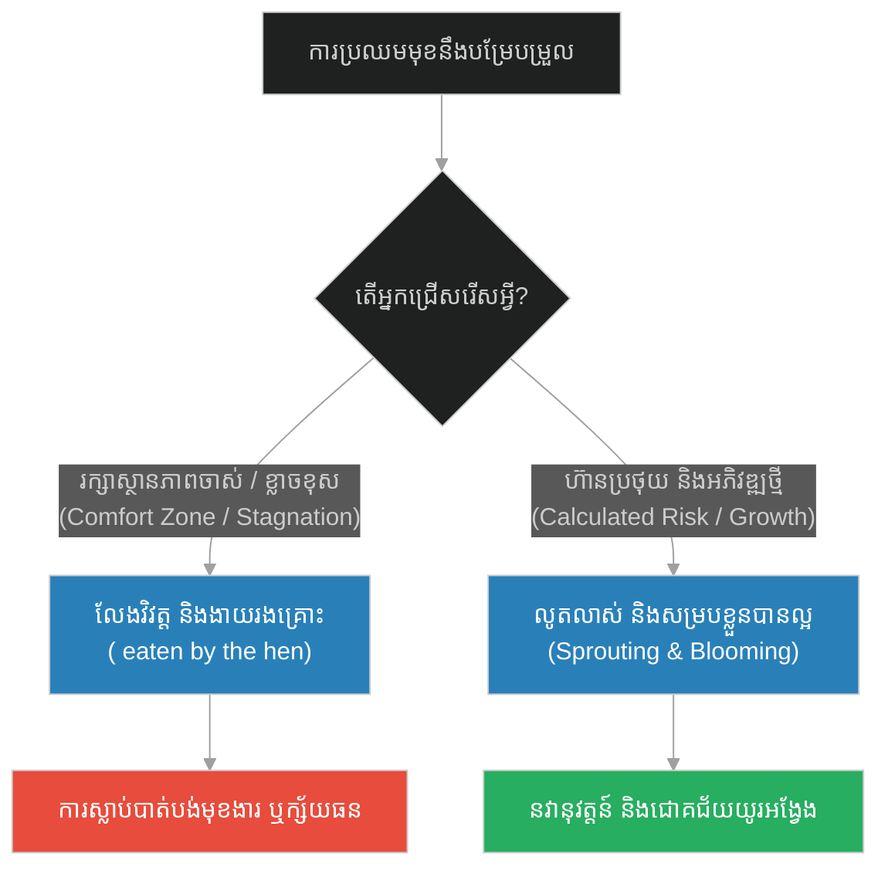
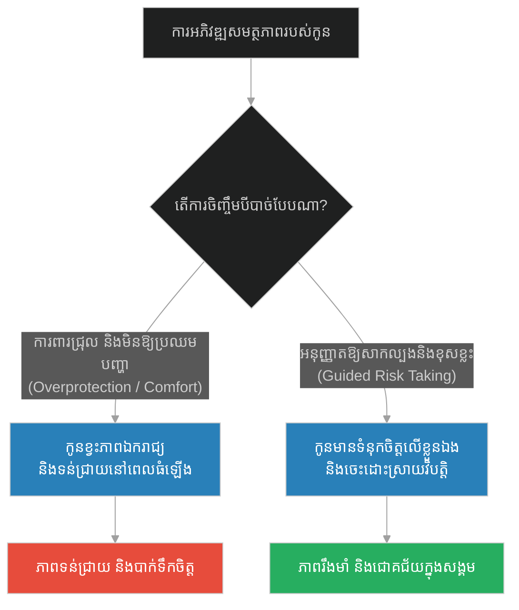
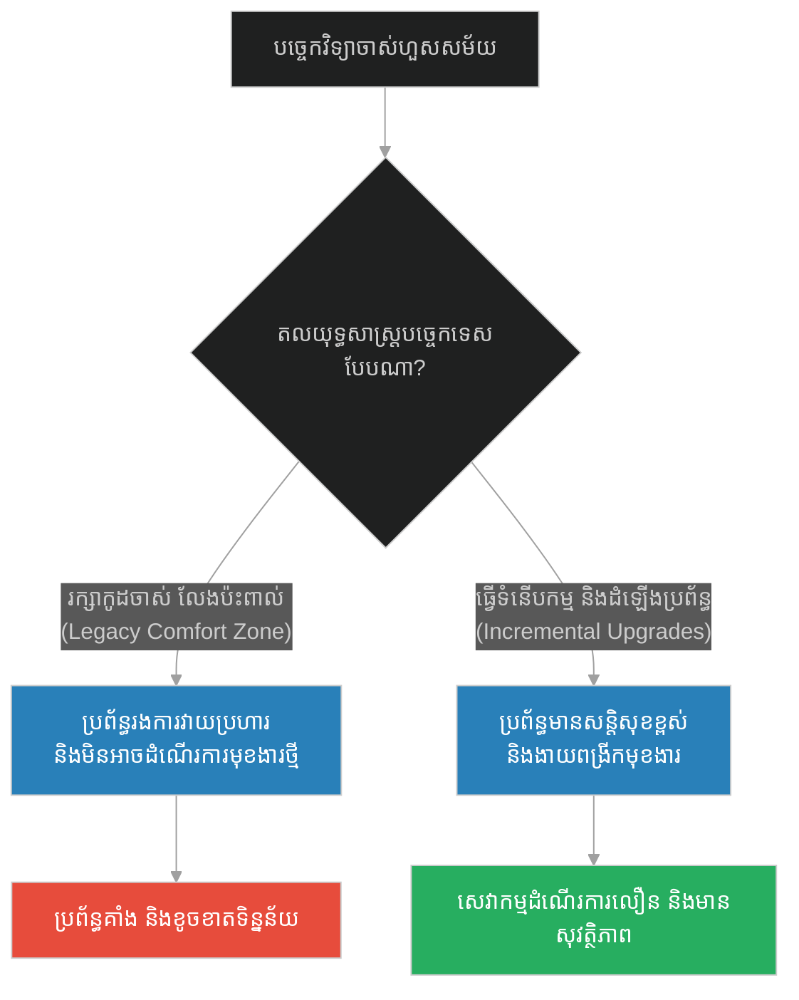
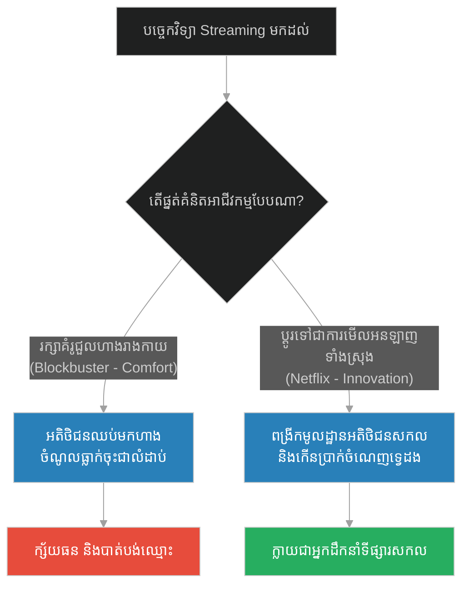
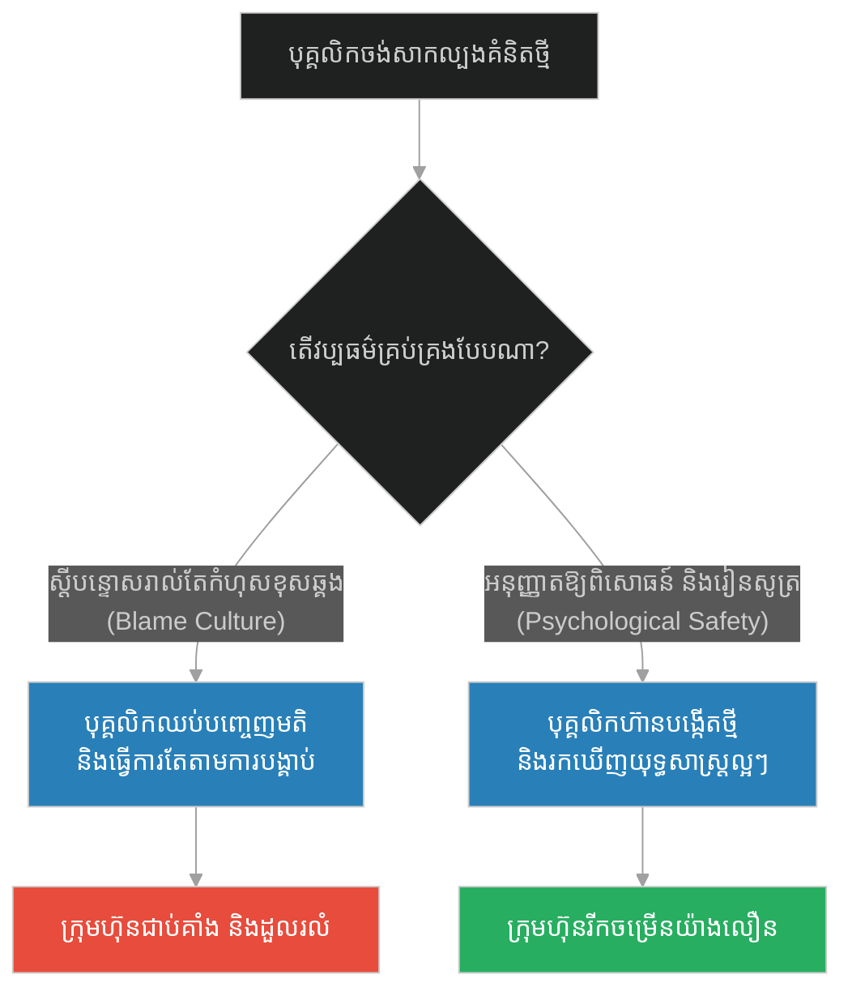
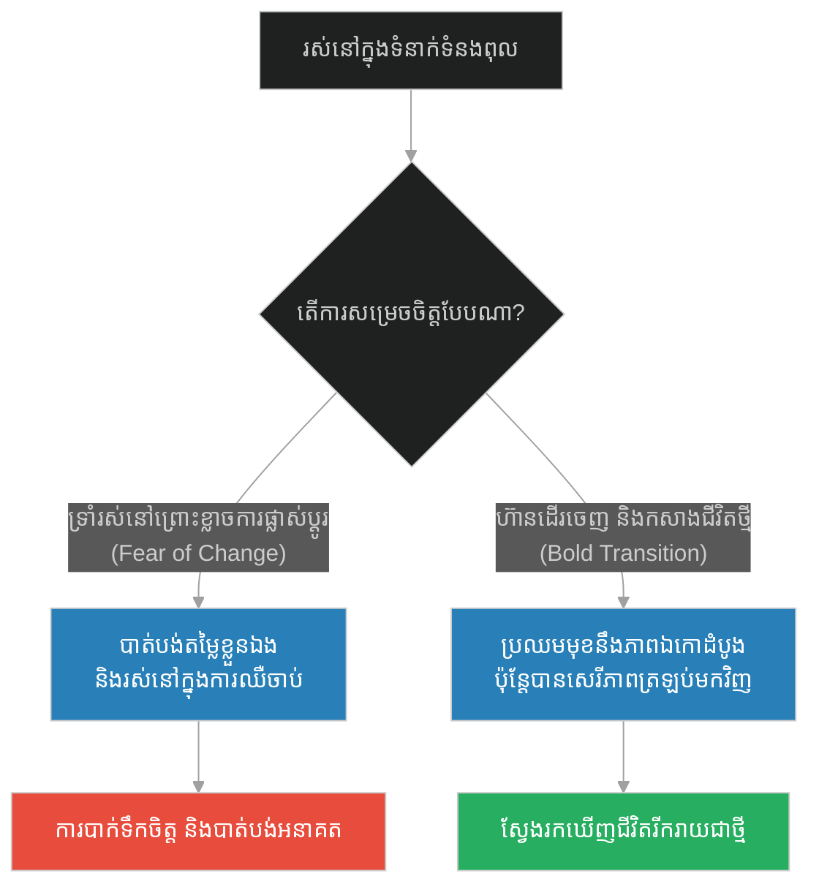
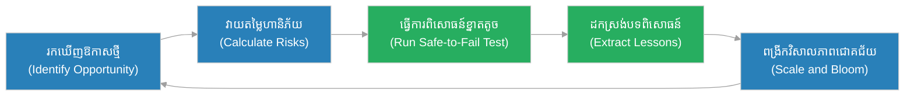

# Risk Taking & Innovation vs Comfort Zone (គ្រាប់ពូជទាំងពីរ)៖ ការទទួលហានិភ័យ និងនវានុវត្តន៍ធៀបនឹងតំបន់សុខស្រួល (Risk Taking & Innovation vs Comfort Zone & The Two Seeds)

**Author:** ichamrong  
**Date:** 2026-05-28  
**Tags:** #buddhism #risk-taking #innovation #comfort-zone #growth-mindset #resilience #evolutionary-design  
**Category:** Concepts  
**Read Time:** ~15 min  

---

<a id="0"></a>
## 📌 មាតិកា (Table of Contents)
- [អន្ទាក់ផ្លូវចិត្ត (The Trap)](#0)
- [១. រឿងព្រេងនិទាន៖ គ្រាប់ពូជទាំងពីរ (The Legend of the Two Seeds)](#1)
  - [ជម្រើស និងវាសនាខុសគ្នា (The Choice and Destiny)](#1-1)
- [២. បញ្ហា៖ ការជាប់គាំងក្នុងតំបន់សុខស្រួល និងការខ្លាចហានិភ័យ (The Issue: Stagnation in Comfort Zone vs. Risk-Taking)](#2)
- [៣. ឧទាហរណ៍ជាក់ស្តែងក្នុងពិភពពិត (Real World Examples)](#3)
  - [ឧទាហរណ៍ទី ១ — កម្រិតស្រាល (គ្រួសារ)៖ ការចិញ្ចឹមកូនក្នុងក្រឡកែវ និងការឱ្យកូនរៀនពីឧបសគ្គ (The Overprotected Child)](#3-1)
  - [ឧទាហរណ៍ទី ២ — កម្រិតមធ្យម (បច្ចេកទេស)៖ កូដចាស់មិនព្រមដំឡើង Version និងការធ្វើទំនើបកម្មប្រព័ន្ធ (The Legacy Code vs. Continuous Upgrade)](#3-2)
  - [ឧទាហរណ៍ទី ៣ — កម្រិតមធ្យម (ធុរកិច្ច)៖ គំរូអាជីវកម្មបែបបុរាណ និងការធ្វើបរិវត្តកម្មឌីជីថល (The Blockbuster vs. Netflix Model)](#3-3)
  - [ឧទាហរណ៍ទី ៤ — កម្រិតមធ្យម (សង្គម/គ្រប់គ្រង)៖ វប្បធម៌ខ្លាចខុស និងការបង្កើតកន្លែងពិសោធន៍រកគំនិតថ្មី (The Blame Culture vs. Safe-to-Fail)](#3-4)
  - [ឧទាហរណ៍ទី ៥ — កម្រិតធ្ងន់ (ទំនាក់ទំនង)៖ ការស៊ូទ្រាំក្នុងទំនាក់ទំនងពុល និងការសម្រេចចិត្តផ្លាស់ប្តូរជីវិត (The Stagnant Relationship vs. Hard Truths)](#3-5)
- [៤. ដំណោះស្រាយទូទៅ៖ ការចាកចេញពីតំបន់សុខស្រួលដោយឆ្លាតវៃ (The General Solution: Calculated Risk Taking)](#4)
- [សេចក្តីសន្និដ្ឋាន (Conclusion)](#5)
- [ឯកសារយោង (References)](#6)
- [Related Posts](#7)

---

<a id="0"></a>
## អន្ទាក់ផ្លូវចិត្ត (The Trap)

ហេតុអ្វីបានជាមនុស្ស និងក្រុមហ៊ុនជាច្រើនដែលធ្លាប់តែជោគជ័យខ្លាំងពីមុន បែរជាធ្លាក់ខ្លួនចុះខ្សោយ និងបាត់ឈ្មោះពីទីផ្សារជាបន្តបន្ទាប់? នោះគឺដោយសារតែពួកគេបានធ្លាក់ចូលទៅក្នុង **"អន្ទាក់នៃតំបន់សុខស្រួល" (Comfort Zone Trap)**។ នៅក្នុងអន្ទាក់នេះ ការមិនធ្វើអ្វីសោះ និងការរក្សាស្ថានភាពចាស់ឱ្យនៅដដែល ត្រូវបានមើលឃើញថាជា "ជម្រើសដែលមានសុវត្ថិភាពបំផុត"។ ប៉ុន្តែនៅក្នុងពិភពលោកដែលកំពុងតែផ្លាស់ប្តូរឥតឈប់ឈរ ការមិនព្រមប្រឈមមុខនឹងហានិភ័យ និងមិនព្រមអភិវឌ្ឍខ្លួន គឺជាហានិភ័យដ៏ធំបំផុតដែលនាំទៅរកការស្លាប់បាត់បង់ជីវិត។

*   **Side A (The Safe Stagnator):** ការជ្រកកោនក្នុងភាពងងឹតដែលធ្លាប់ស្គាល់ មិនព្រមលូតលាស់ ឬសាកល្បងគំនិតថ្មីៗ ព្រោះខ្លាចជួបការបរាជ័យ និងការឈឺចាប់។
*   **Side B (The Bold Innovator):** ការហ៊ានរុញច្រានខ្លួនឯងចេញទៅប្រឈមមុខនឹងភាពមិនប្រាកដប្រជា ហ៊ានចាក់ឫសជ្រៅទៅក្នុងដី និងពន្លកដុះឆ្លងកាត់ឧបសគ្គដើម្បីទទួលបានសេរីភាព និងផ្លែផ្កា។

នៅក្នុងអត្ថបទនេះ យើងនឹងសិក្សាពីរបៀបបំប្លែងការភ័យខ្លាចឱ្យទៅជាសកម្មភាពបង្កើតថ្មី តាមរយៈរឿងប្រៀបប្រដៅនៃគ្រាប់ពូជទាំងពីរ និងការវិភាគលើប្រព័ន្ធការងារដែលវិវត្តដោយជោគជ័យ។

---

<a id="1"></a>
## ១. រឿងព្រេងនិទាន៖ គ្រាប់ពូជទាំងពីរ (The Legend of the Two Seeds)

កាលពីព្រេងនាយ មានគ្រាប់ពូជផ្កាដ៏ល្អឥតខ្ចោះពីរគ្រាប់ ត្រូវបានគេយកទៅដាំទន្ទឹមគ្នានៅក្នុងដីដ៏មានជីជាតិនាដូវសរទរដូវ។ គ្រាប់ពូជទាំងពីរនេះមានគុណភាព និងសក្តានុពលលូតលាស់ស្មើគ្នា ១០០%។ ពួកវាដេកនៅក្នុងដីងងឹត និងត្រជាក់ជាមួយគ្នា រង់ចាំឱកាសមកដល់។

យប់មួយ គ្រាប់ពូជទាំងពីរបានជជែកគ្នាពីវាសនានៃជីវិត៖

**គ្រាប់ពូជទី ១** បានពោលដោយក្តីសង្ឃឹម និងភាពក្លាហានថា៖ 
*"ខ្ញុំចង់លូតលាស់! ខ្ញុំចង់ចាក់ឫសរបស់ខ្ញុំឱ្យជ្រៅទៅក្នុងដីខាងក្រោម ដើម្បីស្រូបយកជីវជាតិ និងទឹក។ ខ្ញុំចង់រុញច្រានពន្លកតូចរបស់ខ្ញុំឱ្យទម្លុះស្រទាប់ដីដ៏រឹងមាំខាងលើ ដើម្បីបានឃើញពន្លឺព្រះអាទិត្យដ៏កក់ក្តៅ និងទទួលបានដំណក់ទឹកសន្សើមនៅលើស្លឹករបស់ខ្ញុំ។ ទោះបីជាដីខាងលើរឹង ហើយខ្យល់ខាងក្រៅត្រជាក់ខ្លាំងកម្រិតណាក៏ដោយ ក៏ខ្ញុំត្រូវតែប្រថុយដើម្បីបានឃើញពិភពលោក និងរីកផ្កាដ៏ស្រស់ស្អាត។"*

ដោយក្តីប្តេជ្ញាចិត្ត គ្រាប់ពូជទី ១ ក៏ចាប់ផ្តើមខំប្រឹងប្រែងចាក់ឫសចុះក្រោម និងពន្លកដុះឡើងលើភ្លាមៗ។ វាត្រូវជួបនឹងភាពងងឹត ថ្មរឹង និងការឈឺចាប់ក្នុងការរុញច្រានខ្លួន ប៉ុន្តែទីបំផុតវាក៏បានទម្លុះដីចេញមកក្រៅដោយជោគជ័យ។

<a id="1-1"></a>
### ជម្រើស និងវាសនាខុសគ្នា (The Choice and Destiny)

ផ្ទុយទៅវិញ **គ្រាប់ពូជទី ២** បានពោលដោយក្តីភ័យខ្លាចថា៖
*"ខ្ញុំខ្លាចណាស់! ប្រសិនបើខ្ញុំចាក់ឫសចុះក្រោម ខ្ញុំមិនដឹងថាត្រូវជួបនឹងសត្វល្អិត ឬថ្មមុតស្រួចនៅក្នុងភាពងងឹតនោះឡើយ។ ប្រសិនបើខ្ញុំខំប្រឹងរុញពន្លកឡើងលើ វាអាចនឹងដាច់ ឬខូចខាតដោយសារដីរឹង។ ហើយប្រសិនបើខ្ញុំបើកទុំផ្កាដ៏ទន់ភ្លន់របស់ខ្ញុំ សត្វខ្យង ឬក្មេងៗប្រហែលជាមកបេះ ឬស៊ីខ្ញុំជាមិនខាន។ ទេ! វាមានសុវត្ថិភាពជាងសម្រាប់ខ្ញុំក្នុងការដេកនៅក្នុងដីងងឹតនេះ រង់ចាំរហូតដល់ស្ថានភាពខាងក្រៅមានសុវត្ថិភាពល្អឥតខ្ចោះ។"*

ដូច្នេះ គ្រាប់ពូជទី ២ បានសម្រេចចិត្តរក្សាខ្លួននៅក្នុង "តំបន់សុខស្រួល" របស់វា ដេកមិនធ្វើអ្វីសោះនៅក្នុងដីងងឹត។

ប៉ុន្មានថ្ងៃក្រោយមក នាដើមនិទាឃរដូវ មានមេមាន់មួយក្បាលបានដើររកចំណីនៅក្នុងសួនច្បារនោះ។ វាបានកោសកាយកកាយដីដើម្បីរកសត្វល្អិត និងគ្រាប់ធញ្ញជាតិ។ មេមាន់ក៏បានឃើញគ្រាប់ពូជទី ២ ដែលកំពុងដេកស្ងៀមមិនព្រមដុះនោះ រួចក៏ចឹកលេបវាចូលទៅក្នុងពោះធ្វើជាអាហារបាត់ទៅ។

ចំណែកឯគ្រាប់ពូជទី ១ ដែលបានហ៊ានប្រឈមមុខនឹងហានិភ័យ បានលូតលាស់ក្លាយជាដើមផ្កាដ៏ធំ មានស្លឹកខៀវស្រងាត់ និងផ្កាត្រសុំត្រសាយកណ្តាលពន្លឺថ្ងៃ ផ្តល់ជាជម្រកដល់សត្វឃ្មុំ និងមេអំបៅទាំងឡាយ។

---

<a id="2"></a>
## ២. បញ្ហា៖ ការជាប់គាំងក្នុងតំបន់សុខស្រួល និងការខ្លាចហានិភ័យ (The Issue: Stagnation in Comfort Zone vs. Risk-Taking)

នៅក្នុងការអភិវឌ្ឍអាជីវកម្ម និងវិស្វកម្មសូហ្វវែរ ការជ្រើសរើសមិនធ្វើអ្វីសោះព្រោះខ្លាចជួបហានិភ័យ (Fear of Failure) គឺជាគ្រោះថ្នាក់ដ៏ធំ។ ប្រព័ន្ធព័ត៌មានវិទ្យាដែលមិនព្រមដំឡើងកំណែថ្មី (Versions) ឬមិនព្រមកែប្រែស្ថាបត្យកម្មចាស់ (Legacy Systems) ព្រោះខ្លាចមានប្រព័ន្ធគាំង នឹងក្លាយជាប្រព័ន្ធដែលមានចន្លោះប្រហោងសន្តិសុខ (Security Vulnerabilities) និងមិនអាចដើរទាន់តម្រូវការអាជីវកម្មបានឡើយ។

រាល់ការផ្លាស់ប្តូរ ឬការបង្កើតថ្មី (Innovation) សុទ្ធតែនាំមកនូវហានិភ័យ ប៉ុន្តែវាជាហានិភ័យដែលអាចគណនាបាន (Calculated Risks)។ 



### ការប្រៀបធៀបតាមរយៈកូដ (Code Comparison)

ខាងក្រោមនេះជាការប្រៀបធៀបរវាងការរចនាប្រព័ន្ធដែលរឹងកំព្រឹង និងខ្លាចការប្រែប្រួល (Rigid Comfort Zone) ធៀបនឹងប្រព័ន្ធដែលបត់បែន និងមានសមត្ថភាពវិវត្តដោយសុវត្ថិភាព (Evolutionary/Version Tolerant)៖

#### វិធីសាស្ត្រអាក្រក់៖ កូដដែលរឹងរូសខ្លាចការផ្លាស់ប្តូរ (Rigid Legacy Code Client)
ប្រព័ន្ធនេះនឹងគាំង (Crash) ភ្លាមៗ ប្រសិនបើប្រភពទិន្នន័យខាងក្រៅ (External API) ផ្លាស់ប្តូរទម្រង់បន្តិចបន្តួច ព្រោះវាត្រូវបានសរសេរឡើងដោយសន្មតថាអ្វីៗនឹងមិនផ្លាស់ប្តូរឡើយ។

```python
# Bad Design: Rigid Client crashing on any new/changed API fields
class LegacyAPIClient:
    def __init__(self):
        # រំពឹងតែលើ Format ចាស់តែមួយគត់
        self.expected_keys = ["id", "username", "email"]

    def parse_user(self, response_data: dict):
        # ប្រសិនបើដៃគូសហការផ្លាស់ប្តូរ API ឬបន្ថែម Field ថ្មី វានឹង Crash ភ្លាម
        if list(response_data.keys()) != self.expected_keys:
            raise ValueError("Database Schema changed! Hard crashing the app!")
        
        return f"User: {response_data['username']}"
```

#### វិធីសាស្ត្រល្អ៖ កូដដែលរចនាឡើងដើម្បីវិវត្ត (Version-Tolerant / Evolutionary Client)
ប្រព័ន្ធនេះត្រូវបានរចនាឡើងដោយមានភាពអត់ឱនចំពោះការប្រែប្រួល (Tolerance to Change)។ វាទទួលយក Field ថ្មីៗដោយស្វ័យប្រវត្តិ និងប្រើប្រាស់តម្លៃលំនាំដើម (Default Values) ប្រសិនបើខ្វះខាតទិន្នន័យចាស់។

```python
# Good Design: Extensible and evolutionary API parser (Calculated Risk Management)
class EvolutionaryAPIClient:
    def __init__(self):
        # កំណត់តែ Field ស្នូលដែលចាំបាច់បំផុត
        self.required_keys = {"id", "username"}

    def parse_user(self, response_data: dict) -> dict:
        # ត្រួតពិនិត្យភាពត្រឹមត្រូវនៃ Field ស្នូល
        if not self.required_keys.issubset(response_data.keys()):
            print("Warning: Missing required fields. Using default schema...")
            return {"id": -1, "username": "guest"}

        # អនុញ្ញាតឱ្យមាន Field ថ្មីៗ (Innovation) ដោយមិនធ្វើឱ្យប្រព័ន្ធគាំង
        user_info = {
            "id": response_data["id"],
            "username": response_data["username"],
            "email": response_data.get("email", "no-email@domain.com"),  # ប្រើប្រាស់ Default value
        }

        # កត់ត្រារាល់ទិន្នន័យថ្មីៗដែលបន្ថែមមកសម្រាប់អភិវឌ្ឍក្រោយ
        new_features = set(response_data.keys()) - {"id", "username", "email"}
        if new_features:
            print(f"New dynamic API fields detected (opportunities): {new_features}")

        return user_info
```

---

<a id="3"></a>
## ៣. ឧទាហរណ៍ជាក់ស្តែងក្នុងពិភពពិត

<a id="3-1"></a>
### ឧទាហរណ៍ទី ១ — កម្រិតស្រាល (គ្រួសារ)៖ ការចិញ្ចឹមកូនក្នុងក្រឡកែវ និងការឱ្យកូនរៀនពីឧបសគ្គ (The Overprotected Child)

មាតាបិតាខ្លះមានការភ័យខ្លាចជ្រុលហួសហេតុខ្លាចកូនជួបគ្រោះថ្នាក់ ឬខូចចិត្ត។ ពួកគេចិញ្ចឹមកូននៅក្នុងបរិយាកាសត្រួតពិនិត្យដាច់ខាត (Comfort Zone) ដោយមិនឱ្យកូនធ្វើការងារផ្ទះ មិនឱ្យលេងកីឡាដែលមានហានិភ័យ ឬមិនឱ្យសាកល្បងធ្វើអ្វីមួយដោយខ្លួនឯងឡើយ។ លទ្ធផលគឺ នៅពេលកូនដកខ្លួនចេញពីគ្រួសារទៅរស់នៅក្នុងសង្គមពិត ពួកគេគ្មានសមត្ថភាពដោះស្រាយបញ្ហា គ្មានភាពធន់ខាងផ្លូវចិត្ត និងងាយរងការបោកប្រាស់ (ដូចជាគ្រាប់ពូជទី ២ ដែលត្រូវមាន់ចឹកស៊ី)។



---

<a id="3-2"></a>
### ឧទាហរណ៍ទី ២ — កម្រិតមធ្យម (បច្ចេកទេស)៖ កូដចាស់មិនព្រមដំឡើង Version និងការធ្វើទំនើបកម្មប្រព័ន្ធ (The Legacy Code vs. Continuous Upgrade)

នៅក្នុងក្រុមហ៊ុនបច្ចេកវិទ្យាមួយ ពួកគេប្រើប្រាស់កម្មវិធីជំនាន់ចាស់ (PHP 5.6 ឬ Python 2.7) សម្រាប់ប្រព័ន្ធស្នូល។ ក្រុមការងារបច្ចេកទេសខ្លាចមិនហ៊ានដំឡើងទៅជំនាន់ថ្មីឡើយ ព្រោះខ្លាចប្រព័ន្ធគាំង និងខ្លាចត្រូវសរសេរកូដឡើងវិញ (Comfort Zone)។ យូរៗទៅ ភាសាចាស់លែងមានការគាំទ្រសន្តិសុខ (Unsupported) ហើយប្រព័ន្ធក៏រងការវាយប្រហារពី Hacker និងលែងមានបុគ្គលិកថ្មីចង់មកធ្វើការជាមួយ ព្រោះបច្ចេកវិទ្យាហួសសម័យ។ ការហ៊ានដំឡើង និងកែលម្អប្រព័ន្ធជាប្រចាំ ទោះបីជាមានការលំបាកខ្លះដំបូង ក៏ជាវិធីសាស្ត្រតែមួយគត់ដើម្បីរស់។



---

<a id="3-3"></a>
### ឧទាហរណ៍ទី ៣ — កម្រិតមធ្យម (ធុរកិច្ច)៖ គំរូអាជីវកម្មបែបបុរាណ និងការធ្វើបរិវត្តកម្មឌីជីថល (The Blockbuster vs. Netflix Model)

ក្រុមហ៊ុន Blockbuster ធ្លាប់ជាមហាសេដ្ឋីលក់ និងជួលវីដេអូកាសែតដ៏ធំបំផុតនៅលើលោក ដែលមានសាខារាប់ពាន់កន្លែង។ នៅពេលបច្ចេកវិទ្យា Streaming (មើលវីដេអូតាមអ៊ីនធឺណិត) ចាប់ផ្តើមលេចរូបរាងឡើង ពួកគេមិនព្រមផ្លាស់ប្តូរទេ ព្រោះពួកគេកំពុងតែរកចំណូលបានយ៉ាងច្រើនពីការជួលកាសែតរូបរាងកាយ (Comfort Zone)។ ចំណែកឯ Netflix ដែលកាលនោះគ្រាន់តែជាក្រុមហ៊ុនតូចមួយ បានសម្រេចចិត្តប្រថុយវិនិយោគទាំងស្រុងលើបច្ចេកវិទ្យា Streaming ទោះបីជាត្រូវខាតបង់ចំណូលចាស់ក៏ដោយ។ លទ្ធផលគឺ Blockbuster បានក្ស័យធនទាំងស្រុង ចំណែក Netflix ក្លាយជាស្តេចកម្សាន្តពិភពលោក។



---

<a id="3-4"></a>
### ឧទាហរណ៍ទី ៤ — កម្រិតមធ្យម (សង្គម/គ្រប់គ្រង)៖ វប្បធម៌ខ្លាចខុស និងការបង្កើតកន្លែងពិសោធន៍រកគំនិតថ្មី (The Blame Culture vs. Safe-to-Fail)

នៅក្នុងអង្គភាពខ្លះ ប្រសិនបើបុគ្គលិកធ្វើការងារមានកំហុសបន្តិចបន្តួច ពួកគេនឹងត្រូវស្តីបន្ទោស កាត់ប្រាក់ខែ ឬបណ្តេញចេញភ្លាមៗ (Blame Culture)។ វប្បធម៌នេះបង្ខំឱ្យបុគ្គលិកដេកនៅក្នុងតំបន់សុខស្រួល ដោយធ្វើការងារតែតាមបញ្ជា និងមិនហ៊ានបញ្ចេញមតិយោបល់ ឬសាកល្បងគម្រោងថ្មីៗឡើយ។ ផ្ទុយទៅវិញ ក្រុមហ៊ុនបច្ចេកវិទ្យាធំៗដូចជា Google បង្កើតវប្បធម៌ **Psychological Safety** ដែលអនុញ្ញាតឱ្យបុគ្គលិកធ្វើការពិសោធន៍គំនិតថ្មីៗ ហើយប្រសិនបើបរាជ័យ ពួកគេរួមគ្នាដកស្រង់មេរៀន (Blameless Post-Mortem) ដែលជួយឱ្យកើតមានគំនិតច្នៃប្រឌិតខ្ពស់។



---

<a id="3-5"></a>
### ឧទាហរណ៍ទី ៥ — កម្រិតធ្ងន់ (ទំនាក់ទំនង)៖ ការស៊ូទ្រាំក្នុងទំនាក់ទំនងពុល និងការសម្រេចចិត្តផ្លាស់ប្តូរជីវិត (The Stagnant Relationship vs. Hard Truths)

មនុស្សជាច្រើនជ្រើសរើសស៊ូទ្រាំនៅក្នុងទំនាក់ទំនងដែលពោរពេញដោយការឈឺចាប់ ជេរប្រមាថ និងការមិនឱ្យតម្លៃគ្នា (Toxic Relationship) គ្រាន់តែដោយសារតែពួកគេខ្លាចភាពឯកោ ខ្លាចការផ្លាស់ប្តូរ និងខ្លាចការចាប់ផ្តើមជីវិតជាថ្មី (Comfort of Familiar Pain)។ ពួកគេសុខចិត្តធ្វើជាគ្រាប់ពូជទី ២ ដែលដេកនៅក្នុងដី រង់ចាំពេលវេលាមកបំផ្លាញ។ ផ្ទុយទៅវិញ ការហ៊ានទទួលយកការពិត ហ៊ានដើរចេញ និងប្រឈមមុខនឹងភាពឯកោដំបូង ទើបជាឱកាសដើម្បីឱ្យពួកគេអាចរីកលូតលាស់ និងស្វែងរកសុភមង្គលពិតប្រាកដ។



---

<a id="4"></a>
## ៤. ដំណោះស្រាយទូទៅ៖ ការចាកចេញពីតំបន់សុខស្រួលដោយឆ្លាតវៃ (The General Solution: Calculated Risk Taking)

ដើម្បីផ្លាស់ប្តូរខ្លួនយើង និងប្រព័ន្ធការងារឱ្យក្លាយជាភ្នាក់ងារហ៊ានបង្កើតថ្មី និងលូតលាស់ យើងត្រូវអនុវត្តវិធីសាស្ត្រខាងក្រោម៖

1.  **Embrace the "Safe-to-Fail" Experimentation (ការពិសោធន៍ខ្នាតតូច):** កុំប្រថុយជីវិតទាំងស្រុងតែម្តង។ ចូរធ្វើការពិសោធន៍តូចៗដែលទោះបីជាបរាជ័យ ក៏មិនធ្វើឱ្យប្រព័ន្ធទាំងមូលដួលរលំដែរ (ដូចជា ការដាំគ្រាប់ពូជសាកល្បង ឬការធ្វើ A/B Testing)។
2.  **Continuous Learning (ការរៀនសូត្រជាប្រចាំ):** រុញច្រានខ្លួនឯងឱ្យរៀនជំនាញថ្មីៗរាល់សប្តាហ៍។ កុំឱ្យខ្លួនឯងដេកលក់ក្នុងចំណេះដឹងចាស់។
3.  **Upgrade Systematically (ការធ្វើទំនើបកម្មជាប្រព័ន្ធ):** កំណត់កាលវិភាគច្បាស់លាស់សម្រាប់វាយតម្លៃ និងកែលម្អគំរូអាជីវកម្ម និងស្ថាបត្យកម្មបច្ចេកវិទ្យា ដើម្បីធានាភាពធន់។



* 🚀 **[ចាប់ផ្តើមដំណើររុករក (Start the Journey) ➔ Letting Go & Non-Attachment to Tools (អ្នកចម្លងទូក)](./165-buddha-and-the-ferryman.md)**

---

<a id="5"></a>
## សេចក្តីសន្និដ្ឋាន (Conclusion)

> **«ជីវិត មិនមែនកើតឡើងនៅក្នុងកន្លែងមានសុវត្ថិភាពនោះទេ គឺវាកើតឡើងនៅលើការហ៊ានប្រឈមមុខនឹងភាពមិនច្បាស់លាស់ ដើម្បីលូតលាស់ និងរីកដុះដាល។»**

ការដេកនៅក្នុងដីងងឹត ប្រហែលជាផ្តល់ឱ្យយើងនូវអារម្មណ៍សុវត្ថិភាពមួយរយៈខ្លី ប៉ុន្តែវានឹងនាំមកនូវការបាត់បង់ជីវិតដោយមិនដឹងខ្លួននៅពេលក្រោយ។ គ្មានការលូតលាស់ណាដែលគ្មានការប្រឈមមុខនឹងឧបសគ្គនោះទេ។ ចូររៀនធ្វើជាគ្រាប់ពូជទី ១ ដែលហ៊ានចាក់ឫសជ្រៅ ហ៊ានរុញច្រានពន្លកទម្លុះដីដ៏លំបាក ដើម្បីទទួលបានពន្លឺថ្ងៃ និងសេរីភាពដ៏ពិតប្រាកដក្នុងការរីកផ្កាក្រអូបពេញពិភពលោក។

---

<a id="6"></a>
## ឯកសារយោង (References)

*   **Samyutta Nikaya & Anguttara Nikaya** — Various teachings of the Buddha regarding the nature of exertion (Viriya), spiritual courage, and the necessity of stepping out of sensory infatuation (the comfort zone of attachment).
*   **The Lean Startup: How Today's Entrepreneurs Use Continuous Innovation to Create Radically Successful Businesses** — Eric Ries (2011). Explores the concept of MVP (Minimum Viable Product) and safe-to-fail experimentation.
*   **Antifragile: Things That Gain from Disorder** — Nassim Nicholas Taleb (2012). Explains why systems need stress and risk to survive and grow.

---

<a id="7"></a>
## Related Posts

* [The Blacksmith's Dog (ឆ្កែរបស់អ្នកដំដែក)](./163-buddha-and-the-blacksmiths-dog.md) — ស្វែងយល់អំពីការព្រងើយកន្តើយ និងការស៊ាំនឹងបញ្ហាជុំវិញខ្លួន។
* [The Ferryman (អ្នកចម្លងទូក)](./165-buddha-and-the-ferryman.md) — ស្វែងយល់អំពីការដោះលែង និងការមិនជាប់ជំពាក់នឹងឧបករណ៍ចាស់ៗ។
