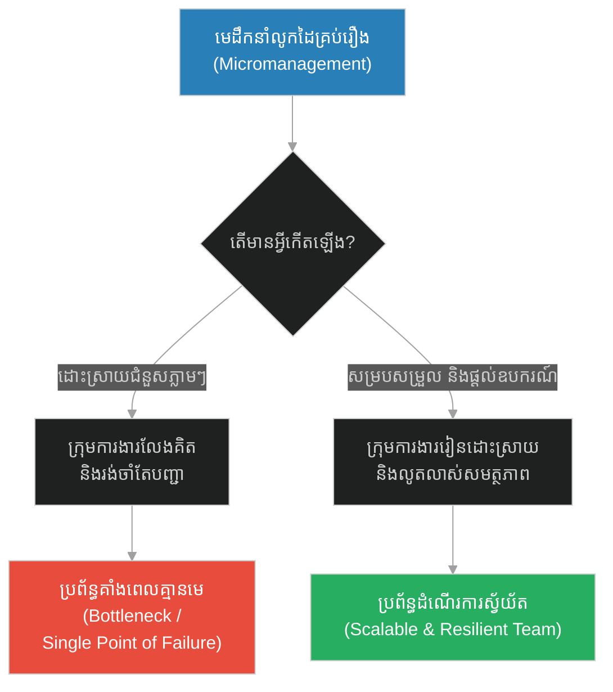
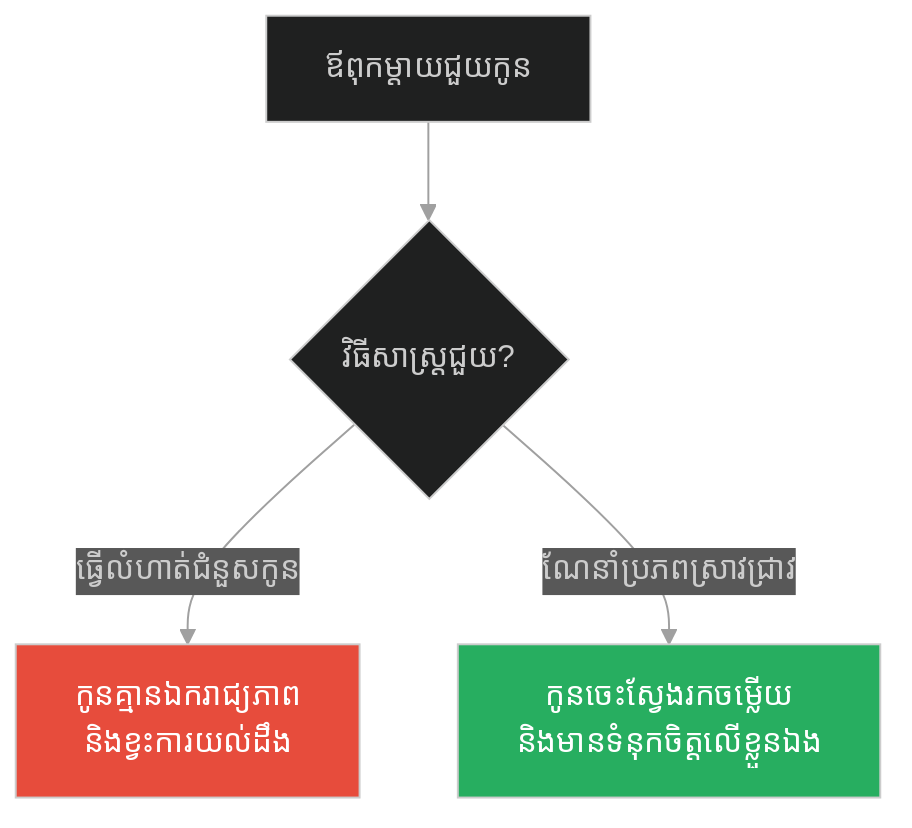
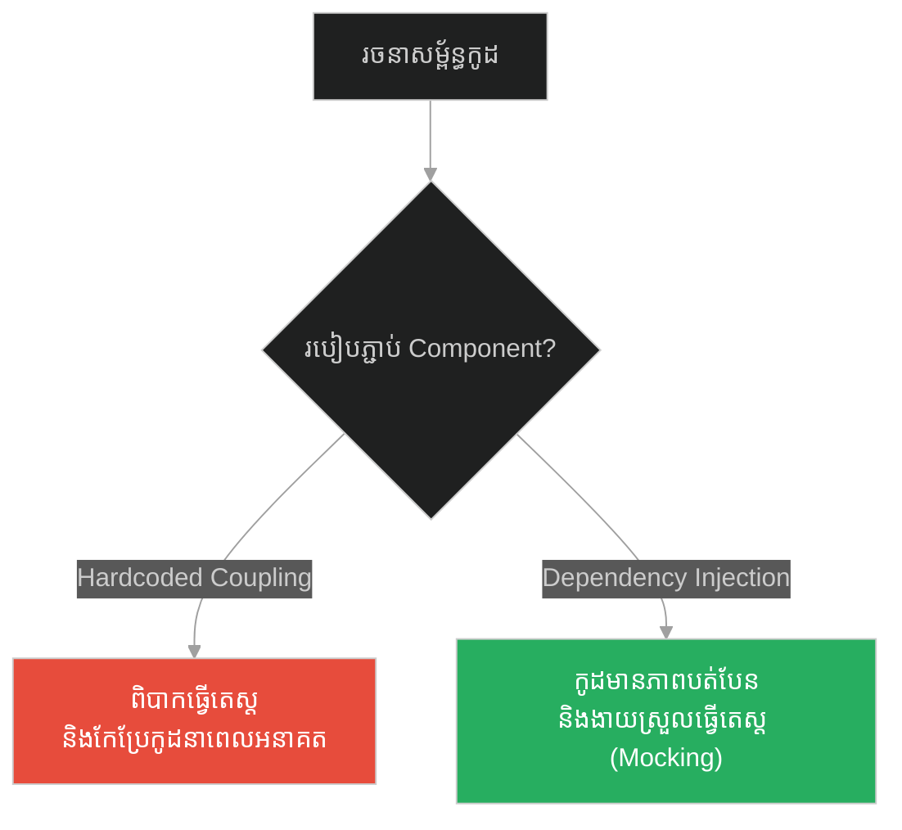
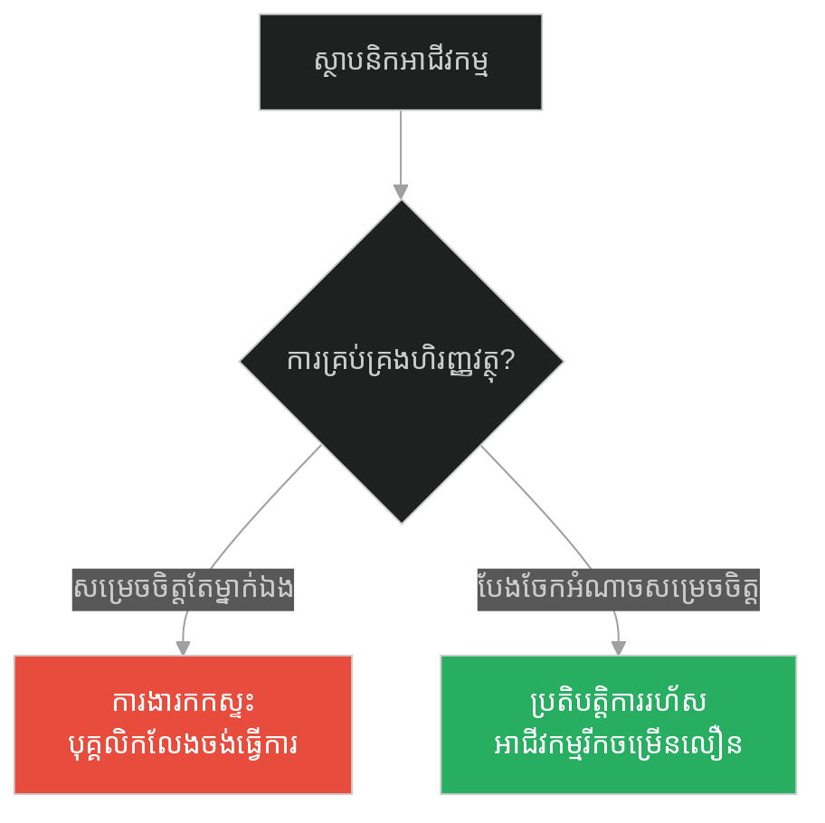
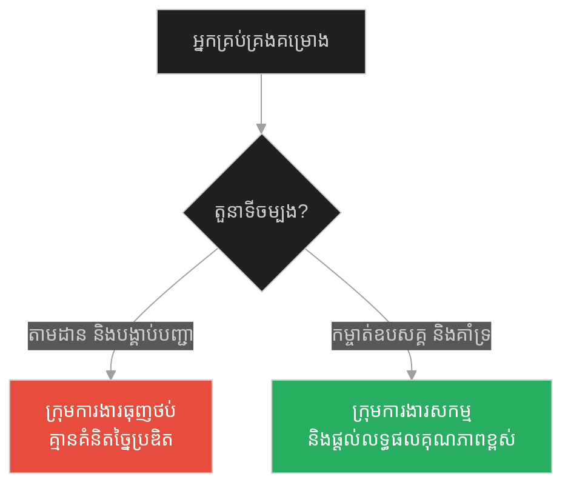
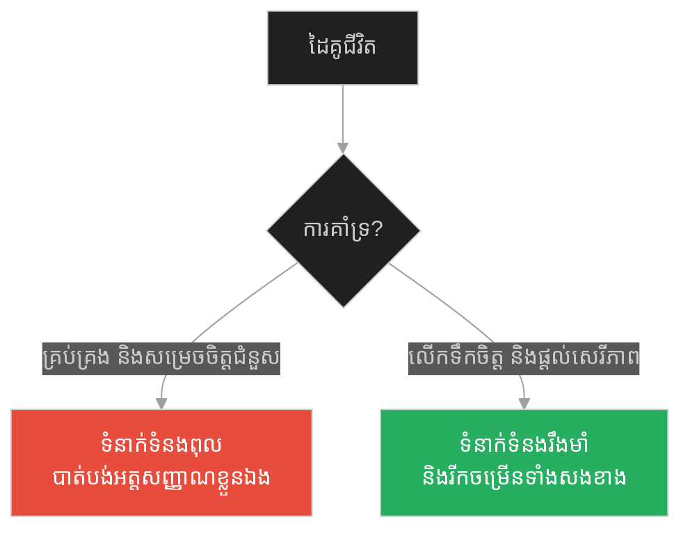
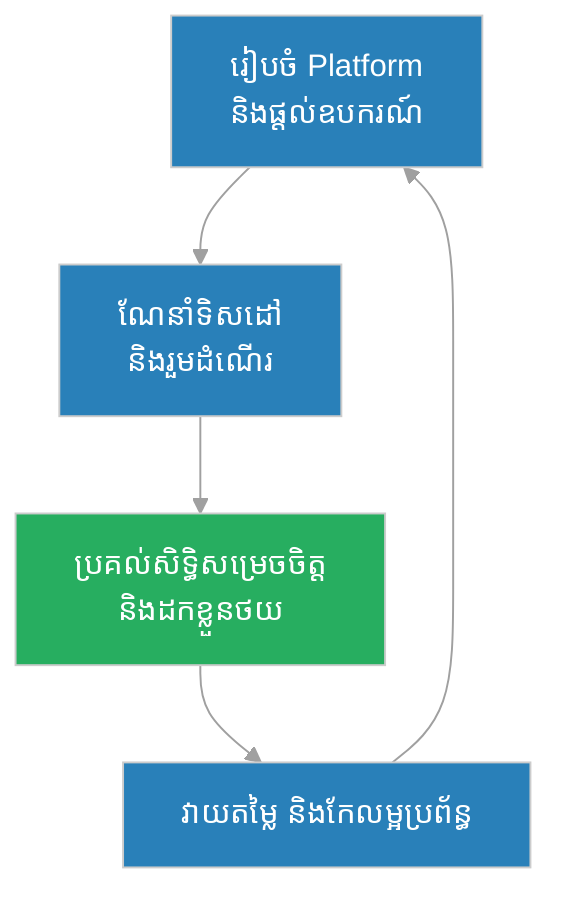

# Facilitation & Servant Leadership (អ្នកចម្លងទូក)៖ ការសម្របសម្រួល និងភាពជាអ្នកដឹកនាំបម្រើ (Facilitation & Servant Leadership & The Ferryman)

**Author:** ichamrong  
**Date:** 2026-05-28  
**Tags:** #servant-leadership #facilitation #management #clean-architecture #dependency-injection #software-design  
**Category:** Concepts  
**Read Time:** ~15 min  

---

## 📌 មាតិកា (Table of Contents)
- [អន្ទាក់ផ្លូវចិត្ត (The Trap)](#0)
- [១. រឿងព្រេងនិទាន៖ អ្នកចម្លងទូក និងអ្នកដំណើរ (The Legend of the Ferryman)](#1)
  - [សេចក្តីស្ងប់ស្ងាត់ និងសេវាកម្មដ៏បរិសុទ្ធ (Quiet Guidance and Pure Service)](#1-1)
- [២. បញ្ហា៖ ការដឹកនាំបែបត្រួតត្រា និងការពឹងផ្អែក (The Issue: Command-and-Control vs. Dependency)](#2)
- [៣. ឧទាហរណ៍ជាក់ស្តែងក្នុងពិភពពិត (Real World Examples)](#3)
  - [ឧទាហរណ៍ទី ១ — កម្រិតស្រាល (គ្រួសារ)៖ មាតាបិតាសម្របសម្រួល (The Facilitating Parents)](#3-1)
  - [ឧទាហរណ៍ទី ២ — កម្រិតមធ្យម (បច្ចេកទេស)៖ ស្ថាបត្យកម្មកូដសម្របសម្រួល (The Decoupled System Architecture)](#3-2)
  - [ឧទាហរណ៍ទី ៣ — កម្រិតមធ្យម (ធុរកិច្ច)៖ ស្ថាបនិកដែលបង្កើតប្រព័ន្ធស្វយ័ត (The Autonomous Business Enabler)](#3-3)
  - [ឧទាហរណ៍ទី ៤ — កម្រិតមធ្យម (សង្គម/គ្រប់គ្រង)៖ ភាពជាអ្នកដឹកនាំបម្រើក្នុងក្រុម (The Servant Leader in Agile Scrum)](#3-4)
  - [ឧទាហរណ៍ទី ៥ — កម្រិតធ្ងន់ (ទំនាក់ទំនង)៖ ដៃគូដែលជួយបង្កើនឯករាជ្យភាព (The Empowering Relationship Partner)](#3-5)
- [៤. ដំណោះស្រាយទូទៅ៖ គោលការណ៍នៃអ្នកចម្លងទូក (The General Solution: The Ferryman Principle)](#4)
- [សេចក្តីសន្និដ្ឋាន (Conclusion)](#5)
- [ឯកសារយោង (References)](#6)
- [Related Posts](#7)

---

<a id="0"></a>
## អន្ទាក់ផ្លូវចិត្ត (The Trap)

តើអ្នកធ្លាប់ធ្លាក់ក្នុងអន្ទាក់នៃការគិតថា «ដើម្បីឱ្យការងារទៅមុខបានលឿន មានតែខ្ញុំម្នាក់គត់ដែលត្រូវធ្វើវា ឬសម្រេចចិត្តលើគ្រប់ជំហាន» ដែរឬទេ? នេះគឺជាអន្ទាក់នៃភាពជាអ្នកដឹកនាំបែបត្រួតត្រា និងការធ្វើការងារជំនួសអ្នកដទៃ (Command-and-Control & Rescue Trap)។

* **Side A (The Trap):** ការដឹកនាំដោយការបង្គាប់បញ្ជា ឬការលូកដៃធ្វើការងារជំនួសសមាជិកក្រុមគ្រប់ជំហាន ដើម្បីធានាលទ្ធផលភ្លាមៗ ប៉ុន្តែវាបង្កើតឱ្យមានការពឹងផ្អែកទាំងស្រុង និងសម្លាប់ការលូតលាស់របស់ក្រុម។
* **Side B (Resilient Pattern):** ការធ្វើជាអ្នកសម្របសម្រួល និងអ្នកដឹកនាំបម្រើ (Servant Leader & Facilitator) ដែលបង្កើតបរិយាកាស និងឧបករណ៍ ដើម្បីជួយឱ្យក្រុមអាចដោះស្រាយបញ្ហា និងឆ្លងកាត់ឧបសគ្គដោយខ្លួនឯង។

នៅក្នុងអត្ថបទនេះ យើងនឹងសិក្សាអំពី៖
1. **រឿងព្រេងនិទាន (The Legend)** — ទស្សនៈរបស់អ្នកចម្លងទូកដែលជួយមនុស្សឆ្លងទន្លេ ប៉ុន្តែមិនដើរជំនួសពួកគេ។
2. **បញ្ហា (The Issue)** — ការវិភាគលើភាពខុសគ្នារវាងការជួយជ្រោមជ្រែង និងការបង្កការពឹងផ្អែក។
3. **ការអនុវត្តជាក់ស្តែង (Real World Examples)** — ឧទាហរណ៍ទាំង ៥ កម្រិត ចាប់ពីកម្រិតគ្រួសារ រហូតដល់ការរៀបចំស្ថាបត្យកម្មកូដ (Dependency Injection)។
4. **ដំណោះស្រាយទូទៅ (The General Solution)** — វិធីសាស្ត្រក្នុងការកសាងប្រព័ន្ធសម្របសម្រួលដែលមាននិរន្តរភាព។

---

<a id="1"></a>
## ១. រឿងព្រេងនិទាន៖ អ្នកចម្លងទូក និងអ្នកដំណើរ (The Legend of the Ferryman)

នៅតាមបណ្តោយដងទន្លេគង្គាដ៏ធំល្វឹងល្វើយ មានអ្នកចម្លងទូកចំណាស់ម្នាក់ឈ្មោះថា សារថី (Sarathi)។ គាត់បានចំណាយពេលពេញមួយជីវិតរបស់គាត់ក្នុងការចម្លងមនុស្សពីត្រើយម្ខាងដែលពោរពេញទៅដោយភាពវឹកវរ ទៅកាន់ត្រើយម្ខាងទៀតដែលជាដីមានសុវត្ថិភាព និងសន្តិភាព។

រៀងរាល់ថ្ងៃ អ្នកដំណើររាប់រយនាក់ដែលមានគោលដៅខុសៗគ្នា បានមកពឹងពាក់ទូករបស់គាត់។ អ្នកខ្លះជាអ្នកជំនួញចង់ទៅជួញដូរ អ្នកខ្លះជាអ្នកបួសចង់ទៅសមាធិនៅក្នុងព្រៃស្ងប់ស្ងាត់ ចំណែកអ្នកខ្លះទៀតជាអ្នករត់គេចពីសង្គ្រាម។ សារថី មិនដែលសួរនាំពីឋានៈ ឬបង្ខំឱ្យពួកគេដើរតាមផ្លូវរបស់គាត់ឡើយ។ ភារកិច្ចរបស់គាត់គឺសាមញ្ញបំផុត៖ ធានាថាទូករបស់គាត់រឹងមាំ ចង្កូតទូកត្រង់ និងដឹកនាំពួកគេឆ្លងកាត់រលកទឹកដ៏កាចសាហាវដោយសុវត្ថិភាព។

<a id="1-1"></a>
### សេចក្តីស្ងប់ស្ងាត់ និងសេវាកម្មដ៏បរិសុទ្ធ (Quiet Guidance and Pure Service)

ថ្ងៃមួយ មានអ្នកដំណើរម្នាក់ដែលកោតសរសើរនឹងសមត្ថភាពរបស់គាត់ បានសួរថា៖ «លោកតា ហេតុអ្វីបានជាលោកតាមិនរួមដំណើរជាមួយពួកយើងទៅកាន់ទីក្រុង? លោកតាស្គាល់ផ្លូវច្រើន ហើយថែមទាំងអាចក្លាយជាមេដឹកនាំរបស់ពួកយើងបានថែមទៀតផង!»

សារថី បានញញឹមយ៉ាងស្រទន់ រួចតបថា៖ 
> «ភារកិច្ចរបស់ខ្ញុំ គឺជួយអ្នកឆ្លងទន្លេ មិនមែនរួមដំណើរទៅកាន់គោលដៅរបស់អ្នកឡើយ។ បើខ្ញុំដើរទៅជាមួយអ្នក តើអ្នកណាជាអ្នកជួយមនុស្សដែលនៅសេសសល់នៅត្រើយម្ខាងទៀត? ហើយប្រសិនបើគ្មានខ្ញុំទេ តើអ្នកអាចរៀនដើរដោយខ្លួនឯងនៅលើដីគោកដោយរបៀបណា បើអ្នកនៅតែចង់ឱ្យខ្ញុំជួយដម្រង់ទិសរាល់ជំហាននោះ?»

នៅពេលទូកប៉ះច្រាំងនៃត្រើយម្ខាងទៀត អ្នកដំណើរម្នាក់ៗបានចុះពីទូក រួចធ្វើដំណើរទៅតាមផ្លូវរៀងៗខ្លួនដោយឯករាជ្យ។ សារថី ក៏បង្វិលក្បាលទូកត្រឡប់ទៅរកត្រើយម្ខាងវិញ ដើម្បីទទួលអ្នកដំណើរថ្មី។ គាត់មិនដែលរំពឹងចង់ឱ្យគេចងចាំឈ្មោះរបស់គាត់ ឬសុំឱ្យគេដើរតាមគាត់ឡើយ។ គាត់គ្រាន់តែជា «អ្នកសម្របសម្រួល» ដ៏ស្ងប់ស្ងាត់ម្នាក់ប៉ុណ្ណោះ។

---

<a id="2"></a>
## ២. បញ្ហា៖ ការដឹកនាំបែបត្រួតត្រា និងការពឹងផ្អែក (The Issue: Command-and-Control vs. Dependency)

នៅក្នុងប្រព័ន្ធគ្រប់គ្រង និងការរៀបចំប្រព័ន្ធបច្ចេកវិទ្យា ការដឹកនាំបែបត្រួតត្រា (Command-and-Control) តែងតែបង្កើតឱ្យមានបញ្ហាដបដប (Bottleneck)។ នៅពេលដែលអ្នកដឹកនាំ ឬ module ស្នូលដើរតួជាអ្នកសម្រេចចិត្តលើគ្រប់បញ្ហា នោះសមាជិកដទៃទៀត ឬ module រងនឹងលែងអភិវឌ្ឍសមត្ថភាព និងភាពស្វ័យតរបស់ខ្លួន។



---

<a id="3"></a>
## ៣. ឧទាហរណ៍ជាក់ស្តែងក្នុងពិភពពិត

<a id="3-1"></a>
### ឧទាហរណ៍ទី ១ — កម្រិតស្រាល (គ្រួសារ)៖ មាតាបិតាសម្របសម្រួល (The Facilitating Parents)

* **Dilemma:** មាតាបិតាដែលធ្វើកិច្ចការផ្ទះឱ្យកូនរាល់ថ្ងៃ ដើម្បីកុំឱ្យកូនរងសម្ពាធពីសាលា បង្កើតជាក្មេងដែលទន់ជ្រាយ និងគ្មានជំនាញដោះស្រាយបញ្ហា។
* **Good Choice:** ការរៀបចំកន្លែងសិក្សាស្ងប់ស្ងាត់ ផ្តល់សៀវភៅ និងណែនាំវិធីសាស្ត្រស្រាវជ្រាវ (Facilitating) រួចទុកឱ្យពួកគេដោះស្រាយលំហាត់ដោយខ្លួនឯង។



---

<a id="3-2"></a>
### ឧទាហរណ៍ទី ២ — កម្រិតមធ្យម (បច្ចេកទេស)៖ ស្ថាបត្យកម្មកូដសម្របសម្រួល (The Decoupled System Architecture)

នៅក្នុងការសរសេរកូដ ប្រសិនបើ Class មួយបង្កើត និងគ្រប់គ្រង Class ផ្សេងទៀតដោយផ្ទាល់ (Hardcoded Dependency) វាដូចជាអ្នកដឹកនាំដែលលូកដៃគ្រប់រឿង។ ដំណោះស្រាយគឺការប្រើប្រាស់ **Dependency Injection (DI)** ដែលដើរតួជា "អ្នកចម្លងទូក" ផ្តល់តម្រូវការឱ្យ Classes ដំណើរការដោយមិនចាំបាច់ឱ្យពួកវាដឹងពីព័ត៌មានលម្អិតនៃស្ថាបនាឡើយ។

#### Fragile Code (Hardcoded Dependencies):
```python
class EmailService:
    def send(self, message: str):
        print(f"Sending email: {message}")

class UserRegistration:
    def __init__(self):
        # UserRegistration ត្រូវបង្កើត និងគ្រប់គ្រង EmailService ដោយផ្ទាល់
        self.email_service = EmailService()
        
    def register(self, username: str):
        print(f"User {username} registered.")
        self.email_service.send("Welcome to our platform!")
```

#### Resilient Code (Dependency Injection - Facilitation Pattern):
```python
from abc import ABC, abstractmethod

# សម្របសម្រួលតាមរយៈ Interface (Abstraction)
class NotificationService(ABC):
    @abstractmethod
    def send(self, message: str):
        pass

class EmailNotification(NotificationService):
    def send(self, message: str):
        print(f"Sending email: {message}")

class SMSNotification(NotificationService):
    def send(self, message: str):
        print(f"Sending SMS: {message}")

class UserRegistration:
    # ទទួលសេវាកម្មពីក្រៅ (Dependency Injection) មិនបង្កើតខ្លួនឯងឡើយ
    def __init__(self, notifier: NotificationService):
        self.notifier = notifier
        
    def register(self, username: str):
        print(f"User {username} registered successfully.")
        self.notifier.send("Welcome via injected channel!")
```



---

<a id="3-3"></a>
### ឧទាហរណ៍ទី ៣ — កម្រិតមធ្យម (ធុរកិច្ច)៖ ស្ថាបនិកដែលបង្កើតប្រព័ន្ធស្វយ័ត (The Autonomous Business Enabler)

* **Dilemma:** ស្ថាបនិកក្រុមហ៊ុនដែលមិនទុកចិត្តបុគ្គលិក ហើយត្រូវចុះហត្ថលេខាលើរាល់ការចំណាយ សូម្បីតែទិញសម្ភារៈការិយាល័យតូចតាច ធ្វើឱ្យប្រតិបត្តិការអាជីវកម្មយឺតយ៉ាវ និងបាត់បង់ឱកាសធំៗ។
* **Good Choice:** ការបង្កើតគោលការណ៍ហិរញ្ញវត្ថុច្បាស់លាស់ និងការប្រគល់សិទ្ធិសម្រេចចិត្ត (Delegation) ទៅតាមកម្រិតថវិកា ដោយមានប្រព័ន្ធត្រួតពិនិត្យក្រោយ (Post-audit)។



---

<a id="3-4"></a>
### ឧទាហរណ៍ទី ៤ — កម្រិតមធ្យម (សង្គម/គ្រប់គ្រង)៖ ភាពជាអ្នកដឹកនាំបម្រើក្នុងក្រុម (The Servant Leader in Agile Scrum)

* **Dilemma:** Project Manager បែបបុរាណដែលព្យាយាមតាមដានម៉ោងធ្វើការរបស់ Developer ម្នាក់ៗ និងបញ្ជាឱ្យធ្វើការងារតាមការគិតរបស់ខ្លួន។
* **Good Choice:** Scrum Master ដែលផ្តោតលើការកម្ចាត់ឧបសគ្គ (Blockers) ជួយសម្របសម្រួលកិច្ចពិភាក្សា និងការពារក្រុមពីការរំខានខាងក្រៅ ដើម្បីឱ្យពួកគេផ្តោតលើការសរសេរកូដបានល្អបំផុត។



---

<a id="3-5"></a>
### ឧទាហរណ៍ទី ៥ — កម្រិតធ្ងន់ (ទំនាក់ទំនង)៖ ដៃគូដែលជួយបង្កើនឯករាជ្យភាព (The Empowering Relationship Partner)

* **Dilemma:** ដៃគូជីវិតដែលចង់សម្រេចចិត្តលើគ្រប់ជម្រើសជីវិតរបស់ភាគីម្ខាងទៀត (ឧ. ការងារ មិត្តភក្តិ ការស្លៀកពាក់) ក្រោមលេសថា «មកពីស្រឡាញ់ និងបារម្ភ»។
* **Good Choice:** ដៃគូដែលដើរតួជាទីប្រឹក្សា គាំទ្រការសម្រេចចិត្តផ្ទាល់ខ្លួន និងជួយផ្តល់ទំនុកចិត្តនៅពេលដែលភាគីម្ខាងទៀតជួបការលំបាក។



---

<a id="4"></a>
## ៤. ដំណោះស្រាយទូទៅ៖ គោលការណ៍នៃអ្នកចម្លងទូក (The General Solution: The Ferryman Principle)

ដើម្បីក្លាយជាអ្នកសម្របសម្រួល និងជាអ្នកដឹកនាំបម្រើដ៏មានប្រសិទ្ធភាព យើងត្រូវអនុវត្តជំហានសំខាន់ៗទាំង ៤ នៃ **The Ferryman Principle**៖

1. **Build the Platform (សាងសង់ទូកឱ្យរឹងមាំ):** បង្កើតហេដ្ឋារចនាសម្ព័ន្ធ បណ្តុះបណ្តាលជំនាញ និងផ្តល់ឧបករណ៍ចាំបាច់ដល់ក្រុមការងារ។
2. **Guide, Don't Carry (ចង្អុលបង្ហាញ កុំលីលើស្មា):** បង្ហាញទិសដៅ និងឆ្លងកាត់ការលំបាកជាមួយពួកគេ ប៉ុន្តែមិនត្រូវធ្វើកិច្ចការងារដែលជាការទទួលខុសត្រូវរបស់ពួកគេឡើយ។
3. **Appreciate and Detach (ដឹងគុណ និងលះបង់ការចង់បានមុខមាត់):** ផ្តោតលើភាពជោគជ័យរបស់ក្រុមការងារជាជាងការសរសើរខ្លួនឯង។ នៅពេលពួកគេសម្រេចបានលទ្ធផល ចូរឱ្យពួកគេមានអារម្មណ៍ថា «ពួកគេធ្វើវាបានដោយខ្លួនឯង»។
4. **Establish Feedback Loops (បង្កើតរង្វិលជុំនៃការកែលម្អ):** វាយតម្លៃប្រព័ន្ធជានិច្ច ដើម្បីធានាថាជំនួយដែលផ្តល់ឱ្យមិនបង្កើតជាការពឹងផ្អែកយូរអង្វែងឡើយ។



---

## 🐇 ធ្លាក់ចូលក្នុងរន្ធទន្សាយ (Enter the Rabbit Hole)
ដើម្បីស្វែងយល់កាន់តែស៊ីជម្រៅអំពីរបៀបបោះបង់គំនុំផ្លូវចិត្ត និងការរៀបចំកូដកុំឱ្យស្អុយរលួយ សូមចាប់ផ្តើមដំណើររុករករបស់អ្នកដោយចុចលើតំណភ្ជាប់ខាងក្រោម៖

* 🚀 **[ចាប់ផ្តើមដំណើររុករក (Start the Journey) ➔ Resentment & Refactoring Technical Debt (បាវដំឡូង)](./166-buddha-and-the-bag-of-potatoes.md)**

---

<a id="5"></a>
## សេចក្តីសន្និដ្ឋាន (Conclusion)

> **«អ្នកដឹកនាំដ៏ល្អបំផុត គឺនៅពេលដែលការងារត្រូវបានបញ្ចប់ ក្រុមការងារនឹងនិយាយថា៖ "ពួកយើងធ្វើវាដោយខ្លួនឯង!"» — Lao Tzu**

ការធ្វើជាអ្នកសម្របសម្រួលទាមទារនូវការបន្ទាបខ្លួន និងការលះបង់នូវអាត្មានិយម (Ego) ដ៏ធំធេង។ វាមិនមែនជាការបង្ហាញថាយើងពូកែប៉ុណ្ណានោះទេ ប៉ុន្តែជាការបង្ហាញថាប្រព័ន្ធ ឬក្រុមការងាររបស់យើងអាចរឹងមាំ និងដើរទៅមុខបានឆ្ងាយប៉ុណ្ណា ទោះបីជាគ្មានវត្តមានរបស់យើងនៅថ្ងៃណាមួយក៏ដោយ។

---

<a id="6"></a>
## ឯកសារយោង (References)

* **Greenleaf, Robert K.** — *Servant Leadership: A Journey into the Nature of Legitimate Power and Greatness* (1977). The foundational book introducing the concept of servant leadership.
* **Adkins, Lyssa** — *Coaching Agile Teams* (2010). Focuses on the role of Scrum Masters and Agile Coaches as facilitators and servant leaders.
* **Fowler, Martin** — *Patterns of Enterprise Application Architecture* (2002). Discusses structural design patterns and decoupling systems.

---

<a id="7"></a>
## Related Posts

* [Synergy & Fluid Identity (គ្រឿងបន្លាស់រទេះ)៖ សហថាមពល និងអត្តសញ្ញាណ](./160-buddha-and-the-chariot.md) — ស្វែងយល់ពីរបៀបដែល component ផ្សេងៗគ្នារួមបញ្ចូលគ្នាបង្កើតជាប្រព័ន្ធធំ។
* [Resentment & Refactoring Technical Debt (បាវដំឡូង)៖ ការចងគំនុំ និងការកែប្រែកូដចាស់](./166-buddha-and-the-bag-of-potatoes.md) — ស្វែងយល់ពីរបៀបជម្រះបន្ទុកចាស់ៗក្នុងចិត្ត និងក្នុងប្រព័ន្ធកូដ។
