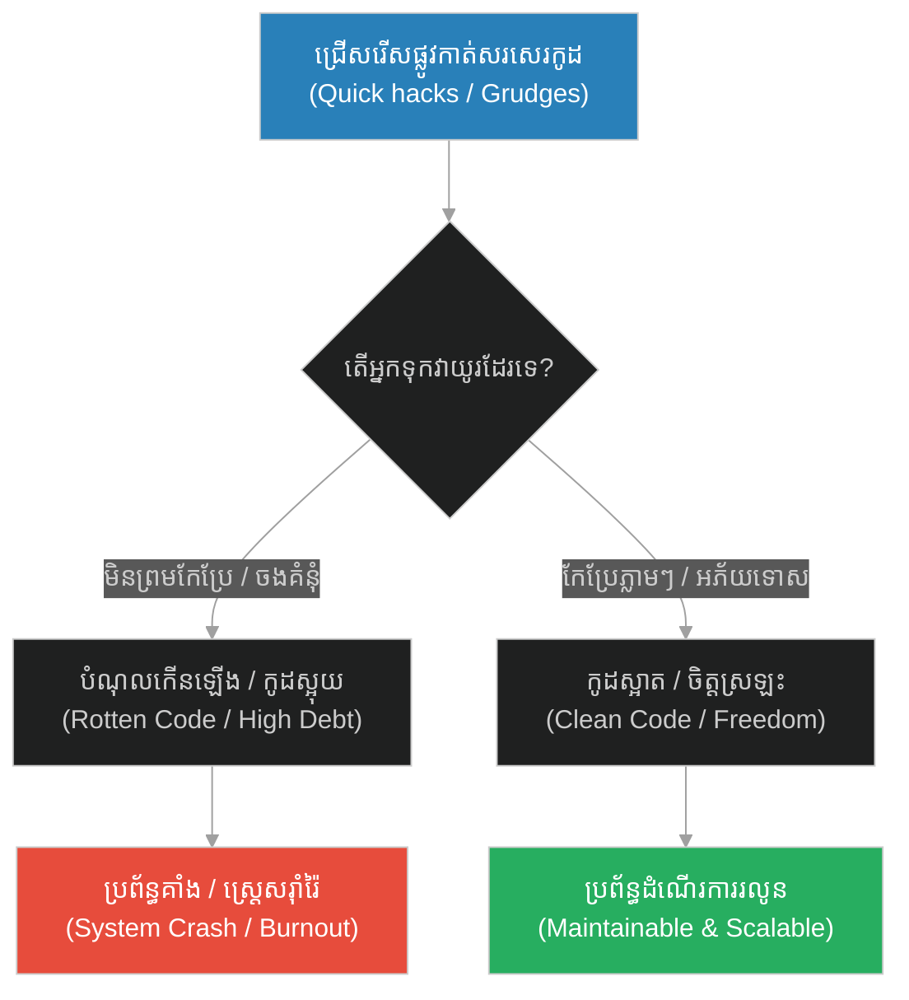
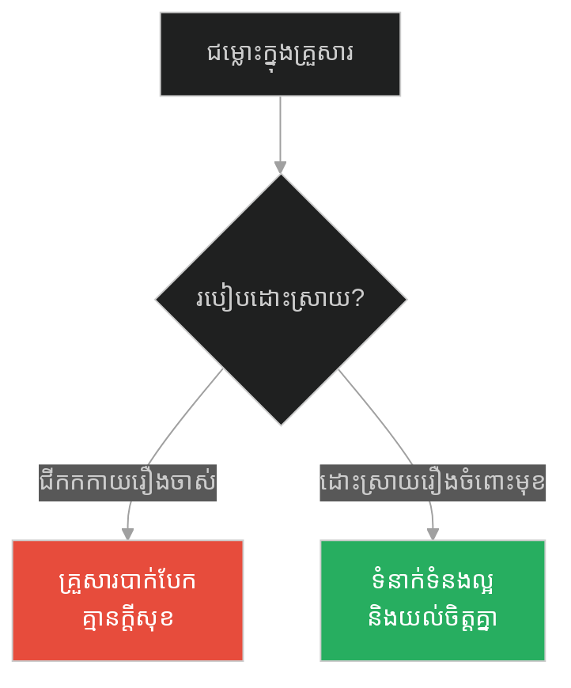
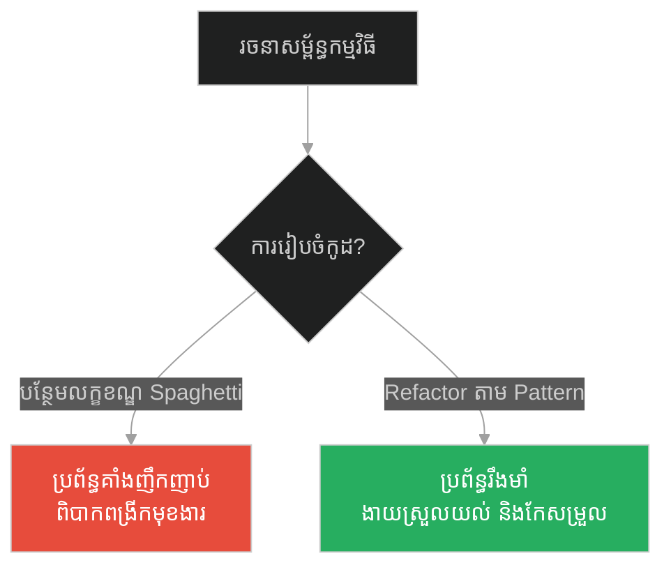
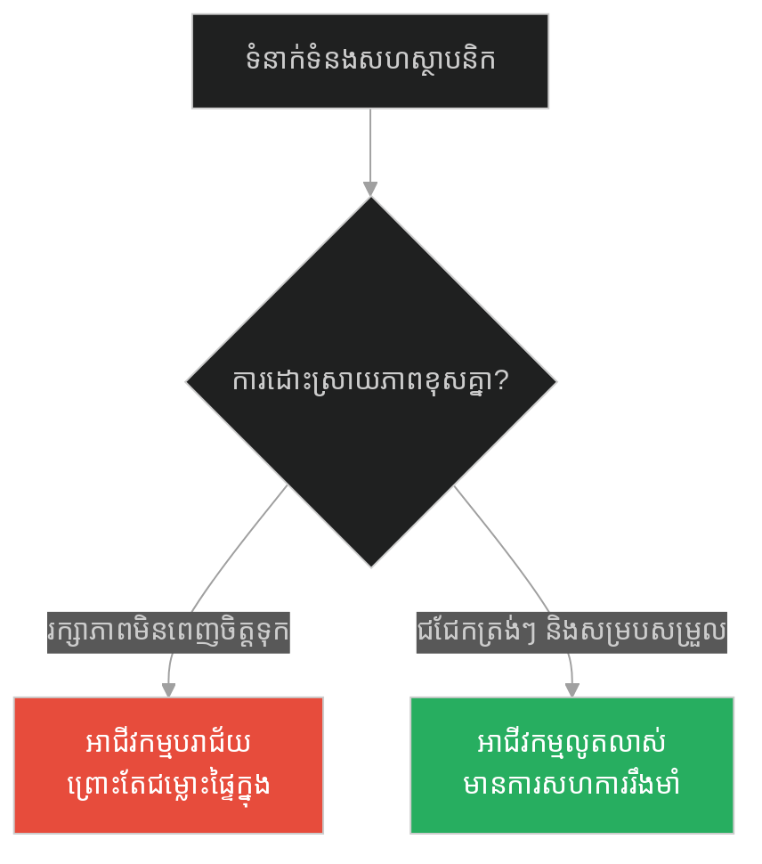
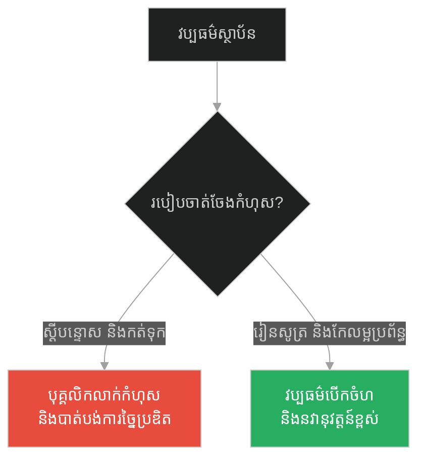
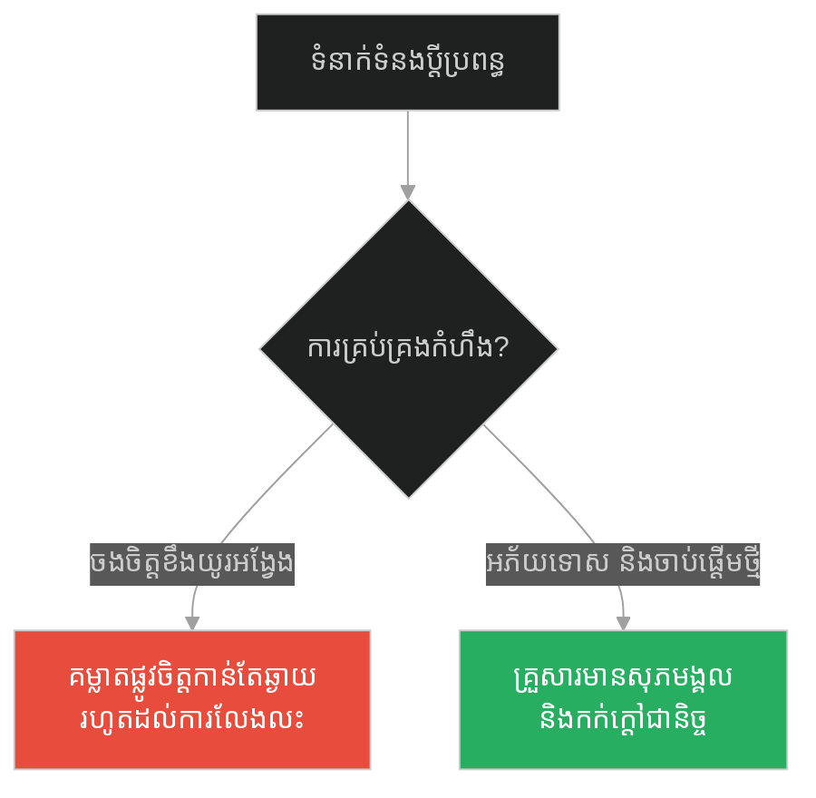
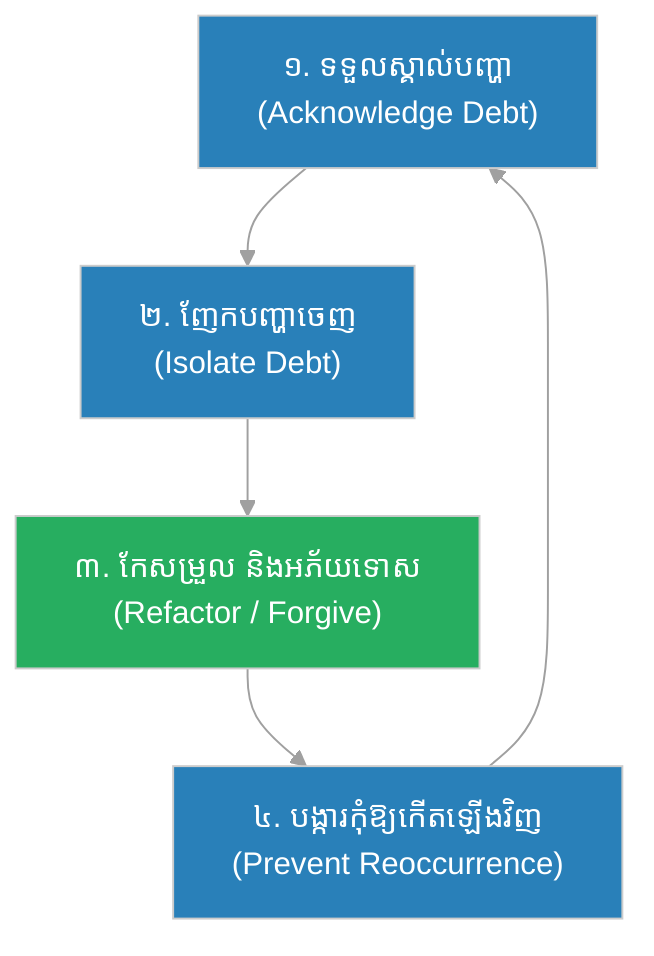

# Resentment & Refactoring Technical Debt (បាវដំឡូង)៖ ការចងគំនុំ និងការកែប្រែកូដចាស់ (Resentment & Refactoring Technical Debt & Buddha and the Bag of Potatoes)

**Author:** ichamrong  
**Date:** 2026-05-28  
**Tags:** #refactoring #technical-debt #grudges #mental-health #clean-code #software-engineering  
**Category:** Concepts  
**Read Time:** ~15 min  

---

## 📌 មាតិកា (Table of Contents)
- [អន្ទាក់ផ្លូវចិត្ត (The Trap)](#0)
- [១. រឿងព្រេងនិទាន៖ បាវដំឡូងស្អុយ (The Legend of the Bag of Potatoes)](#1)
  - [ដំឡូងរលួយ និងក្លិនស្អុយ (The Rotting Potatoes and the Stench)](#1-1)
- [២. បញ្ហា៖ ការចងគំនុំ និងបំណុលបច្ចេកវិទ្យា (The Issue: Resentment & Technical Debt)](#2)
- [៣. ឧទាហរណ៍ជាក់ស្តែងក្នុងពិភពពិត (Real World Examples)](#3)
  - [ឧទាហរណ៍ទី ១ — កម្រិតស្រាល (គ្រួសារ)៖ ការចងចាំកំហុសចាស់ៗក្នុងផ្ទះ (Holding Grudges at Home)](#3-1)
  - [ឧទាហរណ៍ទី ២ — កម្រិតមធ្យម (បច្ចេកទេស)៖ កូដស្អុយដែលមិនព្រមកែប្រែ (Rotten Code & Technical Debt)](#3-2)
  - [ឧទាហរណ៍ទី ៣ — កម្រិតមធ្យម (ធុរកិច្ច)៖ ជម្លោះរវាងស្ថាបនិករួមគ្នា (Co-founder Conflicts & Legacy Decisions)](#3-3)
  - [ឧទាហរណ៍ទី ៤ — កម្រិតមធ្យម (សង្គម/គ្រប់គ្រង)៖ វប្បធម៌ស្តីបន្ទោសក្នុងស្ថាប័ន (The Blame Culture in Organizations)](#3-4)
  - [ឧទាហរណ៍ទី ៥ — កម្រិតធ្ងន់ (ទំនាក់ទំនង)៖ គំនុំក្នុងជីវិតប្តីប្រពន្ធ (The Poison of Marital Grudges)](#3-5)
- [៤. ដំណោះស្រាយទូទៅ៖ ការកែប្រែកូដចាស់ និងការអភ័យទោស (The General Solution: Refactoring & Forgiveness)](#4)
- [សេចក្តីសន្និដ្ឋាន (Conclusion)](#5)
- [ឯកសារយោង (References)](#6)
- [Related Posts](#7)

---

<a id="0"></a>
## អន្ទាក់ផ្លូវចិត្ត (The Trap)

តើអ្នកធ្លាប់មានអារម្មណ៍ធ្ងន់ខ្លួន ឬធុញថប់នៅពេលត្រូវកែប្រែកូដចាស់ៗដែលសរសេរឡើងដោយប្រញាប់ប្រញាល់កាលពីមុនដែរឬទេ? ឬក្នុងជីវិតប្រចាំថ្ងៃ តើអ្នកធ្លាប់មានអារម្មណ៍ហត់នឿយព្រោះតែរក្សាទុកកំហឹងចំពោះនរណាម្នាក់ដែលធ្លាប់ធ្វើខុសដាក់អ្នកដែរឬទេ? នេះគឺជាអន្ទាក់នៃ «ការផ្ទុកដំឡូងស្អុយ» ឬការមិនព្រមដោះស្រាយបំណុលចាស់ៗ។

* **Side A (The Trap):** ការរក្សាកំហុសរបស់សមាជិក ឬការប្រើប្រាស់ដំណោះស្រាយបណ្តោះអាសន្ន (Hacks/Workarounds) ដោយមិនព្រមជម្រះចោល ធ្វើឱ្យបន្ទុកចេះតែកើនឡើង និងជះឥទ្ធិពលអាក្រក់ដល់ប្រព័ន្ធទាំងមូល។
* **Side B (Resilient Pattern):** ការកែសម្រួលកូដឱ្យស្អាតឡើងវិញ (Refactoring) និងការអភ័យទោសលះបង់គំនុំ (Forgiveness) ដើម្បីសម្រាលបន្ទុក និងការពារកុំឱ្យប្រព័ន្ធគាំងនាពេលអនាគត។

នៅក្នុងអត្ថបទនេះ យើងនឹងសិក្សារួមគ្នាអំពី៖
1. **រឿងព្រេងនិទាន (The Legend)** — មេរៀនសាមញ្ញស្តីពីបាវដំឡូងដែលប្រែក្លាយជាបន្ទុកស្អុយរលួយ។
2. **បញ្ហា (The Issue)** — ការវិភាគប្រៀបធៀបគំនុំផ្លូវចិត្ត ទៅនឹងបំណុលបច្ចេកវិទ្យា (Technical Debt)។
3. **ការអនុវត្តជាក់ស្តែង (Real World Examples)** — ឧទាហរណ៍ទាំង ៥ កម្រិត ចាប់ពីកម្រិតគ្រួសារ រហូតដល់ការរៀបចំយុទ្ធសាស្ត្រ Refactoring កូដ។
4. **ដំណោះស្រាយទូទៅ (The General Solution)** — វិធីសាស្ត្រក្នុងការជម្រះដំឡូងស្អុយ និងការកសាងប្រព័ន្ធស្អាតស្អំឡើងវិញ។

---

<a id="1"></a>
## ១. រឿងព្រេងនិទាន៖ បាវដំឡូងស្អុយ (The Legend of the Bag of Potatoes)

មានគ្រូបង្រៀនសមាធិម្នាក់ដ៏ល្បីល្បាញម្នាក់ បានកោះហៅសិស្សទាំងអស់មកជុំគ្នា រួចផ្តល់ឱ្យពួកគេនូវកិច្ចការផ្ទះដ៏ចម្លែកមួយ។ គាត់បានប្រាប់សិស្សថា៖
> «ចាប់ពីថ្ងៃនេះតទៅ រាល់ពេលដែលអ្នកមានអារម្មណ៍ខឹង ស្អប់ ឬចងគំនុំនឹងនរណាម្នាក់ ចូរយកដំឡូងមួយមើមមក សរសេរឈ្មោះពួកគេនៅលើនោះ រួចដាក់វាចូលទៅក្នុងបាវមួយ។ អ្នកត្រូវតែស្ពាយបាវនេះជាប់ខ្លួនជានិច្ច មិនថាកំពុងហូបបាយ ធ្វើការ ឬដេកនោះឡើយ!»

ដំបូងឡើយ សិស្សម្នាក់ៗគិតថាវាជារឿងងាយស្រួល។ ពួកគេបានសរសេរឈ្មោះអ្នកដែលពួកគេមិនចូលចិត្ត ឬធ្លាប់ក្បត់ពួកគេដាក់ក្នុងបាវ។ យុវជនខ្លះមានដំឡូងត្រឹមតែ ៣ ទៅ ៤ មើម ចំណែកខ្លះទៀតមានរហូតដល់ពេញមួយបាវធំ ទៅតាមកម្រិតនៃកំហឹងរបស់ពួកគេ។

<a id="1-1"></a>
### ដំឡូងរលួយ និងក្លិនស្អុយ (The Rotting Potatoes and the Stench)

ពេលវេលាកន្លងផុតទៅមួយសប្តាហ៍ ដំឡូងនៅក្នុងបាវចាប់ផ្តើមទទួលសម្ពាធពីការកកិត និងកំដៅថ្ងៃ។ ពួកវាចាប់ផ្តើមរលួយ ហូរទឹកអសោច និងទាក់ទាញដង្កូវ រួចបញ្ចេញក្លិនស្អុយដែលមិនអាចទ្រាំទ្របាន។ សិស្សដែលស្ពាយបាវដំឡូងពេញ បានក្លាយជាមនុស្សដែលគ្រប់គ្នាចង់ជៀសឆ្ងាយ ព្រោះតែក្លិនស្អុយភាយចេញពីខ្លួនពួកគេ។

ពួកគេលែងមានសន្តិភាពចិត្តក្នុងការសមាធិ ការដើរទៅណាមកណាមានភាពពិបាក និងហត់នឿយខ្លាំង។ នៅទីបំផុត ពួកគេបាននាំគ្នាទៅរកគ្រូដោយទឹកមុខស្រពោន និងស្នើសុំឈប់ធ្វើកិច្ចការនេះ។

គ្រូបានសម្លឹងមើលពួកគេដោយក្តីមេត្តា រួចពន្យល់ថា៖
> «តើអ្នកមានអារម្មណ៍យ៉ាងណា ពេលត្រូវស្ពាយបាវដំឡូងស្អុយនេះជាប់ខ្លួន? នេះហើយជាស្ថានភាពផ្លូវចិត្តរបស់អ្នក នៅពេលរក្សាគំនុំ និងការស្អប់ខ្ពើមទុកក្នុងចិត្ត។ អ្នកដទៃដែលអ្នកខឹង គេប្រហែលជាកំពុងគេងលក់ស្រួល ឬរីករាយនឹងជីវិតគេបាត់ទៅហើយ ចំណែកអ្នកឯណេះទេដែលកំពុងតែឱបក្រសោបក្លិនស្អុយ និងទារុណកម្មផ្លូវចិត្តរាល់ថ្ងៃ!»

---

<a id="2"></a>
## ២. បញ្ហា៖ ការចងគំនុំ និងបំណុលបច្ចេកវិទ្យា (The Issue: Resentment & Technical Debt)

នៅក្នុងវិស័យអភិវឌ្ឍន៍កម្មវិធី (Software Development) បំណុលបច្ចេកវិទ្យា (Technical Debt) គឺប្រៀបដូចជាដំឡូងដែលយើងបានបន្ថែមទៅក្នុងបាវ។ រាល់ពេលដែលយើងជ្រើសរើសផ្លូវកាត់ ដោយសរសេរកូដរញ៉េរញ៉ៃ (Quick Hacks) ដើម្បីឱ្យបានលទ្ធផលលឿន គឺយើងកំពុងតែបោះដំឡូងមួយមើមទៅក្នុងប្រព័ន្ធ។ 

ដំបូងឡើយ កម្មវិធីនៅតែដើរធម្មតា ប៉ុន្តែយូរៗទៅ កូដរញ៉េរញ៉ៃទាំងនោះចាប់ផ្តើមប៉ះទង្គិចគ្នា (Rotting Code) បង្កើតជា Bug ដ៏ស្មុគស្មាញ និងធ្វើឱ្យល្បឿននៃការអភិវឌ្ឍន៍យឺតយ៉ាវជាខ្លាំង។



---

<a id="3"></a>
## ៣. ឧទាហរណ៍ជាក់ស្តែងក្នុងពិភពពិត

<a id="3-1"></a>
### ឧទាហរណ៍ទី ១ — កម្រិតស្រាល (គ្រួសារ)៖ ការចងចាំកំហុសចាស់ៗក្នុងផ្ទះ (Holding Grudges at Home)

* **Dilemma:** សមាជិកគ្រួសារដែលតែងតែលើកយកកំហុសឆ្គងកាលពី ៥ ឆ្នាំមុនរបស់បងប្អូនមកជជែករាល់ពេលមានជម្លោះតូចតាច បង្កើតជាបរិយាកាសគ្រួសារដែលពោរពេញដោយភាពតានតឹង។
* **Good Choice:** ការដោះស្រាយបញ្ហាភ្លាមៗ និងការនិយាយដោយបើកចំហ រួចព្រមព្រៀងគ្នាបំភ្លេចចោលនូវរឿងចាស់ៗដែលបានកន្លងផុតទៅ។



---

<a id="3-2"></a>
### ឧទាហរណ៍ទី ២ — កម្រិតមធ្យម (បច្ចេកទេស)៖ កូដស្អុយដែលមិនព្រមកែប្រែ (Rotten Code & Technical Debt)

នៅក្នុងប្រព័ន្ធទូទាត់ប្រាក់ ប្រសិនបើ Developer ម្នាក់បន្ថែមលក្ខខណ្ឌពិសេស (If/Else Hacks) សម្រាប់តែអតិថិជនម្នាក់ដោយគ្មានរចនាសម្ព័ន្ធត្រឹមត្រូវ វានឹងបង្កើតជាកូដស្អុយរលួយយ៉ាងលឿន។

#### Fragile Code (Accumulating Technical Debt):
```python
# កូដដែលផ្ទុកបំណុលចាស់ៗ (Rotten Code)
def calculate_discount(user_type, total_amount):
    # បញ្ចូល If/Else ច្រើនជាន់ដែលពិបាកតាមដាន និងងាយបង្កកំហុស
    if user_type == "VIP":
        if total_amount > 100:
            return total_amount * 0.2
        else:
            return total_amount * 0.1
    elif user_type == "Regular":
        # Hack បន្ថែមសម្រាប់អតិថិជនម្នាក់ដែលឈ្មោះ John
        # នេះជាដំឡូងស្អុយមួយមើមដែលមិនព្រម Refactor
        if total_amount > 50:
            return total_amount * 0.05
        return 0
    else:
        return 0
```

#### Resilient Code (Refactored Clean Code):
```python
from abc import ABC, abstractmethod

# ប្រើប្រាស់ Strategy Pattern ដើម្បីលុបបំបាត់ If/Else ច្រើនជាន់
class DiscountStrategy(ABC):
    @abstractmethod
    def get_discount(self, amount: float) -> float:
        pass

class VIPDiscount(DiscountStrategy):
    def get_discount(self, amount: float) -> float:
        return amount * 0.2 if amount > 100 else amount * 0.1

class RegularDiscount(DiscountStrategy):
    def get_discount(self, amount: float) -> float:
        return amount * 0.05 if amount > 50 else 0.0

class DiscountCalculator:
    def __init__(self, strategy: DiscountStrategy):
        self.strategy = strategy
        
    def calculate(self, amount: float) -> float:
        return self.strategy.get_discount(amount)
```



---

<a id="3-3"></a>
### ឧទាហរណ៍ទី ៣ — កម្រិតមធ្យម (ធុរកិច្ច)៖ ជម្លោះរវាងស្ថាបនិករួមគ្នា (Co-founder Conflicts & Legacy Decisions)

* **Dilemma:** Co-founders ដែលមានទស្សនៈខុសគ្នា រួចរក្សាទុកភាពមិនពេញចិត្តដាក់គ្នាក្នុងចិត្ត ធ្វើឱ្យការសម្រេចចិត្តអាជីវកម្មយឺតយ៉ាវ និងបាត់បង់ទំនុកចិត្តពីវិនិយោគិន។
* **Good Choice:** បង្កើតវប្បធម៌ប្រជុំបើកចំហរាល់ខែ ដើម្បីទម្លាយរាល់បញ្ហា និងជម្រះមន្ទិលសង្ស័យឱ្យបានទាន់ពេលវេលា។



---

<a id="3-4"></a>
### ឧទាហរណ៍ទី ៤ — កម្រិតមធ្យម (សង្គម/គ្រប់គ្រង)៖ វប្បធម៌ស្តីបន្ទោសក្នុងស្ថាប័ន (The Blame Culture in Organizations)

* **Dilemma:** មេដឹកនាំដែលតែងតែកត់ចំណាំរាល់កំហុសឆ្គងតូចតាចរបស់បុគ្គលិក រួចយកវាមកវាយតម្លៃកាត់បន្ថយប្រាក់ខែនៅចុងឆ្នាំ បង្កើតជាបរិយាកាសការងារដែលពោរពេញដោយភាពភ័យខ្លាច។
* **Good Choice:** បង្កើតវប្បធម៌ "Blameless Post-mortem" ដែលផ្តោតលើការកែលម្អប្រព័ន្ធជាជាងការវាយប្រហារបុគ្គលិក។



---

<a id="3-5"></a>
### ឧទាហរណ៍ទី ៥ — កម្រិតធ្ងន់ (ទំនាក់ទំនង)៖ គំនុំក្នុងជីវិតប្តីប្រពន្ធ (The Poison of Marital Grudges)

* **Dilemma:** គូស្វាមីភរិយាដែលរក្សា "សៀវភៅបញ្ជីកំហុស" ក្នុងចិត្ត ហើយប្រើវាជាអាវុធផ្លូវចិត្តដើម្បីវាយប្រហារគ្នានៅពេលមានការខ្វែងគំនិតគ្នា។
* **Good Choice:** ការអនុវត្តគោលការណ៍ «កុំទុកកំហឹងឱ្យឆ្លងផុតថ្ងៃថ្មី» និងរៀនដោះលែងក្តីបារម្ភចោល ដើម្បីកសាងបច្ចុប្បន្នកាលជាមួយគ្នា។



---

<a id="4"></a>
## ៤. ដំណោះស្រាយទូទៅ៖ ការកែប្រែកូដចាស់ និងការអភ័យទោស (The General Solution: Refactoring & Forgiveness)

ដើម្បីដោះលែងខ្លួនយើងពី «បាវដំឡូងស្អុយ» ទាំងក្នុងចិត្ត និងក្នុងប្រព័ន្ធបច្ចេកវិទ្យា យើងត្រូវអនុវត្តយុទ្ធសាស្ត្រ ៤ ជំហាន៖

1. **Acknowledge the Smell (ទទួលស្គាល់ក្លិនស្អុយ):** ហ៊ានទទួលស្គាល់ថាប្រព័ន្ធ ឬចិត្តរបស់អ្នកកំពុងរងទុក្ខដោយសារតែកូដស្មុគស្មាញ ឬគំនុំចាស់ៗ។
2. **Isolate the Debt (ញែកបំណុលចេញ):** កំណត់ឱ្យច្បាស់ថាតើកូដផ្នែកណាខ្លះដែលបង្កបញ្ហា ឬព្រឹត្តិការណ៍ណាខ្លះដែលធ្វើឱ្យអ្នកមិនសប្បាយចិត្ត។
3. **Refactor and Forgive (កែប្រែ និងអភ័យទោស):** កែសម្រួលកូដឱ្យមានលក្ខណៈស្តង់ដារឡើងវិញ ឬផ្តល់ការអភ័យទោសដើម្បីរំដោះសន្តិភាពផ្លូវចិត្ត។
4. **Prevent Accumulation (ការពារកុំឱ្យកើតមានឡើងវិញ):** បង្កើតការធ្វើតេស្តស្វ័យប្រវត្ត (Automated Tests) ក្នុងកូដ ឬការជជែកគ្នាជាប្រចាំក្នុងទំនាក់ទំនង ដើម្បីកុំឱ្យដំឡូងស្អុយថ្មីៗត្រូវបានបោះចូលក្នុងបាវទៀត។



---

## 🐇 ធ្លាក់ចូលក្នុងរន្ធទន្សាយ (Enter the Rabbit Hole)
ដើម្បីស្វែងយល់បន្ថែមអំពីផលវិបាកនៃការលូកដៃជួយហួសហេតុ និងការរារាំងការលូតលាស់ពីធម្មជាតិ សូមបន្តដំណើរទៅកាន់អត្ថបទបន្ទាប់៖

* 🚀 **[ចាប់ផ្តើមដំណើររុករក (Start the Journey) ➔ Necessary Struggles & Rescue Trap / Micromanagement (មេអំបៅ និងដូងកុក)](./167-buddha-and-the-struggling-butterfly.md)**

---

<a id="5"></a>
## សេចក្តីសន្និដ្ឋាន (Conclusion)

> **«ការចងគំនុំ គឺប្រៀបដូចជាការផឹកថ្នាំពុលខ្លួនឯង ហើយសង្ឃឹមថាអ្នកដទៃនឹងស្លាប់អញ្ចឹង។» — Buddha / Unknown**

ការសម្រេចចិត្តលះបង់ចោលនូវគំនុំ ឬការចំណាយពេល Refactor កូដចាស់ មិនមែនធ្វើឡើងដើម្បីសម្រួលដល់អ្នកដទៃ ឬដើម្បីតែភាពស្រស់ស្អាតនៃកូដនោះទេ ប៉ុន្តែវាគឺជាសកម្មភាពដើម្បី «សេរីភាព និងសុវត្ថិភាពរបស់ខ្លួនអ្នកផ្ទាល់»។ ចូរឈប់ស្ពាយដំឡូងស្អុយទាំងនោះទៅ ជីវិតរបស់អ្នកត្រូវការសន្តិភាព និងកន្លែងធំទូលាយសម្រាប់បង្កើតរឿងល្អៗថ្មីៗ។

---

<a id="6"></a>
## ឯកសារយោង (References)

* **Martin, Robert C. (Uncle Bob)** — *Clean Code: A Handbook of Agile Software Craftsmanship* (2008). Discusses structural integrity and code smells in depth.
* **Luskin, Fred** — *Forgive for Good* (2002). A scientific research-backed book on how forgiveness benefits physical and mental health.
* **Feathers, Michael** — *Working Effectively with Legacy Code* (2004). Practical techniques for managing and refactoring messy systems.

---

<a id="7"></a>
## Related Posts

* [Facilitation & Servant Leadership (អ្នកចម្លងទូក)៖ ការសម្របសម្រួល និងភាពជាអ្នកដឹកនាំបម្រើ](./165-buddha-and-the-ferryman.md) — ស្វែងយល់ពីរបៀបជួយសម្របសម្រួលដោយមិនបង្កើតការពឹងផ្អែក។
* [Necessary Struggles & Rescue Trap / Micromanagement (មេអំបៅ និងដូងកុក)៖ ភាពចាំបាច់នៃការតស៊ូ](./167-buddha-and-the-struggling-butterfly.md) — សិក្សាពីផលប៉ះពាល់នៃការលូកដៃដោះស្រាយបញ្ហាជំនួសសមាជិកក្រុម។
