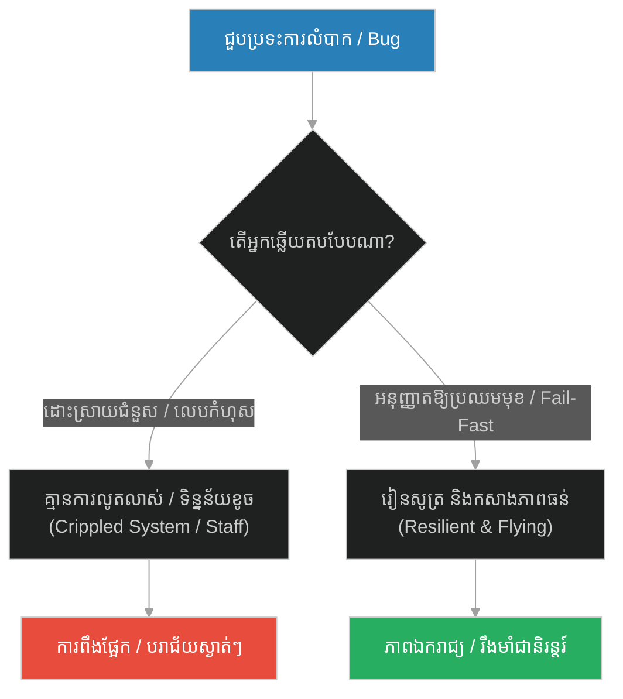
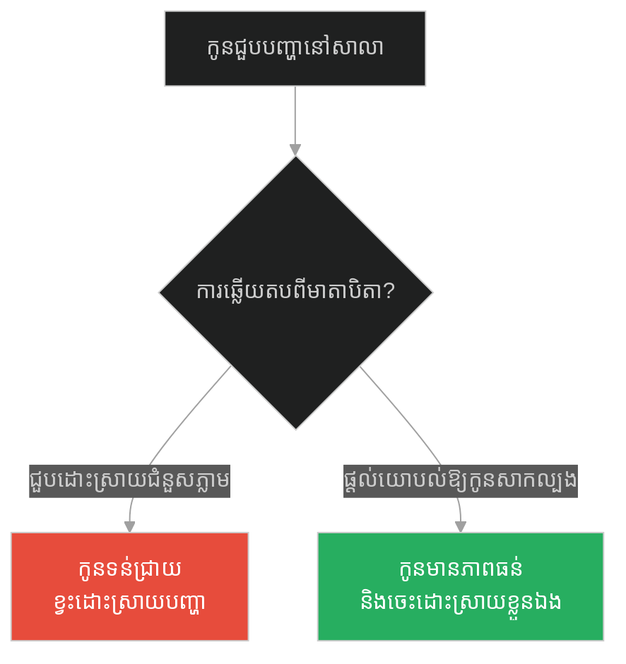
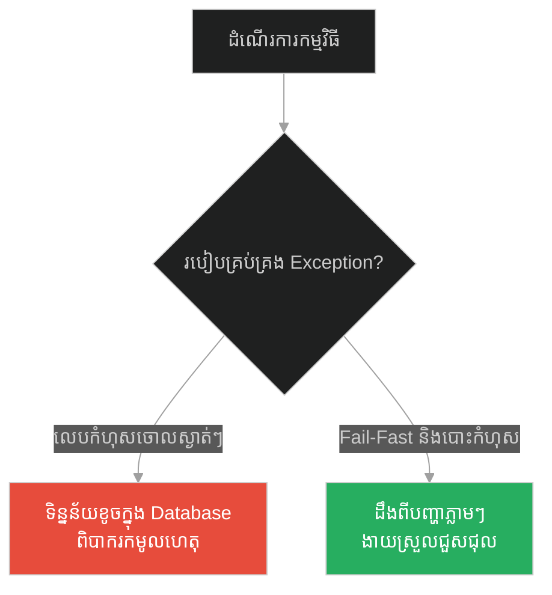
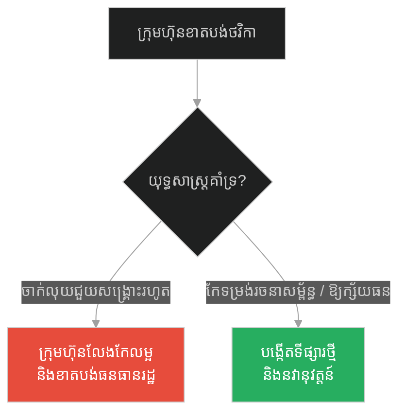
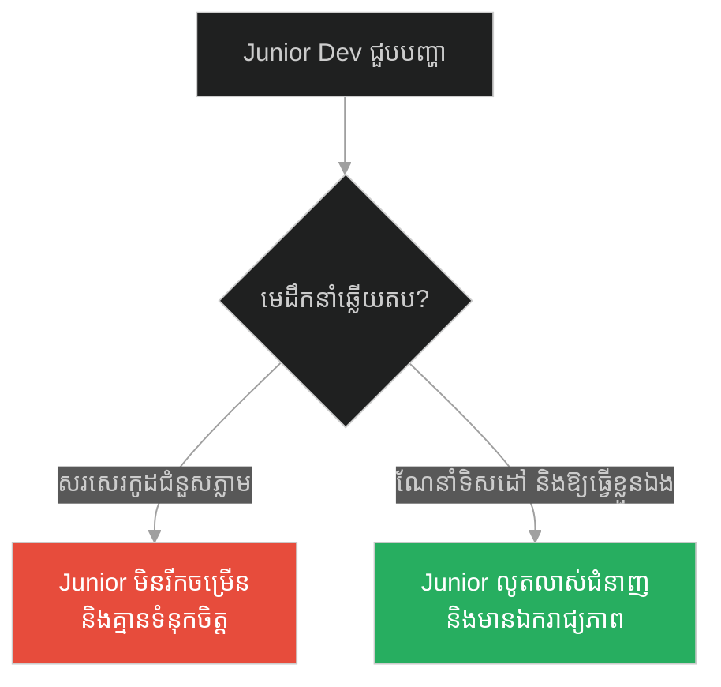
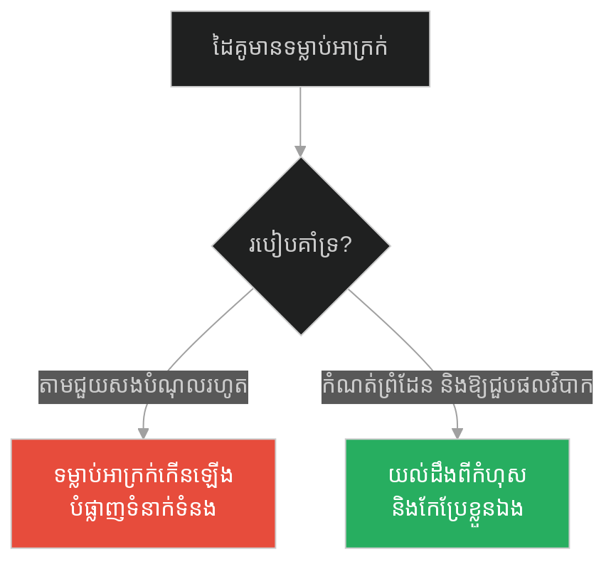
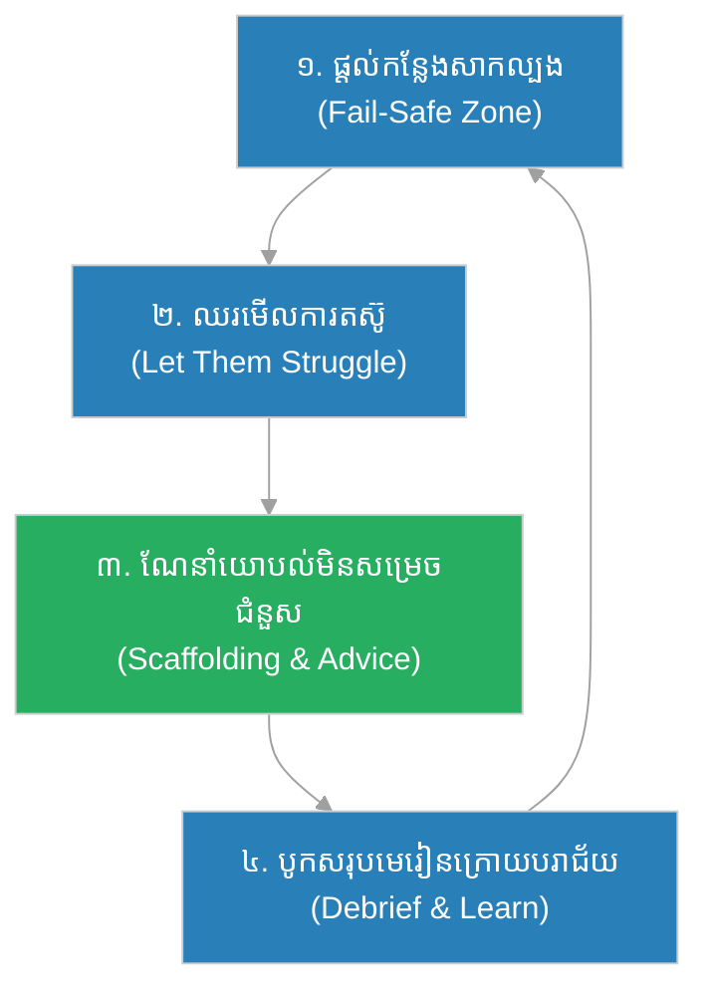

# Necessary Struggles & Rescue Trap (មេអំបៅ និងដូងកុក)៖ ភាពចាំបាច់នៃការតស៊ូ និងការលូកដៃជួយហួសហេតុ (Necessary Struggles & Rescue Trap & Buddha and the Struggling Butterfly)

**Author:** ichamrong  
**Date:** 2026-05-28  
**Tags:** #micromanagement #resilience #personal-growth #leadership #software-engineering #error-handling  
**Category:** Concepts  
**Read Time:** ~15 min  

---

## 📌 មាតិកា (Table of Contents)
- [អន្ទាក់ផ្លូវចិត្ត (The Trap)](#0)
- [១. រឿងព្រេងនិទាន៖ មេអំបៅ និងដូងកុក (The Legend of the Struggling Butterfly)](#1)
  - [សេចក្តីសប្បុរសដ៏ខ្វាក់ភ្នែក (The Blind Kindness)](#1-1)
- [២. បញ្ហា៖ ភាពចាំបាច់នៃការតស៊ូ និងអន្ទាក់នៃការជួយសង្គ្រោះ (The Issue: Necessary Struggles & The Rescue Trap)](#2)
- [៣. ឧទាហរណ៍ជាក់ស្តែងក្នុងពិភពពិត (Real World Examples)](#3)
  - [ឧទាហរណ៍ទី ១ — កម្រិតស្រាល (គ្រួសារ)៖ មាតាបិតាដែលថ្នាក់ថ្នមកូនហួសហេតុ (Helicopter Parenting)](#3-1)
  - [ឧទាហរណ៍ទី ២ — កម្រិតមធ្យម (បច្ចេកទេស)៖ ការទប់ស្កាត់កំហុសដោយការលេបចូល (Swallowing Exceptions & Silencing Errors)](#3-2)
  - [ឧទាហរណ៍ទី ៣ — កម្រិតមធ្យម (ធុរកិច្ច)៖ ការផ្តល់ប្រាក់ឧបត្ថម្ភដល់អាជីវកម្មដែលមិនចេះរីកចម្រើន (Subsidizing Zombie Businesses)](#3-3)
  - [ឧទាហរណ៍ទី ៤ — កម្រិតមធ្យម (សង្គម/គ្រប់គ្រង)៖ ការគ្រប់គ្រងបែបលម្អិត និងការគ្រប់គ្រងមីក្រូ (Micromanagement in Leadership)](#3-4)
  - [ឧទាហរណ៍ទី ៥ — កម្រិតធ្ងន់ (ទំនាក់ទំនង)៖ ដៃគូដែលព្យាយាមដោះស្រាយបញ្ហាគ្រប់យ៉ាង (The Fixer Partner in Relationships)](#3-5)
- [៤. ដំណោះស្រាយទូទៅ៖ ការអនុញ្ញាតឱ្យមានការតស៊ូប្រកបដោយការគាំទ្រ (The General Solution: Supported Autonomy)](#4)
- [សេចក្តីសន្និដ្ឋាន (Conclusion)](#5)
- [ឯកសារយោង (References)](#6)
- [Related Posts](#7)

---

<a id="0"></a>
## អន្ទាក់ផ្លូវចិត្ត (The Trap)

តើអ្នកធ្លាប់លូកដៃទៅដោះស្រាយបញ្ហាជំនួសកូនៗ បុគ្គលិក ឬសូម្បីតែកម្មវិធីកុំព្យូទ័រ ដោយសារតែអារម្មណ៍អាណិតអាសូរ ឬខ្លាចការបរាជ័យដែរឬទេ? នេះគឺជាអន្ទាក់នៃការជួយសង្គ្រោះដ៏ខ្វាក់ភ្នែក (The Rescue Trap) ដែលដកហូតឱកាសនៃការរៀនសូត្រ និងកសាងភាពរឹងមាំពីធម្មជាតិ។

* **Side A (The Trap):** ការកាត់បន្ថយការលំបាក ឬការជួយដោះស្រាយបញ្ហាភ្លាមៗដោយមិនឱ្យពួកគេឆ្លងកាត់ការតស៊ូ ធ្វើឱ្យពួកគេទន់ខ្សោយ និងមិនអាចរស់នៅដោយឯករាជ្យបាន។
* **Side B (Resilient Pattern):** ការអនុញ្ញាតឱ្យពួកគេប្រឈមមុខនឹងឧបសគ្គ និងការលំបាកដោយខ្លួនឯង ដោយមានការគាំទ្រ និងការណែនាំពីចម្ងាយ ដើម្បីឱ្យពួកគេអាចអភិវឌ្ឍ «ស្លាប» ផ្ទាល់ខ្លួនសម្រាប់ហោះហើរ។

នៅក្នុងអត្ថបទនេះ យើងនឹងពិភាក្សាអំពី៖
1. **រឿងព្រេងនិទាន (The Legend)** — មេអំបៅដែលស្លាបស្វិតពេញមួយជីវិត ព្រោះតែកន្ត្រៃជួយសង្គ្រោះ។
2. **បញ្ហា (The Issue)** — ការវិភាគលើសារៈសំខាន់នៃភាពតស៊ូ និងគ្រោះថ្នាក់នៃស្ថាបត្យកម្មកូដដែលលេបទុកកំហុស (Silent Exceptions)។
3. **ការអនុវត្តជាក់ស្តែង (Real World Examples)** — ការប្រៀបធៀបករណីសិក្សាទាំង ៥ កម្រិត ចាប់ពីកម្រិតគ្រួសាររហូតដល់កម្រិតសរសេរកូដធំៗ។
4. **ដំណោះស្រាយទូទៅ (The General Solution)** — ការបង្កើតការគាំទ្រដោយផ្អែកលើស្វ័យភាព (Supported Autonomy)។

---

<a id="1"></a>
## ១. រឿងព្រេងនិទាន៖ មេអំបៅ និងដូងកុក (The Legend of the Struggling Butterfly)

នៅក្បែរព្រៃស្ងាត់ជ្រងំមួយ មានយុវជនម្នាក់ដែលចូលចិត្តការសង្កេតមើលធម្មជាតិ។ ថ្ងៃមួយ គាត់បានរកឃើញដូងកុក (Cocoon) របស់មេអំបៅដ៏ស្រស់ស្អាតមួយ កំពុងព្យួរនៅលើមែកឈើតូចមួយ។ ដោយចង់ឃើញការចាប់កំណើតរបស់វា គាត់ក៏បានយកដូងកុកនោះមកដាក់ក្នុងផ្ទះរបស់ខ្លួន។

ប៉ុន្មានថ្ងៃក្រោយមក មានស្នាមប្រេះតូចមួយបានលេចឡើងនៅលើដូងកុក។ យុវជននោះអង្គុយមើលសត្វមេអំបៅដែលកំពុងប្រឹងរើបម្រះយ៉ាងខ្លាំង ដើម្បីរុញរាងកាយរបស់វាចេញតាមប្រហោងតូចនោះ។ ការរើបម្រះមានភាពលំបាកខ្លាំងណាស់ មេអំបៅបានខិតខំប្រឹងប្រែងអស់ជាច្រើនម៉ោង រហូតដល់វាហាក់ដូចជាអស់កម្លាំងទាំងស្រុង និងឈប់កម្រើក។

<a id="1-1"></a>
### សេចក្តីសប្បុរសដ៏ខ្វាក់ភ្នែក (The Blind Kindness)

ដោយអារម្មណ៍អាណិតអាសូរ និងចង់ជួយសង្គ្រោះ យុវជននោះបានទៅយកកន្ត្រៃតូចមួយមកកាត់ប្រេះមាត់ដូងកុកនោះឱ្យធំជាងមុន។ ជាលទ្ធផល មេអំបៅអាចចេញមកក្រៅបានយ៉ាងងាយស្រួលដោយគ្មានការលំបាកអ្វីឡើយ។

ប៉ុន្តែ យុវជននោះសង្កេតឃើញថា៖
* រាងកាយរបស់មេអំបៅនោះមានសភាពហើមប៉ោង និងពោរពេញដោយជាតិទឹក។
* ស្លាបទាំងសងខាងរបស់វាមានសភាពតូច ស្វិត និងមិនលាតសន្ធឹងឡើយ។

យុវជននោះនៅតែរង់ចាំមើលស្លាបរបស់វាលាតធំដើម្បីហោះហើរ ប៉ុន្តែរឿងនោះមិនដែលកើតឡើងឡើយ។ សត្វមេអំបៅដ៏កំសត់នោះ ត្រូវចំណាយពេលពេញមួយជីវិតរបស់វា វារនៅលើដីជាមួយនឹងរាងកាយហើម និងស្លាបស្វិត រហូតដល់ស្លាប់ទៅវិញដោយមិនដែលបានស្គាល់សេរីភាពនៃការហោះហើរលើមេឃសោះឡើយ។

អ្វីដែលយុវជននោះមិនបានដឹង ដោយសារតែសេចក្តីអាណិតដ៏ខ្វាក់ភ្នែកគឺ៖ **ការតស៊ូរើបម្រះពីដូងកុកតូចចង្អៀត គឺជាយន្តការធម្មជាតិដែលច្របាច់រុញសារធាតុរាវពីរាងកាយរបស់មេអំបៅឱ្យហូរចូលទៅក្នុងសរសៃស្លាប។ បើគ្មានការច្របាច់រុញនេះទេ ស្លាបនឹងមិនអាចលាតសន្ធឹង និងរឹងមាំគ្រប់គ្រាន់សម្រាប់ហោះហើរបានឡើយ។**

---

<a id="2"></a>
## ២. បញ្ហា៖ ភាពចាំបាច់នៃការតស៊ូ និងអន្ទាក់នៃការជួយសង្គ្រោះ (The Issue: Necessary Struggles & The Rescue Trap)

នៅក្នុងប្រព័ន្ធបច្ចេកវិទ្យា និងការគ្រប់គ្រងក្រុម ការមិនអនុញ្ញាតឱ្យប្រព័ន្ធ ឬមនុស្សជួបប្រទះការលំបាក ឬកំហុសឆ្គង (Failure) គឺជាការសម្លាប់សមត្ថភាពអភិវឌ្ឍន៍ខ្លួនរបស់ពួកគេ។

* នៅក្នុងការសរសេរកូដ៖ ការប្រើប្រាស់ `try-catch` ដើម្បីលេបទុកកំហុស (Silent Exception Swallowing) ព្រោះខ្លាចកម្មវិធីគាំង (Crash) គឺដូចជាការយកកន្ត្រៃកាត់ដូងកុកមេអំបៅ។ កម្មវិធីអាចដំណើរការបន្តបានមែន ប៉ុន្តែវាកំពុងផ្ទុកទិន្នន័យខូច (Corrupted Data) និងបង្កើតជាកំហុសស្ងាត់ៗដែលពិបាកស្វែងរក និងជួសជុលនាពេលក្រោយ។
* នៅក្នុងការគ្រប់គ្រង៖ ការលូកដៃគ្រប់គ្រងលម្អិត (Micromanagement) របស់មេដឹកនាំ ធ្វើឱ្យបុគ្គលិកលែងចេះដោះស្រាយបញ្ហា និងក្លាយជាអ្នករង់ចាំការជួយសង្គ្រោះជានិច្ច។



---

<a id="3"></a>
## ៣. ឧទាហរណ៍ជាក់ស្តែងក្នុងពិភពពិត

<a id="3-1"></a>
### ឧទាហរណ៍ទី ១ — កម្រិតស្រាល (គ្រួសារ)៖ មាតាបិតាដែលថ្នាក់ថ្នមកូនហួសហេតុ (Helicopter Parenting)

* **Dilemma:** មាតាបិតាដែលតែងតែលូកដៃជួយកូនរាល់ពេលមានជម្លោះជាមួយមិត្តភក្តិ ឬជួយដោះស្រាយបញ្ហាការសិក្សាគ្រប់យ៉ាង ធ្វើឱ្យកូនក្លាយជាមនុស្សខ្វះភាពអត់ធ្មត់ និងមិនចេះស៊ូទ្រាំនឹងសម្ពាធសង្គម។
* **Good Choice:** ការឈរមើលពីចម្ងាយ ផ្តល់ដំបូន្មាននៅពេលចាំបាច់ ប៉ុន្តែទុកឱ្យពួកគេដោះស្រាយទំនាស់ និងប្រឈមមុខនឹងផលវិបាកដោយខ្លួនឯង។



---

<a id="3-2"></a>
### ឧទាហរណ៍ទី ២ — កម្រិតមធ្យម (បច្ចេកទេស)៖ ការទប់ស្កាត់កំហុសដោយការលេបចូល (Swallowing Exceptions & Silencing Errors)

នៅក្នុងការអភិវឌ្ឍកម្មវិធី ការសរសេរកូដដែលចាប់កំហុសទាំងអស់ រួចលេបវាចោលដោយមិនបញ្ចេញព័ត៌មាន (Exception Swallowing) គឺជារឿងគ្រោះថ្នាក់បំផុត។

#### Fragile Code (Swallowing Exceptions):
```python
# កូដដែលលេបកំហុសសង្គ្រោះប្រព័ន្ធបណ្តោះអាសន្ន (Rescue Trap)
def parse_user_data(data_string):
    try:
        parts = data_string.split(",")
        user_info = {
            "id": int(parts[0]),
            "name": parts[1],
            "age": int(parts[2])
        }
        return user_info
    except Exception:
        # លេបកំហុសចោលដោយស្ងាត់ស្ងៀមដើម្បីកុំឱ្យកម្មវិធី Crash
        # នេះជាការកាត់ដូងកុក ធ្វើឱ្យយើងមិនដឹងថាទិន្នន័យខូចនៅត្រង់ណា
        return {}
```

#### Resilient Code (Fail-Fast Principle with Clean Propagation):
```python
import logging

logging.basicConfig(level=logging.INFO)

# អនុញ្ញាតឱ្យកំហុសលេចចេញ ឬបោះវាទៅកម្រិតខាងលើ (Fail-Fast)
def parse_user_data_resilient(data_string: str) -> dict:
    try:
        parts = data_string.split(",")
        if len(parts) < 3:
            raise ValueError("Input string must have at least 3 comma-separated values.")
            
        return {
            "id": int(parts[0].strip()),
            "name": parts[1].strip(),
            "age": int(parts[2].strip())
        }
    except (ValueError, IndexError) as e:
        # កត់ត្រាកំហុសច្បាស់លាស់ដើម្បីឱ្យអ្នកអភិវឌ្ឍន៍អាចកែប្រែបានភ្លាមៗ
        logging.error(f"Failed to parse user data: {e} | Raw input: '{data_string}'")
        # បោះ Exception ឡើងទៅលើដើម្បីកុំឱ្យមានការបញ្ចូលទិន្នន័យខូច
        raise
```



---

<a id="3-3"></a>
### ឧទាហរណ៍ទី ៣ — កម្រិតមធ្យម (ធុរកិច្ច)៖ ការផ្តល់ប្រាក់ឧបត្ថម្ភដល់អាជីវកម្មដែលមិនចេះរីកចម្រើន (Subsidizing Zombie Businesses)

* **Dilemma:** រដ្ឋាភិបាល ឬក្រុមហ៊ុនមេ ដែលបន្តចាក់លុយជួយសង្គ្រោះក្រុមហ៊ុនបុត្រសម្ព័ន្ធដែលខាតបង់ជាប់គ្នាជាច្រើនឆ្នាំ ព្រោះតែការខ្លាចបាត់បង់ការងារធ្វើរបស់បុគ្គលិក បង្កើតជា «ក្រុមហ៊ុនខ្មោចឆៅ» (Zombie Companies) ដែលមិនព្រមកែលម្អផលិតផល។
* **Good Choice:** អនុញ្ញាតឱ្យក្រុមហ៊ុននោះក្ស័យធន ឬឆ្លងកាត់ការកែទម្រង់រចនាសម្ព័ន្ធដ៏ឈឺចាប់ ដើម្បីឱ្យវាស្វែងរកគំរូអាជីវកម្មថ្មីដែលមានប្រសិទ្ធភាព។



---

<a id="3-4"></a>
### ឧទាហរណ៍ទី ៤ — កម្រិតមធ្យម (សង្គម/គ្រប់គ្រង)៖ ការគ្រប់គ្រងបែបលម្អិត និងការគ្រប់គ្រងមីក្រូ (Micromanagement in Leadership)

* **Dilemma:** មេដឹកនាំដែលសរសេរកូដជំនួស ឬសម្រេចចិត្តជំនួស Junior Developer រាល់ពេលដែលពួកគេសរសេរយឺត ធ្វើឱ្យ Junior បាត់បង់ទំនុកចិត្ត និងលែងចង់រៀនសូត្រពីកំហុស។
* **Good Choice:** ការផ្តល់លំហាត់ ផ្តល់ការណែនាំតាមរយៈ Code Review និងអនុញ្ញាតឱ្យពួកគេជួសជុល Bug ដោយខ្លួនឯង ទោះបីជាត្រូវចំណាយពេលយូរបន្តិចក៏ដោយ។



---

<a id="3-5"></a>
### ឧទាហរណ៍ទី ៥ — កម្រិតធ្ងន់ (ទំនាក់ទំនង)៖ ដៃគូដែលព្យាយាមដោះស្រាយបញ្ហាគ្រប់យ៉ាង (The Fixer Partner in Relationships)

* **Dilemma:** ដៃគូដែលតែងតែតាមដោះស្រាយបំណុល លាក់បាំងកំហុស ឬសុំទោសជំនួសដៃគូម្ខាងទៀតដែលមានទម្លាប់អាក្រក់ (ឧ. ញៀនល្បែង ឬខ្វះការទទួលខុសត្រូវ) ធ្វើឱ្យភាគីម្ខាងទៀតមិនដែលទទួលផលវិបាកពិតនៃសកម្មភាពខ្លួន។
* **Good Choice:** ការកំណត់ព្រំដែនច្បាស់លាស់ (Boundary Setting) អនុញ្ញាតឱ្យពួកគេទទួលខុសត្រូវលើទង្វើខ្លួនឯង ដើម្បីជំរុញឱ្យមានការផ្លាស់ប្តូរឥរិយាបថ។



---

<a id="4"></a>
## ៤. ដំណោះស្រាយទូទៅ៖ ការអនុញ្ញាតឱ្យមានការតស៊ូប្រកបដោយការគាំទ្រ (The General Solution: Supported Autonomy)

ដើម្បីជៀសវាង «អន្ទាក់នៃការជួយសង្គ្រោះ» យើងត្រូវអនុវត្តគោលការណ៍ **Supported Autonomy** ៤ ជំហាន៖

1. **Let Them Struggle (អនុញ្ញាតឱ្យរើបម្រះ):** នៅពេលជួបបញ្ហា កុំប្រញាប់ផ្តល់ចម្លើយ ឬដោះស្រាយជំនួសភ្លាមៗ។ ទុកពេលឱ្យពួកគេគិត និងសាកល្បងមុនសិន។
2. **Provide scaffolding, not solutions (ផ្តល់គ្រោងការណ៍ មិនមែនចម្លើយ):** ផ្តល់ជាសំនួរចង្អុលបង្ហាញ ឯកសារយោង ឬឧបករណ៍ជំនួយ ប៉ុន្តែទុកឱ្យពួកគេជាអ្នកធ្វើសកម្មភាពចុងក្រោយ។
3. **Establish Fail-Safe Zones (បង្កើតតំបន់សុវត្ថិភាពសម្រាប់ការបរាជ័យ):** ផ្តល់ឱកាសឱ្យពួកគេសាកល្បងនៅក្នុងបរិស្ថានដែលមិនប៉ះពាល់ដល់ជីវិត ឬប្រព័ន្ធស្នូល (ឧ. Sandbox Environment ឬកិច្ចការតូចៗ)។
4. **Debrief and Learn (បូកសរុប និងរៀនសូត្រ):** បន្ទាប់ពីឆ្លងកាត់ការលំបាក រួមគ្នាធ្វើការវិភាគពីអ្វីដែលបានកើតឡើង និងរបៀបធ្វើឱ្យប្រសើរឡើងនៅពេលក្រោយ។



---

## 🐇 ធ្លាក់ចូលក្នុងរន្ធទន្សាយ (Enter the Rabbit Hole)
ដើម្បីស្វែងយល់បន្ថែមអំពីសិល្បៈនៃការរក្សាចិត្តស្ងប់ស្ងាត់ចំពោះរាល់ការប្រែប្រួល និងភាពមិនប្រាកដប្រជានៃលទ្ធផល សូមបន្តដំណើរទៅកាន់អត្ថបទបន្ទាប់៖

* 🚀 **[ចាប់ផ្តើមដំណើររុករក (Start the Journey) ➔ Dichotomy of Control & Non-judgmental Observation (កសិករ និងសេះ)](./168-buddha-and-the-farmer-and-horse.md)**

---

<a id="5"></a>
## សេចក្តីសន្និដ្ឋាន (Conclusion)

> **«កុំបន់ស្រន់សុំឱ្យជីវិតគ្មានការលំបាក ប៉ុន្តែចូរប្រាថ្នាសុំឱ្យមានភាពរឹងមាំដើម្បីឆ្លងកាត់វា។» — Bruce Lee**

ការចង់ឱ្យមនុស្សដែលយើងស្រឡាញ់ ឬប្រព័ន្ធដែលយើងបង្កើត ដំណើរការដោយគ្មានបញ្ហា និងគ្មានការឈឺចាប់ គឺជាការយល់ច្រឡំដ៏ធំមួយ។ ឧបសគ្គមិនមែនជាការរារាំងការរីកចម្រើននោះទេ ប៉ុន្តែវាគឺជា «ផ្លូវតែមួយគត់» នៃការរីកចម្រើន។ ចូរទុកកន្ត្រៃចុះ ហើយអនុញ្ញាតឱ្យមេអំបៅរបស់អ្នករើបម្រះដោយកម្លាំងខ្លួនឯងចុះ។

---

<a id="6"></a>
## ឯកសារយោង (References)

* **Karpman, Stephen** — *Fairy Tales and Script Drama Analysis* (1968). Introduces the Drama Triangle (Victim, Rescuer, Persecutor) and the Rescue Trap.
* **Nelsen, Jane** — *Positive Discipline* (1981). Details how overprotection disables child resilience and problem-solving.
* **Nygard, Michael T.** — *Release It!: Design and Deploy Production-Ready Software* (2007). Explains stability patterns, exception handling, and fail-fast principles in software.

---

<a id="7"></a>
## Related Posts

* [Resentment & Refactoring Technical Debt (បាវដំឡូង)៖ ការចងគំនុំ និងការកែប្រែកូដចាស់](./166-buddha-and-the-bag-of-potatoes.md) — ស្វែងយល់ពីរបៀបបោសសម្អាតបំណុលចាស់ៗដែលបង្កការលំបាកដល់ប្រព័ន្ធ។
* [Dichotomy of Control & Non-judgmental Observation (កសិករ និងសេះ)៖ ការមិនប្រញាប់កាត់សេចក្តី](./168-buddha-and-the-farmer-and-horse.md) — ស្វែងយល់ពីការរក្សាចិត្តឱ្យស្ងប់ចំពោះរាល់ព្រឹត្តិការណ៍ឡើងចុះនៃជីវិត។
