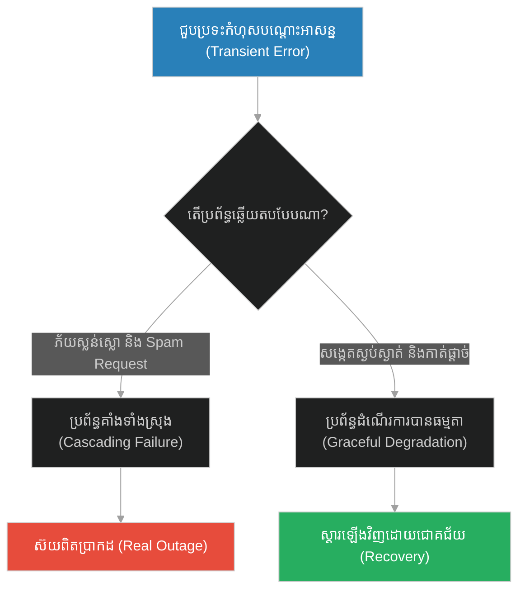
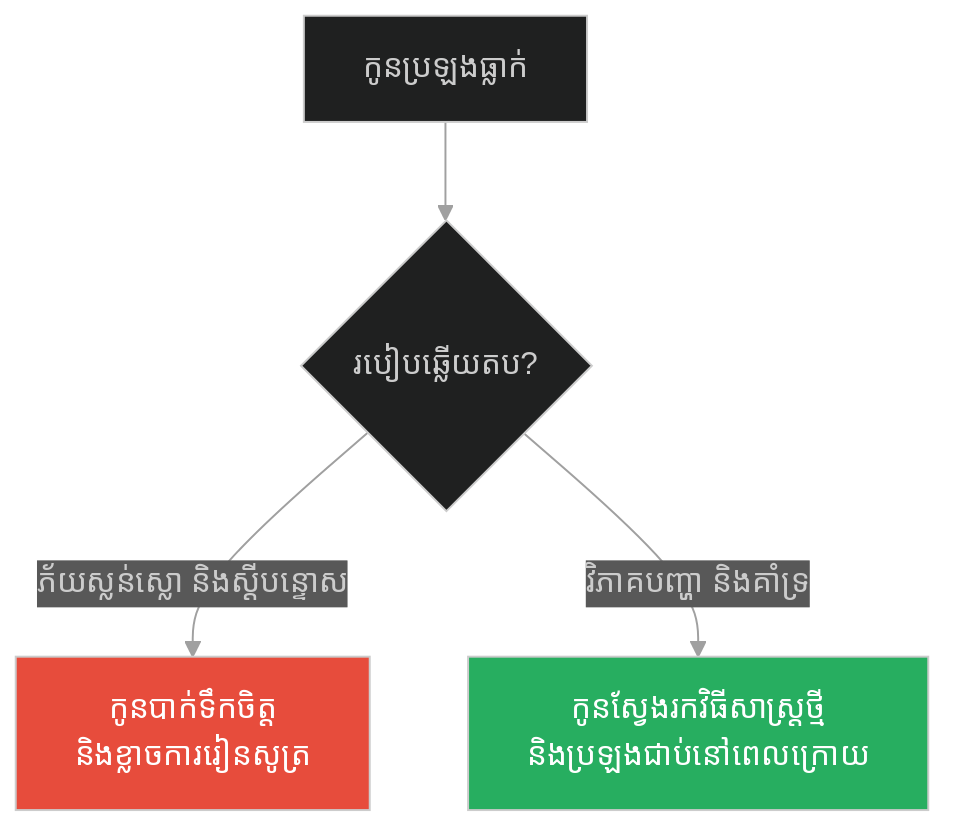
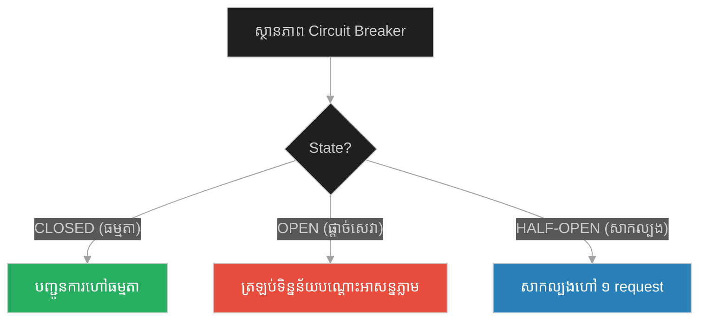
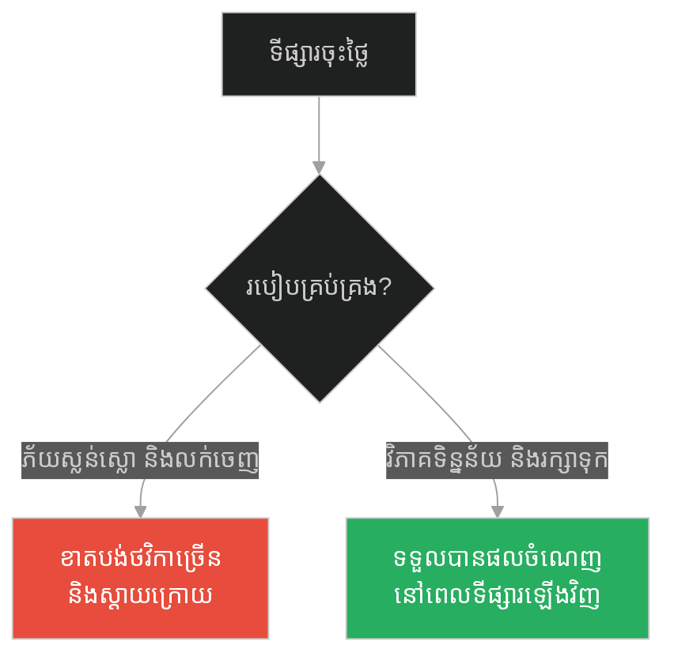
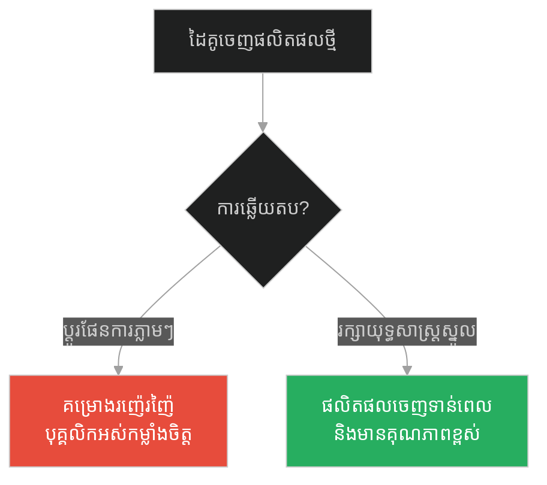
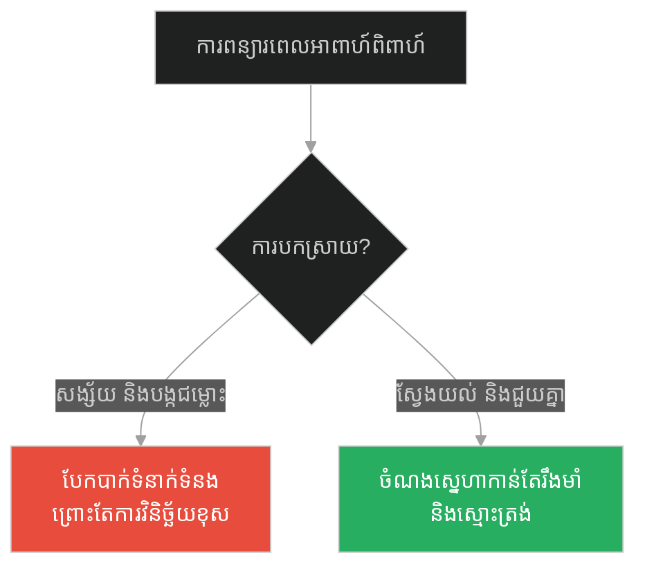
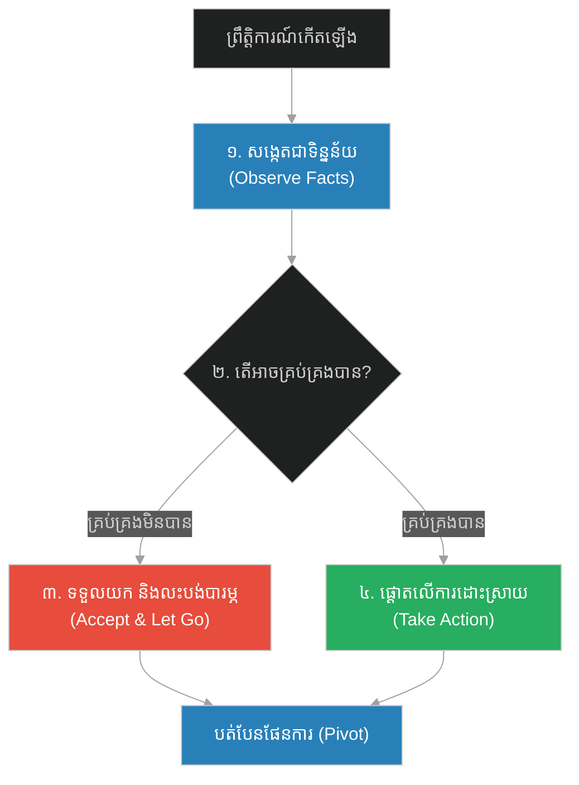

# Dichotomy of Control & Non-judgmental Observation (កសិករ និងសេះ)៖ ការបែងចែកការគ្រប់គ្រង និងការសង្កេតដោយមិនវិនិច្ឆ័យ (Dichotomy of Control & Non-judgmental Observation & The Farmer and His Horse)

**Author:** ichamrong  
**Date:** 2026-05-28  
**Tags:** #equanimity #stoicism #non-judgment #dichotomy-of-control #system-monitoring #resilience  
**Category:** Concepts  
**Read Time:** ~15 min  

---

## 📌 មាតិកា (Table of Contents)
- [អន្ទាក់ផ្លូវចិត្ត (The Trap)](#0)
- [១. រឿងព្រេងនិទាន៖ កសិករ និងសេះរត់បាត់ (The Legend of the Farmer and His Horse)](#1)
  - [សំណាង ឬស៊យ៖ រង្វង់នៃជីវិត (Good or Bad: The Cycle of Life)](#1-1)
- [២. បញ្ហា៖ ការវិនិច្ឆ័យលឿនពេក និងការគ្រប់គ្រងហួសដែនសមត្ថភាព (The Issue: Premature Judgment & Illusions of Control)](#2)
- [៣. ឧទាហរណ៍ជាក់ស្តែងក្នុងពិភពពិត (Real World Examples)](#3)
  - [ឧទាហរណ៍ទី ១ — កម្រិតស្រាល (គ្រួសារ)៖ ការឆ្លើយតបនឹងការប្រឡងធ្លាក់របស់កូន (Parental Response to Academic Failures)](#3-1)
  - [ឧទាហរណ៍ទី ២ — កម្រិតមធ្យម (បច្ចេកទេស)៖ ការធ្លាក់ចុះសេវាបណ្តោះអាសន្ន និងការឆ្លើយតបរបស់ប្រព័ន្ធ (Transient Network Failures & Circuit Breaker)](#3-2)
  - [ឧទាហរណ៍ទី ៣ — កម្រិតមធ្យម (ធុរកិច្ច)៖ ការប្រែប្រួលនៃទីផ្សារភាគហ៊ុន និងសេដ្ឋកិច្ច (Market Fluctuations & Entrepreneurial Calm)](#3-3)
  - [ឧទាហរណ៍ទី ៤ — កម្រិតមធ្យម (សង្គម/គ្រប់គ្រង)៖ របាយការណ៍កំហុស និងការផ្លាស់ប្តូរផែនការគម្រោង (Project Re-planning & Scope Creep)](#3-4)
  - [ឧទាហរណ៍ទី ៥ — កម្រិតធ្ងន់ (ទំនាក់ទំនង)៖ ការបែកបាក់ ឬការយឺតយ៉ាវនៃអាពាហ៍ពិពាហ៍ (Relationship Delays & Breakups)](#3-5)
- [៤. ដំណោះស្រាយទូទៅ៖ ការអនុវត្ត «ឧបេក្ខា» និង «ការវិនិច្ឆ័យដោយភាពស្ងប់ស្ងៀម» (The General Solution: Equanimity & Dichotomy of Control)](#4)
- [សេចក្តីសន្និដ្ឋាន (Conclusion)](#5)
- [ឯកសារយោង (References)](#6)
- [Related Posts](#7)

---

<a id="0"></a>
## អន្ទាក់ផ្លូវចិត្ត (The Trap)

នៅពេលដែលព្រឹត្តិការណ៍មិនល្អមួយកើតឡើង តើអ្នកប្រញាប់សន្និដ្ឋានភ្លាមថាវាជា «គ្រោះមហន្តរាយ» ឬទេ? ឬនៅពេលជួបរឿងល្អ តើអ្នកលោតកញ្ជ្រោលសប្បាយចិត្តហួសហេតុ ដោយមិនបានគិតពីការប្រែប្រួលទៅថ្ងៃក្រោយ? នេះគឺជាអន្ទាក់នៃការវិនិច្ឆ័យលឿនពេក និងការភ័យស្លន់ស្លោចំពោះរឿងដែលយើងមិនអាចគ្រប់គ្រងបាន។

* **Side A (The Trap):** ការប្រញាប់វិនិច្ឆ័យព្រឹត្តិការណ៍ភ្លាមៗ (Judging) ថាល្អ ឬអាក្រក់ និងការព្យាយាមគ្រប់គ្រងរាល់កត្តាខាងក្រៅ នាំឱ្យកើតមានការភ័យស្លន់ស្លោ និងការសម្រេចចិត្តខុសឆ្គង។
* **Side B (Resilient Pattern):** ការរក្សាចិត្តឱ្យស្ងប់ និងសង្កេតមើលព្រឹត្តិការណ៍ដោយមិនកាត់សេចក្តី (Non-judgmental Observation) ដោយផ្តោតលើអ្វីដែលយើងអាចគ្រប់គ្រងបាន (Dichotomy of Control)។

នៅក្នុងអត្ថបទនេះ យើងនឹងសិក្សាអំពី៖
1. **រឿងព្រេងនិទាន (The Legend)** — ទស្សនវិជ្ជារបស់កសិករចិនដែលឆ្លើយតបនឹងរាល់ស្ថានភាពដោយពាក្យថា «ប្រហែលអញ្ចឹង»។
2. **បញ្ហា (The Issue)** — ការវិភាគការភ័យស្លន់ស្លោរបស់មនុស្ស និងប្រព័ន្ធបច្ចេកវិទ្យាចំពោះកំហុសបណ្តោះអាសន្ន (Transient Errors)។
3. **ការអនុវត្តជាក់ស្តែង (Real World Examples)** — ការប្រៀបធៀបករណីសិក្សាទាំង ៥ កម្រិត ចាប់ពីកម្រិតគ្រួសាររហូតដល់កម្រិតរៀបចំប្រព័ន្ធ Circuit Breaker ក្នុងកូដ។
4. **ដំណោះស្រាយទូទៅ (The General Solution)** — ការអនុវត្តសិល្បៈ Stoic-Buddhist ក្នុងការគ្រប់គ្រង និងការសង្កេត។

---

<a id="1"></a>
## ១. រឿងព្រេងនិទាន៖ កសិករ និងសេះរត់បាត់ (The Legend of the Farmer and His Horse)

កាលពីរាប់ពាន់ឆ្នាំមុន នៅតាមព្រំដែនប្រទេសចិន មានកសិករចំណាស់ម្នាក់រស់នៅជាមួយកូនប្រុសរបស់គាត់។ ពួកគេមានសក្ដានុពលតែមួយគត់សម្រាប់ជាទ្រព្យសម្បត្តិ និងជាឧបករណ៍ធ្វើស្រែ គឺសេះដ៏ល្អប្រណិតមួយក្បាល។

ថ្ងៃមួយ សេះនោះបានរត់បាត់ចូលទៅក្នុងភ្នំ។ អ្នកភូមិទាំងអស់ដឹងដំណឹង ក៏នាំគ្នាដើរមកផ្ទះកសិករ រួចសម្តែងការសោកស្តាយថា៖
> «លោកតាស៊យខ្លាំងណាស់! សេះដ៏ល្អតែមួយគត់ដែលជាកម្លាំងសម្រាប់ធ្វើស្រែបែរជារត់បាត់ទៅហើយ។ ជីវិតលោកតាច្បាស់ជាលំបាកខ្លាំងណាស់ចាប់ពីពេលនេះទៅ!»

កសិករចំណាស់បានតបទៅវិញយ៉ាងស្ងប់ស្ងាត់ថា៖ **«ប្រហែលអញ្ចឹង (Maybe)»**។

<a id="1-1"></a>
### សំណាង ឬស៊យ៖ រង្វង់នៃជីវិត (Good or Bad: The Cycle of Life)

មួយសប្តាហ៍ក្រោយមក ស្រាប់តែសេះនោះបានរត់ត្រឡប់មកវិញ។ ហើយអ្វីដែលគួរឱ្យភ្ញាក់ផ្អើលបំផុតនោះគឺ វាបាននាំសេះព្រៃដ៏រឹងមាំ និងស្រស់ស្អាត ៣ ក្បាលផ្សេងទៀតមកជាមួយផង។ អ្នកភូមិដឹងរឿង ក៏រត់មកអបអរសាទរដោយក្តីរំភើប៖
> «លោកតាសំណាងណាស់! បាត់សេះមួយក្បាល តែបានសេះដ៏ល្អមកវិញរហូតដល់ទៅ ៤ ក្បាល។ ឥឡូវលោកតាក្លាយជាអ្នកមានប្រចាំភូមិហើយ!»

កសិករចំណាស់នៅតែឆ្លើយតបដោយស្នាមញញឹមស្ងប់ស្ងាត់ថា៖ **«ប្រហែលអញ្ចឹង (Maybe)»**។

ប៉ុន្មានថ្ងៃក្រោយមក កូនប្រុសរបស់គាត់បានឡើងជិះសេះព្រៃមួយក្បាលនោះដើម្បីផ្សាំងវា។ ប៉ុន្តែសេះព្រៃបានទាត់កូនប្រុសគាត់ធ្លាក់ បណ្តាលឱ្យបាក់ជើងទាំងសងខាង ដើរលែងរួច។ អ្នកភូមិក៏មកនិយាយសម្តែងការអាណិតអាសូរម្តងទៀត៖
> «ស៊យខ្លាំងណាស់លោកតា! កូនប្រុសពេញកម្លាំងតែម្នាក់គត់ បែរជាមកបាក់ជើងដើរមិនរួចទៅហើយ។ តើអ្នកណានឹងជួយធ្វើស្រែជំនួសលោកតាទៅ?»

កសិករនៅតែតបដដែល៖ **«ប្រហែលអញ្ចឹង (Maybe)»**។

មួយសប្តាហ៍ក្រោយមក មានសង្គ្រាមធំមួយបានផ្ទុះឡើងតាមព្រំដែន។ ទាហានរាជការបានចុះមកកេណ្ឌយុវជនទាំងអស់នៅក្នុងភូមិឱ្យទៅធ្វើសឹក។ យុវជនទាំងឡាយត្រូវបានបញ្ជូនទៅសមរភូមិ ហើយស្ទើរតែទាំងអស់បានបាត់បង់ជីវិត។ ប៉ុន្តែដោយសារតែកូនប្រុសរបស់កសិករចំណាស់មានរបួសបាក់ជើង ទាហានមិនអាចយកទៅបានឡើយ ធ្វើឱ្យរូបគេអាចរួចជីវិត និងរស់នៅជាមួយគ្រួសារដោយសន្តិភាព។

អ្នកភូមិដែលនៅសេសសល់បានមកនិយាយ៖ «លោកតាសំណាងណាស់ដែលកូនរួចជីវិត!»។ កសិករក៏នៅតែឆ្លើយតបដដែល៖ **«ប្រហែលអញ្ចឹង (Maybe)»**។

---

<a id="2"></a>
## ២. បញ្ហា៖ ការវិនិច្ឆ័យលឿនពេក និងការគ្រប់គ្រងហួសដែនសមត្ថភាព (The Issue: Premature Judgment & Illusions of Control)

នៅក្នុងជីវិត និងការរចនាប្រព័ន្ធបច្ចេកវិទ្យា យើងតែងតែចង់វិនិច្ឆ័យព្រឹត្តិការណ៍នីមួយៗភ្លាមៗ។ 

* នៅក្នុងប្រព័ន្ធកុំព្យូទ័រ៖ នៅពេលដែលប្រព័ន្ធជួបប្រទះការធ្លាក់ចុះល្បឿនបណ្តោះអាសន្ន (Transient Error) ដូចជាបណ្តាញអ៊ីនធឺណិតយឺត (Network Spike) ឬ Timeout។ ប្រសិនបើប្រព័ន្ធឆ្លើយតបដោយការភ័យស្លន់ស្លោ (Panic) ដូចជាការបិទកម្មវិធីទាំងស្រុង ឬការបាញ់ Request ទៅកាន់ Database ម្តងហើយម្តងទៀត វានឹងបង្កើតជា **Cascading Failure** ធ្វើឱ្យប្រព័ន្ធទាំងមូលគាំងបាត់។
* ដំណោះស្រាយគឺ **Circuit Breaker Pattern** និង **Retry with Exponential Backoff**៖ ការសង្កេតកំហុសដោយស្ងប់ស្ងៀម ដាច់ចិត្តកាត់ផ្តាច់សេវាបណ្តោះអាសន្ន និងរង់ចាំឱ្យប្រព័ន្ធស្ដារឡើងវិញដោយខ្លួនឯង ដោយមិនប្រញាប់បិទកម្មវិធីចោល។



---

<a id="3"></a>
## ៣. ឧទាហរណ៍ជាក់ស្តែងក្នុងពិភពពិត

<a id="3-1"></a>
### ឧទាហរណ៍ទី ១ — កម្រិតស្រាល (គ្រួសារ)៖ ការឆ្លើយតបនឹងការប្រឡងធ្លាក់របស់កូន (Parental Response to Academic Failures)

* **Dilemma:** កូនប្រឡងធ្លាក់មុខវិជ្ជាគណិតវិទ្យា។ ឪពុកម្តាយភ័យស្លន់ស្លោ គិតថាកូនគ្មានវាសនាចូលសកលវិទ្យាល័យ និងចាប់ផ្តើមស្តីបន្ទោសយ៉ាងធ្ងន់ធ្ងរ។
* **Good Choice:** សង្កេតលទ្ធផលដោយមិនកាត់សេចក្តី ពិភាក្សាជាមួយកូនដើម្បីរកមូលហេតុ និងរៀបចំកាលវិភាគសិក្សាឡើងវិញ (ផ្តោតលើការកែលម្អដែលគ្រប់គ្រងបាន)។



---

<a id="3-2"></a>
### ឧទាហរណ៍ទី ២ — កម្រិតមធ្យម (បច្ចេកទេស)៖ ការធ្លាក់ចុះសេវាបណ្តោះអាសន្ន និងការឆ្លើយតបរបស់ប្រព័ន្ធ (Transient Network Failures & Circuit Breaker)

នៅក្នុងការហៅទៅកាន់ API ខាងក្រៅ ប្រសិនបើសេវាខាងក្រៅដើរយឺត ហើយប្រព័ន្ធរបស់យើងមិនព្រមឈប់ហៅ (Retry blockingly) វានឹងស៊ី Resource ម៉ាស៊ីនអស់ បណ្តាលឱ្យគាំងប្រព័ន្ធខ្លួនឯង។

#### Fragile Code (Panicked Retry Block):
```python
import time

def call_third_party_api():
    # ឧបមាថា API ខាងក្រៅដើរយឺត ឬគាំង
    raise ConnectionError("API is down")

def get_payment_details_fragile():
    # ព្យាយាមហៅដោយគ្មានព្រំដែន និងគ្មានពេលសម្រាក (Panic retry)
    # នេះដូចជាអ្នកភូមិដែលភ័យស្លន់ស្លោភ្លាមៗ
    while True:
        try:
            return call_third_party_api()
        except ConnectionError:
            print("API failed, retrying immediately...")
            time.sleep(0.1) # Spamming the server
```

#### Resilient Code (Circuit Breaker Pattern - Non-judgmental & Equanimity):
```python
import time

class CircuitBreakerOpenException(Exception):
    pass

class CircuitBreaker:
    def __init__(self, failure_threshold=3, recovery_time=5):
        self.failure_threshold = failure_threshold
        self.recovery_time = recovery_time
        self.failure_count = 0
        self.state = "CLOSED" # CLOSED, OPEN, HALF-OPEN
        self.last_state_change = time.time()

    def call(self, func, *args, **kwargs):
        # បើ Circuit កំពុងបើក (OPEN) កុំទាន់ហៅ API ខាងក្រៅ (សន្សំកម្លាំង)
        if self.state == "OPEN":
            if time.time() - self.last_state_change > self.recovery_time:
                self.state = "HALF-OPEN"
                print("Circuit is HALF-OPEN, testing connection...")
            else:
                raise CircuitBreakerOpenException("Circuit is open. Refusing to call service.")

        try:
            result = func(*args, **kwargs)
            self.failure_count = 0
            self.state = "CLOSED"
            return result
        except Exception as e:
            self.failure_count += 1
            print(f"Failure recorded ({self.failure_count}/{self.failure_threshold})")
            if self.failure_count >= self.failure_threshold:
                self.state = "OPEN"
                self.last_state_change = time.time()
                print("Circuit tripped to OPEN state (Non-judgmental pause)")
            raise e
```



---

<a id="3-3"></a>
### ឧទាហរណ៍ទី ៣ — កម្រិតមធ្យម (ធុរកិច្ច)៖ ការប្រែប្រួលនៃទីផ្សារភាគហ៊ុន និងសេដ្ឋកិច្ច (Market Fluctuations & Entrepreneurial Calm)

* **Dilemma:** សហគ្រិនដែលលក់ភាគហ៊ុនទាំងអស់របស់ខ្លួនចោលក្នុងតម្លៃថោក ព្រោះតែទីផ្សារធ្លាក់ចុះ ២០% ក្នុងមួយសប្តាហ៍ បង្កើតជាការខាតបង់ធំធេងដោយសារតែការភ័យស្លន់ស្លោ។
* **Good Choice:** ការសង្កេតទីផ្សារដោយរក្សាចិត្តស្ងប់ វិភាគលើទិន្នន័យមូលដ្ឋានគ្រឹះរបស់អាជីវកម្ម និងរក្សាទុនបម្រុងសម្រាប់ឱកាសទិញចូលវិញ។



---

<a id="3-4"></a>
### ឧទាហរណ៍ទី ៤ — កម្រិតមធ្យម (សង្គម/គ្រប់គ្រង)៖ របាយការណ៍កំហុស និងការផ្លាស់ប្តូរផែនការគម្រោង (Project Re-planning & Scope Creep)

* **Dilemma:** មេដឹកនាំគម្រោងដែលផ្លាស់ប្តូរយុទ្ធសាស្ត្រក្រុមហ៊ុនរៀងរាល់ពេលដែលដៃគូប្រកួតប្រជែងចេញមុខងារថ្មី ធ្វើឱ្យបុគ្គលិកហត់នឿយ និងគម្រោងមិនដែលត្រូវបានបញ្ចប់។
* **Good Choice:** ការផ្តោតលើចំណុចខ្លាំងរបស់ខ្លួន សង្កេតមើលយុទ្ធសាស្ត្រដៃគូដោយមិនភ័យស្លន់ស្លោ និងធ្វើការកែសម្រួលផែនការប្រចាំត្រីមាសដោយមានសណ្តាប់ធ្នាប់។



---

<a id="3-5"></a>
### ឧទាហរណ៍ទី ៥ — កម្រិតធ្ងន់ (ទំនាក់ទំនង)៖ ការបែកបាក់ ឬការយឺតយ៉ាវនៃអាពាហ៍ពិពាហ៍ (Relationship Delays & Breakups)

* **Dilemma:** ដៃគូដែលគិតថាកិច្ចសន្យាអាពាហ៍ពិពាហ៍ត្រូវពន្យារពេល គឺជាសញ្ញានៃការលែងស្រឡាញ់គ្នា រួចចាប់ផ្តើមសង្ស័យ និងបង្កជម្លោះរហូតដល់បែកបាក់។
* **Good Choice:** ទទួលយកការយឺតយ៉ាវដោយក្តីយល់ចិត្ត សង្កេតមើលស្ថានភាពជាក់ស្តែង (ឧ. បញ្ហាហិរញ្ញវត្ថុ ឬគ្រួសារ) និងរួមគ្នាដោះស្រាយបញ្ហាជាជាងការកាត់សេចក្តី។



---

<a id="4"></a>
## ៤. ដំណោះស្រាយទូទៅ៖ ការអនុវត្ត «ឧបេក្ខា» និង «ការវិនិច្ឆ័យដោយភាពស្ងប់ស្ងៀម» (The General Solution: Equanimity & Dichotomy of Control)

ដើម្បីកសាងភាពធន់ផ្លូវចិត្ត និងស្ថិរភាពប្រព័ន្ធ យើងត្រូវប្រើប្រាស់យុទ្ធសាស្ត្រ **Stoic-Buddhist Response System** ៤ ជំហាន៖

1. **Observe Without Labeling (សង្គមដោយមិនបិទស្លាក):** នៅពេលជួបព្រឹត្តិការណ៍ណាមួយ ចូរមើលវាជា «ទិន្នន័យ (Data)» ឬជា «អង្គហេតុ (Fact)» ជាជាងការប្រញាប់ដាក់ស្លាកថាល្អ ឬអាក្រក់។
2. **Apply the Dichotomy of Control (បែងចែកការគ្រប់គ្រង):** សួរខ្លួនឯងថា៖ «តើរឿងនេះខ្ញុំអាចគ្រប់គ្រងបាន (សកម្មភាពខ្លួនឯង ផ្នត់គំនិត) ឬមិនអាចគ្រប់គ្រងបាន (សកម្មភាពអ្នកដទៃ អាកាសធាតុ ទីផ្សារ)?»
3. **Control the Controllable (ផ្តោតលើអ្វីដែលគ្រប់គ្រងបាន):** បោះបង់ក្តីបារម្ភចំពោះរឿងដែលមិនអាចគ្រប់គ្រងបាន រួចដាក់ថាមពលទាំងអស់ទៅលើអ្វីដែលយើងអាចធ្វើបាន។
4. **Accept and Pivot (ទទួលយក និងបត់បែន):** ទទួលយកលទ្ធផលដែលកើតឡើងដោយចិត្តស្ងប់ (ឧបេក្ខា) រួចបត់បែនយុទ្ធសាស្ត្រទៅតាមស្ថានភាពជាក់ស្តែង។



---

## 🐇 ធ្លាក់ចូលក្នុងរន្ធទន្សាយ (Enter the Rabbit Hole)
ដើម្បីស្វែងយល់បន្ថែមអំពីរបៀបកសាងគ្រឹះរឹងមាំរយៈពេលវែង ទោះបីជាមិនទាន់ឃើញលទ្ធផលភ្លាមៗក៏ដោយ សូមបន្តដំណើរទៅកាន់អត្ថបទបន្ទាប់៖

* 🚀 **[ចាប់ផ្តើមដំណើររុករក (Start the Journey) ➔ Latent Growth & Long-term Infrastructure (ដើមឫស្សីចិន)](./169-buddha-and-the-chinese-bamboo.md)**

---

<a id="5"></a>
## សេចក្តីសន្និដ្ឋាន (Conclusion)

> **«វាមិនមែនជាអ្វីដែលកើតឡើងចំពោះអ្នកនោះទេ ប៉ុន្តែវាជាវិធីដែលអ្នកឆ្លើយតបទៅនឹងវា ទើបជាអ្វីដែលសំខាន់។» — Epictetus**

ជីវិតគឺជារង្វង់នៃព្រឹត្តិការណ៍ដែលតភ្ជាប់គ្នាឥតឈប់ឈរ។ ការវិនិច្ឆ័យថាចំណុចមួយនៅក្នុងខ្សែរឿងជាគ្រោះមហន្តរាយ គឺជារឿងល្ងង់ខ្លៅ ព្រោះយើងមិនទាន់ឃើញទីបញ្ចប់នៃសាច់រឿងឡើយ។ ចូររៀនឆ្លើយតបនឹងស្ថានភាពដោយចិត្តស្ងប់ស្ងៀមថា «ប្រហែលអញ្ចឹង» រួចផ្តោតថាមពលរបស់អ្នកទៅលើអ្វីដែលអ្នកអាចធ្វើបាននៅថ្ងៃនេះ។

---

<a id="6"></a>
## ឯកសារយោង (References)

* **Epictetus** — *Enchiridion (The Handbook)* (135 AD). The foundational Stoic text detailing the Dichotomy of Control.
* **Lao Tzu** — *Tao Te Ching* (6th Century BC). Classic Taoist philosophy on non-action (Wu Wei) and equanimity.
* **Nygard, Michael T.** — *Release It!: Design and Deploy Production-Ready Software* (2007). Detailing the Circuit Breaker pattern.

---

<a id="7"></a>
## Related Posts

* [Necessary Struggles & Rescue Trap / Micromanagement (មេអំបៅ និងដូងកុក)៖ ភាពចាំបាច់នៃការតស៊ូ](./167-buddha-and-the-struggling-butterfly.md) — ស្វែងយល់ពីរបៀបជៀសវាងអន្ទាក់នៃការជួយសង្គ្រោះហួសហេតុ។
* [Latent Growth & Long-term Infrastructure (ដើមឫស្សីចិន)៖ ការលូតលាស់ដែលមើលមិនឃើញ](./169-buddha-and-the-chinese-bamboo.md) — ស្វែងយល់ពីរបៀបរក្សាភាពអត់ធ្មត់ក្នុងការកសាងគ្រឹះរឹងមាំ។
