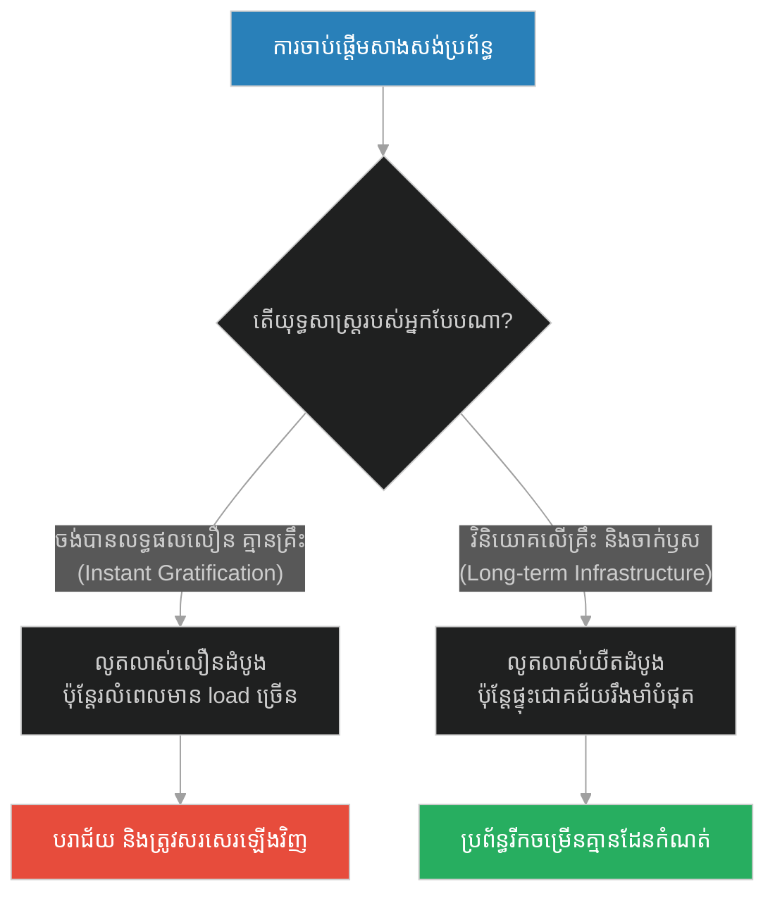
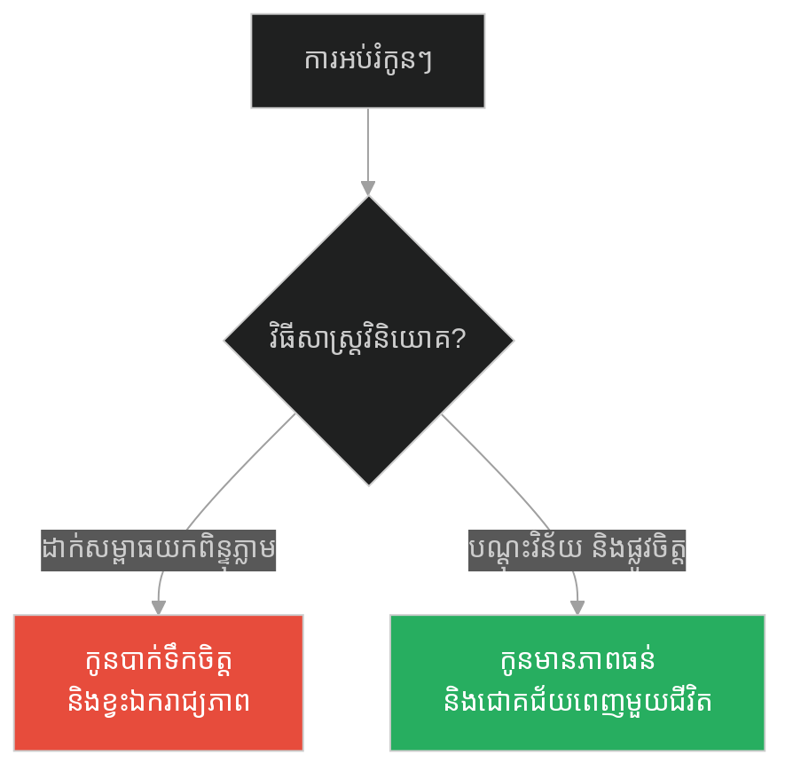
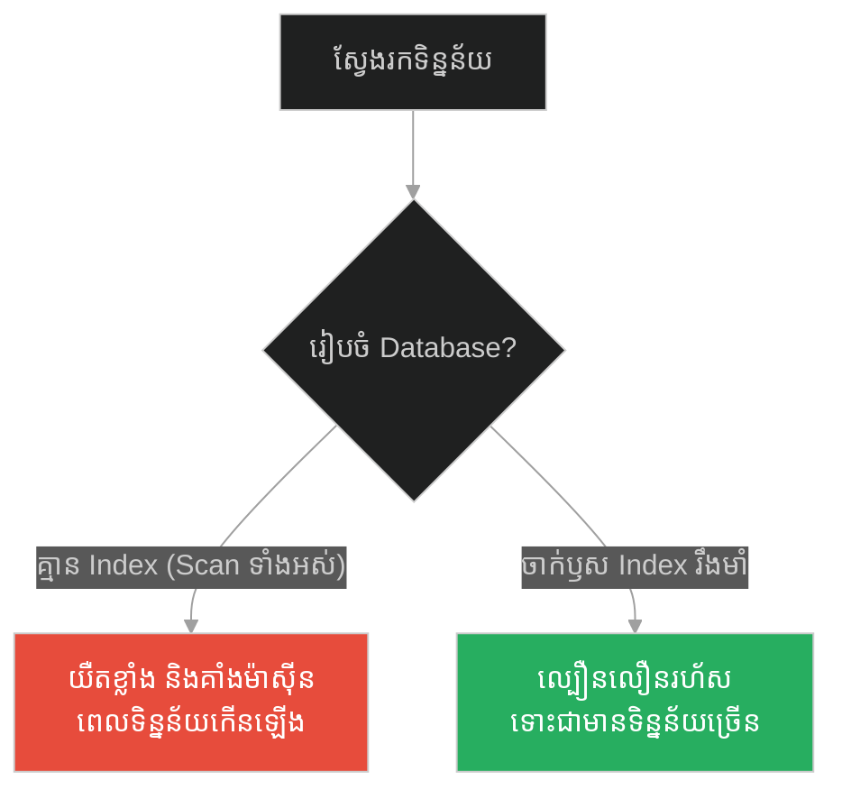
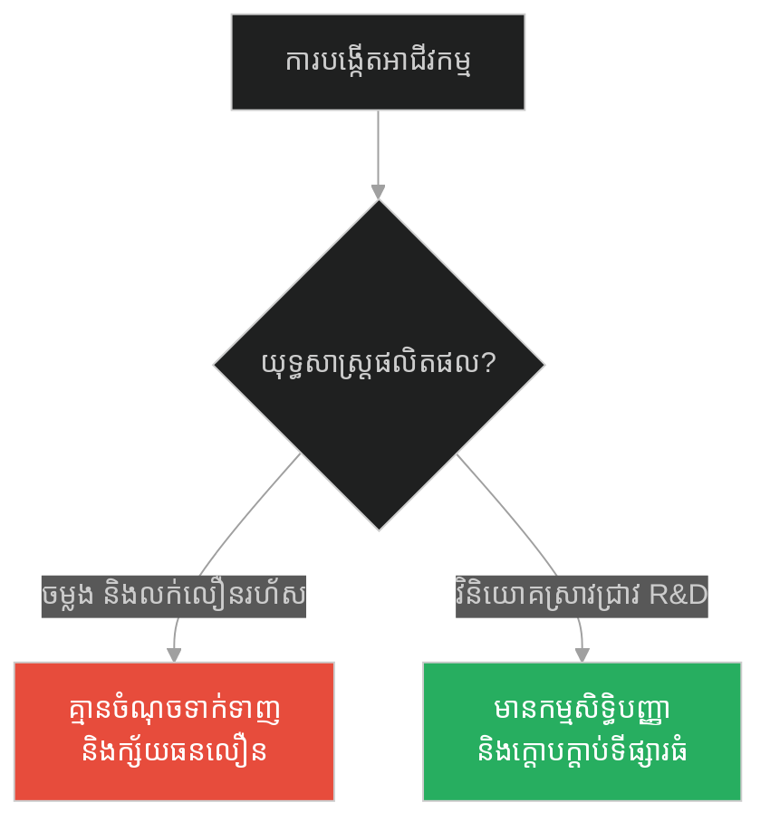
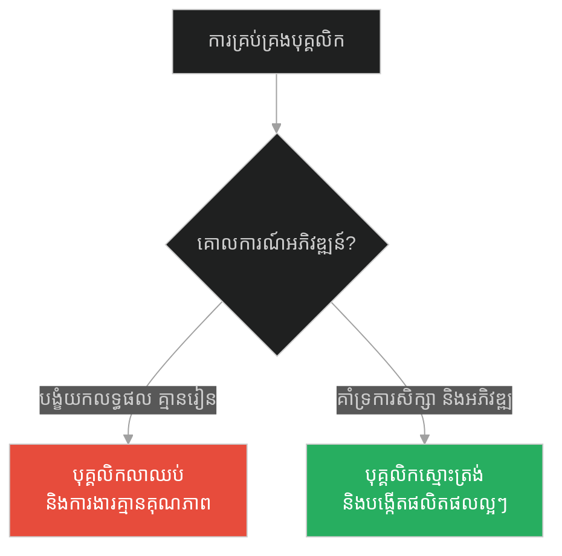
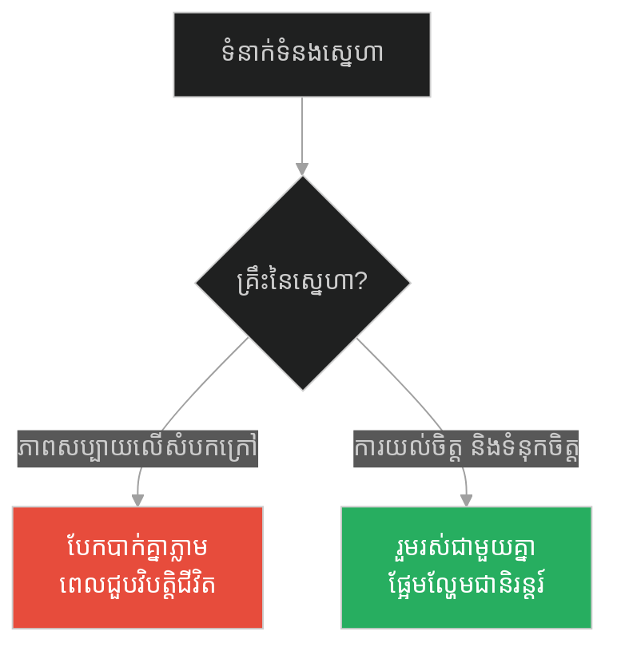
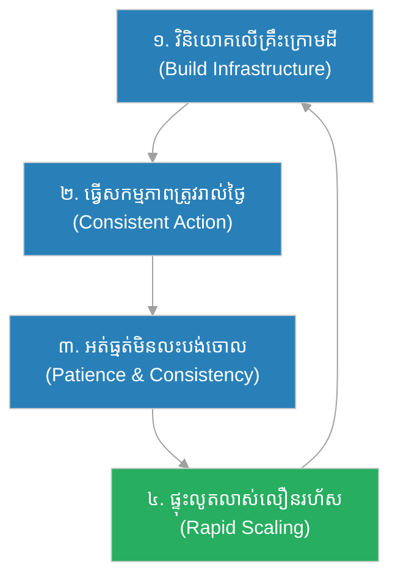

# Latent Growth & Long-term Infrastructure (ដើមឫស្សីចិន)៖ ការលូតលាស់បង្កប់ និងហេដ្ឋារចនាសម្ព័ន្ធរយៈពេលវែង (Latent Growth & Long-term Infrastructure & The Chinese Bamboo Tree)

**Author:** ichamrong  
**Date:** 2026-05-28  
**Tags:** #patience #long-term-investment #infrastructure #delayed-gratification #database-indexing #resilience  
**Category:** Concepts  
**Read Time:** ~15 min  

---

## 📌 មាតិកា (Table of Contents)
- [អន្ទាក់ផ្លូវចិត្ត (The Trap)](#0)
- [១. រឿងព្រេងធម្មជាតិ៖ ដើមឫស្សីចិន (The Legend of the Chinese Bamboo Tree)](#1)
  - [ការចាក់ឫសក្រោមដី (The Hidden Root System)](#1-1)
- [២. បញ្ហា៖ ភាពអត់ធ្មត់ និងគ្រោះថ្នាក់នៃលទ្ធផលភ្លាមៗ (The Issue: Impatience & The Danger of Instant Gratification)](#2)
- [៣. ឧទាហរណ៍ជាក់ស្តែងក្នុងពិភពពិត (Real World Examples)](#3)
  - [ឧទាហរណ៍ទី ១ — កម្រិតស្រាល (គ្រួសារ)៖ ការអប់រំ និងការវិនិយោគលើកូនៗ (Long-term Family Investment)](#3-1)
  - [ឧទាហរណ៍ទី ២ — កម្រិតមធ្យម (បច្ចេកទេស)៖ ការកសាងហេដ្ឋារចនាសម្ព័ន្ធទិន្នន័យ និងសន្ទស្សន៍ (Database Indexing & Infrastructure Bottlenecks)](#3-2)
  - [ឧទាហរណ៍ទី ៣ — កម្រិតមធ្យម (ធុរកិច្ច)៖ ការបង្កើតបច្ចេកវិទ្យាស្នូល និងការស្រាវជ្រាវ (Deep Tech R&D vs. Instant Copycats)](#3-3)
  - [ឧទាហរណ៍ទី ៤ — កម្រិតមធ្យម (សង្គម/គ្រប់គ្រង)៖ វប្បធម៌បណ្តុះបណ្តាល និងអភិវឌ្ឍន៍ធនធានមនុស្ស (Employee Training & Skill Foundations)](#3-4)
  - [ឧទាហរណ៍ទី ៥ — កម្រិតធ្ងន់ (ទំនាក់ទំនង)៖ ការសាងទំនុកចិត្ត និងការយល់ចិត្តគ្នាយូរអង្វែង (Building Deep Trust in Marriage)](#3-5)
- [៤. ដំណោះស្រាយទូទៅ៖ យុទ្ធសាស្ត្រចាក់ឫសឫស្សី (The General Solution: The Bamboo Rooting Strategy)](#4)
- [សេចក្តីសន្និដ្ឋាន (Conclusion)](#5)
- [ឯកសារយោង (References)](#6)
- [Related Posts](#7)

---

<a id="0"></a>
## អន្ទាក់ផ្លូវចិត្ត (The Trap)

តើអ្នកធ្លាប់មានអារម្មណ៍បាក់ទឹកចិត្តនៅពេលដែលខំប្រឹងប្រែងធ្វើការងារ សិក្សា ឬសរសេរកូដរាល់ថ្ងៃ តែហាក់ដូចជាមិនទទួលបានលទ្ធផលភ្លាមៗដែរឬទេ? នេះគឺជាអន្ទាក់នៃការចង់បានលទ្ធផលភ្លាមៗ (Instant Gratification) ដែលធ្វើឱ្យយើងបោះបង់ចោលកិច្ចការធំៗ មុនពេលដែលវាអាចចាក់គ្រឹះបានរឹងមាំ។

* **Side A (The Trap):** ការចង់បានលទ្ធផលលឿនរហ័ស ដោយផ្តោតតែលើផ្ទៃខាងក្រៅ និងការមិនព្រមចំណាយពេលសាងសង់ហេដ្ឋារចនាសម្ព័ន្ធរឹងមាំ បង្កើតជាប្រព័ន្ធដែលងាយនឹងរលំរលាយនៅពេលជួបសម្ពាធ។
* **Side B (Resilient Pattern):** ការយល់ដឹងពីច្បាប់នៃការលូតលាស់បង្កប់ (Latent Growth) ដោយវិនិយោគពេលវេលា និងធនធានក្នុងការសាងសង់គ្រឹះ និងចាក់ឫសឱ្យជ្រៅ ទោះបីជាមិនទាន់លេចលទ្ធផលចេញមកក្រៅក៏ដោយ។

នៅក្នុងអត្ថបទនេះ យើងនឹងសិក្សារួមគ្នាអំពី៖
1. **រឿងព្រេងធម្មជាតិ (The Legend)** — ការលូតលាស់ដ៏អស្ចារ្យរបស់ដើមឫស្សីចិនបន្ទាប់ពីលាក់ខ្លួនក្រោមដី ៤ ឆ្នាំ។
2. **បញ្ហា (The Issue)** — ការវិភាគលើសារៈសំខាន់នៃហេដ្ឋារចនាសម្ព័ន្ធរយៈពេលវែង (Long-term Infrastructure) និងគ្រោះថ្នាក់នៃការរត់តាមលទ្ធផលបណ្តោះអាសន្ន។
3. **ការអនុវត្តជាក់ស្តែង (Real World Examples)** — ឧទាហរណ៍ជាក់ស្តែងទាំង ៥ កម្រិត ចាប់ពីកម្រិតគ្រួសាររហូតដល់ការរចនាសន្ទស្សន៍ទិន្នន័យ (Database Indexing)។
4. **ដំណោះស្រាយទូទៅ (The General Solution)** — វិធីសាស្ត្រអនុវត្តយុទ្ធសាស្ត្រចាក់ឫសឫស្សី។

---

<a id="1"></a>
## ១. រឿងព្រេងធម្មជាតិ៖ ដើមឫស្សីចិន (The Legend of the Chinese Bamboo Tree)

នៅក្នុងប្រទេសចិន មានដើមឈើមួយប្រភេទដែលត្រូវបានអ្នកថែសួន និងអ្នកលេងសិល្បៈ Bonsai ស្គាល់ច្បាស់ថាជា «ដើមឫស្សីចិន» (Chinese Bamboo Tree)។ ការដាំដើមឫស្សីប្រភេទនេះ គឺជារឿងមួយដែលសាកល្បងការអត់ធ្មត់ និងជំនឿចិត្តខ្លាំងបំផុតរបស់មនុស្ស។

នៅពេលដែលគ្រាប់ពូជឫស្សីចិនត្រូវបានកប់ទៅក្នុងដី អ្នកថែសួនត្រូវស្រោចទឹក ដាក់ជី និងថែទាំវារាល់ថ្ងៃដោយមិនអាចខកខានបានឡើយ៖
* **ឆ្នាំទី ១** ឆ្លងកាត់ផុតទៅ... គ្មានសញ្ញាអ្វីផុសចេញពីដីឡើយ សូម្បីតែពន្លកតូចមួយ។
* **ឆ្នាំទី ២** កន្លងផុតទៅ... ដីនៅតែស្ងាត់ជ្រងំដដែល។
* **ឆ្នាំទី ៣ និងទី ៤** ក៏បានកន្លងផុតទៅ... គ្មានពន្លក គ្មានស្លឹក គ្មានដើមអ្វីទាំងអស់ លេចឡើងលើផ្ទៃដី។

មនុស្សទូទៅដែលគ្មានការអត់ធ្មត់ ច្បាស់ជាសន្និដ្ឋានថាគ្រាប់ពូជនោះស្អុយរលួយ ឬពួកគេបានបរាជ័យបាត់ទៅហើយ រួចក៏បោះបង់ការស្រោចទឹកចោល។ ប៉ុន្តែអ្នកថែសួនដែលមានប្រាជ្ញា នៅតែបន្តការងារថែទាំរបស់ខ្លួនដោយមិនងាករេ។

<a id="1-1"></a>
### ការចាក់ឫសក្រោមដី (The Hidden Root System)

លុះចូលដល់ **ឆ្នាំទី ៥** ស្រាប់តែមានពន្លកតូចមួយផុសចេញពីដី។ ហើយរឿងដែលគួរឱ្យភ្ញាក់ផ្អើលបំផុតនោះគឺ ត្រឹមតែរយៈពេល **៦ សប្តាហ៍** ប៉ុណ្ណោះ បន្ទាប់ពីលេចចេញពីដី ដើមឫស្សីនោះបានលូតលាស់យ៉ាងលឿនរហូតដល់កម្ពស់ **ជាង ២៥ ម៉ែត្រ (៩០ ហ្វីត)**!

តើដើមឫស្សីចិនលូតលាស់កម្ពស់ ២៥ ម៉ែត្រ ក្នុងរយៈពេល ៦ សប្តាហ៍ ឬ ៥ ឆ្នាំ?

ចម្លើយគឺ៖ ៥ ឆ្នាំ។ ប្រសិនបើអ្នកថែសួនឈប់ស្រោចទឹកនៅឆ្នាំណាមួយក្នុងចំណោម ៤ ឆ្នាំដំបូង គ្រាប់ពូជនោះនឹងត្រូវងាប់ជាមិនខាន។ ក្នុងកំឡុងពេល ៤ ឆ្នាំដែលមនុស្សមើលមិនឃើញអ្វីសោះនោះ ដើមឫស្សីមិនបានគេងលក់ឡើយ គឺវាកំពុង **ចាក់ឫសយ៉ាងជ្រៅ ធំ និងក្រាស់ឃ្មឹកទៅក្នុងដីរាប់រយម៉ែត្រការ៉េ** ដើម្បីបង្កើតគ្រឹះដ៏រឹងមាំសម្រាប់ទ្រទ្រង់កម្ពស់ដ៏មហិមារបស់វានៅថ្ងៃអនាគត។ បើគ្មានប្រព័ន្ធឫសដ៏រឹងមាំនេះទេ វានឹងត្រូវរលំដួលភ្លាមៗនៅពេលដែលវាដុះខ្ពស់ជួបនឹងខ្យល់ព្យុះ។

---

<a id="2"></a>
## ២. បញ្ហា៖ ភាពអត់ធ្មត់ និងគ្រោះថ្នាក់នៃលទ្ធផលភ្លាមៗ (The Issue: Impatience & The Danger of Instant Gratification)

នៅក្នុងយុគសម័យឌីជីថល មនុស្សចង់បានលទ្ធផលភ្លាមៗ (Instant Gratification)។ យើងចង់ធ្វើអាជីវកម្មឱ្យមានប្រាក់ចំណេញក្នុងខែដំបូង ចង់សរសេរកម្មវិធីឱ្យបានលឿនបំផុតដោយមិនបាច់រៀបចំគ្រោងឆ្អឹង ឬរចនាសម្ព័ន្ធកូដច្បាស់លាស់។

* នៅក្នុងការរចនាប្រព័ន្ធ (System Design)៖ ការមិនព្រមវិនិយោគលើហេដ្ឋារចនាសម្ព័ន្ធច្បាស់លាស់ (ដូចជាការសរសេរ Unit Test, ការរៀបចំ Database Index, ការបែងចែក Clean Architecture) គឺដូចជាការចង់ឱ្យឫស្សីដុះខ្ពស់ដោយមិនបាច់ចាក់ឫស។
* ដំបូងឡើយ កម្មវិធីអាចលូតលាស់លឿន និងចេញមុខងារថ្មីៗបានច្រើន (ឆ្នាំដំបូង) ប៉ុន្តែនៅពេលដែលចំនួនអ្នកប្រើប្រាស់កើនឡើង ឬប្រព័ន្ធធំជាងមុន វានឹងរលំគាំងទាំងស្រុង ព្រោះគ្មានគ្រឹះមាំទប់ទល់។



---

<a id="3"></a>
## ៣. ឧទាហរណ៍ជាក់ស្តែងក្នុងពិភពពិត

<a id="3-1"></a>
### ឧទាហរណ៍ទី ១ — កម្រិតស្រាល (គ្រួសារ)៖ ការអប់រំ និងការវិនិយោគលើកូនៗ (Long-term Family Investment)

* **Dilemma:** មាតាបិតាដែលចង់ឱ្យកូនរៀនពូកែភ្លាមៗ ដោយបញ្ជូនទៅរៀនគួរគ្រប់ម៉ោង និងដាក់សម្ពាធដោយគ្មានការបណ្តុះគុណធម៌ និងសុខភាពផ្លូវចិត្ត បង្កើតជាក្មេងដែលស្ត្រេស និងបាក់ទឹកចិត្តពេលធំឡើង។
* **Good Choice:** ការចំណាយពេលរៀងរាល់ថ្ងៃបង្រៀនកូនពីគុណធម៌ វិន័យ សីលធម៌ និងការយល់ដឹងពីខ្លួនឯង (ចាក់ឫសផ្លូវចិត្ត) ទោះបីជាមិនទាន់ឃើញលទ្ធផលសិក្សាលេចធ្លោភ្លាមៗក៏ដោយ។



---

<a id="3-2"></a>
### ឧទាហរណ៍ទី ២ — កម្រិតមធ្យម (បច្ចេកទេស)៖ ការកសាងហេដ្ឋារចនាសម្ព័ន្ធទិន្នន័យ និងសន្ទស្សន៍ (Database Indexing & Infrastructure Bottlenecks)

នៅក្នុងការស្វែងរកទិន្នន័យអតិថិជន ប្រសិនបើយើងមិនព្រមបង្កើត Index ទេ កម្មវិធីដើរលឿនធម្មតាកាលពីទិន្នន័យនៅតិច។ ប៉ុន្តែនៅពេលទិន្នន័យឡើងដល់លានជួរ ប្រព័ន្ធនឹង Scan ពេញតារាង (Full Table Scan) ធ្វើឱ្យ CPU ឡើងដល់ 100% និងគាំងប្រព័ន្ធទាំងស្រុង។ ការបង្កើត Index ត្រូវការ Memory និងកម្លាំងសរសេរ (Write overhead) ដំបូង (ការចាក់ឫស) ប៉ុន្តែផ្តល់លទ្ធផល O(1) ឬ O(log N) ក្នុងការស្វែងរក។

#### Fragile Approach (Unindexed Search - O(N) Scan):
```python
# កម្មវិធីដែលគ្មាន Index គ្រឹះមិនមាំ (ដូចជាគ្មានឫស)
class UserDatabaseFragile:
    def __init__(self):
        self.users = [] # ផ្ទុកជា List ធម្មតា
        
    def add_user(self, user_id: int, email: str):
        self.users.append({"id": user_id, "email": email})
        
    def find_by_email(self, email: str):
        # ត្រូវដើរ Scan គ្រប់ Record ទាំងអស់ (Full Table Scan)
        # យឺតខ្លាំងណាស់នៅពេលមានទិន្នន័យរាប់លាន
        for user in self.users:
            if user["email"] == email:
                return user
        return None
```

#### Resilient Approach (Indexed Search - O(1) Hash Map - Bamboo Root):
```python
# កម្មវិធីដែលចាក់ឫស Index ត្រឹមត្រូវ (សន្សំកម្លាំងវែងឆ្ងាយ)
class UserDatabaseResilient:
    def __init__(self):
        self.users = []
        self.email_index = {} # បង្កើត Index ជំនួយ (ចាក់ឫស)
        
    def add_user(self, user_id: int, email: str):
        user = {"id": user_id, "email": email}
        self.users.append(user)
        # ចំណាយពេល និង Memory បន្តិចដើម្បីចាក់ឫស Index
        self.email_index[email] = user
        
    def find_by_email_resilient(self, email: str):
        # ស្វែងរកបានលឿនភ្លាមៗ O(1) ទោះបីជាទិន្នន័យកើនដល់លានជួរ
        return self.email_index.get(email, None)
```



---

<a id="3-3"></a>
### ឧទាហរណ៍ទី ៣ — កម្រិតមធ្យម (ធុរកិច្ច)៖ ការបង្កើតបច្ចេកវិទ្យាស្នូល និងការស្រាវជ្រាវ (Deep Tech R&D vs. Instant Copycats)

* **Dilemma:** ក្រុមហ៊ុនបច្ចេកវិទ្យាដែលមិនព្រមស្រាវជ្រាវ (R&D) តែរត់តាមការចម្លងផលិតផលអ្នកដទៃដើម្បីបានលក់លឿន។ នៅពេលទីផ្សារប្រែប្រួល ពួកគេគ្មានបច្ចេកវិទ្យាផ្ទាល់ខ្លួនសម្រាប់ការពារអាជីវកម្មឡើយ។
* **Good Choice:** ការវិនិយោគលើការស្រាវជ្រាវបច្ចេកវិទ្យាស្នូល (Core Tech) ទោះបីជាត្រូវចំណាយពេល ៣ ទៅ ៤ ឆ្នាំដំបូងដោយគ្មានប្រាក់ចំណេញ ប៉ុន្តែបង្កើតបានរបាំងប្រកួតប្រជែង (Competitive Moat) ដ៏រឹងមាំបំផុត។



---

<a id="3-4"></a>
### ឧទាហរណ៍ទី ៤ — កម្រិតមធ្យម (សង្គម/គ្រប់គ្រង)៖ វប្បធម៌បណ្តុះបណ្តាល និងអភិវឌ្ឍន៍ធនធានមនុស្ស (Employee Training & Skill Foundations)

* **Dilemma:** អ្នកគ្រប់គ្រងដែលបង្ខំឱ្យបុគ្គលិកធ្វើការថែមម៉ោងដើម្បីឱ្យទាន់ deadline ដោយមិនព្រមឱ្យពួកគេទៅរៀនវគ្គបណ្តុះបណ្តាល ធ្វើឱ្យគុណភាពការងារធ្លាក់ចុះ និងបុគ្គលិកលាឈប់ច្រើន។
* **Good Choice:** ការអនុញ្ញាតឱ្យបុគ្គលិកចំណាយពេល ១០% នៃម៉ោងការងារដើម្បីសិក្សា និងស្រាវជ្រាវបច្ចេកវិទ្យាថ្មី (ចាក់ឫសសមត្ថភាព) នាំឱ្យប្រសិទ្ធភាពការងារកើនឡើងទ្វេដងនាពេលអនាគត។



---

<a id="3-5"></a>
### ឧទាហរណ៍ទី ៥ — កម្រិតធ្ងន់ (ទំនាក់ទំនង)៖ ការសាងទំនុកចិត្ត និងការយល់ចិត្តគ្នាយូរអង្វែង (Building Deep Trust in Marriage)

* **Dilemma:** ទំនាក់ទំនងដែលកសាងឡើងលើភាពសប្បាយរីករាយបណ្តោះអាសន្ន និងការបង្ហាញរូបភាពស្អាតៗលើបណ្តាញសង្គម ដោយមិនព្រមជជែកគ្នាពីបញ្ហាស្នូល និងទំនុកចិត្ត ងាយនឹងបែកបាក់នៅពេលជួបវិបត្តិហិរញ្ញវត្ថុ។
* **Good Choice:** ការចំណាយពេលស្តាប់គ្នា យល់ចិត្ត និងរួមគ្នាឆ្លងកាត់ការលំបាក (ចាក់ឫសស្នេហា) បង្កើតបានជាចំណងអាពាហ៍ពិពាហ៍ដែលមិនអាចរង្គោះរង្គើបាន។



---

<a id="4"></a>
## ៤. ដំណោះស្រាយទូទៅ៖ យុទ្ធសាស្ត្រចាក់ឫសឫស្សី (The General Solution: The Bamboo Rooting Strategy)

ដើម្បីសាងសង់អ្វីមួយដែលអស្ចារ្យ និងរឹងមាំយូរអង្វែង យើងត្រូវអនុវត្តយុទ្ធសាស្ត្រ ៤ ជំហាន៖

1. **Commit to the Invisible Phase (ប្តេជ្ញាចិត្តនឹងដំណាក់កាលមើលមិនឃើញ):** ទទួលស្គាល់ និងទទួលយកថា ដំណាក់កាលដំបូងនៃការងារ ឬការសិក្សា គឺជាដំណាក់កាល «ចាក់ឫស» ដែលមិនទាន់ឃើញលទ្ធផល។
2. **Prioritize Long-Term Infrastructure (ផ្តល់អាទិភាពលើហេដ្ឋារចនាសម្ព័ន្ធ):** វិនិយោគលើការបង្កើតប្រព័ន្ធស្វ័យប្រវត្ត ការសរសេរតេស្ត និងការរៀបចំផែនការគ្រឹះ ទោះបីជាវាត្រូវចំណាយពេលយូរក៏ដោយ។
3. **Patience with Consistency (អត់ធ្មត់ដោយភាពស្មោះត្រង់):** បន្តស្រោចទឹក និងដាក់ជីរាល់ថ្ងៃ (ធ្វើសកម្មភាពត្រូវជាប្រចាំ) ទោះជាគ្មាននរណាម្នាក់មើលឃើញ ឬសរសើរក៏ដោយ។
4. **Prepare for the Growth Explosion (ត្រៀមខ្លួនសម្រាប់ការលូតលាស់លឿន):** នៅពេលដែលឫសរឹងមាំគ្រប់គ្រាន់ ប្រព័ន្ធនឹងលូតលាស់យ៉ាងលឿនបំផុត។ ត្រូវប្រាកដថាអ្នកត្រៀមខ្លួនរួចរាល់ដើម្បីទទួលយកកំណើននោះ។



---

## 🐇 ធ្លាក់ចូលក្នុងរន្ធទន្សាយ (Enter the Rabbit Hole)
ដើម្បីស្វែងយល់ពីរបៀបរៀបចំអាទិភាពការងារ និងចាត់ចែងពេលវេលាក្នុងជីវិតឱ្យមានប្រសិទ្ធភាពខ្ពស់បំផុត សូមបន្តដំណើរទៅកាន់៖

* 🚀 **[ចាប់ផ្តើមដំណើររុករក (Start the Journey) ➔ The Jar of Life (ក្រឡជីវិត)៖ ព្រះពុទ្ធ និងក្រឡជីវិត](./170-buddha-and-the-jar-of-rocks.md)**

---

<a id="5"></a>
## សេចក្តីសន្និដ្ឋាន (Conclusion)

> **«កុំមើលងាយថ្ងៃនៃការចាប់ផ្តើមតូចតាច ឬការងារដែលគ្មាននរណាមើលឃើញឡើយ។ ព្រោះគ្រឹះដែលកាន់តែជ្រៅ នឹងអាចទ្រទ្រង់កម្ពស់ដែលកាន់តែខ្ពស់។» — Unknown**

ការដុះកម្ពស់ ២៥ ម៉ែត្រ ក្នុងរយៈពេល ៦ សប្តាហ៍របស់ដើមឫស្សីចិន មិនមែនជាអព្ភូតហេតុចៃដន្យនោះទេ ប៉ុន្តែវាគឺជាលទ្ធផលនៃការចាក់ឫសដោយស្ងៀមស្ងាត់អស់រយៈពេល ៥ ឆ្នាំ។ ចូរឈប់បារម្ភពីការដែលគ្មានអ្នកដទៃមើលឃើញលទ្ធផលការងាររបស់អ្នកនៅថ្ងៃនេះទៅ។ ចូរផ្តោតលើការចាក់ឫសរបស់អ្នកឱ្យជ្រៅបំផុតចុះ ព្រោះពេលវេលារបស់អ្នកនឹងមកដល់ជាមិនខាន។

---

<a id="6"></a>
## ឯកសារយោង (References)

* **Clear, James** — *Atomic Habits: An Easy & Proven Way to Build Good Habits & Break Bad Ones* (2018). Discusses the Plateau of Latent Potential which aligns with the Chinese Bamboo metaphor.
* **Covey, Stephen R.** — *The 7 Habits of Highly Effective People* (1989). Focuses on investing in Capability (Production Capability) rather than just immediate results.
* **Lury, E. B.** — *Pioneers of Botanical Infrastructure* (2011). A scientific study on how plants manage nutrient flow to root development before shoot elongation.

---

<a id="7"></a>
## Related Posts

* [Dichotomy of Control & Non-judgmental Observation (កសិករ និងសេះ)៖ ការមិនប្រញាប់កាត់សេចក្តី](./168-buddha-and-the-farmer-and-horse.md) — ស្វែងយល់ពីការរក្សាចិត្តឱ្យស្ងប់ចំពោះរាល់ការប្រែប្រួលរវាងសំណាង និងស៊យ។
* [Synergy & Fluid Identity (គ្រឿងបន្លាស់រទេះ)៖ សហថាមពល និងអត្តសញ្ញាណ](./160-buddha-and-the-chariot.md) — សិក្សាពីរបៀបដែលសមាសភាគជាច្រើនរួមគ្នាបង្កើតជាអត្ថិភាព និងប្រព័ន្ធធំ។
