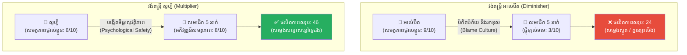
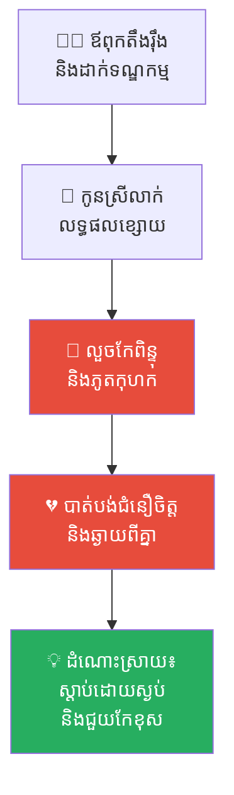
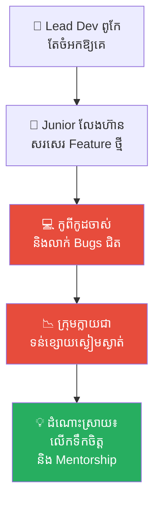
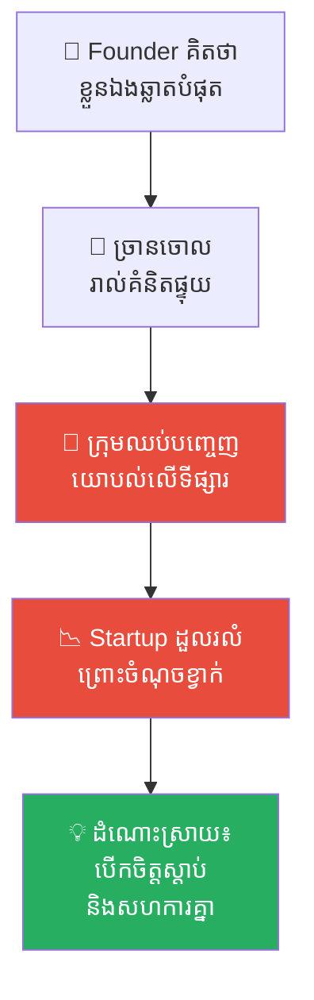
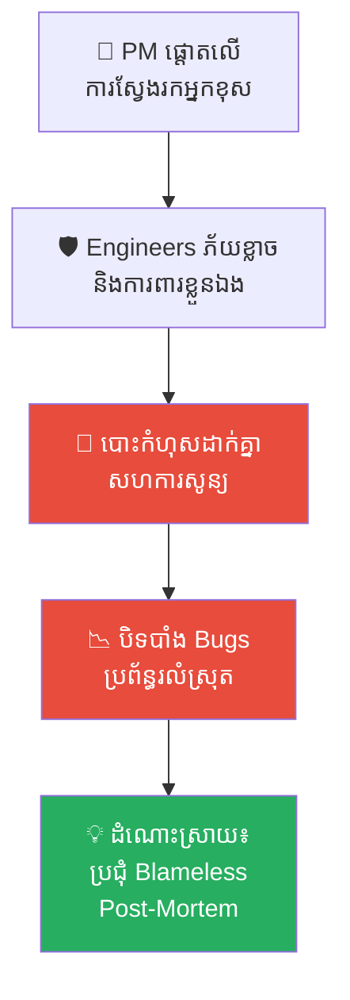
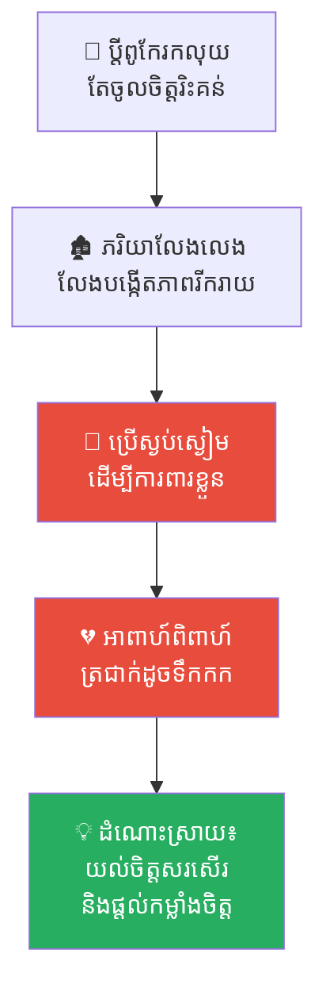
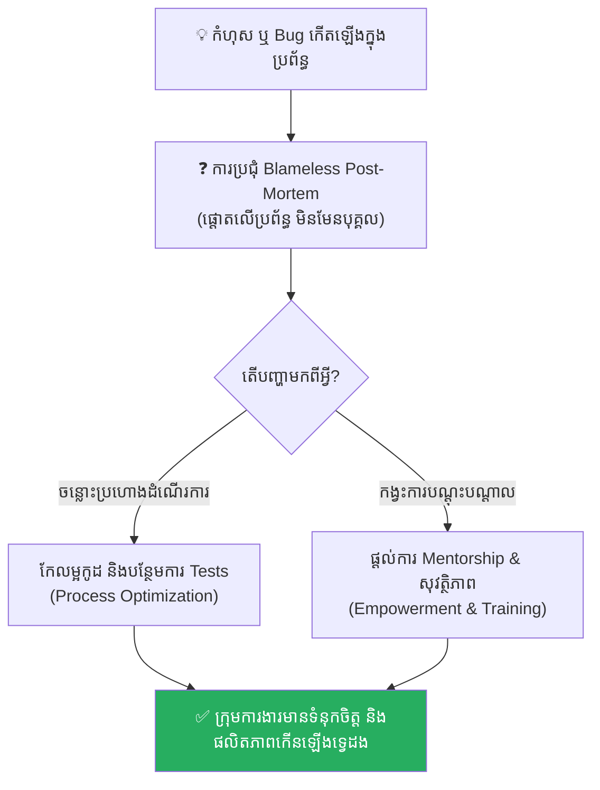

# The Two Orchestras and the Silent Flute (អ្នកដឹកនាំភ្លេងពីររូប និងល្បែងសម្លេងស្ងាត់)៖ គ្រោះថ្នាក់នៃការបំបិទសំឡេងក្រុម និងគណិតវិទ្យានៃការបង្កើនសក្តានុពលក្រុម (Multipliers vs. Diminishers)

**Author:** ichamrong  
**Date:** 2026-05-17  
**Tags:** #multiplier-leadership #diminisher-leader #psychological-safety #team-productivity #mentorship #blame-culture #vienna-music #critical-thinking  
**Category:** Concepts  
**Read Time:** ~15 min  

---

## 📌 មាតិកា (Table of Contents)
- [អន្ទាក់ផ្លូវចិត្ត (The Trap)](#អន្ទាក់ផ្លូវចិត្ត-the-trap)
- [១. រឿងព្រេង៖ រាជបញ្ជារបស់អធិរាជ និងការប្រកួតតន្ត្រី (The Emperor's Decree & The Music Competition)](#1)
  - [វង់តន្ត្រីទីមួយ៖ ទេពកោសល្យឯកោរបស់ អាល់បឺត (The First Orchestra: Albert's Lonely Genius)](#1-1)
  - [ល្បែងសម្លេងស្ងាត់របស់ បេអាទ្រីស (Beatrice's Silent Flute)](#1-2)
  - [វង់តន្ត្រីទីពីរ៖ សូហ្វី និងសិល្បៈនៃការលះបង់ (The Second Orchestra: Sophie's Art of Sacrifice)](#1-3)
- [២. បញ្ហា៖ គណិតវិទ្យានៃផលិតភាព និងឥទ្ធិពល Diminisher (The Issue: The Math of Diminished Performance)](#2)
- [៣. ឧទាហរណ៍ជាក់ស្តែងក្នុងពិភពពិត (Real World Examples)](#3)
  - [ឧទាហរណ៍ទី ១ — កម្រិតស្រាល (គ្រួសារ)៖ ឪពុកម្តាយផ្តាច់ការ និងការបិទបាំងកំហុសរបស់កូន (The Dictatorial Parent)](#3-1)
  - [ឧទាហរណ៍ទី ២ — កម្រិតមធ្យម (បច្ចេកទេស)៖ Lead Developer ចិត្តចង្អៀត និងការសរសេរកូដលុបៗ (The Gatekeeper Lead Dev)](#3-2)
  - [ឧទាហរណ៍ទី ៣ — កម្រិតមធ្យម (ធុរកិច្ច)៖ ស្ថាបនិកដែលចាត់ទុកខ្លួនឯងជាមនុស្សឆ្លាតតែម្នាក់ (The Know-It-All Founder)](#3-3)
  - [ឧទាហរណ៍ទី ៤ — កម្រិតមធ្យម (សង្គម/គ្រប់គ្រង)៖ វប្បធម៌ស្តីបន្ទោស និងការលាក់បាំង Bugs (The Blame-Heavy PM)](#3-4)
  - [ឧទាហរណ៍ទី ៥ — កម្រិតធ្ងន់ (ទំនាក់ទំនង)៖ ដៃគូជីវិតដែលចង់ឈ្នះគ្រប់ពេល (The Critical Spouse)](#3-5)
- [៤. ដំណោះស្រាយទូទៅ៖ ការកសាងសុវត្ថិភាពផ្លូវចិត្ត និងការធ្វើជា Multiplier (The General Solution: Becoming a Multiplier)](#4)
- [សេចក្តីសន្និដ្ឋាន (Conclusion)](#conclusion)
- [ឯកសារយោង (References)](#references)
- [Related Posts](#related-posts)

---

## អន្ទាក់ផ្លូវចិត្ត (The Trap)

តើអ្នកធ្លាប់ជួបស្ថានភាពដែលអ្នកដឹកនាំ ឬប្រធានក្រុមរបស់អ្នកជាមនុស្សពូកែខ្លាំង និងឆ្លាតវៃបំផុត ប៉ុន្តែនៅពេលដែលពួកគេចូលមកដឹកនាំ បែរជាធ្វើឱ្យសមាជិកគ្រប់រូបលែងហ៊ាននិយាយ ឈប់បញ្ចេញគំនិតច្នៃប្រឌិត និងធ្វើការទាំងអារម្មណ៍ភ័យខ្លាចដែរឬទេ?

នេះគឺជា **The Diminisher Trap (អន្ទាក់នៃការបំបិទសក្តានុពលក្រុម)**។

នៅក្នុងការគ្រប់គ្រង និងដឹកនាំ ជារឿយៗអ្នកដឹកនាំប្រភេទ **Diminisher** តែងតែជឿជាក់ថា ពួកគេត្រូវតែជាមនុស្សឆ្លាតបំផុតនៅក្នុងបន្ទប់ (The Smartest Person in the Room)។ ពួកគេប្រើប្រាស់អំណាច ទេពកោសល្យ និងការចាប់កំហុស ដើម្បីគ្រប់គ្រង និងបំភិតបំភ័យក្រុម។ ទង្វើនេះបង្កើតឱ្យមាន **វប្បធម៌ភ័យខ្លាច (Blame Culture)** ដែលបង្ខំឱ្យសមាជិកក្រុមអនុវត្តយុទ្ធសាស្ត្រ «ផ្លុំខ្លុយដោយមិនបញ្ចេញខ្យល់» (Quiet Quitting/Silent Rebellion) ដើម្បីការពារខ្លួនឯងពីការស្តីបន្ទោស។ លទ្ធផលចុងក្រោយគឺ ផលិតភាពសរុបរបស់ក្រុមត្រូវបានកាត់បន្ថយស្ទើរតែពាក់កណ្តាល បើទោះបីជាសមាជិកម្នាក់ៗសុទ្ធតែជាមនុស្សមានសមត្ថភាពក៏ដោយ។

ដើម្បីយល់ដឹងឱ្យបានគ្រប់ជ្រុងជ្រោយ នេះជាផែនទីបង្ហាញផ្លូវសម្រាប់អត្ថបទនេះ៖
1. **រឿងព្រេងប្រវត្តិសាស្ត្រ (The Vienna Music Tale)** — រឿងរ៉ាវរបស់អធិរាជ Franz Joseph, Maestro Albert ដ៏តឹងរ៉ឹង, ជាងផ្លុំខ្លុយ Beatrice ដ៏ភ័យខ្លាច និង Maestro Sophie ដ៏ទន់ភ្លន់។
2. **បញ្ហា (The Issue)** — ការវិភាគគណិតវិទ្យានៃផលិតភាពរវាង Multipliers និង Diminishers និងយន្តការនៃវប្បធម៌ភ័យខ្លាច។
3. **ឧទាហរណ៍ជាក់ស្តែងក្នុងពិភពពិត (Real World Examples)** — ពិនិត្យមើលឥទ្ធិពលនេះក្នុងកម្រិតគ្រួសារ ការងារបច្ចេកទេស ធុរកិច្ច ការគ្រប់គ្រង និងទំនាក់ទំនងស្នេហា។
4. **ដំណោះស្រាយទូទៅ (The General Solution)** — ការកសាងសុវត្ថិភាពផ្លូវចិត្ត (Psychological Safety) និងជំហានដើម្បីក្លាយជា Multiplier Leader។

---

## ១. រឿងព្រេង៖ រាជបញ្ជារបស់អធិរាជ និងការប្រកួតតន្ត្រី (The Emperor's Decree & The Music Competition)

កាលពីសម័យសតវត្សទី ១៩ នៅក្នុងទីក្រុង **វីយែន (Vienna)** នៃប្រទេសអូទ្រីស ដែលជាបេះដូងនៃតន្ត្រីបុរាណអឺរ៉ុប ព្រះអធិរាជ **ហ្វ្រង់ យ៉ូសែប (Emperor Franz Joseph)** មានព្រះរាជបំណងចង់ស្វែងរកវង់តន្ត្រីដ៏អស្ចារ្យបំផុត ដើម្បីមកសម្តែងក្នុងពិធីបុណ្យខួបនៃការឡើងគ្រងរាជ្យរបស់ព្រះអង្គ។ ទ្រង់បានប្រកាសបើកការប្រកួតប្រជែងតន្ត្រីដ៏ធំមួយ ដោយបង្គាប់ឱ្យអ្នកដឹកនាំភ្លេង (Conductors) ដ៏ល្បីល្បាញពីររូបរៀបចំវង់ភ្លេងរៀងៗខ្លួនឡើង។

វង់តន្ត្រីទាំងពីរត្រូវបានផ្តល់ឱ្យនូវឧបករណ៍តន្ត្រីដូចគ្នា ចំនួនអ្នកលេងស្មើគ្នា (ម្នាក់ៗមានសមាជិក ៥ នាក់) និងថវិកាស្មើគ្នា។ អ្នកដឹកនាំដែលបង្កើតបទភ្លេងបានលឺខ្លាំងជាង ពីរោះជាង និងអស្ចារ្យជាងគេ នឹងទទួលបានតំណែងជា **«មហាវិរៈសិល្បករប្រចាំអាណាចក្រ»**។

---

### វង់តន្ត្រីទីមួយ៖ ទេពកោសល្យឯកោរបស់ អាល់បឺត (The First Orchestra: Albert's Lonely Genius)

អ្នកដឹកនាំវង់តន្ត្រីទីមួយឈ្មោះថា **ម៉ែស្ត្រូ អាល់បឺត (Maestro Albert)**។ គេជាតន្ត្រីករដ៏មានទេពកោសល្យអស្ចារ្យបំផុតម្នាក់ ដែលអាចលេងឧបករណ៍តន្ត្រីគ្រប់ប្រភេទបានយ៉ាងស្ទាត់ជំនាញកម្រិត ៩/១០ (The Hero Leader)។ 

អាល់បឺត ជឿជាក់យ៉ាងមុតមាំថា៖ **«វង់ភ្លេងមួយល្អទៅបាន គឺអាស្រ័យលើភាពតឹងរ៉ឹងគ្មានមេត្តា និងការចង្អុលបង្ហាញកំហុសភ្លាមៗរបស់ប្រធាន។»**

នៅក្នុងការហាត់សមជារៀងរាល់ថ្ងៃ ឲ្យតែសមាជិកណាម្នាក់ដេញដងខុសចង្វាក់ ឬច្រឡំអក្សរភ្លេងតែបន្តិច អាល់បឺត នឹងផ្ទុះកំហឹងភ្លាមៗ។ គេប្រើពាក្យសម្តីជេរប្រមាថ មើលងាយ និងស្រែកគំហកដាក់ពួកគេនៅចំពោះមុខអ្នកដទៃ ដើម្បីជាការព្រមាន។ ពេលខ្លះ អាល់បឺត បានតស៊ូមតិការពារខ្លួនឯងថា៖ *«ការធ្វើបែបនេះគឺដើម្បីកម្ចាត់ចំណុចខ្សោយ និងជំរុញឱ្យពួកគេខ្លាំងដូចជាខ្ញុំ!»*

---

### ល្បែងសម្លេងស្ងាត់របស់ បេអាទ្រីស (Beatrice's Silent Flute)

វប្បធម៌ស្តីបន្ទោស និងការរកខុសរបស់ អាល់បឺត បានបង្កើតជា **«វប្បធម៌ភ័យខ្លាច» (Blame Culture)** យ៉ាងខ្លាំងក្នុងវង់តន្ត្រី។ សមាជិកទាំងអស់មានអារម្មណ៍តានតឹង ញ័រដៃញ័រជើងរាល់ពេលចាប់កាន់ឧបករណ៍ភ្លេង។

មានសមាជិកម្នាក់ឈ្មោះ **បេអាទ្រីស (Beatrice)** ដែលជាអ្នកផ្លុំខ្លុយហ្លូត (Flutist)។ នាងធ្លាប់តែជាមនុស្សផ្លុំខ្លុយយ៉ាងពីរោះ រស់រវើក និងមានគំនិតច្នៃប្រឌិតខ្ពស់។ ប៉ុន្តែ បន្ទាប់ពីត្រូវបាន អាល់បឺត ស្រែកជេរប្រមាថ និងស្តីបន្ទោសយ៉ាងចាស់ដៃពីរបីដងមក នាងបានបាត់បង់ជំនឿចិត្តលើខ្លួនឯងទាំងស្រុង។

ដើម្បីការពារខ្លួនឯងកុំឱ្យត្រូវគេស្តីបន្ទោសទៀត បេអាទ្រីស បានបង្កើតយុទ្ធសាស្ត្រមួយ៖ **«ផ្លុំខ្លុយដោយមិនបញ្ចេញខ្យល់សោះ» (The Silent Flute)**។ នាងគ្រាន់តែធ្វើចលនាដៃ និងបបូរមាត់ឱ្យដូចជាកំពុងផ្លុំយ៉ាងសកម្ម ប៉ុន្តែគ្មានសម្លេងខ្លុយសូម្បីតែមួយតំណក់ចេញពីខ្លុយរបស់នាងឡើយ។ នាងគិតថា៖ *«បើខ្ញុំមិនបញ្ចេញសម្លេង ខ្ញុំនឹងគ្មានថ្ងៃខុសចង្វាក់។ បើគ្មានកំហុស ខ្ញុំក៏មិនត្រូវគេជេរប្រមាថដែរ។»* (**Quiet Quitting / Silent Rebellion** )។

សមាជិក ៤ នាក់ផ្សេងទៀតក៏ធ្វើដូចគ្នាដែរ។ ពួកគេលេងតែបទភ្លេងសាមញ្ញបំផុត មិនហ៊ានលេងវគ្គពិបាកៗ ឬបញ្ចេញគំនិតច្នៃប្រឌិតឡើយ។ ពួកគេគ្រាន់តែលេងដើម្បីឱ្យចប់ៗម៉ោងប៉ុណ្ណោះ។

---

### វង់តន្ត្រីទីពីរ៖ សូហ្វី និងសិល្បៈនៃការលះបង់ (The Second Orchestra: Sophie's Art of Sacrifice)

ផ្ទុយទៅវិញ អ្នកដឹកនាំវង់តន្ត្រីទីពីរឈ្មោះថា **ម៉ែស្ត្រូ សូហ្វី (Maestro Sophie)**។ នាងមិនមែនជាមនុស្សពូកែដាច់គេ ឬលេងភ្លេងបានល្អឥតខ្ចោះដូច អាល់បឺត ឡើយ (សមត្ថភាពផ្ទាល់ខ្លួនកម្រិត ៦/១០)។

ប៉ុន្តែ សូហ្វី យល់ច្បាស់ពីសិល្បៈនៃការដឹកនាំ៖ **«ការងាររបស់ខ្ញុំមិនមែនជាការលេចធ្លោតែម្នាក់ឯងនោះទេ តែជាការបង្កើតទីធ្លាដ៏មានសុវត្ថិភាពមួយ ដើម្បីឱ្យសមាជិកគ្រប់រូបហ៊ានបញ្ចេញសមត្ថភាពខ្ពស់បំផុតរបស់ពួកគេ (Psychological Safety)។»**

សូហ្វី សុខចិត្តកាត់បន្ថយពេលវេលាហាត់លេងឧបករណ៍ផ្ទាល់ខ្លួន ដើម្បីយកពេលវេលានោះមកជួយសម្រួល បង្រៀន និងលើកទឹកចិត្តសមាជិកម្នាក់ៗ។
* នៅពេលសមាជិកម្នាក់ដេញដងខុសចង្វាក់ សូហ្វី មិនដែលស្រែកស្តីបន្ទោសឡើយ។ នាងបានញញឹម រួចនិយាយថា៖ *«មិនអីទេ! នេះជាការរៀនសូត្រ។ ចូរយើងសាកល្បងម្តងទៀតទាំងអស់គ្នា។»*
* នាងតែងតែការពារក្រុមរបស់នាងពីសម្ពាធខាងក្រៅ និងលើកទឹកចិត្តឱ្យពួកគេបង្កើតបទភ្លេងថ្មីៗដោយសេរី។

សមាជិកទាំង ៥ នាក់របស់ សូហ្វី មានអារម្មណ៍កក់ក្តៅ រំភើប និងមានសុភមង្គលយ៉ាងខ្លាំងរាល់ពេលហាត់សម (**The Smile Metric** )។ សមត្ថភាពដើមរបស់ពួកគេត្រឹមតែកម្រិត ៥/១០ ប៉ុណ្ណោះ ប៉ុន្តែដោយសារតែបរិយាកាសពោរពេញដោយក្តីស្រឡាញ់ និងការគាំទ្រ ពួកគេបានហាត់រៀនយ៉ាងលឿន រហូតអាចលេងភ្លេងបានដល់កម្រិត ៨/១០ គ្រប់ៗគ្នា។

---

## ២. បញ្ហា៖ គណិតវិទ្យានៃផលិតភាព និងឥទ្ធិពល Diminisher (The Issue: The Math of Diminished Performance)

នៅថ្ងៃប្រឡងប្រជែង វង់តន្ត្រីទាំងពីរត្រូវឡើងសម្តែងម្តងម្នាក់។
* **វង់តន្ត្រីរបស់ អាល់បឺត (Diminisher)៖** សម្លេងភ្លេងចេញមកទន់ខ្សោយ គ្មានព្រលឹង ស្ងួតហួតហែង និងគ្មានការស៊ីចង្វាក់គ្នាឡើយ ព្រោះសមាជិកគ្រប់រូបលេងទាំងក្តីភ័យខ្លាច ហើយខ្លុយរបស់ បេអាទ្រីស គឺគ្មានសម្លេងទាល់តែសោះ។ សម្លេងដែលលឺខ្លាំងជាងគេគឺសម្លេងឧបករណ៍របស់ អាល់បឺត តែម្នាក់គត់។
* **វង់តន្ត្រីរបស់ សូហ្វី (Multiplier)៖** បទភ្លេងចេញមកបន្លឺឡើងយ៉ាងសន្ធោសន្ធៅ លាន់លឺខ្លាំង និងមានសង្វាក់ពីរោះរណ្តំអស្ចារ្យ រហូតធ្វើឱ្យអ្នកទស្សនារាប់ម៉ឺននាក់ និងព្រះអធិរាជ ហ្វ្រង់ យ៉ូសែប លោតទះព្រះហស្តកោតសរសើរស្ទើរស្រក់ទឹកភ្នែក។

ព្រះអធិរាជបានប្រកាសឱ្យ សូហ្វី ឈ្នះការប្រកួតភ្លាមៗ។ អាល់បឺត មិនសុខចិត្តឡើយ រួចសួរទាំងក្តីមន្ទិល៖
> *«ក្រាបទូលព្រះអង្គ! សមត្ថភាពលេងភ្លេងផ្ទាល់ខ្លួនរបស់ទូលបង្គំខ្លាំងជាង សូហ្វី ឆ្ងាយណាស់។ ហេតុអ្វីបានជាវង់ភ្លេងរបស់នាង លឺខ្លាំង និងពីរោះជាងទូលបង្គំទៅវិញ?»*

ព្រះអធិរាជបានបើកសៀវភៅកត់ត្រា រួចបង្ហាញគណិតវិទ្យានៃការដឹកនាំ (**Productivity Math** ) ទៅកាន់ អាល់បឺត៖

ព្រះអធិរាជមានព្រះរាជឱង្ការយ៉ាងមុតមាំ៖
> **«អាល់បឺត! ឯងជាតន្ត្រីករដ៏ខ្លាំងម្នាក់កម្រិត ៩ ប៉ុន្តែឯងបានកាត់បន្ថយសមត្ថភាពក្រុមរបស់ឯងពី ៥ មកសល់ត្រឹម ៣ ដោយសារតែការបំភិតបំភ័យ ធ្វើឱ្យលទ្ធផលសរុបរបស់ឯងបានត្រឹមតែ ២៤ ប៉ុណ្ណោះ។ ផ្ទុយទៅវិញ សូហ្វី មានសមត្ថភាពផ្ទាល់ខ្លួនត្រឹមតែ ៦ ប៉ុន្តែនាងបានលះបង់ក្តីស្រឡាញ់ ភាពកក់ក្តៅ និងដក blockers ឱ្យក្រុម រហូតធ្វើឱ្យសមាជិកគ្រប់រូបកើនឡើងដល់ ៨។ លទ្ធផលសរុបរបស់នាងគឺ ៤៦ ដែលខ្លាំងជាងឯងទ្វេដង! 
>
> អ្នកដឹកនាំដ៏អន់ ធ្វើឱ្យអ្នកដទៃគិតថា 'ខ្លួនឯងជាមនុស្សឆ្លាត'។ ចំណែកអ្នកដឹកនាំដ៏ឆ្នើម គឺធ្វើឱ្យសមាជិកក្រុមគិតថា 'ពួកគេជាមនុស្សឆ្លាត និងមានតម្លៃ'។»**

---

## ៣. ឧទាហរណ៍ជាក់ស្តែងក្នុងពិភពពិត

ដើម្បីយល់ដឹងឱ្យកាន់តែស៊ីជម្រៅ ផ្លូវការសិក្សានឹងនាំអ្នកទៅពិនិត្យមើល **ឧទាហរណ៍ចំនួន ៥ កម្រិតខុសៗគ្នា** ក្នុងជីវិតរស់នៅប្រចាំថ្ងៃ៖

---

### ឧទាហរណ៍ទី ១ — កម្រិតស្រាល (គ្រួសារ)៖ ឪពុកម្តាយផ្តាច់ការ និងការបិទបាំងកំហុសរបស់កូន (The Dictatorial Parent)

**ស្ថានភាព៖** ឪពុកម្នាក់ជាមនុស្សតឹងរ៉ឹងខ្លាំង។ ឱ្យតែឃើញកូនប្រឡងបានពិន្ទុខ្សោយ ឬធ្វើអ្វីមួយខុសឆ្គង គាត់នឹងស្រែកស្តីបន្ទោស និងដាក់ទណ្ឌកម្មយ៉ាងធ្ងន់ធ្ងរ។

* **ភាគី A (ឪពុក)៖** គិតថាការធ្វើបែបនេះនឹងជួយឱ្យកូនខំប្រឹងរៀន និងលែងហ៊ានធ្វើខុសទៀត។
* **ភាគី B (កូនស្រី)៖** នៅពេលនាងប្រឡងធ្លាក់ ឬជួបបញ្ហាធំនៅសាលា នាងមិនហ៊ានប្រាប់ឪពុកឡើយ។ នាងចាប់ផ្តើមលួចកែពិន្ទុលើសន្លឹកកិច្ចការ និងកុហកឪពុកគ្រប់រឿង ដើម្បីចៀសវាងការស្តីបន្ទោស (The Silent Flute in Family)។

**ការពិតដ៏ជូរចត់៖**
វប្បធម៌ស្តីបន្ទោសក្នុងគ្រួសារមិនបានជួយឱ្យកូនកែខ្លួនឡើយ តែវាបង្ខំឱ្យកូនរៀនសូត្រពីសិល្បៈនៃការភូតកុហក និងការបិទបាំងកំហុស ដើម្បីរស់រានមានជីវិត។

---

### ឧទាហរណ៍ទី ២ — កម្រិតមធ្យម (បច្ចេកទេស)៖ Lead Developer ចិត្តចង្អៀត និងការសរសេរកូដលុបៗ (The Gatekeeper Lead Dev)

**ស្ថានភាព៖** Lead Developer ម្នាក់ជាមនុស្សពូកែខ្លាំង (Coding Genius) ប៉ុន្តែតែងតែនិយាយចំអក មើលងាយ និងស្រែកគំហកដាក់ Junior Developers នៅពេលពួកគេសរសេរកូដមាន Bugs ក្នុងវគ្គ Pull Request (PR) Review។

* **ភាគី A (Lead Dev)៖** គិតថាខ្លួនកំពុងជួយរក្សាស្តង់ដារកូដខ្ពស់របស់ក្រុមហ៊ុន។
* **ភាគី B (Junior Devs)៖** លែងហ៊ានសរសេរកូដសាកល្បងបច្ចេកវិទ្យាថ្មីៗ ឬបង្កើតមុខងារច្នៃប្រឌិតទៀតហើយ។ ពួកគេសរសេរតែកូដសាមញ្ញៗ កូពីពីអ៊ីនធឺណិត និងលាក់បាំង Bugs ទាំងឡាយណាដែលពិបាករក ដើម្បីកុំឱ្យត្រូវ Lead Dev ជេរប្រមាថ។

**ការពិតដ៏ជូរចត់៖**
នៅពេលដែល Lead Dev ដើរតួជា Diminisher ក្រុមទាំងមូលនឹងធ្លាក់ចូលទៅក្នុង «ភាពទន់ខ្សោយស្ងៀមស្ងាត់» ដោយសារតែគ្មាននរណាម្នាក់ហ៊ានរៀនសូត្រពីកំហុសឡើយ។

---

### ឧទាហរណ៍ទី ៣ — កម្រិតមធ្យម (ធុរកិច្ច)៖ ស្ថាបនិកដែលចាត់ទុកខ្លួនឯងជាមនុស្សឆ្លាតតែម្នាក់ (The Know-It-All Founder)

**ស្ថានភាព៖** Founder របស់ Startup មួយរូបជាមនុស្សមានគំនិតពូកែខ្លាំង។ គាត់សម្រេចចិត្តគ្រប់រឿង មិនដែលស្តាប់យោបល់របស់ប្រធានផ្នែកលក់ ឬអ្នកជំនាញទីផ្សារឡើយ។ ឱ្យតែសមាជិកណាមានគំនិតផ្ទុយ គាត់នឹងច្រានចោលភ្លាមៗ។

* **ភាគី A (Founder)៖** គិតថា *«Startup ត្រូវការចក្ខុវិស័យឯកភាពពីស្ថាបនិកតែម្នាក់ ដើម្បីដើរឱ្យលឿន។»*
* **ភាគី B (ក្រុមការងារ)៖** ប្រធានផ្នែកនីមួយៗឈប់បញ្ចេញមតិយោបល់ ឬប្រាប់ពីបញ្ហាពិតប្រាកដនៅលើទីផ្សារ។ ពួកគេគ្រាន់តែអនុវត្តតាមបញ្ជារបស់ Founder ទាំងមិនដឹងទិសដៅ ដើម្បីកុំឱ្យមានជម្លោះ។

**ការពិតដ៏ជូរចត់៖**
Startup នោះត្រូវដួលរលំក្នុងរយៈពេលខ្លី ព្រោះតែ Founder មិនអាចមើលឃើញចំណុចខ្វាក់របស់ខ្លួនឯង ហើយគ្មាននរណាម្នាក់ក្នុងក្រុមហ៊ុនហ៊ានជួយចង្អុលបង្ហាញផ្លូវឡើយ។

---

### ឧទាហរណ៍ទី ៤ — កម្រិតមធ្យម (សង្គម/គ្រប់គ្រង)៖ វប្បធម៌ស្តីបន្ទោស និងការលាក់បាំង Bugs (The Blame-Heavy PM)

**ស្ថានភាព៖** Product Manager ម្នាក់តែងតែស្វែងរក «អ្នកខុស» ដើម្បីមកទទួលទោសរាល់ពេលដែលប្រព័ន្ធជួបប្រទះការយឺតយ៉ាវ ឬមាន Bugs ធ្លាក់ទៅកាន់ Production។

* **ភាគី A (PM)៖** គិតថាការរកអ្នកខុសមកដាក់ទោស នឹងជួយឱ្យក្រុមការងារមានការទទួលខុសត្រូវខ្ពស់។
* **ភាគី B (Engineers)៖** ចំណាយពេល ៨០% នៃការប្រជុំដើម្បី «ការពារខ្លួនឯង និងចង្អុលដាក់អ្នកដទៃ» (Defensive Mode) ជំនួសឱ្យការចំណាយពេលសហការគ្នាដើម្បីដោះស្រាយបញ្ហា។

**ការពិតដ៏ជូរចត់៖**
វប្បធម៌រកខុសបំផ្លាញស្មារតីសហការទាំងស្រុង និងបង្កើតឱ្យមាន «កំពែងភាន់ច្រឡំ» (Wall of Confusion) រវាងផ្នែកអភិវឌ្ឍន៍ និងផ្នែកគ្រប់គ្រងគុណភាព។

---

### ឧទាហរណ៍ទី ៥ — កម្រិតធ្ងន់ (ទំនាក់ទំនង)៖ ដៃគូជីវិតដែលចង់ឈ្នះគ្រប់ពេល (The Critical Spouse)

**ស្ថានភាព៖** ប្តីម្នាក់ជាមនុស្សមានចរិតល្អឥតខ្ចោះ ហ្មត់ចត់ និងពូកែរកលុយ។ ប៉ុន្តែ គាត់តែងតែរិះគន់ រកខុស និងបន្ទោសប្រពន្ធរាល់ពេលដែលនាងធ្វើម្ហូបមិនសូវត្រូវចិត្ត ឬរៀបចំផ្ទះមិនសូវមានសណ្តាប់ធ្នាប់។

* **ភាគី A (ប្តី)៖** គិតថាការរិះគន់នឹងជួយឱ្យប្រពន្ធកែលម្អខ្លួនឱ្យក្លាយជាស្ត្រីមេផ្ទះដ៏ល្អឥតខ្ចោះ។
* **ភាគី B (ប្រពន្ធ)៖** បាត់បង់ជំនឿចិត្តលើខ្លួនឯង នាងលែងនិយាយលេងសើច លែងចង់បង្កើតភាពរីករាយក្នុងផ្ទះ និងអនុវត្តយុទ្ធសាស្ត្រ «ស្ងាត់ស្ងៀម» ដើម្បីកុំឱ្យត្រូវប្តីរិះគន់។ អាពាហ៍ពិពាហ៍ប្រែជាត្រជាក់ស្រជុំដូចទឹកកក។

**ការពិតដ៏ជូរចត់៖**
ការចង់ឈ្នះគ្រប់ពេល និងការរិះគន់ឥតឈប់ឈរ សម្លាប់ក្តីស្រឡាញ់ និងការយល់ចិត្តគ្នារវាងដៃគូជីវិតដោយមិនដឹងខ្លួន។

---

## ៤. ដំណោះស្រាយទូទៅ៖ ការកសាងសុវត្ថិភាពផ្លូវចិត្ត និងការធ្វើជា Multiplier (The General Solution: Becoming a Multiplier)

ដើម្បីបំបែកខ្លួនចេញពីអន្ទាក់ Diminisher និងបង្កើតក្រុមការងារដែលមានថាមពល និងផលិតភាពខ្ពស់បំផុត ចូរអនុវត្តវិធីសាស្ត្រទាំងនេះ៖

### ១. កសាងសុវត្ថិភាពផ្លូវចិត្ត (Psychological Safety)
បង្កើតបរិយាកាសមួយដែលសមាជិកគ្រប់រូបដឹងច្បាស់ថា៖ **«ការធ្វើខុស គឺជាផ្នែកមួយនៃការរៀនសូត្រ មិនមែនជាឧក្រិដ្ឋកម្មឡើយ។»** 
* នៅពេលមាន Bugs ឬកំហុសកើតឡើង ឈប់សួរថា *«តើនរណាជាអ្នកធ្វើឱ្យខុស?»* (Who did this?) តែត្រូវសួរថា *«តើប្រព័ន្ធរបស់យើងមានចន្លោះប្រហោងត្រង់ណា ហើយយើងអាចសហការគ្នាដោះស្រាយវាដោយរបៀបណា?»* (How can we fix the system?)។

### ២. ផ្លាស់ប្តូរតួនាទីពី "Genius" ទៅជា "Genius Maker"
ឈប់ប្រឹងប្រែងបង្ហាញថាខ្លួនឯងឆ្លាតបំផុតនៅក្នុងបន្ទប់។ ផ្ទុយទៅវិញ ចូរដើរតួជា **Multiplier** ដោយការ៖
* **សួរសំណួរដែលជម្រុញការគិត (Ask Hard Questions)៖** ជំនួសឱ្យការប្រាប់ពីចម្លើយភ្លាមៗ ចូរចោទសួរដើម្បីឱ្យក្រុមស្វែងរកដំណោះស្រាយដោយខ្លួនឯង។
* **ដកឧបសគ្គឱ្យក្រុម (Remove Blockers)៖** សួរក្រុមការងារជារឿយៗថា *«តើមានអ្វីកំពុងរារាំង ឬធ្វើឱ្យអ្នកពិបាកធ្វើការទេ? តើខ្ញុំអាចជួយសម្រួលអ្វីខ្លះ?»*

### ៣. អនុវត្តយន្តការ Post-Mortem គ្មានការបន្ទោស (Blameless Post-Mortem)
រាល់ពេលដែលគម្រោងជួបប្រទះការដួលរលំ ត្រូវរៀបចំការប្រជុំត្រួតពិនិត្យដោយផ្ោតលើ **«ប្រព័ន្ធ និងដំណើរការងារ»** មិនមែនលើ **«បុគ្គល»** ឡើយ។ នេះជួយឱ្យក្រុមហ៊ាននិយាយការពិត និងរកឃើញឫសគល់ពិតប្រាកដនៃបញ្ហា។

---

## សេចក្តីសნ្និដ្ឋាន (Conclusion)

> **«អ្នកដឹកនាំដ៏វិសេសវិសាល មិនមែនជាមនុស្សដែលចាំងពន្លឺខ្លាំងជាងគេនោះឡើយ ប៉ុន្តែគឺជាមនុស្សដែលចេះបន្ទាបខ្លួន ដក Ego ផ្ទាល់ខ្លួនចេញ ដើម្បីធ្វើជាកញ្ចក់ជួយចាំងចែង និងពង្រីកពន្លឺទេពកោសល្យរបស់សមាជិកគ្រប់រូបនៅក្នុងក្រុមឱ្យបានភ្លឺស្វាងបំផុត។»**

ម៉ែស្ត្រូ អាល់បឺត បានរៀនមេរៀនដ៏ជូរចត់ ព្រោះតែការបំបិទសំឡេងខ្លុយរបស់បេអាទ្រីស។ ចូរឈប់ធ្វើជាអ្នកដឹកនាំដែលបំភិតបំភ័យ និងរកខុសក្រុមការងាររបស់អ្នក។

ចូរជួយឱ្យគ្រប់ខ្លុយទាំងអស់នៅក្នុងវង់ភ្លេងរបស់អ្នក បន្លឺសំឡេងដ៏ពីរោះរបស់ពួកគេឡើងដោយគ្មានក្តីបារម្ភ។

---

## ឯកសារយោង (References)

* **Wiseman, L.** — *Multipliers: How the Best Leaders Make Everyone Smarter* (2010)។ សៀវភៅគ្រឹះនៃការវិភាគឥទ្ធិពល Multiplier vs. Diminisher ក្នុងស្ថាប័នធំៗ។
* **Edmondson, A. C.** — *The Fearless Organization: Creating Psychological Safety in the Workplace for Learning, Innovation, and Growth* (2018)។ ការវិភាគលម្អិតអំពីសារៈសំខាន់នៃ Psychological Safety ក្នុងក្រុមការងារ។
* **Greenleaf, R. K.** — *Servant Leadership: A Journey into the Nature of Legitimate Power and Greatness* (1977)។ ទ្រឹស្តីនៃការដឹកនាំបែបបម្រើ និងការលើកកម្ពស់សមាជិកក្រុម។

---

## Related Posts

* **[The Weaver and the Emperor's Robe (អ្នកត្បាញសូត្រ និងអាវយ័ន្តអធិរាជ)៖ គ្រោះថ្នាក់នៃការកាត់បន្ថយចំណាយលើផ្នែកសំខាន់ និងមហន្តរាយនៃការមើលរំលងតួនាទីតូចតាច](./16-the-weaver-and-the-emperors-robe.md)** — Tracing how systemic QA cuts and blame loops create public disasters.
* **[Learned Helplessness (ការលះបង់ក្តីសង្ឃឹមដោយការរៀនសូត្រ)៖ អន្ទាក់ចិត្តដែលធ្វើឱ្យយើងបោះបង់ការតស៊ូព្រោះតែការបរាជ័យក្នុងអតីតកាល](./10-learned-helplessness.md)** — Understanding how scoldings create imaginary shackles in our minds.
* **[The Hedgehog Dilemma (វិបត្តិសត្វប្រចៀវ/ប្រទូសរ៉ាយ)៖ ស្វែងរកគម្លាតដ៏ល្អឥតខ្ចោះដើម្បីការពារការប៉ះទង្គិចក្នុងក្រុមកាងារ](./08-the-hedgehog-dilemma.md)** — Finding the perfect distance to prevent friction in team collaboration.

---

*Last updated: 2026-05-27*
