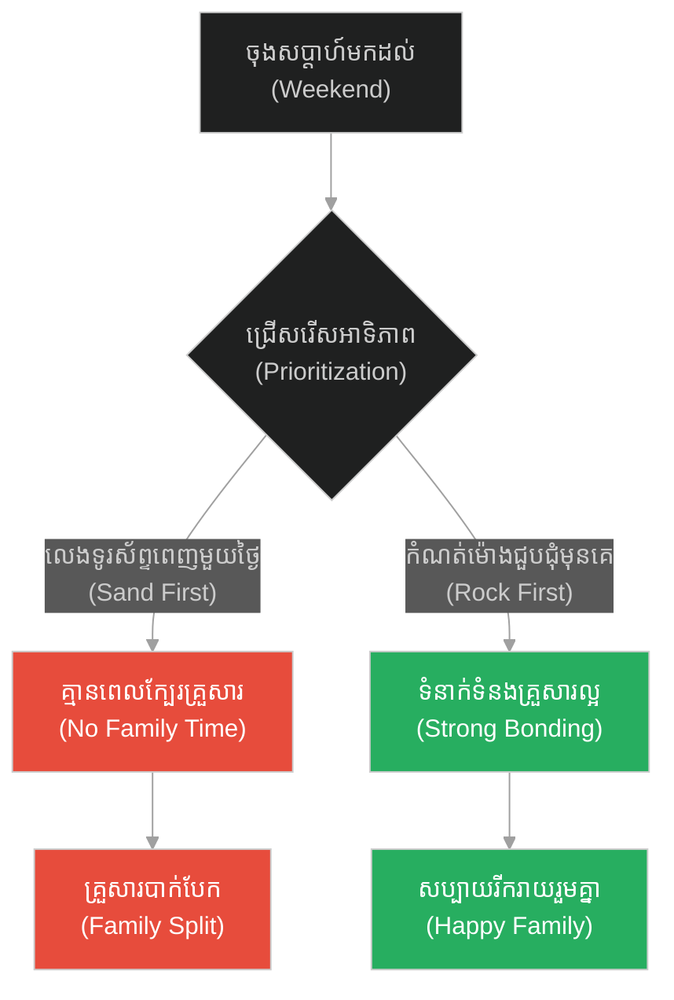
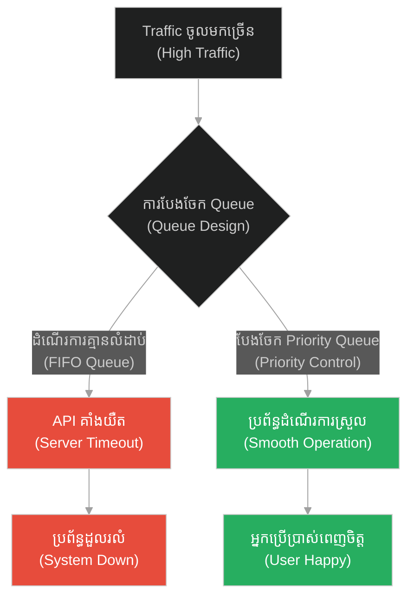
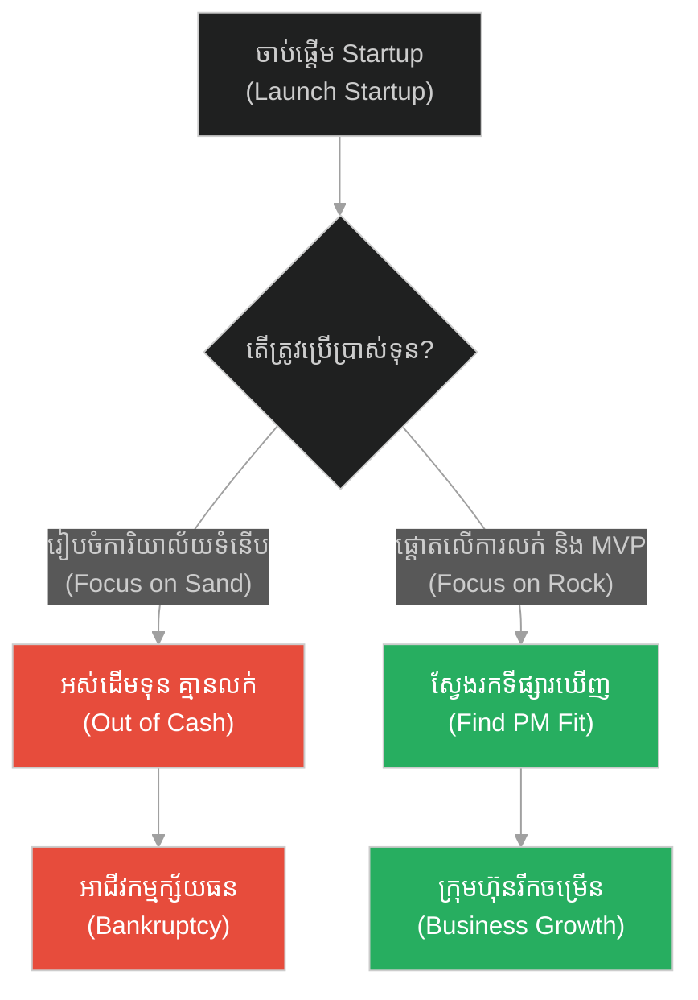
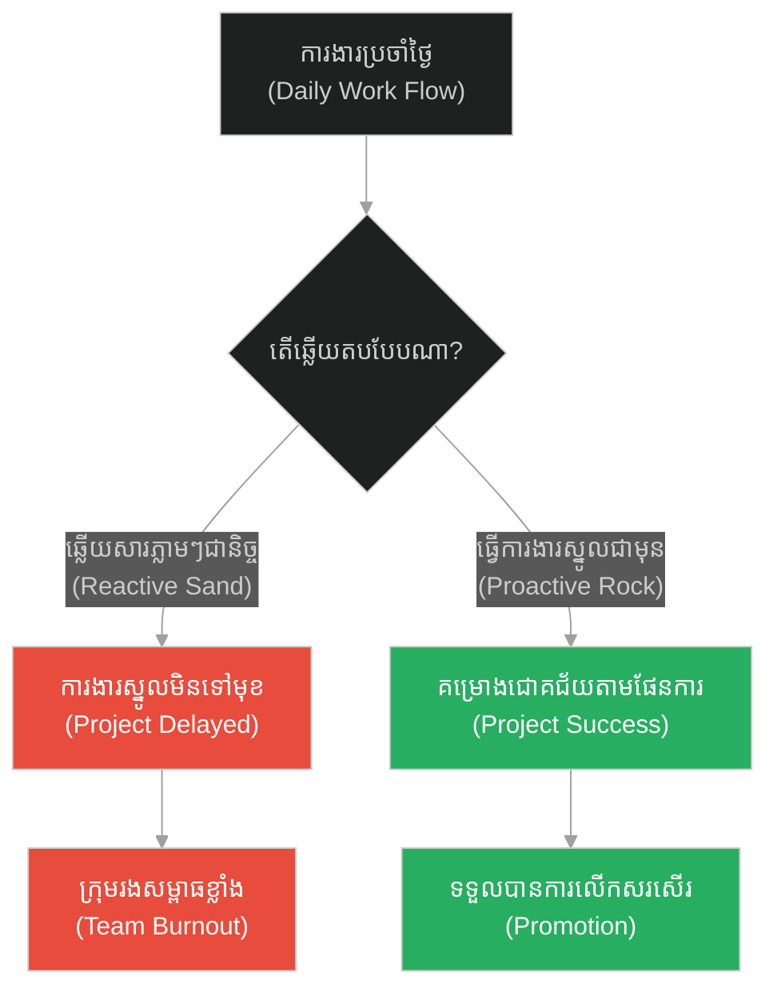
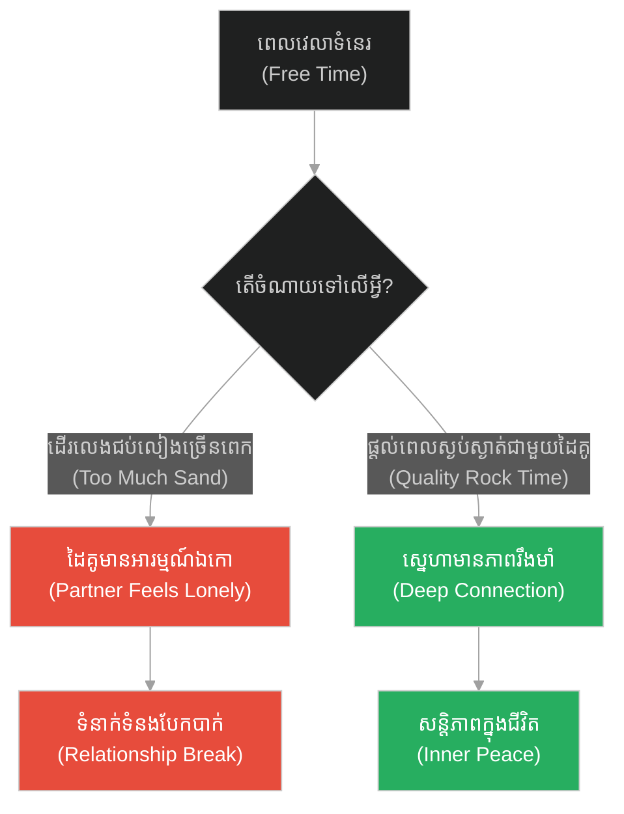
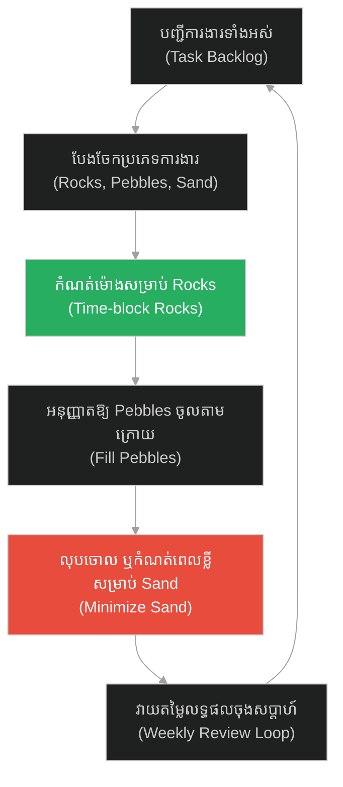

# Time Management & Priorities (ក្រឡជីវិត)៖ ការចាត់ចែងពេលវេលា និងអាទិភាពការងារ (Time Management & Priorities & The Jar of Life)

**Author:** ichamrong  
**Date:** 2026-05-28  
**Tags:** #buddhism #time-management #priorities #focus #purpose  
**Category:** Concepts  
**Read Time:** ~15 min  

---

## 📌 មាតិកា (Table of Contents)
- [អន្ទាក់ផ្លូវចិត្ត (The Trap)](#0)
- [១. រឿងព្រេងនិទាន៖ ក្រឡទទេមួយ (The Legend of The Empty Jar)](#1)
  - [ថ្ម គ្រួស និងខ្សាច់ (The Rocks, Pebbles, and Sand)](#1-1)
- [២. បញ្ហា៖ ការចាត់ចែងពេលវេលា និងអាទិភាពការងារ (The Issue: Time Management & Priorities)](#2)
- [៣. ឧទាហរណ៍ជាក់ស្តែងក្នុងពិភពពិត (Real World Examples)](#3)
  - [ឧទាហរណ៍ទី ១ — កម្រិតស្រាល (គ្រួសារ)៖ ការបែងចែកពេលវេលាគ្រួសារ និងការកម្សាន្ត (The Family Time and Entertainment)](#3-1)
  - [ឧទាហរណ៍ទី ២ — កម្រិតមធ្យម (បច្ចេកទេស)៖ ការគ្រប់គ្រង CPU Cycles និង Background Tasks (The Tech CPU Allocation)](#3-2)
  - [ឧទាហរណ៍ទី ៣ — កម្រិតមធ្យម (ធុរកិច្ច)៖ ការផ្តោតលើ Product-Market Fit ជាជាងការតុបតែងការិយាល័យ (The Business PM Fit)](#3-3)
  - [ឧទាហរណ៍ទី ៤ — កម្រិតមធ្យម (សង្គម/គ្រប់គ្រង)៖ ការគ្រប់គ្រងគម្រោងធំៗ និង Ad-hoc Requests (The Management Project Scope)](#3-4)
  - [ឧទាហរណ៍ទី ៥ — កម្រិតធ្ងន់ (ទំនាក់ទំនង)៖ តុល្យភាពរវាងដៃគូជីវិត និងសកម្មភាពសង្គមឥតប្រយោជន៍ (The Relationship Priorities)](#3-5)
- [៤. ដំណោះស្រាយទូទៅ៖ ច្បាប់នៃដុំថ្មធំៗ (The General Solution: The Law of Big Rocks)](#4)
- [សេចក្តីសន្និដ្ឋាន (Conclusion)](#5)
- [ឯកសារយោង (References)](#6)
- [Related Posts](#7)

---

<a id="0"></a>
## អន្ទាក់ផ្លូវចិត្ត (The Trap)

តើអ្នកធ្លាប់មានអារម្មណ៍ថា «រវល់ពេញមួយថ្ងៃ ប៉ុន្តែនៅចុងបញ្ចប់មិនបានសម្រេចកិច្ចការសំខាន់ណាមួយសោះ» ដែរឬទេ? នេះគឺជាអន្ទាក់នៃការយល់ច្រឡំរវាង **«ភាពរវល់ (Busywork)»** និង **«ផលិតភាពពិតប្រាកដ (Productivity)»**។ មនុស្សភាគច្រើនចំណាយពេល និងថាមពលទៅលើកិច្ចការតូចតាចដែលរត់មករកពួកគេ ជំនួសឱ្យការគ្រោងទុកសម្រាប់កិច្ចការធំៗដែលកំណត់អនាគតរបស់ពួកគេ។

*   **Side A (The Trap):** ការរត់តាមរឿងបន្ទាន់ៗឥតឈប់ឈរ ការឆ្លើយតបរឿងបន្ទាប់បន្សំ (ខ្សាច់ និងទឹក) រហូតដល់គ្មានកន្លែងទំនេរសម្រាប់រឿងសំខាន់បំផុត។
*   **Side B (Resilient Pattern):** ការកំណត់អាទិភាពខ្ពស់បំផុត (ដុំថ្មធំ) ហើយអនុវត្តវាជាមុនគេ ដោយទុកឱ្យរឿងបន្ទាប់បន្សំរអិលចូលទៅតាមក្រោយដោយធម្មជាតិ។

នៅក្នុងអត្ថបទនេះ យើងនឹងស្វែងយល់ពីរបៀបដែលរឿងប្រៀបប្រដៅ «ក្រឡជីវិត» ត្រូវបានយកមកអនុវត្តក្នុងការគ្រប់គ្រងពេលវេលា ស្ថាបត្យកម្មប្រព័ន្ធកុំព្យូទ័រ និងការគ្រប់គ្រងជីវិតប្រចាំថ្ងៃ។

---

<a id="1"></a>
## ១. រឿងព្រេងនិទាន៖ ក្រឡទទេមួយ (The Legend of The Empty Jar)

នៅក្នុងការបង្រៀនទស្សនវិជ្ជាទំនើបដែលមានឥទ្ធិពលស្របនឹងគំនិតហ្សេន សាស្ត្រាចារ្យម្នាក់បានដើរចូលមកក្នុងថ្នាក់រៀន។ គាត់មិនបាននិយាយអ្វីសោះ ប៉ុន្តែបានលើកយកក្រឡកែវធំទទេមួយមកដាក់លើតុ។

បន្ទាប់មក គាត់បានយកដុំថ្មធំៗដែលមានទំហំប៉ុនកណ្តាប់ដៃ មកដាក់ចូលទៅក្នុងក្រឡនោះម្តងមួយៗ រហូតដល់ពេញស្មើនឹងមាត់ក្រឡ។ គាត់ក៏បានសួរនិស្សិតថា៖ *«តើក្រឡនេះពេញហើយឬនៅ?»*

និស្សិតទាំងអស់ឆ្លើយព្រមគ្នាថា៖ *«បាទ/ចាស ពេញហើយលោកគ្រូ!»*

សាស្ត្រាចារ្យញញឹម រួចដកកញ្ចប់គ្រួសតូចៗមកចាក់ចូលទៅក្នុងក្រឡដដែលនោះ។ គាត់បានក្រឡុកក្រឡបន្តិច ធ្វើឱ្យគ្រួសតូចៗទាំងនោះរអិលចូលទៅតាមចន្លោះប្រហោងនៃដុំថ្មធំៗ។ គាត់សួរម្តងទៀត៖ *«ចុះឥឡូវនេះ ពេញហើយឬនៅ?»*

និស្សិតចាប់ផ្តើមយល់គំនិត ក៏ឆ្លើយថា៖ *«មើលទៅប្រហែលជាពេញហើយលោកគ្រូ!»*

<a id="1-1"></a>
### ថ្ម គ្រួស និងខ្សាច់ (The Rocks, Pebbles, and Sand)

សាស្ត្រាចារ្យមិនទាន់ឈប់នៅឡើយទេ។ គាត់បានយកខ្សាច់មួយថង់ចាក់ចូលទៅក្នុងក្រឡនោះទៀត។ ខ្សាច់ល្អិតៗបានហូរចូលទៅបំពេញចន្លោះប្រហោងតូចៗទាំងអស់ដែលនៅសេសសល់រវាងដុំថ្ម និងគ្រួស។ ចុងក្រោយបង្អស់ គាត់បានយកទឹកមួយកែវចាក់ចូលទៅថែម ដែលទឹកនោះបានជ្រាបចូលទៅក្នុងខ្សាច់រហូតដល់គ្មានសល់ចន្លោះប្រហោងទាល់តែសោះ។

សាស្ត្រាចារ្យបានពន្យល់ថា៖
*   **ដុំថ្មធំៗ (Big Rocks):** តំណាងឱ្យរឿងដែលសំខាន់បំផុតក្នុងជីវិតរបស់អ្នក ដូចជាសុខភាព គ្រួសារ មនុស្សជាទីស្រលាញ់ ក្តីសុបិន និងការរៀនសូត្រ។ ទោះបីជាអ្វីៗផ្សេងទៀតបាត់បង់អស់ ក៏ជីវិតរបស់អ្នកនៅតែមានន័យ។
*   **គ្រួសតូចៗ (Pebbles):** តំណាងឱ្យរឿងបន្ទាប់បន្សំដូចជា ការងារ ផ្ទះ ឡាន ឬទ្រព្យសម្បត្តិសម្បកក្រៅ។
*   **ខ្សាច់ និងទឹក (Sand & Water):** តំណាងឱ្យរឿងតូចតាចឥតប្រយោជន៍ ដូចជាការលេងបណ្តាញសង្គម ការតាមដានរឿងអត់ប្រយោជន៍ និងការកម្សាន្តឥតន័យ។

ប្រសិនបើអ្នកចាក់ខ្សាច់ ឬទឹកចូលទៅក្នុងក្រឡមុនគេ នោះអ្នកនឹងគ្មានកន្លែងទំនេរសម្រាប់ដាក់គ្រួស និងដុំថ្មធំៗឡើយ។ ជីវិតក៏ដូចគ្នាដែរ ប្រសិនបើអ្នកចំណាយពេលនិងថាមពលរបស់អ្នកទៅលើរឿងតូចតាចអស់ហើយ អ្នកនឹងគ្មានពេលសម្រាប់រឿងដែលសំខាន់បំផុតនោះទេ។

---

<a id="2"></a>
## ២. បញ្ហា៖ ការចាត់ចែងពេលវេលា និងអាទិភាពការងារ (The Issue: Time Management & Priorities)

នៅក្នុងប្រព័ន្ធបច្ចេកវិទ្យា និងការគ្រប់គ្រងគម្រោង បញ្ហានេះត្រូវបានគេស្គាល់ថាជា **Task Starvation (ការអត់ឃ្លានកិច្ចការសំខាន់)**។ ប្រសិនបើប្រព័ន្ធមួយដំណើរការការងារតាមលំដាប់លំដោយដោយគ្មានការកំណត់អាទិភាព (FIFO - First In, First Out) នោះការងារតូចតាច និងឥតប្រយោជន៍ (Sand Tasks) នឹងទាញយកធនធានទាំងអស់របស់ប្រព័ន្ធ ធ្វើឱ្យការងារសំខាន់ៗ (Rock Tasks) ត្រូវគាំង និងមិនអាចដំណើរការបាន។

ខាងក្រោមនេះជាការប្រៀបធៀបកូដរវាង ប្រព័ន្ធអត់អាទិភាព (Fragile FIFO) និងប្រព័ន្ធមានអាទិភាពត្រឹមត្រូវ (Resilient Priority Queue)៖

### ឧទាហរណ៍កូដគំរូ (Python)

```python
# =====================================================================
# 1. គំរូមិនល្អ (Fragile Design): Blocked by low-priority "Sand" tasks
# =====================================================================
import queue
import time

class FIFOProcessor:
    def __init__(self):
        self.task_queue = queue.Queue()

    def add_task(self, task_name, task_type):
        self.task_queue.put((task_name, task_type))

    def process_all(self):
        print("--- Start FIFO Processing ---")
        while not self.task_queue.empty():
            name, t_type = self.task_queue.get()
            print(f"[FIFO] processing: {name} ({t_type})")
            # ទោះជាការងារតូចតាច ក៏វាស៊ីពេលដំណើរការដែរ
            time.sleep(0.5) 
        print("--- Finished FIFO Processing ---\n")

# ដាក់ការងារតូចតាច (ខ្សាច់) ចូលមុន
fifo = FIFOProcessor()
for i in range(5):
    fifo.add_task(f"Scroll Social Media {i}", "Sand")
fifo.add_task("Core System Core Update", "Rock") # ការងារសំខាន់ (ដុំថ្ម)

fifo.process_all() # ការងារសំខាន់ត្រូវរង់ចាំការងារខ្សាច់ទាំងអស់
```

```python
# =====================================================================
# 2. គំរូល្អ (Resilient Design): Priority Queue (Rocks processed first)
# =====================================================================
import heapq

class PriorityProcessor:
    def __init__(self):
        self.task_queue = []
        self._counter = 0 # ដើម្បីការពារបញ្ហាក្នុងការប្រៀបធៀប tuple

    def add_task(self, task_name, priority_level, task_type):
        # priority_level: 1 = Rock (High), 2 = Pebble (Med), 3 = Sand (Low)
        heapq.heappush(self.task_queue, (priority_level, self._counter, task_name, task_type))
        self._counter += 1

    def process_all(self):
        print("--- Start Priority Processing ---")
        while self.task_queue:
            priority, _, name, t_type = heapq.heappop(self.task_queue)
            print(f"[Priority-{priority}] processing: {name} ({t_type})")
            # ដំណើរការកិច្ចការសំខាន់ៗមុន ទោះបីជាវាចូលមកក្រោយគេក៏ដោយ
        print("--- Finished Priority Processing ---\n")

priority_proc = PriorityProcessor()
# ទោះបីជាបន្ថែមការងារខ្សាច់មុនក៏ដោយ
for i in range(3):
    priority_proc.add_task(f"Check Notifications {i}", 3, "Sand")
    
priority_proc.add_task("Database Backup & Security Update", 1, "Rock")
priority_proc.add_task("Write Documentation", 2, "Pebble")

priority_proc.process_all() # Rock ត្រូវបានដំណើរការមុនគេជានិច្ច
```

---

<a id="3"></a>
## ៣. ឧទាហរណ៍ជាក់ស្តែងក្នុងពិភពពិត (Real World Examples)

<a id="3-1"></a>
### ឧទាហរណ៍ទី ១ — កម្រិតស្រាល (គ្រួសារ)៖ ការបែងចែកពេលវេលាគ្រួសារ និងការកម្សាន្ត (The Family Time and Entertainment)

*   **Dilemma:** ការគិតតែពីការលេងទូរស័ព្ទ ឬជជែកគ្នាលេងរឿងអត់ប្រយោជន៍ (Sand) រហូតដល់គ្មានពេលបង្រៀនកូន ឬនិយាយគ្នាជាមួយប្តី/ប្រពន្ធ (Rock)។
*   **Resolution:** កំណត់ពេលវេលាគ្រួសារ (Family Time) ជា «ដុំថ្មធំ» នៅក្នុងកាលវិភាគប្រចាំសប្តាហ៍ ហើយមិនអនុញ្ញាតឱ្យមានការរំខានឡើយ។



<a id="3-2"></a>
### ឧទាហរណ៍ទី ២ — កម្រិតមធ្យម (បច្ចេកទេស)៖ ការគ្រប់គ្រង CPU Cycles និង Background Tasks (The Tech CPU Allocation)

*   **Dilemma:** ការអនុញ្ញាតឱ្យ background processes ដូចជា logging ឬ analytics (Sand) ស៊ីធនធាន CPU ទាំងអស់ ធ្វើឱ្យ API ឆ្លើយតបយឺត (Rock)។
*   **Resolution:** ប្រើប្រាស់ Priority Queue និង Rate Limiting ដើម្បីធានាថា core request ទទួលបាន resource មុនគេ។



<a id="3-3"></a>
### ឧទាហរណ៍ទី ៣ — កម្រិតមធ្យម (ធុរកិច្ច)៖ ការផ្តោតលើ Product-Market Fit ជាជាងការតុបតែងការិយាល័យ (The Business PM Fit)

*   **Dilemma:** ស្ថាបនិក Startup ចំណាយពេលរៀបចំការិយាល័យ និងទិញកៅអីទំនើបៗ (Sand) តែមិនព្រមចំណាយពេលនិយាយជាមួយអតិថិជនដើម្បីស្វែងយល់ពីតម្រូវការ (Rock)។
*   **Resolution:** ផ្តោតថាមពលនិងថវិកាទៅលើការផលិត MVP និងការស្វែងរក Product-Market Fit ជាមុនសិន។



<a id="3-4"></a>
### ឧទាហរណ៍ទី ៤ — កម្រិតមធ្យម (សង្គម/គ្រប់គ្រង)៖ ការគ្រប់គ្រងគម្រោងធំៗ និង Ad-hoc Requests (The Management Project Scope)

*   **Dilemma:** អ្នកដឹកនាំក្រុមដែលចំណាយពេលពេញមួយថ្ងៃដើម្បីឆ្លើយតប Slack/Emails (Sand) រហូតដល់គ្មានពេលរៀបចំយុទ្ធសាស្ត្រគម្រោងយូរអង្វែង (Rock)។
*   **Resolution:** បែងចែកម៉ោងជាក់លាក់សម្រាប់ឆ្លើយតបសារ (Time-blocking for Sand) និងម៉ោងសម្រាប់ផ្តោតលើការងារស្នូល (Focus Time for Rocks)។



<a id="3-5"></a>
### ឧទាហរណ៍ទី ៥ — កម្រិតធ្ងន់ (ទំនាក់ទំនង)៖ តុល្យភាពរវាងដៃគូជីវិត និងសកម្មភាពសង្គមឥតប្រយោជន៍ (The Relationship Priorities)

*   **Dilemma:** ការគិតតែពីការដើរលេងជាមួយមិត្តភក្តិ ឬចូលរួមកម្មវិធីផ្សេងៗ (Sand) រហូតដល់គ្មានពេលស្តាប់ និងផ្តល់កម្លាំងចិត្តដល់ដៃគូជីវិត (Rock)។
*   **Resolution:** ការបង្កើតច្បាប់ «គុណភាពពេលវេលា» ជាមួយដៃគូជីវិតជាអាទិភាពចម្បងដែលមិនអាចរំលោភបាន។



---

<a id="4"></a>
## ៤. ដំណោះស្រាយទូទៅ៖ ច្បាប់នៃដុំថ្មធំៗ (The General Solution: The Law of Big Rocks)

ដើម្បីជៀសវាងអន្ទាក់នៃការរវល់តែនឹងរឿងឥតប្រយោជន៍ យើងត្រូវអនុវត្តវិធានការដោះស្រាយជាប្រព័ន្ធ៖

1.  **កំណត់អត្តសញ្ញាណ (Identify):** រាល់ព្រឹក សរសេរ «ដុំថ្មធំៗ» ឱ្យបានច្បាស់លាស់ យ៉ាងច្រើនបំផុតត្រឹម ៣ គត់។
2.  **ការពារពេលវេលា (Time Blocking):** កក់ពេលវេលានៅក្នុងប្រតិទិនរបស់អ្នកសម្រាប់ដុំថ្មធំៗទាំងនោះ។
3.  **បដិសេធខ្សាច់ (Say No to Sand):** រៀនបដិសេធកិច្ចការតូចតាចដែលគ្មានតម្លៃ។



---

## 🐇 ធ្លាក់ចូលក្នុងរន្ធទន្សាយ (Enter the Rabbit Hole)
ដើម្បីស្វែងយល់កាន់តែស៊ីជម្រៅអំពីរបៀបដែលកិច្ចសហការ និងការចែករំលែកធនធានអាចជួយដោះស្រាយបញ្ហាធនធានខ្សត់ សូមបន្តដំណើរទៅកាន់៖

* 🚀 **[ចាប់ផ្តើមដំណើររុករក (Start the Journey) ➔ Symbiosis & Collaborative Abundance](./171-buddha-and-the-hungry-ghosts.md)**

---

<a id="5"></a>
## សេចក្តីសន្និដ្ឋាន (Conclusion)

> **«កុំកំណត់កាលវិភាគសម្រាប់អ្វីដែលជាអាទិភាពរបស់អ្នក ប៉ុន្តែត្រូវកំណត់អាទិភាពសម្រាប់កាលវិភាគរបស់អ្នកវិញ។» — Stephen Covey**

នៅចុងបញ្ចប់ ក្រឡជីវិតរបស់អ្នកមានទំហំកំណត់ត្រឹមតែ ២៤ ម៉ោងក្នុងមួយថ្ងៃប៉ុណ្ណោះ។ ជម្រើសគឺនៅលើអ្នក៖ តើអ្នកនឹងបំពេញវាដោយខ្សាច់ និងទឹក ដើម្បីបង្កើតជីវិតដែលមមាញឹកតែគ្មានន័យ ឬអ្នកនឹងដាក់ដុំថ្មធំៗចូលមុនគេ ដើម្បីកសាងមូលដ្ឋានគ្រឹះដ៏រឹងមាំ និងមានតម្លៃបំផុត?

---

<a id="6"></a>
## ឯកសារយោង (References)

*   **Covey, Stephen R.** — *The 7 Habits of Highly Effective People* (1989). ណែនាំអំពីគំនិតនៃការដាក់ «ដុំថ្មធំៗ» មុនគេក្នុងការគ្រប់គ្រងពេលវេលា។
*   **Eisenhower, Dwight D.** — *The Eisenhower Decision Matrix*. ប្រព័ន្ធវាយតម្លៃការងារផ្អែកលើ Urgency និង Importance។

---

<a id="7"></a>
## Related Posts

* [Symbiosis & Collaborative Abundance (ប្រេតឃ្លាន)](./171-buddha-and-the-hungry-ghosts.md) — ស្វែងយល់ពីការចែករំលែកធនធាន និងកិច្ចសហការ។
* [Antifragility & Technical Debt Overcoming (សត្វលាធ្លាក់អណ្តូង)](./174-buddha-and-the-donkey-in-the-well.md) — របៀបបំប្លែងសម្ពាធខាងក្រៅឱ្យទៅជាកាំជណ្តើរនៃការរីកចម្រើន។
