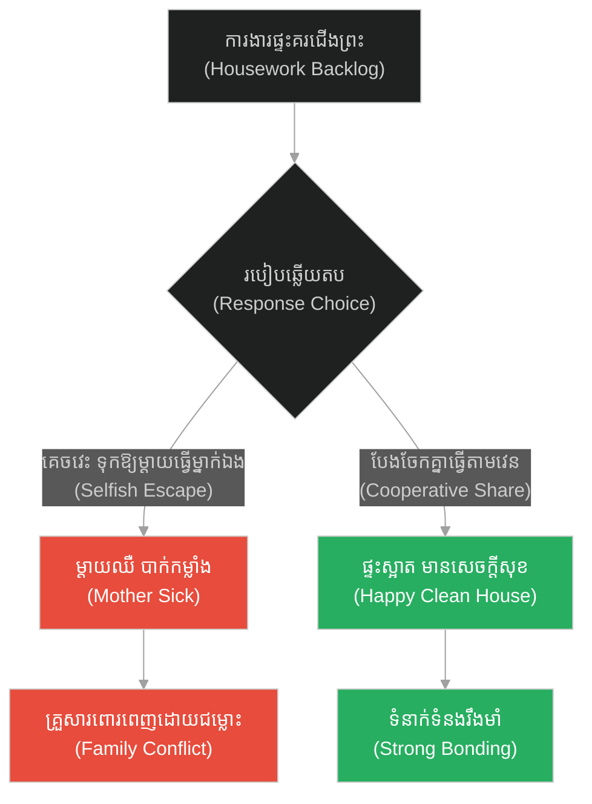
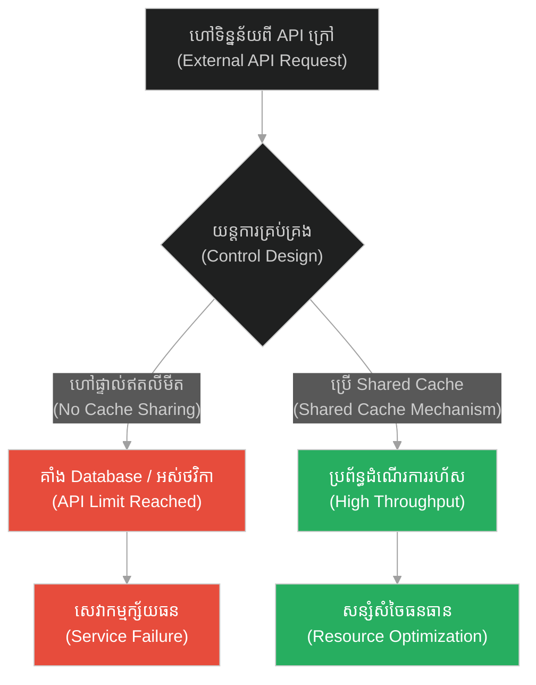
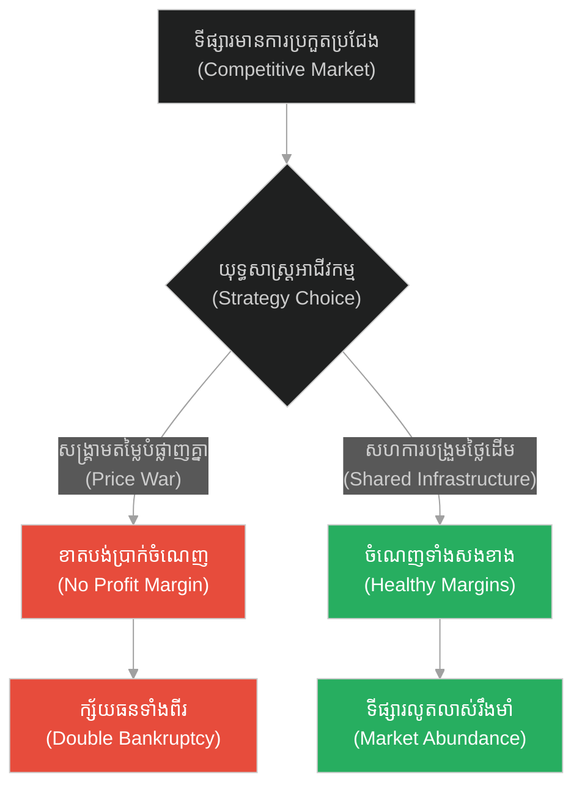
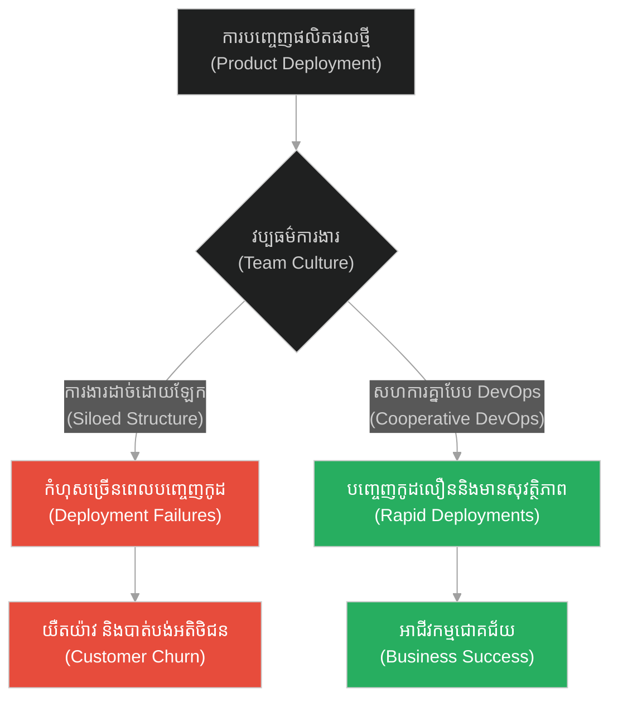
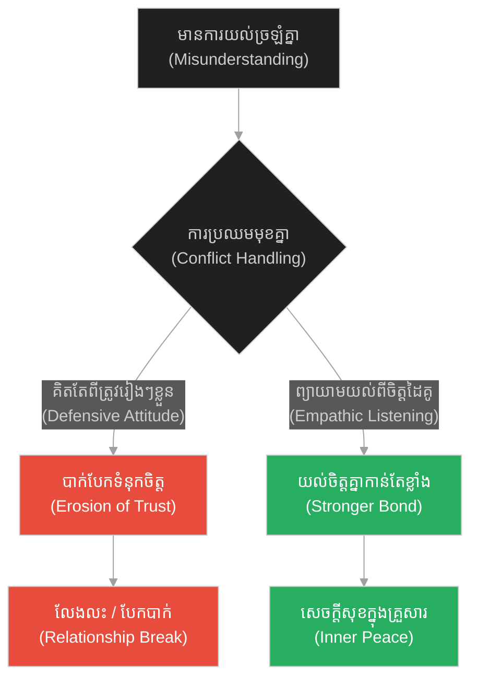
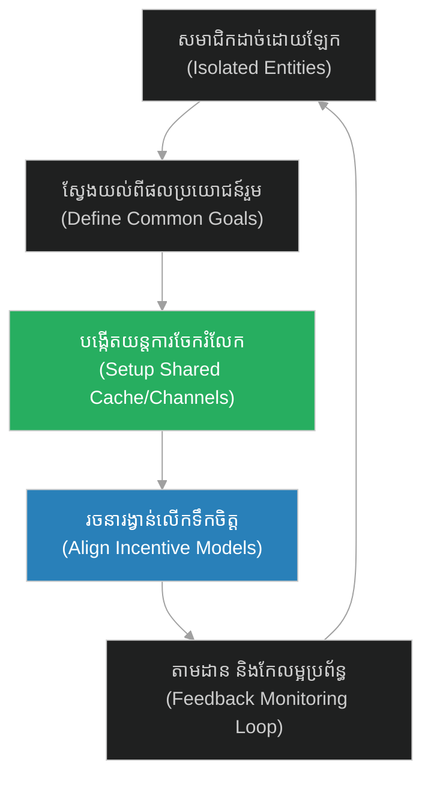

# Symbiosis & Collaborative Abundance (ប្រេតឃ្លាន)៖ សហជីវិត និងភាពសម្បូរបែបនៃកិច្ចសហការ (Symbiosis & Collaborative Abundance & The Hungry Ghosts)

**Author:** ichamrong  
**Date:** 2026-05-28  
**Tags:** #buddhism #altruism #selfishness #community #collaboration  
**Category:** Concepts  
**Read Time:** ~15 min  

---

## 📌 មាតិកា (Table of Contents)
- [អន្ទាក់ផ្លូវចិត្ត (The Trap)](#0)
- [១. រឿងព្រេងនិទាន៖ ឋាននរក និងឋានសួគ៌ (The Legend of Hell and Heaven)](#1)
  - [ភាពខុសគ្នាតែមួយគត់ (The Only Difference)](#1-1)
- [២. បញ្ហា៖ សហជីវិត និងភាពសម្បូរបែបនៃកិច្ចសហការ (The Issue: Symbiosis & Collaborative Abundance)](#2)
- [៣. ឧទាហរណ៍ជាក់ស្តែងក្នុងពិភពពិត (Real World Examples)](#3)
  - [ឧទាហរណ៍ទី ១ — កម្រិតស្រាល (គ្រួសារ)៖ ការបែងចែកការងារផ្ទះដោយស្មើភាព (The Family Housework Sharing)](#3-1)
  - [ឧទាហរណ៍ទី ២ — កម្រិតមធ្យម (បច្ចេកទេស)៖ ការទាញយកទិន្នន័យរួម និង Cache Sharing (The Tech Cache Sharing)](#3-2)
  - [ឧទាហរណ៍ទី ៣ — កម្រិតមធ្យម (ធុរកិច្ច)៖ កិច្ចសហការរវាងក្រុមហ៊ុនដៃគូ និងសង្រ្គាមតម្លៃ (The Business Partnership vs Price War)](#3-3)
  - [ឧទាហរណ៍ទី ៤ — កម្រិតមធ្យម (សង្គម/គ្រប់គ្រង)៖ ការសហការរវាងក្រុមអភិវឌ្ឍន៍ និងក្រុមប្រតិបត្តិការ (The Management DevOps Collaboration)](#3-4)
  - [ឧទាហរណ៍ទី ៥ — កម្រិតធ្ងន់ (ទំនាក់ទំនង)៖ ការផ្តល់ឱ្យ និងការទទួលយកក្នុងគូស្នេហ៍ (The Relationship Give and Take)](#3-5)
- [៤. ដំណោះស្រាយទូទៅ៖ ការកសាងយន្តការឈ្នះ-ឈ្នះ (The General Solution: Win-Win Architecture)](#4)
- [សេចក្តីសន្និដ្ឋាន (Conclusion)](#5)
- [ឯកសារយោង (References)](#6)
- [Related Posts](#7)

---

<a id="0"></a>
## អន្ទាក់ផ្លូវចិត្ត (The Trap)

តើអ្នកធ្លាប់ឃើញក្រុមការងារ ឬស្ថាប័នណាដែលសំបូរទៅដោយធនធាន និងមនុស្សពូកែៗ ប៉ុន្តែនៅតែមិនអាចបង្កើតលទ្ធផលបានល្អ ថែមទាំងបរាជ័យរួមគ្នាដែរឬទេ? នេះគឺជា **«អន្ទាក់ល្បែងផលបូកសូន្យ (Zero-Sum Game Trap)»**។ នៅពេលដែលមនុស្សគ្រប់គ្នានៅក្នុងប្រព័ន្ធគិតតែពីការទាញយកផលប្រយោជន៍ផ្ទាល់ខ្លួន ដោយមិនព្រមសហការ ឬជួយអ្នកដទៃ ពួកគេនឹងបង្កើតនូវបរិយាកាសទុរ្ភិក្សមួយដែលបំផ្លាញអ្នករាល់គ្នា។

*   **Side A (The Trap):** ភាពអាត្មានិយម ការព្យាយាមបញ្ចុកខ្លួនឯងដោយប្រើស្លាបព្រាដែលវែងជាងដៃ នាំឱ្យកើតមានការកកស្ទះ និងការស្រេកឃ្លានរួមគ្នា។
*   **Side B (Resilient Pattern):** កិច្ចសហការគ្នាយ៉ាងស្អិតរមួត ការប្រើប្រាស់ធនធានដើម្បីជួយអ្នកដទៃ ដើម្បីឱ្យអ្នកដទៃត្រឡប់មកជួយយើងវិញ បង្កើតនូវភាពសម្បូរបែបរួមគ្នា។

នៅក្នុងអត្ថបទនេះ យើងនឹងស្វែងយល់ពីរបៀបបំប្លែងប្រព័ន្ធពីការប្រកួតប្រជែងបំផ្លិចបំផ្លាញ ទៅជាប្រព័ន្ធសហជីវិត (Symbiosis) ដែលផ្តល់ផលចំណេញដល់គ្រប់ភាគីពាក់ព័ន្ធ។

---

<a id="1"></a>
## ១. រឿងព្រេងនិទាន៖ ឋាននរក និងឋានសួគ៌ (The Legend of Hell and Heaven)

មានបុរសម្នាក់បានសុំឱ្យព្រះសង្ឃមួយអង្គបង្ហាញគាត់ពីភាពខុសគ្នារវាងឋាននរក និងឋានសួគ៌។

ព្រះសង្ឃបាននាំគាត់ទៅបន្ទប់ទីមួយ ដែលជា **ឋាននរក (Realm of Hungry Ghosts / ប្រេត)**។ នៅក្នុងបន្ទប់នោះ មានតុអាហារមូលដ៏ធំមួយដែលពោរពេញទៅដោយម្ហូបអាហារក្តៅៗ ឈ្ងុយឆ្ងាញ់គួរឱ្យចង់ពិសា។ ប៉ុន្តែមនុស្សដែលអង្គុយជុំវិញតុនោះ សុទ្ធតែមានរូបរាងស្គមស្គាំង ភ្នែកស្លក់ យំសោក និងឃ្លានដាច់ពោះគួរឱ្យសង្វេគ។

មូលហេតុគឺដោយសារតែ ស្លាបព្រាដែកដែលជាប់នឹងកដៃរបស់ពួកគេ មានប្រវែងវែងជាងដៃរបស់ពួកគេទៅទៀត (ប្រហែល ២ ម៉ែត្រ)។ នៅពេលពួកគេដួសអាហារពីតុ ពួកគេមិនអាចបត់ស្លាបព្រាដ៏វែងនោះចូលមកក្នុងមាត់របស់ខ្លួនឯងបានឡើយ។ ពួកគេម្នាក់ៗខំប្រឹងដណ្តើមគ្នា ច្រានគ្នា ដើម្បីដួសអាហារដាក់មាត់ខ្លួនឯង តែចុងក្រោយគ្មានអ្នកណាញ៉ាំបានសូម្បីតែមួយម៉ាត់ ក្រៅពីការធ្វើឱ្យម្ហូបកំពប់ខ្ចាត់ខ្ចាយ។

<a id="1-1"></a>
### ភាពខុសគ្នាតែមួយគត់ (The Only Difference)

បន្ទាប់មក ព្រះសង្ឃបាននាំបុរសនោះទៅបន្ទប់ទីពីរ ដែលជា **ឋានសួគ៌ (Heaven)**។

នៅក្នុងបន្ទប់នោះ ទិដ្ឋភាពទូទៅមានលក្ខណៈដូចបន្ទប់ទីមួយបេះបិទ៖ តុអាហារធំដដែល ម្ហូបឆ្ងាញ់ៗដដែល និងមានស្លាបព្រាដែកវែងជាប់នឹងកដៃដូចគ្នាដែរ។ ប៉ុន្តែផ្ទុយទៅវិញ មនុស្សនៅទីនេះសុទ្ធតែមានសាច់ឈាមភ្លឺថ្លា មានសុខភាពល្អ សើចសប្បាយ និងបរិភោគអាហារយ៉ាងឆ្ងាញ់ពិសា។

បុរសនោះងឿងឆ្ងល់យ៉ាងខ្លាំង ក៏សួរព្រះសង្ឃថា៖ *«លោកម្ចាស់ ហេតុអ្វីបានជាពួកគេអាចញ៉ាំបាន ទាំងដែលមានស្លាបព្រាវែងដូចគ្នា?»*

ព្រះសង្ឃញញឹមយ៉ាងស្រទន់រួចតបថា៖ *«មើលឱ្យច្បាស់ទៅ! មនុស្សនៅឋានសួគ៌នេះ មិនព្យាយាមបញ្ចុកអាហារឱ្យខ្លួនឯងឡើយ។ ពួកគេប្រើស្លាបព្រាដ៏វែងនោះ ដើម្បីដួសអាហារបញ្ចុកអ្នកដែលអង្គុយនៅទល់មុខពួកគេវិញ។ ហើយអ្នកនៅទល់មុខ ក៏ដួសបញ្ចុកពួកគេត្រឡប់មកវិញដូចគ្នាដែរ។ ដោយសារតែការចេះបញ្ចុកគ្នាទៅវិញទៅមកនេះហើយ ទើបគ្រប់គ្នាបានឆ្អែតស្កប់ស្កល់ និងមានសេចក្តីសុខ។»*

---

<a id="2"></a>
## ២. បញ្ហា៖ សហជីវិត និងភាពសម្បូរបែបនៃកិច្ចសហការ (The Issue: Symbiosis & Collaborative Abundance)

នៅក្នុងវិស្វកម្មប្រព័ន្ធ (System Design) គំនិតនេះស្រដៀងទៅនឹងការគ្រប់គ្រង **Shared Resource Contention (ការដណ្តើមធនធានរួម)**។ ប្រសិនបើ Microservices នីមួយៗព្យាយាមទាញយកទិន្នន័យផ្ទាល់ខ្លួនពី Database តែមួយដោយគ្មានការចែករំលែក វានឹងធ្វើឱ្យ Database គាំង និងបង្កការយឺតយ៉ាវទូទាំងប្រព័ន្ធ។ ប៉ុន្តែប្រសិនបើពួកគេប្រើប្រាស់ Shared Cache ឬ Cooperative Data Sharing ពួកគេនឹងរក្សាដំណើរការប្រព័ន្ធបានយ៉ាងរលូន។

ខាងក្រោមនេះជាការប្រៀបធៀបកូដគំរូ៖

### ឧទាហរណ៍កូដគំរូ (Python)

```python
# =====================================================================
# 1. គំរូមិនល្អ (Fragile Design): Redundant Database Requests (Selfish System)
# =====================================================================
import time

class Database:
    def __init__(self):
        self.call_count = 0

    def query_user_data(self, user_id):
        self.call_count += 1
        # សន្មតថាវាជាដំណើរការធ្ងន់ និងយឺត
        time.sleep(0.2)
        return f"UserData_for_{user_id}"

class SelfishMicroservice:
    def __init__(self, db):
        self.db = db

    def handle_request(self, user_id):
        # មិនខ្វល់ពីអ្នកដទៃទេ គឺ Query ទៅ DB ផ្ទាល់រាល់ពេល
        return self.db.query_user_data(user_id)

# កាលណាមាន service ច្រើន query ទៅ DB ផ្ទាល់ នោះ DB នឹងគាំង
db = Database()
services = [SelfishMicroservice(db) for _ in range(5)]
start = time.time()
for s in services:
    s.handle_request("user_100")
print(f"[Selfish] Total DB Calls: {db.call_count}, Time: {time.time() - start:.2f}s")
```

```python
# =====================================================================
# 2. គំរូល្អ (Resilient Design): Shared Cooperative Cache (Heaven/Symbiosis)
# =====================================================================
class SharedCache:
    def __init__(self):
        self.storage = {}

    def get(self, key):
        return self.storage.get(key)

    def set(self, key, value):
        self.storage[key] = value

class CooperativeMicroservice:
    def __init__(self, db, cache):
        self.db = db
        self.cache = cache

    def handle_request(self, user_id):
        # ពិនិត្យមើល Cache រួមមុនគេ (ដូចការបញ្ចុកគ្នា)
        cached_data = self.cache.get(user_id)
        if cached_data:
            return cached_data
        
        # បើគ្មានទិន្នន័យ ទៅយកពី DB រួចរក្សាទុកក្នុង Cache សម្រាប់ Service ផ្សេងទៀត
        data = self.db.query_user_data(user_id)
        self.cache.set(user_id, data)
        return data

# ប្រព័ន្ធសហការគ្នា ធ្វើឱ្យ DB ធ្វើការតិច និងលឿនជាងមុន
db_shared = Database()
cache_shared = SharedCache()
coop_services = [CooperativeMicroservice(db_shared, cache_shared) for _ in range(5)]

start_coop = time.time()
for s in coop_services:
    s.handle_request("user_100")
print(f"[Cooperative] Total DB Calls: {db_shared.call_count}, Time: {time.time() - start_coop:.2f}s")
```

---

<a id="3"></a>
## ៣. ឧទាហរណ៍ជាក់ស្តែងក្នុងពិភពពិត (Real World Examples)

<a id="3-1"></a>
### ឧទាហរណ៍ទី ១ — កម្រិតស្រាល (គ្រួសារ)៖ ការបែងចែកការងារផ្ទះដោយស្មើភាព (The Family Housework Sharing)

*   **Dilemma:** សមាជិកគ្រួសារម្នាក់ៗគិតតែពីភាពស្រណុកផ្ទាល់ខ្លួន (Selfish) ដោយទម្លាក់ការងារផ្ទះទាំងអស់ទៅលើម្តាយ ធ្វើឱ្យម្តាយបាក់កម្លាំង និងមានទំនាស់។
*   **Resolution:** ចែករំលែកការងារផ្ទះគ្នាទៅវិញទៅមក (Altruistic Cooperation) ធ្វើឱ្យផ្ទះស្អាត និងសមាជិកគ្រប់គ្នាមានសុភមង្គល។



<a id="3-2"></a>
### ឧទាហរណ៍ទី ២ — កម្រិតមធ្យម (បច្ចេកទេស)៖ ការទាញយកទិន្នន័យរួម និង Cache Sharing (The Tech Cache Sharing)

*   **Dilemma:** API នីមួយៗហៅទៅកាន់ External Payment Gateways ម្តងហើយម្តងទៀត នាំឱ្យខូច Connection Pool និងខាតបង់ថវិកាសេវាកម្ម។
*   **Resolution:** បង្កើត Caching Layer រួមមួយ ដើម្បីកុំឱ្យមានការហៅទិន្នន័យស្ទួនគ្នា។



<a id="3-3"></a>
### ឧទាហរណ៍ទី ៣ — កម្រិតមធ្យម (ធុរកិច្ច)៖ កិច្ចសហការរវាងក្រុមហ៊ុនដៃគូ និងសង្រ្គាមតម្លៃ (The Business Partnership vs Price War)

*   **Dilemma:** ក្រុមហ៊ុនពីរក្នុងទីផ្សារតែមួយ ព្យាយាមបញ្ចុះតម្លៃដើម្បីបំផ្លាញគ្នា (Price War) នាំឱ្យក្ស័យធនទាំងសងខាង។
*   **Resolution:** ក្រុមហ៊ុនទាំងពីររួមគ្នាបង្កើតស្តង់ដាររួម ឬចែករំលែកប្រព័ន្ធដឹកជញ្ជូន (Cooperative Logistics) ដើម្បីកាត់បន្ថយថ្លៃដើម និងរីកចម្រើនជាមួយគ្នា។



<a id="3-4"></a>
### ឧទាហរណ៍ទី ៤ — កម្រិតមធ្យម (សង្គម/គ្រប់គ្រង)៖ ការសហការរវាងក្រុមអភិវឌ្ឍន៍ និងក្រុមប្រតិបត្តិការ (The Management DevOps Collaboration)

*   **Dilemma:** ក្រុម Dev គិតតែពីសរសេរកូដឱ្យរួចដៃ ឯក្រុម Ops គិតតែពីការទប់ស្កាត់ការប្រែប្រួលដើម្បីការពារស្ថិរភាព (Silo Effect) នាំឱ្យគម្រោងយឺតយ៉ាវ។
*   **Resolution:** បង្កើតវប្បធម៌ DevOps ដែលក្រុមទាំងពីរធ្វើការរួមគ្នា ចែករំលែកការទទួលខុសត្រូវលើដំណើរការផលិតកម្ម។



<a id="3-5"></a>
### ឧទាហរណ៍ទី ៥ — កម្រិតធ្ងន់ (ទំនាក់ទំនង)៖ ការផ្តល់ឱ្យ និងការទទួលយកក្នុងគូស្នេហ៍ (The Relationship Give and Take)

*   **Dilemma:** ម្នាក់ៗទាមទារឱ្យដៃគូរបស់ខ្លួនបំពេញចិត្ត និងផ្លាស់ប្តូរដើម្បីខ្លួន (Selfish Demands) នាំឱ្យស្នេហាក្លាយជាសមរភូមិសឹក។
*   **Resolution:** ផ្តោតលើការផ្តល់ឱ្យ និងការជួយគាំទ្រផ្នែកស្មារតីដល់គ្នាទៅវិញទៅមក បង្កើតបានជាក្តីស្រលាញ់ដែលរឹងមាំ និងមានស្ថិរភាព។



---

<a id="4"></a>
## ៤. ដំណោះស្រាយទូទៅ៖ ការកសាងយន្តការឈ្នះ-ឈ្នះ (The General Solution: Win-Win Architecture)

ដើម្បីបង្កើតប្រព័ន្ធសហការដ៏មានប្រសិទ្ធភាព យើងត្រូវអនុវត្តជំហានយុទ្ធសាស្ត្រទាំងនេះ៖

1.  **កំណត់ផលប្រយោជន៍រួម (Define Shared Goals):** បង្កើតទិសដៅដែលតម្រូវឱ្យគ្រប់ភាគីត្រូវតែឈ្នះជាមួយគ្នា។
2.  **បង្កើតយន្តការទំនាក់ទំនង (Establish Communication Protocols):** ធានាថាព័ត៌មានត្រូវបានចែករំលែកដោយតម្លាភាព។
3.  **កាត់បន្ថយការប្រកួតប្រជែងផ្ទៃក្នុង (Reduce Internal Friction):** រៀបចំរចនាសម្ព័ន្ធលើកទឹកចិត្ត (Incentive Structure) ឱ្យស្របនឹងការជួយគ្នាទៅវិញទៅមក។



---

## 🐇 ធ្លាក់ចូលក្នុងរន្ធទន្សាយ (Enter the Rabbit Hole)
ដើម្បីស្វែងយល់ពីរបៀបដែលសកម្មភាពតូចតាចរបស់បុគ្គលម្នាក់ៗអាចបង្កើតឥទ្ធិពលយ៉ាងធំធេងដល់ប្រព័ន្ធទាំងមូល សូមបន្តដំណើរទៅកាន់៖

* 🚀 **[ចាប់ផ្តើមដំណើររុករក (Start the Journey) ➔ Individual Impact & Micro-contributions](./172-buddha-and-the-starfish.md)**

---

<a id="5"></a>
## សេចក្តីសន្និដ្ឋាន (Conclusion)

> **«ឋាននរក និងឋានសួគ៌ មានលក្ខណៈដូចគ្នាបេះបិទ។ ភាពខុសគ្នាតែមួយគត់ គឺរបៀបដែលយើងប្រព្រឹត្តចំពោះគ្នាទៅវិញទៅមក។»**

ភាពអាត្មានិយមបង្កើតឱ្យមានសង្រ្គាម និងភាពខ្សត់ខ្សោយ ទោះបីជាស្ថិតនៅក្នុងកន្លែងដែលសំបូរធនធានក៏ដោយ។ ការចេះជួយគ្នាទៅវិញទៅមក ការបញ្ចុកគ្នាទៅវិញទៅមក គឺជាយន្តការតែមួយគត់ដែលធានាឱ្យមានភាពសម្បូរបែបរួមគ្នា និងភាពរឹងមាំនៃប្រព័ន្ធទាំងមូល។

---

<a id="6"></a>
## ឯកសារយោង (References)

*   **Axelrod, Robert** — *The Evolution of Cooperation* (1984). សិក្សាអំពីយុទ្ធសាស្ត្រ Tit-for-Tat ក្នុង Game Theory ដែលបង្ហាញថា កិច្ចសហការគឺជាយុទ្ធសាស្ត្រជោគជ័យបំផុតក្នុងរយៈពេលវែង។
*   **Nash, John** — *Nash Equilibrium*. ទ្រឹស្តីហ្គេមដែលបង្ហាញថា ការសម្រេចចិត្តដោយសហការគ្នាបង្កើតផលល្អបំផុតជាជាងការសម្រេចចិត្តផ្ទាល់ខ្លួនដាច់ដោយឡែក។

---

<a id="7"></a>
## Related Posts

* [Individual Impact & Micro-contributions (ក្មេងប្រុស និងផ្កាយសមុទ្រ)](./172-buddha-and-the-starfish.md) — របៀបដែលការរួមចំណែកតូចៗបង្កើតផលធំ។
* [Cross-team Collaboration & Bystander Effect (សាម៉ារីដ៏សប្បុរស)](./176-jesus-and-the-good-samaritan.md) — របៀបដែលការសហការឆ្លងក្រុមជួយសង្គ្រោះប្រព័ន្ធពីភាពជាប់គាំង។
