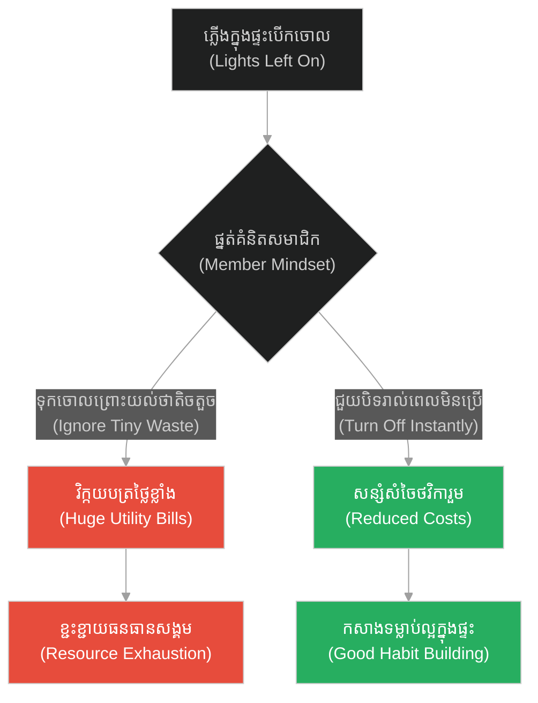
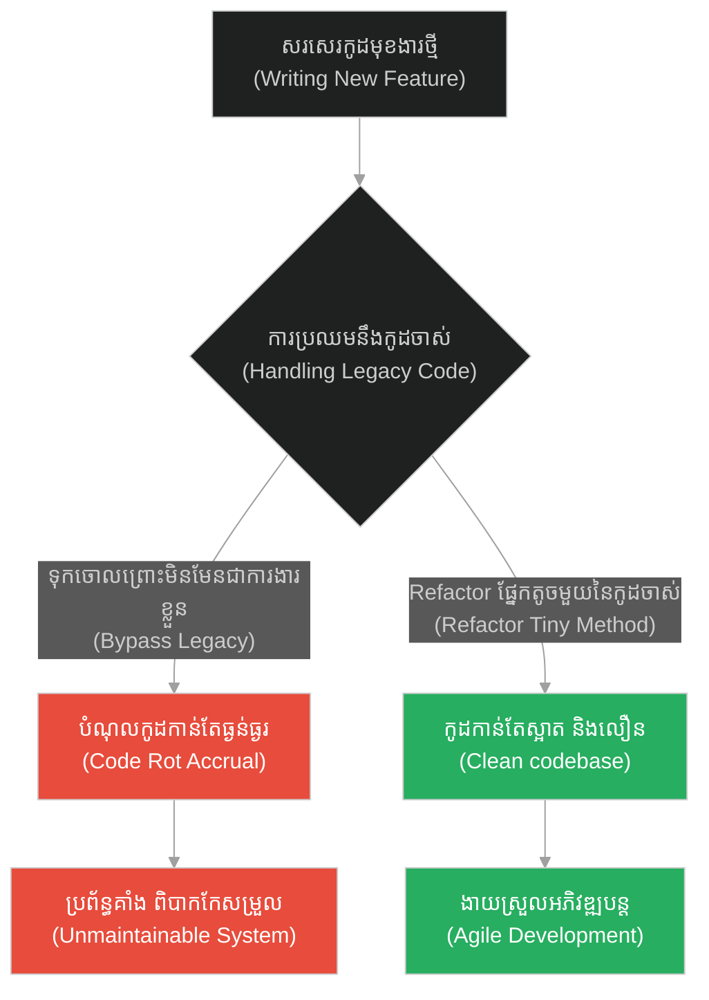
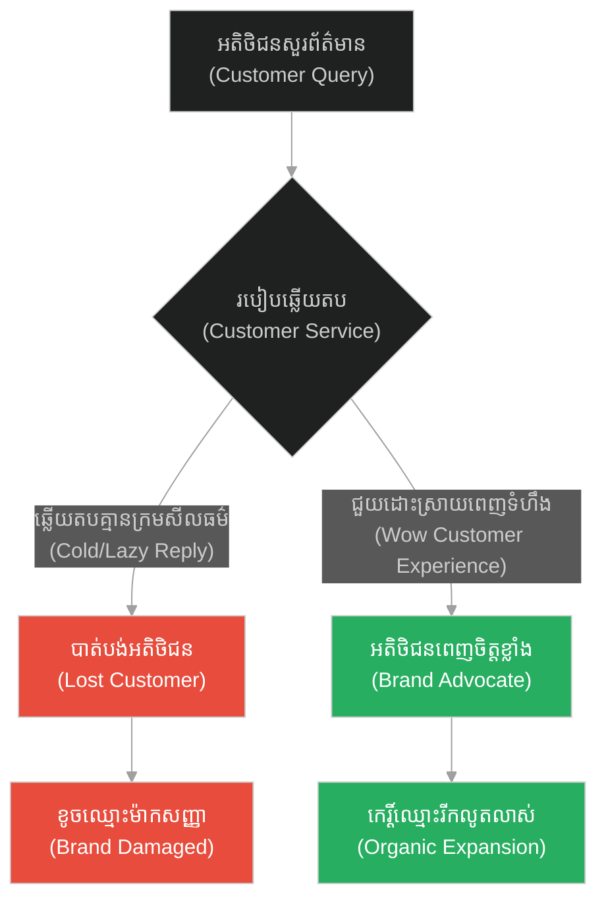
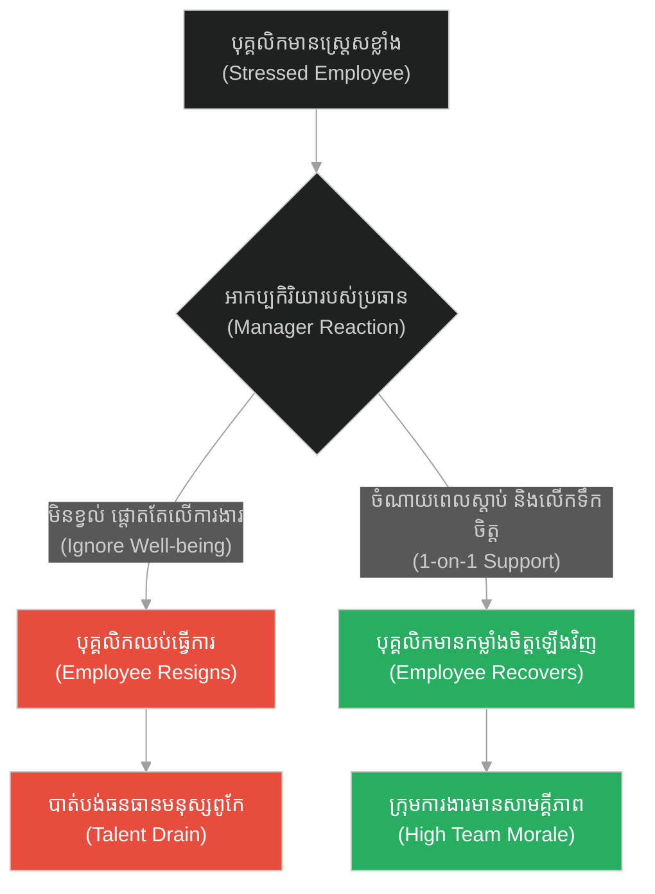
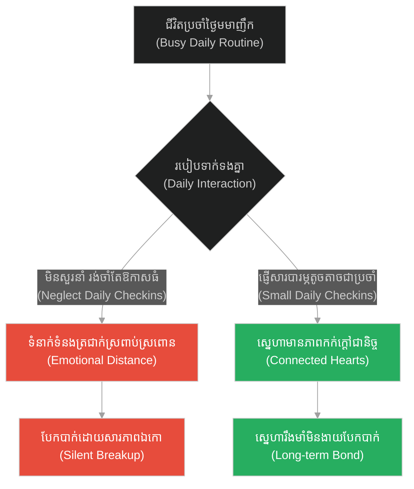
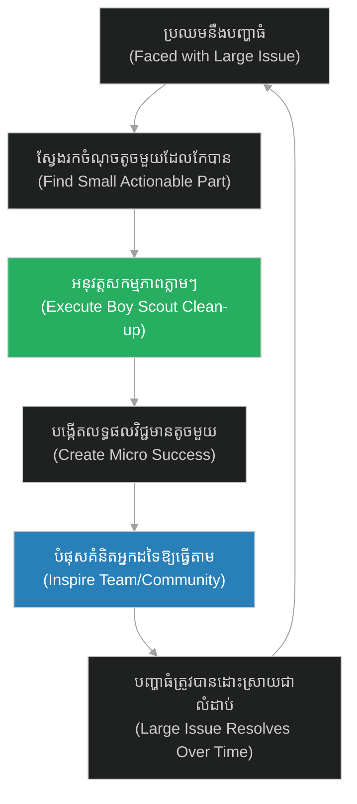

# Individual Impact & Micro-contributions (ក្មេងប្រុស និងផ្កាយសមុទ្រ)៖ ឥទ្ធិពលបុគ្គល និងការរួមចំណែកកម្រិតមីក្រូ (Individual Impact & Micro-contributions & The Starfish Thrower)

**Author:** ichamrong  
**Date:** 2026-05-28  
**Tags:** #buddhism #impact #compassion #making-a-difference #cynicism  
**Category:** Concepts  
**Read Time:** ~15 min  

---

## 📌 មាតិកា (Table of Contents)
- [អន្ទាក់ផ្លូវចិត្ត (The Trap)](#0)
- [១. រឿងព្រេងនិទាន៖ ផ្កាយសមុទ្ររាប់ពាន់ (The Legend of Thousands of Starfish)](#1)
  - [វាមានអត្ថន័យសម្រាប់មួយនេះ (It Matters to This One)](#1-1)
- [២. បញ្ហា៖ ឥទ្ធិពលបុគ្គល និងការរួមចំណែកកម្រិតមីក្រូ (The Issue: Individual Impact & Micro-contributions)](#2)
- [៣. ឧទាហរណ៍ជាក់ស្តែងក្នុងពិភពពិត (Real World Examples)](#3)
  - [ឧទាហរណ៍ទី ១ — កម្រិតស្រាល (គ្រួសារ)៖ ការសន្សំទឹក ឬភ្លើងក្នុងផ្ទះ (The Family Resource Conservation)](#3-1)
  - [ឧទាហរណ៍ទី ២ — កម្រិតមធ្យម (បច្ចេកទេស)៖ ការកែលម្អកូដខូចៗតូចតាច ឬ Boy Scout Rule (The Tech Boy Scout Rule)](#3-2)
  - [ឧទាហរណ៍ទី ៣ — កម្រិតមធ្យម (ធុរកិច្ច)៖ ការផ្តល់សេវាកម្មល្អដល់អតិថិជនម្នាក់ៗ (The Business Customer Delight)](#3-3)
  - [ឧទាហរណ៍ទី ៤ — កម្រិតមធ្យម (សង្គម/គ្រប់គ្រង)៖ ការជួយគាំទ្រសមាជិកក្រុមដែលកំពុងពិបាកចិត្ត (The Management Team Support)](#3-4)
  - [ឧទាហរណ៍ទី ៥ — កម្រិតធ្ងន់ (ទំនាក់ទំនង)៖ ការផ្ញើសារសួរសុខទុក្ខតូចតាចប្រចាំថ្ងៃ (The Relationship Micro-moments)](#3-5)
- [៤. ដំណោះស្រាយទូទៅ៖ ច្បាប់នៃឥទ្ធិពលរលក (The General Solution: The Ripple Effect)](#4)
- [សេចក្តីសន្និដ្ឋាន (Conclusion)](#5)
- [ឯកសារយោង (References)](#6)
- [Related Posts](#7)

---

<a id="0"></a>
## អន្ទាក់ផ្លូវចិត្ត (The Trap)

តើអ្នកធ្លាប់មានអារម្មណ៍ថា «បញ្ហានៅចំពោះមុខធំធេងពេក រហូតដល់ការខំប្រឹងប្រែងបន្តិចបន្តួចរបស់អ្នកគ្មានន័យអ្វីទាំងអស់» ដែរឬទេ? នេះគឺជា **«អន្ទាក់នៃភាពអសកម្មដោយសារទំហំបញ្ហា (Scale Paralysis / Cynicism Trap)»**។ មនុស្សភាគច្រើនបោះបង់ចោលការធ្វើអំពើល្អតូចៗ ឬការកែលម្អប្រព័ន្ធជាប្រចាំ ដោយពួកគេគិតថា «ទោះជួយក៏មិនអស់ ទោះធ្វើក៏មិនប្លែក»។

*   **Side A (The Trap):** ភាពទុទិដ្ឋិនិយម និងភាពអសកម្ម ដោយសារតែគិតថាខ្លួនឯងមិនអាចដោះស្រាយបញ្ហាពិភពលោក ឬបញ្ហាប្រព័ន្ធទាំងមូលបាន។
*   **Side B (Resilient Pattern):** ការផ្តោតលើសកម្មភាពតូចៗដែលនៅចំពោះមុខ (Micro-contributions) ដោយយល់ថាការផ្លាស់ប្តូរជីវិតរបស់មនុស្សម្នាក់ ឬផ្នែកតូចមួយនៃប្រព័ន្ធ គឺមានតម្លៃមិនអាចកាត់ថ្លៃបាន។

នៅក្នុងអត្ថបទនេះ យើងនឹងស្វែងយល់ពីរបៀបដែលទង្វើតូចតាចប្រចាំថ្ងៃអាចបង្កើតជាឥទ្ធិពលរលក (Ripple Effect) កែលម្អប្រព័ន្ធកូដ និងបង្កើតផលវិជ្ជមានដល់សង្គម។

---

<a id="1"></a>
## ១. រឿងព្រេងនិទាន៖ ផ្កាយសមុទ្ររាប់ពាន់ (The Legend of Thousands of Starfish)

បន្ទាប់ពីមានព្យុះសង្ឃរាដ៏ធំមួយនៅមហាសមុទ្រ ឆ្នេរខ្សាច់ត្រូវបានគ្របដណ្តប់ទៅដោយផ្កាយសមុទ្រ (Starfish) រាប់ម៉ឺនក្បាល ដែលត្រូវរលកបោកបក់មកទើរនៅលើខ្សាច់។ នៅពេលដែលព្រះអាទិត្យកាន់តែខ្ពស់ទៅៗ កម្តៅថ្ងៃនឹងធ្វើឱ្យពួកវាងាប់ទាំងអស់ជាមិនខាន។

បុរសចំណាស់ម្នាក់បានដើរហាត់ប្រាណតាមមាត់ឆ្នេរ គាត់បានក្រឡេកទៅឃើញក្មេងប្រុសម្នាក់កំពុងរត់ចុះឡើងៗ។ ក្មេងប្រុសនោះអោនរើសផ្កាយសមុទ្រម្តងមួយៗ រួចបោះវាចូលទៅក្នុងទឹកសមុទ្រវិញយ៉ាងប្រុងប្រយ័ត្ន។

បុរសចំណាស់ដើរទៅជិតក្មេងនោះ រួចពោលដោយទឹកមុខស្ងួតថា៖ *«ក្មួយប្រុស! ឆ្នេរនេះវែងរាប់គីឡូម៉ែត្រ ហើយមានផ្កាយសមុទ្ររាប់ម៉ឺនក្បាលនៅទីនេះ។ ក្មួយទោះជាខំប្រឹងបោះតាំងពីព្រឹករហូតដល់យប់ ក៏មិនអស់ដែរ។ ការខំប្រឹងរបស់ក្មួយគ្មានន័យអ្វីទេ វាមិនអាចផ្លាស់ប្តូរអ្វីបានឡើយ (It won't make a difference)!»*

<a id="1-1"></a>
### វាមានអត្ថន័យសម្រាប់មួយនេះ (It Matters to This One)

ក្មេងប្រុសបានស្តាប់សម្តីបុរសចំណាស់ហើយ គេមិនបានអាក់អន់ចិត្ត ឬឈប់ធ្វើសកម្មភាពរបស់គេឡើយ។ គេបានអោនចុះទៅដី រើសយកផ្កាយសមុទ្រមួយក្បាលទៀត រួចប្រើកម្លាំងបោះវាចូលទៅក្នុងទឹកសមុទ្រយ៉ាងឆ្ងាយ។

បន្ទាប់មក ក្មេងប្រុសងាកមកញញឹមដាក់បុរសចំណាស់ រួចនិយាយដោយសម្តីទន់ភ្លន់ថា៖
**«លោកតា... ទើបតែមានការផ្លាស់ប្តូរ និងមានន័យបំផុតសម្រាប់ផ្កាយសមុទ្រមួយក្បាលនោះ!»**

សម្តីតូចតែមានអត្ថន័យជ្រៅនេះ បានធ្វើឱ្យបុរសចំណាស់ភ្ញាក់ខ្លួនព្រើត។ គាត់បានដឹងខ្លួនថា ខ្លួនគាត់ផ្ទាល់បានអនុញ្ញាតឱ្យភាពទុទិដ្ឋិនិយមមកបាំងបិទក្តីមេត្តារបស់ខ្លួន។ បុរសចំណាស់ក៏បានអោនចុះទៅដី ចាប់ផ្តើមរើសផ្កាយសមុទ្រ ហើយបោះវាចូលទៅក្នុងទឹកជាមួយក្មេងប្រុសនោះដែរ។

---

<a id="2"></a>
## ២. បញ្ហា៖ ឥទ្ធិពលបុគ្គល និងការរួមចំណែកកម្រិតមីក្រូ (The Issue: Individual Impact & Micro-contributions)

នៅក្នុងបច្ចេកវិទ្យា និងការអភិវឌ្ឍសូហ្វវែរ នេះគឺស្រដៀងគ្នាទៅនឹង **Boy Scout Rule (ច្បាប់កាយរឹទ្ធិនៃការសរសេរកូដ)**៖ *«ត្រូវទុកឱ្យកូដដែលអ្នកប៉ះស្អាតជាងមុនជានិច្ច»*។ អ្នកអភិវឌ្ឍន៍ភាគច្រើនតែងតែមើលរំលងកូដចាស់ៗដែលរញ៉េរញ៉ៃ (Legacy Code) ដោយគិតថា «ប្រព័ន្ធទាំងមូលរញ៉េរញ៉ៃទៅហើយ បើខ្ញុំកែតែកូដមួយបន្ទាត់នេះ ក៏គ្មានន័យអ្វីដែរ»។ ការគិតបែបនេះនាំឱ្យបំណុលបច្ចេកទេស (Technical Debt) កាន់តែកើនឡើងរហូតដល់ប្រព័ន្ធទាំងមូលដួលរលំ។

ខាងក្រោមនេះជាការប្រៀបធៀបកូដរវាង ការបណ្តោយឱ្យកូដរលួយ (Ignored Code Decay) និងការអនុវត្តច្បាប់កាយរឹទ្ធិ (Boy Scout Rule)៖

### ឧទាហរណ៍កូដគំរូ (Python)

```python
# =====================================================================
# 1. គំរូមិនល្អ (Fragile Design): Ignoring Technical Debt (Cynicism)
# =====================================================================
class MessyLegacyCode:
    def process_order(self, order):
        # កូដរញ៉េរញ៉ៃ និងមិនមានការអធិប្បាយច្បាស់លាស់
        print("Processing order...")
        self.validate(order)
        self.save_to_db(order)

    def validate(self, order):
        # validate logic រញ៉េរញ៉ៃខ្លាំង (Messy validation logic)
        # តែអ្នកអភិវឌ្ឍន៍គិតថា៖ "កុំប៉ះវាអី ខ្លាចប៉ះពាល់ផ្នែកផ្សេង"
        pass

    def save_to_db(self, order):
        # Database write configuration ដែលមិនមានសុវត្ថិភាព
        pass
```

```python
# =====================================================================
# 2. គំរូល្អ (Resilient Design): Boy Scout Rule Application (Saving One Starfish)
# =====================================================================
class CleanedLegacyCode:
    def process_order(self, order):
        print("Processing order...")
        self.validate_cleaned(order) # កែលម្អឱ្យមានរបៀបរៀបរយ
        self.save_to_db(order)      # ទុកឱ្យអ្នកបន្ទាប់កែលម្អ

    def validate_cleaned(self, order):
        # អ្នកអភិវឌ្ឍន៍ម្នាក់បានចំណាយពេល ៥ នាទី កែសម្រួលឱ្យកូដនេះស្អាត និងមានសុវត្ថិភាព
        # នេះគឺដូចជាការជួយសង្គ្រោះផ្កាយសមុទ្រមួយក្បាល
        if not order.get("id"):
            raise ValueError("Invalid Order ID")
        print("Order validation passed.")

    def save_to_db(self, order):
        # នៅតែ Legacy ដដែល តែប្រព័ន្ធមានសុវត្ថិភាពជាងមុន ៥០%
        pass
```

---

<a id="3"></a>
## ៣. ឧទាហរណ៍ជាក់ស្តែងក្នុងពិភពពិត (Real World Examples)

<a id="3-1"></a>
### ឧទាហរណ៍ទី ១ — កម្រិតស្រាល (គ្រួសារ)៖ ការសន្សំទឹក ឬភ្លើងក្នុងផ្ទះ (The Family Resource Conservation)

*   **Dilemma:** សមាជិកគ្រួសារគិតថា៖ «បិទតែភ្លើងមួយកំប៉ុងហ្នឹង ឬបិទទឹកកន្លះនាទីហ្នឹង មិនអាចធ្វើឱ្យផែនដីត្រជាក់ ឬសន្សំលុយបានច្រើនទេ»។
*   **Resolution:** យល់ដឹងថាការរួមចំណែកតូចៗជារៀងរាល់ថ្ងៃរបស់សមាជិកគ្រប់គ្នា នឹងកាត់បន្ថយការចំណាយបានយ៉ាងច្រើននៅចុងខែ។



<a id="3-2"></a>
### ឧទាហរណ៍ទី ២ — កម្រិតមធ្យម (បច្ចេកទេស)៖ ការកែលម្អកូដខូចៗតូចតាច ឬ Boy Scout Rule (The Tech Boy Scout Rule)

*   **Dilemma:** ការបន្ថែមមុខងារថ្មីៗលើកូដចាស់ដែលស្មុគស្មាញ ដោយមិនព្រម Refactor ព្រោះយល់ថាគ្មានពេល។
*   **Resolution:** ចំណាយពេលបន្ថែម ៥% រាល់ពេលសរសេរកូដ ដើម្បីសម្អាត function តូចៗ ធ្វើឱ្យកូដទាំងមូលមានសុខភាពល្អ។



<a id="3-3"></a>
### ឧទាហរណ៍ទី ៣ — កម្រិតមធ្យម (ធុរកិច្ច)៖ ការផ្តល់សេវាកម្មល្អដល់អតិថិជនម្នាក់ៗ (The Business Customer Delight)

*   **Dilemma:** ការគិតថាការឆ្លើយតបយ៉ាងកក់ក្តៅទៅកាន់អតិថិជនម្នាក់ ដែលទិញឥវ៉ាន់តម្លៃថោក មិនចំណេញពេលវេលា។
*   **Resolution:** យល់ដឹងថាភាពរីករាយរបស់អតិថិជនម្នាក់នេះ អាចបង្កើតជាការផ្សព្វផ្សាយផ្ទាល់មាត់ (Word of Mouth) នាំមកនូវអតិថិជនរាប់រយនាក់ទៀត។



<a id="3-4"></a>
### ឧទាហរណ៍ទី ៤ — កម្រិតមធ្យម (សង្គម/គ្រប់គ្រង)៖ ការជួយគាំទ្រសមាជិកក្រុមដែលកំពុងពិបាកចិត្ត (The Management Team Support)

*   **Dilemma:** មេដឹកនាំក្រុមគិតថាសមាជិកក្រុមមានច្រើន គ្មានពេលទៅស្តាប់ការពិបាកចិត្តតូចតាចរបស់បុគ្គលិកម្នាក់ៗឡើយ។
*   **Resolution:** ការចំណាយពេល ១០ នាទីដើម្បីសួរសុខទុក្ខ និងស្តាប់បញ្ហារបស់សមាជិកម្នាក់ ជួយឱ្យពួកគេមានស្មារតីរឹងមាំ និងបង្កើនផលិតភាពក្រុមទាំងមូល។



<a id="3-5"></a>
### ឧទាហរណ៍ទី ៥ — កម្រិតធ្ងន់ (ទំនាក់ទំនង)៖ ការផ្ញើសារសួរសុខទុក្ខតូចតាចប្រចាំថ្ងៃ (The Relationship Micro-moments)

*   **Dilemma:** ការយល់ថាទាល់តែទិញកាដូថ្លៃៗ ឬធ្វើដំណើរកម្សាន្តធំៗ ទើបអាចរក្សាស្នេហាបាន ចំណែកការផ្ញើសារ «ញ៉ាំបាយនៅ?» ឬ «បារម្ភពីអូន/បង» គ្មានប្រយោជន៍។
*   **Resolution:** យល់ថាទំនាក់ទំនងដ៏យូរអង្វែង គឺត្រូវបានសាងសង់ឡើងពីពេលវេលាតូចៗ (Micro-moments) ប្រចាំថ្ងៃ។



---

<a id="4"></a>
## ៤. ដំណោះស្រាយទូទៅ៖ ច្បាប់នៃឥទ្ធិពលរលក (The General Solution: The Ripple Effect)

ដើម្បីអនុវត្តយន្តការរួមចំណែកខ្នាតតូច៖

1.  **ផ្តោតលើភាពជាក់ស្តែង (Focus on Context):** ឈប់បារម្ភពី «ចំនួនផ្កាយសមុទ្រនៅលើឆ្នេរទាំងមូល» តែត្រូវផ្តោតលើ «ផ្កាយសមុទ្រដែលនៅជិតជើងអ្នកបំផុត»។
2.  **អនុវត្តជាជំហានតូចៗ (Incremental Action):** ធ្វើសកម្មភាពកែសម្រួល ឬជួយសង្គ្រោះភ្លាមៗ ទោះបីជាប្រើពេលត្រឹមតែ ៥ នាទីក៏ដោយ។
3.  **ជឿជាក់លើឥទ្ធិពលរលក (Trust the Ripple):** យល់ដឹងថាសកម្មភាពរបស់អ្នក នឹងបំផុសគំនិតឱ្យអ្នកដទៃធ្វើតាមដោយស្វ័យប្រវត្តិ។



---

## 🐇 ធ្លាក់ចូលក្នុងរន្ធទន្សាយ (Enter the Rabbit Hole)
ដើម្បីយល់ដឹងពីរបៀបដែលការរក្សាចិត្តឱ្យស្ងប់ និងមានសមាធិពេញលេញ អាចជួយឱ្យអ្នកសម្រេចបាននូវការអនុវត្តការងារដ៏ល្អឥតខ្ចោះ សូមបន្តដំណើរទៅកាន់៖

* 🚀 **[ចាប់ផ្តើមដំណើររុករក (Start the Journey) ➔ Mindful Execution & Calmness](./173-buddha-and-the-tea-master.md)**

---

<a id="5"></a>
## សេចក្តីសន្និដ្ឋាន (Conclusion)

> **«យើងមិនអាចធ្វើរឿងធំៗទាំងអស់បានទេ ប៉ុន្តែយើងអាចធ្វើរឿងតូចៗដោយក្តីស្រឡាញ់ដ៏ធំធេងបាន។» — មហាតេរេសា (Mother Teresa)**

កុំបណ្តោយឱ្យទំហំនៃបញ្ហាមកកប់សម្លាប់សមត្ថភាពធ្វើសកម្មភាពរបស់អ្នកឱ្យសោះ។ រាល់សកម្មភាពតូចតាចដែលអ្នកធ្វើដើម្បីកែលម្អកូដ ជួយមិត្តភក្តិ ឬការពារបរិស្ថាន គឺមិនដែលឥតប្រយោជន៍ឡើយ។ សម្រាប់ពិភពលោកទាំងមូល វាប្រហែលជាគ្មានអ្វីផ្លាស់ប្តូរទេ ប៉ុន្តែសម្រាប់អ្វីដែលអ្នកបានជួយ ពិភពលោករបស់វាត្រូវបានផ្លាស់ប្តូរទាំងស្រុងបាត់ទៅហើយ។

---

<a id="6"></a>
## ឯកសារយោង (References)

*   **Eiseley, Loren** — *The Star Thrower* (1978). អត្ថបទដើមដែលត្រូវបានដកស្រង់ដើម្បីបង្កើតជារឿងប្រៀបប្រដៅដ៏ពេញនិយមនេះ។
*   **Martin, Robert C. (Uncle Bob)** — *Clean Code: A Handbook of Agile Software Craftsmanship* (2008). ណែនាំអំពី «Boy Scout Rule» សម្រាប់ការរក្សាគុណភាពកូដ។

---

<a id="7"></a>
## Related Posts

* [Mindful Execution & Calmness (អ្នកឆុងតែ និងសាមូរ៉ៃ)](./173-buddha-and-the-tea-master.md) — របៀបគ្រប់គ្រងការភ័យខ្លាច និងអនុវត្តការងារដោយសមាធិ។
* [Antifragility & Technical Debt Overcoming (សត្វលាធ្លាក់អណ្តូង)](./174-buddha-and-the-donkey-in-the-well.md) — របៀបប្រែក្លាយឧបសគ្គឱ្យទៅជាកាំជណ្តើរនៃការរីកចម្រើន។
