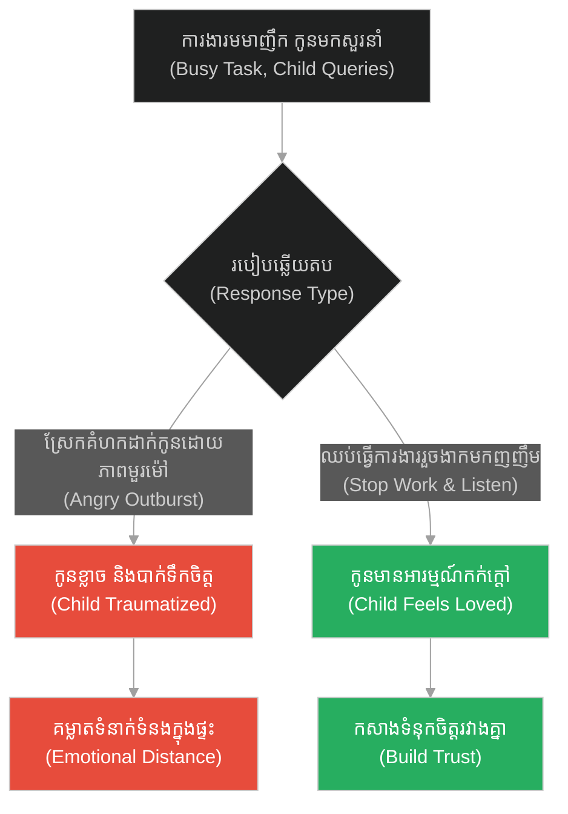
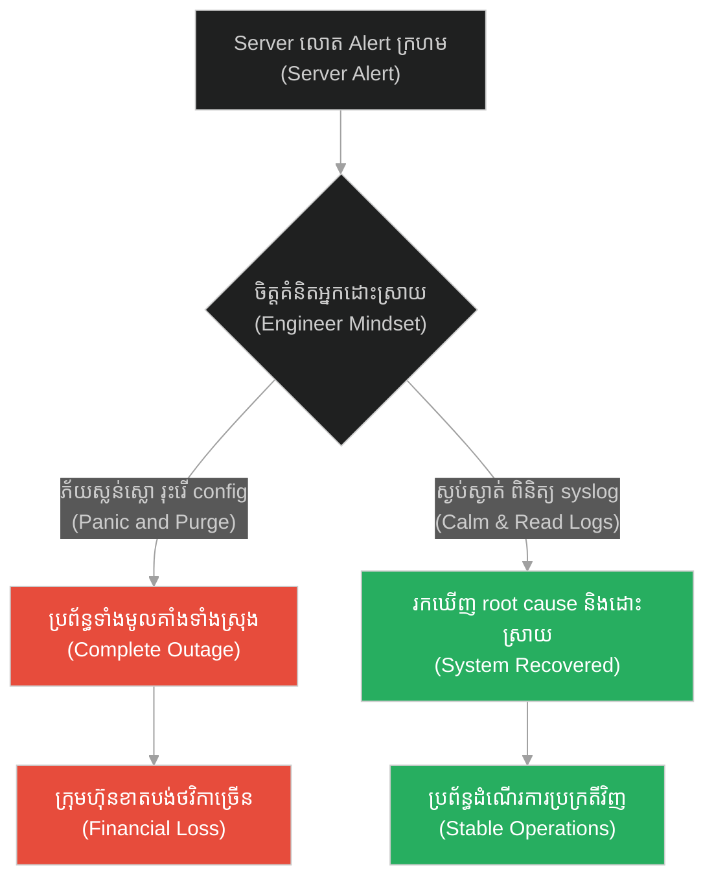
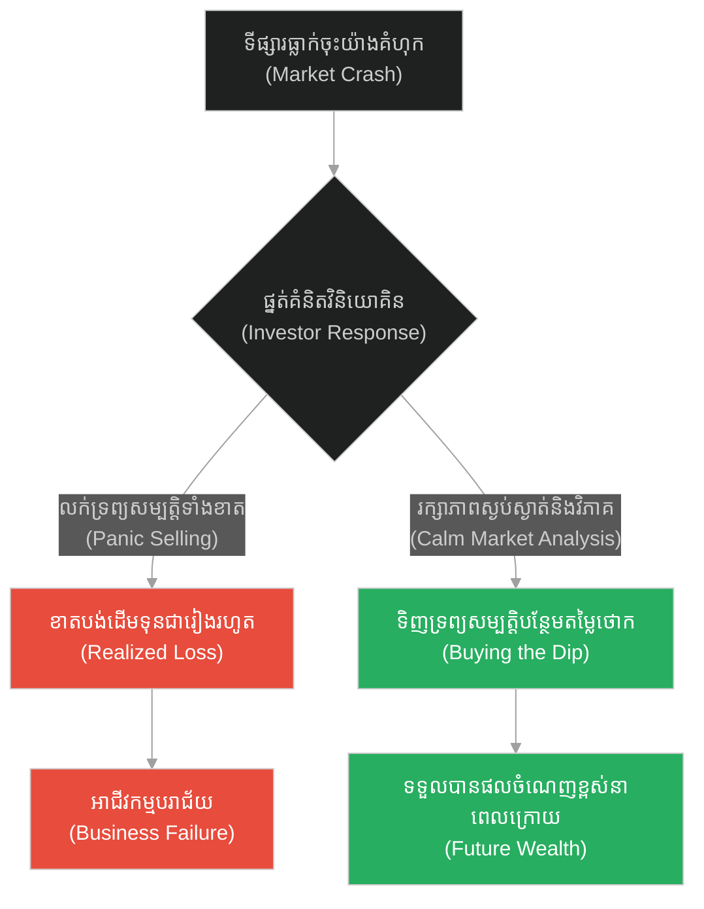
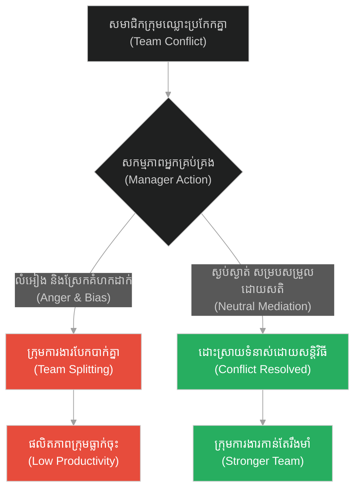
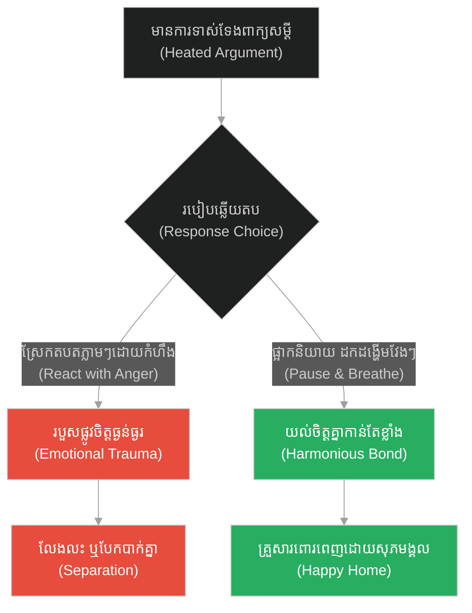
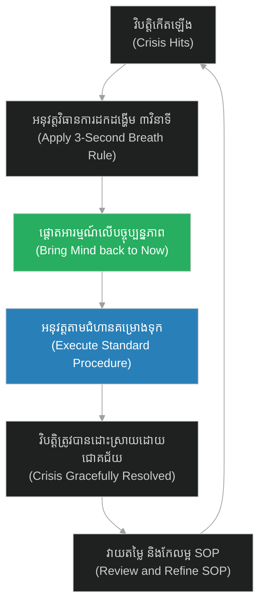

# Mindful Execution & Calmness (អ្នកឆុងតែ និងសាមូរ៉ៃ)៖ ការអនុវត្តដោយសតិ និងភាពស្ងប់ស្ងាត់ (Mindful Execution & Calmness & The Tea Master and the Samurai)

**Author:** ichamrong  
**Date:** 2026-05-28  
**Tags:** #buddhism #presence #fearlessness #mastery #mindfulness  
**Category:** Concepts  
**Read Time:** ~15 min  

---

## 📌 មាតិកា (Table of Contents)
- [អន្ទាក់ផ្លូវចិត្ត (The Trap)](#0)
- [១. រឿងព្រេងនិទាន៖ ការប្រឈមមុខនឹងសេចក្តីស្លាប់ (The Legend of Facing Death)](#1)
  - [សិល្បៈនៃការឆុងតែ (The Art of Tea)](#1-1)
- [២. បញ្ហា៖ ការអនុវត្តដោយសតិ និងភាពស្ងប់ស្ងាត់ (The Issue: Mindful Execution & Calmness)](#2)
- [៣. ឧទាហរណ៍ជាក់ស្តែងក្នុងពិភពពិត (Real World Examples)](#3)
  - [ឧទាហរណ៍ទី ១ — កម្រិតស្រាល (គ្រួសារ)៖ ការស្ដាប់កូនជជែកគ្នាក្នុងពេលមមាញឹក (The Family Presence)](#3-1)
  - [ឧទាហរណ៍ទី ២ — កម្រិតមធ្យម (បច្ចេកទេស)៖ ការដោះស្រាយបញ្ហាបន្ទាន់នៅលើ production (The Tech Incident Management)](#3-2)
  - [ឧទាហរណ៍ទី ៣ — កម្រិតមធ្យម (ធុរកិច្ច)៖ ការសម្រេចចិត្តវិនិយោគក្នុងពេលទីផ្សារធ្លាក់ចុះ (The Business Panic Selling)](#3-3)
  - [ឧទាហរណ៍ទី ៤ — កម្រិតមធ្យម (សង្គម/គ្រប់គ្រង)៖ ការសម្របសម្រួលជម្លោះរវាងសមាជិកក្រុម (The Management Conflict Resolution)](#3-4)
  - [ឧទាហរណ៍ទី ៥ — កម្រិតធ្ងន់ (ទំនាក់ទំនង)៖ ការរក្សាភាពស្ងប់ស្ងាត់ក្នុងពេលឈ្លោះប្រកែកគ្នា (The Relationship Calm Response)](#3-5)
- [៤. ដំណោះស្រាយទូទៅ៖ ការអភិវឌ្ឍ «សតិក្នុងសកម្មភាព» (The General Solution: Meditation in Action)](#4)
- [សេចក្តីសន្និដ្ឋាន (Conclusion)](#5)
- [ឯកសារយោង (References)](#6)
- [Related Posts](#7)

---

<a id="0"></a>
## អន្ទាក់ផ្លូវចិត្ត (The Trap)

តើអ្នកធ្លាប់ជួបប្រទះស្ថានភាពដែលសម្ពាធការងារ ឬការគំរាមកំហែងខាងក្រៅ ធ្វើឱ្យអ្នកភ័យស្លន់ស្លោ រហូតដល់ធ្វើឱ្យខូចខាតការងារ ឬធ្វើខុសកាន់តែធ្ងន់ធ្ងរដែរឬទេ? នេះគឺជា **«អន្ទាក់នៃប្រតិកម្មដោយក្តីបារម្ភ (Anxiety-Driven Reaction Trap)»**។ នៅពេលដែលចិត្តរបស់យើងភ័យខ្លាចចំពោះលទ្ធផលនាពេលអនាគត ឬកំហុសអតីតកាល យើងបាត់បង់ការគ្រប់គ្រងលើសកម្មភាពបច្ចុប្បន្ន ហើយធ្វើឱ្យកម្រិតសមត្ថភាពធ្លាក់ចុះយ៉ាងខ្លាំង។

*   **Side A (The Trap):** ការបណ្តោយឱ្យការភ័យខ្លាច និងការគិតរត់ទៅអនាគត (ខ្លាចចាញ់ ខ្លាចខូចការងារ) មកបំផ្លាញសមត្ថភាពបញ្ចេញសកម្មភាពបច្ចុប្បន្ន។
*   **Side B (Resilient Pattern):** ការរក្សាសតិឱ្យនៅនឹងបច្ចុប្បន្ន (Presence) អនុវត្តការងារដោយភាពស្ងប់ស្ងាត់ និងសមាធិ ១០០% ទោះបីជាកំពុងស្ថិតក្នុងស្ថានភាពគ្រោះថ្នាក់បំផុតក៏ដោយ។

នៅក្នុងអត្ថបទនេះ យើងនឹងសិក្សាពីរបៀបដែលទស្សនវិជ្ជាហ្សេន (Zen) បង្រៀនយើងឱ្យរក្សាបាននូវភាពស្ងប់ស្ងាត់ ដើម្បីយកឈ្នះលើរាល់វិបត្តិ និងបញ្ហាប្រឈមធំៗ។

---

<a id="1"></a>
## ១. រឿងព្រេងនិទាន៖ ការប្រឈមមុខនឹងសេចក្តីស្លាប់ (The Legend of Facing Death)

នៅប្រទេសជប៉ុនសម័យបុរាណ មានអ្នកជំនាញឆុងតែ (Tea Master) ដ៏ល្បីម្នាក់បម្រើការឱ្យព្រះរាជា។ ដោយសារតែឋានៈរបស់គាត់ គាត់ត្រូវស្លៀកពាក់ និងពាក់ដាវពីរដូចជាអ្នកចម្បាំងសាមូរ៉ៃ ទោះបីជាគាត់មិនចេះក្បាច់គុនទាល់តែសោះក៏ដោយ។

ថ្ងៃមួយ ពេលកំពុងបំពេញការងារនៅទីក្រុង មានសាមូរ៉ៃរ៉ូនិន (Ronin) ដ៏កាចសាហាវម្នាក់ចង់សាកល្បងក្បាច់គុន និងចង់បំបាក់មុខមន្ត្រីរាជវាំង។ គេបានស្ទាក់ផ្លូវអ្នកឆុងតែ រួចប្រកាសសុំប្រយុទ្ធមួយទល់នឹងមួយរហូតដល់ស្លាប់។ ការបដិសេធចំពោះការសុំប្រយុទ្ធនេះ គឺជាការអាម៉ាស់យ៉ាងធ្ងន់ធ្ងរដល់ខ្លួនឯង និងព្រះរាជា។

អ្នកឆុងតែភ័យខ្លាំងណាស់ ព្រោះដឹងថានៅថ្ងៃស្អែកខ្លួនច្បាស់ជាត្រូវស្លាប់ក្រោមផ្លែដាវសាមូរ៉ៃជាមិនខាន។ គាត់ក៏បានរត់ទៅសុំយោបល់ពីគ្រូបង្ហាត់សាមូរ៉ៃដ៏ល្បីម្នាក់ ដើម្បីសុំឱ្យបង្រៀនគាត់ពីរបៀបដកដាវ និងរបៀបស្លាប់ដោយកិត្តិយស។

<a id="1-1"></a>
### សិល្បៈនៃការឆុងតែ (The Art of Tea)

គ្រូសាមូរ៉ៃបានសម្លឹងមើលអ្នកឆុងតែ រួចពោលថា៖ *«ខ្ញុំនឹងបង្រៀនអ្នកពីរបៀបស្លាប់។ ប៉ុន្តែមុននឹងខ្ញុំបង្រៀន សូមអ្នកឆុងតែមួយពែងឱ្យខ្ញុំសិនចុះ។»*

អ្នកឆុងតែដឹងខ្លួនថានេះជាតែពែងចុងក្រោយនៃជីវិតគាត់ហើយ។ គាត់បានតាំងចិត្តយ៉ាងស្ងប់ស្ងាត់ លែងគិតពីការប្រយុទ្ធ លែងគិតពីសេចក្តីស្លាប់។ គាត់បានដាំទឹក រៀបចំពែង កូរតែដោយសកម្មភាពរលូន គ្មានការញាប់ញ័រ ផ្តោតអារម្មណ៍ ១០០% ទៅលើសិល្បៈនៃការឆុងតែ។ រាល់កាយវិការរបស់គាត់គឺពោរពេញទៅដោយតុល្យភាព និងសោភ័ណភាពឥតខ្ចោះ។

គ្រូសាមូរ៉ៃឃើញភាពស្ងប់ស្ងាត់នោះ ក៏ពោលថា៖
*«អ្នកមិនចាំបាច់រៀនពីរបៀបស្លាប់ទេ! នៅថ្ងៃស្អែក ពេលអ្នកជួបគូប្រកួត សូមអ្នកស្រមៃថាខ្លួនឯងកំពុងតែឆុងតែ។ លើកដាវរបស់អ្នកឡើងដោយសកម្មភាពស្ងប់ស្ងាត់ និងមានសមាធិដូចពេលអ្នកលើកកំសៀវទឹក។ សម្លឹងចំភ្នែកគូប្រកួតដោយសតិ គ្មានក្តីភ័យខ្លាច ហើយចាំកាប់ចុះទៅនៅពេលសាមូរ៉ៃនោះចូលមកដល់។»*

នៅថ្ងៃបន្ទាប់ អ្នកឆុងតែបានទៅជួបសាមូរ៉ៃកំណាចនោះ។ គាត់បានដកដាវចេញយឺតៗដោយភាពស្ងប់ស្ងាត់បំផុត (Presence) គ្មានភាពញាប់ញ័រ សម្លឹងចំភ្នែកគូប្រកួតដោយមិនព្រិចភ្នែក។ សាមូរ៉ៃកំណាចឃើញឥរិយាបថរបស់គូប្រកួតដែលគ្មានចន្លោះប្រហោង និងគ្មានភាពភ័យខ្លាចទាល់តែសោះ ក៏គិតថាអ្នកឆុងតែនេះជាកំពូលដាវលាក់មុខ។ គេក៏បាក់ស្បាត ទម្លាក់ដាវចុះ សុំទោស រួចដើរចេញទៅបាត់ដោយមិនបាច់ប្រយុទ្ធសោះ។

---

<a id="2"></a>
## ២. បញ្ហា៖ ការអនុវត្តដោយសតិ និងភាពស្ងប់ស្ងាត់ (The Issue: Mindful Execution & Calmness)

នៅក្នុងវិស្វកម្មប្រព័ន្ធ និងប្រតិបត្តិការបច្ចេកវិទ្យា នេះគឺដូចគ្នាបេះបិទទៅនឹង **Panic-Driven Incident Response (ការដោះស្រាយវិបត្តិដោយការភ័យស្លន់ស្លោ)**។ នៅពេលដែលប្រព័ន្ធបច្ចេកវិទ្យាជួបប្រទះការរំខានធ្ងន់ធ្ងរ (P1 Incident / Outage) អ្នកអភិវឌ្ឍន៍ដែលខ្វះសតិ តែងតែភ័យស្លន់ស្លោ រត់ចុះឡើង និង execute commands ផ្តេសផ្តាស (ដូចជាការ reboot configuration ឬ force delete database) ដែលធ្វើឱ្យបញ្ហាកាន់តែធ្ងន់ធ្ងរ។ រីឯវិស្វករដែលមានសតិ នឹងរក្សាភាពស្ងប់ស្ងាត់ និងអនុវត្តវិធានការដោះស្រាយជាជំហានៗ។

ខាងក្រោមនេះជាការប្រៀបធៀបកូដរវាង ប្រព័ន្ធដោះស្រាយដោយភ័យស្លន់ស្លោ (Panic Handler) និងប្រព័ន្ធដោះស្រាយដោយសតិស្ងប់ស្ងាត់ (Mindful Incident Handler)៖

### ឧទាហរណ៍កូដគំរូ (Python)

```python
# =====================================================================
# 1. គំរូមិនល្អ (Fragile Design): Panic-driven Incident Resolution
# =====================================================================
class PanicHandler:
    def handle_outage(self, database):
        print("[PANIC] Database response is slow! Core API failing!")
        # ភ័យខ្លាចរត់ទៅ Restart ម៉ាស៊ីនភ្លាមៗដោយមិនបានពិនិត្យមើល root cause
        print("[PANIC] Force rebooting the main database server immediately...")
        database.force_reboot()
        
        # ធ្វើឱ្យទិន្នន័យដែលកំពុងសរសេរ (Write Operations) ត្រូវខូចខាត (Data Corruption)
        print("[PANIC] Clean cache blindly without backing up logs...")
        database.clear_cache()
        print("[PANIC] System state is corrupted!")
```

```python
# =====================================================================
# 2. គំរូល្អ (Resilient Design): Mindful & Systematic Incident Resolution
# =====================================================================
class MindfulHandler:
    def handle_outage(self, database):
        print("[MINDFUL] Alert detected. Keep calm and follow the runbook.")
        
        # ជំហានទី ១: បង្វែរ Traffic ទៅកាន់ replica database ដើម្បីកាត់បន្ថយសម្ពាធ
        print("[MINDFUL] Rerouting write traffic to Read-Only Replica...")
        database.route_to_replica()
        
        # ជំហានទី ២: ពិនិត្យមើល Logs ស្វែងរក Root Cause
        slow_queries = database.get_slow_queries()
        print(f"[MINDFUL] Identified slow query on index: {slow_queries}")
        
        # ជំហានទី ៣: បន្ថែម index ឬបិទ Query នោះជាបណ្តោះអាសន្ន
        database.kill_query(slow_queries[0])
        print("[MINDFUL] System recovered gracefully with zero data corruption.")
```

---

<a id="3"></a>
## ៣. ឧទាហរណ៍ជាក់ស្តែងក្នុងពិភពពិត (Real World Examples)

<a id="3-1"></a>
### ឧទាហរណ៍ទី ១ — កម្រិតស្រាល (គ្រួសារ)៖ ការស្ដាប់កូនជជែកគ្នាក្នុងពេលមមាញឹក (The Family Presence)

*   **Dilemma:** ម្តាយដែលកំពុងតែធ្វើការងារមមាញឹក ពេលកូនមកសួរនាំ ក៏ស្រែកស្តីបន្ទោស ឬឆ្លើយតបដោយខឹងសម្បារព្រោះខ្វះការគ្រប់គ្រងអារម្មណ៍។
*   **Resolution:** ឈប់ធ្វើការងារមួយនាទី យកសតិមកដាក់នៅចំពោះមុខកូន ឆ្លើយតបដោយក្តីស្រលាញ់ និងទន់ភ្លន់។



<a id="3-2"></a>
### ឧទាហរណ៍ទី ២ — កម្រិតមធ្យម (បច្ចេកទេស)៖ ការដោះស្រាយបញ្ហាបន្ទាន់នៅលើ production (The Tech Incident Management)

*   **Dilemma:** System Admin ភ័យខ្លាចពេល server លោត alert ក្រហម ក៏លុប configurations ចោលទាំងអស់ ធ្វើឱ្យប្រព័ន្ធទាំងមូលគាំងទាំងស្រុង។
*   **Resolution:** រក្សាភាពស្ងប់ស្ងាត់ ពិនិត្យមើល syslog ជាមុន ហើយដោះស្រាយទៅតាម SOP ត្រឹមត្រូវ។



<a id="3-3"></a>
### ឧទាហរណ៍ទី ៣ — កម្រិតមធ្យម (ធុរកិច្ច)៖ ការសម្រេចចិត្តវិនិយោគក្នុងពេលទីផ្សារធ្លាក់ចុះ (The Business Panic Selling)

*   **Dilemma:** សហគ្រិនភ័យស្លន់ស្លោពេលឃើញភាគហ៊ុន ឬទីផ្សារធ្លាក់ចុះ ក៏លក់បង្ខូចទ្រព្យសម្បត្តិទាំងអស់ (Panic Sell) ខាតបង់ដើមទុន។
*   **Resolution:** វិភាគទីផ្សារដោយសតិ និងហេតុផល វាយតម្លៃស្ថានភាពអាជីវកម្មឡើងវិញ និងរក្សាទ្រព្យសម្បត្តិដែលមានសក្តានុពល។



<a id="3-4"></a>
### ឧទាហរណ៍ទី ៤ — កម្រិតមធ្យម (សង្គម/គ្រប់គ្រង)៖ ការសម្របសម្រួលជម្លោះរវាងសមាជិកក្រុម (The Management Conflict Resolution)

*   **Dilemma:** អ្នកគ្រប់គ្រងក្រុមដែលខឹង និងស្រែកគំហកដាក់សមាជិកពីរនាក់ដែលកំពុងឈ្លោះគ្នា ធ្វើឱ្យជម្លោះកាន់តែរីករាលដាល។
*   **Resolution:** ស្តាប់ភាគីទាំងសងខាងដោយក្តីមេត្តា និងមិនលម្អៀង រៀបចំកិច្ចប្រជុំដោយសន្តិវិធីដើម្បីស្វែងរកដំណោះស្រាយឈ្នះ-ឈ្នះ។



<a id="3-5"></a>
### ឧទាហរណ៍ទី ៥ — កម្រិតធ្ងន់ (ទំនាក់ទំនង)៖ ការរក្សាភាពស្ងប់ស្ងាត់ក្នុងពេលឈ្លោះប្រកែកគ្នា (The Relationship Calm Response)

*   **Dilemma:** ប្តីប្រពន្ធឈ្លោះគ្នា ម្នាក់ៗស្រែកជេរប្រមាថ និងរំលឹកកំហុសចាស់ៗរបស់គ្នាទៅវិញទៅមក ធ្វើឱ្យស្នេហាបាក់បែក។
*   **Resolution:** ដើរចេញទៅខាងក្រៅដើម្បីតាំងចិត្តឱ្យស្ងប់ (Take a breath) រួចត្រឡប់មកពិភាក្សាគ្នាដោយហេតុផល និងក្តីមេត្តា។



---

<a id="4"></a>
## ៤. ដំណោះស្រាយទូទៅ៖ ការអភិវឌ្ឍ «សតិក្នុងសកម្មភាព» (The General Solution: Meditation in Action)

ដើម្បីបណ្តុះបាននូវភាពស្ងប់ស្ងាត់ចំពោះមុខគ្រោះថ្នាក់៖

1.  **ផ្អាកប្រតិកម្ម (Pause - 3 Second Rule):** នៅពេលជួបប្រទះការរំភើប ឬការភ័យខ្លាចខ្លាំង ត្រូវផ្អាកប្រតិកម្ម ៣ វិនាទី ហើយដកដង្ហើមឱ្យវែងបំផុត។
2.  **ផ្តោតលើកិច្ចការបច្ចុប្បន្ន (Focus on Process):** ឈប់បារម្ភពី «ការឈ្នះ/ចាញ់» ប៉ុន្តែត្រូវផ្តោតលើ «គុណភាពនៃសកម្មភាពនីមួយៗ» ដូចជាការឆុងតែ ឬការអានបន្ទាត់កូដ។
3.  **បង្កើតផែនការដោះស្រាយវិបត្តិ (SOP/Runbook):** ការត្រៀមខ្លួនជាមុនជួយកាត់បន្ថយការភ័យស្លន់ស្លោពេលមានបញ្ហាកើតឡើង។



---

## 🐇 ធ្លាក់ចូលក្នុងរន្ធទន្សាយ (Enter the Rabbit Hole)
ដើម្បីស្វែងយល់ពីរបៀបដែលការប្រឈមមុខនឹងឧបសគ្គជីវិត និងការព្យាយាមរុះរើដីចេញពីខ្លួន អាចប្រែក្លាយបញ្ហាទាំងនោះទៅជាកាំជណ្តើរនៃការរីកចម្រើន សូមបន្តដំណើរទៅកាន់៖

* 🚀 **[ចាប់ផ្តើមដំណើររុករក (Start the Journey) ➔ Antifragility & Technical Debt Overcoming](./174-buddha-and-the-donkey-in-the-well.md)**

---

<a id="5"></a>
## សេចក្តីសន្និដ្ឋាន (Conclusion)

> **«កុំព្យាយាមតស៊ូប្រយុទ្ធនឹងការរំខានផ្លូវចិត្ត ប៉ុន្តែត្រូវផ្តោតលើការរក្សាសតិស្ងប់ស្ងាត់នៅក្នុងរាល់កាយវិការដែលអ្នកកំពុងធ្វើ។»**

ភាពស្ងប់ស្ងាត់ និងសមាធិ មិនមែនជាការអង្គុយធ្មេចភ្នែកនៅក្នុងព្រៃស្ងប់ស្ងាត់នោះទេ ប៉ុន្តែវាគឺជាសមត្ថភាពក្នុងការរក្សាចិត្តគំនិតរបស់ខ្លួនឱ្យស្ងប់ និងគ្មានការភ័យខ្លាចទោះបីជាកំពុងឈរប្រឈមមុខនឹងសត្រូវ ឬវិបត្តិធំៗក្នុងជីវិតក៏ដោយ។ នៅពេលដែលចិត្តរបស់អ្នកស្ងប់ អ្វីៗគ្រប់យ៉ាងនឹងស្ថិតនៅក្រោមការគ្រប់គ្រងរបស់អ្នក។

---

<a id="6"></a>
## ឯកសារយោង (References)

*   **Suzuki, Shunryu** — *Zen Mind, Beginner's Mind* (1970). ពន្យល់អំពីទស្សនៈ Zen presence និងសមាធិនៅក្នុងកាយវិការប្រចាំថ្ងៃ។
*   **Tolle, Eckhart** — *The Power of Now* (1997). សិក្សាអំពីថាមពលនៃបច្ចុប្បន្នភាព ដែលលុបបំបាត់ក្តីភ័យខ្លាចដែលកើតចេញពីការស្រមៃអនាគត។

---

<a id="7"></a>
## Related Posts

* [Antifragility & Technical Debt Overcoming (សត្វលាធ្លាក់អណ្តូង)](./174-buddha-and-the-donkey-in-the-well.md) — របៀបបំប្លែងសម្ពាធខាងក្រៅឱ្យទៅជាកាំជណ្តើរនៃការរីកចម្រើន។
* [Root Cause Remediation & Dependency Isolation (អណ្តូងទឹកពុល)](./175-buddha-and-the-poisoned-well.md) — របៀបស្វែងរក និងដោះស្រាយបញ្ហាពីឫសគល់ដើម្បីធានាស្ថិរភាពប្រព័ន្ធ។
