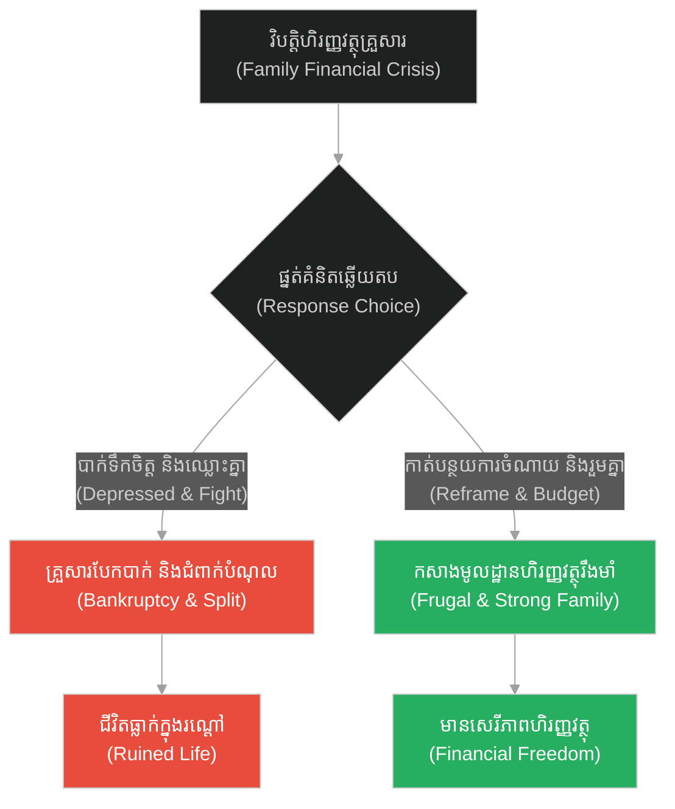
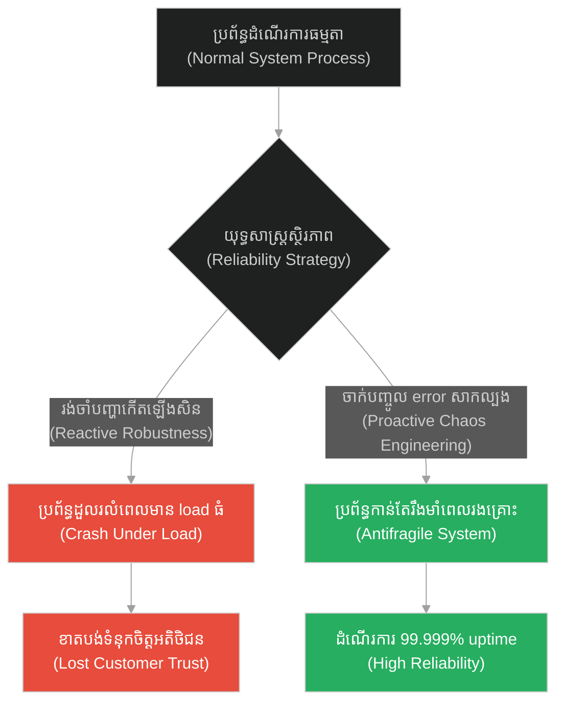
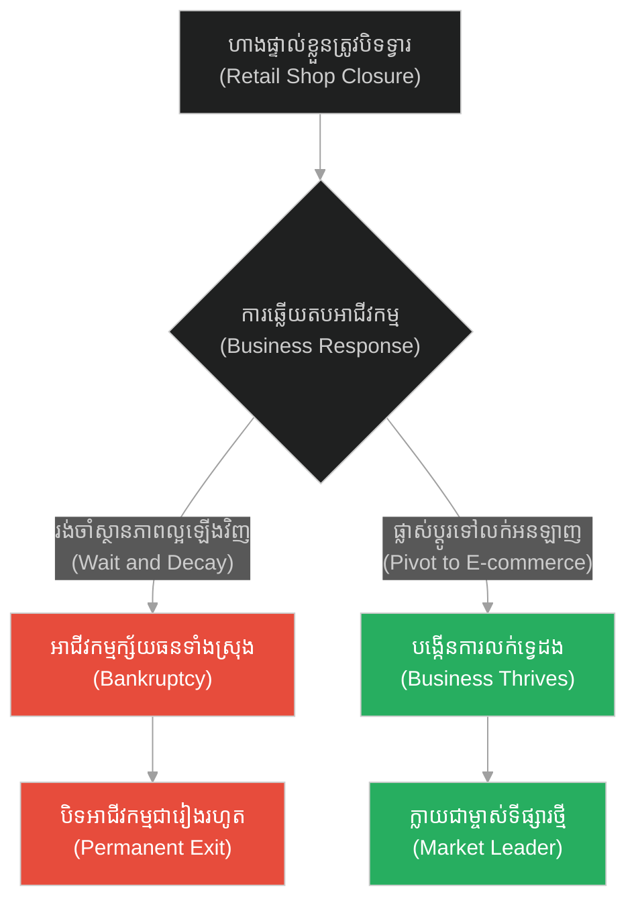
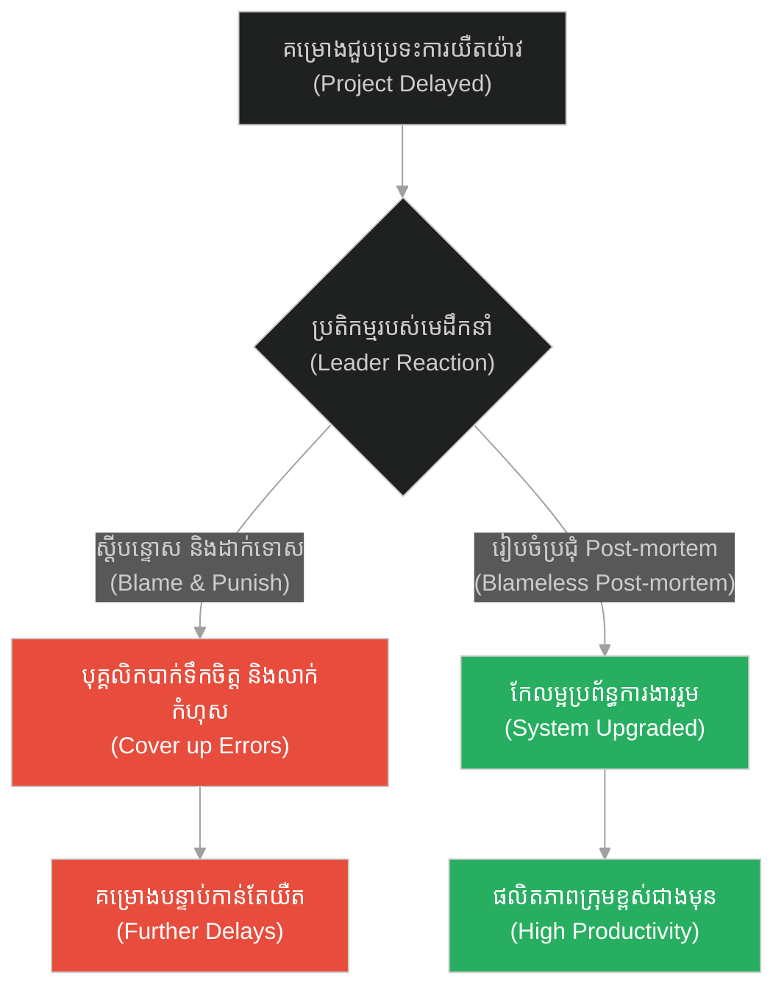
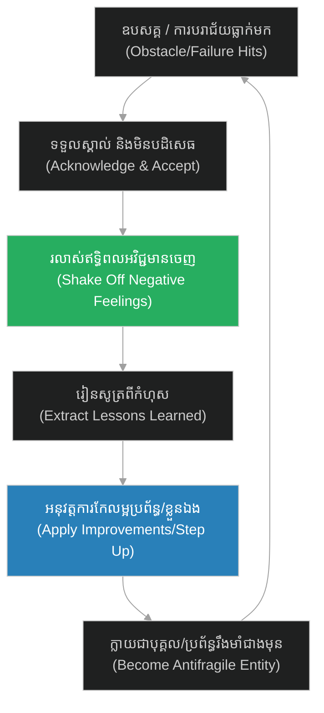

# Antifragility & Technical Debt Overcoming (សត្វលាធ្លាក់អណ្តូង)៖ ភាពមិនបាក់បែក និងការជម្នះបំណុលបច្ចេកទេស (Antifragility & Technical Debt Overcoming & The Donkey in the Well)

**Author:** ichamrong  
**Date:** 2026-05-28  
**Tags:** #buddhism #resilience #adversity #reframing #stepping-stones  
**Category:** Concepts  
**Read Time:** ~15 min  

---

## 📌 មាតិកា (Table of Contents)
- [អន្ទាក់ផ្លូវចិត្ត (The Trap)](#0)
- [១. រឿងព្រេងនិទាន៖ សត្វលាធ្លាក់អណ្តូង (The Legend of The Donkey in the Well)](#1)
  - [អង្រួនវាចេញ ហើយឈានជើងឡើង (Shake it Off and Step Up)](#1-1)
- [២. បញ្ហា៖ ភាពមិនបាក់បែក និងការជម្នះបំណុលបច្ចេកទេស (The Issue: Antifragility & Technical Debt Overcoming)](#2)
- [៣. ឧទាហរណ៍ជាក់ស្តែងក្នុងពិភពពិត (Real World Examples)](#3)
  - [ឧទាហរណ៍ទី ១ — កម្រិតស្រាល (គ្រួសារ)៖ ការផ្លាស់ប្តូរទម្លាប់ចាយវាយក្នុងគ្រួសារក្រោយជួបវិបត្តិ (The Family Financial Reframe)](#3-1)
  - [ឧទាហរណ៍ទី ២ — កម្រិតមធ្យម (បច្ចេកទេស)៖ ការកសាង Chaos Engineering និងប្រព័ន្ធ Fault Tolerance (The Tech Chaos Engineering)](#3-2)
  - [ឧទាហរណ៍ទី ៣ — កម្រិតមធ្យម (ធុរកិច្ច)៖ ការផ្លាស់ប្តូរទម្រង់អាជីវកម្មក្រោយពេលមានវិបត្តិសេដ្ឋកិច្ច (The Business Pivot)](#3-3)
  - [ឧទាហរណ៍ទី ៤ — កម្រិតមធ្យម (សង្គម/គ្រប់គ្រង)៖ ការរៀនសូត្រពីកំហុសគម្រោង និងការរៀបចំ Post-mortem (The Management Post-mortem)](#3-4)
  - [ឧទាហរណ៍ទី ៥ — កម្រិតធ្ងន់ (ទំនាក់ទំនង)៖ ការពង្រឹងចំណងស្នេហាក្រោយការយល់ច្រឡំគ្នា (The Relationship Trust Rebuild)](#3-5)
- [៤. ដំណោះស្រាយទូទៅ៖ ការកសាងផ្នត់គំនិត «មិនអាចកប់បាន» (The General Solution: Building the Unburiable Mindset)](#4)
- [សេចក្តីសន្និដ្ឋាន (Conclusion)](#5)
- [ឯកសារយោង (References)](#6)
- [Related Posts](#7)

---

<a id="0"></a>
## អន្ទាក់ផ្លូវចិត្ត (The Trap)

តើអ្នកធ្លាប់ជួបប្រទះការវាយប្រហារ ឧបសគ្គ ឬការបាត់បង់ធំៗ ដែលធ្វើឱ្យអ្នកមានអារម្មណ៍ថាខ្លួនឯងត្រូវបានគេកប់ទាំងរស់ដែរឬទេ? នេះគឺជា **«អន្ទាក់នៃផ្នត់គំនិតជនរងគ្រោះ (Victim Mindset Trap)»**។ នៅពេលដែលបញ្ហារត់មករកយើង មនុស្សភាគច្រើនជ្រើសរើសការដេកយំ និងបន្ទោសព្រហ្មលិខិត ដោយបណ្តោយឱ្យដីខ្សាច់នៃឧបសគ្គកប់ខ្លួនពួកគេរហូតដល់លែងដឹងខ្លួន។

*   **Side A (The Trap):** ការចុះចាញ់នឹងការលំបាក បណ្តោយឱ្យដី (បញ្ហា ការរិះគន់) កប់ខ្លួនឯងទាំងរស់ ដោយសារតែគិតថាគ្មានសង្ឃឹម។
*   **Side B (Resilient Pattern):** ផ្នត់គំនិត Antifragility (ភាពមិនបាក់បែក) — កាន់តែរងការវាយប្រហារ កាន់តែរឹងមាំ ដោយយកដីដែលគេចាក់មកលើខ្លួនមកធ្វើជាជណ្តើរឈានជើងឡើង។

នៅក្នុងអត្ថបទនេះ យើងនឹងស្វែងយល់ពីរបៀបបំប្លែងរាល់ការវាយប្រហារ វិបត្តិ ឬបំណុលបច្ចេកទេស (Technical Debt) ឱ្យទៅជាកម្លាំងជម្រុញនៃការអភិវឌ្ឍន៍ប្រព័ន្ធ និងជីវិត។

---

<a id="1"></a>
## ១. រឿងព្រេងនិទាន៖ សត្វលាធ្លាក់អណ្តូង (The Legend of The Donkey in the Well)

ថ្ងៃមួយ មានសត្វលាចាស់មួយក្បាលរបស់កសិករម្នាក់ បានរអិលជើងធ្លាក់ចូលទៅក្នុងអណ្តូងស្ងួតដ៏ជ្រៅមួយ។ សត្វលាបានយំស្រែកយ៉ាងគួរឱ្យអាណិតពេញមួយថ្ងៃ ខណៈដែលកសិករព្យាយាមរកវិធីទាញវាឡើងវិញ តែរកមិនឃើញសោះ។

ដោយសារតែសត្វលាក៏ចាស់ ហើយអណ្តូងនោះក៏លែងមានទឹក និងត្រូវការលុបចោលដើម្បីកុំឱ្យមានគ្រោះថ្នាក់ កសិករក៏សម្រេចចិត្តថា៖ វិធីល្អបំផុតគឺត្រូវកប់សត្វលានោះចោលនៅក្នុងអណ្តូងតែម្តង ដើម្បីបញ្ចប់ការឈឺចាប់របស់វា និងជៀសវាងការខាតបង់ពេលវេលា។

កសិករបានហៅអ្នកជិតខាងពីរបីនាក់មកជួយ។ ពួកគេម្នាក់ៗបានកាន់ប៉ែល និងចាប់ផ្តើមកាយដីចាក់ទម្លាក់ចូលទៅក្នុងអណ្តូង។ នៅពេលដែលដីធ្លាក់មកប៉ះខ្នងវាដំបូងៗ សត្វលាបានដឹងខ្លួនថាគេកំពុងតែកប់វាឱ្យស្លាប់ទាំងរស់ វាក៏បានស្រែកយំយ៉ាងខ្លាំងដោយក្តីអស់សង្ឃឹម។

<a id="1-1"></a>
### អង្រួនវាចេញ ហើយឈានជើងឡើង (Shake it Off and Step Up)

ប៉ុន្តែបន្តិចក្រោយមក សត្វលាស្រាប់តែស្ងាត់មាត់ឈឹង។ កសិករដោយក្តីងឿងឆ្ងល់ ក៏បានអោនមើលទៅក្នុងអណ្តូង ហើយបានឃើញទិដ្ឋភាពដ៏គួរឱ្យភ្ញាក់ផ្អើលមួយ។

រាល់ពេលដែលដីមួយប៉ែលត្រូវបានចាក់មកលើខ្នងវា សត្វលាមិនបានដេកចាំស្លាប់ឡើយ។ វាបាន **«រលាស់ដីចេញពីខ្នង (Shake it off)»** ហើយយកជើង **«ជាន់ពីលើដីនោះ (Step up)»**។

អ្នកភូមិកាន់តែចាក់ដីចូល សត្វលាកាន់តែរលាស់ដីចេញ ហើយឈានជើងជាន់ពីលើដីនោះឱ្យហាប់។ មិនយូរប៉ុន្មាន កម្ពស់ដីបានកើនឡើងជាលំដាប់ រហូតធ្វើឱ្យសត្វលាអាចឈានជើងចេញពីមាត់អណ្តូងដោយសុវត្ថិភាព ហើយដើរចេញទៅបាត់ដោយក្តីរីករាយ។

---

<a id="2"></a>
## ២. បញ្ហា៖ ភាពមិនបាក់បែក និងការជម្នះបំណុលបច្ចេកទេស (The Issue: Antifragility & Technical Debt Overcoming)

នៅក្នុងវិស្វកម្មសូហ្វវែរ (Software Engineering) គំនិតនេះគឺដូចគ្នាបេះបិទទៅនឹង **Antifragility (ភាពមិនបាក់បែក)** និងការគ្រប់គ្រង **Technical Debt (បំណុលបច្ចេកទេស)**។ ប្រព័ន្ធដែលផុយស្រួយ (Fragile System) នឹងគាំង ឬខូចទិន្នន័យនៅពេលមានកំហុស (Error) ឬ Load ធ្ងន់ធ្លាក់មកលើវា។ ផ្ទុយទៅវិញ ប្រព័ន្ធដែលមិនបាក់បែក (Antifragile System) នឹងប្រើប្រាស់កំហុសទាំងនោះ ដើម្បីរៀនសូត្រ កែលម្អរចនាសម្ព័ន្ធ និងប្រែក្លាយបញ្ហាឱ្យទៅជាខែលការពារខ្លួន។

ខាងក្រោមនេះជាការប្រៀបធៀបកូដរវាង ប្រព័ន្ធផុយស្រួយ (Fragile Error Handling) និងប្រព័ន្ធមិនបាក់បែក (Antifragile Self-Healing)៖

### ឧទាហរណ៍កូដគំរូ (Python)

```python
# =====================================================================
# 1. គំរូមិនល្អ (Fragile Design): Crashes and Decays Under Stress
# =====================================================================
class FragileService:
    def __init__(self):
        self.is_active = True

    def process_transaction(self, amount):
        if not self.is_active:
            raise RuntimeError("Service is dead!")
        try:
            # ប្រសិនបើ API ក្រៅមានកំហុស វានឹងធ្វើឱ្យ Thread ទាំងមូលគាំង
            if amount <= 0:
                raise ValueError("Bad Amount")
            print(f"Transaction processed: ${amount}")
        except Exception as e:
            self.is_active = False # ប្រព័ន្ធបិទដំណើរការទាំងស្រុងពេលជួបបញ្ហា
            print(f"[FRAGILE ERROR] System collapsed due to: {e}")
```

```python
# =====================================================================
# 2. គំរូល្អ (Resilient/Antifragile Design): Shakes off errors & adapts
# =====================================================================
class AntifragileService:
    def __init__(self):
        self.error_log = {}
        self.circuit_open = False

    def process_transaction(self, amount):
        if self.circuit_open:
            print("[ANTIFRAGILE] Circuit is open. Routing to fallback channel...")
            return self.fallback_process(amount)

        try:
            if amount <= 0:
                raise ValueError("Bad Amount")
            print(f"Transaction processed: ${amount}")
        except Exception as e:
            # រលាស់ដីចេញ: កត់ត្រាកំហុស និងបន្តដំណើរការ
            err_msg = str(e)
            self.error_log[err_msg] = self.error_log.get(err_msg, 0) + 1
            print(f"[ANTIFRAGILE] Shook off error: {err_msg}. Count: {self.error_log[err_msg]}")
            
            # ឈានជើងឡើង: ប្រសិនបើកំហុសដដែលកើតឡើងលើសពី ៣ដង បើក Circuit Breaker ស្វ័យប្រវត្ត
            if self.error_log[err_msg] >= 3:
                self.circuit_open = True
                print("[ANTIFRAGILE] Auto-adapted! Circuit Breaker enabled to protect system.")
            return False
        return True

    def fallback_process(self, amount):
        print(f"Fallback processed transaction: ${amount} via offline queue.")
        return True
```

---

<a id="3"></a>
## ៣. ឧទាហរណ៍ជាក់ស្តែងក្នុងពិភពពិត (Real World Examples)

<a id="3-1"></a>
### ឧទាហរណ៍ទី ១ — កម្រិតស្រាល (គ្រួសារ)៖ ការផ្លាស់ប្តូរទម្លាប់ចាយវាយក្នុងគ្រួសារក្រោយជួបវិបត្តិ (The Family Financial Reframe)

*   **Dilemma:** គ្រួសារធ្លាក់ខ្លួនក្រខ្សត់ភ្លាមៗដោយសារជំងឺ (ដីចាក់មកលើ) បង្កឱ្យមានការបាក់ទឹកចិត្ត និងឈ្លោះប្រកែកគ្នា។
*   **Resolution:** ប្រើប្រាស់វិបត្តិនេះជាឱកាសដើម្បីរៀបចំផែនការហិរញ្ញវត្ថុថ្មី កាត់បន្ថយការចំណាយមិនចាំបាច់ ធ្វើឱ្យគ្រួសារមានសាមគ្គីភាព និងសន្សំសំចៃជាងមុន។



<a id="3-2"></a>
### ឧទាហរណ៍ទី ២ — កម្រិតមធ្យម (បច្ចេកទេស)៖ ការកសាង Chaos Engineering និងប្រព័ន្ធ Fault Tolerance (The Tech Chaos Engineering)

*   **Dilemma:** ការរង់ចាំប្រព័ន្ធដួលរលំទើបទៅជួសជុល នាំឱ្យខាតបង់ថវិកាច្រើន និងបាត់បង់ទំនុកចិត្តអតិថិជន។
*   **Resolution:** ប្រើប្រាស់ Chaos Engineering (ដូចជា Chaos Monkey) ដើម្បីវាយប្រហារប្រព័ន្ធខ្លួនឯងដោយចេតនា ដើម្បីស្វែងរកចំណុចខ្សោយ និងពង្រឹងភាពធន់របស់ប្រព័ន្ធ។



<a id="3-3"></a>
### ឧទាហរណ៍ទី ៣ — កម្រិតមធ្យម (ធុរកិច្ច)៖ ការផ្លាស់ប្តូរទម្រង់អាជីវកម្មក្រោយពេលមានវិបត្តិសេដ្ឋកិច្ច (The Business Pivot)

*   **Dilemma:** ហាងលក់ទំនិញផ្ទាល់ត្រូវបិទទ្វារដោយសារវិបត្តិសកល (ដីចាក់មកលើ) បង្កឱ្យសហគ្រិនប្រឈមការក្ស័យធន។
*   **Resolution:** រលាស់ខ្លួនចេញពីហាងចាស់ ហើយឈានជើងឡើងដោយប្តូរទៅលក់អនឡាញ (E-commerce Pivot) បង្កើនការលក់បានទូទាំងប្រទេស។



<a id="3-4"></a>
### ឧទាហរណ៍ទី ៤ — កម្រិតមធ្យម (សង្គម/គ្រប់គ្រង)៖ ការរៀនសូត្រពីកំហុសគម្រោង និងការរៀបចំ Post-mortem (The Management Post-mortem)

*   **Dilemma:** គម្រោងធំមួយត្រូវបានពន្យារពេល (Delayed) មេដឹកនាំក្រុមចាប់ផ្តើមស្តីបន្ទោស និងដាក់ទោសសមាជិក ធ្វើឱ្យស្មារតីក្រុមធ្លាក់ចុះ។
*   **Resolution:** រៀបចំការប្រជុំ Post-mortem ដោយគ្មានការស្តីបន្ទោស (Blameless Post-mortem) ដើម្បីសិក្សាពីប្រព័ន្ធ និងកែប្រែ Workflow ឱ្យកាន់តែរហ័ស។



<a id="3-5"></a>
### ឧទាហរណ៍ទី ៥ — កម្រិតធ្ងន់ (ទំនាក់ទំនង)៖ ការពង្រឹងចំណងស្នេហាក្រោយការយល់ច្រឡំគ្នា (The Relationship Trust Rebuild)

*   **Dilemma:** ដៃគូមានជម្លោះនិងការយល់ច្រឡំធំមួយ (ដីចាក់មកលើ) បង្កឱ្យមានការបែកបាក់ទំនុកចិត្ត។
*   **Resolution:** ប្រើប្រាស់ការយល់ច្រឡំនោះជាស្ពានដើម្បីបើកចិត្តនិយាយរឿងរ៉ាវលាក់កំបាំង ធ្វើឱ្យយល់ចិត្តគ្នា និងស្រលាញ់គ្នាច្រើនជាងមុន។

```mermaid
%%{init: {
  'theme': 'dark',
  'themeVariables': {
    'background': '#1e1e1e',
    'primaryTextColor': '#ffffff',
    'lineColor': '#a0a0a0'
  },
  'themeCSS': 'svg { background-color: #1e1e1e !important; padding: 1rem !important; border-radius: 8px !important; } .edgeLabel rect { fill: #1e1e1e !important; } text, tspan { fill: #ffffff !important; }'
}}%%
graph TD
    A["ការយល់ច្រឡំ និងឈ្លោះគ្នា<br/>(Big Misunderstanding)"] --> B{"របៀបដោះស្រាយ<br/>(Conflict Resolution)"}
    B -- "លាក់គំនុំ និងមិននិយាយគ្នា<br/>(Cold War & Silent)" --> C["ទំនាក់ទំនងបែកបាក់ជារៀងរហូត<br/>(Broken Trust)""]
    B -- "បើកចិត្តនិយាយរឿងពិត<br/>(Honest Talk)" --> D["ស្នេហាកាន់តែស្អិតរមួត<br/>(Deepened Bond)""]
    C --> E["លែងលះ ឬបែកគ្នា<br/>(Split Up)"]
    D --> F["គ្រួសារមានស្ថិរភាពផ្លូវចិត្ត<br/>(Stable Family)"]
    style C fill:#e74c3c,color:#fff
    style E fill:#e74c3c,color:#fff
    style D fill:#27ae60,color:#fff
    style F fill:#27ae60,color:#fff
```

---

<a id="4"></a>
## ៤. ដំណោះស្រាយទូទៅ៖ ការកសាងផ្នត់គំនិត «មិនអាចកប់បាន» (The General Solution: Building the Unburiable Mindset)

ដើម្បីសាងសង់ភាពមិនបាក់បែកចំពោះមុខឧបសគ្គ៖

1.  **ផ្លាស់ប្តូរជ្រុងនៃការគិត (Reframing):** ឈប់សួរថា «ហេតុអ្វីបានជារឿងនេះកើតឡើងចំពោះខ្ញុំ?» តែត្រូវសួរថា «តើរឿងនេះចង់បង្រៀនអ្វីដល់ខ្ញុំ?»។
2.  **រលាស់ខ្លួនភ្លាមៗ (Shake off Instantly):** កុំរក្សាទុកការឈឺចាប់ ការរិះគន់ ឬកំហុសឆ្គងទុកជាបន្ទុកចិត្ត ត្រូវរលាស់វាចេញជាប្រចាំ។
3.  **ជាន់លើបញ្ហា (Step Up):** យកព័ត៌មានដែលបានពីរៀនសូត្រពីកំហុសនោះមកកែលម្អខ្លួន ឬប្រព័ន្ធរបស់អ្នក ដើម្បីឈានទៅរកកម្រិតខ្ពស់ជាងមុន។



---

## 🐇 ធ្លាក់ចូលក្នុងរន្ធទន្សាយ (Enter the Rabbit Hole)
ដើម្បីស្វែងយល់ពីរបៀបដែលការស្វែងរក និងដោះស្រាយបញ្ហាពីប្រភពឫសគល់ (Root Cause) អាចជួយការពារប្រព័ន្ធពីការពុល និងស្ថិរភាពយូរអង្វែង សូមបន្តដំណើរទៅកាន់៖

* 🚀 **[ចាប់ផ្តើមដំណើររុករក (Start the Journey) ➔ Root Cause Remediation & Dependency Isolation](./175-buddha-and-the-poisoned-well.md)**

---

<a id="5"></a>
## សេចក្តីសន្និដ្ឋាន (Conclusion)

> **«អ្វីដែលមិនអាចសម្លាប់យើងបាន នឹងធ្វើឱ្យយើងកាន់តែរឹងមាំជាងមុនជានិច្ច។» — ហ្វ្រីឌ្រីច នីតសៀ (Friedrich Nietzsche)**

ជីវិត និងការងារ នឹងចាក់ដីមកលើខ្នងរបស់អ្នកជានិច្ច។ កុំខ្លាចដីទាំងនោះ កុំខ្លាចការរិះគន់ កុំខ្លាចកំហុសឆ្គង។ ដរាបណាអ្នកនៅតែរក្សាផ្នត់គំនិត «រលាស់ចេញ និងឈានជើងឡើង» នោះរាល់ដីដែលគេបម្រុងកប់អ្នក នឹងក្លាយទៅជាជណ្តើរនាំអ្នកឡើងទៅកាន់ទីខ្ពស់ និងទទួលបានសេរីភាពពិតប្រាកដ។

---

<a id="6"></a>
## ឯកសារយោង (References)

*   **Taleb, Nassim Nicholas** — *Antifragile: Things That Gain from Disorder* (2012). ណែនាំទ្រឹស្តី Antifragility ដែលជាប្រព័ន្ធកាន់តែរឹងមាំពេលរងសម្ពាធ។
*   **Dweck, Carol S.** — *Mindset: The New Psychology of Success* (2006). សិក្សាអំពី Growth Mindset ដែលបំប្លែងរាល់ឧបសគ្គឱ្យទៅជាកាំជណ្តើរនៃការអភិវឌ្ឍន៍ខ្លួន។

---

<a id="7"></a>
## Related Posts

* [Root Cause Remediation & Dependency Isolation (អណ្តូងទឹកពុល)](./175-buddha-and-the-poisoned-well.md) — របៀបបែងចែក និងកាត់ផ្តាច់ការពឹងពាក់ដើម្បីការពារស្ថិរភាពប្រព័ន្ធ។
* [Cross-team Collaboration & Bystander Effect (សាម៉ារីដ៏សប្បុរស)](./176-jesus-and-the-good-samaritan.md) — របៀបសហការគ្នាដើម្បីជម្នះឧបសគ្គឆ្លងផ្នែក។
