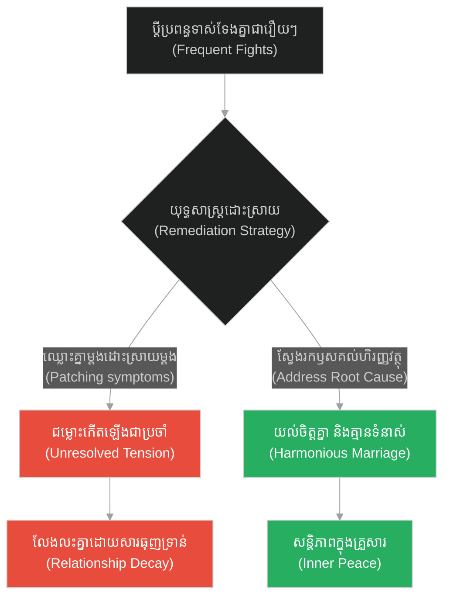
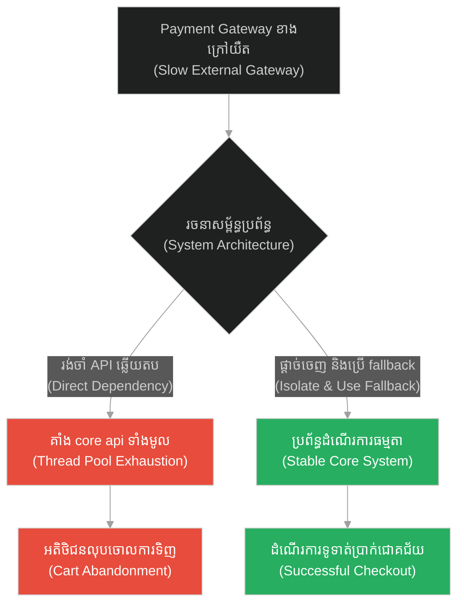
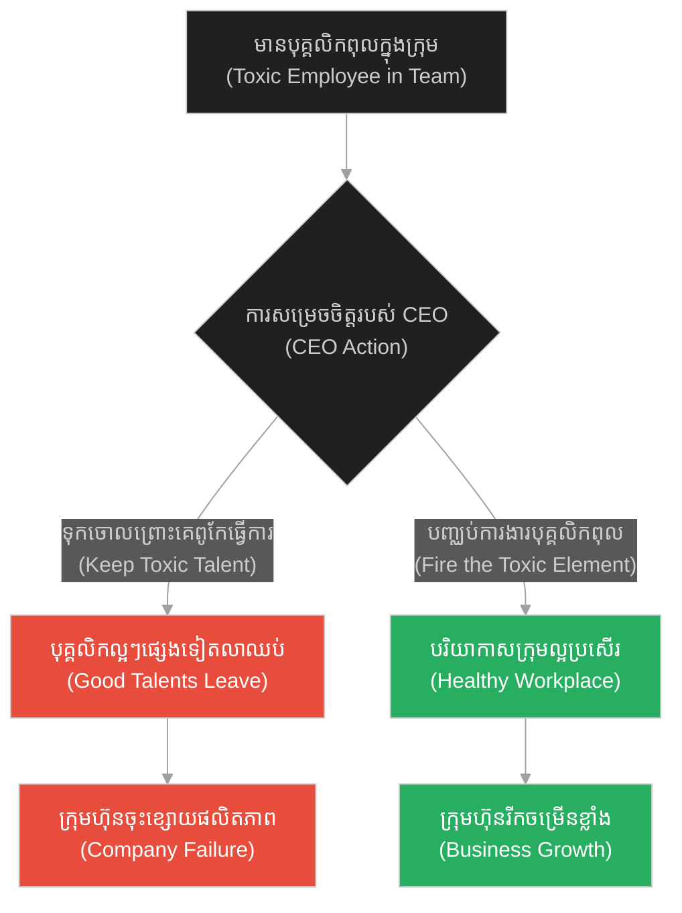
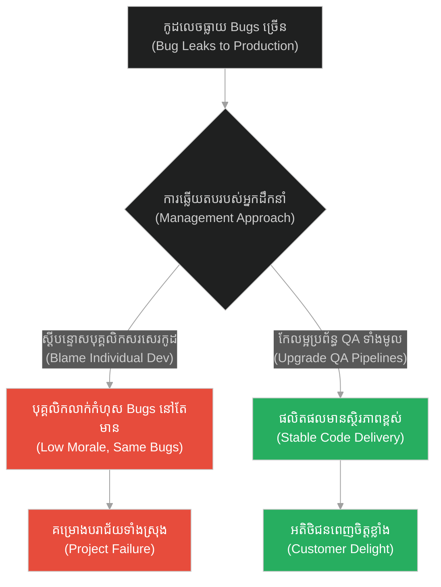
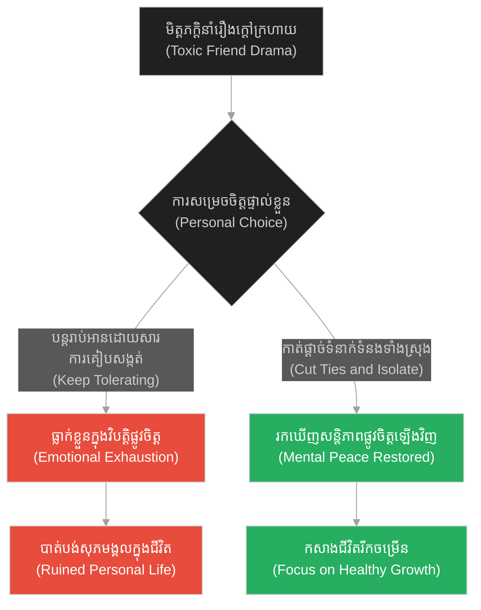
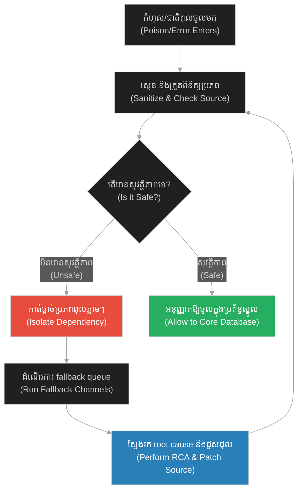

# Root Cause Remediation & Dependency Isolation (អណ្តូងទឹកពុល)៖ ការកែលម្អឫសគល់នៃបញ្ហា និងការផ្តាច់ចេញនៃការពឹងពាក់ (Root Cause Remediation & Dependency Isolation & The Poisoned Well)

**Author:** ichamrong  
**Date:** 2026-05-28  
**Tags:** #buddhism #groupthink #mass-hysteria #conformity #wisdom  
**Category:** Concepts  
**Read Time:** ~15 min  

---

## 📌 មាតិកា (Table of Contents)
- [អន្ទាក់ផ្លូវចិត្ត (The Trap)](#0)
- [១. រឿងព្រេងនិទាន៖ អណ្តូងទឹកនៃភាពឆ្កួតវង្វេង (The Legend of The Well of Madness)](#1)
  - [ស្តេចដែលក្លាយជាមនុស្សឆ្កួត (The King Who Became Mad)](#1-1)
- [២. បញ្ហា៖ ការកែលម្អឫសគល់នៃបញ្ហា និងការផ្តាច់ចេញនៃការពឹងពាក់ (The Issue: Root Cause Remediation & Dependency Isolation)](#2)
- [៣. ឧទាហរណ៍ជាក់ស្តែងក្នុងពិភពពិត (Real World Examples)](#3)
  - [ឧទាហរណ៍ទី ១ — កម្រិតស្រាល (គ្រួសារ)៖ ការដោះស្រាយជម្លោះប្តីប្រពន្ធពីឫសគល់នៃបញ្ហាហិរញ្ញវត្ថុ (The Family Root Cause)](#3-1)
  - [ឧទាហរណ៍ទី ២ — កម្រិតមធ្យម (បច្ចេកទេស)៖ ការផ្តាច់ចេញនៃ Third-party API ដែលពុល (The Tech Third-party Isolation)](#3-2)
  - [ឧទាហរណ៍ទី ៣ — កម្រិតមធ្យម (ធុរកិច្ច)៖ ការលុបបំបាត់វប្បធម៌ការងារពុលក្នុងស្ថាប័ន (The Business Toxic Culture)](#3-3)
  - [ឧទាហរណ៍ទី ៤ — កម្រិតមធ្យម (សង្គម/គ្រប់គ្រង)៖ ការដោះស្រាយបញ្ហាគុណភាពការងារមិនល្អរបស់ក្រុមការងារ (The Management Systemic Fix)](#3-4)
  - [ឧទាហរណ៍ទី ៥ — កម្រិតធ្ងន់ (ទំនាក់ទំនង)៖ ការកាត់ផ្តាច់មិត្តភក្តិដែលតែងតែនាំរឿងក្តៅក្រហាយ (The Relationship Toxic Friendship)](#3-5)
- [៤. ដំណោះស្រាយទូទៅ៖ ការវិភាគប្រភពឫសគល់ និងការបង្កើតរបាំងការពារ (The General Solution: Root Cause Isolation Protocol)](#4)
- [សេចក្តីសន្និដ្ឋាន (Conclusion)](#5)
- [ឯកសារយោង (References)](#6)
- [Related Posts](#7)

---

<a id="0"></a>
## អន្ទាក់ផ្លូវចិត្ត (The Trap)

តើអ្នកធ្លាប់ឃើញប្រព័ន្ធការងារ ឬសូហ្វវែរណាដែលដោះស្រាយបញ្ហាដដែលៗម្តងហើយម្តងទៀត តែមិនដែលបាត់បង់សោះដែរឬទេ? នេះគឺជា **«អន្ទាក់នៃការដោះស្រាយចុងកន្ទុយ (Surface-Level Patching Trap)»**។ នៅពេលដែលប្រព័ន្ធរងការបំផ្លាញដោយសារ «ជាតិពុល» (ដូចជា Bugs, Third-party errors, ឬបុគ្គលិកពុល) មនុស្សភាគច្រើនចូលចិត្តធ្វើការដោះស្រាយតែលើសំបកក្រៅ ឬសម្របតាមស្ថានភាពអាក្រក់នោះ ជំនួសឱ្យការស្វែងរកឫសគល់ពិតប្រាកដ ឬកាត់ផ្តាច់វាចេញដើម្បីការពារស្ថិរភាព។

*   **Side A (The Trap):** ការបណ្តោយឱ្យជាតិពុលហូរចូលប្រព័ន្ធស្នូល និងការសម្របតាមហ្វូងមនុស្សភាគច្រើនដែលកំពុងធ្វើខុស នាំឱ្យប្រព័ន្ធដួលរលំទាំងស្រុង។
*   **Side B (Resilient Pattern):** ការវិភាគប្រភពឫសគល់ (Root Cause Analysis) និងការកាត់ផ្តាច់ផ្នែកដែលមានជាតិពុលចេញភ្លាមៗ (Dependency Isolation/Bulkhead Pattern) ដើម្បីរក្សាភាពស្អាតស្អំ និងស្ថិរភាពនៃប្រព័ន្ធស្នូល។

នៅក្នុងអត្ថបទនេះ យើងនឹងស្វែងយល់ពីរបៀបដែលទស្សនវិជ្ជានៃការ isolates ជាតិពុល ជួយសង្គ្រោះប្រព័ន្ធបច្ចេកវិទ្យា និងរចនាសម្ព័ន្ធគ្រប់គ្រងការងារ។

---

<a id="1"></a>
## ១. រឿងព្រេងនិទាន៖ អណ្តូងទឹកនៃភាពឆ្កួតវង្វេង (The Legend of The Well of Madness)

នៅក្នុងនគរដ៏ធំមួយ មានអណ្តូងទឹកធម្មតាមួយដែលអ្នកក្រុងទាំងអស់តែងតែមកដកយកទឹកទៅបរិភោគ។ ដោយឡែក ព្រះរាជា និងមេទ័ពរបស់ទ្រង់ មានអណ្តូងទឹកផ្ទាល់ខ្លួនមួយនៅដាច់ដោយឡែកនៅក្នុងរាជវាំង។

យប់មួយ មានមេធ្មប់ម្នាក់បានលួចដាក់ថ្នាំពុលចូលទៅក្នុងអណ្តូងទឹករបស់អ្នកក្រុង។ ថ្នាំពុលនោះមិនបានសម្លាប់មនុស្សទេ ប៉ុន្តែអ្នកណាដែលផឹកទឹកនោះហើយ នឹងប្រែជា «ឆ្កួតវង្វេង បាត់បង់សតិ និងនិយាយស្តីលែងដឹងខុសត្រូវ»។

ព្រឹកឡើង អ្នកក្រុងទាំងអស់បានផឹកទឹកពីអណ្តូងនោះ ហើយក៏ប្រែជាមនុស្សឆ្កួតដូចៗគ្នា។ ដោយសារតែពួកគេគ្រប់គ្នាឆ្កួតដូចគ្នា ពួកគេមើលឃើញគ្នាទៅវិញទៅមកថាជា «មនុស្សធម្មតា» ហើយចាត់ទុកវប្បធម៌ និងទម្លាប់ឆ្កួតៗនោះថាជាស្តង់ដាររស់នៅត្រឹមត្រូវ។

<a id="1-1"></a>
### ស្តេចដែលក្លាយជាមនុស្សឆ្កួត (The King Who Became Mad)

មានតែព្រះរាជា និងមេទ័ពរបស់ទ្រង់ប៉ុណ្ណោះ ដែលផឹកទឹកពីអណ្តូងក្នុងវាំង ទើបពួកគេនៅតែមានសតិជាមនុស្សធម្មតា។ ប៉ុន្តែនៅពេលដែលព្រះរាជាចេញរាជសារបញ្ជា ឬព្យាយាមណែនាំប្រជាជនឱ្យដើរផ្លូវត្រូវ អ្នកក្រុងដែលឆ្កួតទាំងនោះបែរជានាំគ្នាសើចចំអក ចោទប្រកាន់ថាព្រះរាជាកំពុងតែ «ឆ្កួត» ហើយមិនព្រមស្តាប់បង្គាប់ឡើយ។

ប្រជាជនចាប់ផ្តើមធ្វើបាតុកម្មទាមទារទម្លាក់ព្រះរាជាពីបល្ល័ង្ក ព្រោះពួកគេជឿជាក់ថា ព្រះរាជាជាមនុស្សឆ្កួតខុសគេ។ 

ដើម្បីសង្គ្រោះរាជបល្ល័ង្ក និងការពារជីវិតខ្លួនឯង ព្រះរាជាគ្មានជម្រើសអ្វីក្រៅពីបញ្ជាឱ្យមេទ័ពដកទឹកពីអណ្តូងទឹកពុលរបស់អ្នកក្រុង យកមកឱ្យទ្រង់ផឹកដែរ។ បន្ទាប់ពីព្រះរាជាផឹកទឹកពុលនោះហើយ ទ្រង់ក៏ចាប់ផ្តើមមានអាកប្បកិរិយាឆ្កួតវង្វេងដូចអ្នកក្រុងដែរ។ ពេលនោះ អ្នកក្រុងទាំងអស់ក៏អបអរសាទរ រួចប្រកាសថា៖ **«ទីបំផុត ព្រះរាជារបស់យើងបានជាសះស្បើយ និងមានសតិល្អឡើងវិញហើយ!»**

---

<a id="2"></a>
## ២. បញ្ហា៖ ការកែលម្អឫសគល់នៃបញ្ហា និងការផ្តាច់ចេញនៃការពឹងពាក់ (The Issue: Root Cause Remediation & Dependency Isolation)

នៅក្នុងវិស្វកម្មសូហ្វវែរ (Software Engineering) និងប្រព័ន្ធចែកចាយ (Distributed Systems) រឿងនេះឆ្លុះបញ្ចាំងពីបញ្ហានៃ **Cascading Failure (ការដួលរលំជាបន្តបន្ទាប់)** ដោយសារតែការខ្វះ **Dependency Isolation (ការកាត់ផ្តាច់ការពឹងពាក់)**។ ប្រសិនបើប្រព័ន្ធស្នូលរបស់អ្នកពឹងផ្អែកទៅលើ API ខាងក្រៅ (Third-party Service) ហើយ API នោះចាប់ផ្តើមផ្ញើទិន្នន័យខូច ឬគ្មានសុវត្ថិភាព (Poison Data) ចូលមកក្នុង database របស់អ្នក ប្រព័ន្ធស្នូលរបស់អ្នកនឹងរងការ «ពុល» ទាំងស្រុង។

ដំណោះស្រាយគឺការប្រើប្រាស់ **Bulkhead Pattern** និង **Strict Schema Validation (ការផ្ទៀងផ្ទាត់ទិន្នន័យតឹងរឹង)** ដើម្បី isolates ឬកាត់ផ្តាច់ប្រភពពុលនោះចេញភ្លាមៗ។

ខាងក្រោមនេះជាការប្រៀបធៀបកូដរវាង ប្រព័ន្ធគ្មានរបាំងការពារ (Fragile Propagation) និងប្រព័ន្ធកាត់ផ្តាច់ជាតិពុល (Resilient Dependency Isolation)៖

### ឧទាហរណ៍កូដគំរូ (Python)

```python
# =====================================================================
# 1. គំរូមិនល្អ (Fragile Design): Direct ingestion without validation
# =====================================================================
class FragileSystem:
    def __init__(self, database):
        self.db = database

    def ingest_data_from_api(self, external_api):
        # យកទិន្នន័យពី API ក្រៅមកដាក់ក្នុង DB ផ្ទាល់ដោយមិនបានចម្រោះ
        raw_data = external_api.fetch_metrics()
        print(f"[FRAGILE] Ingesting raw external data: {raw_data}")
        
        # ប្រសិនបើ API ផ្ញើទិន្នន័យពុល (ឧទាហរណ៍: formatting bugs) DB នឹងខូច
        self.db.save(raw_data) 
        print("[FRAGILE] Data saved. (If database is poisoned, entire system fails)")
```

```python
# =====================================================================
# 2. គំរូល្អ (Resilient Design): Ingestion with Sandbox and Validation Filter
# =====================================================================
import time

class ResilientSystem:
    def __init__(self, database):
        self.db = database
        self.is_dependency_isolated = False

    def ingest_data_from_api(self, external_api):
        if self.is_dependency_isolated:
            print("[RESILIENT] External API is isolated due to high poison rate. Using local cache.")
            return self.load_fallback_data()

        try:
            raw_data = external_api.fetch_metrics()
            
            # ជំហានទី ១: ត្រួតពិនិត្យសុវត្ថិភាព និងចម្រោះទិន្នន័យ (Sanitization Filter)
            clean_data = self.validate_and_sanitize(raw_data)
            
            # ជំហានទី ២: រក្សាទុកតែទិន្នន័យដែលស្អាត
            self.db.save(clean_data)
            print("[RESILIENT] Clean data saved successfully.")
        except Exception as e:
            # ជំហានទី ៣: ប្រសិនបើរកឃើញជាតិពុល ត្រូវកាត់ផ្តាច់ API នោះចេញភ្លាមៗ (Isolation)
            self.is_dependency_isolated = True
            print(f"[RESILIENT WARNING] Poison detected: {e}. API isolated immediately!")
            return self.load_fallback_data()

    def validate_and_sanitize(self, data):
        # ច្បាប់ផ្ទៀងផ្ទាត់តឹងរឹង
        if "status" not in data or data["status"] != "OK":
            raise ValueError("Corrupted or toxic status field!")
        return {"status": data["status"], "processed_at": time.time()}

    def load_fallback_data(self):
        return {"status": "OK", "processed_at": time.time(), "source": "local_fallback"}
```

---

<a id="3"></a>
## ៣. ឧទាហរណ៍ជាក់ស្តែងក្នុងពិភពពិត (Real World Examples)

<a id="3-1"></a>
### ឧទាហរណ៍ទី ១ — កម្រិតស្រាល (គ្រួសារ)៖ ការដោះស្រាយជម្លោះប្តីប្រពន្ធពីឫសគល់នៃបញ្ហាហិរញ្ញវត្ថុ (The Family Root Cause)

*   **Dilemma:** ប្តីប្រពន្ធឈ្លោះគ្នាជាប្រចាំរឿងទិញរបស់របរប្រើប្រាស់ (ដោះស្រាយលើផ្ទៃ) ប៉ុន្តែឫសគល់ពិតប្រាកដគឺកង្វះតម្លាភាពក្នុងការគ្រប់គ្រងចំណូលរួម។
*   **Resolution:** អង្គុយចុះជជែកគ្នាដើម្បីរៀបចំថវិការួម (Joint Budget) និងកំណត់ច្បាប់ចាយវាយច្បាស់លាស់ ដើម្បីលុបបំបាត់ទំនាស់ពីឫសគល់។



<a id="3-2"></a>
### ឧទាហរណ៍ទី ២ — កម្រិតមធ្យម (បច្ចេកទេស)៖ ការផ្តាច់ចេញនៃ Third-party API ដែលពុល (The Tech Third-party Isolation)

*   **Dilemma:** API ទូទាត់ប្រាក់ក្រៅ (Payment API) យឺតយ៉ាវ ធ្វើឱ្យ core checkout workflow របស់ក្រុមហ៊ុនត្រូវគាំង និងរាំងស្ទះរាល់ប្រតិបត្តិការ។
*   **Resolution:** ប្រើប្រាស់ Circuit Breaker និង Circuit Sandbox ដើម្បី isolates និងបិទ payment gateway ដែលយឺត រួចប្តូរទៅកាន់ Gateway ជំនួសដោយស្វ័យប្រវត្ត។



<a id="3-3"></a>
### ឧទាហរណ៍ទី ៣ — កម្រិតមធ្យម (ធុរកិច្ច)៖ ការលុបបំបាត់វប្បធម៌ការងារពុលក្នុងស្ថាប័ន (The Business Toxic Culture)

*   **Dilemma:** បុគ្គលិកជាន់ខ្ពស់ម្នាក់ពូកែធ្វើការងារ តែចូលចិត្តបង្កជម្លោះ និងនិយាយអាក្រក់ពីអ្នកដទៃ (Toxic employee) ធ្វើឱ្យបុគ្គលិកល្អៗផ្សេងទៀតសុំឈប់។
*   **Resolution:** កាត់ផ្តាច់ និងបញ្ឈប់ការងារបុគ្គលិកពុលនោះភ្លាមៗ (Isolate and Fire) ដើម្បីការពារបរិយាកាសការងារ និងស្មារតីក្រុម។



<a id="3-4"></a>
### ឧទាហរណ៍ទី ៤ — កម្រិតមធ្យម (សង្គម/គ្រប់គ្រង)៖ ការដោះស្រាយបញ្ហាគុណភាពការងារមិនល្អរបស់ក្រុមការងារ (The Management Systemic Fix)

*   **Dilemma:** កំហុសក្នុងគម្រោងកើតឡើងដដែលៗ ទោះបីជាមានការស្តីបន្ទោសបុគ្គលិកជារៀងរាល់សប្តាហ៍ក៏ដោយ។
*   **Resolution:** ស្វែងរកឫសគល់នៃបញ្ហា (រកឃើញថាដំណើរការ QA ខ្សោយ និងគ្មាន automated testing) រួចកែប្រែប្រព័ន្ធការងារទាំងស្រុង។



<a id="3-5"></a>
### ឧទាហរណ៍ទី ៥ — កម្រិតធ្ងន់ (ទំនាក់ទំនង)៖ ការកាត់ផ្តាច់មិត្តភក្តិដែលតែងតែនាំរឿងក្តៅក្រហាយ (The Relationship Toxic Friendship)

*   **Dilemma:** មិត្តភក្តិម្នាក់ដែលតែងតែខ្ចីលុយមិនសង និងនិយាយដើមបង្កាច់បង្ខូចអ្នកដទៃ (Poisoned friendship) តែអ្នកមិនហ៊ានកាត់ចិត្តឈប់រាប់អានព្រោះខ្លាចគេខឹង។
*   **Resolution:** កាត់ផ្តាច់ទំនាក់ទំនងជាដាច់ខាត (Isolate and Distance) ដើម្បីរក្សាសន្តិភាពផ្លូវចិត្ត និងស្ថិរភាពនៃជីវិតផ្ទាល់ខ្លួន។



---

<a id="4"></a>
## ៤. ដំណោះស្រាយទូទៅ៖ ការវិភាគប្រភពឫសគល់ និងការបង្កើតរបាំងការពារ (The General Solution: Root Cause Isolation Protocol)

ដើម្បីអនុវត្តយន្តការការពារប្រព័ន្ធពីជាតិពុល៖

1.  **វិភាគប្រភពឫសគល់ (Root Cause Analysis - RCA):** ប្រើប្រាស់វិធីសាស្ត្រ «5 Whys» ដើម្បីស្វែងរកប្រភពដើមនៃបញ្ហា មិនមែនដោះស្រាយតែលើសំបកក្រៅឡើយ។
2.  **បង្កើតរបាំងការពារ (Bulkhead Design):** បែងចែកធនធាន ឬប្រព័ន្ធឱ្យនៅដាច់ដោយឡែកពីគ្នា ដើម្បីកុំឱ្យផ្នែកមួយដួលរលំ ធ្វើឱ្យប៉ះពាល់ដល់ផ្នែកផ្សេងទៀត។
3.  **ត្រួតពិនិត្យតឹងរឹង (Zero-Trust Validation):** កុំទុកចិត្តរាល់ input ខាងក្រៅដែលចូលមកក្នុងប្រព័ន្ធ ត្រូវតែឆ្លងកាត់ការត្រួតពិនិត្យ និងចម្រោះជានិច្ច។



---

## 🐇 ធ្លាក់ចូលក្នុងរន្ធទន្សាយ (Enter the Rabbit Hole)
ដើម្បីស្វែងយល់ពីរបៀបដែលការសហការគ្នាឆ្លងក្រុមការងារ និងការយកឈ្នះលើបាតុភូតឈរមើល (Bystander Effect) អាចជួយសង្គ្រោះប្រព័ន្ធការងាររួម សូមបន្តដំណើរទៅកាន់៖

* 🚀 **[ចាប់ផ្តើមដំណើររុករក (Start the Journey) ➔ Cross-team Collaboration & Bystander Effect](./176-jesus-and-the-good-samaritan.md)**

---

<a id="5"></a>
## សេចក្តីសន្និដ្ឋាន (Conclusion)

> **«កុំសម្របខ្លួនទៅនឹងប្រព័ន្ធដែលពោរពេញដោយជាតិពុល ដើម្បីតែការចង់បានការទទួលស្គាល់ពីមនុស្សភាគច្រើនឡើយ។»**

ការរក្សាសតិស្ងប់ស្ងាត់ និងសេចក្តីល្អក្នុងសង្គមដែលឆ្កួតវង្វេង អាចធ្វើឱ្យអ្នកមើលទៅដូចជាមនុស្សចម្លែក ឬមនុស្សឆ្កួតក្នុងភ្នែករបស់ពួកគេ។ ប៉ុន្តែនៅក្នុងវិស្វកម្មប្រព័ន្ធ និងជីវិត ការ isolates ឬកាត់ផ្តាច់ប្រភពពុល និងការស្វែងរកដោះស្រាយបញ្ហាពីឫសគល់ គឺជាវិធីតែមួយគត់ដើម្បីរក្សាភាពត្រឹមត្រូវ សុវត្ថិភាព និងស្ថិរភាពយូរអង្វែង។

---

<a id="6"></a>
## ឯកសារយោង (References)

*   **Shah, Idries** — *Tales of the Dervishes* (1967). រួមបញ្ចូលរឿងប្រៀបប្រដៅ «The Well of Madness» ដែលឆ្លុះបញ្ចាំងពីសង្គមវិទ្យានិងការធ្វើតាមគ្នា។
*   **Nygard, Michael T.** — *Release It!: Design and Deploy Production-Ready Software* (2007). ណែនាំយន្តការ «Bulkhead Pattern» និង «Circuit Breaker» សម្រាប់ស្ថិរភាពប្រព័ន្ធ។

---

<a id="7"></a>
## Related Posts

* [Cross-team Collaboration & Bystander Effect (សាម៉ារីដ៏សប្បុរស)](./176-jesus-and-the-good-samaritan.md) — របៀបសហការឆ្លងផ្នែកដើម្បីដោះស្រាយបញ្ហាប្រព័ន្ធ។
* [Recovery States & Clean Slates / Refactoring (កូនប្រុសខ្ជះខ្ជាយ)](./177-jesus-and-the-prodigal-son.md) — របៀបស្តារប្រព័ន្ធឱ្យស្អាតស្អំឡើងវិញក្រោយការរងគ្រោះ ឬ technical debt។
