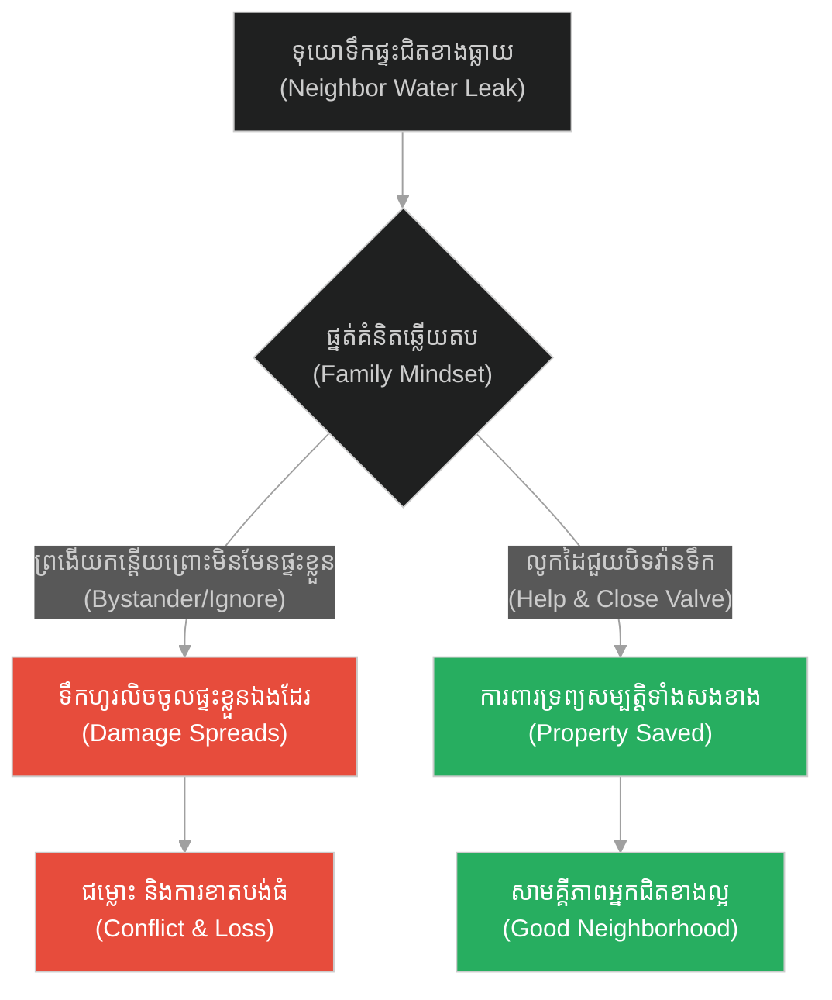
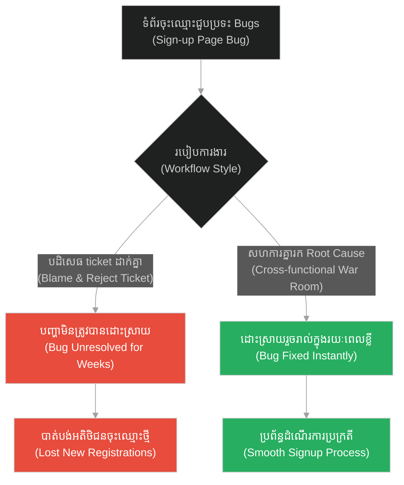
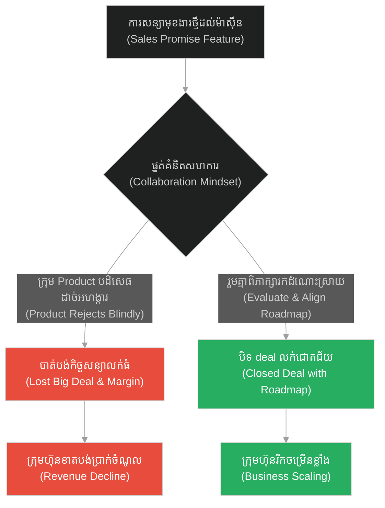
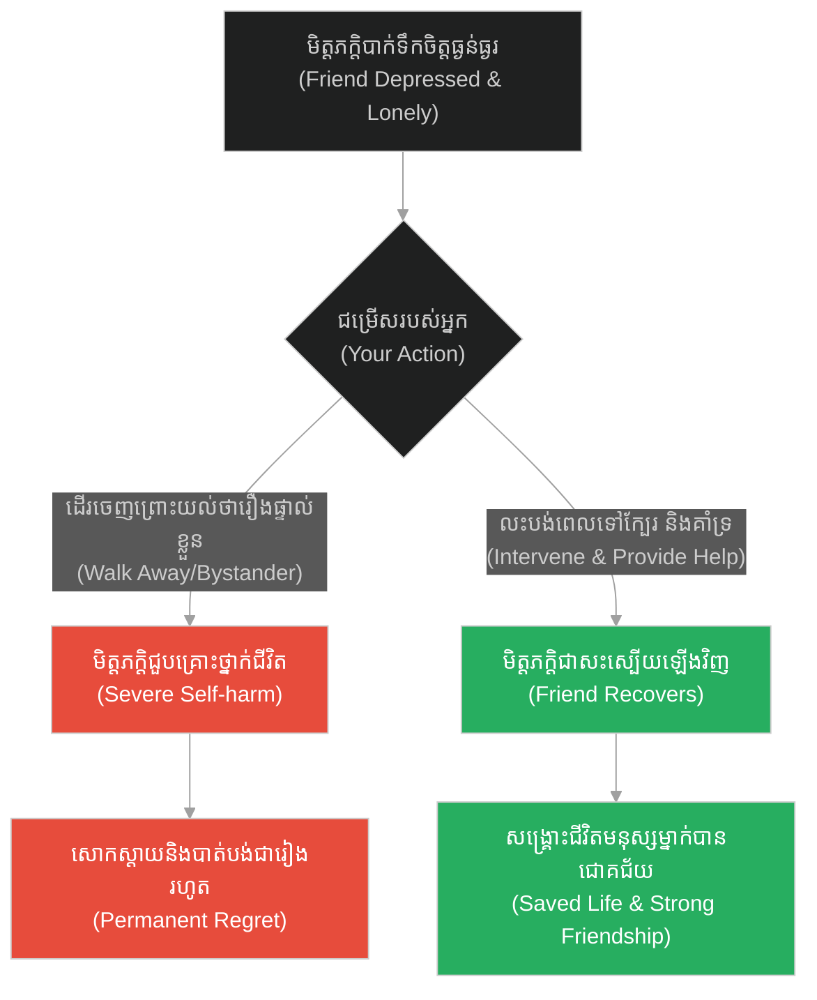
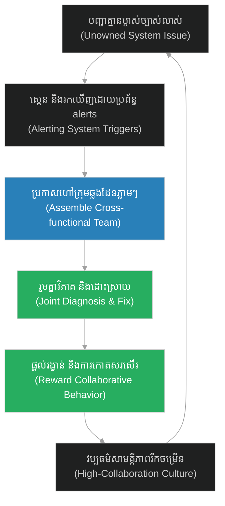

# Cross-team Collaboration & Bystander Effect (សាម៉ារីដ៏សប្បុរស)៖ កិច្ចសហការឆ្លងក្រុម និងបាតុភូតអ្នកឈរមើល (Cross-team Collaboration & Bystander Effect & The Good Samaritan)

**Author:** ichamrong  
**Date:** 2026-05-28  
**Tags:** #jesus #compassion #bystander-effect #in-group-bias #empathy  
**Category:** Concepts  
**Read Time:** ~15 min  

---

## 📌 មាតិកា (Table of Contents)
- [អន្ទាក់ផ្លូវចិត្ត (The Trap)](#0)
- [១. រឿងព្រេងនិទាន៖ សាម៉ារីដ៏សប្បុរស (The Legend of The Good Samaritan)](#1)
  - [អ្នកជិតខាងពិតប្រាកដ (The True Neighbor)](#1-1)
- [២. បញ្ហា៖ កិច្ចសហការឆ្លងក្រុម និងបាតុភូតអ្នកឈរមើល (The Issue: Cross-team Collaboration & Bystander Effect)](#2)
- [៣. ឧទាហរណ៍ជាក់ស្តែងក្នុងពិភពពិត (Real World Examples)](#3)
  - [ឧទាហរណ៍ទី ១ — កម្រិតស្រាល (គ្រួសារ)៖ ការជួយជិតខាងពេលមានគ្រោះអាសន្ន (The Family Neighborly Help)](#3-1)
  - [ឧទាហរណ៍ទី ២ — កម្រិតមធ្យម (បច្ចេកទេស)៖ ការដោះស្រាយបញ្ហា Bugs ឆ្លងដែនរវាង Frontend និង Backend (The Tech Cross-Stack Bug)](#3-2)
  - [ឧទាហរណ៍ទី ៣ — កម្រិតមធ្យម (ធុរកិច្ច)៖ ការសម្របសម្រួលរវាងក្រុមលក់ និងក្រុមអភិវឌ្ឍផលិតផល (The Business Sales vs Product)](#3-3)
  - [ឧទាហរណ៍ទី ៤ — កម្រិតមធ្យម (សង្គម/គ្រប់គ្រង)៖ ការជួយដោះស្រាយបញ្ហានៅពេលគ្មាននរណាម្នាក់ទទួលខុសត្រូវ (The Management Ownership Gap)](#3-4)
  - [ឧទាហរណ៍ទី ៥ — កម្រិតធ្ងន់ (ទំនាក់ទំនង)៖ ការលូកដៃជួយសម្របសម្រួលទំនាក់ទំនងគ្រួសារដែលកំពុងបាក់បែក (The Relationship Intervention)](#3-5)
- [៤. ដំណោះស្រាយទូទៅ៖ ការបណ្តុះវប្បធម៌ «ជាម្ចាស់រួម» (The General Solution: Cultivating Shared Ownership)](#4)
- [សេចក្តីសន្និដ្ឋាន (Conclusion)](#5)
- [ឯកសារយោង (References)](#6)
- [Related Posts](#7)

---

<a id="0"></a>
## អន្ទាក់ផ្លូវចិត្ត (The Trap)

តើអ្នកធ្លាប់ជួបប្រទះស្ថានភាពនៅក្នុងក្រុមហ៊ុនមួយ ដែលមានបញ្ហាកើតឡើងប៉ះពាល់ដល់អតិថិជនយ៉ាងធ្ងន់ធ្ងរ ប៉ុន្តែម្នាក់ៗបែរជានិយាយថា «វាមិនមែនជាកំហុសរបស់ផ្នែកខ្ញុំទេ» រួចនាំគ្នាឈរមើលដោយមិនព្រមជួយដោះស្រាយដែរឬទេ? នេះគឺជា **«អន្ទាក់នៃបាតុភូតអ្នកឈរមើល (Bystander Effect Trap)»** និង **«វប្បធម៌ដាច់ដោយឡែក (Silo Mentality)»**។ មនុស្សភាគច្រើនចូលចិត្តជួយតែមនុស្សក្នុងក្រុមរបស់ខ្លួន (In-Group) ហើយព្រងើយកន្តើយចំពោះការងារដែលឆ្លងដែន ឬការងារដែលមិនទាន់មានម្ចាស់ច្បាស់លាស់។

*   **Side A (The Trap):** ភាពព្រងើយកន្តើយ ការគិតថា «មិនមែនជាសំបុត្រ/ការងាររបស់ខ្ញុំ (Not My Ticket)» បណ្តោយឱ្យបញ្ហាបំផ្លាញផលិតផល និងអតិថិជន។
*   **Side B (Resilient Pattern):** កិច្ចសហការឆ្លងក្រុម (Cross-team Collaboration) និងការលូកដៃជួយដោយគ្មានការរើសអើង ដើម្បីសម្រេចគោលដៅរួមនៃស្ថាប័ន។

នៅក្នុងអត្ថបទនេះ យើងនឹងស្វែងយល់ពីរបៀបបំបែករបាំងដាច់ដោយឡែករវាងក្រុមការងារ និងការកសាងទំនួលខុសត្រូវរួមដើម្បីដោះស្រាយរាល់វិបត្តិ។

---

<a id="1"></a>
## ១. រឿងព្រេងនិទាន៖ សាម៉ារីដ៏សប្បុរស (The Legend of The Good Samaritan)

ថ្ងៃមួយ មានអ្នកច្បាប់ម្នាក់បានសួរព្រះយេស៊ូវដើម្បីល្បងទ្រង់ថា៖ *«តើនរណាជាអ្នកជិតខាងរបស់ខ្ញុំ ដែលខ្ញុំត្រូវស្រលាញ់នោះ?»* ព្រះយេស៊ូវក៏បានលើកយករឿងប្រៀបប្រដៅមួយមកសម្តែង។

មានបុរសជនជាតិយូដាម្នាក់ កំពុងធ្វើដំណើរចាកចេញពីក្រុងយេរូសាឡឹមទៅកាន់ក្រុងយេរីខូ។ នៅតាមផ្លូវ គាត់ត្រូវបានចោរប្លន់ វាយដំរហូតដល់សន្លប់បាត់បង់ស្មារតី ហូរឈាមស្រោចខ្លួន ហើយចោរបានប្លន់យកសម្លៀកបំពាក់ និងទ្រព្យសម្បត្តិទាំងអស់ រួចទុកគាត់ចោលក្បែរផ្លូវរង់ចាំសេចក្តីស្លាប់។

មិនយូរប៉ុន្មាន មាន **សង្ឃជនជាតិយូដា (Priest)** ម្នាក់ដើរកាត់ទីនោះ។ គាត់បានឃើញបុរសនោះដេករងរបួសធ្ងន់ធ្ងរ ប៉ុន្តែគាត់បែរជាដើរវាងចេញទៅម្ខាងទៀតនៃផ្លូវដោយមិនខ្វល់ខ្វាយ។ បន្ទាប់មក មាន **ជំនួយការសង្ឃ (Levite)** ម្នាក់ទៀតដើរកាត់មកដែរ។ គាត់ក៏បានដើរចូលមកមើលជិតបន្តិច រួចក៏ដើរវាងចេញទៅម្ខាងទៀតដូចគ្នា។ សង្ឃទាំងពីរនេះគឺជាអ្នកមានឋានៈ និងជាជនជាតិដូចជនរងគ្រោះ តែពួកគេខ្វះក្តីអាណិតអាសូរ និងមានកិច្ចមមាញឹកផ្ទាល់ខ្លួន។

<a id="1-1"></a>
### អ្នកជិតខាងពិតប្រាកដ (The True Neighbor)

ទីបំផុត មាន **ជនជាតិសាម៉ារី (Samaritan)** ម្នាក់ធ្វើដំណើរកាត់ទីនោះ។ (នៅក្នុងសម័យនោះ ជនជាតិយូដា និងជនជាតិសាម៉ារី គឺជាសត្រូវប្រពៃណីនឹងគ្នា ហើយមិននិយាយរកគ្នាទេ ថែមទាំងរើសអើងគ្នាខ្លាំងណាស់)។ ប៉ុន្តែនៅពេលដែលបុរសសាម៉ារីនេះឃើញជនជាតិយូដារងរបួស គាត់មានក្តីអាណិតអាសូរយ៉ាងខ្លាំង។

គាត់មិនខ្វល់ពីរឿងជាតិសាសន៍ ការរើសអើង ឬជម្លោះអតីតកាលឡើយ។ គាត់បានចុះពីលើសត្វលា ចូលទៅលាងរបួសដោយស្រានិងប្រេង រុំរបួស លើកបុរសនោះដាក់លើសត្វលារបស់ខ្លួន រួចនាំទៅកាន់ផ្ទះសំណាក់ដើម្បីថែទាំ។ ស្អែកឡើង គាត់ថែមទាំងបានទុកប្រាក់ឱ្យម្ចាស់ផ្ទះសំណាក់ ដើម្បីជួយមើលថែបុរសនោះរហូតដល់ជាសះស្បើយ ហើយសន្យាថានឹងសងថ្លៃចំណាយបន្ថែមទាំងអស់នៅពេលគាត់ត្រឡប់មកវិញ។

ព្រះយេស៊ូវបានសួរអ្នកច្បាប់នោះថា៖ *«ក្នុងចំណោមអ្នកទាំងបី តើមួយណាជាអ្នកជិតខាងពិតប្រាកដរបស់បុរសដែលត្រូវចោរប្លន់នោះ?»* 

អ្នកច្បាប់តបថា៖ *«គឺអ្នកដែលបានបង្ហាញក្តីមេត្តា និងជួយសង្គ្រោះគាត់។»* ព្រះយេស៊ូវមានបន្ទូលថា៖ **«ចូរទៅ ហើយធ្វើដូចអ្នកនោះចុះ។»**

---

<a id="2"></a>
## ២. បញ្ហា៖ កិច្ចសហការឆ្លងក្រុម និងបាតុភូតអ្នកឈរមើល (The Issue: Cross-team Collaboration & Bystander Effect)

នៅក្នុងវិស្វកម្មសូហ្វវែរ និងការគ្រប់គ្រងគម្រោងបច្ចេកវិទ្យា បញ្ហានេះត្រូវបានគេស្គាល់ថាជា **«Not My Ticket Syndrome (រោគសញ្ញាមិនមែនជាកាតព្វកិច្ចខ្ញុំ)»**។ នៅពេលដែលប្រព័ន្ធជួបប្រទះការដួលរលំ (Production Outage) ក្រុម Frontend និយាយថា « backend API error» ក្រុម Backend និយាយថា « DBA index latency» ចំណែកក្រុម DBA និយាយថា « Cloud infra capacity»។ ម្នាក់ៗឈរមើល (Bystander Effect) បោះសំបុត្រការងារដាក់គ្នាទៅវិញទៅមក ខណៈដែលអតិថិជនមិនអាចប្រើប្រាស់សេវាកម្មបាន។

ដំណោះស្រាយគឺការបង្កើត **Cross-functional Incident Responders (ក្រុមឆ្លើយតបឆ្លងដែន)** ដែលរួមសហការគ្នាយ៉ាងលឿនដោយគ្មានព្រំដែនក្រុម។

ខាងក្រោមនេះជាការប្រៀបធៀបរចនាសម្ព័ន្ធប្រតិបត្តិការ៖

### ឧទាហរណ៍កូដគំរូ (Python)

```python
# =====================================================================
# 1. គំរូមិនល្អ (Fragile Design): Siloed processing and blaming (Priest/Levite)
# =====================================================================
class SiloedFrontend:
    def handle_error(self, error_response):
        # គ្រាន់តែបដិសេធ និងមិនព្រមស៊ើបអង្កេត ព្រោះជាបញ្ហា Backend
        print("[FRONTEND] Caught 500 error from API.")
        print("[FRONTEND] Not our code. Reassigning ticket to Backend. Ignoring.")
        return "Reassigned"

class SiloedBackend:
    def handle_ticket(self, ticket):
        # មិនព្រមសហការដោះស្រាយ ព្រោះយល់ថាជាបញ្ហា Database
        print("[BACKEND] Ticket received. Database query timed out.")
        print("[BACKEND] Not our service issue. Reassigning to DBA. Ignoring.")
        return "Reassigned"
```

```python
# =====================================================================
# 2. គំរូល្អ (Resilient Design): Cross-functional Incident Response (Samaritan)
# =====================================================================
class CollaborativeIncidentRoom:
    def __init__(self):
        self.incident_active = True
        self.resolved = False

    def coordinate_triage(self):
        print("[WAR ROOM] Critical incident detected! Assembling cross-team support...")
        
        # ក្រុមការងារសហការគ្នាភ្លាមៗ (Good Samaritan behavior)
        frontend_action = "Frontend: Adding user-friendly maintenance banner."
        backend_action = "Backend: Tracing logs and isolating database pool configuration."
        dba_action = "DBA: Adding query index to mitigate slow read operations."
        
        print(f"[WAR ROOM] Action 1: {frontend_action}")
        print(f"[WAR ROOM] Action 2: {backend_action}")
        print(f"[WAR ROOM] Action 3: {dba_action}")
        
        self.resolved = True
        print("[WAR ROOM] Incident resolved successfully through shared ownership!")
        return self.resolved

incident_room = CollaborativeIncidentRoom()
incident_room.coordinate_triage()
```

---

<a id="3"></a>
## ៣. ឧទាហរណ៍ជាក់ស្តែងក្នុងពិភពពិត (Real World Examples)

<a id="3-1"></a>
### ឧទាហរណ៍ទី ១ — កម្រិតស្រាល (គ្រួសារ)៖ ការជួយជិតខាងពេលមានគ្រោះអាសន្ន (The Family Neighborly Help)

*   **Dilemma:** ផ្ទះអ្នកជិតខាងខាងក្រោយធ្លាយទុយោទឹកហូរជន់ជោរ (ម្ចាស់ផ្ទះមិននៅ) តែសមាជិកគ្រួសារគិតថា៖ «មិនមែនជាផ្ទះយើងទេ កុំទៅរវល់ខ្លាចគេខឹង»។
*   **Resolution:** ជួយបិទវ៉ានទឹកធំ ឬខលប្រាប់ម្ចាស់ផ្ទះភ្លាមៗ (Good Samaritan Action) ដើម្បីការពារការខូចខាតទ្រព្យសម្បត្តិ។



<a id="3-2"></a>
### ឧទាហរណ៍ទី ២ — កម្រិតមធ្យម (បច្ចេកទេស)៖ ការដោះស្រាយបញ្ហា Bugs ឆ្លងដែនរវាង Frontend និង Backend (The Tech Cross-Stack Bug)

*   **Dilemma:** ទំព័រចុះឈ្មោះ (Sign-up page) បរាជ័យ។ ក្រុម Frontend បដិសេធ ticket ព្រោះ backend ផ្ញើ error មក រីឯ backend បដិសេធ ticket ព្រោះ frontend ផ្ញើ data ខុស type។
*   **Resolution:** អ្នកដឹកនាំបច្ចេកទេសបង្កើត War Room រួមគ្នាសរសេរបន្ទាត់កូដដោះស្រាយ (Pair programming) ឱ្យបានលឿនបំផុត។



<a id="3-3"></a>
### ឧទាហរណ៍ទី ៣ — កម្រិតមធ្យម (ធុរកិច្ច)៖ ការសម្របសម្រួលរវាងក្រុមលក់ និងក្រុមអភិវឌ្ឍផលិតផល (The Business Sales vs Product)

*   **Dilemma:** ក្រុម Sales សន្យាផ្តល់មុខងារពិសេសដល់អតិថិជនដើម្បីបិទ deal លក់ តែក្រុម Product មិនព្រមធ្វើការងារនោះព្រោះគ្មានក្នុង roadmap។
*   **Resolution:** បង្កើតកិច្ចប្រជុំសម្របសម្រួលប្រចាំខែ (Alignment meeting) ដើម្បីធានាថាមុខងារពិសេសទាំងនោះត្រូវបានវាយតម្លៃពីតម្លៃធុរកិច្ច និងធនធានអភិវឌ្ឍត្រឹមត្រូវ។



<a id="3-4"></a>
### ឧទាហរណ៍ទី ៤ — កម្រិតមធ្យម (សង្គម/គ្រប់គ្រង)៖ ការជួយដោះស្រាយបញ្ហានៅពេលគ្មាននរណាម្នាក់ទទួលខុសត្រូវ (The Management Ownership Gap)

*   **Dilemma:** ឯកសារច្បាប់មួយត្រូវបញ្ជូនទៅដៃគូខាងក្រៅនៅថ្ងៃស្អែក តែបុគ្គលិកដែលត្រូវធ្វើការងារនោះបានសុំច្បាប់ឈឺ (Sick leave) គ្មាននរណាចង់លូកដៃធ្វើជំនួស។
*   **Resolution:** មិត្តរួមការងារម្នាក់ទៀតស្ម័គ្រចិត្តធ្វើការងារនោះជំនួសទោះជាហួសម៉ោងការងារ (Step up) ដើម្បីធានាកេរ្តិ៍ឈ្មោះក្រុមហ៊ុន។

```mermaid
%%{init: {
  'theme': 'dark',
  'themeVariables': {
    'background': '#1e1e1e',
    'primaryTextColor': '#ffffff',
    'lineColor': '#a0a0a0'
  },
  'themeCSS': 'svg { background-color: #1e1e1e !important; padding: 1rem !important; border-radius: 8px !important; } .edgeLabel rect { fill: #1e1e1e !important; } text, tspan { fill: #ffffff !important; }'
}}%%
graph TD
    A["បុគ្គលិកឈឺ ឯកសារត្រូវបញ្ជូន<br/>(Owner Sick, Deadline Hits)"] --> B{"ប្រតិកម្មរបស់ក្រុមការងារ<br/>(Team Reaction)"}
    B -- "ព្រងើយកន្តើយមិនមែនការងារខ្លួន<br/>(Bystander/Ignore)" --> C["ខកខាន deadline និងខូចឈ្មោះ<br/>(Missed Deadline)""]
    B -- "ស្ម័គ្រចិត្តជួយបំពេញការងារជំនួស<br/>(Step up & Assist)" --> D["បញ្ជូនឯកសារបានទាន់ពេលវេលា<br/>(Deadline Met)""]
    C --> E["បាត់បង់ទំនុកចិត្តពីដៃគូ<br/>(Lost Partner Trust)"]
    D --> F["ទទួលបានការកោតសរសើរ<br/>(Build High-Trust Culture)"]
    style C fill:#e74c3c,color:#fff
    style E fill:#e74c3c,color:#fff
    style D fill:#27ae60,color:#fff
    style F fill:#27ae60,color:#fff
```

<a id="3-5"></a>
### ឧទាហរណ៍ទី ៥ — កម្រិតធ្ងន់ (ទំនាក់ទំនង)៖ ការលូកដៃជួយសម្របសម្រួលទំនាក់ទំនងគ្រួសារដែលកំពុងបាក់បែក (The Relationship Intervention)

*   **Dilemma:** មិត្តភក្តិជិតស្និទ្ធកំពុងជួបប្រទះវិបត្តិបាក់ទឹកចិត្តធ្ងន់ធ្ងររហូតដល់ចង់បញ្ចប់ជីវិត (ដេកហូរឈាមក្បែរថ្នល់) តែអ្នកដទៃគិតថា «រឿងផ្ទាល់ខ្លួន កុំចង់ដឹងឮ»។
*   **Resolution:** លូកដៃចូលទៅជួយស្តាប់ ផ្តល់កម្លាំងចិត្ត និងនាំគេទៅជួបគ្រូពេទ្យព្យាបាលផ្លូវចិត្ត (Psychiatrist) ដោយមិនខ្លាចការហត់នឿយ។



---

<a id="4"></a>
## ៤. ដំណោះស្រាយទូទៅ៖ ការបណ្តុះវប្បធម៌ «ជាម្ចាស់រួម» (The General Solution: Cultivating Shared Ownership)

ដើម្បីលុបបំបាត់បាតុភូតអ្នកឈរមើលនៅក្នុងស្ថាប័ន៖

1.  **លុបបំបាត់ការបន្ទោស (Eliminate Blame Culture):** បង្កើតបរិយាកាសសុវត្ថិភាពផ្លូវចិត្ត (Psychological Safety) ដើម្បីឱ្យមនុស្សហ៊ានលូកដៃជួយដោយមិនបារម្ភពីរឿងធ្វើខុស។
2.  **កំណត់ម្ចាស់ការងារជំនួស (Define Fallback Owners):** ធានាថារាល់បញ្ហាដែលមិនទាន់មានម្ចាស់ច្បាស់លាស់ នឹងត្រូវបានយកចិត្តទុកដាក់ដោយក្រុមឆ្លើយតបបន្ទាន់ (Triage/On-call Teams)។
3.  **លើកទឹកចិត្តសកម្មភាពសាម៉ារី (Reward Samaritan Behaviors):** ផ្តល់ការកោតសរសើរដល់បុគ្គល ឬក្រុមការងារដែលបានជួយដោះស្រាយបញ្ហារបស់ផ្នែកផ្សេងទៀត។



---

## 🐇 ធ្លាក់ចូលក្នុងរន្ធទន្សាយ (Enter the Rabbit Hole)
ដើម្បីស្វែងយល់ពីរបៀបដែលការស្តារស្ថានភាពឡើងវិញ (Recovery States) និងការសម្អាតប្រព័ន្ធ (Refactoring) ជួយឱ្យប្រព័ន្ធរបស់អ្នកវិលត្រឡប់មករកភាពស្អាតស្អំ និងដំណើរការល្អឡើងវិញ សូមបន្តដំណើរទៅកាន់៖

* 🚀 **[ចាប់ផ្តើមដំណើររុករក (Start the Journey) ➔ Recovery States & Clean Slates / Refactoring](./177-jesus-and-the-prodigal-son.md)**

---

<a id="5"></a>
## សេចក្តីសន្និដ្ឋាន (Conclusion)

> **«កុំសួរថាតើការជួយនេះនឹងធ្វើឱ្យអ្នកខាតបង់អ្វីខ្លះ ប៉ុន្តែត្រូវសួរថាតើនឹងមានអ្វីកើតឡើងចំពោះជនរងគ្រោះ ប្រសិនបើអ្នកមិនព្រមជួយដោះស្រាយ។»**

វប្បធម៌ដាច់ដោយឡែក (Silos) និងការព្រងើយកន្តើយ គឺជាមេរោគដែលបំផ្លាញស្ថាប័ន និងសង្គមជាតិយឺតៗ។ ការហ៊ានលូកដៃជួយសម្រាលការងាររបស់អ្នកដទៃទោះបីជាខុសក្រុម ឬខុសជាតិសាសន៍ គឺជាអំពើដ៏វិសេសវិសាលបំផុតដែលជួយឱ្យប្រព័ន្ធទាំងមូលមានជីវិតរស់រានមានជីវិត និងរឹងមាំឡើងវិញ។

---

<a id="6"></a>
## ឯកសារយោង (References)

*   **Holy Bible** — *Luke 10:25–37*. ប្រភពដើមនៃរឿងប្រៀបប្រដៅស្តីអំពីសាម៉ារីដ៏សប្បុរស។
*   **Latané, B., & Darley, J. M.** — *The Bystander Effect* (1968). ការសិក្សាចិត្តវិទ្យាសង្គមដែលបង្ហាញថាមនុស្សកាន់តែច្រើន ទំនោរនៃការជួយសង្គ្រោះកាន់តែធ្លាក់ចុះ។

---

<a id="7"></a>
## Related Posts

* [Recovery States & Clean Slates / Refactoring (កូនប្រុសខ្ជះខ្ជាយ)](./177-jesus-and-the-prodigal-son.md) — របៀបចាប់ផ្តើមឡើងវិញដោយស្អាតស្អំក្រោយពេលជួបវិបត្តិ។
* [Exponential Scaling & Organic Growth (គ្រាប់ស្ពៃ)](./178-jesus-and-the-mustard-seed.md) — របៀបដែលឥទ្ធិពលតូចតាចលូតលាស់ទៅជាជម្រកដ៏ធំធេង។
