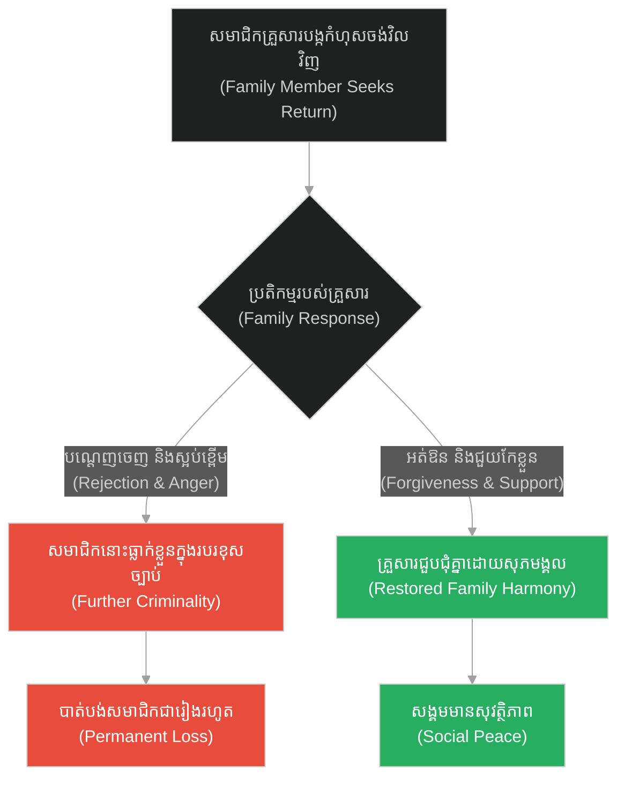
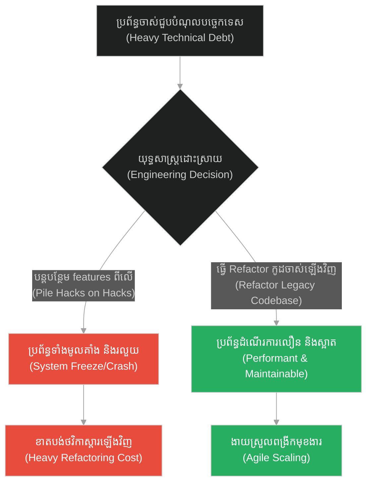
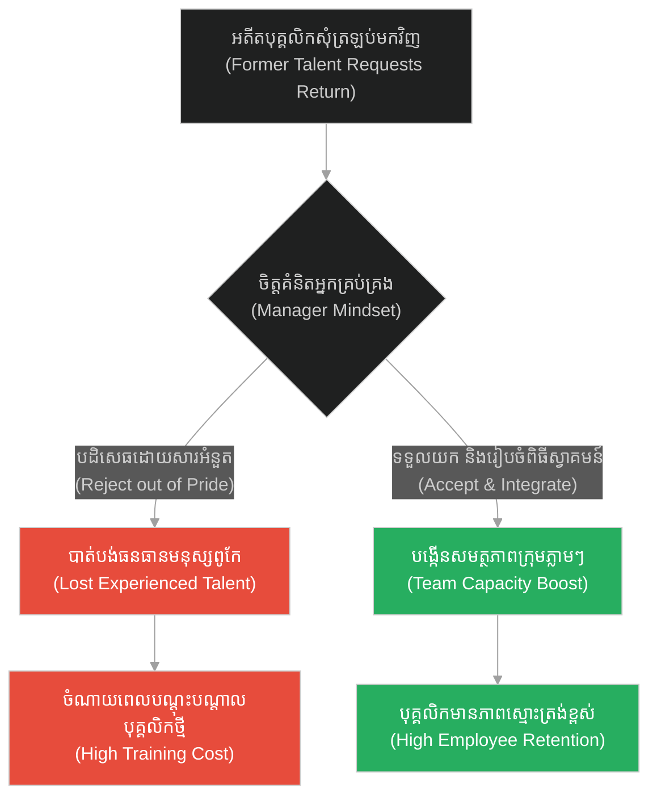
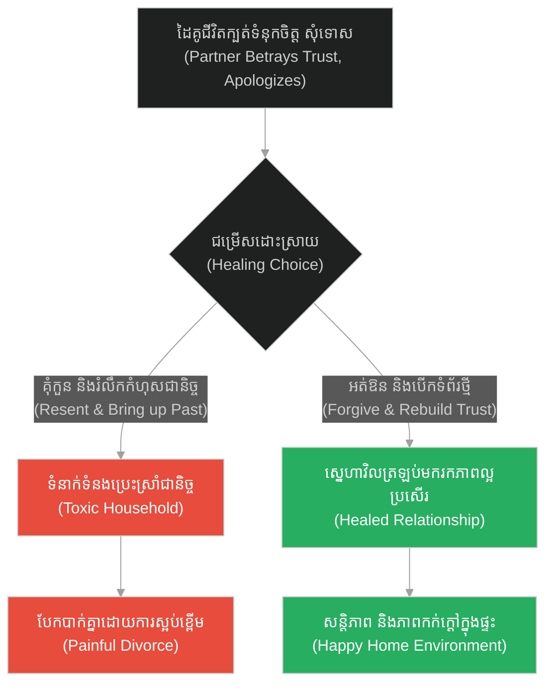
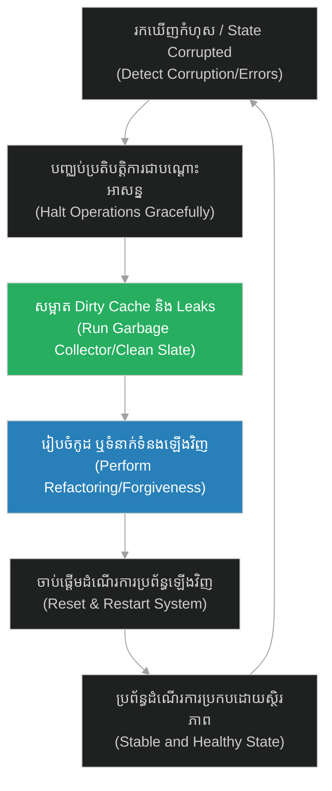

# Recovery States & Clean Slates / Refactoring (កូនប្រុសខ្ជះខ្ជាយ)៖ ស្ថានភាពស្តារឡើងវិញ និងការចាប់ផ្តើមឡើងវិញដោយស្អាតស្អំ (Recovery States & Clean Slates / Refactoring & The Prodigal Son)

**Author:** ichamrong  
**Date:** 2026-05-28  
**Tags:** #jesus #forgiveness #grace #repentance #restoration #refactoring  
**Category:** Concepts  
**Read Time:** ~15 min  

---

## 📌 មាតិកា (Table of Contents)
- [អន្ទាក់ផ្លូវចិត្ត (The Trap)](#0)
- [១. រឿងព្រេងនិទាន៖ ការវិលត្រឡប់របស់កូនប្រុសខ្ជះខ្ជាយ (The Legend of The Prodigal Son's Return)](#1)
  - [ការវិលត្រឡប់ និងពិធីជប់លៀង (The Return and The Feast)](#1-1)
- [២. បញ្ហា៖ ស្ថានភាពស្តារឡើងវិញ និងការចាប់ផ្តើមឡើងវិញដោយស្អាតស្អំ (The Issue: Recovery States & Clean Slates / Refactoring)](#2)
- [៣. ឧទាហរណ៍ជាក់ស្តែងក្នុងពិភពពិត (Real World Examples)](#3)
  - [ឧទាហរណ៍ទី ១ — កម្រិតស្រាល (គ្រួសារ)៖ ការអត់ឱនឱ្យសមាជិកគ្រួសារដែលធ្លាប់បង្កកំហុស (The Family Reunion)](#3-1)
  - [ឧទាហរណ៍ទី ២ — កម្រិតមធ្យម (បច្ចេកទេស)៖ ការសម្អាតកូដ និងការធ្វើ Refactoring ឡើងវិញ (The Tech Code Refactoring)](#3-2)
  - [ឧទាហរណ៍ទី ៣ — កម្រិតមធ្យម (ធុរកិច្ច)៖ ការស្តារកេរ្តិ៍ឈ្មោះម៉ាកសញ្ញាក្រោយវិបត្តិផលិតផល (The Business Brand Recovery)](#3-3)
  - [ឧទាហរណ៍ទី ៤ — កម្រិតមធ្យម (សង្គម/គ្រប់គ្រង)៖ ការស្វាគមន៍បុគ្គលិកដែលចាកចេញរួចត្រឡប់មកវិញ (The Management Boomerang Employee)](#3-4)
  - [ឧទាហរណ៍ទី ៥ — កម្រិតធ្ងន់ (ទំនាក់ទំនង)៖ ការស្តារទំនុកចិត្តឡើងវិញក្រោយការក្បត់ពាក្យសន្យា (The Relationship Rebuilding Trust)](#3-5)
  - [៤. ដំណោះស្រាយទូទៅ៖ យន្តការស្តារប្រព័ន្ធ និងចាប់ផ្តើមឡើងវិញ (The General Solution: System Recovery & Clean Slate Protocol)](#4)
- [សេចក្តីសន្និដ្ឋាន (Conclusion)](#5)
- [ឯកសារយោង (References)](#6)
- [Related Posts](#7)

---

<a id="0"></a>
## អន្ទាក់ផ្លូវចិត្ត (The Trap)

តើអ្នកធ្លាប់មានអារម្មណ៍ថា «ដោយសារតែកំហុសក្នុងអតីតកាល ឬបំណុលបច្ចេកទេស (Technical Debt) ដែលបានសន្សំបន្សល់ទុកមកច្រើនពេក ធ្វើឱ្យប្រព័ន្ធទាំងមូលមិនអាចជួសជុលបាន ហើយត្រូវតែបោះបង់ចោលទាំងស្រុង» ដែរឬទេ? នេះគឺជា **«អន្ទាក់នៃការគិតពីថ្លៃដើមដែលបាត់បង់ (Sunk Cost Fallacy Trap)»**។ នៅក្នុងការគ្រប់គ្រងប្រព័ន្ធ មនុស្សភាគច្រើនព្យាយាមបន្តដាក់កូដបំណះ (Dirty Hacks) ពីលើកូដដែលរលួយ ដោយសារពួកគេមិនហ៊ានធ្វើការលុបចោល និងចាប់ផ្តើមឡើងវិញដោយស្អាតស្អំ (Clean Slate Refactoring)។

*   **Side A (The Trap):** ការបន្តលាក់បាំងកំហុស និងបំណះកូដចាស់ៗដែលខូចខាត ធ្វើឱ្យប្រព័ន្ធកាន់តែរលួយទៅៗរហូតដល់លែងដំណើរការ។
*   **Side B (Resilient Pattern):** ការបើកចិត្តទទួលយកកំហុសឆ្គង ការលុបបន្សល់ទុកនូវបំណុលចាស់ៗចោល និងការធ្វើ Refactoring ដើម្បីស្តារប្រព័ន្ធឡើងវិញឱ្យមានភាពស្អាតស្អំជានិច្ច។

នៅក្នុងអត្ថបទនេះ យើងនឹងស្វែងយល់ពីរបៀបដែលយន្តការ «ស្តារឡើងវិញ (Recovery States)» អាចជួយលាងសម្អាតប្រព័ន្ធកូដ និងកសាងទំនុកចិត្តរវាងមនុស្សឡើងវិញ។

---

<a id="1"></a>
## ១. រឿងព្រេងនិទាន៖ ការវិលត្រឡប់របស់កូនប្រុសខ្ជះខ្ជាយ (The Legend of The Prodigal Son's Return)

ព្រះយេស៊ូវបានលើកយករឿងប្រៀបប្រដៅមួយទៀតស្តីពីបុរសម្នាក់ដែលមានកូនប្រុសពីរនាក់។

ថ្ងៃមួយ កូនប្រុសពៅបានមកសុំចំណែកទ្រព្យសម្បត្តិដែលជាមរតករបស់ខ្លួនពីឪពុកជាមុន ទោះបីជាឪពុកនៅរស់រានមានជីវិតក៏ដោយ។ បន្ទាប់ពីទទួលបានមរតកហើយ កូនពៅក៏បានប្រមូលទ្រព្យសម្បត្តិទាំងអស់ ធ្វើដំណើរទៅកាន់ស្រុកឆ្ងាយមួយ រួចរស់នៅខ្ជះខ្ជាយ លេងល្បែងស៊ីសង និងសេពគប់មិត្តភក្តិអាក្រក់ រហូតដល់រលាយទ្រព្យសម្បត្តិគ្មានសល់សូម្បីតែមួយរៀល។

ស្របពេលនោះ មានគ្រោះទុរ្ភិក្ស (ការអត់ឃ្លាន) ដ៏ធំមួយបានកើតឡើងទូទាំងតំបន់នោះ។ កូនប្រុសពៅគ្មានជម្រើសអ្វីក្រៅពីទៅសុំធ្វើការងារជាអ្នកឃ្វាលជ្រូកឱ្យអ្នកស្រុកម្នាក់។ គាត់ឃ្លានខ្លាំងណាស់ រហូតដល់ចង់ស៊ីអាហាររបស់ជ្រូក ប៉ុន្តែគ្មាននរណាម្នាក់ផ្តល់អាហារឱ្យគាត់ឡើយ។ គាត់ធ្លាក់ខ្លួនដល់ចំណុចទាបបំផុតនៃជីវិត (Corrupted State)។

<a id="1-1"></a>
### ការវិលត្រឡប់ និងពិធីជប់លៀង (The Return and The Feast)

នៅពេលដែលគាត់ដឹងខ្លួនឡើងវិញ គាត់គិតថា៖ *«នៅក្នុងផ្ទះឪពុកខ្ញុំ សូម្បីតែអ្នកបម្រើក៏មានអាហារហូបចុកបរិបូរដែរ ចំណែកឯខ្ញុំនៅទីនេះត្រូវដេកដាច់ពោះស្លាប់។ ខ្ញុំត្រូវតែត្រឡប់ទៅរកឪពុកខ្ញុំវិញ ហើយសុំទោសទ្រង់ រួចសុំធ្វើជាអ្នកបម្រើម្នាក់ចុះ ព្រោះខ្ញុំលែងសមជាកូនប្រុសរបស់ទ្រង់ទៀតហើយ។»*

ខណៈពេលដែលកូនប្រុសពៅកំពុងធ្វើដំណើរត្រឡប់មកវិញទាំងខ្លួនប្រឡាក់ដី និងរហែករហាម ឪពុករបស់គាត់បានក្រឡេកឃើញពីចម្ងាយ។ ឪពុកមិនបានខឹងសម្បារ ឬគុំកួនឡើយ ប៉ុន្តែបែរជាមានក្តីរំភើប និងអាណិតអាសូរយ៉ាងខ្លាំង។ គាត់បានរត់ទៅឱបកូនប្រុស និងថើបគាត់ដោយក្តីស្រលាញ់។

ទោះបីជាកូនប្រុសបានរៀបរាប់ពីកំហុស និងសុំធ្វើត្រឹមតែជាអ្នកបម្រើក៏ដោយ ឪពុកបានបង្គាប់អ្នកបម្រើភ្លាមៗថា៖
*«ចូរយកអាវដ៏ល្អបំផុតមកពាក់ឱ្យកូនខ្ញុំ យកចិញ្ចៀនមកពាក់ដៃ និងយកស្បែកជើងមកពាក់ឱ្យគេចុះ។ រួចយកកូនគោដែលបំប៉នយ៉ាងធាត់មកសម្លាប់ធ្វើពិធីជប់លៀង ដើម្បីអបអរសាទរ! ព្រោះកូនខ្ញុំនេះបានស្លាប់ទៅហើយ តែឥឡូវរស់ឡើងវិញ គេបានវង្វេងបាត់ទៅហើយ តែឥឡូវរកឃើញវិញហើយ។»*

---

<a id="2"></a>
## ២. បញ្ហា៖ ស្ថានភាពស្តារឡើងវិញ និងការចាប់ផ្តើមឡើងវិញដោយស្អាតស្អំ (The Issue: Recovery States & Clean Slates / Refactoring)

នៅក្នុងវិស្វកម្មសូហ្វវែរ និងរចនាសម្ព័ន្ធទិន្នន័យ (Data Engineering) គំនិតនេះគឺដូចគ្នាបេះបិទទៅនឹង **Refactoring (ការកែលម្អកូដឡើងវិញ)** និង **System Garbage Collection (ការសម្អាតប្រព័ន្ធ)**។ នៅពេលដែលប្រព័ន្ធដំណើរការយូរទៅ វានឹងជួបប្រទះបញ្ហា memory leaks ឬ state corruption (ការប្រឡាក់ប្រឡូសនៃទិន្នន័យ)។ ប្រសិនបើប្រព័ន្ធព្យាយាមបន្តរត់ទាំងខូច វានឹងដួលរលំ។ 

ដំណោះស្រាយគឺការអនុវត្ត **Clean Slate Reset (ការកំណត់ឡើងវិញជាថ្មី)** ឬការប្រើប្រាស់ Database Transaction Rollback ដើម្បីលុបបំបាត់រាល់ dirty states និងស្តារប្រព័ន្ធឱ្យស្អាតឡើងវិញពីដើម។

ខាងក្រោមនេះជាការប្រៀបធៀបកូដ៖

### ឧទាហរណ៍កូដគំរូ (Python)

```python
# =====================================================================
# 1. គំរូមិនល្អ (Fragile Design): Accumulating dirty states and hacks
# =====================================================================
class FragileMemoryState:
    def __init__(self):
        self.dirty_cache = []
        self.leaked_refs = []

    def process_data(self, data):
        # បន្តអូសបន្លាយ state ដែលខូចដោយគ្រាន់តែដាក់បំណះពីលើ
        if "invalid" in self.dirty_cache:
            print("[FRAGILE] Memory is corrupted! Patching inline to keep running...")
            self.dirty_cache.append(f"hacked_{data}")
        else:
            self.dirty_cache.append(data)
        # បង្កើត memory leak កាន់តែខ្លាំង (Accumulating memory leaks)
        self.leaked_refs.append(data) 
```

```python
# =====================================================================
# 2. គំរូល្អ (Resilient Design): Garbage Collection and Reset (The Feast)
# =====================================================================
class CleanSlateState:
    def __init__(self):
        self.state_store = {}

    def process_data(self, key, val):
        if self.detect_state_corruption():
            print("[RESILIENT] State corruption detected! Initiating Garbage Collection & Reset...")
            self.reset_to_initial_state()
            
        self.state_store[key] = val
        print(f"[RESILIENT] Saved key '{key}' to clean state.")

    def detect_state_corruption(self):
        # ពិនិត្យមើលថាតើប្រព័ន្ធមានផ្ទុក invalid signature ដែរឬទេ
        return "poisoned_key" in self.state_store

    def reset_to_initial_state(self):
        # ស្តារប្រព័ន្ធឡើងវិញទៅកាន់ទម្រង់ស្អាតស្អំ (Clean Slate Recovery)
        print("[RESILIENT] Discarding all corrupted data structures...")
        self.state_store.clear()
        self.state_store = {"status": "HEALTHY", "version": "1.0"}
        print("[RESILIENT] System successfully restored to Clean Slate!")
```

---

<a id="3"></a>
## ៣. ឧទាហរណ៍ជាក់ស្តែងក្នុងពិភពពិត (Real World Examples)

<a id="3-1"></a>
### ឧទាហរណ៍ទី ១ — កម្រិតស្រាល (គ្រួសារ)៖ ការអត់ឱនឱ្យសមាជិកគ្រួសារដែលធ្លាប់បង្កកំហុស (The Family Reunion)

*   **Dilemma:** កូនប្រុសម្នាក់ធ្លាប់ដើរលេងល្បែងស៊ីសងខាតបង់ទ្រព្យសម្បត្តិគ្រួសារ បន្ទាប់ពីភ្ញាក់ខ្លួនចង់ត្រឡប់មកផ្ទះវិញ តែបងប្អូនដទៃចង់បណ្តេញចេញព្រោះខឹង។
*   **Resolution:** ឪពុកម្តាយទទួលស្វាគមន៍ដោយសេចក្តីមេត្តា និងរួមគ្នាជួយណែនាំរកការងារត្រឹមត្រូវ ដើម្បីកសាងជីវិតថ្មី។



<a id="3-2"></a>
### ឧទាហរណ៍ទី ២ — កម្រិតមធ្យម (បច្ចេកទេស)៖ ការសម្អាតកូដ និងការធ្វើ Refactoring ឡើងវិញ (The Tech Code Refactoring)

*   **Dilemma:** ប្រព័ន្ធចាស់មានបំណុលបច្ចេកទេស (Technical Debt) ច្រើនពេក ធ្វើឱ្យរាល់ពេលបន្ថែម Feature ថ្មី តែងតែលេចធ្លាយ Bugs ច្រើន។
*   **Resolution:** ចំណាយពេលមួយខែ (Sprint Refactor) ដើម្បីលុបកូដចាស់ៗដែលមិនប្រើប្រាស់ និងសរសេរឡើងវិញតាមស្តង់ដារ Clean Code។



<a id="3-3"></a>
### ឧទាហរណ៍ទី ៣ — កម្រិតមធ្យម (ធុរកិច្ច)៖ ការស្តារកេរ្តិ៍ឈ្មោះម៉ាកសញ្ញាក្រោយវិបត្តិផលិតផល (The Business Brand Recovery)

*   **Dilemma:** ផលិតផលឡានរបស់ក្រុមហ៊ុនមួយជួបប្រទះបញ្ហាប្រព័ន្ធហ្វ្រាំងខូច ធ្វើឱ្យបាត់បង់ទំនុកចិត្តទីផ្សារទាំងស្រុង។
*   **Resolution:** ប្រកាសប្រមូលឡានទាំងអស់មកវិញដោយឥតគិតថ្លៃ (Recall) និងចេញសេចក្តីសុំទោសជា عام ដោយតម្លាភាព ធ្វើឱ្យអតិថិជនមានទំនុកចិត្តឡើងវិញ។

```mermaid
%%{init: {
  'theme': 'dark',
  'themeVariables': {
    'background': '#1e1e1e',
    'primaryTextColor': '#ffffff',
    'lineColor': '#a0a0a0'
  },
  'themeCSS': 'svg { background-color: #1e1e1e !important; padding: 1rem !important; border-radius: 8px !important; } .edgeLabel rect { fill: #1e1e1e !important; } text, tspan { fill: #ffffff !important; }'
}}%%
graph TD
    A["ផលិតផលមានកំហុសបច្ចេកទេស<br/>(Defective Product Outbreak)"] --> B{"ប្រតិកម្មរបស់ក្រុមហ៊ុន<br/>(Corporate Response)"}
    B -- "លាក់បាំងព័ត៌មាន និងបដិសេធ<br/>(Denial & Cover-up)" --> C["ខូចឈ្មោះម៉ាកសញ្ញាជារៀងរហូត<br/>(Brand Ruined)""]
    B -- "ប្រមូលផលិតផលមកវិញដោយតម្លាភាព<br/>(Recall & Compensate)" --> D["ស្តារទំនុកចិត្ត និងកេរ្តិ៍ឈ្មោះ<br/>(Restored Public Trust)""]
    C --> E["ក្ស័យធន និងបិទក្រុមហ៊ុន<br/>(Bankruptcy)"]
    D --> F["លក់ដាច់ខ្លាំងជាងមុន<br/>(Increased Loyalty)"]
    style C fill:#e74c3c,color:#fff
    style E fill:#e74c3c,color:#fff
    style D fill:#27ae60,color:#fff
    style F fill:#27ae60,color:#fff
```

<a id="3-4"></a>
### ឧទាហរណ៍ទី ៤ — កម្រិតមធ្យម (សង្គម/គ្រប់គ្រង)៖ ការស្វាគមន៍បុគ្គលិកដែលចាកចេញរួចត្រឡប់មកវិញ (The Management Boomerang Employee)

*   **Dilemma:** បុគ្គលិកពូកែម្នាក់សុំលាឈប់ទៅធ្វើការនៅក្រុមហ៊ុនគូប្រជែង ក្រោយមកចង់សុំត្រឡប់មកធ្វើការវិញ តែអ្នកគ្រប់គ្រងមានអំនួតមិនចង់ទទួលព្រោះយល់ថា «ក្បត់ក្រុម»។
*   **Resolution:** ស្វាគមន៍បុគ្គលិកនោះត្រឡប់មកវិញ (Boomerang Employee) ព្រោះគេយល់ដឹងពីប្រព័ន្ធចាស់ស្រាប់ និងនាំមកនូវបទពិសោធន៍ថ្មីៗពីខាងក្រៅ។



<a id="3-5"></a>
### ឧទាហរណ៍ទី ៥ — កម្រិតធ្ងន់ (ទំនាក់ទំនង)៖ ការស្តារទំនុកចិត្តឡើងវិញក្រោយការក្បត់ពាក្យសន្យា (The Relationship Rebuilding Trust)

*   **Dilemma:** ដៃគូជីវិតបានធ្វើខុសឆ្គងក្បត់ទំនុកចិត្តម្តង (ដេកស៊ីកន្ទក់ជ្រូក) ប៉ុន្តែបានភ្ញាក់រលឹក និងសុំទោសពិតប្រាកដ។
*   **Resolution:** យល់ព្រមលើកលែងទោស (Grace) និងរួមគ្នាបង្កើតកិច្ចព្រមព្រៀងថ្មីដើម្បីកសាងទំនុកចិត្តឡើងវិញជាលំដាប់។



---

<a id="4"></a>
## ៤. ដំណោះស្រាយទូទៅ៖ យន្តការស្តារប្រព័ន្ធ និងចាប់ផ្តើមឡើងវិញ (The General Solution: System Recovery & Clean Slate Protocol)

ដើម្បីអនុវត្តយន្តការស្តារឡើងវិញដោយជោគជ័យ៖

1.  **ទទួលស្គាល់ស្ថានភាពខូចខាត (Acknowledge Corruption):** ឈប់បដិសេធ ឬលាក់បាំងកំហុស ត្រូវតែហ៊ានប្រឈមមុខនឹងការពិត។
2.  **សម្អាតបំណុលចាស់ៗ (Garbage Collection):** កាត់ចោលរាល់បំណះរញ៉េរញ៉ៃ (Hacks) ឬការគុំកួនចាស់ៗដែលជាបន្ទុកដល់ដំណើរការទៅមុខ។
3.  **រៀបចំរចនាសម្ព័ន្ធឡើងវិញ (Refactor/Rebuild):** បង្កើតស្តង់ដារការងារ ឬទិន្នន័យថ្មីដែលស្អាតស្អំ (Clean slate) រួចដំណើរការទៅមុខដោយមេរៀនដែលទទួលបាន។



---

## 🐇 ធ្លាក់ចូលក្នុងរន្ធទន្សាយ (Enter the Rabbit Hole)
ដើម្បីស្វែងយល់ពីរបៀបដែលការចាប់ផ្តើមពីតូច (Micro-origins) និងការលូតលាស់បែបសរីរាង្គ (Organic Growth) អាចបង្កើតជាប្រព័ន្ធធំធេង និងរឹងមាំ សូមបន្តដំណើរទៅកាន់៖

* 🚀 **[ចាប់ផ្តើមដំណើររុករក (Start the Journey) ➔ Exponential Scaling & Organic Growth](./178-jesus-and-the-mustard-seed.md)**

---

<a id="5"></a>
## សេចក្តីសន្និដ្ឋាន (Conclusion)

> **«កំហុសមិនមែនជាទីបញ្ចប់នៃជីវិត ឬប្រព័ន្ធនោះទេ ប៉ុន្តែវាគឺជាឱកាសដ៏ល្អបំផុតសម្រាប់ការចាប់ផ្តើមឡើងវិញដោយស្អាតស្អំ និងរឹងមាំជាងមុន។»**

ការដេកយំបន្ទោសខ្លួនឯង ឬការព្យាយាមលាក់កំហុសជាមួយបំណះរញ៉េរញ៉ៃ គ្មានថ្ងៃធ្វើឱ្យប្រព័ន្ធ ឬទំនាក់ទំនងរបស់អ្នកល្អឡើងវិញឡើយ។ ចូរមានភាពក្លាហានដូច «កូនប្រុសខ្ជះខ្ជាយ» ដែលហ៊ានត្រឡប់មកទទួលកំហុស និងមានចិត្តមេត្តាដូច «ឪពុក» ដែលហ៊ានលុបចោលអតីតកាល ដើម្បីឱបក្រសោបការចាប់ផ្តើមថ្មីប្រកបដោយសេចក្តីសង្ឃឹម។

---

<a id="6"></a>
## ឯកសារយោង (References)

*   **Holy Bible** — *Luke 15:11–32*. ប្រភពដើមនៃរឿងប្រៀបប្រដៅស្តីអំពីកូនប្រុសខ្ជះខ្ជាយ។
*   **Fowler, Martin** — *Refactoring: Improving the Design of Existing Code* (1999). ទ្រឹស្តីស្នូលនៃការសម្អាត និងរៀបចំរចនាសម្ព័ន្ធកូដឡើងវិញដោយរក្សាមុខងារដដែល។

---

<a id="7"></a>
## Related Posts

* [Exponential Scaling & Organic Growth (គ្រាប់ស្ពៃ)](./178-jesus-and-the-mustard-seed.md) — របៀបដែលការចាប់ផ្តើមតូចតាចលូតលាស់ទៅជាប្រព័ន្ធយក្ស។
* [Root Cause Remediation & Dependency Isolation (អណ្តូងទឹកពុល)](./175-buddha-and-the-poisoned-well.md) — របៀបស្វែងរក និងដោះស្រាយបញ្ហាពីឫសគល់ដើម្បីធានាស្ថិរភាព។
