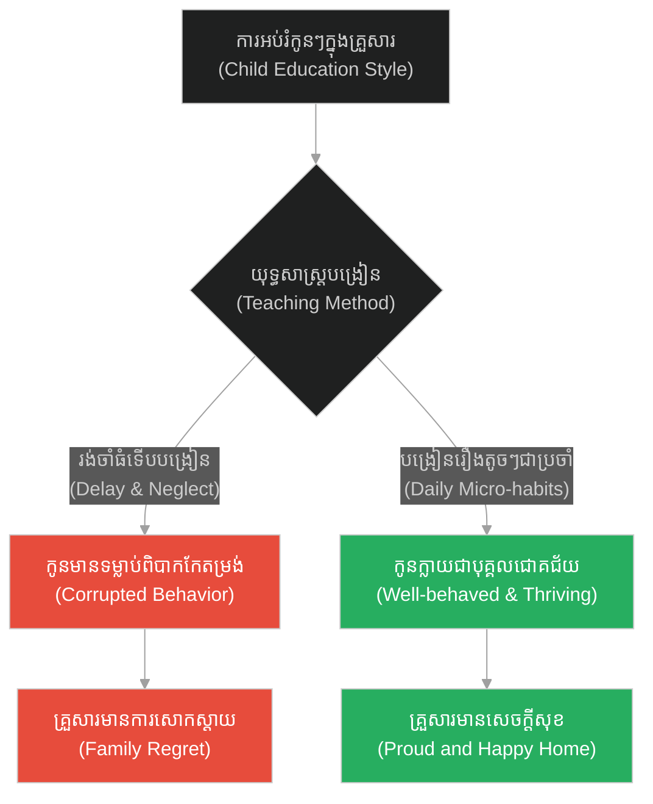
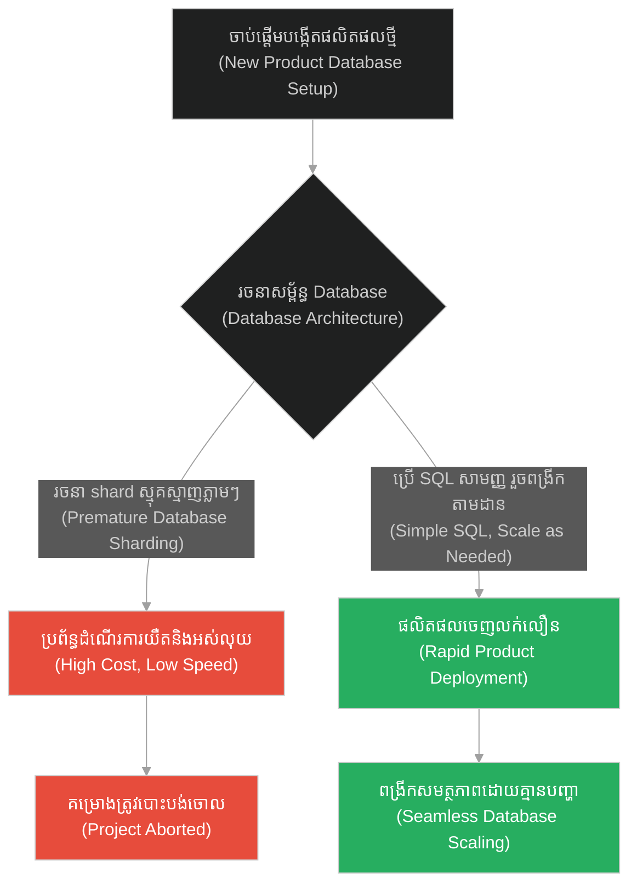
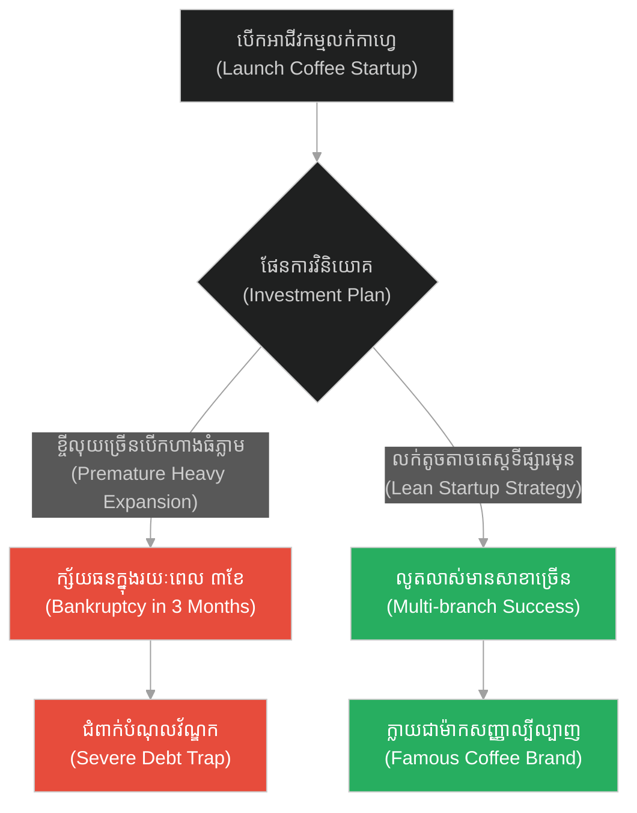
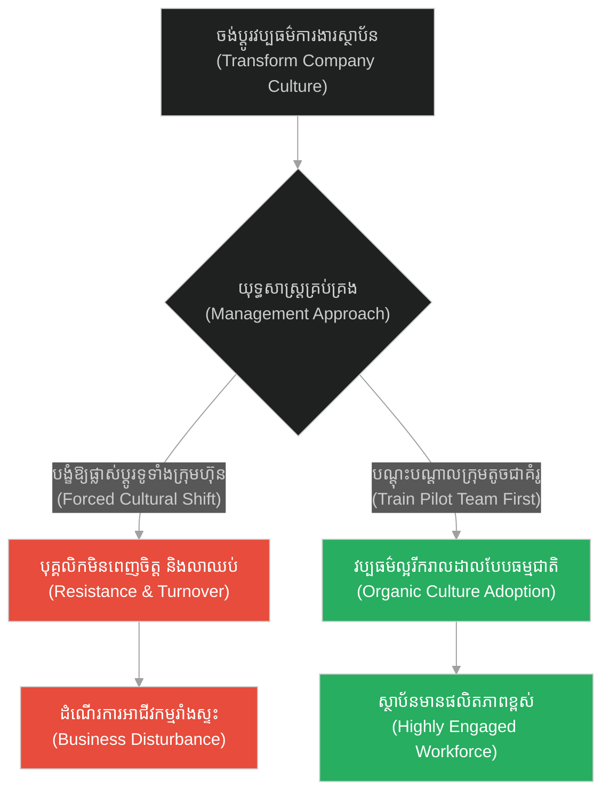
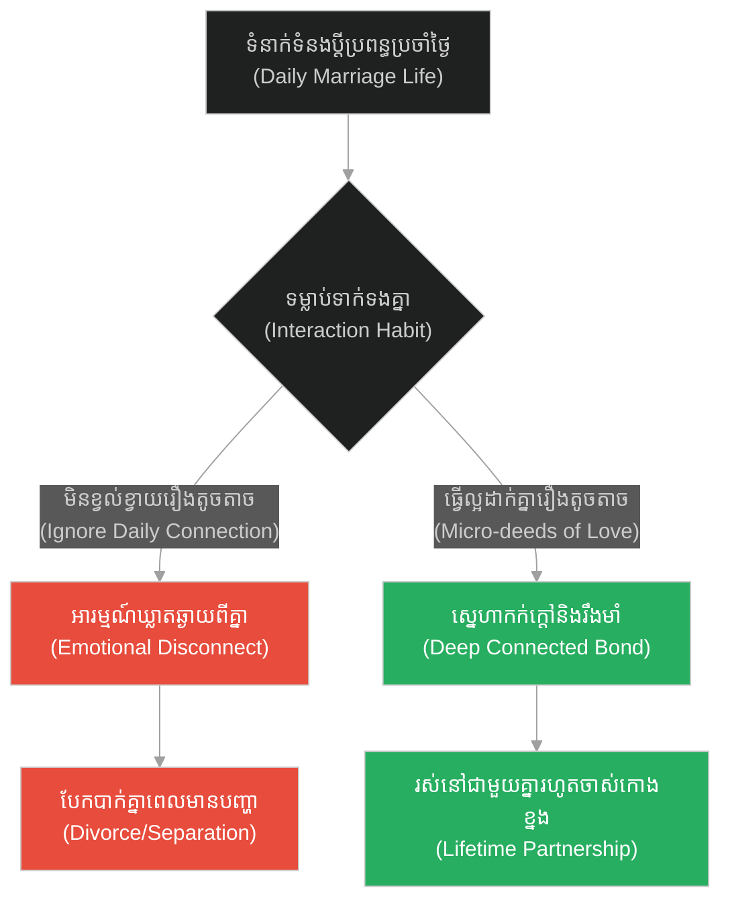
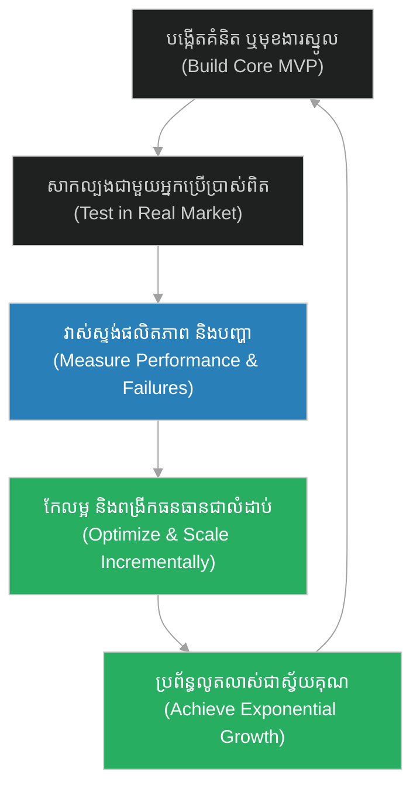

# Exponential Scaling & Organic Growth (គ្រាប់ស្ពៃ)៖ ការពង្រីកខ្លួនជាស្វ័យគុណ និងការលូតលាស់បែបសរីរាង្គ (Exponential Scaling & Organic Growth & The Mustard Seed)

**Author:** ichamrong  
**Date:** 2026-05-28  
**Tags:** #jesus #faith #growth #scaling #patience #nature  
**Category:** Concepts  
**Read Time:** ~15 min  

---

## 📌 មាតិកា (Table of Contents)
- [អន្ទាក់ផ្លូវចិត្ត (The Trap)](#0)
- [១. រឿងព្រេងនិទាន៖ គ្រាប់ស្ពៃតូចល្អិត (The Legend of The Tiny Mustard Seed)](#1)
  - [ពីគ្រាប់ពូជតូចទៅជាជម្រកដ៏ធំ (From Seed to Shelter)](#1-1)
- [២. បញ្ហា៖ ការពង្រីកខ្លួនជាស្វ័យគុណ និងការលូតលាស់បែបសរីរាង្គ (The Issue: Exponential Scaling & Organic Growth)](#2)
- [៣. ឧទាហរណ៍ជាក់ស្តែងក្នុងពិភពពិត (Real World Examples)](#3)
  - [ឧទាហរណ៍ទី ១ — កម្រិតស្រាល (គ្រួសារ)៖ ការបណ្តុះបណ្តាលសីលធម៌កូនៗតាំងពីតូច (The Family Education)](#3-1)
  - [ឧទាហរណ៍ទី ២ — កម្រិតមធ្យម (បច្ចេកទេស)៖ ការលូតលាស់នៃប្រព័ន្ធ Microservices និង Database Scaling (The Tech Microservices Growth)](#3-2)
  - [ឧទាហរណ៍ទី ៣ — កម្រិតមធ្យម (ធុរកិច្ច)៖ ការចាប់ផ្តើមអាជីវកម្មបែប Startup (The Business Startup Evolution)](#3-3)
  - [ឧទាហរណ៍ទី ៤ — កម្រិតមធ្យម (សង្គម/គ្រប់គ្រង)៖ ការរីករាលដាលនៃវប្បធម៌ការងារវិជ្ជមាន (The Management Cultural Transformation)](#3-4)
  - [ឧទាហរណ៍ទី ៥ — កម្រិតធ្ងន់ (ទំនាក់ទំនង)៖ ការកសាងក្តីស្រលាញ់យូរអង្វែងពីទម្លាប់តូចតាច (The Relationship Compounding Habits)](#3-5)
- [៤. ដំណោះស្រាយទូទៅ៖ ការរចនាប្រព័ន្ធលូតលាស់បែបស្វ័យគុណ (The General Solution: Designing the Exponential Growth Engine)](#4)
- [សេចក្តីសន្និដ្ឋាន (Conclusion)](#5)
- [ឯកសារយោង (References)](#6)
- [Related Posts](#7)

---

<a id="0"></a>
## អន្ទាក់ផ្លូវចិត្ត (The Trap)

តើអ្នកធ្លាប់ឃើញគម្រោង Startup ឬប្រព័ន្ធបច្ចេកវិទ្យាណាដែលបរាជ័យ និងក្ស័យធនទៅវិញយ៉ាងលឿន ដោយសារតែព្យាយាមពង្រីកខ្លួនលឿនពេកទាំងដែលគ្មានមូលដ្ឋានគ្រឹះរឹងមាំដែរឬទេ? នេះគឺជា **«អន្ទាក់នៃការបង្ខំឱ្យលូតលាស់លឿនពេក (Premature Optimization / Scaling Trap)»**។ នៅក្នុងការរចនាប្រព័ន្ធ និងអាជីវកម្ម មនុស្សភាគច្រើនចង់បានភាពរីកចម្រើនជាធំភ្លាមៗ (Boom) ដោយមិនយល់ពីតម្លៃនៃការចាប់ផ្តើមពីតូចល្អិត និងការលូតលាស់បែបសរីរាង្គ (Organic Growth)។

*   **Side A (The Trap):** ការធ្វើ Premature Optimization ការចំណាយធនធានច្រើនហួសប្រមាណលើរចនាសម្ព័ន្ធធំតាំងពីដំបូង នាំឱ្យខាតបង់ធនធាន និងគាំងប្រព័ន្ធ។
*   **Side B (Resilient Pattern):** ការចាប់ផ្តើមពីតូចបំផុត (ដូចគ្រាប់ស្ពៃ) ផ្តោតលើគុណភាពស្នូល រួចសន្សំសន្សំស្វ័យគុណ (Compounding) ឱ្យលូតលាស់ទៅជាប្រព័ន្ធយក្សដោយមានស្ថិរភាព។

នៅក្នុងអត្ថបទនេះ យើងនឹងស្វែងយល់ពីរបៀបដែលច្បាប់នៃការលូតលាស់ជាស្វ័យគុណ ជួយឱ្យប្រព័ន្ធសូហ្វវែរ និងអាជីវកម្មលូតលាស់ទៅជាជម្រកដ៏ធំធេងប្រកបដោយស្ថិរភាព។

---

<a id="1"></a>
## ១. រឿងព្រេងនិទាន៖ គ្រាប់ស្ពៃតូចល្អិត (The Legend of The Tiny Mustard Seed)

ព្រះយេស៊ូវបានលើកយករឿងប្រៀបប្រដៅមួយទៀតមកសម្តែង ដើម្បីពន្យល់ពីនគរស្ថានសួគ៌ និងដំណើរនៃការលូតលាស់។

ទ្រង់មានបន្ទូលថា៖ នគរស្ថានសួគ៌ប្រៀបដូចជា **គ្រាប់ស្ពៃ (Mustard Seed)** មួយគ្រាប់ដែលបុរសម្នាក់បានយកទៅសាបព្រោះនៅក្នុងចម្ការរបស់ខ្លួន។

នៅក្នុងចំណោមគ្រាប់ពូជទាំងអស់នៅលើផែនដី គ្រាប់ស្ពៃគឺជាគ្រាប់ពូជដែលតូចល្អិតជាងគេបំផុត។ វាតូចរហូតដល់មនុស្សអាចផ្លុំវាឱ្យហើរចេញពីបាតដៃបានយ៉ាងងាយ ហើយប្រសិនបើវារលុះធ្លាក់ទៅដី គឺស្ទើរតែរកមើលមិនឃើញឡើយ។

<a id="1-1"></a>
### ពីគ្រាប់ពូជតូចទៅជាជម្រកដ៏ធំ (From Seed to Shelter)

ទោះបីជាវាជាគ្រាប់ពូជដែលតូចល្អិតបំផុតក៏ដោយ ប៉ុន្តែនៅពេលដែលវាត្រូវបានគេដាំដុះ ថែទាំ និងស្រោចទឹកនៅក្នុងដីដ៏មានជីវជាតិ វាក៏ចាប់ផ្តើមដុះពន្លកឡើង។

វាលូតលាស់ឡើងជាលំដាប់ ដោយដើមរបស់វាធំជាងបន្លែឯទៀតៗនៅក្នុងចម្ការ។ យូរៗទៅ វាមិនមែនគ្រាន់តែជាដើមស្ពៃតូចៗនោះទេ តែវាបានលូតលាស់ទៅជា «ដើមឈើដ៏ធំមួយ» ដែលមានមែកធាងត្រសង់ និងស្លឹកខ្ចីល្វក់គ្របដណ្តប់ពេញផ្ទៃដី។

ដើមឈើនេះធំរហូតដល់សត្វបក្សាបក្សីនៅលើអាកាស អាចហោះមកធ្វើសំបុក និងជ្រកកោននៅលើមែកធាងរបស់វា ដើម្បីគេចពីកម្តៅថ្ងៃ និងខ្យល់ព្យុះបានយ៉ាងកក់ក្តៅ។ ពីគ្រាប់ពូជដែលតូចបំផុត គ្មានអ្នកចាប់អារម្មណ៍ បានក្លាយទៅជា «ប្រព័ន្ធទ្រទ្រង់ជីវិត (Eco-system/Shelter)» ដ៏អស្ចារ្យសម្រាប់សត្វលោកទាំងឡាយ។

---

<a id="2"></a>
## ២. បញ្ហា៖ ការពង្រីកខ្លួនជាស្វ័យគុណ និងការលូតលាស់បែបសរីរាង្គ (The Issue: Exponential Scaling & Organic Growth)

នៅក្នុងវិស្វកម្មសូហ្វវែរ (Software Engineering) រឿងនេះឆ្លុះបញ្ចាំងពីបញ្ហានៃ **Premature Optimization (ការកែលម្អប្រព័ន្ធមុនអាយុកាល)**។ ស្ថាបនិកបច្ចេកវិទ្យាភាគច្រើន តែងតែរចនាប្រព័ន្ធឱ្យមានភាពស្មុគស្មាញខ្លាំង (ដូចជាការប្រើប្រាស់ Kubernetes clusters, Multi-region replications, និង Microservices) តាំងពីថ្ងៃដំបូងដែលមានអ្នកប្រើប្រាស់តែ ១០ នាក់។ នេះធ្វើឱ្យពួកគេអស់ថវិកា និងចំណាយពេលដោះស្រាយភាពស្មុគស្មាញនៃប្រព័ន្ធ ដោយមិនបានអភិវឌ្ឍផលិតផលពិតប្រាកដ។

ដំណោះស្រាយគឺ **Organic Scaling (ការពង្រីកតាមសរីរាង្គ)**៖ ចាប់ផ្តើមពី Monolith សាមញ្ញ លើ VPS តូចមួយ រួចពង្រីកសមត្ថភាពម្តងមួយជំហាននៅពេលដែល Traffic កើនឡើង។

ខាងក្រោមនេះជាការប្រៀបធៀបកូដ៖

### ឧទាហរណ៍កូដគំរូ (Python)

```python
# =====================================================================
# 1. គំរូមិនល្អ (Fragile Design): Premature Optimization (Massive Cluster setup on day 1)
# =====================================================================
class PrematureSystem:
    def __init__(self):
        # setup node ច្រើនហួសប្រមាណ និងប្រព័ន្ធ lock ស្មុគស្មាញ ទាំងគ្មាន traffic
        self.cluster_nodes = [f"Node_{i}" for i in range(1000)]
        self.message_brokers = ["Kafka", "RabbitMQ"]
        self.active_connections = 0

    def process_order(self, order_id):
        # ចំណាយ overhead ខ្ពស់លើការ synchronize nodes
        print(f"[PREMATURE] Routing order {order_id} through 1000 nodes cluster...")
        # ងាយស្រួលជួបប្រទះ deadlocks ដោយសារភាពស្មុគស្មាញ
        return "Processed"
```

```python
# =====================================================================
# 2. គំរូល្អ (Resilient Design): Organic Scaling (Mustard Seed Pattern)
# =====================================================================
class OrganicSystem:
    def __init__(self):
        # ចាប់ផ្តើមពី node តែមួយយ៉ាងសាមញ្ញ និងលឿន
        self.nodes = ["PrimaryNode"]

    def process_order(self, order_id, current_rpm):
        # ប្រសិនបើ RPM ទាប ដំណើរការក្នុង Node តែមួយដើម្បីសន្សំសំចៃ
        if current_rpm < 1000:
            print(f"[ORGANIC] Processing order {order_id} on {self.nodes[0]}. Low resource usage.")
            return

        # តែបើ Traffic កើនឡើងជាស្វ័យគុណ ត្រូវពង្រីក Node បន្ថែមភ្លាមៗ (Scale-out)
        if len(self.nodes) == 1:
            print("[ORGANIC] High traffic detected! Provisioning secondary nodes automatically...")
            self.nodes.extend(["WorkerNode_1", "WorkerNode_2"])
            
        target_node = self.nodes[order_id % len(self.nodes)]
        print(f"[ORGANIC] Scaled load: Routing order {order_id} to {target_node}.")
```

---

<a id="3"></a>
## ៣. ឧទាហរណ៍ជាក់ស្តែងក្នុងពិភពពិត (Real World Examples)

<a id="3-1"></a>
### ឧទាហរណ៍ទី ១ — កម្រិតស្រាល (គ្រួសារ)៖ ការបណ្តុះបណ្តាលសីលធម៌កូនៗតាំងពីតូច (The Family Education)

*   **Dilemma:** ការរង់ចាំកូនធំពេញវ័យទើបចាប់ផ្តើមបង្រៀនសីលធម៌ និងរបៀបរស់នៅ ធ្វើឱ្យកូនពិបាកកែទម្លាប់អាក្រក់។
*   **Resolution:** ណែនាំ និងបង្រៀនពាក្យសម្តី និងទម្លាប់ល្អតូចៗជារៀងរាល់ថ្ងៃតាំងពីអាយុ ២ ឆ្នាំ ធ្វើឱ្យកូនក្លាយជាមនុស្សល្អក្នុងសង្គមពេលធំឡើង។



<a id="3-2"></a>
### ឧទាហរណ៍ទី ២ — កម្រិតមធ្យម (បច្ចេកទេស)៖ ការលូតលាស់នៃប្រព័ន្ធ Microservices និង Database Scaling (The Tech Microservices Growth)

*   **Dilemma:** ការរចនា database shard ច្រើន និងប្រើ NoSQL ស្មុគស្មាញតាំងពីគម្រោងមិនទាន់ដំណើរការ ធ្វើឱ្យការអភិវឌ្ឍយឺតយ៉ាវ។
*   **Resolution:** ប្រើប្រាស់ Postgres ធម្មតាមួយ រួចពង្រីកទៅជា Read Replica នៅពេលមានការប្រើប្រាស់ច្រើន ជួយសន្សំពេលវេលាអភិវឌ្ឍផលិតផល។



<a id="3-3"></a>
### ឧទាហរណ៍ទី ៣ — កម្រិតមធ្យម (ធុរកិច្ច)៖ ការចាប់ផ្តើមអាជីវកម្មបែប Startup (The Business Startup Evolution)

*   **Dilemma:** ហាងកាហ្វេថ្មីមួយជួលបុគ្គលិក ២០ នាក់ និងទិញម៉ាស៊ីនទំនើបៗរាប់ម៉ឺនដុល្លារ ទាំងដែលមិនទាន់ដឹងថាមានម៉ាស៊ីនទិញឬអត់។
*   **Resolution:** ចាប់ផ្តើមពីតូបតូចមួយ ធ្វើតេស្តរសជាតិ និងស្វែងរកអតិថិជនស្នូល រួចពង្រីកសាខាតាមប្រាក់ចំណេញដែលទទួលបាន។



<a id="3-4"></a>
### ឧទាហរណ៍ទី ៤ — កម្រិតមធ្យម (សង្គម/គ្រប់គ្រង)៖ ការរីករាលដាលនៃវប្បធម៌ការងារវិជ្ជមាន (The Management Cultural Transformation)

*   **Dilemma:** ប្រកាសចេញច្បាប់វិន័យតឹងរឹងរាប់រយទំព័រទូទាំងក្រុមហ៊ុន ដើម្បីបង្ខំឱ្យបុគ្គលិកផ្លាស់ប្តូរវប្បធម៌ការងារ នាំឱ្យមានការប្រឆាំង និងលាឈប់។
*   **Resolution:** ចាប់ផ្តើមអនុវត្តវប្បធម៌សហការល្អជាមួយក្រុមតូចមួយ (Pilot Team) រួចឱ្យពួកគេបង្ហាញលទ្ធផល និងចែកចាយឥទ្ធិពលទៅក្រុមផ្សេងទៀត។



<a id="3-5"></a>
### ឧទាហរណ៍ទី ៥ — កម្រិតធ្ងន់ (ទំនាក់ទំនង)៖ ការកសាងក្តីស្រលាញ់យូរអង្វែងពីទម្លាប់តូចតាច (The Relationship Compounding Habits)

*   **Dilemma:** ការរង់ចាំតែឱកាសធំដូចជាខួបអាពាហ៍ពិពាហ៍ទើបយកចិត្តទុកដាក់គ្នា ធ្វើឱ្យទំនាក់ទំនងប្រចាំថ្ងៃមានភាពស្ងួតកន្ត្រោះ។
*   **Resolution:** ធ្វើរឿងល្អៗតូចតាចដូចជាការជួយលាងចាន ការនិយាយលើកទឹកចិត្ត និងការអោបគ្នាជាប្រចាំ បង្កើតជាសេចក្តីស្រឡាញ់ដ៏ស្អិតរមួត។



---

<a id="4"></a>
## ៤. ដំណោះស្រាយទូទៅ៖ ការរចនាប្រព័ន្ធលូតលាស់បែបស្វ័យគុណ (The General Solution: Designing the Exponential Growth Engine)

ដើម្បីធានាឱ្យប្រព័ន្ធលូតលាស់មានសុវត្ថិភាព និងរឹងមាំ៖

1.  **ចាប់ផ្តើមពីស្នូលសាមញ្ញ (Start Simple & Lean):** បង្កើតផលិតផលដែលមានតម្លៃស្នូល (MVP) ឱ្យបានលឿនបំផុត ដើម្បីទទួលបានការផ្ទៀងផ្ទាត់ពីអ្នកប្រើប្រាស់ពិតប្រាកដ។
2.  **សាងសង់មូលដ្ឋានគ្រឹះស្អាតស្អំ (Solid Core Architecture):** ធានាថាកូដ និងរចនាសម្ព័ន្ធស្នូលមានភាពស្អាតស្អំ ងាយស្រួលពង្រីក (Scalable Architecture) នៅពេលត្រូវការ។
3.  **ពង្រីកសមត្ថភាពតាមតម្រូវការ (Scale and Compound on Demand):** បន្ថែមធនធាន ឬរចនាសម្ព័ន្ធស្មុគស្មាញ លុះត្រាតែប្រព័ន្ធស្នូលលែងអាចទ្រទ្រង់បាន។



---

## 🐇 ធ្លាក់ចូលក្នុងរន្ធទន្សាយ (Enter the Rabbit Hole)
ដើម្បីយល់ដឹងពីរបៀបដែលការចាត់ចែងធនធាន និងការទទួលបានត្រឡប់មកវិញខ្ពស់ (High ROI) ជួយឱ្យការវិនិយោគរបស់អ្នកទទួលបានលទ្ធផលល្អបំផុត សូមបន្តដំណើរទៅកាន់៖

* 🚀 **[ចាប់ផ្តើមដំណើររុករក (Start the Journey) ➔ Resource Optimization & High ROI](./179-jesus-and-the-sower.md)**

---

<a id="5"></a>
## សេចក្តីសន្និដ្ឋាន (Conclusion)

> **«កុំមើលងាយការចាប់ផ្តើមតូចតាចរបស់អ្នកឱ្យសោះ។ ដើមឈើដ៏ធំបំផុតនៅក្នុងព្រៃ គឺចាប់ផ្តើមចេញពីគ្រាប់ពូជដែលតូចបំផុត។»**

ភាពជោគជ័យដ៏ធំធេង និងស្ថិរភាពយូរអង្វែង មិនមែនកើតឡើងដោយសារការប្រញាប់ប្រញាល់ ឬការបង្ខំឱ្យពង្រីកខ្លួនធំភ្លាមៗនោះទេ។ ការបណ្តុះបណ្តាលសីលធម៌ ការសរសេរកូដសាមញ្ញ និងការកសាងអាជីវកម្មខ្នាតតូច គឺជាវិធីតែមួយគត់ដើម្បីបង្កើតបាននូវគ្រឹះដ៏រឹងមាំ ដែលនឹងលូតលាស់ទៅជាទីជម្រកដ៏សុខសាន្តសម្រាប់គ្រប់ភាគីពាក់ព័ន្ធនាពេលអនាគត។

---

<a id="6"></a>
## ឯកសារយោង (References)

*   **Holy Bible** — *Matthew 13:31–32*. ប្រភពដើមនៃរឿងប្រៀបប្រដៅស្តីអំពីគ្រាប់ស្ពៃ។
*   **Ries, Eric** — *The Lean Startup* (2011). ពន្យល់អំពីរបៀបកសាងអាជីវកម្មបែបសន្សំសំចៃ និងលូតលាស់ពីតូចទៅធំដោយសុវត្ថិភាព។

---

<a id="7"></a>
## Related Posts

* [Resource Optimization & High ROI (អ្នកព្រួសគ្រាប់ពូជ)](./179-jesus-and-the-sower.md) — របៀបបែងចែកធនធានទៅលើដីដែលមានជីវជាតិដើម្បីទទួលបានផលខ្ពស់។
* [Recovery States & Clean Slates / Refactoring (កូនប្រុសខ្ជះខ្ជាយ)](./177-jesus-and-the-prodigal-son.md) — របៀបចាប់ផ្តើមឡើងវិញដោយស្អាតស្អំក្រោយការបំផ្លាញ។
