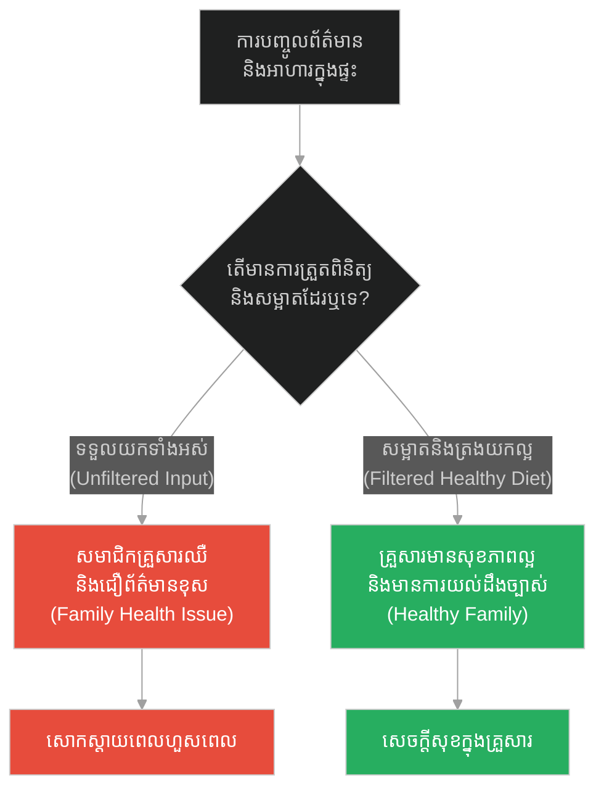
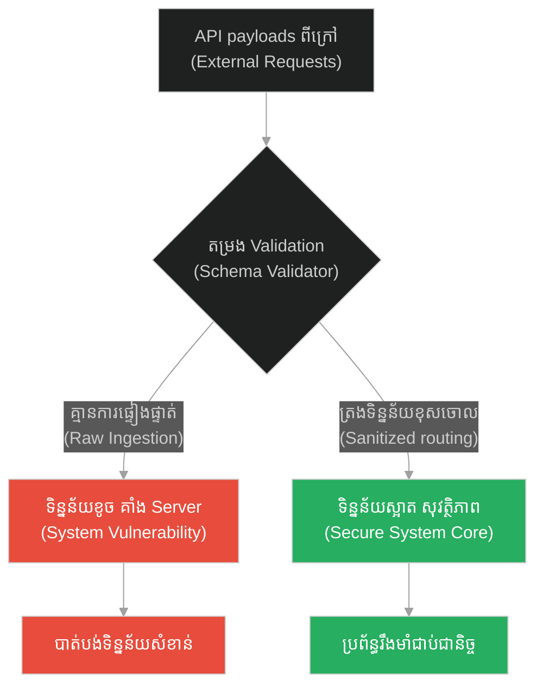
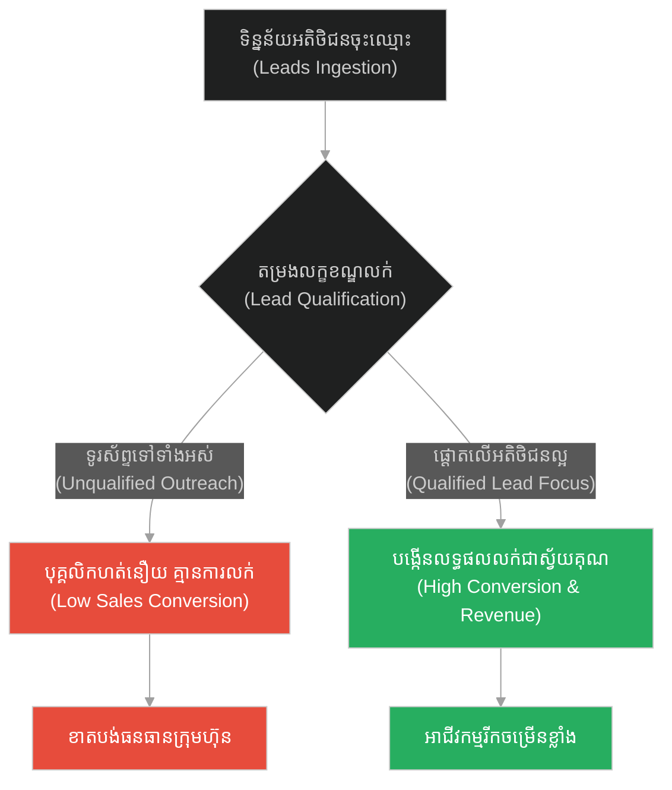
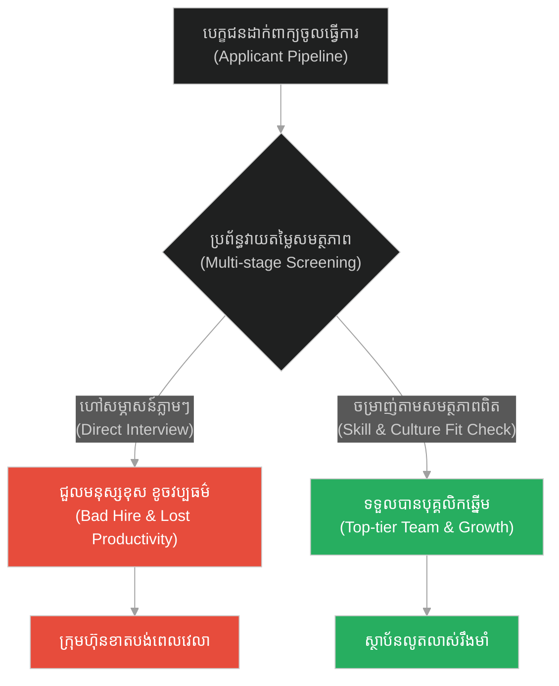
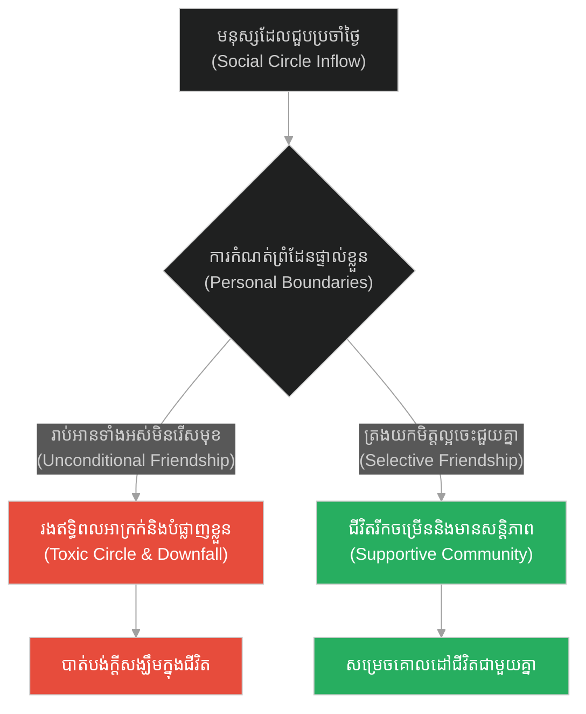
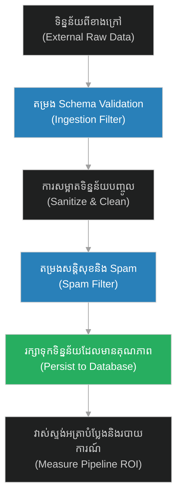

# Pipeline Conversion Rates & Data Sanitization (អ្នកសាបព្រោះគ្រាប់ពូជ)៖ របៀបវាស់ស្ទង់អត្រាបំប្លែងទិន្នន័យ និងការសម្អាតបញ្ចូលទិន្នន័យ (Pipeline Conversion Rates & Data Sanitization & Jesus and the Sower)

**Author:** ichamrong  
**Date:** 2026-05-28  
**Tags:** #jesus #environment #receptivity #growth-mindset #resilience #data-sanitization  
**Category:** Concepts / Parables  
**Read Time:** ~15 min  

---

## 📌 មាតិកា (Table of Contents)
- [អន្ទាក់ផ្លូវចិត្ត (The Trap)](#0)
- [១. រឿងព្រេងនិទាន៖ អ្នកសាបព្រោះគ្រាប់ពូជ (The Legend of The Sower and Seeds)](#1)
  - [ប្រភេទដីទាំង ៤ និងលទ្ធផលផ្សេងគ្នា (The Four Soil Types and Outcomes)](#1-1)
- [២. បញ្ហា៖ វិបត្តិលំហូរទិន្នន័យមិនស្អាត និងការបាត់បង់អត្រាបំប្លែង (The Issue: Dirty Data Pipelines and Drop-off Rates)](#2)
- [៣. ឧទាហមណ៍ជាក់ស្តែងក្នុងពិភពពិត (Real World Examples)](#3)
  - [ឧទាហរណ៍ទី ១ — កម្រិតស្រាល (គ្រួសារ)៖ ការជ្រើសរើសរបបអាហារ និងការសម្អាតព័ត៌មាន (The Family Diet and Media Filter)](#3-1)
  - [ឧទាហរណ៍ទី ២ — កម្រិតមធ្យម (បច្ចេកទេស)៖ ការសម្អាតទិន្នន័យ API Gateway (The Tech API Data Sanitizer)](#3-2)
  - [ឧទាហរណ៍ទី ៣ — កម្រិតមធ្យម (ធុរកិច្ច)៖ ការគ្រប់គ្រងចរន្តលក់ និងអតិថិជនសក្តានុពល (The Business Sales Lead Funnel)](#3-3)
  - [ឧទាហរណ៍ទី ៤ — កម្រិតមធ្យម (សង្គម/គ្រប់គ្រង)៖ ដំណើរការជ្រើសរើសបុគ្គលិក និងការបណ្តុះបណ្តាល (The Management Hiring Funnel)](#3-4)
  - [ឧទាហរណ៍ទី ៥ — កម្រិតធ្ងន់ (ទំនាក់ទំនង)៖ ការជ្រើសរើសមិត្តភក្តិ និងការត្រងឥទ្ធិពលខាងក្រៅ (The Relationship Influence Filter)](#3-5)
- [៤. ដំណោះស្រាយទូទៅ៖ ការកសាងស្ថាបត្យកម្មលំហូរទិន្នន័យស្អាត (The General Solution: Clean Data Pipeline Architecture)](#4)
- [សេចក្តីសន្និដ្ឋាន (Conclusion)](#5)
- [ឯកសារយោង (References)](#6)
- [Related Posts](#7)

---

<a id="0"></a>
## អន្ទាក់ផ្លូវចិត្ត (The Trap)

តើអ្នកធ្លាប់ជួបប្រទះការខូចខាតប្រព័ន្ធទិន្នន័យ ឬការធ្លាក់ចុះយ៉ាងគំហើញនៃប្រសិទ្ធភាពការងារ ដោយសារតែការបញ្ចូលធាតុចូលដែលគ្មានគុណភាព ឬទិន្នន័យកខ្វក់ដែរឬទេ? នេះគឺជា **«អន្ទាក់នៃការមិនសម្អាតទិន្នន័យបញ្ចូល និងការមើលរំលងបរិស្ថានទទួល (Input Neglect & Unprepared Target Trap)»**។ នៅក្នុងការរចនាប្រព័ន្ធ និងការទំនាក់ទំនង មនុស្សភាគច្រើនផ្តោតតែទៅលើការបញ្ជូនព័ត៌មានចេញ (Broadcasting) ដោយមិនបានត្រៀមលក្ខណៈ ឬសម្អាតបរិស្ថានដែលត្រូវទទួលយកព័ត៌មាននោះឡើយ។

*   **Side A (The Trap):** ការបោះព័ត៌មាន ឬទិន្នន័យកខ្វក់ចូលទៅក្នុងប្រព័ន្ធដោយគ្មានការផ្ទៀងផ្ទាត់ (Sanitization) ដែលបណ្តាលឱ្យកើតមានកំហុសឆ្គង គាំងដំណើរការ ឬទិន្នន័យត្រូវបាត់បង់ឥតប្រយោជន៍។
*   **Side B (Resilient Pattern):** ការអនុវត្តច្បាប់តម្រងលំហូរទិន្នន័យ (Pipeline Sanitization) និងការរៀបចំបរិស្ថានទទួលឱ្យសមស្រប ដើម្បីធានាថាធនធានដែលបញ្ជូនទៅអាចចាក់ឫស និងផ្តល់ផលបានច្រើនបំផុត។

---

<a id="1"></a>
## ១. រឿងព្រេងនិទាន៖ អ្នកសាបព្រោះគ្រាប់ពូជ (The Legend of The Sower and Seeds)

ព្រះយេស៊ូវបានលើកយករឿងប្រៀបប្រដៅមួយមកសម្តែងទៅកាន់ហ្វូងមនុស្សយ៉ាងច្រើនកុះករដែលឈរនៅមាត់បឹង។

ទ្រង់មានបន្ទូលថា៖ «មានកសិករម្នាក់បានយកគ្រាប់ពូជទៅសាបព្រោះនៅក្នុងចម្ការរបស់ខ្លួន។ នៅពេលដែលគាត់កំពុងព្រោះនោះ មានគ្រាប់ពូជខ្លះបានធ្លាក់ទៅលើដីខុសៗគ្នា»។

គ្រាប់ពូជទាំងអស់ដែលកសិករព្រោះចេញទៅ គឺសុទ្ធតែជាគ្រាប់ពូជដែលមានគុណភាពល្អដូចគ្នាទាំងអស់ (តំណាងឱ្យធាតុចូលដ៏ល្អ ឱកាស ឬព័ត៌មានពិត) ប៉ុន្តែលទ្ធផលចុងក្រោយនៃការលូតលាស់គឺមានភាពខុសគ្នាស្រឡះទៅតាមស្ថានភាពដីដែលទទួលយកវា។

<a id="1-1"></a>
### ប្រភេទដីទាំង ៤ និងលទ្ធផលផ្សេងគ្នា (The Four Soil Types and Outcomes)

*   **ដីតាមផ្លូវ (The Path):** គ្រាប់ពូជខ្លះធ្លាក់លើផ្លូវដើរ ដែលជាដីរឹង និងត្រូវបានជាន់ឈ្លី។ គ្រាប់ពូជទាំងនោះមិនអាចជ្រាបចូលទៅក្នុងដីបានឡើយ ហើយមិនយូរប៉ុន្មាន សត្វបក្សីក៏ហើរមកចឹកស៊ីអស់ទៅ។
*   **ដីក្រួសថ្ម (Rocky Ground):** គ្រាប់ពូជខ្លះទៀតធ្លាក់លើដីដែលមានក្រួសថ្មច្រើន និងមានដីស្រទាប់លើស្តើង។ វាឆាប់ដុះឡើងមែន ប៉ុន្តែដោយសារគ្មានឫសជ្រៅ ពេលថ្ងៃក្តៅខ្លាំង វាក៏ស្រពោន និងងាប់ទៅវិញយ៉ាងឆាប់រហ័ស។
*   **ដីបន្លា (Thorny Ground):** គ្រាប់ពូជខ្លះទៀតធ្លាក់ក្បែរគុម្ពបន្លា។ នៅពេលវាដុះលូតលាស់ឡើង គុម្ពបន្លាក៏ដុះមកគ្របដណ្តប់ និងស្រូបយកជីជាតិអស់ ធ្វើឱ្យដើមទាំងនោះមិនអាចបង្កើតផលបានឡើយ។
*   **ដីមានជីជាតិ (Good Soil):** គ្រាប់ពូជដែលធ្លាក់លើដីល្អ បានចាក់ឫសយ៉ាងជ្រៅទៅក្នុងដី ស្រូបយកទឹក និងជីជាតិបានពេញលេញ រួចលូតលាស់យ៉ាងរឹងមាំ និងបង្កើតផលបានជាច្រើនគុណ ខ្លះបាន ១០០ដង ខ្លះ ៦០ដង និងខ្លះ ៣០ដង។

---

<a id="2"></a>
## ២. បញ្ហា៖ វិបត្តិលំហូរទិន្នន័យមិនស្អាត និងការបាត់បង់អត្រាបំប្លែង (The Issue: Dirty Data Pipelines and Drop-off Rates)

នៅក្នុងវិស្វកម្មសូហ្វវែរ (Software Engineering) Parable of the Sower ឆ្លុះបញ្ចាំងពីលំហូរទិន្នន័យទូទៅ **Data Ingestion Pipeline**។ ប្រសិនបើប្រព័ន្ធបញ្ចូលទិន្នន័យ (Data Ingestion) ទទួលយកព័ត៌មានដែលគ្មានការត្រួតពិនិត្យ គ្មានការលាងសម្អាត (Unsanitized) នោះទិន្នន័យកខ្វក់ (Dirty Data) នឹងបំផ្លាញប្រព័ន្ធ Database ទាំងមូល ឬបណ្តាលឱ្យដំណើរការវិភាគទិន្នន័យខុសស្រឡះ។

យើងត្រូវការស្ថាបត្យកម្មដែលអនុវត្តការសម្អាតទិន្នន័យ (Data Sanitization/Validation) នៅច្រកចូល ដើម្បីការពារ និងវាស់ស្ទង់អត្រាបំប្លែង (Conversion Rate) របស់ទិន្នន័យនៅរាល់ដំណាក់កាលនីមួយៗ។

ខាងក្រោមនេះជាការប្រៀបធៀបកូដ៖

### ឧទាហរណ៍កូដគំរូ (Python)

```python
# =====================================================================
# 1. គំរូមិនល្អ (Fragile Design): Unsanitized Pipeline (Accepts everything, crashes/drops randomly)
# =====================================================================
class FragileDataPipeline:
    def __init__(self):
        self.database = []

    def ingest_records(self, raw_records):
        for record in raw_records:
            # គ្មានការផ្ទៀងផ្ទាត់ទិន្នន័យបញ្ចូលឡើយ
            # ប្រសិនបើតម្លៃ null ឬខុស format នឹងគាំង ឬផ្ទុកទិន្នន័យខូច
            print(f"[FRAGILE] Ingesting raw record: {record}")
            self.database.append(record)
        return len(self.database)

# =====================================================================
# 2. គំរូល្អ (Resilient Design): Sanitized Pipeline with Metrics (Sower Pattern)
# =====================================================================
import re

class ResilientDataPipeline:
    def __init__(self):
        self.good_database = []
        self.metrics = {
            "total_received": 0,
            "dropped_malformed": 0, # ដីតាមផ្លូវ (Path)
            "dropped_empty": 0,     # ដីក្រួសថ្ម (Rocky)
            "dropped_spam": 0,      # ដីបន្លា (Thorny)
            "successfully_saved": 0 # ដីល្អ (Good Soil)
        }

    def sanitize_and_ingest(self, raw_records):
        for record in raw_records:
            self.metrics["total_received"] += 1
            
            # ដំណាក់កាលទី ១៖ ត្រួតពិនិត្យទម្រង់ទិន្នន័យ (Regex Validation) -> ដីតាមផ្លូវ
            if not isinstance(record, dict) or "email" not in record:
                self.metrics["dropped_malformed"] += 1
                print(f"[PIPELINE-DROP] Malformed record dropped: {record}")
                continue
                
            # ដំណាក់កាលទី ២៖ ត្រួតពិនិត្យភាពទទេ ឬគ្មានតម្លៃពិត -> ដីក្រួសថ្ម
            email = record["email"].strip()
            if not email or not re.match(r"[^@]+@[^@]+\.[^@]+", email):
                self.metrics["dropped_empty"] += 1
                print(f"[PIPELINE-DROP] Invalid email format: {email}")
                continue
                
            # ដំណាក់កាលទី ៣៖ តម្រង Spam/Security Filter -> ដីបន្លា
            if record.get("is_spam", False) or "test" in email.lower():
                self.metrics["dropped_spam"] += 1
                print(f"[PIPELINE-DROP] Blocked spam/test record: {email}")
                continue
                
            # ដំណាក់កាលទី ៤៖ រក្សាទុកទិន្នន័យស្អាតស្អំ -> ដីមានជីជាតិ
            self.good_database.append(record)
            self.metrics["successfully_saved"] += 1
            print(f"[PIPELINE-SUCCESS] Saved clean record: {email}")
            
        # គណនាអត្រាបំប្លែង (Conversion Rate)
        total = self.metrics["total_received"]
        if total > 0:
            conversion = (self.metrics["successfully_saved"] / total) * 100
            print(f"[METRICS] Pipeline Conversion Rate: {conversion:.2f}%")
        return self.good_database
```

---

<a id="3"></a>
## ៣. ឧទាហមណ៍ជាក់ស្តែងក្នុងពិភពពិត (Real World Examples)

<a id="3-1"></a>
### ឧទាហរណ៍ទី ១ — កម្រិតស្រាល (គ្រួសារ)៖ ការជ្រើសរើសរបបអាហារ និងការសម្អាតព័ត៌មាន (The Family Diet and Media Filter)

*   **Dilemma:** ការអនុញ្ញាតឱ្យសមាជិកគ្រួសារញ៉ាំអាហារឥតប្រយោជន៍ និងមើលព័ត៌មានក្លែងក្លាយតាមអ៊ីនធឺណិតដោយគ្មានការត្រង ធ្វើឱ្យខូចសុខភាព និងផ្លូវចិត្ត។
*   **Resolution:** រៀបចំផ្ទះបាយឱ្យមានតែបន្លែផ្លែឈើល្អៗ និងបង្កើតទម្លាប់ពិភាក្សាត្រងព័ត៌មានមុននឹងជឿ ដើម្បីការពារកូនៗពីឥទ្ធិពលអាក្រក់។



<a id="3-2"></a>
### ឧទាហរណ៍ទី ២ — កម្រិតមធ្យម (បច្ចេកទេស)៖ ការសម្អាតទិន្នន័យ API Gateway (The Tech API Data Sanitizer)

*   **Dilemma:** API endpoint ទទួលយក HTTP payload ពីខាងក្រៅដោយមិនពិនិត្យ Schema នាំឱ្យ Hacker អាចវាយប្រហារតាមរយៈ SQL Injection ឬបង្កឱ្យ Server គាំង។
*   **Resolution:** ដាក់បញ្ចូល API Gateway ជាមួយ middleware Validation Schema (ដូចជា Joi ឬ Zod) ដើម្បីធានាថាមានតែទិន្នន័យស្អាតទើបទៅដល់ Core Service។



<a id="3-3"></a>
### ឧទាហរណ៍ទី ៣ — កម្រិតមធ្យម (ធុរកិច្ច)៖ ការគ្រប់គ្រងចរន្តលក់ និងអតិថិជនសក្តានុពល (The Business Sales Lead Funnel)

*   **Dilemma:** ក្រុមលក់ចំណាយពេលទូរស័ព្ទទៅមនុស្សគ្រប់គ្នាដែលចុះឈ្មោះលេងហ្គេមឥតគិតថ្លៃ នាំឱ្យខាតពេល និងគ្មានលទ្ធផលលក់ (Zero ROI)។
*   **Resolution:** បង្កើតប្រព័ន្ធ Lead Scoring ត្រងយកតែអតិថិជនណាដែលមានតម្រូវការ និងលទ្ធភាពពិតប្រាកដ ទើបបញ្ជូនទៅឱ្យភ្នាក់ងារលក់។



<a id="3-4"></a>
### ឧទាហរណ៍ទី ៤ — កម្រិតមធ្យម (សង្គម/គ្រប់គ្រង)៖ ដំណើរការជ្រើសរើសបុគ្គលិក និងការបណ្តុះបណ្តាល (The Management Hiring Funnel)

*   **Dilemma:** ក្រុមហ៊ុនសម្ភាសន៍បេក្ខជនរាប់ពាន់នាក់ដោយគ្រាន់តែមើល CV នាំឱ្យជួលមនុស្សខុស និងត្រូវចំណាយពេលបណ្តុះបណ្តាលឡើងវិញ។
*   **Resolution:** ដាក់បញ្ចូលដំណាក់កាលតេស្តសមត្ថភាពបច្ចេកទេស និងវប្បធម៌ការងារមុននឹងសម្ភាសន៍ ដើម្បីចម្រាញ់យកតែមនុស្សដែលសមស្របបំផុត។



<a id="3-5"></a>
### ឧទាហរណ៍ទី ៥ — កម្រិតធ្ងន់ (ទំនាក់ទំនង)៖ ការជ្រើសរើសមិត្តភក្តិ និងការត្រងឥទ្ធិពលខាងក្រៅ (The Relationship Influence Filter)

*   **Dilemma:** ការរាប់អានមិត្តភក្តិគ្រប់គ្នាដោយមិនគិតពីចរិតមារយាទ នាំឱ្យមិត្តភក្តិអាក្រក់អូសទាញឱ្យធ្លាក់ក្នុងល្បែងស៊ីសង ឬបំផ្លាញអនាគត។
*   **Resolution:** ជ្រើសរើសរាប់អានតែអ្នកណាដែលមានតម្លៃជីវិតវិជ្ជមាន ចេះជួយគ្នា និងជៀសវាងមិត្តភក្តិដែលនាំតែរឿងក្តៅក្រហាយ។



---

<a id="4"></a>
## ៤. ដំណោះស្រាយទូទៅ៖ ការកសាងស្ថាបត្យកម្មលំហូរទិន្នន័យស្អាត (The General Solution: Clean Data Pipeline Architecture)

ដើម្បីគ្រប់គ្រងលំហូរទិន្នន័យបញ្ចូល និងរក្សាអត្រាបំប្លែងឱ្យបានខ្ពស់៖

1.  **ការរឹតបន្តឹងច្រកចូល (Strict Input Ingestion & Schema Check):** មិនត្រូវអនុញ្ញាតឱ្យទិន្នន័យដែលគ្មានទម្រង់ត្រឹមត្រូវចូលទៅដល់ Core Controller ឡើយ។
2.  **ការសម្អាតទិន្នន័យជាដំណាក់កាល (Multi-stage Sanitization):** ត្រងកាកសំណល់ ទិន្នន័យស្ទួន និងព័ត៌មានដែលគ្មានប្រយោជន៍ចេញជាជំហានៗ។
3.  **ការត្រួតពិនិត្យនិងវាស់ស្ទង់ (Monitoring & Metrics Dashboard):** តាមដានអត្រាបំប្លែង (Conversion rate) និងប្រភពទិន្នន័យដែលធ្លាក់ចុះ ដើម្បីកែលម្អប្រព័ន្ធជាប្រចាំ។



---

## 🐇 ធ្លាក់ចូលក្នុងរន្ធទន្សាយ (Enter the Rabbit Hole)
ដើម្បីយល់ដឹងពីរបៀបដែលធនធានដែលរក្សាទុក និងទទួលបានត្រូវចាត់ចែងដើម្បីបង្កើនប្រសិទ្ធភាព និងការពារការខាតបង់ សូមបន្តដំណើរទៅកាន់៖

* 🚀 **[ចាប់ផ្តើមដំណើររុករក (Start the Journey) ➔ Loss Aversion & Resource Optimization](./180-jesus-and-the-talents.md)**

---

<a id="5"></a>
## សេចក្តីសន្និដ្ឋាន (Conclusion)

> **«កំហុសឆ្គង ឬភាពជោគជ័យមិនមែនស្ថិតនៅលើគ្រាប់ពូជតែមួយមុខនោះទេ តែវាស្ថិតនៅលើរបៀបដែលយើងរៀបចំដីសម្រាប់ទទួលយកវា។»**

ទិន្នន័យដ៏ល្អ ចំណេះដឹងដ៏វិសេសវិសាល ឬមិត្តភាពដ៏ល្អ នឹងត្រូវបាត់បង់ និងគ្មានប្រយោជន៍ ប្រសិនបើយើងបញ្ជូនវាទៅកាន់ប្រព័ន្ធដែលមិនទាន់រៀបចំ ឬបរិស្ថានកខ្វក់។ ការវិនិយោគលើការសម្អាតច្រកចូល (Sanitization) និងការភ្ជួររាស់ដីនៅក្នុងចិត្ត (Mindset Preparation) គឺជាជំហានដំបូង និងចាំបាច់បំផុត ដើម្បីធានាបាននូវការលូតលាស់ និងការទទួលបានលទ្ធផលគាប់ប្រសើរជាស្វ័យគុណ។

---

<a id="6"></a>
## ឯកសារយោង (References)

*   **Holy Bible** — *Matthew 13:1-23*. Parable of the Sower.
*   **Dweck, Carol S.** — *Mindset: The New Psychology of Success* (2006). Explores how good soil (Growth Mindset) enables human potential compounding.
*   **Fowler, Martin** — *Patterns of Enterprise Application Architecture* (2002). Discusses data gateway validation and ingestion mapping.

---

<a id="7"></a>
## Related Posts

* [Exponential Scaling & Organic Growth (គ្រាប់ស្ពៃ)](./178-jesus-and-the-mustard-seed.md) — របៀបលូតលាស់ពីតូចល្អិតទៅជាប្រព័ន្ធដ៏ធំធេង។
* [Loss Aversion & Resource Optimization (ប្រាក់តាលិន)](./180-jesus-and-the-talents.md) — របៀបចាត់ចែងធនធានដើម្បីកុំឱ្យខាតបង់ឱកាស។
