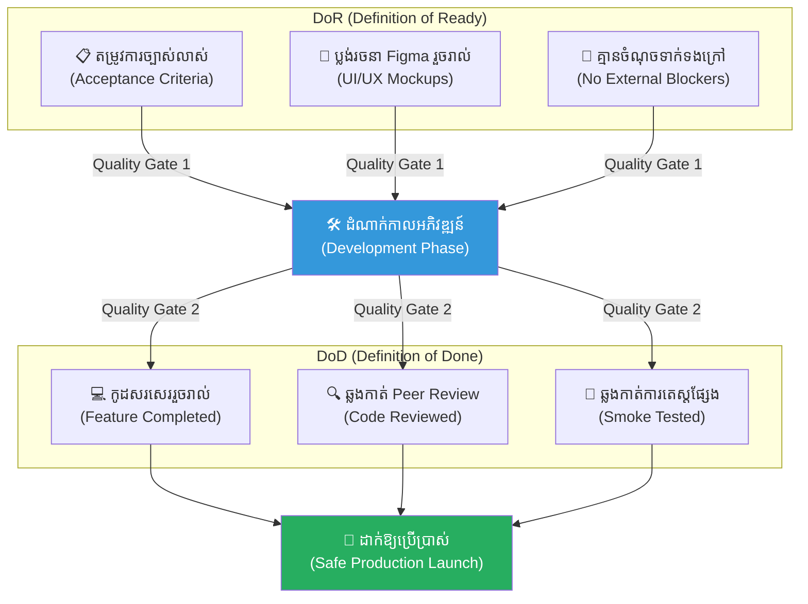
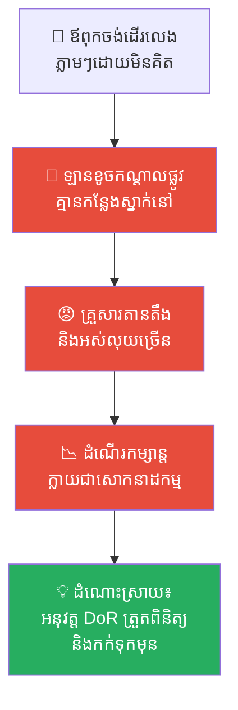
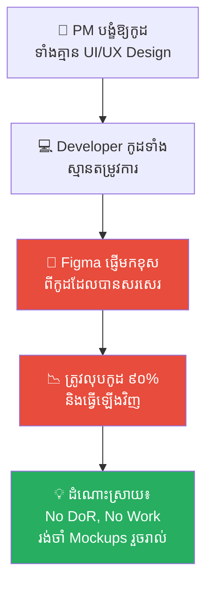
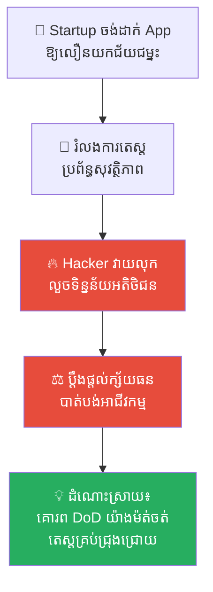
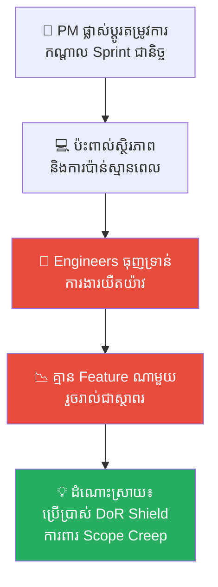
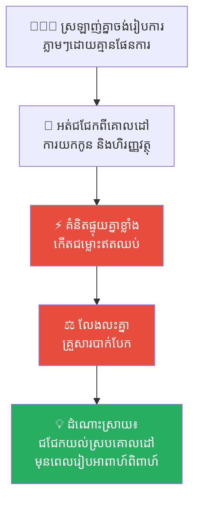
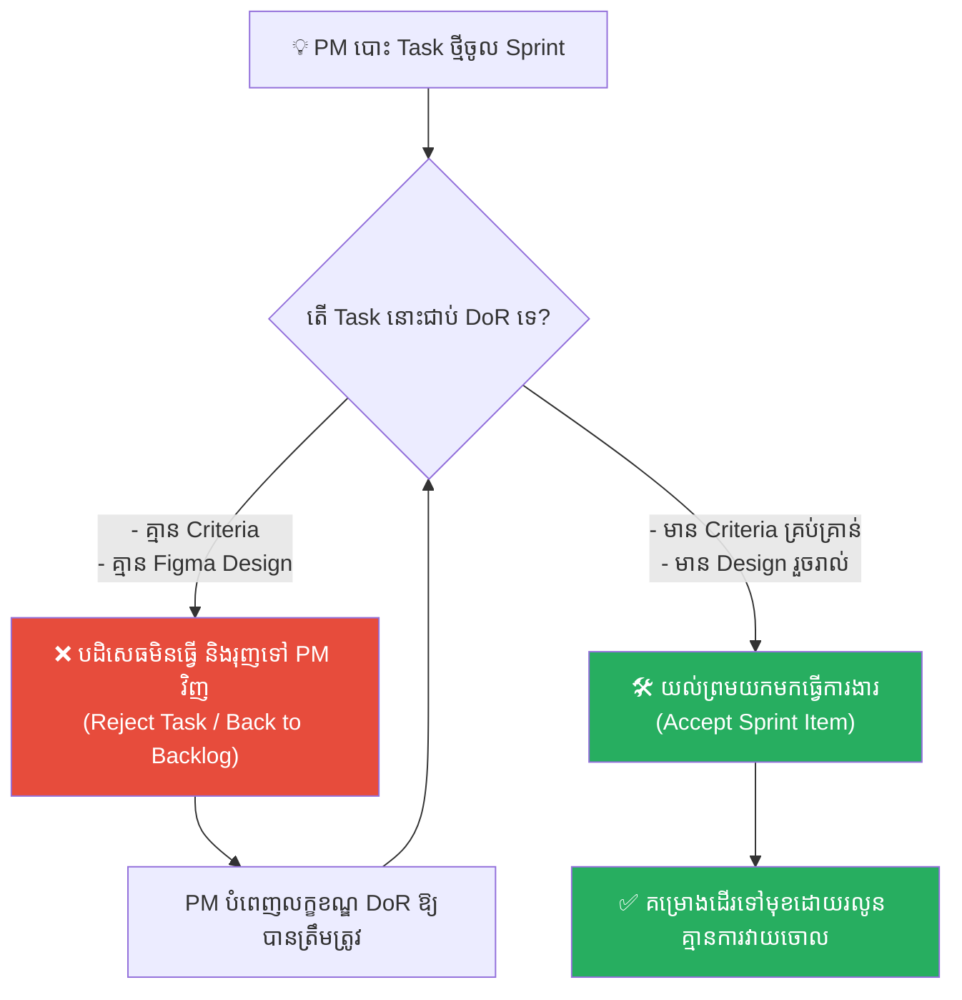

# The Master Mason and the Readiness Contracts (ជាងឥដ្ឋ គំនូរប្លង់ និងកិច្ចសន្យាត្រៀមខ្លួន)៖ គ្រោះថ្នាក់នៃការសាងសង់ដោយគ្មានផែនការ និងអំណាចនៃកិច្ចសន្យា DoR & DoD ក្នុងការគ្រប់គ្រងគម្រោង

**Author:** ichamrong  
**Date:** 2026-05-17  
**Tags:** #definition-of-ready #definition-of-done #scrum-contract #project-management #agile-workflow #quality-management #medieval-italy #critical-thinking  
**Category:** Concepts  
**Read Time:** ~15 min  

---

## 📌 មាតិកា (Table of Contents)
- [អន្ទាក់ផ្លូវចិត្ត (The Trap)](#អន្ទាក់ផ្លូវចិត្ត-the-trap)
- [១. រឿងព្រេង៖ បំណងប្រាថ្នារបស់សេដ្ឋី ចូវ៉ានី (Signor Giovanni's Ambition)](#1)
  - [ជាងឥដ្ឋទីមួយ៖ លីអូណារដូ និងការសាងសង់ដោយការស្មាន (Leonardo's Construction by Guessing)](#1-1)
  - [ជាងឥដ្ឋទីពីរ៖ ម៉ាកូ និងខែលការពារប្លង់គំនូរ (Marco's Shield of Blueprints)](#1-2)
  - [ការសាកល្បងសោរចាក់ និងផ្សែងចង្ក្រាន (The Smoke Test & The Golden Key)](#1-3)
- [២. បញ្ហា៖ គម្រោងគ្មាន DoR/DoD និងការទម្លាក់កំហុសដាក់គ្នា (The Issue: The Mouth-to-Mouth Spec & technical Debt)](#2)
- [៣. ឧទាហរណ៍ជាក់ស្តែងក្នុងពិភពពិត (Real World Examples)](#3)
  - [ឧទាហរណ៍ទី ១ — កម្រិតស្រាល (គ្រួសារ)៖ ការរៀបចំដំណើរកម្សាន្តគ្មានកាលវិភាគច្បាស់លាស់ (The Disorganized Family Road Trip)](#3-1)
  - [ឧទាហរណ៍ទី ២ — កម្រិតមធ្យម (បច្ចេកទេស)៖ Developer ចាប់ផ្តើមកូដទាំងគ្មាន UI/UX Mockups (Coding Without Mockups)](#3-2)
  - [ឧទាហរណ៍ទី ៣ — កម្រិតមធ្យម (ធុរកិច្ច)៖ ការប្រគល់ផលិតផលទៅកាន់ទីផ្សារទាំងមិនទាន់បានតេស្ត (Launching Without DoD)](#3-3)
  - [ឧទាហរណ៍ទី ៤ — កម្រិតមធ្យម (សង្គម/គ្រប់គ្រង)៖ PM ផ្លាស់ប្តូរតម្រូវការការងារកណ្តាល Sprint (Scope Creep Storm)](#3-4)
  - [ឧទាហរណ៍ទី ៥ — កម្រិតធ្ងន់ (ទំនាក់ទំនង)៖ អាពាហ៍ពិពាហ៍ដែលគ្មានការព្រមព្រៀងពីគោលដៅជីវិត (The Unaligned Marriage)](#3-5)
- [៤. ដំណោះស្រាយទូទៅ៖ ការអនុវត្តច្បាប់ DoR និង DoD យ៉ាងតឹងរ៉ឹង (The General Solution: Standardizing Quality Gates)](#4)
- [សេចក្តីសន្និដ្ឋាន (Conclusion)](#conclusion)
- [ឯកសារយោង (References)](#references)
- [Related Posts](#related-posts)

---

## អន្ទាក់ផ្លូវចិត្ត (The Trap)

តើអ្នកធ្លាប់ជួបស្ថានភាពដែលអតិថិជន ឬប្រធានក្រុមការងារប្រាប់តម្រូវការងារតែពីរបីម៉ាត់រួចបង្ខំឱ្យអ្នកចាប់ផ្តើមធ្វើភ្លាមៗ ប៉ុន្តែនៅពេលធ្វើរួច ពួកគេបែរជានិយាយថា «មិនមែនបែបនេះទេ!» ហើយបង្ខំឱ្យអ្នកវាយចោលកែតម្រូវឡើងវិញរាប់សិបដងដែរឬទេ?

នេះគឺជា **The Ambiguity Trap (អន្ទាក់នៃការមិនច្បាស់លាស់)**។

នៅក្នុងការគ្រប់គ្រងគម្រោង និងការអភិវឌ្ឍផលិតផល ជារឿយៗយើងតែងតែយល់ច្រឡំថា *«ការចាប់ផ្តើមសរសេរកូដ ឬការផលិតឱ្យបានលឿនបំផុត គឺជាសូចនាករនៃភាពសកម្ម»*។ យើងរំលងដំណាក់កាលបញ្ជាក់ព័ត៌មាន (DoR) និងដំណាក់កាលត្រួតពិនិត្យបញ្ចប់ (DoD)។ លទ្ធផលគឺយើងត្រូវធ្លាក់ចូលទៅក្នុងសង្រ្គាមនៃការកែប្រែកណ្តាលទីផ្សារ បង្កើតឱ្យមានបំណុលបច្ចេកទេស (Technical Debt) ការខាតបង់ពេលវេលាយ៉ាងមហិមា និងការទម្លាក់កំហុសដាក់គ្នាទៅវិញទៅមក (Blame Game)។

ដើម្បីយល់ដឹងឱ្យបានគ្រប់ជ្រុងជ្រោយ នេះជាផែនទីបង្ហាញផ្លូវសម្រាប់អត្ថបទនេះ៖
1. **រឿងព្រេងប្រវត្តិសាស្ត្រ (The Medieval Italy Fable)** — រឿងរ៉ាវរបស់សេដ្ឋី Giovanni, ជាងឥដ្ឋ Leonardo ដ៏ប្រញាប់ប្រញាល់ និងជាងឥដ្ឋ Marco ដ៏ហ្មត់ចត់ជាមួយប៉មការពារទាំងពីរ។
2. **បញ្ហា (The Issue)** — ការវិភាគទ្រឹស្តី DoR និង DoD និងផលប៉ះពាល់នៃការអភិវឌ្ឍដោយការស្មាន។
3. **ឧទាហរណ៍ជាក់ស្តែងក្នុងពិភពពិត (Real World Examples)** — ពិនិត្យមើលឥទ្ធិពលនេះក្នុងកម្រិតគ្រួសារ ការងារបច្ចេកទេស ធុរកិច្ច ការគ្រប់គ្រង និងទំនាក់ទំនងស្នេហា។
4. **ដំណោះស្រាយទូទៅ (The General Solution)** — ការរៀបចំ និងអនុវត្តប្រព័ន្ធគ្រប់គ្រងគុណភាព (Quality Gates) DoR & DoD ក្នុងក្រុមការងារ។

---

## ១. រឿងព្រេង៖ បំណងប្រាថ្នារបស់សេដ្ឋី ចូវ៉ានី (Signor Giovanni's Ambition)

កាលពីសម័យមជ្ឈិមសម័យនៅក្នុងប្រទេសអ៊ីតាលី មានសេដ្ឋីដីធ្លីម្នាក់ឈ្មោះ **សេដ្ឋី ចូវ៉ានី (Signor Giovanni)**។ លោកជាមនុស្សមានគំនិតរហ័សរហួន ចូលចិត្តធ្វើការងារឱ្យបានលឿនៗ តែគ្មានផែនការច្បាស់លាស់ និងចូលចិត្តផ្លាស់ប្តូរចិត្តជារឿយៗ។ ថ្ងៃមួយ សេដ្ឋី ចូវ៉ានី ចង់សាងសង់ **«ប៉មយាមថ្មដ៏ខ្ពស់»** ចំនួនពីរ នៅលើព្រំដែនដីថ្មីរបស់លោក ដើម្បីការពារទ្រព្យសម្បត្តិពីក្រុមចោរព្រៃ។

លោកបានកោះហៅមេជាងសំណង់ឥដ្ឋដ៏ល្បីពីររូប គឺ **លីអូណារដូ (Leonardo)** និង **ម៉ាកូ (Marco)** មកជួប រួចចែកដីម្នាក់មួយចំហៀង និងប្រគល់ថវិកាស្មើគ្នា៖
> *«អ្នកណាអាចសាងសង់ប៉មយាមដ៏រឹងមាំ និងស្រស់ស្អាតបានមុនគេ នឹងទទួលបានប្រាក់រង្វាន់យ៉ាងក្រាស់ក្រែលពីខ្ញុំ។ ចូរចាប់ផ្តើមធ្វើការភ្លាម!»*

---

### ជាងឥដ្ឋទីមួយ៖ លីអូណារដូ និងការសាងសង់ដោយការស្មាន (Leonardo's Construction by Guessing)

**លីអូណារដូ** ជាជាងឥដ្ឋដែលមានភាពសកម្ម និងចង់បានរង្វាន់យ៉ាងខ្លាំង។ នៅពេលឮសេដ្ឋីប្រាប់ថា «ប៉មយាមដ៏ខ្ពស់» គេក៏បានដឹកជញ្ជូនថ្ម ឥដ្ឋ និងបាយអទៅកាន់ការដ្ឋាន រួចចាប់ផ្តើមបុកគ្រឹះ និងរៀបឥដ្ឋភ្លាមៗនៅថ្ងៃបន្ទាប់ ដោយគ្មានប្លង់គំនូរ ឬកិច្ចសន្យាអ្វីច្បាស់លាស់ឡើយ។

លីអូណារដូ គិតក្នុងចិត្តថា៖ *«ការគូរគំនូរប្លង់ និងការអង្គុយជជែកវែងឆ្ងាយ នាំតែខាតពេលសោះ។ ជាងសំណង់ដ៏ល្អ គឺជាងដែលចាប់ផ្តើមរៀបឥដ្ឋភ្លាម!»* (No DoR Strategy)។

ទោះជាយ៉ាងណា គ្រោះមហន្តរាយចាប់ផ្តើមកើតឡើងនៅថ្ងៃទី៣៖
* សេដ្ឋី ចូវ៉ានី ដើរមកមើលការដ្ឋាន រួចឧទាន៖ *«អេ! លីអូណារដូ! ហេតុអ្វីបានជាទ្វារប៉មបែរមុខទៅទិសខាងលិច? ខ្ញុំចង់បានបែរមុខទៅទិសខាងកើតតើ! វាយចោល រៀបជញ្ជាំងឡើងវិញភ្លាម!»*
* ពីរថ្ងៃក្រោយមក សេដ្ឋីមកម្តងទៀត៖ *«លីអូណារដូ! ខ្ញុំភ្លេចប្រាប់ឯង ប៉មនេះត្រូវតែមានជណ្តើរយន្តអូសដោយខ្សែរ៉កខាងក្នុងផង! វាយជញ្ជាំងខាងក្នុងចោល ធ្វើម្តងទៀត!»*

លីអូណារដូ ត្រូវបង្ខំចិត្តវាយកម្ទេចជញ្ជាំង និងរៀបឥដ្ឋឡើងវិញអស់ ៣-៤ ដង ទាំងកម្លាំងពលកម្មបាក់ទឹកចិត្ត និងខាតបង់ឥដ្ឋថ្មយ៉ាងច្រើន។ ប៉មយាមរបស់គេឡើងកាន់តែខ្ពស់ តែជញ្ជាំងពោរពេញដោយស្នាមជួសជុលលុបៗ គ្មានសោភ័ណភាព និងគ្មានលំនឹងរឹងមាំទាល់តែសោះ (Technical Debt)។

---

### ជាងឥដ្ឋទីពីរ៖ ម៉ាកូ និងខែលការពារប្លង់គំនូរ (Marco's Shield of Blueprints)

ផ្ទុយទៅវិញ **ម៉ាកូ** មិនព្រមរៀបឥដ្ឋសូម្បីតែមួយដុំឡើយនៅថ្ងៃដំបូង។ គេបានអង្គុយជាមួយសេដ្ឋី ចូវ៉ានី រយៈពេលពីរថ្ងៃពេញ ដើម្បីជជែកសួរដេញដោល និងគូរគំនូរប្លង់យ៉ាងលម្អិត។

ម៉ាកូ បានចងក្រង **«កិច្ចសន្យាត្រៀមខ្លួនមុនសាងសង់» (Definition of Ready - DoR)** ដោយប្រាប់សេដ្ឋី ចូវ៉ានី ថា៖
> *«លោកម្ចាស់ Giovanni! ខ្ញុំនឹងមិនចាប់ផ្តើមបុកគ្រឹះ ឬរៀបឥដ្ឋជាដាច់ខាត លុះត្រាតែកិច្ចសន្យា DoR នេះត្រូវបានបំពេញគ្រប់ចំណុច៖*
> 1. *ប្លង់គំនូរត្រូវតែបង្ហាញទិសដៅទ្វារ បង្អួច និងបំពង់ផ្សែងច្បាស់លាស់ និងមានហត្ថលេខាឯកភាពពីលោកម្ចាស់។*
> 2. *គ្រឿងសម្ភារសំណង់ (ឥដ្ឋ និងថ្មម៉ាបរឹងមាំ) ត្រូវតែដឹកមកដល់ការដ្ឋានរួចជាស្រេច។*
> 3. *ទីតាំងដីត្រូវតែច្បាស់លាស់ គ្មានជម្លោះព្រំប្រទល់ជាមួយអ្នកជិតខាងឡើយ។»*

សេដ្ឋី ចូវ៉ានី អត់ធ្មត់មិនចង់ធ្វើ រួចស្តីបន្ទោសឱ្យ ម៉ាកូ ថាធ្វើការយឺតយ៉ាវ និងគិតច្រើន។ ប៉ុន្តែ ម៉ាកូ បានឈរលើជំហររបស់ខ្លួនយ៉ាងរឹងមាំ៖ **«បើគ្មានប្លង់ច្បាស់លាស់ ខ្ញុំនឹងមិនសង់ប៉មឡើយ។ បើគ្មានទិសដៅត្រឹមត្រូវ ការខំប្រឹងរត់ គឺគ្រាន់តែជារត់ទៅរកមហន្តរាយលឿនជាងមុនប៉ុណ្ណោះ។»**

នៅទីបញ្ចប់ សេដ្ឋី ក៏សុខចិត្តចុះហត្ថលេខាលើប្លង់គំនូរច្បាស់លាស់។ ម៉ាកូ ចាប់ផ្តើមរៀបឥដ្ឋដោយគ្មានការស្ទាក់ស្ទើរ។ រាល់ពេលដែលសេដ្ឋី ចូវ៉ានី ចង់មកផ្លាស់ប្តូរចិត្តកណ្តាលទី ម៉ាកូ បានលើកប្លង់ដែលមានហត្ថលេខាមកបង្ហាញ (DoR Shield) ធ្វើឱ្យសេដ្ឋី គ្មានលេសក្នុងការបង្ខំឱ្យវាយចោលកណ្តាលទីឡើយ។

---

### ការសាកល្បងសោរចាក់ និងផ្សែងចង្ក្រាន (The Smoke Test & The Golden Key)

នៅពេលការសាងសង់ជិតបញ្ចប់ ម៉ាកូ ក៏បានបង្កើត **«កិច្ចសន្យាបញ្ចប់ការងារ» (Definition of Done - DoD)**។ គេប្រាប់សេដ្ឋី ចូវ៉ានី ថា ប៉មយាមរបស់គេនឹងមិនចាត់ទុកថា «រួចរាល់ ១០០%» ឬប្រគល់សោរជូនឡើយ លុះត្រាតែវាឆ្លងកាត់ការសាកល្បងបញ្ចប់ចំនួន ៤ ចំណុច៖
1. **ការសាកល្បងផ្សែង (The Smoke Test)៖** ដុតភ្លើងនៅក្នុងចង្ក្រានប៉ម ដើម្បីធានាថាផ្សែងហុយចេញតាមបំពង់ផ្សែងឡើងលើផុតពីប៉ម មិនហុយច្រកចូលក្នុងបន្ទប់យាមឡើយ។
2. **ការសាកល្បងសោរចាក់ (The Master Key)៖** សោរទ្វារទាំងអស់ត្រូវតែចាក់ និងបើកបានយ៉ាងរលូន មិនជាប់ទាក់។
3. **ការសម្អាតការដ្ឋាន៖** កម្ទេចថ្ម ធូលី និងឧបករណ៍សំណង់ទាំងអស់ត្រូវតែប្រមូលចេញឱ្យស្អាត។
4. **ការត្រួតពិនិត្យជើងសសរ៖** ជើងសសរត្រូវតែគ្មានស្នាមប្រេះស្រុត។

នៅថ្ងៃប្រគល់ការងារ ប៉មរបស់ លីអូណារដូ (ជាងឥដ្ឋទីមួយ) មើលទៅខ្ពស់ និងស្រស់ស្អាតតែសំបកក្រៅ។ ប៉ុន្តែ នៅពេលសេដ្ឋី ដើរចូលទៅដល់ខាងក្នុង៖
* ផ្សែងចង្ក្រានបានហុយច្រាលពេញបន្ទប់ ធ្វើឱ្យសេដ្ឋីក្អកស្ទើរធ្លាក់សួត ព្រោះលីអូណារដូប្រញាប់រៀបឥដ្ឋពេក ភ្លេចរៀបបំពង់ខ្យល់ផ្សែងខាងក្នុង។
* ទ្វារប៉មចាក់សោរមិនចូលឡើយ ព្រោះស៊ុមទ្វាររអិលទ្រង់ទ្រាយដោយសារតែជញ្ជាំងវាយចុះឡើងច្រើនដងពេក។

ផ្ទុយទៅវិញ ប៉មយាមរបស់ ម៉ាកូ (ជាងឥដ្ឋទីពីរ) គឺគ្មានកំហុសសូម្បីតែបន្តិច។ ផ្សែងហុយចេញទៅក្រៅយ៉ាងស្អាត ទ្វារចាក់សោរបានយ៉ាងរលូន និងមានលំនឹងរឹងមាំរហូតដល់ ៥០ ឆ្នាំខាងមុខ។

សេដ្ឋី ចូវ៉ានី ដឹងខ្លួនភ្លាមថា ការសង់លឿនដោយគ្មានច្បាប់វិន័យ គឺពិតជាការបំផ្លាញ។ លោកបានប្រគល់ប្រាក់រង្វាន់ទាំងអស់ឱ្យ ម៉ាកូ និងចាត់ទុក **កិច្ចសន្យា DoR & DoD** របស់ ម៉ាកូ ជាស្តង់ដារសំណង់ទូទាំងដែនដីរបស់លោកចាប់ពីពេលនោះមក។

---

## ២. បញ្ហា៖ គម្រោងគ្មាន DoR/DoD និងការទម្លាក់កំហុសដាក់គ្នា (The Issue: The Mouth-to-Mouth Spec & Technical Debt)

រឿងរ៉ាវរបស់ជាងឥដ្ឋទាំងពីរ ឆ្លុះបញ្ចាំងពីបញ្ហាស្នូលនៃការគ្រប់គ្រងគម្រោងទំនើប ដែលខ្វះការកំណត់ខណ្ឌចែកព្រំដែនគុណភាពច្បាស់លាស់។ 

នៅក្នុងការងារអភិវឌ្ឍន៍សូហ្វវែរ ឬគម្រោងអាជីវកម្ម ទំនោរចង់បាន «លទ្ធផលលឿន» តែងតែជម្រុញឱ្យយើងធ្លាក់ចូលទៅក្នុង **«អន្ទាក់នៃការនិយាយមាត់ទទេ» (Mouth-to-Mouth Specs)**។ PM ឬអតិថិជនគ្រាន់តែប្រាប់គំនិតព្រាលៗ ហើយបង្ខំឱ្យ Developers ចាប់ផ្តើមកូដភ្លាមៗ។ នេះនាំឱ្យកើតមាន៖
1. **Technical Debt (បំណុលបច្ចេកទេស)៖** ការសរសេរកូដប្រញាប់ប្រញាល់ដើម្បីឱ្យទាន់ម៉ោង ធ្វើឱ្យកូដគ្មានរចនាសម្ព័ន្ធរឹងមាំ ងាយនឹងដួលរលំពេលមានការកែប្រែបន្តិចបន្តួច។
2. **Ping-Pong Effect (ការបោះការងារចុះឡើង)៖** Developer បោះការងារទៅឱ្យ QA -> QA រកឃើញ Bugs រុញត្រឡប់មកវិញ -> Developer កែទាំងមិនយល់ Specs រួចរុញទៅវិញ។ ដំណើរការនេះជញ្ជក់ពេលវេលាយ៉ាងច្រើនពីក្រុមការងារ។

---

## ៣. ឧទាហរណ៍ជាក់ស្តែងក្នុងពិភពពិត

ដើម្បីយល់ដឹងឱ្យកាន់តែស៊ីជម្រៅ ផ្លូវការសិក្សានឹងនាំអ្នកទៅពិនិត្យមើល **ឧទាហរណ៍ចំនួន ៥ កម្រិតខុសៗគ្នា** ក្នុងជីវិតរស់នៅប្រចាំថ្ងៃ៖

---

### ឧទាហរណ៍ទី ១ — កម្រិតស្រាល (គ្រួសារ)៖ ការរៀបចំដំណើរកម្សាន្តគ្មានកាលវិភាគច្បាស់លាស់ (The Disorganized Family Road Trip)

**ស្ថានភាព៖** ឪពុកម្នាក់ចង់នាំគ្រួសារទៅកម្សាន្តនៅខេត្តសៀមរាបភ្លាមៗនៅថ្ងៃស្អែក ដោយមិនបានកក់សណ្ឋាគារ ឬរៀបចំឡានជាមុនឡើយ។

* **ភាគី A (ឪពុក)៖** គិតថាការធ្វើដំណើរភ្លាមៗបែបផ្សងព្រេង (Spontaneous trip) គឺសប្បាយ និងមិនខាតពេលរៀបចំផែនការ។
* **ភាគី B (គ្រួសារ)៖** ពេលទៅដល់ ឡានខូចពាក់កណ្តាលផ្លូវ គ្មានសណ្ឋាគារស្នាក់នៅព្រោះពេញអស់ និងត្រូវគេបោកប្រាស់តម្លៃម្ហូបអាហារ។ ដំណើរកម្សាន្តប្រែជាសោកនាដកម្ម។

**ការពិតដ៏ជូរចត់៖**
ការខកខានមិនបានអនុវត្ត DoR ក្នុងគ្រួសារ (ការត្រួតពិនិត្យឡាន កក់សណ្ឋាគារ) នាំមកនូវភាពតានតឹង និងការខាតបង់ថវិកាច្រើនជាងការរៀបចំផែនការ ២ ម៉ោង។

---

### ឧទាហរណ៍ទី ២ — កម្រិតមធ្យម (បច្ចេកទេស)៖ Developer ចាប់ផ្តើមកូដទាំងគ្មាន UI/UX Mockups (Coding Without Mockups)

**ស្ថានភាព៖** Product Manager បង្ខំឱ្យ Developer ម្នាក់សរសេរកូដបង្កើត Dashboard ថ្មីមួយជាបន្ទាន់ ដោយប្រាប់ថា៖ *«សរសេរកូដទៅ ចាំរចនា UI/UX តាមក្រោយក៏បានដែរ!»*

* **ភាគី A (PM)៖** គិតថាកំពុងសន្សំពេលវេលាការងារឱ្យទាន់ Deadline។
* **ភាគី B (Developer)៖** សរសេរកូដអស់រយៈពេល ៥ ថ្ងៃ។ នៅពេល UI/UX Designer ផ្ញើប្លង់មកដល់ ស្រាប់តែទម្រង់ទិន្នន័យខុសគ្នាទាំងស្រុង បង្ខំឱ្យ Developer ត្រូវលុបកូដចោល ៩០% និងសរសេរឡើងវិញទាំងអស់។

**ការពិតដ៏ជូរចត់៖**
ការខ្វះ DoR ត្រឹមត្រូវ (កង្វះ UI/UX Mockups ចុះហត្ថលេខា) គឺជាឃាតករលាក់មុខដែលបំផ្លាញផលិតភាព និងទឹកចិត្តធ្វើការងាររបស់ Developers។

---

### ឧទាហរណ៍ទី ៣ — កម្រិតមធ្យម (ធុរកិច្ច)៖ ការប្រគល់ផលិតផលទៅកាន់ទីផ្សារទាំងមិនទាន់បានតេស្ត (Launching Without DoD)

**ស្ថានភាព៖** Startup មួយចង់ប្រញាប់ដាក់ឱ្យប្រើប្រាស់ App ទូទាត់ប្រាក់ថ្មីមួយ ដើម្បីដណ្តើមទីផ្សារពីគូប្រជែង ដោយរំលងការតេស្តប្រព័ន្ធសុវត្ថិភាព (Penetration Testing)។

* **ភាគី A (ស្ថាបនិក)៖** គិតថានឹងយកជ័យជម្នះលើទីផ្សារមុនគេ រួចចាំកែ Bugs តាមក្រោយ។
* **ភាគី B (អតិថិជន)៖** នៅថ្ងៃ Go-Live App ត្រូវ Hacker វាយលុក លួចយកទិន្នន័យកាតធនាគាររបស់អតិថិជនរាប់ម៉ឺននាក់ ធ្វើឱ្យក្រុមហ៊ុនត្រូវក្ស័យធនភ្លាមៗដោយសារបណ្តឹងផ្លូវច្បាប់។

**ការពិតដ៏ជូរចត់៖**
ការមិនគោរព DoD (កង្វះការ Tests សុវត្ថិភាព) គឺប្រៀបដូចជាការសាងសង់ប៉មយាមដែលគ្មានបំពង់ផ្សែង ដែលនឹងធ្វើឱ្យអ្នកឈ្លក់ផ្សែងស្លាប់នៅពេលក្រោយ។

---

### ឧទាហរណ៍ទី ៤ — កម្រិតមធ្យម (សង្គម/គ្រប់គ្រង)៖ PM ផ្លាស់ប្តូរតម្រូវការការងារកណ្តាល Sprint (Scope Creep Storm)

**ស្ថានភាព៖** នៅក្នុង Sprint ការងារដែលមានរយៈពេល ២ សប្តាហ៍ PM តែងតែដើរមកកាន់តុរបស់ Developers រៀងរាល់ ២ ថ្ងៃម្តង ដើម្បីបន្ថែមមុខងារតូចៗ ឬកែប្រែទម្រង់ការងារចាស់។

* **ភាគី A (PM)៖** គិតថាការកែប្រែទាន់ចិត្ត ជួយឱ្យផលិតផលត្រូវចិត្តអតិថិជនខ្លាំងបំផុត។
* **ភាគី B (Developers)៖** កើតមានភាពធុញទ្រាន់ខ្លាំង គម្រោងការងារយឺតយ៉ាវជានិច្ច និងគ្មានមុខងារណាមួយត្រូវបានបញ្ចប់ជាស្ថាពរឡើយ។

**ការពិតដ៏ជូរចត់៖**
ការគ្មាន DoR Shield ជួយការពារក្រុមការងារ បង្កើតឱ្យមាន **Scope Creep** ដែលបំផ្លាញការប៉ាន់ស្មានពេលវេលា (Estimation) និងស្ថិរភាពគម្រោងទាំងស្រុង។

---

### ឧទាហរណ៍ទី ៥ — កម្រិតធ្ងន់ (ទំនាក់ទំនង)៖ អាពាហ៍ពិពាហ៍ដែលគ្មានការព្រមព្រៀងពីគោលដៅជីវិត (The Unaligned Marriage)

**ស្ថានភាព៖** មនុស្សពីរនាក់ស្រឡាញ់គ្នាខ្លាំង និងសម្រេចចិត្តរៀបការភ្លាមៗ ដោយមិនទាន់បានជជែកគ្នាពីគោលដៅអនាគត (ការយកកូន ការគ្រប់គ្រងហិរញ្ញវត្ថុ ឬការរស់នៅជាមួយឪពុកម្តាយ)។

* **ភាគី A (ប្តី)៖** ចង់រស់នៅផ្ទះជួលសាមញ្ញ និងមិនចង់យកកូនឡើយដើម្បីសេរីភាពហិរញ្ញវត្ថុ។
* **ភាគី B (ប្រពន្ធ)៖** ចង់ទិញផ្ទះផ្ទាល់ខ្លួន និងចង់បានកូន ៣ នាក់ជាដាច់ខាត។

**ការពិតដ៏ជូរចត់៖**
បន្ទាប់ពីរៀបការបាន ១ ឆ្នាំ ពួកគេត្រូវជួបប្រទះជម្លោះឥតឈប់ឈរ និងត្រូវលែងលះគ្នា ព្រោះតែខ្វះការយល់ព្រមលើគ្រឹះជីវិតជាមុន (No DoR before Marriage Contract)។

---

## ៤. ដំណោះស្រាយទូទៅ៖ ការអនុវត្តច្បាប់ DoR និង DoD យ៉ាងតឹងរ៉ឹង (The General Solution: Standardizing Quality Gates)

ដើម្បីការពារគម្រោង និងការរស់នៅរបស់អ្នកឱ្យទទួលបានជោគជ័យ ចូរអនុវត្តជំហានគន្លឹះទាំងនេះ៖

### ១. បង្កើតកិច្ចសន្យា DoR (Definition of Ready) យ៉ាងច្បាស់លាស់
រាល់ Task ឬគម្រោងការងារ មិនត្រូវអនុញ្ញាតឱ្យចាប់ផ្តើមធ្វើឡើយ លុះត្រាតែវាឆ្លងកាត់ **DoR Gate**៖
* **តម្រូវការច្បាស់លាស់ (What)៖** មាន Acceptance Criteria ចុះហត្ថលេខាយល់ព្រម។
* **គ្រឿងផ្សំគ្រប់គ្រាន់ (Input)៖** មានទិន្នន័យ UI/UX ឬ APIs រួចរាល់។
* **គ្មានចំណុចទាក់ទង (Blockers-free)៖** គ្មានការពឹងផ្អែកលើក្រុមក្រៅដែលមិនទាន់រួចរាល់។

### ២. បង្កើតកិច្ចសន្យា DoD (Definition of Done) យ៉ាងតឹងរ៉ឹង
ការងារមួយមិនអាចចាត់ទុកថា «រួចរាល់» ឡើយ លុះត្រាតែវាបានឆ្លងកាត់ **DoD Gate**៖
* **តេស្តរួចរាល់៖** ឆ្លងកាត់ unit testing និង smoke testing។
* **ពិនិត្យរួចរាល់៖** ឆ្លងកាត់ Peer Code Review។
* **ត្រៀមដាក់ឱ្យប្រើប្រាស់៖** Deploy ទៅកាន់ Staging Server ជោគជ័យ។

### ៣. អនុវត្តយន្តការ "No DoR, No Work"
ក្នុងនាមជាអ្នកបច្ចេកទេស ឬអ្នកគ្រប់គ្រង ត្រូវមានភាពក្លាហានក្នុងការបដិសេធ (Say No) ចំពោះការងារណាដែលមិនទាន់ឆ្លងកាត់ DoR។ ការឈរលើគោលការណ៍ត្រឹមត្រូវ ជួយការពារអតិថិជន និងក្រុមហ៊ុនពីការខាតបង់ថវិកាយ៉ាងច្រើន។

---

## សេចក្តីសន្និដ្ឋាន (Conclusion)

> **«ការចំណាយពេល ២ ថ្ងៃដើម្បីគូរគំនូរប្លង់ និងជជែកវែកញែក មិនមែនជាការខាតពេលឡើយ។ ប៉ុន្តែវាគឺជាខែលការពារដ៏រឹងមាំបំផុត ដែលជួយការពារការខំប្រឹងប្រែងរបស់អ្នកកុំឱ្យក្លាយជាផេះផង់ និងត្រូវវាយចោលធ្វើម្តងទៀតពេញមួយជីវិត។»**

ជាងឥដ្ឋ ម៉ាកូ បានបង្ហាញថា ភាពហ្មត់ចត់ជាមួយ DoR & DoD នាំមកនូវគុណភាពអមតៈ។ ចូរឈប់រៀបឥដ្ឋដោយការស្មាន។ 

ចូរកសាងកិច្ចសន្យា DoR & DoD សម្រាប់គ្រប់បន្ទាយសំណង់ការងាររបស់អ្នកចាប់ពីថ្ងៃនេះតទៅ។

---

## ឯកសារយោង (References)

* **Schwaber, K.** — *Agile Project Management with Scrum* (2004)។ សៀវភៅគោលដែលរៀបរាប់ពីយន្តការ Quality Gates DoR និង DoD ក្នុង Scrum។
* **Cohn, M.** — *User Stories Applied: For Agile Software Development* (2004)។ របៀបសរសេរតម្រូវការការងារ (Acceptance Criteria) ឱ្យស្របតាម DoR។
* **Martin, R. C.** — *Clean Code: A Handbook of Agile Software Craftsmanship* (2008)។ របៀបសរសេរកូដឱ្យរឹងមាំ និងឆ្លងកាត់ DoD។

---

## Related Posts

* **[The Weaver and the Emperor's Robe (អ្នកត្បាញសូត្រ និងអាវយ័ន្តអធិរាជ)៖ គ្រោះថ្នាក់នៃការកាត់បន្ថយចំណាយលើផ្នែកសំខាន់ និងមហន្តរាយនៃការមើលរំលងតួនាទីតូចតាច](./16-the-weaver-and-the-emperors-robe.md)** — Understanding what happens when PMs agree to short schedules without checking DoR & DoD.
* **[The Illusion of Ease (ការយល់ច្រឡំនៃភាពងាយស្រួល)៖ ហេតុអ្វីបានជាអតិថិជនតែងតែគិតថារាល់ Feature សុទ្ធតែងាយស្រួលធ្វើ](./06-the-illusion-of-ease.md)** — Why clients always think building a feature is as easy as verbal commands.
* **[The Broken Bridge and the Art of Inversion (ស្ពានដែលបាក់ និងវិធានគិតបញ្ច្រាស)៖ របៀបដោះស្រាយបញ្ហាស្មុគស្មាញដោយការចាប់ផ្តើមពីទីបញ្ចប់](./15-the-broken-bridge-and-the-art-of-inversion.md)** — How mapping failure points first ensures systemic safety.

---

*Last updated: 2026-05-27*
