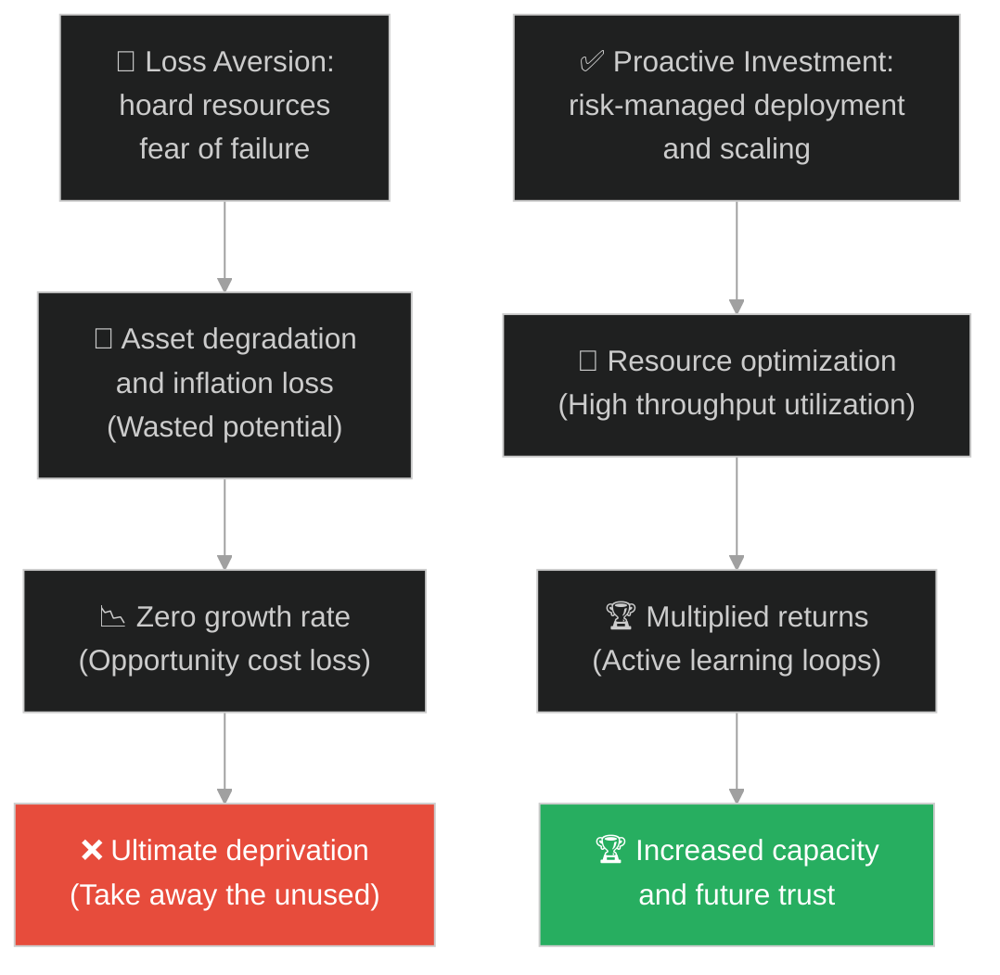
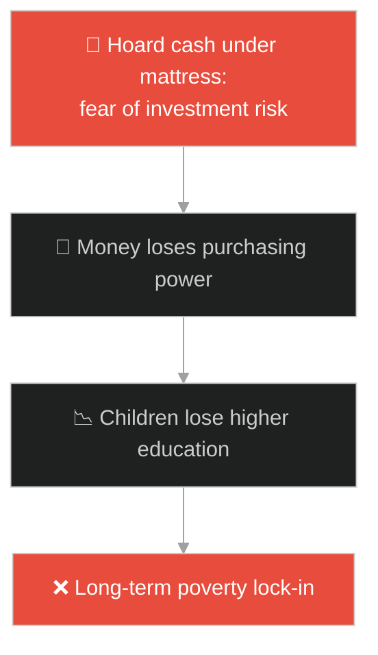
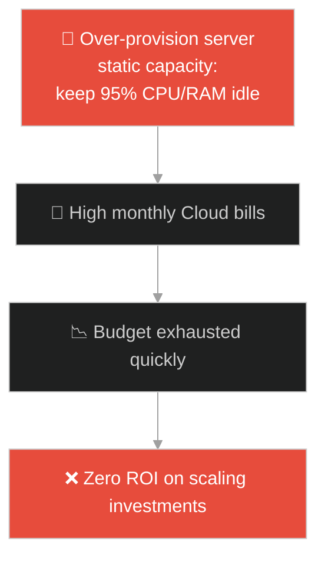
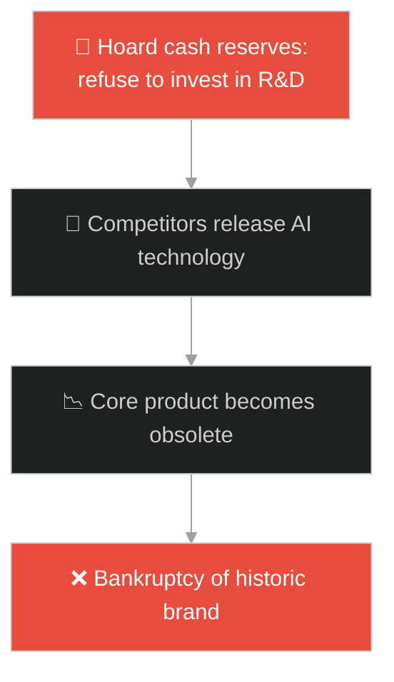
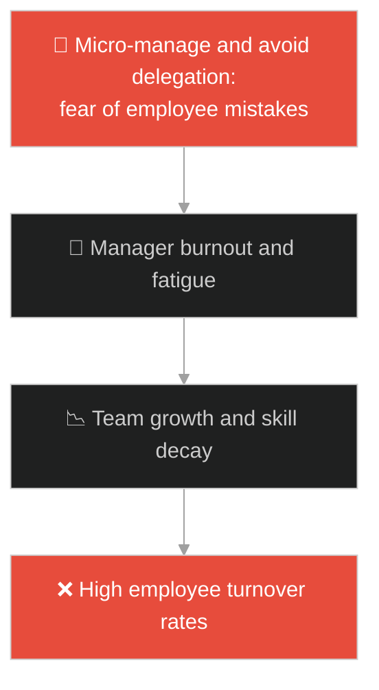
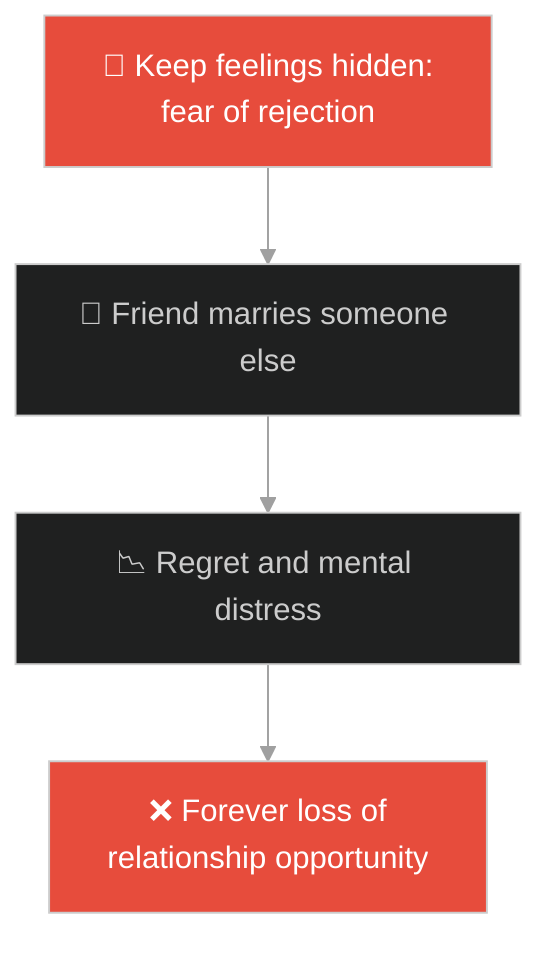
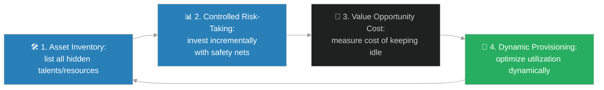

# Loss Aversion & Resource Optimization (ការភ័យខ្លាចការខាតបង់ និងការបង្កើនប្រសិទ្ធភាពធនធាន)៖ ប្រាក់តាលិន និងការចាត់ចែងឱកាស (Loss Aversion & Resource Optimization & Jesus and the Talents)

**Author:** ichamrong  
**Date:** 2026-05-28  
**Tags:** #jesus #resource-allocation #risk-aversion #fear-of-failure #potential #optimization  
**Category:** Concepts / Parables  
**Read Time:** ~15 min  

---

## 📌 មាតិកា (Table of Contents)
- [អន្ទាក់ផ្លូវចិត្ត (The Trap)](#0)
- [១. រឿងព្រេងនិទាន៖ ប្រាក់តាលិន (The Legend of the Talents)](#1)
  - [ការវិនិយោគទុន និងសោកនាដកម្មនៃអ្នកកប់ប្រាក់ (The Tragedy of the Hidden Talent)](#1-1)
- [២. បញ្ហា៖ ភាពលម្អៀងភ័យខ្លាចការបាត់បង់ និងការកប់ធនធានចោល (The Issue: Loss Aversion and Suboptimal Resource Allocation)](#2)
- [៣. ឧទាហមណ៍ជាក់ស្តែងក្នុងពិភពពិត (Real World Examples)](#3)
  - [ឧទាហរណ៍ទី ១ — កម្រិតស្រាល (គ្រួសារ)៖ ការលាក់លុយក្រោមខ្នើយ និងការមិនហ៊ានវិនិយោគសម្រាប់ការសិក្សាកូន (Keeping Cash Under the Mattress Instead of Education)](#3-1)
  - [ឧទាហរណ៍ទី ២ — កម្រិតមធ្យម (បច្ចេកទេស)៖ ការកក់ធនធាន CPU/RAM ទុកចោលមិនប្រើ និងការមិនហ៊ានបង្កើនល្បឿន Scaling (Over-provisioning Idle VM Resources)](#3-2)
  - [ឧទាហរណ៍ទី ៣ — កម្រិតមធ្យម (ធុរកិច្ច)៖ ក្រុមហ៊ុនរក្សាទុកលុយបម្រុងច្រើនពេកដោយមិនវិនិយោគលើ R&D (Hoarding Cash Reserves Instead of R&D Innovation)](#3-3)
  - [ឧទាហរណ៍ទី ៤ — កម្រិតមធ្យម (សង្គម/គ្រប់គ្រង)៖ អ្នកគ្រប់គ្រងមិនព្រមប្រគល់សិទ្ធិ ឬផ្តល់ឱកាសដល់សមាជិកក្រុមថ្មីព្រោះខ្លាចខូចការ (Manager Refusing to Delegate Work to New Talent)](#3-4)
  - [ឧទាហរណ៍ទី ៥ — កម្រិតធ្ងន់ (ទំនាក់ទំនង)៖ ការលាក់អារម្មណ៍ពិត និងការមិនហ៊ានសារភាពស្នេហ៍ព្រោះខ្លាចគេបដិសេធ (Hiding Feelings Due to Fear of Rejection)](#3-5)
- [៤. ដំណោះស្រាយទូទៅ៖ គោលការណ៍ចាត់ចែងធនធានឱ្យអស់លទ្ធភាព (The General Solution: Active Asset Stewardship and Risk Mitigation)](#4)
- [សេចក្តីសន្និដ្ឋាន (Conclusion)](#5)
- [ឯកសារយោង (References)](#6)
- [Related Posts](#7)

---

<a id="0"></a>
## អន្ទាក់ផ្លូវចិត្ត (The Trap)

តើអ្នកធ្លាប់លះបង់ឱកាសដ៏អស្ចារ្យណាមួយក្នុងជីវិត ដោយសារតែខ្លាចខាតបង់ ឬខ្លាចការបរាជ័យដែរឬទេ? មនុស្សភាគច្រើនយល់ច្រឡំថា "ការមិនធ្វើសកម្មភាព គឺជាការមិនខាតបង់"។ ប៉ុន្តែការពិត នៅក្នុងលោកដែលមានការផ្លាស់ប្តូរ និងអតិផរណាឥតឈប់ឈរ ការឈរនៅស្ងៀម និងមិនបញ្ចេញសមត្ថភាព ឬធនធាន គឺជាការបាត់បង់ដ៏ធំបំផុត។

នៅក្នុងការចាត់ចែងធនធាន៖
* **យើងងាយនឹងធ្លាក់ក្នុងអន្ទាក់** នៃការភ័យខ្លាចការខាតបង់ (Loss Aversion) ដោយសុខចិត្តកប់លាក់ឱកាស ពេលវេលា ឬទុនទុកចោលក្នុងស្ថានភាព "សុវត្ថិភាពសិប្បនិម្មិត" ដើម្បីកុំឱ្យជួបហានិភ័យ។
* **យើងមើលរំលង** តម្លៃឱកាស (Opportunity Cost) ដែលការមិនបញ្ចេញសកម្មភាព នាំឱ្យធនធានចុះថយតម្លៃ ឬបាត់បង់ឱកាសលូតលាស់ទាំងស្រុង។

សកម្មភាពនៃការលាក់ទុក ឬកប់ធនធានចោលដើម្បីចៀសវាងការខូចខាត ហៅថា **អន្ទាក់កប់ប្រាក់តាលិន (Hidden Talent Trap)**។

ដើម្បីយល់ដឹងពីរបៀបគ្រប់គ្រង និងបង្កើនប្រសិទ្ធភាពធនធាន នេះជាផែនទីបង្ហាញផ្លូវ៖
1. **រឿងព្រេងនិទាន (The Legend)** — រឿងរ៉ាវរបស់អ្នកបម្រើ ៣ នាក់ដែលទទួលបានប្រាក់តាលិនខុសៗគ្នា និងរបៀបដែលពួកគេចាត់ចែងវា។
2. **បញ្ហា (The Issue)** — ការវិភាគចិត្តវិទ្យា Loss Aversion និងផលប៉ះពាល់លើការបែងចែកធនធានប្រព័ន្ធ។
3. **ឧទាហមណ៍ជាក់ស្តែងក្នុងពិភពពិត (Real World Examples)** — ពិនិត្យមើលបញ្ហានេះក្នុងកម្រិតគ្រួសារ បច្ចេកវិទ្យា ធុរកិច្ច ការគ្រប់គ្រង និងទំនាក់ទំនង។
4. **ដំណោះស្រាយទូទៅ (The General Solution)** — ការអនុវត្តយុទ្ធសាស្ត្រ Risk Management និង dynamic resource utilization។



---

<a id="1"></a>
## ១. រឿងព្រេងនិទាន៖ ប្រាក់តាលិន (The Legend of the Talents)

ព្រះយេស៊ូវបានសម្តែងរឿងប្រៀបប្រដៅមួយអំពីមហាសេដ្ឋីម្នាក់ ដែលត្រូវធ្វើដំណើរទៅក្រៅប្រទេសជាយូរ។ មុនពេលចេញដំណើរ គាត់បានហៅអ្នកបម្រើ ៣ នាក់មក ហើយប្រគល់ទ្រព្យសម្បត្តិ (ប្រាក់តាលិន/Talents) ឱ្យពួកគេមើលខុសត្រូវ ទៅតាមសមត្ថភាពរៀងៗខ្លួន៖
* **អ្នកទី ១** ទទួលបាន **៥ តាលិន** (ប្រាក់យ៉ាងច្រើនសន្ធឹកសន្ធាប់)។
* **អ្នកទី ២** ទទួលបាន **២ តាលិន**។
* **អ្នកទី ៣** ទទួលបាន **១ តាលិន**។

(តាលិន/Talent នៅសម័យនោះ គឺជារង្វាស់ទម្ងន់មាស ឬប្រាក់ដ៏មានតម្លៃបំផុត។ ពាក្យ Talent ក្នុងភាសាអង់គ្លេសដែលប្រែថា "ទេពកោសល្យ" ក៏មានប្រភពចេញពីរឿងព្រេងនេះដែរ)។

<a id="1-1"></a>
### ការវិនិយោគទុន និងសោកនាដកម្មនៃអ្នកកប់ប្រាក់ (The Tragedy of the Hidden Talent)

បន្ទាប់ពីចៅហ្វាយចាកចេញទៅភ្លាម៖
* អ្នកទី ១ និងអ្នកទី ២ បានយកប្រាក់នោះទៅរកស៊ីធ្វើពាណិជ្ជកម្មយ៉ាងសកម្ម និងប្រុងប្រយ័ត្ន។ ជាលទ្ធផល អ្នកទី ១ ចំណេញបាន ៥ តាលិនបន្ថែម (សរុប ១០) ហើយអ្នកទី ២ ចំណេញបាន ២ តាលិនបន្ថែម (សរុប ៤)។
* ចំណែកអ្នកទី ៣ ដោយសារតែ **"ភាពភ័យខ្លាចការខាតបង់ (Loss Aversion)"** និងការយល់ឃើញថាចៅហ្វាយជានាយតឹងរ៉ឹង ខ្លាចធ្វើឱ្យបាត់បង់ប្រាក់នោះនាំឱ្យមានទោស ក៏បានយកប្រាក់នោះទៅ **កប់លាក់ទុកក្នុងដី** ដោយសុវត្ថិភាព។

ពេលចៅហ្វាយត្រឡប់មកវិញ គាត់បានសរសើរអ្នកទី ១ និងទី ២ យ៉ាងខ្លាំង និងប្រគល់រង្វាន់បន្ថែមដល់ពួកគេ។ ប៉ុន្តែពេលគាត់សួរទៅអ្នកទី ៣ គេបានឆ្លើយថា៖ *"ដោយសារខ្ញុំខ្លាចខាតបង់ ទើបខ្ញុំកប់វាទុក ឥឡូវនេះប្រាក់ ១ តាលិនរបស់លោកនៅដដែល។"* 

ចៅហ្វាយខឹងសម្បារយ៉ាងខ្លាំង និងស្តីបន្ទោសថាគេជាអ្នកបម្រើខ្ជិលច្រអូស និងខ្វះការយល់ដឹង។ គាត់បានបញ្ជាឱ្យដកយកប្រាក់ ១ តាលិននោះទៅឱ្យអ្នកដែលមាន ១០ តាលិនវិញ ដោយមានប្រសាសន៍ថា៖ *"អ្នកណាដែលមានរួចហើយ នឹងត្រូវផ្តល់ឱ្យថែមទៀត រីឯអ្នកដែលមិនព្រមប្រើប្រាស់ នឹងត្រូវដកហូតយកទៅវិញសូម្បីតែអ្វីដែលខ្លួនមាន។"*

---

<a id="2"></a>
## ២. បញ្ហា៖ ភាពលម្អៀងភ័យខ្លាចការបាត់បង់ និងការកប់ធនធានចោល (The Issue: Loss Aversion and Suboptimal Resource Allocation)

នៅក្នុងចិត្តវិទ្យាឥរិយាបថ **Loss Aversion (ការខ្លាចការខាតបង់)** គឺជាគំរូផ្លូវចិត្តដែលបង្ហាញថា ការឈឺចាប់នៃការបាត់បង់អ្វីមួយមានទំហំធំជាងក្តីរីករាយនៃការទទួលបានរបស់ដដែលនោះទ្វេដង។ ភាពលម្អៀងនេះនាំឱ្យមនុស្សជ្រើសរើសជម្រើសដែលគ្មានហានិភ័យ (Zero Risk) ទោះជាវាផ្តល់លទ្ធផលអន់បំផុតក៏ដោយ។

នៅក្នុងវិស្វកម្មប្រព័ន្ធបច្ចេកវិទ្យា នេះប្រៀបបាននឹងការរចនាប្រព័ន្ធគ្រប់គ្រងធនធាន (Resource Allocator) ដែលមានភាពអភិរក្សនិយមខ្លាំងពេក៖

```python
# Bad/Fragile: Wasting potential and resource capability due to fear of failure (Zero risk policy)
class FearfulResourceManager:
    def __init__(self, memory_gb):
        self.total_memory = memory_gb
        self.allocated = 0
    
    def request_resources(self, amount):
        # Extremely conservative: Never allocate more than 10% to avoid any risk of running out
        # Keeping 90% idle, causing severe underutilization and slow processing
        safe_limit = self.total_memory * 0.1
        if self.allocated + amount > safe_limit:
            print("Request rejected due to risk mitigation policy.")
            return False
        self.allocated += amount
        return True

# Good/Resilient: Optimizing resource throughput with active risk management
class OptimizedResourceManager:
    def __init__(self, memory_gb):
        self.total_memory = memory_gb
        self.allocated = 0
        
    def request_resources(self, amount):
        # Dynamic allocation with active scaling to maximize performance and efficiency
        if self.allocated + amount > self.total_memory:
            return self.trigger_auto_scaling(amount)
        self.allocated += amount
        return True
        
    def trigger_auto_scaling(self, amount):
        print(f"Dynamically scaling out resource by {amount} GB...")
        return True
```

* **ការខាតបង់ធនធាន (Under-utilization):** ការមិនហ៊ានប្រើយន្តការ Dynamic Allocation នាំឱ្យ CPU/RAM ទំនេរចោលយ៉ាងច្រើន ដែលត្រូវបង់ថ្លៃខ្ពស់ (Cloud Costs) តែដំណើរការកម្មវិធីយឺតយ៉ាវ។
* **ការបាត់បង់សមត្ថភាពលូតលាស់ (Skill Atrophy):** ប្រសិនបើមិនយកកូដ ឬប្រព័ន្ធទៅសាកល្បងលើការប្រើប្រាស់ជាក់ស្តែង វានឹងមិនអាចរកឃើញ bug ឬកែលម្អគុណភាពប្រព័ន្ធឱ្យរឹងមាំឡើយ។

---

<a id="3"></a>
## ៣. ឧទាហមណ៍ជាក់ស្តែងក្នុងពិភពពិត

---

<a id="3-1"></a>
### ឧទាហមណ៍ទី ១ — កម្រិតស្រាល (គ្រួសារ)៖ ការលាក់លុយក្រោមខ្នើយ និងការមិនហ៊ានវិនិយោគសម្រាប់ការសិក្សាកូន (Keeping Cash Under the Mattress Instead of Education)

ឪពុកម្តាយខ្លះខ្លាចការបាត់បង់លុយកាក់ខ្លាំងពេក ក៏សម្រេចចិត្តលាក់លុយសន្សំទាំងអស់នៅក្រោមខ្នើយ ឬកប់ដី ជំនួសឱ្យការយកទៅវិនិយោគលើការអប់រំ និងការរៀនជំនាញរបស់កូនៗ ឬដាក់ក្នុងគណនីសន្សំមានការប្រាក់។ ជាលទ្ធផល លុយនោះត្រូវថយចុះតម្លៃដោយសារអតិផរណា ហើយកូនៗបាត់បង់ឱកាសទទួលបានការអប់រំល្អៗ ដើម្បីអភិវឌ្ឍខ្លួន។



---

<a id="3-2"></a>
### ឧទាហមណ៍ទី ២ — កម្រិតមធ្យម (បច្ចេកទេស)៖ ការកក់ធនធាន CPU/RAM ទុកចោលមិនប្រើ និងការមិនហ៊ានបង្កើនល្បឿន Scaling (Over-provisioning Idle VM Resources)

វិស្វករប្រព័ន្ធម្នាក់ ខ្លាចម៉ាស៊ីន server គាំង (Crash) ក៏បានកំណត់កក់ទុក (Provision) ម៉ាស៊ីនទំហំធំពេក (Over-provisioning) សម្រាប់ Microservice តូចមួយ។ ប្រព័ន្ធនេះរត់ត្រឹមតែ ៥% នៃសមត្ថភាពរបស់វាជារៀងរាល់ថ្ងៃ។ ក្រុមហ៊ុនត្រូវចំណាយលុយរាប់ពាន់ដុល្លារលើ Cloud resources ដែលទំនេរចោលឥតប្រយោជន៍។



---

<a id="3-3"></a>
### ឧទាហមណ៍ទី ៣ — កម្រិតមធ្យម (ធុរកិច្ច)៖ ក្រុមហ៊ុនរក្សាទុកលុយបម្រុងច្រើនពេកដោយមិនវិនិយោគលើ R&D (Hoarding Cash Reserves Instead of R&D Innovation)

ក្រុមហ៊ុនទូរស័ព្ទមួយទទួលបានប្រាក់ចំណេញយ៉ាងច្រើនពីផលិតផលចាស់។ ដោយសារខ្លាចការបរាជ័យក្នុងការផលិតបច្ចេកវិទ្យាថ្មី ពួកគេបានសម្រេចចិត្តរក្សាទុកលុយទាំងអស់ក្នុងគណនីធនាគារ ដោយមិនព្រមវិនិយោគលើផ្នែកស្រាវជ្រាវ និងអភិវឌ្ឍន៍ (R&D)។ ក្នុងរយៈពេល ៥ ឆ្នាំ គូប្រជែងបានអភិវឌ្ឍបច្ចេកវិទ្យា AI និងបត់បែនអេក្រង់ ធ្វើឱ្យទូរស័ព្ទរបស់ក្រុមហ៊ុនចាស់លែងមានអ្នកទិញ។



---

<a id="3-4"></a>
### ឧទាហមណ៍ទី ៤ — កម្រិតមធ្យម (សង្គម/គ្រប់គ្រង)៖ អ្នកគ្រប់គ្រងមិនព្រមប្រគល់សិទ្ធិ ឬផ្តល់ឱកាសដល់សមាជិកក្រុមថ្មីព្រោះខ្លាចខូចការ (Manager Refusing to Delegate Work to New Talent)

អ្នកគ្រប់គ្រងគម្រោងម្នាក់ខ្លាចមានកំហុសក្នុងការងារ ក៏សម្រេចចិត្តក្តោបក្តាប់ការងារសំខាន់ៗទាំងអស់ម្នាក់ឯង ដោយមិនព្រមប្រគល់ភារកិច្ចឱ្យបុគ្គលិកថ្មីដែលមានសមត្ថភាពឡើយ។ លទ្ធផលគឺអ្នកគ្រប់គ្រងម្នាក់នោះត្រូវហត់នឿយខ្លាំងរហូតដល់ធ្លាក់ខ្លួនឈឺ (Burnout) ចំណែកឯបុគ្គលិកថ្មីៗគ្មានឱកាសអភិវឌ្ឍសមត្ថភាព និងសម្រេចចិត្តលាឈប់ពីការងារ។



---

<a id="3-5"></a>
### ឧទាហមណ៍ទី ៥ — កម្រិតធ្ងន់ (ទំនាក់ទំនង)៖ ការលាក់អារម្មណ៍ពិត និងការមិនហ៊ានសារភាពស្នេហ៍ព្រោះខ្លាចគេបដិសេធ (Hiding Feelings Due to Fear of Rejection)

បុរសម្នាក់លង់ស្រឡាញ់មិត្តភក្តិរបស់ខ្លួនជាច្រើនឆ្នាំ។ ដោយសារតែខ្លាចការបដិសេធ (Fear of Rejection) និងខ្លាចបាត់បង់មិត្តភាពដែលមានស្រាប់ គាត់បានសម្រេចចិត្តលាក់អារម្មណ៍នោះទុកក្នុងចិត្តរហូត។ ទីបំផុត នាងបានរៀបការជាមួយអ្នកផ្សេង ចំណែកគាត់ត្រូវរស់នៅទាំងវិប្បដិសារី និងសោកស្តាយពេញមួយជីវិតដែលមិនធ្លាប់សាកល្បងបញ្ចេញវា។



---

<a id="4"></a>
## ៤. ដំណោះស្រាយទូទៅ៖ គោលការណ៍ចាត់ចែងធនធានឱ្យអស់លទ្ធភាព (The General Solution: Active Asset Stewardship and Risk Mitigation)

ដើម្បីចៀសវាងអន្ទាក់ Loss Aversion និងបង្កើនប្រសិទ្ធភាពធនធាន យើងត្រូវអនុវត្តវិធីសាស្ត្រចាត់ចែងសកម្ម (Active Stewardship)៖



1. **វាស់ស្ទង់តម្លៃឱកាស (Calculate Opportunity Cost):** រាល់ពេលដែលអ្នកចង់រក្សាទុកអ្វីមួយឱ្យនៅដដែល ត្រូវសួរខ្លួនឯងថា *"តើខ្ញុំបាត់បង់ឱកាសលូតលាស់អ្វីខ្លះ ប្រសិនបើខ្ញុំរក្សាស្ថានភាពដដែល?"*
2. **អនុវត្តការសាកល្បងក្រោមហានិភ័យមានកំណត់ (Controlled Risk-Taking):** មិនត្រូវបោះទុនទាំងអស់ ឬប្រថុយទាំងងងឹតងងុលឡើយ។ ត្រូវវិនិយោគជាដំណាក់កាលៗ (Incremental Deployment) ដើម្បីអាចកែតម្រូវបានទាន់ពេលវេលា។
3. **យន្តការគ្រប់គ្រងធនធានបែបឌីណាមិក (Dynamic Resource Allocation):** នៅក្នុងប្រព័ន្ធស្ថាបត្យកម្ម កំណត់ឱ្យមាន Auto-scaling និង Load Balancing ដើម្បីប្រើប្រាស់ធនធានឱ្យចំគោលដៅបំផុត។
4. **កសាងផ្នត់គំនិតរីកចម្រើន (Growth Mindset):** យល់ឃើញថា "កំហុសគឺជាឱកាសរៀនសូត្រ"។ ការកប់សមត្ថភាពចោល គឺជាការធ្វើឱ្យសមត្ថភាពនោះចុះខ្សោយ និងបាត់បង់ទៅវិញជាលំដាប់។

---

## 🐇 ធ្លាក់ចូលក្នុងរន្ធទន្សាយ (Enter the Rabbit Hole)

ដើម្បីយល់ដឹងពីរបៀបដែលគ្រឹះរឹងមាំ (Architectural Foundations) អាចជួយការពារប្រព័ន្ធ ឬជីវិតពីការរលំខ្ទេចខ្ទីនៅពេលព្យុះវិបត្តិបោកបក់មកដល់ សូមបន្តដំណើរទៅកាន់៖

* 🚀 **[ចាប់ផ្តើមដំណើររុករក (Start the Journey) ➔ The Parable of the Two Builders](./181-jesus-and-the-two-builders.md)**

---

<a id="5"></a>
## សេចក្តីសន្និដ្ឋាន (Conclusion)

> **«អ្នកណាដែលប្រើប្រាស់ធនធានយ៉ាងសកម្ម នឹងទទួលបានការលូតលាស់កាន់តែច្រើន ចំណែកអ្នកដែលកប់ទុកចោល នឹងត្រូវបាត់បង់សូម្បីតែអ្វីដែលខ្លួនមាន»**

ជីវិតមិនមែនជាការលាក់ខ្លួនក្នុងកន្លែងមានសុវត្ថិភាពដើម្បីចៀសវាងការខាតបង់នោះទេ តែវាជាការចាត់ចែងធនធាន ពេលវេលា និងទេពកោសល្យដែលយើងមានឱ្យបានអស់លទ្ធភាពបំផុត។

---

<a id="6"></a>
## ឯកសារយោង (References)

* **Matthew 25:14-30** — *The Parable of the Talents*, Holy Bible. A foundational concept of active stewardship.
* **Kahneman, D., & Tversky, A.** — *Prospect Theory: An Analysis of Decision under Risk* (1979). Econometrica. The core research behind Loss Aversion.

---

<a id="7"></a>
## Related Posts

* [[Architecture Foundations & Clean Code](./181-jesus-and-the-two-builders.md)] — របៀបកសាងគ្រឹះការងារឱ្យរឹងមាំដើម្បីទប់ទល់នឹងគ្រប់ឧបសគ្គ។
* [[Opportunity Cost & Feature Prioritization](./188-jesus-and-the-pearl-of-great-price.md)] — ការយល់ដឹងពីការលះបង់អ្វីៗទាំងអស់ដើម្បីចាប់យកឱកាសតែមួយគត់ដែលមានតម្លៃបំផុត។
