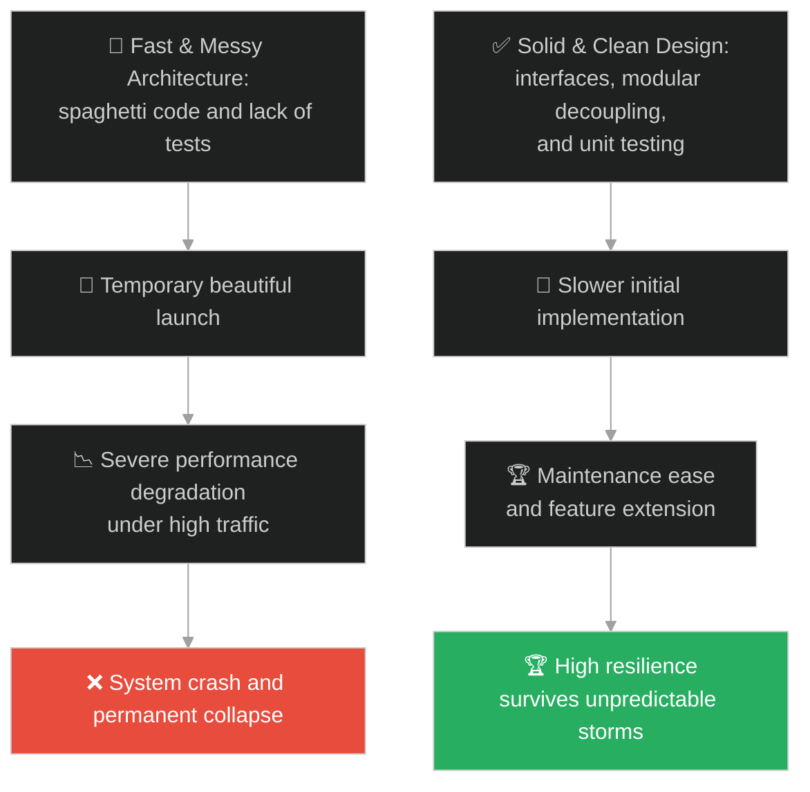
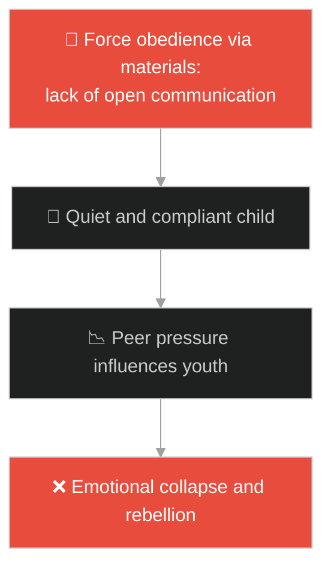
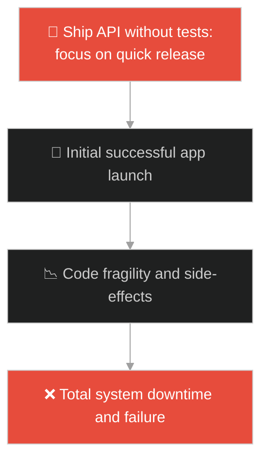
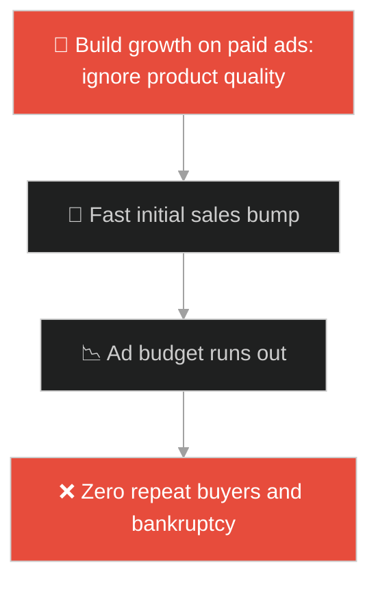
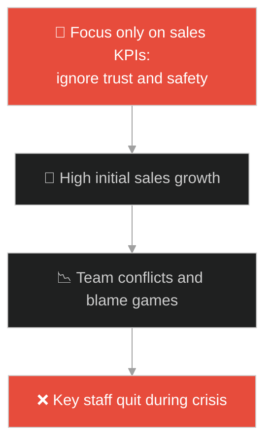
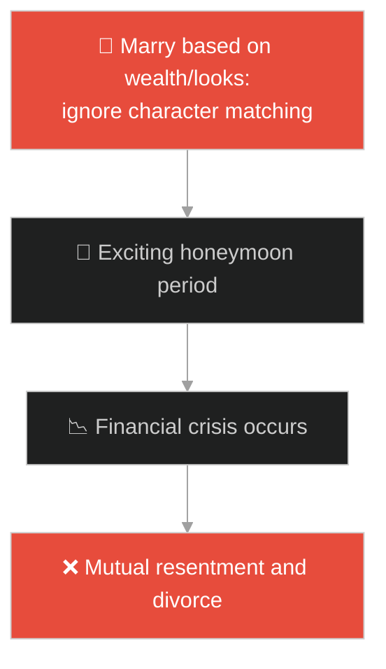
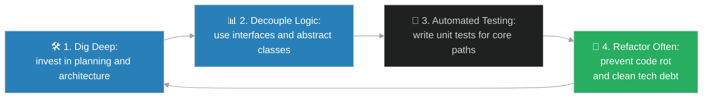

# Architecture Foundations & Clean Code (គ្រឹះស្ថាបត្យកម្ម និងកូដស្អាតស្អំ)៖ ផ្ទះសង់លើថ្មដា និងផ្ទះសង់លើខ្សាច់ (Architecture Foundations & Clean Code & Jesus and the Two Builders)

**Author:** ichamrong  
**Date:** 2026-05-28  
**Tags:** #jesus #resilience #foundation #clean-code #architecture #software-engineering  
**Category:** Concepts / Parables  
**Read Time:** ~15 min  

---

## 📌 មាតិកា (Table of Contents)
- [អន្ទាក់ផ្លូវចិត្ត (The Trap)](#0)
- [១. រឿងព្រេងនិទាន៖ អ្នកសាងសង់ទាំងពីរ (The Legend of the Two Builders)](#1)
  - [ការបោកបក់នៃព្យុះ និងសោកនាដកម្មផ្ទះនៅលើខ្សាច់ (The Storm and the Fall of the Sand-built House)](#1-1)
- [២. បញ្ហា៖ ការសាងសង់ប្រព័ន្ធគ្មានគ្រឹះមាំ និងគ្រោះថ្នាក់នៃការសរសេរកូដលំៗ (The Issue: Weak Architectural Foundations and Bad Code Quality)](#2)
- [៣. ឧទាហមណ៍ជាក់ស្តែងក្នុងពិភពពិត (Real World Examples)](#3)
  - [ឧទាហរណ៍ទី ១ — កម្រិតស្រាល (គ្រួសារ)៖ ការអប់រំកូនដោយគ្មានការសន្ទនាបើកចំហ និងគ្រឹះវិន័យ (Raising Kids Without Open Dialogue Foundations)](#3-1)
  - [ឧទាហរណ៍ទី ២ — កម្រិតមធ្យម (បច្ចេកទេស)៖ ការកសាង API ដោយគ្មាន Testing/Clean Code (Deploying APIs Without Tests or Standard Architecture)](#3-2)
  - [ឧទាហរណ៍ទី ៣ — កម្រិតមធ្យម (ធុរកិច្ច)៖ ការបង្កើតអាជីវកម្មផ្អែកលើការទិញផ្សាយពាណិជ្ជកម្មដោយគ្មានអតិថិជនស្មោះត្រង់ (Building a Business on Ads Without Product-Market Fit)](#3-3)
  - [ឧទាហរណ៍ទី ៤ — កម្រិតមធ្យម (សង្គម/គ្រប់គ្រង)៖ ការបង្កើតក្រុមការងារដោយគ្មានវប្បធម៌ការងារច្បាស់លាស់ និងទំនុកចិត្ត (Forming Teams Without Psychological Safety and Defined Culture)](#3-4)
  - [ឧទាហរណ៍ទី ៥ — កម្រិតធ្ងន់ (ទំនាក់ទំនង)៖ ទំនាក់ទំនងស្នេហាដែលកសាងឡើងលើតែរូបសម្បត្តិ ឬទ្រព្យសម្បត្តិក្រៅខ្លួន (Relationships Built Solely on Looks or Wealth)](#3-5)
- [៤. ដំណោះស្រាយទូទៅ៖ ការសាងសង់គ្រឹះរឹងមាំតាមរយៈ SOLID Principles (The General Solution: Solid Foundations through Clean Architecture)](#4)
- [សេចក្តីសន្និដ្ឋាន (Conclusion)](#5)
- [ឯកសារយោង (References)](#6)
- [Related Posts](#7)

---

<a id="0"></a>
## អន្ទាក់ផ្លូវចិត្ត (The Trap)

តើអ្នកធ្លាប់ឆ្ងល់ទេថា ហេតុអ្វីបានជាកម្មវិធី ឬអាជីវកម្មខ្លះដំណើរការបានយ៉ាងល្អនៅពេលចាប់ផ្តើមដំបូង ប៉ុន្តែគ្រាន់តែជួបបញ្ហាសម្ពាធបន្តិចបន្តួច ក៏ស្រាប់តែដួលរលំ និងកែប្រែអ្វីលែងកើតតែម្តង? មនុស្សភាគច្រើនយល់ច្រឡំថា "ល្បឿននៃការសង់រូបរាងខាងក្រៅ គឺជាកត្តាកំណត់ជោគជ័យ"។ ប៉ុន្តែនៅក្នុងប្រព័ន្ធវិស្វកម្ម របស់ដែលមើលមិនឃើញ (ដូចជា គ្រឹះ និងរចនាសម្ព័ន្ធខាងក្រោម) គឺជាអ្នកកំណត់ជោគវាសនានៅពេលវិបត្តិមកដល់។

នៅក្នុងការរចនាប្រព័ន្ធ និងការកសាងជីវិត៖
* **យើងងាយនឹងធ្លាក់ក្នុងអន្ទាក់** នៃការផ្តោតលើល្បឿន និងរូបរាងខាងក្រៅ (Fast Features & UI) ដើម្បីបង្ហាញលទ្ធផលលឿនបំផុត ដោយមិនខ្វល់ពីការសរសេរកូដស្អាត (Clean Code) ឬចាក់គ្រឹះស្ថាបត្យកម្មឱ្យរឹងមាំ។
* **យើងមើលរំលង** ព្យុះភ្លៀង និងសម្ពាធ (Traffic Spikes, Business Pivot, Crisis) ដែលនឹងមកបោកបក់សាកល្បងភាពធន់នៃគ្រឹះរបស់យើងជៀសមិនរួច។

ការកសាងកិច្ចការងារយ៉ាងលឿនដោយគ្មានគ្រឹះមាំមួន ហៅថា **អន្ទាក់ផ្ទះលើដីខ្សាច់ (Sand-built Foundation Trap)**។

ដើម្បីយល់ដឹងពីរបៀបសាងសង់ប្រព័ន្ធដែលធន់ទ្រាំនឹងវិបត្តិ នេះជាផែនទីបង្ហាញផ្លូវ៖
1. **រឿងព្រេងនិទាន (The Legend)** — រឿងប្រៀបប្រដៅរបស់អ្នកសាងសង់ពីរនាក់៖ ម្នាក់សង់លើថ្មដា និងម្នាក់ទៀតសង់លើខ្សាច់។
2. **បញ្ហា (The Issue)** — គ្រោះថ្នាក់នៃបំណុលបច្ចេកវិទ្យា (Technical Debt) និងកូដដែលគ្មានលំនាំស្តង់ដារ។
3. **ឧទាហមណ៍ជាក់ស្តែងក្នុងពិភពពិត (Real World Examples)** — ពិនិត្យមើលបញ្ហានេះក្នុងកម្រិតគ្រួសារ បច្ចេកវិទ្យា ធុរកិច្ច ការគ្រប់គ្រង និងទំនាក់ទំនង។
4. **ដំណោះស្រាយទូទៅ (The General Solution)** — ការអនុវត្ត SOLID Principles និង Clean Architecture។



---

<a id="1"></a>
## ១. រឿងព្រេងនិទាន៖ អ្នកសាងសង់ទាំងពីរ (The Legend of the Two Builders)

ព្រះយេស៊ូវបានបង្រៀនពីរឿងប្រៀបប្រដៅមួយ ដើម្បីបង្ហាញពីភាពខុសគ្នារវាងអ្នកដែលស្តាប់ដំបូន្មានហើយយកទៅអនុវត្ត និងអ្នកដែលគ្រាន់តែស្តាប់ហើយមិនព្រមធ្វើតាម។ មានបុរសពីរនាក់ចង់សាងសង់ផ្ទះរៀងៗខ្លួន៖
* **បុរសទី ១ (អ្នកមានប្រាជ្ញា)** បានចំណាយពេលយ៉ាងយូរ ជីកដីយ៉ាងជ្រៅ រហូតដល់ជួបស្រទាប់ **ថ្មដា (Rock)**។ ទោះបីជាត្រូវហត់នឿយ និងចំណាយពេលវេលាច្រើនក៏ដោយ គាត់បានតស៊ូចាក់គ្រឹះផ្ទះយ៉ាងរឹងមាំជាប់ទៅនឹងថ្មដានោះ រួចទើបសាងសង់ផ្ទះពីលើ។
* **បុរសទី ២ (អ្នកល្ងង់ខ្លៅ)** ចង់បានភាពងាយស្រួល ចំណេញពេលវេលា និងថវិកា។ គាត់បានសាងសង់ផ្ទះរបស់គាត់ដោយផ្ទាល់នៅលើ **ដីខ្សាច់ (Sand)**។ ផ្ទះរបស់គាត់សង់រួចយ៉ាងលឿន មើលពីក្រៅទៅស្អាតមិនចាញ់ផ្ទះបុរសទី ១ ឡើយ។

<a id="1-1"></a>
### ការបោកបក់នៃព្យុះ និងសោកនាដកម្មផ្ទះនៅលើខ្សាច់ (The Storm and the Fall of the Sand-built House)

នៅពេលមេឃស្រឡះ ផ្ទះទាំងពីរមើលទៅមានសុវត្ថិភាពដូចគ្នា។ ប៉ុន្តែនៅពេលរដូវវស្សាមកដល់៖
* ភ្លៀងបានធ្លាក់ចុះមកយ៉ាងខ្លាំង ទឹកជំនន់ហក់ឡើង ហើយខ្យល់ព្យុះបានបក់បោកយ៉ាងសាហាវទៅលើផ្ទះទាំងពីរ។
* ផ្ទះរបស់បុរសទី ១ ដែលសង់នៅលើថ្មដា ឈរយ៉ាងរឹងមាំ មិនកក្រើកឡើយ ព្រោះគ្រឹះរបស់វាភ្ជាប់ទៅនឹងស្រទាប់ថ្មដាយ៉ាងណែន។
* ចំណែកឯផ្ទះរបស់បុរសទី ២ ដែលសង់លើដីខ្សាច់ គ្រាន់តែទឹកជំនន់បោកបក់បន្តិច ដីខ្សាច់ក៏បាក់ស្រុត ធ្វើឱ្យផ្ទះទាំងមូលរលំខ្ទេចខ្ទីបាត់បង់អស់គ្មានសល់។

---

<a id="2"></a>
## ២. បញ្ហា៖ ការសាងសង់ប្រព័ន្ធគ្មានគ្រឹះមាំ និងគ្រោះថ្នាក់នៃការសរសេរកូដលំៗ (The Issue: Weak Architectural Foundations and Bad Code Quality)

នៅក្នុងវិស្វកម្មកម្មវិធីបច្ចេកវិទ្យា ការសរសេរកូដលឿនៗដោយគ្មានគំរូស្ថាបត្យកម្មច្បាស់លាស់ (Spaghetti Code / Tight Coupling) ប្រៀបបាននឹងការសង់ផ្ទះលើដីខ្សាច់។ នៅពេលប្រព័ន្ធត្រូវការផ្លាស់ប្តូរ ឬជួបប្រទះការប្រើប្រាស់ខ្ពស់ (High Traffic/Load) វានឹងគាំង និងខូចខាតភ្លាមៗ។

```python
# Bad/Fragile: Tight coupling, zero validation, direct SQL execution in controller (House on Sand)
class UserRegistrationController:
    def handle_request(self, username, password):
        # Directly writing business logic and database queries in the routing controller
        if not username or not password:
            return "Error: Missing data"
        
        import sqlite3
        conn = sqlite3.connect('app.db')
        cursor = conn.cursor()
        # SQL Injection vulnerability and tight database coupling
        query = f"INSERT INTO users (name, pass) VALUES ('{username}', '{password}')"
        cursor.execute(query)
        conn.commit()
        conn.close()
        return "Success"

# Good/Resilient: Interface-driven design, Clean Architecture, Dependency Injection (House on Rock)
from abc import ABC, abstractmethod

class UserRepository(ABC):
    @abstractmethod
    def save(self, user):
        pass

class SecureUserRepository(UserRepository):
    def save(self, user):
        # Secure database abstraction and preparation
        pass

class UserRegistrationService:
    def __init__(self, user_repo: UserRepository):
        self.user_repo = user_repo
        
    def register(self, username, password):
        if len(password) < 8:
            raise ValueError("Password is too weak")
        user = User(username, password)
        self.user_repo.save(user)
```

* **បំណុលបច្ចេកវិទ្យាកើនឡើង (High Technical Debt):** កូដគ្មានសណ្តាប់ធ្នាប់ធ្វើឱ្យក្រុមការងារចំណាយពេលយូរក្នុងការកែតម្រូវមុខងារចាស់ៗ ឬបន្ថែមមុខងារថ្មី។
* **ភាពមិនអាចពង្រីកសមត្ថភាពបាន (Unscalability):** ប្រព័ន្ធមិនអាចចែករំលែកបន្ទុកការងារ (Scalability) ទៅកាន់ Server ផ្សេងទៀតបានឡើយ ព្រោះគ្រប់ផ្នែកជាប់គ្នាទាំងស្រុង (Tightly Coupled)។

---

<a id="3"></a>
## ៣. ឧទាហមណ៍ជាក់ស្តែងក្នុងពិភពពិត

---

<a id="3-1"></a>
### ឧទាហមណ៍ទី ១ — កម្រិតស្រាល (គ្រួសារ)៖ ការអប់រំកូនដោយគ្មានការសន្ទនាបើកចំហ និងគ្រឹះវិន័យ (Raising Kids Without Open Dialogue Foundations)

ឪពុកម្តាយខ្លះអប់រំកូនដោយការប្រើអំណាចបង្ខិតបង្ខំ ឬការផ្តល់សម្ភារៈនិយមដើម្បីឱ្យកូនស្តាប់បង្គាប់លឿនៗ។ ពួកគេមិនបានសាងសង់ទំនុកចិត្ត និងការសន្ទនាដោយបើកចំហរ (Open Communication) ជាមួយកូនឡើយ។ នៅពេលកូនចូលវ័យជំទង់ និងជួបឥទ្ធិពលពីមិត្តភក្តិ ឬបញ្ហាសង្គម ពួកគេលាក់បាំងបញ្ហា និងងាយធ្លាក់ក្នុងអំពើអបាយមុខភ្លាមៗ ព្រោះគ្មានគ្រឹះទំនាក់ទំនងរឹងមាំជាមួយគ្រួសារ។



---

<a id="3-2"></a>
### ឧទាហមណ៍ទី ២ — កម្រិតមធ្យម (បច្ចេកទេស)៖ ការកសាង API ដោយគ្មាន Testing/Clean Code (Deploying APIs Without Tests or Standard Architecture)

ក្រុមការងារបង្កើតកម្មវិធីទូរស័ព្ទមួយចង់បង្កើនល្បឿនបញ្ចេញផលិតផលឱ្យទាន់ពេលវេលា ក៏បានសរសេរកូដលឿនៗដោយគ្មានការសរសេរតេស្ត (Unit Testing) និងគ្មានស្ថាបត្យកម្មច្បាស់លាស់។ ដំបូងឡើយ កម្មវិធីដំណើរការបានធម្មតា។ ប៉ុន្តែនៅពេលចំនួនអ្នកប្រើប្រាស់កើនឡើងដល់ ១០ ម៉ឺននាក់ ប្រព័ន្ធទាំងមូលគាំង ហើយរាល់ពេលក្រុមការងារកែកំហុសមួយ វាតែងតែបង្កើតកំហុស ៥ ផ្សេងទៀត។



---

<a id="3-3"></a>
### ឧទាហមណ៍ទី ៣ — កម្រិតមធ្យម (ធុរកិច្ច)៖ ការបង្កើតអាជីវកម្មផ្អែកលើការទិញផ្សាយពាណិជ្ជកម្មដោយគ្មានអតិថិជនស្មោះត្រង់ (Building a Business on Ads Without Product-Market Fit)

ក្រុមហ៊ុន Startup មួយចង់បានកំណើនលឿន ក៏បានចំណាយលុយរាប់ម៉ឺនដុល្លារលើការផ្សាយពាណិជ្ជកម្ម (Facebook Ads) ដើម្បីទាក់ទាញអតិថិជនមកទិញទំនិញអន់ៗរបស់ខ្លួន។ នៅពេលក្រុមហ៊ុនអស់លុយផ្សព្វផ្សាយ អតិថិជនក៏ឈប់ទិញភ្លាមៗ ព្រោះផលិតផលគ្មានគុណភាព និងមិនឆ្លើយតបនឹងតម្រូវការពិតប្រាកដ (Product-Market Fit)។ អាជីវកម្មនោះក៏ត្រូវបិទទ្វារភ្លាមៗ។



---

<a id="3-4"></a>
### ឧទាហមណ៍ទី ៤ — កម្រិតមធ្យម (សង្គម/គ្រប់គ្រង)៖ ការបង្កើតក្រុមការងារដោយគ្មានវប្បធម៌ការងារច្បាស់លាស់ និងទំនុកចិត្ត (Forming Teams Without Psychological Safety and Defined Culture)

នាយកក្រុមហ៊ុនម្នាក់បានជួលបុគ្គលិកពូកែៗមកធ្វើការជាមួយគ្នា ដោយផ្តោតតែលើការដេញតាមគោលដៅលក់ (Sales KPI)។ គាត់មិនបានបង្កើតទំនុកចិត្ត ឬវប្បធម៌យោគយល់គ្នា (Psychological Safety) ឡើយ។ នៅពេលក្រុមហ៊ុនជួបវិបត្តិហិរញ្ញវត្ថុ បុគ្គលិកចាប់ផ្តើមបន្ទោសគ្នាទៅវិញទៅមក លាក់បាំងកំហុស និងបែកបាក់សាមគ្គីភាព ដែលធ្វើឱ្យក្រុមហ៊ុនដួលរលំកាន់តែលឿន។



---

<a id="3-5"></a>
### ឧទាហមណ៍ទី ៥ — កម្រិតធ្ងន់ (ទំនាក់ទំនង)៖ ទំនាក់ទំនងស្នេហាដែលកសាងឡើងលើតែរូបសម្បត្តិ ឬទ្រព្យសម្បត្តិក្រៅខ្លួន (Relationships Built Solely on Looks or Wealth)

គូស្នេហ៍មួយគូសម្រេចចិត្តរៀបការជាមួយគ្នា ផ្អែកលើតែរូបរាងកាយដ៏ទាក់ទាញ និងសម្ភារៈនិយមខាងក្រៅ។ ពួកគេមិនដែលបង្កើតគ្រឹះនៃការគោរពគ្នា ការអត់ធ្មត់ និងផ្នត់គំនិតជីវិតស្របគ្នានោះឡើយ។ នៅពេលជួបវិបត្តិក្ស័យធន ឬភាពចាស់ជរាមកដល់ ពួកគេចាប់ផ្តើមទាស់ទែង និងលែងលះគ្នាភ្លាមៗ ព្រោះគ្មានគ្រឹះស្នេហាពិតប្រាកដ។



---

<a id="4"></a>
## ៤. ដំណោះស្រាយទូទៅ៖ ការសាងសង់គ្រឹះរឹងមាំតាមរយៈ SOLID Principles (The General Solution: Solid Foundations through Clean Architecture)

ដើម្បីកសាងប្រព័ន្ធ ឬជីវិតដែលមានភាពធន់ទ្រាំនឹងគ្រប់ព្យុះភ្លៀង យើងត្រូវអនុវត្តគោលការណ៍កសាងគ្រឹះ៖



1. **ការជីកគ្រឹះឱ្យជ្រៅ (Invest in Planning & Architecture):** កុំប្រញាប់ប្រញាល់សរសេរកូដ ឬអនុវត្តការងារដោយគ្មានផែនការច្បាស់លាស់។ ត្រូវរចនា Architecture Blueprint និងគិតពីផលប៉ះពាល់រយៈពេលវែង។
2. **ការបំបែកមុខងារឱ្យដាច់ពីគ្នា (Decoupling & Modularity):** អនុវត្ត SOLID Principles ដើម្បីឱ្យផ្នែកនីមួយៗនៃប្រព័ន្ធមានសេរីភាពមិនជាប់ជំពាក់គ្នា។ ការកែប្រែផ្នែកមួយ មិនត្រូវឱ្យប៉ះពាល់ដល់ផ្នែកផ្សេងទៀតឡើយ។
3. **ការសរសេរតេស្តស្វ័យប្រវត្ត (Automated Testing):** ការសរសេរ Unit Test និង Integration Test គឺជាការចាក់គ្រឹះបេតុងការពារកុំឱ្យកូដបាក់ស្រុតនៅពេលមានការផ្លាស់ប្តូរ (Regressions)។
4. **កសាងវិន័យ និងគុណតម្លៃស្នូល (Core Values & Discipline):** នៅក្នុងជីវិត និងអាជីវកម្ម ត្រូវផ្តោតលើភាពស្មោះត្រង់ វិន័យ និងចំណេះដឹងពិតប្រាកដ ជាជាងការដេញតាមការសម្ដែង ឬភាពជោគជ័យបណ្តោះអាសន្ន។

---

## 🐇 ធ្លាក់ចូលក្នុងរន្ធទន្សាយ (Enter the Rabbit Hole)

ដើម្បីយល់ដឹងពីរបៀបដែលការស្វែងរក និងតាមដានរាល់កំហុសឆ្គង ឬករណីលើកលែង (Observability & Exception Tracing) ជួយការពារប្រព័ន្ធពីការបាត់បង់សមាជិក ឬទិន្នន័យសំខាន់ៗ ទោះជាស្ថិតក្នុងស្ថានភាពលំបាកបំផុតក៏ដោយ សូមបន្តដំណើរទៅកាន់៖

* 🚀 **[ចាប់ផ្តើមដំណើររុករក (Start the Journey) ➔ The Parable of the Lost Sheep](./182-jesus-and-the-lost-sheep.md)**

---

<a id="5"></a>
## សេចក្តីសន្និដ្ឋាន (Conclusion)

> **«ព្យុះភ្លៀងនឹងមកបោកបក់សាកល្បងផ្ទះរបស់មនុស្សគ្រប់គ្នា។ ភាពខុសគ្នាតែមួយគត់រវាងការរស់រាន និងការដួលរលំ គឺជម្រៅ និងភាពរឹងមាំនៃគ្រឹះដែលអ្នកបានសាងសង់»**

ចូរកុំស្វែងរកផ្លូវកាត់ដែលផ្តល់ផលលឿនតែគ្មានសុវត្ថិភាព។ សុខចិត្តចំណាយពេលជីកគ្រឹះឱ្យដល់ស្រទាប់ថ្មដា ដើម្បីកសាងជីវិត ឬប្រព័ន្ធបច្ចេកវិទ្យាមួយដែលមិនចេះរលំរលាយ។

---

<a id="6"></a>
## ឯកសារយោង (References)

* **Matthew 7:24–27** — *The Parable of the Two Builders*, Holy Bible. A timeless sermon on execution, application, and solid foundations.
* **Martin, R. C.** — *Clean Architecture: A Craftsman's Guide to Software Structure and Design* (2017). Prentice Hall. The canonical guide on decoupling and architectural resilience.

---

<a id="7"></a>
## Related Posts

* [[Loss Aversion & Resource Optimization](./180-jesus-and-the-talents.md)] — របៀបចាត់ចែងធនធានឱ្យមានប្រសិទ្ធភាព និងហ៊ានប្រឈមហានិភ័យដើម្បីលូតលាស់។
* [[Observability & Edge-case Exception Tracing](./182-jesus-and-the-lost-sheep.md)] — របៀបតាមដាន និងសង្គ្រោះប្រព័ន្ធរាល់ពេលមានកំហុសឆ្គងតូចតាចកើតឡើង។
