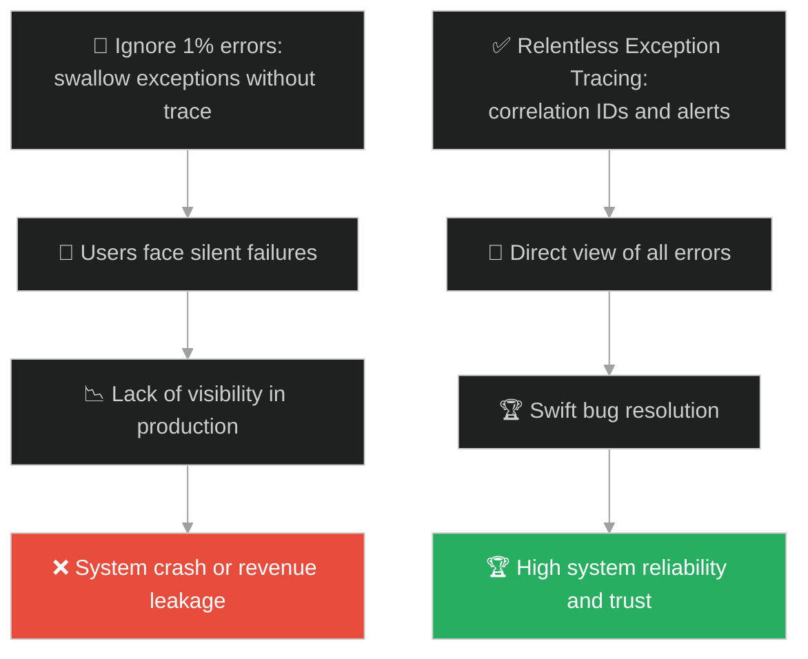
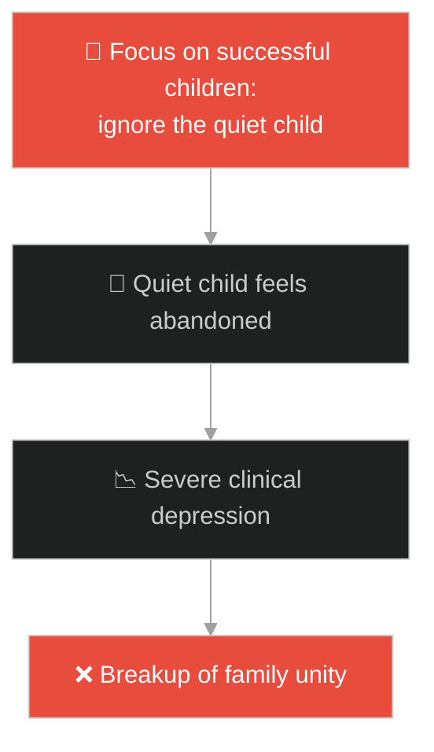
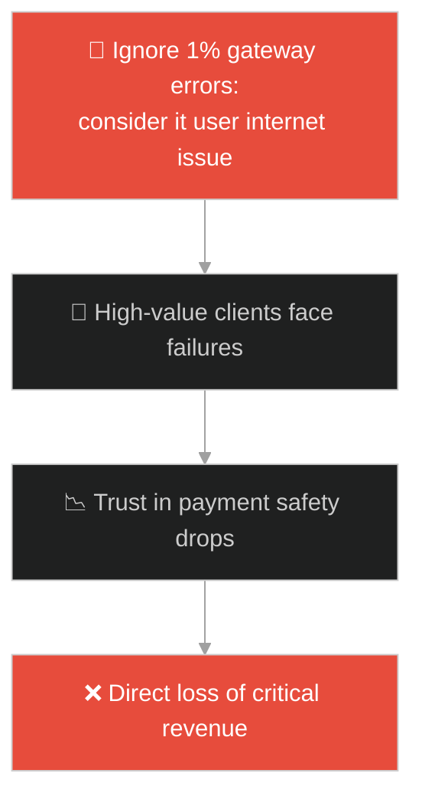
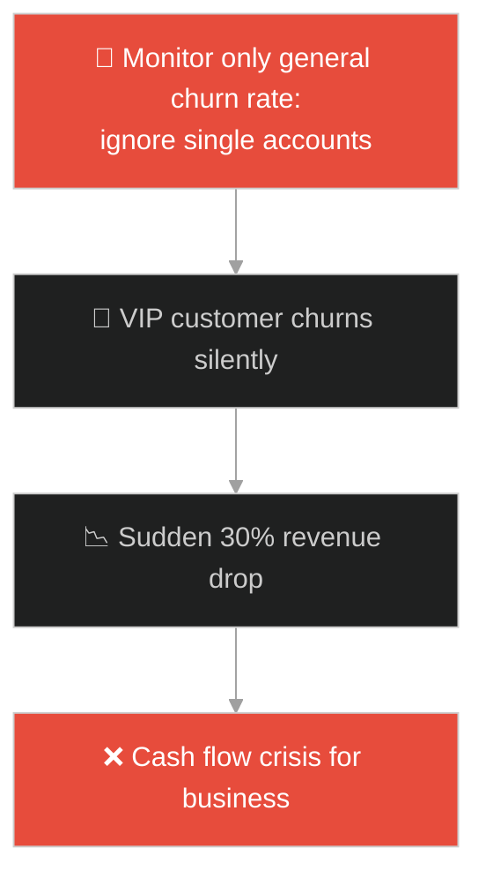
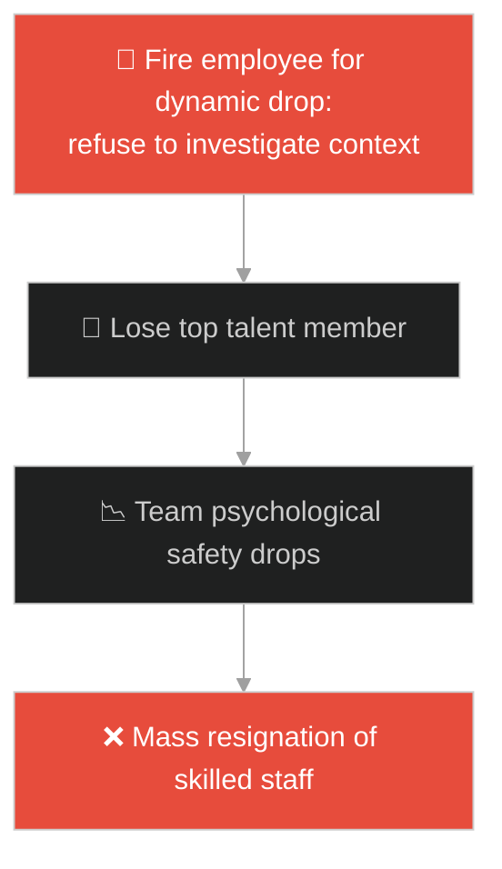
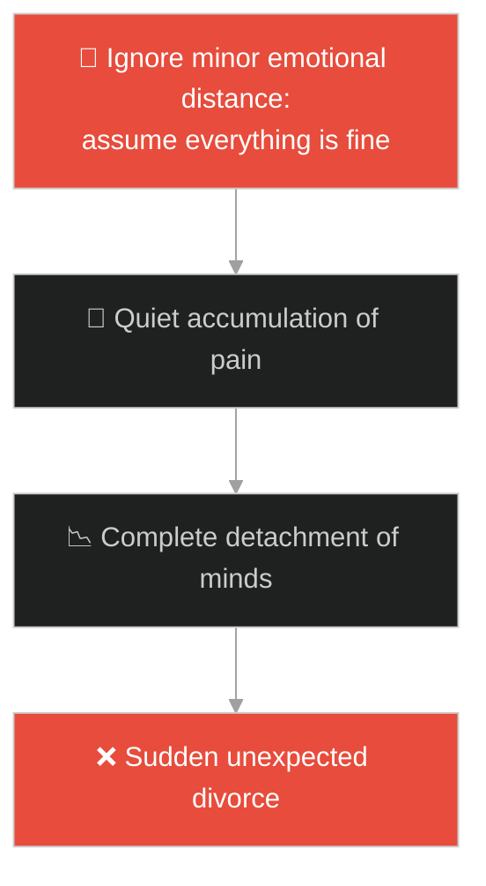
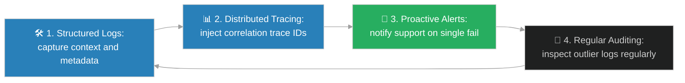

# Observability & Edge-case Exception Tracing (លទ្ធភាពសង្កេតប្រព័ន្ធ និងការតាមដានករណីលើកលែង)៖ ចៀមមួយក្បាលដែលវង្វេងបាត់ (Observability & Edge-case Exception Tracing & Jesus and the Lost Sheep)

**Author:** ichamrong  
**Date:** 2026-05-28  
**Tags:** #jesus #observability #monitoring #exception-handling #edge-case #reliability  
**Category:** Concepts / Parables  
**Read Time:** ~15 min  

---

## 📌 មាតិកា (Table of Contents)
- [អន្ទាក់ផ្លូវចិត្ត (The Trap)](#0)
- [១. រឿងព្រេងនិទាន៖ ចៀមដែលវង្វេង (The Legend of the Lost Sheep)](#1)
  - [ការរុករកដោយមិនបោះបង់ និងការសង្គ្រោះចៀមមួយក្បាល (The Relentless Search and Recovery of the One)](#1-1)
- [២. បញ្ហា៖ គ្រោះថ្នាក់នៃការបោះបង់កំហុសជាយថាហេтку និងកង្វះលទ្ធភាពសង្កេតប្រព័ន្ធ (The Issue: Ignoring Edge-cases and Wasting Traceable Exceptions)](#2)
- [៣. ឧទាហមណ៍ជាក់ស្តែងក្នុងពិភពពិត (Real World Examples)](#3)
  - [ឧទាហរណ៍ទី ១ — កម្រិតស្រាល (គ្រួសារ)៖ ការមើលរំលងបញ្ហាផ្លូវចិត្តរបស់កូនម្នាក់នៅក្នុងផ្ទះ (Neglecting the Quiet Child's Emotional Distress)](#3-1)
  - [ឧទាហរណ៍ទី ២ — កម្រិតមធ្យម (បច្ចេកទេស)៖ ការមើលរំលងកំហុស 1% Exception in Production (Ignoring the 1% Failure Rate in Payment Gateway)](#3-2)
  - [ឧទាហរណ៍ទី ៣ — កម្រិតមធ្យម (ធុរកិច្ច)៖ ការបាត់បង់អតិថិជនពិសេសម្នាក់ដែលផ្តល់ចំណូលខ្ពស់ (Ignoring the Churn of a Single High-Value VIP Client)](#3-3)
  - [ឧទាហរណ៍ទី ៤ — កម្រិតមធ្យម (សង្គម/គ្រប់គ្រង)៖ ការបោះបង់បុគ្គលិកដែលមានសមត្ថភាពតែជួបបញ្ហាផ្ទាល់ខ្លួន (Neglecting a High-Performing Employee Going Through a Personal Crisis)](#3-4)
  - [ឧទាហរណ៍ទី ៥ — កម្រិតធ្ងន់ (ទំនាក់ទំនង)៖ ការមើលរំលងការប្រេះឆាតូចមួយរហូតដល់លែងយល់ចិត្តគ្នា (Ignoring the First Small Sign of Emotional Distance)](#3-5)
- [៤. ដំណោះស្រាយទូទៅ៖ ការកសាងប្រព័ន្ធ Observability តាមរយៈ Telemetry (The General Solution: Building Comprehensive Observability Frameworks)](#4)
- [សេចក្តីសន្និដ្ឋាន (Conclusion)](#5)
- [ឯកសារយោង (References)](#6)
- [Related Posts](#7)

---

<a id="0"></a>
## អន្ទាក់ផ្លូវចិត្ត (The Trap)

តើអ្នកធ្លាប់ជួបស្ថានភាពដែលប្រព័ន្ធទាំងមូលដំណើរការបានល្អ ៩៩% ប៉ុន្តែមានអ្នកប្រើប្រាស់ម្នាក់ ឬពីរនាក់ជួបប្រទះបញ្ហាធ្ងន់ធ្ងរ ហើយអ្នកមិនដឹងថាត្រូវស្វែងរកមូលហេតុពីណាដែរឬទេ? នៅក្នុងការគ្រប់គ្រងប្រព័ន្ធ វិស្វករជាច្រើនងាយនឹងធ្លាក់ក្នុងអន្ទាក់នៃ "ស្ថិតិជារួម" ដោយគិតថា ដំណើរការល្អ ៩៩% គឺល្អគ្រប់គ្រាន់ហើយ ដោយសុខចិត្តបោះបង់ ១% ដែលមានបញ្ហាចោល។

នៅក្នុងស្ថាបត្យកម្មប្រព័ន្ធ និងការដឹកនាំ៖
* **យើងងាយនឹងធ្លាក់ក្នុងអន្ទាក់** នៃការមើលរំលងកំហុសតូចតាច ឬករណីលើកលែងពិសេសៗ (Edge-cases) ព្រោះយល់ថាវាមិនប៉ះពាល់ដល់ស្ថិតិរួមដ៏ល្អស្រស់ស្អាតរបស់យើង។
* **យើងមើលរំលង** ការពិតដែលថា កំហុស ១% ដែលលាក់ខ្លួន (Silent Failures) អាចជារោគសញ្ញាដំបូងនៃវិបត្តិធំដែលត្រៀមនឹងបំផ្លាញប្រព័ន្ធទាំងមូលនាពេលអនាគត។

ការមិនអើពើចំពោះករណីលើកលែងតូចតាច និងកង្វះលទ្ធភាពតាមដាន (Tracing) ហៅថា **អន្ទាក់លេបកំហុសចោល (Swallowed Exception Trap)**។

ដើម្បីយល់ដឹងពីរបៀបបង្កើតប្រព័ន្ធតាមដានដ៏មានប្រសិទ្ធភាព នេះជាផែនទីបង្ហាញផ្លូវ៖
1. **រឿងព្រេងនិទាន (The Legend)** — រឿងរ៉ាវរបស់អ្នកគង្វាលដែលទុកចៀម ៩៩ ក្បាលដើម្បីស្វែងរកចៀមតែមួយក្បាលដែលវង្វេងបាត់។
2. **បញ្ហា (The Issue)** — ការវិភាគលើសារៈសំខាន់នៃ Exception Handling និងការលំបាកក្នុងការរកកំហុសក្នុងប្រព័ន្ធធំៗ។
3. **ឧទាហមណ៍ជាក់ស្តែងក្នុងពិភពពិត (Real World Examples)** — ពិនិត្យមើលបញ្ហានេះក្នុងកម្រិតគ្រួសារ បច្ចេកវិទ្យា ធុរកិច្ច ការគ្រប់គ្រង និងទំនាក់ទំនង។
4. **ដំណោះស្រាយទូទៅ (The General Solution)** — ការបង្កើត Metric, Logging, និង Distributed Tracing (Three Pillars of Observability)។



---

<a id="1"></a>
## ១. រឿងព្រេងនិទាន៖ ចៀមដែលវង្វេង (The Legend of the Lost Sheep)

ពួកមេដឹកនាំសាសនានៅសម័យបុរាណ បានរិះគន់ព្រះយេស៊ូវដែលព្រះអង្គតែងតែទទួល និងបរិភោគអាហារជាមួយមនុស្សមានបាប និងអ្នកយកពន្ធ (ដែលសង្គមចាត់ទុកជាមនុស្សវង្វេងវង្វាន់ និងគ្មានតម្លៃ)។ ដើម្បីពន្យល់ពួកគេពីតម្លៃនៃមនុស្សម្នាក់ៗ ព្រះអង្គបានលើកយករឿងប្រៀបប្រដៅមួយមកសម្តែង៖

*"ឧបមាថាមានបុរសម្នាក់ មានចៀមចំនួន ១០០ ក្បាល។ នៅពេលដើររាប់ចៀម ស្រាប់តែគាត់រកឃើញថាបាត់ចៀមអស់មួយក្បាល។"*

តាមទ្រឹស្តីសេដ្ឋកិច្ច ឬគណិតវិទ្យាទូទៅ ការបាត់បង់ ១ ភាគរយ គឺជាការខូចខាតតិចតួចបំផុត។ អ្នកគង្វាលគួរតែបន្តមើលថែចៀម ៩៩ ក្បាលទៀត ដើម្បីកុំឱ្យបាត់បង់បន្ថែមទៀត។

<a id="1-1"></a>
### ការរុករកដោយមិនបោះបង់ និងការសង្គ្រោះចៀមមួយក្បាល (The Relentless Search and Recovery of the One)

ប៉ុន្តែផ្ទុយទៅវិញ ព្រះយេស៊ូវមានបន្ទូលថា៖
* *"តើបុរសនោះ នឹងមិនទុកចៀមទាំង ៩៩ ក្បាលនៅវាលរហោស្ថាន ហើយចេញទៅតាមរកចៀមមួយក្បាលដែលបាត់នោះ រហូតដល់រកឃើញវិញទេឬ?"*
* អ្នកគង្វាលបានឆ្លងកាត់ជ្រលងភ្នំ ព្រៃឈើ និងឧបសគ្គជាច្រើនដោយមិនបោះបង់។
* នៅពេលគាត់រកឃើញចៀមដែលវង្វេងនោះ គាត់មិនបានវាយដំ ឬខឹងនឹងវាឡើយ។ ផ្ទុយទៅវិញ គាត់បានលីវានៅលើស្មាដោយក្តីរំភើបរីករាយ និងសប្បាយចិត្តជាខ្លាំង។
* ពេលត្រឡប់មកដល់ផ្ទះ គាត់បានហៅមិត្តភក្តិ និងអ្នកជិតខាងមកអបអរសាទរថា៖ *"ចូរអររីករាយជាមួយខ្ញុំចុះ ព្រោះខ្ញុំបានរកឃើញចៀមដែលបាត់បង់នោះវិញហើយ!"*

ព្រះអង្គបានសន្និដ្ឋានថា ព្រលឹងនីមួយៗ ទោះបីជាតូចតាច និងងាយវង្វេងបំផុតក៏ដោយ ក៏មានតម្លៃមិនអាចកាត់ថ្លៃបាននៅក្នុងកែវភ្នែករបស់ព្រះអង្គគង្វាលដ៏ពិតប្រាកដ។

---

<a id="2"></a>
## ២. បញ្ហា៖ គ្រោះថ្នាក់នៃការបោះបង់កំហុសជាយថាហេតុ និងកង្វះលទ្ធភាពសង្កេតប្រព័ន្ធ (The Issue: Ignoring Edge-cases and Wasting Traceable Exceptions)

នៅក្នុងវិស្វកម្មប្រព័ន្ធកុំព្យូទ័រ ការបាត់បង់ចៀម ១ ក្បាលប្រៀបបាននឹងការលេចចេញនូវ **Edge-case Exception** (កំហុសដែលកើតឡើងតែម្តងម្កាលលើលក្ខខណ្ឌពិសេស)។ ប្រសិនបើយើងមិនមានប្រព័ន្ធតាមដាន (Observability) ត្រឹមត្រូវ កំហុសទាំងនេះនឹងត្រូវបាត់បង់ដោយស្ងៀមស្ងាត់ រហូតដល់បាត់បង់ទំនុកចិត្តពីអតិថិជន។

```python
# Bad/Fragile: Swallowing exceptions, missing context, no traceability (Lost Sheep ignored)
def process_payment_bad(transaction):
    try:
        if transaction['amount'] <= 0:
            raise ValueError("Negative amount error")
        return "Success"
    except Exception as e:
        # The error is swallowed or logged with zero metadata
        # Impossible to find which transaction failed out of millions
        print("Payment error occurred.") 
        return None

# Good/Resilient: Structured logging, correlation ID, and active tracing (Relentless search for the 1%)
import logging
import uuid

logger = logging.getLogger("TransactionMonitor")

def process_payment_good(transaction, context_correlation_id=None):
    trace_id = context_correlation_id or str(uuid.uuid4())
    try:
        if transaction['amount'] <= 0:
            raise ValueError("Negative amount error")
        return "Success"
    except Exception as e:
        # Structured logging capturing exact system status (Finding the Lost Sheep)
        logger.error(
            "Critical payment failure encountered",
            exc_info=True,
            extra={
                "trace_id": trace_id,
                "transaction_id": transaction.get("id"),
                "user_id": transaction.get("user_id"),
                "error_type": type(e).__name__
            }
        )
        raise e
```

* **កំហុសលាក់ខ្លួន (Silent Failures):** ការប្រើ Try-Catch block ដោយគ្រាន់តែបោះពុម្ពពាក្យ general text ធ្វើឱ្យយើងមិនអាចដឹងថាតើ error កើតឡើងដោយសារអ្វី មកពី user ណា ឬនៅម៉ោងប៉ុន្មាន។
* **ការបាត់បង់សញ្ញាអាសន្ន (Lack of Alerting):** បើគ្មាន Monitoring dashboard ទេ ប្រព័ន្ធអាចកំពុងបាត់បង់លុយរបស់អតិថិជនដោយសារ Bug តូចមួយ ដោយក្រុមការងារបច្ចេកទេសមិនដឹងខ្លួនទាល់តែសោះ។

---

<a id="3"></a>
## ៣. ឧទាហមណ៍ជាក់ស្តែងក្នុងពិភពពិត

---

<a id="3-1"></a>
### ឧទាហមណ៍ទី ១ — កម្រិតស្រាល (គ្រួសារ)៖ ការមើលរំលងបញ្ហាផ្លូវចិត្តរបស់កូនម្នាក់នៅក្នុងផ្ទះ (Neglecting the Quiet Child's Emotional Distress)

នៅក្នុងគ្រួសារមួយដែលមានកូន ៣ នាក់។ កូនពីរនាក់ដំបូងរៀនពូកែ និងចូលចិត្តនិយាយច្រើន ធ្វើឱ្យឪពុកម្តាយមានមោទនភាពខ្លាំង។ ប៉ុន្តែកូនទី ៣ ស្ងប់ស្ងាត់ និងជួបបញ្ហាបាក់ទឹកចិត្តនៅសាលា។ ឪពុកម្តាយយល់ថា គ្រួសារមានសុភមង្គល ៩០% ហើយ ក៏មិនបានយកចិត្តទុកដាក់សួរសុខទុក្ខកូនទី ៣ ឡើយ។ ទីបំផុត កូននោះក៏ធ្លាក់ខ្លួនឈឺផ្លូវចិត្តធ្ងន់ធ្ងរ ព្រោះគ្មាននរណាម្នាក់មើលឃើញទុក្ខព្រួយរបស់ខ្លួន។



---

<a id="3-2"></a>
### ឧទាហមណ៍ទី ២ — កម្រិតមធ្យម (បច្ចេកទេស)៖ ការមើលរំលងកំហុស 1% Exception in Production (Ignoring the 1% Failure Rate in Payment Gateway)

គេហទំព័រលក់ទំនិញមួយមានអត្រាទូទាត់ប្រាក់ជោគជ័យ ៩៩%។ ក្រុមការងារសម្រេចចិត្តមិនស៊ើបអង្កេតលើបញ្ហាបរាជ័យ ១% ឡើយ ព្រោះគិតថាវាជាបញ្ហាអ៊ីនធឺណិតរបស់អ្នកប្រើប្រាស់។ ប៉ុន្តែការពិត បញ្ហា ១% នោះគឺកើតឡើងចំពោះតែអតិថិជនដែលប្រើប្រាស់កាតធនាគារលំដាប់ VIP មួយប្រភេទប៉ុណ្ណោះ។ ការមើលរំលងនេះធ្វើឱ្យក្រុមហ៊ុនបាត់បង់អតិថិជនធំៗជាច្រើន។



---

<a id="3-3"></a>
### ឧទាហមណ៍ទី ៣ — កម្រិតមធ្យម (ធុរកិច្ច)៖ ការបាត់បង់អតិថិជនពិសេសម្នាក់ដែលផ្តល់ចំណូលខ្ពស់ (Ignoring the Churn of a Single High-Value VIP Client)

ក្រុមហ៊ុនលក់សេវាកម្មទិន្នន័យ (SaaS) មួយមានអតិថិជនសរុប ១,០០០ នាក់។ ពួកគេមើលឃើញថាអត្រា Churn Rate (អតិថិជនឈប់ប្រើ) ទាបបំផុតគឺក្រោម ០.១%។ ប៉ុន្តែពួកគេមិនបានឆែកមើលព័ត៌មានលម្អិតថា អតិថិជនតែម្នាក់គត់ដែលឈប់ប្រើនោះ គឺជាក្រុមហ៊ុនសាជីវកម្មធំដែលផ្តល់ចំណូលស្មើនឹង ៣០% នៃចំណូលសរុបរបស់ក្រុមហ៊ុនឡើយ។ ការមិនអើពើនឹងករណី "ចៀមមួយក្បាល" នេះនាំឱ្យក្រុមហ៊ុនជួបវិបត្តិហិរញ្ញវត្ថុយ៉ាងធ្ងន់ធ្ងរ។



---

<a id="3-4"></a>
### ឧទាហមណ៍ទី ៤ — កម្រិតមធ្យម (សង្គម/គ្រប់គ្រង)៖ ការបោះបង់បុគ្គលិកដែលមានសមត្ថភាពតែជួបបញ្ហាផ្ទាល់ខ្លួន (Neglecting a High-Performing Employee Going Through a Personal Crisis)

នៅក្នុងក្រុមការងារមួយដែលមានគ្នា ១០ នាក់។ បុគ្គលិកឆ្នើមម្នាក់ស្រាប់តែធ្លាក់ចុះផលិតភាពការងារ និងឧស្សាហ៍យឺតយ៉ាវ ដោយសារតែម្តាយរបស់គាត់កំពុងសម្រាកព្យាបាលនៅមន្ទីរពេទ្យ។ អ្នកគ្រប់គ្រងដែលគ្មានសេចក្តីអាណិតអាសូរ បានសម្រេចចិត្តស្តីបន្ទោស និងត្រៀមបញ្ឈប់គាត់ពីការងារ ជំនួសឱ្យការសាកសួរ និងផ្តល់ជំនួយសម្រាលការងារ។ នេះធ្វើឱ្យបុគ្គលិកផ្សេងទៀតបាត់បង់ទំនុកចិត្តលើអ្នកគ្រប់គ្រង និងលាឈប់ជាបន្តបន្ទាប់។



---

<a id="3-5"></a>
### ឧទាហមណ៍ទី ៥ — កម្រិតធ្ងន់ (ទំនាក់ទំនង)៖ ការមើលរំលងការប្រេះឆាតូចមួយរហូតដល់លែងយល់ចិត្តគ្នា (Ignoring the First Small Sign of Emotional Distance)

នៅក្នុងជីវិតអាពាហ៍ពិពាហ៍ ២០ ឆ្នាំ ដៃគូទាំងសងខាងគិតថាពួកគេមានសុភមង្គលខ្លាំង ព្រោះមិនសូវឈ្លោះប្រកែកគ្នា។ ប៉ុន្តែថ្មីៗនេះ ដៃគូម្នាក់ហាក់បីដូចជាស្ងប់ស្ងាត់ និងលែងសូវនិយាយស្តី ឬចែករំលែកអារម្មណ៍របស់ខ្លួន។ ដៃគូម្នាក់ទៀតយល់ថាវាជារឿងធម្មតា ក៏មិនបានសួរនាំឡើយ។ ទីបំផុត ភាពស្ងៀមស្ងាត់នោះបានវិវត្តទៅជាភាពត្រជាក់ស្រជុំ និងការលែងលះគ្នាដ៏គួរឱ្យភ្ញាក់ផ្អើល។



---

<a id="4"></a>
## ៤. ដំណោះស្រាយទូទៅ៖ ការកសាងប្រព័ន្ធ Observability តាមរយៈ Telemetry (The General Solution: Building Comprehensive Observability Frameworks)

ដើម្បីកុំឱ្យបាត់បង់ករណីលើកលែងតូចតាច (Lost Sheep) នៅក្នុងប្រព័ន្ធ ឬស្ថាប័ន យើងត្រូវអនុវត្តយុទ្ធសាស្ត្រតាមដាន៖



1. **ការប្រើប្រាស់កូដសម្គាល់ការងារ (Inject Correlation/Trace IDs):** រាល់ពេលដែលសំណើ (Request) ចូលក្នុងប្រព័ន្ធ ត្រូវផ្តល់លេខសម្គាល់មួយដែលមិនស្ទួនគ្នា ដើម្បីងាយស្រួលតាមដានដំណើរការតាំងពីដើមរហូតដល់ចប់ (End-to-End Tracing)។
2. **ការកសាងប្រព័ន្ធផ្តល់ដំណឹងបន្ទាន់ (Real-time Alerting):** កំណត់ប្រព័ន្ធឱ្យផ្ញើសារអាសន្ន (ឧទាហរណ៍ ទៅកាន់ Slack ឬ Telegram) ភ្លាមៗនៅពេលមានកំហុសឆ្គងកម្រិត Critical កើតឡើងចំពោះអ្នកប្រើប្រាស់ សូម្បីតែម្នាក់ក៏ដោយ។
3. **ការអប់រំ និងស្វែងយល់ពីបុគ្គលម្នាក់ៗ (Compassionate Listening & Check-ins):** នៅក្នុងភាពជាអ្នកដឹកនាំ ត្រូវបង្កើតវប្បធម៌ជួបពិភាក្សាផ្ទាល់ខ្លួនមួយទល់នឹងមួយ (1-on-1 meetings) ឱ្យបានទៀងទាត់ ដើម្បីដឹងពីបញ្ហាលាក់កំបាំងរបស់សមាជិកក្រុម។
4. **ការត្រួតពិនិត្យករណីពិសេស (Outlier Analysis):** កុំមើលតែមធ្យមភាគ (Average latency) ត្រូវមើលអត្រាខ្ពស់បំផុត (P99 or P99.9 latency) ដើម្បីដឹងថាអ្នកប្រើប្រាស់ដែលជួបប្រទះការរង់ចាំយូរបំផុតមានអារម្មណ៍បែបណា។

---

## 🐇 ធ្លាក់ចូលក្នុងរន្ធទន្សាយ (Enter the Rabbit Hole)

ដើម្បីយល់ដឹងពីរបៀបដែលការស្ទះធនធាន និងការមិនព្រមដោះលែងសិទ្ធិ ឬការចងគំនុំ (Concurrency Deadlocks) អាចបង្កជាវិបត្តិគាំងប្រព័ន្ធទាំងមូលយ៉ាងដូចម្តេច សូមបន្តដំណើរទៅកាន់៖

* 🚀 **[ចាប់ផ្តើមដំណើររុករក (Start the Journey) ➔ The Parable of the Unforgiving Servant](./183-jesus-and-the-unforgiving-servant.md)**

---

<a id="5"></a>
## សេចក្តីសន្និដ្ឋាន (Conclusion)

> **«អ្នកគង្វាលល្អ មិនដែលវាស់ស្ទង់ភាពជោគជ័យដោយចំនួនចៀមដែលនៅសល់នោះឡើយ គឺវាស់ស្ទង់ដោយការធានាថាគ្មានចៀមណាម្នាក់ត្រូវបានទុកចោលឱ្យស្លាប់ក្នុងជ្រលងភ្នំនៃភាពឯកោឡើយ»**

ការកសាងលទ្ធភាពសង្កេតប្រព័ន្ធ (Observability) និងការតាមដានរាល់កំហុសឆ្គងតូចតាចជួយឱ្យយើងធានាបាននូវប្រព័ន្ធបច្ចេកវិទ្យា និងស្ថាប័នការងារមួយដែលមានទំនុកចិត្ត សេចក្តីស្រឡាញ់ និងការយកចិត្តទុកដាក់ខ្ពស់បំផុត។

---

<a id="6"></a>
## ឯកសារយោង (References)

* **Luke 15:3–7** — *The Parable of the Lost Sheep*, Holy Bible. The classic theological reference for radical inclusivity and active seeking of the lost.
* **SRE Google Team** — *Site Reliability Engineering: How Google Runs Production Systems* (2016). O'Reilly Media. Chapter on Monitoring and Observability concepts.

---

<a id="7"></a>
## Related Posts

* [[Architecture Foundations & Clean Code](./181-jesus-and-the-two-builders.md)] — របៀបចាក់គ្រឹះការងារឱ្យរឹងមាំដើម្បីទប់ទល់នឹងគ្រប់ព្យុះភ្លៀង និងវិបត្តិផ្សេងៗ។
* [[Concurrency Deadlocks & Resource Releasing](./183-jesus-and-the-unforgiving-servant.md)] — ការយល់ដឹងពីការដោះលែងធនធាន ដើម្បីការពារការកកស្ទះនៅក្នុងប្រព័ន្ធការងារ។
