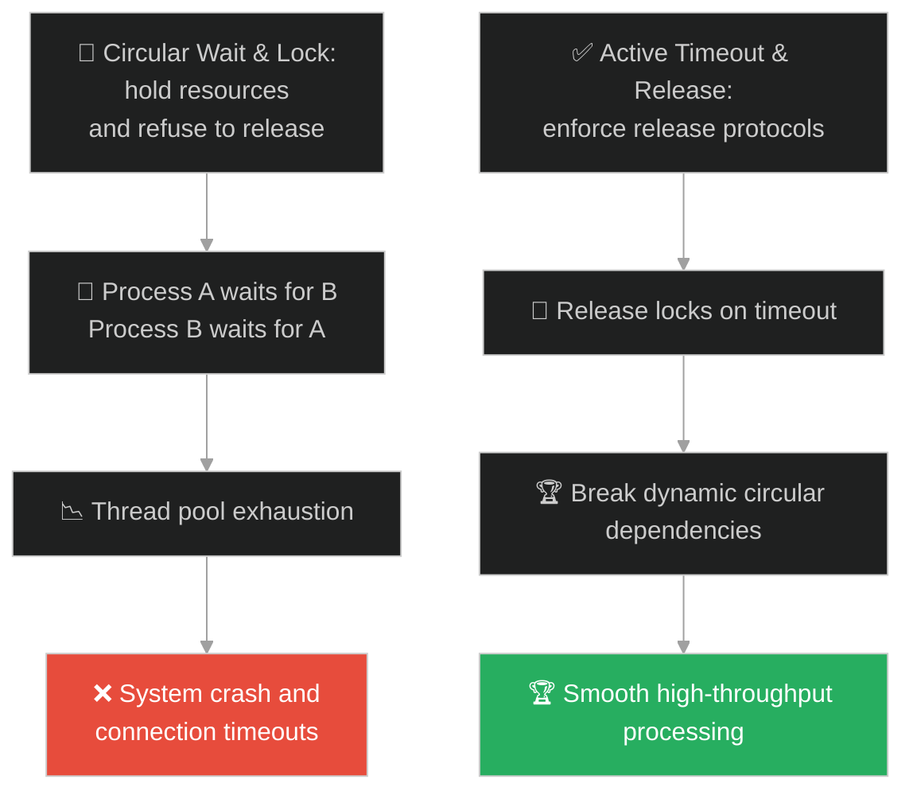
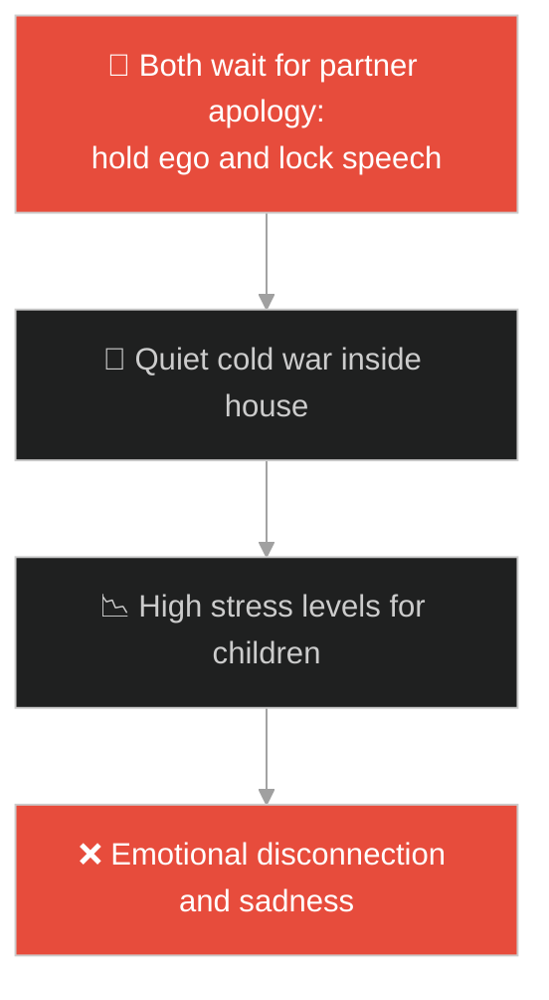
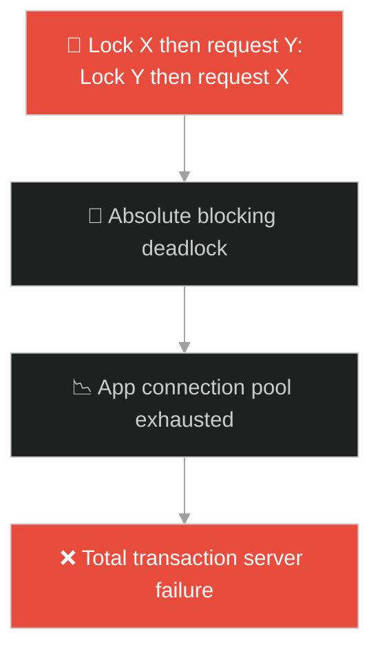
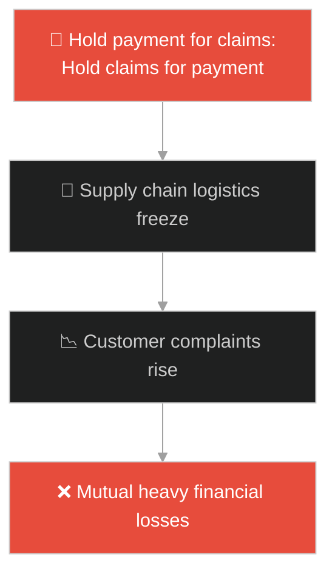
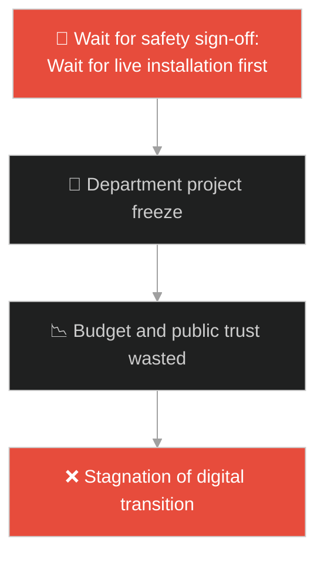
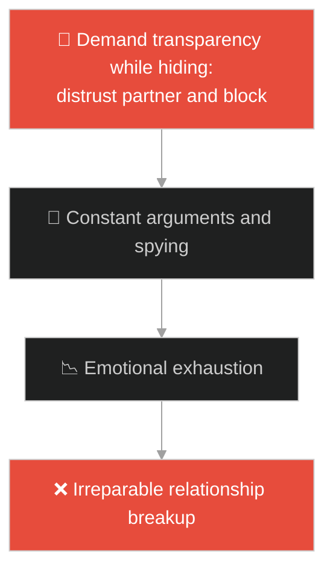
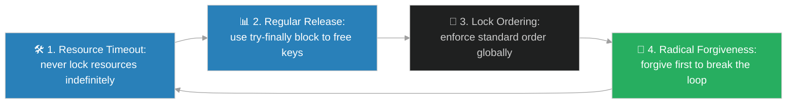

# Concurrency Deadlocks & Resource Releasing (ការគាំងដំណើរការស្ទះ និងការដោះលែងធនធាន)៖ អ្នកបម្រើដែលគ្មានចិត្តមេត្តា (Concurrency Deadlocks & Resource Releasing & Jesus and the Unforgiving Servant)

**Author:** ichamrong  
**Date:** 2026-05-28  
**Tags:** #jesus #deadlock #concurrency #resource-management #forgiveness #mutex  
**Category:** Concepts / Parables  
**Read Time:** ~15 min  

---

## 📌 មាតិកា (Table of Contents)
- [អន្ទាក់ផ្លូវចិត្ត (The Trap)](#0)
- [១. រឿងព្រេងនិទាន៖ អ្នកបម្រើដែលមិនព្រមអភ័យទោស (The Legend of the Unforgiving Servant)](#1)
  - [ការទាមទារដ៏តឹងរ៉ឹង និងការដួលរលំនៃខ្សែសង្វាក់ឥណទាន (The Cruel Arrest and Revocation of Forgiveness)](#1-1)
- [២. បញ្ហា៖ ការចងជាប់ធនធាន និងវិបត្តិគាំងរង្វិលជុំ (The Issue: Resource Lockups and Concurrency Deadlocks)](#2)
- [៣. ឧទាហមណ៍ជាក់ស្តែងក្នុងពិភពពិត (Real World Examples)](#3)
  - [ឧទាហរណ៍ទី ១ — កម្រិតស្រាល (គ្រួសារ)៖ ការឈ្លោះទាស់ទែងគ្នាមិនព្រមលែងដៃ និងការរក្សាគំនុំចាស់ៗ (Holding Long-term Grudges in a Family Argument)](#3-1)
  - [ឧទាហរណ៍ទី ២ — កម្រិតមធ្យម (បច្ចេកទេស)៖ Thread ពីរចងជាប់ Mutex គ្នាទៅវិញទៅមក (Two Threads Holding Mutexes of Each Other)](#3-2)
  - [ឧទាហរណ៍ទី ៣ — កម្រិតមធ្យម (ធុរកិច្ច)៖ ក្រុមហ៊ុនពីរមិនព្រមចុះកិច្ចព្រមព្រៀង និងទាមទារសំណងទៅវិញទៅមក (Two Businesses Holding Up Deals Awaiting Reciprocal Claims)](#3-3)
  - [ឧទាហរណ៍ទី ៤ — កម្រិតមធ្យម (សង្គម/គ្រប់គ្រង)៖ នាយកដ្ឋានពីរគាំងការងាររង់ចាំឯកសារអនុម័តពីគ្នាទៅវិញទៅមក (Two Departments Blocking Approvals Awaiting Each Other's Input)](#3-4)
  - [ឧទាហរណ៍ទី ៥ — កម្រិតធ្ងន់ (ទំនាក់ទំនង)៖ គូស្នេហ៍លាក់បាំងទូរស័ព្ទ និងមិនព្រមបើកចិត្តមុនព្រោះចាំមើលភាគីម្ខាងទៀត (Partners Demanding Total Transparency While Keeping Secrets)](#3-5)
- [៤. ដំណោះស្រាយទូទៅ៖ ការអនុវត្ត Timeout, Release, និង Circular Dependency Prevention (The General Solution: Deadlock Resolution and Resource Releasing)](#4)
- [សេចក្តីសន្និដ្ឋាន (Conclusion)](#5)
- [ឯកសារយោង (References)](#6)
- [Related Posts](#7)

---

<a id="0"></a>
## អន្ទាក់ផ្លូវចិត្ត (The Trap)

តើអ្នកធ្លាប់ជួបស្ថានភាពដែលរាល់ការងារទាំងអស់ត្រូវគាំងស្ទះទាំងស្រុង ដោយសារតែភាគីពីរនាក់មិនព្រមអត់ឱន ឬលែងដៃឱ្យគ្នាទៅវិញទៅមកដែរឬទេ? នៅក្នុងការគ្រប់គ្រងធនធាន និងទំនាក់ទំនង មនុស្សភាគច្រើនចង់បានសិទ្ធិ ឬការសម្រាលទុក្ខពីអ្នកដទៃ ប៉ុន្តែនៅពេលដល់វេនខ្លួនត្រូវផ្តល់ឱ្យអ្នកដទៃវិញ ពួកគេបែរជាក្តោបក្តាប់ជាប់ និងចងគំនុំរឿងតូចតាចទៅវិញ។

នៅក្នុងប្រព័ន្ធដំណើរការ និងការរស់នៅ៖
* **យើងងាយនឹងធ្លាក់ក្នុងអន្ទាក់** នៃការទាមទារឱ្យអ្នកដទៃដោះលែង និងផ្តល់សេរីភាពឱ្យយើងមុន (Acquire Request) ខណៈដែលដៃយើងផ្ទាល់កំពុងក្តោបក្តាប់ធនធានរបស់គេជាប់មិនព្រមលែង (Hold resource)។
* **យើងមើលរំលង** យន្តការចងគាំងជាវដ្ត (Circular Waiting) ដែលការមិនព្រមដោះលែងបំណុល ឬធនធាន នឹងទាញប្រព័ន្ធទាំងមូលឱ្យធ្លាក់ចូលទៅក្នុងភាពគាំងស្ងាត់ (Deadlock) ដែលគ្មាននរណាម្នាក់អាចទៅមុខរួចឡើយ។

ស្ថានភាពដែលភាគីពីរចងជាប់គ្នា និងរង់ចាំការលែងដៃពីគ្នាទៅវិញទៅមកដោយគ្មានទីបញ្ចប់ ហៅថា **អន្ទាក់គាំងដំណើរការ (Deadlock Trap)**។

ដើម្បីយល់ដឹងពីរបៀបដោះស្រាយ និងការពារការគាំងស្ទះធនធាន នេះជាផែនទីបង្ហាញផ្លូវ៖
1. **រឿងព្រេងនិទាន (The Legend)** — រឿងរ៉ាវរបស់អ្នកបម្រើដែលទទួលបានការលុបបំណុលរាប់ពាន់លាន តែមិនព្រមអភ័យទោសឱ្យមិត្តដែលជំពាក់លុយបន្តិចបន្តួច។
2. **បញ្ហា (The Issue)** — ការវិភាគបច្ចេកវិទ្យា concurrency deadlock, locking resources, និង circular wait។
3. **ឧទាហមណ៍ជាក់ស្តែងក្នុងពិភពពិត (Real World Examples)** — ពិនិត្យមើលបញ្ហានេះក្នុងកម្រិតគ្រួសារ បច្ចេកវិទ្យា ធុរកិច្ច ការគ្រប់គ្រង និងទំនាក់ទំនង។
4. **ដំណោះស្រាយទូទៅ (The General Solution)** — ការអនុវត្ត lock timeout, resource release, និង breaking circular dependencies។



---

<a id="1"></a>
## ១. រឿងព្រេងនិទាន៖ អ្នកបម្រើដែលមិនព្រមអភ័យទោស (The Legend of the Unforgiving Servant)

ពេត្រុសបានទូលសួរព្រះយេស៊ូវថា៖ *"តើខ្ញុំត្រូវអភ័យទោសឱ្យបងប្អូនខ្ញុំដែលធ្វើខុសនឹងខ្ញុំប៉ុន្មានដង? ៧ ដងឬ?"* ព្រះយេស៊ូវមានបន្ទូលតបថា៖ *"មិនមែនត្រឹមតែ ៧ ដងទេ គឺ ៧០ ដង គុណនឹង ៧ (គឺគ្មានដែនកំណត់)"*។ រួចទ្រង់ក៏លើកយករឿងមួយមកពន្យល់៖

មានស្តេចមួយអង្គបានកោះហៅមន្ត្រីម្នាក់មកទារបំណុល។ 
* មន្ត្រីនោះជំពាក់ស្តេចចំនួន **១០,០០០ តាលិន** (ស្មើនឹងប្រាក់មហាសាលរាប់ពាន់លានដុល្លារ នាពេលបច្ចុប្បន្ន ដែលគាត់គ្មានថ្ងៃអាចសងរួចឡើយ)។ 
* ដោយសារគាត់គ្មានអ្វីសង ស្តេចក៏បញ្ជាឱ្យលក់រូបគាត់ ប្រពន្ធ កូន និងទ្រព្យសម្បត្តិទាំងអស់ ដើម្បីដោះបំណុល។
* មន្ត្រីនោះបានក្រាបថ្វាយបង្គំយំសោកអង្វរថា៖ *"សូមលោកម្ចាស់មេត្តាអត់ធ្មត់ទុកពេលឱ្យខ្ញុំផង ខ្ញុំនឹងសងលោកម្ចាស់គ្រប់ចំនួន!"*
* ស្តេចមានព្រះទ័យក្តីអាណិតអាសូរយ៉ាងខ្លាំង ក៏សម្រេចចិត្ត **"លុបចោលបំណុលទាំងអស់នោះ"** និងដោះលែងគាត់ឱ្យមានសេរីភាពភ្លាមៗ។

<a id="1-1"></a>
### ការទាមទារដ៏តឹងរ៉ឹង និងការដួលរលំនៃខ្សែសង្វាក់ឥណទាន (The Cruel Arrest and Revocation of Forgiveness)

ទោះជាយ៉ាងណាក៏ដោយ៖
* នៅពេលមន្ត្រីនោះដើរចេញមកក្រៅ គាត់បានជួបមិត្តភក្តិរួមការងារម្នាក់ដែលជំពាក់ប្រាក់គាត់ត្រឹមតែ **១០០ ដេណារី** (ស្មើនឹងប្រាក់ឈ្នួលការងារពីរបីខែប៉ុណ្ណោះ)។
* មន្ត្រីដែលទើបតែរួចខ្លួនពីបំណុលពាន់លាន បានស្ទុះទៅចាប់កមិត្តភក្តិរបស់ខ្លួន ច្របាច់កទារប្រាក់យ៉ាងសាហាវ។
* មិត្តភក្តិនោះបានក្រាបអង្វរដូចគ្នាថា៖ *"សូមអត់ធ្មត់នឹងខ្ញុំសិនចុះ ខ្ញុំនឹងសងលោកគ្រប់ចំនួន!"*
* ប៉ុន្តែ មន្ត្រីរូបនោះមិនព្រមស្តាប់ឡើយ ហើយបានបញ្ជាឱ្យគេចាប់មិត្តភក្តិនោះដាក់គុក រហូតទាល់តែមានប្រាក់សងគ្រប់ចំនួន។
* ពេលស្តេចបានឮរឿងនេះ ទ្រង់ក៏កោះហៅមន្ត្រីនោះមកវិញ រួចបន្ទោសថា៖ *"អាបម្រើអាក្រក់! យើងបានលុបបំណុលទាំងអស់ឱ្យឯង ព្រោះឯងបានអង្វរយើង។ ចុះហេតុអ្វីបានជាឯងមិនចេះអាណិតមិត្តភក្តិឯង ដូចដែលយើងបានអាណិតឯងអញ្ចឹង?"* ទីបំផុត ស្តេចក៏បញ្ជាឱ្យចាប់មន្ត្រីនោះទៅដាក់ទណ្ឌកម្មរហូតដល់សងបំណុលចាស់រួចរាល់។

---

<a id="2"></a>
## ២. បញ្ហា៖ ការចងជាប់ធនធាន និងវិបត្តិគាំងរង្វិលជុំ (The Issue: Resource Lockups and Concurrency Deadlocks)

នៅក្នុងវិទ្យាសាស្ត្រកុំព្យូទ័រ និងការគ្រប់គ្រង concurrency ប្រសិនបើ Thread ពីរ ព្យាយាមចាប់យកសោរ (Locks/Mutexes) ពីរ ក្នុងលំដាប់ខុសគ្នា វានឹងបង្កើតជា **Deadlock**។ ភាគីម្ខាងៗកាន់កាប់ធនធានមួយ ហើយរង់ចាំភាគីម្ខាងទៀតដោះលែងធនធានរបស់ខ្លួន ដោយគ្មាននរណាម្នាក់ព្រមដោះលែងមុនឡើយ។

```python
# Bad/Fragile: Circular locking without timeout, causing a permanent deadlock (holding onto resources)
import threading
import time

lock_a = threading.Lock()
lock_b = threading.Lock()

def process_one():
    # Process 1 acquires lock A, then attempts to acquire lock B
    with lock_a:
        print("Process 1 acquired Lock A")
        time.sleep(1) # Simulating database query or work
        with lock_b:
            print("Process 1 acquired Lock B")

def process_two():
    # Process 2 acquires lock B, then attempts to acquire lock A (Circular dependency)
    with lock_b:
        print("Process 2 acquired Lock B")
        time.sleep(1)
        with lock_a:
            print("Process 2 acquired Lock A")

# Good/Resilient: Consistent lock ordering and resource release with timeouts
def process_one_safe():
    # Enforcing consistent locking order: always acquire Lock A first
    with lock_a:
        print("Process 1 acquired Lock A")
        # Use acquire with timeout to avoid permanent hanging
        acquired = lock_b.acquire(timeout=2.0)
        if acquired:
            try:
                print("Process 1 acquired Lock B")
            finally:
                lock_b.release()
        else:
            print("Could not acquire Lock B, backing off to prevent deadlock.")
```

* **ការជាប់គាំង (Deadlock State):** ប្រព័ន្ធដំណើរការនឹងគាំងទាំងស្រុង (Hangs) ហើយ CPU/Database Connection Pool នឹងត្រូវពេញដកដង្ហើមមិនរួច ធ្វើឱ្យប្រព័ន្ធទាំងមូលលែងឆ្លើយតប។
* **ភាពលាក់ពុតនៃប្រព័ន្ធ (Resource Hypocrisy):** កម្មវិធីដែលទាមទារសិទ្ធិផ្តាច់មុខ (Exclusive Locks) តែមិនព្រមដោះលែងធនធានដែលលែងប្រើ (Leaked Resources) នឹងបំផ្លាញដំណើរការរបស់កម្មវិធីដទៃទៀត។

---

<a id="3"></a>
## ៣. ឧទាហមណ៍ជាក់ស្តែងក្នុងពិភពពិត

---

<a id="3-1"></a>
### ឧទាហមណ៍ទី ១ — កម្រិតស្រាល (គ្រួសារ)៖ ការឈ្លោះទាស់ទែងគ្នាមិនព្រមលែងដៃ និងការរក្សាគំនុំចាស់ៗ (Holding Long-term Grudges in a Family Argument)

នៅក្នុងគ្រួសារមួយ ប្តីនិងប្រពន្ធបានឈ្លោះគ្នាពីរឿងរៀបចំផ្ទះ។ ទាំងប្តីទាំងប្រពន្ធមិនព្រមនិយាយរកគ្នា ឬសុំទោសមុនឡើយ ដោយរង់ចាំឱ្យភាគីម្ខាងទៀតមកសុំទោសខ្លួនមុន។ ភាពតានតឹងនេះអូសបន្លាយជាច្រើនសប្តាហ៍ ធ្វើឱ្យបរិយាកាសនៅក្នុងផ្ទះមានភាពស្មុគស្មាញ និងឈឺចាប់ដល់កូនៗ ព្រោះគ្មាននរណាម្នាក់ព្រមលែង "គំនុំ" មុនឡើយ។



---

<a id="3-2"></a>
### ឧទាហមណ៍ទី ២ — កម្រិតមធ្យម (បច្ចេកទេស)៖ Thread ពីរចងជាប់ Mutex គ្នាទៅវិញទៅមក (Two Threads Holding Mutexes of Each Other)

នៅក្នុងប្រព័ន្ធធនាគារ Thread ទី ១ ចង់ផ្ទេរប្រាក់ពីគណនី X ទៅ Y (ចាក់សោរគណនី X រួចព្យាយាមចាក់សោ Y)។ ក្នុងពេលជាមួយគ្នា Thread ទី ២ ចង់ផ្ទេរពី Y ទៅ X (ចាក់សោ Y រួចព្យាយាមចាក់សោ X)។ ប្រព័ន្ធមិនបានប្រើប្រាស់ timeout ឡើយ ធ្វើឱ្យ Thread ទាំងពីរកកស្ទះជារៀងរហូត ហើយប្រតិបត្តិការទាំងអស់របស់អតិថិជនត្រូវគាំងនៅទីនោះ។



---

<a id="3-3"></a>
### ឧទាហមណ៍ទី ៣ — កម្រិតមធ្យម (ធុរកិច្ច)៖ ក្រុមហ៊ុនពីរមិនព្រមចុះកិច្ចព្រមព្រៀង និងទាមទារសំណងទៅវិញទៅមក (Two Businesses Holding Up Deals Awaiting Reciprocal Claims)

ក្រុមហ៊ុនលក់ទំនិញ និងក្រុមហ៊ុនដឹកជញ្ជូន ជួបវិវាទនឹងគ្នាពីរឿងទំនិញខូចខាត។ ក្រុមហ៊ុនលក់មិនព្រមទូទាត់លុយថ្លៃដឹកជញ្ជូនចាស់ រហូតទាល់តែក្រុមហ៊ុនដឹកទូទាត់សំណងការខូចខាត។ ក្រុមហ៊ុនដឹកជញ្ជូនក៏មិនព្រមដឹកទំនិញថ្មី និងមិនព្រមសងសំណង រហូតទាល់តែបានលុយចាស់។ ការគាំងស្ទះនេះធ្វើឱ្យអាជីវកម្មទាំងពីរត្រូវខាតបង់អតិថិជន និងបាត់បង់ប្រាក់ចំណូលដូចគ្នា។



---

<a id="3-4"></a>
### ឧទាហមណ៍ទី ៤ — កម្រិតមធ្យម (សង្គម/គ្រប់គ្រង)៖ នាយកដ្ឋានពីរគាំងការងាររង់ចាំឯកសារអនុម័តពីគ្នាទៅវិញទៅមក (Two Departments Blocking Approvals Awaiting Each Other's Input)

នៅក្នុងស្ថាប័នរដ្ឋមួយ នាយកដ្ឋានអភិវឌ្ឍន៍បច្ចេកវិទ្យា មិនព្រមដំឡើងកម្មវិធីថ្មី រហូតទាល់តែនាយកដ្ឋានសន្តិសុខចេញលិខិតបញ្ជាក់សុវត្ថិភាព។ ប៉ុន្តែនាយកដ្ឋានសន្តិសុខក៏មិនព្រមចេញលិខិតបញ្ជាក់ រហូតទាល់តែនាយកដ្ឋានបច្ចេកវិទ្យាដំឡើងប្រព័ន្ធសាកល្បងឱ្យពួកគេមើលជាមុន។ ការងារត្រូវជាប់គាំងរយៈពេល ១ ឆ្នាំពេញ ព្រោះគ្មាននាយកដ្ឋានណាមួយព្រមសម្របសម្រួលមុនឡើយ។



---

<a id="3-5"></a>
### ឧទាហមណ៍ទី ៥ — កម្រិតធ្ងន់ (ទំនាក់ទំនង)៖ គូស្នេហ៍លាក់បាំងទូរស័ព្ទ និងមិនព្រមបើកចិត្តមុនព្រោះចាំមើលភាគីម្ខាងទៀត (Partners Demanding Total Transparency While Keeping Secrets)

គូស្នេហ៍មួយគូជួបវិបត្តិសង្ស័យគ្នា។ ប្តីទាមទារឱ្យប្រពន្ធបើកទូរស័ព្ទឱ្យឆែកមើលរាល់ថ្ងៃ តែខ្លួនឯងលាក់លេខកូដទូរស័ព្ទមិនឱ្យនាងដឹងឡើយ។ ប្រពន្ធក៏សម្រេចចិត្តបិទទ្វារចិត្តមិនព្រមចែករំលែករឿងរ៉ាវអ្វីទាំងអស់ រហូតទាល់តែប្តីបង្ហាញភាពស្មោះត្រង់មុន។ ការគុំកួន និងរង់ចាំការបើកចិត្តពីភាគីម្ខាងទៀតនេះ បង្កើតជាស្នាមប្រេះឆាដែលមិនអាចព្យាបាលបាន។



---

<a id="4"></a>
## ៤. ដំណោះស្រាយទូទៅ៖ ការអនុវត្ត Timeout, Release, និង Circular Dependency Prevention (The General Solution: Deadlock Resolution and Resource Releasing)

ដើម្បីការពារ និងដោះស្រាយបញ្ហាគាំងដំណើរការស្ទះធនធាន យើងត្រូវអនុវត្តវិធានការដោះលែង៖



1. **ការកំណត់ពេលវេលាផុតកំណត់ (Apply Timeouts):** មិនត្រូវអនុញ្ញាតឱ្យដំណើរការ ឬការរង់ចាំណាមួយប្រព្រឹត្តទៅដោយគ្មានទីបញ្ចប់ឡើយ។ ប្រសិនបើអស់រយៈពេលកំណត់ (Timeout) ត្រូវតែដោះលែងសោរ (Release Lock) ហើយដកថយ (Back off)។
2. **ការធានាការដោះលែងធនធាន (Guaranteed Resource Release):** ប្រើប្រាស់ `try-finally` block ឬ contextual handlers (`with` statement) ដើម្បីធានាថា មិនថាកម្មវិធីជួបកំហុសអ្វីក៏ដោយ ក៏ធនធានត្រូវតែដោះលែងមកវិញជានិច្ច។
3. **កំណត់លំដាប់នៃការចាក់សោ (Consistent Lock Ordering):** ប្រសិនបើត្រូវការធនធានច្រើន ត្រូវតម្រូវឱ្យគ្រប់ផ្នែកទាំងអស់ស្នើសុំធនធានតាមលំដាប់លំដោយដូចគ្នា (ឧទាហរណ៍ យក A មុន ទើបយក B) ដើម្បីការពារការចងវដ្ត (Circular Wait)។
4. **ការអភ័យទោសមុនដើម្បីបំបែករង្វង់ (Radical Forgiveness):** នៅក្នុងជីវិត និងអាជីវកម្ម ត្រូវមានស្មារតីអត់ឱន និងអភ័យទោសចំពោះកំហុសតូចតាចជាមុន ដើម្បីបំបែករង្វង់ចងគំនុំ និងបើកផ្លូវឱ្យការសហការអាចទៅមុខរួច។

---

## 🐇 ធ្លាក់ចូលក្នុងរន្ធទន្សាយ (Enter the Rabbit Hole)

ដើម្បីយល់ដឹងពីរបៀបដែលគោលការណ៍សមធម៌ និងកិច្ចសន្យាការងារច្បាស់លាស់ (Equality vs Equity & Time/Materials Contracts) ជួយការពារការយល់ច្រឡំ និងជម្លោះក្នុងការបែងចែកផលលាភការងារ សូមបន្តដំណើរទៅកាន់៖

* 🚀 **[ចាប់ផ្តើមដំណើររុករក (Start the Journey) ➔ The Parable of the Workers in the Vineyard](./184-jesus-and-the-workers-in-the-vineyard.md)**

---

<a id="5"></a>
## សេចក្តីសន្និដ្ឋាន (Conclusion)

> **«អ្នកដែលមិនព្រមដោះលែងបំណុលតូចតាចរបស់អ្នកដទៃ នឹងត្រូវជាប់ឃុំនៅក្នុងគុកនៃគំនុំរបស់ខ្លួន ដែលមិនអាចរួចខ្លួនបានឡើយ»**

ការដោះលែងធនធាន (Resource Releasing) និងការអភ័យទោសឱ្យគ្នា មិនមែនជាការខាតបង់នោះទេ តែវាជាយន្តការដ៏ឆ្លាតវៃបំផុតដើម្បីការពារការគាំងដំណើរការ (Deadlock) និងរក្សាឱ្យប្រព័ន្ធការងាររត់ទៅមុខដោយរលូន និងមានសន្តិភាព។

---

<a id="6"></a>
## ឯកសារយោង (References)

* **Matthew 18:21–35** — *The Parable of the Unforgiving Servant*, Holy Bible. The key text on forgiveness and reciprocity.
* **Coffman, E. G., Elphick, M. J., & Shoshani, A.** — *System Deadlocks* (1971). ACM Computing Surveys. The foundational research defining the four conditions of deadlocks.

---

<a id="7"></a>
## Related Posts

* [[Observability & Edge-case Exception Tracing](./182-jesus-and-the-lost-sheep.md)] — របៀបតាមដាន និងរកឱ្យឃើញរាល់កំហុសឆ្គងតូចតាចនៅក្នុងប្រព័ន្ធ។
* [[Equality vs Equity & Time/Materials Contracts](./184-jesus-and-the-workers-in-the-vineyard.md)] — ការយល់ដឹងពីតុល្យភាពនៃការទូទាត់តម្លៃការងារ និងការគោរពតាមកិច្ចសន្យា។
